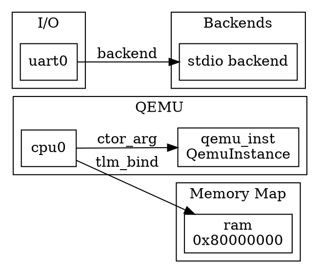
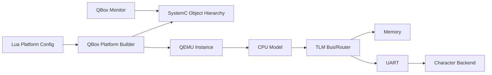

# QBox Development Skill

## Purpose

Use this skill for QBox development tasks involving:

- QBox / qbox virtual platform development
- SystemC / TLM-2.0 modeling
- QEMU co-simulation
- `libqbox`
- `libqemu-cxx`
- qbox SystemC components
- qbox QEMU components
- Lua platform configuration
- CCI parameters
- QEMU instance setup
- CPU / memory / interrupt-controller / UART modeling
- TLM socket binding
- IRQ wiring
- character backends
- qbox monitor
- runtime object inspection
- Graphviz / DOT / Mermaid architecture diagrams
- CMake preset build/test/debug workflows

This skill assumes QBox is a SystemC/QEMU virtual platform framework where QEMU models and SystemC/TLM models are composed into a simulation platform.

---

## Core Behavior

When this skill is active:

1. Inspect before editing.
2. Do not guess qbox APIs.
3. Search existing source, examples, docs, and platform Lua files before adding code.
4. Preserve SystemC timing and TLM semantics.
5. Preserve QEMU argument and CCI parameter conventions.
6. Preserve existing Lua platform structure and object names where possible.
7. Prefer small, targeted changes.
8. Prefer focused build/test commands before full builds.
9. For diagrams, distinguish parsed relationships from inferred relationships.
10. Always report files inspected, files changed, commands run, results, and remaining risks.

---

## Expected Repository Areas

Common qbox repository areas may include:

```text
README.md
CMakeLists.txt
CMakePresets.json

docs/
examples/
platforms/
tests/
scripts/

libqbox/
libqemu-cxx/
systemc-components/
qemu-components/
```

Do not assume the exact structure. Inspect the repository first.

---

## Initial Inspection Checklist

Start with lightweight inspection.

```bash
pwd
git status --short
find . -maxdepth 3 -name 'README.md' -o -name 'CMakePresets.json' -o -name 'CMakeLists.txt'
find . -maxdepth 3 -type d | sort | sed -n '1,160p'
find . -maxdepth 4 -name '*.lua' | sort | sed -n '1,160p'
```

Search for qbox/SystemC/QEMU patterns:

```bash
grep -R "QemuInstanceManager\|QemuInstance\|moduletype\|dylib_path\|backend_socket\|biflow_socket\|target_socket\|initiator_socket" -n \
  README.md docs examples platforms tests libqbox libqemu-cxx systemc-components qemu-components 2>/dev/null | head -240
```

Search for SystemC/TLM patterns:

```bash
grep -R "SC_MODULE\|SC_CTOR\|SC_HAS_PROCESS\|SC_THREAD\|SC_METHOD\|sc_module\|sc_time\|tlm::\|tlm_utils" -n \
  . 2>/dev/null | head -240
```

Search for monitor/backend/debug support:

```bash
grep -R "monitor\|server_port\|qk_status\|transport_dbg\|char_backend\|stdio\|socket\|sigquit\|expect" -n \
  README.md docs examples platforms tests systemc-components qemu-components libqbox 2>/dev/null | head -240
```

---

## Build Workflow

Prefer CMake presets if available.

```bash
cmake --list-presets
cmake --preset gcc
cmake --build --preset gcc --parallel
ctest --preset gcc --output-on-failure
```

If `gcc` preset does not exist, inspect available presets and choose the closest project-supported preset.

```bash
cmake --list-presets
```

For focused testing:

```bash
ctest --preset gcc -R <test-name> --output-on-failure
```

Fallback only after checking project docs:

```bash
cmake -B build -DCMAKE_BUILD_TYPE=Release
cmake --build build --parallel
ctest --test-dir build --output-on-failure
```

Do not invent build flags. Inspect `README.md`, `CMakePresets.json`, CI scripts, and docs first.

---

## Safe Build/Test Policy

Prefer targeted commands:

```bash
cmake --build --preset <preset> --target <target>
ctest --preset <preset> -R <test-name> --output-on-failure
```

Avoid unless requested or justified:

```bash
rm -rf build
git clean -xfd
large full rebuilds
large generated artifact deletion
```

If a full rebuild is necessary, explain why.

---

## QBox Architecture Inspection

When asked to understand a qbox platform, identify:

```text
Platform entry file
Lua configuration files
QemuInstanceManager
QemuInstance
QEMU target architecture
CPU models
Memory regions
Address router / decoder
Interrupt controller
Timer devices
UART devices
Character backends
Monitor server
TLM socket bindings
IRQ bindings
CCI parameters
QEMU command-line arguments
```

Useful commands:

```bash
find platforms examples tests -name '*.lua' -print 2>/dev/null
grep -R "QemuInstance\|router\|gic\|plic\|nvic\|uart\|memory\|ram\|rom\|backend" -n platforms examples tests docs 2>/dev/null | head -240
```

---

## Lua Platform Configuration Checklist

When changing qbox Lua platform files, verify:

1. Object names are unique.
2. `moduletype` names exist.
3. `dylib_path` is valid if used.
4. Constructor `args` point to valid objects.
5. `qemu_inst` references are valid.
6. TLM bind targets exist.
7. IRQ bind targets exist.
8. Memory `address` and `size` are valid.
9. Memory ranges do not unintentionally overlap.
10. UART backend wiring is valid.
11. CCI parameter names match the component implementation.
12. QEMU arguments are consistent with the selected QEMU target.
13. Monitor port/socket options do not conflict with existing services.

Common Lua fields to inspect:

```text
moduletype
dylib_path
args
bind
address
size
qemu_inst
qemu_args
backend_socket
biflow_socket
target_socket
initiator_socket
gdb_port
server_port
```

Common checks:

```bash
grep -R "moduletype\|dylib_path\|args\|bind\|address\|size\|qemu_inst\|qemu_args" -n platforms examples tests 2>/dev/null
grep -R "backend_socket\|biflow_socket\|target_socket\|initiator_socket" -n platforms examples tests 2>/dev/null
```

---

## TLM/SystemC Rules

When modifying SystemC/TLM code:

1. Preserve socket direction.
   - Initiator sockets initiate transactions.
   - Target sockets receive transactions.
2. Preserve address decoding behavior.
3. Preserve timing annotation behavior.
4. Preserve delta-cycle behavior.
5. Avoid changing `sc_time` units without justification.
6. Avoid global `sc_stop()` behavior changes unless requested.
7. Avoid unsafe object lifetimes.
8. Avoid dangling references to payloads, extensions, events, or dynamically allocated modules.
9. Do not introduce host wall-clock timing where simulation time is required.
10. Keep C++ standard compatibility consistent with the repository.

Search for existing component patterns:

```bash
grep -R "tlm_utils::simple_target_socket\|tlm_utils::simple_initiator_socket\|b_transport\|transport_dbg\|get_direct_mem_ptr" -n \
  systemc-components qemu-components libqbox examples tests 2>/dev/null | head -240
```

---

## TLM Transaction Review Checklist

For TLM-2.0 components, check:

```text
b_transport implementation
transport_dbg implementation
get_direct_mem_ptr implementation if present
nb_transport_fw / nb_transport_bw if present
payload address handling
payload data pointer handling
payload data length handling
byte enable handling
streaming width handling
read/write command handling
response status
timing annotation
DMI invalidation
endianness assumptions
alignment assumptions
address range checking
```

Minimal target behavior should set an appropriate response status:

```cpp
trans.set_response_status(tlm::TLM_OK_RESPONSE);
```

On error, use an appropriate TLM error response, not silent success.

---

## QEMU Integration Checklist

When working with qbox/QEMU integration, identify:

```text
QEMU target
QEMU binary or library path
QEMU machine type
CPU type
QEMU arguments
QEMU device objects
GDB port
TCG mode
icount mode
synchronization policy
memory backends
interrupt lines
virtio devices
PCI devices
```

Be careful with:

- deterministic execution assumptions
- `icount`
- multi-threaded TCG
- QEMU device model naming
- GDB port conflicts
- host networking
- file/socket backends
- QEMU command-line argument ordering

Do not change QEMU execution mode, `icount`, or threading policy without explaining determinism/performance implications.

---

## CCI Parameter Workflow

When a task involves configuration parameters:

1. Search existing parameter definitions.
2. Identify parameter names and types.
3. Check whether values come from Lua, command line, defaults, or environment.
4. Verify final value at runtime if possible.
5. Avoid renaming parameters unless all references are updated.

Search:

```bash
grep -R "cci::\|cci_param\|cci_broker\|cci_value\|cci_originator" -n \
  libqbox systemc-components qemu-components examples tests docs 2>/dev/null | head -240
```

---

## UART / Character Backend Workflow

Use this workflow for serial console, shell, stdio, socket, or termination issues.

Identify:

```text
UART component
backend component
backend type
backend_socket
biflow_socket
stdio/socket/file backend
sigquit behavior
expected quit byte or command
host port
terminal mode
```

Search:

```bash
grep -R "char_backend\|backend_socket\|biflow_socket\|sigquit\|stdio\|socket\|file\|expect" -n \
  docs platforms examples tests systemc-components qemu-components libqbox 2>/dev/null | head -240
```

Check:

1. UART `backend_socket` is bound.
2. Backend `biflow_socket` is bound.
3. Host socket port is not already used.
4. Stdio backend does not conflict with interactive CLI behavior.
5. Exit/stop behavior is documented.
6. `sigquit` or equivalent stop mechanism is intentional.

Do not change termination behavior without explaining how users should exit the simulation.

---

## QBox Monitor Workflow

Use qbox monitor when available for runtime inspection.

Potential monitor capabilities may include:

```text
simulation time
pause
continue
object hierarchy
CCI parameter inspection
quantum keeper status
TLM debug memory access
WebSocket-backed biflow streams
```

Search for monitor docs and endpoints:

```bash
grep -R "monitor\|server_port\|/object\|/pause\|/continue\|/sc_time\|/qk_status\|transport_dbg\|biflow" -n \
  README.md docs examples platforms tests systemc-components qemu-components libqbox 2>/dev/null | head -240
```

If monitor is enabled, use it to confirm runtime hierarchy instead of relying only on static Lua parsing.

When reporting monitor-derived data, distinguish:

```text
static Lua configuration
C++ construction-time hierarchy
runtime SystemC object hierarchy
inferred relationship
```

---

## Object Graph / Diagram Workflow

For qbox platform diagrams, output Graphviz DOT first.

Supported outputs:

```text
Graphviz DOT
SVG if graphviz dot is installed
Mermaid graph
Markdown explanation
JSON intermediate graph
```

Recommended filenames:

```text
out/qbox-platform.dot
out/qbox-platform.svg
out/qbox-platform.md
out/qbox-platform.json
```

Input source priority:

1. Runtime qbox monitor object hierarchy, if available.
2. Lua platform configuration.
3. C++ SystemC construction code.
4. Elaboration logs.
5. Inference from naming conventions as last resort.

Graph node types:

```text
qemu_instance
qemu_instance_manager
cpu
interrupt_controller
router
memory
rom
ram
uart
backend
timer
pci_host
pci_device
virtio_device
smmu
monitor
loader
clock
reset
unknown
```

Graph edge types:

```text
ctor_arg
tlm_bind
irq
reset
backend
memory_map
qemu_device
monitor_endpoint
cci_param
inferred
```

Always label inferred edges as inferred.

---

## DOT Graph Style

Use clusters when helpful:

```text
cluster_qemu
cluster_cpu
cluster_memory
cluster_interrupts
cluster_io
cluster_backends
cluster_monitor
```

Keep DOT portable and simple unless styling is requested.

Example DOT skeleton:



Validate DOT if `dot` is installed:

```bash
dot -Tsvg qbox-platform.dot -o qbox-platform.svg
```

If `dot` is not installed, still create DOT and explain that SVG generation was not performed.

---

## Lua Static Graph Extraction

When asked to generate a graph from Lua, extract:

```text
object name
moduletype
dylib_path
args
address
size
bind
IRQ references
backend_socket references
biflow_socket references
target_socket references
initiator_socket references
CCI parameters
QEMU arguments
```

Search:

```bash
find platforms examples tests -name '*.lua' | sort
grep -R "moduletype\|dylib_path\|args\|bind\|address\|size\|backend_socket\|biflow_socket\|target_socket\|initiator_socket" -n \
  platforms examples tests 2>/dev/null
```

Graph rules:

```text
args reference        -> ctor_arg edge
bind target_socket    -> tlm_bind edge
bind initiator_socket -> tlm_bind edge
IRQ-like bind         -> irq edge
backend_socket        -> backend edge
biflow_socket         -> backend edge
address/size object   -> memory_map label
qemu_inst reference   -> qemu_device or ctor_arg edge
```

Do not claim the static graph is the full runtime hierarchy.

---

## Platform Bring-up Debugging

For boot or bring-up issues, inspect:

```text
QEMU target
machine type
CPU type
reset vector
bootloader
kernel image
device tree
initrd
memory map
UART console
interrupt controller
timer
virtio devices
block devices
network devices
qemu_args
```

Search:

```bash
grep -R "kernel\|dtb\|initrd\|Image\|u-boot\|bootloader\|console\|root=" -n platforms examples docs tests 2>/dev/null | head -240
```

Checklist:

1. CPU starts at expected reset vector.
2. Memory map contains boot image.
3. Device tree matches virtual platform.
4. UART console path is correct.
5. Interrupt controller wiring is correct.
6. Timer IRQs are connected.
7. Kernel command line uses correct console.
8. Root filesystem or initrd path exists.
9. QEMU args match architecture.
10. Simulation stop/exit path is known.

---

## Memory Map Review

For address map changes:

1. List all regions.
2. Check address and size.
3. Check overlap.
4. Check alignment.
5. Check target socket binding.
6. Check whether QEMU and SystemC agree on the same map.
7. Check device tree if booting Linux.
8. Check documentation/diagram updates.

Useful output format:

```text
Region      Base        Size        Target      Notes
RAM         0x80000000  0x40000000  ram         main memory
UART0       0x09000000  0x00001000  uart0       console
GIC         0x08000000  0x00100000  gic         interrupt controller
```

---

## IRQ Wiring Review

For interrupt issues:

1. Identify interrupt controller type.
2. Identify device interrupt output.
3. Identify target interrupt input.
4. Check SPI/PPI/line number mapping.
5. Check polarity/level/edge semantics if modeled.
6. Check device tree interrupt cells if Linux is used.
7. Check timer IRQ wiring.
8. Check UART IRQ wiring.

Search:

```bash
grep -R "irq\|IRQ\|interrupt\|gic\|plic\|nvic" -n platforms examples docs systemc-components qemu-components libqbox 2>/dev/null | head -240
```

---

## Adding a Minimal SystemC TLM Peripheral

Before adding a new peripheral:

1. Find existing peripheral examples.
2. Copy project style.
3. Confirm component registration mechanism.
4. Confirm Lua `moduletype` naming convention.
5. Confirm build target and library linkage.
6. Confirm TLM socket conventions.
7. Confirm CCI parameter conventions.
8. Add focused test or example.

Implementation checklist:

```text
C++ header/source
CMake target
SystemC module declaration
target socket
address range handling
read/write behavior
response status
optional transport_dbg
component registration
Lua platform instance
router/memory-map binding
test or example
documentation/diagram update
```

Do not add a broad framework abstraction for one peripheral unless requested.

---

## Adding or Editing Lua Platform Components

When adding a component to Lua:

1. Use existing style.
2. Place object in the correct section.
3. Use existing `moduletype` naming style.
4. Add constructor `args` if required.
5. Add `bind` section if required.
6. Add `address` and `size` for memory-mapped devices.
7. Add IRQ binding if needed.
8. Add backend binding if needed.
9. Add comments for non-obvious wiring.
10. Run a syntax/build/test check.

Example conceptual structure:

```lua
platform.my_device = {
    moduletype = "my_device",
    args = {
        "&platform.qemu_inst",
    },
    address = 0x10000000,
    size = 0x1000,
    bind = {
        target_socket = "&platform.router.initiator_socket",
        irq = "&platform.gic.spi[42]",
    },
}
```

Do not use this exact structure blindly. Match the repository's actual conventions.

---

## Debugging Build Failures

When a build fails:

1. Capture the exact failing command.
2. Identify the target.
3. Identify whether failure is configure, compile, link, test, or runtime.
4. Inspect include paths and libraries.
5. Check SystemC/QEMU dependency discovery.
6. Check C++ standard mismatch.
7. Check generated files.
8. Check preset differences.
9. Apply minimal fix.
10. Re-run the smallest failing target.

Useful commands:

```bash
cmake --list-presets
cmake --build --preset <preset> --verbose
ctest --preset <preset> -R <test> --output-on-failure
```

---

## Debugging Runtime Failures

When a qbox simulation fails at runtime:

1. Capture full command.
2. Capture stdout/stderr.
3. Identify platform Lua file.
4. Identify QEMU target and args.
5. Check dynamic library paths.
6. Check component registration errors.
7. Check Lua syntax/config errors.
8. Check socket binding errors.
9. Check memory map overlap.
10. Check port conflicts.
11. Check monitor/stdio/socket backend conflicts.
12. Check missing image/kernel/dtb/rootfs files.

Search logs for:

```text
error
fatal
assert
bind
socket
port
address
overlap
moduletype
dylib
qemu
lua
sc_report
```

---

## Documentation Workflow

When asked to document qbox architecture:

Include:

```text
High-level architecture
Repository structure
Build flow
Platform configuration flow
QEMU integration
SystemC/TLM component model
Lua object model
Memory map
IRQ routing
UART/backend flow
Monitor/debugging flow
Known limitations
How to run
How to stop
How to debug
```

Prefer diagrams:

```text
Mermaid for Markdown
Graphviz DOT for precise object graph
Sequence diagram for boot/runtime interaction
Tables for memory map and IRQ map
```

Mermaid high-level example:



---

## Natural-Language Trigger Examples

This skill should activate for requests like:

```text
qbox 구조 분석해줘.
qbox platform lua를 Graphviz DOT으로 만들어줘.
qbox에서 UART backend 연결 구조 확인해줘.
qbox shell 종료 방법 찾아줘.
SystemC TLM peripheral 하나 추가해줘.
QemuInstance와 QemuInstanceManager 사용 흐름 설명해줘.
qbox CMake preset 빌드 실패 수정해줘.
qbox monitor로 object hierarchy 확인하는 방법 알려줘.
qbox Lua config에서 memory map overlap 확인해줘.
qbox에서 IRQ wiring 분석해줘.
qbox virtual platform boot failure 원인 찾아줘.
```

---

## Safe Editing Rules

Do not:

```text
Guess qbox APIs.
Change QEMU args without explanation.
Change synchronization mode without explanation.
Change icount/TCG mode without explanation.
Rename Lua objects unnecessarily.
Reverse TLM socket direction.
Silently change memory map.
Silently change IRQ numbers.
Silently change UART/backend behavior.
Disable assertions without explanation.
Perform broad refactors for small tasks.
Delete build artifacts without reason.
```

Prefer:

```text
Small edits.
Existing patterns.
Focused tests.
Static graph before runtime graph if runtime is unavailable.
Runtime monitor data when available.
Clear distinction between parsed and inferred relationships.
```

---

## Final Response Format

When responding after using this skill, use this format:

```text
Summary
Detected qbox context
Files inspected
Files changed
Commands run
Build/test/simulation result
Root cause, if debugging
Generated artifacts, if any
Remaining risks
Next recommended command
```

If no files were changed:

```text
Files changed: none
```

If no commands were run:

```text
Commands run: none
```

If runtime monitor data was unavailable:

```text
Runtime monitor data: unavailable; analysis is based on static repository inspection.
```

If graph edges were inferred:

```text
Graph note: edges labeled inferred were not directly parsed from runtime monitor data or explicit Lua bind entries.
```

---

## Minimal Subagent Pairing Recommendation

For best results, pair this skill with a custom Codex subagent named `qbox_dev`.

Suggested invocation shape:

```text
Spawn qbox_dev with $qbox-dev. Inspect first, avoid guessing qbox/SystemC APIs, make the smallest safe change, run the narrowest relevant build/test/simulation command, and return files inspected, files changed, commands run, results, and remaining risks.
```

This skill can also be used without a subagent, but non-trivial qbox/SystemC/QEMU tasks benefit from a dedicated `qbox_dev` agent.
