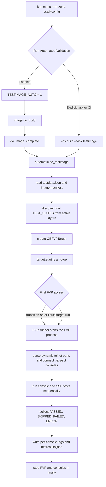

# Arm Zena CSS FVP의 OEQA Runtime Validation 구조 분석

## 1. 문서 목적

이 문서는 Arm Zena CSS RD-Aspen FVP에서 Yocto/OpenEmbedded의 OEQA
runtime validation이 다음 항목을 어떤 방식으로 연결하는지 설명한다.

- Kconfig와 kas를 통한 테스트 실행 선택
- BitBake `testimage` task의 자동/명시적 호출
- FVP 실행용 `.fvpconf` 생성
- `OEFVPTarget`의 FVP 프로세스, 콘솔, SSH 제어
- 활성 Yocto layer에서 runtime test를 검색하고 선택하는 방식
- 테스트 순서, 의존성, skip, timeout, 실패 판정
- 로컬 실행과 GitLab CI 실행의 차이
- 로그와 JSON 결과물의 위치

분석 대상은 아래 checkout이다.

| 영역 | 기준 |
| --- | --- |
| `arm-zena-css/` | `v2.2`, `bf34d9e71f674e11beea3b8e84ea54486f555d2a` |
| `sw-ref-stack/` | `v2.2`, `a42c7d9dee23dc929f1656d681845956dbc7d13b` |
| `layers/poky/` | `yocto-5.2.4`, `d0b46a6624ec9c61c47270745dd0b2d5abbe6ac1` |
| `layers/meta-arm/` | `a6fb9378b38f131a05f60ab01292fadeaa4eb433` |

현재 상위 workspace의 활성 설정은 `MACHINE = "apollo-qvp"`이다. 따라서
이 문서의 `fvp-rd-aspen` 설명은 현재 활성 QVP 빌드 설명이 아니라
`arm-zena-css` 원본 FVP validation 경로에 대한 분석이다.

## 2. 핵심 결론

Arm Zena CSS의 FVP runtime validation은 별도 테스트 프로그램이 FVP를
직접 실행하는 구조가 아니다. Yocto image recipe의 `do_testimage`가 전체
제어 plane 역할을 하고, meta-arm의 FVP 실행 정보를 재사용하는 구조다.

1. `kas menu arm-zena-css/Kconfig`에서 `Run Automated Validation`을
   선택하면 `RUN_TESTS=y`가 되고 `TESTIMAGE_AUTO="1"`이 kas/BitBake
   설정으로 전달된다.
2. image build는 rootfs, package manifest, `*.testdata.json`,
   `*.fvpconf`를 생성한다.
3. `TESTIMAGE_AUTO="1"`이면 `do_testimage`가 `do_image_complete` 뒤와
   `do_build` 앞에 자동 삽입된다. 자동 실행을 끄고
   `kas build ... --task testimage`로 명시적으로 실행할 수도 있다.
4. `do_testimage`는 최종 `TEST_SUITES`와 활성 `BBLAYERS`를 이용해
   runtime test module을 검색하고 suite를 구성한다.
5. `TEST_TARGET="OEFVPTarget"`이므로 meta-arm controller가 선택된다.
6. controller는 `.fvpconf`로 FVP를 실행하고, FVP가 동적으로 연
   telnet console port마다 `pexpect` 세션을 만든다. Linux command는
   `127.0.0.1:2222`로 port-forward된 SSH를 사용한다.
7. OEQA가 test case를 순차 실행하고 console summary,
   `log.do_testimage.*`, per-console log, `testresults.json`을 남긴다.

특히 FVP 실행은 `do_testimage` 시작과 동시에 일어나지 않는다.
`OEFVPTarget.start()`는 no-op이고, test case가
`transition("on")`, `transition("linux")` 또는 `target.run()`을 처음
호출할 때 실제 FVP가 지연 기동된다.

## 3. 전체 실행 흐름



흐름의 소스 근거는 다음과 같다.

- Kconfig 선택: `arm-zena-css/Kconfig:124-171`
- `testimage` class 활성화: `arm-zena-css/yocto/kas/zena-css-bsp.yml:223-237`
- 자동 task 삽입: `layers/poky/meta/classes-recipe/testimage.bbclass:485-487`
- runtime context 구성과 실행:
  `layers/poky/meta/classes-recipe/testimage.bbclass:175-405`
- FVP 상태 전이:
  `layers/meta-arm/meta-arm/lib/oeqa/controllers/fvp.py:41-82`

## 4. 실행 진입점

### 4.1 개발자 로컬 실행

사용자 문서가 안내하는 기본 진입점은 다음과 같다.

```console
kas menu arm-zena-css/Kconfig
```

메뉴에서 FVP EULA를 수락하고 use case, RD-Aspen variant,
`Run Automated Validation`을 선택한 뒤 `Build`를 실행한다.
같은 설정의 재실행은 다음 명령이다.

```console
kas build
```

`RUN_TESTS`가 선택되면 Kconfig의 `TESTIMAGE_AUTO` 값이 `"1"`이 된다.
Poky `testimage.bbclass`의 anonymous Python은 이 값이 true일 때
`do_testimage`를 image build graph에 자동 삽입한다.

따라서 이 경로에서는 사용자가 `-c testimage`를 직접 지정하지 않아도
image build가 끝난 뒤 runtime validation이 이어서 실행된다.

근거:

- `arm-zena-css/Kconfig:127-130,168-172`
- `arm-zena-css/documentation/user_guide/reproduce.rst:209-239`
- `arm-zena-css/documentation/user_guide/reproduce.rst:3698-3731`
- `layers/poky/meta/classes-recipe/testimage.bbclass:16-19,485-487`

### 4.2 명시적 `testimage` 실행

자동 실행을 사용하지 않는 경우에는 image를 먼저 만든 뒤
`testimage` task를 명시적으로 호출한다.

```console
kas build <merged-kas-config> --task testimage
```

BitBake shell 안에서는 동일한 의미로 다음 형태를 사용할 수 있다.

```console
bitbake <image> -c testimage
```

Arm Zena CSS와 sw-ref-stack의 GitLab CI는 build stage에서 생성한
산출물을 test stage로 가져온 뒤 이 명시적 방식을 사용한다. 이 구조는
image 생성과 수 시간의 FVP runtime test를 서로 다른 CI job으로
분리하기 위한 것이다.

근거:

- `layers/poky/meta/classes-recipe/testimage.bbclass:8-17,123-131`
- `arm-zena-css/.gitlab/ci/arm-zena-css-test.yml:7-40`
- `sw-ref-stack/.gitlab/ci/sw-ref-stack-test.yml:7-42`

## 5. 이미지가 OEQA와 FVP에 제공하는 입력

### 5.1 `testimage` 활성화와 SSH 조건

`zena-css-bsp.yml`은 다음 핵심 정책을 넣는다.

```bitbake
EXTRA_IMAGE_FEATURES:append = " allow-empty-password allow-root-login \
  empty-root-password post-install-logging ssh-server-openssh"
CORE_IMAGE_EXTRA_INSTALL:append = " ssh-pregen-hostkeys"
IMAGE_CLASSES += "testimage"
```

이 설정은 다음 두 목적을 동시에 만족한다.

- image metadata와 test data를 `testimage`가 사용할 수 있게 한다.
- FVP 내부 Linux에 root SSH 접속이 가능하게 한다.

### 5.2 package manifest와 `testdata.json`

image rootfs 생성 과정은 다음 파일을 deploy directory에 만든다.

- `<image>.manifest`: 설치 package와 version
- `<image>.testdata.json`: 확장된 BitBake datastore 변수

`do_testimage`는 두 파일을 다시 읽는다.

- manifest는 `OEHasPackage`와 같은 decorator가 test의 실행 가능성을
  결정할 때 사용한다.
- `testdata.json`은 test case의 `self.td`가 되어 `MACHINE`,
  `RD_ASPEN_VARIANT`, `TEST_FVP_DEVICES`, timeout, CPU 수와 같은 값을
  제공한다.

근거:

- `layers/poky/meta/classes-recipe/rootfs-postcommands.bbclass:37-41`
- `layers/poky/meta/classes-recipe/rootfs-postcommands.bbclass:380-400`
- `layers/poky/meta/classes-recipe/rootfs-postcommands.bbclass:457-474`
- `layers/poky/meta/classes-recipe/testimage.bbclass:210-229`

### 5.3 `.fvpconf` 생성

RD-Aspen FVP machine은 `IMAGE_CLASSES += "fvpboot"`를 설정한다.
meta-arm `fvpboot.bbclass`는 image postprocess에서
`<image>.fvpconf` JSON을 만든다.

JSON에는 다음 정보가 들어간다.

- FVP provider와 executable
- `FVP_CONFIG` parameter
- `FVP_DATA`
- application mapping
- 논리 console alias와 FVP terminal 이름
- extra argument와 전달 환경변수

`OEFVPTarget`은 `testimage`가 전달한 rootfs 경로에서
`IMAGE_FSTYPES`의 모든 suffix를 제거한 뒤 `.fvpconf`를 붙여 이 파일을
찾는다. 따라서 `testimage`가 첫 filesystem type으로 어떤 rootfs
경로를 전달해도 `.fvpconf`의 basename은 같다. RD-Aspen machine은
FVP boot disk용 WIC를 `IMAGE_FSTYPES`에 추가하며, `.fvpconf`의
`ros.virtio_block0.image_path`도 이 WIC를 가리킨다.

근거:

- `arm-zena-css/yocto/meta-zena-css-bsp/conf/machine/include/fvp/fvp.inc:16-24`
- `arm-zena-css/yocto/meta-zena-css-bsp/conf/machine/include/fvp/fvp.inc:39-49`
- `layers/meta-arm/meta-arm/classes/fvpboot.bbclass:30-85`
- `layers/meta-arm/meta-arm/lib/oeqa/controllers/fvp.py:25-35`
- `layers/poky/meta/classes-recipe/testimage.bbclass:233-250`

## 6. RD-Aspen FVP target 구성

### 6.1 OEQA와 FVP의 핵심 변수

`fvp-rd-aspen.conf`의 기본값은 다음과 같다.

| 변수 | 값 | 의미 |
| --- | --- | --- |
| `TEST_TARGET` | `OEFVPTarget` | meta-arm FVP controller 선택 |
| `TEST_TARGET_IP` | `127.0.0.1:2222` | host에서 guest SSH로 접속할 주소 |
| `TEST_SERVER_IP` | `127.0.1.1` | target에서 test host를 볼 때 쓰는 주소 |
| `TEST_FVP_DEVICES` | `rtc watchdog networking virtiorng cpu_hotplug` | device test의 활성 항목 |
| `TEST_FVP_LINUX_BOOT_TIMEOUT` | 30분 | FVP에서 Linux login prompt를 기다리는 시간 |

FVP network parameter는 host `2222`를 guest `22`로 전달한다.

```bitbake
FVP_CONFIG[ros.virtio_net.hostbridge.userNetPorts] ?= "2222=22"
```

따라서 console port는 FVP가 동적으로 열지만 SSH port는 기본적으로
고정되어 있다. 같은 host에서 여러 testimage FVP를 동시에 실행할
경우 2222 port 충돌 가능성이 있다.

근거:

- `arm-zena-css/yocto/meta-zena-css-bsp/conf/machine/fvp-rd-aspen.conf:102-120`
- `arm-zena-css/yocto/meta-zena-css-bsp/conf/machine/include/fvp/fvp.inc:44-48`

### 6.2 논리 console

FVP Cfg1에서 제공하는 논리 console은 다음과 같다.

| OEQA alias | FVP terminal | 주 용도 |
| --- | --- | --- |
| `default` | `terminal_ns_uart0` | U-Boot와 Linux |
| `tf-a` | `terminal_sec_uart` | TF-A secure console |
| `rse` | `terminal_uart` | RSE/TF-M |
| `scp` | `terminal_uart_si_cluster0` | SCP-firmware/Safety Island CL0 |

Cfg2는 다음 console을 추가한다.

| OEQA alias | FVP terminal | 주 용도 |
| --- | --- | --- |
| `safety_island_c1` | `terminal_uart_si_cluster1` | Safety Island CL1 |

이 alias는 test case가 FVP 내부 terminal 이름을 직접 알지 않고
`self.target.expect("rse", ...)` 또는
`self.target.expect("safety_island_c1", ...)` 형태로 사용할 수 있게
한다.

근거:

- `arm-zena-css/yocto/meta-zena-css-bsp/conf/machine/include/fvp/fvp.inc:27-35`
- `arm-zena-css/yocto/meta-zena-css-bsp/conf/machine/include/fvp/fvp-rd-aspen-cfg2.inc:14-20`

## 7. `OEFVPTarget`의 동작

### 7.1 상태 machine

controller 상태는 `OFF`, `ON`, `LINUX` 세 가지다.

- `OFF`: FVP가 정지한 상태
- `ON`: FVP와 모든 named console이 연결된 상태
- `LINUX`: default console에서 `login:` prompt까지 확인한 상태

상태 전이의 실제 동작은 다음과 같다.

| 호출 | 동작 |
| --- | --- |
| `transition("on")` | 이전 FVP를 정리하고 `FVPRunner`로 FVP 실행, console 연결 |
| `transition("linux")` | `ON`을 거친 뒤 default console의 `login:` 대기 |
| `target.run(command)` | 먼저 `LINUX`로 전이한 뒤 SSH command 실행 |
| `transition("off")` | FVP와 pexpect/telnet session 종료 |
| `start()` | 아무 작업도 하지 않음 |

`do_testimage`는 공통 target API에 맞춰 `target.start()`를 호출하지만,
FVP controller의 `start()`는 no-op이다. 실제 기동을 test case의
첫 접근까지 늦추면 firmware console만 필요한 test와 Linux까지
필요한 test가 같은 target abstraction을 공유할 수 있다.

근거:

- `layers/meta-arm/meta-arm/lib/oeqa/controllers/fvp.py:11-82`
- `layers/poky/meta/classes-recipe/testimage.bbclass:360-385`

### 7.2 FVP process 실행

`FVPRunner`는 `.fvpconf`를 읽어 다음 command line을 구성한다.

- FVP executable
- `--parameter key=value`
- `--data`
- `--application`
- terminal enable/disable parameter
- extra argument

FVP는 `.fvpconf`가 있는 deploy directory를 working directory로 사용해
subprocess로 실행된다. 종료 시 먼저 terminate하고 10초 안에 끝나지
않으면 kill한다.

근거:

- `layers/meta-arm/meta-arm/lib/fvp/runner.py:11-39`
- `layers/meta-arm/meta-arm/lib/fvp/runner.py:79-152`

### 7.3 console 연결

FVP stdout에는 다음 형태의 동적 console port 정보가 출력된다.

```text
<console>: Listening for serial connection on port <port>
```

`ConsolePortParser`가 이를 읽고, controller는 `.fvpconf`의
`consoles` 항목마다 `telnet localhost <port>`를 실행하는 pexpect
session을 만든다.

FVP stdout과 console별 log는 서로 분리된다. `default` console log는
Poky `testimage`가 기대하는 `qemu_boot_log.<DATETIME>` 경로에
symlink된다. 이름에 `qemu`가 남아 있지만 FVP에서도 동일한 공통
artifact contract를 사용한다.

근거:

- `layers/meta-arm/meta-arm/lib/fvp/runner.py:47-69,164-174`
- `layers/meta-arm/meta-arm/lib/oeqa/controllers/fvp.py:84-116`
- `layers/poky/meta/classes-recipe/testimage.bbclass:258-260`

## 8. Test 검색과 선택

### 8.1 활성 layer 전체에서 검색

`do_testimage`는 `BBLAYERS`의 각 layer에 대해 다음 directory를
검색한다.

```text
<layer>/lib/oeqa/runtime/cases
```

따라서 RD-Aspen validation은 한 repository의 test만 실행하지 않는다.

| 소유 layer | 대표 역할 |
| --- | --- |
| Poky/OE-Core | `ping`, `ssh`, 공통 Linux runtime test |
| meta-arm | `fvp_boot`, `fvp_devices`, FVP controller |
| meta-zena-css-bsp | RSE, SCP, SI, TF-A, OP-TEE, DSU, CPU topology |
| meta-arm-auto-solutions | baremetal/virtualization demo와 통합 test |

각 layer는 `addpylib ... oeqa`로 동일한 `oeqa` namespace를 확장한다.
동일 module 이름이 둘 이상 발견되면 loader가 중복 module 오류를
발생시키므로 layer별 test module 이름도 global하게 고유해야 한다.

근거:

- `layers/poky/meta/classes-recipe/testimage.bbclass:407-419`
- `layers/poky/meta/lib/oeqa/core/loader.py:34-38,273-279`
- `layers/meta-arm/meta-arm/conf/layer.conf:18-21`
- `arm-zena-css/yocto/meta-zena-css-bsp/conf/layer.conf:34`
- `sw-ref-stack/yocto/meta-arm-auto-solutions/conf/layer.conf:31-41`

### 8.2 `TEST_SUITES` 선택 문법

최종 `TEST_SUITES`의 각 항목은 다음 세 단계까지 선택할 수 있다.

```text
<module>
<module>.<class>
<module>.<class>.<method>
```

예:

```bitbake
TEST_SUITES:fvp-rd-aspen = "fvp_boot.FVPBootTest.test_fvp_boot"
```

`do_testimage`는 문자열을 공백으로 분리해 loader에 전달한다. loader는
module/class/method dictionary를 만들고 일치하지 않는 test case를
filter한다.

`oe-test` standalone executor의 `--run-tests`와 BitBake
`testimage` task를 혼동하면 안 된다. `bitbake -c testimage`에
`--run-tests`를 직접 넘기는 방식이 아니라, 최종 BitBake
`TEST_SUITES` 값을 설정해야 한다.

최종값과 override history는 다음 명령으로 확인하는 것이 가장
확실하다.

```console
bitbake-getvar -r <image> TEST_SUITES
```

단순히 shell 환경변수 `TEST_SUITES=...`를 전달하는 것은 metadata의
`TEST_SUITES = ...` 또는 override assignment보다 강한 일회성
override가 아니다. 일회성 선택은 별도 kas overlay나 build
configuration에 `TEST_SUITES`를 명시하고 위 명령으로 최종값을
검증해야 한다.

근거:

- `layers/poky/meta/classes-recipe/testimage.bbclass:36-46,344-356`
- `layers/poky/meta/lib/oeqa/core/loader.py:40-67,127-184`
- `layers/poky/meta/lib/oeqa/core/context.py:124-134`

### 8.3 image/use case별 suite

#### BSP: `core-image-minimal`

`fvp-rd-aspen.conf`의 기본 suite는 다음 12개 module이다.

```text
ping
ssh
test_00_aspen_boot
test_00_rse
test_00_secure_partition
test_01_systemd_boot
test_02_safety_boot
test_10_linuxboot
test_20_aspen_ap_dsu
test_30_configurable_pc_cores
fvp_boot
fvp_devices
```

이 경로는 `zena-css-bsp.yml`의 기본 target인 `core-image-minimal`에
사용된다.

#### Demo baremetal

`demos` image feature가 활성화되면
`arm_auto_solutions_image_features.bbclass`의
`TEST_SUITES:demos`가 machine 기본값을 대체한다.

대표 범주는 다음과 같다.

- RSE, OP-TEE, Linux boot/login
- ping/SSH
- PFDI, RAS, SBISTC, safety diagnostics
- FVP device
- HIPC
- Trusted Services와 cryptographic extension
- cpuidle, cpufreq, mission-based power profile
- warm reset, shutdown, UEFI secure boot, FWU
- SMCF와 Safety Island PFDI

Cfg1에서는 SI CL1 관련 test가 조건식으로 빠지고, MBPP는
`PC_CPUS_COUNT == 16`일 때만 suite에 포함된다.

#### Demo virtualization

`demos`와 `virtualization` override가 함께 활성화되면 더 구체적인
`TEST_SUITES:demos:virtualization`이 선택된다.

```text
test_10_linuxboot
test_10_linuxlogin
test_10_ping
test_10_ssh
test_10_safetydiagnostics_ssu_fmu
test_10_safety_island
test_40_virtualization
test_41_rt_patch_presence
```

Cfg1에서는 SI CL1 test가 제외된다.

#### TFTF와 TBB

별도 kas overlay는 suite를 하나의 전용 module로 바꾼다.

- `tftf-fvp-rd-aspen.yml`: `test_00_tftf`
- `fvp-rd-aspen-tbb-test.yml`: `test_01_tbb`

이 경로도 같은 `OEFVPTarget`과 `testimage` engine을 사용하지만,
Linux image 통합 suite와 달리 firmware 또는 변조/인증 시나리오에
집중한다.

#### SystemReady

SystemReady Devicetree ACS와 Linux distribution unattended installation도
`testimage`를 재사용하지만 image recipe 자체가 전용
`TEST_SUITES`를 설정하고 최대 12~24시간 이상의 별도 검증 흐름을
구성한다. 일반 BSP integration suite와 같은 실행에서 모두
수행되는 것은 아니다.

근거:

- `arm-zena-css/yocto/meta-zena-css-bsp/conf/machine/fvp-rd-aspen.conf:105-118`
- `arm-zena-css/yocto/kas/zena-css-bsp.yml:235-237`
- `sw-ref-stack/yocto/meta-arm-auto-solutions/classes/arm_auto_solutions_image_features.bbclass:108-156`
- `arm-zena-css/yocto/kas/tftf-fvp-rd-aspen.yml:18`
- `arm-zena-css/yocto/kas/fvp-rd-aspen-tbb-test.yml:14`

## 9. Test 실행 semantics

### 9.1 기본은 순차 실행

`OETestContext.runTests()`는 이 경로에서 별도 process 수를 받지 않고
일반 unittest runner를 사용하므로 test case는 순차 실행된다.
`TEST_SUITES` 순서는 의미가 있지만 최종 순서는
`OETestDepends` dependency graph에 의해 재배치될 수 있다.

dependency test가 성공하지 않으면 dependent test는 `SKIPPED`가 된다.
package 조건과 data variable 조건도 decorator가 runtime skip으로
변환한다.

대표 예:

- `ssh.SSHTest.test_ssh`는 `ping.PingTest.test_ping`에 의존한다.
- FVP device test는 SSH test와 `TEST_FVP_DEVICES` 값에 의존한다.
- Cfg1에서는 SI CL1 관련 test가 data variable 조건으로 skip되거나
  suite에서 처음부터 제외된다.

근거:

- `layers/poky/meta/lib/oeqa/core/context.py:69-94`
- `layers/poky/meta/lib/oeqa/core/decorator/depends.py:13-95`
- `layers/poky/meta/lib/oeqa/runtime/decorator/package.py:30-63`
- `layers/meta-arm/meta-arm/lib/oeqa/runtime/cases/fvp_devices.py:77-143`

### 9.2 console 기반 test

firmware와 bootloader test는 named console의 문자열을 기다린다.

예:

- RSE measured boot, SCMI poweroff/reboot
- SCP-firmware module 초기화와 CMN handshake
- SI CL1 boot message
- TF-A CPU bring-up
- OP-TEE secure partition load
- U-Boot와 systemd-boot message
- LBIST/MBIST

이 test는 Linux SSH가 준비되기 전에도
`transition("on")`으로 FVP와 console만 시작해 수행할 수 있다.

근거:

- `arm-zena-css/yocto/meta-zena-css-bsp/lib/oeqa/runtime/cases/test_00_aspen_boot.py:12-53`
- `arm-zena-css/yocto/meta-zena-css-bsp/lib/oeqa/runtime/cases/test_00_rse.py:12-189`
- `arm-zena-css/yocto/meta-zena-css-bsp/lib/oeqa/runtime/cases/test_30_configurable_pc_cores.py:11-53`

### 9.3 SSH 기반 test

Linux command test는 `target.run()`을 사용한다. 이 호출은 자동으로
`LINUX` 상태까지 전이한 후 SSH command를 실행한다.

예:

- `uname -a`로 SSH 준비 확인
- `/sys/class` device와 driver 확인
- `hwclock`, watchdog, virtio RNG
- CPU hotplug
- DSU cache와 PMU counter
- Linux device tree CPU 수와 `nproc`

localhost port-forwarding을 사용하므로 Poky의 일반 `ping` test는 실제
ICMP를 보내지 않고 성공 반환한다. RD-Aspen demo는 별도의
`test_10_ping`을 통해 use case에 맞는 network 검증을 수행한다.

근거:

- `layers/meta-arm/meta-arm/lib/oeqa/controllers/fvp.py:79-82`
- `layers/poky/meta/lib/oeqa/runtime/cases/ping.py:14-40`
- `layers/poky/meta/lib/oeqa/runtime/cases/ssh.py:14-38`
- `layers/meta-arm/meta-arm/lib/oeqa/runtime/cases/fvp_devices.py:7-143`

### 9.4 lifecycle test와 상태 공유

한 `do_testimage` 실행은 하나의 target instance를 공유한다. test가
명시적으로 `off`/`on`을 수행하지 않으면 이전 test의 FVP 상태가
다음 test에 이어질 수 있다.

RSE poweroff/reboot, FVP boot, UEFI secure boot, FWU와 같은 test는
의도적으로 FVP를 끄거나 다시 시작한다. 이 때문에 이름의 숫자 prefix
뿐 아니라 dependency와 명시적 transition이 중요하다.

## 10. timeout과 종료

두 종류의 timeout이 구분된다.

| 변수 | 범위 |
| --- | --- |
| `TEST_FVP_LINUX_BOOT_TIMEOUT` | FVP가 Linux `login:`까지 도달하는 시간 |
| `TEST_OVERALL_TIMEOUT` | 전체 runtime suite 실행 시간 |

`TEST_OVERALL_TIMEOUT`이 설정되면 timer thread가 만료 시 현재
process에 SIGINT를 보내 test를 중단한다. interrupt 또는 runner
문제가 발생해도 `finally`에서 `target.stop()`이 호출되어 FVP와
console session을 정리한다.

근거:

- `arm-zena-css/yocto/meta-zena-css-bsp/conf/machine/fvp-rd-aspen.conf:119-120`
- `layers/poky/meta/classes-recipe/testimage.bbclass:191-200,360-385`

## 11. 결과와 판정

### 11.1 console summary

각 test는 다음 상태 중 하나로 보고된다.

- `PASSED`
- `SKIPPED`
- `EXPECTEDFAIL`
- `FAILED`
- `ERROR`
- `UNKNOWN`

runner는 test별 duration을 기록하고 마지막에 다음 형태의 summary를
출력한다.

```text
RESULTS - <module>.<class>.<method>: PASSED (<seconds>s)
SUMMARY:
<image> - OK - All required tests passed
```

공식 reproduce 문서의 BSP 예시는 22개 test가 모두 통과한
`core-image-minimal` 결과를 보여 준다. baremetal demo 예시는
`SKIPPED`가 있어도 failure/error가 없으면 전체 결과가 OK임을 보여
준다. 즉 조건부 `SKIPPED` 자체는 전체 실패가 아니다.

근거:

- `layers/poky/meta/lib/oeqa/core/runner.py:81-93,172-240`
- `arm-zena-css/documentation/user_guide/reproduce.rst:3854-3857`
- `arm-zena-css/documentation/user_guide/reproduce.rst:3940-3967`

### 11.2 결과 파일

| 결과 | 기본 위치 |
| --- | --- |
| BitBake task 전체 log | `${WORKDIR}/temp/log.do_testimage.<pid>` |
| FVP stdout | `${WORKDIR}/testimage/fvp_log.<DATETIME>` |
| default console | `${WORKDIR}/testimage/default_log.<DATETIME>` |
| RSE console | `${WORKDIR}/testimage/rse_log.<DATETIME>` |
| SCP/SI0 console | `${WORKDIR}/testimage/scp_log.<DATETIME>` |
| TF-A console | `${WORKDIR}/testimage/tf-a_log.<DATETIME>` |
| SI CL1 console, Cfg2 | `${WORKDIR}/testimage/safety_island_c1_log.<DATETIME>` |
| 공통 boot log link | `${WORKDIR}/testimage/qemu_boot_log.<DATETIME>` |
| machine-readable result | `${LOG_DIR}/oeqa/testresults.json` |
| image별 log link | `${LOG_DIR}/oeqa/<PN>/` |

`testresults.json`의 최상위 result ID는 test type, image basename,
machine, start time을 조합한다. 각 test에는 status, duration,
실패 log, 선택적으로 stdout/stderr가 기록된다.

`OEQA_JSON_RESULT_DIR`을 설정하면 JSON directory를 다른 위치로
바꿀 수 있다.

근거:

- `layers/meta-arm/meta-arm/lib/oeqa/controllers/fvp.py:84-116`
- `layers/poky/meta/classes-recipe/testimage.bbclass:67,258-260,387-405`
- `layers/poky/meta/lib/oeqa/utils/__init__.py:94-99`
- `layers/poky/meta/lib/oeqa/core/runner.py:332-363`

### 11.3 실패 처리

test failure 또는 error가 있으면 `run_failed_tests_post_actions()`가
호출되어 추가 진단 artifact를 수집한다. 실행이 중단되었거나 runner
결과가 실패이면 `do_testimage`는 `bb.error()`를 기록한다. BitBake
UI는 ERROR event를 최종 non-zero 상태로 반영하므로 CI command도
실패하게 된다.

실패를 판정할 때는 shell summary만 보지 말고 다음 세 가지를 함께
보는 것이 안전하다.

1. `log.do_testimage.*`의 마지막 `RESULTS`와 `SUMMARY`
2. `${LOG_DIR}/oeqa/testresults.json`
3. FVP와 domain별 console log

근거:

- `layers/poky/meta/classes-recipe/testimage.bbclass:372-405`
- `layers/poky/bitbake/lib/bb/ui/knotty.py:717-747`

## 12. CI에서의 실행 방식

### 12.1 Arm Zena CSS BSP CI

Arm Zena CSS test template은 다음 순서를 사용한다.

1. build artifact archive 다운로드와 압축 해제
2. 여러 kas fragment를 `.config.yaml`로 병합
3. 실제 `conf/*.conf` 출력
4. `${FVP_RECIPE_NAME}` build
5. `kas build ... --task testimage`

BSP 기본 test는 host architecture와 FVP variant를 조합한다.

- host: `arm64`, `x86_64`
- variant: `cfg1`, `cfg2`

TFTF도 같은 matrix를 사용한다. TBB test job은 별도 `fiptool-native`
dependency를 준비하고 같은 `testimage` task를 실행한다.

근거:

- `arm-zena-css/.gitlab/ci/arm-zena-css-test.yml:7-40`
- `arm-zena-css/.gitlab/ci/arm-zena-css-test.yml:142-228`
- `arm-zena-css/.gitlab/ci/arm-zena-css-test.yml:230-346`

### 12.2 sw-ref-stack demo CI

Arm Zena CSS pipeline은 demo validation을 자체 job으로 모두 구현하지
않고 sw-ref-stack downstream pipeline을 `strategy: depend`로
호출한다.

sw-ref-stack test template은 FVP 외에 다음 native tool을 준비한 뒤
`testimage`를 실행한다.

- `python3-imgtool-tfm-native`
- `python3-pyyaml-native`
- `python3-pkcs11-native`
- `${FVP_RECIPE_NAME}`

대표 matrix는 다음과 같다.

| use case | host | variant | 대표 timeout |
| --- | --- | --- | --- |
| baremetal demo | arm64/x86_64 | cfg1 | 6시간 |
| baremetal demo | arm64/x86_64 | cfg2 | 14시간 |
| virtualization demo | arm64/x86_64 | cfg1/cfg2 | CI job별 설정 |
| multi-CPU baremetal | x86_64 | cfg1, 1/7/12/16 CPU | 8시간 이상 |

Cfg2의 suite가 긴 이유는 SI CL1, HIPC, PFDI 등 Cfg1에서 제외되는
항목이 추가되기 때문이다.

근거:

- `arm-zena-css/.gitlab/ci/sw-ref-stack.yml:7-31`
- `sw-ref-stack/.gitlab/ci/sw-ref-stack-test.yml:7-42`
- `sw-ref-stack/.gitlab/ci/sw-ref-stack-test.yml:52-150`
- `sw-ref-stack/.gitlab/ci/sw-ref-stack-test.yml:356-452`

### 12.3 CI에서 확인할 수 없는 부분

두 repository의 local CI YAML은 `yoctoqa-to-junit.py`를 fetch할
script 목록에 넣지만, 실제 변환과 GitLab test report upload 단계는
외부 `CI_AUTOMATION_PROJECT` template을 상속한다. 이 checkout만으로는
정확한 JUnit command line과 artifact retention policy를 확정할 수
없다.

또한 `${FVP_RECIPE_NAME}` 값도 local YAML이 아니라 외부 CI template
또는 환경에서 제공된다. machine source의 실제 provider 기본값은
`fvp-rd-aspen-native`다.

## 13. 재현성과 운영상 주의점

### 13.1 FVP EULA와 native provider

FVP image build와 실행에는 EULA 수락이 필요하다.
`fvp-rd-aspen-native` recipe는 host architecture에 맞는 FVP package를
준비한다. `ASPEN_FVP_PATH`가 주어지면 local FVP 설치 경로를 source로
사용할 수 있다.

근거:

- `arm-zena-css/Kconfig:13-22,184-187`
- `arm-zena-css/yocto/meta-zena-css-bsp/recipes-devtools/fvp/fvp-rd-aspen.bb:17-60`

### 13.2 고정 SSH port

기본 `127.0.0.1:2222`는 동시에 하나의 FVP test를 실행한다는
전제에 가깝다. 같은 network namespace에서 병렬 FVP runtime test를
실행하려면 port와 FVP port-forward parameter를 함께 분리해야 한다.

### 13.3 host network 의존성

`fvp_devices.test_networking`은 guest에서 `https://www.arm.com`을
다운로드한다. 따라서 이 항목의 실패는 FVP NIC/driver 문제뿐 아니라
CI DNS, proxy, outbound policy 문제일 수도 있다.

근거:

- `layers/meta-arm/meta-arm/lib/oeqa/runtime/cases/fvp_devices.py:125-132`

### 13.4 writable flash와 NVM

원본 `fvp.inc`는 read image와 write image에 같은 deploy image를
설정하고 flash write-back을 활성화한다.

```bitbake
FVP_CONFIG[css.smb.rseil.rse_flashloader.fnameWrite] = \
  "${DEPLOY_DIR_IMAGE}/rse-flash-image.img"
FVP_CONFIG[ros.flash_loader.fnameWrite] = \
  "${DEPLOY_DIR_IMAGE}/ap-flash-image.img"
```

RSE NVM도 deploy image를 직접 가리킨다. 원본 `OEFVPTarget`은
test 시작 전에 이 파일들을 clean copy로 되돌리는 기능이 없다.
따라서 FWU, TBB, reboot/poweroff와 같이 persistent state를 변경하는
test를 반복할 때는 fresh artifact를 사용하거나 deploy image를
복원하는 절차가 필요하다.

현재 프로젝트의 Apollo FVP용 `HSOCOEFVPTarget`은 이 문제를 줄이기
위해 FVP를 `ON`으로 전이하기 전에 writable flash/NVM을 별도
runtime copy로 초기화한다. 이는 `arm-zena-css` 원본
`OEFVPTarget`의 동작이 아니라 project-local 확장이다.

근거:

- `arm-zena-css/yocto/meta-zena-css-bsp/conf/machine/include/fvp/fvp.inc:61-70`
- `layers/meta-arm/meta-arm/lib/oeqa/controllers/fvp.py:41-77`
- `hsoc-stack/yocto/meta-hsoc-auto-solutions/lib/oeqa/controllers/hsocfvp.py:55-128`

### 13.5 긴 실행 시간

공식 문서의 baremetal 예시는 약 10시간, sw-ref-stack Cfg2 CI는
14시간 timeout을 사용한다. 변경 검증은 다음 순서가 효율적이다.

1. `bitbake-getvar`로 최종 suite와 timeout 확인
2. module/class/method 수준의 좁은 suite
3. BSP 기본 suite
4. use case 전체 suite

좁은 suite를 사용해도 image/FVP configuration과 persistent state가
전체 실행과 동일한지 확인해야 한다.

## 14. 현재 Apollo workspace와의 차이

현재 `build/conf/`를 parse한 결과는 다음과 같다.

```text
MACHINE=apollo-qvp
TESTIMAGE_AUTO=0
TEST_TARGET=OEFVPTarget
FVP_EXE=FVP_Zena_CSS_Cfg2
TEST_TARGET_IP=127.0.0.1:2222
TEST_FVP_LINUX_BOOT_TIMEOUT=1800
```

`nexios-image`의 최종 `TEST_SUITES`는 `demos` override가 선택한다.
`apollo-qvp.conf`는 현재 `fvp-rd-aspen.conf`를 require하고,
image include는 `qboxboot` class와 QBox 실행 정보만 추가할 뿐
`TEST_TARGET`은 바꾸지 않는다. 따라서 현재 metadata에서
`bitbake nexios-image -c testimage`를 명시적으로 실행하면 QBox가
아니라 `OEFVPTarget`과 RD-Aspen FVP가 선택된다. 반면
`TESTIMAGE_AUTO=0`이므로 일반 `./yocto_build.sh` image build가 이
runtime test를 자동 실행하지는 않는다.

이 결과는 현재 QVP image의 metadata wiring을 설명하는 것이며, 실제
QVP runtime qualification이나 원본 RD-Aspen FVP validation의 실행
성공 증거로 해석하면 안 된다.

Apollo FVP를 선택했을 때는 `auto-ad-nexios.conf`가 다음과 같이 원본
동작을 변경한다.

- `TEST_TARGET:apollo-fvp:auto-ad-nexios = "HSOCOEFVPTarget"`
- `TEST_FVP_DEVICES`에서 `cpu_hotplug` 제외
- UKI/dm-verity 전용 boot test 추가
- 현재 image에서 수행 불가능한 suite를 별도 skip 정책으로 분류

따라서 원본 arm-zena-css validation, Apollo FVP validation, Apollo QVP
validation은 같은 `testimage` engine을 일부 공유하지만 동일한
qualification이라고 볼 수 없다.

근거:

- `build/conf/local.conf`
- `build/conf/bblayers.conf`
- `build/conf/templateconf.cfg`
- `hsoc-stack/yocto/meta-hsoc-bsp/conf/machine/apollo-qvp.conf:5-18`
- `hsoc-stack/yocto/meta-hsoc-auto-solutions/recipes-core/images/include/nexios-apollo-qboxboot.inc:3-19`
- `hsoc-stack/yocto/meta-hsoc-auto-solutions/conf/distro/auto-ad-nexios.conf:34-69`

## 15. 권장 확인 절차

### 15.1 원본 RD-Aspen FVP

```console
kas menu arm-zena-css/Kconfig
```

다음 항목을 선택한다.

1. FVP EULA 수락
2. BSP 또는 Arm Automotive Solutions Demo
3. RD-Aspen Cfg1/Cfg2
4. 필요하면 baremetal/virtualization
5. `Run Automated Validation`
6. `Build`

자동 실행 전에는 생성된 kas shell에서 다음 값을 확인한다.

```console
bitbake-getvar -r <image> MACHINE
bitbake-getvar -r <image> TEST_TARGET
bitbake-getvar -r <image> TEST_SUITES
bitbake-getvar -r <image> TEST_FVP_DEVICES
bitbake-getvar -r <image> TESTIMAGE_AUTO
```

### 15.2 CI와 같은 build/test 분리

```console
kas build <merged-kas-config>
kas build <merged-kas-config> --target fvp-rd-aspen-native
kas build <merged-kas-config> --task testimage
```

실패하면 먼저 `log.do_testimage.*`에서 최초 실패를 찾고, 그 test가
사용한 `default`, `rse`, `scp`, `tf-a`, `safety_island_c1` console
log를 함께 확인한다.

## 16. 확인된 사실과 분석 한계

### 확인된 사실

- Kconfig의 자동 validation 선택이 `TESTIMAGE_AUTO="1"`로 연결된다.
- `testimage`가 image build graph에 자동 삽입되는 위치를 확인했다.
- FVP machine의 target/IP/suite/device/timeout 값을 확인했다.
- `.fvpconf` 생성과 `OEFVPTarget`의 실제 상태 전이를 추적했다.
- console과 SSH 두 test interface를 확인했다.
- layer별 test 검색, 선택, dependency, skip, result 기록을 확인했다.
- Arm Zena CSS와 sw-ref-stack의 CI가 명시적 `--task testimage`를
  사용하는 것을 확인했다.
- 현재 active build가 `apollo-qvp`임을 parse 결과로 확인했다.

### 분석 한계

- 이번 작업은 소스/metadata/기존 문서 분석이며 FVP 전체 suite를
  새로 실행하지 않았다.
- 공식 CI에서도 baremetal Cfg2는 14시간 timeout을 사용하므로,
  문서 작성 검증과 전체 runtime qualification을 분리했다.
- 외부 GitLab template에 있는 JUnit 변환과 artifact retention
  구현은 local checkout만으로 확인하지 못했다.
- codebase-memory index는 relevant project에 대해 ready였지만
  file별 coverage metadata가 `coverage_unavailable`이었다. 따라서
  모든 핵심 주장은 실제 source file을 직접 읽어 재확인했다.

## 17. 주요 근거 파일

- `arm-zena-css/Kconfig`
- `arm-zena-css/yocto/kas/zena-css-bsp.yml`
- `arm-zena-css/yocto/meta-zena-css-bsp/conf/machine/fvp-rd-aspen.conf`
- `arm-zena-css/yocto/meta-zena-css-bsp/conf/machine/include/fvp/fvp.inc`
- `arm-zena-css/documentation/design/validation.rst`
- `arm-zena-css/documentation/user_guide/reproduce.rst`
- `arm-zena-css/.gitlab/ci/arm-zena-css-test.yml`
- `sw-ref-stack/yocto/meta-arm-auto-solutions/classes/arm_auto_solutions_image_features.bbclass`
- `sw-ref-stack/.gitlab/ci/sw-ref-stack-test.yml`
- `layers/meta-arm/meta-arm/classes/fvpboot.bbclass`
- `layers/meta-arm/meta-arm/lib/fvp/runner.py`
- `layers/meta-arm/meta-arm/lib/oeqa/controllers/fvp.py`
- `layers/poky/meta/classes-recipe/testimage.bbclass`
- `layers/poky/meta/lib/oeqa/runtime/context.py`
- `layers/poky/meta/lib/oeqa/core/context.py`
- `layers/poky/meta/lib/oeqa/core/loader.py`
- `layers/poky/meta/lib/oeqa/core/runner.py`
