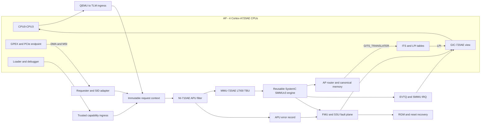

# Apollo QVP 잔여 Fidelity 부채 아키텍처 설계

- 상태: 구현 전 설계 기준선
- 기준일: 2026-07-16
- 대상: active `apollo-qvp`, RD-Aspen CFG2
- AP CPU 범위: CPU0–CPU3, 총 4 CPU
- 선행 기준: A4 policy-routing 구조 폐쇄 및 2026-07-16 반복 부팅 검증

연계 문서:

- [구현 계획](apollo-qvp-fidelity-debt-implementation-plan-ko.md)
- [검증 계획](apollo-qvp-fidelity-debt-validation-plan-ko.md)
- [현재 Machine Architecture](apollo-qvp-machine-architecture-ko.md)
- [A4 구조 부채 설계](apollo-qvp-remaining-architecture-debt-design-ko.md)

## 1. 목적

이 문서는 A4 구조 전환 뒤 남은 기능 충실도 부채의 목표 구조를 정의한다.
정상 부팅을 다시 증명하는 데 그치지 않고, 다음 동작을 관찰 가능하게 만든다.

1. NI-710AE APU가 initiator와 security attribute에 따라 접근을 허용하거나
   차단한다.
2. GPEX DMA가 실제 StreamID로 MMU-720AE의 STE/CD와 page table을 통과한다.
3. SMMU fault와 PCIe MSI가 각각 EVTQ/IRQ와 ITS/LPI 경로로 전달된다.
4. debug, direct, reentrant, DMI가 기능 접근 정책을 우회하지 않는다.
5. FMU, SSU, RAS, DCLS, watchdog과 reset이 source-to-sink 상태 전이를 만든다.
6. software ABI의 오류가 무한 대기 대신 명시적 상태와 복구 결과로 끝난다.
7. QVP와 FVP가 같은 artifact hash와 4 CPU 조건으로 비교된다.

## 2. 기준선과 범위

### 2.1 Source 기준선

| 영역 | revision |
| --- | --- |
| top-level | `258c752e713af6e9b026c3c92183fc1187d40f8f` |
| QBox core | `725db15b0cea4a87307679a3dac9209489877ac6` |
| QBox platform | `5869729f5c2439189be78305f56e5a02c22920af` |
| QEMU/libqemu | `127a75ad6cffbe028988f925b46b262bbb6dfeda` |
| Arm Zena CSS | `bf34d9e71f674e11beea3b8e84ea54486f555d2a` |

활성 설정은 `MACHINE = "apollo-qvp"`, `RD_ASPEN_VARIANT = "cfg2"`,
`PC_CPUS_COUNT_DEFAULT = "4"`, `TMPDIR = "build/tmp_baremetal"`이다.

### 2.2 현재 구현에서 확인한 경계

| 영역 | 현재 동작 | 잔여 부채 |
| --- | --- | --- |
| NI-710AE | `host_ni710ae_nci`가 discovery와 register 저장을 제공 | APU permission이 data path를 차단하지 않음 |
| MMU-720AE | disabled이면 bypass, enabled이면 SID를 포함한 미구현 fault 기록 | 실제 STE/CD 및 stage-1/2 walk가 없음 |
| QBox SMMUv3 | STE/CD, stage-1/2 walk, CMDQ/EVTQ/PRIQ, IOTLB, DMI clip을 보유 | Apollo MMU-720AE/TBU topology와 통합되지 않음 |
| GIC/ITS | QEMU `arm_gicv3`, ITS, LPI/DirectLPI instance가 존재 | GPEX MSI부터 vCPU LPI까지의 증거가 없음 |
| request attribute | QEMU secure/debug, router path, MMU SID/SSID가 각각 존재 | 하나의 권한 판정과 fault attribution으로 정규화되지 않음 |
| FMU/SSU | software error, critical/non-critical IRQ와 SSU 입력이 존재 | 실제 source와 recovery/reset sink의 수직 경로가 부분적 |
| software ABI | 정상 SCMI/PFDI/PSCI/MHU 경로가 부팅됨 | malformed, denied, peer-offline, timeout 복구가 부분적 |

### 2.3 현재 범위

이번 fidelity 단계는 AP CPU0–CPU3만 활성화한다.

- Lua, GIC redistributor, DT, PSCI와 Linux online CPU는 모두 4로 일치한다.
- MSI/LPI affinity와 fault delivery도 CPU0–CPU3만 대상으로 한다.
- RSE와 Safety Island CPU 구성은 현재 CFG2 기준을 유지한다.
- FVP가 물리적으로 추가 AP core를 노출하더라도 비교 대상은 활성 CPU0–CPU3다.

### 2.4 비목표와 후속 범위

- 16 AP CPU enablement, correctness와 lifecycle 검증
- KVM backend 검증
- CHI/CMN/NI의 cycle-accurate arbitration과 contention
- Cortex-A720AE 또는 R82AE의 lockstep instruction-by-instruction 실행
- 공식 문서에 없는 APU register나 safety side effect의 추정 구현

16 CPU는 별도 설계 변경으로 다룬다. 이번 완료 조건에 포함하지 않는다.

## 3. 설계 근거

Arm Zena CSS programmer's model은 다음 불변 조건을 정의한다.

- transaction security state는 Non-secure bit와 physical address로 결정된다.
- security 또는 ownership 규칙을 위반한 접근은 `DECERR` 또는 `SLVERR`다.
- reset 또는 power-off 영역 접근은 시스템을 hang시키면 안 된다.
- system address `[51:48]`은 AP, AP-through-TCU, SMD, RSE, SI를 구분한다.
- NI-710AE APU는 reset 시 RSE를 제외한 접근을 차단한다.
- RSE가 APU를 설정한 뒤 SI 검증과 AP release가 진행된다.
- I/O block에는 TCU/TBU와 ITS가 있으며 GPEX requester identity를 보존해야 한다.
- FMU/SSU와 GIC interrupt map은 error와 fault를 서로 다른 신호로 구분한다.

구현 시 다음 local 근거를 우선 사용한다.

- `doc/arm_zena_css_dev_guide/02-block-diagram-for-zena-css.md`
- `doc/arm_zena_css_dev_guide/05-functional-blocks-in-zena-css.md`
- `doc/arm_zena_css_dev_guide/06-boot-flow-of-zena-css.md`
- `doc/arm_zena_css_dev_guide/09-programmers-model-for-zena-css.md`
- `arm-zena-css/documentation/images/aspen_compute_complex.png`
- `arm-zena-css/documentation/images/aspen_system_management_block.png`

NI-710AE APU의 상세 register 구현은 공식 NI-710AE TRM의 문서 번호와 revision을
기록한 뒤 시작한다. 상세 정의가 없으면 data-path 의미를 추측하지 않는다.

## 4. 목표 아키텍처



data plane, control plane과 fault plane은 하나의 register placeholder로 합치지
않는다. 세 plane은 같은 policy와 request identity를 참조한다.

## 5. 공통 불변 조건

1. cross-domain 접근은 APU 또는 명시적 trusted capability를 반드시 통과한다.
2. `transport_dbg`, direct와 reentrant path는 권한을 자동 획득하지 않는다.
3. APU 또는 SMMU deny 뒤에는 downstream target side effect가 없어야 한다.
4. SID/SSID, initiator, security와 access kind는 fault record까지 보존한다.
5. 하나의 SMMU register와 translation state는 한 component만 소유한다.
6. DMI grant는 permission과 translation 범위보다 넓을 수 없다.
7. policy, page table 또는 reset 변경은 관련 DMI와 IOTLB를 무효화한다.
8. MSI와 legacy INTx는 별도 route와 별도 acceptance를 가진다.
9. fault injection은 sink를 직접 호출하지 않고 실제 source register를 거친다.
10. 모든 timeout 시험은 다음 정상 request가 성공하는 recovery를 포함한다.

## 6. 세부 설계 결정

### FD-01. 정규화된 request context

QBox 공통 계층에 재사용 가능한 TLM extension을 둔다. Apollo domain 이름은
opaque ID로 전달해 QBox core에 platform 정책을 넣지 않는다.

| 필드 | 의미 |
| --- | --- |
| `origin_id` | CPU, DMA, loader, debugger 등 최초 initiator |
| `domain_id` | AP, SMD, RSE, SI 등 platform contract가 정한 domain |
| `requester_id` / `substream_id` | SID와 SSID, 각각 valid bit 포함 |
| `secure` / `privileged` | security와 privilege attribute |
| `instruction` / `ats` | fetch와 ATS request 구분 |
| `access_path` | regular, debug, loader, direct, reentrant |
| `capabilities` | platform이 부여한 trusted access 권한 bitmask |

TLM read/write, byte-enable와 streaming-width는 기존 generic payload를 사용한다.
router의 `PathIDExtension`은 이동 경로를 기록하고 origin을 대체하지 않는다.

ingress adapter가 기존 `QemuMemTxAttrsTlmExtension`과
`mmu720ae::request_attrs_extension`을 정규화한다. 필수 identity가 없는
cross-domain 또는 SMMU access는 fallback 성공이 아니라 default-deny다.

### FD-02. NI-710AE APU의 control/data 단일 상태

새 `ni710ae_apu` SystemC component는 다음 interface를 가진다.

- APU register target socket
- protected transaction target/initiator socket pair
- deny/error signal 및 machine-readable trace
- reset과 lock input

`host_ni710ae_nci`는 discovery node와 APU subfeature pointer를 제공한다. 실제 APU
subwindow는 `ni710ae_apu`가 소유한다. data path와 register view가 같은 policy
state를 사용하므로 register write가 실제 접근 결과를 바꾼다.

reset 정책은 RSE origin만 허용한다. RSE가 공식 register sequence를 완료하기
전에는 AP, SI, DMA와 일반 debug 접근을 차단한다. lock 뒤의 write, 잘못된
security state와 권한 없는 initiator는 side effect 없이 오류로 끝난다.

첫 구현은 APU를 통과하는 DMI를 모두 거부한다. permission 변경과 invalidation
시험이 끝난 뒤 read-only DMI부터 단계적으로 허용한다.

### FD-03. MMU-720AE와 SMMUv3 기능 모델의 합성

active SystemC backend의 normative translation engine은 기존 QBox
`systemc-components/smmuv3`를 재사용한다. 이 모델은 STE/CD, stage-1/2 walk,
CMDQ/EVTQ/PRIQ, IOTLB와 translated DMI 범위 제한을 이미 제공한다.

Apollo `mmu720ae`는 integration shell 역할만 맡는다.

- MMU-720AE register aperture와 ID/RAS integration
- ACE/LTI TBU port와 port별 기본 SID
- Apollo IRQ/RAS aggregation
- SMMU engine, downstream memory와 ITS doorbell binding

기존 제한 `mmu720ae` register state와 generic SMMUv3 register state를 동시에
노출하지 않는다. migration 뒤에는 SMMUv3 engine이 유일한 translation owner다.
QEMU `arm-smmuv3` backend는 대체 backend와 differential oracle로 유지하며
SystemC backend와 직렬 연결하지 않는다.

초기 correctness 단계에서는 translated DMI를 비활성화한다. CMDQ/TLBI와
downstream invalidate 전파를 증명한 뒤 page 단위로 허용한다.

### FD-04. GPEX requester와 StreamID

GPEX `bus_master` ingress가 실제 requester context를 생성한다. LTI00의 현재
fallback SID는 기준선 비교에만 사용한다. 최종 SID는 SMD CSR, DT/IORT와 FVP
설정에서 하나로 resolve한다.

- DMA read/write와 MSI write에 동일 requester identity를 붙인다.
- SSID가 없는 endpoint는 `ssid_valid=false`를 명시한다.
- fault EVTQ는 SID, SSID, IOVA, access type과 fault level을 보존한다.
- 잘못된 SID와 unmapped IOVA는 AP memory에 접근하지 않는다.

### FD-05. PCIe MSI to ITS to LPI

legacy INTx SPI 300–303은 기존 route로 유지한다. MSI 검증은 별도 PCIe test
profile에서 기존 QBox PCIe endpoint를 GPEX에 연결한다.

```text
PCIe endpoint MSI write
  -> GPEX requester context
  -> MMU-720AE LTI00 translation
  -> GITS_TRANSLATER
  -> ITS DeviceID/EventID tables
  -> LPI pending table
  -> GIC redistributor CPU0-CPU3
```

test endpoint는 기본 machine에서 비활성화한다. 검증 profile에서만 켜며 DT 또는
ACPI/IORT와 Linux driver가 같은 DeviceID/StreamID를 사용하도록 한다.

### FD-06. debug, direct, reentrant와 DMI

`access_path` 자체는 bypass 권한이 아니다. loader와 승인된 debugger만 platform
contract의 capability를 가진다.

- 일반 `transport_dbg`는 normal access와 같은 APU/SMMU 판정을 받는다.
- direct/reentrant는 blocking 제한만 다르고 permission은 동일하다.
- trusted loader는 허용된 boot aperture와 boot phase에서만 접근한다.
- policy deny, translation fault 또는 reset 상태에서는 DMI를 반환하지 않는다.
- DMI invalidate는 translated alias와 QEMU `MemoryRegion` alias까지 전파한다.

### FD-07. 오류 응답과 guest-visible 결과

| 원인 | TLM | QEMU | guest/fault 결과 |
| --- | --- | --- | --- |
| unmapped, width overflow | `TLM_ADDRESS_ERROR_RESPONSE` | `MemTxDecodeError` | DECERR 또는 external abort |
| APU permission deny | `TLM_COMMAND_ERROR_RESPONSE` | `MemTxError` | SLVERR/permission fault와 APU error record |
| SMMU translation/permission | address error 및 EVTQ record | `MemTxError` | IOMMU fault IRQ와 Linux event |
| unsupported command | command error | `MemTxError` | 명시적 실패, target side effect 없음 |
| reset/power-off target | 계약된 error response | decode 또는 generic error | hang 없이 bounded 종료 |

실제 `DECERR`/`SLVERR` 선택은 해당 Arm IP 문서와 FVP negative vector로 고정한다.

### FD-08. fault, safety와 reset event plane

현재 `zena_fmu`와 `zena_ssu`를 확장하고 대체 모델을 만들지 않는다. 첫 수직
slice는 다음 네 가지다.

1. SMMU translation fault → EVTQ/IRQ → AP Linux IOMMU fault
2. SI source injection → FMU critical/non-critical → SSU → SI GIC
3. AP secure watchdog expiry → GIC WS0/WS1 → RGM reset/syndrome
4. SI DCLS force register → FMU record → firmware clear와 recovery

물리 signal은 기존 bool signal socket을 사용한다. 별도 observer가 source ID,
severity, simulated timestamp, register snapshot과 sink를 JSON event로 기록한다.

### FD-09. software ABI 오류와 recovery

SCMI, PSCI, MHU, PFDI, HIPC/RPMsg와 FF-A는 공통 오류 원칙을 따른다.

- malformed length와 invalid ID는 정해진 error response를 반환한다.
- denied와 peer-offline은 channel을 BUSY 상태로 남기지 않는다.
- 의도된 timeout 시험은 timeout 원인과 recovery event를 남긴다.
- reset 중 request는 owner 정책에 따라 보존 또는 명시적으로 취소한다.
- 오류 뒤 다음 정상 request가 성공해야 한다.

### FD-10. evidence와 FVP differential

모든 실행은 source revision, resolved 4-CPU topology, CCI, backend와 artifact
SHA-256을 하나의 manifest에 기록한다. MVP의 QVP/FVP 비교는 boot milestone과
변경한 대표 marker로 제한하며 다음 네 등급을 사용한다.

- `equivalent`
- `intentional-abstraction`
- `partial-model`
- `blocker`

전체 transaction, IRQ/fault, guest state와 recovery differential은 extended
validation으로 남긴다. 성능 수치는 acceptance에 사용하지 않는다.

## 7. 구현 소유권

| 변경 | owning repository |
| --- | --- |
| generic request-context extension과 보존 test | `hsoc-stack/tools/qbox` |
| SMMUv3 기능 보강이 필요한 경우 | `hsoc-stack/tools/qbox` |
| NI-710AE APU, MMU-720AE shell, FMU/SSU/RGM integration | `hsoc-stack/tools/qbox-platform` |
| Apollo Lua, CCI, route manifest와 platform tests | `hsoc-stack/tools/qbox-platform` |
| QEMU MemTxAttrs 또는 generic ITS/GPEX 결함 | `hsoc-stack/tools/qemu` |
| validator, runner, comparison과 문서 | top-level repository |
| firmware/DT producer-consumer 수정 | 각 firmware/Linux owning repository |

QBox core에는 Apollo 주소와 policy를 넣지 않는다. QEMU 변경은 기존
SystemC/QBox interface로 표현할 수 없는 generic 결함이 재현된 경우에만 한다.

## 8. Architecture 완료 조건

- AP online CPU가 정확히 4이고 CPU4–CPU15가 enable되지 않는다.
- NI-710AE APU reset default-deny와 RSE programming/lock이 data path에 반영된다.
- GPEX DMA가 실제 SID로 stage-1 translation을 통과하고 invalid IOVA는 EVTQ와
  IRQ를 만든다.
- SystemC SMMUv3와 QEMU SMMUv3의 선택이 상호 배타적이며 state owner가 하나다.
- 실제 PCIe endpoint의 MSI 하나가 ITS를 거쳐 CPU0 LPI로 전달된다.
- 변경한 debug/direct/reentrant path의 대표 allow/deny에서 policy bypass가 없다.
- 구현한 fault vertical slice마다 source, sink와 clear/recovery smoke가 통과한다.
- 변경한 software ABI의 대표 오류가 bounded termination과 다음 request recovery를
  만족한다.
- local과 Yocto 4-CPU full-system 부팅이 각각 한 번 통과한다.
- focused FVP comparison을 수행하거나 실행 제약과 `deferred` 사유를 기록한다.

상세 구현 순서와 검증 횟수는 연계 계획 문서를 따른다.
