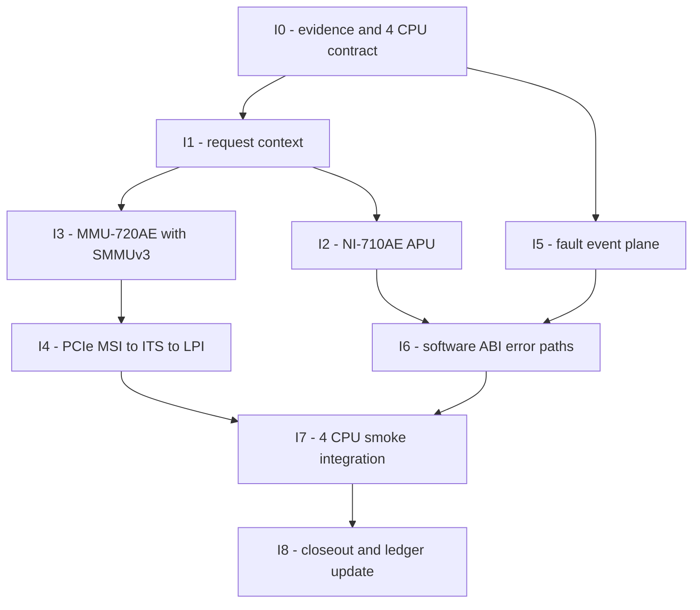

# Apollo QVP 잔여 Fidelity 부채 구현 계획

- 상태: 구현 착수 전 승인 기준
- 기준일: 2026-07-16
- 대상: `apollo-qvp`, RD-Aspen CFG2, AP 4 CPU
- 상위 설계: [Fidelity 부채 아키텍처 설계](apollo-qvp-fidelity-debt-architecture-design-ko.md)
- 검증 기준: [Fidelity 부채 검증 계획](apollo-qvp-fidelity-debt-validation-plan-ko.md)

## 1. 목표와 실행 원칙

이 계획은 잔여 fidelity 부채를 독립된 수직 slice로 구현한다. 각 단계는 실제
외부 동작과 오류 결과를 증명한 뒤 다음 단계로 진행한다.

1. 4 CPU 기준선을 모든 단계에서 유지한다.
2. test와 machine contract를 구현보다 먼저 추가한다.
3. 기존 QBox SMMUv3, FMU, SSU와 QEMU GIC/ITS를 우선 재사용한다.
4. register 저장만 추가하는 임시 stub을 완료로 판정하지 않는다.
5. QBox core와 Apollo platform 정책의 repository 경계를 보존한다.
6. 각 단계는 atomic commit과 독립 rollback이 가능해야 한다.
7. local 검증이 통과하기 전 Yocto 또는 전체 FVP 비교로 확대하지 않는다.

## 2. 선행 조건

### 2.1 필수 입력

- active `build/conf/local.conf`, `bblayers.conf`, `templateconf.cfg`
- 현재 topology/address/transaction/signal/software contract JSON
- Arm Zena CSS programmer's model과 RD-Aspen block/boot 문서
- NI-710AE APU 공식 programming model의 문서 번호와 revision
- SMMUv3 architecture 및 QBox `systemc-components/smmuv3` 지원 범위
- active DTB/DTS, IORT, GIC/ITS, SMMU와 PCIe requester 정보
- FVP binary/version과 4 CPU 비교에 사용할 artifact 목록

NI-710AE APU 상세 문서를 확보하지 못해도 I0, I1과 I3 사전 검증은 진행할 수
있다. 다만 APU register 의미를 추측해 I2를 완료하지 않는다.

### 2.2 기준선 보존

작업 시작 전에 다음 결과를 새로운 evidence root에 복사하지 않고 경로와 hash로
참조한다.

- A4 topology/map validator 통과
- QBox/QBox-platform unit test 33/33
- SCP module test 77/77
- local 및 Yocto trace-off full-system 각 3/3
- 각 runtime coverage 49/49
- AP Linux online CPU 4

## 3. 단계 의존성

I2와 I3는 I1 뒤에 병렬 개발할 수 있다. I5도 I0 뒤에 독립적으로 시작할 수
있다. 한 작업이 다른 repository의 미완성 commit을 전제로 하지 않도록 integration
commit은 각 단계 끝에서 별도로 만든다.

## 4. 상세 구현 단계

### I0. 4 CPU contract와 fidelity ledger 고정

목표는 구현 전 failure를 재현하고 pass 조건을 machine-readable하게 만드는 것이다.

작업:

- AP CPU count, GIC redistributor, DT CPU node와 guest `maxcpus=4`를 한 contract로
  검증한다.
- CPU4–CPU15가 online되거나 해당 MPIDR의 PSCI `CPU_ON`이 성공해 실제 release가
  발생하면 실패하도록 한다. invalid MPIDR negative request 자체는 허용한다.
- APU, SMMU, MSI/LPI, DMI/debug, fault와 ABI error 항목을 fidelity ledger에
  `planned`로 추가한다.
- artifact manifest schema에 SHA-256, CCI, backend와 source revision을 추가한다.
- 현재 expected-fail vector를 수집한다.

예상 top-level 산출물:

- `[신규 예정] scripts/test/validate_qbox_apollo_fidelity_contract.py`
- topology/transaction/signal/software contract schema 확장
- 현재 모델과 공식 근거를 연결하는 fidelity ledger

완료 조건:

- 기존 정상 부팅 기준선은 green이다.
- 신규 fidelity 항목은 구현 전 의도한 이유로 red 또는 `not-implemented`다.
- 4 CPU 조건이 모든 runner result에 기록된다.

### I1. 공통 request-context extension

소유 repository: `hsoc-stack/tools/qbox`

작업:

- opaque origin/domain, SID/SSID, security, privilege, instruction/ATS,
  access-path와 capability를 담는 TLM extension을 추가한다.
- clone/copy와 payload lifetime을 검증한다.
- QEMU ingress에서 `QemuMemTxAttrsTlmExtension`을 정규화한다.
- router와 `addrtr`가 `b_transport`, `transport_dbg`, DMI에서 context를 보존하는지
  시험한다.
- direct/reentrant/debug 분기는 context만 표시하고 permission을 변경하지 않는다.

Apollo integration:

- CPU, GPEX, RSE, SI, loader와 debugger에 stable origin/domain ID를 부여한다.
- 기존 `mmu720ae::request_attrs_extension`과 generic SMMUv3 extension 사이의
  adapter를 추가한다.
- 필수 context가 없는 cross-domain request는 default-deny로 고정한다.

완료 조건:

- 모든 access path에서 immutable field가 target까지 동일하다.
- nested/reentrant access 후 extension pointer와 내용이 남지 않는다.
- 기존 QBox platform test와 Apollo boot 기준선이 회귀하지 않는다.

### I2. NI-710AE APU data-path 모델

소유 repository: `hsoc-stack/tools/qbox-platform`

작업 순서:

1. 공식 APU register, reset, lock, security와 error side effect 표를 작성한다.
2. reset RSE-only allow와 AP/SI/DMA/debug deny unit test를 먼저 추가한다.
3. `ni710ae_apu` register target과 protected transaction socket을 구현한다.
4. `host_ni710ae_nci` discovery pointer가 실제 APU register subwindow를 가리키게
   한다.
5. AP, SMD, RSE와 SI subsystem 경계에 필요한 APU instance를 배치한다.
6. RSE boot programming과 lock 뒤 data-path 결과를 검증한다.
7. deny/error record와 FMU 입력을 연결한다.

초기 구현에서는 APU DMI를 허용하지 않는다. permission 변경 시 전체 protected
aperture invalidate를 발생시키는 시험 뒤 read-only DMI를 별도 commit으로 연다.

완료 조건:

- RSE 설정 전에는 RSE를 제외한 downstream access와 side effect가 없다.
- RSE 설정 뒤 allow matrix만 통과한다.
- lock과 reset semantics가 공식 표와 일치한다.
- normal/debug/direct/reentrant/DMI가 같은 permission verdict를 낸다.

### I3. MMU-720AE를 QBox SMMUv3 engine으로 전환

소유 repository: QBox core와 `qbox-platform`, atomic commit 분리

#### I3-1. 기존 SMMUv3 모델 qualification

- Apollo가 즉시 사용하는 linear STE, CD와 stage-1 walk 하나를 test로 고정한다.
- CMDQ/TLBI 하나와 EVTQ fault 하나를 시험한다.
- two-level STE, stage-2, queue overflow, secure 조합과 DMI matrix는 지원 상태만
  기록하고 extended validation으로 미룬다.

#### I3-2. Apollo MMU-720AE integration shell

- generic SMMUv3를 유일한 register/translation state owner로 선택한다.
- Apollo ACE/LTI socket과 port별 SID를 SMMUv3 TBU에 연결한다.
- GPEX는 LTI00에 연결하고 page-table DMA는 AP canonical memory로 보낸다.
- MMU-720AE integration ID/RAS register와 IRQ aggregation만 shell에 남긴다.
- 기존 `record_unimplemented_translation_fault()` 경로를 migration 뒤 제거한다.
- `systemc-mmu720ae`와 `qemu-arm-smmuv3` 선택을 상호 배타적으로 검사한다.

#### I3-3. Linux-visible translation

- test용 4 KiB stage-1 table을 구성해 DMA read/write를 먼저 통과시킨다.
- Linux `arm-smmu-v3` driver가 STE/CD/CMDQ/EVTQ를 실제로 설정하게 한다.
- mapped IOVA 하나와 unmapped IOVA fault 하나를 검증한다.
- EVTQ record와 IRQ가 guest log 및 result JSON에 남게 한다.

translated DMI는 MVP에서 끈다. CMDQ/TLBI-aware DMI는 별도 최적화 단계로 미룬다.

완료 조건:

- enabled SMMU가 더 이상 모든 request를 미구현 fault로 종료하지 않는다.
- DMA data, EVTQ record, IRQ와 guest driver 상태가 같은 SID/IOVA를 가리킨다.
- page-table update와 TLBI 뒤 stale translation 및 DMI가 없다.

### I4. PCIe MSI to ITS to LPI 수직 경로

소유 repository: QBox platform 우선, generic 결함만 QBox/QEMU

작업:

- 기존 QBox PCIe endpoint 하나를 test profile에서만 GPEX에 연결한다.
- endpoint의 DeviceID, EventID, SID와 ITS translator 주소를 contract에 기록한다.
- DMA와 MSI write가 LTI00/SMMU를 통과하도록 한다.
- Linux에서 MSI-X 하나를 enable하고 LPI를 CPU0에 전달한다.
- legacy INTx 하나가 기존 SPI route로 동작하는지만 회귀 검사한다.
- CPU별 affinity, invalid DeviceID/EventID와 unmapped MSI doorbell matrix는
  extended validation으로 미룬다.

완료 조건:

- 실제 endpoint interrupt가 LPI counter를 증가시킨다.
- CPU0의 LPI counter와 endpoint interrupt count가 각각 증가한다.

### I5. fault, safety, watchdog와 reset event plane

소유 repository: `hsoc-stack/tools/qbox-platform`

작업:

- 기존 `zena_fmu` software injection을 test-only fault source interface와 연결한다.
- FMU critical/non-critical output, SSU state와 GIC input을 event observer에 기록한다.
- SMMU fault와 APU deny를 해당 FMU/error-record source에 연결한다.
- AP secure watchdog placeholder를 기능 모델로 교체한다.
- watchdog WS0/WS1, RGM request/ack, reset syndrome와 AP CPU reset을 연결한다.
- SI DCLS force → FMU → SSU → firmware clear/recovery 수직 slice를 구현한다.
- simulated-time delay와 event ordering을 CCI와 contract로 고정한다.

완료 조건:

- injection이 실제 source register와 enable/threshold 조건을 통과한다.
- clear/ack 뒤 IRQ와 SSU state가 정상으로 돌아온다.
- watchdog reset 뒤 CPU0–CPU3과 preserve/clear backing 정책이 맞다.
- fault disabled 상태에서는 sink side effect가 없다.

### I6. software ABI 오류 및 recovery

소유 repository: platform model, firmware와 Linux owning repository를 분리

우선순위:

1. SCMI/PFDI malformed length, invalid protocol, denied request
2. PSCI invalid MPIDR, already-on/off, power/reset 중 request
3. MHU duplicate doorbell, BUSY channel, peer-offline
4. HIPC/RPMsg malformed resource table와 duplicate notification
5. FF-A invalid endpoint와 memory descriptor

각 protocol을 변경할 때 대표 오류 하나, channel cleanup과 다음 정상 request
성공만 필수 test로 묶는다. 나머지 vector는 extended validation backlog에 둔다.
firmware가 실제로 생성해야 하는 오류는 host model에서 합성하지 않는다.

완료 조건:

- 오류가 무한 poll이나 stale BUSY mailbox로 남지 않는다.
- firmware와 OS 양쪽의 error code가 contract와 일치한다.
- 오류 뒤 재부팅 없이 다음 정상 transaction이 성공한다.

### I7. 4 CPU local, Yocto smoke와 focused FVP comparison

소유 repository: top-level runner와 validator

작업:

- source, artifact SHA-256, CCI, backend, CPU/DT topology manifest를 생성한다.
- local image로 `smoke` profile을 한 번 실행한다.
- `./yocto_build.sh` 결과로 같은 `smoke` profile을 한 번 실행한다.
- FVP comparison은 MVP 뒤 boot milestone과 변경한 대표 marker만 한 번 비교한다.
- source/artifact hash가 다르면 manifest에 기록하되 MVP를 차단하지 않는다.
- 차이를 equivalent, intentional-abstraction, partial-model, blocker로 분류한다.

FVP가 4 CPU instance 수를 직접 제한하지 못하면 CPU0–CPU3만 비교한다.
CPU4–CPU15는 비교에서 제외한다.

완료 조건:

- local build/boot와 Yocto build/boot가 각각 한 번 통과한다.
- 변경한 slice의 대표 allow/deny 또는 fault/recovery가 한 번 통과한다.
- FVP comparison을 수행하거나 환경 제약과 `deferred` 사유를 기록한다.

### I8. closeout

- architecture, implementation, validation과 roadmap 상태를 갱신한다.
- 모든 planned 항목을 implemented, deferred 또는 blocked로 분류한다.
- temporary compatibility path가 새로 생겼다면 owner와 제거 조건을 남긴다.
- 각 owning repository에서 atomic DCO commit을 만든다.
- 최종 source와 remote revision을 evidence manifest에 기록한다.

## 5. Atomic commit 경계

권장 commit 순서는 다음과 같다.

1. `test(apollo): define fidelity contracts`
2. `feat(tlm): add request context`
3. `test(tlm): preserve request context`
4. `feat(apollo): model NI-710AE APU`
5. `test(smmu): qualify translation engine`
6. `feat(apollo): integrate MMU-720AE walk`
7. `feat(apollo): route PCIe MSI to ITS`
8. `feat(apollo): connect safety fault plane`
9. `test(apollo): cover protocol error recovery`
10. `test(apollo): compare four-CPU FVP and QVP`
11. `docs(apollo): close fidelity debt phase`

submodule commit을 먼저 만든 뒤 top-level pointer를 갱신한다. 서로 다른 owning
repository 변경을 하나의 commit으로 합치지 않는다.

## 6. 중단 및 rollback 기준

다음 조건에서는 단계 확장을 중단한다.

- CPU 수, DT 또는 GIC redistributor가 4와 다르다.
- deny request가 downstream target을 변경한다.
- request context가 router, addrtr 또는 QEMU bridge에서 손실된다.
- APU register 의미를 공식 근거 없이 추정해야 한다.
- SMMU register owner가 둘이거나 backend가 직렬 연결된다.
- TLBI 뒤 stale IOTLB 또는 DMI alias가 남는다.
- invalid MSI가 guest LPI로 전달된다.
- fault clear 뒤 IRQ가 deassert되지 않는다.
- protocol error가 다음 정상 request를 막는다.
- local 부팅이 회귀했는데 Yocto/FVP 단계로 넘어가려 한다.

rollback은 해당 수직 slice의 Lua binding과 component commit만 되돌린다. 이전 A4
router/ATU 구조나 사용자 소유 변경을 reset하지 않는다.

## 7. 구현 착수 순서

실제 구현은 다음 순서로 시작한다.

1. I0의 4 CPU/fidelity contract와 expected-fail test
2. I1 request-context extension과 경로 보존 test
3. I3-1 기존 QBox SMMUv3 qualification
4. 공식 NI-710AE APU register 근거가 준비되면 I2
5. I3-2/I3-3 MMU-720AE migration

이 순서는 APU 문서 확보가 늦어져도 SMMUv3 qualification을 진행할 수 있게 한다.
