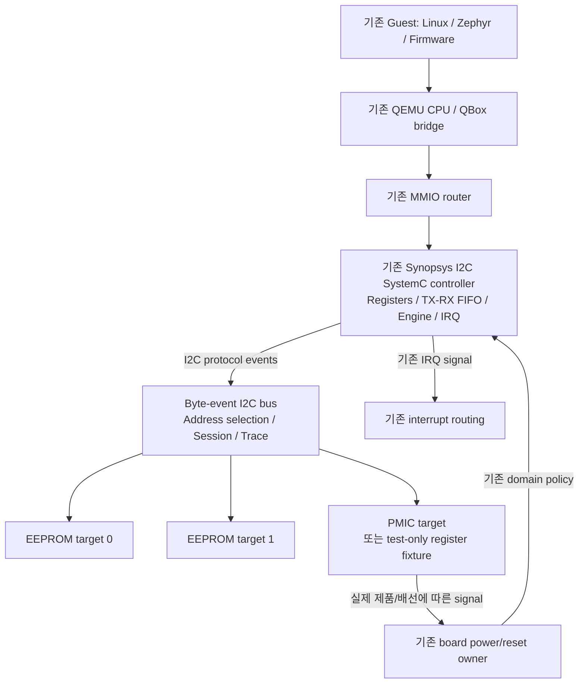
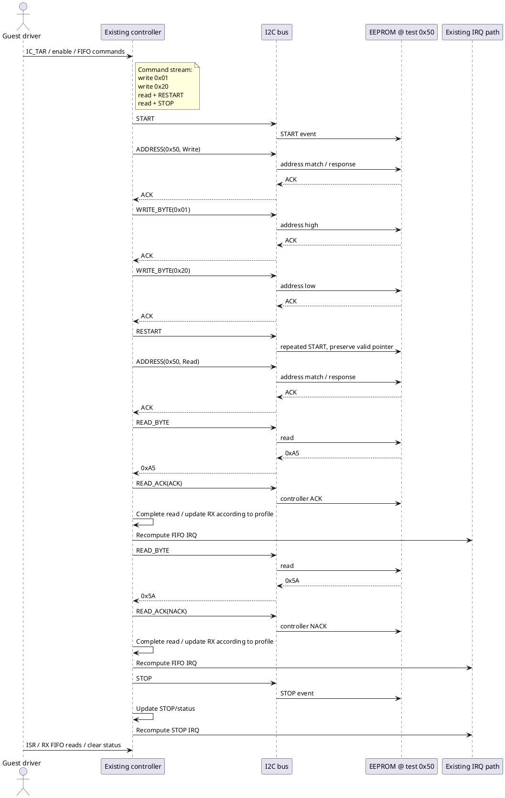

# Apollo QVP — Byte/Event-Level I2C 구현 계획서

**대상:** 기존 apollo-qvp의 Synopsys I2C SystemC controller와 QBox board 구성
**문서 버전:** v1.0 / 2026-09-17
**문서 상태:** 구현 계획. apollo-qvp source mapping과 실제 IP/PMIC profile은 Phase 0에서 확정한다.
**목표:** 기존 controller의 Register/FIFO/IRQ 모델을 유지하면서 공용 I2C bus와 여러 EEPROM·PMIC target을 연결하고, 실제 Guest-visible 통신 및 오류 복구를 검증한다.

> 이 문서는 구현 완료 보고서가 아니다. 실제 apollo-qvp checkout의 파일 수정·빌드·시뮬레이션은 수행하지 않았다. 본문에서 제안하는 이벤트 이름·타입·테스트 ID는 설계 계약이며, 현재 Apollo/QBox에 이미 존재하는 API라는 의미가 아니다.

### 빠른 탐색

| 설계 기준 | 구현 상세 | 실행과 검증 |
|---|---|---|
| [1. 핵심 결정](#sec-1) · [2. 전제/Source mapping](#sec-2) | [5. Protocol 계약](#sec-5) · [6. Controller engine](#sec-6) | [13. Trace/Fault](#sec-13) · [14. Acceptance tests](#sec-14) |
| [3. 기능 범위](#sec-3) · [4. Architecture](#sec-4) | [7. Register/IRQ](#sec-7) · [8. 시간/Thread](#sec-8) | [15. 단계별 계획](#sec-15) · [16. Review/TODO](#sec-16) |
| [17. 공식 Reference](#sec-17) | [9. Reset](#sec-9) · [10. Targets](#sec-10) | [11. QBox 통합](#sec-11) · [12. Sequence](#sec-12) |

---

<a id="sec-1"></a>

## 1. 결론과 핵심 설계 결정

**기존 SystemC controller → byte/event-level 공용 I2C bus → 장치별 SystemC target**을 구현한다. SDA/SCL bit toggle 없이 START, address, data, ACK/NACK, repeated START, STOP 및 그 순서를 보존한다. CPU의 MMIO 접근과 I2C target 접근을 서로 다른 경로로 유지한다.

구현은 `기존 분석 → EEPROM 하나의 Guest read → multi-target → FIFO·IRQ·오류·reset → 실제 PMIC driver` 순서로 진행한다. 공용 framework, QEMU core 변경, 외부 통신 backend는 선행 조건으로 만들지 않는다.

| 결정 | 적용 내용 |
|---|---|
| 모델링 수준 | 단일 controller / 여러 target의 7-bit byte/event-level 프로파일부터 완료 |
| 기존 코드 유지 | Controller register bank, FIFO, IRQ, clock/reset ownership, MMIO mapping, Lua hierarchy를 먼저 재사용 |
| Bus 역할 | 주소 선택, session 상태, 공통 bus event 전달, response 전달, trace 및 제한된 fault hook |
| Target 역할 | 장치 고유의 주소 포인터, register/memory, ACK 조건, write completion, 기능 상태 |
| 시간 소유자 | Controller transfer engine이 bus 전송 시간을 진행. Target의 내부 busy는 target이 소유 |
| 실행 컨텍스트 | 기존 QBox thread/synchronization 경계를 유지하고, protocol state 변경은 정해진 SystemC 실행 경로에서 수행 |
| Reset 원칙 | Controller reset이 board 전체 reset이나 EEPROM 내용 삭제로 전파되지 않음 |
| 완료 증거 | Host unit test뿐 아니라 QEMU에서 실행되는 Guest driver/firmware 결과, bus trace, controller 상태를 함께 확인 |

### 1.1 변경하지 않는 영역

Zena CPU topology, QEMU instance 구성, GIC routing, MMIO base address, reset domain, board power state machine, 기존 `tcg_mode`/`sync_policy`는 이번 I2C 기능 때문에 임의 변경하지 않는다. 해당 영역에 결함이 확인되면 I2C 변경과 구분한 작은 수정으로 처리한다.

I2C는 Arm/Zena architecture 자체가 정의하는 프로토콜이 아니다. Zena 관련 integration 값은 기존 Apollo 소스가 기준이고, I2C 프로토콜은 NXP 사양, controller 세부 동작은 실제 Synopsys IP 문서, target 동작은 제품별 데이터시트를 기준으로 한다. [R1](#ref-r1)

### 1.2 완료 수준을 분리한다

| 완료 수준 | 통과 조건 | 주장할 수 없는 범위 |
|---|---|---|
| **Core byte/event-level 완료** | EEPROM 2개 및 register target fixture/기존 PMIC를 통해 정상 전송, FIFO/IRQ, 오류, reset 검증 통과 | 모든 Synopsys 옵션 또는 특정 PMIC 제품 호환성 |
| **Apollo board 통합 완료** | 실제 controller profile, target 품번/주소, board signal, 실제 Guest driver까지 검증 | 전기적 timing sign-off, 실리콘 동등성, 기능안전 인증 |

PMIC 품번이 미확정이면 core 개발은 계속 진행한다. 다만 register target fixture 테스트를 “실제 PMIC driver 검증 완료”로 기록하지 않는다.

---

<a id="sec-2"></a>

## 2. 전제, 확인된 자료와 미확인 항목

### 2.1 근거의 구분

| 분류 | 확인된 내용 또는 사용 기준 | 적용 제한 |
|---|---|---|
| 사용자 제공 프로젝트 전제 | apollo-qvp에 Zena 확장이 있고 SoC IP 및 board part를 SystemC로 모델링 | 실제 경로·클래스·주소는 아직 확인하지 못함 |
| Apollo 현재 구현 | 이번에 접근 가능한 GitHub repository 검색에서 `apollo-qvp` checkout을 확보하지 못함 | 저장소가 존재하지 않는다는 의미가 아님 |
| 업로드 자료 | `Qbox DMA 구현 조사.txt`는 이전 Markdown의 다운로드 안내만 포함 | DMA/I2C 구현 소스로 사용하지 않음 |
| 기존 개발 지침 | File Library의 `qbox-dev_SKILL.md`: inspect-before-edit, 기존 API/구성/동기화 유지 | 실제 Apollo 소스 트리의 증거는 아님 [R0](#ref-r0) |
| QBox upstream | 지정 commit의 `py-models/py-i2c.py`, `docs/libgssync.md` 확인 | Apollo에서 사용하는 QBox revision과 동일하다고 가정하지 않음 [R3](#ref-r3)[R4](#ref-r4) |
| QEMU upstream | `v10.0.0`의 I2C core API를 개념 비교에 사용 | QEMU 모델을 새 dependency로 도입하는 계획이 아님 [R5](#ref-r5) |
| Linux upstream | `v6.12` DesignWare driver와 register 정의를 driver 요구사항 비교에 사용 | Apollo BSP 버전 변경 지시가 아님 [R6](#ref-r6)[R7](#ref-r7) |
| Synopsys IP | DW_apb_i2c 계열을 우선 비교 대상으로 가정 | 실제 IP명/version/synthesis options는 Phase 0에서 확정 |
| EEPROM | 24LC256 프로파일을 reference test target으로 제안 | Apollo board 실제 EEPROM 품번은 별도 확인 [R2](#ref-r2) |
| PMIC | 품번·register map·address strap·signal 연결 미확인 | 임의 제품 호환 register map을 만들지 않음 |

### 2.2 기준 revision

| Source | 본문 기준 |
|---|---|
| NXP I2C | UM10204 Rev. 7.0, 2021-10-01 |
| Microchip EEPROM | DS20001203X, 24AA256/24LC256/24FC256 |
| QBox | `9a39623d0c10a14157cb44f92e21c2754ffc4f08` |
| QEMU | `v10.0.0` |
| Linux | `v6.12` |
| Apollo / 실제 Guest BSP | **미확인 — Phase 0에서 commit 및 dirty 상태 기록** |

이 revision은 재현 가능한 참고 기준이다. “현재 Apollo에 설치된 버전”이나 “최신 권장 버전”을 뜻하지 않는다.

### 2.3 첫 구현 전에 채울 source mapping

별도의 대형 설계 문서를 만들지 말고 아래 표에 실제 파일과 symbol을 기록한다.

| 항목 | 실제 파일 / symbol / configuration | 확인할 사항 |
|---|---|---|
| Synopsys controller | TBD | MMIO callback, register class, TX/RX FIFO, engine 유무 |
| Controller 출력 | TBD | I2C 전용 interface/socket인지, 단순 byte stream인지 |
| QEMU→SystemC 경계 | TBD | MMIO 호출 thread, delay 처리, state 보호 방법 |
| IRQ 갱신 | TBD | Raw/masked 상태, level/edge, clear-on-read |
| Reset/disable | TBD | Reset callback, pending event 정리, enable 완료 조건 |
| Clock 입력 | TBD | 실제 clock source, SCL count register 해석 |
| Board 구성 | TBD | 기존 Lua object와 bus/target 생성 위치 |
| Registration/build | TBD | Module 등록 방식, library/target, test target |
| Guest 소유 domain | TBD | Linux/Zephyr/FW 중 실제 controller owner |
| Guest description | TBD | 기존 DTS/ACPI/firmware 설정, clock/reset/IRQ 기술 |
| Target 모델 | TBD | 기존 EEPROM/PMIC 구현의 재사용 가능 부분 |
| Board power/reset owner | TBD | PMIC signal 수신 후 SoC 상태를 변경하는 주체 |

**Phase 0 산출물:** 이 표, baseline test 결과, 실제 IP/target feature profile. source mapping을 끝내기 전에 새 source directory나 `moduletype` 이름을 확정하지 않는다.

---

<a id="sec-3"></a>

## 3. 기능 범위와 비범위

### 3.1 Core 완료에 포함할 기능

| 영역 | 포함 기능 |
|---|---|
| 연결 | Controller 1개, target 여러 개, elaboration-time binding |
| Address | 7-bit canonical address, address ACK/NACK, 중복 등록 검출 |
| Transfer | START, repeated START, address phase, write/read byte, read ACK/NACK, STOP |
| 상태 | Bus active, 선택 target, 방향, read-response 대기, 전송/segment 식별 |
| Controller | 기존 TX/RX FIFO, command 실행, IRQ 및 abort, 지원 profile의 enable/disable |
| 시간 | 기본 byte duration, event ordering, 제한된 stretch/stall injection |
| EEPROM | 선택한 reference profile의 random/sequential read, page write, busy, WP |
| PMIC 경로 | 기존 제품 모델 재사용 우선. 없으면 register target fixture로 bus 계약만 검증 |
| Lifecycle | Reset/abort 후 stale completion 제거, target 내부 상태의 독립적인 수명 |
| 진단 | Bus trace, controller snapshot, 선택 바이트 오류 주입 |
| Guest 검증 | 실제 Guest의 I2C API 또는 firmware driver를 통한 read/write 및 복구 |

### 3.2 후속 확장 또는 profile 확인 후 포함할 기능

| 기능 | 이번 처리 |
|---|---|
| 10-bit address | Core 필수에서 제외. 기존 구현이 지원하면 보존하고 별도 회귀. 필요 시 실제 10-bit address sequence 추가 |
| Multi-controller arbitration | 제외. mutex로 직렬화했다고 arbitration을 구현했다고 하지 않음 |
| Address-only transaction | Bus test에서는 표현 가능. Controller/driver의 zero-length 지원은 별도 확인 |
| 다른 주소로 repeated START | Bus 모델에서는 처리 가능하게 설계. Guest controller/driver 지원과 별도로 테스트 |
| General Call, Device ID, 예약 주소 | 기본 profile에 자동 추가하지 않음 |
| Controller의 target/slave mode | 이번 master/controller 전송 경로와 분리 |
| SMBus | 단순 byte 전송 위의 동작과 SMBus-specific 기능을 구분. PEC 자동 처리, Alert, Host Notify 등은 별도 |
| DMA | 기존 DMA 경로가 있으면 보존. 신규 handshake 구현은 PIO/IRQ 검증 이후 |
| I2C mux | 실제 동일 주소 장치 구성이 필요할 때 추가 |
| Pin-level bus-clear, GPIO bit-banging | 제외. SDA/SCL 신호 모델이 필요할 때 별도 구현 |
| SIL Kit/외부 process/실물 adapter | 제외 |
| Snapshot/migration, file-backed NVM | 기존 지원 경로가 있으면 보존하되 신규 범용 기능은 후속 |

**중요:** Byte-level bus는 데이터에 CRC/PEC 바이트가 들어 있다는 이유로 이를 버리면 안 된다. 자동 PEC 검증 기능의 유무와 raw byte 전달 능력은 별개다.

Linux `v6.12`의 `i2c_dw_xfer_msg()`는 하나의 transfer 내 메시지 주소가 바뀌는 경우를 거부한다. 따라서 multi-target 검증은 기본적으로 **서로 다른 transfer에서 각 주소를 접근**한다. 다른 주소로 repeated START하는 bus unit test를 Linux driver의 필수 성공 조건으로 삼지 않는다. [R6](#ref-r6)

---

<a id="sec-4"></a>

## 4. 전체 Architecture와 Ownership

아래는 **제안 구조**이며 Apollo runtime hierarchy를 추출한 그림이 아니다.



| 상태/기능 | Owner | 다른 모델에서 하지 않을 일 |
|---|---|---|
| `IC_*` register/FIFO/interrupt | Controller | Bus에서 controller register를 직접 변경하지 않음 |
| Active session/address routing | Bus | Target에서 다른 target을 직접 호출하지 않음 |
| 기본 I2C transfer timing | Controller engine | Bus와 target이 같은 9 clocks를 중복 과금하지 않음 |
| EEPROM NVM/page buffer/busy | EEPROM target | Controller reset으로 NVM 또는 내부 write timer를 초기화하지 않음 |
| PMIC register/기능 상태 | PMIC target | I2C bus가 PMIC register의 의미를 해석하지 않음 |
| SoC power/reset 전이 | 기존 board owner | PMIC register callback에서 QEMU CPU를 직접 reset하지 않음 |
| Guest 장치 기술 | 기존 BSP/firmware 구성 | DTS만 추가하고 target 모델이 생성됐다고 간주하지 않음 |

### 4.1 두 종류의 주소 공간

`CPU MMIO address → controller register`와 `I2C target address → EEPROM/PMIC`를 구분한다. EEPROM 내부 memory offset 또는 PMIC register index는 I2C data byte로 전송하고 target이 해석한다. Controller나 공용 bus에 EEPROM의 내부 주소 길이를 하드코딩하지 않는다. [R8](#ref-r8)

단위 테스트 backdoor가 필요하면 preload/snapshot 전용으로 분리한다. Guest 정상 경로는 항상 controller FIFO와 transfer engine을 통과해야 한다.

---

<a id="sec-5"></a>

## 5. Byte/Event-Level 프로토콜 계약

### 5.1 주소 표현과 구성 검증

내부 주소는 shift하지 않은 7-bit 값으로 통일한다. 예를 들어 test fixture의 target address `0x50`과 wire address byte `0xA0/0xA1`을 구분한다. R/W는 별도 방향으로 보관한다. [R1](#ref-r1)

기본 fixture에서는 `0x08..0x77`의 일반 주소만 등록한다. 범위를 벗어난 값, 같은 segment의 중복 주소, binding 누락은 simulation 시작 전에 configuration error로 처리한다. 다른 segment의 같은 주소는 정상 구성이다. Powered-off target도 등록 자체는 유지하고 응답 가능 여부만 변경한다.

실제 board 주소, address strap, 주소 alias는 기존 구성/제품 문서로 확정한다. 데이터 전달 중 자동 target 생성이나 임의 주소 이동은 하지 않는다.

### 5.2 이벤트 정의

아래는 제안 의미 계약이다. 기존 interface가 같은 의미를 표현하면 기존 이름과 구조를 그대로 사용한다.

| Event | 요청 정보 | 응답/효과 | 논리 전송 시간 |
|---|---|---|---|
| `START` | 새 session | Bus active, 모든 target에 START 통지 | START 관련 시간 |
| `RESTART` | 같은 session | Bus active 유지, 모든 target에 repeated START 통지 | RESTART 관련 시간 |
| `ADDRESS` | 7-bit address, direction | 해당 target의 ACK/NACK | 9 SCL clocks |
| `WRITE_BYTE` | 1 byte | 해당 target의 ACK/NACK | 9 SCL clocks |
| `READ_BYTE` | 선택된 read target | 1 byte. **Target ACK는 없음** | 8 SCL clocks |
| `READ_ACK` | Controller의 ACK 또는 NACK | 선택 target에 수신 응답 전달 | 1 SCL clock |
| `STOP` | 현재 session | 모든 target에 STOP 통지, session 종료 | STOP 관련 시간 |
| `CANCEL` | reset/disable/내부 중단 사유 | Host-side lifecycle 정리. **Wire event 아님** | 별도 bus clocks 없음 |

구현 편의상 START+ADDRESS 또는 READ_BYTE+READ_ACK를 한 callback으로 묶을 수 있다. 다만 trace·오류 주입·상태전이에서 두 의미를 구분할 수 있어야 한다. ACK/NACK 방향과 정상 read 종료는 I2C 프로토콜 기준이다. [R1](#ref-r1)[R8](#ref-r8)

### 5.3 START/STOP은 전체 bus에 보이고 data만 선택 target에 간다

PoC 규모에서는 START, RESTART, STOP을 모든 등록 target에 통지한다. 각 target은 자신의 수신 상태를 보고 필요한 동작만 수행한다. Address/data phase만 주소로 선택한 target에 전달한다.

특히 repeated START에서 다음을 보장한다.

- Bus를 idle로 바꾸거나 가짜 STOP을 전달하지 않는다.
- 이전 target의 parser가 새 address phase를 인식하도록 통지한다.
- 새로운 `ADDRESS`에서 target과 방향을 다시 선택한다.
- 주소가 같아도 새 segment이므로 read/write 방향 및 parser phase를 재설정한다.
- Target의 register pointer나 pending write 처리는 제품 규칙에 맡긴다.

Target A → repeated START → 없는 주소의 경우에도, 이전 target 상태를 방치하지 않는다. 마지막 STOP은 현재 선택 target이 없어도 bus 전체에 전달해야 한다.

### 5.4 최소 session 상태

| 상태 | 의미 |
|---|---|
| `IDLE` | Active transfer 없음 |
| `EXPECT_ADDRESS` | START/RESTART 뒤 주소 대기 |
| `WRITE_SELECTED` | Write 방향으로 target이 ACK한 상태 |
| `READ_SELECTED` | Read 방향으로 target이 ACK한 상태 |
| `WAIT_READ_ACK` | Read 8 bits 완료, controller의 9번째 bit 응답 대기 |
| `BOUNDARY_ONLY` | Address/data NACK 또는 read NACK 이후. 다음 boundary 처리 대기 |

기본 전이:

```text
IDLE --START--> EXPECT_ADDRESS
EXPECT_ADDRESS --ADDRESS(W), ACK--> WRITE_SELECTED
EXPECT_ADDRESS --ADDRESS(R), ACK--> READ_SELECTED
EXPECT_ADDRESS --ADDRESS, NACK--> BOUNDARY_ONLY
WRITE_SELECTED --WRITE_BYTE, ACK--> WRITE_SELECTED
WRITE_SELECTED --WRITE_BYTE, NACK--> BOUNDARY_ONLY
READ_SELECTED --READ_BYTE--> WAIT_READ_ACK
WAIT_READ_ACK --READ_ACK(ACK)--> READ_SELECTED
WAIT_READ_ACK --READ_ACK(NACK)--> BOUNDARY_ONLY
active boundary --RESTART--> EXPECT_ADDRESS
active state --STOP--> IDLE
```

`CANCEL`의 내부 자원 해제는 STOP 통지나 EEPROM write commit을 뜻하지 않는다. Controller reset이 실제 선로에 어떤 종료 효과를 주는지는 IP/board profile에서 정하고, 미확정 PoC에서는 `CANCEL_NO_STOP`이라는 명시적인 모델 정책으로 기록한다. 실제 bus-stuck 상태까지 자동 해제했다고 주장하지 않는다.

잘못된 API 순서, 예를 들어 write target에 `READ_BYTE`, ACK 없이 연속 `READ_BYTE`, session 불일치는 model contract violation이다. 이는 “장치가 NACK했다”는 Guest-visible 오류와 구분한다.

### 5.5 응답 결과를 두 층으로 구분한다

| 구분 | 예 | 처리 |
|---|---|---|
| Model transport 결과 | 잘못된 event, binding 누락, stale request | 테스트 실패/diagnostic 또는 명시적인 cancellation |
| I2C protocol 결과 | Address NACK, write data NACK | Controller의 상태/abort/IRQ로 변환 |
| 정상 read 종료 | Controller가 마지막 byte에 NACK | 오류로 취급하지 않음 |

TLM을 사용할 경우 **I2C NACK을 받았어도 I2C event 자체를 정상 처리했다면 TLM transport는 성공**으로 표현하고 NACK은 전용 결과 필드로 전달하는 방식을 권장한다. CPU의 `IC_DATA_CMD` MMIO write 응답에 I2C NACK을 TLM address error로 되돌리지 않는다.

### 5.6 코드 수준 표현 예시

다음은 C++11 이상에서 사용할 수 있는 독립적인 **계약 예시**다. 신규 QBox 표준 API나 확정된 Apollo class가 아니다. 기존 event/socket 형식을 찾은 뒤 필요한 필드만 대응시킨다.

```cpp
#include <cstdint>

namespace i2c_contract_example {

enum class Event : std::uint8_t {
    Start, Restart, Address, WriteByte, ReadByte, ReadAck, Stop, Cancel
};

enum class Direction : std::uint8_t { Write, Read };
enum class Ack : std::uint8_t { NotApplicable, Ack, Nack };
enum class Status : std::uint8_t { Ok, InvalidRequest, Unsupported, Cancelled };
enum class CancelReason : std::uint8_t { None, Reset, Disable, Abort };

struct Request {
    Event event = Event::Start;
    std::uint64_t session = 0;
    std::uint64_t controller_epoch = 0;
    std::uint32_t segment = 0;
    std::uint32_t byte_index = 0;
    std::uint16_t address = 0;  // Validate as 7-bit in this profile.
    Direction direction = Direction::Write;
    std::uint8_t data = 0;
    Ack controller_ack = Ack::NotApplicable;
    CancelReason cancel_reason = CancelReason::None;
};

struct Response {
    Status status = Status::Ok;
    Ack target_ack = Ack::NotApplicable;  // Address / WriteByte only.
    bool data_valid = false;             // ReadByte only.
    std::uint8_t data = 0;
};

}  // namespace i2c_contract_example
```

`session`은 START부터 STOP 또는 cancellation까지의 한 transfer를 식별한다. `segment`는 주소 단계마다 증가시키고, `byte_index`는 address byte를 제외한 첫 data byte를 0으로 한다. EEPROM의 내부 주소 2바이트도 이 관점에서는 data byte 0, 1이다.

비동기 engine이 payload나 extension 포인터를 보관해야 한다면 복사 또는 명확한 ownership이 필요하다. MMIO callback의 stack buffer를 예약된 SystemC event가 나중에 참조하도록 만들지 않는다.

---

<a id="sec-6"></a>

## 6. Controller Transfer Engine 구현

### 6.1 MMIO callback과 I2C 실행을 분리한다

MMIO callback의 역할은 register/FIFO 접근과 engine wakeup이다. Target별 register/memory 처리를 수행하는 곳이 아니다.

```text
Guest writes IC_DATA_CMD
    → 기존 MMIO bridge를 통해 controller에 접근
    → command와 flags를 TX FIFO에 저장
    → engine 실행 요청
    → MMIO write는 정상 종료

Controller engine
    → TX command 선택
    → START/ADDRESS가 필요하면 수행
    → byte/event 완료 시 target 접근
    → RX FIFO / status / abort 갱신
    → 기존 IRQ 계산 경로 호출
```

기존 controller에 event-driven engine이 있으면 그 안의 target 호출만 공용 bus로 바꾼다. 별도의 scheduler를 병렬로 추가하지 않는다.

### 6.2 Command 해석

DW_apb_i2c 계열과 Linux 비교 기준에서는 data command에 data, read command, STOP, RESTART가 들어간다. Linux `v6.12`는 read에 `0x100`, STOP에 bit 9, RESTART에 bit 10을 사용한다. 실제 Apollo register class와 IP 옵션을 먼저 대조한다. [R6](#ref-r6)

기본 실행 순서는 다음과 같다.

| 상황 | Engine 동작 |
|---|---|
| Idle 상태에서 첫 command | START → ADDRESS → command 실행 |
| 다음 command에 RESTART | 해당 command의 data 전에 RESTART → ADDRESS |
| Write command | FIFO에서 꺼낸 byte를 WRITE_BYTE로 실행 |
| Read command | READ_BYTE 및 controller READ_ACK 실행, 결과를 RX 경로에 반영 |
| 현재 command에 STOP | 현재 byte와 ACK/NACK 처리가 끝난 뒤 STOP |
| FIFO가 잠시 비었음 | 실제 HOLD 설정에 따라 대기 또는 종료. 무조건 STOP 금지 |
| Address/data NACK | 미실행 command가 계속 전송되지 않도록 중단하고 실제 abort 정책 적용 |

**RX FIFO MMIO read는 수신 완료된 데이터를 꺼내는 작업이다.** 그때 새 I2C read를 발생시키면 read-command pacing과 RX IRQ 검증을 할 수 없다.

### 6.3 Read 종료와 다음 command의 관계

마지막 byte의 controller NACK은 STOP뿐 아니라 repeated START 전의 read segment 종료에도 필요하다. 다음 command의 RESTART 여부를 모르면서 항상 ACK를 먼저 보내는 구현을 피한다. 정상 combined read/write의 경계에서도 read 종료 응답을 보존한다. [R8](#ref-r8)

확인할 경우:

| Current / next command | 확인할 정책 |
|---|---|
| Read + STOP | 현재 read에 NACK 후 STOP |
| Read, 다음도 같은 segment의 read | ACK 후 다음 read |
| Read, 다음 command가 RESTART | 이전 read segment를 NACK으로 닫은 뒤 RESTART |
| Read, 다음 command가 아직 FIFO에 없음 | 실제 IP의 hold/lookahead 규칙에 따라 경계 결정 대기 |
| RESTART 비활성 상태의 방향 변경 | IP 옵션에 맞는 restart/stop/abort 동작. 임의 성공 금지 |

Read의 8 data clocks와 ACK clock을 별도 phase로 두면 마지막 응답 결정 지점을 표현하기 쉽다. 다만 **ACK 경계에서 반드시 hold한다는 것을 Synopsys 공통 사양으로 가정하지 않는다.** 실제 FIFO hold/shift-register 동작을 확인하고 선택한 모델 정책을 기록한다.

### 6.4 FIFO invariant

Engine의 기존 상태 machine 안에서 다음 불변식을 검증한다.

- TX FIFO에서 꺼낸 command는 실행, abort, cancellation 중 하나로 정확히 한 번 종료된다.
- 수신 중 byte까지 고려하여 RX 공간을 계산한다. FIFO overflow를 숨기려고 무조건 데이터를 버리지 않는다.
- `TXFLR`과 전송 중 shift-register 상태를 혼동하지 않는다.
- FIFO threshold와 실제 IRQ 조건은 현재 IP profile을 따른다.
- STOP 완료, FIFO empty, RX read 완료를 하나의 동일한 사건으로 합치지 않는다.

기존 FIFO depth와 threshold 규칙은 보존한다. Driver가 읽는 capability 값과 실제 구현 capacity가 다르면 먼저 정합성을 맞춘다.

---

<a id="sec-7"></a>

## 7. Register, IRQ, Abort 정합성

아래는 **구현/회귀 확인 대상**이다. 모든 register를 새로 구현하라는 목록이 아니다. 명칭은 DW_apb_i2c 계열 및 Linux reference에 따른다. [R7](#ref-r7)

| Register/상태 | 확인할 동작 |
|---|---|
| `IC_CON` | Controller mode, speed, RESTART, 지원되는 FIFO hold 관련 설정 |
| `IC_TAR` | Address 설정 시점, active 상태 변경 가능 여부, 실제 dynamic update 옵션 |
| `IC_DATA_CMD` | TX command enqueue, RX data dequeue, bit 해석, FIFO under/overflow |
| `IC_ENABLE`, `IC_ENABLE_STATUS` | Enable 요청과 실제 완료, disable/abort 중 상태 |
| `IC_STATUS` | Activity와 FIFO 상태를 실제 engine 상태로부터 반영 |
| `IC_TXFLR`, `IC_RXFLR` | FIFO 점유량과 읽기/쓰기 side effect 정합성 |
| `IC_TX_TL`, `IC_RX_TL` | Threshold 경계와 지원 범위 |
| `IC_RAW_INTR_STAT` | Latched 상태 및 level 조건을 구분 |
| `IC_INTR_MASK`, `IC_INTR_STAT` | Mask 변경 직후 상태와 IRQ 재계산 |
| `IC_CLR_*` | Register별 clear-on-read 동작. Level 조건은 필요하면 다시 asserted |
| `IC_TX_ABRT_SOURCE` | Address NACK / data NACK / 기타 실제 지원 원인 구분 |
| `IC_*_SCL_HCNT/LCNT` | 기존 clock 모델과 timing 값의 관계 |
| `IC_COMP_*` | Driver가 인식하는 IP identity/capability와 모델의 일치 |

### 7.1 오류 매핑

| Bus/engine 결과 | Controller에서 기대하는 보고 |
|---|---|
| 7-bit address NACK | `IC_TX_ABRT_SOURCE`의 7-bit address no-ACK 원인 |
| Write data NACK | `IC_TX_ABRT_SOURCE`의 TX data no-ACK 원인 |
| 마지막 read의 controller NACK | 정상 종료. TX abort를 만들지 않음 |
| Model transport 오류 | 개발 진단/테스트 실패. 실제 지원되지 않는 abort bit를 발명하지 않음 |
| Stall/timeout | 실제 hardware timeout 기능과 Guest software timeout을 구분 |
| Reset/disable | 현재 IP의 FIFO/IRQ/abort 처리 기준 적용 |

Linux reference에서는 `ABRT_7B_ADDR_NOACK`가 bit 0, `ABRT_TXDATA_NOACK`가 bit 3에 대응한다. 이는 단순한 `TLM_GENERIC_ERROR_RESPONSE` 하나로 대체할 수 없는 구분이다. [R7](#ref-r7)

### 7.2 IRQ 갱신 위치

기존 IRQ helper를 재사용해 FIFO 변화, interrupt mask write, clear register read, STOP/abort completion, reset에서 재계산한다. 각 code path가 임의로 `irq=true/false`를 직접 제어하는 중복 구조를 만들지 않는다.

`STOP_DET`는 실제 모델의 STOP event와 대응시킨다. Internal cancellation을 처리했다는 이유만으로 STOP이 관찰되었다고 기록하지 않는다. Abort 과정에서 STOP을 생성하는 경우는 실제 controller 정책에 따라 별도 event로 실행한다.

### 7.3 MMIO debug와 DMI

Controller register/FIFO 및 I2C protocol socket에 DMI를 허용하지 않는 것을 기본으로 한다. 이 경로에는 FIFO pop, interrupt clear, protocol ordering 등 side effect가 있기 때문이다. 기존 MMIO bridge의 설정을 확인한 뒤 필요한 범위만 수정한다.

`transport_dbg()`는 기존 debug 정책을 따른다. 별도 snapshot을 사용하는 방식이 권장되며, 디버거가 상태를 조회하다 RX FIFO를 소모하거나 IRQ를 지우지 않도록 구분한다. EEPROM 데이터의 test preload는 Guest-visible DMI 경로로 만들지 않는다.

---

<a id="sec-8"></a>

## 8. SystemC 시간, Thread Safety, Event Ordering

### 8.1 Timing의 단일 소유자

기본 I2C transfer 시간은 controller engine이 계산한다. Target은 EEPROM 내부 write timer와 같은 장치 내부 시간을 소유한다. 필요한 stretch 지연은 controller engine에 전달하거나 기존 delay 계약에 반영하되, 동일 지연을 두 번 소비하지 않는다.

일반적인 byte+ACK는 9 clocks이므로 단순 모델의 계산은 다음과 같다. [R1](#ref-r1)

```text
T_address   = 9 / f_scl
T_write     = 9 / f_scl
T_read_data = 8 / f_scl
T_read_ack  = 1 / f_scl

T_phase = 기본 전송 시간 + 추가 stretch 시간
```

400 kHz의 9 clocks는 22.5 us이다. 이는 계산 예시이며, 실제 IP의 `HCNT/LCNT`에서 SCL을 구하는 공식은 입력 clock, 내부 offset, hold/filter 옵션을 확인한 뒤 사용한다. 단순히 `HCNT + LCNT`만 더한 식을 모든 IP에 적용하지 않는다.

START/RESTART/STOP의 시간과 STOP 후 다음 START가 가능한 시점을 profile에 기록한다. `STOP observed`와 `bus-free interval elapsed`를 필요하면 구분한다. 고정 100/400 kHz를 임시 test configuration으로 사용할 수 있으나, Guest가 clock register를 변경했는데 무시하는 모델을 board 통합 완료로 처리하지 않는다.

### 8.2 예약된 완료 시점에 side effect 반영

권장 기본 실행 계약:

```text
1. 현재 command와 epoch를 value로 저장한다.
2. 기존 clock/profile 및 필요한 추가 지연으로 완료 시점을 정한다.
3. 해당 시점까지 event를 예약한다. Target state를 미리 변경하지 않는다.
4. 완료 시점에 epoch, enable, target power, session을 다시 확인한다.
5. 유효하면 해당 byte/event의 효과를 한 번 적용한다.
6. Controller FIFO/status/IRQ를 갱신하고 다음 phase로 진행한다.
```

Target의 stretch 지연을 미리 알아야 하면 side-effect-free 조회 또는 기존 준비 callback을 사용한다. 완료 후 target state를 바꿔 놓고 뒤늦게 delay를 기다리는 방식은 피한다. 처음에는 test-configured phase delay만 지원하고, 실제 target이 동적 stretch를 요구할 때 필요한 부분만 확장한다.

Read data의 sampling, target pointer advancement, RX FIFO 반영, ACK phase의 세부 시점은 profile에 기록한다. Byte-level 모델이 byte 중간의 모든 pin transition을 재현한다고 주장하지 않는다.

### 8.3 기존 QBox 경계와의 결합

QBox upstream의 `libgssync`에는 외부 simulator와 SystemC 사이의 동기화 정책 및 thread-safe event 지원이 있다. 이 문서의 참고 commit에 존재한다는 것과 Apollo의 실제 MMIO callback이 어떤 thread에서 호출되는지는 별개다. [R4](#ref-r4)

Phase 0에서 다음을 확인한다.

| 확인 항목 | 적용 원칙 |
|---|---|
| MMIO callback 실행 context | QEMU worker thread인지 SystemC context인지 실제 경로 확인 |
| Delay annotation | 이미 소비된 delay인지 미래 effective time인지 확인 |
| State protection | 기존 lock/marshalling 방식으로 FIFO와 engine state 보호 |
| Engine notification | 외부 thread라면 기존 안전한 handoff 사용. 임의 `sc_event.notify()` 호출 금지 |
| Target callback | 정해진 SystemC 경로에서 실행. 재진입·동시 호출 여부 확인 |
| IRQ signal | 기존 thread-safe signal/bridge 경로 사용 |

QEMU thread에서 target를 직접 호출하거나, SystemC `wait()`를 임의로 사용하지 않는다. Lock을 잡은 채 simulation-time 대기나 외부 callback을 실행하지 않는다. 기존 source에서 lock ordering이 확인되지 않으면 작은 controller-local 경계부터 검증한다.

### 8.4 Quantum과 재현성

이번 변경을 위해 global quantum, TCG mode 또는 synchronization policy를 자동 변경하지 않는다. 설정과 I2C phase 시간이 양립하는지 실제 테스트로 확인한다.

Unit test에서는 simulation time과 event sequence를 검증한다. QEMU와 결합한 통합 테스트에서는 protocol order, data, IRQ/status를 우선 검증하고 실행 mode에 따른 관찰 시간 오차를 별도로 기록한다. 동일 wall-clock 지연 또는 모든 thread schedule에서 동일 timestamp를 보장한다고 쓰지 않는다.

---

<a id="sec-9"></a>

## 9. Reset, Abort, Power Lifecycle

### 9.1 Epoch 기반 stale completion 차단

Controller의 reset/유효한 cancellation 시 generation 또는 `controller_epoch`를 증가시킨다. 예약된 engine completion은 예약 당시 값을 가지고 있고, 실행 시 현재 값과 다르면 FIFO/IRQ/target state를 변경하지 않는다.

기존 코드에 같은 목적의 generation/cancellation 기법이 있으면 재사용한다. 신규 범용 lifecycle framework는 만들지 않는다.

**Epoch만으로 이미 실행된 target side effect를 되돌릴 수는 없다.** 따라서 side effect를 미래 예약보다 먼저 수행하지 않는 규칙과 함께 적용한다.

### 9.2 Reset domain별 기대 동작

| 사건 | Controller / bus | Target |
|---|---|---|
| Controller reset | Controller pending command와 engine completion 정리. Bus는 선택한 reset 정책 적용 | EEPROM NVM과 PMIC 기능 상태를 임의 초기화하지 않음 |
| Controller disable | 실제 IP의 graceful stop/abort 규칙 적용 | 실제 전달된 bus event만 처리 |
| Address/data NACK | 실제 abort 및 필요 시 STOP 처리 | 이미 수락된 byte의 효과를 무조건 rollback하지 않음 |
| Target reset | 해당 target의 reset 정책과 selection 유효성 처리 | 다른 target의 상태는 유지 |
| PMIC power loss | 기존 power owner가 배선대로 전달 | I2C 응답/retention은 제품·board profile 적용 |
| Board reset | 기존 reset graph대로 전파 | 연결되지 않은 reset domain까지 확장하지 않음 |
| Explicit bus-stuck fault | 명시적인 release/recovery 전까지 fault 유지 | Controller reset만으로 물리적 복구를 보장하지 않음 |

### 9.3 EEPROM write completion은 독립적이다

EEPROM의 내부 write timer는 controller epoch에 연결하지 않는다. 실제 STOP을 받은 뒤 시작된 EEPROM 내부 write가 있고 controller만 reset되었다면, EEPROM 전원이 유지되는 한 해당 target의 정책에 따라 진행되어야 한다.

Power loss 중 NVM 쓰기의 결과가 제품 문서에서 충분히 정의되지 않았다면 아날로그 손상 패턴을 임의 생성하지 않는다. PoC는 명시한 보수적 정책과 limitation으로 기록하고, pending write를 성공했다고 표시하지 않는다.

### 9.4 동일 시각의 reset과 byte completion

`sc_time_stamp()`가 같더라도 delta cycle 및 실제 수락 순서는 다를 수 있다. 기존 Apollo event ordering을 유지하고 trace에 sequence/delta 정보를 남긴다. Reset이 먼저 수락된 뒤의 stale event가 살아나지 않는 것을 검증한다.

“동일 timestamp이면 무조건 reset 우선”이라는 새 global scheduling 규칙을 만들지 않는다. 먼저 수락된 byte의 side effect를 나중 reset이 소급해 취소한다고 가정하지 않는다.

### 9.5 Read 중 target 이상

Address ACK 이후 target이 read data를 보내는 동안에는 target이 매 byte에 ACK/NACK을 보내는 구조가 아니다. 따라서 이 상황을 가짜 `target data NACK`으로 표현하지 않는다. [R8](#ref-r8)

Read 중 target power/fault 시나리오는 선택한 profile에 따라 data corruption, line release에 대한 추상화, stall, model cancellation 등으로 명시한다. Board electrical behavior가 미확인인 상태에서 무조건 `0xFF` 또는 controller abort를 정답으로 고정하지 않는다.

---

<a id="sec-10"></a>

## 10. Target 모델 구현

### 10.1 EEPROM reference profile

기존 EEPROM 모델이 있으면 먼저 재사용한다. 없으면 24LC256 기반으로 하나의 reference profile을 구현한다. 해당 제품은 32 KiB 저장 공간, 2-byte 내부 주소, 64-byte page write, page 경계 wrap, STOP 이후 write cycle, busy 중 ACK polling, WP 동작 및 random/sequential read를 정의한다. WP는 STOP에서 sampling되고, write-protected write는 ACK하되 기록하지 않는 점을 반영한다. [R2](#ref-r2)

구현 상태는 최소한 다음을 구분한다.

| 상태/데이터 | 용도 |
|---|---|
| NVM array | Commit된 저장 데이터 |
| Current address pointer | 후속 read/write의 내부 주소 |
| Address-byte parser | 상위/하위 주소 수신 구분 |
| Pending page buffer + valid mask | STOP 전 수신한 write data |
| Busy-until / completion event | Target 내부 write 완료 |
| Power/WP 입력 | 실제 profile의 수락 및 기록 조건 |

Controller는 내부 주소 2바이트나 page size를 알 필요가 없다. 해당 byte들은 일반 WRITE_BYTE로 전달한다.

Reference target에 적용할 모델 정책:

1. 초기 이미지는 test fixture에서 명시한다. 기본 erased value를 실제 board 내용이라고 간주하지 않는다.
2. STOP 전에는 pending page data를 별도 보관한다.
3. 정상 write 종료 시 target의 write completion을 예약한다.
4. Busy 중 해당 target이 접근을 거부하더라도 다른 target 전송을 막지 않는다.
5. 내부 주소만 전달한 random-read 준비를 page program으로 오인하지 않는다.
6. Controller cancellation을 실제 STOP으로 변환해 page write를 시작하지 않는다.

비정상 page-write 도중 repeated START 등 제품 문서로 판단이 어려운 조합은 assumption/TODO로 남긴다. Random read의 정상 repeated START 동작과 구분하며, controller reset 후 미확정 데이터를 조용히 commit하는 fallback을 두지 않는다.

### 10.2 Test-only register target와 실제 PMIC의 구분

PMIC 소스/품번이 없을 때에는 기존 test-double 패턴에 맞춘 **작은 register target fixture**를 사용한다. Read-only ID, R/W scratch, 상태 bit와 IRQ 동작을 테스트할 수 있지만 실제 PMIC의 register map이나 driver-compatible 장치로 배포하지 않는다.

Fixture를 만들기 위해 regulator framework, PMIC 공통 계층, product family registry를 추가하지 않는다. EEPROM과 실제 PMIC 두 사용 사례에서 공통성이 확인된 부분만 뒤에 정리한다.

### 10.3 실제 PMIC profile 입력표

| 항목 | 실제 값/근거 |
|---|---|
| 품번 / silicon revision | TBD |
| 7-bit address와 strap/OTP | TBD |
| Register address 길이 / value 길이 / byte order | TBD |
| Read-only / R/W / W1C / read-clear / reserved | TBD |
| Auto increment / page 또는 bank selection | TBD |
| Unlock/protected write 절차 | TBD |
| Reset default와 retention | TBD |
| IRQ mask/status/clear와 line polarity | TBD |
| Rail/PGOOD/RESET/ENABLE 등의 실제 지원 signal | TBD |
| 전압/rail 요청 후 지연과 상태 전이 | TBD |
| Guest driver 및 기대 init sequence | TBD |

모든 PMIC가 같은 기능을 가진다고 가정하지 않는다. Driver probe가 요구하는 최소 register와 실제 사용할 기능부터 vertical slice로 확장한다.

### 10.4 PMIC 4개 확장

기존 board에 PMIC 4개를 넣는다면 각 instance의 register state, IRQ, power input, reset input이 독립적인지 검증한다. 같은 segment에서 주소가 같고 변경도 불가능하면 CCI 값만 임의 변경해 해결하지 않는다. 실제 board의 다른 bus/mux/address 설정과 일치시킨다.

PMIC model은 실제 register 동작에 맞는 상태/signal을 만들고, 기존 board power/reset owner가 그 신호를 받아 SoC 상태를 변경한다. 이 경계의 소유권은 유지한다.

---

<a id="sec-11"></a>

## 11. QBox Socket, Lua/CCI, Build 통합

### 11.1 기존 인터페이스에 따른 최소 변경

| 기존 구현 | 실행 계획 |
|---|---|
| START/STOP/ACK까지 있는 I2C 전용 socket | 그대로 사용하고 multi-target bus와 missing tests 추가 |
| Address/read/write만 있는 transaction | 기존 형식의 extension 또는 작은 adapter로 boundary/response 보완 |
| `biflow_socket`의 raw byte stream | Stream을 완성된 I2C 계약으로 간주하지 말고 command boundary와 response 표현부터 확인 |
| Target register 직접 호출 | Controller의 target 종속 부분만 bus event 전송으로 분리 |
| 기존 QEMU target 재사용 필요 | 실제 wrapper/API와 thread 경계를 확인한 뒤 별도 adapter 검토. Core PoC의 기본 경로로 만들지 않음 |

QBox reference의 `py-models/py-i2c.py`는 payload address 확인과 Python queue 기반 read/write PoC다. 해당 파일만으로 완성된 공용 I2C bus, Synopsys FIFO semantics, STOP/ACK 규약이 있다고 볼 수 없다. [R3](#ref-r3)

### 11.2 TLM 기반으로 구현하는 경우의 계약

프로젝트가 이미 generic payload를 사용한다면 다음을 명시한다.

| 항목 | 권장 계약 |
|---|---|
| `address` | I2C target address. MMIO 주소나 target 내부 offset이 아님 |
| `data` | WRITE_BYTE/READ_BYTE의 1-byte data |
| Boundary | START/RESTART/STOP은 전용 extension/event로 명확히 표현 |
| Read response | Data와 controller ACK/NACK을 별도로 표현 |
| Protocol result | Target ACK/NACK을 전용 필드로 전달 |
| TLM status | API/event 자체의 처리 성공·실패 |
| Delay | 기존 annotation 계약과 controller timing owner를 일치시킴 |
| Payload lifetime | 예약 event에서 쓰는 내용은 복사하거나 기존 memory manager 사용 |
| DMI/debug | 정상 I2C 전송과 구분. Protocol 경로에 DMI 없음 |

Boundary event에 의미 없는 dummy data를 채워 넣는 대신, 기존 socket이 지원하는 command/extension 패턴을 확인한다. TLM generic payload base protocol의 규칙을 아무 설명 없이 바꾸지 않는다.

### 11.3 Configuration 명세 예시

아래는 **test-only 구성 데이터 예시**다. 실제 Lua/CCI schema나 Apollo board 주소가 아니다. Phase 0에서 기존 설정 이름에 대응시킨다.

```yaml
# DESIGN EXAMPLE ONLY — not an apollo-qvp configuration file.
controller_ref: "<existing-controller-object>"
bus_ref: "<existing-or-minimal-i2c-bus-object>"
profile:
  controller_count: 1
  address_bits: 7
  timing_source: "<existing-clock-and-register-model>"
test_targets:
  - role: eeprom_reference_0
    address7: 0x50
    initial_bytes_at_0x0120: [0xa5, 0x5a]
  - role: eeprom_reference_1
    address7: 0x51
    initial_bytes_at_0x0120: [0x3c, 0xc3]
  - role: register_target_fixture
    address7: 0x30
    product_compatible: false
```

실제 configuration 작업은 기존 Lua object 위치, registration symbol, constructor args, socket binding 방향을 확인한 뒤 수행한다. EEPROM/PMIC target을 CPU MMIO router에 직접 추가하지 않는다.

### 11.4 기존 코드 위치를 찾는 명령

아래는 **개발자의 실제 checkout에서 실행할 조사 명령**이다. 이 문서 작성 환경에서 실행한 결과가 아니다.

```bash
: "${APOLLO_QVP_ROOT:?Set APOLLO_QVP_ROOT to the existing checkout}"
cd "$APOLLO_QVP_ROOT"

git status --short
git rev-parse HEAD
git submodule status

git ls-files | grep -Ei '(i2c|eeprom|pmic|designware|synopsys)' || true

git grep -n -E \
    'IC_DATA_CMD|IC_TX_ABRT_SOURCE|IC_TAR|biflow_socket|READ_CMD' \
    -- '*.h' '*.hpp' '*.c' '*.cc' '*.cpp' '*.lua' || true

git grep -n -E \
    'SC_THREAD|SC_METHOD|b_transport|transport_dbg|reset|irq|cci_param' \
    -- '*i2c*' '*I2C*' || true

git ls-files | grep -E '(^|/)(CMakeLists.txt|CMakePresets.json)$|\.lua$' || true
```

`git grep`는 기본적으로 미초기화된 submodule의 소스를 조사하지 못한다. Dependency checkout 위치를 확인한 뒤 그 저장소에서도 같은 검색을 수행한다. 상위 저장소 검색 결과가 없다는 이유로 새 API를 바로 만든다고 결정하지 않는다.

### 11.5 Build와 변경 범위

CMake preset이 있는 프로젝트라면 `cmake --list-presets`로 실제 이름을 확인한다. Configure/build/test preset 이름이 서로 같다고 가정하지 않는다.

```bash
# Existing project documentation must establish these values first.
: "${BUILD_PRESET:?Set an existing build preset}"
: "${I2C_BUILD_TARGET:?Set the actual component/test target}"
: "${TEST_PRESET:?Set an existing test preset}"
: "${I2C_TEST_REGEX:?Set the actual I2C test name pattern}"

cmake --build --preset "$BUILD_PRESET" --target "$I2C_BUILD_TARGET"
ctest --preset "$TEST_PRESET" -R "$I2C_TEST_REGEX" --output-on-failure
```

프로젝트가 wrapper script를 사용하는 경우 위 명령 대신 기존 진입점을 따른다. 대규모 clean build, dependency update, QEMU/libqemu-cxx 수정은 이번 변경의 기본 절차에 넣지 않는다.

---

<a id="sec-12"></a>

## 12. 실제 동작 Sequence

### 12.1 EEPROM random read

다음은 reference fixture의 `0x50`, 내부 주소 `0x0120`, 2-byte read에 대한 **기대 sequence**다. 실제 실행 trace가 아니다.



위 그림의 target→controller 응답은 실제 구현에서 bus를 통해 반환된다. 다른 target도 START/RESTART/STOP을 관찰하지만 data는 선택 target에만 전달한다. RX 반영/IRQ 시점의 세부 위치는 실제 controller profile과 trace로 검증한다.

### 12.2 Busy EEPROM과 다른 target

```text
EEPROM0 page write → 실제 STOP → EEPROM0 내부 busy
    ↓
EEPROM0 재접근 → address NACK → controller 오류 처리 및 bus 종료
    ↓
별도 transfer로 EEPROM1/PMIC 접근 → 정상 처리
    ↓
EEPROM0 write 완료 → 후속 접근 성공
```

이 테스트는 target 내부 busy, controller abort 처리, bus session 종료를 서로 분리했는지 확인한다. EEPROM이 busy하다는 이유로 bus 전체에 장기 lock을 유지하면 실패다.

---

<a id="sec-13"></a>

## 13. Trace, Fault Injection, Debugging

### 13.1 최소 trace 필드

기존 logging/trace infrastructure에 I2C event를 추가한다. 별도의 monitor server나 trace database를 만들지 않는다.

| 필드 | 의미 |
|---|---|
| `sim_time`, `delta`, `sequence` | Simulation time과 관찰 순서 |
| `bus`, `controller` | 실제 instance 식별자 |
| `session`, `segment`, `byte_index` | Transfer와 위치 |
| `controller_epoch` | Reset/cancellation 이후 stale 여부 |
| `event`, `address7`, `direction` | Protocol event |
| `data`, `ack`, `ack_source` | Byte 및 ACK를 보낸 주체 |
| `result`, `fault_id` | Protocol/model 결과와 주입 식별 |

필요한 phase에서만 필드를 채운다. Address byte와 data byte를 같은 index에 섞지 않는다.

```text
# Expected semantic trace, not a captured runtime result.
S    addr=--   dir=--
ADDR addr=50   dir=W  ack=ACK  source=target
W    index=0   data=01        ack=ACK  source=target
W    index=1   data=20        ack=ACK  source=target
SR
ADDR addr=50   dir=R  ack=ACK  source=target
R    index=0   data=A5
RA                   ack=ACK  source=controller
R    index=1   data=5A
RA                   ack=NACK source=controller
P
```

### 13.2 Core fault hook

첫 구현은 다음 정도로 제한한다.

| Fault | Hook 위치 | 검증 목표 |
|---|---|---|
| Address NACK | ADDRESS 결과 결정 | 없는 장치/응답 거절 처리 |
| Write byte NACK | 선택 byte 수락 전 | 정확한 실패 위치, 이후 byte 중단 |
| Finite stretch | 지정 phase 완료 전 | 시간 소비, IRQ/데이터 조기 완료 방지 |
| Indefinite stall | Engine 진행 정지 | Guest timeout 및 reset 복구 |
| Controller reset | 기존 reset 입력 | Stale completion 방지 |
| Target power/reset | 기존 target/board 입력 | 상태 격리 및 실제 profile 확인 |

Fault selector는 bus/address/event/segment/byte index와 명시적인 occurrence 정도로 제한한다. 처음부터 범용 fault DSL이나 전역 deterministic replay framework를 만들지 않는다.

Default write-NACK injection은 **target이 해당 byte 수락을 거절하는 모델**로 정의한다. Target에 데이터를 반영한 후 ACK만 NACK으로 덮어쓰는 전기적 fault와 혼동하지 않는다. 이미 ACK된 이전 byte의 효과까지 transaction-wide rollback하지 않는다.

### 13.3 Debugging 순서

`Guest API 결과 → controller register/FIFO/IRQ → bus trace → target snapshot → reset/time context` 순서로 좁힌다.

| 증상 | 우선 확인 |
|---|---|
| 모든 주소가 성공 | 미등록 target의 default ACK 또는 주소 decode 생략 |
| 첫 주소만 정상 | 선택 target을 session 종료 후 해제/재선택하지 않음 |
| EEPROM random read 실패 | RESTART가 STOP으로 바뀌었는지, pointer 초기화 여부 |
| RX 값은 맞는데 driver timeout | STOP/IRQ clear/mask/enable 완료 조건 |
| 긴 read에서만 실패 | RX outstanding, FIFO depth, read ACK 경계 |
| Busy EEPROM 때문에 PMIC도 중단 | Target 내부 busy를 bus lock으로 구현했는지 |
| Reset 후 IRQ가 다시 발생 | 예약 event epoch 및 IRQ pending lifecycle |
| Host unit test만 통과 | Guest MMIO/FIFO/driver 경로를 bypass했는지 |

---

<a id="sec-14"></a>

## 14. 검증 계획과 Acceptance Criteria

### 14.1 테스트 계층

| 계층 | 입력 | 관찰 결과 |
|---|---|---|
| L0 protocol/target unit | 직접 bus event | Routing, ACK 방향, target 상태, semantic trace |
| L1 controller integration | 실제 MMIO transaction | FIFO/IRQ/status/abort, bus trace |
| L2 Guest integration | Linux/Zephyr/FW I2C driver | 데이터, 오류, 재시도/복구, kernel/FW log |
| L3 board integration | 실제 PMIC driver와 board signal | PMIC 기능 결과 및 기존 power/reset 경로 |

L0만 통과하면 byte-level 계약을 확인한 것이고, L2/L3의 성공을 대신하지 않는다.

### 14.2 필수 및 조건부 테스트

`C`는 core 필수, `B`는 실제 board profile 통합 필수, `X`는 해당 기능을 지원할 때 필수다.

| ID | 구분 | 시나리오 | 합격 기준 |
|---|---|---|---|
| I2C-01 | C | 서로 다른 두 주소 등록 | 각 target data/state 독립 |
| I2C-02 | C | 같은 segment 중복 주소 | 시작 전 구성 오류, silent overwrite 없음 |
| I2C-03 | C | 없는 주소 | Address NACK, controller 오류 보고, 다음 정상 전송 성공 |
| I2C-04 | C | EEPROM random read | 기대 값, RESTART 보존, 마지막 controller NACK |
| I2C-05 | C | 순차 read | Data 순서와 target pointer 일치 |
| I2C-06 | C | Byte/page write | STOP과 target completion 이후 결과 일치 |
| I2C-07 | C | Page 경계 초과 | 선택한 EEPROM profile의 결과와 일치 |
| I2C-08 | C | WP 상태 변경 | Profile대로 ACK/기록/busy 처리, NACK으로 임의 대체 안 함 |
| I2C-09 | C | EEPROM write busy | 해당 target만 거절. 다른 target는 별도 transfer로 성공 |
| I2C-10 | C | TX FIFO보다 긴 write | Refill 후 연속성 보존. 의도하지 않은 STOP 없음 |
| I2C-11 | C | RX FIFO보다 긴 read | 누락/중복/overflow 은폐 없음 |
| I2C-12 | C | Read→RESTART 경계 | 이전 read의 NACK 및 다음 주소 단계 순서 일치 |
| I2C-13 | C | Write data NACK | 지정 byte 이후 data 미전송, 올바른 abort 원인 |
| I2C-14 | C | IRQ mask/clear | Masked/raw 상태, 재assert 조건과 line 일치 |
| I2C-15 | C | FIFO empty hold | 실제 선택 profile대로 동작하고 무조건 STOP하지 않음 |
| I2C-16 | C | Finite phase delay | 지연 전 side effect/IRQ 조기 발생 없음 |
| I2C-17 | C | Stall→Guest timeout→복구 | 가짜 성공 completion 없음, 기존 reset 경로로 재전송 성공 |
| I2C-18 | C | Byte 완료 전 controller reset | Stale data/IRQ/target side effect 없음 |
| I2C-19 | C | STOP 후 EEPROM busy 중 controller reset | EEPROM 전원 유지 시 독립된 completion 유지 |
| I2C-20 | C | Active target→RESTART→없는 주소→STOP | 이전 target의 stale selection 없음, STOP 통지 보존 |
| I2C-21 | C | 다른 주소로 RESTART, L0 | Bus 재선택 동작 확인. Guest driver 지원과 구분 |
| I2C-22 | C | MMIO debug/DMI | Debug가 FIFO/IRQ를 의도치 않게 변경하지 않음, protocol bypass 없음 |
| I2C-23 | C | Reset/completion 경계 반복 | 수락 순서 추적 가능, stale event 재생 없음 |
| I2C-24 | B | 실제 PMIC probe/init | 실제 driver 정상 동작, fixture로 대체하지 않음 |
| I2C-25 | B | PMIC 기능과 IRQ/board 연결 | 실제 제품 semantics와 기존 ownership 일치 |
| I2C-26 | B | 다중 PMIC instance | 실제 주소/배선대로 독립 동작 |
| I2C-27 | X | Clock 변경/clock gating | 지원 profile의 time/pause/resume 동작과 일치 |
| I2C-28 | X | Dynamic TAR / 10-bit / DMA | 기존 지원 기능의 회귀 없음 또는 명시된 제한 |

L0의 다른 주소 repeated START 테스트는 일반 register fixture를 사용해 bus 계약을 검증한다. 특정 EEPROM의 미정의 write sequence를 억지로 성공시키는 테스트로 만들지 않는다.

### 14.3 Guest raw read smoke 예시

다음 스크립트는 **QVP Guest 내부의 전용 test fixture에서만 실행**한다. Host의 `/dev/i2c-*`나 실물 board에 실행하지 않는다. Test fixture에는 §11.3의 preload가 있고, 해당 두 주소에 kernel target driver가 bind되지 않아야 한다. Controller driver와 `/dev/i2c-*` 인터페이스는 준비되어 있어야 한다. [R10](#ref-r10)

```bash
#!/usr/bin/env bash
set -euo pipefail

: "${QVP_GUEST_TEST:?Set QVP_GUEST_TEST=1 only inside the QVP test guest}"
: "${BUS:?Set BUS to the verified guest I2C adapter number}"

[[ "$QVP_GUEST_TEST" == "1" ]] || exit 2
[[ "$BUS" =~ ^[0-9]+$ ]] || { echo "BUS must be numeric" >&2; exit 2; }
command -v i2ctransfer >/dev/null
[[ -c "/dev/i2c-$BUS" ]] || { echo "Missing guest I2C device" >&2; exit 2; }

read_and_check() {
    local address="$1"
    local expected="$2"
    local actual

    actual=$(i2ctransfer -y "$BUS" "w2@$address" 0x01 0x20 r2)
    if [[ "$actual" != "$expected" ]]; then
        printf 'FAIL address=%s expected="%s" actual="%s"\n' \
            "$address" "$expected" "$actual" >&2
        return 1
    fi
    printf 'PASS address=%s data="%s"\n' "$address" "$actual"
}

read_and_check 0x50 "0xa5 0x5a"
read_and_check 0x51 "0x3c 0xc3"
```

Bus 번호는 Guest에서 `i2cdetect -l` 및 기존 device description으로 확인한다. 주소 전체 scan을 acceptance test로 사용하지 않는다. `-f`로 driver ownership을 무시하지 않는다. `i2ctransfer` 메시지 표현과 주의사항은 공식 man page를 따른다. [R10](#ref-r10)

EEPROM busy 시험은 L0/L1에서 simulation-time을 기준으로 먼저 수행한다. Linux adapter가 zero-length message를 지원한다고 가정해 `w0` polling을 필수로 넣지 않는다. 지원되는 주소 설정+read 또는 실제 `at24` driver의 재시도 경로를 사용한다.

### 14.4 실제 driver 검증

Linux 소유 controller는 raw fixture 검증 후 기존 DTS/ACPI 구성에서 실제 `at24`/PMIC driver를 사용한다. Device description과 SystemC target 생성은 별개의 구성이다. 실제 target이 없이 DTS만 추가해서 통합을 완료했다고 판단하지 않는다. [R9](#ref-r9)

Zephyr 또는 다른 firmware domain이 controller를 소유하면 그 driver/API를 사용하는 테스트를 작성한다. 소유권을 Linux로 옮기거나 두 domain이 같은 controller를 임의 공유하도록 바꾸지 않는다.

Kernel/firmware config symbol, compatible 문자열, IRQ, clock/reset 값은 실제 BSP source에서 확인한다. 임의 PMIC `compatible`을 만들어 upstream driver가 붙는 것처럼 설명하지 않는다.

### 14.5 완료 증거

각 vertical slice에는 아래 증거를 함께 남긴다.

| 증거 | 내용 |
|---|---|
| Revision | Apollo / QBox / Guest BSP commit, dirty 상태 |
| Configuration | 실제 platform entry, 해당 I2C object, target 주소와 profile |
| 실행 명령 | 실제 build/test/guest command |
| 결과 | 실제 값, 오류, pass/fail 및 미수행 항목 |
| Trace | 해당 transfer의 boundary/data/ACK/STOP 및 필요한 시간 |
| Controller snapshot | IRQ mask/raw/status, abort source, FIFO level |
| Limitation | 지원하지 않는 profile, timing 정밀도, 남은 reset/race 문제 |

예상값·예상 sequence와 실제 캡처를 구분해 저장한다. 아직 실행하지 않은 항목을 PASS로 채우지 않는다.

---

<a id="sec-15"></a>

## 15. 단계별 구현 계획

### Phase 0 — 기존 구현과 baseline 확정

**작업:** §2.3 source mapping, 실제 Synopsys profile, QBox callback context, build/test 진입점, board 소유권을 확인한다. 기존 controller 테스트 및 최소 boot/IRQ regression을 실행한다.

**완료 기준:** 실제 파일·symbol을 기록하고 변경할 지점이 controller/bus/target/board 중 어디인지 정한다. 기존 API가 의미 계약을 이미 충족하면 재구현하지 않는다.

**작업 체크:**

- [ ] Apollo/QBox/Guest revision 기록
- [ ] 기존 I2C output 및 FIFO/IRQ/reset/clock 분석
- [ ] Build/registration/Lua binding 패턴 확인
- [ ] Baseline 결과와 실제 feature profile 기록

### Phase 1 — EEPROM 하나의 end-to-end read

**작업:** 기존 인터페이스에 맞춰 최소 bus와 reference EEPROM을 연결한다. START/ADDRESS/WRITE/RESTART/READ_ACK/STOP을 구현하고 고정 preload의 random read를 수행한다. 기본 phase timing과 trace를 이 단계부터 둔다.

**Guest-visible 결과:** 기존 Guest driver가 준비되어 있으면 §14.3 방식으로 `0xA5 0x5A`를 읽는다. Driver bring-up 전이면 기존 firmware/MMIO 테스트로 같은 FIFO 경로를 실행하고 결과를 출력한다. Target backdoor read는 합격 근거가 아니다.

**완료 기준:** I2C-04와 관련 L0/L1 검증, Guest read 성공, START~STOP trace 확보.

- [ ] 기존 controller의 target 직접 호출을 최소 변경으로 교체
- [ ] Bus event와 reference target 연결
- [ ] Guest read 및 trace 확인
- [ ] IRQ/driver에서 발견한 최소 결함만 수정

### Phase 2 — Multi-target과 register target

**작업:** 두 번째 EEPROM과 기존 PMIC 또는 작은 register target fixture를 추가한다. 주소 중복과 없는 주소, 각 target 상태 격리, START/STOP broadcast를 검증한다.

**Guest-visible 결과:** 서로 다른 transfer에서 `0x50`과 `0x51`의 다른 preload가 읽히고, 한 target을 변경해도 다른 target은 바뀌지 않는다.

**완료 기준:** I2C-01/02/03/20/21. Multi-target 기능 때문에 Controller에 EEPROM/PMIC 제품 분기가 생기지 않는다.

- [ ] Elaboration-time address/binding 검증
- [ ] Multi-target data/state isolation
- [ ] 기존 target의 repeated START/STOP 처리
- [ ] 동일 주소 여러 PMIC 필요 여부 확인

### Phase 3 — FIFO, IRQ, Read boundary, Timing 보완

**작업:** FIFO보다 긴 전송, RX outstanding, read→restart 경계, IRQ mask/clear, clock timing 및 finite stretch를 검증한다. Guest driver와 실제 IP에서 필요한 범위만 보완한다.

**Guest-visible 결과:** 길이가 커져도 데이터가 정확하고 driver가 timeout하지 않는다. 마지막 read NACK이 abort로 보고되지 않는다.

**완료 기준:** I2C-10/11/12/14/15/16/22 및 실제 지원 시 I2C-27.

- [ ] TX command와 in-flight byte 수명 정합성
- [ ] Read ACK/NACK decision과 다음 command 관계
- [ ] IRQ 갱신 경로 일원화/기존 helper 재사용
- [ ] MMIO delay와 phase delay 중복 여부 검증

### Phase 4 — EEPROM write, 오류, Reset lifecycle

**작업:** Page buffer, write completion, WP, busy isolation을 완료한다. Address/data NACK, stall, controller reset, target reset을 주입한다. Stale completion과 독립적인 EEPROM timer를 검증한다.

**Guest-visible 결과:** EEPROM write/readback, 오류 후 정상 재전송, controller reset 이후 통신 복구. EEPROM 내부 busy 동안 다른 target은 접근 가능.

**완료 기준:** I2C-05~09/13/17~19/23 및 앞 단계 회귀. 이 시점에 core byte/event-level 완료 여부를 판정한다.

- [ ] Target 내부 busy를 bus owner와 분리
- [ ] Epoch/generation과 side-effect 반영 시점 정리
- [ ] 실제 STOP과 internal CANCEL 분리
- [ ] NACK/reset 뒤 FIFO/IRQ/selection 정합성 확인

### Phase 5 — 실제 PMIC 및 Apollo board 통합

**입력 조건:** 실제 PMIC 품번/문서, 기존 board 배선, Guest driver 경로가 확보되어야 한다.

**작업:** Driver probe/init에 필요한 register 동작부터 구현하고, 실제 사용할 기능·IRQ·power signal을 연결한다. PMIC 여러 개의 주소·reset·signal 독립성을 확인한다.

**Guest-visible 결과:** 실제 PMIC driver probe, 요청한 기능의 register/상태 결과, 기존 board signal 경로를 통한 정상 상태 전이.

**완료 기준:** I2C-24/25/26. Fixture 통과만으로 대체하지 않는다. Board integration에 필요한 clock/reset profile도 함께 확정한다.

- [ ] PMIC profile 입력표 확정
- [ ] Driver probe/init vertical slice
- [ ] 실제 사용하는 기능과 IRQ
- [ ] 기존 power/reset owner 연결 및 다중 instance 검증

### Phase 6 — 회귀, 문서 정리, 제한 고정

**작업:** 기존 I2C 테스트, 관련 platform boot, IRQ/reset 및 다른 target 회귀를 수행한다. 테스트 설정과 실제 board 설정을 분리하고 지원 feature/미지원 feature를 기록한다.

**완료 기준:** 필수 테스트가 통과하고, 실제 source path와 실행 명령이 문서에 반영되어 다음 개발자가 같은 결과를 재현할 수 있다. 실행하지 못한 테스트는 이유와 함께 미수행으로 남긴다.

- [ ] 실제 변경 파일/테스트 명령/결과 기록
- [ ] Test-only 주소·fixture가 production board 설정에 섞이지 않았는지 확인
- [ ] 기존 TCG/sync/IRQ/reset regression 확인
- [ ] 남은 문제를 작은 Issue/TODO로 등록

### 단계 의존성

```text
P0 → P1 → P2 → P3 → P4 → Core 완료 판정
                           ↓
                  실제 PMIC 자료 확보
                           ↓
                          P5 → P6 → Board 통합 완료 판정
```

PMIC 자료 대기 중에는 P5만 보류한다. Core를 구현하기 전에 범용 PMIC framework나 외부 연결 구조를 만들지 않는다.

---

<a id="sec-16"></a>

## 16. Review, 회귀와 TODO

### 16.1 작은 변경 단위

Controller engine 변경, bus/target 추가, board configuration 변경, 실제 PMIC 기능 추가를 review 가능한 작은 단위로 나눈다. 다만 각 단계의 최소 실행 예제와 test를 함께 제공해 build가 깨진 중간 상태를 주 branch에 남기지 않는다.

기존 controller 경로의 baseline을 보존하고, 먼저 test platform에서 새 bus를 연결한다. 기존 board 설정을 일괄 교체하지 않는다. 필요한 rollback은 기존 platform configuration과 정상 commit으로 가능하도록 하고, 제거할 수 없는 이중 state machine을 장기 유지하지 않는다.

### 16.2 최소 review 항목

| 항목 | 확인 질문 |
|---|---|
| Correctness | 주소·방향·ACK 주체·RESTART·STOP이 보존되는가? |
| Thread safety | 실제 callback thread에서 안전한가? 대기 중 lock을 보유하지 않는가? |
| Reset | Stale completion과 기존 target 상태를 올바르게 분리하는가? |
| Ordering | Target side effect가 미래 시간보다 먼저 일어나지 않는가? |
| Regression | 기존 MMIO/IRQ/clock/reset 및 다른 device 경로를 깨지 않았는가? |
| Scope | 이번 두세 개의 target 때문에 공용 core/API를 불필요하게 확장하지 않았는가? |

### 16.3 Issue/TODO 초기 목록

아래 ID는 계획서 내부 ID이며 실제 이슈 트래커에 등록된 번호가 아니다.

| ID | 우선순위 | 항목 | 종료 조건 |
|---|---|---|---|
| TODO-I2C-01 | P0 | Apollo source와 실제 IP profile 미확인 | §2.3과 feature profile 확정 |
| TODO-I2C-02 | P0 | MMIO thread/delay/lock 경계 | Source 근거와 최소 integration test 확보 |
| TODO-I2C-03 | P0 | Read ACK 경계와 FIFO hold 옵션 | 실제 설정별 test 통과 |
| TODO-I2C-04 | P0 | Reset/disable/abort의 STOP 정책 | Wire event와 cancellation 구분 및 test |
| TODO-I2C-05 | P0 | 실제 PMIC 사양/driver 미확인 | 제품 profile 및 L3 test 확보 |
| TODO-I2C-06 | P1 | Clock gating/active clock update | 현재 사용 profile의 정책 확정 |
| TODO-I2C-07 | P1 | EEPROM 비정상 sequence/power loss | 지원/제한과 선택 정책 기록 |
| TODO-I2C-08 | P1 | Quantum과 event visibility | 기존 실행 mode별 결과/제약 기록 |
| TODO-I2C-09 | 후속 | 10-bit, mux, multi-controller | 실제 요구 확인 후 별도 slice |
| TODO-I2C-10 | 후속 | DMA, snapshot, file persistence | 기존 사용 사례와 ownership 분석 후 추가 |
| TODO-I2C-11 | 후속 | Pin-level recovery/외부 bridge | 검증 목표가 byte-level 범위를 넘을 때 착수 |

P0 이슈 중 thread safety, stale completion, 데이터 손실은 core 완료 전에 해결한다. 범용화, 물리 파형, 전체 PMIC family 지원 같은 항목은 core 완료를 막는 요구로 확대하지 않는다.

---

<a id="sec-17"></a>

## 17. 공식 Reference와 Source Reading Map

외부 source는 설계 판단의 비교 근거다. 실제 Apollo integration 값은 아래 source로 새로 정의하지 않고 현재 checkout에서 확인한다. 코드의 역할은 참조하며, 다른 라이선스의 코드를 복사하는 경우 프로젝트의 라이선스 조건을 별도로 검토한다.

<a id="ref-r0"></a>

### R0 — 기존 QBox 개발 지침

- 자료: File Library의 `qbox-dev_SKILL.md`.
- 사용 범위: Inspect-before-edit, 기존 module/CCI/Lua/build/TLM/thread conventions 유지, targeted test.
- 제한: Apollo source tree 또는 실제 I2C API를 확인한 자료가 아니다.

<a id="ref-r1"></a>

### R1 — I2C protocol specification

- NXP, **UM10204 Rev. 7.0**, 2021-10-01.
- 확인 부분: §3.1.4 START/STOP, §3.1.5 byte format, §3.1.6 ACK/NACK 및 address/clock 관련 절.
- URL: `https://www.nxp.com/docs/en/user-guide/UM10204.pdf`
- 사용 범위: Protocol event 의미와 모델링 범위. Electrical sign-off를 대체하지 않음.

<a id="ref-r2"></a>

### R2 — EEPROM reference target

- Microchip, **DS20001203X**, 24AA256/24LC256/24FC256.
- 확인 부분: §6 write operations, §7 ACK polling, §8 read operation. 문서 page 11–13의 설명과 figure 확인.
- URL: `https://ww1.microchip.com/downloads/aemDocuments/documents/MPD/ProductDocuments/DataSheets/24AA256-24LC256-24FC256-256-Kbit-I2C-Serial-EEPROM-20001203X.pdf`
- 사용 범위: 선택한 EEPROM reference profile. 실제 Apollo 부품 확정의 대체 자료가 아님.

<a id="ref-r3"></a>

### R3 — QBox I2C Python PoC

- Revision: `9a39623d0c10a14157cb44f92e21c2754ffc4f08`.
- Path: `py-models/py-i2c.py`.
- Read: `bf_b_transport()`, `i2c_read()`, `i2c_write()`.
- URL: `https://github.com/qualcomm/qbox/blob/9a39623d0c10a14157cb44f92e21c2754ffc4f08/py-models/py-i2c.py`
- 사용 범위: Address/payload/backend 연결 예. 완성된 multi-target bus API로 간주하지 않음.

<a id="ref-r4"></a>

### R4 — QBox synchronization

- Revision: `9a39623d0c10a14157cb44f92e21c2754ffc4f08`.
- Path: `docs/libgssync.md`.
- URL: `https://github.com/qualcomm/qbox/blob/9a39623d0c10a14157cb44f92e21c2754ffc4f08/docs/libgssync.md`
- Read: Thread-safe event 설명 및 synchronization policy 절.
- 적용 전에 실제 Apollo revision의 bridge와 notification API를 확인한다.

<a id="ref-r5"></a>

### R5 — QEMU I2C core

- Tag: `v10.0.0`.
- Path: `hw/i2c/core.c`.
- 확인한 API: `i2c_start_transfer()`, `i2c_end_transfer()`, `i2c_send()`, `i2c_recv()`.
- URL: `https://github.com/qemu/qemu/blob/v10.0.0/hw/i2c/core.c`
- 사용 범위: Pin waveform 없이 protocol 동작을 추상화하는 비교 예. Apollo bus의 완전한 사양 또는 그대로 복제할 state machine이 아님.

<a id="ref-r6"></a>

### R6 — Linux DesignWare controller driver

- Tag: `v6.12`.
- Path: `drivers/i2c/busses/i2c-designware-master.c`.
- Read: `i2c_dw_xfer_init()`, `i2c_dw_xfer_msg()`, `i2c_dw_read()` 및 관련 ISR/완료 경로.
- URL: `https://github.com/torvalds/linux/blob/v6.12/drivers/i2c/busses/i2c-designware-master.c`
- 사용 범위: Command flag, FIFO pacing, message 주소 제한, 실제 Guest 요구사항의 비교 기준.

<a id="ref-r7"></a>

### R7 — Linux DesignWare register/abort 정의

- Tag: `v6.12`.
- Path: `drivers/i2c/busses/i2c-designware-core.h`.
- URL: `https://github.com/torvalds/linux/blob/v6.12/drivers/i2c/busses/i2c-designware-core.h`
- 사용 범위: Register 이름, interrupt/abort bit 비교. 정확한 IP synthesis option과 모든 register semantics의 권위 문서는 실제 Synopsys IP 문서다.

<a id="ref-r8"></a>

### R8 — Linux I2C protocol

- 문서: The I2C Protocol, 2026-09-17 열람.
- URL: `https://docs.kernel.org/i2c/i2c-protocol.html`
- 사용 범위: Simple send/receive, combined transfer, read ACK/NACK 방향.

<a id="ref-r9"></a>

### R9 — Linux device instantiation

- 문서: How to instantiate I2C devices, 2026-09-17 열람.
- URL: `https://docs.kernel.org/i2c/instantiating-devices.html`
- 사용 범위: Guest 장치 기술과 model instantiation의 구분.

<a id="ref-r10"></a>

### R10 — i2ctransfer 공식 man page source

- Path: `tools/i2ctransfer.8`, 2026-09-17 열람.
- 열람한 file blob: `de03c7d91cb3b2620039d029d52ba49d382341a8`.
- URL: `https://kernel.googlesource.com/pub/scm/utils/i2c-tools/i2c-tools/+/master/tools/i2ctransfer.8`
- 사용 범위: Combined message CLI와 kernel driver가 소유한 장치에 대한 `-f` 사용 위험.

---

<a id="sec-18"></a>

## 18. 실행 착수 시 최종 체크

**첫 변경은 기존 controller에서 target으로 나가는 호출 지점을 찾아, 공용 byte/event-level bus를 통해 EEPROM 하나의 random read가 Guest에서 성공하게 만드는 것이다.**

그 결과를 확인한 뒤 주소별 두 번째 target, FIFO/IRQ, busy/error/reset, 실제 PMIC 기능으로 확장한다. 새로운 framework의 완성도보다 **현재 Apollo 구조에서 실제 Guest가 어떤 데이터를 읽고, 어떤 오류를 보고하며, reset 이후 복구하는가**를 각 단계의 판단 기준으로 삼는다.

**문서 작성 시점의 실행 상태:** Markdown 계획서 생성 및 정적 문서 검토. Apollo code 변경 없음. Apollo build/test/simulation 미수행. 실제 source mapping과 PMIC profile 확정은 Phase 0 및 Phase 5 진입 조건으로 남아 있다.

**문서 정적 검증:** Markdown 구조/내부 참조 확인, C++11 계약 예시 syntax check, Bash 예제 `bash -n`, YAML 예제 parse 통과. Mermaid/PlantUML은 편집 가능한 원문으로 포함했으며 이미지 렌더링 검증은 수행하지 않았다. 이 검증은 Apollo code build 또는 Guest test를 의미하지 않는다.
