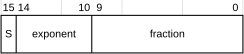

# ​A1.4.3 Half-precision floating-point formats

Source: <https://developer.arm.com/documentation/ddi0487/mc/-Part-A-Arm-Architecture-Introduction-and-Overview/-Chapter-A1-Introduction-to-the-Arm-Architecture/-A1-4-Supported-data-types/-A1-4-3-Half-precision-floating-point-formats>

##### A1.4.3 Half-precision floating-point formats

The Arm architecture supports two half-precision floating-point formats:

- IEEE half-precision, as described in the IEEE 754-2008 standard.
- Arm *alternative half-precision* format.

> #### Note
>
> BFloat16 is not a half-precision floating-point format, see [BFloat16 floating-point format](/documentation/ddi0487/mc/-Part-A-Arm-Architecture-Introduction-and-Overview/-Chapter-A1-Introduction-to-the-Arm-Architecture/-A1-4-Supported-data-types/-A1-4-6-BFloat16-floating-point-format?lang=en#babidcii).

Both formats can be used for conversions to and from other floating-point formats.

[FPCR](/documentation/ddi0487/mc/-Part-C-The-AArch64-Instruction-Set/-Chapter-C5-The-A64-System-Instruction-Class/-C5-2-Special-purpose-registers/-C5-2-8-FPCR--Floating-point-Control-Register?lang=en#reg_aarch64_fpcr).AHP controls the format in AArch64 state and [FPSCR](/documentation/ddi0487/mc/-Part-G-The-AArch32-System-Level-Architecture/-Chapter-G8-AArch32-System-Register-Descriptions/-G8-2-General-system-control-registers/-G8-2-55-FPSCR--Floating-Point-Status-and-Control-Register?lang=en#reg_aarch32_fpscr).AHP controls the format in AArch32 state. [FEAT\_FP16](/documentation/ddi0487/mc/-Part-A-Arm-Architecture-Introduction-and-Overview/-Chapter-A2-A-profile-Architecture-Extensions/-A2-2-Armv8-A-architecture-extensions/-A2-2-3-The-Armv8-2-architecture-extension?lang=en#feat_feat_fp16) adds half-precision data-processing instructions, which always use the IEEE format. These instructions ignore the value of the relevant AHP field, and behave as if it has an [Effective value](/documentation/ddi0487/mc/-Part-K-Appendixes/Glossary?lang=en#effective_value) of 0.

All SVE half-precision data-processing instructions, including conversions, ignore the value of [FPCR](/documentation/ddi0487/mc/-Part-C-The-AArch64-Instruction-Set/-Chapter-C5-The-A64-System-Instruction-Class/-C5-2-Special-purpose-registers/-C5-2-8-FPCR--Floating-point-Control-Register?lang=en#reg_aarch64_fpcr).AHP, and behave as if it has an [Effective value](/documentation/ddi0487/mc/-Part-K-Appendixes/Glossary?lang=en#effective_value) of 0.

The description of IEEE half-precision includes Arm-specific details that are left open by the standard, and is only an introduction to the formats and to the values they can contain. For more information, especially on the handling of infinities, NaNs, and signed zeros, see the IEEE 754 standard.

For both half-precision floating-point formats, the layout of the 16-bit format is the same. The format is:

The interpretation of the format depends on the value of the exponent field, bits[14:10] and on which half-precision format is being used.

0 < exponent < `0x1F`
:   The value is a normalized number and is equal to:

    (-1)S × 2(exponent-15) × (1.fraction)

    The minimum positive normalized number is 2-14, or approximately 6.104 × 10-5.

    The maximum positive normalized number is (2 - 2-10) × 215, or 65504.

    Larger normalized numbers can be expressed using the alternative format when the exponent == `0x1F`.

exponent == 0
:   The value is either a zero or a denormalized number, depending on the fraction bits:

    fraction == 0
    :   The value is a zero. There are two distinct zeros:

        +0
        :   when S==0.

        -0
        :   when S==1.

    fraction != 0
    :   The value is a denormalized number and is equal to:

        (-1)S × 2-14 × (0.fraction)

    The minimum positive denormalized number is 2-24, or approximately 5.960 × 10-8.

    Half-precision denormalized numbers are not flushed to zero by default. When [FEAT\_FP16](/documentation/ddi0487/mc/-Part-A-Arm-Architecture-Introduction-and-Overview/-Chapter-A2-A-profile-Architecture-Extensions/-A2-2-Armv8-A-architecture-extensions/-A2-2-3-The-Armv8-2-architecture-extension?lang=en#feat_feat_fp16) is implemented, the [FPCR](/documentation/ddi0487/mc/-Part-C-The-AArch64-Instruction-Set/-Chapter-C5-The-A64-System-Instruction-Class/-C5-2-Special-purpose-registers/-C5-2-8-FPCR--Floating-point-Control-Register?lang=en#reg_aarch64_fpcr).FZ16 bit controls whether flushing denormalized numbers to zero is enabled for half-precision data-processing instructions. For details, see [Flushing denormalized numbers to zero](/documentation/ddi0487/mc/-Part-A-Arm-Architecture-Introduction-and-Overview/-Chapter-A1-Introduction-to-the-Arm-Architecture/-A1-5-Floating-point-support/-A1-5-6-Flushing-denormalized-numbers-to-zero?lang=en#chdbdeij).

exponent == `0x1F`
:   The value depends on which half-precision format is being used:

    IEEE half-precision
    :   The value is either an infinity or a Not a Number (NaN), depending on the fraction bits:

        fraction == 0
        :   The value is an infinity. There are two distinct infinities:

            +infinity
            :   When S==0. This represents all positive numbers that are too big to be represented accurately as a normalized number.

            -infinity
            :   When S==1. This represents all negative numbers with an absolute value that is too big to be represented accurately as a normalized number.

        fraction != 0
        :   The value is a NaN, and is either a *quiet NaN* or a *signaling NaN*.

            The two types of NaN are distinguished by their most significant fraction bit, bit[9]:

            bit[9] == 0
            :   The NaN is a signaling NaN. The sign bit can take any value, and the remaining fraction bits can take any value except all zeros.

            bit[9] == 1
            :   The NaN is a quiet NaN. The sign bit and remaining fraction bits can take any value.

    Alternative half-precision
    :   The value is a normalized number and is equal to:

        -1S × 216 × (1.fraction)

        The maximum positive normalized number is (2-2-10) × 216 or 131008.
