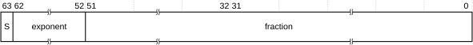

# ​A1.4.5 Double-precision floating-point format

Source: <https://developer.arm.com/documentation/ddi0487/mc/-Part-A-Arm-Architecture-Introduction-and-Overview/-Chapter-A1-Introduction-to-the-Arm-Architecture/-A1-4-Supported-data-types/-A1-4-5-Double-precision-floating-point-format>

##### A1.4.5 Double-precision floating-point format

The double-precision floating-point format is as defined by the IEEE 754 standard. Double-precision floating-point is supported by both SIMD and floating-point instructions in AArch64 state, and only by floating-point instructions in AArch32 state.

This description includes IMPLEMENTATION SPECIFIC details that are left open by the standard. It is only intended as an introduction to the formats and to the values they can contain. For full details, especially of the handling of infinities, NaNs, and signed zeros, see the IEEE 754 standard.

A double-precision value is a 64-bit doubleword, with the format:

Double-precision values represent numbers, infinities, and NaNs in a similar way to single-precision values, with the interpretation of the format depending on the value of the exponent:

0 < exponent < `0x7FF`
:   The value is a normalized number and is equal to:

    (-1)S × 2(exponent-1023) × (1.fraction)

    The minimum positive normalized number is 2-1022, or approximately 2.225 × 10-308.

    The maximum positive normalized number is (2 - 2-52) × 21023, or approximately 1.798 × 10308.

exponent == 0
:   The value is either a zero or a denormalized number, depending on the fraction bits:

    fraction == 0
    :   The value is a zero. There are two distinct zeros that behave in the same way as the two single-precision zeros:

        +0
        :   when S==0.

        -0
        :   when S==1.

    fraction != 0
    :   The value is a denormalized number and is equal to:

        (-1)S × 2-1022 × (0.fraction)

    The minimum positive denormalized number is 2-1074, or approximately 4.941 × 10-324.

    Optionally, denormalized numbers are flushed to zero in floating-point calculations. For details, see [Flushing denormalized numbers to zero](/documentation/ddi0487/mc/-Part-A-Arm-Architecture-Introduction-and-Overview/-Chapter-A1-Introduction-to-the-Arm-Architecture/-A1-5-Floating-point-support/-A1-5-6-Flushing-denormalized-numbers-to-zero?lang=en#chdbdeij).

exponent == `0x7FF`
:   The value is either an infinity or a NaN, depending on the fraction bits:

    fraction == 0
    :   The value is an infinity. As for single-precision, there are two infinities:

        +infinity
        :   When S==0.

        -infinity
        :   When S==1.

    fraction != 0
    :   The value is a NaN, and is either a *quiet NaN* or a *signaling NaN*.

        The two types of NaN are distinguished by their most significant fraction bit, bit[51] of the doubleword:

        bit[51] == 0
        :   The NaN is a signaling NaN. The sign bit can take any value, and the remaining fraction bits can take any value except all zeros.

        bit[51] == 1
        :   The NaN is a quiet NaN. The sign bit and the remaining fraction bits can take any value.

    For details of the *default NaN*, see [Default NaN](/documentation/ddi0487/mc/-Part-A-Arm-Architecture-Introduction-and-Overview/-Chapter-A1-Introduction-to-the-Arm-Architecture/-A1-5-Floating-point-support/-A1-5-7-NaN-handling-and-the-default-NaN?lang=en#babjcbbc).

> #### Note
>
> NaNs with different sign or fraction bits are distinct NaNs, but this does not mean software can use floating-point comparison instructions to distinguish them. This is because the IEEE 754 standard specifies that a NaN compares as *unordered* with everything, including itself.
