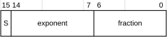

# ​A1.4.6 BFloat16 floating-point format

Source: <https://developer.arm.com/documentation/ddi0487/mc/-Part-A-Arm-Architecture-Introduction-and-Overview/-Chapter-A1-Introduction-to-the-Arm-Architecture/-A1-4-Supported-data-types/-A1-4-6-BFloat16-floating-point-format>

##### A1.4.6 BFloat16 floating-point format

BFloat16 is a 16-bit floating-point storage format that inherits many of its properties and behaviors from the IEEE 754 single-precision format described in [Single-precision floating-point format](/documentation/ddi0487/mc/-Part-A-Arm-Architecture-Introduction-and-Overview/-Chapter-A1-Introduction-to-the-Arm-Architecture/-A1-4-Supported-data-types/-A1-4-4-Single-precision-floating-point-format?lang=en#bgbebhjf).

The BFloat16 format is:

0 < exponent < `0xFF`
:   The value is a normalized number and is equal to:

    (-1)S × 2(exponent-127) × (1.fraction)

    The minimum positive normalized number is 2-126, or approximately 1.175 × 10-38.

    The maximum positive normalized number is (2 - 2-7) × 2127, or approximately 3.390 × 1038.

exponent == 0
:   The value is either a zero or a denormalized number, depending on the fraction bits:

    fraction == 0
    :   The value is a zero. There are two distinct zeros:

        +0
        :   when S==0.

        -0
        :   when S==1.

        These usually behave identically. However, they yield different results in some circumstances. For example, the sign of the result produced as the result of multiplying by zero depends on the sign of the zero. The two zeros can be distinguished from each other by performing an integer bitwise comparison of the two halfwords.

    fraction != 0
    :   The value is a denormalized number and is equal to:

        (-1)S × 2-126 × (0.fraction)

    The minimum positive denormalized number is 2-133, or approximately 9.184 × 10-41.

    Denormalized numbers are always flushed to zero in Advanced SIMD processing in AArch32 state. They are optionally flushed to zero in floating-point processing and in Advanced SIMD processing in AArch64 state. For details, see [Flushing denormalized numbers to zero](/documentation/ddi0487/mc/-Part-A-Arm-Architecture-Introduction-and-Overview/-Chapter-A1-Introduction-to-the-Arm-Architecture/-A1-5-Floating-point-support/-A1-5-6-Flushing-denormalized-numbers-to-zero?lang=en#chdbdeij).

exponent == `0xFF`
:   The value is either an infinity or a Not a Number (NaN), depending on the fraction bits:

    fraction == 0
    :   The value is an infinity. There are two distinct infinities:

        +infinity
        :   When S==0. This represents all positive numbers that are too big to be represented accurately as a normalized number.

        -infinity
        :   When S==1. This represents all negative numbers with an absolute value that is too big to be represented accurately as a normalized number.

    fraction != 0
    :   The value is a NaN, and is either a *quiet NaN* or a *signaling NaN*.

        The two types of NaN are distinguished by their most significant fraction bit, bit[6]:

        bit[6] == 0
        :   The NaN is a signaling NaN. The sign bit can take any value, and the remaining fraction bits can take any value except all zeros.

        bit[6] == 1
        :   The NaN is a quiet NaN. The sign bit and remaining fraction bits can take any value.

BFloat16 values are 16-bit halfwords that software can convert to single-precision format, by appending 16 zero bits, so that single-precision arithmetic instructions can be used. A single-precision value can be converted to a BFloat16 value, either by:

- Truncating, by removing the least significant 16 bits.
- Using the BFloat16 conversion instructions, see [Table C3-112](/documentation/ddi0487/mc/-Part-C-The-AArch64-Instruction-Set/-Chapter-C3-A64-Instruction-Set-Overview/-C3-8-Data-processing---SIMD-and-floating-point/-C3-8-4-Floating-point-conversion?lang=en#tbl_babggfeig4).

See also:

- [Summary of BFloat16 instruction behaviors](/documentation/ddi0487/mc/-Part-A-Arm-Architecture-Introduction-and-Overview/-Chapter-A1-Introduction-to-the-Arm-Architecture/-A1-5-Floating-point-support/-A1-5-4-Summary-of-BFloat16-instruction-behaviors?lang=en#babbigbhj6).
