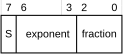
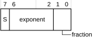

# ​A1.4.7 FP8 floating-point formats

Source: <https://developer.arm.com/documentation/ddi0487/mc/-Part-A-Arm-Architecture-Introduction-and-Overview/-Chapter-A1-Introduction-to-the-Arm-Architecture/-A1-4-Supported-data-types/-A1-4-7-FP8-floating-point-formats>

##### A1.4.7 FP8 floating-point formats

The Arm architecture supports two 8-bit floating-point (FP8) formats:

- [OFP8 E4M3 format](/documentation/ddi0487/mc/-Part-A-Arm-Architecture-Introduction-and-Overview/-Chapter-A1-Introduction-to-the-Arm-Architecture/-A1-4-Supported-data-types/-A1-4-7-FP8-floating-point-formats?lang=en#ofp8_e4m3_format).
- [OFP8 E5M2 format](/documentation/ddi0487/mc/-Part-A-Arm-Architecture-Introduction-and-Overview/-Chapter-A1-Introduction-to-the-Arm-Architecture/-A1-4-Supported-data-types/-A1-4-7-FP8-floating-point-formats?lang=en#ofp8_e5m2_format).

These formats are used by FP8 instructions, which are instructions, where the input or output elements are in FP8 floating-point format. [FPMR](/documentation/ddi0487/mc/-Part-C-The-AArch64-Instruction-Set/-Chapter-C5-The-A64-System-Instruction-Class/-C5-2-Special-purpose-registers/-C5-2-9-FPMR--Floating-point-Mode-Register?lang=en#reg_aarch64_fpmr).F8S1 controls the format for inputs named *First FP8 input data stream* and [FPMR](/documentation/ddi0487/mc/-Part-C-The-AArch64-Instruction-Set/-Chapter-C5-The-A64-System-Instruction-Class/-C5-2-Special-purpose-registers/-C5-2-9-FPMR--Floating-point-Mode-Register?lang=en#reg_aarch64_fpmr).F8S2 controls the format for inputs named *Second FP8 input data stream*. The format of an FP8 output from an FP8 instruction is determined by [FPMR](/documentation/ddi0487/mc/-Part-C-The-AArch64-Instruction-Set/-Chapter-C5-The-A64-System-Instruction-Class/-C5-2-Special-purpose-registers/-C5-2-9-FPMR--Floating-point-Mode-Register?lang=en#reg_aarch64_fpmr).F8D field.

For more information, see *OCP 8-bit Floating Point Specification (OFP8)*.

###### A1.4.7.1 OFP8 E4M3 format

The OFP8 E4M3 format is:

(0 < exponent < `0xF`) || (exponent == `0xF` && fraction < `0x7`)
:   The value is a normalized number and is equal to:

    (-1)S × 2(exponent-7) × (1.fraction)

    The minimum positive normalized number is 2-6.

    The maximum positive normalized number is (2 - 2-2) × 28.

exponent == 0
:   The value is either a zero or a denormalized number, depending on the fraction bits:

    fraction == 0
    :   The value is a zero. There are two distinct zeros that behave in the same way as the two single-precision zeros:

        +0
        :   when S==0.

        -0
        :   when S==1.

    fraction != 0
    :   The value is a denormalized number and is equal to:

        (-1)S × 2-6 × (0.fraction)

        The minimum positive denormalized number is 2-9.

        FP8 denormalized numbers are never flushed to zero.

exponent == `0xF` && fraction == `0x7`
:   The value is a *signaling NaN*.

An infinity is not supported.

###### A1.4.7.2 OFP8 E5M2 format

The OFP8 E5M2 format is:

0 < exponent < `0x1F`
:   The value is a normalized number and is equal to:

    (-1)S × 2(exponent-15) × (1.fraction)

    The minimum positive normalized number is 2-14.

    The maximum positive normalized number is (2 - 2-2) × 215.

exponent == 0
:   The value is either a zero or a denormalized number, depending on the fraction bits:

    fraction == 0
    :   The value is a zero. There are two distinct zeros that behave in the same way as the two single-precision zeros:

        +0
        :   when S==0.

        -0
        :   when S==1.

    fraction != 0
    :   The value is a denormalized number and is equal to:

        (-1)S × 2-14 × (0.fraction)

        The minimum positive denormalized number is 2-16.

        FP8 denormalized numbers are never flushed to zero.

exponent == `0x1F`
:   The value is either an infinity or a NaN, depending on the fraction bits:

    fraction == 0
    :   The value is an infinity. There are two distinct infinities:

        +infinity
        :   When S==0. This represents all positive numbers that are too big to be represented accurately as a normalized number.

        -infinity
        :   When S==1. This represents all negative numbers with an absolute that is too big to be represented accurately as a normalized number.

    fraction != 0
    :   The value is a NaN, and is either a *quiet NaN* or a *signaling NaN*.

        The two types of NaN are distinguished by their most significant fraction bit, bit[1]:

        bit[1] == 0
        :   The NaN is a signaling NaN. The sign bit can take any value, and bit[0] is 1.

        bit[1] == 1
        :   The NaN is a quiet NaN. The sign bit and bit[0] can take any value.
