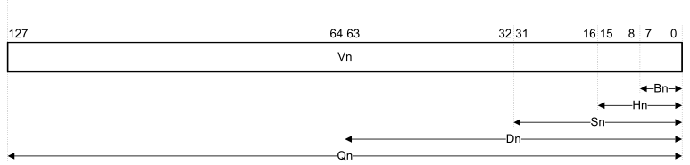
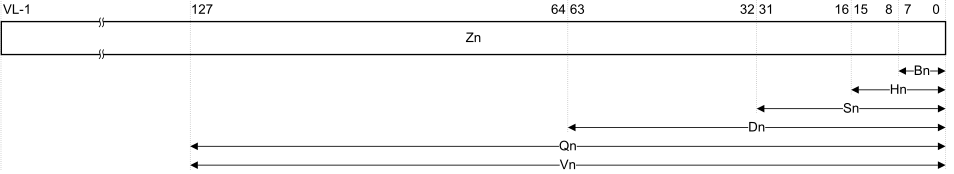

# ​B1.2 Registers in AArch64 Execution state

Source: <https://developer.arm.com/documentation/ddi0487/mc/-Part-B-The-AArch64-Application-Level-Architecture/-Chapter-B1-The-AArch64-Application-Level-Programmers--Model/-B1-2-Registers-in-AArch64-Execution-state>

#### B1.2 Registers in AArch64 Execution state

The following registers are visible at EL0 using AArch64:

R0-R30
:   31 general-purpose registers, R0 to R30. Each can be accessed as:

    - A 64-bit general-purpose register named X0 to X30.
    - A 32-bit general-purpose register named W0 to W30.

    Figure B1-1 General-purpose register naming

    

    The X30 general-purpose register is used as the procedure call link register.

SP
:   A 64-bit dedicated Stack Pointer register. The least significant 32 bits of the stack pointer can be accessed using the register name WSP.

    The use of SP as an operand in an instruction, indicates the use of the current stack pointer.

    > #### Note
    >
    > Stack pointer alignment to a 16-byte boundary is configurable at EL1. For more information, see the *Procedure Call Standard for the Arm 64-bit Architecture*.

PC
:   A 64-bit Program Counter holding the address of the current instruction.

    Software cannot write directly to the PC. It can be updated only on a branch, exception entry or exception return.

    > #### Note
    >
    > Attempting to execute an A64 instruction that is not word-aligned generates a PC alignment fault, see [PC alignment checking](/documentation/ddi0487/mc/-Part-D-The-AArch64-System-Level-Architecture/-Chapter-D1-The-AArch64-System-Level-Programmers--Model/-D1-4-Exceptions/-D1-4-10-Program-Counter-and-stack-pointer-alignment?lang=en#mdsec_pc_alignment_checking).

V0-V31
:   32 SIMD&FP registers, V0 to V31. Each can be accessed as:

    - A 128-bit register named Q0 to Q31.
    - A 64-bit register named D0 to D31.
    - A 32-bit register named S0 to S31.
    - A 16-bit register named H0 to H31.
    - An 8-bit register named B0 to B31.
    - A 128-bit vector of elements. See [Figure A1-1](/documentation/ddi0487/mc/-Part-A-Arm-Architecture-Introduction-and-Overview/-Chapter-A1-Introduction-to-the-Arm-Architecture/-A1-4-Supported-data-types/-A1-4-1-Advanced-SIMD-vector-formats?lang=en#fig_babhigai).
    - A 64-bit vector of elements. See [Figure A1-1](/documentation/ddi0487/mc/-Part-A-Arm-Architecture-Introduction-and-Overview/-Chapter-A1-Introduction-to-the-Arm-Architecture/-A1-4-Supported-data-types/-A1-4-1-Advanced-SIMD-vector-formats?lang=en#fig_babhigai).

    Where the number of bits described by a register name does not occupy an entire SIMD&FP register, it refers to the least significant bits. See [Figure B1-2](/documentation/ddi0487/mc/-Part-B-The-AArch64-Application-Level-Architecture/-Chapter-B1-The-AArch64-Application-Level-Programmers--Model/-B1-2-Registers-in-AArch64-Execution-state?lang=en#fig_cegcbhig).

    For more information about data types and vector formats, see [Supported data types](/documentation/ddi0487/mc/-Part-A-Arm-Architecture-Introduction-and-Overview/-Chapter-A1-Introduction-to-the-Arm-Architecture/-A1-4-Supported-data-types?lang=en#babhibee).

    Figure B1-2 SIMD and floating-point register naming

    

FPCR, FPSR
:   The [FPCR](/documentation/ddi0487/mc/-Part-C-The-AArch64-Instruction-Set/-Chapter-C5-The-A64-System-Instruction-Class/-C5-2-Special-purpose-registers/-C5-2-8-FPCR--Floating-point-Control-Register?lang=en#reg_aarch64_fpcr) is the floating-point control register. The [FPSR](/documentation/ddi0487/mc/-Part-C-The-AArch64-Instruction-Set/-Chapter-C5-The-A64-System-Instruction-Class/-C5-2-Special-purpose-registers/-C5-2-10-FPSR--Floating-point-Status-Register?lang=en#reg_aarch64_fpsr) is the floating-point status register.

Z0-Z31
:   32 SVE scalable vector registers, Z0 to Z31, of equal length. Each register can be accessed as:

    - A configurable-length vector of elements. The length, VL, is a power of two, from a minimum of 128 bits to an IMPLEMENTATION DEFINED maximum no greater than 2048 bits. See [Figure B1-3](/documentation/ddi0487/mc/-Part-B-The-AArch64-Application-Level-Architecture/-Chapter-B1-The-AArch64-Application-Level-Programmers--Model/-B1-2-Registers-in-AArch64-Execution-state?lang=en#fig_beighcffg5), [Figure A1-5](/documentation/ddi0487/mc/-Part-A-Arm-Architecture-Introduction-and-Overview/-Chapter-A1-Introduction-to-the-Arm-Architecture/-A1-4-Supported-data-types/-A1-4-2-SVE-vector-formats?lang=en#fig_babdefcga4), and [Configurable SVE vector lengths](/documentation/ddi0487/mc/-Part-B-The-AArch64-Application-Level-Architecture/-Chapter-B1-The-AArch64-Application-Level-Programmers--Model/-B1-4-The-Scalable-Vector-and-Scalable-Matrix-Extensions--SVE---SME-/-B1-4-2-Configurable-SVE-vector-lengths?lang=en#beijgdghi3).
    - A SIMD&FP register, as described in [V0-V31](/documentation/ddi0487/mc/-Part-B-The-AArch64-Application-Level-Architecture/-Chapter-B1-The-AArch64-Application-Level-Programmers--Model/-B1-2-Registers-in-AArch64-Execution-state?lang=en#beigjidgi0). Bits[127:0] of each Zn register hold the correspondingly numbered [V0-V31](/documentation/ddi0487/mc/-Part-B-The-AArch64-Application-Level-Architecture/-Chapter-B1-The-AArch64-Application-Level-Programmers--Model/-B1-2-Registers-in-AArch64-Execution-state?lang=en#beigjidgi0) SIMD&FP register, as [Figure B1-3](/documentation/ddi0487/mc/-Part-B-The-AArch64-Application-Level-Architecture/-Chapter-B1-The-AArch64-Application-Level-Programmers--Model/-B1-2-Registers-in-AArch64-Execution-state?lang=en#fig_beighcffg5) shows:

    Figure B1-3 SVE scalable vector register naming

    

    See also:

    - [Maximum implemented SVE vector lengths](/documentation/ddi0487/mc/-Part-B-The-AArch64-Application-Level-Architecture/-Chapter-B1-The-AArch64-Application-Level-Programmers--Model/-B1-4-The-Scalable-Vector-and-Scalable-Matrix-Extensions--SVE---SME-/-B1-4-1-Maximum-implemented-SVE-vector-lengths?lang=en#beiceffjj1).
    - [Configurable SVE vector lengths](/documentation/ddi0487/mc/-Part-B-The-AArch64-Application-Level-Architecture/-Chapter-B1-The-AArch64-Application-Level-Programmers--Model/-B1-4-The-Scalable-Vector-and-Scalable-Matrix-Extensions--SVE---SME-/-B1-4-2-Configurable-SVE-vector-lengths?lang=en#beijgdghi3).
    - [Treatment of SVE scalable vector registers](/documentation/ddi0487/mc/-Part-B-The-AArch64-Application-Level-Architecture/-Chapter-B1-The-AArch64-Application-Level-Programmers--Model/-B1-4-The-Scalable-Vector-and-Scalable-Matrix-Extensions--SVE---SME-/-B1-4-3-Treatment-of-SVE-scalable-vector-registers?lang=en#beijagebg2).
    - [SVE writes of scalar values to registers](/documentation/ddi0487/mc/-Part-B-The-AArch64-Application-Level-Architecture/-Chapter-B1-The-AArch64-Application-Level-Programmers--Model/-B1-4-The-Scalable-Vector-and-Scalable-Matrix-Extensions--SVE---SME-/-B1-4-4-SVE-writes-of-scalar-values-to-registers?lang=en#cacjahefa5).

P0-P15
:   16 SVE predicate registers, named P0 to P15. Each SVE predicate register holds one bit for each byte of an SVE scalar vector register.

    > #### Note
    >
    > The *Maximum implemented SVE predicate length* is the *Maximum implemented SVE vector length* divided by 8. See [Maximum implemented SVE vector lengths](/documentation/ddi0487/mc/-Part-B-The-AArch64-Application-Level-Architecture/-Chapter-B1-The-AArch64-Application-Level-Programmers--Model/-B1-4-The-Scalable-Vector-and-Scalable-Matrix-Extensions--SVE---SME-/-B1-4-1-Maximum-implemented-SVE-vector-lengths?lang=en#beiceffjj1).

    Also see [Vector predication](/documentation/ddi0487/mc/-Part-B-The-AArch64-Application-Level-Architecture/-Chapter-B1-The-AArch64-Application-Level-Programmers--Model/-B1-4-The-Scalable-Vector-and-Scalable-Matrix-Extensions--SVE---SME-/-B1-4-5-Vector-predication?lang=en#beicjehdj1).

FFR
:   The dedicated SVE First Fault Register that has the same size and format as the SVE predicate registers, P0-P15. See [FFR, First Fault Register](/documentation/ddi0487/mc/-Part-B-The-AArch64-Application-Level-Architecture/-Chapter-B1-The-AArch64-Application-Level-Programmers--Model/-B1-2-Registers-in-AArch64-Execution-state/-B1-2-1-FFR--First-Fault-Register?lang=en#cihcgjcce4).

ZA
:   Architectural state capable of holding a two-dimensional array of bytes. See [ZA storage](/documentation/ddi0487/mc/-Part-B-The-AArch64-Application-Level-Architecture/-Chapter-B1-The-AArch64-Application-Level-Programmers--Model/-B1-4-The-Scalable-Vector-and-Scalable-Matrix-Extensions--SVE---SME-/-B1-4-8-ZA-storage?lang=en#beibbjiba1).

ZT0
:   A 512-bit SME2 lookup table register. See [SME2 ZT0 register](/documentation/ddi0487/mc/-Part-B-The-AArch64-Application-Level-Architecture/-Chapter-B1-The-AArch64-Application-Level-Programmers--Model/-B1-4-The-Scalable-Vector-and-Scalable-Matrix-Extensions--SVE---SME-/-B1-4-13-SME2-ZT0-register?lang=en#beicdfdef8).

See also:

- [System registers](/documentation/ddi0487/mc/-Part-B-The-AArch64-Application-Level-Architecture/-Chapter-B1-The-AArch64-Application-Level-Programmers--Model/-B1-2-Registers-in-AArch64-Execution-state/-B1-2-2-System-registers?lang=en#beijgicj).
- [Pseudocode description of registers in AArch64 state](/documentation/ddi0487/mc/-Part-B-The-AArch64-Application-Level-Architecture/-Chapter-B1-The-AArch64-Application-Level-Programmers--Model/-B1-2-Registers-in-AArch64-Execution-state/-B1-2-3-Pseudocode-description-of-registers-in-AArch64-state?lang=en#chdbibdd).
- [Registers for instruction processing and exception handling](/documentation/ddi0487/mc/-Part-D-The-AArch64-System-Level-Architecture/-Chapter-D1-The-AArch64-System-Level-Programmers--Model/-D1-2-Registers-for-instruction-processing-and-exception-handling?lang=en#beijccai).
