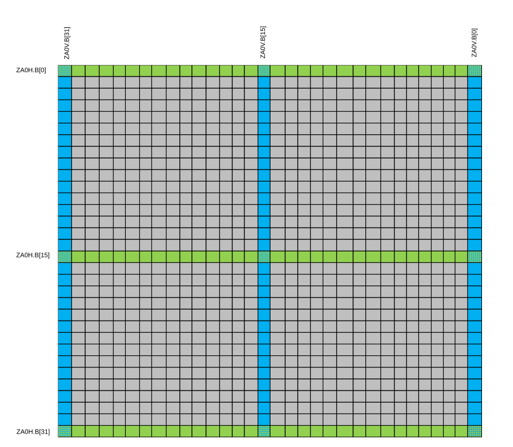
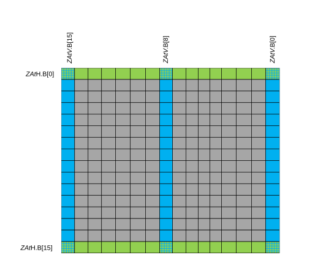
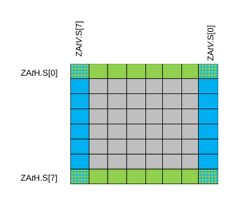
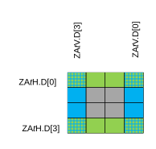
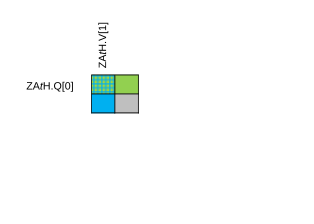

# ​B1.4.10 ZA tile access

Source: <https://developer.arm.com/documentation/ddi0487/mc/-Part-B-The-AArch64-Application-Level-Architecture/-Chapter-B1-The-AArch64-Application-Level-Programmers--Model/-B1-4-The-Scalable-Vector-and-Scalable-Matrix-Extensions--SVE---SME-/-B1-4-10-ZA-tile-access>

##### B1.4.10 ZA tile access

D VSVMX
:   A *ZA tile* is a square, two-dimensional sub-array of elements within the *ZA* array.

I WLRTV
:   Depending on the element size with which it is accessed, the ZA array is treated as containing one or more *ZA* tiles, as described in the following sections.

D DWMYT
:   A *ZA* tile is indicated by appending the tile number to the *ZA* name.

D ZGBHT
:   A *ZA tile slice* is a one-dimensional set of horizontally or vertically contiguous elements within a *ZA* tile.

R PZNWB
:   A vector access to a tile reads or writes a *ZA* tile slice.

I NFXHH
:   A *ZA* tile can be accessed as vectors of 8-bit, 16-bit, 32-bit, 64-bit, or 128-bit elements.

I YZDBS
:   A *ZA* tile can be accessed as horizontal slices of SVL bits.

R GPVSZ
:   A *ZA* tile is accessed as horizontal slices if the V field in the accessing instruction opcode is 0.

D TRHTX
:   An access to horizontal tile slices is indicated by an "H" suffix on the *ZA* tile name.

I HBYTT
:   A *ZA* tile can be accessed as vertical slices of SVL bits.

R GPPPK
:   A *ZA* tile is accessed as vertical slices if the V field in the accessing instruction opcode is 1.

D WSBVG
:   An access to vertical tile slices is indicated by a “V” suffix on the *ZA* tile name.

R TWWTL
:   In SME instructions, the tile slice is selected by the sum of a 32-bit general-purpose slice index register W*s* and an immediate slice index offset *offs*, modulo the number of slices in the named tile.

###### B1.4.10.1 Accessing an 8-bit element ZA tile

D HMSNH
:   An 8-bit element *ZA* tile is indicated by a ".B" qualifier following the tile name.

D NLCNH
:   There is a single tile named ZA0.B which consists of [SVLB × SVLB] 8-bit elements and occupies all of the *ZA* storage.

R NBSMJ
:   An access to a horizontal or vertical 8-bit element ZA tile slice reads or writes SVLB 8-bit elements.

D NMHLM
:   An access to a horizontal or vertical 8-bit element ZA tile slice is indicated by appending a slice index "[*N*]" to the tile name, direction suffix, and qualifier. For example, where *N* is in the range 0 to SVLB-1 inclusive:

    - ZA0H.B[*N*] indicates a horizontal 8-bit element *ZA* tile slice selection.
    - ZA0V.B[*N*] indicates a vertical 8-bit element *ZA* tile slice selection.

I JVTNY
:   Horizontal and vertical ZA0.B slice accesses are illustrated in the following diagram for SVL of 256 bits:

    Figure B1-4 Horizontal and vertical ZA0.B slice for SVL of 256

    

R DCSDX
:   An access to the horizontal slice ZA0H.B[*N*] reads or writes the SVLB bytes in *ZA* array vector ZA.B[*N*].

R FHYSQ
:   An access to the vertical slice ZA0V.B[*N*] reads or writes the 8-bit element [*N*] within each horizontal slice of ZA0.B.

D CDDVV
:   The preferred disassembly is:

    - ZA0H.B[W*s*, *offs*], for a horizontal 8-bit element *ZA* tile slice selection.
    - ZA0V.B[W*s*, *offs*], for a vertical 8-bit element *ZA* tile slice selection.

    Where *offs* is an immediate in the range 0-15 inclusive.

###### B1.4.10.2 Accessing a 16-bit element ZA tile

D LNXPD
:   A 16-bit element *ZA* tile is indicated by a ".H" qualifier following the tile name.

D GWZDM
:   There are two tiles named ZA0.H and ZA1.H. Each tile consists of [SVLH × SVLH] 16-bit elements, and occupies half of the *ZA* storage.

R NMGXG
:   An access to a horizontal or vertical 16-bit element ZA tile slice reads or writes SVLH 16-bit elements.

D DHKMC
:   An access to a horizontal or vertical 16-bit element ZA tile slice is indicated by appending a slice index "[*N*]" to the tile name, direction suffix, and qualifier. For example, where *t* is 0 or 1, and *N* is in the range 0 to SVLH-1 inclusive:

    - ZA*t*H.H[*N*] indicates a horizontal 16-bit element *ZA* tile slice selection.
    - ZA*t*V.H[*N*] indicates a vertical 16-bit element *ZA* tile slice selection.

I ZSWJW
:   Horizontal and vertical ZA*t*.H slice accesses, where *t* is 0 or 1, are illustrated in the following diagram for SVL of 256 bits:

    Figure B1-5 Horizontal and vertical ZAt.H slice for SVL of 256

    

R BTLQC
:   An access to the horizontal slice ZA*t*H.H[*N*] reads or writes the SVLH 16-bit elements in *ZA* array vector ZA.H[*t* + 2 \* *N*].

R NGJBJ
:   An access to the vertical slice ZA*t*V.H[*N*] reads or writes the 16-bit element [*N*] within each horizontal slice of ZA*t*.H.

D RHQJT
:   The preferred disassembly is as follows:

    - ZA*t*H.H[W*s*, *offs*], for a horizontal 16-bit element *ZA* tile slice selection.
    - ZA*t*V.H[W*s*, *offs*], for a vertical 16-bit element *ZA* tile slice selection.

    Where *t* is 0 or 1, and *offs* is an immediate in the range 0-7 inclusive.

###### B1.4.10.3 Accessing a 32-bit element ZA tile

D HBKZV
:   A 32-bit element *ZA* tile is indicated by a ".S" qualifier following the tile name.

D RDRRT
:   There are four tiles named ZA0.S, ZA1.S, ZA2.S, and ZA3.S. Each tile consists of [SVLS × SVLS] 32-bit elements, and occupies a quarter of the *ZA* storage.

R XFPPL
:   An access to a horizontal or vertical 32-bit element ZA tile slice reads or writes SVLS 32-bit elements.

D JFPSJ
:   An access to a horizontal or vertical 32-bit element ZA tile slice is indicated by appending a slice index "[*N*]" to the tile name, direction suffix, and qualifier. For example, where *t* is 0, 1, 2, or 3, and *N* is in the range 0 to SVLS-1 inclusive:

    - ZA*t*H.S[*N*] indicates a horizontal 32-bit element *ZA* tile slice selection.
    - ZA*t*V.S[*N*] indicates a vertical 32-bit element *ZA* tile slice selection.

I SZXZR
:   Horizontal and vertical ZA*t*.S slice accesses, where *t* is 0, 1, 2, or 3, are illustrated in the following diagram for SVL of 256 bits:

    Figure B1-6 Horizontal and vertical ZAt.S slice for SVL of 256

    

R JBJZY
:   An access to the horizontal slice ZA*t*H.S[*N*] reads or writes the SVLS 32-bit elements in *ZA* array vector ZA.S[*t* + 4 \* *N*].

R GBYSJ
:   An access to the vertical slice ZA*t*V.S[*N*] reads or writes the 32-bit element [*N*] within each horizontal slice of ZA*t*.S.

D LQLJH
:   The preferred disassembly is:

    - ZA*t*H.S[W*s*, *offs*], for a horizontal 32-bit element *ZA* tile slice selection.
    - ZA*t*V.S[W*s*, *offs*], for a vertical 32-bit element *ZA* tile slice selection.

    Where *t* is 0, 1, 2, or 3, and *offs* is 0, 1, 2, or 3.

###### B1.4.10.4 Accessing a 64-bit element ZA tile

D TWMMM
:   A 64-bit element *ZA* tile is indicated by a ".D" qualifier following the tile name.

D THPSD
:   There are eight tiles named ZA0.D, ZA1.D, ZA2.D, ZA3.D, ZA4.D, ZA5.D, ZA6.D, and ZA7.D. Each tile consists of [SVLD × SVLD] 64-bit elements, and occupies an eighth of the *ZA* storage.

R ZXYBQ
:   An access to a horizontal or vertical 64-bit element ZA tile slice reads or writes SVLD 64-bit elements.

D DCXSX
:   An access to a horizontal or vertical 64-bit element ZA tile slice is indicated by appending a slice index "[*N*]" to the tile name, direction suffix, and qualifier. For example, where *t* is in the range 0-7 inclusive, and *N* is in the range 0 to SVLD-1 inclusive:

    - ZA*t*H.D[*N*] indicates a horizontal 64-bit element *ZA* tile slice selection.
    - ZA*t*V.D[*N*] indicates a vertical 64-bit element *ZA* tile slice selection.

I LGJZC
:   Horizontal and vertical ZA*t*.D slice accesses, where *t* is in the range 0-7 inclusive, are illustrated in the following diagram for SVL of 256 bits:

    Figure B1-7 Horizontal and vertical ZAt.D slice for SVL of 256

    

R CVVJK
:   An access to the horizontal slice ZA*t*H.D[*N*] reads or writes the SVLD 64-bit elements in *ZA* array vector ZA.D[*t* + 8 \* *N*].

R JYQKK
:   An access to the vertical slice ZA*t*V.D[*N*] reads or writes the 64-bit element [*N*] within each horizontal slice of ZA*t*.D.

D MQQPX
:   The preferred disassembly is:

    - ZA*t*H.D[W*s*, *offs*], for a horizontal 64-bit element *ZA* tile slice selection.
    - ZA*t*V.D[W*s*, *offs*], for a vertical 64-bit element *ZA* tile slice selection.

    Where *t* is in the range 0-7 inclusive, and *offs* is 0 or 1.

###### B1.4.10.5 Accessing a 128-bit element ZA tile

D GZDSH
:   A 128-bit element *ZA* tile is indicated by a ".Q" qualifier following the tile name.

D RPMJL
:   There are 16 tiles named ZA0.Q, ZA1.Q, ZA2.Q, ZA3.Q, ZA4.Q, ZA5.Q, ZA6.Q, ZA7.Q, ZA8.Q, ZA9.Q, ZA10.Q, ZA11.Q, ZA12.Q, ZA13.Q, ZA14.Q, and ZA15.Q. Each tile consists of [SVLQ × SVLQ] 128-bit elements, and occupies 1/16 of the *ZA* storage.

R QGHPF
:   An access to a horizontal or vertical 128-bit element ZA tile slice reads or writes SVLQ 128-bit elements.

D RLQKW
:   An access to a horizontal or vertical 128-bit element ZA tile slice is indicated by appending a slice index "[*N*]" to the tile name, direction suffix, and qualifier. For example, where *t* is in the range 0-15 inclusive, and *N* is in the range 0 to SVLQ-1 inclusive:

    - ZA*t*H.Q[*N*] indicates a horizontal 128-bit element *ZA* tile slice selection.
    - ZA*t*V.Q[*N*] indicates a vertical 128-bit element *ZA* tile slice selection.

I YQPWS
:   Horizontal and vertical ZA*t*.Q slice accesses, where *t* is in the range 0-15 inclusive, are illustrated in the following diagram for SVL of 256 bits:

    Figure B1-8 Horizontal and vertical ZAt.Q slice for SVL of 256

    

R PJTQJ
:   An access to the horizontal slice ZA*t*H.Q[*N*] reads or writes the SVLQ 128-bit elements in *ZA* array vector ZA.Q[*t* + 16 \* *N*].

R TRJFZ
:   An access to the vertical slice ZA*t*V.Q[*N*] reads or writes the 128-bit element [*N*] within each horizontal slice of ZA*t*.Q.

D VCLJP
:   The preferred disassembly is:

    - ZA*t*H.Q[W*s*, 0], for a horizontal 128-bit element *ZA* tile slice selection.
    - ZA*t*V.Q[W*s*, 0], for a vertical 128-bit element *ZA* tile slice selection.

    Where *t* is in the range 0-15 inclusive, and the slice index offset is always zero.
