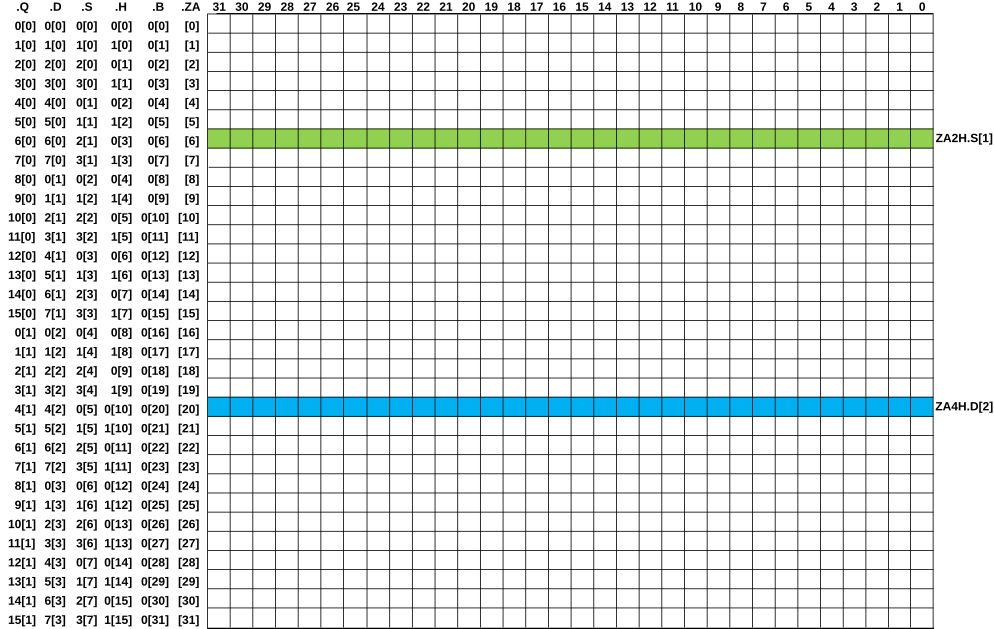
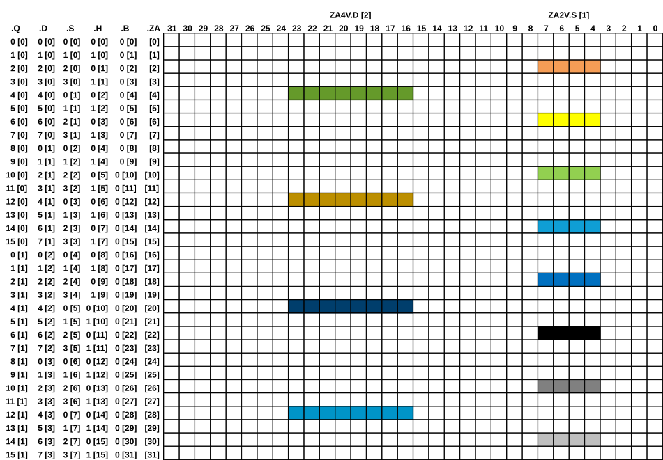
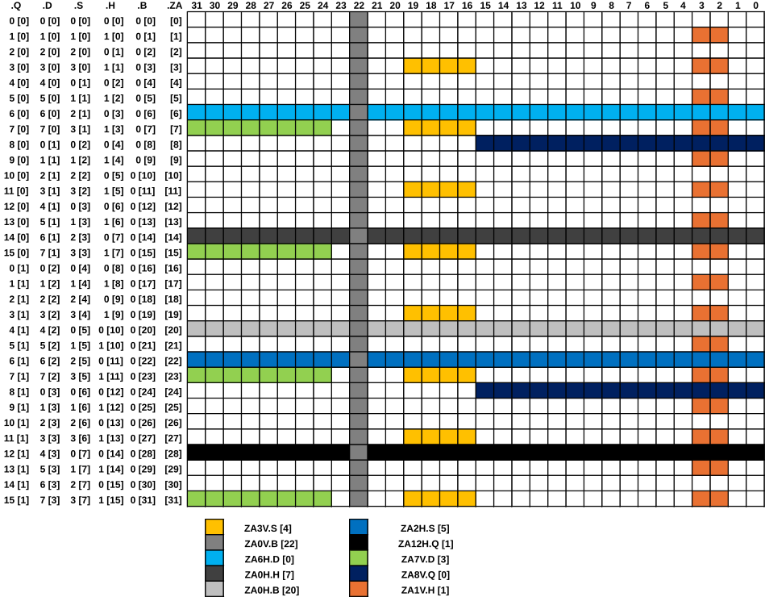
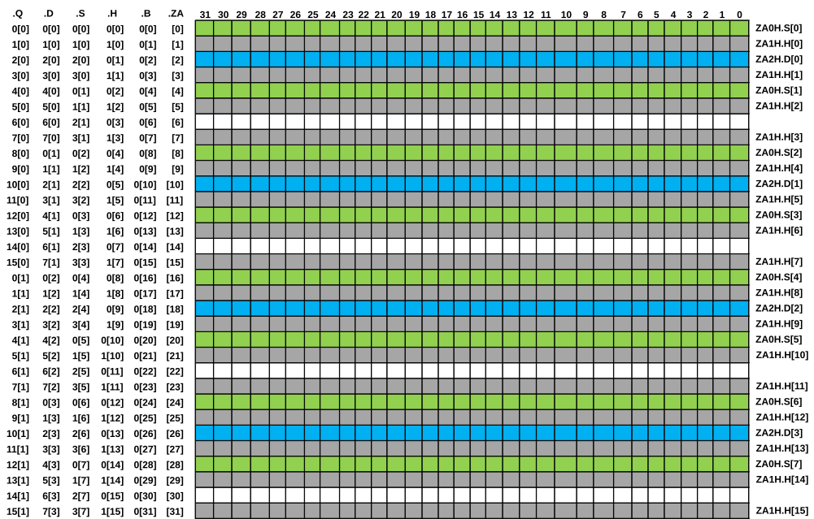

# ​B1.4.11 ZA storage layout

Source: <https://developer.arm.com/documentation/ddi0487/mc/-Part-B-The-AArch64-Application-Level-Architecture/-Chapter-B1-The-AArch64-Application-Level-Programmers--Model/-B1-4-The-Scalable-Vector-and-Scalable-Matrix-Extensions--SVE---SME-/-B1-4-11-ZA-storage-layout>

##### B1.4.11 ZA storage layout

###### B1.4.11.1 ZA array vector and tile slice mappings

I PYTLW
:   Each horizontal tile slice corresponds to one *ZA* array vector.

    The horizontal slice mappings for all tile sizes are illustrated by this table:

<table>
 <colgroup>
  <col/>
  <col/>
  <col/>
  <col/>
  <col/>
  <col/>
 </colgroup>
 <thead>
  <tr>
   <th>
    

     ZA Array
    

    

     Vector
    

   </th>
   <th>
    

     8-bit element Tile
    

    

     Horizontal Slice
    

   </th>
   <th>
    

     16-bit element Tile
    

    

     Horizontal Slice
    

   </th>
   <th>
    

     32-bit element Tile
    

    

     Horizontal Slice
    

   </th>
   <th>
    

     64-bit element Tile
    

    

     Horizontal Slice
    

   </th>
   <th>
    

     128-bit element Tile
    

    

     Horizontal Slice
    

   </th>
  </tr>
 </thead>
 <tbody>
  <tr>
   <td>
    ZA[0]
   </td>
   <td>
    ZA0H.B[0]
   </td>
   <td>
    ZA0H.H[0]
   </td>
   <td>
    ZA0H.S[0]
   </td>
   <td>
    ZA0H.D[0]
   </td>
   <td>
    ZA0H.Q[0]
   </td>
  </tr>
  <tr>
   <td>
    ZA[1]
   </td>
   <td>
    ZA0H.B[1]
   </td>
   <td>
    ZA1H.H[0]
   </td>
   <td>
    ZA1H.S[0]
   </td>
   <td>
    ZA1H.D[0]
   </td>
   <td>
    ZA1H.Q[0]
   </td>
  </tr>
  <tr>
   <td>
    ZA[2]
   </td>
   <td>
    ZA0H.B[2]
   </td>
   <td>
    ZA0H.H[1]
   </td>
   <td>
    ZA2H.S[0]
   </td>
   <td>
    ZA2H.D[0]
   </td>
   <td>
    ZA2H.Q[0]
   </td>
  </tr>
  <tr>
   <td>
    ZA[3]
   </td>
   <td>
    ZA0H.B[3]
   </td>
   <td>
    ZA1H.H[1]
   </td>
   <td>
    ZA3H.S[0]
   </td>
   <td>
    ZA3H.D[0]
   </td>
   <td>
    ZA3H.Q[0]
   </td>
  </tr>
  <tr>
   <td>
    ZA[4]
   </td>
   <td>
    ZA0H.B[4]
   </td>
   <td>
    ZA0H.H[2]
   </td>
   <td>
    ZA0H.S[1]
   </td>
   <td>
    ZA4H.D[0]
   </td>
   <td>
    ZA4H.Q[0]
   </td>
  </tr>
  <tr>
   <td>
    ZA[5]
   </td>
   <td>
    ZA0H.B[5]
   </td>
   <td>
    ZA1H.H[2]
   </td>
   <td>
    ZA1H.S[1]
   </td>
   <td>
    ZA5H.D[0]
   </td>
   <td>
    ZA5H.Q[0]
   </td>
  </tr>
  <tr>
   <td>
    ZA[6]
   </td>
   <td>
    ZA0H.B[6]
   </td>
   <td>
    ZA0H.H[3]
   </td>
   <td>
    ZA2H.S[1]
   </td>
   <td>
    ZA6H.D[0]
   </td>
   <td>
    ZA6H.Q[0]
   </td>
  </tr>
  <tr>
   <td>
    ZA[7]
   </td>
   <td>
    ZA0H.B[7]
   </td>
   <td>
    ZA1H.H[3]
   </td>
   <td>
    ZA3H.S[1]
   </td>
   <td>
    ZA7H.D[0]
   </td>
   <td>
    ZA7H.Q[0]
   </td>
  </tr>
  <tr>
   <td>
    ZA[8]
   </td>
   <td>
    ZA0H.B[8]
   </td>
   <td>
    ZA0H.H[4]
   </td>
   <td>
    ZA0H.S[2]
   </td>
   <td>
    ZA0H.D[1]
   </td>
   <td>
    ZA8H.Q[0]
   </td>
  </tr>
  <tr>
   <td>
    ZA[9]
   </td>
   <td>
    ZA0H.B[9]
   </td>
   <td>
    ZA1H.H[4]
   </td>
   <td>
    ZA1H.S[2]
   </td>
   <td>
    ZA1H.D[1]
   </td>
   <td>
    ZA9H.Q[0]
   </td>
  </tr>
  <tr>
   <td>
    ZA[10]
   </td>
   <td>
    ZA0H.B[10]
   </td>
   <td>
    ZA0H.H[5]
   </td>
   <td>
    ZA2H.S[2]
   </td>
   <td>
    ZA2H.D[1]
   </td>
   <td>
    ZA10H.Q[0]
   </td>
  </tr>
  <tr>
   <td>
    ZA[11]
   </td>
   <td>
    ZA0H.B[11]
   </td>
   <td>
    ZA1H.H[5]
   </td>
   <td>
    ZA3H.S[2]
   </td>
   <td>
    ZA3H.D[1]
   </td>
   <td>
    ZA11H.Q[0]
   </td>
  </tr>
  <tr>
   <td>
    ZA[12]
   </td>
   <td>
    ZA0H.B[12]
   </td>
   <td>
    ZA0H.H[6]
   </td>
   <td>
    ZA0H.S[3]
   </td>
   <td>
    ZA4H.D[1]
   </td>
   <td>
    ZA12H.Q[0]
   </td>
  </tr>
  <tr>
   <td>
    ZA[13]
   </td>
   <td>
    ZA0H.B[13]
   </td>
   <td>
    ZA1H.H[6]
   </td>
   <td>
    ZA1H.S[3]
   </td>
   <td>
    ZA5H.D[1]
   </td>
   <td>
    ZA13H.Q[0]
   </td>
  </tr>
  <tr>
   <td>
    ZA[14]
   </td>
   <td>
    ZA0H.B[14]
   </td>
   <td>
    ZA0H.H[7]
   </td>
   <td>
    ZA2H.S[3]
   </td>
   <td>
    ZA6H.D[1]
   </td>
   <td>
    ZA14H.Q[0]
   </td>
  </tr>
  <tr>
   <td>
    ZA[15]
   </td>
   <td>
    ZA0H.B[15]
   </td>
   <td>
    ZA1H.H[7]
   </td>
   <td>
    ZA3H.S[3]
   </td>
   <td>
    ZA7H.D[1]
   </td>
   <td>
    ZA15H.Q[0]
   </td>
  </tr>
  <tr>
   <td>
    

     if applicable
    

    

     ZA[16] to
    

    

     ZA[SVL
     
      B
     
     -1]
    

   </td>
   <td>
    &hellip;
   </td>
   <td>
    &hellip;
   </td>
   <td>
    &hellip;
   </td>
   <td>
    &hellip;
   </td>
   <td>
    &hellip;
   </td>
  </tr>
 </tbody>
</table>

###### B1.4.11.2 Tile mappings

I YVYJP
:   The smallest *ZA* tile granule is the 128-bit element tile. When the *ZA* storage is viewed as an array of tiles, the larger 64-bit, 32-bit, 16-bit, and 8-bit element tiles overlap multiple 128-bit element tiles as follows:

<table>
 <colgroup>
  <col/>
  <col/>
 </colgroup>
 <thead>
  <tr>
   <th>
    Tile
   </th>
   <th>
    Overlaps
   </th>
  </tr>
 </thead>
 <tbody>
  <tr>
   <td>
    ZA0.B
   </td>
   <td>
    

     ZA0.Q, ZA1.Q, ZA2.Q, ZA3.Q, ZA4.Q, ZA5.Q, ZA6.Q, ZA7.Q,
    

    

     ZA8.Q, ZA9.Q, ZA10.Q, ZA11.Q, ZA12.Q, ZA13.Q, ZA14.Q, ZA15.Q
    

   </td>
  </tr>
  <tr>
   <td>
    ZA0.H
   </td>
   <td>
    ZA0.Q, ZA2.Q, ZA4.Q, ZA6.Q, ZA8.Q, ZA10.Q, ZA12.Q, ZA14.Q
   </td>
  </tr>
  <tr>
   <td>
    ZA1.H
   </td>
   <td>
    ZA1.Q, ZA3.Q, ZA5.Q, ZA7.Q, ZA9.Q, ZA11.Q, ZA13.Q, ZA15.Q
   </td>
  </tr>
  <tr>
   <td>
    ZA0.S
   </td>
   <td>
    ZA0.Q, ZA4.Q, ZA8.Q, ZA12.Q
   </td>
  </tr>
  <tr>
   <td>
    ZA1.S
   </td>
   <td>
    ZA1.Q, ZA5.Q, ZA9.Q, ZA13.Q
   </td>
  </tr>
  <tr>
   <td>
    ZA2.S
   </td>
   <td>
    ZA2.Q, ZA6.Q, ZA10.Q, ZA14.Q
   </td>
  </tr>
  <tr>
   <td>
    ZA3.S
   </td>
   <td>
    ZA3.Q, ZA7.Q, ZA11.Q, ZA15.Q
   </td>
  </tr>
  <tr>
   <td>
    ZA0.D
   </td>
   <td>
    ZA0.Q, ZA8.Q
   </td>
  </tr>
  <tr>
   <td>
    ZA1.D
   </td>
   <td>
    ZA1.Q, ZA9.Q
   </td>
  </tr>
  <tr>
   <td>
    ZA2.D
   </td>
   <td>
    ZA2.Q, ZA10.Q
   </td>
  </tr>
  <tr>
   <td>
    ZA3.D
   </td>
   <td>
    ZA3.Q, ZA11.Q
   </td>
  </tr>
  <tr>
   <td>
    ZA4.D
   </td>
   <td>
    ZA4.Q, ZA12.Q
   </td>
  </tr>
  <tr>
   <td>
    ZA5.D
   </td>
   <td>
    ZA5.Q, ZA13.Q
   </td>
  </tr>
  <tr>
   <td>
    ZA6.D
   </td>
   <td>
    ZA6.Q, ZA14.Q
   </td>
  </tr>
  <tr>
   <td>
    ZA7.D
   </td>
   <td>
    ZA7.Q, ZA15.Q
   </td>
  </tr>
 </tbody>
</table>

I WGZBT
:   The architecture permits concurrent use of different element size tiles.

###### B1.4.11.3 Horizontal tile slice mappings

I NJJXW
:   The following diagram illustrates the *ZA* storage mapping for SVL of 256 bits, for a 32-bit element and 64-bit element horizontal tile slice.

    Each small numbered square represents 8 bits.

    Figure B1-9 ZA storage mapping for SVL of 256 bits: 32-bit and 64-bit element horizontal tile slice

    

    An SME vector load, store, or move instruction that accesses horizontal tile slices ZA2H.S[1] or ZA4H.D[2] treats the slices as vectors with the following layout:

    Figure B1-10 ZA2H.S[1] and ZA4H.D[2] vector layout

    ![ZA2H.S[1] and ZA4H.D[2] vector layout](images/0113-B1.4.11-ZA-storage-layout-img02.svg)

###### B1.4.11.4 Vertical tile slice mappings

I TNCCV
:   The following diagram illustrates the *ZA* storage mapping for SVL of 256 bits, for a 32-bit element and 64-bit element vertical tile slice.

    Each small numbered square represents 8 bits.

    Figure B1-11 ZA storage mapping for SVL of 256 bits: 32-bit and 64-bit element vertical tile slices

    

    An SME vector load, store, or move instruction which accesses vertical tile slices ZA2V.S[1] or ZA4V.D[2] treats the slices as vectors with the following layout:

    Figure B1-12 ZA2V.S[1] and ZA4V.D[2] vector layout

    ![ZA2V.S[1] and ZA4V.D[2] vector layout](images/0113-B1.4.11-ZA-storage-layout-img04.svg)

###### B1.4.11.5 Mixed horizontal and vertical tile slice mappings

I CGXPJ
:   The following diagram illustrates the *ZA* storage mapping for SVL of 256 bits, for various element size tiles, horizontal tile slices, and vertical tile slices.

    Each small square represents 8 bits.

    Figure B1-13 ZA storage mapping for SVL of 256 bits: various vertical and tile slices

    

I HVFMB
:   It is possible to simultaneously use non-overlapping *ZA* array vectors within tiles of differing element sizes. For example, tiles ZA1.H, ZA0.S, and ZA2.D have no *ZA* array vectors in common, as illustrated in the following diagram for SVL of 256 bits:

    Figure B1-14 Using various non-overlapping ZA array vectors within tiles of different element sizes

    

I WDMCK
:   It is possible to access overlapping *ZA* array vectors within tiles of differing element sizes. For example, tiles ZA0.H, ZA2.S, and ZA6.D have common *ZA* array vectors.
