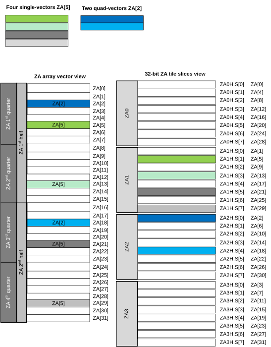
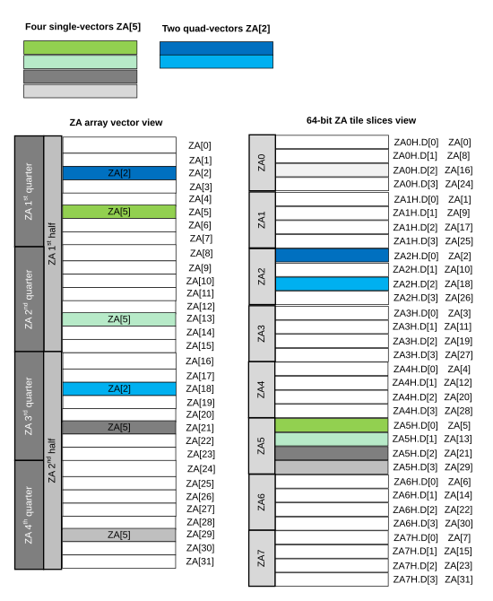
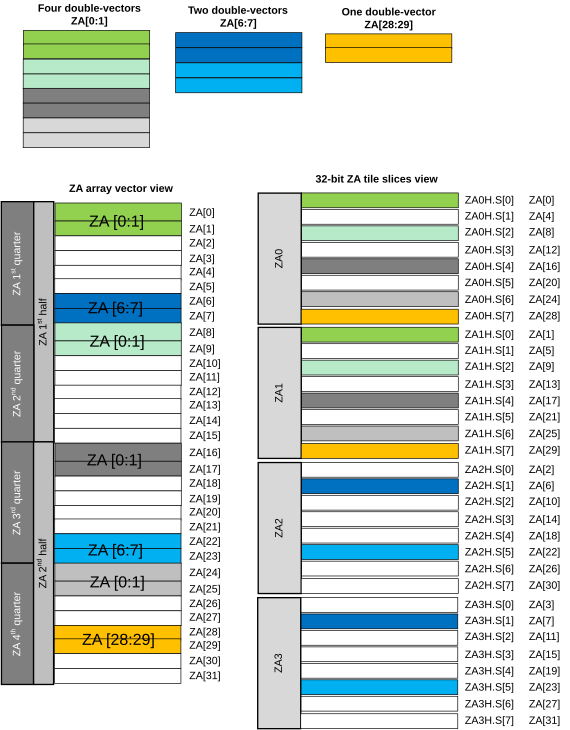
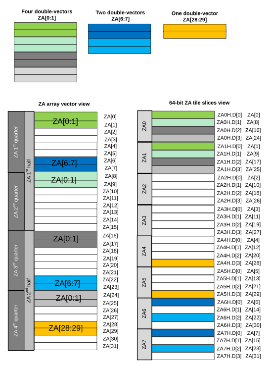
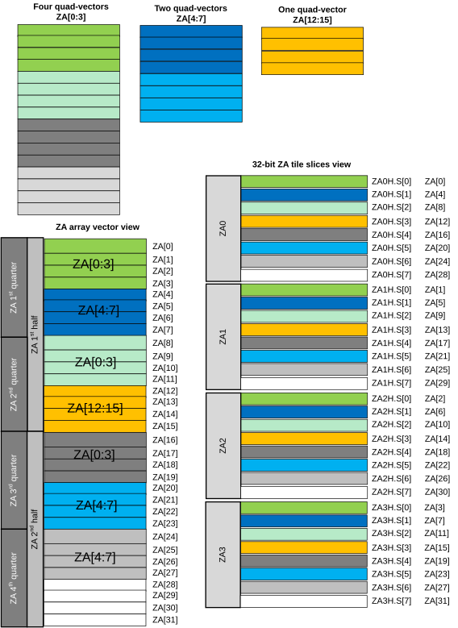
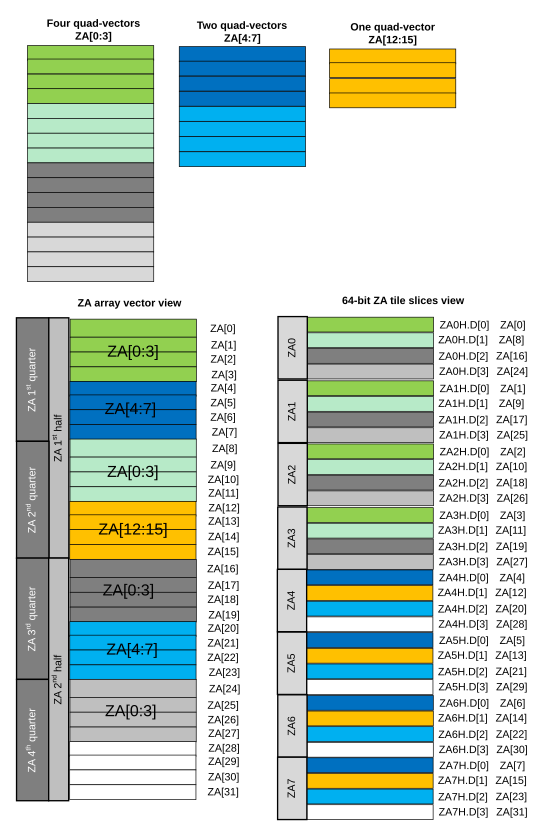

# ​B1.4.12 SME2 Multi-vector operands

Source: <https://developer.arm.com/documentation/ddi0487/mc/-Part-B-The-AArch64-Application-Level-Architecture/-Chapter-B1-The-AArch64-Application-Level-Programmers--Model/-B1-4-The-Scalable-Vector-and-Scalable-Matrix-Extensions--SVE---SME-/-B1-4-12-SME2-Multi-vector-operands>

##### B1.4.12 SME2 Multi-vector operands

R KLRKJ
:   Multi-vector operands allow certain SME2 instructions to access as source and destination operands:

    - A group of two or four SVE *Z* vector registers.
    - A group of two or four *ZA* tile slices.
    - A group of two, four, eight, or sixteen *ZA* array vectors.

###### B1.4.12.1 Z multi-vector operands

D PSTFY
:   A multi-vector operand consisting of two or four SVE *Z* vector registers is called *Z* multi-vector operand.

R VCXBQ
:   A *Z* multi-vector operand can occupy:

    - Consecutively numbered *Z* registers.
    - *Z* registers with strided numbering.

D NYNRZ
:   A *Z* multi-vector operand occupying two consecutively numbered *Z* vectors consists of Z*n+0* and Z*n+1*, where *n+x* modulo 32 is a register number in the range 0 to 31 inclusive.

D DZDBM
:   A *Z* multi-vector operand occupying four consecutively numbered *Z* vectors consists of Z*n+0* to Z*n+3*, where *n+x* modulo 32 is a register number in the range 0 to 31 inclusive.

D VYKCM
:   The preferred disassembly for a *Z* multi-vector operand of consecutively numbered *Z* vectors is a dash-separated register range, for example { Z0.S-Z1.S } or { Z30.B-Z1.B }. Toolchains must also support assembler source code which uses the alternative comma-separated list notation, for example { Z0.S, Z1.S } or { Z30.B, Z31.B, Z0.B, Z1.B}, and disassemblers may provide an option to select between the dash-separated range and comma-separated list notations.

D PCYZS
:   A *Z* multi-vector operand occupying two *Z* vectors with strided register numbering consists of a first register in the range Z0-Z7 or Z16-Z23, followed by a second register with a number that is 8 higher than the first.

D RZTTV
:   A *Z* multi-vector operand occupying four *Z* vectors with strided register numbering consists of a first register in the range Z0-Z3 or Z16-Z19, followed by three registers with a number that is each 4 higher than the last.

D DMTSL
:   The preferred disassembly for a *Z* multi-vector operand of *Z* vectors with strided register numbering is a comma-separated register list, for example { Z0.D, Z8.D } or { Z0.H, Z4.H, Z8.H, Z12.H }.

###### B1.4.12.2 ZA multi-slice operands

D JMCTK
:   A multi-vector operand consisting of two or four *ZA* tile slices is called *ZA* multi-slice operand.

R SCHNH
:   A *ZA* multi-slice operand can occupy:

    - Consecutively numbered horizontal *ZA* tile slices.
    - Consecutively numbered vertical *ZA* tile slices.

D VXMGC
:   In a *ZA* multi-slice operand that consists of:

    - Two *ZA* tile slices, the lowest numbered slice is a multiple of 2.
    - Four *ZA* tile slices, the lowest numbered slice is a multiple of 4.

D JFDSB
:   In instructions operating on *ZA* multi-slice operands, the lowest-numbered slice is selected by rounding down the sum of a 32-bit general-purpose register (slice index register W*s*) and an offset (slice index offset *offs*) to the nearest lower multiple of the number of the slices in the ZA multi-slice operand, modulo the number of slices in the named tile.

R XMMKZ
:   Instructions operating on the following *ZA* multi-slice operands are treated as UNDEFINED:

    - The four-slice operand in a 64-bit element tile when SVL is 128 bits.
    - The two-slice operand in a 128-bit element tile when SVL is 128 bits.
    - The four-slice operand in a 128-bit element tile when SVL is 128 bits or 256 bits.

D GJTMX
:   The preferred disassembly for a *ZA* multi-slice operand is as follows:

    - ZA*t*H.*T*[W*s*, *offs1*:*offs2*], for horizontal *ZA* two-slice operands, where *offs2* = *offs1* + 1.
    - ZA*t*H.*T*[W*s*, *offs1*:*offs4*], for horizontal *ZA* four-slice operands, where *offs4* = *offs1* + 3.
    - ZA*t*V.*T*[W*s*, *offs1*:*offs2*], for vertical *ZA* two-slice operands, where *offs2* = *offs1* + 1.
    - ZA*t*V.*T*[W*s*, *offs1*:*offs4*], for vertical *ZA* four-slice operands, where *offs4* = *offs1* + 3.

###### B1.4.12.3 ZA multi-vector operands

D RGXBK
:   A multi-vector operand consisting of two, four, eight, or sixteen *ZA* array vectors is called *ZA* multi-vector operand.

D TGDRF
:   One *ZA* array vector is called a *ZA* single-vector group.

D FCYGL
:   Two consecutively-numbered vectors in the *ZA* array are called a *ZA* double-vector group.

D GCTYB
:   Four consecutively-numbered vectors in the *ZA* array are called a *ZA* quad-vector group.

I PMQRQ
:   The *ZA* multi-vector operand consists of one, two, or four vector groups, where a vector group is one of the following:

    - *ZA* single-vector group.
    - *ZA* double-vector group.
    - *ZA* quad-vector group.

I KLBYZ
:   The SME2 architecture includes multi-vector instructions that access a *ZA* multi-vector operand consisting of the same number of vector groups as there are vectors in each *Z* multi-vector operand.

I HPKZM
:   The preferred disassembly for a *ZA* multi-vector operand consisting of two or four vector groups, defined in declarations [DKQZYZ](/documentation/ddi0487/mc/-Part-B-The-AArch64-Application-Level-Architecture/-Chapter-B1-The-AArch64-Application-Level-Programmers--Model/-B1-4-The-Scalable-Vector-and-Scalable-Matrix-Extensions--SVE---SME-/-B1-4-12-SME2-Multi-vector-operands?lang=en#kqzyz), [DJWRSN](/documentation/ddi0487/mc/-Part-B-The-AArch64-Application-Level-Architecture/-Chapter-B1-The-AArch64-Application-Level-Programmers--Model/-B1-4-The-Scalable-Vector-and-Scalable-Matrix-Extensions--SVE---SME-/-B1-4-12-SME2-Multi-vector-operands?lang=en#jwrsn), and [DTTNGH](/documentation/ddi0487/mc/-Part-B-The-AArch64-Application-Level-Architecture/-Chapter-B1-The-AArch64-Application-Level-Programmers--Model/-B1-4-The-Scalable-Vector-and-Scalable-Matrix-Extensions--SVE---SME-/-B1-4-12-SME2-Multi-vector-operands?lang=en#ttngh), includes the symbol `VGx2` or `VGx4`, respectively. The symbol `VGx2` or `VGx4` can optionally be omitted in assembler source code if it can be inferred from the other operands.

D CLJBX
:   In instructions that access a *ZA* multi-vector operand, the lowest-numbered vector is selected by the sum of a 32-bit general-purpose register (vector select register W*v*) and an offset (vector select offset *offs*), modulo one of the following values:

    - SVLB when the operand consists of one *ZA* vector group.
    - SVLB/2 when the operand consists of two *ZA* vector groups.
    - SVLB/4 when the operand consists of four *ZA* vector groups.

**B1.4.12.3.1 ZA multi-vector operands of single-vector groups**

D QFPHH
:   In instructions where the *ZA* multi-vector operand consists of two single-vector groups, each vector group is held in a separate half of the *ZA* array: ZA[*n+0*] and ZA[SVLB/2 + *n+0*], where *n* is in the range 0 to (SVLB/2 - 1) inclusive.

D TTHGQ
:   In instructions where the *ZA* multi-vector operand consists of four single-vector groups, each vector group is held in a separate quarter of the *ZA* array: ZA[*n+0*], ZA[SVLB/4 + *n+0*], ZA[SVLB/2 + *n+0*], and ZA[SVLB\*3/4 + *n+0*], where *n* is in the range 0 to (SVLB/4 - 1) inclusive.

D KQZYZ
:   The preferred disassembly for a *ZA* multi-vector operand of single-vector groups is:

    - ZA.*T*[W*v*, *offs*, VGx2], when the operand consists of two single-vector groups.
    - ZA.*T*[W*v*, *offs*, VGx4], when the operand consists of four single-vector groups.

    Where *offs* is in the range 0 to 7 inclusive, and *T* is one of B, H, S, or D.

I BYBQL
:   The mapping between *ZA* multi-vector operands of single-vector groups and 32-bit element *ZA* tile slices when SVL is 256 bits is illustrated in the following diagram:

    Figure B1-15 ZA array vector view and 32-bit element ZA tile slice view for single-vector groups

    

I MLNNG
:   The mapping between *ZA* multi-vector operands of single-vector groups and 64-bit element *ZA* tile slices when SVL is 256 bits is illustrated in the following diagram:

    Figure B1-16 ZA array vector view and 64-bit element ZA tile slice view for single-vector groups

    

**B1.4.12.3.2 ZA multi-vector operands of double-vector groups**

D RBSQJ
:   In instructions where the *ZA* multi-vector operand consists of one double-vector group, the vector group is held in *ZA* array vectors: ZA[*n+0*] to ZA[*n+1*], where *n* is a multiple of 2 in the range 0 to (SVLB - 2) inclusive.

D KKVVG
:   In instructions where the *ZA* multi-vector operand consists of two double-vector groups, each vector group is held in a separate half of the *ZA* array: ZA[*n+0*] to ZA[*n+1*], and ZA[SVLB/2 + *n+0*] to ZA[SVLB/2 + *n+1*], where *n* is a multiple of 2 in the range 0 to (SVLB/2 - 2) inclusive.

D VMYGN
:   In instructions where the *ZA* multi-vector operand consists of four double-vector groups, each vector group is held in a separate quarter of the *ZA* array: ZA[*n+0*] to ZA[*n+1*], ZA[SVLB/4 + *n+0*] to ZA[SVLB/4 + *n+1*], ZA[SVLB/2 + *n+0*] to ZA[SVLB/2 + *n+1*], and ZA[SVLB\*3/4 + *n+0*] to ZA[SVLB\*3/4 + *n+1*], where *n* is a multiple of 2 in the range 0 to (SVLB/4 - 2) inclusive.

D JWRSN
:   The preferred disassembly for a *ZA* multi-vector operand of double-vector groups is:

    - ZA.*T*[W*v*, *offs1*:*offs2*], where: *offs1* is a multiple of 2 in the range 0 to 14 inclusive, when the operand consists of one double-vector group.
    - ZA.*T*[W*v*, *offs1*:*offs2*, VGx2], where *offs1* is a multiple of 2 in the range 0 to 6 inclusive, when the operand consists of two double-vector groups.
    - ZA.*T*[W*v*, *offs1*:*offs2*, VGx4], where *offs1* is a multiple of 2 in the range 0 to 6 inclusive, when the operand consists of four double-vector groups.

    Where *offs2* = *offs1* + 1, and *T* is one of B, H, S, or D.

I LZRTK
:   The mapping between *ZA* multi-vector operands of double-vector groups and 32-bit element *ZA* tile slices when SVL is 256 bits is illustrated in the following diagram:

    Figure B1-17 ZA array vector view and 32-bit element ZA tile slice view for double-vector groups

    

I JYQTB
:   The mapping between *ZA* multi-vector operands of double-vector groups and 64-bit element *ZA* tile slices when SVL is 256 bits is illustrated in the following diagram:

    Figure B1-18 ZA array vector view and 64-bit element ZA tile slice view for double-vector groups

    

**B1.4.12.3.3 ZA multi-vector operands of quad-vector groups**

D WSTWB
:   In instructions where the *ZA* multi-vector operand consists of one quad-vector group, the vector group is held in *ZA* array vectors: ZA[*n+0*] to ZA[*n+3*], where *n* is a multiple of 4 in the range 0 to (SVLB - 4) inclusive.

D QJXHS
:   In instructions where the *ZA* multi-vector operand consists of two quad-vector groups, each vector group is held in a separate half of the *ZA* array: ZA[*n+0*] to ZA[*n+3*], and ZA[SVLB/2 + *n+0*] to ZA[SVLB/2 + *n+3*], where *n* is a multiple of 4 in the range 0 to (SVLB/2 - 4) inclusive.

D BQWJD
:   In instructions where the *ZA* multi-vector operand consists of four quad-vector groups, each vector group is held in a separate quarter of the *ZA* array: ZA[*n+0*] to ZA[*n+3*], ZA[SVLB/4 + *n+0*] to ZA[SVLB/4 + *n+3*], ZA[SVLB/2 + *n+0*] to ZA[SVLB/2 + *n+3*], and ZA[SVLB\*3/4 + *n+0*] to ZA[SVLB\*3/4 + *n+3*], where *n* is a multiple of 4 in the range 0 to (SVLB/4 - 4) inclusive.

D TTNGH
:   The preferred disassembly for a *ZA* multi-vector operand of quad-vector groups is:

    - ZA.*T*[W*v*, *offs1*:*offs4*], where: *offs1* is a multiple of 4 in the range 0 to 12 inclusive, when the operand consists of one quad-vector group.
    - ZA.*T*[W*v*, *offs1*:*offs4*, VGx2], where *offs1* is 0 or 4, when the operand consists of two quad-vector groups.
    - ZA.*T*[W*v*, *offs1*:*offs4*, VGx4], where *offs1* is 0 or 4, when the operand consists of four quad-vector groups.

    Where *offs4* = *offs1* + 3, and *T* is one of B, H, S, or D.

I ZNSGW
:   The mapping between *ZA* multi-vector operands of quad-vector groups and 32-bit element *ZA* tile slices when SVL is 256 bits is illustrated in the following diagram:

    Figure B1-19 ZA array vector view and 32-bit element ZA tile slice view for quad-vector groups

    

I KBMLX
:   The mapping between *ZA* multi-vector operands of quad-vector groups and 64-bit element *ZA* tile slices when SVL is 256 bits is illustrated in the following diagram:

    Figure B1-20 ZA array vector view and 64-bit element ZA tile slice view for quad-vector groups

    
