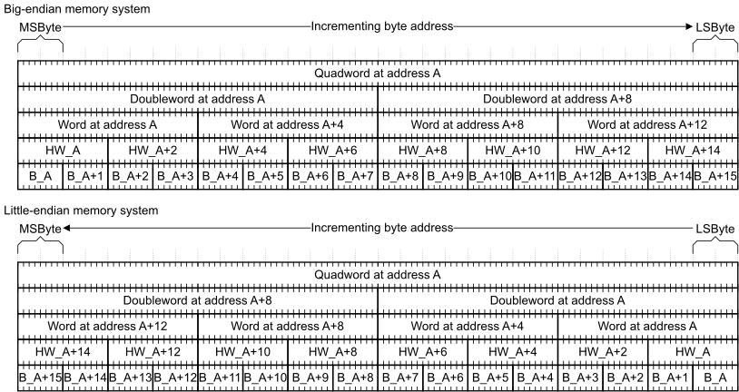

# ​B2.9.1 General description of endianness in the Arm architecture

Source: <https://developer.arm.com/documentation/ddi0487/mc/-Part-B-The-AArch64-Application-Level-Architecture/-Chapter-B2-The-AArch64-Application-Level-Memory-Model/-B2-9-Endian-support/-B2-9-1-General-description-of-endianness-in-the-Arm-architecture>

##### B2.9.1 General description of endianness in the Arm architecture

This section describes only memory addressing and the effects of endianness for data elements up to quadwords of 128 bits. However, this description can be extended to apply to larger data elements.

For an address A, [Figure B2-2](/documentation/ddi0487/mc/-Part-B-The-AArch64-Application-Level-Architecture/-Chapter-B2-The-AArch64-Application-Level-Memory-Model/-B2-9-Endian-support/-B2-9-1-General-description-of-endianness-in-the-Arm-architecture?lang=en#fig_chdebfeb) shows, for big-endian and little-endian memory systems, the relationship between:

- The quadword at address A.
- The doubleword at address A and A+8.
- The words at addresses A, A+4, A+8, and A+12.
- The halfwords at addresses A, A+2, A+4, A+6, A+8, A+10, A+12, and A+14.
- The bytes at addresses A, A+1, A+2, A+3, A+4, A+5, A+6, A+7, A+8, A+9, A+10, A+11, A+12, A+13, A+14, and A+15.

The terms in [Figure B2-2](/documentation/ddi0487/mc/-Part-B-The-AArch64-Application-Level-Architecture/-Chapter-B2-The-AArch64-Application-Level-Memory-Model/-B2-9-Endian-support/-B2-9-1-General-description-of-endianness-in-the-Arm-architecture?lang=en#fig_chdebfeb) have the following definitions:

B\_A
:   Byte at address A.

HW\_A
:   Halfword at address A.

MSByte
:   Most significant byte.

LSByte
:   Least significant byte.

Figure B2-2 Endianness relationships

The big-endian and little-endian mapping schemes determine the order in which the bytes of a quadword, doubleword, word, or halfword are interpreted. For example, a load of a word from address `0x1000` always results in an access to the bytes at memory locations `0x1000`, `0x1001`, `0x1002`, and `0x1003`. The endianness mapping scheme determines the significance of these 4 bytes.
