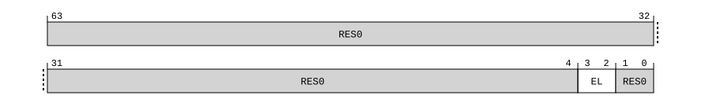

# ​C5.2.2 CurrentEL, Current Exception Level

Source: <https://developer.arm.com/documentation/ddi0487/mc/-Part-C-The-AArch64-Instruction-Set/-Chapter-C5-The-A64-System-Instruction-Class/-C5-2-Special-purpose-registers/-C5-2-2-CurrentEL--Current-Exception-Level>

##### C5.2.2 CurrentEL, Current Exception Level

The CurrentEL characteristics are:

Purpose
:   Holds the current Exception level.

Configuration
:   This register is a Special-purpose register.

    This register is present only when FEAT\_AA64 is implemented. Otherwise, direct accesses to CurrentEL are UNDEFINED.

Attributes
:   CurrentEL is a 64-bit register.

###### Field descriptions



Bits [63:4]
:   Reserved, RES0.

EL, bits [3:2]
:   Current Exception level.

<table>
 <colgroup>
  <col/>
  <col/>
 </colgroup>
 <thead>
  <tr>
   <th>
    <strong>
     EL
    </strong>
   </th>
   <th>
    <strong>
     Meaning
    </strong>
   </th>
  </tr>
 </thead>
 <tbody>
  <tr>
   <td>
    <p>
     <code>
      0b00
     </code>
    </p>
   </td>
   <td>
    <p>
     EL0.
    </p>
   </td>
  </tr>
  <tr>
   <td>
    <p>
     <code>
      0b01
     </code>
    </p>
   </td>
   <td>
    <p>
     EL1.
    </p>
   </td>
  </tr>
  <tr>
   <td>
    <p>
     <code>
      0b10
     </code>
    </p>
   </td>
   <td>
    <p>
     EL2.
    </p>
   </td>
  </tr>
  <tr>
   <td>
    <p>
     <code>
      0b11
     </code>
    </p>
   </td>
   <td>
    <p>
     EL3.
    </p>
   </td>
  </tr>
 </tbody>
</table>

    When the Effective value of [HCR\_EL2](/documentation/ddi0487/mc/-Part-D-The-AArch64-System-Level-Architecture/-Chapter-D24-AArch64-System-Register-Descriptions/-D24-2-General-system-control-registers/-D24-2-61-HCR-EL2--Hypervisor-Configuration-Register?lang=en#reg_aarch64_hcr_el2).NV is 1, EL1 read accesses to the CurrentEL register return the value of `0b10` in this field.

    The reset behavior of this field is:

    - On a Warm reset:
      - When the highest implemented Exception level is EL1, this field resets to `'01'`.
      - When the highest implemented Exception level is EL2, this field resets to `'10'`.
      - Otherwise, this field resets to `'11'`.

Bits [1:0]
:   Reserved, RES0.

###### Accessing CurrentEL

Accesses to this register use the following encodings in the System register encoding space:

###### `MRS <Xt>, CurrentEL`

<table>
 <colgroup>
  <col/>
  <col/>
  <col/>
  <col/>
  <col/>
 </colgroup>
 <thead>
  <tr>
   <th>
    <strong>
     op0
    </strong>
   </th>
   <th>
    <strong>
     op1
    </strong>
   </th>
   <th>
    <strong>
     CRn
    </strong>
   </th>
   <th>
    <strong>
     CRm
    </strong>
   </th>
   <th>
    <strong>
     op2
    </strong>
   </th>
  </tr>
 </thead>
 <tbody>
  <tr>
   <td>
    <p>
     <code>
      0b11
     </code>
    </p>
   </td>
   <td>
    <p>
     <code>
      0b000
     </code>
    </p>
   </td>
   <td>
    <p>
     <code>
      0b0100
     </code>
    </p>
   </td>
   <td>
    <p>
     <code>
      0b0010
     </code>
    </p>
   </td>
   <td>
    <p>
     <code>
      0b010
     </code>
    </p>
   </td>
  </tr>
 </tbody>
</table>

```
if !IsFeatureImplemented(FEAT_AA64) then
    Undefined();
elsif PSTATE.EL == EL0 then
    Undefined();
elsif PSTATE.EL == EL1 then
    if EffectiveHCR_EL2_NVx() IN {'xx1'} then
        X{64}(t) = Zeros{60} :: '10' :: Zeros{2};
    else
        X{64}(t) = Zeros{60} :: PSTATE.EL :: Zeros{2};
    end;
elsif PSTATE.EL == EL2 then
    X{64}(t) = Zeros{60} :: PSTATE.EL :: Zeros{2};
elsif PSTATE.EL == EL3 then
    X{64}(t) = Zeros{60} :: PSTATE.EL :: Zeros{2};
end;
```
