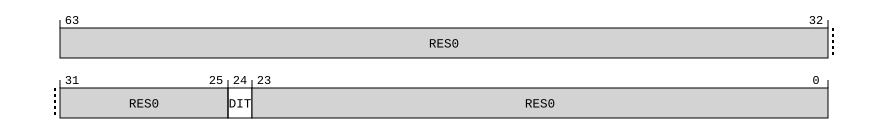

# ​C5.2.4 DIT, Data Independent Timing

Source: <https://developer.arm.com/documentation/ddi0487/mc/-Part-C-The-AArch64-Instruction-Set/-Chapter-C5-The-A64-System-Instruction-Class/-C5-2-Special-purpose-registers/-C5-2-4-DIT--Data-Independent-Timing>

##### C5.2.4 DIT, Data Independent Timing

The DIT characteristics are:

Purpose
:   Allows access to the Data Independent Timing bit.

Configuration
:   This register is a Special-purpose register.

    This register is present only when FEAT\_DIT is implemented and FEAT\_AA64 is implemented. Otherwise, direct accesses to DIT are UNDEFINED.

Attributes
:   DIT is a 64-bit register.

###### Field descriptions



Bits [63:25]
:   Reserved, RES0.

DIT, bit [24]
:   Data Independent Timing.

<table>
 <colgroup>
  <col/>
  <col/>
 </colgroup>
 <thead>
  <tr>
   <th>
    <strong>
     DIT
    </strong>
   </th>
   <th>
    <strong>
     Meaning
    </strong>
   </th>
  </tr>
 </thead>
 <tbody>
  <tr>
   <td>
    <p>
     <code>
      0b0
     </code>
    </p>
   </td>
   <td>
    <p>
     The architecture makes no statement about the timing properties of any instructions.
    </p>
   </td>
  </tr>
  <tr>
   <td>
    <p>
     <code>
      0b1
     </code>
    </p>
   </td>
   <td>
    <p>
     The architecture requires that the execution time of a data-independent-time sequence of code must be independent of all data-independent-time values. For more information, see
     <a class="document-topic" document-topic-path="/ddi0487/mc/-Part-B-The-AArch64-Application-Level-Architecture/-Chapter-B1-The-AArch64-Application-Level-Programmers--Model/-B1-5-Software-control-features-and-EL0/-B1-5-6-About-PSTATE-DIT?lang=en#beiccddab3" href="/documentation/ddi0487/mc/-Part-B-The-AArch64-Application-Level-Architecture/-Chapter-B1-The-AArch64-Application-Level-Programmers--Model/-B1-5-Software-control-features-and-EL0/-B1-5-6-About-PSTATE-DIT?lang=en#beiccddab3">
      About PSTATE.DIT
     </a>
     .
    </p>
   </td>
  </tr>
 </tbody>
</table>

    The list of data-independent-time instructions is:

    - Flag Manipulation: `CFINV`.
    - Data Processing – Immediate:
      - Add/subtract (immediate): `ADD`, `ADDS`, `SUB`, and `SUBS`.
      - Bitfield: `BFM`, `SBFM`, and `UBFM`.
      - Extract: `EXTR`.
      - Logical (immediate): `AND`, `ANDS`, `EOR`, and `ORR`.
      - Move wide (immediate): `MOVK`.
      - Min/max (immediate): `SMAX`, `SMIN`, `UMAX`, and `UMIN`.
    - Data Processing – Register:
      - Add/subtract (extended register): `ADD`, `ADDS`, `SUB`, and `SUBS`.
      - Add/subtract (shifted register): `ADD`, `ADDS`, `SUB`, and `SUBS`.
      - Add/subtract (with carry): `ADC`, `ADCS`, `SBC`, and `SBCS`.
      - Conditional compare (immediate): `CCMN`, and `CCMP`.
      - Conditional compare (register): `CCMN`, and `CCMP`.
      - Conditional select: `CSEL`, `CSINC`, `CSINV`, and `CSNEG`.
      - Data-processing (1 source): `ABS`, `CLS`, `CLZ`, `CNT`, `CTZ`, `RBIT`, `REV16`, `REV32`, and `REV`.
      - Data-processing (2 source): `ASRV`, `CRC32B`, `CRC32CB`, `CRC32CH`, `CRC32CW`, `CRC32CX`, `CRC32H`, `CRC32W`, `CRC32X`, `LSLV`, `LSRV`, `RORV`, `SMAX`, `SMIN`, `UMAX`, and `UMIN`.
      - Data-processing (3 source): `MADD`, `MSUB`, `SMADDL`, `SMSUBL`, `SMULH`, `UMADDL`, `UMSUBL`, and `UMULH`.
      - Evaluate into flags: `SETF16`, and `SETF8`.
      - Logical (shifted register): `AND`, `ANDS`, `BIC`, `BICS`, `EON`, `EOR`, `ORN`, and `ORR`.
      - Rotate right into flags: `RMIF`.
    - Data Processing – Scalar Floating-Point and Advanced SIMD:
      - Advanced SIMD across lanes: `ADDV`, `SADDLV`, `SMAXV`, `SMINV`, `UADDLV`, `UMAXV`, and `UMINV`.
      - Advanced SIMD copy: `DUP`, `INS`, `SMOV`, and `UMOV`.
      - Advanced SIMD extract: `EXT`.
      - Advanced SIMD modified immediate: `BIC`, and `ORR`.
      - Advanced SIMD permute: `TRN1`, `TRN2`, `UZP1`, `UZP2`, `ZIP1`, and `ZIP2`.
      - Advanced SIMD scalar copy: `DUP`.
      - Advanced SIMD scalar pairwise: `ADDP`.
      - Advanced SIMD scalar shift by immediate: Advanced SIMD scalar shift by immediate: `SHL`, `SLI`, `SRSHR`, `SRI`, `SRSRA`, `SSHR`, `SSRA`, `URSHR`, `URSRA`, `USHR`, and `USRA`.
      - Advanced SIMD scalar three same: `ADD`, `CMEQ`, `CMGE`, `CMGT`, `CMHI`, `CMHS`, `CMTST`, `SQDMULH`, `SQRDMULH`, `SSHL`, `SUB`, and `USHL`.
      - Advanced SIMD scalar three same extra: `SQRDMLAH`.
      - Advanced SIMD scalar two-register miscellaneous: `ABS`, `CMEQ`, `CMGE`, `CMGT`, `CMLE`, `CMLT`, and `NEG`.
      - Advanced SIMD scalar x indexed element: `SQDMULH`, `SQRDMLAH`, and `SQRDMULH`.
      - Advanced SIMD shift by immediate: `RSHRN2`, `RSHRN`, `SHL`, `SHRN2`, `SHRN`, `SLI`, `SRI`, `SSHLL2`, `SSHLL`, `SSHR`, `SSRA`, `USHLL2`, `USHLL`, `USHR`, and `USRA`.
      - Advanced SIMD table lookup: `LUTI2`, `LUTI4`, `TBL`, and `TBX`.
      - Advanced SIMD three different: `ADDHN2`, `ADDHN`, `PMULL2`, `PMULL`, `RADDHN2`, `RADDHN`, `RSUBHN2`, `RSUBHN`, `SABAL2`, `SABAL`, `SABDL2`, `SABDL`, `SADDL2`, `SADDL`, `SADDW2`, `SADDW`, `SMLAL2`, `SMLAL`, `SMLSL2`, `SMLSL`, `SMULL2`, `SMULL`, `SSUBL2`, `SSUBL`, `SSUBW2`, `SSUBW`, `SUBHN2`, `SUBHN`, `UABAL2`, `UABAL`, `UABDL2`, `UABDL`, `UADDL2`, `UADDL`, `UADDW2`, `UADDW`, `UMLAL2`, `UMLAL`, `UMLSL2`, `UMLSL`, `UMULL2`, `UMULL`, `USUBL2`, `USUBL`, `USUBW2`, and `USUBW`.
      - Advanced SIMD three same: `ADD`, `ADDP`, `AND`, `BIC`, `BIF`, `BIT`, `BSL`, `CMEQ`, `CMGE`, `CMGT`, `CMHI`, `CMHS`, `CMTST`, `EOR`, `MLA`, `MLS`, `MUL`, `ORN`, `ORR`, `PMUL`, `SABA`, `SABD`, `SHADD`, `SHSUB`, `SMAX`, `SMAXP`, `SMIN`, `SMINP`, `SQDMULH`, `SQRDMULH`, `SSHL`, `SUB`, `UABA`, `UABD`, `UHADD`, `UHSUB`, `UMAX`, `UMAXP`, `UMIN`, `UMINP`, and `USHL`.
      - Advanced SIMD three-register extension: `SDOT`, `SMMLA`, `SQRDMLAH`, `UDOT`, `UMMLA`, `USDOT`, and `USMMLA`.
      - Advanced SIMD two-register miscellaneous: `ABS`, `CLS`, `CLZ`, `CMEQ`, `CMGE`, `CMGT`, `CMLE`, `CMLT`, `CNT`, `NEG`, `NOT`, `RBIT`, `REV16`, `REV32`, `REV64`, `SADALP`, `SADDLP`, `SHLL2`, `SHLL`, `UADALP`, `UADDLP`, `XTN2`, and `XTN`.
      - Advanced SIMD vector x indexed element: `MLA`, `MLS`, `MUL`, `SDOT`, `SMLAL2`, `SMLAL`, `SMLSL2`, `SMLSL`, `SMULL2`, `SMULL`, `SQDMULH`, `SQRDMLAH`, `SQRDMULH`, `SUDOT`, `UDOT`, `UMLAL2`, `UMLAL`, `UMLSL2`, `UMLSL`, `UMULL2`, `UMULL`, and `USDOT`.
      - Cryptographic AES: `AESD`, `AESE`, `AESIMC`, and `AESMC`.
      - Cryptographic four-register: `BCAX`, `EOR3`, and `SM3SS1`.
      - Cryptographic three-register SHA: `SHA1C`, `SHA1M`, `SHA1P`, `SHA1SU0`, `SHA256H2`, `SHA256H`, and `SHA256SU1`.
      - Cryptographic three-register SHA 512: `RAX1`, `SHA512H2`, `SHA512H`, `SHA512SU1`, `SM3PARTW1`, `SM3PARTW2`, and `SM4EKEY`.
      - Cryptographic three-register, imm2: `SM3TT1A`, `SM3TT1B`, `SM3TT2A`, and `SM3TT2B`.
      - Cryptographic three-register, imm6: `XAR`.
      - Cryptographic two-register SHA: `SHA1H`, `SHA1SU1`, and `SHA256SU0`.
      - Cryptographic two-register SHA 512: `SHA512SU0`, and `SM4E`.
      - Floating-point conditional select: `FCSEL`.
    - Loads and Stores:
      - 128-bit atomic memory operations: `LDCLRP`, `LDCLRPA`, `LDCLRPAL`, `LDCLRPL`, `LDSETP`, `LDSETPA`, `LDSETPAL`, `LDSETPL`, `SWPP`, `SWPPA`, `SWPPAL`, and `SWPPL`.
      - Advanced SIMD load/store multiple structures: `LD1`, `LD2`, `LD3`, `LD4`, `ST1`, `ST2`, `ST3`, and `ST4`.
      - Advanced SIMD load/store multiple structures (post-indexed): `LD1`, `LD2`, `LD3`, `LD4`, `ST1`, `ST2`, `ST3`, and `ST4`.
      - Advanced SIMD load/store single structure: `LD1`, `LD1R`, `LD2`, `LD2R`, `LD3`, `LD3R`, `LD4`, `LD4R`, `LDAP1`, `ST1`, `ST2`, `ST3`, `ST4`, and `STL1`.
      - Advanced SIMD load/store single structure (post-indexed): `LD1`, `LD1R`, `LD2`, `LD2R`, `LD3`, `LD3R`, `LD4`, `LD4R`, `ST1`, `ST2`, `ST3`, and `ST4`.
      - Atomic memory operations: `LDADD`, `LDADDA`, `LDADDAB`, `LDADDAH`, `LDADDAL`, `LDADDALB`, `LDADDALH`, `LDADDB`, `LDADDH`, `LDADDL`, `LDADDLB`, `LDADDLH`, `LDAPR`, `LDAPRB`, `LDAPRH`, `LDCLR`, `LDCLRA`, `LDCLRAB`, `LDCLRAH`, `LDCLRAL`, `LDCLRALB`, `LDCLRALH`, `LDCLRB`, `LDCLRH`, `LDCLRL`, `LDCLRLB`, `LDCLRLH`, `LDEOR`, `LDEORA`, `LDEORAB`, `LDEORAH`, `LDEORAL`, `LDEORALB`, `LDEORALH`, `LDEORB`, `LDEORH`, `LDEORL`, `LDEORLB`, `LDEORLH`, `LDSET`, `LDSETA`, `LDSETAB`, `LDSETAH`, `LDSETAL`, `LDSETALB`, `LDSETALH`, `LDSETB`, `LDSETH`, `LDSETL`, `LDSETLB`, `LDSETLH`, `LDSMAX`, `LDSMAXA`, `LDSMAXAB`, `LDSMAXAH`, `LDSMAXAL`, `LDSMAXALB`, `LDSMAXALH`, `LDSMAXB`, `LDSMAXH`, `LDSMAXL`, `LDSMAXLB`, `LDSMAXLH`, `LDSMIN`, `LDSMINA`, `LDSMINAB`, `LDSMINAH`, `LDSMINAL`, `LDSMINALB`, `LDSMINALH`, `LDSMINB`, `LDSMINH`, `LDSMINL`, `LDSMINLB`, `LDSMINLH`, `LDUMAX`, `LDUMAXA`, `LDUMAXAB`, `LDUMAXAH`, `LDUMAXAL`, `LDUMAXALB`, `LDUMAXALH`, `LDUMAXB`, `LDUMAXH`, `LDUMAXL`, `LDUMAXLB`, `LDUMAXLH`, `LDUMIN`, `LDUMINA`, `LDUMINAB`, `LDUMINAH`, `LDUMINAL`, `LDUMINALB`, `LDUMINALH`, `LDUMINB`, `LDUMINH`, `LDUMINL`, `LDUMINLB`, and `LDUMINLH`.
      - LDAPR/STLR (SIMD&FP): `LDAPUR`, and `STLUR`.
      - LDAPR/STLR (unscaled immediate): `LDAPUR`, `LDAPURB`, `LDAPURH`, `LDAPURSB`, `LDAPURSH`, `LDAPURSW`, `STLUR`, `STLURB`, and `STLURH`.
      - LDAPR/STLR (writeback): `LDAPR`, and `STLR`.
      - LDIAPP/STILP: `LDIAPP`, and `STILP`.
      - Load/store exclusive pair: `LDAXP`, `LDXP`, `STLXP`, and `STXP`.
      - Load/store exclusive register: `LDAXR`, `LDAXRB`, `LDAXRH`, `LDXR`, `LDXRB`, `LDXRH`, `STLXR`, `STLXRB`, `STLXRH`, `STXR`, `STXRB` and `STXRH`.
      - Load/store no-allocate pair (offset): `LDNP`, and `STNP`.
      - Load/store ordered: `LDAR`, `LDARB`, `LDARH`, `LDLAR`, `LDLARB`, `LDLARH`, `STLLR`, `STLLRB`, `STLLRH`, `STLR`, `STLRB`, and `STLRH`.
      - Load/store register (immediate post-indexed): `LDR`, `LDRB`, `LDRH`, `LDRSB`, `LDRSH`, `LDRSW`, `STR`, `STRB`, and `STRH`.
      - Load/store register (immediate pre-indexed): `LDR`, `LDRB`, `LDRH`, `LDRSB`, `LDRSH`, `LDRSW`, `STR`, `STRB`, and `STRH`.
      - Load/store register (pac): `LDRAA`, and `LDRAB`.
      - Load/store register (register offset): `LDR`, `LDRB`, `LDRH`, `LDRSB`, `LDRSH`, `LDRSW`, `STR`, `STRB`, and `STRH`.
      - Load/store register (unprivileged): `LDTR`, `LDTRB`, `LDTRH`, `LDTRSB`, `LDTRSH`, `LDTRSW`, `STTR`, `STTRB`, and `STTRH`.
      - Load/store register (unscaled immediate): `LDUR`, `LDURB`, `LDURH`, `LDURSB`, `LDURSH`, `LDURSW`, `STUR`, `STURB`, and `STURH`.
      - Load/store register (unsigned immediate): `LDR`, `LDRB`, `LDRH`, `LDRSB`, `LDRSH`, `LDRSW`, `STR`, `STRB`, and `STRH`.
      - Load/store register pair (offset): `LDP`, `LDPSW`, and `STP`.
      - Load/store register pair (post-indexed): `LDP`, `LDPSW`, and `STP`.
      - Load/store register pair (pre-indexed): `LDP`, `LDPSW`, and `STP`.
    - If [FEAT\_SME](/documentation/ddi0487/mc/-Part-A-Arm-Architecture-Introduction-and-Overview/-Chapter-A2-A-profile-Architecture-Extensions/-A2-3-Armv9-A-architecture-extensions/-A2-3-3-The-Armv9-2-architecture-extension?lang=en#feat_feat_sme) is implemented, SME encodings:
      - SME Add Vector to Array: `ADDHA`, and `ADDVA`.
      - SME Integer Outer Product - 32 bit: `SMOPA`, `SMOPS`, `SUMOPA`, `SUMOPS`, `UMOPA`, `UMOPS`, `USMOPA`, and `USMOPS`.
      - SME Memory: `LD1B`, `LD1D`, `LD1H`, `LD1Q`, `LD1W`, `LDR`, `ST1B`, `ST1D`, `ST1H`, `ST1Q`, `ST1W`, and `STR`.
      - SME Move from Array: `MOVA`, and `MOVAZ`.
      - SME Move into Array: `MOVA`.
      - SME Outer Product - 64 bit:
        - SME Int16 outer product: `SMOPA`, `SMOPS`, `SUMOPA`, `SUMOPS`, `UMOPA`, `UMOPS`, `USMOPA`, and `USMOPS`.
      - SME zero array: `ZERO`.
      - SME2 Expand Lookup Table (Contiguous): `LUTI2`, and `LUTI4`.
      - SME2 Expand Lookup Table (Non-contiguous): `LUTI2`, and `LUTI4`.
      - SME2 Move Lookup Table: `MOVT`.
      - SME2 Multi-vector - Indexed (Four registers):
        - SME2 multi-vec indexed long MLA four sources: `SMLAL`, `SMLSL`, `UMLAL`, and `UMLSL`.
        - SME2 multi-vec indexed long long MLA four sources 32-bit: `SMLALL`, `SMLSLL`, `SUMLALL`, `UMLALL`, `UMLSLL`, and `USMLALL`.
        - SME2 multi-vec indexed long long MLA four sources 64-bit: `SMLALL`, `SMLSLL`, `UMLALL`, and `UMLSLL`.
        - SME2 multi-vec ternary indexed four registers 32-bit: `SDOT`, `SUDOT`, `SUVDOT`, `SVDOT`, `UDOT`, `USDOT`, `USVDOT`, and `UVDOT`.
        - SME2 multi-vec ternary indexed four registers 64-bit: `SDOT`, `SVDOT`, `UDOT`, and `UVDOT`.
      - SME2 Multi-vector - Indexed (One register):
        - SME2 multi-vec indexed long MLA one source: `SMLAL`, `SMLSL`, `UMLAL`, and `UMLSL`.
        - SME2 multi-vec indexed long long MLA one source 32-bit: `SMLALL`, `SMLSLL`, `SUMLALL`, `UMLALL`, `UMLSLL`, and `USMLALL`.
        - SME2 multi-vec indexed long long MLA one source 64-bit: `SMLALL`, `SMLSLL`, `UMLALL`, and `UMLSLL`.
      - SME2 Multi-vector - Indexed (Two registers):
        - SME2 multi-vec indexed long MLA two sources: `SMLAL`, `SMLSL`, `UMLAL`, and `UMLSL`.
        - SME2 multi-vec indexed long long MLA two sources 32-bit: `SMLALL`, `SMLSLL`, `SUMLALL`, `UMLALL`, `UMLSLL`, and `USMLALL`.
        - SME2 multi-vec indexed long long MLA two sources 64-bit: `SMLALL`, `SMLSLL`, `UMLALL`, and `UMLSLL`.
        - SME2 multi-vec ternary indexed two registers 32-bit: `SDOT`, `SUDOT`, `SVDOT`, `UDOT`, `USDOT`, and `UVDOT`.
        - SME2 multi-vec ternary indexed two registers 64-bit: `SDOT`, and `UDOT`.
      - SME2 Multi-vector - Memory (Contiguous): `LD1B`, `LD1D`, `LD1H`, `LD1W`, `LDNT1B`, `LDNT1D`, `LDNT1H`, `LDNT1W`, `ST1B`, `ST1D`, `ST1H`, `ST1W`, `STNT1B`, `STNT1D`, `STNT1H`, and `STNT1W`.
      - SME2 Multi-vector - Memory (Strided): `LD1B`, `LD1D`, `LD1H`, `LD1W`, `LDNT1B`, `LDNT1D`, `LDNT1H`, `LDNT1W`, `ST1B`, `ST1D`, `ST1H`, `ST1W`, `STNT1B`, `STNT1D`, `STNT1H`, and `STNT1W`.
      - SME2 Multi-vector - Multiple Array Vectors (Four registers):
        - SME2 multiple vectors binary int four registers: `ADD`, and `SUB`.
        - SME2 multiple vectors four-way dot product four registers: `SDOT`, and `UDOT`.
        - SME2 multiple vectors long MLA four sources: `SMLAL`, `SMLSL`, `UMLAL`, and `UMLSL`.
        - SME2 multiple vectors long long MLA four sources: `SMLALL`, `SMLSLL`, `UMLALL`, `UMLSLL`, and `USMLALL`.
        - SME2 multiple vectors mixed dot product four registers: `USDOT`.
        - SME2 multiple vectors ternary int four registers: `ADD`, and `SUB`.
        - SME2 multiple vectors two-way dot product four registers: `SDOT`, and `UDOT`.
      - SME2 Multi-vector - Multiple Array Vectors (Two registers):
        - SME2 multiple vectors binary int two registers: `ADD`, and `SUB`.
        - SME2 multiple vectors four-way dot product two registers: `SDOT`, and `UDOT`.
        - SME2 multiple vectors long MLA two sources: `SMLAL`, `SMLSL`, `UMLAL`, and `UMLSL`.
        - SME2 multiple vectors long long MLA two sources: `SMLALL`, `SMLSLL`, `UMLALL`, `UMLSLL`, and `USMLALL`.
        - SME2 multiple vectors mixed dot product two registers: `USDOT`.
        - SME2 multiple vectors ternary int two registers: `ADD`, and `SUB`.
        - SME2 multiple vectors two-way dot product two registers: `SDOT`, and `UDOT`.
      - SME2 Multi-vector - Multiple Vectors SVE Destructive (Four registers):
        - SME2 multiple vectors int min/max four registers: `SMAX`, `SMIN`, `UMAX`, and `UMIN`.
      - SME2 Multi-vector - Multiple Vectors SVE Destructive (Two registers):
        - SME2 multiple vectors int min/max two registers: `SMAX`, `SMIN`, `UMAX`, and `UMIN`.
      - SME2 Multi-vector - Multiple Vectors SVE Saturating Multiply (Four registers): `SQDMULH`.
      - SME2 Multi-vector - Multiple Vectors SVE Saturating Multiply (Two registers): `SQDMULH`.
      - SME2 Multi-vector - Multiple and Single Array Vectors (Four registers):
        - SME2 single-multi four-way dot product four registers: `SDOT`, and `UDOT`.
        - SME2 single-multi long MLA four sources: `SMLAL`, `SMLSL`, `UMLAL`, and `UMLSL`.
        - SME2 single-multi long long MLA four sources: `SMLALL`, `SMLSLL`, `SUMLALL`, `UMLALL`, `UMLSLL`, and `USMLALL`.
        - SME2 single-multi mixed dot product four registers: `SUDOT`, and `USDOT`.
        - SME2 single-multi ternary int four registers: `ADD`, and `SUB`.
        - SME2 single-multi two-way dot product four registers: `SDOT`, and `UDOT`.
      - SME2 Multi-vector - Multiple and Single Array Vectors (Two registers):
        - SME2 multiple and single vector long MLA one source: `SMLAL`, `SMLSL`, `UMLAL`, and `UMLSL`.
        - SME2 multiple and single vector long long FMA one source: `SMLALL`, `SMLSLL`, `UMLALL`, `UMLSLL`, and `USMLALL`.
        - SME2 single-multi four-way dot product two registers: `SDOT`, and `UDOT`.
        - SME2 single-multi long MLA two sources: `SMLAL`, `SMLSL`, `UMLAL`, and `UMLSL`.
        - SME2 single-multi long long MLA two sources: `SMLALL`, `SMLSLL`, `SUMLALL`, `UMLALL`, `UMLSLL`, and `USMLALL`.
        - SME2 single-multi mixed dot product two registers: `SUDOT`, and `USDOT`.
        - SME2 single-multi ternary int two registers: `ADD`, and `SUB`.
        - SME2 single-multi two-way dot product two registers: `SDOT`, and `UDOT`.
      - SME2 Multi-vector - Multiple and Single SVE Destructive (Four registers):
        - SME2 single-multi add four registers: `ADD`.
        - SME2 single-multi int min/max four registers: `SMAX`, `SMIN`, `UMAX`, and `UMIN`.
        - SME2 single-multi signed saturating doubling multiply high four registers: `SQDMULH`.
      - SME2 Multi-vector - Multiple and Single SVE Destructive (Two registers):
        - SME2 single-multi add two registers: `ADD`.
        - SME2 single-multi int min/max two registers: `SMAX`, `SMIN`, `UMAX`, and `UMIN`.
        - SME2 single-multi signed saturating doubling multiply high two registers: `SQDMULH`.
      - SME2 Multi-vector - SVE Constructive Binary:
        - SME2 multi-vec CLAMP four registers: `SCLAMP`, and `UCLAMP`.
        - SME2 multi-vec CLAMP two registers: `SCLAMP`, and `UCLAMP`.
        - SME2 multi-vec ZIP two registers: `UZP`, and `ZIP`.
        - SME2 multi-vec quadwords ZIP two registers: `UZP`, and `ZIP`.
      - SME2 Multi-vector - SVE Constructive Unary:
        - SME2 multi-vec ZIP four registers: `UZP`, and `ZIP`.
        - SME2 multi-vec quadwords ZIP four registers: `UZP`, and `ZIP`.
        - SME2 multi-vec unpack four registers: `SUNPK`, and `UUNPK`.
        - SME2 multi-vec unpack two registers: `SUNPK`, and `UUNPK`.
      - SME2 Multi-vector - SVE Select: `SEL`.
      - SME2 Multiple Zero: `ZERO`.
      - SME2 Outer Product - Misc:
        - SME2 32-bit binary outer product: `BMOPA`, and `BMOPS`.
    - If [FEAT\_SVE](/documentation/ddi0487/mc/-Part-A-Arm-Architecture-Introduction-and-Overview/-Chapter-A2-A-profile-Architecture-Extensions/-A2-2-Armv8-A-architecture-extensions/-A2-2-3-The-Armv8-2-architecture-extension?lang=en#feat_feat_sve) is implemented, SVE encodings:
      - SVE Address Generation: `ADR`.
      - SVE Bitwise Immediate: `AND`, `EOR`, and `ORR`.
      - SVE Bitwise Logical - Unpredicated: `AND`, `BCAX`, `BIC`, `BSL1N`, `BSL2N`, `BSL`, `EOR3`, `EOR`, `NBSL`, `ORR`, and `XAR`.
      - SVE Bitwise Shift - Predicated:
        - SVE bitwise shift by immediate (predicated): `ASR`, `ASRD`, `LSL`, `LSR`, `SRSHR`, and `URSHR`.
        - SVE bitwise shift by vector (predicated): `ASR`, `ASRR`, `LSL`, `LSLR`, `LSR`, and `LSRR`.
        - SVE bitwise shift by wide elements (predicated): `ASR`, `LSL`, and `LSR`.
      - SVE Bitwise Shift - Unpredicated: `ASR`, `LSL`, and `LSR`.
      - SVE Element Count:
        - SVE inc/dec register by element count: `DECB`, `DECD`, `DECH`, `DECW`, `INCB`, `INCD`, `INCH`, and `INCW`.
        - SVE inc/dec vector by element count: `DECD`, `DECH`, `DECW`, `INCD`, `INCH`, and `INCW`.
      - SVE Integer Arithmetic - Unpredicated:
        - SVE integer add/subtract vectors (unpredicated): `ADD`, and `SUB`.
      - SVE Integer Binary Arithmetic - Predicated:
        - SVE bitwise logical operations (predicated): `AND`, `BIC`, `EOR`, and `ORR`.
        - SVE integer add/subtract vectors (predicated): `ADD`, `SUB`, and `SUBR`.
        - SVE integer min/max/difference (predicated): `SABD`, `SMAX`, `SMIN`, `UABD`, `UMAX`, and `UMIN`.
        - SVE integer multiply vectors (predicated): `MUL`, `SMULH`, and `UMULH`.
      - SVE Integer Compare - Scalars: `CTERMEQ`, and `CTERMNE`.
      - SVE Integer Compare - Signed Immediate: `CMP<cc>`.
      - SVE Integer Compare - Unsigned Immediate: `CMP<cc>`.
      - SVE Integer Compare - Vectors: `CMP<cc>`.
      - SVE Integer Misc - Unpredicated: `MOVPRFX`.
      - SVE Integer Multiply-Add - Predicated: `MAD`, `MLA`, `MLS`, and `MSB`.
      - SVE Integer Multiply-Add - Unpredicated:
        - SVE integer dot product (unpredicated): `SDOT`, and `UDOT`.
        - SVE mixed sign dot product: `USDOT`.
        - SVE2 complex integer multiply-add: `CMLA`.
        - SVE2 integer multiply-add long: `SMLALB`, `SMLALT`, `SMLSLB`, `SMLSLT`, `UMLALB`, `UMLALT`, `UMLSLB`, and `UMLSLT`.
        - SVE2 saturating multiply-add high: `SQRDMLAH`.
      - SVE Integer Reduction: `ADDQV`, `ANDQV`, `ANDV`, `EORQV`, `EORV`, `MOVPRFX`, `ORQV`, `ORV`, `SADDV`, `SMAXQV`, `SMAXV`, `SMINQV`, `SMINV`, `UADDV`, `UMAXQV`, `UMAXV`, `UMINQV`, and `UMINV`.
      - SVE Integer Unary Arithmetic - Predicated:
        - SVE bitwise unary operations (predicated): `CLS`, `CLZ`, `CNOT`, `CNT`, and `NOT`.
        - SVE integer unary operations (predicated): `ABS`, `NEG`, `SXTB`, `SXTH`, `SXTW`, `UXTB`, `UXTH`, and `UXTW`.
      - SVE Integer Wide Immediate - Unpredicated:
        - SVE integer add/subtract immediate (unpredicated): `ADD`, `SUB`, and `SUBR`.
        - SVE integer min/max immediate (unpredicated): `SMAX`, `SMIN`, `UMAX`, and `UMIN`.
        - SVE integer multiply immediate (unpredicated): `MUL`.
      - SVE Memory - 32-bit Gather and Unsized Contiguous:
        - SVE 32-bit gather load (scalar plus 32-bit unscaled offsets): `LD1B`, `LD1H`, `LD1SB`, `LD1SH`, and `LD1W`.
        - SVE 32-bit gather load (vector plus immediate): `LD1B`, `LD1H`, `LD1SB`, `LD1SH`, and `LD1W`.
        - SVE 32-bit gather load halfwords (scalar plus 32-bit scaled offsets): `LD1H`, and `LD1SH`.
        - SVE 32-bit gather load words (scalar plus 32-bit scaled offsets): `LD1W`.
        - SVE load and broadcast element: `LD1RB`, `LD1RD`, `LD1RH`, `LD1RSB`, `LD1RSH`, `LD1RSW`, and `LD1RW`.
        - SVE load vector register: `LDR`.
        - SVE2 32-bit gather non-temporal load (vector plus scalar): `LDNT1B`, `LDNT1H`, `LDNT1SB`, `LDNT1SH`, and `LDNT1W`.
      - SVE Memory - 64-bit Gather:
        - SVE 64-bit gather load (scalar plus 32-bit unpacked scaled offsets): `LD1D`, `LD1H`, `LD1SH`, `LD1SW`, and `LD1W`.
        - SVE 64-bit gather load (scalar plus 64-bit scaled offsets): `LD1D`, `LD1H`, `LD1SH`, `LD1SW`, and `LD1W`.
        - SVE 64-bit gather load (scalar plus 64-bit unscaled offsets): `LD1B`, `LD1D`, `LD1H`, `LD1SB`, `LD1SH`, `LD1SW`, and `LD1W`.
        - SVE 64-bit gather load (scalar plus unpacked 32-bit unscaled offsets): `LD1B`, `LD1D`, `LD1H`, `LD1SB`, `LD1SH`, `LD1SW`, and `LD1W`.
        - SVE 64-bit gather load (vector plus immediate): `LD1B`, `LD1D`, `LD1H`, `LD1SB`, `LD1SH`, `LD1SW`, and `LD1W`.
        - SVE2 128-bit gather load (vector plus scalar): `LD1Q`.
        - SVE2 64-bit gather non-temporal load (vector plus scalar): `LDNT1B`, `LDNT1D`, `LDNT1H`, `LDNT1SB`, `LDNT1SH`, `LDNT1SW`, and `LDNT1W`.
      - SVE Memory - Contiguous Load:
        - SVE contiguous load (quadwords, scalar plus immediate): `LD1D`, and `LD1W`.
        - SVE contiguous load (quadwords, scalar plus scalar): `LD1D`, and `LD1W`.
        - SVE contiguous load (scalar plus immediate): `LD1B`, `LD1D`, `LD1H`, `LD1SB`, `LD1SH`, `LD1SW`, and `LD1W`.
        - SVE contiguous load (scalar plus scalar): `LD1B`, `LD1D`, `LD1H`, `LD1SB`, `LD1SH`, `LD1SW`, and `LD1W`.
        - SVE contiguous non-temporal load (scalar plus immediate): `LDNT1B`, `LDNT1D`, `LDNT1H`, and `LDNT1W`.
        - SVE contiguous non-temporal load (scalar plus scalar): `LDNT1B`, `LDNT1D`, `LDNT1H`, and `LDNT1W`.
        - SVE load and broadcast quadword (scalar plus immediate): `LD1ROB`, `LD1ROD`, `LD1ROH`, `LD1ROW`, `LD1RQB`, `LD1RQD`, `LD1RQH`, and `LD1RQW`.
        - SVE load and broadcast quadword (scalar plus scalar): `LD1ROB`, `LD1ROD`, `LD1ROH`, `LD1ROW`, `LD1RQB`, `LD1RQD`, `LD1RQH`, and `LD1RQW`.
        - SVE load multiple structures (quadwords, scalar plus immediate): `LD2Q`, `LD3Q`, and `LD4Q`.
        - SVE load multiple structures (quadwords, scalar plus scalar): `LD2Q`, `LD3Q`, and `LD4Q`.
        - SVE load multiple structures (scalar plus immediate): `LD2B`, `LD2D`, `LD2H`, `LD2W`, `LD3B`, `LD3D`, `LD3H`, `LD3W`, `LD4B`, `LD4D`, `LD4H`, and `LD4W`.
        - SVE load multiple structures (scalar plus scalar): `LD2B`, `LD2D`, `LD2H`, `LD2W`, `LD3B`, `LD3D`, `LD3H`, `LD3W`, `LD4B`, `LD4D`, `LD4H`, and `LD4W`.
      - SVE Memory - Contiguous Store and Unsized Contiguous: `ST1B`, `ST1D`, `ST1H`, `ST1W`, `ST2Q`, `ST3Q`, and `ST4Q`.
      - SVE Memory - Contiguous Store with Immediate Offset: `ST1B`, `ST1D`, `ST1H`, `ST1W`, `ST2B`, `ST2D`, `ST2H`, `ST2W`, `ST3B`, `ST3D`, `ST3H`, `ST3W`, `ST4B`, `ST4D`, `ST4H`, `ST4W`, `STNT1B`, `STNT1D`, `STNT1H`, and `STNT1W`.
      - SVE Memory - Non-temporal and Multi-register Contiguous Store: `ST2B`, `ST2D`, `ST2H`, `ST2W`, `ST3B`, `ST3D`, `ST3H`, `ST3W`, `ST4B`, `ST4D`, `ST4H`, `ST4W`, `STNT1B`, `STNT1D`, `STNT1H`, and `STNT1W`.
      - SVE Memory - Non-temporal and Quadword Scatter Store: `ST1Q`, `STNT1B`, `STNT1D`, `STNT1H`, and `STNT1W`.
      - SVE Memory - Scatter: `ST1B`, `ST1D`, `ST1H`, and `ST1W`.
      - SVE Memory - Scatter with Optional Sign Extend: `ST1B`, `ST1D`, `ST1H`, and `ST1W`.
      - SVE Misc: `BDEP`, `BEXT`, `BGRP`, `EORBT`, `EORTB`, `SADDLBT`, `SMMLA`, `SSHLLB`, `SSHLLT`, `SSUBLBT`, `SSUBLTB`, `UMMLA`, `USHLLB`, `USHLLT`, and `USMMLA`.
      - SVE Multiply - Indexed:
        - SVE integer dot product (indexed): `SDOT`, and `UDOT`.
        - SVE mixed sign dot product (indexed): `SUDOT`, and `USDOT`.
        - SVE2 complex integer multiply-add (indexed): `CMLA`.
        - SVE2 integer multiply (indexed): `MUL`.
        - SVE2 integer multiply long (indexed): `SMULLB`, `SMULLT`, `UMULLB`, and `UMULLT`.
        - SVE2 integer multiply-add (indexed): `MLA`, and `MLS`.
        - SVE2 integer multiply-add long (indexed): `SMLALB`, `SMLALT`, `SMLSLB`, `SMLSLT`, `UMLALB`, `UMLALT`, `UMLSLB`, and `UMLSLT`.
        - SVE2 saturating multiply high (indexed): `SQDMULH`, and `SQRDMULH`.
        - SVE2 saturating multiply-add high (indexed): `SQRDMLAH`.
      - SVE Permute Vector - Extract: `EXT`.
      - SVE Permute Vector - Indexed DUP: `DUP`.
      - SVE Permute Vector - Interleaving: `TRN1`, `TRN2`, `UZP1`, `UZP2`, `ZIP1`, and `ZIP2`.
      - SVE Permute Vector - One Source Quadwords: `DUPQ`, and `EXTQ`.
      - SVE Permute Vector - Predicated:
        - SVE copy SIMD&FP scalar register to vector (predicated): `CPY`.
        - SVE copy general register to vector (predicated): `CPY`.
        - SVE reverse doublewords: `REVD`.
        - SVE reverse within elements: `RBIT`, `REVB`, `REVH`, and `REVW`.
      - SVE Permute Vector - Segments: `TRN1`, `TRN2`, `UZP1`, `UZP2`, `ZIP1`, and `ZIP2`.
      - SVE Permute Vector - TBXQ: `TBXQ`.
      - SVE Permute Vector - Three Sources TBL: `TBL`, and `TBX`.
      - SVE Permute Vector - Two Sources Quadwords: `TBLQ`, `UZPQ1`, `UZPQ2`, `ZIPQ1`, and `ZIPQ2`.
      - SVE Permute Vector - Two Sources TBL: `TBL`.
      - SVE Permute Vector - Unpredicated:
        - SVE broadcast general register: `DUP`.
        - SVE insert SIMD&FP scalar register: `INSR`.
        - SVE insert general register: `INSR`.
        - SVE reverse vector elements: `REV`.
        - SVE unpack vector elements: `SUNPKHI`, `SUNPKLO`, `UUNPKHI`, and `UUNPKLO`.
      - SVE Predicate Select: `PSEL`.
      - SVE Stack Allocation: `ADDPL`, `ADDSPL`, `ADDSVL`, and `ADDVL`.
      - SVE Vector Select: `SEL`.
      - SVE integer clamp: `SCLAMP`, and `UCLAMP`.
      - SVE two-way dot product: `SDOT`, and `UDOT`.
      - SVE two-way dot product (indexed): `SDOT`, and `UDOT`.
      - SVE2 Accumulate:
        - SVE2 bitwise shift and insert: `SLI`, and `SRI`.
        - SVE2 bitwise shift right and accumulate: `SRSRA`, `SSRA`, `URSRA`, and `USRA`.
        - SVE2 complex integer add: `CADD`.
        - SVE2 integer absolute difference and accumulate: `SABA`, and `UABA`.
        - SVE2 integer absolute difference and accumulate long: `SABALB`, `SABALT`, `UABALB`, and `UABALT`.
        - SVE2 integer add/subtract long with carry: `ADCLB`, `ADCLT`, `SBCLB`, and `SBCLT`.
      - SVE2 Crypto Extensions: `AESD`, `AESE`, `AESIMC`, `AESMC`, `RAX1`, `SM4E`, and `SM4EKEY`.
      - SVE2 Histogram (Segment) and Lookup Table: `LUTI2`, and `LUTI4`.
      - SVE2 Integer - Predicated:
        - SVE2 integer halving add/subtract (predicated): `SHADD`, `SHSUB`, `SHSUBR`, `UHADD`, `UHSUB`, and `UHSUBR`.
        - SVE2 integer pairwise add and accumulate long: `SADALP`, and `UADALP`.
        - SVE2 integer pairwise arithmetic: `ADDP`, `SMAXP`, `SMINP`, `UMAXP`, and `UMINP`.
      - SVE2 Integer Multiply - Unpredicated: `MUL`, `PMUL`, `SMULH`, `SQDMULH`, `SQRDMULH`, and `UMULH`.
      - SVE2 Narrowing:
        - SVE2 bitwise shift right narrow: `RSHRNB`, `RSHRNT`, `SHRNB`, and `SHRNT`.
        - SVE2 integer add/subtract narrow high part: `ADDHNB`, `ADDHNT`, `RADDHNB`, `RADDHNT`, `RSUBHNB`, `RSUBHNT`, `SUBHNB`, and `SUBHNT`.
      - SVE2 Widening Integer Arithmetic:
        - SVE2 integer add/subtract long: `SABDLB`, `SABDLT`, `SADDLB`, `SADDLT`, `SSUBLB`, `SSUBLT`, `UABDLB`, `UABDLT`, `UADDLB`, `UADDLT`, `USUBLB`, and `USUBLT`.
        - SVE2 integer add/subtract wide: `SADDWB`, `SADDWT`, `SSUBWB`, `SSUBWT`, `UADDWB`, `UADDWT`, `USUBWB`, and `USUBWT`.
        - SVE2 integer multiply long: `PMULLB`, `PMULLT`, `SMULLB`, `SMULLT`, `UMULLB`, and `UMULLT`.
    - If [FEAT\_SVE](/documentation/ddi0487/mc/-Part-A-Arm-Architecture-Introduction-and-Overview/-Chapter-A2-A-profile-Architecture-Extensions/-A2-2-Armv8-A-architecture-extensions/-A2-2-3-The-Armv8-2-architecture-extension?lang=en#feat_feat_sve) or [FEAT\_SME](/documentation/ddi0487/mc/-Part-A-Arm-Architecture-Introduction-and-Overview/-Chapter-A2-A-profile-Architecture-Extensions/-A2-3-Armv9-A-architecture-extensions/-A2-3-3-The-Armv9-2-architecture-extension?lang=en#feat_feat_sme) is implemented, SVE encodings:
      - SVE predicate logical operations: `AND (predicates)`, `BIC (predicates)`, `EOR (predicates)`, `SEL (predicates)`, `ANDS`, `BICS`, `EORS`, `ORR (predicates)`, `ORN (predicates)`, `NOR`, `NAND`, `ORRS`, `ORNS`, `NORS`, `NANDS`.
      - SVE Predicate Misc.: `PTEST`.
      - SVE Memory - Contiguous Store and Unsized Contiguous: `STR (predicate)`.
      - SVE Memory - 32-bit Gather and Unsized Contiguous: `LDR (predicate)`.
    - If [FEAT\_SVE2p1](/documentation/ddi0487/mc/-Part-A-Arm-Architecture-Introduction-and-Overview/-Chapter-A2-A-profile-Architecture-Extensions/-A2-3-Armv9-A-architecture-extensions/-A2-3-5-The-Armv9-4-architecture-extension?lang=en#feat_feat_sve2p1) or [FEAT\_SME2p1](/documentation/ddi0487/mc/-Part-A-Arm-Architecture-Introduction-and-Overview/-Chapter-A2-A-profile-Architecture-Extensions/-A2-3-Armv9-A-architecture-extensions/-A2-3-5-The-Armv9-4-architecture-extension?lang=en#feat_feat_sme2p1) is implemented, SVE encodings:
      - SVE Permute Vector - Unpredicated: `PMOV (to vector)`, `PMOV (to predicates)`.
    - If [FEAT\_SVE\_AES2](/documentation/ddi0487/mc/-Part-A-Arm-Architecture-Introduction-and-Overview/-Chapter-A2-A-profile-Architecture-Extensions/-A2-3-Armv9-A-architecture-extensions/-A2-3-7-The-Armv9-6-architecture-extension?lang=en#feat_feat_sve_aes2) is implemented, SVE encodings:
      - SVE Multi-vector polynomial multiply: `PMLAL`, `PMULL`.

    The reset behavior of this field is:

    - On a Warm reset, this field resets to `'0'`.

Bits [23:0]
:   Reserved, RES0.

###### Accessing DIT

Accesses to this register use the following encodings in the System register encoding space:

###### `MRS <Xt>, DIT`

<table>
 <colgroup>
  <col/>
  <col/>
  <col/>
  <col/>
  <col/>
 </colgroup>
 <thead>
  <tr>
   <th>
    <strong>
     op0
    </strong>
   </th>
   <th>
    <strong>
     op1
    </strong>
   </th>
   <th>
    <strong>
     CRn
    </strong>
   </th>
   <th>
    <strong>
     CRm
    </strong>
   </th>
   <th>
    <strong>
     op2
    </strong>
   </th>
  </tr>
 </thead>
 <tbody>
  <tr>
   <td>
    <p>
     <code>
      0b11
     </code>
    </p>
   </td>
   <td>
    <p>
     <code>
      0b011
     </code>
    </p>
   </td>
   <td>
    <p>
     <code>
      0b0100
     </code>
    </p>
   </td>
   <td>
    <p>
     <code>
      0b0010
     </code>
    </p>
   </td>
   <td>
    <p>
     <code>
      0b101
     </code>
    </p>
   </td>
  </tr>
 </tbody>
</table>

```
if !(IsFeatureImplemented(FEAT_DIT) && IsFeatureImplemented(FEAT_AA64)) then
    Undefined();
elsif PSTATE.EL == EL0 then
    X{64}(t) = Zeros{39} :: PSTATE.DIT :: Zeros{24};
elsif PSTATE.EL == EL1 then
    X{64}(t) = Zeros{39} :: PSTATE.DIT :: Zeros{24};
elsif PSTATE.EL == EL2 then
    X{64}(t) = Zeros{39} :: PSTATE.DIT :: Zeros{24};
elsif PSTATE.EL == EL3 then
    X{64}(t) = Zeros{39} :: PSTATE.DIT :: Zeros{24};
end;
```

###### `MSR DIT, <Xt>`

<table>
 <colgroup>
  <col/>
  <col/>
  <col/>
  <col/>
  <col/>
 </colgroup>
 <thead>
  <tr>
   <th>
    <strong>
     op0
    </strong>
   </th>
   <th>
    <strong>
     op1
    </strong>
   </th>
   <th>
    <strong>
     CRn
    </strong>
   </th>
   <th>
    <strong>
     CRm
    </strong>
   </th>
   <th>
    <strong>
     op2
    </strong>
   </th>
  </tr>
 </thead>
 <tbody>
  <tr>
   <td>
    <p>
     <code>
      0b11
     </code>
    </p>
   </td>
   <td>
    <p>
     <code>
      0b011
     </code>
    </p>
   </td>
   <td>
    <p>
     <code>
      0b0100
     </code>
    </p>
   </td>
   <td>
    <p>
     <code>
      0b0010
     </code>
    </p>
   </td>
   <td>
    <p>
     <code>
      0b101
     </code>
    </p>
   </td>
  </tr>
 </tbody>
</table>

```
if !(IsFeatureImplemented(FEAT_DIT) && IsFeatureImplemented(FEAT_AA64)) then
    Undefined();
elsif PSTATE.EL == EL0 then
    PSTATE.DIT = X{64}(t)[24];
elsif PSTATE.EL == EL1 then
    PSTATE.DIT = X{64}(t)[24];
elsif PSTATE.EL == EL2 then
    PSTATE.DIT = X{64}(t)[24];
elsif PSTATE.EL == EL3 then
    PSTATE.DIT = X{64}(t)[24];
end;
```

###### `MSR DIT, #<imm>`

<table>
 <colgroup>
  <col/>
  <col/>
  <col/>
  <col/>
 </colgroup>
 <thead>
  <tr>
   <th>
    <strong>
     op0
    </strong>
   </th>
   <th>
    <strong>
     op1
    </strong>
   </th>
   <th>
    <strong>
     CRn
    </strong>
   </th>
   <th>
    <strong>
     op2
    </strong>
   </th>
  </tr>
 </thead>
 <tbody>
  <tr>
   <td>
    <p>
     <code>
      0b00
     </code>
    </p>
   </td>
   <td>
    <p>
     <code>
      0b011
     </code>
    </p>
   </td>
   <td>
    <p>
     <code>
      0b0100
     </code>
    </p>
   </td>
   <td>
    <p>
     <code>
      0b010
     </code>
    </p>
   </td>
  </tr>
 </tbody>
</table>
