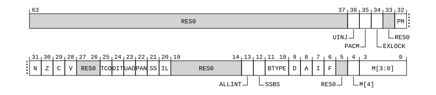

# ​C5.2.23 SPSR_EL3, Saved Program Status Register (EL3)

Source: <https://developer.arm.com/documentation/ddi0487/mc/-Part-C-The-AArch64-Instruction-Set/-Chapter-C5-The-A64-System-Instruction-Class/-C5-2-Special-purpose-registers/-C5-2-23-SPSR-EL3--Saved-Program-Status-Register--EL3->

##### C5.2.23 SPSR\_EL3, Saved Program Status Register (EL3)

The SPSR\_EL3 characteristics are:

Purpose
:   Holds the saved process state when an exception is taken to EL3.

Configuration
:   This register is a Special-purpose register.

    This register is present only when EL3 is implemented and FEAT\_AA64 is implemented. Otherwise, direct accesses to SPSR\_EL3 are UNDEFINED.

Attributes
:   SPSR\_EL3 is a 64-bit register.

###### Field descriptions

When FEAT\_AA32 is implemented and exception taken from AArch32 state:
:   

    An exception return from EL3 using AArch64 makes SPSR\_EL3 become UNKNOWN.

Bits [63:37]
:   Reserved, RES0.

UINJ, bit [36]
:   When FEAT\_UINJ is implemented:
    :   Inject Undefined Instruction exception. Set to 0 on taking an exception to EL3, and copied to PSTATE.UINJ on executing an exception return operation in EL3.

        The reset behavior of this field is:

        - On a Warm reset, this field resets to an architecturally UNKNOWN value.

    Otherwise:
    :   Reserved, RES0.

Bits [35:32]
:   Reserved, RES0.

N, bit [31]
:   Negative Condition flag. Set to the value of PSTATE.N on taking an exception to EL3, and copied to PSTATE.N on executing an exception return operation in EL3.

    The reset behavior of this field is:

    - On a Warm reset, this field resets to an architecturally UNKNOWN value.

Z, bit [30]
:   Zero Condition flag. Set to the value of PSTATE.Z on taking an exception to EL3, and copied to PSTATE.Z on executing an exception return operation in EL3.

    The reset behavior of this field is:

    - On a Warm reset, this field resets to an architecturally UNKNOWN value.

C, bit [29]
:   Carry Condition flag. Set to the value of PSTATE.C on taking an exception to EL3, and copied to PSTATE.C on executing an exception return operation in EL3.

    The reset behavior of this field is:

    - On a Warm reset, this field resets to an architecturally UNKNOWN value.

V, bit [28]
:   Overflow Condition flag. Set to the value of PSTATE.V on taking an exception to EL3, and copied to PSTATE.V on executing an exception return operation in EL3.

    The reset behavior of this field is:

    - On a Warm reset, this field resets to an architecturally UNKNOWN value.

Q, bit [27]
:   Overflow or saturation flag. Set to the value of PSTATE.Q on taking an exception to EL3, and copied to PSTATE.Q on executing an exception return operation in EL3.

    The reset behavior of this field is:

    - On a Warm reset, this field resets to an architecturally UNKNOWN value.

IT, bits [15:10, 26:25]
:   If-Then. Set to the value of PSTATE.IT on taking an exception to EL3, and copied to PSTATE.IT on executing an exception return operation in EL3.

    On executing an exception return operation in EL3, SPSR\_EL3.IT must contain a value that is valid for the instruction being returned to.

    The reset behavior of this field is:

    - On a Warm reset, this field resets to an architecturally UNKNOWN value.

DIT, bit [24]
:   When FEAT\_DIT is implemented:
    :   Data Independent Timing. Set to the value of PSTATE.DIT on taking an exception to EL3, and copied to PSTATE.DIT on executing an exception return operation in EL3.

        The reset behavior of this field is:

        - On a Warm reset, this field resets to an architecturally UNKNOWN value.

    Otherwise:
    :   Reserved, RES0.

SSBS, bit [23]
:   When FEAT\_SSBS is implemented:
    :   Speculative Store Bypass. Set to the value of PSTATE.SSBS on taking an exception to EL3, and copied to PSTATE.SSBS on executing an exception return operation in EL3.

        The reset behavior of this field is:

        - On a Warm reset, this field resets to an architecturally UNKNOWN value.

    Otherwise:
    :   Reserved, RES0.

PAN, bit [22]
:   When FEAT\_PAN is implemented:
    :   Privileged Access Never. Set to the value of PSTATE.PAN on taking an exception to EL3, and copied to PSTATE.PAN on executing an exception return operation in EL3.

        The reset behavior of this field is:

        - On a Warm reset, this field resets to an architecturally UNKNOWN value.

    Otherwise:
    :   Reserved, RES0.

SS, bit [21]
:   Software Step. Set to the value of PSTATE.SS on taking an exception to EL3, and conditionally copied to PSTATE.SS on executing an exception return operation in EL3.

    The reset behavior of this field is:

    - On a Warm reset, this field resets to an architecturally UNKNOWN value.

IL, bit [20]
:   Illegal Execution state. Set to the value of PSTATE.IL on taking an exception to EL3, and copied to PSTATE.IL on executing an exception return operation in EL3.

    The reset behavior of this field is:

    - On a Warm reset, this field resets to an architecturally UNKNOWN value.

GE, bits [19:16]
:   Greater than or Equal flags. Set to the value of PSTATE.GE on taking an exception to EL3, and copied to PSTATE.GE on executing an exception return operation in EL3.

    The reset behavior of this field is:

    - On a Warm reset, this field resets to an architecturally UNKNOWN value.

E, bit [9]
:   Endianness. Set to the value of PSTATE.E on taking an exception to EL3, and copied to PSTATE.E on executing an exception return operation in EL3.

    If the implementation does not support big-endian operation, SPSR\_EL3.E is RES0. If the implementation does not support little-endian operation, SPSR\_EL3.E is RES1. On executing an exception return operation in EL3, if the implementation does not support big-endian operation at the Exception level being returned to, SPSR\_EL3.E is RES0, and if the implementation does not support little-endian operation at the Exception level being returned to, SPSR\_EL3.E is RES1.

    The reset behavior of this field is:

    - On a Warm reset, this field resets to an architecturally UNKNOWN value.

A, bit [8]
:   SError exception mask. Set to the value of PSTATE.A on taking an exception to EL3, and copied to PSTATE.A on executing an exception return operation in EL3.

    The reset behavior of this field is:

    - On a Warm reset, this field resets to an architecturally UNKNOWN value.

I, bit [7]
:   IRQ interrupt mask. Set to the value of PSTATE.I on taking an exception to EL3, and copied to PSTATE.I on executing an exception return operation in EL3.

    The reset behavior of this field is:

    - On a Warm reset, this field resets to an architecturally UNKNOWN value.

F, bit [6]
:   FIQ interrupt mask. Set to the value of PSTATE.F on taking an exception to EL3, and copied to PSTATE.F on executing an exception return operation in EL3.

    The reset behavior of this field is:

    - On a Warm reset, this field resets to an architecturally UNKNOWN value.

T, bit [5]
:   T32 Instruction set state. Set to the value of PSTATE.T on taking an exception to EL3, and copied to PSTATE.T on executing an exception return operation in EL3.

    The reset behavior of this field is:

    - On a Warm reset, this field resets to an architecturally UNKNOWN value.

M[4], bit [4]
:   Execution state. Set to 1, the value of PSTATE.nRW, on taking an exception to EL3 from AArch32 state, and copied to PSTATE.nRW on executing an exception return operation in EL3.

<table>
 <colgroup>
  <col/>
  <col/>
 </colgroup>
 <thead>
  <tr>
   <th>
    <strong>
     M[4]
    </strong>
   </th>
   <th>
    <strong>
     Meaning
    </strong>
   </th>
  </tr>
 </thead>
 <tbody>
  <tr>
   <td>
    <p>
     <code>
      0b1
     </code>
    </p>
   </td>
   <td>
    <p>
     AArch32 execution state.
    </p>
   </td>
  </tr>
 </tbody>
</table>

    The reset behavior of this field is:

    - On a Warm reset, this field resets to an architecturally UNKNOWN value.

M[3:0], bits [3:0]
:   AArch32 Mode. Set to the value of PSTATE.M[3:0] on taking an exception to EL3, and copied to PSTATE.M[3:0] on executing an exception return operation in EL3.

<table>
 <colgroup>
  <col/>
  <col/>
  <col/>
 </colgroup>
 <thead>
  <tr>
   <th>
    <strong>
     M[3:0]
    </strong>
   </th>
   <th>
    <strong>
     Meaning
    </strong>
   </th>
   <th>
    <strong>
     Applies when
    </strong>
   </th>
  </tr>
 </thead>
 <tbody>
  <tr>
   <td>
    <p>
     <code>
      0b0000
     </code>
    </p>
   </td>
   <td>
    <p>
     User.
    </p>
   </td>
   <td>
   </td>
  </tr>
  <tr>
   <td>
    <p>
     <code>
      0b0001
     </code>
    </p>
   </td>
   <td>
    <p>
     FIQ.
    </p>
   </td>
   <td>
   </td>
  </tr>
  <tr>
   <td>
    <p>
     <code>
      0b0010
     </code>
    </p>
   </td>
   <td>
    <p>
     IRQ.
    </p>
   </td>
   <td>
   </td>
  </tr>
  <tr>
   <td>
    <p>
     <code>
      0b0011
     </code>
    </p>
   </td>
   <td>
    <p>
     Supervisor.
    </p>
   </td>
   <td>
   </td>
  </tr>
  <tr>
   <td>
    <p>
     <code>
      0b0110
     </code>
    </p>
   </td>
   <td>
    <p>
     Monitor.
    </p>
   </td>
   <td>
    <p>
     FEAT_EL3 is implemented
    </p>
   </td>
  </tr>
  <tr>
   <td>
    <p>
     <code>
      0b0111
     </code>
    </p>
   </td>
   <td>
    <p>
     Abort.
    </p>
   </td>
   <td>
   </td>
  </tr>
  <tr>
   <td>
    <p>
     <code>
      0b1010
     </code>
    </p>
   </td>
   <td>
    <p>
     Hyp.
    </p>
   </td>
   <td>
   </td>
  </tr>
  <tr>
   <td>
    <p>
     <code>
      0b1011
     </code>
    </p>
   </td>
   <td>
    <p>
     Undefined.
    </p>
   </td>
   <td>
   </td>
  </tr>
  <tr>
   <td>
    <p>
     <code>
      0b1111
     </code>
    </p>
   </td>
   <td>
    <p>
     System.
    </p>
   </td>
   <td>
   </td>
  </tr>
 </tbody>
</table>

    Other values are reserved. If SPSR\_EL3.M[3:0] has a Reserved value, or a value for an unimplemented Exception level, executing an exception return operation in EL3 is an illegal return event, as described in [‘Illegal return events from AArch64 state’](/documentation/ddi0487/mc/-Part-D-The-AArch64-System-Level-Architecture/-Chapter-D1-The-AArch64-System-Level-Programmers--Model/-D1-4-Exceptions/-D1-4-4-Exception-return?lang=en#mdsec_illegal_exception_returns_from_aarch64_state).

    The reset behavior of this field is:

    - On a Warm reset, this field resets to an architecturally UNKNOWN value.

When exception taken from AArch64 state:
:   

    An exception return from EL3 using AArch64 makes SPSR\_EL3 become UNKNOWN.

Bits [63:37]
:   Reserved, RES0.

UINJ, bit [36]
:   When FEAT\_UINJ is implemented:
    :   Inject Undefined Instruction exception. Set to 0 on taking an exception to EL3, and copied to PSTATE.UINJ on executing an exception return operation in EL3.

        The reset behavior of this field is:

        - On a Warm reset, this field resets to an architecturally UNKNOWN value.

    Otherwise:
    :   Reserved, RES0.

PACM, bit [35]
:   When FEAT\_PAuth\_LR is implemented:
    :   PACM. Set to the value of PSTATE.PACM on taking an exception to EL3, and copied to PSTATE.PACM on executing an exception return operation in EL3.

        The reset behavior of this field is:

        - On a Warm reset, this field resets to an architecturally UNKNOWN value.

    Otherwise:
    :   Reserved, RES0.

EXLOCK, bit [34]
:   When FEAT\_GCS is implemented:
    :   Exception return state lock. Set to the value of PSTATE.EXLOCK on taking an exception to EL3, and copied to PSTATE.EXLOCK on executing an exception return operation in EL3.

        The reset behavior of this field is:

        - On a Warm reset, this field resets to an architecturally UNKNOWN value.

    Otherwise:
    :   Reserved, RES0.

Bit [33]
:   Reserved, RES0.

PM, bit [32]
:   When FEAT\_EBEP is implemented:
    :   Profiling exception mask bit. Set to the value of PSTATE.PM on taking an exception to EL3, and copied to PSTATE.PM on executing an exception return operation in EL3.

        The reset behavior of this field is:

        - On a Warm reset, this field resets to an architecturally UNKNOWN value.

    Otherwise:
    :   Reserved, RES0.

N, bit [31]
:   Negative Condition flag. Set to the value of PSTATE.N on taking an exception to EL3, and copied to PSTATE.N on executing an exception return operation in EL3.

    The reset behavior of this field is:

    - On a Warm reset, this field resets to an architecturally UNKNOWN value.

Z, bit [30]
:   Zero Condition flag. Set to the value of PSTATE.Z on taking an exception to EL3, and copied to PSTATE.Z on executing an exception return operation in EL3.

    The reset behavior of this field is:

    - On a Warm reset, this field resets to an architecturally UNKNOWN value.

C, bit [29]
:   Carry Condition flag. Set to the value of PSTATE.C on taking an exception to EL3, and copied to PSTATE.C on executing an exception return operation in EL3.

    The reset behavior of this field is:

    - On a Warm reset, this field resets to an architecturally UNKNOWN value.

V, bit [28]
:   Overflow Condition flag. Set to the value of PSTATE.V on taking an exception to EL3, and copied to PSTATE.V on executing an exception return operation in EL3.

    The reset behavior of this field is:

    - On a Warm reset, this field resets to an architecturally UNKNOWN value.

Bits [27:26]
:   Reserved, RES0.

TCO, bit [25]
:   When FEAT\_MTE is implemented:
    :   Tag Check Override. Set to the value of PSTATE.TCO on taking an exception to EL3, and copied to PSTATE.TCO on executing an exception return operation in EL3.

        The reset behavior of this field is:

        - On a Warm reset, this field resets to an architecturally UNKNOWN value.

    Otherwise:
    :   Reserved, RES0.

DIT, bit [24]
:   When FEAT\_DIT is implemented:
    :   Data Independent Timing. Set to the value of PSTATE.DIT on taking an exception to EL3, and copied to PSTATE.DIT on executing an exception return operation in EL3.

        The reset behavior of this field is:

        - On a Warm reset, this field resets to an architecturally UNKNOWN value.

    Otherwise:
    :   Reserved, RES0.

UAO, bit [23]
:   When FEAT\_UAO is implemented:
    :   User Access Override. Set to the value of PSTATE.UAO on taking an exception to EL3, and copied to PSTATE.UAO on executing an exception return operation in EL3.

        The reset behavior of this field is:

        - On a Warm reset, this field resets to an architecturally UNKNOWN value.

    Otherwise:
    :   Reserved, RES0.

PAN, bit [22]
:   When FEAT\_PAN is implemented:
    :   Privileged Access Never. Set to the value of PSTATE.PAN on taking an exception to EL3, and copied to PSTATE.PAN on executing an exception return operation in EL3.

        The reset behavior of this field is:

        - On a Warm reset, this field resets to an architecturally UNKNOWN value.

    Otherwise:
    :   Reserved, RES0.

SS, bit [21]
:   Software Step. Set to the value of PSTATE.SS on taking an exception to EL3, and conditionally copied to PSTATE.SS on executing an exception return operation in EL3.

    The reset behavior of this field is:

    - On a Warm reset, this field resets to an architecturally UNKNOWN value.

IL, bit [20]
:   Illegal Execution state. Set to the value of PSTATE.IL on taking an exception to EL3, and copied to PSTATE.IL on executing an exception return operation in EL3.

    The reset behavior of this field is:

    - On a Warm reset, this field resets to an architecturally UNKNOWN value.

Bits [19:14]
:   Reserved, RES0.

ALLINT, bit [13]
:   When FEAT\_NMI is implemented:
    :   All IRQ or FIQ interrupts mask. Set to the value of PSTATE.ALLINT on taking an exception to EL3, and copied to PSTATE.ALLINT on executing an exception return operation in EL3.

        The reset behavior of this field is:

        - On a Warm reset, this field resets to an architecturally UNKNOWN value.

    Otherwise:
    :   Reserved, RES0.

SSBS, bit [12]
:   When FEAT\_SSBS is implemented:
    :   Speculative Store Bypass. Set to the value of PSTATE.SSBS on taking an exception to EL3, and copied to PSTATE.SSBS on executing an exception return operation in EL3.

        The reset behavior of this field is:

        - On a Warm reset, this field resets to an architecturally UNKNOWN value.

    Otherwise:
    :   Reserved, RES0.

BTYPE, bits [11:10]
:   When FEAT\_BTI is implemented:
    :   Branch Type Indicator. Set to the value of PSTATE.BTYPE on taking an exception to EL3, and copied to PSTATE.BTYPE on executing an exception return operation in EL3.

        The reset behavior of this field is:

        - On a Warm reset, this field resets to an architecturally UNKNOWN value.

    Otherwise:
    :   Reserved, RES0.

D, bit [9]
:   Debug exception mask. Set to the value of PSTATE.D on taking an exception to EL3, and copied to PSTATE.D on executing an exception return operation in EL3.

    The reset behavior of this field is:

    - On a Warm reset, this field resets to an architecturally UNKNOWN value.

A, bit [8]
:   SError exception mask. Set to the value of PSTATE.A on taking an exception to EL3, and copied to PSTATE.A on executing an exception return operation in EL3.

    The reset behavior of this field is:

    - On a Warm reset, this field resets to an architecturally UNKNOWN value.

I, bit [7]
:   IRQ interrupt mask. Set to the value of PSTATE.I on taking an exception to EL3, and copied to PSTATE.I on executing an exception return operation in EL3.

    The reset behavior of this field is:

    - On a Warm reset, this field resets to an architecturally UNKNOWN value.

F, bit [6]
:   FIQ interrupt mask. Set to the value of PSTATE.F on taking an exception to EL3, and copied to PSTATE.F on executing an exception return operation in EL3.

    The reset behavior of this field is:

    - On a Warm reset, this field resets to an architecturally UNKNOWN value.

Bit [5]
:   Reserved, RES0.

M[4], bit [4]
:   Execution state. Set to 0, the value of PSTATE.nRW, on taking an exception to EL3 from AArch64 state, and copied to PSTATE.nRW on executing an exception return operation in EL3.

<table>
 <colgroup>
  <col/>
  <col/>
 </colgroup>
 <thead>
  <tr>
   <th>
    <strong>
     M[4]
    </strong>
   </th>
   <th>
    <strong>
     Meaning
    </strong>
   </th>
  </tr>
 </thead>
 <tbody>
  <tr>
   <td>
    <p>
     <code>
      0b0
     </code>
    </p>
   </td>
   <td>
    <p>
     AArch64 execution state.
    </p>
   </td>
  </tr>
 </tbody>
</table>

    The reset behavior of this field is:

    - On a Warm reset, this field resets to an architecturally UNKNOWN value.

M[3:0], bits [3:0]
:   AArch64 Exception level and selected Stack Pointer.

<table>
 <colgroup>
  <col/>
  <col/>
  <col/>
 </colgroup>
 <thead>
  <tr>
   <th>
    <strong>
     M[3:0]
    </strong>
   </th>
   <th>
    <strong>
     Meaning
    </strong>
   </th>
   <th>
    <strong>
     Applies when
    </strong>
   </th>
  </tr>
 </thead>
 <tbody>
  <tr>
   <td>
    <p>
     <code>
      0b0000
     </code>
    </p>
   </td>
   <td>
    <p>
     EL0.
    </p>
   </td>
   <td>
   </td>
  </tr>
  <tr>
   <td>
    <p>
     <code>
      0b0100
     </code>
    </p>
   </td>
   <td>
    <p>
     EL1 with SP_EL0 (EL1t).
    </p>
   </td>
   <td>
   </td>
  </tr>
  <tr>
   <td>
    <p>
     <code>
      0b0101
     </code>
    </p>
   </td>
   <td>
    <p>
     EL1 with SP_EL1 (EL1h).
    </p>
   </td>
   <td>
   </td>
  </tr>
  <tr>
   <td>
    <p>
     <code>
      0b1000
     </code>
    </p>
   </td>
   <td>
    <p>
     EL2 with SP_EL0 (EL2t).
    </p>
   </td>
   <td>
   </td>
  </tr>
  <tr>
   <td>
    <p>
     <code>
      0b1001
     </code>
    </p>
   </td>
   <td>
    <p>
     EL2 with SP_EL2 (EL2h).
    </p>
   </td>
   <td>
   </td>
  </tr>
  <tr>
   <td>
    <p>
     <code>
      0b1100
     </code>
    </p>
   </td>
   <td>
    <p>
     EL3 with SP_EL0 (EL3t).
    </p>
   </td>
   <td>
    <p>
     FEAT_EL3 is implemented
    </p>
   </td>
  </tr>
  <tr>
   <td>
    <p>
     <code>
      0b1101
     </code>
    </p>
   </td>
   <td>
    <p>
     EL3 with SP_EL3 (EL3h).
    </p>
   </td>
   <td>
    <p>
     FEAT_EL3 is implemented
    </p>
   </td>
  </tr>
 </tbody>
</table>

    Other values are reserved. If SPSR\_EL3.M[3:0] has a Reserved value, or a value for an unimplemented Exception level, executing an exception return operation in EL3 is an illegal return event, as described in [‘Illegal return events from AArch64 state’](/documentation/ddi0487/mc/-Part-D-The-AArch64-System-Level-Architecture/-Chapter-D1-The-AArch64-System-Level-Programmers--Model/-D1-4-Exceptions/-D1-4-4-Exception-return?lang=en#mdsec_illegal_exception_returns_from_aarch64_state).

    The bits in this field are interpreted as follows:

    - M[3:2] is set to the value of PSTATE.EL on taking an exception to EL3 and copied to PSTATE.EL on executing an exception return operation in EL3.
    - M[1] is unused and is 0 for all non-reserved values.
    - M[0] is set to the value of PSTATE.SP on taking an exception to EL3 and copied to PSTATE.SP on executing an exception return operation in EL3.

    The reset behavior of this field is:

    - On a Warm reset, this field resets to an architecturally UNKNOWN value.

###### Accessing SPSR\_EL3

The MSR (register) and MRS instructions used to access SPSR\_EL3 are data-independent-time instructions as described in [About PSTATE.DIT](/documentation/ddi0487/mc/-Part-B-The-AArch64-Application-Level-Architecture/-Chapter-B1-The-AArch64-Application-Level-Programmers--Model/-B1-5-Software-control-features-and-EL0/-B1-5-6-About-PSTATE-DIT?lang=en#beiccddab3).

Accesses to this register use the following encodings in the System register encoding space:

###### `MRS <Xt>, SPSR_EL3`

<table>
 <colgroup>
  <col/>
  <col/>
  <col/>
  <col/>
  <col/>
 </colgroup>
 <thead>
  <tr>
   <th>
    <strong>
     op0
    </strong>
   </th>
   <th>
    <strong>
     op1
    </strong>
   </th>
   <th>
    <strong>
     CRn
    </strong>
   </th>
   <th>
    <strong>
     CRm
    </strong>
   </th>
   <th>
    <strong>
     op2
    </strong>
   </th>
  </tr>
 </thead>
 <tbody>
  <tr>
   <td>
    <p>
     <code>
      0b11
     </code>
    </p>
   </td>
   <td>
    <p>
     <code>
      0b110
     </code>
    </p>
   </td>
   <td>
    <p>
     <code>
      0b0100
     </code>
    </p>
   </td>
   <td>
    <p>
     <code>
      0b0000
     </code>
    </p>
   </td>
   <td>
    <p>
     <code>
      0b000
     </code>
    </p>
   </td>
  </tr>
 </tbody>
</table>

```
if !(HaveEL(EL3) && IsFeatureImplemented(FEAT_AA64)) then
    Undefined();
elsif PSTATE.EL == EL0 then
    Undefined();
elsif PSTATE.EL == EL1 then
    Undefined();
elsif PSTATE.EL == EL2 then
    Undefined();
elsif PSTATE.EL == EL3 then
    X{64}(t) = SPSR_EL3();
end;
```

###### `MSR SPSR_EL3, <Xt>`

<table>
 <colgroup>
  <col/>
  <col/>
  <col/>
  <col/>
  <col/>
 </colgroup>
 <thead>
  <tr>
   <th>
    <strong>
     op0
    </strong>
   </th>
   <th>
    <strong>
     op1
    </strong>
   </th>
   <th>
    <strong>
     CRn
    </strong>
   </th>
   <th>
    <strong>
     CRm
    </strong>
   </th>
   <th>
    <strong>
     op2
    </strong>
   </th>
  </tr>
 </thead>
 <tbody>
  <tr>
   <td>
    <p>
     <code>
      0b11
     </code>
    </p>
   </td>
   <td>
    <p>
     <code>
      0b110
     </code>
    </p>
   </td>
   <td>
    <p>
     <code>
      0b0100
     </code>
    </p>
   </td>
   <td>
    <p>
     <code>
      0b0000
     </code>
    </p>
   </td>
   <td>
    <p>
     <code>
      0b000
     </code>
    </p>
   </td>
  </tr>
 </tbody>
</table>

```
if !(HaveEL(EL3) && IsFeatureImplemented(FEAT_AA64)) then
    Undefined();
elsif PSTATE.EL == EL0 then
    Undefined();
elsif PSTATE.EL == EL1 then
    Undefined();
elsif PSTATE.EL == EL2 then
    Undefined();
elsif PSTATE.EL == EL3 then
    if IsFeatureImplemented(FEAT_GCS) && GetCurrentEXLOCKEN() && !Halted() && PSTATE.EXLOCK == '1' then
        EXLOCKException();
    else
        SPSR_EL3() = X{64}(t);
    end;
end;
```
