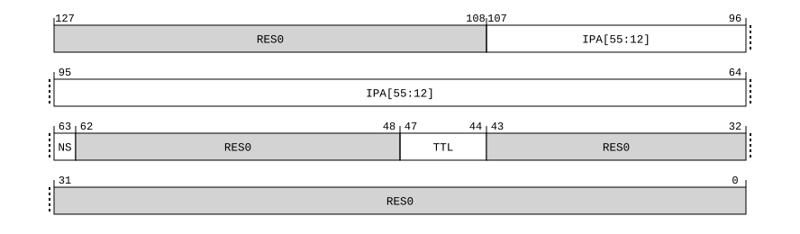

# ​C5.5.88 TLBIP IPAS2E1OS, TLBIP IPAS2E1OSNXS, TLB Invalidate Pair by Intermediate Physical Address, Stage 2, EL1, Outer Shareable

Source: <https://developer.arm.com/documentation/ddi0487/mc/-Part-C-The-AArch64-Instruction-Set/-Chapter-C5-The-A64-System-Instruction-Class/-C5-5-A64-System-instructions-for-TLB-maintenance/-C5-5-88-TLBIP-IPAS2E1OS--TLBIP-IPAS2E1OSNXS--TLB-Invalidate-Pair-by-Intermediate-Physical-Address--Stage-2--EL1--Outer-Shareable>

##### C5.5.88 TLBIP IPAS2E1OS, TLBIP IPAS2E1OSNXS, TLB Invalidate Pair by Intermediate Physical Address, Stage 2, EL1, Outer Shareable

The TLBIP IPAS2E1OS, TLBIP IPAS2E1OSNXS characteristics are:

Purpose
:   If EL2 is implemented and enabled in the current Security state, invalidates cached copies of translation table entries from TLBs that meet all the following requirements:

    - The entry is one of the following:

      - A 128-bit stage 2 only translation table entry, from any level of the translation table walk.
      - A 64-bit stage 2 only translation table entry, from any level of the translation table walk, if TTL[3:2] is `0b00`.
    - If [FEAT\_RME](/documentation/ddi0487/mc/-Part-A-Arm-Architecture-Introduction-and-Overview/-Chapter-A2-A-profile-Architecture-Extensions/-A2-3-Armv9-A-architecture-extensions/-A2-3-3-The-Armv9-2-architecture-extension?lang=en#feat_feat_rme) is implemented, one of the following applies:

      - [SCR\_EL3](/documentation/ddi0487/mc/-Part-D-The-AArch64-System-Level-Architecture/-Chapter-D24-AArch64-System-Register-Descriptions/-D24-2-General-system-control-registers/-D24-2-168-SCR-EL3--Secure-Configuration-Register?lang=en#reg_aarch64_scr_el3).{NSE, NS} is {0, 0} and the entry would be required to translate the specified IPA using the Secure EL1&0 translation regime.
      - [SCR\_EL3](/documentation/ddi0487/mc/-Part-D-The-AArch64-System-Level-Architecture/-Chapter-D24-AArch64-System-Register-Descriptions/-D24-2-General-system-control-registers/-D24-2-168-SCR-EL3--Secure-Configuration-Register?lang=en#reg_aarch64_scr_el3).{NSE, NS} is {0, 1} and the entry would be required to translate the specified IPA using the Non-secure EL1&0 translation regime.
      - [SCR\_EL3](/documentation/ddi0487/mc/-Part-D-The-AArch64-System-Level-Architecture/-Chapter-D24-AArch64-System-Register-Descriptions/-D24-2-General-system-control-registers/-D24-2-168-SCR-EL3--Secure-Configuration-Register?lang=en#reg_aarch64_scr_el3).{NSE, NS} is {1, 1} and the entry would be required to translate the specified IPA using the Realm EL1&0 translation regime.
    - If [FEAT\_RME](/documentation/ddi0487/mc/-Part-A-Arm-Architecture-Introduction-and-Overview/-Chapter-A2-A-profile-Architecture-Extensions/-A2-3-Armv9-A-architecture-extensions/-A2-3-3-The-Armv9-2-architecture-extension?lang=en#feat_feat_rme) is not implemented, one of the following applies:

      - [SCR\_EL3](/documentation/ddi0487/mc/-Part-D-The-AArch64-System-Level-Architecture/-Chapter-D24-AArch64-System-Register-Descriptions/-D24-2-General-system-control-registers/-D24-2-168-SCR-EL3--Secure-Configuration-Register?lang=en#reg_aarch64_scr_el3).NS is 0 and the entry would be required to translate the specified IPA using the Secure EL1&0 translation regime.
      - [SCR\_EL3](/documentation/ddi0487/mc/-Part-D-The-AArch64-System-Level-Architecture/-Chapter-D24-AArch64-System-Register-Descriptions/-D24-2-General-system-control-registers/-D24-2-168-SCR-EL3--Secure-Configuration-Register?lang=en#reg_aarch64_scr_el3).NS is 1 and the entry would be required to translate the specified IPA using the Non-secure EL1&0 translation regime.
    - The entry would be used with the current VMID.

    The invalidation is not required to apply to caching structures that combine stage 1 and stage 2 translation table entries.

    The invalidation applies to all PEs in the same Outer Shareable shareability domain as the PE that executes this System instruction.

    For more information about the architectural requirements for this System instruction, see [‘Invalidating TLB entries from stage 2 translations’](/documentation/ddi0487/mc/-Part-D-The-AArch64-System-Level-Architecture/-Chapter-D8-The-AArch64-Virtual-Memory-System-Architecture/-D8-17-TLB-maintenance/-D8-17-6-Operation-of-the-TLB-maintenance-instructions?lang=en#mdsec_invalidating_tlb_entries_from_stage_2_translations).

    If [FEAT\_XS](/documentation/ddi0487/mc/-Part-A-Arm-Architecture-Introduction-and-Overview/-Chapter-A2-A-profile-Architecture-Extensions/-A2-2-Armv8-A-architecture-extensions/-A2-2-8-The-Armv8-7-architecture-extension?lang=en#feat_feat_xs) is implemented, the nXS variant of this System instruction is defined.

    It is IMPLEMENTATION SPECIFIC whether the TLBI System instruction with the nXS qualifier invalidates TLB entries with the XS attribute set to 1.

    The TLBI System instruction without the nXS qualifier waits for all memory accesses using in-scope old translation information to complete before it is considered complete.

    The TLBI System instruction with the nXS qualifier is considered complete when the subset of these memory accesses with XS attribute set to 0 are complete.

Configuration
:   This system instruction is present only when FEAT\_D128 is implemented and FEAT\_AA64 is implemented. Otherwise, direct accesses to TLBIP IPAS2E1OS, TLBIP IPAS2E1OSNXS are UNDEFINED.

Attributes
:   TLBIP IPAS2E1OS, TLBIP IPAS2E1OSNXS is a 128-bit System instruction.

###### Field descriptions



Bits [127:108]
:   Reserved, RES0.

IPA[55:12], bits [107:64]
:   Bits[55:12] of the intermediate physical address to match.

NS, bit [63]
:   When FEAT\_RME is implemented:
    :   When the instruction is executed and [SCR\_EL3](/documentation/ddi0487/mc/-Part-D-The-AArch64-System-Level-Architecture/-Chapter-D24-AArch64-System-Register-Descriptions/-D24-2-General-system-control-registers/-D24-2-168-SCR-EL3--Secure-Configuration-Register?lang=en#reg_aarch64_scr_el3).{NSE, NS} == {0, 0}, NS selects the IPA space.

<table>
 <colgroup>
  <col/>
  <col/>
 </colgroup>
 <thead>
  <tr>
   <th>
    <strong>
     NS
    </strong>
   </th>
   <th>
    <strong>
     Meaning
    </strong>
   </th>
  </tr>
 </thead>
 <tbody>
  <tr>
   <td>
    <p>
     <code>
      0b0
     </code>
    </p>
   </td>
   <td>
    <p>
     IPA is in the Secure IPA space.
    </p>
   </td>
  </tr>
  <tr>
   <td>
    <p>
     <code>
      0b1
     </code>
    </p>
   </td>
   <td>
    <p>
     IPA is in the Non-secure IPA space.
    </p>
   </td>
  </tr>
 </tbody>
</table>

        When the instruction is executed and SCR\_EL3.{NSE, NS} == {1, 1}, this field is RES0, and the instruction applies only to the Realm IPA space.

        When the instruction is executed and SCR\_EL3.{NSE, NS} == {0, 1}, this field is RES0, and the instruction applies only to the Non-secure IPA space.

    When FEAT\_SEL2 is implemented and FEAT\_RME is not implemented:
    :   Not Secure. Specifies the IPA space.

<table>
 <colgroup>
  <col/>
  <col/>
 </colgroup>
 <thead>
  <tr>
   <th>
    <strong>
     NS
    </strong>
   </th>
   <th>
    <strong>
     Meaning
    </strong>
   </th>
  </tr>
 </thead>
 <tbody>
  <tr>
   <td>
    <p>
     <code>
      0b0
     </code>
    </p>
   </td>
   <td>
    <p>
     IPA is in the Secure IPA space.
    </p>
   </td>
  </tr>
  <tr>
   <td>
    <p>
     <code>
      0b1
     </code>
    </p>
   </td>
   <td>
    <p>
     IPA is in the Non-secure IPA space.
    </p>
   </td>
  </tr>
 </tbody>
</table>

        When the instruction is executed in Non-secure state, this field is RES0, and the instruction applies only to the Non-secure IPA space.

        When [FEAT\_SEL2](/documentation/ddi0487/mc/-Part-A-Arm-Architecture-Introduction-and-Overview/-Chapter-A2-A-profile-Architecture-Extensions/-A2-2-Armv8-A-architecture-extensions/-A2-2-5-The-Armv8-4-architecture-extension?lang=en#feat_feat_sel2) is not implemented, or if EL2 is disabled in the current Security state, this field is RES0.

    Otherwise:
    :   Reserved, RES0.

Bits [62:48]
:   Reserved, RES0.

TTL, bits [47:44]
:   When FEAT\_TTL is implemented:
    :   Translation Table Level. Indicates the level of the translation table walk that holds the leaf entry for the address being invalidated.

<table>
 <colgroup>
  <col/>
  <col/>
 </colgroup>
 <thead>
  <tr>
   <th>
    <strong>
     TTL
    </strong>
   </th>
   <th>
    <strong>
     Meaning
    </strong>
   </th>
  </tr>
 </thead>
 <tbody>
  <tr>
   <td>
    <p>
     <code>
      0b00xx
     </code>
    </p>
   </td>
   <td>
    <p>
     No information supplied as to the translation table level. Hardware must assume that the entry can be from any level. In this case, TTL&lt;1:0&gt; is
     <small>
      RES0
     </small>
     .
    </p>
   </td>
  </tr>
  <tr>
   <td>
    <p>
     <code>
      0b01xx
     </code>
    </p>
   </td>
   <td>
    <p>
     The entry comes from a 4KB translation granule. The level of walk for the leaf level
     <code>
      0bxx
     </code>
     is encoded as:
    </p>
    <p>
     <code>
      0b00
     </code>
     : Level 0.
    </p>
    <p>
     <code>
      0b01
     </code>
     : Level 1.
    </p>
    <p>
     <code>
      0b10
     </code>
     : Level 2.
    </p>
    <p>
     <code>
      0b11
     </code>
     : Level 3.
    </p>
   </td>
  </tr>
  <tr>
   <td>
    <p>
     <code>
      0b10xx
     </code>
    </p>
   </td>
   <td>
    <p>
     The entry comes from a 16KB translation granule. The level of walk for the leaf level
     <code>
      0bxx
     </code>
     is encoded as:
    </p>
    <p>
     <code>
      0b00
     </code>
     : Reserved. Treat as if TTL&lt;3:2&gt; is
     <code>
      0b00
     </code>
     .
    </p>
    <p>
     <code>
      0b01
     </code>
     : Level 1.
    </p>
    <p>
     <code>
      0b10
     </code>
     : Level 2.
    </p>
    <p>
     <code>
      0b11
     </code>
     : Level 3.
    </p>
   </td>
  </tr>
  <tr>
   <td>
    <p>
     <code>
      0b11xx
     </code>
    </p>
   </td>
   <td>
    <p>
     The entry comes from a 64KB translation granule. The level of walk for the leaf level
     <code>
      0bxx
     </code>
     is encoded as:
    </p>
    <p>
     <code>
      0b00
     </code>
     : Reserved. Treat as if TTL&lt;3:2&gt; is
     <code>
      0b00
     </code>
     .
    </p>
    <p>
     <code>
      0b01
     </code>
     : Level 1.
    </p>
    <p>
     <code>
      0b10
     </code>
     : Level 2.
    </p>
    <p>
     <code>
      0b11
     </code>
     : Level 3.
    </p>
   </td>
  </tr>
 </tbody>
</table>

        If an incorrect value of the TTL field is specified for the entry being invalidated by the instruction, then no entries are required by the architecture to be invalidated from the TLB.

    Otherwise:
    :   Reserved, RES0.

Bits [43:0]
:   Reserved, RES0.

###### Executing TLBIP IPAS2E1OS, TLBIP IPAS2E1OSNXS

This system instruction is an alias of the SYSP instruction.

Accesses to this instruction use the following encodings in the System instruction encoding space:

###### `TLBIP IPAS2E1OS{, <Xt>, <Xt2>}`

<table>
 <colgroup>
  <col/>
  <col/>
  <col/>
  <col/>
  <col/>
 </colgroup>
 <thead>
  <tr>
   <th>
    <strong>
     op0
    </strong>
   </th>
   <th>
    <strong>
     op1
    </strong>
   </th>
   <th>
    <strong>
     CRn
    </strong>
   </th>
   <th>
    <strong>
     CRm
    </strong>
   </th>
   <th>
    <strong>
     op2
    </strong>
   </th>
  </tr>
 </thead>
 <tbody>
  <tr>
   <td>
    <p>
     <code>
      0b01
     </code>
    </p>
   </td>
   <td>
    <p>
     <code>
      0b100
     </code>
    </p>
   </td>
   <td>
    <p>
     <code>
      0b1000
     </code>
    </p>
   </td>
   <td>
    <p>
     <code>
      0b0100
     </code>
    </p>
   </td>
   <td>
    <p>
     <code>
      0b000
     </code>
    </p>
   </td>
  </tr>
 </tbody>
</table>

```
if !(IsFeatureImplemented(FEAT_D128) && IsFeatureImplemented(FEAT_AA64)) then
    Undefined();
elsif PSTATE.EL == EL0 then
    Undefined();
elsif PSTATE.EL == EL1 then
    if EffectiveHCR_EL2_NVx() IN {'xx1'} then
        AArch64_SystemAccessTrap(EL2, 0x14);
    else
        Undefined();
    end;
elsif PSTATE.EL == EL2 then
    AArch64_TLBIP_IPAS2(SecurityStateAtEL(EL1), Regime_EL10, VMID(), Broadcast_OSH, TLBILevel_Any, TLBI_AllAttr, X{128}(t, t2));
elsif PSTATE.EL == EL3 then
    if !EL2Enabled() then
        return;
    else
        if IsFeatureImplemented(FEAT_RME) && !ValidSecurityStateAtEL(EL1) then
            return;
        else
            AArch64_TLBIP_IPAS2(SecurityStateAtEL(EL1), Regime_EL10, VMID(), Broadcast_OSH, TLBILevel_Any, TLBI_AllAttr, X{128}(t, t2));
        end;
    end;
end;
```

###### `TLBIP IPAS2E1OSNXS{, <Xt>, <Xt2>}`

<table>
 <colgroup>
  <col/>
  <col/>
  <col/>
  <col/>
  <col/>
 </colgroup>
 <thead>
  <tr>
   <th>
    <strong>
     op0
    </strong>
   </th>
   <th>
    <strong>
     op1
    </strong>
   </th>
   <th>
    <strong>
     CRn
    </strong>
   </th>
   <th>
    <strong>
     CRm
    </strong>
   </th>
   <th>
    <strong>
     op2
    </strong>
   </th>
  </tr>
 </thead>
 <tbody>
  <tr>
   <td>
    <p>
     <code>
      0b01
     </code>
    </p>
   </td>
   <td>
    <p>
     <code>
      0b100
     </code>
    </p>
   </td>
   <td>
    <p>
     <code>
      0b1001
     </code>
    </p>
   </td>
   <td>
    <p>
     <code>
      0b0100
     </code>
    </p>
   </td>
   <td>
    <p>
     <code>
      0b000
     </code>
    </p>
   </td>
  </tr>
 </tbody>
</table>

```
if !(IsFeatureImplemented(FEAT_D128) && IsFeatureImplemented(FEAT_AA64)) then
    Undefined();
elsif !IsFeatureImplemented(FEAT_XS) then
    Undefined();
elsif PSTATE.EL == EL0 then
    Undefined();
elsif PSTATE.EL == EL1 then
    if EffectiveHCR_EL2_NVx() IN {'xx1'} then
        AArch64_SystemAccessTrap(EL2, 0x14);
    else
        Undefined();
    end;
elsif PSTATE.EL == EL2 then
    AArch64_TLBIP_IPAS2(SecurityStateAtEL(EL1), Regime_EL10, VMID(), Broadcast_OSH, TLBILevel_Any, TLBI_ExcludeXS, X{128}(t, t2));
elsif PSTATE.EL == EL3 then
    if !EL2Enabled() then
        return;
    else
        if IsFeatureImplemented(FEAT_RME) && !ValidSecurityStateAtEL(EL1) then
            return;
        else
            AArch64_TLBIP_IPAS2(SecurityStateAtEL(EL1), Regime_EL10, VMID(), Broadcast_OSH, TLBILevel_Any, TLBI_ExcludeXS, X{128}(t, t2));
        end;
    end;
end;
```
