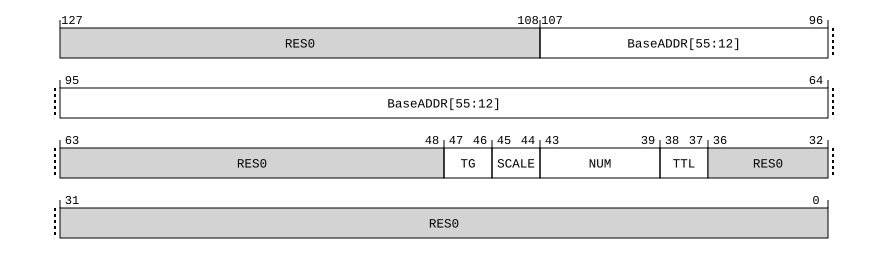

# ​C5.5.99 TLBIP RVAAE1IS, TLBIP RVAAE1ISNXS, TLB Range Invalidate by VA, All ASID, EL1, Inner Shareable

Source: <https://developer.arm.com/documentation/ddi0487/mc/-Part-C-The-AArch64-Instruction-Set/-Chapter-C5-The-A64-System-Instruction-Class/-C5-5-A64-System-instructions-for-TLB-maintenance/-C5-5-99-TLBIP-RVAAE1IS--TLBIP-RVAAE1ISNXS--TLB-Range-Invalidate-by-VA--All-ASID--EL1--Inner-Shareable>

##### C5.5.99 TLBIP RVAAE1IS, TLBIP RVAAE1ISNXS, TLB Range Invalidate by VA, All ASID, EL1, Inner Shareable

The TLBIP RVAAE1IS, TLBIP RVAAE1ISNXS characteristics are:

Purpose
:   Invalidates cached copies of translation table entries from TLBs that meet all the following requirements:

    - The entry is one of the following:

      - A 128-bit stage 1 translation table entry, from any level of the translation table walk, to the level indicated by the TTL hint.
      - A 64-bit stage 1 translation table entry, from any level of the translation table walk, if TTL is `0b00`.
    - The entry is within the address range determined by the formula [BaseADDR <= VA < BaseADDR + ((NUM +1)\*2(5\*SCALE +1) \* Translation\_Granule\_Size)].
    - When EL2 is implemented and enabled in the current Security state:

      - If the Effective value of [HCR\_EL2](/documentation/ddi0487/mc/-Part-D-The-AArch64-System-Level-Architecture/-Chapter-D24-AArch64-System-Register-Descriptions/-D24-2-General-system-control-registers/-D24-2-61-HCR-EL2--Hypervisor-Configuration-Register?lang=en#reg_aarch64_hcr_el2).{E2H, TGE} is not {1, 1}, the entry would be used with the current VMID and would be required to translate any VA in the specified address range using the EL1&0 translation regime for the Security state.
      - If the Effective value of [HCR\_EL2](/documentation/ddi0487/mc/-Part-D-The-AArch64-System-Level-Architecture/-Chapter-D24-AArch64-System-Register-Descriptions/-D24-2-General-system-control-registers/-D24-2-61-HCR-EL2--Hypervisor-Configuration-Register?lang=en#reg_aarch64_hcr_el2).{E2H, TGE} is {1, 1}, the entry would be required to translate any VA in the specified address range using the EL2&0 translation regime for the Security state.
    - When EL2 is not implemented or is disabled in the current Security state, the entry would be required to translate any VA in the specified address range using the EL1&0 translation regime for the Security state.
    - The Security state is indicated by the value of [SCR\_EL3](/documentation/ddi0487/mc/-Part-D-The-AArch64-System-Level-Architecture/-Chapter-D24-AArch64-System-Register-Descriptions/-D24-2-General-system-control-registers/-D24-2-168-SCR-EL3--Secure-Configuration-Register?lang=en#reg_aarch64_scr_el3).NS if [FEAT\_RME](/documentation/ddi0487/mc/-Part-A-Arm-Architecture-Introduction-and-Overview/-Chapter-A2-A-profile-Architecture-Extensions/-A2-3-Armv9-A-architecture-extensions/-A2-3-3-The-Armv9-2-architecture-extension?lang=en#feat_feat_rme) is not implemented, or [SCR\_EL3](/documentation/ddi0487/mc/-Part-D-The-AArch64-System-Level-Architecture/-Chapter-D24-AArch64-System-Register-Descriptions/-D24-2-General-system-control-registers/-D24-2-168-SCR-EL3--Secure-Configuration-Register?lang=en#reg_aarch64_scr_el3).{NSE, NS} if [FEAT\_RME](/documentation/ddi0487/mc/-Part-A-Arm-Architecture-Introduction-and-Overview/-Chapter-A2-A-profile-Architecture-Extensions/-A2-3-Armv9-A-architecture-extensions/-A2-3-3-The-Armv9-2-architecture-extension?lang=en#feat_feat_rme) is implemented.

    The invalidation applies to all PEs in the same Inner Shareable shareability domain as the PE that executes this System instruction.

    > #### Note
    >
    > When a TLB maintenance instruction is generated to the Secure EL1&0 translation regime and is defined to pass a VMID argument, or would be defined to pass a VMID argument if [SCR\_EL3](/documentation/ddi0487/mc/-Part-D-The-AArch64-System-Level-Architecture/-Chapter-D24-AArch64-System-Register-Descriptions/-D24-2-General-system-control-registers/-D24-2-168-SCR-EL3--Secure-Configuration-Register?lang=en#reg_aarch64_scr_el3).EEL2==1, then:
    >
    > - A PE with [SCR\_EL3](/documentation/ddi0487/mc/-Part-D-The-AArch64-System-Level-Architecture/-Chapter-D24-AArch64-System-Register-Descriptions/-D24-2-General-system-control-registers/-D24-2-168-SCR-EL3--Secure-Configuration-Register?lang=en#reg_aarch64_scr_el3).EEL2==1 is not architecturally required to invalidate any entries in the Secure EL1&0 translation of a PE in the same required shareability domain with [SCR\_EL3](/documentation/ddi0487/mc/-Part-D-The-AArch64-System-Level-Architecture/-Chapter-D24-AArch64-System-Register-Descriptions/-D24-2-General-system-control-registers/-D24-2-168-SCR-EL3--Secure-Configuration-Register?lang=en#reg_aarch64_scr_el3).EEL2==0.
    > - A PE with [SCR\_EL3](/documentation/ddi0487/mc/-Part-D-The-AArch64-System-Level-Architecture/-Chapter-D24-AArch64-System-Register-Descriptions/-D24-2-General-system-control-registers/-D24-2-168-SCR-EL3--Secure-Configuration-Register?lang=en#reg_aarch64_scr_el3).EEL2==0 is not architecturally required to invalidate any entries in the Secure EL1&0 translation of a PE in the same required shareability domain with [SCR\_EL3](/documentation/ddi0487/mc/-Part-D-The-AArch64-System-Level-Architecture/-Chapter-D24-AArch64-System-Register-Descriptions/-D24-2-General-system-control-registers/-D24-2-168-SCR-EL3--Secure-Configuration-Register?lang=en#reg_aarch64_scr_el3).EEL2==1.
    > - A PE is architecturally required to invalidate all relevant entries in the Secure EL1&0 translation of a System MMU in the same required shareability domain with a VMID of 0.

    > #### Note
    >
    > For the EL1&0 and EL2&0 translation regimes, the invalidation applies to both global entries and non-global entries with any ASID.

    For 128-bit translation table entry, the range of addresses invalidated is UNPREDICTABLE when Block or Page size corresponding to TTL and TG, for the translation system is not aligned.

    If [FEAT\_XS](/documentation/ddi0487/mc/-Part-A-Arm-Architecture-Introduction-and-Overview/-Chapter-A2-A-profile-Architecture-Extensions/-A2-2-Armv8-A-architecture-extensions/-A2-2-8-The-Armv8-7-architecture-extension?lang=en#feat_feat_xs) is implemented, the nXS variant of this System instruction is defined.

    It is IMPLEMENTATION SPECIFIC whether the TLBI System instruction with the nXS qualifier invalidates TLB entries with the XS attribute set to 1.

    The TLBI System instruction without the nXS qualifier waits for all memory accesses using in-scope old translation information to complete before it is considered complete.

    The TLBI System instruction with the nXS qualifier is considered complete when the subset of these memory accesses with XS attribute set to 0 are complete.

Configuration
:   This system instruction is present only when FEAT\_D128 is implemented and FEAT\_AA64 is implemented. Otherwise, direct accesses to TLBIP RVAAE1IS, TLBIP RVAAE1ISNXS are UNDEFINED.

Attributes
:   TLBIP RVAAE1IS, TLBIP RVAAE1ISNXS is a 128-bit System instruction.

###### Field descriptions



Bits [127:108]
:   Reserved, RES0.

BaseADDR[55:12], bits [107:64]
:   The starting address for the range of the maintenance instructions. This field is BaseADDR[55:12] for all translation granules.

Bits [63:48]
:   Reserved, RES0.

TG, bits [47:46]
:   Translation granule size.

<table>
 <colgroup>
  <col/>
  <col/>
 </colgroup>
 <thead>
  <tr>
   <th>
    <strong>
     TG
    </strong>
   </th>
   <th>
    <strong>
     Meaning
    </strong>
   </th>
  </tr>
 </thead>
 <tbody>
  <tr>
   <td>
    <p>
     <code>
      0b00
     </code>
    </p>
   </td>
   <td>
    <p>
     Reserved.
    </p>
   </td>
  </tr>
  <tr>
   <td>
    <p>
     <code>
      0b01
     </code>
    </p>
   </td>
   <td>
    <p>
     4K translation granule.
    </p>
   </td>
  </tr>
  <tr>
   <td>
    <p>
     <code>
      0b10
     </code>
    </p>
   </td>
   <td>
    <p>
     16K translation granule.
    </p>
   </td>
  </tr>
  <tr>
   <td>
    <p>
     <code>
      0b11
     </code>
    </p>
   </td>
   <td>
    <p>
     64K translation granule.
    </p>
   </td>
  </tr>
 </tbody>
</table>

    The instruction takes a translation granule size for the translations that are being invalidated. If the translations used a different translation granule size than the one being specified, then the architecture does not require that the instruction invalidates any entries.

SCALE, bits [45:44]
:   The exponent element of the calculation that is used to produce the upper range.

NUM, bits [43:39]
:   The base element of the calculation that is used to produce the upper range.

TTL, bits [38:37]
:   TTL Level hint. The TTL hint is only guaranteed to invalidate:

    - Non-leaf-level entries in the range up to but not including the level described by the TTL hint.
    - Leaf-level entries in the range that match the level described by the TTL hint.

<table>
 <colgroup>
  <col/>
  <col/>
 </colgroup>
 <thead>
  <tr>
   <th>
    <strong>
     TTL
    </strong>
   </th>
   <th>
    <strong>
     Meaning
    </strong>
   </th>
  </tr>
 </thead>
 <tbody>
  <tr>
   <td>
    <p>
     <code>
      0b00
     </code>
    </p>
   </td>
   <td>
    <p>
     The entries in the range can be using any level for the translation table entries.
    </p>
   </td>
  </tr>
  <tr>
   <td>
    <p>
     <code>
      0b01
     </code>
    </p>
   </td>
   <td>
    <p>
     The TTL hint indicates level 1.
    </p>
   </td>
  </tr>
  <tr>
   <td>
    <p>
     <code>
      0b10
     </code>
    </p>
   </td>
   <td>
    <p>
     The TTL hint indicates level 2.
    </p>
   </td>
  </tr>
  <tr>
   <td>
    <p>
     <code>
      0b11
     </code>
    </p>
   </td>
   <td>
    <p>
     The TTL hint indicates level 3.
    </p>
   </td>
  </tr>
 </tbody>
</table>

Bits [36:0]
:   Reserved, RES0.

###### Executing TLBIP RVAAE1IS, TLBIP RVAAE1ISNXS

This system instruction is an alias of the SYSP instruction.

The following pseudocode describes traps which apply to the System instruction. For information about changes to the scope of the invalidation to the instruction under different conditions, see `AArch64_TLBIP_RVAA()` in the [Pseudocode for AArch64 operation](/documentation/ddi0487/mc/-Part-J-Architectural-Pseudocode/-Chapter-J1-A-profile-Architecture-Pseudocode/-J1-2-Pseudocode-for-AArch64-operation?lang=en#shared_pseudocode_aarch64).

Accesses to this instruction use the following encodings in the System instruction encoding space:

###### `TLBIP RVAAE1IS{, <Xt>, <Xt2>}`

<table>
 <colgroup>
  <col/>
  <col/>
  <col/>
  <col/>
  <col/>
 </colgroup>
 <thead>
  <tr>
   <th>
    <strong>
     op0
    </strong>
   </th>
   <th>
    <strong>
     op1
    </strong>
   </th>
   <th>
    <strong>
     CRn
    </strong>
   </th>
   <th>
    <strong>
     CRm
    </strong>
   </th>
   <th>
    <strong>
     op2
    </strong>
   </th>
  </tr>
 </thead>
 <tbody>
  <tr>
   <td>
    <p>
     <code>
      0b01
     </code>
    </p>
   </td>
   <td>
    <p>
     <code>
      0b000
     </code>
    </p>
   </td>
   <td>
    <p>
     <code>
      0b1000
     </code>
    </p>
   </td>
   <td>
    <p>
     <code>
      0b0010
     </code>
    </p>
   </td>
   <td>
    <p>
     <code>
      0b011
     </code>
    </p>
   </td>
  </tr>
 </tbody>
</table>

```
if !(IsFeatureImplemented(FEAT_D128) && IsFeatureImplemented(FEAT_AA64)) then
    Undefined();
elsif PSTATE.EL == EL0 then
    Undefined();
elsif PSTATE.EL == EL1 then
    if EL2Enabled() && (HCR_EL2().TTLB == '1' || HCR_EL2().TTLBIS == '1') then
        AArch64_SystemAccessTrap(EL2, 0x14);
    elsif EL2Enabled() && IsFeatureImplemented(FEAT_FGT) && (!HaveEL(EL3) || SCR_EL3().FGTEn == '1') && HFGITR_EL2().TLBIRVAAE1IS == '1' then
        AArch64_SystemAccessTrap(EL2, 0x14);
    else
        AArch64_TLBIP_RVAA(SecurityStateAtEL(EL1), Regime_EL10, VMID(), Broadcast_ISH, TLBILevel_Any, TLBI_AllAttr, X{128}(t, t2));
    end;
elsif PSTATE.EL == EL2 then
    AArch64_TLBIP_RVAA(SecurityStateAtEL(EL1), Regime_EL10, VMID(), Broadcast_ISH, TLBILevel_Any, TLBI_AllAttr, X{128}(t, t2));
elsif PSTATE.EL == EL3 then
    if IsFeatureImplemented(FEAT_RME) && !ValidSecurityStateAtEL(EL1) then
        return;
    else
        AArch64_TLBIP_RVAA(SecurityStateAtEL(EL1), Regime_EL10, VMID(), Broadcast_ISH, TLBILevel_Any, TLBI_AllAttr, X{128}(t, t2));
    end;
end;
```

###### `TLBIP RVAAE1ISNXS{, <Xt>, <Xt2>}`

<table>
 <colgroup>
  <col/>
  <col/>
  <col/>
  <col/>
  <col/>
 </colgroup>
 <thead>
  <tr>
   <th>
    <strong>
     op0
    </strong>
   </th>
   <th>
    <strong>
     op1
    </strong>
   </th>
   <th>
    <strong>
     CRn
    </strong>
   </th>
   <th>
    <strong>
     CRm
    </strong>
   </th>
   <th>
    <strong>
     op2
    </strong>
   </th>
  </tr>
 </thead>
 <tbody>
  <tr>
   <td>
    <p>
     <code>
      0b01
     </code>
    </p>
   </td>
   <td>
    <p>
     <code>
      0b000
     </code>
    </p>
   </td>
   <td>
    <p>
     <code>
      0b1001
     </code>
    </p>
   </td>
   <td>
    <p>
     <code>
      0b0010
     </code>
    </p>
   </td>
   <td>
    <p>
     <code>
      0b011
     </code>
    </p>
   </td>
  </tr>
 </tbody>
</table>

```
if !(IsFeatureImplemented(FEAT_D128) && IsFeatureImplemented(FEAT_AA64)) then
    Undefined();
elsif !IsFeatureImplemented(FEAT_XS) then
    Undefined();
elsif PSTATE.EL == EL0 then
    Undefined();
elsif PSTATE.EL == EL1 then
    if EL2Enabled() && (HCR_EL2().TTLB == '1' || HCR_EL2().TTLBIS == '1') then
        AArch64_SystemAccessTrap(EL2, 0x14);
    elsif EL2Enabled() && IsFeatureImplemented(FEAT_FGT) && (!HaveEL(EL3) || SCR_EL3().FGTEn == '1') && IsFeatureImplemented(FEAT_HCX) && (!IsHCRXEL2Enabled() || HCRX_EL2().FGTnXS == '0') && HFGITR_EL2().TLBIRVAAE1IS == '1' then
        AArch64_SystemAccessTrap(EL2, 0x14);
    else
        AArch64_TLBIP_RVAA(SecurityStateAtEL(EL1), Regime_EL10, VMID(), Broadcast_ISH, TLBILevel_Any, TLBI_ExcludeXS, X{128}(t, t2));
    end;
elsif PSTATE.EL == EL2 then
    AArch64_TLBIP_RVAA(SecurityStateAtEL(EL1), Regime_EL10, VMID(), Broadcast_ISH, TLBILevel_Any, TLBI_ExcludeXS, X{128}(t, t2));
elsif PSTATE.EL == EL3 then
    if IsFeatureImplemented(FEAT_RME) && !ValidSecurityStateAtEL(EL1) then
        return;
    else
        AArch64_TLBIP_RVAA(SecurityStateAtEL(EL1), Regime_EL10, VMID(), Broadcast_ISH, TLBILevel_Any, TLBI_ExcludeXS, X{128}(t, t2));
    end;
end;
```
