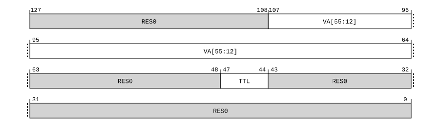

# ​C5.5.134 TLBIP VAE3, TLBIP VAE3NXS, TLB Invalidate Pair by VA, EL3

Source: <https://developer.arm.com/documentation/ddi0487/mc/-Part-C-The-AArch64-Instruction-Set/-Chapter-C5-The-A64-System-Instruction-Class/-C5-5-A64-System-instructions-for-TLB-maintenance/-C5-5-134-TLBIP-VAE3--TLBIP-VAE3NXS--TLB-Invalidate-Pair-by-VA--EL3>

##### C5.5.134 TLBIP VAE3, TLBIP VAE3NXS, TLB Invalidate Pair by VA, EL3

The TLBIP VAE3, TLBIP VAE3NXS characteristics are:

Purpose
:   If EL3 is implemented, invalidates cached copies of translation table entries from TLBs that meet all the following requirements:

    - The entry is one of the following:

      - A 128-bit stage 1 translation table entry, from any level of the translation table walk.
      - A 64-bit stage 1 translation table entry, from any level of the translation table walk, if TTL[3:2] is `0b00`.
    - The entry would be required to translate the specified VA using the EL3 translation regime.

    The invalidation only applies to the PE that executes this System instruction.

    If [FEAT\_XS](/documentation/ddi0487/mc/-Part-A-Arm-Architecture-Introduction-and-Overview/-Chapter-A2-A-profile-Architecture-Extensions/-A2-2-Armv8-A-architecture-extensions/-A2-2-8-The-Armv8-7-architecture-extension?lang=en#feat_feat_xs) is implemented, the nXS variant of this System instruction is defined.

    It is IMPLEMENTATION SPECIFIC whether the TLBI System instruction with the nXS qualifier invalidates TLB entries with the XS attribute set to 1.

    The TLBI System instruction without the nXS qualifier waits for all memory accesses using in-scope old translation information to complete before it is considered complete.

    The TLBI System instruction with the nXS qualifier is considered complete when the subset of these memory accesses with XS attribute set to 0 are complete.

Configuration
:   This system instruction is present only when FEAT\_D128 is implemented and FEAT\_AA64 is implemented. Otherwise, direct accesses to TLBIP VAE3, TLBIP VAE3NXS are UNDEFINED.

Attributes
:   TLBIP VAE3, TLBIP VAE3NXS is a 128-bit System instruction.

###### Field descriptions



Bits [127:108]
:   Reserved, RES0.

VA[55:12], bits [107:64]
:   Bits[55:12] of the virtual address to match. Any appropriate TLB entries that match the ASID value (if appropriate) and VA will be affected by this System instruction.

    The treatment of the low-order bits of this field depends on the translation granule size, as follows:

    - Where a 4KB translation granule is being used, all bits are valid and used for the invalidation.
    - Where a 16KB translation granule is being used, bits [1:0] of this field are RES0 and ignored when the instruction is executed, because VA[13:12] have no effect on the operation of the instruction.
    - Where a 64KB translation granule is being used, bits [3:0] of this field are RES0 and ignored when the instruction is executed, because VA[15:12] have no effect on the operation of the instruction.

Bits [63:48]
:   Reserved, RES0.

TTL, bits [47:44]
:   When FEAT\_TTL is implemented:
    :   Translation Table Level. Indicates the level of the translation table walk that holds the leaf entry for the address being invalidated.

<table>
 <colgroup>
  <col/>
  <col/>
 </colgroup>
 <thead>
  <tr>
   <th>
    <strong>
     TTL
    </strong>
   </th>
   <th>
    <strong>
     Meaning
    </strong>
   </th>
  </tr>
 </thead>
 <tbody>
  <tr>
   <td>
    <p>
     <code>
      0b00xx
     </code>
    </p>
   </td>
   <td>
    <p>
     No information supplied as to the translation table level. Hardware must assume that the entry can be from any level. In this case, TTL&lt;1:0&gt; is
     <small>
      RES0
     </small>
     .
    </p>
   </td>
  </tr>
  <tr>
   <td>
    <p>
     <code>
      0b01xx
     </code>
    </p>
   </td>
   <td>
    <p>
     The entry comes from a 4KB translation granule. The level of walk for the leaf level
     <code>
      0bxx
     </code>
     is encoded as:
    </p>
    <p>
     <code>
      0b00
     </code>
     : Level 0.
    </p>
    <p>
     <code>
      0b01
     </code>
     : Level 1.
    </p>
    <p>
     <code>
      0b10
     </code>
     : Level 2.
    </p>
    <p>
     <code>
      0b11
     </code>
     : Level 3.
    </p>
   </td>
  </tr>
  <tr>
   <td>
    <p>
     <code>
      0b10xx
     </code>
    </p>
   </td>
   <td>
    <p>
     The entry comes from a 16KB translation granule. The level of walk for the leaf level
     <code>
      0bxx
     </code>
     is encoded as:
    </p>
    <p>
     <code>
      0b00
     </code>
     : Reserved. Treat as if TTL&lt;3:2&gt; is
     <code>
      0b00
     </code>
     .
    </p>
    <p>
     <code>
      0b01
     </code>
     : Level 1.
    </p>
    <p>
     <code>
      0b10
     </code>
     : Level 2.
    </p>
    <p>
     <code>
      0b11
     </code>
     : Level 3.
    </p>
   </td>
  </tr>
  <tr>
   <td>
    <p>
     <code>
      0b11xx
     </code>
    </p>
   </td>
   <td>
    <p>
     The entry comes from a 64KB translation granule. The level of walk for the leaf level
     <code>
      0bxx
     </code>
     is encoded as:
    </p>
    <p>
     <code>
      0b00
     </code>
     : Reserved. Treat as if TTL&lt;3:2&gt; is
     <code>
      0b00
     </code>
     .
    </p>
    <p>
     <code>
      0b01
     </code>
     : Level 1.
    </p>
    <p>
     <code>
      0b10
     </code>
     : Level 2.
    </p>
    <p>
     <code>
      0b11
     </code>
     : Level 3.
    </p>
   </td>
  </tr>
 </tbody>
</table>

        If an incorrect value of the TTL field is specified for the entry being invalidated by the instruction, then no entries are required by the architecture to be invalidated from the TLB.

    Otherwise:
    :   Reserved, RES0.

Bits [43:0]
:   Reserved, RES0.

###### Executing TLBIP VAE3, TLBIP VAE3NXS

This system instruction is an alias of the SYSP instruction.

Accesses to this instruction use the following encodings in the System instruction encoding space:

###### `TLBIP VAE3{, <Xt>, <Xt2>}`

<table>
 <colgroup>
  <col/>
  <col/>
  <col/>
  <col/>
  <col/>
 </colgroup>
 <thead>
  <tr>
   <th>
    <strong>
     op0
    </strong>
   </th>
   <th>
    <strong>
     op1
    </strong>
   </th>
   <th>
    <strong>
     CRn
    </strong>
   </th>
   <th>
    <strong>
     CRm
    </strong>
   </th>
   <th>
    <strong>
     op2
    </strong>
   </th>
  </tr>
 </thead>
 <tbody>
  <tr>
   <td>
    <p>
     <code>
      0b01
     </code>
    </p>
   </td>
   <td>
    <p>
     <code>
      0b110
     </code>
    </p>
   </td>
   <td>
    <p>
     <code>
      0b1000
     </code>
    </p>
   </td>
   <td>
    <p>
     <code>
      0b0111
     </code>
    </p>
   </td>
   <td>
    <p>
     <code>
      0b001
     </code>
    </p>
   </td>
  </tr>
 </tbody>
</table>

```
if !(IsFeatureImplemented(FEAT_D128) && IsFeatureImplemented(FEAT_AA64)) then
    Undefined();
elsif PSTATE.EL == EL0 then
    Undefined();
elsif PSTATE.EL == EL1 then
    Undefined();
elsif PSTATE.EL == EL2 then
    Undefined();
elsif PSTATE.EL == EL3 then
    if IsFeatureImplemented(FEAT_RME) && !ValidSecurityStateAtEL(EL3) then
        return;
    else
        AArch64_TLBIP_VA(SecurityStateAtEL(EL3), Regime_EL3, VMID_NONE, Broadcast_NSH, TLBILevel_Any, TLBI_AllAttr, X{128}(t, t2));
    end;
end;
```

###### `TLBIP VAE3NXS{, <Xt>, <Xt2>}`

<table>
 <colgroup>
  <col/>
  <col/>
  <col/>
  <col/>
  <col/>
 </colgroup>
 <thead>
  <tr>
   <th>
    <strong>
     op0
    </strong>
   </th>
   <th>
    <strong>
     op1
    </strong>
   </th>
   <th>
    <strong>
     CRn
    </strong>
   </th>
   <th>
    <strong>
     CRm
    </strong>
   </th>
   <th>
    <strong>
     op2
    </strong>
   </th>
  </tr>
 </thead>
 <tbody>
  <tr>
   <td>
    <p>
     <code>
      0b01
     </code>
    </p>
   </td>
   <td>
    <p>
     <code>
      0b110
     </code>
    </p>
   </td>
   <td>
    <p>
     <code>
      0b1001
     </code>
    </p>
   </td>
   <td>
    <p>
     <code>
      0b0111
     </code>
    </p>
   </td>
   <td>
    <p>
     <code>
      0b001
     </code>
    </p>
   </td>
  </tr>
 </tbody>
</table>

```
if !(IsFeatureImplemented(FEAT_D128) && IsFeatureImplemented(FEAT_AA64)) then
    Undefined();
elsif !IsFeatureImplemented(FEAT_XS) then
    Undefined();
elsif PSTATE.EL == EL0 then
    Undefined();
elsif PSTATE.EL == EL1 then
    Undefined();
elsif PSTATE.EL == EL2 then
    Undefined();
elsif PSTATE.EL == EL3 then
    if IsFeatureImplemented(FEAT_RME) && !ValidSecurityStateAtEL(EL3) then
        return;
    else
        AArch64_TLBIP_VA(SecurityStateAtEL(EL3), Regime_EL3, VMID_NONE, Broadcast_NSH, TLBILevel_Any, TLBI_ExcludeXS, X{128}(t, t2));
    end;
end;
```
