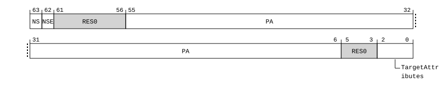

# ​C5.10.1 APAS, Associate PA space

Source: <https://developer.arm.com/documentation/ddi0487/mc/-Part-C-The-AArch64-Instruction-Set/-Chapter-C5-The-A64-System-Instruction-Class/-C5-10-A64-System-instructions-introduced-by-FEAT-RME-GPC3/-C5-10-1-APAS--Associate-PA-space>

##### C5.10.1 APAS, Associate PA space

The APAS characteristics are:

Purpose
:   Associate a location with a specified PA space, for locations that are protected by a memory-side PAS filter.

Configuration
:   This system instruction is present only when FEAT\_RME\_GPC3 is implemented and FEAT\_AA64 is implemented. Otherwise, direct accesses to APAS are UNDEFINED.

Attributes
:   APAS is a 64-bit System instruction.

###### Field descriptions



NS, bit [63]
:   Together with the NSE field, selects the target physical address space.

<table>
 <colgroup>
  <col/>
  <col/>
  <col/>
 </colgroup>
 <thead>
  <tr>
   <th>
    NSE
   </th>
   <th>
    NS
   </th>
   <th>
    Meaning
   </th>
  </tr>
 </thead>
 <tbody>
  <tr>
   <td>
    <code>
     0b0
    </code>
   </td>
   <td>
    <code>
     0b0
    </code>
   </td>
   <td>
    When Secure state is implemented, Secure. Otherwise reserved.
   </td>
  </tr>
  <tr>
   <td>
    <code>
     0b0
    </code>
   </td>
   <td>
    <code>
     0b1
    </code>
   </td>
   <td>
    Non-secure.
   </td>
  </tr>
  <tr>
   <td>
    <code>
     0b1
    </code>
   </td>
   <td>
    <code>
     0b0
    </code>
   </td>
   <td>
    Root.
   </td>
  </tr>
  <tr>
   <td>
    <code>
     0b1
    </code>
   </td>
   <td>
    <code>
     0b1
    </code>
   </td>
   <td>
    Realm.
   </td>
  </tr>
 </tbody>
</table>

NSE, bit [62]
:   Together with the NS field, selects the target physical address space.

    For a description of the values derived by evaluating NS and NSE together, see APAS.NS.

Bits [61:56]
:   Reserved, RES0.

PA, bits [55:6]
:   Bits [55:6] of the Physical Address.

    Bits of Xt corresponding to physical address bits above the implemented physical address size indicated in [ID\_AA64MMFR0\_EL1](/documentation/ddi0487/mc/-Part-D-The-AArch64-System-Level-Architecture/-Chapter-D24-AArch64-System-Register-Descriptions/-D24-2-General-system-control-registers/-D24-2-87-ID-AA64MMFR0-EL1--AArch64-Memory-Model-Feature-Register-0?lang=en#reg_aarch64_id_aa64mmfr0_el1).PARange are RES0. For example, if 44 bits of PA space are implemented, then Xt[55:44] are RES0.

Bits [5:3]
:   Reserved, RES0.

TargetAttributes, bits [2:0]
:   The Target Attributes field is encoded as follows:

<table>
 <colgroup>
  <col/>
  <col/>
 </colgroup>
 <thead>
  <tr>
   <th>
    <strong>
     TargetAttributes
    </strong>
   </th>
   <th>
    <strong>
     Meaning
    </strong>
   </th>
  </tr>
 </thead>
 <tbody>
  <tr>
   <td>
    <p>
     <code>
      0b000
     </code>
    </p>
   </td>
   <td>
    <p>
     Default behavior applies.
    </p>
   </td>
  </tr>
  <tr>
   <td>
    <p>
     <code>
      0b001
     </code>
     ..
     <code>
      0b111
     </code>
    </p>
   </td>
   <td>
    <p>
     <small>
      IMPLEMENTATION DEFINED
     </small>
     .
    </p>
   </td>
  </tr>
 </tbody>
</table>

###### Executing APAS

This instruction is not subject to any translation, permission checks, or granule protection checks.

This system instruction is an alias of the SYS instruction.

Accesses to this instruction use the following encodings in the System instruction encoding space:

###### `APAS <Xt>`

<table>
 <colgroup>
  <col/>
  <col/>
  <col/>
  <col/>
  <col/>
 </colgroup>
 <thead>
  <tr>
   <th>
    <strong>
     op0
    </strong>
   </th>
   <th>
    <strong>
     op1
    </strong>
   </th>
   <th>
    <strong>
     CRn
    </strong>
   </th>
   <th>
    <strong>
     CRm
    </strong>
   </th>
   <th>
    <strong>
     op2
    </strong>
   </th>
  </tr>
 </thead>
 <tbody>
  <tr>
   <td>
    <p>
     <code>
      0b01
     </code>
    </p>
   </td>
   <td>
    <p>
     <code>
      0b110
     </code>
    </p>
   </td>
   <td>
    <p>
     <code>
      0b0111
     </code>
    </p>
   </td>
   <td>
    <p>
     <code>
      0b0000
     </code>
    </p>
   </td>
   <td>
    <p>
     <code>
      0b000
     </code>
    </p>
   </td>
  </tr>
 </tbody>
</table>

```
if !(IsFeatureImplemented(FEAT_RME_GPC3) && IsFeatureImplemented(FEAT_AA64)) then
    Undefined();
elsif PSTATE.EL == EL0 then
    Undefined();
elsif PSTATE.EL == EL1 then
    Undefined();
elsif PSTATE.EL == EL2 then
    Undefined();
elsif PSTATE.EL == EL3 then
    AArch64_APAS(X{64}(t));
end;
```
