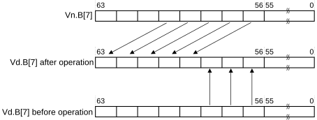

# ​C7.2.302 SLI

Source: <https://developer.arm.com/documentation/ddi0487/mc/-Part-C-The-AArch64-Instruction-Set/-Chapter-C7-A64-Advanced-SIMD-and-Floating-point-Instruction-Descriptions/-C7-2-Alphabetical-list-of-A64-Advanced-SIMD-and-floating-point-instructions/-C7-2-302-SLI>

##### C7.2.302 SLI

Shift left and insert (immediate)

This instruction reads each vector element in the source SIMD&FP register, left shifts each vector element by an immediate value, and inserts the result into the corresponding vector element in the destination SIMD&FP register such that the new zero bits created by the shift are not inserted but retain their existing value. Bits shifted out of the left of each vector element in the source register are lost.

Figure C7-3 shift left by 3 for an 8-bit vector element



Depending on the settings in the [CPACR\_EL1](/documentation/ddi0487/mc/-Part-D-The-AArch64-System-Level-Architecture/-Chapter-D24-AArch64-System-Register-Descriptions/-D24-2-General-system-control-registers/-D24-2-35-CPACR-EL1--Architectural-Feature-Access-Control-Register?lang=en#reg_aarch64_cpacr_el1), [CPTR\_EL2](/documentation/ddi0487/mc/-Part-D-The-AArch64-System-Level-Architecture/-Chapter-D24-AArch64-System-Register-Descriptions/-D24-2-General-system-control-registers/-D24-2-37-CPTR-EL2--Architectural-Feature-Trap-Register--EL2-?lang=en#reg_aarch64_cptr_el2), and [CPTR\_EL3](/documentation/ddi0487/mc/-Part-D-The-AArch64-System-Level-Architecture/-Chapter-D24-AArch64-System-Register-Descriptions/-D24-2-General-system-control-registers/-D24-2-38-CPTR-EL3--Architectural-Feature-Trap-Register--EL3-?lang=en#reg_aarch64_cptr_el3) registers, and the current Security state and Exception level, an attempt to execute the instruction might be trapped.

It has encodings from 2 classes: [Scalar](/documentation/ddi0487/mc/-Part-C-The-AArch64-Instruction-Set/-Chapter-C7-A64-Advanced-SIMD-and-Floating-point-Instruction-Descriptions/-C7-2-Alphabetical-list-of-A64-Advanced-SIMD-and-floating-point-instructions/-C7-2-302-SLI?lang=en#isa_sli_advsimd_iclass_scalar) and [Vector](/documentation/ddi0487/mc/-Part-C-The-AArch64-Instruction-Set/-Chapter-C7-A64-Advanced-SIMD-and-Floating-point-Instruction-Descriptions/-C7-2-Alphabetical-list-of-A64-Advanced-SIMD-and-floating-point-instructions/-C7-2-302-SLI?lang=en#isa_sli_advsimd_iclass_vector)

###### Scalar

###### (FEAT\_AdvSIMD)


###### Encoding

```
SLI  D<d>, D<n>, #<shift>
```

###### Decode for this encoding

```
if !IsFeatureImplemented(FEAT_AdvSIMD) then EndOfDecode(Decode_UNDEF); end;
if immh[3] != ‘1’ then EndOfDecode(Decode_UNDEF); end;
let d : integer{} = UInt(Rd);
let n : integer{} = UInt(Rn);
let esize : integer{} = 8 << 3;
let datasize : integer{} = esize;
let elements : integer = 1;
let shift : integer = UInt(immh::immb) - esize;
```

###### Vector

###### (FEAT\_AdvSIMD)


###### Encoding

```
SLI  <Vd>.<T>, <Vn>.<T>, #<shift>
```

###### Decode for this encoding

```
if !IsFeatureImplemented(FEAT_AdvSIMD) then EndOfDecode(Decode_UNDEF); end;
if immh[3]::Q == ‘10’ then EndOfDecode(Decode_UNDEF); end;
let d : integer{} = UInt(Rd);
let n : integer{} = UInt(Rn);
let esize : integer{} = 8 << HighestSetBitNZ(immh);
let datasize : integer{} = 64 << UInt(Q);
let elements : integer = datasize DIV esize;
let shift : integer = UInt(immh::immb) - esize;
```

###### Assembler Symbols

<d>
:   ​

    Is the number of the SIMD&FP destination register, encoded in the “Rd” field.

<n>
:   ​

    Is the number of the SIMD&FP source register, encoded in the “Rn” field.

<shift>
:   ​

    For the “Scalar” variant: is the left shift amount, in the range 0 to 63, encoded as `UInt("immh:immb") - 64`.

    ​

    For the “Vector” variant: is the left shift amount, in the range 0 to the element width in bits minus 1, encoded in “immh:immb”:

<table>
 <colgroup>
  <col/>
  <col/>
 </colgroup>
 <thead>
  <tr>
   <th>
    <strong>
     immh
    </strong>
   </th>
   <th>
    <strong>
     &lt;shift&gt;
    </strong>
   </th>
  </tr>
 </thead>
 <tbody>
  <tr>
   <td>
    <p>
     <code>
      0001
     </code>
    </p>
   </td>
   <td>
    <p>
     <code>
      UInt(immh:immb) - 8
     </code>
    </p>
   </td>
  </tr>
  <tr>
   <td>
    <p>
     <code>
      001x
     </code>
    </p>
   </td>
   <td>
    <p>
     <code>
      UInt(immh:immb) - 16
     </code>
    </p>
   </td>
  </tr>
  <tr>
   <td>
    <p>
     <code>
      01xx
     </code>
    </p>
   </td>
   <td>
    <p>
     <code>
      UInt(immh:immb) - 32
     </code>
    </p>
   </td>
  </tr>
  <tr>
   <td>
    <p>
     <code>
      1xxx
     </code>
    </p>
   </td>
   <td>
    <p>
     <code>
      UInt(immh:immb) - 64
     </code>
    </p>
   </td>
  </tr>
 </tbody>
</table>

<Vd>
:   ​

    Is the name of the SIMD&FP destination register, encoded in the “Rd” field.

<T>
:   ​

    Is an arrangement specifier, encoded in “immh:Q”:

<table>
 <colgroup>
  <col/>
  <col/>
  <col/>
 </colgroup>
 <thead>
  <tr>
   <th>
    <strong>
     immh
    </strong>
   </th>
   <th>
    <strong>
     Q
    </strong>
   </th>
   <th>
    <strong>
     &lt;T&gt;
    </strong>
   </th>
  </tr>
 </thead>
 <tbody>
  <tr>
   <td>
    <p>
     <code>
      0001
     </code>
    </p>
   </td>
   <td>
    <p>
     <code>
      0
     </code>
    </p>
   </td>
   <td>
    <p>
     <code>
      8B
     </code>
    </p>
   </td>
  </tr>
  <tr>
   <td>
    <p>
     <code>
      0001
     </code>
    </p>
   </td>
   <td>
    <p>
     <code>
      1
     </code>
    </p>
   </td>
   <td>
    <p>
     <code>
      16B
     </code>
    </p>
   </td>
  </tr>
  <tr>
   <td>
    <p>
     <code>
      001x
     </code>
    </p>
   </td>
   <td>
    <p>
     <code>
      0
     </code>
    </p>
   </td>
   <td>
    <p>
     <code>
      4H
     </code>
    </p>
   </td>
  </tr>
  <tr>
   <td>
    <p>
     <code>
      001x
     </code>
    </p>
   </td>
   <td>
    <p>
     <code>
      1
     </code>
    </p>
   </td>
   <td>
    <p>
     <code>
      8H
     </code>
    </p>
   </td>
  </tr>
  <tr>
   <td>
    <p>
     <code>
      01xx
     </code>
    </p>
   </td>
   <td>
    <p>
     <code>
      0
     </code>
    </p>
   </td>
   <td>
    <p>
     <code>
      2S
     </code>
    </p>
   </td>
  </tr>
  <tr>
   <td>
    <p>
     <code>
      01xx
     </code>
    </p>
   </td>
   <td>
    <p>
     <code>
      1
     </code>
    </p>
   </td>
   <td>
    <p>
     <code>
      4S
     </code>
    </p>
   </td>
  </tr>
  <tr>
   <td>
    <p>
     <code>
      1xxx
     </code>
    </p>
   </td>
   <td>
    <p>
     <code>
      0
     </code>
    </p>
   </td>
   <td>
    <p>
     <code>
      RESERVED
     </code>
    </p>
   </td>
  </tr>
  <tr>
   <td>
    <p>
     <code>
      1xxx
     </code>
    </p>
   </td>
   <td>
    <p>
     <code>
      1
     </code>
    </p>
   </td>
   <td>
    <p>
     <code>
      2D
     </code>
    </p>
   </td>
  </tr>
 </tbody>
</table>

<Vn>
:   ​

    Is the name of the SIMD&FP source register, encoded in the “Rn” field.

###### Operation

```
AArch64_CheckFPAdvSIMDEnabled();
let operand : bits(datasize)  = V{}(n);
let operand2 : bits(datasize) = V{}(d);
let mask : bits(esize) = LSL(Ones{esize}, shift);
var result : bits(datasize);
var shifted : bits(esize);
for e = 0 to elements-1 do
    shifted = LSL(operand[e*:esize], shift);
    result[e*:esize] = (operand2[e*:esize] AND NOT(mask)) OR shifted;
end;
V{datasize}(d) = result;
```

###### Operational Information

This instruction is a data-independent-time instruction as described in [About PSTATE.DIT](/documentation/ddi0487/mc/-Part-B-The-AArch64-Application-Level-Architecture/-Chapter-B1-The-AArch64-Application-Level-Programmers--Model/-B1-5-Software-control-features-and-EL0/-B1-5-6-About-PSTATE-DIT?lang=en#beiccddab3).
