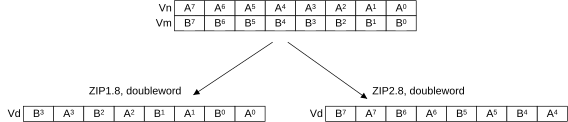

# ​C7.2.462 ZIP1

Source: <https://developer.arm.com/documentation/ddi0487/mc/-Part-C-The-AArch64-Instruction-Set/-Chapter-C7-A64-Advanced-SIMD-and-Floating-point-Instruction-Descriptions/-C7-2-Alphabetical-list-of-A64-Advanced-SIMD-and-floating-point-instructions/-C7-2-462-ZIP1>

##### C7.2.462 ZIP1

Zip vectors (primary)

This instruction reads adjacent vector elements from the lower half of two source SIMD&FP registers as pairs, interleaves the pairs and places them into a vector, and writes the vector to the destination SIMD&FP register. The first pair from the first source register is placed into the two lowest vector elements, with subsequent pairs taken alternately from each source register.

> #### Note
>
> This instruction can be used with `ZIP2` to interleave two vectors.

Figure C7-9 ZIP1 and ZIP2 with the arrangement specifier 8B



Depending on the settings in the [CPACR\_EL1](/documentation/ddi0487/mc/-Part-D-The-AArch64-System-Level-Architecture/-Chapter-D24-AArch64-System-Register-Descriptions/-D24-2-General-system-control-registers/-D24-2-35-CPACR-EL1--Architectural-Feature-Access-Control-Register?lang=en#reg_aarch64_cpacr_el1), [CPTR\_EL2](/documentation/ddi0487/mc/-Part-D-The-AArch64-System-Level-Architecture/-Chapter-D24-AArch64-System-Register-Descriptions/-D24-2-General-system-control-registers/-D24-2-37-CPTR-EL2--Architectural-Feature-Trap-Register--EL2-?lang=en#reg_aarch64_cptr_el2), and [CPTR\_EL3](/documentation/ddi0487/mc/-Part-D-The-AArch64-System-Level-Architecture/-Chapter-D24-AArch64-System-Register-Descriptions/-D24-2-General-system-control-registers/-D24-2-38-CPTR-EL3--Architectural-Feature-Trap-Register--EL3-?lang=en#reg_aarch64_cptr_el3) registers, and the current Security state and Exception level, an attempt to execute the instruction might be trapped.

###### Advanced SIMD

###### (FEAT\_AdvSIMD)


###### Encoding

```
ZIP1  <Vd>.<T>, <Vn>.<T>, <Vm>.<T>
```

###### Decode for this encoding

```
if !IsFeatureImplemented(FEAT_AdvSIMD) then EndOfDecode(Decode_UNDEF); end;
if size::Q == ‘110’ then EndOfDecode(Decode_UNDEF); end;
let d : integer{} = UInt(Rd);
let n : integer{} = UInt(Rn);
let m : integer{} = UInt(Rm);
let esize : integer{} = 8 << UInt(size);
let datasize : integer{} = 64 << UInt(Q);
let elements : integer = datasize DIV esize;
let part : integer = UInt(op);
let pairs : integer = elements DIV 2;
```

###### Assembler Symbols

<Vd>
:   ​

    Is the name of the SIMD&FP destination register, encoded in the “Rd” field.

<T>
:   ​

    Is an arrangement specifier, encoded in “size:Q”:

<table>
 <colgroup>
  <col/>
  <col/>
  <col/>
 </colgroup>
 <thead>
  <tr>
   <th>
    <strong>
     size
    </strong>
   </th>
   <th>
    <strong>
     Q
    </strong>
   </th>
   <th>
    <strong>
     &lt;T&gt;
    </strong>
   </th>
  </tr>
 </thead>
 <tbody>
  <tr>
   <td>
    <p>
     <code>
      00
     </code>
    </p>
   </td>
   <td>
    <p>
     <code>
      0
     </code>
    </p>
   </td>
   <td>
    <p>
     <code>
      8B
     </code>
    </p>
   </td>
  </tr>
  <tr>
   <td>
    <p>
     <code>
      00
     </code>
    </p>
   </td>
   <td>
    <p>
     <code>
      1
     </code>
    </p>
   </td>
   <td>
    <p>
     <code>
      16B
     </code>
    </p>
   </td>
  </tr>
  <tr>
   <td>
    <p>
     <code>
      01
     </code>
    </p>
   </td>
   <td>
    <p>
     <code>
      0
     </code>
    </p>
   </td>
   <td>
    <p>
     <code>
      4H
     </code>
    </p>
   </td>
  </tr>
  <tr>
   <td>
    <p>
     <code>
      01
     </code>
    </p>
   </td>
   <td>
    <p>
     <code>
      1
     </code>
    </p>
   </td>
   <td>
    <p>
     <code>
      8H
     </code>
    </p>
   </td>
  </tr>
  <tr>
   <td>
    <p>
     <code>
      10
     </code>
    </p>
   </td>
   <td>
    <p>
     <code>
      0
     </code>
    </p>
   </td>
   <td>
    <p>
     <code>
      2S
     </code>
    </p>
   </td>
  </tr>
  <tr>
   <td>
    <p>
     <code>
      10
     </code>
    </p>
   </td>
   <td>
    <p>
     <code>
      1
     </code>
    </p>
   </td>
   <td>
    <p>
     <code>
      4S
     </code>
    </p>
   </td>
  </tr>
  <tr>
   <td>
    <p>
     <code>
      11
     </code>
    </p>
   </td>
   <td>
    <p>
     <code>
      0
     </code>
    </p>
   </td>
   <td>
    <p>
     <code>
      RESERVED
     </code>
    </p>
   </td>
  </tr>
  <tr>
   <td>
    <p>
     <code>
      11
     </code>
    </p>
   </td>
   <td>
    <p>
     <code>
      1
     </code>
    </p>
   </td>
   <td>
    <p>
     <code>
      2D
     </code>
    </p>
   </td>
  </tr>
 </tbody>
</table>

<Vn>
:   ​

    Is the name of the first SIMD&FP source register, encoded in the “Rn” field.

<Vm>
:   ​

    Is the name of the second SIMD&FP source register, encoded in the “Rm” field.

###### Operation

```
AArch64_CheckFPAdvSIMDEnabled();
let operand1 : bits(datasize) = V{}(n);
let operand2 : bits(datasize) = V{}(m);
var result : bits(datasize);
let base : integer = part * pairs;
for p = 0 to pairs-1 do
    result[(2*p+0)*:esize] = operand1[(base+p)*:esize];
    result[(2*p+1)*:esize] = operand2[(base+p)*:esize];
end;
V{datasize}(d) = result;
```

###### Operational Information

This instruction is a data-independent-time instruction as described in [About PSTATE.DIT](/documentation/ddi0487/mc/-Part-B-The-AArch64-Application-Level-Architecture/-Chapter-B1-The-AArch64-Application-Level-Programmers--Model/-B1-5-Software-control-features-and-EL0/-B1-5-6-About-PSTATE-DIT?lang=en#beiccddab3).
