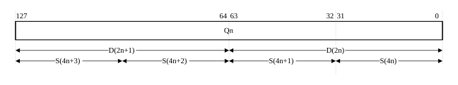
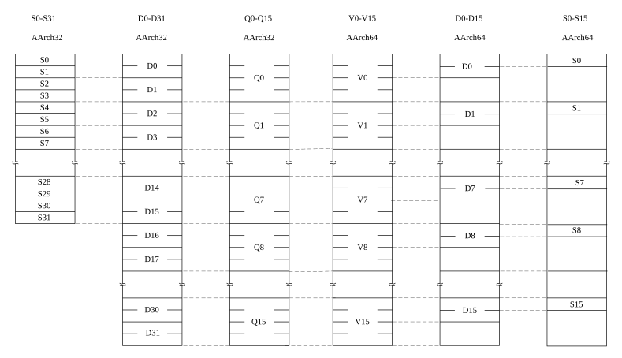

# ​D1.10.1 Register mappings between AArch32 state and AArch64 state

Source: <https://developer.arm.com/documentation/ddi0487/mc/-Part-D-The-AArch64-System-Level-Architecture/-Chapter-D1-The-AArch64-System-Level-Programmers--Model/-D1-10-Interprocessing/-D1-10-1-Register-mappings-between-AArch32-state-and-AArch64-state>

##### D1.10.1 Register mappings between AArch32 state and AArch64 state

I XVDJR
:   Register mappings between AArch32 state and AArch64 state describe the following:

    - For exceptions taken from AArch32 state to AArch64 state, where the AArch32 register content is found.
    - For exception returns from AArch64 state to AArch32 state, how the AArch32 register content is derived.

R PCCLL
:   The AArch32 state register contents occupy the bottom 32 bits of the AArch64 state registers.

R CTBNQ
:   If in AArch32 state, the upper 32 bits of AArch64 state registers are inaccessible and are ignored.

R GMLYF
:   For bits[63:32] of AArch64 registers that are not mapped to AArch32 registers, the unmapped bits are unchanged by AArch32 state execution.

###### D1.10.1.1 Mapping of the general-purpose registers between the Execution states

I PYKVS
:   The following table shows the mappings of general-purpose registers between Execution states:

<table>
 <colgroup>
  <col/>
  <col/>
 </colgroup>
 <thead>
  <tr>
   <th>
    
     AArch32 register
    
   </th>
   <th>
    
     AArch64 register
    
   </th>
  </tr>
 </thead>
 <tbody>
  <tr>
   <td>
    R0
   </td>
   <td>
    X0
   </td>
  </tr>
  <tr>
   <td>
    R1
   </td>
   <td>
    X1
   </td>
  </tr>
  <tr>
   <td>
    R2
   </td>
   <td>
    X2
   </td>
  </tr>
  <tr>
   <td>
    R3
   </td>
   <td>
    X3
   </td>
  </tr>
  <tr>
   <td>
    R4
   </td>
   <td>
    X4
   </td>
  </tr>
  <tr>
   <td>
    R5
   </td>
   <td>
    X5
   </td>
  </tr>
  <tr>
   <td>
    R6
   </td>
   <td>
    X6
   </td>
  </tr>
  <tr>
   <td>
    R7
   </td>
   <td>
    X7
   </td>
  </tr>
  <tr>
   <td>
    R8_usr
   </td>
   <td>
    X8
   </td>
  </tr>
  <tr>
   <td>
    R9_usr
   </td>
   <td>
    X9
   </td>
  </tr>
  <tr>
   <td>
    R10_usr
   </td>
   <td>
    X10
   </td>
  </tr>
  <tr>
   <td>
    R11_usr
   </td>
   <td>
    X11
   </td>
  </tr>
  <tr>
   <td>
    R12_usr
   </td>
   <td>
    X12
   </td>
  </tr>
  <tr>
   <td>
    SP_usr
   </td>
   <td>
    X13
   </td>
  </tr>
  <tr>
   <td>
    LR_usr
   </td>
   <td>
    X14
   </td>
  </tr>
  <tr>
   <td>
    SP_hyp
   </td>
   <td>
    X15
   </td>
  </tr>
  <tr>
   <td>
    LR_irq
   </td>
   <td>
    X16
   </td>
  </tr>
  <tr>
   <td>
    SP_irq
   </td>
   <td>
    X17
   </td>
  </tr>
  <tr>
   <td>
    LR_svc
   </td>
   <td>
    X18
   </td>
  </tr>
  <tr>
   <td>
    SP_svc
   </td>
   <td>
    X19
   </td>
  </tr>
  <tr>
   <td>
    LR_abt
   </td>
   <td>
    X20
   </td>
  </tr>
  <tr>
   <td>
    SP_abt
   </td>
   <td>
    X21
   </td>
  </tr>
  <tr>
   <td>
    LR_und
   </td>
   <td>
    X22
   </td>
  </tr>
  <tr>
   <td>
    SP_und
   </td>
   <td>
    X23
   </td>
  </tr>
  <tr>
   <td>
    R8_fiq
   </td>
   <td>
    X24
   </td>
  </tr>
  <tr>
   <td>
    R9_fiq
   </td>
   <td>
    X25
   </td>
  </tr>
  <tr>
   <td>
    R10_fiq
   </td>
   <td>
    X26
   </td>
  </tr>
  <tr>
   <td>
    R11_fiq
   </td>
   <td>
    X27
   </td>
  </tr>
  <tr>
   <td>
    R12_fiq
   </td>
   <td>
    X28
   </td>
  </tr>
  <tr>
   <td>
    SP_fiq
   </td>
   <td>
    X29
   </td>
  </tr>
  <tr>
   <td>
    LR_fiq
   </td>
   <td>
    X30
   </td>
  </tr>
 </tbody>
</table>

I JCWRB
:   For some exceptions, the exception syndrome given in the [ESR\_ELx](/documentation/ddi0487/mc/-Part-K-Appendixes/-Appendix-K14-Registers-Index/-K14-1-Introduction-and-register-disambiguation/-K14-1-2-Register-name-disambiguation-by-Exception-level?lang=en#esr_elx) identifies one or more register numbers from the issued instruction that generated the exception. If one of these exceptions is taken from an Exception level using AArch32, the register numbers give the AArch64 view of the register.

I VSFBC
:   For example, if an exception is taken from AArch32 Abort mode and the faulting instruction specified R14, the [ESR\_ELx](/documentation/ddi0487/mc/-Part-K-Appendixes/-Appendix-K14-Registers-Index/-K14-1-Introduction-and-register-disambiguation/-K14-1-2-Register-name-disambiguation-by-Exception-level?lang=en#esr_elx).ISS field would report this using the EC value `0b10100`, because register X20 provides the AArch64 view of LR\_abt, which is the copy of R14 used in Abort mode.

###### D1.10.1.2 Mapping of the SIMD and floating-point registers between the Execution states

I DPNRF
:   The following table shows the mappings of SIMD and floating-point registers between the Execution states:

<table>
 <colgroup>
  <col/>
  <col/>
 </colgroup>
 <thead>
  <tr>
   <th>
    AArch64 register
   </th>
   <th>
    AArch32 register
   </th>
  </tr>
 </thead>
 <tbody>
  <tr>
   <td>
    V0
   </td>
   <td>
    Q0
   </td>
  </tr>
  <tr>
   <td>
    V1
   </td>
   <td>
    Q1
   </td>
  </tr>
  <tr>
   <td>
    V2
   </td>
   <td>
    Q2
   </td>
  </tr>
  <tr>
   <td>
    .
   </td>
   <td>
    .
   </td>
  </tr>
  <tr>
   <td>
    .
   </td>
   <td>
    .
   </td>
  </tr>
  <tr>
   <td>
    .
   </td>
   <td>
    .
   </td>
  </tr>
  <tr>
   <td>
    V15
   </td>
   <td>
    Q15
   </td>
  </tr>
 </tbody>
</table>

R TJJVC
:   The AArch64 state registers V16-V31 are not accessible from AArch32 state.

I VTZXL
:   The mapping between the V, D, and S registers in AArch64 state is not the same as the mapping between the Q, D, and S registers in AArch32 state.

R VSTPQ
:   In AArch64 state, there are:

    - 32 128-bit V registers, V0-V31.
    - 32 64-bit D registers, D0-D31.
    - 32 32-bit S registers, S0-S31.

R WJGSQ
:   A smaller register occupies the least significant bytes of the corresponding larger register.

I FFHKC
:   The following graphic shows the mapping of V, D, and S registers in AArch64 state:

    

R DHVZF
:   In AArch32 state, there are:

    - 16 128-bit Q registers, Q0-Q15.
    - 32 64-bit D registers, D0-D31.
    - 32 32-bit S registers, S0-S31.

R BPYPZ
:   Smaller registers are packed into larger registers.

I YHYWN
:   The following graphic shows the mapping of Q, D and S registers in AArch32 state:

    

R GXGJK
:   In AArch32 state:

    - There are no S registers that correspond to Q8-Q15.
    - D16-D31 pack into Q8-Q15.

I MKXYB
:   If software executing in AArch64 state interprets D or S registers from AArch32 state, the software must unpack the D or S registers from the V registers before it uses them. For example, the following diagram shows the mapping of the AArch32 S0-S31 registers through the AArch32 D and Q registers into the AArch64 V, D and S registers:

    

###### D1.10.1.3 Mapping of the System registers between the Execution states

I MPMNZ
:   For a full list of mappings of writable AArch64 System registers to the AArch32 System registers, see [Table K14-5](/documentation/ddi0487/mc/-Part-K-Appendixes/-Appendix-K14-Registers-Index/-K14-1-Introduction-and-register-disambiguation/-K14-1-1-Register-name-disambiguation-by-Execution-state?lang=en#tbl_beigbcjb).

R BQSMK
:   The relationship between the AArch64 System registers and the AArch32 System registers is architecturally defined.

R LPDQL
:   Modifications made to AArch32 System registers affect only the parts of the AArch64 state registers that are mapped to the AArch32 System registers.

I HTCVH
:   Supervisory code, such as a hypervisor, executing in AArch64 state, can save, restore, and interpret the System registers belonging to a lower Exception level that is using AArch32.

I LYHXS
:   In some cases, two AArch32 System registers are packed into a single AArch64 System register.

R QXNZN
:   If EL3 is implemented and is using AArch32, some System registers are banked between Secure and Non-secure states. In this type of banking, there is an instance of the register in Secure state and another instance of the register in Non-secure state.

R TVZJS
:   If any of the following are true, banking between Secure and Non-secure states is not supported:

    - EL3 is not implemented.
    - EL3 is implemented and is using AArch64.

I JRZXQ
:   If EL3 is implemented and is using AArch64, the same, non-banked, registers are accessed in the following state:

    - Secure EL1 with EL1 using AArch32.
    - Non-secure EL1 with EL1 using AArch32.

I HSRHJ
:   If EL3 is implemented and is using AArch64, it is not possible to architecturally determine whether an AArch64 register is mapped onto the Secure or the Non-secure instance of corresponding AArch32 register.

R MCZCY
:   If EL3 is implemented and is using AArch64, the interrupt asserted by the AArch64 CNTP\_\* timer is the same interrupt that is asserted by the Non-secure AArch32 CNTP\_\* timer when EL3 is using AArch32.

I JSZYM
:   Although not required, Arm expects that implementations map many of the AArch64 registers for use by EL3 to the Secure instances of the banked AArch32 registers, and map many of the AArch64 registers for use by EL1 to the Non-secure instances of the banked AArch32 registers. However, if EL2 and EL3 are implemented and both support use of AArch32, this mapping is not possible for the following registers:

    - IFAR - This is because when EL3 is using AArch32, HIFAR is an alias of the Secure IFAR.
    - DFAR - This is because when EL3 is using AArch32, HDFAR is an alias of the Secure DFAR.

I BYYWR
:   There are some AArch32 System registers that are only used in AArch32 state and do not have an equivalent AArch64 System register. However, there are AArch64 registers that can access, from a higher Exception level, the AArch32 registers that do not have an AArch64 state equivalent.

I VGXRB
:   For a full list of AArch64 registers that access AArch32 System registers with no AArch64 equivalent, see [Table K14-6](/documentation/ddi0487/mc/-Part-K-Appendixes/-Appendix-K14-Registers-Index/-K14-1-Introduction-and-register-disambiguation/-K14-1-1-Register-name-disambiguation-by-Execution-state?lang=en#tbl_beiehefe).

I WRKYQ
:   For a full list AArch64 registers that allow access to the AArch32 ID registers from AArch64 state, see [Table K14-7](/documentation/ddi0487/mc/-Part-K-Appendixes/-Appendix-K14-Registers-Index/-K14-1-Introduction-and-register-disambiguation/-K14-1-1-Register-name-disambiguation-by-Execution-state?lang=en#tbl_beibejha).

###### D1.10.1.4 State of the general-purpose registers on taking an exception to AArch64 state

**D1.10.1.4.1 If the general-purpose register was accessible from AArch32 state**

R WWJWP
:   When an exception is taken from AArch32 state to AArch64 state and the general- purpose register was accessible from AArch32 state, the upper 32 bits have one of the following IMPLEMENTATION DEFINED values and might vary dynamically within an implementation:

    - The upper 32 bits retain the value that the same architectural register held before any AArch32 execution.
    - The upper 32 bits are set to zero.

    The IMPLEMENTATION DEFINED behavior applies regardless of whether any execution occurred at the Exception level that was using AArch32.

I TKQYW
:   For example, the IMPLEMENTATION DEFINED behavior described in [RWWJWP](/documentation/ddi0487/mc/-Part-D-The-AArch64-System-Level-Architecture/-Chapter-D1-The-AArch64-System-Level-Programmers--Model/-D1-10-Interprocessing/-D1-10-1-Register-mappings-between-AArch32-state-and-AArch64-state?lang=en#wwjwp) applies even if AArch32 state was entered by an exception return from AArch64 state, and another exception was immediately taken to AArch64 state without any instruction execution in AArch32 state.

I QFBYM
:   When an exception is taken from AArch32 state to AArch64 state, software must regard the value of the upper 32 bits as a CONSTRAINED UNPREDICTABLE choice between the two values described in [RWWJWP](/documentation/ddi0487/mc/-Part-D-The-AArch64-System-Level-Architecture/-Chapter-D1-The-AArch64-System-Level-Programmers--Model/-D1-10-Interprocessing/-D1-10-1-Register-mappings-between-AArch32-state-and-AArch64-state?lang=en#wwjwp).

**D1.10.1.4.2 If the general-purpose register was not accessible from AArch32 state**

R RHRQX
:   If all of the following apply, when an exception is taken from AArch32 state to AArch64 state, the X15 register is treated as if it is accessible and therefore the upper 32 bits of X15 might either be set to zero or retain their previous value:

    - The target Exception level is EL3.
    - EL2 is not implemented or EL1 is in Secure state.
    - [SCR\_EL3](/documentation/ddi0487/mc/-Part-D-The-AArch64-System-Level-Architecture/-Chapter-D24-AArch64-System-Register-Descriptions/-D24-2-General-system-control-registers/-D24-2-168-SCR-EL3--Secure-Configuration-Register?lang=en#reg_aarch64_scr_el3).RW is 0.

    Otherwise, when an exception is taken from AArch32 state to AArch64 state, for a general-purpose register that was not accessible from AArch32 state, the register retains the value it had before any AArch32 execution.

**D1.10.1.4.3 Determining the upper 32 bits of AArch64 registers on taking an exception from AArch32 state**

R ZJBSH
:   Whether a general-purpose register has its upper 32 bits set to zero or retained on taking an exception from AArch32 to AArch64 is affected by all of the following:

    - The AArch64 state target Exception level.
    - The values of both:

      - [SCR\_EL3](/documentation/ddi0487/mc/-Part-D-The-AArch64-System-Level-Architecture/-Chapter-D24-AArch64-System-Register-Descriptions/-D24-2-General-system-control-registers/-D24-2-168-SCR-EL3--Secure-Configuration-Register?lang=en#reg_aarch64_scr_el3).RW.
      - [HCR\_EL2](/documentation/ddi0487/mc/-Part-D-The-AArch64-System-Level-Architecture/-Chapter-D24-AArch64-System-Register-Descriptions/-D24-2-General-system-control-registers/-D24-2-61-HCR-EL2--Hypervisor-Configuration-Register?lang=en#reg_aarch64_hcr_el2).RW or HCR.RW, where HCR.RW is a notional bit that is RES 0.

R DGVGF
:   The following table shows which general-purpose registers can have their upper 32 bits set to zero on taking an exception from AArch32 state to AArch64 state. In this table, a dash (-) indicates that the RW values are not valid for the targeted Exception level.

<table>
 <colgroup>
  <col/>
  <col/>
  <col/>
  <col/>
  <col/>
 </colgroup>
 <thead>
  <tr>
   <th rowspan="2">
    SCR_EL3.RW
   </th>
   <th>
    HCR_EL2.RW or HCR.RW
   </th>
   <th colspan="3">
    Registers when the target Exception level is:
   </th>
  </tr>
  <tr>
   <th>
   </th>
   <th>
    EL3
   </th>
   <th>
    EL2
   </th>
   <th>
    EL1
   </th>
  </tr>
 </thead>
 <tbody>
  <tr>
   <td>
    0
   </td>
   <td>
    0
   </td>
   <td>
    X0-X30
   </td>
   <td>
    -
   </td>
   <td>
    -
   </td>
  </tr>
  <tr>
   <td>
    0
   </td>
   <td>
    1
   </td>
   <td colspan="3">
    Not valid because the RW bit values would imply that EL2 is AArch32 and EL1 is AArch64.
   </td>
  </tr>
  <tr>
   <td>
    1
   </td>
   <td>
    0
   </td>
   <td>
    X0-X14, X16-X30
   </td>
   <td>
    X0-X14, X16-X30
   </td>
   <td>
    -
   </td>
  </tr>
  <tr>
   <td>
    1
   </td>
   <td>
    1
   </td>
   <td>
    X0-X14
   </td>
   <td>
    X0-X14
   </td>
   <td>
    X0-X14
   </td>
  </tr>
 </tbody>
</table>

R WKWVT
:   If EL2 is not implemented, or the [SCR\_EL3](/documentation/ddi0487/mc/-Part-D-The-AArch64-System-Level-Architecture/-Chapter-D24-AArch64-System-Register-Descriptions/-D24-2-General-system-control-registers/-D24-2-168-SCR-EL3--Secure-Configuration-Register?lang=en#reg_aarch64_scr_el3).NS or SCR.NS bits prevent its use, the registers that can have their upper 32 bits set to zero on taking an exception from AArch32 state to AArch64 state are the same as when [HCR\_EL2](/documentation/ddi0487/mc/-Part-D-The-AArch64-System-Level-Architecture/-Chapter-D24-AArch64-System-Register-Descriptions/-D24-2-General-system-control-registers/-D24-2-61-HCR-EL2--Hypervisor-Configuration-Register?lang=en#reg_aarch64_hcr_el2).RW has the same value as [SCR\_EL3](/documentation/ddi0487/mc/-Part-D-The-AArch64-System-Level-Architecture/-Chapter-D24-AArch64-System-Register-Descriptions/-D24-2-General-system-control-registers/-D24-2-168-SCR-EL3--Secure-Configuration-Register?lang=en#reg_aarch64_scr_el3).RW.

R WPVQR
:   The following table shows which general-purpose registers can retain their upper 32 bits on taking an exception from AArch32 state to AArch64 state. In this table, a dash (-) indicates that the RW values are not valid for the target Exception level.

<table>
 <colgroup>
  <col/>
  <col/>
  <col/>
  <col/>
  <col/>
 </colgroup>
 <thead>
  <tr>
   <th rowspan="2">
    SCR_EL3.RW
   </th>
   <th>
    HCR_EL2.RW or HCR.RW
   </th>
   <th colspan="3">
    Registers when the target Exception level is:
   </th>
  </tr>
  <tr>
   <th>
   </th>
   <th>
    EL3
   </th>
   <th>
    EL2
   </th>
   <th>
    EL1
   </th>
  </tr>
 </thead>
 <tbody>
  <tr>
   <td>
    0
   </td>
   <td>
    0
   </td>
   <td>
    None
   </td>
   <td>
    -
   </td>
   <td>
    -
   </td>
  </tr>
  <tr>
   <td>
    0
   </td>
   <td>
    1
   </td>
   <td colspan="3">
    Not valid because the RW bit values would imply that EL2 is AArch32 and EL1 is AArch64.
   </td>
  </tr>
  <tr>
   <td>
    1
   </td>
   <td>
    0
   </td>
   <td>
    X15
   </td>
   <td>
    X15
   </td>
   <td>
    -
   </td>
  </tr>
  <tr>
   <td>
    1
   </td>
   <td>
    1
   </td>
   <td>
    X15-X30
   </td>
   <td>
    X15-X30
   </td>
   <td>
    X15-X30
   </td>
  </tr>
 </tbody>
</table>

R LGSLY
:   If EL2 is not implemented, or [SCR\_EL3](/documentation/ddi0487/mc/-Part-D-The-AArch64-System-Level-Architecture/-Chapter-D24-AArch64-System-Register-Descriptions/-D24-2-General-system-control-registers/-D24-2-168-SCR-EL3--Secure-Configuration-Register?lang=en#reg_aarch64_scr_el3).NS prevents its use, the registers that can have their upper 32 bits retained on taking an exception to AArch64 state from AArch32 state are the same as when [HCR\_EL2](/documentation/ddi0487/mc/-Part-D-The-AArch64-System-Level-Architecture/-Chapter-D24-AArch64-System-Register-Descriptions/-D24-2-General-system-control-registers/-D24-2-61-HCR-EL2--Hypervisor-Configuration-Register?lang=en#reg_aarch64_hcr_el2).RW has the same value as [SCR\_EL3](/documentation/ddi0487/mc/-Part-D-The-AArch64-System-Level-Architecture/-Chapter-D24-AArch64-System-Register-Descriptions/-D24-2-General-system-control-registers/-D24-2-168-SCR-EL3--Secure-Configuration-Register?lang=en#reg_aarch64_scr_el3).RW.

###### D1.10.1.5 SPSR, ELR, and AArch64 SP relationships on changing Execution state

I PSRRS
:   The following table shows SPSR and ELR registers that are architecturally mapped between AArch32 state and AArch64 state:

<table>
 <colgroup>
  <col/>
  <col/>
 </colgroup>
 <thead>
  <tr>
   <th>
    AArch32 register
   </th>
   <th>
    AArch64 register
   </th>
  </tr>
 </thead>
 <tbody>
  <tr>
   <td>
    SPSR_svc
   </td>
   <td>
    <a class="document-topic" document-topic-path="/ddi0487/mc/-Part-C-The-AArch64-Instruction-Set/-Chapter-C5-The-A64-System-Instruction-Class/-C5-2-Special-purpose-registers/-C5-2-21-SPSR-EL1--Saved-Program-Status-Register--EL1-?lang=en#reg_aarch64_spsr_el1" href="/documentation/ddi0487/mc/-Part-C-The-AArch64-Instruction-Set/-Chapter-C5-The-A64-System-Instruction-Class/-C5-2-Special-purpose-registers/-C5-2-21-SPSR-EL1--Saved-Program-Status-Register--EL1-?lang=en#reg_aarch64_spsr_el1">
     SPSR_EL1
    </a>
   </td>
  </tr>
  <tr>
   <td>
    SPSR_hyp
   </td>
   <td>
    <a class="document-topic" document-topic-path="/ddi0487/mc/-Part-C-The-AArch64-Instruction-Set/-Chapter-C5-The-A64-System-Instruction-Class/-C5-2-Special-purpose-registers/-C5-2-22-SPSR-EL2--Saved-Program-Status-Register--EL2-?lang=en#reg_aarch64_spsr_el2" href="/documentation/ddi0487/mc/-Part-C-The-AArch64-Instruction-Set/-Chapter-C5-The-A64-System-Instruction-Class/-C5-2-Special-purpose-registers/-C5-2-22-SPSR-EL2--Saved-Program-Status-Register--EL2-?lang=en#reg_aarch64_spsr_el2">
     SPSR_EL2
    </a>
   </td>
  </tr>
  <tr>
   <td>
    ELR_hyp
   </td>
   <td>
    <a class="document-topic" document-topic-path="/ddi0487/mc/-Part-C-The-AArch64-Instruction-Set/-Chapter-C5-The-A64-System-Instruction-Class/-C5-2-Special-purpose-registers/-C5-2-6-ELR-EL2--Exception-Link-Register--EL2-?lang=en#reg_aarch64_elr_el2" href="/documentation/ddi0487/mc/-Part-C-The-AArch64-Instruction-Set/-Chapter-C5-The-A64-System-Instruction-Class/-C5-2-Special-purpose-registers/-C5-2-6-ELR-EL2--Exception-Link-Register--EL2-?lang=en#reg_aarch64_elr_el2">
     ELR_EL2
    </a>
   </td>
  </tr>
 </tbody>
</table>

R CHHXX
:   When an exception is taken from an Exception level using AArch32 to EL3 using AArch64 and EL2 has been using AArch32 state, the upper 32 bits of ELR\_EL2 have one of the following IMPLEMENTATION DEFINED values:

    - The upper 32 bits retain the value that the same architectural register held before any AArch32 execution.
    - The upper 32 bits are set to zero.

R WFDMR
:   The following AArch32 registers are used only during execution in AArch32 state. However, they retain their state if there is execution at EL1 and EL1 is using AArch64 state.

    - SPSR\_abt.
    - SPSR\_und.
    - SPSR\_irq.
    - SPSR\_fiq.

I TBFWN
:   For the purposes of context switching, the registers in [RWFDMR](/documentation/ddi0487/mc/-Part-D-The-AArch64-System-Level-Architecture/-Chapter-D1-The-AArch64-System-Level-Programmers--Model/-D1-10-Interprocessing/-D1-10-1-Register-mappings-between-AArch32-state-and-AArch64-state?lang=en#wfdmr) are accessible during execution in AArch64 state at Exception levels higher than EL1.

I WRPZP
:   If EL1 does not support execution in AArch32 state, the registers in [RWFDMR](/documentation/ddi0487/mc/-Part-D-The-AArch64-System-Level-Architecture/-Chapter-D1-The-AArch64-System-Level-Programmers--Model/-D1-10-Interprocessing/-D1-10-1-Register-mappings-between-AArch32-state-and-AArch64-state?lang=en#wfdmr) are RES0.

R MBVJZ
:   If an exception is taken from an Exception level using AArch32 to an Exception level using AArch64, the AArch64 stack pointers and Exception Link Registers associated with an Exception level that are not accessible during AArch32 execution at the Exception level from which the exception was taken, retain the state that they had before AArch32 execution. This applies to the following registers:

    - [SP\_EL0](/documentation/ddi0487/mc/-Part-C-The-AArch64-Instruction-Set/-Chapter-C5-The-A64-System-Instruction-Class/-C5-2-Special-purpose-registers/-C5-2-15-SP-EL0--Stack-Pointer--EL0-?lang=en#reg_aarch64_sp_el0).
    - [SP\_EL1](/documentation/ddi0487/mc/-Part-C-The-AArch64-Instruction-Set/-Chapter-C5-The-A64-System-Instruction-Class/-C5-2-Special-purpose-registers/-C5-2-16-SP-EL1--Stack-Pointer--EL1-?lang=en#reg_aarch64_sp_el1).
    - [SP\_EL2](/documentation/ddi0487/mc/-Part-C-The-AArch64-Instruction-Set/-Chapter-C5-The-A64-System-Instruction-Class/-C5-2-Special-purpose-registers/-C5-2-17-SP-EL2--Stack-Pointer--EL2-?lang=en#reg_aarch64_sp_el2).
    - [ELR\_EL1](/documentation/ddi0487/mc/-Part-C-The-AArch64-Instruction-Set/-Chapter-C5-The-A64-System-Instruction-Class/-C5-2-Special-purpose-registers/-C5-2-5-ELR-EL1--Exception-Link-Register--EL1-?lang=en#reg_aarch64_elr_el1).

###### D1.10.1.6 PSTATE.SM and PSTATE.ZA behaviors on changing Execution state

R SWQGH
:   The values of PSTATE.{SM, ZA} do not change when any of the following occurs:

    - An exception return from AArch64 to AArch32 Execution state.
    - An exception taken from AArch32 to AArch64 Execution state.

R GXKNK
:   In AArch32 state, the Effective value of PSTATE.SM is 0.

I MWQNV
:   When PSTATE.SM is 1, a change in Execution state from AArch64 to AArch32, or from AArch32 to AArch64, causes all implemented bits of the SVE registers (including SIMD&FP registers) and the FPSR to be reset to a fixed value.

I WYKRM
:   The value of PSTATE.ZA does not change in AArch32 Execution state. Therefore, a transition between AArch64 and AArch32 Execution state when PSTATE.ZA is 1 has no effect on the contents of ZA storage, or the ZT0 register when [FEAT\_SME2](/documentation/ddi0487/mc/-Part-A-Arm-Architecture-Introduction-and-Overview/-Chapter-A2-A-profile-Architecture-Extensions/-A2-3-Armv9-A-architecture-extensions/-A2-3-4-The-Armv9-3-architecture-extension?lang=en#feat_feat_sme2) is implemented.
