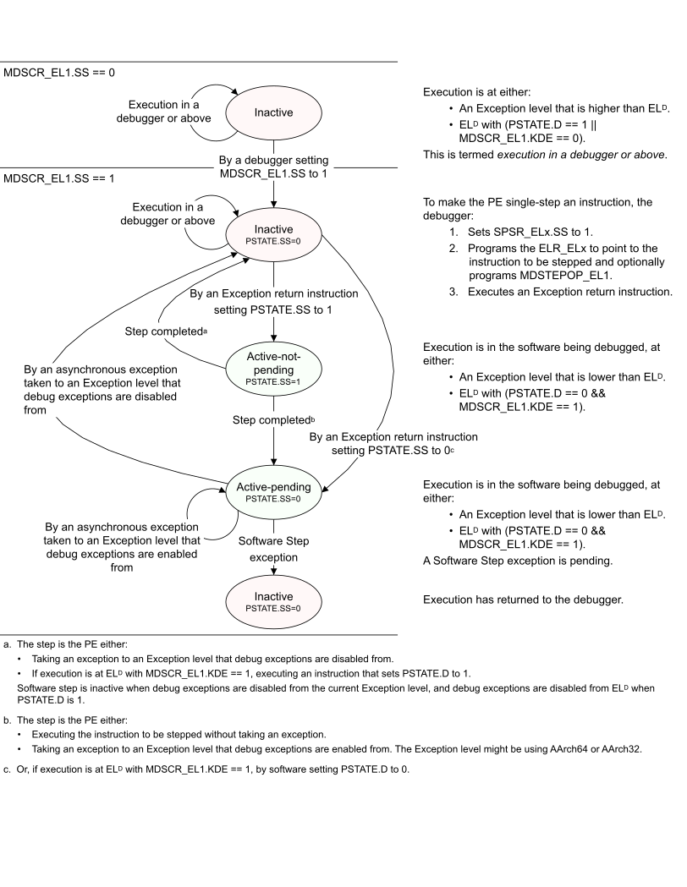

# ​D2.11.3 The software step state machine

Source: <https://developer.arm.com/documentation/ddi0487/mc/-Part-D-The-AArch64-System-Level-Architecture/-Chapter-D2-AArch64-Self-hosted-Debug/-D2-11-Software-Step-exceptions/-D2-11-3-The-software-step-state-machine>

##### D2.11.3 The software step state machine

In [Figure D2-3](/documentation/ddi0487/mc/-Part-D-The-AArch64-System-Level-Architecture/-Chapter-D2-AArch64-Self-hosted-Debug/-D2-11-Software-Step-exceptions/-D2-11-3-The-software-step-state-machine?lang=en#fig_bcgfiebg):

- The OS Lock is unlocked and [`DoubleLockStatus`](/documentation/ddi0487/mc/-Part-J-Architectural-Pseudocode/-Chapter-J1-A-profile-Architecture-Pseudocode/-J1-4-Shared-pseudocode/-J1-4-5-DoubleLockStatus?lang=en#asl_func_doublelockstatus_0)`()` == FALSE.
- The PE is not in Secure state with [MDCR\_EL3](/documentation/ddi0487/mc/-Part-D-The-AArch64-System-Level-Architecture/-Chapter-D24-AArch64-System-Register-Descriptions/-D24-3-Debug-System-registers/-D24-3-18-MDCR-EL3--Monitor-Debug-Configuration-Register--EL3-?lang=en#reg_aarch64_mdcr_el3).SDD set to 1.

Figure D2-3 Software step state machine

For a description of when debug exceptions are enabled or disabled from an Exception level, see [Enabling debug exceptions from the current Exception level and Security state](/documentation/ddi0487/mc/-Part-D-The-AArch64-System-Level-Architecture/-Chapter-D2-AArch64-Self-hosted-Debug/-D2-3-The-debug-exception-enable-controls/-D2-3-1-Enabling-debug-exceptions-from-the-current-Exception-level-and-Security-state?lang=en#d2beiecibb).

For more information about how a step is completed, see [Behavior in the active-not-pending state](/documentation/ddi0487/mc/-Part-D-The-AArch64-System-Level-Architecture/-Chapter-D2-AArch64-Self-hosted-Debug/-D2-11-Software-Step-exceptions/-D2-11-5-Behavior-in-the-active-not-pending-state?lang=en#cjaeafjc).

The software step states are:

Inactive
:   Software step is inactive. It cannot generate any Software Step exceptions or affect PE execution. Software step is inactive whenever any of the following are true:

    - [MDSCR\_EL1](/documentation/ddi0487/mc/-Part-D-The-AArch64-System-Level-Architecture/-Chapter-D24-AArch64-System-Register-Descriptions/-D24-3-Debug-System-registers/-D24-3-20-MDSCR-EL1--Monitor-Debug-System-Control-Register?lang=en#reg_aarch64_mdscr_el1).SS is 0.
    - ELD is using AArch32.
    - Debug exceptions are disabled from the current Exception level or Security state.

Active-not-pending
:   None of the conditions mentioned in [Inactive](/documentation/ddi0487/mc/-Part-D-The-AArch64-System-Level-Architecture/-Chapter-D2-AArch64-Self-hosted-Debug/-D2-11-Software-Step-exceptions/-D2-11-3-The-software-step-state-machine?lang=en#cjaeheca) are true, therefore software step is active.

    The instruction to be stepped is usually the instruction in memory at the address specified by the PC. However, when [FEAT\_STEP2](/documentation/ddi0487/mc/-Part-A-Arm-Architecture-Introduction-and-Overview/-Chapter-A2-A-profile-Architecture-Extensions/-A2-3-Armv9-A-architecture-extensions/-A2-3-6-The-Armv9-5-architecture-extension?lang=en#feat_feat_step2) is implemented, the instruction to be stepped might be specified in [MDSTEPOP\_EL1](/documentation/ddi0487/mc/-Part-D-The-AArch64-System-Level-Architecture/-Chapter-D24-AArch64-System-Register-Descriptions/-D24-3-Debug-System-registers/-D24-3-22-MDSTEPOP-EL1--Monitor-Debug-Step-Opcode-Register?lang=en#reg_aarch64_mdstepop_el1).

Active-pending
:   None of the conditions mentioned in [Inactive](/documentation/ddi0487/mc/-Part-D-The-AArch64-System-Level-Architecture/-Chapter-D2-AArch64-Self-hosted-Debug/-D2-11-Software-Step-exceptions/-D2-11-3-The-software-step-state-machine?lang=en#cjaeheca) are true, therefore software step is active.

    A Software Step exception is pending on the current instruction.

Whenever software step is active, whether the state machine is in the active-not-pending state or the active-pending state depends on [PSTATE](/documentation/ddi0487/mc/-Part-D-The-AArch64-System-Level-Architecture/-Chapter-D1-The-AArch64-System-Level-Programmers--Model/-D1-5-Process-state--PSTATE?lang=en#pstate).SS. [Table D2-17](/documentation/ddi0487/mc/-Part-D-The-AArch64-System-Level-Architecture/-Chapter-D2-AArch64-Self-hosted-Debug/-D2-11-Software-Step-exceptions/-D2-11-3-The-software-step-state-machine?lang=en#tbl_bcgeidaa) shows this.

<table id="tbl_bcgeidaa">
 <caption>
  Table D2-17 State machine states
 </caption>
 <colgroup>
  <col/>
  <col/>
  <col/>
  <col/>
  <col/>
 </colgroup>
 <thead>
  <tr>
   <th>
    EL
    
     D
    
    using:
   </th>
   <th>
    Debug exception enable status in the current Exception level and Security state
   </th>
   <th>
    <a class="document-topic" document-topic-path="/ddi0487/mc/-Part-D-The-AArch64-System-Level-Architecture/-Chapter-D24-AArch64-System-Register-Descriptions/-D24-3-Debug-System-registers/-D24-3-20-MDSCR-EL1--Monitor-Debug-System-Control-Register?lang=en#reg_aarch64_mdscr_el1" href="/documentation/ddi0487/mc/-Part-D-The-AArch64-System-Level-Architecture/-Chapter-D24-AArch64-System-Register-Descriptions/-D24-3-Debug-System-registers/-D24-3-20-MDSCR-EL1--Monitor-Debug-System-Control-Register?lang=en#reg_aarch64_mdscr_el1">
     MDSCR_EL1
    </a>
    .SS
   </th>
   <th>
    <a class="document-topic" document-topic-path="/ddi0487/mc/-Part-D-The-AArch64-System-Level-Architecture/-Chapter-D1-The-AArch64-System-Level-Programmers--Model/-D1-5-Process-state--PSTATE?lang=en#pstate" href="/documentation/ddi0487/mc/-Part-D-The-AArch64-System-Level-Architecture/-Chapter-D1-The-AArch64-System-Level-Programmers--Model/-D1-5-Process-state--PSTATE?lang=en#pstate">
     PSTATE
    </a>
    .SS
   </th>
   <th>
    State machine state
   </th>
  </tr>
 </thead>
 <tbody>
  <tr>
   <td>
    AArch32
   </td>
   <td>
    X
   </td>
   <td>
    X
   </td>
   <td>
    X
   </td>
   <td>
    Inactive
   </td>
  </tr>
  <tr>
   <td>
    AArch64
   </td>
   <td>
    Disabled
   </td>
   <td>
    X
   </td>
   <td>
    X
   </td>
   <td>
    Inactive
   </td>
  </tr>
  <tr>
   <td>
    AArch64
   </td>
   <td>
    Enabled
   </td>
   <td>
    0
   </td>
   <td>
    X
   </td>
   <td>
    Inactive
   </td>
  </tr>
  <tr>
   <td>
    AArch64
   </td>
   <td>
    Enabled
   </td>
   <td>
    1
   </td>
   <td>
    1
   </td>
   <td>
    Active-not-pending
   </td>
  </tr>
  <tr>
   <td>
    AArch64
   </td>
   <td>
    Enabled
   </td>
   <td>
    1
   </td>
   <td>
    0
   </td>
   <td>
    Active-pending
   </td>
  </tr>
 </tbody>
</table>
