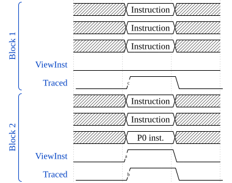

# ​D4.5.9 Filtering trace generation

Source: <https://developer.arm.com/documentation/ddi0487/mc/-Part-D-The-AArch64-System-Level-Architecture/-Chapter-D4-The-Embedded-Trace-Extension/-D4-5-About-the-ETE-trace-unit/-D4-5-9-Filtering-trace-generation>

##### D4.5.9 Filtering trace generation

I CCWZG
:   The amount of trace that can be generated by the trace unit can be significant. Not all the operations of the PE are always relevant. The amount of trace generated can be reduced by the use of the trace unit filter functions.

###### D4.5.9.1 ViewInst function

R GQFSB
:   The filtering function of the instruction trace is expressed as a calculation evaluated for each instruction.

    

    

R BZXFH
:   While ViewInst is high, the trace unit traces all instructions.

I MJMCV
:   Instructions for which ViewInst is low might be traced. This might be as a result of tracing the next *P0 element* or optimizations in the trace unit.

R XPNZL
:   When ViewInst is high for an instruction in an instruction block, the trace unit traces the entire instruction block.

R KHDNX
:   When ViewInst becomes high, the trace unit traces the next *P0 instruction* or Exceptional occurrence.

I NSMSV
:   Some instruction types cause the trace unit to generate *P0 elements*, so that they are explicitly traced. Other instruction types however are not explicitly traced. The execution of these other instruction types can be inferred from the *P0 elements*. This means that the following scenario is possible:

    - While ViewInst is high, some instructions are executed. This means that ViewInst is indicating that those instructions must be traced. However, none of the executed instructions cause the trace unit to generate a *P0 element*, therefore none of the instructions are traced.
    - ViewInst then goes low.
    - The PE then executes an instruction that, whenever ViewInst is high, causes the trace unit to generate a *P0 element*.

    In this scenario, although ViewInst is low when the instruction in step 3 is executed, indicating that the instruction is not traced, tracing of the instruction is permitted because this is the only way that the preceding instructions can be traced.

I FGSBW
:   There is no requirement for the target address of a *P0 instruction* or Exceptional occurrence to be traced if ViewInst has transitioned to a low state by the time program execution has moved to the target.

I LCXHX
:   Unless the target instruction block is traced, any *Target Address elements* indicating the target address of a *P0 instruction* or Exceptional occurrence cannot be relied on.

**D4.5.9.1.1 Resource event based filtering**

R BQNWP
:   The resource event based filtering part of the ViewInst function is expressed as the following equation:

    

    Where Fn(TRCVICTLR.EVENT.SEL, TRCVICTLR.EVENT.TYPE) selects the combination of Resource Selectors used for resource event based filtering.

I KMXNS
:   The timing of the resource event based filtering is IMPLEMENTATION SPECIFIC.

I DWWVR
:   Resource event based filtering can be used to make ViewInst active based on system conditions or on trace unit resources. For example:

    - Sampling based on cycle counts.
    - Activating tracing on the nth function call.
    - Performance Monitoring Unit events.

R NBYKR
:   When an instruction block is processed by the trace unit during a cycle, the trace unit samples the ViewInst function resource event input during that cycle.

R SRMMD
:   When no instruction blocks are processed by the trace unit during a cycle, the trace unit does not sample the ViewInst function resource event input during that cycle.

**D4.5.9.1.2 Exception level filtering**

I HNPYV
:   This function provides a simple method of filtering out information about different Exception levels without the need to use of additional resources.

R LWYJR
:   The Exception level based filtering part of the ViewInst function is expressed as the following equation:

    

###### D4.5.9.2 ViewInst start/stop function filtering

I PJQSC
:   The ViewInst start/stop function is useful when the requirement is to trace a particular piece of code with all the functions that the piece of code calls.

    The ViewInst start/stop function uses the Single Address Comparators and the PE Comparator Inputs to define start points and stop points.

    A start point is any of the following:

    - The instruction address which matches a Single Address Comparator selected for the ViewInst start/stop function using TRCVISSCTLR.START.
    - The instruction address which matches a PE Comparator selected for the ViewInst start/stop function using TRCVIPCSSCTLR.START.

    A stop point is any of the following:

    - The instruction address which matches a Single Address Comparator selected for the ViewInst start/stop function using TRCVISSCTLR.STOP.
    - The instruction address which matches a PE Comparator selected for the ViewInst start/stop function using TRCVIPCSSCTLR.STOP.

    Multiple start points can be selected. Multiple stop points can be selected.

R MVDJT
:   When a start point is encountered, the ViewInst start/stop function becomes active for the instruction at the start point.

R CDFBP
:   When a stop point is encountered, the ViewInst start/stop function becomes inactive immediately after the instruction at the stop point.

R LMQPR
:   When the ViewInst start/stop function causes ViewInst to become active, the trace unit traces the instruction at the start address.

R BWXLS
:   When the ViewInst start/stop function causes ViewInst to become inactive, the trace unit traces up to and including the instruction at the stop address.

R XHFYQ
:   While a ViewInst start/stop function start address is the same as a stop address, the behavior of the ViewInst start/stop function is UNPREDICTABLE.

R KCYTR
:   The ViewInst start/stop function part of the ViewInst function is expressed as the following equations:

    

    If TRCIDR4.NUMPC == `0b0000`, then:

    

    If TRCIDR4.NUMPC != `0b0000`, then:

    

R MVFYN
:   The following have no effect on the ViewInst start/stop function:

    - Exceptional occurrences.
    - Execution in Debug state.
    - Execution in a Trace Prohibited region.
    - A trace unit buffer overflow.

R GRSVY
:   When disabling the trace unit, the ViewInst start/stop function becomes static and retains its state until the trace unit is enabled again.

S XMMLP
:   For each of TRCVICTLR.SSSTATUS, TRCVISSCTLR, and TRCVIPCSSCTLR, if the register is implemented, it must be programmed with an initial state when the trace unit is programmed before a trace session.

R HYLDM
:   If an implementation makes speculation visible to the trace unit, the ViewInst start/stop function behaves as if no speculation has occurred. That is, when the instruction at a start or stop point is executed speculatively and is later canceled, the ViewInst start/stop function behaves as if the instruction at the start or stop point was not executed.

R BZSXR
:   When the trace unit becomes disabled and there are instructions at start points or stop points which are still speculative, the behavior of the ViewInst start/stop function is IMPLEMENTATION DEFINED and one of the following:

    - The ViewInst start/stop function behaves as if the instructions at the start points or stop points were incorrectly speculated. That is, the trace unit behaves as if those start points and stop points did not occur.
    - The ViewInst start/stop function behaves as if the instructions at the start points or stop points were correctly speculated. That is, the trace unit updates the state of the ViewInst start/stop function as if those start points and stop points occurred.

R HMKSZ
:   When mis-speculation occurs and the PE returns to a point in execution before the trace unit was enabled, the ViewInst start/stop function reverts to the state it was in when the trace unit became enabled.

R PBFMY
:   When the state of the ViewInst start/stop function is changed by anything other than a direct write to TRCVICTLR, the PE considers the write to be an indirect write to TRCVICTLR.SSSTATUS.

**D4.5.9.2.1 Instruction blocks**

R PTTKL
:   When an instruction block that contains instructions at ViewInst start points and no instructions at ViewInst stop points is executed, the ViewInst start/stop function remains active for the entire instruction block.

R WJLMR
:   While the ViewInst start/stop function is active, when an instruction block is executed that contains at least one ViewInst stop address and no ViewInst start addresses, the ViewInst start/stop function remains active for the whole instruction block and becomes inactive for the next instruction block, unless the next instruction block contains a ViewInst start address.

R SMGJZ
:   When an instruction block that contains at least one instruction at a ViewInst start point and at least one instruction at a ViewInst stop point is executed, the ViewInst start/stop function obeys the order of the start and stop points in the block, with the following consequences:

    - The ViewInst start/stop function is active for the whole of the instruction block.
    - When the final instruction in the block at a ViewInst start or stop point is at a ViewInst start point, the ViewInst start/stop function is active for the next instruction block.
    - When the final instruction in the block at a ViewInst start or stop point is at a ViewInst stop point, the ViewInst start/stop function is inactive for the next instruction block, unless the next block contains an instruction at a new ViewInst start point.

R SFXZB
:   The trace analyzer ensures that for all of the SACs selected for ViewInst start points or stop points, any SAC programmed with a lower address than another SAC is a lower-numbered SAC than the other SAC. That is, the SACs contain addresses in address order.

I RYPMM
:   While the SACs selected for ViewInst do not contain addresses in address order, the behavior of the ViewInst start/stop function is UNPREDICTABLE.

R ZLDKC
:   The trace analyzer ensures that for all of the PE Comparator Inputs selected for ViewInst start points or stop points, any PE comparator programmed with a lower address than another PE comparator is a lower-numbered PE comparator than the other PE comparator. That is, the PE comparators contain addresses in address order.

I CKTWT
:   While the PE Comparator Inputs selected for ViewInst do not contain addresses in address order, the behavior of the ViewInst start/stop function is UNPREDICTABLE.

R VFFWS
:   If more than one instruction Address Comparator is programmed with the same instruction address, then programming one or more of those comparators as start comparators, and one or more as stop comparators, results in the following CONSTRAINED UNPREDICTABLE behavior of the ViewInst start/stop function:

    - The ViewInst start/stop function is either active or inactive for the instruction at that address.
    - The ViewInst start/stop function is either active or inactive after that instruction.

###### D4.5.9.3 ViewInst include/exclude function filtering

I NDYFG
:   The ViewInst include/exclude function is useful if:

    - Specific ranges of instructions are required to be included in the trace.
    - Specific ranges of instructions are required to be excluded from the trace.
    - A combination of including and excluding instruction ranges is required.

I LDDGL
:   The ViewInst include/exclude function is comprised of two functions:

<table>
 <colgroup>
  <col/>
  <col/>
 </colgroup>
 <thead>
  <tr>
   <th>
    Function
   </th>
   <th>
    Meaning
   </th>
  </tr>
 </thead>
 <tbody>
  <tr>
   <td>
    ViewInst include function
   </td>
   <td>
    Includes one or more instruction address ranges
   </td>
  </tr>
  <tr>
   <td>
    ViewInst exclude function
   </td>
   <td>
    Excludes one or more instruction address ranges
   </td>
  </tr>
 </tbody>
</table>

    There are between zero and eight instruction Address Range Comparators available for the ViewInst include/exclude function. Some of these comparators can be selected for the ViewInst include function, and some for the ViewInst exclude function.

S VNWYT
:   For example, if all instructions in the address range from `0x00` to `0x2C` are required, but no other instructions are required, an Address Range Comparator can be selected for the ViewInst include function and be programmed with these two addresses. All instructions that are in this address range, including those at the start and end addresses, are traced.

I NKLJR
:   The ViewInst include/exclude function differs from the ViewInst start/stop function in the following ways:

    - When the ViewInst start/stop function is used, the trace unit starts tracing on a specified start instruction address and stops tracing on a specified stop instruction address. However, if execution branches or jumps to an address between the start and stop points, without first accessing the instruction at the start address, then the instruction that it has branched or jumped to is not traced. Instructions in the start/stop range are only traced if the instruction at the start address is accessed, so that the trace unit is triggered to start tracing. When triggered, and as execution continues sequentially towards the stop address, all functions that the piece of code calls are traced.
    - When the ViewInst include/exclude function is used, for example by programming an Address Range Comparator with an include address range, then if execution branches or jumps to any instruction address anywhere in that range, that instruction is always traced. This is true regardless of whether the instruction at the start address has been accessed or not.

    In addition, unlike the ViewInst start/stop function, as program execution continues through the address range towards the end address, no functions that the piece of code calls are traced.

R SKZHH
:   The ViewInst include/exclude function part of the ViewInst function is expressed as the following equations:

    

**D4.5.9.3.1 Instruction blocks**

R RNPWD
:   When an instruction in an instruction block is included to be traced by the ViewInst include/exclude function, the ViewInst include/exclude function includes all of the instruction block.

R PLCQJ
:   When an instruction block contains at least one instruction excluded by the ViewInst include/exclude function, and only when all the instructions in the instruction block are excluded, the ViewInst include/exclude function excludes the instruction block.

I LBNVM
:   If a block of instructions is not entirely covered by at least one individual ARC selected by TRCVIIECTLR.EXCLUDE, it is CONSTRAINED UNPREDICTABLE whether the block is excluded or not. This applies even if other ARCs selected by TRCVIIECTLR.EXCLUDE cover the rest of the block.

###### D4.5.9.4 Guidelines for interpreting the ViewInst function result

I TCGMV
:   The result of the ViewInst function is either:

<table>
 <colgroup>
  <col/>
  <col/>
 </colgroup>
 <thead>
  <tr>
   <th>
    Result
   </th>
   <th>
    Meaning
   </th>
  </tr>
 </thead>
 <tbody>
  <tr>
   <td>
    High
   </td>
   <td>
    Indicates that instructions being executed must be traced
   </td>
  </tr>
  <tr>
   <td>
    Low
   </td>
   <td>
    It is expected that instructions being executed are not traced
   </td>
  </tr>
 </tbody>
</table>

    If it is expected that instructions being executed are not traced, then there are occasions when it is permitted to trace some of those instructions. This section provides guidelines for when it is permitted to trace instructions that ViewInst indicates are not traced.

**D4.5.9.4.1 When ViewInst transitions from low to high**

I GMYYC
:   If execution occurs while ViewInst is low, it is permitted for a trace unit to trace instructions in certain circumstances. For more information on ViewInst low, see [Occasions when tracing instructions when ViewInst is low is permitted](/documentation/ddi0487/mc/-Part-D-The-AArch64-System-Level-Architecture/-Chapter-D4-The-Embedded-Trace-Extension/-D4-5-About-the-ETE-trace-unit/-D4-5-9-Filtering-trace-generation?lang=en#mdsec_viewinstlow).

I RVCQT
:   Tracing of instructions is permitted while ViewInst is low, but if no instructions or Exceptional occurrences that occur are traced, then there is a discontinuity in the trace. When a discontinuity in the trace occurs, when ViewInst becomes high, a *Trace On element* must be generated.

I YXGLK
:   Any instructions that are executed while ViewInst is high must be traced.

**D4.5.9.4.2 Occasions when tracing instructions when ViewInst is low is permitted**

I VFYXG
:   ETE permits tracing of instructions when ViewInst is low, in the following scenarios:

    - When the instruction that ViewInst indicates is not to be traced is in the same instruction block as an instruction that ViewInst indicates must be traced. This is because the only way to trace the instruction that must be traced is to trace the whole instruction block.
    - When the instruction that ViewInst indicates is not to be traced is in an instruction block that precedes or follows an instruction block containing an instruction that ViewInst indicates must be traced.

    An implementation always traces the instruction block that contains an instruction that must be traced. However, additional blocks of instructions might also be traced. This is more likely to occur when many instructions are executed in close proximity.

I CDLHB
:   Except for the scenarios that are mentioned, if the ViewInst function indicates that an instruction is not to be traced, then in general it is expected that it is not traced.

I FJMHL
:   In [Figure D4-14](/documentation/ddi0487/mc/-Part-D-The-AArch64-System-Level-Architecture/-Chapter-D4-The-Embedded-Trace-Extension/-D4-5-About-the-ETE-trace-unit/-D4-5-9-Filtering-trace-generation?lang=en#fig_mdfig_closeproximity), the instruction block 1 is in execution order before instruction block 2. The ViewInst calculation for the second block returns true, as indicated by the transition labeled (`a`). As ViewInst is true for this instruction block then all the instructions in this block must be traced, as indicated by the transition labeled (`b`). Instruction block 1 might be traced as it is in the same PE cycle as block 2, as indicated by the transition labeled (`c`).

    Figure D4-14 Example of close proximity

    

###### D4.5.9.5 Rules for tracing Exceptional occurrences

R CGVJD
:   When an Exceptional occurrence occurs, the Exceptional occurrence does not affect the comparators used by the ViewInst function, and none of the comparators used by the ViewInst function match.

I VFDMQ
:   The comparators used by the ViewInst function include the following:

    - Single Address Comparators.
    - Address Range Comparators.
    - Context Identifier Comparators.
    - Virtual Context Identifier Comparators.

I VFNZR
:   When an *Exception element* is traced, it might indicate execution of instructions up to a specified address. These instructions might have an impact on the comparators, but the Exceptional occurrence itself does not.

    This means that when an Exceptional occurrence occurs, the ViewInst function does not indicate whether the Exceptional occurrence must be traced. However, it is useful to trace Exceptional occurrences, to determine why execution has departed from the normal program flow.

I BVGXZ
:   When an instruction executes or Exceptional occurrence occurs outside a Trace Prohibited region, the trace unit remembers whether the instruction or Exceptional occurrence was traced. The trace unit performs indirect writes to TRCRSR.TA to store this state. When an Exceptional occurrence occurs, the trace unit uses TRCRSR.TA to determine whether to trace the Exceptional occurrence.

R BFSWZ
:   When an instruction executes or Exceptional occurrence occurs outside a Trace Prohibited region and the instruction or Exceptional occurrence is traced, TRCRSR.TA is set to 1.

R MLTTK
:   When an instruction executes or Exceptional occurrence occurs outside a Trace Prohibited region and the instruction or Exceptional occurrence is not traced, TRCRSR.TA is set to 0.

R CJTJM
:   When an instruction or Exceptional occurrence is canceled, TRCRSR.TA is set to the value of TRCRSR.TA immediately before the canceled instruction or Exceptional occurrence.

R DPMBQ
:   When an Exceptional occurrence occurs, it is traced if all of the following are true:

    - The PE is not in Debug state.
    - TRCRSR.TA is 1.

R BJQDP
:   While any of the following are true, TRCRSR.TA is unchanged by any execution:

    - The PE is in Debug state.
    - The PE is in a Trace Prohibited region.

R QZPJD
:   When a trace unit buffer overflow occurs, the behavior of TRCRSR.TA is IMPLEMENTATION DEFINED and is one of the following:

    - TRCRSR.TA is set to 0.
    - TRCRSR.TA is set to the value of TRCRSR.TA for the most recent instruction or Exceptional occurrence before the trace unit buffer overflow occurred.

###### D4.5.9.6 Forced tracing of Exceptional occurrences

I MFQND
:   The trace unit can be programmed so that it always traces certain Exceptional occurrences, regardless of whether the instruction or Exceptional occurrence immediately before the Exceptional occurrence must be traced. This option is enabled by setting either or both:

    - TRCVICTLR.TRCERR to 1. This forces the trace unit to trace System Error exceptions regardless of the value of ViewInst.
    - TRCVICTLR.TRCRESET to 1. This forces the trace unit to trace PE Resets regardless of the value of ViewInst.

R SJXYS
:   While the PE is executing in a Trace Prohibited region, forced tracing of System Error exceptions is inactive.

R VLNMN
:   While the PE is not executing a Trace Prohibited region and forced tracing of System Error exceptions is enabled, forced tracing of System Error exceptions is active.

R LTLBB
:   While forced tracing of System Error exceptions is active, when a System Error exception occurs, the trace unit generates an *Exception element* indicating a System Error exception, regardless of the value of ViewInst.

R NCXJN
:   While the PE is executing in a Trace Prohibited region, forced tracing of PE Resets is inactive, regardless of whether the PE Reset causes the PE to leave a Trace Prohibited region or not.

R NQJNL
:   While the PE is not executing in a Trace Prohibited region, while forced tracing of PE Resets is enabled, forced tracing of PE Resets is active.

R GPKSH
:   While forced tracing of PE Resets is active, when a PE Reset occurs, the trace unit generates an *Exception element* indicating a PE Reset, regardless of the value of ViewInst.

R BBBBT
:   While tracing is inactive, before an *Exception element* is generated due to forced tracing of either a PE Reset of a System Error exception, the trace unit generates a *Trace On element* and then a *Target Address element*.

I LXLKS
:   When an *Exception element* is generated as a result of forced tracing, the *Trace On element* generated before the *Exception element* indicates that tracing becomes active, and the *Target Address element* indicates where tracing becomes active.

R NZNDM
:   When a System Error exception occurs and TRCRSR.TA is 0 and the exception is traced because forced tracing of System Error exceptions is enabled, then it is IMPLEMENTATION DEFINED whether TRCRSR.TA is set to 1 or remains at 0.

R YFKGM
:   When a PE Reset occurs and TRCRSR.TA is 0 and the PE Reset is traced because forced tracing of PE Resets is enabled, then it is IMPLEMENTATION DEFINED whether TRCRSR.TA is set to 1 or remains at 0.

I GWHRM
:   In scenarios where a System Error exception occurs at approximately the same time as an exit from a Trace Prohibited region, after all execution inside the Trace Prohibited region and before any instruction execution outside the Trace Prohibited region, it is UNPREDICTABLE whether the System Error exception is considered to have occurred inside or outside the Trace Prohibited region. It is also UNPREDICTABLE whether the forced tracing of System Error exceptions is active for this exception.

    These scenarios do not include scenarios where the System Error exception caused the exit from a Trace Prohibited region, because the System Error exception occurred inside the Trace Prohibited region.

I JGVSY
:   In scenarios where a System Error exception occurs at approximately the same time as an entry to a Trace Prohibited region, after all execution before the Trace Prohibited region and before any instruction execution inside the Trace Prohibited region, it is UNPREDICTABLE whether the System Error exception is considered to have occurred inside or outside the Trace Prohibited region. It is also UNPREDICTABLE whether the forced tracing of System Error exceptions is active for this exception.

    These scenarios do not include scenarios where the System Error exception caused the entry to a Trace Prohibited region, because the System Error exception occurred outside the Trace Prohibited region.

R TSVKN
:   When a System Error exception occurs immediately after the PE exits a Trace Prohibited region and the System Error exception is traced, the preferred exception return address in the *Exception element* indicating the System Error exception does not include information about the Trace Prohibited region.

I PXJWM
:   In scenarios where a PE Reset occurs at approximately the same time as an exit from a Trace Prohibited region, after all execution inside the Trace Prohibited region and before any instruction execution outside the Trace Prohibited region, it is UNPREDICTABLE whether the PE Reset is considered to have occurred inside or outside the Trace Prohibited region. It is UNPREDICTABLE whether the forced tracing of PE Resets is active for this PE Reset.

    These scenarios do not include scenarios where the PE Reset caused the exit from a Trace Prohibited region, because the PE Reset occurred inside the Trace Prohibited region.

I JKQHF
:   In scenarios where a PE Reset occurs at approximately the same time as an entry to a Trace Prohibited region, after all execution before the Trace Prohibited region and before any instruction execution inside the Trace Prohibited region, it is UNPREDICTABLE whether the PE Reset is considered to have occurred inside or outside the Trace Prohibited region. It is UNPREDICTABLE whether the forced tracing of PE Resets is active for this PE Reset.

    These scenarios do not include scenarios where the PE Reset caused the entry to a Trace Prohibited region, because the PE Reset occurred outside the Trace Prohibited region.

R NRNFS
:   When a PE Reset occurs immediately after the PE exits a Trace Prohibited region and the PE Reset is traced, the preferred exception return address in the *Exception element* indicating the PE Reset does not include information about the Trace Prohibited region.
