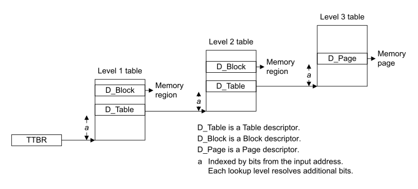

# ​D8.2.1 Translation table walk

Source: <https://developer.arm.com/documentation/ddi0487/mc/-Part-D-The-AArch64-System-Level-Architecture/-Chapter-D8-The-AArch64-Virtual-Memory-System-Architecture/-D8-2-Translation-process/-D8-2-1-Translation-table-walk>

##### D8.2.1 Translation table walk

R BTTHB
:   A translation table walk is the set of translation table lookups that are required to do all of the following:

    - For a single stage translation at stage 1, translate a VA to a PA.
    - For two translation stages and stage 1 is disabled, translate an IPA to a PA.
    - For a two stage translation, all of the following:

      - For a stage 1 translation, translate a VA to an IPA.
      - For a stage 2 translation, translate an IPA to a PA for each of the stage 1 translation table lookups.
      - For a stage 2 translation, translate an IPA to a PA for the stage 1 OA.

R RHQPX
:   When a translation table walk begins, the initial translation table lookup uses the translation table base address stored in the [TTBR\_ELx](/documentation/ddi0487/mc/-Part-K-Appendixes/-Appendix-K14-Registers-Index/-K14-1-Introduction-and-register-disambiguation/-K14-1-2-Register-name-disambiguation-by-Exception-level?lang=en#ttbr_elx) register to locate the translation table.

R YKQTS
:   When a translation table lookup occurs, the descriptor held in the translation table entry is read as one of the following:

    - For the VMSAv8-64 translation system, an 8-byte single-copy atomic access.
    - For the VMSAv9-128 translation system, a 16-byte single-copy atomic access.

    For information on the translation table alignment requirements, see [Translation table alignment](/documentation/ddi0487/mc/-Part-D-The-AArch64-System-Level-Architecture/-Chapter-D8-The-AArch64-Virtual-Memory-System-Architecture/-D8-2-Translation-process/-D8-2-5-Translation-table-and-translation-table-lookup-properties?lang=en#mdsec_translation_table_alignment).

R YPWQG
:   The descriptor type indicates one of the following:

    - The translation table walk is complete and the translation table entry is the final entry.
    - The translation table walk requires an extra lookup at the next higher lookup level.
    - The descriptor is invalid.

R NMTJN
:   All of the following descriptor types conclude the translation process:

    - Page descriptor.
    - Block descriptor.
    - Invalid descriptor.

    For more information, see [Translation table descriptor formats](/documentation/ddi0487/mc/-Part-D-The-AArch64-System-Level-Architecture/-Chapter-D8-The-AArch64-Virtual-Memory-System-Architecture/-D8-3-Translation-table-descriptor-formats?lang=en#mdsec_translation_table_descriptor_formats).

I WMLYG
:   When an Invalid descriptor is returned during the translation process, a Translation fault at the current lookup level is generated.

I QPHCD
:   When an extra lookup level is required, the descriptor contains all of the following information:

    - The translation table base address of the next lookup level.
    - For stage 1 descriptors, if the [Effective value](/documentation/ddi0487/mc/-Part-K-Appendixes/Glossary?lang=en#effective_value) of [TCR\_ELx](/documentation/ddi0487/mc/-Part-K-Appendixes/-Appendix-K14-Registers-Index/-K14-1-Introduction-and-register-disambiguation/-K14-1-2-Register-name-disambiguation-by-Exception-level?lang=en#tcr_elx).HPD*n* is 0, then the descriptor has hierarchical access permissions that are applied to the final translation.
    - If the translation is made in a Secure translation regime, then a stage 1 descriptor indicates whether the base address is in the Secure address space or the Non-secure address space, unless a hierarchical control at a previous lookup level has indicated that it is required to be in the Non-secure address space.

    For more information, see [Security state of translation table lookups](/documentation/ddi0487/mc/-Part-D-The-AArch64-System-Level-Architecture/-Chapter-D8-The-AArch64-Virtual-Memory-System-Architecture/-D8-2-Translation-process/-D8-2-6-Translation-table-walk-properties?lang=en#mdsec_security_state_of_translation_table_lookups).

R VSJGV
:   For a translation lookup level, the translation table base address is one of the following:

    - For the initial lookup level, the aligned value of the appropriate [TTBR\_ELx](/documentation/ddi0487/mc/-Part-K-Appendixes/-Appendix-K14-Registers-Index/-K14-1-Introduction-and-register-disambiguation/-K14-1-2-Register-name-disambiguation-by-Exception-level?lang=en#ttbr_elx).BADDR field.
    - For subsequent lookup levels, the next-level translation table base address returned by the previous lookup level.

I HFBGP
:   For the VMSAv9-128 translation system, the Skip level (SKL) field in the descriptors and translation table base address registers permit the translation table walk to skip subsequent lookup levels.

I ZMMXH
:   When the last lookup level of a translation stage returns a valid descriptor, it contains all of the following:

    - The OA from the translation stage.
    - The memory region access permissions.
    - The memory region attributes.

    For more information, see [Memory region attributes](/documentation/ddi0487/mc/-Part-D-The-AArch64-System-Level-Architecture/-Chapter-D8-The-AArch64-Virtual-Memory-System-Architecture/-D8-6-Memory-region-attributes?lang=en#mdsec_memory_region_attributes) and [Memory access control](/documentation/ddi0487/mc/-Part-D-The-AArch64-System-Level-Architecture/-Chapter-D8-The-AArch64-Virtual-Memory-System-Architecture/-D8-4-Memory-access-control?lang=en#mdsec_memory_access_control).

R RZHGL
:   For a translation regime that uses two translation stages, the stage 1 descriptor addresses require stage 2 translation from IPA to PA.

R NLLYJ
:   When a translation table walk succeeds, all of the following are returned:

    - The OA.
    - If the translation table walk is made in a Secure translation regime, then the information returned indicates whether the OA is in the Secure IPA or PA space, or the Non-secure IPA or PA space.
    - If the translation table walk is made in a Realm translation regime, then the information returned indicates whether the OA is in the Realm PA space, or the Non-secure PA space.
    - If the translation table walk is made in Root state, then the OA can be in the Root, Realm, Secure, or Non-secure PA spaces.
    - The output memory region attributes.
    - The output memory region access permissions.

    For more information, see [Security state of translation table lookups](/documentation/ddi0487/mc/-Part-D-The-AArch64-System-Level-Architecture/-Chapter-D8-The-AArch64-Virtual-Memory-System-Architecture/-D8-2-Translation-process/-D8-2-6-Translation-table-walk-properties?lang=en#mdsec_security_state_of_translation_table_lookups).

I VPFHD
:   The following figure is a generalized view of a single address translation stage with three lookup levels.

    Figure D8-1 Generalized view of a single address translation stage

    

I JWQFM
:   If all of the following are true, then a translation table entry is permitted to be cached in a Translation Lookaside Buffer (TLB):

    - The entry is valid.
    - Using the entry does not generate a Translation fault, an Address size fault, or an Access flag fault.

I ZTRGT
:   TLB caching can reduce the number of required translation table lookups.

I JQDTN
:   If two address translation stages are used and when a full translation table walk at both stages is required, then all of the following apply:

    - S1 is the number of lookup levels required for a stage 1 translation.
    - S2 is the number of lookup levels required for a stage 2 translation.
    - The maximum number of translation table lookups required is (S1+1)\*(S2+1)-1.
