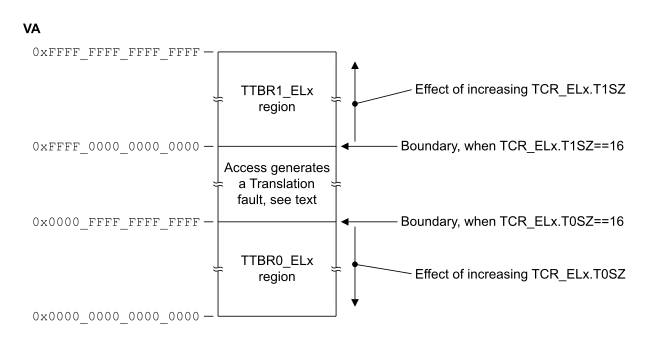

# ​D8.2.4 Selection between TTBR0_ELx and TTBR1_ELx when two VA ranges are supported

Source: <https://developer.arm.com/documentation/ddi0487/mc/-Part-D-The-AArch64-System-Level-Architecture/-Chapter-D8-The-AArch64-Virtual-Memory-System-Architecture/-D8-2-Translation-process/-D8-2-4-Selection-between-TTBR0-ELx-and-TTBR1-ELx-when-two-VA-ranges-are-supported>

##### D8.2.4 Selection between TTBR0\_ELx and TTBR1\_ELx when two VA ranges are supported

R HCTPT
:   If a stage 1 translation regime supports two VA ranges, then the translation regime [TTBR\_ELx](/documentation/ddi0487/mc/-Part-K-Appendixes/-Appendix-K14-Registers-Index/-K14-1-Introduction-and-register-disambiguation/-K14-1-2-Register-name-disambiguation-by-Exception-level?lang=en#ttbr_elx) registers point to all of the following address ranges:

    - For the lower VA range that begins at address `0x0000_0000_0000_0000`, [TTBR0\_ELx](/documentation/ddi0487/mc/-Part-K-Appendixes/-Appendix-K14-Registers-Index/-K14-1-Introduction-and-register-disambiguation/-K14-1-2-Register-name-disambiguation-by-Exception-level?lang=en#ttbr0_elx) points to the translation table for the initial lookup level.
    - For the upper VA range that ends at address `0xFFFF_FFFF_FFFF_FFFF`, [TTBR1\_ELx](/documentation/ddi0487/mc/-Part-K-Appendixes/-Appendix-K14-Registers-Index/-K14-1-Introduction-and-register-disambiguation/-K14-1-2-Register-name-disambiguation-by-Exception-level?lang=en#ttbr1_elx) points to the translation table for the initial lookup level.

R YYVYV
:   If a stage 1 translation regime supports two VA ranges, then the [TCR\_ELx](/documentation/ddi0487/mc/-Part-K-Appendixes/-Appendix-K14-Registers-Index/-K14-1-Introduction-and-register-disambiguation/-K14-1-2-Register-name-disambiguation-by-Exception-level?lang=en#tcr_elx).{T0SZ, T1SZ} fields configure all of the following address range sizes:

    - The lower VA range is `0x0000_0000_0000_0000` to (2(64-T0SZ) - 1).
    - The upper VA range is (264 - 2(64-T1SZ)) to `0xFFFF_FFFF_FFFF_FFFF`.

I THCZK
:   If a stage 1 translation regime supports two VA ranges, when an accessed address is not in the lower VA range or the upper VA range, a stage 1 level 0 Translation fault is generated.

I BCMMD
:   The following figure illustrates the two address ranges translated by the tables the [TTBR\_ELx](/documentation/ddi0487/mc/-Part-K-Appendixes/-Appendix-K14-Registers-Index/-K14-1-Introduction-and-register-disambiguation/-K14-1-2-Register-name-disambiguation-by-Exception-level?lang=en#ttbr_elx) registers point to.

    Figure D8-2 Example of a stage 1 translation that supports two VA ranges

    

R VZCSR
:   If a stage 1 translation regime supports two VA ranges, then all of the following are used to select the [TTBR\_ELx](/documentation/ddi0487/mc/-Part-K-Appendixes/-Appendix-K14-Registers-Index/-K14-1-Introduction-and-register-disambiguation/-K14-1-2-Register-name-disambiguation-by-Exception-level?lang=en#ttbr_elx):

    - If VA bit[55] is zero, then [TTBR0\_ELx](/documentation/ddi0487/mc/-Part-K-Appendixes/-Appendix-K14-Registers-Index/-K14-1-Introduction-and-register-disambiguation/-K14-1-2-Register-name-disambiguation-by-Exception-level?lang=en#ttbr0_elx) is selected.
    - If VA bit[55] is one, then [TTBR1\_ELx](/documentation/ddi0487/mc/-Part-K-Appendixes/-Appendix-K14-Registers-Index/-K14-1-Introduction-and-register-disambiguation/-K14-1-2-Register-name-disambiguation-by-Exception-level?lang=en#ttbr1_elx) is selected.

I ZFSYQ
:   If a stage 1 translation regime supports two VA ranges and [TCR\_ELx](/documentation/ddi0487/mc/-Part-K-Appendixes/-Appendix-K14-Registers-Index/-K14-1-Introduction-and-register-disambiguation/-K14-1-2-Register-name-disambiguation-by-Exception-level?lang=en#tcr_elx).EPD*n* is one, then when a TLB miss occurs based on [TTBRn\_ELx](/documentation/ddi0487/mc/-Part-K-Appendixes/-Appendix-K14-Registers-Index/-K14-1-Introduction-and-register-disambiguation/-K14-1-2-Register-name-disambiguation-by-Exception-level?lang=en#ttbrn_elx), a level 0 Translation fault is generated, and no translation table walk is done.

I SMKQB
:   For the VMSAv9-128 translation system, if a stage 1 translation regime supports two VA ranges, then the maximum supported VA width is 55 bits, and the smallest permitted value of the T*n*SZ field is 9.

I QBLKT
:   For more information, see [Address tagging](/documentation/ddi0487/mc/-Part-D-The-AArch64-System-Level-Architecture/-Chapter-D8-The-AArch64-Virtual-Memory-System-Architecture/-D8-8-Address-tagging?lang=en#mdsec_address_tagging).

###### D8.2.4.1 Preventing EL0 access to halves of the address map

R BNDVG
:   All statements in this section require implementation of [FEAT\_E0PD](/documentation/ddi0487/mc/-Part-A-Arm-Architecture-Introduction-and-Overview/-Chapter-A2-A-profile-Architecture-Extensions/-A2-2-Armv8-A-architecture-extensions/-A2-2-6-The-Armv8-5-architecture-extension?lang=en#feat_feat_e0pd).

I PZZHN
:   The [TCR\_ELx](/documentation/ddi0487/mc/-Part-K-Appendixes/-Appendix-K14-Registers-Index/-K14-1-Introduction-and-register-disambiguation/-K14-1-2-Register-name-disambiguation-by-Exception-level?lang=en#tcr_elx).{E0PD0, E0PD1} fields can be used to prevent EL0 access to the addresses translated by the corresponding [TTBR0\_ELx](/documentation/ddi0487/mc/-Part-K-Appendixes/-Appendix-K14-Registers-Index/-K14-1-Introduction-and-register-disambiguation/-K14-1-2-Register-name-disambiguation-by-Exception-level?lang=en#ttbr0_elx) or [TTBR1\_ELx](/documentation/ddi0487/mc/-Part-K-Appendixes/-Appendix-K14-Registers-Index/-K14-1-Introduction-and-register-disambiguation/-K14-1-2-Register-name-disambiguation-by-Exception-level?lang=en#ttbr1_elx).

I RFRSQ
:   When the [TCR\_ELx](/documentation/ddi0487/mc/-Part-K-Appendixes/-Appendix-K14-Registers-Index/-K14-1-Introduction-and-register-disambiguation/-K14-1-2-Register-name-disambiguation-by-Exception-level?lang=en#tcr_elx).{E0PD0, E0PD1} fields prevent EL0 access to an address translated by [TTBR0\_ELx](/documentation/ddi0487/mc/-Part-K-Appendixes/-Appendix-K14-Registers-Index/-K14-1-Introduction-and-register-disambiguation/-K14-1-2-Register-name-disambiguation-by-Exception-level?lang=en#ttbr0_elx) or [TTBR1\_ELx](/documentation/ddi0487/mc/-Part-K-Appendixes/-Appendix-K14-Registers-Index/-K14-1-Introduction-and-register-disambiguation/-K14-1-2-Register-name-disambiguation-by-Exception-level?lang=en#ttbr1_elx), then a level 0 Translation fault is generated.

R DDFWH
:   When the [TCR\_ELx](/documentation/ddi0487/mc/-Part-K-Appendixes/-Appendix-K14-Registers-Index/-K14-1-Introduction-and-register-disambiguation/-K14-1-2-Register-name-disambiguation-by-Exception-level?lang=en#tcr_elx).{E0PD0, E0PD1} fields generate a level 0 Translation fault, then all of the following apply:

    - The time needed to take the fault should be the same whether or not the address accessed is present in a TLB, to mitigate attacks that use fault timing.
    - The fault generated does not affect any micro-architectural state of the PE in a manner that is different if the address accessed is present in a TLB or not, to prevent this information being used to determine the presence of the address in a TLB.

R CZWGX
:   When the [TCR\_ELx](/documentation/ddi0487/mc/-Part-K-Appendixes/-Appendix-K14-Registers-Index/-K14-1-Introduction-and-register-disambiguation/-K14-1-2-Register-name-disambiguation-by-Exception-level?lang=en#tcr_elx).{E0PD0, E0PD1} fields generate a level 0 Translation fault, the fault is not counted as a TLB miss for performance monitoring features.
