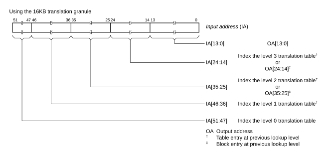
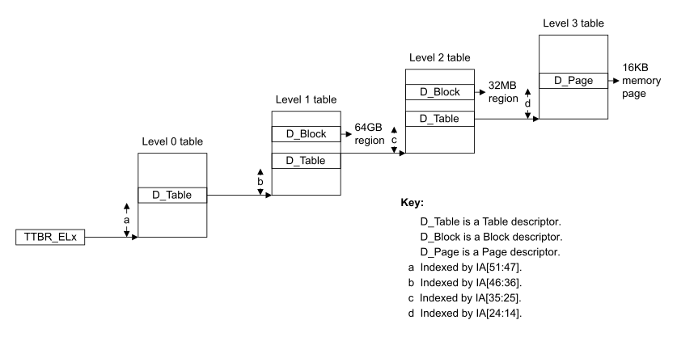
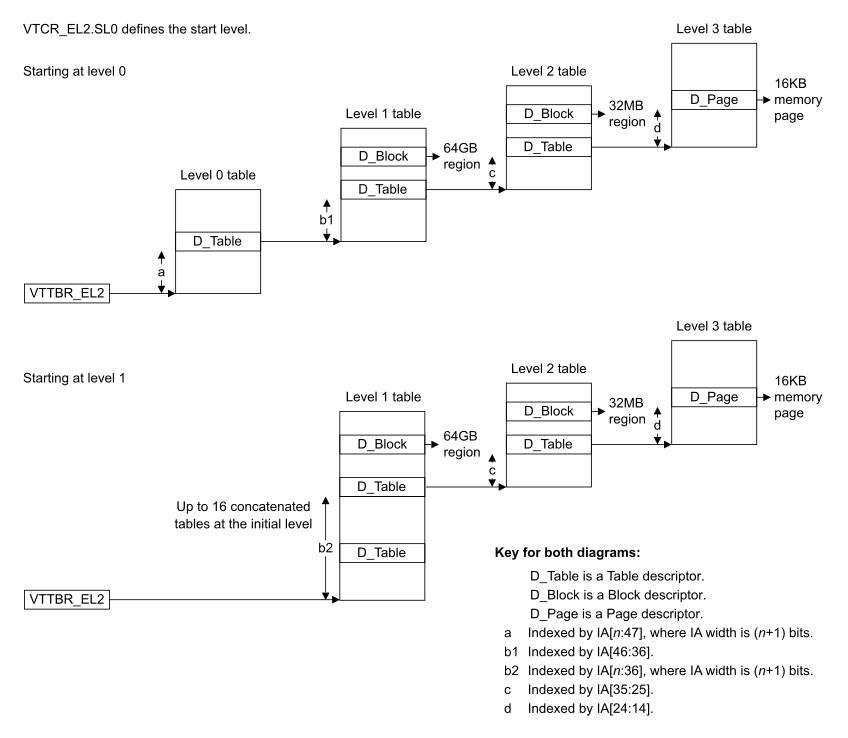

# ​D8.2.9 VMSAv8-64 translation using the 16KB granule

Source: <https://developer.arm.com/documentation/ddi0487/mc/-Part-D-The-AArch64-System-Level-Architecture/-Chapter-D8-The-AArch64-Virtual-Memory-System-Architecture/-D8-2-Translation-process/-D8-2-9-VMSAv8-64-translation-using-the-16KB-granule>

##### D8.2.9 VMSAv8-64 translation using the 16KB granule

R QSQNQ
:   All statements in this section and subsections require a translation stage use the VMSAv8-64 translation system.

I TDTCY
:   Address translations that use the 16KB granule have a 16KB page size. Depending on the settings and supported features, up to 38 address bits are resolved using up to 4 lookup levels.

R VQYZX
:   Throughout this section, if an address translation stage is not specified, then references to the [Effective value](/documentation/ddi0487/mc/-Part-K-Appendixes/Glossary?lang=en#effective_value) of [TCR\_ELx](/documentation/ddi0487/mc/-Part-K-Appendixes/-Appendix-K14-Registers-Index/-K14-1-Introduction-and-register-disambiguation/-K14-1-2-Register-name-disambiguation-by-Exception-level?lang=en#tcr_elx).DS also apply to [VTCR\_EL2](/documentation/ddi0487/mc/-Part-D-The-AArch64-System-Level-Architecture/-Chapter-D24-AArch64-System-Register-Descriptions/-D24-2-General-system-control-registers/-D24-2-223-VTCR-EL2--Virtualization-Translation-Control-Register?lang=en#reg_aarch64_vtcr_el2).DS.

I JCYXY
:   For the 16KB translation granule, the maximum VA and PA supported by a translation regime is one of the following:

    - If the [Effective value](/documentation/ddi0487/mc/-Part-K-Appendixes/Glossary?lang=en#effective_value) of [TCR\_ELx](/documentation/ddi0487/mc/-Part-K-Appendixes/-Appendix-K14-Registers-Index/-K14-1-Introduction-and-register-disambiguation/-K14-1-2-Register-name-disambiguation-by-Exception-level?lang=en#tcr_elx).DS is 0, then the maximum VA and PA supported is 48 bits.
    - If the [Effective value](/documentation/ddi0487/mc/-Part-K-Appendixes/Glossary?lang=en#effective_value) of [TCR\_ELx](/documentation/ddi0487/mc/-Part-K-Appendixes/-Appendix-K14-Registers-Index/-K14-1-Introduction-and-register-disambiguation/-K14-1-2-Register-name-disambiguation-by-Exception-level?lang=en#tcr_elx).DS is 1, then the maximum VA and PA supported is 52 bits.

R CDLYH
:   For the 16KB translation granule, if the [Effective value](/documentation/ddi0487/mc/-Part-K-Appendixes/Glossary?lang=en#effective_value) of [TCR\_ELx](/documentation/ddi0487/mc/-Part-K-Appendixes/-Appendix-K14-Registers-Index/-K14-1-Introduction-and-register-disambiguation/-K14-1-2-Register-name-disambiguation-by-Exception-level?lang=en#tcr_elx).DS is 0, then OA[51:48] are treated as `0b0000`.

R VGVLD
:   For each lookup level supported by the 16KB translation granule, the following table describes the translation table properties at that level.

<table id="tbl_mdtbl_16kb_granule_tt_properties_lookup_level">
 <caption>
  Table D8-26 16KB granule translation table properties at each lookup level
 </caption>
 <colgroup>
  <col/>
  <col/>
  <col/>
  <col/>
  <col/>
 </colgroup>
 <thead>
  <tr>
   <th>
    Lookup level
   </th>
   <th>
    Index into translation table
   </th>
   <th>
    Maximum entries in table
   </th>
   <th>
    Contents of translation table entries
   </th>
   <th>
    Additional requirements
   </th>
  </tr>
 </thead>
 <tbody>
  <tr>
   <td rowspan="2">
    0
   </td>
   <td>
    IA[47]
   </td>
   <td>
    2
   </td>
   <td>
    Table descriptors Lookup level 0 supported only at stage 1
   </td>
   <td>
    Effective value of
    <a class="document-topic" document-topic-path="/ddi0487/mc/-Part-K-Appendixes/-Appendix-K14-Registers-Index/-K14-1-Introduction-and-register-disambiguation/-K14-1-2-Register-name-disambiguation-by-Exception-level?lang=en#tcr_elx" href="/documentation/ddi0487/mc/-Part-K-Appendixes/-Appendix-K14-Registers-Index/-K14-1-Introduction-and-register-disambiguation/-K14-1-2-Register-name-disambiguation-by-Exception-level?lang=en#tcr_elx">
     TCR_ELx
    </a>
    .DS is 0
   </td>
  </tr>
  <tr>
   <td>
    IA[51:47]
   </td>
   <td>
    32
   </td>
   <td>
    Table descriptors Lookup level 0 supported at stages 1 and 2
   </td>
   <td>
    Effective value of
    <a class="document-topic" document-topic-path="/ddi0487/mc/-Part-K-Appendixes/-Appendix-K14-Registers-Index/-K14-1-Introduction-and-register-disambiguation/-K14-1-2-Register-name-disambiguation-by-Exception-level?lang=en#tcr_elx" href="/documentation/ddi0487/mc/-Part-K-Appendixes/-Appendix-K14-Registers-Index/-K14-1-Introduction-and-register-disambiguation/-K14-1-2-Register-name-disambiguation-by-Exception-level?lang=en#tcr_elx">
     TCR_ELx
    </a>
    .DS is 1
   </td>
  </tr>
  <tr>
   <td rowspan="2">
    1
   </td>
   <td rowspan="2">
    IA[46:36]
   </td>
   <td rowspan="2">
    2048
   </td>
   <td>
    Table descriptors
   </td>
   <td>
    Effective value of
    <a class="document-topic" document-topic-path="/ddi0487/mc/-Part-K-Appendixes/-Appendix-K14-Registers-Index/-K14-1-Introduction-and-register-disambiguation/-K14-1-2-Register-name-disambiguation-by-Exception-level?lang=en#tcr_elx" href="/documentation/ddi0487/mc/-Part-K-Appendixes/-Appendix-K14-Registers-Index/-K14-1-Introduction-and-register-disambiguation/-K14-1-2-Register-name-disambiguation-by-Exception-level?lang=en#tcr_elx">
     TCR_ELx
    </a>
    .DS is 0
   </td>
  </tr>
  <tr>
   <td>
    Table descriptors and Block descriptors
   </td>
   <td>
    Effective value of
    <a class="document-topic" document-topic-path="/ddi0487/mc/-Part-K-Appendixes/-Appendix-K14-Registers-Index/-K14-1-Introduction-and-register-disambiguation/-K14-1-2-Register-name-disambiguation-by-Exception-level?lang=en#tcr_elx" href="/documentation/ddi0487/mc/-Part-K-Appendixes/-Appendix-K14-Registers-Index/-K14-1-Introduction-and-register-disambiguation/-K14-1-2-Register-name-disambiguation-by-Exception-level?lang=en#tcr_elx">
     TCR_ELx
    </a>
    .DS is 1
   </td>
  </tr>
  <tr>
   <td>
    2
   </td>
   <td>
    IA[35:25]
   </td>
   <td>
    2048
   </td>
   <td>
    Table descriptors and Block descriptors
   </td>
   <td>
    -
   </td>
  </tr>
  <tr>
   <td>
    3
   </td>
   <td>
    IA[24:14]
   </td>
   <td>
    2048
   </td>
   <td>
    Page descriptors
   </td>
   <td>
    -
   </td>
  </tr>
 </tbody>
</table>

R RYDBQ
:   For the 16KB translation granule, a translation resolved by a Page descriptor at lookup level 3 has all of the following properties:

    - The page size is 16KB.
    - The translation can resolve a page using one of the following maximum address ranges:

      - If the [Effective value](/documentation/ddi0487/mc/-Part-K-Appendixes/Glossary?lang=en#effective_value) of [TCR\_ELx](/documentation/ddi0487/mc/-Part-K-Appendixes/-Appendix-K14-Registers-Index/-K14-1-Introduction-and-register-disambiguation/-K14-1-2-Register-name-disambiguation-by-Exception-level?lang=en#tcr_elx).DS is 0, then IA[47:14].
      - If the [Effective value](/documentation/ddi0487/mc/-Part-K-Appendixes/Glossary?lang=en#effective_value) of [TCR\_ELx](/documentation/ddi0487/mc/-Part-K-Appendixes/-Appendix-K14-Registers-Index/-K14-1-Introduction-and-register-disambiguation/-K14-1-2-Register-name-disambiguation-by-Exception-level?lang=en#tcr_elx).DS is 1, then IA[51:14].
    - The page is addressed by one of the following:

      - If the [Effective value](/documentation/ddi0487/mc/-Part-K-Appendixes/Glossary?lang=en#effective_value) of [TCR\_ELx](/documentation/ddi0487/mc/-Part-K-Appendixes/-Appendix-K14-Registers-Index/-K14-1-Introduction-and-register-disambiguation/-K14-1-2-Register-name-disambiguation-by-Exception-level?lang=en#tcr_elx).DS is 0, then OA[47:14].
      - If the [Effective value](/documentation/ddi0487/mc/-Part-K-Appendixes/Glossary?lang=en#effective_value) of [TCR\_ELx](/documentation/ddi0487/mc/-Part-K-Appendixes/-Appendix-K14-Registers-Index/-K14-1-Introduction-and-register-disambiguation/-K14-1-2-Register-name-disambiguation-by-Exception-level?lang=en#tcr_elx).DS is 1, then OA[51:14].
    - IA[13:0] is mapped directly to OA[13:0].

R FFHSQ
:   For the 16KB translation granule, a translation resolved by a Block descriptor at the specified lookup level has all of the properties shown in the following table:

<table id="tbl_mdtbl_16kb_granule_bd_properties_lookup_level">
 <caption>
  Table D8-27 16KB granule block descriptor properties at each lookup level
 </caption>
 <colgroup>
  <col/>
  <col/>
  <col/>
  <col/>
  <col/>
 </colgroup>
 <thead>
  <tr>
   <th>
    Lookup level
   </th>
   <th>
    Size of memory region addressed by Block descriptor
   </th>
   <th>
    Bit range that is direct mapped from IA to OA
   </th>
   <th>
    IA bit range that selects Block descriptor
   </th>
   <th>
    Effective value of TCR_ELx.DS
   </th>
  </tr>
 </thead>
 <tbody>
  <tr>
   <td rowspan="2">
    1
   </td>
   <td>
    Not supported
   </td>
   <td>
    -
   </td>
   <td>
    -
   </td>
   <td>
    0
   </td>
  </tr>
  <tr>
   <td>
    64GB
   </td>
   <td>
    IA[35:0] maps to OA[35:0]
   </td>
   <td>
    IA[51:36]
   </td>
   <td>
    1
   </td>
  </tr>
  <tr>
   <td rowspan="2">
    2
   </td>
   <td rowspan="2">
    32MB
   </td>
   <td rowspan="2">
    IA[24:0] maps to OA[24:0]
   </td>
   <td>
    IA[47:25]
   </td>
   <td>
    0
   </td>
  </tr>
  <tr>
   <td>
    IA[51:25]
   </td>
   <td>
    1
   </td>
  </tr>
 </tbody>
</table>

I MJSJR
:   For the 16KB translation granule, the following figure shows how the maximum 52-bit IA size is resolved. An IA larger than 48 bits requires that the [Effective value](/documentation/ddi0487/mc/-Part-K-Appendixes/Glossary?lang=en#effective_value) of [TCR\_ELx](/documentation/ddi0487/mc/-Part-K-Appendixes/-Appendix-K14-Registers-Index/-K14-1-Introduction-and-register-disambiguation/-K14-1-2-Register-name-disambiguation-by-Exception-level?lang=en#tcr_elx).DS is 1.

    Figure D8-6 52-bit IA resolved using 16KB translation granule

    

###### D8.2.9.1 VMSAv8-64 Stage 1 address translation using the 16KB translation granule

R JHFFJ
:   For the 16KB translation granule, when a stage 1 translation table walk is started, the initial lookup level is determined by the value of the [TCR\_ELx](/documentation/ddi0487/mc/-Part-K-Appendixes/-Appendix-K14-Registers-Index/-K14-1-Introduction-and-register-disambiguation/-K14-1-2-Register-name-disambiguation-by-Exception-level?lang=en#tcr_elx).T*n*SZ field as shown in the following table:

<table id="tbl_mdtbl_16kb_granule_determining_s1_initial_lookup_level">
 <caption>
  Table D8-28 16KB granule, determining stage 1 initial lookup level
 </caption>
 <colgroup>
  <col/>
  <col/>
  <col/>
  <col/>
  <col/>
  <col/>
 </colgroup>
 <thead>
  <tr>
   <th>
    Initial lookup level
   </th>
   <th>
    T
    <em>
     n
    </em>
    SZ minimum value
   </th>
   <th>
    Maximum IA bits resolved
   </th>
   <th>
    T
    <em>
     n
    </em>
    SZ maximum value
   </th>
   <th>
    Minimum IA bits resolved
   </th>
   <th>
    Additional requirements
   </th>
  </tr>
 </thead>
 <tbody>
  <tr>
   <td>
    0
   </td>
   <td>
    12
   </td>
   <td>
    IA[51:14]
   </td>
   <td>
    15
   </td>
   <td>
    IA[48:14]
   </td>
   <td>
    Effective value of
    <a class="document-topic" document-topic-path="/ddi0487/mc/-Part-K-Appendixes/-Appendix-K14-Registers-Index/-K14-1-Introduction-and-register-disambiguation/-K14-1-2-Register-name-disambiguation-by-Exception-level?lang=en#tcr_elx" href="/documentation/ddi0487/mc/-Part-K-Appendixes/-Appendix-K14-Registers-Index/-K14-1-Introduction-and-register-disambiguation/-K14-1-2-Register-name-disambiguation-by-Exception-level?lang=en#tcr_elx">
     TCR_ELx
    </a>
    .DS is 1
   </td>
  </tr>
  <tr>
   <td>
    0
   </td>
   <td>
    16
   </td>
   <td>
    IA[47:14]
   </td>
   <td>
    16
   </td>
   <td>
    IA[47:14]
   </td>
   <td>
    -
   </td>
  </tr>
  <tr>
   <td>
    1
   </td>
   <td>
    17
   </td>
   <td>
    IA[46:14]
   </td>
   <td>
    27
   </td>
   <td>
    IA[36:14]
   </td>
   <td>
    -
   </td>
  </tr>
  <tr>
   <td>
    2
   </td>
   <td>
    28
   </td>
   <td>
    IA[35:14]
   </td>
   <td>
    38
   </td>
   <td>
    IA[25:14]
   </td>
   <td>
    -
   </td>
  </tr>
  <tr>
   <td>
    3
   </td>
   <td>
    39
   </td>
   <td>
    IA[24:14]
   </td>
   <td>
    39
   </td>
   <td>
    IA[24:14]
   </td>
   <td>
    -
   </td>
  </tr>
  <tr>
   <td>
    3
   </td>
   <td>
    40
   </td>
   <td>
    IA[23:14]
   </td>
   <td>
    48
   </td>
   <td>
    IA[15:14]
   </td>
   <td>
    <a class="document-topic" document-topic-path="/ddi0487/mc/-Part-A-Arm-Architecture-Introduction-and-Overview/-Chapter-A2-A-profile-Architecture-Extensions/-A2-2-Armv8-A-architecture-extensions/-A2-2-5-The-Armv8-4-architecture-extension?lang=en#feat_feat_ttst" href="/documentation/ddi0487/mc/-Part-A-Arm-Architecture-Introduction-and-Overview/-Chapter-A2-A-profile-Architecture-Extensions/-A2-2-Armv8-A-architecture-extensions/-A2-2-5-The-Armv8-4-architecture-extension?lang=en#feat_feat_ttst">
     FEAT_TTST
    </a>
    is implemented
   </td>
  </tr>
 </tbody>
</table>

I FLDKN
:   For a stage 1 translation in the 16KB translation granule, depending on the IA size, the initial lookup level is indexed by up to 11 bits and all remaining lookup levels are indexed by exactly 11 bits.

I KSSHJ
:   For the 16KB translation granule and a 52-bit IA, the following figure is a generalized view of a stage 1 address translation. An IA and an OA larger than 48 bits requires that the [Effective value](/documentation/ddi0487/mc/-Part-K-Appendixes/Glossary?lang=en#effective_value) of [TCR\_ELx](/documentation/ddi0487/mc/-Part-K-Appendixes/-Appendix-K14-Registers-Index/-K14-1-Introduction-and-register-disambiguation/-K14-1-2-Register-name-disambiguation-by-Exception-level?lang=en#tcr_elx).DS is 1. The 64GB block size requires that the [Effective value](/documentation/ddi0487/mc/-Part-K-Appendixes/Glossary?lang=en#effective_value) of [TCR\_ELx](/documentation/ddi0487/mc/-Part-K-Appendixes/-Appendix-K14-Registers-Index/-K14-1-Introduction-and-register-disambiguation/-K14-1-2-Register-name-disambiguation-by-Exception-level?lang=en#tcr_elx).DS is 1.

    Figure D8-7 Generalized view of a stage 1 address translation using the 16KB granule

    

###### D8.2.9.2 VMSAv8-64 Stage 2 address translation using the 16KB translation granule

I QDHZV
:   For the 16KB translation granule, when a stage 2 translation table walk is started, the initial lookup level is determined by the corresponding [VTCR\_EL2](/documentation/ddi0487/mc/-Part-D-The-AArch64-System-Level-Architecture/-Chapter-D24-AArch64-System-Register-Descriptions/-D24-2-General-system-control-registers/-D24-2-223-VTCR-EL2--Virtualization-Translation-Control-Register?lang=en#reg_aarch64_vtcr_el2).SL0 or [VSTCR\_EL2](/documentation/ddi0487/mc/-Part-D-The-AArch64-System-Level-Architecture/-Chapter-D24-AArch64-System-Register-Descriptions/-D24-2-General-system-control-registers/-D24-2-221-VSTCR-EL2--Virtualization-Secure-Translation-Control-Register?lang=en#reg_aarch64_vstcr_el2).SL0 value.

I MKHHJ
:   For the 16KB translation granule, when a stage 2 translation table walk is started, the following table shows the initial lookup level determined by SL0:

<table id="tbl_mdtbl_16kb_granule_determining_s2_initial_lookup_level">
 <caption>
  Table D8-29 16KB granule, determining stage 2 initial lookup level
 </caption>
 <colgroup>
  <col/>
  <col/>
 </colgroup>
 <thead>
  <tr>
   <th>
    SL0
   </th>
   <th>
    Initial lookup level
   </th>
  </tr>
 </thead>
 <tbody>
  <tr>
   <td>
    <code>
     0b00
    </code>
   </td>
   <td>
    Level 3
   </td>
  </tr>
  <tr>
   <td>
    <code>
     0b01
    </code>
   </td>
   <td>
    Level 2
   </td>
  </tr>
  <tr>
   <td>
    <code>
     0b10
    </code>
   </td>
   <td>
    Level 1
   </td>
  </tr>
  <tr>
   <td>
    <code>
     0b11
    </code>
   </td>
   <td>
    Level 0
   </td>
  </tr>
 </tbody>
</table>

R JKYLY
:   For the 16KB translation granule, when a stage 2 translation table walk is started and the initial lookup level is 0, the following table shows all of the permitted concatenated translation table configurations and the corresponding [VTCR\_EL2](/documentation/ddi0487/mc/-Part-D-The-AArch64-System-Level-Architecture/-Chapter-D24-AArch64-System-Register-Descriptions/-D24-2-General-system-control-registers/-D24-2-223-VTCR-EL2--Virtualization-Translation-Control-Register?lang=en#reg_aarch64_vtcr_el2).T0SZ or [VSTCR\_EL2](/documentation/ddi0487/mc/-Part-D-The-AArch64-System-Level-Architecture/-Chapter-D24-AArch64-System-Register-Descriptions/-D24-2-General-system-control-registers/-D24-2-221-VSTCR-EL2--Virtualization-Secure-Translation-Control-Register?lang=en#reg_aarch64_vstcr_el2).T0SZ value:

<table id="tbl_mdtbl_16kb_granule_s2_initial_lookup_level_0">
 <caption>
  Table D8-30 16KB granule, stage 2 initial lookup at level 0
 </caption>
 <colgroup>
  <col/>
  <col/>
  <col/>
  <col/>
 </colgroup>
 <thead>
  <tr>
   <th>
    Number of concatenated translation tables
   </th>
   <th>
    IA bits resolved
   </th>
   <th>
    T0SZ
   </th>
   <th>
    Additional requirements
   </th>
  </tr>
 </thead>
 <tbody>
  <tr>
   <td>
    None (1 table)
   </td>
   <td>
    IA[51:14]-IA[47:14]
   </td>
   <td>
    12-16
   </td>
   <td>
    Effective value of
    <a class="document-topic" document-topic-path="/ddi0487/mc/-Part-D-The-AArch64-System-Level-Architecture/-Chapter-D24-AArch64-System-Register-Descriptions/-D24-2-General-system-control-registers/-D24-2-223-VTCR-EL2--Virtualization-Translation-Control-Register?lang=en#reg_aarch64_vtcr_el2" href="/documentation/ddi0487/mc/-Part-D-The-AArch64-System-Level-Architecture/-Chapter-D24-AArch64-System-Register-Descriptions/-D24-2-General-system-control-registers/-D24-2-223-VTCR-EL2--Virtualization-Translation-Control-Register?lang=en#reg_aarch64_vtcr_el2">
     VTCR_EL2
    </a>
    .DS is 1
   </td>
  </tr>
 </tbody>
</table>

R FBHPY
:   For the 16KB translation granule, when a stage 2 translation table walk is started and the initial lookup level is 1, the following table shows all of the permitted concatenated translation table configurations and the corresponding [VTCR\_EL2](/documentation/ddi0487/mc/-Part-D-The-AArch64-System-Level-Architecture/-Chapter-D24-AArch64-System-Register-Descriptions/-D24-2-General-system-control-registers/-D24-2-223-VTCR-EL2--Virtualization-Translation-Control-Register?lang=en#reg_aarch64_vtcr_el2).T0SZ or [VSTCR\_EL2](/documentation/ddi0487/mc/-Part-D-The-AArch64-System-Level-Architecture/-Chapter-D24-AArch64-System-Register-Descriptions/-D24-2-General-system-control-registers/-D24-2-221-VSTCR-EL2--Virtualization-Secure-Translation-Control-Register?lang=en#reg_aarch64_vstcr_el2).T0SZ value:

<table id="tbl_mdtbl_16kb_granule_s2_initial_lookup_level_1">
 <caption>
  Table D8-31 16KB granule, stage 2 initial lookup at level 1
 </caption>
 <colgroup>
  <col/>
  <col/>
  <col/>
  <col/>
 </colgroup>
 <thead>
  <tr>
   <th>
    Number of concatenated translation tables
   </th>
   <th>
    IA bits resolved
   </th>
   <th>
    T0SZ
   </th>
   <th>
    Additional requirements
   </th>
  </tr>
 </thead>
 <tbody>
  <tr>
   <td>
    None (1 table)
   </td>
   <td>
    IA[46:14]-IA[36:14]
   </td>
   <td>
    17-27
   </td>
   <td>
    -
   </td>
  </tr>
  <tr>
   <td>
    2
   </td>
   <td>
    IA[47:14]
   </td>
   <td>
    16
   </td>
   <td>
    -
   </td>
  </tr>
  <tr>
   <td>
    4
   </td>
   <td>
    IA[48:14]
   </td>
   <td>
    15
   </td>
   <td>
    <a class="document-topic" document-topic-path="/ddi0487/mc/-Part-K-Appendixes/Glossary?lang=en#effective_value" href="/documentation/ddi0487/mc/-Part-K-Appendixes/Glossary?lang=en#effective_value">
     Effective value
    </a>
    of
    <a class="document-topic" document-topic-path="/ddi0487/mc/-Part-D-The-AArch64-System-Level-Architecture/-Chapter-D24-AArch64-System-Register-Descriptions/-D24-2-General-system-control-registers/-D24-2-223-VTCR-EL2--Virtualization-Translation-Control-Register?lang=en#reg_aarch64_vtcr_el2" href="/documentation/ddi0487/mc/-Part-D-The-AArch64-System-Level-Architecture/-Chapter-D24-AArch64-System-Register-Descriptions/-D24-2-General-system-control-registers/-D24-2-223-VTCR-EL2--Virtualization-Translation-Control-Register?lang=en#reg_aarch64_vtcr_el2">
     VTCR_EL2
    </a>
    .DS is 1
   </td>
  </tr>
  <tr>
   <td>
    8
   </td>
   <td>
    IA[49:14]
   </td>
   <td>
    14
   </td>
   <td>
    <a class="document-topic" document-topic-path="/ddi0487/mc/-Part-K-Appendixes/Glossary?lang=en#effective_value" href="/documentation/ddi0487/mc/-Part-K-Appendixes/Glossary?lang=en#effective_value">
     Effective value
    </a>
    of
    <a class="document-topic" document-topic-path="/ddi0487/mc/-Part-D-The-AArch64-System-Level-Architecture/-Chapter-D24-AArch64-System-Register-Descriptions/-D24-2-General-system-control-registers/-D24-2-223-VTCR-EL2--Virtualization-Translation-Control-Register?lang=en#reg_aarch64_vtcr_el2" href="/documentation/ddi0487/mc/-Part-D-The-AArch64-System-Level-Architecture/-Chapter-D24-AArch64-System-Register-Descriptions/-D24-2-General-system-control-registers/-D24-2-223-VTCR-EL2--Virtualization-Translation-Control-Register?lang=en#reg_aarch64_vtcr_el2">
     VTCR_EL2
    </a>
    .DS is 1
   </td>
  </tr>
  <tr>
   <td>
    16
   </td>
   <td>
    IA[50:14]
   </td>
   <td>
    13
   </td>
   <td>
    <a class="document-topic" document-topic-path="/ddi0487/mc/-Part-K-Appendixes/Glossary?lang=en#effective_value" href="/documentation/ddi0487/mc/-Part-K-Appendixes/Glossary?lang=en#effective_value">
     Effective value
    </a>
    of
    <a class="document-topic" document-topic-path="/ddi0487/mc/-Part-D-The-AArch64-System-Level-Architecture/-Chapter-D24-AArch64-System-Register-Descriptions/-D24-2-General-system-control-registers/-D24-2-223-VTCR-EL2--Virtualization-Translation-Control-Register?lang=en#reg_aarch64_vtcr_el2" href="/documentation/ddi0487/mc/-Part-D-The-AArch64-System-Level-Architecture/-Chapter-D24-AArch64-System-Register-Descriptions/-D24-2-General-system-control-registers/-D24-2-223-VTCR-EL2--Virtualization-Translation-Control-Register?lang=en#reg_aarch64_vtcr_el2">
     VTCR_EL2
    </a>
    .DS is 1
   </td>
  </tr>
 </tbody>
</table>

R MJPYK
:   For the 16KB translation granule, when a stage 2 translation table walk is started and the initial lookup level is 2, the following table shows all of the permitted concatenated translation table configurations and the corresponding [VTCR\_EL2](/documentation/ddi0487/mc/-Part-D-The-AArch64-System-Level-Architecture/-Chapter-D24-AArch64-System-Register-Descriptions/-D24-2-General-system-control-registers/-D24-2-223-VTCR-EL2--Virtualization-Translation-Control-Register?lang=en#reg_aarch64_vtcr_el2).T0SZ or [VSTCR\_EL2](/documentation/ddi0487/mc/-Part-D-The-AArch64-System-Level-Architecture/-Chapter-D24-AArch64-System-Register-Descriptions/-D24-2-General-system-control-registers/-D24-2-221-VSTCR-EL2--Virtualization-Secure-Translation-Control-Register?lang=en#reg_aarch64_vstcr_el2).T0SZ value:

<table id="tbl_mdtbl_16kb_granule_s2_initial_lookup_level_2">
 <caption>
  Table D8-32 16KB granule, stage 2 initial lookup at level 2
 </caption>
 <colgroup>
  <col/>
  <col/>
  <col/>
  <col/>
 </colgroup>
 <thead>
  <tr>
   <th>
    Number of concatenated translation tables
   </th>
   <th>
    IA bits resolved
   </th>
   <th>
    T0SZ
   </th>
   <th>
    Additional requirements
   </th>
  </tr>
 </thead>
 <tbody>
  <tr>
   <td>
    None (1 table)
   </td>
   <td>
    IA[35:14]-IA[25:14]
   </td>
   <td>
    28-38
   </td>
   <td>
    -
   </td>
  </tr>
  <tr>
   <td>
    2
   </td>
   <td>
    IA[36:14]
   </td>
   <td>
    27
   </td>
   <td>
    -
   </td>
  </tr>
  <tr>
   <td>
    4
   </td>
   <td>
    IA[37:14]
   </td>
   <td>
    26
   </td>
   <td>
    -
   </td>
  </tr>
  <tr>
   <td>
    8
   </td>
   <td>
    IA[38:14]
   </td>
   <td>
    25
   </td>
   <td>
    -
   </td>
  </tr>
  <tr>
   <td>
    16
   </td>
   <td>
    IA[39:14]
   </td>
   <td>
    24
   </td>
   <td>
    -
   </td>
  </tr>
 </tbody>
</table>

R WDMGC
:   For the 16KB translation granule, when a stage 2 translation table walk is started and the initial lookup level is 3, the following table shows all of the permitted concatenated translation table configurations and the corresponding [VTCR\_EL2](/documentation/ddi0487/mc/-Part-D-The-AArch64-System-Level-Architecture/-Chapter-D24-AArch64-System-Register-Descriptions/-D24-2-General-system-control-registers/-D24-2-223-VTCR-EL2--Virtualization-Translation-Control-Register?lang=en#reg_aarch64_vtcr_el2).T0SZ or [VSTCR\_EL2](/documentation/ddi0487/mc/-Part-D-The-AArch64-System-Level-Architecture/-Chapter-D24-AArch64-System-Register-Descriptions/-D24-2-General-system-control-registers/-D24-2-221-VSTCR-EL2--Virtualization-Secure-Translation-Control-Register?lang=en#reg_aarch64_vstcr_el2).T0SZ value:

<table id="tbl_mdtbl_16kb_granule_s2_initial_lookup_level_3">
 <caption>
  Table D8-33 16KB granule, stage 2 initial lookup at level 3
 </caption>
 <colgroup>
  <col/>
  <col/>
  <col/>
  <col/>
 </colgroup>
 <thead>
  <tr>
   <th>
    Number of concatenated translation tables
   </th>
   <th>
    IA bits resolved
   </th>
   <th>
    T0SZ
   </th>
   <th>
    Additional requirements
   </th>
  </tr>
 </thead>
 <tbody>
  <tr>
   <td>
    None (1 table)
   </td>
   <td>
    IA[23:14]-IA[15:14]
   </td>
   <td>
    40-48
   </td>
   <td>
    <a class="document-topic" document-topic-path="/ddi0487/mc/-Part-A-Arm-Architecture-Introduction-and-Overview/-Chapter-A2-A-profile-Architecture-Extensions/-A2-2-Armv8-A-architecture-extensions/-A2-2-5-The-Armv8-4-architecture-extension?lang=en#feat_feat_ttst" href="/documentation/ddi0487/mc/-Part-A-Arm-Architecture-Introduction-and-Overview/-Chapter-A2-A-profile-Architecture-Extensions/-A2-2-Armv8-A-architecture-extensions/-A2-2-5-The-Armv8-4-architecture-extension?lang=en#feat_feat_ttst">
     FEAT_TTST
    </a>
    is implemented
   </td>
  </tr>
  <tr>
   <td>
    None (1 table)
   </td>
   <td>
    IA[24:14]
   </td>
   <td>
    39
   </td>
   <td>
    -
   </td>
  </tr>
  <tr>
   <td>
    2
   </td>
   <td>
    IA[25:14]
   </td>
   <td>
    38
   </td>
   <td>
    -
   </td>
  </tr>
  <tr>
   <td>
    4
   </td>
   <td>
    IA[26:14]
   </td>
   <td>
    37
   </td>
   <td>
    -
   </td>
  </tr>
  <tr>
   <td>
    8
   </td>
   <td>
    IA[27:14]
   </td>
   <td>
    36
   </td>
   <td>
    -
   </td>
  </tr>
  <tr>
   <td>
    16
   </td>
   <td>
    IA[28:14]
   </td>
   <td>
    35
   </td>
   <td>
    -
   </td>
  </tr>
 </tbody>
</table>

I GBRMW
:   For the 16KB translation granule and a 52-bit IA, the following figure is a generalized view of a stage 2 address translation. An IA larger than 48 bits requires that the [Effective value](/documentation/ddi0487/mc/-Part-K-Appendixes/Glossary?lang=en#effective_value) of [VTCR\_EL2](/documentation/ddi0487/mc/-Part-D-The-AArch64-System-Level-Architecture/-Chapter-D24-AArch64-System-Register-Descriptions/-D24-2-General-system-control-registers/-D24-2-223-VTCR-EL2--Virtualization-Translation-Control-Register?lang=en#reg_aarch64_vtcr_el2).DS is 1. The 64GB block size requires that the [Effective value](/documentation/ddi0487/mc/-Part-K-Appendixes/Glossary?lang=en#effective_value) of [VTCR\_EL2](/documentation/ddi0487/mc/-Part-D-The-AArch64-System-Level-Architecture/-Chapter-D24-AArch64-System-Register-Descriptions/-D24-2-General-system-control-registers/-D24-2-223-VTCR-EL2--Virtualization-Translation-Control-Register?lang=en#reg_aarch64_vtcr_el2).DS is 1.

    Figure D8-8 Generalized view of a stage 2 address translation using the 16KB granule

    

R NWPLD
:   For the 16KB translation granule, when a stage 2 translation table walk is started and one of the following is true, a stage 2 level 0 Translation fault is generated:

    - The [VTCR\_EL2](/documentation/ddi0487/mc/-Part-D-The-AArch64-System-Level-Architecture/-Chapter-D24-AArch64-System-Register-Descriptions/-D24-2-General-system-control-registers/-D24-2-223-VTCR-EL2--Virtualization-Translation-Control-Register?lang=en#reg_aarch64_vtcr_el2).T0SZ or [VSTCR\_EL2](/documentation/ddi0487/mc/-Part-D-The-AArch64-System-Level-Architecture/-Chapter-D24-AArch64-System-Register-Descriptions/-D24-2-General-system-control-registers/-D24-2-221-VSTCR-EL2--Virtualization-Secure-Translation-Control-Register?lang=en#reg_aarch64_vstcr_el2).T0SZ value is not consistent with the corresponding [VTCR\_EL2](/documentation/ddi0487/mc/-Part-D-The-AArch64-System-Level-Architecture/-Chapter-D24-AArch64-System-Register-Descriptions/-D24-2-General-system-control-registers/-D24-2-223-VTCR-EL2--Virtualization-Translation-Control-Register?lang=en#reg_aarch64_vtcr_el2).SL0 or [VSTCR\_EL2](/documentation/ddi0487/mc/-Part-D-The-AArch64-System-Level-Architecture/-Chapter-D24-AArch64-System-Register-Descriptions/-D24-2-General-system-control-registers/-D24-2-221-VSTCR-EL2--Virtualization-Secure-Translation-Control-Register?lang=en#reg_aarch64_vstcr_el2).SL0 value.
    - [VTCR\_EL2](/documentation/ddi0487/mc/-Part-D-The-AArch64-System-Level-Architecture/-Chapter-D24-AArch64-System-Register-Descriptions/-D24-2-General-system-control-registers/-D24-2-223-VTCR-EL2--Virtualization-Translation-Control-Register?lang=en#reg_aarch64_vtcr_el2).SL0 or [VSTCR\_EL2](/documentation/ddi0487/mc/-Part-D-The-AArch64-System-Level-Architecture/-Chapter-D24-AArch64-System-Register-Descriptions/-D24-2-General-system-control-registers/-D24-2-221-VSTCR-EL2--Virtualization-Secure-Translation-Control-Register?lang=en#reg_aarch64_vstcr_el2).SL0 is programmed to a reserved value.

I FXRPG
:   For more information, see [Concatenated translation tables](/documentation/ddi0487/mc/-Part-D-The-AArch64-System-Level-Architecture/-Chapter-D8-The-AArch64-Virtual-Memory-System-Architecture/-D8-2-Translation-process/-D8-2-2-Concatenated-translation-tables?lang=en#mdsec_concatenated_translation_tables).

###### D8.2.9.3 Finding the descriptor when using the VMSAv8-64 16KB translation granule

R KMTBZ
:   For the 16KB translation granule, the following table shows the algorithm to find the descriptor address at each supported lookup level, using of all of the following information:

    - The translation table base address, *BaseAddr*.
    - The number of bits in the supported PA size, *PAsize*.
    - The IA supplied to the translation stage and used as an index into the translation table.
    - For each initial lookup level, the permitted range of values for [TCR\_ELx](/documentation/ddi0487/mc/-Part-K-Appendixes/-Appendix-K14-Registers-Index/-K14-1-Introduction-and-register-disambiguation/-K14-1-2-Register-name-disambiguation-by-Exception-level?lang=en#tcr_elx).T*n*SZ.
    - For a stage 2 translation, all of the following:

      - The value of [VTCR\_EL2](/documentation/ddi0487/mc/-Part-D-The-AArch64-System-Level-Architecture/-Chapter-D24-AArch64-System-Register-Descriptions/-D24-2-General-system-control-registers/-D24-2-223-VTCR-EL2--Virtualization-Translation-Control-Register?lang=en#reg_aarch64_vtcr_el2).T0SZ or [VSTCR\_EL2](/documentation/ddi0487/mc/-Part-D-The-AArch64-System-Level-Architecture/-Chapter-D24-AArch64-System-Register-Descriptions/-D24-2-General-system-control-registers/-D24-2-221-VSTCR-EL2--Virtualization-Secure-Translation-Control-Register?lang=en#reg_aarch64_vstcr_el2).T0SZ.
      - The value of [VTCR\_EL2](/documentation/ddi0487/mc/-Part-D-The-AArch64-System-Level-Architecture/-Chapter-D24-AArch64-System-Register-Descriptions/-D24-2-General-system-control-registers/-D24-2-223-VTCR-EL2--Virtualization-Translation-Control-Register?lang=en#reg_aarch64_vtcr_el2).SL0 or [VSTCR\_EL2](/documentation/ddi0487/mc/-Part-D-The-AArch64-System-Level-Architecture/-Chapter-D24-AArch64-System-Register-Descriptions/-D24-2-General-system-control-registers/-D24-2-221-VSTCR-EL2--Virtualization-Secure-Translation-Control-Register?lang=en#reg_aarch64_vstcr_el2).SL0.

<table id="tbl_mdtbl_16kb_granule_finding_descriptor_address">
 <caption>
  Table D8-34 16KB granule, finding the descriptor address
 </caption>
 <colgroup>
  <col/>
  <col/>
  <col/>
 </colgroup>
 <thead>
  <tr>
   <th>
    Lookup level
   </th>
   <th>
    Stage 1 translation table descriptor address
   </th>
   <th>
    Stage 2 translation table descriptor address
   </th>
  </tr>
 </thead>
 <tbody>
  <tr>
   <td>
    0
   </td>
   <td>
    if 12 &lt;= T
    <em>
     n
    </em>
    SZ &lt;= 16 &nbsp;&nbsp;then
    <em>
     x
    </em>
    = (20 - T
    <em>
     n
    </em>
    SZ) BaseAddr[PAsize-1:
    <em>
     x
    </em>
    ]:IA[
    <em>
     x
    </em>
    +43:47]:
    <code>
     0b000
    </code>
   </td>
   <td>
    if SL0==3 &nbsp;&nbsp;then if 12 &lt;= T0SZ &lt;= 16 &nbsp;&nbsp;&nbsp;&nbsp;then
    <em>
     x
    </em>
    = (20 - T0SZ) BaseAddr[PAsize-1:
    <em>
     x
    </em>
    ]:IA[
    <em>
     x
    </em>
    +43:47]:
    <code>
     0b000
    </code>
   </td>
  </tr>
  <tr>
   <td>
    1
   </td>
   <td>
    if 17 &lt;= T
    <em>
     n
    </em>
    SZ &lt;= 27 &nbsp;&nbsp;then
    <em>
     x
    </em>
    = (31 - T
    <em>
     n
    </em>
    SZ) else
    <em>
     x
    </em>
    = 14 BaseAddr[PAsize-1:
    <em>
     x
    </em>
    ]:IA[
    <em>
     x
    </em>
    +32:36]:
    <code>
     0b000
    </code>
   </td>
   <td>
    if SL0==2 &nbsp;&nbsp;then if 13 &lt;= T0SZ &lt;= 27 &nbsp;&nbsp;&nbsp;&nbsp;then
    <em>
     x
    </em>
    = (31 - T0SZ) else
    <em>
     x
    </em>
    = 14 BaseAddr[PAsize-1:
    <em>
     x
    </em>
    ]:IA[
    <em>
     x
    </em>
    +32:36]:
    <code>
     0b000
    </code>
   </td>
  </tr>
  <tr>
   <td>
    2
   </td>
   <td>
    if 28 &lt;= T
    <em>
     n
    </em>
    SZ &lt;= 38 &nbsp;&nbsp;then
    <em>
     x
    </em>
    = (42 - T
    <em>
     n
    </em>
    SZ) else
    <em>
     x
    </em>
    = 14 BaseAddr[PAsize-1:
    <em>
     x
    </em>
    ]:IA[
    <em>
     x
    </em>
    +21:25]:
    <code>
     0b000
    </code>
   </td>
   <td>
    if SL0==1 &nbsp;&nbsp;then if 24 &lt;= T0SZ &lt;= 38 &nbsp;&nbsp;&nbsp;&nbsp;then
    <em>
     x
    </em>
    = (42 - T0SZ) else
    <em>
     x
    </em>
    = 14 BaseAddr[PAsize-1:
    <em>
     x
    </em>
    ]:IA[
    <em>
     x
    </em>
    +21:25]:
    <code>
     0b000
    </code>
   </td>
  </tr>
  <tr>
   <td>
    3
   </td>
   <td>
    if 39 &lt;= T
    <em>
     n
    </em>
    SZ &lt;= 48 &nbsp;&nbsp;then
    <em>
     x
    </em>
    = (53 - T
    <em>
     n
    </em>
    SZ) else
    <em>
     x
    </em>
    = 14 BaseAddr[PAsize-1:
    <em>
     x
    </em>
    ]:IA[
    <em>
     x
    </em>
    +10:14]:
    <code>
     0b000
    </code>
   </td>
   <td>
    if SL0==0 &nbsp;&nbsp;then if 35 &lt;= T0SZ &lt;= 48 &nbsp;&nbsp;&nbsp;&nbsp;then
    <em>
     x
    </em>
    = (53 - T0SZ) else
    <em>
     x
    </em>
    = 14 BaseAddr[PAsize-1:
    <em>
     x
    </em>
    ]:IA[
    <em>
     x
    </em>
    +10:14]:
    <code>
     0b000
    </code>
   </td>
  </tr>
 </tbody>
</table>
