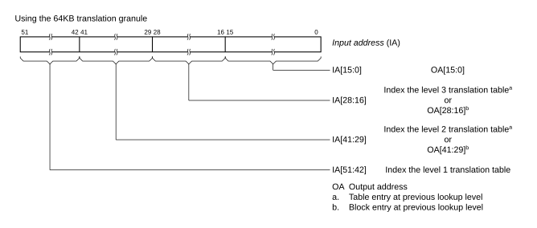
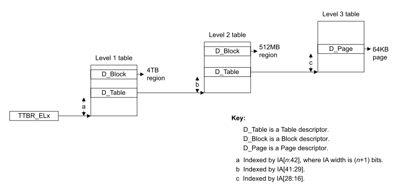
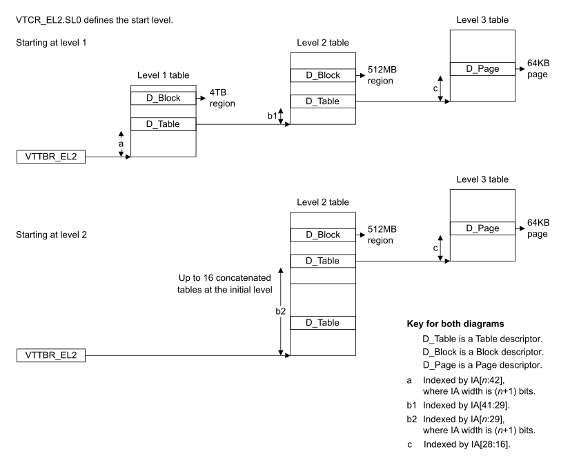

# ​D8.2.10 VMSAv8-64 translation using the 64KB granule

Source: <https://developer.arm.com/documentation/ddi0487/mc/-Part-D-The-AArch64-System-Level-Architecture/-Chapter-D8-The-AArch64-Virtual-Memory-System-Architecture/-D8-2-Translation-process/-D8-2-10-VMSAv8-64-translation-using-the-64KB-granule>

##### D8.2.10 VMSAv8-64 translation using the 64KB granule

R RGNZV
:   All statements in this section and subsections require a translation stage use the VMSAv8-64 translation system.

I VDPWL
:   Address translations that use the 64KB granule have a 64KB page size. Depending on the settings and supported features, up to 36 address bits are resolved using up to 3 lookup levels.

I LRFQD
:   For the 64KB translation granule, the maximum VA size supported by a translation regime is one of the following:

    - If [FEAT\_LVA](/documentation/ddi0487/mc/-Part-A-Arm-Architecture-Introduction-and-Overview/-Chapter-A2-A-profile-Architecture-Extensions/-A2-2-Armv8-A-architecture-extensions/-A2-2-3-The-Armv8-2-architecture-extension?lang=en#feat_feat_lva) is not implemented, then the maximum VA supported is 48 bits.
    - If [FEAT\_LVA](/documentation/ddi0487/mc/-Part-A-Arm-Architecture-Introduction-and-Overview/-Chapter-A2-A-profile-Architecture-Extensions/-A2-2-Armv8-A-architecture-extensions/-A2-2-3-The-Armv8-2-architecture-extension?lang=en#feat_feat_lva) is implemented, then the maximum VA supported is 52 bits.

I YZDPC
:   For the 64KB translation granule, the maximum PA size supported by a translation regime is one of the following:

    - If [FEAT\_LPA](/documentation/ddi0487/mc/-Part-A-Arm-Architecture-Introduction-and-Overview/-Chapter-A2-A-profile-Architecture-Extensions/-A2-2-Armv8-A-architecture-extensions/-A2-2-3-The-Armv8-2-architecture-extension?lang=en#feat_feat_lpa) is not implemented, then the maximum PA supported is 48 bits.
    - If [FEAT\_LPA](/documentation/ddi0487/mc/-Part-A-Arm-Architecture-Introduction-and-Overview/-Chapter-A2-A-profile-Architecture-Extensions/-A2-2-Armv8-A-architecture-extensions/-A2-2-3-The-Armv8-2-architecture-extension?lang=en#feat_feat_lpa) is implemented, then the maximum PA supported is 52 bits.

R NSQXP
:   For the 64KB translation granule, if [FEAT\_LPA](/documentation/ddi0487/mc/-Part-A-Arm-Architecture-Introduction-and-Overview/-Chapter-A2-A-profile-Architecture-Extensions/-A2-2-Armv8-A-architecture-extensions/-A2-2-3-The-Armv8-2-architecture-extension?lang=en#feat_feat_lpa) is not implemented, then OA[51:48] are treated as `0b0000`.

R MLLGN
:   For each lookup level supported by the 64KB translation granule, the following table describes the translation table properties at that level.

<table id="tbl_mdtbl_64kb_granule_tt_properties_lookup_level">
 <caption>
  Table D8-35 64KB granule translation table properties at each lookup level
 </caption>
 <colgroup>
  <col/>
  <col/>
  <col/>
  <col/>
  <col/>
  <col/>
 </colgroup>
 <thead>
  <tr>
   <th>
    Lookup level
   </th>
   <th>
    Index into translation table
   </th>
   <th>
    Maximum entries in table
   </th>
   <th>
    Contents of translation table entries
   </th>
   <th>
    Additional requirements for stage 1
   </th>
   <th>
    Additional requirements for stage 2
   </th>
  </tr>
 </thead>
 <tbody>
  <tr>
   <td rowspan="4">
    1
   </td>
   <td rowspan="2">
    IA[47:42]
   </td>
   <td rowspan="2">
    64
   </td>
   <td>
    Table descriptors
   </td>
   <td>
    -
   </td>
   <td>
    -
   </td>
  </tr>
  <tr>
   <td>
    Table descriptors and Block descriptors
   </td>
   <td>
    <a class="document-topic" document-topic-path="/ddi0487/mc/-Part-A-Arm-Architecture-Introduction-and-Overview/-Chapter-A2-A-profile-Architecture-Extensions/-A2-2-Armv8-A-architecture-extensions/-A2-2-3-The-Armv8-2-architecture-extension?lang=en#feat_feat_lpa" href="/documentation/ddi0487/mc/-Part-A-Arm-Architecture-Introduction-and-Overview/-Chapter-A2-A-profile-Architecture-Extensions/-A2-2-Armv8-A-architecture-extensions/-A2-2-3-The-Armv8-2-architecture-extension?lang=en#feat_feat_lpa">
     FEAT_LPA
    </a>
   </td>
   <td>
    <a class="document-topic" document-topic-path="/ddi0487/mc/-Part-A-Arm-Architecture-Introduction-and-Overview/-Chapter-A2-A-profile-Architecture-Extensions/-A2-2-Armv8-A-architecture-extensions/-A2-2-3-The-Armv8-2-architecture-extension?lang=en#feat_feat_lpa" href="/documentation/ddi0487/mc/-Part-A-Arm-Architecture-Introduction-and-Overview/-Chapter-A2-A-profile-Architecture-Extensions/-A2-2-Armv8-A-architecture-extensions/-A2-2-3-The-Armv8-2-architecture-extension?lang=en#feat_feat_lpa">
     FEAT_LPA
    </a>
   </td>
  </tr>
  <tr>
   <td rowspan="2">
    IA[51:42]
   </td>
   <td rowspan="2">
    1024
   </td>
   <td>
    Table descriptors
   </td>
   <td>
    <a class="document-topic" document-topic-path="/ddi0487/mc/-Part-A-Arm-Architecture-Introduction-and-Overview/-Chapter-A2-A-profile-Architecture-Extensions/-A2-2-Armv8-A-architecture-extensions/-A2-2-3-The-Armv8-2-architecture-extension?lang=en#feat_feat_lva" href="/documentation/ddi0487/mc/-Part-A-Arm-Architecture-Introduction-and-Overview/-Chapter-A2-A-profile-Architecture-Extensions/-A2-2-Armv8-A-architecture-extensions/-A2-2-3-The-Armv8-2-architecture-extension?lang=en#feat_feat_lva">
     FEAT_LVA
    </a>
   </td>
   <td>
    -
   </td>
  </tr>
  <tr>
   <td>
    Table descriptors and Block descriptors
   </td>
   <td>
    <a class="document-topic" document-topic-path="/ddi0487/mc/-Part-A-Arm-Architecture-Introduction-and-Overview/-Chapter-A2-A-profile-Architecture-Extensions/-A2-2-Armv8-A-architecture-extensions/-A2-2-3-The-Armv8-2-architecture-extension?lang=en#feat_feat_lva" href="/documentation/ddi0487/mc/-Part-A-Arm-Architecture-Introduction-and-Overview/-Chapter-A2-A-profile-Architecture-Extensions/-A2-2-Armv8-A-architecture-extensions/-A2-2-3-The-Armv8-2-architecture-extension?lang=en#feat_feat_lva">
     FEAT_LVA
    </a>
    ,
    <a class="document-topic" document-topic-path="/ddi0487/mc/-Part-A-Arm-Architecture-Introduction-and-Overview/-Chapter-A2-A-profile-Architecture-Extensions/-A2-2-Armv8-A-architecture-extensions/-A2-2-3-The-Armv8-2-architecture-extension?lang=en#feat_feat_lpa" href="/documentation/ddi0487/mc/-Part-A-Arm-Architecture-Introduction-and-Overview/-Chapter-A2-A-profile-Architecture-Extensions/-A2-2-Armv8-A-architecture-extensions/-A2-2-3-The-Armv8-2-architecture-extension?lang=en#feat_feat_lpa">
     FEAT_LPA
    </a>
   </td>
   <td>
    <a class="document-topic" document-topic-path="/ddi0487/mc/-Part-A-Arm-Architecture-Introduction-and-Overview/-Chapter-A2-A-profile-Architecture-Extensions/-A2-2-Armv8-A-architecture-extensions/-A2-2-3-The-Armv8-2-architecture-extension?lang=en#feat_feat_lpa" href="/documentation/ddi0487/mc/-Part-A-Arm-Architecture-Introduction-and-Overview/-Chapter-A2-A-profile-Architecture-Extensions/-A2-2-Armv8-A-architecture-extensions/-A2-2-3-The-Armv8-2-architecture-extension?lang=en#feat_feat_lpa">
     FEAT_LPA
    </a>
   </td>
  </tr>
  <tr>
   <td>
    2
   </td>
   <td>
    IA[41:29]
   </td>
   <td>
    8192
   </td>
   <td>
    Table descriptors and Block descriptors
   </td>
   <td>
    -
   </td>
   <td>
    -
   </td>
  </tr>
  <tr>
   <td>
    3
   </td>
   <td>
    IA[28:16]
   </td>
   <td>
    8192
   </td>
   <td>
    Page descriptors
   </td>
   <td>
    -
   </td>
   <td>
    -
   </td>
  </tr>
 </tbody>
</table>

R ZWQBH
:   For the 64KB translation granule, a translation resolved by a Page descriptor at lookup level 3 has all of the following properties:

    - The page size is 64KB.
    - For stage 1, the translation can resolve a page using one of the following maximum address ranges:

      - If [FEAT\_LVA](/documentation/ddi0487/mc/-Part-A-Arm-Architecture-Introduction-and-Overview/-Chapter-A2-A-profile-Architecture-Extensions/-A2-2-Armv8-A-architecture-extensions/-A2-2-3-The-Armv8-2-architecture-extension?lang=en#feat_feat_lva) is not implemented, then IA[47:16].
      - If [FEAT\_LVA](/documentation/ddi0487/mc/-Part-A-Arm-Architecture-Introduction-and-Overview/-Chapter-A2-A-profile-Architecture-Extensions/-A2-2-Armv8-A-architecture-extensions/-A2-2-3-The-Armv8-2-architecture-extension?lang=en#feat_feat_lva) is implemented, then IA[51:16].
    - For stage 2, the translation can resolve a page using one of the following maximum address ranges:

      - If [FEAT\_LPA](/documentation/ddi0487/mc/-Part-A-Arm-Architecture-Introduction-and-Overview/-Chapter-A2-A-profile-Architecture-Extensions/-A2-2-Armv8-A-architecture-extensions/-A2-2-3-The-Armv8-2-architecture-extension?lang=en#feat_feat_lpa) is not implemented, then IA[47:16].
      - If [FEAT\_LPA](/documentation/ddi0487/mc/-Part-A-Arm-Architecture-Introduction-and-Overview/-Chapter-A2-A-profile-Architecture-Extensions/-A2-2-Armv8-A-architecture-extensions/-A2-2-3-The-Armv8-2-architecture-extension?lang=en#feat_feat_lpa) is implemented, then IA[51:16].
    - For stage 1 and stage 2, the page is addressed by one of the following:

      - If [FEAT\_LPA](/documentation/ddi0487/mc/-Part-A-Arm-Architecture-Introduction-and-Overview/-Chapter-A2-A-profile-Architecture-Extensions/-A2-2-Armv8-A-architecture-extensions/-A2-2-3-The-Armv8-2-architecture-extension?lang=en#feat_feat_lpa) is not implemented, then OA[47:16].
      - If [FEAT\_LPA](/documentation/ddi0487/mc/-Part-A-Arm-Architecture-Introduction-and-Overview/-Chapter-A2-A-profile-Architecture-Extensions/-A2-2-Armv8-A-architecture-extensions/-A2-2-3-The-Armv8-2-architecture-extension?lang=en#feat_feat_lpa) is implemented, then OA[51:16].
    - IA[15:0] is mapped directly to OA[15:0].

R RBNGS
:   For the 64KB translation granule, a translation resolved by a Block descriptor at the specified lookup level has all of the properties shown in the following table:

<table id="tbl_mdtbl_64kb_granule_bd_properties_lookup_level">
 <caption>
  Table D8-36 64KB granule block descriptor properties at each lookup level
 </caption>
 <colgroup>
  <col/>
  <col/>
  <col/>
  <col/>
  <col/>
  <col/>
 </colgroup>
 <thead>
  <tr>
   <th>
    Lookup level
   </th>
   <th>
    Size of memory region addressed by Block descriptor
   </th>
   <th>
    Bit range that is direct mapped from IA to OA
   </th>
   <th>
    IA bit range that selects Block descriptor
   </th>
   <th>
    Additional requirements for stage 1
   </th>
   <th>
    Additional requirements for stage 2
   </th>
  </tr>
 </thead>
 <tbody>
  <tr>
   <td rowspan="2">
    1
   </td>
   <td rowspan="2">
    4TB
   </td>
   <td rowspan="2">
    IA[41:0] maps to OA[41:0]
   </td>
   <td>
    IA[47:42]
   </td>
   <td>
    <a class="document-topic" document-topic-path="/ddi0487/mc/-Part-A-Arm-Architecture-Introduction-and-Overview/-Chapter-A2-A-profile-Architecture-Extensions/-A2-2-Armv8-A-architecture-extensions/-A2-2-3-The-Armv8-2-architecture-extension?lang=en#feat_feat_lpa" href="/documentation/ddi0487/mc/-Part-A-Arm-Architecture-Introduction-and-Overview/-Chapter-A2-A-profile-Architecture-Extensions/-A2-2-Armv8-A-architecture-extensions/-A2-2-3-The-Armv8-2-architecture-extension?lang=en#feat_feat_lpa">
     FEAT_LPA
    </a>
   </td>
   <td>
    <a class="document-topic" document-topic-path="/ddi0487/mc/-Part-A-Arm-Architecture-Introduction-and-Overview/-Chapter-A2-A-profile-Architecture-Extensions/-A2-2-Armv8-A-architecture-extensions/-A2-2-3-The-Armv8-2-architecture-extension?lang=en#feat_feat_lpa" href="/documentation/ddi0487/mc/-Part-A-Arm-Architecture-Introduction-and-Overview/-Chapter-A2-A-profile-Architecture-Extensions/-A2-2-Armv8-A-architecture-extensions/-A2-2-3-The-Armv8-2-architecture-extension?lang=en#feat_feat_lpa">
     FEAT_LPA
    </a>
   </td>
  </tr>
  <tr>
   <td>
    IA[51:42]
   </td>
   <td>
    <a class="document-topic" document-topic-path="/ddi0487/mc/-Part-A-Arm-Architecture-Introduction-and-Overview/-Chapter-A2-A-profile-Architecture-Extensions/-A2-2-Armv8-A-architecture-extensions/-A2-2-3-The-Armv8-2-architecture-extension?lang=en#feat_feat_lva" href="/documentation/ddi0487/mc/-Part-A-Arm-Architecture-Introduction-and-Overview/-Chapter-A2-A-profile-Architecture-Extensions/-A2-2-Armv8-A-architecture-extensions/-A2-2-3-The-Armv8-2-architecture-extension?lang=en#feat_feat_lva">
     FEAT_LVA
    </a>
    ,
    <a class="document-topic" document-topic-path="/ddi0487/mc/-Part-A-Arm-Architecture-Introduction-and-Overview/-Chapter-A2-A-profile-Architecture-Extensions/-A2-2-Armv8-A-architecture-extensions/-A2-2-3-The-Armv8-2-architecture-extension?lang=en#feat_feat_lpa" href="/documentation/ddi0487/mc/-Part-A-Arm-Architecture-Introduction-and-Overview/-Chapter-A2-A-profile-Architecture-Extensions/-A2-2-Armv8-A-architecture-extensions/-A2-2-3-The-Armv8-2-architecture-extension?lang=en#feat_feat_lpa">
     FEAT_LPA
    </a>
   </td>
   <td>
    <a class="document-topic" document-topic-path="/ddi0487/mc/-Part-A-Arm-Architecture-Introduction-and-Overview/-Chapter-A2-A-profile-Architecture-Extensions/-A2-2-Armv8-A-architecture-extensions/-A2-2-3-The-Armv8-2-architecture-extension?lang=en#feat_feat_lpa" href="/documentation/ddi0487/mc/-Part-A-Arm-Architecture-Introduction-and-Overview/-Chapter-A2-A-profile-Architecture-Extensions/-A2-2-Armv8-A-architecture-extensions/-A2-2-3-The-Armv8-2-architecture-extension?lang=en#feat_feat_lpa">
     FEAT_LPA
    </a>
   </td>
  </tr>
  <tr>
   <td rowspan="2">
    2
   </td>
   <td rowspan="2">
    512MB
   </td>
   <td rowspan="2">
    IA[28:0] maps to OA[28:0]
   </td>
   <td>
    IA[47:29]
   </td>
   <td>
    -
   </td>
   <td>
    -
   </td>
  </tr>
  <tr>
   <td>
    IA[51:29]
   </td>
   <td>
    <a class="document-topic" document-topic-path="/ddi0487/mc/-Part-A-Arm-Architecture-Introduction-and-Overview/-Chapter-A2-A-profile-Architecture-Extensions/-A2-2-Armv8-A-architecture-extensions/-A2-2-3-The-Armv8-2-architecture-extension?lang=en#feat_feat_lva" href="/documentation/ddi0487/mc/-Part-A-Arm-Architecture-Introduction-and-Overview/-Chapter-A2-A-profile-Architecture-Extensions/-A2-2-Armv8-A-architecture-extensions/-A2-2-3-The-Armv8-2-architecture-extension?lang=en#feat_feat_lva">
     FEAT_LVA
    </a>
   </td>
   <td>
    <a class="document-topic" document-topic-path="/ddi0487/mc/-Part-A-Arm-Architecture-Introduction-and-Overview/-Chapter-A2-A-profile-Architecture-Extensions/-A2-2-Armv8-A-architecture-extensions/-A2-2-3-The-Armv8-2-architecture-extension?lang=en#feat_feat_lpa" href="/documentation/ddi0487/mc/-Part-A-Arm-Architecture-Introduction-and-Overview/-Chapter-A2-A-profile-Architecture-Extensions/-A2-2-Armv8-A-architecture-extensions/-A2-2-3-The-Armv8-2-architecture-extension?lang=en#feat_feat_lpa">
     FEAT_LPA
    </a>
   </td>
  </tr>
 </tbody>
</table>

I TVDSK
:   For the 64KB translation granule, the following figure shows how the maximum 52-bit IA size is resolved. For a stage 1 translation, an IA larger than 48 bits requires the implementation of [FEAT\_LVA](/documentation/ddi0487/mc/-Part-A-Arm-Architecture-Introduction-and-Overview/-Chapter-A2-A-profile-Architecture-Extensions/-A2-2-Armv8-A-architecture-extensions/-A2-2-3-The-Armv8-2-architecture-extension?lang=en#feat_feat_lva). For a stage 2 translation, an IA larger than 48 bits requires the implementation of [FEAT\_LPA](/documentation/ddi0487/mc/-Part-A-Arm-Architecture-Introduction-and-Overview/-Chapter-A2-A-profile-Architecture-Extensions/-A2-2-Armv8-A-architecture-extensions/-A2-2-3-The-Armv8-2-architecture-extension?lang=en#feat_feat_lpa).

    Figure D8-9 52-bit IA resolved using 64KB translation granule

    

###### D8.2.10.1 VMSAv8-64 Stage 1 address translation using the 64KB translation granule

R FMBKV
:   For the 64KB translation granule, when a stage 1 translation table walk is started, the initial lookup level is determined by the value of the [TCR\_ELx](/documentation/ddi0487/mc/-Part-K-Appendixes/-Appendix-K14-Registers-Index/-K14-1-Introduction-and-register-disambiguation/-K14-1-2-Register-name-disambiguation-by-Exception-level?lang=en#tcr_elx).T*n*SZ field as shown in the following table:

<table id="tbl_mdtbl_64kb_granule_determining_s1_initial_lookup_level">
 <caption>
  Table D8-37 64KB granule, determining stage 1 initial lookup level
 </caption>
 <colgroup>
  <col/>
  <col/>
  <col/>
  <col/>
  <col/>
  <col/>
 </colgroup>
 <thead>
  <tr>
   <th>
    Initial lookup level
   </th>
   <th>
    T
    <em>
     n
    </em>
    SZ minimum value
   </th>
   <th>
    Maximum IA bits resolved
   </th>
   <th>
    T
    <em>
     n
    </em>
    SZ maximum value
   </th>
   <th>
    Minimum IA bits resolved
   </th>
   <th>
    Additional requirements
   </th>
  </tr>
 </thead>
 <tbody>
  <tr>
   <td>
    1
   </td>
   <td>
    12
   </td>
   <td>
    IA[51:16]
   </td>
   <td>
    15
   </td>
   <td>
    IA[48:16]
   </td>
   <td>
    <a class="document-topic" document-topic-path="/ddi0487/mc/-Part-A-Arm-Architecture-Introduction-and-Overview/-Chapter-A2-A-profile-Architecture-Extensions/-A2-2-Armv8-A-architecture-extensions/-A2-2-3-The-Armv8-2-architecture-extension?lang=en#feat_feat_lva" href="/documentation/ddi0487/mc/-Part-A-Arm-Architecture-Introduction-and-Overview/-Chapter-A2-A-profile-Architecture-Extensions/-A2-2-Armv8-A-architecture-extensions/-A2-2-3-The-Armv8-2-architecture-extension?lang=en#feat_feat_lva">
     FEAT_LVA
    </a>
    is implemented
   </td>
  </tr>
  <tr>
   <td>
    1
   </td>
   <td>
    16
   </td>
   <td>
    IA[47:16]
   </td>
   <td>
    21
   </td>
   <td>
    IA[42:16]
   </td>
   <td>
    -
   </td>
  </tr>
  <tr>
   <td>
    2
   </td>
   <td>
    22
   </td>
   <td>
    IA[41:16]
   </td>
   <td>
    34
   </td>
   <td>
    IA[29:16]
   </td>
   <td>
    -
   </td>
  </tr>
  <tr>
   <td>
    3
   </td>
   <td>
    35
   </td>
   <td>
    IA[28:16]
   </td>
   <td>
    39
   </td>
   <td>
    IA[24:16]
   </td>
   <td>
    -
   </td>
  </tr>
  <tr>
   <td>
    3
   </td>
   <td>
    40
   </td>
   <td>
    IA[23:16]
   </td>
   <td>
    47
   </td>
   <td>
    IA[16:16]
   </td>
   <td>
    <a class="document-topic" document-topic-path="/ddi0487/mc/-Part-A-Arm-Architecture-Introduction-and-Overview/-Chapter-A2-A-profile-Architecture-Extensions/-A2-2-Armv8-A-architecture-extensions/-A2-2-5-The-Armv8-4-architecture-extension?lang=en#feat_feat_ttst" href="/documentation/ddi0487/mc/-Part-A-Arm-Architecture-Introduction-and-Overview/-Chapter-A2-A-profile-Architecture-Extensions/-A2-2-Armv8-A-architecture-extensions/-A2-2-5-The-Armv8-4-architecture-extension?lang=en#feat_feat_ttst">
     FEAT_TTST
    </a>
    is implemented
   </td>
  </tr>
 </tbody>
</table>

I FQFFW
:   For a stage 1 translation in the 64KB translation granule, depending on the IA size, the initial lookup level is indexed by up to 13 bits and all remaining lookup levels are indexed by exactly 13 bits.

I MRDWZ
:   For the 64KB translation granule and a 52-bit IA, the following figure is a generalized view of a stage 1 address translation. An IA larger than 48 bits requires implementation of [FEAT\_LVA](/documentation/ddi0487/mc/-Part-A-Arm-Architecture-Introduction-and-Overview/-Chapter-A2-A-profile-Architecture-Extensions/-A2-2-Armv8-A-architecture-extensions/-A2-2-3-The-Armv8-2-architecture-extension?lang=en#feat_feat_lva), and an OA larger than 48 bits requires implementation of [FEAT\_LPA](/documentation/ddi0487/mc/-Part-A-Arm-Architecture-Introduction-and-Overview/-Chapter-A2-A-profile-Architecture-Extensions/-A2-2-Armv8-A-architecture-extensions/-A2-2-3-The-Armv8-2-architecture-extension?lang=en#feat_feat_lpa). The 4TB block size requires implementation of [FEAT\_LPA](/documentation/ddi0487/mc/-Part-A-Arm-Architecture-Introduction-and-Overview/-Chapter-A2-A-profile-Architecture-Extensions/-A2-2-Armv8-A-architecture-extensions/-A2-2-3-The-Armv8-2-architecture-extension?lang=en#feat_feat_lpa).

    Figure D8-10 Generalized view of a stage 1 address translation using the 64KB granule

    

###### D8.2.10.2 VMSAv8-64 Stage 2 address translation using the 64KB translation granule

I HHFJP
:   For the 64KB translation granule, when a stage 2 translation table walk is started, the initial lookup level is determined by the corresponding [VTCR\_EL2](/documentation/ddi0487/mc/-Part-D-The-AArch64-System-Level-Architecture/-Chapter-D24-AArch64-System-Register-Descriptions/-D24-2-General-system-control-registers/-D24-2-223-VTCR-EL2--Virtualization-Translation-Control-Register?lang=en#reg_aarch64_vtcr_el2).SL0 or [VSTCR\_EL2](/documentation/ddi0487/mc/-Part-D-The-AArch64-System-Level-Architecture/-Chapter-D24-AArch64-System-Register-Descriptions/-D24-2-General-system-control-registers/-D24-2-221-VSTCR-EL2--Virtualization-Secure-Translation-Control-Register?lang=en#reg_aarch64_vstcr_el2).SL0 value.

I VLBLQ
:   For the 64KB translation granule, when a stage 2 translation table walk is started, the following table shows the initial lookup level determined by SL0:

<table id="tbl_mdtbl_64kb_granule_determining_s2_initial_lookup_level">
 <caption>
  Table D8-38 64KB granule, determining stage 2 initial lookup level
 </caption>
 <colgroup>
  <col/>
  <col/>
 </colgroup>
 <thead>
  <tr>
   <th>
    SL0
   </th>
   <th>
    Initial lookup level
   </th>
  </tr>
 </thead>
 <tbody>
  <tr>
   <td>
    <code>
     0b00
    </code>
   </td>
   <td>
    Level 3
   </td>
  </tr>
  <tr>
   <td>
    <code>
     0b01
    </code>
   </td>
   <td>
    Level 2
   </td>
  </tr>
  <tr>
   <td>
    <code>
     0b10
    </code>
   </td>
   <td>
    Level 1
   </td>
  </tr>
  <tr>
   <td>
    <code>
     0b11
    </code>
   </td>
   <td>
    Reserved
   </td>
  </tr>
 </tbody>
</table>

R QCSFP
:   For the 64KB translation granule, when a stage 2 translation table walk is started and the initial lookup level is 1, the following table shows all of the permitted concatenated translation table configurations and the corresponding [VTCR\_EL2](/documentation/ddi0487/mc/-Part-D-The-AArch64-System-Level-Architecture/-Chapter-D24-AArch64-System-Register-Descriptions/-D24-2-General-system-control-registers/-D24-2-223-VTCR-EL2--Virtualization-Translation-Control-Register?lang=en#reg_aarch64_vtcr_el2).T0SZ or [VSTCR\_EL2](/documentation/ddi0487/mc/-Part-D-The-AArch64-System-Level-Architecture/-Chapter-D24-AArch64-System-Register-Descriptions/-D24-2-General-system-control-registers/-D24-2-221-VSTCR-EL2--Virtualization-Secure-Translation-Control-Register?lang=en#reg_aarch64_vstcr_el2).T0SZ value:

<table id="tbl_mdtbl_64kb_granule_s2_initial_lookup_level_1">
 <caption>
  Table D8-39 64KB granule, stage 2 initial lookup at level 1
 </caption>
 <colgroup>
  <col/>
  <col/>
  <col/>
  <col/>
 </colgroup>
 <thead>
  <tr>
   <th>
    Number of concatenated translation tables
   </th>
   <th>
    IA bits resolved
   </th>
   <th>
    T0SZ
   </th>
   <th>
    Additional requirements
   </th>
  </tr>
 </thead>
 <tbody>
  <tr>
   <td>
    None (1 table)
   </td>
   <td>
    IA[51:16]-IA[48:16]
   </td>
   <td>
    12-15
   </td>
   <td>
    <a class="document-topic" document-topic-path="/ddi0487/mc/-Part-A-Arm-Architecture-Introduction-and-Overview/-Chapter-A2-A-profile-Architecture-Extensions/-A2-2-Armv8-A-architecture-extensions/-A2-2-3-The-Armv8-2-architecture-extension?lang=en#feat_feat_lpa" href="/documentation/ddi0487/mc/-Part-A-Arm-Architecture-Introduction-and-Overview/-Chapter-A2-A-profile-Architecture-Extensions/-A2-2-Armv8-A-architecture-extensions/-A2-2-3-The-Armv8-2-architecture-extension?lang=en#feat_feat_lpa">
     FEAT_LPA
    </a>
    is implemented
   </td>
  </tr>
  <tr>
   <td>
    None (1 table)
   </td>
   <td>
    IA[47:16]-IA[42:16]
   </td>
   <td>
    16-21
   </td>
   <td>
    -
   </td>
  </tr>
 </tbody>
</table>

R WHSBD
:   For the 64KB translation granule, when a stage 2 translation table walk is started and the initial lookup level is 2, the following table shows all of the permitted concatenated translation table configurations and the corresponding [VTCR\_EL2](/documentation/ddi0487/mc/-Part-D-The-AArch64-System-Level-Architecture/-Chapter-D24-AArch64-System-Register-Descriptions/-D24-2-General-system-control-registers/-D24-2-223-VTCR-EL2--Virtualization-Translation-Control-Register?lang=en#reg_aarch64_vtcr_el2).T0SZ or [VSTCR\_EL2](/documentation/ddi0487/mc/-Part-D-The-AArch64-System-Level-Architecture/-Chapter-D24-AArch64-System-Register-Descriptions/-D24-2-General-system-control-registers/-D24-2-221-VSTCR-EL2--Virtualization-Secure-Translation-Control-Register?lang=en#reg_aarch64_vstcr_el2).T0SZ value:

<table id="tbl_mdtbl_64kb_granule_s2_initial_lookup_level_2">
 <caption>
  Table D8-40 64KB granule, stage 2 initial lookup at level 2
 </caption>
 <colgroup>
  <col/>
  <col/>
  <col/>
  <col/>
 </colgroup>
 <thead>
  <tr>
   <th>
    Number of concatenated translation tables
   </th>
   <th>
    IA bits resolved
   </th>
   <th>
    T0SZ
   </th>
   <th>
    Additional requirements
   </th>
  </tr>
 </thead>
 <tbody>
  <tr>
   <td>
    None (1 table)
   </td>
   <td>
    IA[41:16]-IA[29:16]
   </td>
   <td>
    22-34
   </td>
   <td>
    -
   </td>
  </tr>
  <tr>
   <td>
    2
   </td>
   <td>
    IA[42:16]
   </td>
   <td>
    21
   </td>
   <td>
    -
   </td>
  </tr>
  <tr>
   <td>
    4
   </td>
   <td>
    IA[43:16]
   </td>
   <td>
    20
   </td>
   <td>
    -
   </td>
  </tr>
  <tr>
   <td>
    8
   </td>
   <td>
    IA[44:16]
   </td>
   <td>
    19
   </td>
   <td>
    -
   </td>
  </tr>
  <tr>
   <td>
    16
   </td>
   <td>
    IA[45:16]
   </td>
   <td>
    18
   </td>
   <td>
    -
   </td>
  </tr>
 </tbody>
</table>

R PLLHG
:   For the 64KB translation granule, when a stage 2 translation table walk is started and the initial lookup level is 3, the following table shows all of the permitted concatenated translation table configurations and the corresponding [VTCR\_EL2](/documentation/ddi0487/mc/-Part-D-The-AArch64-System-Level-Architecture/-Chapter-D24-AArch64-System-Register-Descriptions/-D24-2-General-system-control-registers/-D24-2-223-VTCR-EL2--Virtualization-Translation-Control-Register?lang=en#reg_aarch64_vtcr_el2).T0SZ or [VSTCR\_EL2](/documentation/ddi0487/mc/-Part-D-The-AArch64-System-Level-Architecture/-Chapter-D24-AArch64-System-Register-Descriptions/-D24-2-General-system-control-registers/-D24-2-221-VSTCR-EL2--Virtualization-Secure-Translation-Control-Register?lang=en#reg_aarch64_vstcr_el2).T0SZ value:

<table id="tbl_mdtbl_64kb_granule_s2_initial_lookup_level_3">
 <caption>
  Table D8-41 64KB granule, stage 2 initial lookup at level 3
 </caption>
 <colgroup>
  <col/>
  <col/>
  <col/>
  <col/>
 </colgroup>
 <thead>
  <tr>
   <th>
    Number of concatenated translation tables
   </th>
   <th>
    IA bits resolved
   </th>
   <th>
    T0SZ
   </th>
   <th>
    Additional requirements
   </th>
  </tr>
 </thead>
 <tbody>
  <tr>
   <td>
    None (1 table)
   </td>
   <td>
    IA[23:16]-IA[16:16]
   </td>
   <td>
    40-47
   </td>
   <td>
    <a class="document-topic" document-topic-path="/ddi0487/mc/-Part-A-Arm-Architecture-Introduction-and-Overview/-Chapter-A2-A-profile-Architecture-Extensions/-A2-2-Armv8-A-architecture-extensions/-A2-2-5-The-Armv8-4-architecture-extension?lang=en#feat_feat_ttst" href="/documentation/ddi0487/mc/-Part-A-Arm-Architecture-Introduction-and-Overview/-Chapter-A2-A-profile-Architecture-Extensions/-A2-2-Armv8-A-architecture-extensions/-A2-2-5-The-Armv8-4-architecture-extension?lang=en#feat_feat_ttst">
     FEAT_TTST
    </a>
    is implemented
   </td>
  </tr>
  <tr>
   <td>
    None (1 table)
   </td>
   <td>
    IA[28:16]-IA[24:16]
   </td>
   <td>
    35-39
   </td>
   <td>
    -
   </td>
  </tr>
  <tr>
   <td>
    2
   </td>
   <td>
    IA[29:16]
   </td>
   <td>
    34
   </td>
   <td>
    -
   </td>
  </tr>
  <tr>
   <td>
    4
   </td>
   <td>
    IA[30:16]
   </td>
   <td>
    33
   </td>
   <td>
    -
   </td>
  </tr>
  <tr>
   <td>
    8
   </td>
   <td>
    IA[31:16]
   </td>
   <td>
    32
   </td>
   <td>
    -
   </td>
  </tr>
  <tr>
   <td>
    16
   </td>
   <td>
    IA[32:16]
   </td>
   <td>
    31
   </td>
   <td>
    -
   </td>
  </tr>
 </tbody>
</table>

I SYRCT
:   For the 64KB translation granule and a 52-bit IA, the following figure is a generalized view of a stage 2 address translation. An IA larger than 48 bits requires the implementation of [FEAT\_LPA](/documentation/ddi0487/mc/-Part-A-Arm-Architecture-Introduction-and-Overview/-Chapter-A2-A-profile-Architecture-Extensions/-A2-2-Armv8-A-architecture-extensions/-A2-2-3-The-Armv8-2-architecture-extension?lang=en#feat_feat_lpa). The 4TB block size requires implementation of [FEAT\_LPA](/documentation/ddi0487/mc/-Part-A-Arm-Architecture-Introduction-and-Overview/-Chapter-A2-A-profile-Architecture-Extensions/-A2-2-Armv8-A-architecture-extensions/-A2-2-3-The-Armv8-2-architecture-extension?lang=en#feat_feat_lpa).

    Figure D8-11 Generalized view of a stage 2 address translation using the 64KB granule

    

R SGCBS
:   For the 64KB translation granule, when a stage 2 translation table walk is started and one of the following is true, a stage 2 level 0 Translation fault is generated:

    - The [VTCR\_EL2](/documentation/ddi0487/mc/-Part-D-The-AArch64-System-Level-Architecture/-Chapter-D24-AArch64-System-Register-Descriptions/-D24-2-General-system-control-registers/-D24-2-223-VTCR-EL2--Virtualization-Translation-Control-Register?lang=en#reg_aarch64_vtcr_el2).T0SZ or [VSTCR\_EL2](/documentation/ddi0487/mc/-Part-D-The-AArch64-System-Level-Architecture/-Chapter-D24-AArch64-System-Register-Descriptions/-D24-2-General-system-control-registers/-D24-2-221-VSTCR-EL2--Virtualization-Secure-Translation-Control-Register?lang=en#reg_aarch64_vstcr_el2).T0SZ value is not consistent with the corresponding [VTCR\_EL2](/documentation/ddi0487/mc/-Part-D-The-AArch64-System-Level-Architecture/-Chapter-D24-AArch64-System-Register-Descriptions/-D24-2-General-system-control-registers/-D24-2-223-VTCR-EL2--Virtualization-Translation-Control-Register?lang=en#reg_aarch64_vtcr_el2).SL0 or [VSTCR\_EL2](/documentation/ddi0487/mc/-Part-D-The-AArch64-System-Level-Architecture/-Chapter-D24-AArch64-System-Register-Descriptions/-D24-2-General-system-control-registers/-D24-2-221-VSTCR-EL2--Virtualization-Secure-Translation-Control-Register?lang=en#reg_aarch64_vstcr_el2).SL0 value.
    - [VTCR\_EL2](/documentation/ddi0487/mc/-Part-D-The-AArch64-System-Level-Architecture/-Chapter-D24-AArch64-System-Register-Descriptions/-D24-2-General-system-control-registers/-D24-2-223-VTCR-EL2--Virtualization-Translation-Control-Register?lang=en#reg_aarch64_vtcr_el2).SL0 or [VSTCR\_EL2](/documentation/ddi0487/mc/-Part-D-The-AArch64-System-Level-Architecture/-Chapter-D24-AArch64-System-Register-Descriptions/-D24-2-General-system-control-registers/-D24-2-221-VSTCR-EL2--Virtualization-Secure-Translation-Control-Register?lang=en#reg_aarch64_vstcr_el2).SL0 is programmed to a reserved value.

I DKRJG
:   For more information, see [Concatenated translation tables](/documentation/ddi0487/mc/-Part-D-The-AArch64-System-Level-Architecture/-Chapter-D8-The-AArch64-Virtual-Memory-System-Architecture/-D8-2-Translation-process/-D8-2-2-Concatenated-translation-tables?lang=en#mdsec_concatenated_translation_tables).

###### D8.2.10.3 Finding the descriptor when using the VMSAv8-64 64KB translation granule

R LMDCR
:   For the 64KB translation granule, the following table shows the algorithm to find the descriptor address at each supported lookup level, using of all of the following information:

    - The translation table base address, *BaseAddr*.
    - The number of bits in the supported PA size, *PAsize*.
    - The IA supplied to the translation stage and used as an index into the translation table.
    - For each initial lookup level, the permitted range of values for [TCR\_ELx](/documentation/ddi0487/mc/-Part-K-Appendixes/-Appendix-K14-Registers-Index/-K14-1-Introduction-and-register-disambiguation/-K14-1-2-Register-name-disambiguation-by-Exception-level?lang=en#tcr_elx).T*n*SZ.
    - For a stage 2 translation, all of the following:

      - The value of [VTCR\_EL2](/documentation/ddi0487/mc/-Part-D-The-AArch64-System-Level-Architecture/-Chapter-D24-AArch64-System-Register-Descriptions/-D24-2-General-system-control-registers/-D24-2-223-VTCR-EL2--Virtualization-Translation-Control-Register?lang=en#reg_aarch64_vtcr_el2).T0SZ or [VSTCR\_EL2](/documentation/ddi0487/mc/-Part-D-The-AArch64-System-Level-Architecture/-Chapter-D24-AArch64-System-Register-Descriptions/-D24-2-General-system-control-registers/-D24-2-221-VSTCR-EL2--Virtualization-Secure-Translation-Control-Register?lang=en#reg_aarch64_vstcr_el2).T0SZ.
      - The value of [VTCR\_EL2](/documentation/ddi0487/mc/-Part-D-The-AArch64-System-Level-Architecture/-Chapter-D24-AArch64-System-Register-Descriptions/-D24-2-General-system-control-registers/-D24-2-223-VTCR-EL2--Virtualization-Translation-Control-Register?lang=en#reg_aarch64_vtcr_el2).SL0 or [VSTCR\_EL2](/documentation/ddi0487/mc/-Part-D-The-AArch64-System-Level-Architecture/-Chapter-D24-AArch64-System-Register-Descriptions/-D24-2-General-system-control-registers/-D24-2-221-VSTCR-EL2--Virtualization-Secure-Translation-Control-Register?lang=en#reg_aarch64_vstcr_el2).SL0.

<table id="tbl_mdtbl_64kb_granule_finding_descriptor_address">
 <caption>
  Table D8-42 64KB granule, finding the descriptor address
 </caption>
 <colgroup>
  <col/>
  <col/>
  <col/>
 </colgroup>
 <thead>
  <tr>
   <th>
    Lookup level
   </th>
   <th>
    Stage 1 translation table descriptor address
   </th>
   <th>
    Stage 2 translation table descriptor address
   </th>
  </tr>
 </thead>
 <tbody>
  <tr>
   <td>
    1
   </td>
   <td>
    if 12 &lt;= T
    <em>
     n
    </em>
    SZ &lt;= 21 &nbsp;&nbsp;then
    <em>
     x
    </em>
    = (25 - T
    <em>
     n
    </em>
    SZ) BaseAddr[PAsize-1:
    <em>
     x
    </em>
    ]:IA[
    <em>
     x
    </em>
    +38:42]:
    <code>
     0b000
    </code>
   </td>
   <td>
    if SL0==2 &nbsp;&nbsp;then if 12 &lt;= T0SZ &lt;= 21 &nbsp;&nbsp;&nbsp;&nbsp;then
    <em>
     x
    </em>
    = (25 - T0SZ) BaseAddr[PAsize-1:
    <em>
     x
    </em>
    ]:IA[
    <em>
     x
    </em>
    +38:42]:
    <code>
     0b000
    </code>
   </td>
  </tr>
  <tr>
   <td>
    2
   </td>
   <td>
    if 22 &lt;= T
    <em>
     n
    </em>
    SZ &lt;= 34 &nbsp;&nbsp;then
    <em>
     x
    </em>
    = (38 - T
    <em>
     n
    </em>
    SZ) else
    <em>
     x
    </em>
    = 16 BaseAddr[PAsize-1:
    <em>
     x
    </em>
    ]:IA[
    <em>
     x
    </em>
    +25:29]:
    <code>
     0b000
    </code>
   </td>
   <td>
    if SL0==1 &nbsp;&nbsp;then if 18 &lt;= T0SZ &lt;= 34 &nbsp;&nbsp;&nbsp;&nbsp;then
    <em>
     x
    </em>
    = (38 - T0SZ) else
    <em>
     x
    </em>
    = 16 BaseAddr[PAsize-1:
    <em>
     x
    </em>
    ]:IA[
    <em>
     x
    </em>
    +25:29]:
    <code>
     0b000
    </code>
   </td>
  </tr>
  <tr>
   <td>
    3
   </td>
   <td>
    if 35 &lt;= T
    <em>
     n
    </em>
    SZ &lt;= 47 &nbsp;&nbsp;then
    <em>
     x
    </em>
    = (51 - T
    <em>
     n
    </em>
    SZ) else
    <em>
     x
    </em>
    = 16 BaseAddr[PAsize-1:
    <em>
     x
    </em>
    ]:IA[
    <em>
     x
    </em>
    +12:16]:
    <code>
     0b000
    </code>
   </td>
   <td>
    if SL0==0 &nbsp;&nbsp;then if 31 &lt;= T0SZ &lt;= 47 &nbsp;&nbsp;&nbsp;&nbsp;then
    <em>
     x
    </em>
    = (51 - T0SZ) else
    <em>
     x
    </em>
    = 16 BaseAddr[PAsize-1:
    <em>
     x
    </em>
    ]:IA[
    <em>
     x
    </em>
    +12:16]:
    <code>
     0b000
    </code>
   </td>
  </tr>
 </tbody>
</table>
