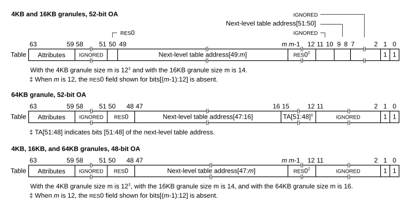
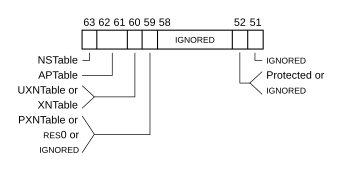
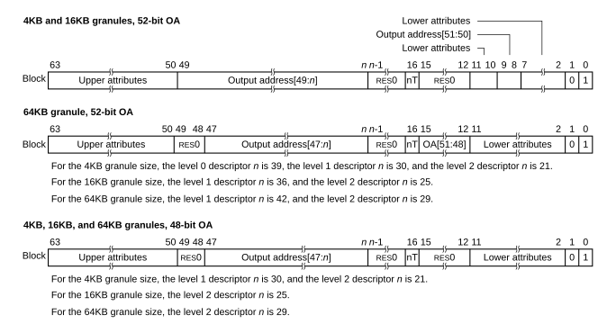
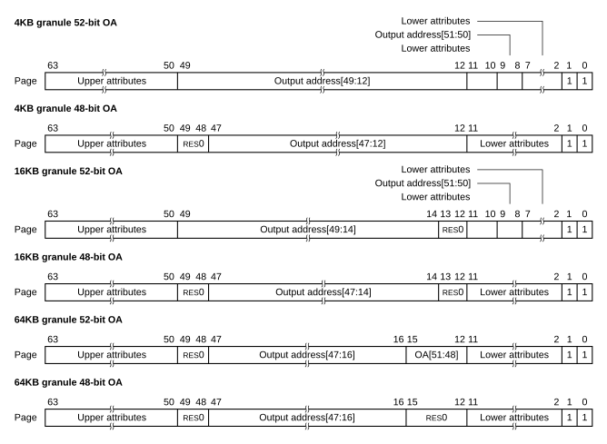
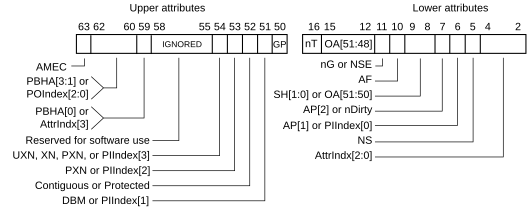
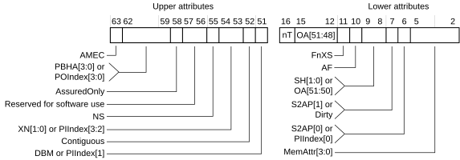

# ​D8.3.1 VMSAv8-64 descriptor formats

Source: <https://developer.arm.com/documentation/ddi0487/mc/-Part-D-The-AArch64-System-Level-Architecture/-Chapter-D8-The-AArch64-Virtual-Memory-System-Architecture/-D8-3-Translation-table-descriptor-formats/-D8-3-1-VMSAv8-64-descriptor-formats>

##### D8.3.1 VMSAv8-64 descriptor formats

###### D8.3.1.1 VMSAv8-64 Table descriptor format

R PGHRP
:   Throughout this section, if an address translation stage is not specified, then references to the [Effective value](/documentation/ddi0487/mc/-Part-K-Appendixes/Glossary?lang=en#effective_value) of [TCR\_ELx](/documentation/ddi0487/mc/-Part-K-Appendixes/-Appendix-K14-Registers-Index/-K14-1-Introduction-and-register-disambiguation/-K14-1-2-Register-name-disambiguation-by-Exception-level?lang=en#tcr_elx).DS also apply to [VTCR\_EL2](/documentation/ddi0487/mc/-Part-D-The-AArch64-System-Level-Architecture/-Chapter-D24-AArch64-System-Register-Descriptions/-D24-2-General-system-control-registers/-D24-2-223-VTCR-EL2--Virtualization-Translation-Control-Register?lang=en#reg_aarch64_vtcr_el2).DS.

I TWKLX
:   The following figure shows all of following stage 1 and stage 2 VMSAv8-64 Table descriptor formats:

    - 4KB, 16KB, and 64KB granules using a 48-bit next-level table address.
    - If the [Effective value](/documentation/ddi0487/mc/-Part-K-Appendixes/Glossary?lang=en#effective_value) of [TCR\_ELx](/documentation/ddi0487/mc/-Part-K-Appendixes/-Appendix-K14-Registers-Index/-K14-1-Introduction-and-register-disambiguation/-K14-1-2-Register-name-disambiguation-by-Exception-level?lang=en#tcr_elx).DS is 1, the 4KB and 16KB granules using a 52-bit next-level table address.
    - If [FEAT\_LPA](/documentation/ddi0487/mc/-Part-A-Arm-Architecture-Introduction-and-Overview/-Chapter-A2-A-profile-Architecture-Extensions/-A2-2-Armv8-A-architecture-extensions/-A2-2-3-The-Armv8-2-architecture-extension?lang=en#feat_feat_lpa) is implemented, the 64KB granule using a 52-bit next-level table address.

    Figure D8-12 VMSAv8-64 Table descriptor formats

    

I LZSBS
:   For a stage 1 translation, the following figure shows the next-level attribute fields in a VMSAv8-64 Table descriptor.

    For a stage 2 translation, all of the following apply:

    - Bit[63] is RES0.
    - Bits[62:59] are one of the following:

      - If stage 2 Indirect permissions are disabled, then RES0.
      - If stage 2 Indirect permissions are enabled, then IGNORED.
    - Bits[58:51] are IGNORED.

    Figure D8-13 Stage 1 next-level attribute fields in a VMSAv8-64 Table descriptor

    

R YWCCT
:   For stage 1 translations, the following table defines the fields in the VMSAv8-64 Table descriptor. In this table, NLTA is the next level table address.

<table id="tbl_mdtbl_stage_1_table_descriptor_fields">
 <caption>
  Table D8-50 Stage 1 VMSAv8-64 Table descriptor fields
 </caption>
 <colgroup>
  <col/>
  <col/>
  <col/>
 </colgroup>
 <thead>
  <tr>
   <th>
    Bit position
   </th>
   <th>
    Field
   </th>
   <th>
    Condition
   </th>
  </tr>
 </thead>
 <tbody>
  <tr>
   <td rowspan="2">
    [63]
   </td>
   <td>
    <small>
     RES0
    </small>
   </td>
   <td>
    The Security state is not Secure state.
   </td>
  </tr>
  <tr>
   <td>
    NSTable
   </td>
   <td>
    

     Secure state.
    

    

     See
     <a class="document-topic" document-topic-path="/ddi0487/mc/-Part-D-The-AArch64-System-Level-Architecture/-Chapter-D8-The-AArch64-Virtual-Memory-System-Architecture/-D8-4-Memory-access-control/-D8-4-6-Controlling-memory-access-Security-state?lang=en#mdsec_hierarchical_control_of_secure_or_non_secure_memory_accesses" href="/documentation/ddi0487/mc/-Part-D-The-AArch64-System-Level-Architecture/-Chapter-D8-The-AArch64-Virtual-Memory-System-Architecture/-D8-4-Memory-access-control/-D8-4-6-Controlling-memory-access-Security-state?lang=en#mdsec_hierarchical_control_of_secure_or_non_secure_memory_accesses">
      Hierarchical control of Secure or Non-secure memory accesses
     </a>
     .
    

   </td>
  </tr>
  <tr>
   <td>
    [62:61]
   </td>
   <td>
    APTable[1:0]
   </td>
   <td>
    

     Hierarchical permissions are enabled.
    

    

     See
     <a class="document-topic" document-topic-path="/ddi0487/mc/-Part-D-The-AArch64-System-Level-Architecture/-Chapter-D8-The-AArch64-Virtual-Memory-System-Architecture/-D8-4-Memory-access-control/-D8-4-1-Stage-1-permissions?lang=en#mdsec_hierarchical_control_of_data_access_permissions" href="/documentation/ddi0487/mc/-Part-D-The-AArch64-System-Level-Architecture/-Chapter-D8-The-AArch64-Virtual-Memory-System-Architecture/-D8-4-Memory-access-control/-D8-4-1-Stage-1-permissions?lang=en#mdsec_hierarchical_control_of_data_access_permissions">
      Hierarchical control of data access Direct permissions
     </a>
     .
    

    

     For EL1&amp;0 translations, if the
     <a class="document-topic" document-topic-path="/ddi0487/mc/-Part-K-Appendixes/Glossary?lang=en#effective_value" href="/documentation/ddi0487/mc/-Part-K-Appendixes/Glossary?lang=en#effective_value">
      Effective value
     </a>
     of
     <a class="document-topic" document-topic-path="/ddi0487/mc/-Part-D-The-AArch64-System-Level-Architecture/-Chapter-D24-AArch64-System-Register-Descriptions/-D24-2-General-system-control-registers/-D24-2-61-HCR-EL2--Hypervisor-Configuration-Register?lang=en#reg_aarch64_hcr_el2" href="/documentation/ddi0487/mc/-Part-D-The-AArch64-System-Level-Architecture/-Chapter-D24-AArch64-System-Register-Descriptions/-D24-2-General-system-control-registers/-D24-2-61-HCR-EL2--Hypervisor-Configuration-Register?lang=en#reg_aarch64_hcr_el2">
      HCR_EL2
     </a>
     .{NV, NV1} is {1, 1}, then APTable[0] is treated as 0 regardless of the actual value.
    

    

     See
     <a class="document-topic" document-topic-path="/ddi0487/mc/-Part-D-The-AArch64-System-Level-Architecture/-Chapter-D8-The-AArch64-Virtual-Memory-System-Architecture/-D8-14-Nested-virtualization/-D8-14-3-Additional-behavior-when-HCR-EL2-NV-is-1-and-HCR-EL2-NV1-is-1?lang=en#mdsec_additional_behavior_when_hcr_el2_nv_is_1_and_hcr_el2_nv1_is_1" href="/documentation/ddi0487/mc/-Part-D-The-AArch64-System-Level-Architecture/-Chapter-D8-The-AArch64-Virtual-Memory-System-Architecture/-D8-14-Nested-virtualization/-D8-14-3-Additional-behavior-when-HCR-EL2-NV-is-1-and-HCR-EL2-NV1-is-1?lang=en#mdsec_additional_behavior_when_hcr_el2_nv_is_1_and_hcr_el2_nv1_is_1">
      Additional behavior when HCR_EL2.NV is 1 and HCR_EL2.NV1 is 1
     </a>
     .
    

   </td>
  </tr>
  <tr>
   <td rowspan="3">
    [60]
   </td>
   <td>
    XNTable
   </td>
   <td>
    

     Hierarchical permissions are enabled and the translation regime supports a single privilege level.
    

    

     See
     <a class="document-topic" document-topic-path="/ddi0487/mc/-Part-D-The-AArch64-System-Level-Architecture/-Chapter-D8-The-AArch64-Virtual-Memory-System-Architecture/-D8-4-Memory-access-control/-D8-4-1-Stage-1-permissions?lang=en#mdsec_hierarchical_control_of_instruction_execution_permissions" href="/documentation/ddi0487/mc/-Part-D-The-AArch64-System-Level-Architecture/-Chapter-D8-The-AArch64-Virtual-Memory-System-Architecture/-D8-4-Memory-access-control/-D8-4-1-Stage-1-permissions?lang=en#mdsec_hierarchical_control_of_instruction_execution_permissions">
      Hierarchical control of instruction execution for Direct permissions
     </a>
     .
    

   </td>
  </tr>
  <tr>
   <td>
    UXNTable
   </td>
   <td>
    

     Hierarchical permissions are enabled and the translation regime supports two privilege levels.
    

    

     See
     <a class="document-topic" document-topic-path="/ddi0487/mc/-Part-D-The-AArch64-System-Level-Architecture/-Chapter-D8-The-AArch64-Virtual-Memory-System-Architecture/-D8-4-Memory-access-control/-D8-4-1-Stage-1-permissions?lang=en#mdsec_hierarchical_control_of_instruction_execution_permissions" href="/documentation/ddi0487/mc/-Part-D-The-AArch64-System-Level-Architecture/-Chapter-D8-The-AArch64-Virtual-Memory-System-Architecture/-D8-4-Memory-access-control/-D8-4-1-Stage-1-permissions?lang=en#mdsec_hierarchical_control_of_instruction_execution_permissions">
      Hierarchical control of instruction execution for Direct permissions
     </a>
     .
    

   </td>
  </tr>
  <tr>
   <td>
    PXNTable
   </td>
   <td>
    

     Hierarchical permissions are enabled, the EL1&amp;0 translation regime, and the
     <a class="document-topic" document-topic-path="/ddi0487/mc/-Part-K-Appendixes/Glossary?lang=en#effective_value" href="/documentation/ddi0487/mc/-Part-K-Appendixes/Glossary?lang=en#effective_value">
      Effective value
     </a>
     of
     <a class="document-topic" document-topic-path="/ddi0487/mc/-Part-D-The-AArch64-System-Level-Architecture/-Chapter-D24-AArch64-System-Register-Descriptions/-D24-2-General-system-control-registers/-D24-2-61-HCR-EL2--Hypervisor-Configuration-Register?lang=en#reg_aarch64_hcr_el2" href="/documentation/ddi0487/mc/-Part-D-The-AArch64-System-Level-Architecture/-Chapter-D24-AArch64-System-Register-Descriptions/-D24-2-General-system-control-registers/-D24-2-61-HCR-EL2--Hypervisor-Configuration-Register?lang=en#reg_aarch64_hcr_el2">
      HCR_EL2
     </a>
     .{NV, NV1} is {1, 1}.
    

    

     See
     <a class="document-topic" document-topic-path="/ddi0487/mc/-Part-D-The-AArch64-System-Level-Architecture/-Chapter-D8-The-AArch64-Virtual-Memory-System-Architecture/-D8-4-Memory-access-control/-D8-4-1-Stage-1-permissions?lang=en#mdsec_hierarchical_control_of_instruction_execution_permissions" href="/documentation/ddi0487/mc/-Part-D-The-AArch64-System-Level-Architecture/-Chapter-D8-The-AArch64-Virtual-Memory-System-Architecture/-D8-4-Memory-access-control/-D8-4-1-Stage-1-permissions?lang=en#mdsec_hierarchical_control_of_instruction_execution_permissions">
      Hierarchical control of instruction execution for Direct permissions
     </a>
     .
    

   </td>
  </tr>
  <tr>
   <td rowspan="2">
    [59]
   </td>
   <td>
    <small>
     RES0
    </small>
   </td>
   <td>
    

     Hierarchical permissions are enabled and one of the following applies:
    

    <ul>
     <li>
      

       The translation regime supports a single privilege level.
      

     </li>
     <li>
      

       The EL1&amp;0 translation regime and the
       <a class="document-topic" document-topic-path="/ddi0487/mc/-Part-K-Appendixes/Glossary?lang=en#effective_value" href="/documentation/ddi0487/mc/-Part-K-Appendixes/Glossary?lang=en#effective_value">
        Effective value
       </a>
       of
       <a class="document-topic" document-topic-path="/ddi0487/mc/-Part-D-The-AArch64-System-Level-Architecture/-Chapter-D24-AArch64-System-Register-Descriptions/-D24-2-General-system-control-registers/-D24-2-61-HCR-EL2--Hypervisor-Configuration-Register?lang=en#reg_aarch64_hcr_el2" href="/documentation/ddi0487/mc/-Part-D-The-AArch64-System-Level-Architecture/-Chapter-D24-AArch64-System-Register-Descriptions/-D24-2-General-system-control-registers/-D24-2-61-HCR-EL2--Hypervisor-Configuration-Register?lang=en#reg_aarch64_hcr_el2">
        HCR_EL2
       </a>
       .{NV, NV1} is {1, 1}.
      

     </li>
    </ul>
    

     See
     <a class="document-topic" document-topic-path="/ddi0487/mc/-Part-D-The-AArch64-System-Level-Architecture/-Chapter-D8-The-AArch64-Virtual-Memory-System-Architecture/-D8-14-Nested-virtualization/-D8-14-3-Additional-behavior-when-HCR-EL2-NV-is-1-and-HCR-EL2-NV1-is-1?lang=en#mdsec_additional_behavior_when_hcr_el2_nv_is_1_and_hcr_el2_nv1_is_1" href="/documentation/ddi0487/mc/-Part-D-The-AArch64-System-Level-Architecture/-Chapter-D8-The-AArch64-Virtual-Memory-System-Architecture/-D8-14-Nested-virtualization/-D8-14-3-Additional-behavior-when-HCR-EL2-NV-is-1-and-HCR-EL2-NV1-is-1?lang=en#mdsec_additional_behavior_when_hcr_el2_nv_is_1_and_hcr_el2_nv1_is_1">
      Additional behavior when HCR_EL2.NV is 1 and HCR_EL2.NV1 is 1
     </a>
     .
    

   </td>
  </tr>
  <tr>
   <td>
    PXNTable
   </td>
   <td>
    

     Hierarchical permissions are enabled and the translation regime supports two privilege levels.
    

    

     See
     <a class="document-topic" document-topic-path="/ddi0487/mc/-Part-D-The-AArch64-System-Level-Architecture/-Chapter-D8-The-AArch64-Virtual-Memory-System-Architecture/-D8-4-Memory-access-control/-D8-4-1-Stage-1-permissions?lang=en#mdsec_hierarchical_control_of_instruction_execution_permissions" href="/documentation/ddi0487/mc/-Part-D-The-AArch64-System-Level-Architecture/-Chapter-D8-The-AArch64-Virtual-Memory-System-Architecture/-D8-4-Memory-access-control/-D8-4-1-Stage-1-permissions?lang=en#mdsec_hierarchical_control_of_instruction_execution_permissions">
      Hierarchical control of instruction execution for Direct permissions
     </a>
     .
    

   </td>
  </tr>
  <tr>
   <td>
    [58:53]
   </td>
   <td>
    <small>
     IGNORED
    </small>
   </td>
   <td>
    -
   </td>
  </tr>
  <tr>
   <td>
    [52]
   </td>
   <td>
    <small>
     IGNORED
    </small>
   </td>
   <td>
    The
    <a class="document-topic" document-topic-path="/ddi0487/mc/-Part-K-Appendixes/Glossary?lang=en#effective_value" href="/documentation/ddi0487/mc/-Part-K-Appendixes/Glossary?lang=en#effective_value">
     Effective value
    </a>
    of
    <a class="document-topic" document-topic-path="/ddi0487/mc/-Part-D-The-AArch64-System-Level-Architecture/-Chapter-D8-The-AArch64-Virtual-Memory-System-Architecture/-D8-2-Translation-process/-D8-2-7-Translation-Hardening-Extension?lang=en#mdterm_pnch" href="/documentation/ddi0487/mc/-Part-D-The-AArch64-System-Level-Architecture/-Chapter-D8-The-AArch64-Virtual-Memory-System-Architecture/-D8-2-Translation-process/-D8-2-7-Translation-Hardening-Extension?lang=en#mdterm_pnch">
     PnCH
    </a>
    is 0.
   </td>
  </tr>
  <tr>
   <td>
   </td>
   <td>
    Protected
   </td>
   <td>
    

     The
     <a class="document-topic" document-topic-path="/ddi0487/mc/-Part-K-Appendixes/Glossary?lang=en#effective_value" href="/documentation/ddi0487/mc/-Part-K-Appendixes/Glossary?lang=en#effective_value">
      Effective value
     </a>
     of
     <a class="document-topic" document-topic-path="/ddi0487/mc/-Part-D-The-AArch64-System-Level-Architecture/-Chapter-D8-The-AArch64-Virtual-Memory-System-Architecture/-D8-2-Translation-process/-D8-2-7-Translation-Hardening-Extension?lang=en#mdterm_pnch" href="/documentation/ddi0487/mc/-Part-D-The-AArch64-System-Level-Architecture/-Chapter-D8-The-AArch64-Virtual-Memory-System-Architecture/-D8-2-Translation-process/-D8-2-7-Translation-Hardening-Extension?lang=en#mdterm_pnch">
      PnCH
     </a>
     is 1.
    

    

     See
     <a class="document-topic" document-topic-path="/ddi0487/mc/-Part-D-The-AArch64-System-Level-Architecture/-Chapter-D8-The-AArch64-Virtual-Memory-System-Architecture/-D8-2-Translation-process/-D8-2-7-Translation-Hardening-Extension?lang=en#mdsec_stage_1_protected_attribute" href="/documentation/ddi0487/mc/-Part-D-The-AArch64-System-Level-Architecture/-Chapter-D8-The-AArch64-Virtual-Memory-System-Architecture/-D8-2-Translation-process/-D8-2-7-Translation-Hardening-Extension?lang=en#mdsec_stage_1_protected_attribute">
      Stage 1 Protected Attribute
     </a>
     .
    

   </td>
  </tr>
  <tr>
   <td>
    [51]
   </td>
   <td>
    <small>
     IGNORED
    </small>
   </td>
   <td>
    -
   </td>
  </tr>
  <tr>
   <td>
    [50]
   </td>
   <td>
    <small>
     RES0
    </small>
   </td>
   <td>
    -
   </td>
  </tr>
  <tr>
   <td rowspan="2">
    [49:48]
   </td>
   <td>
    <small>
     RES0
    </small>
   </td>
   <td>
    The 4KB or 16KB translation granule is used, and the
    <a class="document-topic" document-topic-path="/ddi0487/mc/-Part-K-Appendixes/Glossary?lang=en#effective_value" href="/documentation/ddi0487/mc/-Part-K-Appendixes/Glossary?lang=en#effective_value">
     Effective value
    </a>
    of
    <a class="document-topic" document-topic-path="/ddi0487/mc/-Part-K-Appendixes/-Appendix-K14-Registers-Index/-K14-1-Introduction-and-register-disambiguation/-K14-1-2-Register-name-disambiguation-by-Exception-level?lang=en#tcr_elx" href="/documentation/ddi0487/mc/-Part-K-Appendixes/-Appendix-K14-Registers-Index/-K14-1-Introduction-and-register-disambiguation/-K14-1-2-Register-name-disambiguation-by-Exception-level?lang=en#tcr_elx">
     TCR_ELx
    </a>
    .DS is 0, or the 64KB translation granule is used.
   </td>
  </tr>
  <tr>
   <td>
    NLTA[49:48]
   </td>
   <td>
    The 4KB or 16KB translation granule is used, and the
    <a class="document-topic" document-topic-path="/ddi0487/mc/-Part-K-Appendixes/Glossary?lang=en#effective_value" href="/documentation/ddi0487/mc/-Part-K-Appendixes/Glossary?lang=en#effective_value">
     Effective value
    </a>
    of
    <a class="document-topic" document-topic-path="/ddi0487/mc/-Part-K-Appendixes/-Appendix-K14-Registers-Index/-K14-1-Introduction-and-register-disambiguation/-K14-1-2-Register-name-disambiguation-by-Exception-level?lang=en#tcr_elx" href="/documentation/ddi0487/mc/-Part-K-Appendixes/-Appendix-K14-Registers-Index/-K14-1-Introduction-and-register-disambiguation/-K14-1-2-Register-name-disambiguation-by-Exception-level?lang=en#tcr_elx">
     TCR_ELx
    </a>
    .DS is 1.
   </td>
  </tr>
  <tr>
   <td rowspan="4">
    [47:12]
   </td>
   <td>
    NLTA[47:12]
   </td>
   <td>
    The 4KB translation granule is used.
   </td>
  </tr>
  <tr>
   <td>
    NLTA[47:14]
   </td>
   <td>
    

     The 16KB translation granule is used.
    

    

     Descriptor bits [13:12] are
     <small>
      RES0
     </small>
     .
    

   </td>
  </tr>
  <tr>
   <td>
    NLTA[47:16]
   </td>
   <td>
    

     The 64KB translation granule is used and
     <a class="document-topic" document-topic-path="/ddi0487/mc/-Part-A-Arm-Architecture-Introduction-and-Overview/-Chapter-A2-A-profile-Architecture-Extensions/-A2-2-Armv8-A-architecture-extensions/-A2-2-3-The-Armv8-2-architecture-extension?lang=en#feat_feat_lpa" href="/documentation/ddi0487/mc/-Part-A-Arm-Architecture-Introduction-and-Overview/-Chapter-A2-A-profile-Architecture-Extensions/-A2-2-Armv8-A-architecture-extensions/-A2-2-3-The-Armv8-2-architecture-extension?lang=en#feat_feat_lpa">
      FEAT_LPA
     </a>
     is not implemented.
    

    

     Descriptor bits [15:12] are
     <small>
      RES0
     </small>
     .
    

   </td>
  </tr>
  <tr>
   <td>
    

     NLTA[47:16]:
    

    

     NLTA[51:48]
    

   </td>
   <td>
    The 64KB translation granule is used and
    <a class="document-topic" document-topic-path="/ddi0487/mc/-Part-A-Arm-Architecture-Introduction-and-Overview/-Chapter-A2-A-profile-Architecture-Extensions/-A2-2-Armv8-A-architecture-extensions/-A2-2-3-The-Armv8-2-architecture-extension?lang=en#feat_feat_lpa" href="/documentation/ddi0487/mc/-Part-A-Arm-Architecture-Introduction-and-Overview/-Chapter-A2-A-profile-Architecture-Extensions/-A2-2-Armv8-A-architecture-extensions/-A2-2-3-The-Armv8-2-architecture-extension?lang=en#feat_feat_lpa">
     FEAT_LPA
    </a>
    is implemented.
   </td>
  </tr>
  <tr>
   <td>
    [11]
   </td>
   <td>
    <small>
     IGNORED
    </small>
   </td>
   <td>
    -
   </td>
  </tr>
  <tr>
   <td rowspan="2">
    [10]
   </td>
   <td>
    <small>
     IGNORED
    </small>
   </td>
   <td>
    Hardware managed Table descriptor Access flag is not enabled.
   </td>
  </tr>
  <tr>
   <td>
    Access flag (AF)
   </td>
   <td>
    

     Hardware managed Table descriptor Access flag is enabled.
    

    

     See
     <a class="document-topic" document-topic-path="/ddi0487/mc/-Part-D-The-AArch64-System-Level-Architecture/-Chapter-D8-The-AArch64-Virtual-Memory-System-Architecture/-D8-5-Hardware-updates-to-the-translation-tables/-D8-5-1-The-Access-flag?lang=en#cacbiegje5" href="/documentation/ddi0487/mc/-Part-D-The-AArch64-System-Level-Architecture/-Chapter-D8-The-AArch64-Virtual-Memory-System-Architecture/-D8-5-Hardware-updates-to-the-translation-tables/-D8-5-1-The-Access-flag?lang=en#cacbiegje5">
      Hardware management of the Table descriptor Access Flag
     </a>
     .
    

   </td>
  </tr>
  <tr>
   <td rowspan="2">
    [9:8]
   </td>
   <td>
    <small>
     IGNORED
    </small>
   </td>
   <td>
    The 4KB or 16KB translation granule is used, and the
    <a class="document-topic" document-topic-path="/ddi0487/mc/-Part-K-Appendixes/Glossary?lang=en#effective_value" href="/documentation/ddi0487/mc/-Part-K-Appendixes/Glossary?lang=en#effective_value">
     Effective value
    </a>
    of
    <a class="document-topic" document-topic-path="/ddi0487/mc/-Part-K-Appendixes/-Appendix-K14-Registers-Index/-K14-1-Introduction-and-register-disambiguation/-K14-1-2-Register-name-disambiguation-by-Exception-level?lang=en#tcr_elx" href="/documentation/ddi0487/mc/-Part-K-Appendixes/-Appendix-K14-Registers-Index/-K14-1-Introduction-and-register-disambiguation/-K14-1-2-Register-name-disambiguation-by-Exception-level?lang=en#tcr_elx">
     TCR_ELx
    </a>
    .DS is 0, or the 64KB translation granule is used.
   </td>
  </tr>
  <tr>
   <td>
    NLTA[51:50]
   </td>
   <td>
    The 4KB or 16KB translation granule is used, and the
    <a class="document-topic" document-topic-path="/ddi0487/mc/-Part-K-Appendixes/Glossary?lang=en#effective_value" href="/documentation/ddi0487/mc/-Part-K-Appendixes/Glossary?lang=en#effective_value">
     Effective value
    </a>
    of
    <a class="document-topic" document-topic-path="/ddi0487/mc/-Part-K-Appendixes/-Appendix-K14-Registers-Index/-K14-1-Introduction-and-register-disambiguation/-K14-1-2-Register-name-disambiguation-by-Exception-level?lang=en#tcr_elx" href="/documentation/ddi0487/mc/-Part-K-Appendixes/-Appendix-K14-Registers-Index/-K14-1-Introduction-and-register-disambiguation/-K14-1-2-Register-name-disambiguation-by-Exception-level?lang=en#tcr_elx">
     TCR_ELx
    </a>
    .DS is 1.
   </td>
  </tr>
  <tr>
   <td>
    [7:2]
   </td>
   <td>
    <small>
     IGNORED
    </small>
   </td>
   <td>
    -
   </td>
  </tr>
  <tr>
   <td>
    [1]
   </td>
   <td>
    Table descriptor
   </td>
   <td>
    1, for lookup levels less than lookup level 3.
   </td>
  </tr>
  <tr>
   <td>
    [0]
   </td>
   <td>
    Valid descriptor
   </td>
   <td>
    1.
   </td>
  </tr>
 </tbody>
</table>

I LPCPS
:   For stage 1 translations in the EL3 translation regime, the removal of NSTable in Root state is a change from the behavior of EL3 in Secure state.

R XFNBW
:   For stage 2 translations, the following table defines the fields in the VMSAv8-64 Table descriptor. In this table, NLTA is the next level table address.

<table id="tbl_mdtbl_stage_2_table_descriptor_fields">
 <caption>
  Table D8-51 Stage 2 VMSAv8-64 Table descriptor fields
 </caption>
 <colgroup>
  <col/>
  <col/>
  <col/>
 </colgroup>
 <thead>
  <tr>
   <th>
    Bit position
   </th>
   <th>
    Field
   </th>
   <th>
    Condition
   </th>
  </tr>
 </thead>
 <tbody>
  <tr>
   <td>
    [63]
   </td>
   <td>
    <small>
     RES0
    </small>
   </td>
   <td>
    -
   </td>
  </tr>
  <tr>
   <td rowspan="2">
    [62:59]
   </td>
   <td>
    <small>
     RES0
    </small>
   </td>
   <td>
    Stage 2 Indirect permissions are disabled.
   </td>
  </tr>
  <tr>
   <td>
    <small>
     IGNORED
    </small>
   </td>
   <td>
    

     Stage 2 Indirect permissions are enabled.
    

    

     See
     <a class="document-topic" document-topic-path="/ddi0487/mc/-Part-D-The-AArch64-System-Level-Architecture/-Chapter-D8-The-AArch64-Virtual-Memory-System-Architecture/-D8-4-Memory-access-control/-D8-4-2-Stage-2-permissions?lang=en#mdsec_stage_2_indirect_permissions" href="/documentation/ddi0487/mc/-Part-D-The-AArch64-System-Level-Architecture/-Chapter-D8-The-AArch64-Virtual-Memory-System-Architecture/-D8-4-Memory-access-control/-D8-4-2-Stage-2-permissions?lang=en#mdsec_stage_2_indirect_permissions">
      Stage 2 Indirect permissions
     </a>
     .
    

   </td>
  </tr>
  <tr>
   <td>
    [58:51]
   </td>
   <td>
    <small>
     IGNORED
    </small>
   </td>
   <td>
    -
   </td>
  </tr>
  <tr>
   <td>
    [50]
   </td>
   <td>
    <small>
     RES0
    </small>
   </td>
   <td>
    -
   </td>
  </tr>
  <tr>
   <td rowspan="2">
    [49:48]
   </td>
   <td>
    <small>
     RES0
    </small>
   </td>
   <td>
    The 4KB or 16KB translation granule is used, and the
    <a class="document-topic" document-topic-path="/ddi0487/mc/-Part-K-Appendixes/Glossary?lang=en#effective_value" href="/documentation/ddi0487/mc/-Part-K-Appendixes/Glossary?lang=en#effective_value">
     Effective value
    </a>
    of
    <a class="document-topic" document-topic-path="/ddi0487/mc/-Part-D-The-AArch64-System-Level-Architecture/-Chapter-D24-AArch64-System-Register-Descriptions/-D24-2-General-system-control-registers/-D24-2-223-VTCR-EL2--Virtualization-Translation-Control-Register?lang=en#reg_aarch64_vtcr_el2" href="/documentation/ddi0487/mc/-Part-D-The-AArch64-System-Level-Architecture/-Chapter-D24-AArch64-System-Register-Descriptions/-D24-2-General-system-control-registers/-D24-2-223-VTCR-EL2--Virtualization-Translation-Control-Register?lang=en#reg_aarch64_vtcr_el2">
     VTCR_EL2
    </a>
    .DS is 0, or the 64KB translation granule is used.
   </td>
  </tr>
  <tr>
   <td>
    NLTA[49:48]
   </td>
   <td>
    The 4KB or 16KB translation granule is used, and the
    <a class="document-topic" document-topic-path="/ddi0487/mc/-Part-K-Appendixes/Glossary?lang=en#effective_value" href="/documentation/ddi0487/mc/-Part-K-Appendixes/Glossary?lang=en#effective_value">
     Effective value
    </a>
    of
    <a class="document-topic" document-topic-path="/ddi0487/mc/-Part-D-The-AArch64-System-Level-Architecture/-Chapter-D24-AArch64-System-Register-Descriptions/-D24-2-General-system-control-registers/-D24-2-223-VTCR-EL2--Virtualization-Translation-Control-Register?lang=en#reg_aarch64_vtcr_el2" href="/documentation/ddi0487/mc/-Part-D-The-AArch64-System-Level-Architecture/-Chapter-D24-AArch64-System-Register-Descriptions/-D24-2-General-system-control-registers/-D24-2-223-VTCR-EL2--Virtualization-Translation-Control-Register?lang=en#reg_aarch64_vtcr_el2">
     VTCR_EL2
    </a>
    .DS is 1.
   </td>
  </tr>
  <tr>
   <td rowspan="4">
    [47:12]
   </td>
   <td>
    NLTA[47:12]
   </td>
   <td>
    The 4KB translation granule is used.
   </td>
  </tr>
  <tr>
   <td>
    NLTA[47:14]
   </td>
   <td>
    

     The 16KB translation granule is used.
    

    

     Descriptor bits [13:12] are
     <small>
      RES0
     </small>
     .
    

   </td>
  </tr>
  <tr>
   <td>
    NLTA[47:16]
   </td>
   <td>
    

     The 64KB translation granule is used and
     <a class="document-topic" document-topic-path="/ddi0487/mc/-Part-A-Arm-Architecture-Introduction-and-Overview/-Chapter-A2-A-profile-Architecture-Extensions/-A2-2-Armv8-A-architecture-extensions/-A2-2-3-The-Armv8-2-architecture-extension?lang=en#feat_feat_lpa" href="/documentation/ddi0487/mc/-Part-A-Arm-Architecture-Introduction-and-Overview/-Chapter-A2-A-profile-Architecture-Extensions/-A2-2-Armv8-A-architecture-extensions/-A2-2-3-The-Armv8-2-architecture-extension?lang=en#feat_feat_lpa">
      FEAT_LPA
     </a>
     is not implemented.
    

    

     Descriptor bits [15:12] are
     <small>
      RES0
     </small>
     .
    

   </td>
  </tr>
  <tr>
   <td>
    

     NLTA[47:16]:
    

    

     NLTA[51:48]
    

   </td>
   <td>
    The 64KB translation granule is used and
    <a class="document-topic" document-topic-path="/ddi0487/mc/-Part-A-Arm-Architecture-Introduction-and-Overview/-Chapter-A2-A-profile-Architecture-Extensions/-A2-2-Armv8-A-architecture-extensions/-A2-2-3-The-Armv8-2-architecture-extension?lang=en#feat_feat_lpa" href="/documentation/ddi0487/mc/-Part-A-Arm-Architecture-Introduction-and-Overview/-Chapter-A2-A-profile-Architecture-Extensions/-A2-2-Armv8-A-architecture-extensions/-A2-2-3-The-Armv8-2-architecture-extension?lang=en#feat_feat_lpa">
     FEAT_LPA
    </a>
    is implemented.
   </td>
  </tr>
  <tr>
   <td>
    [11]
   </td>
   <td>
    <small>
     IGNORED
    </small>
   </td>
   <td>
    -
   </td>
  </tr>
  <tr>
   <td rowspan="2">
    [10]
   </td>
   <td>
    <small>
     IGNORED
    </small>
   </td>
   <td>
    Hardware managed Table descriptor Access flag is not enabled.
   </td>
  </tr>
  <tr>
   <td>
    Access flag (AF)
   </td>
   <td>
    

     Hardware managed Table descriptor Access flag is enabled.
    

    

     See
     <a class="document-topic" document-topic-path="/ddi0487/mc/-Part-D-The-AArch64-System-Level-Architecture/-Chapter-D8-The-AArch64-Virtual-Memory-System-Architecture/-D8-5-Hardware-updates-to-the-translation-tables/-D8-5-1-The-Access-flag?lang=en#cacbiegje5" href="/documentation/ddi0487/mc/-Part-D-The-AArch64-System-Level-Architecture/-Chapter-D8-The-AArch64-Virtual-Memory-System-Architecture/-D8-5-Hardware-updates-to-the-translation-tables/-D8-5-1-The-Access-flag?lang=en#cacbiegje5">
      Hardware management of the Table descriptor Access Flag
     </a>
     .
    

   </td>
  </tr>
  <tr>
   <td rowspan="2">
    [9:8]
   </td>
   <td>
    <small>
     IGNORED
    </small>
   </td>
   <td>
    The 4KB or 16KB translation granule is used, and the
    <a class="document-topic" document-topic-path="/ddi0487/mc/-Part-K-Appendixes/Glossary?lang=en#effective_value" href="/documentation/ddi0487/mc/-Part-K-Appendixes/Glossary?lang=en#effective_value">
     Effective value
    </a>
    of
    <a class="document-topic" document-topic-path="/ddi0487/mc/-Part-D-The-AArch64-System-Level-Architecture/-Chapter-D24-AArch64-System-Register-Descriptions/-D24-2-General-system-control-registers/-D24-2-223-VTCR-EL2--Virtualization-Translation-Control-Register?lang=en#reg_aarch64_vtcr_el2" href="/documentation/ddi0487/mc/-Part-D-The-AArch64-System-Level-Architecture/-Chapter-D24-AArch64-System-Register-Descriptions/-D24-2-General-system-control-registers/-D24-2-223-VTCR-EL2--Virtualization-Translation-Control-Register?lang=en#reg_aarch64_vtcr_el2">
     VTCR_EL2
    </a>
    .DS is 0, or the 64KB translation granule is used.
   </td>
  </tr>
  <tr>
   <td>
    NLTA[51:50]
   </td>
   <td>
    The 4KB or 16KB translation granule is used, and the
    <a class="document-topic" document-topic-path="/ddi0487/mc/-Part-K-Appendixes/Glossary?lang=en#effective_value" href="/documentation/ddi0487/mc/-Part-K-Appendixes/Glossary?lang=en#effective_value">
     Effective value
    </a>
    of
    <a class="document-topic" document-topic-path="/ddi0487/mc/-Part-D-The-AArch64-System-Level-Architecture/-Chapter-D24-AArch64-System-Register-Descriptions/-D24-2-General-system-control-registers/-D24-2-223-VTCR-EL2--Virtualization-Translation-Control-Register?lang=en#reg_aarch64_vtcr_el2" href="/documentation/ddi0487/mc/-Part-D-The-AArch64-System-Level-Architecture/-Chapter-D24-AArch64-System-Register-Descriptions/-D24-2-General-system-control-registers/-D24-2-223-VTCR-EL2--Virtualization-Translation-Control-Register?lang=en#reg_aarch64_vtcr_el2">
     VTCR_EL2
    </a>
    .DS is 1.
   </td>
  </tr>
  <tr>
   <td>
    [7:2]
   </td>
   <td>
    <small>
     IGNORED
    </small>
   </td>
   <td>
    -
   </td>
  </tr>
  <tr>
   <td>
    [1]
   </td>
   <td>
    Table descriptor
   </td>
   <td>
    1, for lookup levels less than lookup level 3.
   </td>
  </tr>
  <tr>
   <td>
    [0]
   </td>
   <td>
    Valid descriptor
   </td>
   <td>
    1.
   </td>
  </tr>
 </tbody>
</table>

###### D8.3.1.2 VMSAv8-64 Block descriptor and Page descriptor formats

R WLDSK
:   Throughout this section, if an address translation stage is not specified, then references to the [Effective value](/documentation/ddi0487/mc/-Part-K-Appendixes/Glossary?lang=en#effective_value) of [TCR\_ELx](/documentation/ddi0487/mc/-Part-K-Appendixes/-Appendix-K14-Registers-Index/-K14-1-Introduction-and-register-disambiguation/-K14-1-2-Register-name-disambiguation-by-Exception-level?lang=en#tcr_elx).DS also apply to [VTCR\_EL2](/documentation/ddi0487/mc/-Part-D-The-AArch64-System-Level-Architecture/-Chapter-D24-AArch64-System-Register-Descriptions/-D24-2-General-system-control-registers/-D24-2-223-VTCR-EL2--Virtualization-Translation-Control-Register?lang=en#reg_aarch64_vtcr_el2).DS.

I GBPDK
:   The following figure shows all of the following VMSAv8-64 Block descriptor formats:

    - 4KB, 16KB, and 64KB granules using a 48-bit OA.
    - If the [Effective value](/documentation/ddi0487/mc/-Part-K-Appendixes/Glossary?lang=en#effective_value) of [TCR\_ELx](/documentation/ddi0487/mc/-Part-K-Appendixes/-Appendix-K14-Registers-Index/-K14-1-Introduction-and-register-disambiguation/-K14-1-2-Register-name-disambiguation-by-Exception-level?lang=en#tcr_elx).DS is 1, the 4KB and 16KB granules using a 52-bit OA.
    - If [FEAT\_LPA](/documentation/ddi0487/mc/-Part-A-Arm-Architecture-Introduction-and-Overview/-Chapter-A2-A-profile-Architecture-Extensions/-A2-2-Armv8-A-architecture-extensions/-A2-2-3-The-Armv8-2-architecture-extension?lang=en#feat_feat_lpa) is supported, the 64KB granule using a 52-bit OA.

    Figure D8-14 VMSAv8-64 Block descriptor formats

    

I WNCLB
:   The following figure shows all of the following VMSAv8-64 Page descriptor formats:

    - 4KB, 16KB, and 64KB granules using a 48-bit OA.
    - If the [Effective value](/documentation/ddi0487/mc/-Part-K-Appendixes/Glossary?lang=en#effective_value) of [TCR\_ELx](/documentation/ddi0487/mc/-Part-K-Appendixes/-Appendix-K14-Registers-Index/-K14-1-Introduction-and-register-disambiguation/-K14-1-2-Register-name-disambiguation-by-Exception-level?lang=en#tcr_elx).DS is 1, the 4KB and 16KB granules using a 52-bit OA.
    - If [FEAT\_LPA](/documentation/ddi0487/mc/-Part-A-Arm-Architecture-Introduction-and-Overview/-Chapter-A2-A-profile-Architecture-Extensions/-A2-2-Armv8-A-architecture-extensions/-A2-2-3-The-Armv8-2-architecture-extension?lang=en#feat_feat_lpa) is supported, the 64KB granule using a 52-bit OA.

    Figure D8-15 VMSAv8-64 Page descriptor formats

    

I GLMLD
:   For a stage 1 translation, the following figure shows the attribute fields in VMSAv8-64 Block descriptors and Page descriptors, split into upper attributes and lower attributes.

    Figure D8-16 Stage 1 attribute fields in VMSAv8-64 Block and Page descriptors

    

R JJNHR
:   For stage 1 translations, the following table defines the fields in the VMSAv8-64 Block and Page descriptors. In this table, OAB is the OA base that is appended to the IA supplied to the translation stage to produce the final OA supplied by the translation stage.

<table id="tbl_mdtbl_stage_1_block_page_descriptor_fields">
 <caption>
  Table D8-52 Stage 1 VMSAv8-64 Block and Page descriptor fields
 </caption>
 <colgroup>
  <col/>
  <col/>
  <col/>
 </colgroup>
 <thead>
  <tr>
   <th>
    Bit position
   </th>
   <th>
    Field
   </th>
   <th>
    Condition
   </th>
  </tr>
 </thead>
 <tbody>
  <tr>
   <td rowspan="4">
    [63]
   </td>
   <td>
    <small>
     IGNORED
    </small>
   </td>
   <td>
    Secure state.
   </td>
  </tr>
  <tr>
   <td>
    Reserved for software use
   </td>
   <td>
    Non-secure state, or the Realm EL1&amp;0 translation regime.
   </td>
  </tr>
  <tr>
   <td>
    Alternate MECID (AMEC)
   </td>
   <td>
    

     Realm EL2 or Realm EL2&amp;0 translation regimes, and the descriptor NS field is 0.
    

    

     See
     <a class="document-topic" document-topic-path="/ddi0487/mc/-Part-D-The-AArch64-System-Level-Architecture/-Chapter-D8-The-AArch64-Virtual-Memory-System-Architecture/-D8-12-Memory-Encryption-Contexts-extension?lang=en#mdsec_mec_extension" href="/documentation/ddi0487/mc/-Part-D-The-AArch64-System-Level-Architecture/-Chapter-D8-The-AArch64-Virtual-Memory-System-Architecture/-D8-12-Memory-Encryption-Contexts-extension?lang=en#mdsec_mec_extension">
      Memory Encryption Contexts extension
     </a>
     .
    

   </td>
  </tr>
  <tr>
   <td>
    <small>
     RES0
    </small>
   </td>
   <td>
    Realm EL2 or Realm EL2&amp;0 translation regimes, and the descriptor NS field is 1.
   </td>
  </tr>
  <tr>
   <td rowspan="3">
    [62:60]
   </td>
   <td>
    <small>
     IGNORED
    </small>
   </td>
   <td>
    

     Both of the following apply:
    

    <ul>
     <li>
      

       <a class="document-topic" document-topic-path="/ddi0487/mc/-Part-A-Arm-Architecture-Introduction-and-Overview/-Chapter-A2-A-profile-Architecture-Extensions/-A2-2-Armv8-A-architecture-extensions/-A2-2-3-The-Armv8-2-architecture-extension?lang=en#feat_feat_hpds2" href="/documentation/ddi0487/mc/-Part-A-Arm-Architecture-Introduction-and-Overview/-Chapter-A2-A-profile-Architecture-Extensions/-A2-2-Armv8-A-architecture-extensions/-A2-2-3-The-Armv8-2-architecture-extension?lang=en#feat_feat_hpds2">
        FEAT_HPDS2
       </a>
       is not implemented or PBHA is not enabled by the corresponding
       <a class="document-topic" document-topic-path="/ddi0487/mc/-Part-K-Appendixes/-Appendix-K14-Registers-Index/-K14-1-Introduction-and-register-disambiguation/-K14-1-2-Register-name-disambiguation-by-Exception-level?lang=en#tcr_elx" href="/documentation/ddi0487/mc/-Part-K-Appendixes/-Appendix-K14-Registers-Index/-K14-1-Introduction-and-register-disambiguation/-K14-1-2-Register-name-disambiguation-by-Exception-level?lang=en#tcr_elx">
        TCR_ELx
       </a>
       .HWU
       <em>
        nn
       </em>
       control bit.
      

     </li>
     <li>
      

       <a class="document-topic" document-topic-path="/ddi0487/mc/-Part-A-Arm-Architecture-Introduction-and-Overview/-Chapter-A2-A-profile-Architecture-Extensions/-A2-2-Armv8-A-architecture-extensions/-A2-2-10-The-Armv8-9-architecture-extension?lang=en#feat_feat_s1poe" href="/documentation/ddi0487/mc/-Part-A-Arm-Architecture-Introduction-and-Overview/-Chapter-A2-A-profile-Architecture-Extensions/-A2-2-Armv8-A-architecture-extensions/-A2-2-10-The-Armv8-9-architecture-extension?lang=en#feat_feat_s1poe">
        FEAT_S1POE
       </a>
       is not implemented or stage 1 Overlay permissions are not enabled.
      

     </li>
    </ul>
   </td>
  </tr>
  <tr>
   <td>
    PBHA[3:1]
   </td>
   <td>
    

     <a class="document-topic" document-topic-path="/ddi0487/mc/-Part-A-Arm-Architecture-Introduction-and-Overview/-Chapter-A2-A-profile-Architecture-Extensions/-A2-2-Armv8-A-architecture-extensions/-A2-2-3-The-Armv8-2-architecture-extension?lang=en#feat_feat_hpds2" href="/documentation/ddi0487/mc/-Part-A-Arm-Architecture-Introduction-and-Overview/-Chapter-A2-A-profile-Architecture-Extensions/-A2-2-Armv8-A-architecture-extensions/-A2-2-3-The-Armv8-2-architecture-extension?lang=en#feat_feat_hpds2">
      FEAT_HPDS2
     </a>
     is implemented and the PBHA bit is enabled by the corresponding
     <a class="document-topic" document-topic-path="/ddi0487/mc/-Part-K-Appendixes/-Appendix-K14-Registers-Index/-K14-1-Introduction-and-register-disambiguation/-K14-1-2-Register-name-disambiguation-by-Exception-level?lang=en#tcr_elx" href="/documentation/ddi0487/mc/-Part-K-Appendixes/-Appendix-K14-Registers-Index/-K14-1-Introduction-and-register-disambiguation/-K14-1-2-Register-name-disambiguation-by-Exception-level?lang=en#tcr_elx">
      TCR_ELx
     </a>
     .HWU
     <em>
      nn
     </em>
     control bit.
    

    

     See
     <a class="document-topic" document-topic-path="/ddi0487/mc/-Part-D-The-AArch64-System-Level-Architecture/-Chapter-D8-The-AArch64-Virtual-Memory-System-Architecture/-D8-7-Other-descriptor-fields/-D8-7-2-Page-Based-Hardware-attributes?lang=en#mdsec_page_based_hardware_attributes" href="/documentation/ddi0487/mc/-Part-D-The-AArch64-System-Level-Architecture/-Chapter-D8-The-AArch64-Virtual-Memory-System-Architecture/-D8-7-Other-descriptor-fields/-D8-7-2-Page-Based-Hardware-attributes?lang=en#mdsec_page_based_hardware_attributes">
      Page Based Hardware attributes
     </a>
     .
    

   </td>
  </tr>
  <tr>
   <td>
    POIndex[2:0]
   </td>
   <td>
    

     Stage 1 Overlay permissions enabled.
    

    

     See
     <a class="document-topic" document-topic-path="/ddi0487/mc/-Part-D-The-AArch64-System-Level-Architecture/-Chapter-D8-The-AArch64-Virtual-Memory-System-Architecture/-D8-4-Memory-access-control/-D8-4-1-Stage-1-permissions?lang=en#mdsec_stage_1_overlay_permissions" href="/documentation/ddi0487/mc/-Part-D-The-AArch64-System-Level-Architecture/-Chapter-D8-The-AArch64-Virtual-Memory-System-Architecture/-D8-4-Memory-access-control/-D8-4-1-Stage-1-permissions?lang=en#mdsec_stage_1_overlay_permissions">
      Stage 1 Overlay permissions
     </a>
     .
    

   </td>
  </tr>
  <tr>
   <td rowspan="3">
    [59]
   </td>
   <td>
    <small>
     IGNORED
    </small>
   </td>
   <td>
    

     Both of the following apply:
    

    <ul>
     <li>
      

       <a class="document-topic" document-topic-path="/ddi0487/mc/-Part-A-Arm-Architecture-Introduction-and-Overview/-Chapter-A2-A-profile-Architecture-Extensions/-A2-2-Armv8-A-architecture-extensions/-A2-2-3-The-Armv8-2-architecture-extension?lang=en#feat_feat_hpds2" href="/documentation/ddi0487/mc/-Part-A-Arm-Architecture-Introduction-and-Overview/-Chapter-A2-A-profile-Architecture-Extensions/-A2-2-Armv8-A-architecture-extensions/-A2-2-3-The-Armv8-2-architecture-extension?lang=en#feat_feat_hpds2">
        FEAT_HPDS2
       </a>
       is not implemented or PBHA is not enabled by the corresponding
       <a class="document-topic" document-topic-path="/ddi0487/mc/-Part-K-Appendixes/-Appendix-K14-Registers-Index/-K14-1-Introduction-and-register-disambiguation/-K14-1-2-Register-name-disambiguation-by-Exception-level?lang=en#tcr_elx" href="/documentation/ddi0487/mc/-Part-K-Appendixes/-Appendix-K14-Registers-Index/-K14-1-Introduction-and-register-disambiguation/-K14-1-2-Register-name-disambiguation-by-Exception-level?lang=en#tcr_elx">
        TCR_ELx
       </a>
       .HWU
       <em>
        nn
       </em>
       control bit.
      

     </li>
     <li>
      

       <a class="document-topic" document-topic-path="/ddi0487/mc/-Part-A-Arm-Architecture-Introduction-and-Overview/-Chapter-A2-A-profile-Architecture-Extensions/-A2-2-Armv8-A-architecture-extensions/-A2-2-10-The-Armv8-9-architecture-extension?lang=en#feat_feat_aie" href="/documentation/ddi0487/mc/-Part-A-Arm-Architecture-Introduction-and-Overview/-Chapter-A2-A-profile-Architecture-Extensions/-A2-2-Armv8-A-architecture-extensions/-A2-2-10-The-Armv8-9-architecture-extension?lang=en#feat_feat_aie">
        FEAT_AIE
       </a>
       is not implemented or the stage 1 Attribute Index Extension is not enabled.
      

     </li>
    </ul>
   </td>
  </tr>
  <tr>
   <td>
    PBHA[0]
   </td>
   <td>
    

     <a class="document-topic" document-topic-path="/ddi0487/mc/-Part-A-Arm-Architecture-Introduction-and-Overview/-Chapter-A2-A-profile-Architecture-Extensions/-A2-2-Armv8-A-architecture-extensions/-A2-2-3-The-Armv8-2-architecture-extension?lang=en#feat_feat_hpds2" href="/documentation/ddi0487/mc/-Part-A-Arm-Architecture-Introduction-and-Overview/-Chapter-A2-A-profile-Architecture-Extensions/-A2-2-Armv8-A-architecture-extensions/-A2-2-3-The-Armv8-2-architecture-extension?lang=en#feat_feat_hpds2">
      FEAT_HPDS2
     </a>
     is implemented and the PBHA bit is enabled by the corresponding
     <a class="document-topic" document-topic-path="/ddi0487/mc/-Part-K-Appendixes/-Appendix-K14-Registers-Index/-K14-1-Introduction-and-register-disambiguation/-K14-1-2-Register-name-disambiguation-by-Exception-level?lang=en#tcr_elx" href="/documentation/ddi0487/mc/-Part-K-Appendixes/-Appendix-K14-Registers-Index/-K14-1-Introduction-and-register-disambiguation/-K14-1-2-Register-name-disambiguation-by-Exception-level?lang=en#tcr_elx">
      TCR_ELx
     </a>
     .HWU
     <em>
      nn
     </em>
     control bit.
    

    

     See
     <a class="document-topic" document-topic-path="/ddi0487/mc/-Part-D-The-AArch64-System-Level-Architecture/-Chapter-D8-The-AArch64-Virtual-Memory-System-Architecture/-D8-7-Other-descriptor-fields/-D8-7-2-Page-Based-Hardware-attributes?lang=en#mdsec_page_based_hardware_attributes" href="/documentation/ddi0487/mc/-Part-D-The-AArch64-System-Level-Architecture/-Chapter-D8-The-AArch64-Virtual-Memory-System-Architecture/-D8-7-Other-descriptor-fields/-D8-7-2-Page-Based-Hardware-attributes?lang=en#mdsec_page_based_hardware_attributes">
      Page Based Hardware attributes
     </a>
     .
    

   </td>
  </tr>
  <tr>
   <td>
    AttrIndx[3]
   </td>
   <td>
    

     <a class="document-topic" document-topic-path="/ddi0487/mc/-Part-A-Arm-Architecture-Introduction-and-Overview/-Chapter-A2-A-profile-Architecture-Extensions/-A2-2-Armv8-A-architecture-extensions/-A2-2-10-The-Armv8-9-architecture-extension?lang=en#feat_feat_aie" href="/documentation/ddi0487/mc/-Part-A-Arm-Architecture-Introduction-and-Overview/-Chapter-A2-A-profile-Architecture-Extensions/-A2-2-Armv8-A-architecture-extensions/-A2-2-10-The-Armv8-9-architecture-extension?lang=en#feat_feat_aie">
      FEAT_AIE
     </a>
     is enabled.
    

    

     See
     <a class="document-topic" document-topic-path="/ddi0487/mc/-Part-D-The-AArch64-System-Level-Architecture/-Chapter-D8-The-AArch64-Virtual-Memory-System-Architecture/-D8-6-Memory-region-attributes/-D8-6-1-Stage-1-memory-type-and-Cacheability-attributes?lang=en#mdsec_stage_1_memory_type_and_cacheability_attributes" href="/documentation/ddi0487/mc/-Part-D-The-AArch64-System-Level-Architecture/-Chapter-D8-The-AArch64-Virtual-Memory-System-Architecture/-D8-6-Memory-region-attributes/-D8-6-1-Stage-1-memory-type-and-Cacheability-attributes?lang=en#mdsec_stage_1_memory_type_and_cacheability_attributes">
      Stage 1 memory type and Cacheability attributes
     </a>
     .
    

   </td>
  </tr>
  <tr>
   <td>
    [58:55]
   </td>
   <td>
    Reserved for software use
   </td>
   <td>
    -
   </td>
  </tr>
  <tr>
   <td rowspan="4">
    [54]
   </td>
   <td>
    Execute-never (XN)
   </td>
   <td>
    

     The translation regime supports a single privilege level.
    

    

     See
     <a class="document-topic" document-topic-path="/ddi0487/mc/-Part-D-The-AArch64-System-Level-Architecture/-Chapter-D8-The-AArch64-Virtual-Memory-System-Architecture/-D8-4-Memory-access-control/-D8-4-1-Stage-1-permissions?lang=en#mdsec_stage_1_instruction_execution_using_direct_permissions" href="/documentation/ddi0487/mc/-Part-D-The-AArch64-System-Level-Architecture/-Chapter-D8-The-AArch64-Virtual-Memory-System-Architecture/-D8-4-Memory-access-control/-D8-4-1-Stage-1-permissions?lang=en#mdsec_stage_1_instruction_execution_using_direct_permissions">
      Stage 1 instruction execution using Direct permissions
     </a>
     .
    

   </td>
  </tr>
  <tr>
   <td>
    Unprivileged Execute-never (UXN)
   </td>
   <td>
    

     The translation regime supports two privilege levels.
    

    

     See
     <a class="document-topic" document-topic-path="/ddi0487/mc/-Part-D-The-AArch64-System-Level-Architecture/-Chapter-D8-The-AArch64-Virtual-Memory-System-Architecture/-D8-4-Memory-access-control/-D8-4-1-Stage-1-permissions?lang=en#mdsec_stage_1_instruction_execution_using_direct_permissions" href="/documentation/ddi0487/mc/-Part-D-The-AArch64-System-Level-Architecture/-Chapter-D8-The-AArch64-Virtual-Memory-System-Architecture/-D8-4-Memory-access-control/-D8-4-1-Stage-1-permissions?lang=en#mdsec_stage_1_instruction_execution_using_direct_permissions">
      Stage 1 instruction execution using Direct permissions
     </a>
     .
    

   </td>
  </tr>
  <tr>
   <td>
    Privileged Execute-never (PXN)
   </td>
   <td>
    

     The EL1&amp;0 translation regime and the
     <a class="document-topic" document-topic-path="/ddi0487/mc/-Part-K-Appendixes/Glossary?lang=en#effective_value" href="/documentation/ddi0487/mc/-Part-K-Appendixes/Glossary?lang=en#effective_value">
      Effective value
     </a>
     of
     <a class="document-topic" document-topic-path="/ddi0487/mc/-Part-D-The-AArch64-System-Level-Architecture/-Chapter-D24-AArch64-System-Register-Descriptions/-D24-2-General-system-control-registers/-D24-2-61-HCR-EL2--Hypervisor-Configuration-Register?lang=en#reg_aarch64_hcr_el2" href="/documentation/ddi0487/mc/-Part-D-The-AArch64-System-Level-Architecture/-Chapter-D24-AArch64-System-Register-Descriptions/-D24-2-General-system-control-registers/-D24-2-61-HCR-EL2--Hypervisor-Configuration-Register?lang=en#reg_aarch64_hcr_el2">
      HCR_EL2
     </a>
     .{NV, NV1} is {1, 1}.
    

    

     The
     <a class="document-topic" document-topic-path="/ddi0487/mc/-Part-K-Appendixes/Glossary?lang=en#effective_value" href="/documentation/ddi0487/mc/-Part-K-Appendixes/Glossary?lang=en#effective_value">
      Effective value
     </a>
     of UXN is 0.
    

    

     See
     <a class="document-topic" document-topic-path="/ddi0487/mc/-Part-D-The-AArch64-System-Level-Architecture/-Chapter-D8-The-AArch64-Virtual-Memory-System-Architecture/-D8-4-Memory-access-control/-D8-4-1-Stage-1-permissions?lang=en#mdsec_stage_1_instruction_execution_using_direct_permissions" href="/documentation/ddi0487/mc/-Part-D-The-AArch64-System-Level-Architecture/-Chapter-D8-The-AArch64-Virtual-Memory-System-Architecture/-D8-4-Memory-access-control/-D8-4-1-Stage-1-permissions?lang=en#mdsec_stage_1_instruction_execution_using_direct_permissions">
      Stage 1 instruction execution using Direct permissions
     </a>
     and
     <a class="document-topic" document-topic-path="/ddi0487/mc/-Part-D-The-AArch64-System-Level-Architecture/-Chapter-D8-The-AArch64-Virtual-Memory-System-Architecture/-D8-14-Nested-virtualization/-D8-14-3-Additional-behavior-when-HCR-EL2-NV-is-1-and-HCR-EL2-NV1-is-1?lang=en#mdsec_additional_behavior_when_hcr_el2_nv_is_1_and_hcr_el2_nv1_is_1" href="/documentation/ddi0487/mc/-Part-D-The-AArch64-System-Level-Architecture/-Chapter-D8-The-AArch64-Virtual-Memory-System-Architecture/-D8-14-Nested-virtualization/-D8-14-3-Additional-behavior-when-HCR-EL2-NV-is-1-and-HCR-EL2-NV1-is-1?lang=en#mdsec_additional_behavior_when_hcr_el2_nv_is_1_and_hcr_el2_nv1_is_1">
      Additional behavior when HCR_EL2.NV is 1 and HCR_EL2.NV1 is 1
     </a>
     .
    

   </td>
  </tr>
  <tr>
   <td>
    PIIndex[3]
   </td>
   <td>
    

     Stage 1 Indirect permissions enabled, regardless of other feature settings.
    

    

     See
     <a class="document-topic" document-topic-path="/ddi0487/mc/-Part-D-The-AArch64-System-Level-Architecture/-Chapter-D8-The-AArch64-Virtual-Memory-System-Architecture/-D8-4-Memory-access-control/-D8-4-1-Stage-1-permissions?lang=en#mdsec_stage_1_indirect_permissions" href="/documentation/ddi0487/mc/-Part-D-The-AArch64-System-Level-Architecture/-Chapter-D8-The-AArch64-Virtual-Memory-System-Architecture/-D8-4-Memory-access-control/-D8-4-1-Stage-1-permissions?lang=en#mdsec_stage_1_indirect_permissions">
      Stage 1 Indirect permissions
     </a>
     .
    

   </td>
  </tr>
  <tr>
   <td rowspan="3">
    [53]
   </td>
   <td>
    <small>
     RES0
    </small>
   </td>
   <td>
    

     One of the following:
    

    <ul>
     <li>
      

       The translation regime supports a single privilege level.
      

     </li>
     <li>
      

       The EL1&amp;0 translation regime and the
       <a class="document-topic" document-topic-path="/ddi0487/mc/-Part-K-Appendixes/Glossary?lang=en#effective_value" href="/documentation/ddi0487/mc/-Part-K-Appendixes/Glossary?lang=en#effective_value">
        Effective value
       </a>
       of
       <a class="document-topic" document-topic-path="/ddi0487/mc/-Part-D-The-AArch64-System-Level-Architecture/-Chapter-D24-AArch64-System-Register-Descriptions/-D24-2-General-system-control-registers/-D24-2-61-HCR-EL2--Hypervisor-Configuration-Register?lang=en#reg_aarch64_hcr_el2" href="/documentation/ddi0487/mc/-Part-D-The-AArch64-System-Level-Architecture/-Chapter-D24-AArch64-System-Register-Descriptions/-D24-2-General-system-control-registers/-D24-2-61-HCR-EL2--Hypervisor-Configuration-Register?lang=en#reg_aarch64_hcr_el2">
        HCR_EL2
       </a>
       .{NV, NV1} is {1, 1}.
      

     </li>
    </ul>
    

     See
     <a class="document-topic" document-topic-path="/ddi0487/mc/-Part-D-The-AArch64-System-Level-Architecture/-Chapter-D8-The-AArch64-Virtual-Memory-System-Architecture/-D8-4-Memory-access-control/-D8-4-1-Stage-1-permissions?lang=en#mdsec_stage_1_instruction_execution_using_direct_permissions" href="/documentation/ddi0487/mc/-Part-D-The-AArch64-System-Level-Architecture/-Chapter-D8-The-AArch64-Virtual-Memory-System-Architecture/-D8-4-Memory-access-control/-D8-4-1-Stage-1-permissions?lang=en#mdsec_stage_1_instruction_execution_using_direct_permissions">
      Stage 1 instruction execution using Direct permissions
     </a>
     and
     <a class="document-topic" document-topic-path="/ddi0487/mc/-Part-D-The-AArch64-System-Level-Architecture/-Chapter-D8-The-AArch64-Virtual-Memory-System-Architecture/-D8-14-Nested-virtualization/-D8-14-3-Additional-behavior-when-HCR-EL2-NV-is-1-and-HCR-EL2-NV1-is-1?lang=en#mdsec_additional_behavior_when_hcr_el2_nv_is_1_and_hcr_el2_nv1_is_1" href="/documentation/ddi0487/mc/-Part-D-The-AArch64-System-Level-Architecture/-Chapter-D8-The-AArch64-Virtual-Memory-System-Architecture/-D8-14-Nested-virtualization/-D8-14-3-Additional-behavior-when-HCR-EL2-NV-is-1-and-HCR-EL2-NV1-is-1?lang=en#mdsec_additional_behavior_when_hcr_el2_nv_is_1_and_hcr_el2_nv1_is_1">
      Additional behavior when HCR_EL2.NV is 1 and HCR_EL2.NV1 is 1
     </a>
     .
    

   </td>
  </tr>
  <tr>
   <td>
    PXN
   </td>
   <td>
    

     The translation regime supports two privilege levels.
    

    

     See
     <a class="document-topic" document-topic-path="/ddi0487/mc/-Part-D-The-AArch64-System-Level-Architecture/-Chapter-D8-The-AArch64-Virtual-Memory-System-Architecture/-D8-4-Memory-access-control/-D8-4-1-Stage-1-permissions?lang=en#mdsec_stage_1_instruction_execution_using_direct_permissions" href="/documentation/ddi0487/mc/-Part-D-The-AArch64-System-Level-Architecture/-Chapter-D8-The-AArch64-Virtual-Memory-System-Architecture/-D8-4-Memory-access-control/-D8-4-1-Stage-1-permissions?lang=en#mdsec_stage_1_instruction_execution_using_direct_permissions">
      Stage 1 instruction execution using Direct permissions
     </a>
     .
    

   </td>
  </tr>
  <tr>
   <td>
    PIIndex[2]
   </td>
   <td>
    

     Stage 1 Indirect permissions enabled, regardless of other feature settings.
    

    

     See
     <a class="document-topic" document-topic-path="/ddi0487/mc/-Part-D-The-AArch64-System-Level-Architecture/-Chapter-D8-The-AArch64-Virtual-Memory-System-Architecture/-D8-4-Memory-access-control/-D8-4-1-Stage-1-permissions?lang=en#mdsec_stage_1_indirect_permissions" href="/documentation/ddi0487/mc/-Part-D-The-AArch64-System-Level-Architecture/-Chapter-D8-The-AArch64-Virtual-Memory-System-Architecture/-D8-4-Memory-access-control/-D8-4-1-Stage-1-permissions?lang=en#mdsec_stage_1_indirect_permissions">
      Stage 1 Indirect permissions
     </a>
     .
    

   </td>
  </tr>
  <tr>
   <td rowspan="2">
    [52]
   </td>
   <td>
    Contiguous
   </td>
   <td>
    

     The
     <a class="document-topic" document-topic-path="/ddi0487/mc/-Part-K-Appendixes/Glossary?lang=en#effective_value" href="/documentation/ddi0487/mc/-Part-K-Appendixes/Glossary?lang=en#effective_value">
      Effective value
     </a>
     of
     <a class="document-topic" document-topic-path="/ddi0487/mc/-Part-D-The-AArch64-System-Level-Architecture/-Chapter-D8-The-AArch64-Virtual-Memory-System-Architecture/-D8-2-Translation-process/-D8-2-7-Translation-Hardening-Extension?lang=en#mdterm_pnch" href="/documentation/ddi0487/mc/-Part-D-The-AArch64-System-Level-Architecture/-Chapter-D8-The-AArch64-Virtual-Memory-System-Architecture/-D8-2-Translation-process/-D8-2-7-Translation-Hardening-Extension?lang=en#mdterm_pnch">
      PnCH
     </a>
     is 0.
    

    

     See
     <a class="document-topic" document-topic-path="/ddi0487/mc/-Part-D-The-AArch64-System-Level-Architecture/-Chapter-D8-The-AArch64-Virtual-Memory-System-Architecture/-D8-7-Other-descriptor-fields/-D8-7-1-The-Contiguous-bit?lang=en#mdsec_the_contiguous_bit" href="/documentation/ddi0487/mc/-Part-D-The-AArch64-System-Level-Architecture/-Chapter-D8-The-AArch64-Virtual-Memory-System-Architecture/-D8-7-Other-descriptor-fields/-D8-7-1-The-Contiguous-bit?lang=en#mdsec_the_contiguous_bit">
      The Contiguous bit
     </a>
     .
    

   </td>
  </tr>
  <tr>
   <td>
    Protected
   </td>
   <td>
    

     The
     <a class="document-topic" document-topic-path="/ddi0487/mc/-Part-K-Appendixes/Glossary?lang=en#effective_value" href="/documentation/ddi0487/mc/-Part-K-Appendixes/Glossary?lang=en#effective_value">
      Effective value
     </a>
     of
     <a class="document-topic" document-topic-path="/ddi0487/mc/-Part-D-The-AArch64-System-Level-Architecture/-Chapter-D8-The-AArch64-Virtual-Memory-System-Architecture/-D8-2-Translation-process/-D8-2-7-Translation-Hardening-Extension?lang=en#mdterm_pnch" href="/documentation/ddi0487/mc/-Part-D-The-AArch64-System-Level-Architecture/-Chapter-D8-The-AArch64-Virtual-Memory-System-Architecture/-D8-2-Translation-process/-D8-2-7-Translation-Hardening-Extension?lang=en#mdterm_pnch">
      PnCH
     </a>
     is 1.
    

    

     See
     <a class="document-topic" document-topic-path="/ddi0487/mc/-Part-D-The-AArch64-System-Level-Architecture/-Chapter-D8-The-AArch64-Virtual-Memory-System-Architecture/-D8-2-Translation-process/-D8-2-7-Translation-Hardening-Extension?lang=en#mdsec_stage_1_protected_attribute" href="/documentation/ddi0487/mc/-Part-D-The-AArch64-System-Level-Architecture/-Chapter-D8-The-AArch64-Virtual-Memory-System-Architecture/-D8-2-Translation-process/-D8-2-7-Translation-Hardening-Extension?lang=en#mdsec_stage_1_protected_attribute">
      Stage 1 Protected Attribute
     </a>
     .
    

   </td>
  </tr>
  <tr>
   <td rowspan="2">
    [51]
   </td>
   <td>
    Dirty bit modifier (DBM)
   </td>
   <td>
    

     Stage 1 Indirect permissions are disabled.
    

    

     See
     <a class="document-topic" document-topic-path="/ddi0487/mc/-Part-D-The-AArch64-System-Level-Architecture/-Chapter-D8-The-AArch64-Virtual-Memory-System-Architecture/-D8-5-Hardware-updates-to-the-translation-tables/-D8-5-2-The-dirty-state?lang=en#mdsec_hardware_management_of_the_dirty_state" href="/documentation/ddi0487/mc/-Part-D-The-AArch64-System-Level-Architecture/-Chapter-D8-The-AArch64-Virtual-Memory-System-Architecture/-D8-5-Hardware-updates-to-the-translation-tables/-D8-5-2-The-dirty-state?lang=en#mdsec_hardware_management_of_the_dirty_state">
      Hardware management of the dirty state
     </a>
     .
    

   </td>
  </tr>
  <tr>
   <td>
    PIIndex[1]
   </td>
   <td>
    

     Stage 1 Indirect permissions are enabled.
    

    

     See
     <a class="document-topic" document-topic-path="/ddi0487/mc/-Part-D-The-AArch64-System-Level-Architecture/-Chapter-D8-The-AArch64-Virtual-Memory-System-Architecture/-D8-4-Memory-access-control/-D8-4-1-Stage-1-permissions?lang=en#mdsec_stage_1_indirect_permissions" href="/documentation/ddi0487/mc/-Part-D-The-AArch64-System-Level-Architecture/-Chapter-D8-The-AArch64-Virtual-Memory-System-Architecture/-D8-4-Memory-access-control/-D8-4-1-Stage-1-permissions?lang=en#mdsec_stage_1_indirect_permissions">
      Stage 1 Indirect permissions
     </a>
     .
    

   </td>
  </tr>
  <tr>
   <td rowspan="2">
    [50]
   </td>
   <td>
    <small>
     RES0
    </small>
   </td>
   <td>
    <a class="document-topic" document-topic-path="/ddi0487/mc/-Part-A-Arm-Architecture-Introduction-and-Overview/-Chapter-A2-A-profile-Architecture-Extensions/-A2-2-Armv8-A-architecture-extensions/-A2-2-6-The-Armv8-5-architecture-extension?lang=en#feat_feat_bti" href="/documentation/ddi0487/mc/-Part-A-Arm-Architecture-Introduction-and-Overview/-Chapter-A2-A-profile-Architecture-Extensions/-A2-2-Armv8-A-architecture-extensions/-A2-2-6-The-Armv8-5-architecture-extension?lang=en#feat_feat_bti">
     FEAT_BTI
    </a>
    is not implemented.
   </td>
  </tr>
  <tr>
   <td>
    Guarded Page (GP)
   </td>
   <td>
    

     <a class="document-topic" document-topic-path="/ddi0487/mc/-Part-A-Arm-Architecture-Introduction-and-Overview/-Chapter-A2-A-profile-Architecture-Extensions/-A2-2-Armv8-A-architecture-extensions/-A2-2-6-The-Armv8-5-architecture-extension?lang=en#feat_feat_bti" href="/documentation/ddi0487/mc/-Part-A-Arm-Architecture-Introduction-and-Overview/-Chapter-A2-A-profile-Architecture-Extensions/-A2-2-Armv8-A-architecture-extensions/-A2-2-6-The-Armv8-5-architecture-extension?lang=en#feat_feat_bti">
      FEAT_BTI
     </a>
     is implemented.
    

    

     See
     <a class="document-topic" document-topic-path="/ddi0487/mc/-Part-D-The-AArch64-System-Level-Architecture/-Chapter-D8-The-AArch64-Virtual-Memory-System-Architecture/-D8-4-Memory-access-control/-D8-4-5-Effect-of-PSTATE-on-access-permission?lang=en#mdsec_pstate_btype" href="/documentation/ddi0487/mc/-Part-D-The-AArch64-System-Level-Architecture/-Chapter-D8-The-AArch64-Virtual-Memory-System-Architecture/-D8-4-Memory-access-control/-D8-4-5-Effect-of-PSTATE-on-access-permission?lang=en#mdsec_pstate_btype">
      PSTATE.BTYPE
     </a>
     .
    

   </td>
  </tr>
  <tr>
   <td rowspan="2">
    [49:48]
   </td>
   <td>
    <small>
     RES0
    </small>
   </td>
   <td>
    

     One of the following:
    

    <ul>
     <li>
      

       The 4KB or 16KB translation granule is used, and the
       <a class="document-topic" document-topic-path="/ddi0487/mc/-Part-K-Appendixes/Glossary?lang=en#effective_value" href="/documentation/ddi0487/mc/-Part-K-Appendixes/Glossary?lang=en#effective_value">
        Effective value
       </a>
       of
       <a class="document-topic" document-topic-path="/ddi0487/mc/-Part-K-Appendixes/-Appendix-K14-Registers-Index/-K14-1-Introduction-and-register-disambiguation/-K14-1-2-Register-name-disambiguation-by-Exception-level?lang=en#tcr_elx" href="/documentation/ddi0487/mc/-Part-K-Appendixes/-Appendix-K14-Registers-Index/-K14-1-Introduction-and-register-disambiguation/-K14-1-2-Register-name-disambiguation-by-Exception-level?lang=en#tcr_elx">
        TCR_ELx
       </a>
       .DS is 0.
      

     </li>
     <li>
      

       The 64KB translation granule is used.
      

     </li>
    </ul>
   </td>
  </tr>
  <tr>
   <td>
    OAB[49:48]
   </td>
   <td>
    The 4KB or 16KB translation granule is used, and the
    <a class="document-topic" document-topic-path="/ddi0487/mc/-Part-K-Appendixes/Glossary?lang=en#effective_value" href="/documentation/ddi0487/mc/-Part-K-Appendixes/Glossary?lang=en#effective_value">
     Effective value
    </a>
    of
    <a class="document-topic" document-topic-path="/ddi0487/mc/-Part-K-Appendixes/-Appendix-K14-Registers-Index/-K14-1-Introduction-and-register-disambiguation/-K14-1-2-Register-name-disambiguation-by-Exception-level?lang=en#tcr_elx" href="/documentation/ddi0487/mc/-Part-K-Appendixes/-Appendix-K14-Registers-Index/-K14-1-Introduction-and-register-disambiguation/-K14-1-2-Register-name-disambiguation-by-Exception-level?lang=en#tcr_elx">
     TCR_ELx
    </a>
    .DS is 1.
   </td>
  </tr>
  <tr>
   <td rowspan="7">
    Block[47:17]
   </td>
   <td>
    OAB[47:39]
   </td>
   <td>
    

     The 4KB translation granule, the
     <a class="document-topic" document-topic-path="/ddi0487/mc/-Part-K-Appendixes/Glossary?lang=en#effective_value" href="/documentation/ddi0487/mc/-Part-K-Appendixes/Glossary?lang=en#effective_value">
      Effective value
     </a>
     of
     <a class="document-topic" document-topic-path="/ddi0487/mc/-Part-K-Appendixes/-Appendix-K14-Registers-Index/-K14-1-Introduction-and-register-disambiguation/-K14-1-2-Register-name-disambiguation-by-Exception-level?lang=en#tcr_elx" href="/documentation/ddi0487/mc/-Part-K-Appendixes/-Appendix-K14-Registers-Index/-K14-1-Introduction-and-register-disambiguation/-K14-1-2-Register-name-disambiguation-by-Exception-level?lang=en#tcr_elx">
      TCR_ELx
     </a>
     .DS is 1, and the descriptor is a level 0 Block descriptor.
    

    

     Descriptor bits [38:17] are
     <small>
      RES0
     </small>
     .
    

   </td>
  </tr>
  <tr>
   <td>
    OAB[47:30]
   </td>
   <td>
    

     The 4KB translation granule and the descriptor is a level 1 Block descriptor.
    

    

     Descriptor bits [29:17] are
     <small>
      RES0
     </small>
     .
    

   </td>
  </tr>
  <tr>
   <td>
    OAB[47:21]
   </td>
   <td>
    

     The 4KB translation granule and the descriptor is a level 2 Block descriptor.
    

    

     Descriptor bits [20:17] are
     <small>
      RES0
     </small>
     .
    

   </td>
  </tr>
  <tr>
   <td>
    OAB[47:36]
   </td>
   <td>
    

     The 16KB translation granule, the
     <a class="document-topic" document-topic-path="/ddi0487/mc/-Part-K-Appendixes/Glossary?lang=en#effective_value" href="/documentation/ddi0487/mc/-Part-K-Appendixes/Glossary?lang=en#effective_value">
      Effective value
     </a>
     of
     <a class="document-topic" document-topic-path="/ddi0487/mc/-Part-K-Appendixes/-Appendix-K14-Registers-Index/-K14-1-Introduction-and-register-disambiguation/-K14-1-2-Register-name-disambiguation-by-Exception-level?lang=en#tcr_elx" href="/documentation/ddi0487/mc/-Part-K-Appendixes/-Appendix-K14-Registers-Index/-K14-1-Introduction-and-register-disambiguation/-K14-1-2-Register-name-disambiguation-by-Exception-level?lang=en#tcr_elx">
      TCR_ELx
     </a>
     .DS is 1, and the descriptor is a level 1 Block descriptor.
    

    

     Descriptor bits [35:17] are
     <small>
      RES0
     </small>
     .
    

   </td>
  </tr>
  <tr>
   <td>
    OAB[47:25]
   </td>
   <td>
    

     The 16KB translation granule and the descriptor is a level 2 Block descriptor.
    

    

     Descriptor bits [24:17] are
     <small>
      RES0
     </small>
     .
    

   </td>
  </tr>
  <tr>
   <td>
    OAB[47:42]
   </td>
   <td>
    

     The 64KB translation granule,
     <a class="document-topic" document-topic-path="/ddi0487/mc/-Part-A-Arm-Architecture-Introduction-and-Overview/-Chapter-A2-A-profile-Architecture-Extensions/-A2-2-Armv8-A-architecture-extensions/-A2-2-3-The-Armv8-2-architecture-extension?lang=en#feat_feat_lpa" href="/documentation/ddi0487/mc/-Part-A-Arm-Architecture-Introduction-and-Overview/-Chapter-A2-A-profile-Architecture-Extensions/-A2-2-Armv8-A-architecture-extensions/-A2-2-3-The-Armv8-2-architecture-extension?lang=en#feat_feat_lpa">
      FEAT_LPA
     </a>
     is implemented, and the descriptor is a level 1 Block descriptor.
    

    

     Descriptor bits [41:17] are
     <small>
      RES0
     </small>
     .
    

   </td>
  </tr>
  <tr>
   <td>
    OAB[47:29]
   </td>
   <td>
    

     The 64KB translation granule and the descriptor is a level 2 Block descriptor.
    

    

     Descriptor bits [28:17] are
     <small>
      RES0
     </small>
     .
    

   </td>
  </tr>
  <tr>
   <td rowspan="2">
    Block[16]
   </td>
   <td>
    <small>
     RES0
    </small>
   </td>
   <td>
    <a class="document-topic" document-topic-path="/ddi0487/mc/-Part-A-Arm-Architecture-Introduction-and-Overview/-Chapter-A2-A-profile-Architecture-Extensions/-A2-2-Armv8-A-architecture-extensions/-A2-2-5-The-Armv8-4-architecture-extension?lang=en#feat_feat_bbml1" href="/documentation/ddi0487/mc/-Part-A-Arm-Architecture-Introduction-and-Overview/-Chapter-A2-A-profile-Architecture-Extensions/-A2-2-Armv8-A-architecture-extensions/-A2-2-5-The-Armv8-4-architecture-extension?lang=en#feat_feat_bbml1">
     FEAT_BBML1
    </a>
    is not implemented.
   </td>
  </tr>
  <tr>
   <td>
    nT
   </td>
   <td>
    

     <a class="document-topic" document-topic-path="/ddi0487/mc/-Part-A-Arm-Architecture-Introduction-and-Overview/-Chapter-A2-A-profile-Architecture-Extensions/-A2-2-Armv8-A-architecture-extensions/-A2-2-5-The-Armv8-4-architecture-extension?lang=en#feat_feat_bbml1" href="/documentation/ddi0487/mc/-Part-A-Arm-Architecture-Introduction-and-Overview/-Chapter-A2-A-profile-Architecture-Extensions/-A2-2-Armv8-A-architecture-extensions/-A2-2-5-The-Armv8-4-architecture-extension?lang=en#feat_feat_bbml1">
      FEAT_BBML1
     </a>
     is implemented.
    

    

     See
     <a class="document-topic" document-topic-path="/ddi0487/mc/-Part-D-The-AArch64-System-Level-Architecture/-Chapter-D8-The-AArch64-Virtual-Memory-System-Architecture/-D8-7-Other-descriptor-fields/-D8-7-3-Table-and-Block-entry?lang=en#mdsec_table_block_entry" href="/documentation/ddi0487/mc/-Part-D-The-AArch64-System-Level-Architecture/-Chapter-D8-The-AArch64-Virtual-Memory-System-Architecture/-D8-7-Other-descriptor-fields/-D8-7-3-Table-and-Block-entry?lang=en#mdsec_table_block_entry">
      Table and Block entry
     </a>
     .
    

   </td>
  </tr>
  <tr>
   <td rowspan="2">
    Block[15:12]
   </td>
   <td>
    <small>
     RES0
    </small>
   </td>
   <td>
    

     One of the following:
    

    <ul>
     <li>
      

       <a class="document-topic" document-topic-path="/ddi0487/mc/-Part-A-Arm-Architecture-Introduction-and-Overview/-Chapter-A2-A-profile-Architecture-Extensions/-A2-2-Armv8-A-architecture-extensions/-A2-2-3-The-Armv8-2-architecture-extension?lang=en#feat_feat_lpa" href="/documentation/ddi0487/mc/-Part-A-Arm-Architecture-Introduction-and-Overview/-Chapter-A2-A-profile-Architecture-Extensions/-A2-2-Armv8-A-architecture-extensions/-A2-2-3-The-Armv8-2-architecture-extension?lang=en#feat_feat_lpa">
        FEAT_LPA
       </a>
       is not implemented.
      

     </li>
     <li>
      

       <a class="document-topic" document-topic-path="/ddi0487/mc/-Part-A-Arm-Architecture-Introduction-and-Overview/-Chapter-A2-A-profile-Architecture-Extensions/-A2-2-Armv8-A-architecture-extensions/-A2-2-3-The-Armv8-2-architecture-extension?lang=en#feat_feat_lpa" href="/documentation/ddi0487/mc/-Part-A-Arm-Architecture-Introduction-and-Overview/-Chapter-A2-A-profile-Architecture-Extensions/-A2-2-Armv8-A-architecture-extensions/-A2-2-3-The-Armv8-2-architecture-extension?lang=en#feat_feat_lpa">
        FEAT_LPA
       </a>
       is implemented, and the 4KB or 16KB translation granule is used.
      

     </li>
    </ul>
   </td>
  </tr>
  <tr>
   <td>
    OAB[51:48]
   </td>
   <td>
    <a class="document-topic" document-topic-path="/ddi0487/mc/-Part-A-Arm-Architecture-Introduction-and-Overview/-Chapter-A2-A-profile-Architecture-Extensions/-A2-2-Armv8-A-architecture-extensions/-A2-2-3-The-Armv8-2-architecture-extension?lang=en#feat_feat_lpa" href="/documentation/ddi0487/mc/-Part-A-Arm-Architecture-Introduction-and-Overview/-Chapter-A2-A-profile-Architecture-Extensions/-A2-2-Armv8-A-architecture-extensions/-A2-2-3-The-Armv8-2-architecture-extension?lang=en#feat_feat_lpa">
     FEAT_LPA
    </a>
    is implemented and the 64KB translation granule is used.
   </td>
  </tr>
  <tr>
   <td rowspan="4">
    Page[47:12]
   </td>
   <td>
    OAB[47:12]
   </td>
   <td>
    The 4KB translation granule is used.
   </td>
  </tr>
  <tr>
   <td>
    OAB[47:14]
   </td>
   <td>
    

     The 16KB translation granule is used.
    

    

     Descriptor bits [13:12] are
     <small>
      RES0
     </small>
     .
    

   </td>
  </tr>
  <tr>
   <td>
    OAB[47:16]
   </td>
   <td>
    

     The 64KB translation granule and
     <a class="document-topic" document-topic-path="/ddi0487/mc/-Part-A-Arm-Architecture-Introduction-and-Overview/-Chapter-A2-A-profile-Architecture-Extensions/-A2-2-Armv8-A-architecture-extensions/-A2-2-3-The-Armv8-2-architecture-extension?lang=en#feat_feat_lpa" href="/documentation/ddi0487/mc/-Part-A-Arm-Architecture-Introduction-and-Overview/-Chapter-A2-A-profile-Architecture-Extensions/-A2-2-Armv8-A-architecture-extensions/-A2-2-3-The-Armv8-2-architecture-extension?lang=en#feat_feat_lpa">
      FEAT_LPA
     </a>
     is not implemented.
    

    

     Descriptor bits [15:12] are
     <small>
      RES0
     </small>
     .
    

   </td>
  </tr>
  <tr>
   <td>
    OAB[47:16]: OAB[51:48]
   </td>
   <td>
    The 64KB translation granule and
    <a class="document-topic" document-topic-path="/ddi0487/mc/-Part-A-Arm-Architecture-Introduction-and-Overview/-Chapter-A2-A-profile-Architecture-Extensions/-A2-2-Armv8-A-architecture-extensions/-A2-2-3-The-Armv8-2-architecture-extension?lang=en#feat_feat_lpa" href="/documentation/ddi0487/mc/-Part-A-Arm-Architecture-Introduction-and-Overview/-Chapter-A2-A-profile-Architecture-Extensions/-A2-2-Armv8-A-architecture-extensions/-A2-2-3-The-Armv8-2-architecture-extension?lang=en#feat_feat_lpa">
     FEAT_LPA
    </a>
    is implemented.
   </td>
  </tr>
  <tr>
   <td rowspan="4">
    [11]
   </td>
   <td>
    <small>
     RES0
    </small>
   </td>
   <td>
    The translation regime supports a single privilege level and the Security state is not Root state.
   </td>
  </tr>
  <tr>
   <td>
    NSE
   </td>
   <td>
    

     Root state.
    

    

     See
     <a class="document-topic" document-topic-path="/ddi0487/mc/-Part-D-The-AArch64-System-Level-Architecture/-Chapter-D8-The-AArch64-Virtual-Memory-System-Architecture/-D8-4-Memory-access-control/-D8-4-6-Controlling-memory-access-Security-state?lang=en#mdsec_control_of_secure_or_non_secure_memory_access" href="/documentation/ddi0487/mc/-Part-D-The-AArch64-System-Level-Architecture/-Chapter-D8-The-AArch64-Virtual-Memory-System-Architecture/-D8-4-Memory-access-control/-D8-4-6-Controlling-memory-access-Security-state?lang=en#mdsec_control_of_secure_or_non_secure_memory_access">
      Controlling memory access Security state
     </a>
     .
    

   </td>
  </tr>
  <tr>
   <td>
    Not global (nG)
   </td>
   <td>
    

     The translation regime supports two privilege levels.
    

    

     See
     <a class="document-topic" document-topic-path="/ddi0487/mc/-Part-D-The-AArch64-System-Level-Architecture/-Chapter-D8-The-AArch64-Virtual-Memory-System-Architecture/-D8-16-Translation-Lookaside-Buffers/-D8-16-3-Use-of-ASIDs-and-VMIDs-to-reduce-TLB-maintenance-requirements?lang=en#mdsec_global_and_process_specific_translation_table_entries" href="/documentation/ddi0487/mc/-Part-D-The-AArch64-System-Level-Architecture/-Chapter-D8-The-AArch64-Virtual-Memory-System-Architecture/-D8-16-Translation-Lookaside-Buffers/-D8-16-3-Use-of-ASIDs-and-VMIDs-to-reduce-TLB-maintenance-requirements?lang=en#mdsec_global_and_process_specific_translation_table_entries">
      Global and process-specific translation table entries
     </a>
     .
    

   </td>
  </tr>
  <tr>
   <td>
    <small>
     IGNORED
    </small>
   </td>
   <td>
    

     The
     <a class="document-topic" document-topic-path="/ddi0487/mc/-Part-K-Appendixes/Glossary?lang=en#effective_value" href="/documentation/ddi0487/mc/-Part-K-Appendixes/Glossary?lang=en#effective_value">
      Effective value
     </a>
     of
     <a class="document-topic" document-topic-path="/ddi0487/mc/-Part-K-Appendixes/-Appendix-K14-Registers-Index/-K14-1-Introduction-and-register-disambiguation/-K14-1-2-Register-name-disambiguation-by-Exception-level?lang=en#tcr2_elx" href="/documentation/ddi0487/mc/-Part-K-Appendixes/-Appendix-K14-Registers-Index/-K14-1-Introduction-and-register-disambiguation/-K14-1-2-Register-name-disambiguation-by-Exception-level?lang=en#tcr2_elx">
      TCR2_ELx
     </a>
     .FNGy is 1, where y is {0, 1}.
    

    

     See
     <a class="document-topic" document-topic-path="/ddi0487/mc/-Part-D-The-AArch64-System-Level-Architecture/-Chapter-D8-The-AArch64-Virtual-Memory-System-Architecture/-D8-16-Translation-Lookaside-Buffers/-D8-16-3-Use-of-ASIDs-and-VMIDs-to-reduce-TLB-maintenance-requirements?lang=en#kdvgw" href="/documentation/ddi0487/mc/-Part-D-The-AArch64-System-Level-Architecture/-Chapter-D8-The-AArch64-Virtual-Memory-System-Architecture/-D8-16-Translation-Lookaside-Buffers/-D8-16-3-Use-of-ASIDs-and-VMIDs-to-reduce-TLB-maintenance-requirements?lang=en#kdvgw">
      R
      
       KDVGW
      
     </a>
     in
     <a class="document-topic" document-topic-path="/ddi0487/mc/-Part-D-The-AArch64-System-Level-Architecture/-Chapter-D8-The-AArch64-Virtual-Memory-System-Architecture/-D8-16-Translation-Lookaside-Buffers/-D8-16-3-Use-of-ASIDs-and-VMIDs-to-reduce-TLB-maintenance-requirements?lang=en#mdsec_use_of_asids_and_vmids_to_reduce_tlb_maintenance_requirements" href="/documentation/ddi0487/mc/-Part-D-The-AArch64-System-Level-Architecture/-Chapter-D8-The-AArch64-Virtual-Memory-System-Architecture/-D8-16-Translation-Lookaside-Buffers/-D8-16-3-Use-of-ASIDs-and-VMIDs-to-reduce-TLB-maintenance-requirements?lang=en#mdsec_use_of_asids_and_vmids_to_reduce_tlb_maintenance_requirements">
      Use of ASIDs and VMIDs to reduce TLB maintenance requirements
     </a>
     .
    

   </td>
  </tr>
  <tr>
   <td>
    [10]
   </td>
   <td>
    Access flag (AF)
   </td>
   <td>
    

     -
    

    

     See
     <a class="document-topic" document-topic-path="/ddi0487/mc/-Part-D-The-AArch64-System-Level-Architecture/-Chapter-D8-The-AArch64-Virtual-Memory-System-Architecture/-D8-5-Hardware-updates-to-the-translation-tables/-D8-5-1-The-Access-flag?lang=en#mdsec_the_access_flag" href="/documentation/ddi0487/mc/-Part-D-The-AArch64-System-Level-Architecture/-Chapter-D8-The-AArch64-Virtual-Memory-System-Architecture/-D8-5-Hardware-updates-to-the-translation-tables/-D8-5-1-The-Access-flag?lang=en#mdsec_the_access_flag">
      The Access flag
     </a>
     .
    

   </td>
  </tr>
  <tr>
   <td rowspan="2">
    [9:8]
   </td>
   <td>
    Shareability (SH[1:0])
   </td>
   <td>
    

     One of the following:
    

    <ul>
     <li>
      

       The 4KB or 16KB translation granule is used, and the
       <a class="document-topic" document-topic-path="/ddi0487/mc/-Part-K-Appendixes/Glossary?lang=en#effective_value" href="/documentation/ddi0487/mc/-Part-K-Appendixes/Glossary?lang=en#effective_value">
        Effective value
       </a>
       of
       <a class="document-topic" document-topic-path="/ddi0487/mc/-Part-K-Appendixes/-Appendix-K14-Registers-Index/-K14-1-Introduction-and-register-disambiguation/-K14-1-2-Register-name-disambiguation-by-Exception-level?lang=en#tcr_elx" href="/documentation/ddi0487/mc/-Part-K-Appendixes/-Appendix-K14-Registers-Index/-K14-1-Introduction-and-register-disambiguation/-K14-1-2-Register-name-disambiguation-by-Exception-level?lang=en#tcr_elx">
        TCR_ELx
       </a>
       .DS is 0.
      

     </li>
     <li>
      

       The 64KB translation granule is used.
      

     </li>
    </ul>
    

     See
     <a class="document-topic" document-topic-path="/ddi0487/mc/-Part-D-The-AArch64-System-Level-Architecture/-Chapter-D8-The-AArch64-Virtual-Memory-System-Architecture/-D8-6-Memory-region-attributes/-D8-6-2-Stage-1-Shareability-attributes?lang=en#mdsec_stage_1_shareability_attributes" href="/documentation/ddi0487/mc/-Part-D-The-AArch64-System-Level-Architecture/-Chapter-D8-The-AArch64-Virtual-Memory-System-Architecture/-D8-6-Memory-region-attributes/-D8-6-2-Stage-1-Shareability-attributes?lang=en#mdsec_stage_1_shareability_attributes">
      Stage 1 Shareability attributes
     </a>
     .
    

   </td>
  </tr>
  <tr>
   <td>
    OAB[51:50]
   </td>
   <td>
    The 4KB or 16KB translation granule is used, and the
    <a class="document-topic" document-topic-path="/ddi0487/mc/-Part-K-Appendixes/Glossary?lang=en#effective_value" href="/documentation/ddi0487/mc/-Part-K-Appendixes/Glossary?lang=en#effective_value">
     Effective value
    </a>
    of
    <a class="document-topic" document-topic-path="/ddi0487/mc/-Part-K-Appendixes/-Appendix-K14-Registers-Index/-K14-1-Introduction-and-register-disambiguation/-K14-1-2-Register-name-disambiguation-by-Exception-level?lang=en#tcr_elx" href="/documentation/ddi0487/mc/-Part-K-Appendixes/-Appendix-K14-Registers-Index/-K14-1-Introduction-and-register-disambiguation/-K14-1-2-Register-name-disambiguation-by-Exception-level?lang=en#tcr_elx">
     TCR_ELx
    </a>
    .DS is 1.
   </td>
  </tr>
  <tr>
   <td rowspan="2">
    [7]
   </td>
   <td>
    AP[2]
   </td>
   <td>
    

     Stage 1 Indirect permissions are disabled.
    

    

     See
     <a class="document-topic" document-topic-path="/ddi0487/mc/-Part-D-The-AArch64-System-Level-Architecture/-Chapter-D8-The-AArch64-Virtual-Memory-System-Architecture/-D8-4-Memory-access-control/-D8-4-1-Stage-1-permissions?lang=en#mdsec_stage_1_data_accesses_using_direct_permissions" href="/documentation/ddi0487/mc/-Part-D-The-AArch64-System-Level-Architecture/-Chapter-D8-The-AArch64-Virtual-Memory-System-Architecture/-D8-4-Memory-access-control/-D8-4-1-Stage-1-permissions?lang=en#mdsec_stage_1_data_accesses_using_direct_permissions">
      Stage 1 data accesses using Direct permissions
     </a>
     .
    

   </td>
  </tr>
  <tr>
   <td>
    nDirty
   </td>
   <td>
    

     Stage 1 Indirect permissions are enabled.
    

    

     See
     <a class="document-topic" document-topic-path="/ddi0487/mc/-Part-D-The-AArch64-System-Level-Architecture/-Chapter-D8-The-AArch64-Virtual-Memory-System-Architecture/-D8-5-Hardware-updates-to-the-translation-tables/-D8-5-2-The-dirty-state?lang=en#mdsec_the_dirty_state" href="/documentation/ddi0487/mc/-Part-D-The-AArch64-System-Level-Architecture/-Chapter-D8-The-AArch64-Virtual-Memory-System-Architecture/-D8-5-Hardware-updates-to-the-translation-tables/-D8-5-2-The-dirty-state?lang=en#mdsec_the_dirty_state">
      The dirty state
     </a>
     .
    

   </td>
  </tr>
  <tr>
   <td rowspan="3">
    [6]
   </td>
   <td>
    <small>
     RES1
    </small>
   </td>
   <td>
    Stage 1 Indirect permissions are disabled and the translation regime supports a single privilege level.
   </td>
  </tr>
  <tr>
   <td>
    AP[1]
   </td>
   <td>
    

     Stage 1 Indirect permissions are disabled and the translation regime supports two privilege levels.
    

    

     See
     <a class="document-topic" document-topic-path="/ddi0487/mc/-Part-D-The-AArch64-System-Level-Architecture/-Chapter-D8-The-AArch64-Virtual-Memory-System-Architecture/-D8-4-Memory-access-control/-D8-4-1-Stage-1-permissions?lang=en#mdsec_stage_1_data_accesses_using_direct_permissions" href="/documentation/ddi0487/mc/-Part-D-The-AArch64-System-Level-Architecture/-Chapter-D8-The-AArch64-Virtual-Memory-System-Architecture/-D8-4-Memory-access-control/-D8-4-1-Stage-1-permissions?lang=en#mdsec_stage_1_data_accesses_using_direct_permissions">
      Stage 1 data accesses using Direct permissions
     </a>
     .
    

   </td>
  </tr>
  <tr>
   <td>
    PIIndex[0]
   </td>
   <td>
    

     Stage 1 Indirect permissions are enabled.
    

    

     See
     <a class="document-topic" document-topic-path="/ddi0487/mc/-Part-D-The-AArch64-System-Level-Architecture/-Chapter-D8-The-AArch64-Virtual-Memory-System-Architecture/-D8-4-Memory-access-control/-D8-4-1-Stage-1-permissions?lang=en#mdsec_stage_1_indirect_permissions" href="/documentation/ddi0487/mc/-Part-D-The-AArch64-System-Level-Architecture/-Chapter-D8-The-AArch64-Virtual-Memory-System-Architecture/-D8-4-Memory-access-control/-D8-4-1-Stage-1-permissions?lang=en#mdsec_stage_1_indirect_permissions">
      Stage 1 Indirect permissions
     </a>
     .
    

   </td>
  </tr>
  <tr>
   <td rowspan="2">
    [5]
   </td>
   <td>
    <small>
     RES0
    </small>
   </td>
   <td>
    The access is from Non-secure state, or from Realm state using the EL1&amp;0 translation regime.
   </td>
  </tr>
  <tr>
   <td>
    NS
   </td>
   <td>
    The access is from Secure state, from Realm state using the EL2 or EL2&amp;0 translation regimes, or from Root state.
   </td>
  </tr>
  <tr>
   <td>
    [4:2]
   </td>
   <td>
    AttrIndx[2:0]
   </td>
   <td>
    See
    <a class="document-topic" document-topic-path="/ddi0487/mc/-Part-D-The-AArch64-System-Level-Architecture/-Chapter-D8-The-AArch64-Virtual-Memory-System-Architecture/-D8-6-Memory-region-attributes/-D8-6-1-Stage-1-memory-type-and-Cacheability-attributes?lang=en#mdsec_stage_1_memory_type_and_cacheability_attributes" href="/documentation/ddi0487/mc/-Part-D-The-AArch64-System-Level-Architecture/-Chapter-D8-The-AArch64-Virtual-Memory-System-Architecture/-D8-6-Memory-region-attributes/-D8-6-1-Stage-1-memory-type-and-Cacheability-attributes?lang=en#mdsec_stage_1_memory_type_and_cacheability_attributes">
     Stage 1 memory type and Cacheability attributes
    </a>
    .
   </td>
  </tr>
  <tr>
   <td rowspan="2">
    [1]
   </td>
   <td>
    Block descriptor
   </td>
   <td>
    0, for lookup levels less than lookup level 3.
   </td>
  </tr>
  <tr>
   <td>
    Page descriptor
   </td>
   <td>
    1, for lookup level 3.
   </td>
  </tr>
  <tr>
   <td>
    [0]
   </td>
   <td>
    Valid descriptor
   </td>
   <td>
    1.
   </td>
  </tr>
 </tbody>
</table>

I BJRZD
:   For a stage 2 translation, the following figure shows the attribute fields in VMSAv8-64 Block descriptors and Page descriptors, split into upper attributes and lower attributes.

    Figure D8-17 Stage 2 attribute fields in VMSAv8-64 Block and Page descriptors

    

R DMBGN
:   For stage 2 translations, the following table defines the fields in the VMSAv8-64 Block and Page descriptors. In this table, OAB is the OA base that is appended to the IA supplied to the translation stage to produce the final OA supplied by the translation stage.

<table id="tbl_mdtbl_stage_2_block_page_descriptor_fields">
 <caption>
  Table D8-53 Stage 2 VMSAv8-64 Block and Page descriptor fields
 </caption>
 <colgroup>
  <col/>
  <col/>
  <col/>
 </colgroup>
 <thead>
  <tr>
   <th>
    Bit position
   </th>
   <th>
    Field
   </th>
   <th>
    Condition
   </th>
  </tr>
 </thead>
 <tbody>
  <tr>
   <td rowspan="2">
    [63]
   </td>
   <td>
    <small>
     RES0
    </small>
   </td>
   <td>
    

     One of the following:
    

    <ul>
     <li>
      

       Non-secure or Secure state.
      

     </li>
     <li>
      

       Realm state and the descriptor NS field is 1.
      

     </li>
    </ul>
   </td>
  </tr>
  <tr>
   <td>
    Alternate MECID (AMEC)
   </td>
   <td>
    

     Realm state and the descriptor NS field is 0.
    

    

     See
     <a class="document-topic" document-topic-path="/ddi0487/mc/-Part-D-The-AArch64-System-Level-Architecture/-Chapter-D8-The-AArch64-Virtual-Memory-System-Architecture/-D8-12-Memory-Encryption-Contexts-extension?lang=en#mdsec_mec_extension" href="/documentation/ddi0487/mc/-Part-D-The-AArch64-System-Level-Architecture/-Chapter-D8-The-AArch64-Virtual-Memory-System-Architecture/-D8-12-Memory-Encryption-Contexts-extension?lang=en#mdsec_mec_extension">
      Memory Encryption Contexts extension
     </a>
     .
    

   </td>
  </tr>
  <tr>
   <td rowspan="3">
    [62:60]
   </td>
   <td>
    Reserved for use by a System MMU
   </td>
   <td>
    

     One of the following:
    

    <ul>
     <li>
      

       <a class="document-topic" document-topic-path="/ddi0487/mc/-Part-A-Arm-Architecture-Introduction-and-Overview/-Chapter-A2-A-profile-Architecture-Extensions/-A2-2-Armv8-A-architecture-extensions/-A2-2-3-The-Armv8-2-architecture-extension?lang=en#feat_feat_hpds2" href="/documentation/ddi0487/mc/-Part-A-Arm-Architecture-Introduction-and-Overview/-Chapter-A2-A-profile-Architecture-Extensions/-A2-2-Armv8-A-architecture-extensions/-A2-2-3-The-Armv8-2-architecture-extension?lang=en#feat_feat_hpds2">
        FEAT_HPDS2
       </a>
       is not implemented.
      

     </li>
     <li>
      

       <a class="document-topic" document-topic-path="/ddi0487/mc/-Part-A-Arm-Architecture-Introduction-and-Overview/-Chapter-A2-A-profile-Architecture-Extensions/-A2-2-Armv8-A-architecture-extensions/-A2-2-3-The-Armv8-2-architecture-extension?lang=en#feat_feat_hpds2" href="/documentation/ddi0487/mc/-Part-A-Arm-Architecture-Introduction-and-Overview/-Chapter-A2-A-profile-Architecture-Extensions/-A2-2-Armv8-A-architecture-extensions/-A2-2-3-The-Armv8-2-architecture-extension?lang=en#feat_feat_hpds2">
        FEAT_HPDS2
       </a>
       is implemented and the PBHA bit is not enabled by the corresponding
       <a class="document-topic" document-topic-path="/ddi0487/mc/-Part-K-Appendixes/-Appendix-K14-Registers-Index/-K14-1-Introduction-and-register-disambiguation/-K14-1-2-Register-name-disambiguation-by-Exception-level?lang=en#tcr_elx" href="/documentation/ddi0487/mc/-Part-K-Appendixes/-Appendix-K14-Registers-Index/-K14-1-Introduction-and-register-disambiguation/-K14-1-2-Register-name-disambiguation-by-Exception-level?lang=en#tcr_elx">
        TCR_ELx
       </a>
       .HWU
       <em>
        nn
       </em>
       control bit.
      

     </li>
    </ul>
   </td>
  </tr>
  <tr>
   <td>
    PBHA[3:1]
   </td>
   <td>
    

     <a class="document-topic" document-topic-path="/ddi0487/mc/-Part-A-Arm-Architecture-Introduction-and-Overview/-Chapter-A2-A-profile-Architecture-Extensions/-A2-2-Armv8-A-architecture-extensions/-A2-2-3-The-Armv8-2-architecture-extension?lang=en#feat_feat_hpds2" href="/documentation/ddi0487/mc/-Part-A-Arm-Architecture-Introduction-and-Overview/-Chapter-A2-A-profile-Architecture-Extensions/-A2-2-Armv8-A-architecture-extensions/-A2-2-3-The-Armv8-2-architecture-extension?lang=en#feat_feat_hpds2">
      FEAT_HPDS2
     </a>
     is implemented and the PBHA bit is enabled by the corresponding
     <a class="document-topic" document-topic-path="/ddi0487/mc/-Part-K-Appendixes/-Appendix-K14-Registers-Index/-K14-1-Introduction-and-register-disambiguation/-K14-1-2-Register-name-disambiguation-by-Exception-level?lang=en#tcr_elx" href="/documentation/ddi0487/mc/-Part-K-Appendixes/-Appendix-K14-Registers-Index/-K14-1-Introduction-and-register-disambiguation/-K14-1-2-Register-name-disambiguation-by-Exception-level?lang=en#tcr_elx">
      TCR_ELx
     </a>
     .HWU
     <em>
      nn
     </em>
     control bit.
    

    

     See
     <a class="document-topic" document-topic-path="/ddi0487/mc/-Part-D-The-AArch64-System-Level-Architecture/-Chapter-D8-The-AArch64-Virtual-Memory-System-Architecture/-D8-7-Other-descriptor-fields/-D8-7-2-Page-Based-Hardware-attributes?lang=en#mdsec_page_based_hardware_attributes" href="/documentation/ddi0487/mc/-Part-D-The-AArch64-System-Level-Architecture/-Chapter-D8-The-AArch64-Virtual-Memory-System-Architecture/-D8-7-Other-descriptor-fields/-D8-7-2-Page-Based-Hardware-attributes?lang=en#mdsec_page_based_hardware_attributes">
      Page Based Hardware attributes
     </a>
     .
    

   </td>
  </tr>
  <tr>
   <td>
    POIndex[3:1]
   </td>
   <td>
    

     Stage 2 Overlay permissions enabled, regardless of other feature settings.
    

    

     See
     <a class="document-topic" document-topic-path="/ddi0487/mc/-Part-D-The-AArch64-System-Level-Architecture/-Chapter-D8-The-AArch64-Virtual-Memory-System-Architecture/-D8-4-Memory-access-control/-D8-4-2-Stage-2-permissions?lang=en#mdsec_stage_2_overlay_permissions" href="/documentation/ddi0487/mc/-Part-D-The-AArch64-System-Level-Architecture/-Chapter-D8-The-AArch64-Virtual-Memory-System-Architecture/-D8-4-Memory-access-control/-D8-4-2-Stage-2-permissions?lang=en#mdsec_stage_2_overlay_permissions">
      Stage 2 Overlay permissions
     </a>
     .
    

   </td>
  </tr>
  <tr>
   <td rowspan="3">
    [59]
   </td>
   <td>
    <small>
     IGNORED
    </small>
   </td>
   <td>
    

     <a class="document-topic" document-topic-path="/ddi0487/mc/-Part-A-Arm-Architecture-Introduction-and-Overview/-Chapter-A2-A-profile-Architecture-Extensions/-A2-2-Armv8-A-architecture-extensions/-A2-2-3-The-Armv8-2-architecture-extension?lang=en#feat_feat_hpds2" href="/documentation/ddi0487/mc/-Part-A-Arm-Architecture-Introduction-and-Overview/-Chapter-A2-A-profile-Architecture-Extensions/-A2-2-Armv8-A-architecture-extensions/-A2-2-3-The-Armv8-2-architecture-extension?lang=en#feat_feat_hpds2">
      FEAT_HPDS2
     </a>
     is implemented and the PBHA bit is enabled by the corresponding
     <a class="document-topic" document-topic-path="/ddi0487/mc/-Part-K-Appendixes/-Appendix-K14-Registers-Index/-K14-1-Introduction-and-register-disambiguation/-K14-1-2-Register-name-disambiguation-by-Exception-level?lang=en#tcr_elx" href="/documentation/ddi0487/mc/-Part-K-Appendixes/-Appendix-K14-Registers-Index/-K14-1-Introduction-and-register-disambiguation/-K14-1-2-Register-name-disambiguation-by-Exception-level?lang=en#tcr_elx">
      TCR_ELx
     </a>
     .HWU
     <em>
      nn
     </em>
     control bit.
    

    

     See
     <a class="document-topic" document-topic-path="/ddi0487/mc/-Part-D-The-AArch64-System-Level-Architecture/-Chapter-D8-The-AArch64-Virtual-Memory-System-Architecture/-D8-7-Other-descriptor-fields/-D8-7-2-Page-Based-Hardware-attributes?lang=en#mdsec_page_based_hardware_attributes" href="/documentation/ddi0487/mc/-Part-D-The-AArch64-System-Level-Architecture/-Chapter-D8-The-AArch64-Virtual-Memory-System-Architecture/-D8-7-Other-descriptor-fields/-D8-7-2-Page-Based-Hardware-attributes?lang=en#mdsec_page_based_hardware_attributes">
      Page Based Hardware attributes
     </a>
     .
    

   </td>
  </tr>
  <tr>
   <td>
    PBHA[0]
   </td>
   <td>
    

     <a class="document-topic" document-topic-path="/ddi0487/mc/-Part-A-Arm-Architecture-Introduction-and-Overview/-Chapter-A2-A-profile-Architecture-Extensions/-A2-2-Armv8-A-architecture-extensions/-A2-2-3-The-Armv8-2-architecture-extension?lang=en#feat_feat_hpds2" href="/documentation/ddi0487/mc/-Part-A-Arm-Architecture-Introduction-and-Overview/-Chapter-A2-A-profile-Architecture-Extensions/-A2-2-Armv8-A-architecture-extensions/-A2-2-3-The-Armv8-2-architecture-extension?lang=en#feat_feat_hpds2">
      FEAT_HPDS2
     </a>
     is implemented and PBHA bit is enabled by the corresponding
     <a class="document-topic" document-topic-path="/ddi0487/mc/-Part-K-Appendixes/-Appendix-K14-Registers-Index/-K14-1-Introduction-and-register-disambiguation/-K14-1-2-Register-name-disambiguation-by-Exception-level?lang=en#tcr_elx" href="/documentation/ddi0487/mc/-Part-K-Appendixes/-Appendix-K14-Registers-Index/-K14-1-Introduction-and-register-disambiguation/-K14-1-2-Register-name-disambiguation-by-Exception-level?lang=en#tcr_elx">
      TCR_ELx
     </a>
     .HWU
     <em>
      nn
     </em>
     control bit.
    

    

     See
     <a class="document-topic" document-topic-path="/ddi0487/mc/-Part-D-The-AArch64-System-Level-Architecture/-Chapter-D8-The-AArch64-Virtual-Memory-System-Architecture/-D8-7-Other-descriptor-fields/-D8-7-2-Page-Based-Hardware-attributes?lang=en#mdsec_page_based_hardware_attributes" href="/documentation/ddi0487/mc/-Part-D-The-AArch64-System-Level-Architecture/-Chapter-D8-The-AArch64-Virtual-Memory-System-Architecture/-D8-7-Other-descriptor-fields/-D8-7-2-Page-Based-Hardware-attributes?lang=en#mdsec_page_based_hardware_attributes">
      Page Based Hardware attributes
     </a>
     .
    

   </td>
  </tr>
  <tr>
   <td>
    POIndex[0]
   </td>
   <td>
    

     Stage 2 Overlay permissions enabled, regardless of other feature settings.
    

    

     See
     <a class="document-topic" document-topic-path="/ddi0487/mc/-Part-D-The-AArch64-System-Level-Architecture/-Chapter-D8-The-AArch64-Virtual-Memory-System-Architecture/-D8-4-Memory-access-control/-D8-4-2-Stage-2-permissions?lang=en#mdsec_stage_2_overlay_permissions" href="/documentation/ddi0487/mc/-Part-D-The-AArch64-System-Level-Architecture/-Chapter-D8-The-AArch64-Virtual-Memory-System-Architecture/-D8-4-Memory-access-control/-D8-4-2-Stage-2-permissions?lang=en#mdsec_stage_2_overlay_permissions">
      Stage 2 Overlay permissions
     </a>
     .
    

   </td>
  </tr>
  <tr>
   <td rowspan="2">
    [58]
   </td>
   <td>
    Reserved for software use
   </td>
   <td>
    <a class="document-topic" document-topic-path="/ddi0487/mc/-Part-D-The-AArch64-System-Level-Architecture/-Chapter-D24-AArch64-System-Register-Descriptions/-D24-2-General-system-control-registers/-D24-2-223-VTCR-EL2--Virtualization-Translation-Control-Register?lang=en#reg_aarch64_vtcr_el2" href="/documentation/ddi0487/mc/-Part-D-The-AArch64-System-Level-Architecture/-Chapter-D24-AArch64-System-Register-Descriptions/-D24-2-General-system-control-registers/-D24-2-223-VTCR-EL2--Virtualization-Translation-Control-Register?lang=en#reg_aarch64_vtcr_el2">
     VTCR_EL2
    </a>
    .AssuredOnly is 0.
   </td>
  </tr>
  <tr>
   <td>
    AssuredOnly
   </td>
   <td>
    

     <a class="document-topic" document-topic-path="/ddi0487/mc/-Part-D-The-AArch64-System-Level-Architecture/-Chapter-D24-AArch64-System-Register-Descriptions/-D24-2-General-system-control-registers/-D24-2-223-VTCR-EL2--Virtualization-Translation-Control-Register?lang=en#reg_aarch64_vtcr_el2" href="/documentation/ddi0487/mc/-Part-D-The-AArch64-System-Level-Architecture/-Chapter-D24-AArch64-System-Register-Descriptions/-D24-2-General-system-control-registers/-D24-2-223-VTCR-EL2--Virtualization-Translation-Control-Register?lang=en#reg_aarch64_vtcr_el2">
      VTCR_EL2
     </a>
     .AssuredOnly is 1.
    

    

     See
     <a class="document-topic" document-topic-path="/ddi0487/mc/-Part-D-The-AArch64-System-Level-Architecture/-Chapter-D8-The-AArch64-Virtual-Memory-System-Architecture/-D8-2-Translation-process/-D8-2-7-Translation-Hardening-Extension?lang=en#mdsec_assured_translation" href="/documentation/ddi0487/mc/-Part-D-The-AArch64-System-Level-Architecture/-Chapter-D8-The-AArch64-Virtual-Memory-System-Architecture/-D8-2-Translation-process/-D8-2-7-Translation-Hardening-Extension?lang=en#mdsec_assured_translation">
      Assured translation
     </a>
     .
    

   </td>
  </tr>
  <tr>
   <td>
    [57:56]
   </td>
   <td>
    Reserved for software use
   </td>
   <td>
    -
   </td>
  </tr>
  <tr>
   <td rowspan="2">
    [55]
   </td>
   <td>
    Non-secure (NS)
   </td>
   <td>
    

     Realm state.
    

    

     See
     <a class="document-topic" document-topic-path="/ddi0487/mc/-Part-D-The-AArch64-System-Level-Architecture/-Chapter-D8-The-AArch64-Virtual-Memory-System-Architecture/-D8-4-Memory-access-control/-D8-4-6-Controlling-memory-access-Security-state?lang=en#mdsec_control_of_secure_or_non_secure_memory_access" href="/documentation/ddi0487/mc/-Part-D-The-AArch64-System-Level-Architecture/-Chapter-D8-The-AArch64-Virtual-Memory-System-Architecture/-D8-4-Memory-access-control/-D8-4-6-Controlling-memory-access-Security-state?lang=en#mdsec_control_of_secure_or_non_secure_memory_access">
      Controlling memory access Security state
     </a>
     .
    

   </td>
  </tr>
  <tr>
   <td>
    <small>
     IGNORED
    </small>
   </td>
   <td>
    Security state other than Realm state.
   </td>
  </tr>
  <tr>
   <td rowspan="3">
    [54]
   </td>
   <td>
    Execute-never (XN)
   </td>
   <td>
    

     <a class="document-topic" document-topic-path="/ddi0487/mc/-Part-A-Arm-Architecture-Introduction-and-Overview/-Chapter-A2-A-profile-Architecture-Extensions/-A2-2-Armv8-A-architecture-extensions/-A2-2-3-The-Armv8-2-architecture-extension?lang=en#feat_feat_xnx" href="/documentation/ddi0487/mc/-Part-A-Arm-Architecture-Introduction-and-Overview/-Chapter-A2-A-profile-Architecture-Extensions/-A2-2-Armv8-A-architecture-extensions/-A2-2-3-The-Armv8-2-architecture-extension?lang=en#feat_feat_xnx">
      FEAT_XNX
     </a>
     is not implemented.
    

    

     See
     <a class="document-topic" document-topic-path="/ddi0487/mc/-Part-D-The-AArch64-System-Level-Architecture/-Chapter-D8-The-AArch64-Virtual-Memory-System-Architecture/-D8-4-Memory-access-control/-D8-4-2-Stage-2-permissions?lang=en#mdsec_stage_2_instruction_execution_using_direct_permissions" href="/documentation/ddi0487/mc/-Part-D-The-AArch64-System-Level-Architecture/-Chapter-D8-The-AArch64-Virtual-Memory-System-Architecture/-D8-4-Memory-access-control/-D8-4-2-Stage-2-permissions?lang=en#mdsec_stage_2_instruction_execution_using_direct_permissions">
      Stage 2 instruction execution using Direct permissions
     </a>
     .
    

   </td>
  </tr>
  <tr>
   <td>
    XN[1]
   </td>
   <td>
    

     <a class="document-topic" document-topic-path="/ddi0487/mc/-Part-A-Arm-Architecture-Introduction-and-Overview/-Chapter-A2-A-profile-Architecture-Extensions/-A2-2-Armv8-A-architecture-extensions/-A2-2-3-The-Armv8-2-architecture-extension?lang=en#feat_feat_xnx" href="/documentation/ddi0487/mc/-Part-A-Arm-Architecture-Introduction-and-Overview/-Chapter-A2-A-profile-Architecture-Extensions/-A2-2-Armv8-A-architecture-extensions/-A2-2-3-The-Armv8-2-architecture-extension?lang=en#feat_feat_xnx">
      FEAT_XNX
     </a>
     is implemented.
    

    

     See
     <a class="document-topic" document-topic-path="/ddi0487/mc/-Part-D-The-AArch64-System-Level-Architecture/-Chapter-D8-The-AArch64-Virtual-Memory-System-Architecture/-D8-4-Memory-access-control/-D8-4-2-Stage-2-permissions?lang=en#mdsec_stage_2_instruction_execution_using_direct_permissions" href="/documentation/ddi0487/mc/-Part-D-The-AArch64-System-Level-Architecture/-Chapter-D8-The-AArch64-Virtual-Memory-System-Architecture/-D8-4-Memory-access-control/-D8-4-2-Stage-2-permissions?lang=en#mdsec_stage_2_instruction_execution_using_direct_permissions">
      Stage 2 instruction execution using Direct permissions
     </a>
     .
    

   </td>
  </tr>
  <tr>
   <td>
    PIIndex[3]
   </td>
   <td>
    

     Stage 2 Indirect permissions enabled, regardless of other feature settings.
    

    

     See
     <a class="document-topic" document-topic-path="/ddi0487/mc/-Part-D-The-AArch64-System-Level-Architecture/-Chapter-D8-The-AArch64-Virtual-Memory-System-Architecture/-D8-4-Memory-access-control/-D8-4-2-Stage-2-permissions?lang=en#mdsec_stage_2_indirect_permissions" href="/documentation/ddi0487/mc/-Part-D-The-AArch64-System-Level-Architecture/-Chapter-D8-The-AArch64-Virtual-Memory-System-Architecture/-D8-4-Memory-access-control/-D8-4-2-Stage-2-permissions?lang=en#mdsec_stage_2_indirect_permissions">
      Stage 2 Indirect permissions
     </a>
     .
    

   </td>
  </tr>
  <tr>
   <td rowspan="3">
    [53]
   </td>
   <td>
    <small>
     RES0
    </small>
   </td>
   <td>
    <a class="document-topic" document-topic-path="/ddi0487/mc/-Part-A-Arm-Architecture-Introduction-and-Overview/-Chapter-A2-A-profile-Architecture-Extensions/-A2-2-Armv8-A-architecture-extensions/-A2-2-3-The-Armv8-2-architecture-extension?lang=en#feat_feat_xnx" href="/documentation/ddi0487/mc/-Part-A-Arm-Architecture-Introduction-and-Overview/-Chapter-A2-A-profile-Architecture-Extensions/-A2-2-Armv8-A-architecture-extensions/-A2-2-3-The-Armv8-2-architecture-extension?lang=en#feat_feat_xnx">
     FEAT_XNX
    </a>
    is not implemented.
   </td>
  </tr>
  <tr>
   <td>
    XN[0]
   </td>
   <td>
    

     <a class="document-topic" document-topic-path="/ddi0487/mc/-Part-A-Arm-Architecture-Introduction-and-Overview/-Chapter-A2-A-profile-Architecture-Extensions/-A2-2-Armv8-A-architecture-extensions/-A2-2-3-The-Armv8-2-architecture-extension?lang=en#feat_feat_xnx" href="/documentation/ddi0487/mc/-Part-A-Arm-Architecture-Introduction-and-Overview/-Chapter-A2-A-profile-Architecture-Extensions/-A2-2-Armv8-A-architecture-extensions/-A2-2-3-The-Armv8-2-architecture-extension?lang=en#feat_feat_xnx">
      FEAT_XNX
     </a>
     is implemented.
    

    

     See
     <a class="document-topic" document-topic-path="/ddi0487/mc/-Part-D-The-AArch64-System-Level-Architecture/-Chapter-D8-The-AArch64-Virtual-Memory-System-Architecture/-D8-4-Memory-access-control/-D8-4-2-Stage-2-permissions?lang=en#mdsec_stage_2_instruction_execution_using_direct_permissions" href="/documentation/ddi0487/mc/-Part-D-The-AArch64-System-Level-Architecture/-Chapter-D8-The-AArch64-Virtual-Memory-System-Architecture/-D8-4-Memory-access-control/-D8-4-2-Stage-2-permissions?lang=en#mdsec_stage_2_instruction_execution_using_direct_permissions">
      Stage 2 instruction execution using Direct permissions
     </a>
     .
    

   </td>
  </tr>
  <tr>
   <td>
    PIIndex[2]
   </td>
   <td>
    

     Stage 2 Indirect permissions enabled, regardless of other feature settings.
    

    

     See
     <a class="document-topic" document-topic-path="/ddi0487/mc/-Part-D-The-AArch64-System-Level-Architecture/-Chapter-D8-The-AArch64-Virtual-Memory-System-Architecture/-D8-4-Memory-access-control/-D8-4-2-Stage-2-permissions?lang=en#mdsec_stage_2_indirect_permissions" href="/documentation/ddi0487/mc/-Part-D-The-AArch64-System-Level-Architecture/-Chapter-D8-The-AArch64-Virtual-Memory-System-Architecture/-D8-4-Memory-access-control/-D8-4-2-Stage-2-permissions?lang=en#mdsec_stage_2_indirect_permissions">
      Stage 2 Indirect permissions
     </a>
     .
    

   </td>
  </tr>
  <tr>
   <td>
    [52]
   </td>
   <td>
    Contiguous
   </td>
   <td>
    

     -
    

    

     See
     <a class="document-topic" document-topic-path="/ddi0487/mc/-Part-D-The-AArch64-System-Level-Architecture/-Chapter-D8-The-AArch64-Virtual-Memory-System-Architecture/-D8-7-Other-descriptor-fields/-D8-7-1-The-Contiguous-bit?lang=en#mdsec_the_contiguous_bit" href="/documentation/ddi0487/mc/-Part-D-The-AArch64-System-Level-Architecture/-Chapter-D8-The-AArch64-Virtual-Memory-System-Architecture/-D8-7-Other-descriptor-fields/-D8-7-1-The-Contiguous-bit?lang=en#mdsec_the_contiguous_bit">
      The Contiguous bit
     </a>
     .
    

   </td>
  </tr>
  <tr>
   <td rowspan="2">
    [51]
   </td>
   <td>
    Dirty bit modifier (DBM)
   </td>
   <td>
    

     Stage 2 Indirect permissions are disabled.
    

    

     See
     <a class="document-topic" document-topic-path="/ddi0487/mc/-Part-D-The-AArch64-System-Level-Architecture/-Chapter-D8-The-AArch64-Virtual-Memory-System-Architecture/-D8-5-Hardware-updates-to-the-translation-tables/-D8-5-2-The-dirty-state?lang=en#mdsec_hardware_management_of_the_dirty_state" href="/documentation/ddi0487/mc/-Part-D-The-AArch64-System-Level-Architecture/-Chapter-D8-The-AArch64-Virtual-Memory-System-Architecture/-D8-5-Hardware-updates-to-the-translation-tables/-D8-5-2-The-dirty-state?lang=en#mdsec_hardware_management_of_the_dirty_state">
      Hardware management of the dirty state
     </a>
     .
    

   </td>
  </tr>
  <tr>
   <td>
    PIIndex[1]
   </td>
   <td>
    

     Stage 2 Indirect permissions are enabled.
    

    

     See
     <a class="document-topic" document-topic-path="/ddi0487/mc/-Part-D-The-AArch64-System-Level-Architecture/-Chapter-D8-The-AArch64-Virtual-Memory-System-Architecture/-D8-4-Memory-access-control/-D8-4-2-Stage-2-permissions?lang=en#mdsec_stage_2_indirect_permissions" href="/documentation/ddi0487/mc/-Part-D-The-AArch64-System-Level-Architecture/-Chapter-D8-The-AArch64-Virtual-Memory-System-Architecture/-D8-4-Memory-access-control/-D8-4-2-Stage-2-permissions?lang=en#mdsec_stage_2_indirect_permissions">
      Stage 2 Indirect permissions
     </a>
     .
    

   </td>
  </tr>
  <tr>
   <td>
    [50]
   </td>
   <td>
    <small>
     RES0
    </small>
   </td>
   <td>
    -
   </td>
  </tr>
  <tr>
   <td rowspan="2">
    [49:48]
   </td>
   <td>
    <small>
     RES0
    </small>
   </td>
   <td>
    The 4KB or 16KB translation granule is used, and the
    <a class="document-topic" document-topic-path="/ddi0487/mc/-Part-K-Appendixes/Glossary?lang=en#effective_value" href="/documentation/ddi0487/mc/-Part-K-Appendixes/Glossary?lang=en#effective_value">
     Effective value
    </a>
    of
    <a class="document-topic" document-topic-path="/ddi0487/mc/-Part-K-Appendixes/-Appendix-K14-Registers-Index/-K14-1-Introduction-and-register-disambiguation/-K14-1-2-Register-name-disambiguation-by-Exception-level?lang=en#tcr_elx" href="/documentation/ddi0487/mc/-Part-K-Appendixes/-Appendix-K14-Registers-Index/-K14-1-Introduction-and-register-disambiguation/-K14-1-2-Register-name-disambiguation-by-Exception-level?lang=en#tcr_elx">
     TCR_ELx
    </a>
    .DS is 0, or the 64KB translation granule.
   </td>
  </tr>
  <tr>
   <td>
    OAB[49:48]
   </td>
   <td>
    The 4KB or 16KB translation granule is used, and the
    <a class="document-topic" document-topic-path="/ddi0487/mc/-Part-K-Appendixes/Glossary?lang=en#effective_value" href="/documentation/ddi0487/mc/-Part-K-Appendixes/Glossary?lang=en#effective_value">
     Effective value
    </a>
    of
    <a class="document-topic" document-topic-path="/ddi0487/mc/-Part-K-Appendixes/-Appendix-K14-Registers-Index/-K14-1-Introduction-and-register-disambiguation/-K14-1-2-Register-name-disambiguation-by-Exception-level?lang=en#tcr_elx" href="/documentation/ddi0487/mc/-Part-K-Appendixes/-Appendix-K14-Registers-Index/-K14-1-Introduction-and-register-disambiguation/-K14-1-2-Register-name-disambiguation-by-Exception-level?lang=en#tcr_elx">
     TCR_ELx
    </a>
    .DS is 1.
   </td>
  </tr>
  <tr>
   <td rowspan="7">
    Block[47:17]
   </td>
   <td>
    OAB[47:39]
   </td>
   <td>
    

     The 4KB translation granule, the
     <a class="document-topic" document-topic-path="/ddi0487/mc/-Part-K-Appendixes/Glossary?lang=en#effective_value" href="/documentation/ddi0487/mc/-Part-K-Appendixes/Glossary?lang=en#effective_value">
      Effective value
     </a>
     of
     <a class="document-topic" document-topic-path="/ddi0487/mc/-Part-K-Appendixes/-Appendix-K14-Registers-Index/-K14-1-Introduction-and-register-disambiguation/-K14-1-2-Register-name-disambiguation-by-Exception-level?lang=en#tcr_elx" href="/documentation/ddi0487/mc/-Part-K-Appendixes/-Appendix-K14-Registers-Index/-K14-1-Introduction-and-register-disambiguation/-K14-1-2-Register-name-disambiguation-by-Exception-level?lang=en#tcr_elx">
      TCR_ELx
     </a>
     .DS is 1, and the descriptor is a level 0 Block descriptor.
    

    

     Descriptor bits [38:17] are
     <small>
      RES0
     </small>
     .
    

   </td>
  </tr>
  <tr>
   <td>
    OAB[47:30]
   </td>
   <td>
    

     The 4KB translation granule and the descriptor is a level 1 Block descriptor.
    

    

     Descriptor bits [29:17] are
     <small>
      RES0
     </small>
     .
    

   </td>
  </tr>
  <tr>
   <td>
    OAB[47:21]
   </td>
   <td>
    

     The 4KB translation granule and the descriptor is a level 2 Block descriptor.
    

    

     Descriptor bits [20:17] are
     <small>
      RES0
     </small>
     .
    

   </td>
  </tr>
  <tr>
   <td>
    OAB[47:36]
   </td>
   <td>
    

     The 16KB translation granule, the
     <a class="document-topic" document-topic-path="/ddi0487/mc/-Part-K-Appendixes/Glossary?lang=en#effective_value" href="/documentation/ddi0487/mc/-Part-K-Appendixes/Glossary?lang=en#effective_value">
      Effective value
     </a>
     of
     <a class="document-topic" document-topic-path="/ddi0487/mc/-Part-K-Appendixes/-Appendix-K14-Registers-Index/-K14-1-Introduction-and-register-disambiguation/-K14-1-2-Register-name-disambiguation-by-Exception-level?lang=en#tcr_elx" href="/documentation/ddi0487/mc/-Part-K-Appendixes/-Appendix-K14-Registers-Index/-K14-1-Introduction-and-register-disambiguation/-K14-1-2-Register-name-disambiguation-by-Exception-level?lang=en#tcr_elx">
      TCR_ELx
     </a>
     .DS is 1, and the descriptor is a level 1 Block descriptor.
    

    

     Descriptor bits [35:17] are
     <small>
      RES0
     </small>
     .
    

   </td>
  </tr>
  <tr>
   <td>
    OAB[47:25]
   </td>
   <td>
    

     The 16KB translation granule and the descriptor is a level 2 Block descriptor.
    

    

     Descriptor bits [24:17] are
     <small>
      RES0
     </small>
     .
    

   </td>
  </tr>
  <tr>
   <td>
    OAB[47:42]
   </td>
   <td>
    

     The 64KB translation granule,
     <a class="document-topic" document-topic-path="/ddi0487/mc/-Part-A-Arm-Architecture-Introduction-and-Overview/-Chapter-A2-A-profile-Architecture-Extensions/-A2-2-Armv8-A-architecture-extensions/-A2-2-3-The-Armv8-2-architecture-extension?lang=en#feat_feat_lpa" href="/documentation/ddi0487/mc/-Part-A-Arm-Architecture-Introduction-and-Overview/-Chapter-A2-A-profile-Architecture-Extensions/-A2-2-Armv8-A-architecture-extensions/-A2-2-3-The-Armv8-2-architecture-extension?lang=en#feat_feat_lpa">
      FEAT_LPA
     </a>
     is implemented, and the descriptor is a level 1 Block descriptor.
    

    

     Descriptor bits [41:17] are
     <small>
      RES0
     </small>
     .
    

   </td>
  </tr>
  <tr>
   <td>
    OAB[47:29]
   </td>
   <td>
    

     The 64KB translation granule and the descriptor is a level 2 Block descriptor.
    

    

     Descriptor bits [28:17] are
     <small>
      RES0
     </small>
     .
    

   </td>
  </tr>
  <tr>
   <td rowspan="2">
    Block[16]
   </td>
   <td>
    <small>
     RES0
    </small>
   </td>
   <td>
    <a class="document-topic" document-topic-path="/ddi0487/mc/-Part-A-Arm-Architecture-Introduction-and-Overview/-Chapter-A2-A-profile-Architecture-Extensions/-A2-2-Armv8-A-architecture-extensions/-A2-2-5-The-Armv8-4-architecture-extension?lang=en#feat_feat_bbml1" href="/documentation/ddi0487/mc/-Part-A-Arm-Architecture-Introduction-and-Overview/-Chapter-A2-A-profile-Architecture-Extensions/-A2-2-Armv8-A-architecture-extensions/-A2-2-5-The-Armv8-4-architecture-extension?lang=en#feat_feat_bbml1">
     FEAT_BBML1
    </a>
    is not implemented.
   </td>
  </tr>
  <tr>
   <td>
    nT
   </td>
   <td>
    

     <a class="document-topic" document-topic-path="/ddi0487/mc/-Part-A-Arm-Architecture-Introduction-and-Overview/-Chapter-A2-A-profile-Architecture-Extensions/-A2-2-Armv8-A-architecture-extensions/-A2-2-5-The-Armv8-4-architecture-extension?lang=en#feat_feat_bbml1" href="/documentation/ddi0487/mc/-Part-A-Arm-Architecture-Introduction-and-Overview/-Chapter-A2-A-profile-Architecture-Extensions/-A2-2-Armv8-A-architecture-extensions/-A2-2-5-The-Armv8-4-architecture-extension?lang=en#feat_feat_bbml1">
      FEAT_BBML1
     </a>
     is implemented.
    

    

     See
     <a class="document-topic" document-topic-path="/ddi0487/mc/-Part-D-The-AArch64-System-Level-Architecture/-Chapter-D8-The-AArch64-Virtual-Memory-System-Architecture/-D8-7-Other-descriptor-fields/-D8-7-3-Table-and-Block-entry?lang=en#mdsec_table_block_entry" href="/documentation/ddi0487/mc/-Part-D-The-AArch64-System-Level-Architecture/-Chapter-D8-The-AArch64-Virtual-Memory-System-Architecture/-D8-7-Other-descriptor-fields/-D8-7-3-Table-and-Block-entry?lang=en#mdsec_table_block_entry">
      Table and Block entry
     </a>
     .
    

   </td>
  </tr>
  <tr>
   <td rowspan="2">
    Block[15:12]
   </td>
   <td>
    <small>
     RES0
    </small>
   </td>
   <td>
    

     One of the following:
    

    <ul>
     <li>
      

       <a class="document-topic" document-topic-path="/ddi0487/mc/-Part-A-Arm-Architecture-Introduction-and-Overview/-Chapter-A2-A-profile-Architecture-Extensions/-A2-2-Armv8-A-architecture-extensions/-A2-2-3-The-Armv8-2-architecture-extension?lang=en#feat_feat_lpa" href="/documentation/ddi0487/mc/-Part-A-Arm-Architecture-Introduction-and-Overview/-Chapter-A2-A-profile-Architecture-Extensions/-A2-2-Armv8-A-architecture-extensions/-A2-2-3-The-Armv8-2-architecture-extension?lang=en#feat_feat_lpa">
        FEAT_LPA
       </a>
       is not implemented.
      

     </li>
     <li>
      

       <a class="document-topic" document-topic-path="/ddi0487/mc/-Part-A-Arm-Architecture-Introduction-and-Overview/-Chapter-A2-A-profile-Architecture-Extensions/-A2-2-Armv8-A-architecture-extensions/-A2-2-3-The-Armv8-2-architecture-extension?lang=en#feat_feat_lpa" href="/documentation/ddi0487/mc/-Part-A-Arm-Architecture-Introduction-and-Overview/-Chapter-A2-A-profile-Architecture-Extensions/-A2-2-Armv8-A-architecture-extensions/-A2-2-3-The-Armv8-2-architecture-extension?lang=en#feat_feat_lpa">
        FEAT_LPA
       </a>
       is implemented, and the 4KB or 16KB translation granule is used.
      

     </li>
    </ul>
   </td>
  </tr>
  <tr>
   <td>
    OAB[51:48]
   </td>
   <td>
    <a class="document-topic" document-topic-path="/ddi0487/mc/-Part-A-Arm-Architecture-Introduction-and-Overview/-Chapter-A2-A-profile-Architecture-Extensions/-A2-2-Armv8-A-architecture-extensions/-A2-2-3-The-Armv8-2-architecture-extension?lang=en#feat_feat_lpa" href="/documentation/ddi0487/mc/-Part-A-Arm-Architecture-Introduction-and-Overview/-Chapter-A2-A-profile-Architecture-Extensions/-A2-2-Armv8-A-architecture-extensions/-A2-2-3-The-Armv8-2-architecture-extension?lang=en#feat_feat_lpa">
     FEAT_LPA
    </a>
    is implemented and the 64KB translation granule is used.
   </td>
  </tr>
  <tr>
   <td rowspan="4">
    Page[47:12]
   </td>
   <td>
    OAB[47:12]
   </td>
   <td>
    The 4KB translation granule is used.
   </td>
  </tr>
  <tr>
   <td>
    OAB[47:14]
   </td>
   <td>
    

     The 16KB translation granule is used.
    

    

     Descriptor bits [13:12] are
     <small>
      RES0
     </small>
     .
    

   </td>
  </tr>
  <tr>
   <td>
    OAB[47:16]
   </td>
   <td>
    

     The 64KB translation granule and
     <a class="document-topic" document-topic-path="/ddi0487/mc/-Part-A-Arm-Architecture-Introduction-and-Overview/-Chapter-A2-A-profile-Architecture-Extensions/-A2-2-Armv8-A-architecture-extensions/-A2-2-3-The-Armv8-2-architecture-extension?lang=en#feat_feat_lpa" href="/documentation/ddi0487/mc/-Part-A-Arm-Architecture-Introduction-and-Overview/-Chapter-A2-A-profile-Architecture-Extensions/-A2-2-Armv8-A-architecture-extensions/-A2-2-3-The-Armv8-2-architecture-extension?lang=en#feat_feat_lpa">
      FEAT_LPA
     </a>
     is not implemented.
    

    

     Descriptor bits [15:12] are
     <small>
      RES0
     </small>
     .
    

   </td>
  </tr>
  <tr>
   <td>
    OAB[47:16]: OAB[51:48]
   </td>
   <td>
    The 64KB translation granule and
    <a class="document-topic" document-topic-path="/ddi0487/mc/-Part-A-Arm-Architecture-Introduction-and-Overview/-Chapter-A2-A-profile-Architecture-Extensions/-A2-2-Armv8-A-architecture-extensions/-A2-2-3-The-Armv8-2-architecture-extension?lang=en#feat_feat_lpa" href="/documentation/ddi0487/mc/-Part-A-Arm-Architecture-Introduction-and-Overview/-Chapter-A2-A-profile-Architecture-Extensions/-A2-2-Armv8-A-architecture-extensions/-A2-2-3-The-Armv8-2-architecture-extension?lang=en#feat_feat_lpa">
     FEAT_LPA
    </a>
    is implemented.
   </td>
  </tr>
  <tr>
   <td rowspan="2">
    [11]
   </td>
   <td>
    <small>
     RES0
    </small>
   </td>
   <td>
    <a class="document-topic" document-topic-path="/ddi0487/mc/-Part-A-Arm-Architecture-Introduction-and-Overview/-Chapter-A2-A-profile-Architecture-Extensions/-A2-2-Armv8-A-architecture-extensions/-A2-2-8-The-Armv8-7-architecture-extension?lang=en#feat_feat_xs" href="/documentation/ddi0487/mc/-Part-A-Arm-Architecture-Introduction-and-Overview/-Chapter-A2-A-profile-Architecture-Extensions/-A2-2-Armv8-A-architecture-extensions/-A2-2-8-The-Armv8-7-architecture-extension?lang=en#feat_feat_xs">
     FEAT_XS
    </a>
    is not implemented.
   </td>
  </tr>
  <tr>
   <td>
    FnXS
   </td>
   <td>
    

     <a class="document-topic" document-topic-path="/ddi0487/mc/-Part-A-Arm-Architecture-Introduction-and-Overview/-Chapter-A2-A-profile-Architecture-Extensions/-A2-2-Armv8-A-architecture-extensions/-A2-2-8-The-Armv8-7-architecture-extension?lang=en#feat_feat_xs" href="/documentation/ddi0487/mc/-Part-A-Arm-Architecture-Introduction-and-Overview/-Chapter-A2-A-profile-Architecture-Extensions/-A2-2-Armv8-A-architecture-extensions/-A2-2-8-The-Armv8-7-architecture-extension?lang=en#feat_feat_xs">
      FEAT_XS
     </a>
     is implemented.
    

    

     See
     <a class="document-topic" document-topic-path="/ddi0487/mc/-Part-D-The-AArch64-System-Level-Architecture/-Chapter-D8-The-AArch64-Virtual-Memory-System-Architecture/-D8-7-Other-descriptor-fields/-D8-7-4-XS-attribute-modifier?lang=en#mdsec_xs_attribute_modifier" href="/documentation/ddi0487/mc/-Part-D-The-AArch64-System-Level-Architecture/-Chapter-D8-The-AArch64-Virtual-Memory-System-Architecture/-D8-7-Other-descriptor-fields/-D8-7-4-XS-attribute-modifier?lang=en#mdsec_xs_attribute_modifier">
      XS attribute modifier
     </a>
     .
    

   </td>
  </tr>
  <tr>
   <td>
    [10]
   </td>
   <td>
    Access flag (AF)
   </td>
   <td>
    

     -
    

    

     See
     <a class="document-topic" document-topic-path="/ddi0487/mc/-Part-D-The-AArch64-System-Level-Architecture/-Chapter-D8-The-AArch64-Virtual-Memory-System-Architecture/-D8-5-Hardware-updates-to-the-translation-tables/-D8-5-1-The-Access-flag?lang=en#mdsec_the_access_flag" href="/documentation/ddi0487/mc/-Part-D-The-AArch64-System-Level-Architecture/-Chapter-D8-The-AArch64-Virtual-Memory-System-Architecture/-D8-5-Hardware-updates-to-the-translation-tables/-D8-5-1-The-Access-flag?lang=en#mdsec_the_access_flag">
      The Access flag
     </a>
     .
    

   </td>
  </tr>
  <tr>
   <td rowspan="2">
    [9:8]
   </td>
   <td>
    Shareability (SH[1:0])
   </td>
   <td>
    

     The 4KB or 16KB translation granule is used, and the
     <a class="document-topic" document-topic-path="/ddi0487/mc/-Part-K-Appendixes/Glossary?lang=en#effective_value" href="/documentation/ddi0487/mc/-Part-K-Appendixes/Glossary?lang=en#effective_value">
      Effective value
     </a>
     of
     <a class="document-topic" document-topic-path="/ddi0487/mc/-Part-K-Appendixes/-Appendix-K14-Registers-Index/-K14-1-Introduction-and-register-disambiguation/-K14-1-2-Register-name-disambiguation-by-Exception-level?lang=en#tcr_elx" href="/documentation/ddi0487/mc/-Part-K-Appendixes/-Appendix-K14-Registers-Index/-K14-1-Introduction-and-register-disambiguation/-K14-1-2-Register-name-disambiguation-by-Exception-level?lang=en#tcr_elx">
      TCR_ELx
     </a>
     .DS is 0, or the 64KB translation granule.
    

    

     See
     <a class="document-topic" document-topic-path="/ddi0487/mc/-Part-D-The-AArch64-System-Level-Architecture/-Chapter-D8-The-AArch64-Virtual-Memory-System-Architecture/-D8-6-Memory-region-attributes/-D8-6-7-Stage-2-Shareability-attributes?lang=en#mdsec_stage_2_shareability_attributes" href="/documentation/ddi0487/mc/-Part-D-The-AArch64-System-Level-Architecture/-Chapter-D8-The-AArch64-Virtual-Memory-System-Architecture/-D8-6-Memory-region-attributes/-D8-6-7-Stage-2-Shareability-attributes?lang=en#mdsec_stage_2_shareability_attributes">
      Stage 2 Shareability attributes
     </a>
     .
    

   </td>
  </tr>
  <tr>
   <td>
    OAB[51:50]
   </td>
   <td>
    The 4KB or 16KB translation granule is used, and the
    <a class="document-topic" document-topic-path="/ddi0487/mc/-Part-K-Appendixes/Glossary?lang=en#effective_value" href="/documentation/ddi0487/mc/-Part-K-Appendixes/Glossary?lang=en#effective_value">
     Effective value
    </a>
    of
    <a class="document-topic" document-topic-path="/ddi0487/mc/-Part-K-Appendixes/-Appendix-K14-Registers-Index/-K14-1-Introduction-and-register-disambiguation/-K14-1-2-Register-name-disambiguation-by-Exception-level?lang=en#tcr_elx" href="/documentation/ddi0487/mc/-Part-K-Appendixes/-Appendix-K14-Registers-Index/-K14-1-Introduction-and-register-disambiguation/-K14-1-2-Register-name-disambiguation-by-Exception-level?lang=en#tcr_elx">
     TCR_ELx
    </a>
    .DS is 1.
   </td>
  </tr>
  <tr>
   <td rowspan="2">
    [7]
   </td>
   <td>
    S2AP[1]
   </td>
   <td>
    

     Stage 2 Indirect permissions are disabled.
    

    

     See
     <a class="document-topic" document-topic-path="/ddi0487/mc/-Part-D-The-AArch64-System-Level-Architecture/-Chapter-D8-The-AArch64-Virtual-Memory-System-Architecture/-D8-4-Memory-access-control/-D8-4-2-Stage-2-permissions?lang=en#mdsec_stage_2_data_accesses_using_direct_permissions" href="/documentation/ddi0487/mc/-Part-D-The-AArch64-System-Level-Architecture/-Chapter-D8-The-AArch64-Virtual-Memory-System-Architecture/-D8-4-Memory-access-control/-D8-4-2-Stage-2-permissions?lang=en#mdsec_stage_2_data_accesses_using_direct_permissions">
      Stage 2 data accesses using Direct permissions
     </a>
     .
    

   </td>
  </tr>
  <tr>
   <td>
    Dirty
   </td>
   <td>
    

     Stage 2 Indirect permissions are enabled.
    

    

     See
     <a class="document-topic" document-topic-path="/ddi0487/mc/-Part-D-The-AArch64-System-Level-Architecture/-Chapter-D8-The-AArch64-Virtual-Memory-System-Architecture/-D8-5-Hardware-updates-to-the-translation-tables/-D8-5-2-The-dirty-state?lang=en#mdsec_the_dirty_state" href="/documentation/ddi0487/mc/-Part-D-The-AArch64-System-Level-Architecture/-Chapter-D8-The-AArch64-Virtual-Memory-System-Architecture/-D8-5-Hardware-updates-to-the-translation-tables/-D8-5-2-The-dirty-state?lang=en#mdsec_the_dirty_state">
      The dirty state
     </a>
     .
    

   </td>
  </tr>
  <tr>
   <td rowspan="2">
    [6]
   </td>
   <td>
    S2AP[0]
   </td>
   <td>
    

     Stage 2 Indirect permissions are disabled.
    

    

     See
     <a class="document-topic" document-topic-path="/ddi0487/mc/-Part-D-The-AArch64-System-Level-Architecture/-Chapter-D8-The-AArch64-Virtual-Memory-System-Architecture/-D8-4-Memory-access-control/-D8-4-2-Stage-2-permissions?lang=en#mdsec_stage_2_data_accesses_using_direct_permissions" href="/documentation/ddi0487/mc/-Part-D-The-AArch64-System-Level-Architecture/-Chapter-D8-The-AArch64-Virtual-Memory-System-Architecture/-D8-4-Memory-access-control/-D8-4-2-Stage-2-permissions?lang=en#mdsec_stage_2_data_accesses_using_direct_permissions">
      Stage 2 data accesses using Direct permissions
     </a>
     .
    

   </td>
  </tr>
  <tr>
   <td>
    PIIndex[0]
   </td>
   <td>
    

     Stage 2 Indirect permissions are enabled.
    

    

     See
     <a class="document-topic" document-topic-path="/ddi0487/mc/-Part-D-The-AArch64-System-Level-Architecture/-Chapter-D8-The-AArch64-Virtual-Memory-System-Architecture/-D8-4-Memory-access-control/-D8-4-2-Stage-2-permissions?lang=en#mdsec_stage_2_indirect_permissions" href="/documentation/ddi0487/mc/-Part-D-The-AArch64-System-Level-Architecture/-Chapter-D8-The-AArch64-Virtual-Memory-System-Architecture/-D8-4-Memory-access-control/-D8-4-2-Stage-2-permissions?lang=en#mdsec_stage_2_indirect_permissions">
      Stage 2 Indirect permissions
     </a>
     .
    

   </td>
  </tr>
  <tr>
   <td rowspan="2">
    [5]
   </td>
   <td>
    <small>
     RES0
    </small>
   </td>
   <td>
    The
    <a class="document-topic" document-topic-path="/ddi0487/mc/-Part-K-Appendixes/Glossary?lang=en#effective_value" href="/documentation/ddi0487/mc/-Part-K-Appendixes/Glossary?lang=en#effective_value">
     Effective value
    </a>
    of
    <a class="document-topic" document-topic-path="/ddi0487/mc/-Part-D-The-AArch64-System-Level-Architecture/-Chapter-D24-AArch64-System-Register-Descriptions/-D24-2-General-system-control-registers/-D24-2-61-HCR-EL2--Hypervisor-Configuration-Register?lang=en#reg_aarch64_hcr_el2" href="/documentation/ddi0487/mc/-Part-D-The-AArch64-System-Level-Architecture/-Chapter-D24-AArch64-System-Register-Descriptions/-D24-2-General-system-control-registers/-D24-2-61-HCR-EL2--Hypervisor-Configuration-Register?lang=en#reg_aarch64_hcr_el2">
     HCR_EL2
    </a>
    .FWB is 1.
   </td>
  </tr>
  <tr>
   <td>
    MemAttr[3]
   </td>
   <td>
    

     The
     <a class="document-topic" document-topic-path="/ddi0487/mc/-Part-K-Appendixes/Glossary?lang=en#effective_value" href="/documentation/ddi0487/mc/-Part-K-Appendixes/Glossary?lang=en#effective_value">
      Effective value
     </a>
     of
     <a class="document-topic" document-topic-path="/ddi0487/mc/-Part-D-The-AArch64-System-Level-Architecture/-Chapter-D24-AArch64-System-Register-Descriptions/-D24-2-General-system-control-registers/-D24-2-61-HCR-EL2--Hypervisor-Configuration-Register?lang=en#reg_aarch64_hcr_el2" href="/documentation/ddi0487/mc/-Part-D-The-AArch64-System-Level-Architecture/-Chapter-D24-AArch64-System-Register-Descriptions/-D24-2-General-system-control-registers/-D24-2-61-HCR-EL2--Hypervisor-Configuration-Register?lang=en#reg_aarch64_hcr_el2">
      HCR_EL2
     </a>
     .FWB is 0.
    

    

     See
     <a class="document-topic" document-topic-path="/ddi0487/mc/-Part-D-The-AArch64-System-Level-Architecture/-Chapter-D8-The-AArch64-Virtual-Memory-System-Architecture/-D8-6-Memory-region-attributes/-D8-6-5-Stage-2-memory-type-and-Cacheability-attributes-when-FWB-is-disabled?lang=en#mdsec_stage_2_memory_type_and_cacheability_attributes_when_feat_s2fwb_is_disabled" href="/documentation/ddi0487/mc/-Part-D-The-AArch64-System-Level-Architecture/-Chapter-D8-The-AArch64-Virtual-Memory-System-Architecture/-D8-6-Memory-region-attributes/-D8-6-5-Stage-2-memory-type-and-Cacheability-attributes-when-FWB-is-disabled?lang=en#mdsec_stage_2_memory_type_and_cacheability_attributes_when_feat_s2fwb_is_disabled">
      Stage 2 memory type and Cacheability attributes when FWB is disabled
     </a>
     .
    

   </td>
  </tr>
  <tr>
   <td>
    [4:2]
   </td>
   <td>
    MemAttr[2:0]
   </td>
   <td>
    

     -
    

    

     See
     <a class="document-topic" document-topic-path="/ddi0487/mc/-Part-D-The-AArch64-System-Level-Architecture/-Chapter-D8-The-AArch64-Virtual-Memory-System-Architecture/-D8-6-Memory-region-attributes/-D8-6-5-Stage-2-memory-type-and-Cacheability-attributes-when-FWB-is-disabled?lang=en#mdsec_stage_2_memory_type_and_cacheability_attributes_when_feat_s2fwb_is_disabled" href="/documentation/ddi0487/mc/-Part-D-The-AArch64-System-Level-Architecture/-Chapter-D8-The-AArch64-Virtual-Memory-System-Architecture/-D8-6-Memory-region-attributes/-D8-6-5-Stage-2-memory-type-and-Cacheability-attributes-when-FWB-is-disabled?lang=en#mdsec_stage_2_memory_type_and_cacheability_attributes_when_feat_s2fwb_is_disabled">
      Stage 2 memory type and Cacheability attributes when FWB is disabled
     </a>
     and
     <a class="document-topic" document-topic-path="/ddi0487/mc/-Part-D-The-AArch64-System-Level-Architecture/-Chapter-D8-The-AArch64-Virtual-Memory-System-Architecture/-D8-6-Memory-region-attributes/-D8-6-6-Stage-2-memory-type-and-Cacheability-attributes-when-FWB-is-enabled?lang=en#mdsec_stage_2_memory_type_and_cacheability_attributes_when_feat_s2fwb_is_enabled" href="/documentation/ddi0487/mc/-Part-D-The-AArch64-System-Level-Architecture/-Chapter-D8-The-AArch64-Virtual-Memory-System-Architecture/-D8-6-Memory-region-attributes/-D8-6-6-Stage-2-memory-type-and-Cacheability-attributes-when-FWB-is-enabled?lang=en#mdsec_stage_2_memory_type_and_cacheability_attributes_when_feat_s2fwb_is_enabled">
      Stage 2 memory type and Cacheability attributes when FWB is enabled
     </a>
     .
    

   </td>
  </tr>
  <tr>
   <td rowspan="2">
    [1]
   </td>
   <td>
    Block descriptor
   </td>
   <td>
    0, for lookup levels less than lookup level 3.
   </td>
  </tr>
  <tr>
   <td>
    Page descriptor
   </td>
   <td>
    1, for lookup level 3.
   </td>
  </tr>
  <tr>
   <td>
    [0]
   </td>
   <td>
    Valid descriptor
   </td>
   <td>
    1.
   </td>
  </tr>
 </tbody>
</table>

I GKSKW
:   The VMSAv8-64 Block descriptor and Page descriptor format defines the data Access Permissions bits, AP[2:1], and does not define an AP[0] bit.

###### D8.3.1.3 VMSAv8-64 Invalid descriptor format

R VRYZC
:   For stage 1 translations, the following table defines the fields in the VMSAv8-64 Invalid descriptor. IGNORED fields are available for software use.

<table>
 <caption>
  Table D8-54 Stage 1 VMSAv8-64 Invalid descriptor fields
 </caption>
 <colgroup>
  <col/>
  <col/>
  <col/>
 </colgroup>
 <thead>
  <tr>
   <th>
    Bit position
   </th>
   <th>
    Field
   </th>
   <th>
    Condition
   </th>
  </tr>
 </thead>
 <tbody>
  <tr>
   <td>
    [63:53]
   </td>
   <td>
    <small>
     IGNORED
    </small>
   </td>
   <td>
    -
   </td>
  </tr>
  <tr>
   <td rowspan="2">
    [52]
   </td>
   <td>
    <small>
     IGNORED
    </small>
   </td>
   <td>
    The
    <a class="document-topic" document-topic-path="/ddi0487/mc/-Part-K-Appendixes/Glossary?lang=en#effective_value" href="/documentation/ddi0487/mc/-Part-K-Appendixes/Glossary?lang=en#effective_value">
     Effective value
    </a>
    of
    <a class="document-topic" document-topic-path="/ddi0487/mc/-Part-D-The-AArch64-System-Level-Architecture/-Chapter-D8-The-AArch64-Virtual-Memory-System-Architecture/-D8-2-Translation-process/-D8-2-7-Translation-Hardening-Extension?lang=en#mdterm_pnch" href="/documentation/ddi0487/mc/-Part-D-The-AArch64-System-Level-Architecture/-Chapter-D8-The-AArch64-Virtual-Memory-System-Architecture/-D8-2-Translation-process/-D8-2-7-Translation-Hardening-Extension?lang=en#mdterm_pnch">
     PnCH
    </a>
    is 0.
   </td>
  </tr>
  <tr>
   <td>
    Protected
   </td>
   <td>
    

     The
     <a class="document-topic" document-topic-path="/ddi0487/mc/-Part-K-Appendixes/Glossary?lang=en#effective_value" href="/documentation/ddi0487/mc/-Part-K-Appendixes/Glossary?lang=en#effective_value">
      Effective value
     </a>
     of
     <a class="document-topic" document-topic-path="/ddi0487/mc/-Part-D-The-AArch64-System-Level-Architecture/-Chapter-D8-The-AArch64-Virtual-Memory-System-Architecture/-D8-2-Translation-process/-D8-2-7-Translation-Hardening-Extension?lang=en#mdterm_pnch" href="/documentation/ddi0487/mc/-Part-D-The-AArch64-System-Level-Architecture/-Chapter-D8-The-AArch64-Virtual-Memory-System-Architecture/-D8-2-Translation-process/-D8-2-7-Translation-Hardening-Extension?lang=en#mdterm_pnch">
      PnCH
     </a>
     is 1.
    

    

     See
     <a class="document-topic" document-topic-path="/ddi0487/mc/-Part-D-The-AArch64-System-Level-Architecture/-Chapter-D8-The-AArch64-Virtual-Memory-System-Architecture/-D8-2-Translation-process/-D8-2-7-Translation-Hardening-Extension?lang=en#mdsec_stage_1_protected_attribute" href="/documentation/ddi0487/mc/-Part-D-The-AArch64-System-Level-Architecture/-Chapter-D8-The-AArch64-Virtual-Memory-System-Architecture/-D8-2-Translation-process/-D8-2-7-Translation-Hardening-Extension?lang=en#mdsec_stage_1_protected_attribute">
      Stage 1 Protected Attribute
     </a>
     .
    

   </td>
  </tr>
  <tr>
   <td>
    [51:1]
   </td>
   <td>
    <small>
     IGNORED
    </small>
   </td>
   <td>
    -
   </td>
  </tr>
  <tr>
   <td>
    [0]
   </td>
   <td>
    Invalid descriptor
   </td>
   <td>
    0.
   </td>
  </tr>
 </tbody>
</table>

R JYLCV
:   For stage 2 translations, the following table defines the fields in the VMSAv8-64 Invalid descriptor. IGNORED fields are available for software use.

<table>
 <caption>
  Table D8-55 Stage 2 VMSAv8-64 Invalid descriptor fields
 </caption>
 <colgroup>
  <col/>
  <col/>
  <col/>
 </colgroup>
 <thead>
  <tr>
   <th>
    Bit position
   </th>
   <th>
    Field
   </th>
   <th>
    Condition
   </th>
  </tr>
 </thead>
 <tbody>
  <tr>
   <td>
    [63:1]
   </td>
   <td>
    <small>
     IGNORED
    </small>
   </td>
   <td>
    -
   </td>
  </tr>
  <tr>
   <td>
    [0]
   </td>
   <td>
    Invalid descriptor
   </td>
   <td>
    0.
   </td>
  </tr>
 </tbody>
</table>
