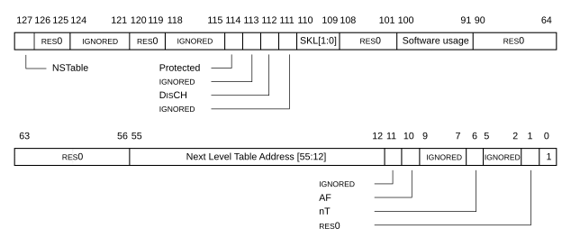
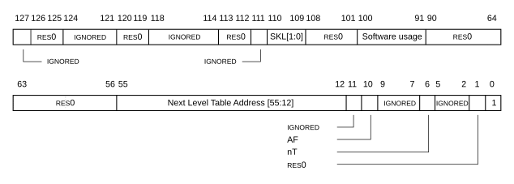
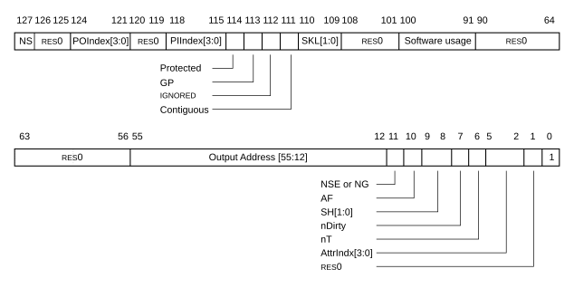
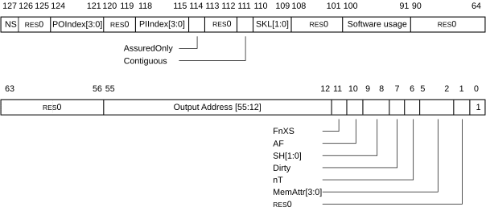

# ​D8.3.2 VMSAv9-128 descriptor formats

Source: <https://developer.arm.com/documentation/ddi0487/mc/-Part-D-The-AArch64-System-Level-Architecture/-Chapter-D8-The-AArch64-Virtual-Memory-System-Architecture/-D8-3-Translation-table-descriptor-formats/-D8-3-2-VMSAv9-128-descriptor-formats>

##### D8.3.2 VMSAv9-128 descriptor formats

###### D8.3.2.1 VMSAv9-128 Table descriptor format

I BCKNF
:   For stage 1 translations, the following figure shows the format of the VMSAv9-128 Table descriptor.

    Figure D8-18 Stage 1 VMSAv9-128 Table descriptor

    

R FHFQV
:   For stage 1 translations, the following table defines the fields in the VMSAv9-128 Table descriptor. In this table, NLTA is the next level table address.

<table>
 <caption>
  Table D8-56 Stage 1 VMSAv9-128 Table descriptor fields
 </caption>
 <colgroup>
  <col/>
  <col/>
  <col/>
 </colgroup>
 <thead>
  <tr>
   <th>
    Bit position
   </th>
   <th>
    Field
   </th>
   <th>
    Condition
   </th>
  </tr>
 </thead>
 <tbody>
  <tr>
   <td rowspan="2">
    [127]
   </td>
   <td>
    <small>
     RES0
    </small>
   </td>
   <td>
    The Security state is not Secure state.
   </td>
  </tr>
  <tr>
   <td>
    NSTable
   </td>
   <td>
    

     Secure state.
    

    

     See
     <a class="document-topic" document-topic-path="/ddi0487/mc/-Part-D-The-AArch64-System-Level-Architecture/-Chapter-D8-The-AArch64-Virtual-Memory-System-Architecture/-D8-4-Memory-access-control/-D8-4-6-Controlling-memory-access-Security-state?lang=en#mdsec_hierarchical_control_of_secure_or_non_secure_memory_accesses" href="/documentation/ddi0487/mc/-Part-D-The-AArch64-System-Level-Architecture/-Chapter-D8-The-AArch64-Virtual-Memory-System-Architecture/-D8-4-Memory-access-control/-D8-4-6-Controlling-memory-access-Security-state?lang=en#mdsec_hierarchical_control_of_secure_or_non_secure_memory_accesses">
      Hierarchical control of Secure or Non-secure memory accesses
     </a>
     .
    

   </td>
  </tr>
  <tr>
   <td>
    [126:125]
   </td>
   <td>
    <small>
     RES0
    </small>
   </td>
   <td>
    -
   </td>
  </tr>
  <tr>
   <td rowspan="2">
    [124:121]
   </td>
   <td>
    <small>
     RES0
    </small>
   </td>
   <td>
    Stage 1 Overlay permissions disabled.
   </td>
  </tr>
  <tr>
   <td>
    <small>
     IGNORED
    </small>
   </td>
   <td>
    Stage 1 Overlay permissions enabled. See
    <a class="document-topic" document-topic-path="/ddi0487/mc/-Part-D-The-AArch64-System-Level-Architecture/-Chapter-D8-The-AArch64-Virtual-Memory-System-Architecture/-D8-4-Memory-access-control/-D8-4-1-Stage-1-permissions?lang=en#mdsec_stage_1_overlay_permissions" href="/documentation/ddi0487/mc/-Part-D-The-AArch64-System-Level-Architecture/-Chapter-D8-The-AArch64-Virtual-Memory-System-Architecture/-D8-4-Memory-access-control/-D8-4-1-Stage-1-permissions?lang=en#mdsec_stage_1_overlay_permissions">
     Stage 1 Overlay permissions
    </a>
    .
   </td>
  </tr>
  <tr>
   <td>
    [120:119]
   </td>
   <td>
    <small>
     RES0
    </small>
   </td>
   <td>
    -
   </td>
  </tr>
  <tr>
   <td>
    [118:115]
   </td>
   <td>
    <small>
     IGNORED
    </small>
   </td>
   <td>
    -
   </td>
  </tr>
  <tr>
   <td rowspan="2">
    [114]
   </td>
   <td>
    <small>
     RES0
    </small>
   </td>
   <td>
    <a class="document-topic" document-topic-path="/ddi0487/mc/-Part-A-Arm-Architecture-Introduction-and-Overview/-Chapter-A2-A-profile-Architecture-Extensions/-A2-2-Armv8-A-architecture-extensions/-A2-2-10-The-Armv8-9-architecture-extension?lang=en#feat_feat_the" href="/documentation/ddi0487/mc/-Part-A-Arm-Architecture-Introduction-and-Overview/-Chapter-A2-A-profile-Architecture-Extensions/-A2-2-Armv8-A-architecture-extensions/-A2-2-10-The-Armv8-9-architecture-extension?lang=en#feat_feat_the">
     FEAT_THE
    </a>
    is not implemented.
   </td>
  </tr>
  <tr>
   <td>
    Protected
   </td>
   <td>
    

     <a class="document-topic" document-topic-path="/ddi0487/mc/-Part-A-Arm-Architecture-Introduction-and-Overview/-Chapter-A2-A-profile-Architecture-Extensions/-A2-2-Armv8-A-architecture-extensions/-A2-2-10-The-Armv8-9-architecture-extension?lang=en#feat_feat_the" href="/documentation/ddi0487/mc/-Part-A-Arm-Architecture-Introduction-and-Overview/-Chapter-A2-A-profile-Architecture-Extensions/-A2-2-Armv8-A-architecture-extensions/-A2-2-10-The-Armv8-9-architecture-extension?lang=en#feat_feat_the">
      FEAT_THE
     </a>
     is implemented.
    

    

     See
     <a class="document-topic" document-topic-path="/ddi0487/mc/-Part-D-The-AArch64-System-Level-Architecture/-Chapter-D8-The-AArch64-Virtual-Memory-System-Architecture/-D8-2-Translation-process/-D8-2-7-Translation-Hardening-Extension?lang=en#mdsec_stage_1_protected_attribute" href="/documentation/ddi0487/mc/-Part-D-The-AArch64-System-Level-Architecture/-Chapter-D8-The-AArch64-Virtual-Memory-System-Architecture/-D8-2-Translation-process/-D8-2-7-Translation-Hardening-Extension?lang=en#mdsec_stage_1_protected_attribute">
      Stage 1 Protected Attribute
     </a>
     .
    

   </td>
  </tr>
  <tr>
   <td>
    [113]
   </td>
   <td>
    <small>
     IGNORED
    </small>
   </td>
   <td>
    -
   </td>
  </tr>
  <tr>
   <td>
    [112]
   </td>
   <td>
    Disable contiguous bit (DisCH)
   </td>
   <td>
    

     -
    

    

     See
     <a class="document-topic" document-topic-path="/ddi0487/mc/-Part-D-The-AArch64-System-Level-Architecture/-Chapter-D8-The-AArch64-Virtual-Memory-System-Architecture/-D8-7-Other-descriptor-fields/-D8-7-1-The-Contiguous-bit?lang=en#mdsec_the_contiguous_bit" href="/documentation/ddi0487/mc/-Part-D-The-AArch64-System-Level-Architecture/-Chapter-D8-The-AArch64-Virtual-Memory-System-Architecture/-D8-7-Other-descriptor-fields/-D8-7-1-The-Contiguous-bit?lang=en#mdsec_the_contiguous_bit">
      The Contiguous bit
     </a>
     .
    

   </td>
  </tr>
  <tr>
   <td>
    [111]
   </td>
   <td>
    <small>
     IGNORED
    </small>
   </td>
   <td>
    -
   </td>
  </tr>
  <tr>
   <td>
    [110:109]
   </td>
   <td>
    Skip level (SKL)
   </td>
   <td>
    

     -
    

    

     See
     <a class="document-topic" document-topic-path="/ddi0487/mc/-Part-D-The-AArch64-System-Level-Architecture/-Chapter-D8-The-AArch64-Virtual-Memory-System-Architecture/-D8-2-Translation-process/-D8-2-11-Translation-using-the-VMSAv9-128-translation-system?lang=en#cacjaadib7" href="/documentation/ddi0487/mc/-Part-D-The-AArch64-System-Level-Architecture/-Chapter-D8-The-AArch64-Virtual-Memory-System-Architecture/-D8-2-Translation-process/-D8-2-11-Translation-using-the-VMSAv9-128-translation-system?lang=en#cacjaadib7">
      Translation using the VMSAv9-128 translation system
     </a>
     , and to determine the descriptor type,
     <a class="document-topic" document-topic-path="/ddi0487/mc/-Part-D-The-AArch64-System-Level-Architecture/-Chapter-D8-The-AArch64-Virtual-Memory-System-Architecture/-D8-3-Translation-table-descriptor-formats?lang=en#tbl_cachgbeac6" href="/documentation/ddi0487/mc/-Part-D-The-AArch64-System-Level-Architecture/-Chapter-D8-The-AArch64-Virtual-Memory-System-Architecture/-D8-3-Translation-table-descriptor-formats?lang=en#tbl_cachgbeac6">
      Table D8-49
     </a>
     .
    

   </td>
  </tr>
  <tr>
   <td>
    [108:101]
   </td>
   <td>
    <small>
     RES0
    </small>
   </td>
   <td>
    -
   </td>
  </tr>
  <tr>
   <td>
    [100:91]
   </td>
   <td>
    Software usage
   </td>
   <td>
    -
   </td>
  </tr>
  <tr>
   <td>
    [90:56]
   </td>
   <td>
    <small>
     RES0
    </small>
   </td>
   <td>
    -
   </td>
  </tr>
  <tr>
   <td rowspan="3">
    [55:12]
   </td>
   <td>
    NLTA[55:12]
   </td>
   <td>
    4KB translation granule.
   </td>
  </tr>
  <tr>
   <td>
    NLTA[55:14]
   </td>
   <td>
    

     16KB translation granule.
    

    

     Descriptor bits [13:12] are
     <small>
      RES0
     </small>
     .
    

   </td>
  </tr>
  <tr>
   <td>
    NLTA[55:16]
   </td>
   <td>
    

     64KB translation granule.
    

    

     Descriptor bits [15:12] are
     <small>
      RES0
     </small>
     .
    

   </td>
  </tr>
  <tr>
   <td rowspan="2">
    [11]
   </td>
   <td>
    <small>
     RES0
    </small>
   </td>
   <td>
    The translation regime supports a single privilege level and the Security state is not Root state.
   </td>
  </tr>
  <tr>
   <td>
    <small>
     IGNORED
    </small>
   </td>
   <td>
    The translation regime supports two privilege levels or the Security state is Root state.
   </td>
  </tr>
  <tr>
   <td rowspan="2">
    [10]
   </td>
   <td>
    <small>
     IGNORED
    </small>
   </td>
   <td>
    Hardware managed Table descriptor Access flag is not enabled.
   </td>
  </tr>
  <tr>
   <td>
    Access flag (AF)
   </td>
   <td>
    

     Hardware managed Table descriptor Access flag is enabled.
    

    

     See
     <a class="document-topic" document-topic-path="/ddi0487/mc/-Part-D-The-AArch64-System-Level-Architecture/-Chapter-D8-The-AArch64-Virtual-Memory-System-Architecture/-D8-5-Hardware-updates-to-the-translation-tables/-D8-5-1-The-Access-flag?lang=en#cacbiegje5" href="/documentation/ddi0487/mc/-Part-D-The-AArch64-System-Level-Architecture/-Chapter-D8-The-AArch64-Virtual-Memory-System-Architecture/-D8-5-Hardware-updates-to-the-translation-tables/-D8-5-1-The-Access-flag?lang=en#cacbiegje5">
      Hardware management of the Table descriptor Access Flag
     </a>
     .
    

   </td>
  </tr>
  <tr>
   <td>
    [9:7]
   </td>
   <td>
    <small>
     IGNORED
    </small>
   </td>
   <td>
    -
   </td>
  </tr>
  <tr>
   <td rowspan="2">
    [6]
   </td>
   <td>
    <small>
     RES0
    </small>
   </td>
   <td>
    SKL is
    <code>
     0b00
    </code>
    .
   </td>
  </tr>
  <tr>
   <td>
    nT
   </td>
   <td>
    

     SKL is not
     <code>
      0b00
     </code>
     .
    

    

     See
     <a class="document-topic" document-topic-path="/ddi0487/mc/-Part-D-The-AArch64-System-Level-Architecture/-Chapter-D8-The-AArch64-Virtual-Memory-System-Architecture/-D8-7-Other-descriptor-fields/-D8-7-3-Table-and-Block-entry?lang=en#mdsec_table_block_entry" href="/documentation/ddi0487/mc/-Part-D-The-AArch64-System-Level-Architecture/-Chapter-D8-The-AArch64-Virtual-Memory-System-Architecture/-D8-7-Other-descriptor-fields/-D8-7-3-Table-and-Block-entry?lang=en#mdsec_table_block_entry">
      Table and Block entry
     </a>
     .
    

   </td>
  </tr>
  <tr>
   <td>
    [5:2]
   </td>
   <td>
    <small>
     IGNORED
    </small>
   </td>
   <td>
    -
   </td>
  </tr>
  <tr>
   <td>
    [1]
   </td>
   <td>
    <small>
     RES0
    </small>
   </td>
   <td>
    -
   </td>
  </tr>
  <tr>
   <td>
    [0]
   </td>
   <td>
    Valid descriptor
   </td>
   <td>
    1.
   </td>
  </tr>
 </tbody>
</table>

I TKQXW
:   For stage 2 translations, the following figure shows the format of the VMSAv9-128 Table descriptor.

    Figure D8-19 Stage 2 VMSAv9-128 Table descriptor

    

R MYLYC
:   For stage 2 translations, the following table defines the fields in the VMSAv9-128 Table descriptor. In this table, NLTA is the next level table address.

<table>
 <caption>
  Table D8-57 Stage 2 VMSAv9-128 Table descriptor fields
 </caption>
 <colgroup>
  <col/>
  <col/>
  <col/>
 </colgroup>
 <thead>
  <tr>
   <th>
    Bit position
   </th>
   <th>
    Field
   </th>
   <th>
    Condition
   </th>
  </tr>
 </thead>
 <tbody>
  <tr>
   <td rowspan="2">
    [127]
   </td>
   <td>
    <small>
     IGNORED
    </small>
   </td>
   <td>
    Realm EL1&amp;0 translation regime.
   </td>
  </tr>
  <tr>
   <td>
    <small>
     RES0
    </small>
   </td>
   <td>
    Translation regime is not the Realm EL1&amp;0 translation regime.
   </td>
  </tr>
  <tr>
   <td>
    [126:125]
   </td>
   <td>
    <small>
     RES0
    </small>
   </td>
   <td>
    -
   </td>
  </tr>
  <tr>
   <td rowspan="2">
    [124:121]
   </td>
   <td>
    <small>
     RES0
    </small>
   </td>
   <td>
    Stage 2 Overlay permissions disabled.
   </td>
  </tr>
  <tr>
   <td>
    <small>
     IGNORED
    </small>
   </td>
   <td>
    

     Stage 2 Overlay permissions enabled.
    

    

     See
     <a class="document-topic" document-topic-path="/ddi0487/mc/-Part-D-The-AArch64-System-Level-Architecture/-Chapter-D8-The-AArch64-Virtual-Memory-System-Architecture/-D8-4-Memory-access-control/-D8-4-2-Stage-2-permissions?lang=en#mdsec_stage_2_overlay_permissions" href="/documentation/ddi0487/mc/-Part-D-The-AArch64-System-Level-Architecture/-Chapter-D8-The-AArch64-Virtual-Memory-System-Architecture/-D8-4-Memory-access-control/-D8-4-2-Stage-2-permissions?lang=en#mdsec_stage_2_overlay_permissions">
      Stage 2 Overlay permissions
     </a>
     .
    

   </td>
  </tr>
  <tr>
   <td>
    [120:119]
   </td>
   <td>
    <small>
     RES0
    </small>
   </td>
   <td>
    -
   </td>
  </tr>
  <tr>
   <td>
    [118:115]
   </td>
   <td>
    <small>
     IGNORED
    </small>
   </td>
   <td>
    -
   </td>
  </tr>
  <tr>
   <td rowspan="2">
    [114]
   </td>
   <td>
    <small>
     RES0
    </small>
   </td>
   <td>
    <a class="document-topic" document-topic-path="/ddi0487/mc/-Part-A-Arm-Architecture-Introduction-and-Overview/-Chapter-A2-A-profile-Architecture-Extensions/-A2-2-Armv8-A-architecture-extensions/-A2-2-10-The-Armv8-9-architecture-extension?lang=en#feat_feat_the" href="/documentation/ddi0487/mc/-Part-A-Arm-Architecture-Introduction-and-Overview/-Chapter-A2-A-profile-Architecture-Extensions/-A2-2-Armv8-A-architecture-extensions/-A2-2-10-The-Armv8-9-architecture-extension?lang=en#feat_feat_the">
     FEAT_THE
    </a>
    is not implemented.
   </td>
  </tr>
  <tr>
   <td>
    <small>
     IGNORED
    </small>
   </td>
   <td>
    <a class="document-topic" document-topic-path="/ddi0487/mc/-Part-A-Arm-Architecture-Introduction-and-Overview/-Chapter-A2-A-profile-Architecture-Extensions/-A2-2-Armv8-A-architecture-extensions/-A2-2-10-The-Armv8-9-architecture-extension?lang=en#feat_feat_the" href="/documentation/ddi0487/mc/-Part-A-Arm-Architecture-Introduction-and-Overview/-Chapter-A2-A-profile-Architecture-Extensions/-A2-2-Armv8-A-architecture-extensions/-A2-2-10-The-Armv8-9-architecture-extension?lang=en#feat_feat_the">
     FEAT_THE
    </a>
    is implemented.
   </td>
  </tr>
  <tr>
   <td>
    [113:112]
   </td>
   <td>
    <small>
     RES0
    </small>
   </td>
   <td>
    -
   </td>
  </tr>
  <tr>
   <td>
    [111]
   </td>
   <td>
    <small>
     IGNORED
    </small>
   </td>
   <td>
    -
   </td>
  </tr>
  <tr>
   <td>
    [110:109]
   </td>
   <td>
    Skip level (SKL)
   </td>
   <td>
    

     -
    

    

     See
     <a class="document-topic" document-topic-path="/ddi0487/mc/-Part-D-The-AArch64-System-Level-Architecture/-Chapter-D8-The-AArch64-Virtual-Memory-System-Architecture/-D8-2-Translation-process/-D8-2-11-Translation-using-the-VMSAv9-128-translation-system?lang=en#cacjaadib7" href="/documentation/ddi0487/mc/-Part-D-The-AArch64-System-Level-Architecture/-Chapter-D8-The-AArch64-Virtual-Memory-System-Architecture/-D8-2-Translation-process/-D8-2-11-Translation-using-the-VMSAv9-128-translation-system?lang=en#cacjaadib7">
      Translation using the VMSAv9-128 translation system
     </a>
     , and to determine the descriptor type,
     <a class="document-topic" document-topic-path="/ddi0487/mc/-Part-D-The-AArch64-System-Level-Architecture/-Chapter-D8-The-AArch64-Virtual-Memory-System-Architecture/-D8-3-Translation-table-descriptor-formats?lang=en#tbl_cachgbeac6" href="/documentation/ddi0487/mc/-Part-D-The-AArch64-System-Level-Architecture/-Chapter-D8-The-AArch64-Virtual-Memory-System-Architecture/-D8-3-Translation-table-descriptor-formats?lang=en#tbl_cachgbeac6">
      Table D8-49
     </a>
     .
    

   </td>
  </tr>
  <tr>
   <td>
    [108:101]
   </td>
   <td>
    <small>
     RES0
    </small>
   </td>
   <td>
    -
   </td>
  </tr>
  <tr>
   <td>
    [100:91]
   </td>
   <td>
    Software usage
   </td>
   <td>
    -
   </td>
  </tr>
  <tr>
   <td>
    [90:56]
   </td>
   <td>
    <small>
     RES0
    </small>
   </td>
   <td>
    -
   </td>
  </tr>
  <tr>
   <td rowspan="3">
    [55:12]
   </td>
   <td>
    NLTA[55:12]
   </td>
   <td>
    4KB translation granule.
   </td>
  </tr>
  <tr>
   <td>
    NLTA[55:14]
   </td>
   <td>
    

     16KB translation granule.
    

    

     Descriptor bits [13:12] are
     <small>
      RES0
     </small>
     .
    

   </td>
  </tr>
  <tr>
   <td>
    NLTA[55:16]
   </td>
   <td>
    

     64KB translation granule.
    

    

     Descriptor bits [15:12] are
     <small>
      RES0
     </small>
     .
    

   </td>
  </tr>
  <tr>
   <td>
    [11]
   </td>
   <td>
    <small>
     IGNORED
    </small>
   </td>
   <td>
    -
   </td>
  </tr>
  <tr>
   <td rowspan="2">
    [10]
   </td>
   <td>
    <small>
     IGNORED
    </small>
   </td>
   <td>
    Hardware managed Table descriptor Access flag is not enabled.
   </td>
  </tr>
  <tr>
   <td>
    Access flag (AF)
   </td>
   <td>
    

     Hardware managed Table descriptor Access flag is enabled.
    

    

     See
     <a class="document-topic" document-topic-path="/ddi0487/mc/-Part-D-The-AArch64-System-Level-Architecture/-Chapter-D8-The-AArch64-Virtual-Memory-System-Architecture/-D8-5-Hardware-updates-to-the-translation-tables/-D8-5-1-The-Access-flag?lang=en#cacbiegje5" href="/documentation/ddi0487/mc/-Part-D-The-AArch64-System-Level-Architecture/-Chapter-D8-The-AArch64-Virtual-Memory-System-Architecture/-D8-5-Hardware-updates-to-the-translation-tables/-D8-5-1-The-Access-flag?lang=en#cacbiegje5">
      Hardware management of the Table descriptor Access Flag
     </a>
     .
    

   </td>
  </tr>
  <tr>
   <td>
    [9:7]
   </td>
   <td>
    <small>
     IGNORED
    </small>
   </td>
   <td>
    -
   </td>
  </tr>
  <tr>
   <td rowspan="2">
    [6]
   </td>
   <td>
    <small>
     RES0
    </small>
   </td>
   <td>
    SKL is
    <code>
     0b00
    </code>
    .
   </td>
  </tr>
  <tr>
   <td>
    nT
   </td>
   <td>
    

     SKL is not
     <code>
      0b00
     </code>
     .
    

    

     See
     <a class="document-topic" document-topic-path="/ddi0487/mc/-Part-D-The-AArch64-System-Level-Architecture/-Chapter-D8-The-AArch64-Virtual-Memory-System-Architecture/-D8-7-Other-descriptor-fields/-D8-7-3-Table-and-Block-entry?lang=en#mdsec_table_block_entry" href="/documentation/ddi0487/mc/-Part-D-The-AArch64-System-Level-Architecture/-Chapter-D8-The-AArch64-Virtual-Memory-System-Architecture/-D8-7-Other-descriptor-fields/-D8-7-3-Table-and-Block-entry?lang=en#mdsec_table_block_entry">
      Block translation entry
     </a>
     .
    

   </td>
  </tr>
  <tr>
   <td>
    [5:2]
   </td>
   <td>
    <small>
     IGNORED
    </small>
   </td>
   <td>
    -
   </td>
  </tr>
  <tr>
   <td>
    [1]
   </td>
   <td>
    <small>
     RES0
    </small>
   </td>
   <td>
    -
   </td>
  </tr>
  <tr>
   <td>
    [0]
   </td>
   <td>
    Valid descriptor
   </td>
   <td>
    1.
   </td>
  </tr>
 </tbody>
</table>

###### D8.3.2.2 VMSAv9-128 Block descriptor and Page descriptor formats

I YCWMS
:   For stage 1 translations, the following figure shows the format of the VMSAv9-128 Block and Page descriptor.

    Figure D8-20 Stage 1 VMSAv9-128 Block and Page descriptor

    

R FPNKM
:   For stage 1 translations, the following table defines the fields in the VMSAv9-128 Block and Page descriptor. In this table, OAB is the OA base that is appended to the IA supplied to the translation stage to produce the final OA supplied by the translation stage.

<table>
 <caption>
  Table D8-58 Stage 1 VMSAv9-128 Block and Page descriptor fields
 </caption>
 <colgroup>
  <col/>
  <col/>
  <col/>
 </colgroup>
 <thead>
  <tr>
   <th>
    Bit position
   </th>
   <th>
    Field
   </th>
   <th>
    Condition
   </th>
  </tr>
 </thead>
 <tbody>
  <tr>
   <td rowspan="2">
    [127]
   </td>
   <td>
    <small>
     RES0
    </small>
   </td>
   <td>
    The access is from Non-secure state, or from Realm state using the EL1&amp;0 translation regime.
   </td>
  </tr>
  <tr>
   <td>
    NS
   </td>
   <td>
    The access is from Secure state, from Realm state using the EL2 or EL2&amp;0 translation regimes, or from Root state.
   </td>
  </tr>
  <tr>
   <td>
    [126:125]
   </td>
   <td>
    <small>
     RES0
    </small>
   </td>
   <td>
    -
   </td>
  </tr>
  <tr>
   <td rowspan="2">
    [124:121]
   </td>
   <td>
    <small>
     RES0
    </small>
   </td>
   <td>
    Stage 1 Overlay permissions disabled.
   </td>
  </tr>
  <tr>
   <td>
    POIndex[3:0]
   </td>
   <td>
    

     Stage 1 Overlay permissions enabled.
    

    

     See
     <a class="document-topic" document-topic-path="/ddi0487/mc/-Part-D-The-AArch64-System-Level-Architecture/-Chapter-D8-The-AArch64-Virtual-Memory-System-Architecture/-D8-4-Memory-access-control/-D8-4-1-Stage-1-permissions?lang=en#mdsec_stage_1_overlay_permissions" href="/documentation/ddi0487/mc/-Part-D-The-AArch64-System-Level-Architecture/-Chapter-D8-The-AArch64-Virtual-Memory-System-Architecture/-D8-4-Memory-access-control/-D8-4-1-Stage-1-permissions?lang=en#mdsec_stage_1_overlay_permissions">
      Stage 1 Overlay permissions
     </a>
     .
    

   </td>
  </tr>
  <tr>
   <td>
    [120:119]
   </td>
   <td>
    <small>
     RES0
    </small>
   </td>
   <td>
    -
   </td>
  </tr>
  <tr>
   <td>
    [118:115]
   </td>
   <td>
    PIIndex[3:0]
   </td>
   <td>
    -
   </td>
  </tr>
  <tr>
   <td rowspan="2">
    [114]
   </td>
   <td>
    <small>
     RES0
    </small>
   </td>
   <td>
    <a class="document-topic" document-topic-path="/ddi0487/mc/-Part-A-Arm-Architecture-Introduction-and-Overview/-Chapter-A2-A-profile-Architecture-Extensions/-A2-2-Armv8-A-architecture-extensions/-A2-2-10-The-Armv8-9-architecture-extension?lang=en#feat_feat_the" href="/documentation/ddi0487/mc/-Part-A-Arm-Architecture-Introduction-and-Overview/-Chapter-A2-A-profile-Architecture-Extensions/-A2-2-Armv8-A-architecture-extensions/-A2-2-10-The-Armv8-9-architecture-extension?lang=en#feat_feat_the">
     FEAT_THE
    </a>
    is not implemented.
   </td>
  </tr>
  <tr>
   <td>
    Protected
   </td>
   <td>
    

     <a class="document-topic" document-topic-path="/ddi0487/mc/-Part-A-Arm-Architecture-Introduction-and-Overview/-Chapter-A2-A-profile-Architecture-Extensions/-A2-2-Armv8-A-architecture-extensions/-A2-2-10-The-Armv8-9-architecture-extension?lang=en#feat_feat_the" href="/documentation/ddi0487/mc/-Part-A-Arm-Architecture-Introduction-and-Overview/-Chapter-A2-A-profile-Architecture-Extensions/-A2-2-Armv8-A-architecture-extensions/-A2-2-10-The-Armv8-9-architecture-extension?lang=en#feat_feat_the">
      FEAT_THE
     </a>
     is implemented.
    

    

     See
     <a class="document-topic" document-topic-path="/ddi0487/mc/-Part-D-The-AArch64-System-Level-Architecture/-Chapter-D8-The-AArch64-Virtual-Memory-System-Architecture/-D8-2-Translation-process/-D8-2-7-Translation-Hardening-Extension?lang=en#mdsec_stage_1_protected_attribute" href="/documentation/ddi0487/mc/-Part-D-The-AArch64-System-Level-Architecture/-Chapter-D8-The-AArch64-Virtual-Memory-System-Architecture/-D8-2-Translation-process/-D8-2-7-Translation-Hardening-Extension?lang=en#mdsec_stage_1_protected_attribute">
      Stage 1 Protected Attribute
     </a>
     .
    

   </td>
  </tr>
  <tr>
   <td>
    [113]
   </td>
   <td>
    Guarded Page (GP)
   </td>
   <td>
    

     -
    

    

     See
     <a class="document-topic" document-topic-path="/ddi0487/mc/-Part-D-The-AArch64-System-Level-Architecture/-Chapter-D8-The-AArch64-Virtual-Memory-System-Architecture/-D8-4-Memory-access-control/-D8-4-5-Effect-of-PSTATE-on-access-permission?lang=en#mdsec_pstate_btype" href="/documentation/ddi0487/mc/-Part-D-The-AArch64-System-Level-Architecture/-Chapter-D8-The-AArch64-Virtual-Memory-System-Architecture/-D8-4-Memory-access-control/-D8-4-5-Effect-of-PSTATE-on-access-permission?lang=en#mdsec_pstate_btype">
      PSTATE.BTYPE
     </a>
     .
    

   </td>
  </tr>
  <tr>
   <td>
    [112]
   </td>
   <td>
    <small>
     IGNORED
    </small>
   </td>
   <td>
    -
   </td>
  </tr>
  <tr>
   <td>
    [111]
   </td>
   <td>
    Contiguous
   </td>
   <td>
    

     -
    

    

     See
     <a class="document-topic" document-topic-path="/ddi0487/mc/-Part-D-The-AArch64-System-Level-Architecture/-Chapter-D8-The-AArch64-Virtual-Memory-System-Architecture/-D8-7-Other-descriptor-fields/-D8-7-1-The-Contiguous-bit?lang=en#mdsec_the_contiguous_bit" href="/documentation/ddi0487/mc/-Part-D-The-AArch64-System-Level-Architecture/-Chapter-D8-The-AArch64-Virtual-Memory-System-Architecture/-D8-7-Other-descriptor-fields/-D8-7-1-The-Contiguous-bit?lang=en#mdsec_the_contiguous_bit">
      The Contiguous bit
     </a>
     .
    

   </td>
  </tr>
  <tr>
   <td>
    [110:109]
   </td>
   <td>
    Skip level (SKL)
   </td>
   <td>
    

     -
    

    

     See
     <a class="document-topic" document-topic-path="/ddi0487/mc/-Part-D-The-AArch64-System-Level-Architecture/-Chapter-D8-The-AArch64-Virtual-Memory-System-Architecture/-D8-2-Translation-process/-D8-2-11-Translation-using-the-VMSAv9-128-translation-system?lang=en#cacjaadib7" href="/documentation/ddi0487/mc/-Part-D-The-AArch64-System-Level-Architecture/-Chapter-D8-The-AArch64-Virtual-Memory-System-Architecture/-D8-2-Translation-process/-D8-2-11-Translation-using-the-VMSAv9-128-translation-system?lang=en#cacjaadib7">
      Translation using the VMSAv9-128 translation system
     </a>
     , and to determine the descriptor type,
     <a class="document-topic" document-topic-path="/ddi0487/mc/-Part-D-The-AArch64-System-Level-Architecture/-Chapter-D8-The-AArch64-Virtual-Memory-System-Architecture/-D8-3-Translation-table-descriptor-formats?lang=en#tbl_cachgbeac6" href="/documentation/ddi0487/mc/-Part-D-The-AArch64-System-Level-Architecture/-Chapter-D8-The-AArch64-Virtual-Memory-System-Architecture/-D8-3-Translation-table-descriptor-formats?lang=en#tbl_cachgbeac6">
      Table D8-49
     </a>
     .
    

   </td>
  </tr>
  <tr>
   <td>
    [108:101]
   </td>
   <td>
    <small>
     RES0
    </small>
   </td>
   <td>
    -
   </td>
  </tr>
  <tr>
   <td>
    [100:91]
   </td>
   <td>
    Software usage
   </td>
   <td>
    -
   </td>
  </tr>
  <tr>
   <td>
    [90:56]
   </td>
   <td>
    <small>
     RES0
    </small>
   </td>
   <td>
    -
   </td>
  </tr>
  <tr>
   <td rowspan="3">
    [55:12]
   </td>
   <td>
    OAB[55:12]
   </td>
   <td>
    4KB translation granule.
   </td>
  </tr>
  <tr>
   <td>
    OAB[55:14]
   </td>
   <td>
    

     16KB translation granule.
    

    

     Descriptor bits [13:12] are
     <small>
      RES0
     </small>
     .
    

   </td>
  </tr>
  <tr>
   <td>
    OAB[55:16]
   </td>
   <td>
    

     64KB translation granule.
    

    

     Descriptor bits [15:12] are
     <small>
      RES0
     </small>
     .
    

   </td>
  </tr>
  <tr>
   <td rowspan="4">
    [11]
   </td>
   <td>
    <small>
     RES0
    </small>
   </td>
   <td>
    The translation regime supports a single privilege level and the Security state is not Root state.
   </td>
  </tr>
  <tr>
   <td>
    NSE
   </td>
   <td>
    

     Root state.
    

    

     See
     <a class="document-topic" document-topic-path="/ddi0487/mc/-Part-D-The-AArch64-System-Level-Architecture/-Chapter-D8-The-AArch64-Virtual-Memory-System-Architecture/-D8-4-Memory-access-control/-D8-4-6-Controlling-memory-access-Security-state?lang=en#mdsec_control_of_secure_or_non_secure_memory_access" href="/documentation/ddi0487/mc/-Part-D-The-AArch64-System-Level-Architecture/-Chapter-D8-The-AArch64-Virtual-Memory-System-Architecture/-D8-4-Memory-access-control/-D8-4-6-Controlling-memory-access-Security-state?lang=en#mdsec_control_of_secure_or_non_secure_memory_access">
      Controlling memory access Security state
     </a>
     .
    

   </td>
  </tr>
  <tr>
   <td>
    Not global (nG)
   </td>
   <td>
    

     The translation regime supports two privilege levels.
    

    

     See
     <a class="document-topic" document-topic-path="/ddi0487/mc/-Part-D-The-AArch64-System-Level-Architecture/-Chapter-D8-The-AArch64-Virtual-Memory-System-Architecture/-D8-16-Translation-Lookaside-Buffers/-D8-16-3-Use-of-ASIDs-and-VMIDs-to-reduce-TLB-maintenance-requirements?lang=en#mdsec_global_and_process_specific_translation_table_entries" href="/documentation/ddi0487/mc/-Part-D-The-AArch64-System-Level-Architecture/-Chapter-D8-The-AArch64-Virtual-Memory-System-Architecture/-D8-16-Translation-Lookaside-Buffers/-D8-16-3-Use-of-ASIDs-and-VMIDs-to-reduce-TLB-maintenance-requirements?lang=en#mdsec_global_and_process_specific_translation_table_entries">
      Global and process-specific translation table entries
     </a>
     .
    

   </td>
  </tr>
  <tr>
   <td>
    <small>
     IGNORED
    </small>
   </td>
   <td>
    

     The
     <a class="document-topic" document-topic-path="/ddi0487/mc/-Part-K-Appendixes/Glossary?lang=en#effective_value" href="/documentation/ddi0487/mc/-Part-K-Appendixes/Glossary?lang=en#effective_value">
      Effective value
     </a>
     of
     <a class="document-topic" document-topic-path="/ddi0487/mc/-Part-K-Appendixes/-Appendix-K14-Registers-Index/-K14-1-Introduction-and-register-disambiguation/-K14-1-2-Register-name-disambiguation-by-Exception-level?lang=en#tcr2_elx" href="/documentation/ddi0487/mc/-Part-K-Appendixes/-Appendix-K14-Registers-Index/-K14-1-Introduction-and-register-disambiguation/-K14-1-2-Register-name-disambiguation-by-Exception-level?lang=en#tcr2_elx">
      TCR2_ELx
     </a>
     .FNGy is 1, where y is {0, 1}.
    

    

     See
     <a class="document-topic" document-topic-path="/ddi0487/mc/-Part-D-The-AArch64-System-Level-Architecture/-Chapter-D8-The-AArch64-Virtual-Memory-System-Architecture/-D8-16-Translation-Lookaside-Buffers/-D8-16-3-Use-of-ASIDs-and-VMIDs-to-reduce-TLB-maintenance-requirements?lang=en#kdvgw" href="/documentation/ddi0487/mc/-Part-D-The-AArch64-System-Level-Architecture/-Chapter-D8-The-AArch64-Virtual-Memory-System-Architecture/-D8-16-Translation-Lookaside-Buffers/-D8-16-3-Use-of-ASIDs-and-VMIDs-to-reduce-TLB-maintenance-requirements?lang=en#kdvgw">
      R
      
       KDVGW
      
     </a>
     in
     <a class="document-topic" document-topic-path="/ddi0487/mc/-Part-D-The-AArch64-System-Level-Architecture/-Chapter-D8-The-AArch64-Virtual-Memory-System-Architecture/-D8-16-Translation-Lookaside-Buffers/-D8-16-3-Use-of-ASIDs-and-VMIDs-to-reduce-TLB-maintenance-requirements?lang=en#mdsec_use_of_asids_and_vmids_to_reduce_tlb_maintenance_requirements" href="/documentation/ddi0487/mc/-Part-D-The-AArch64-System-Level-Architecture/-Chapter-D8-The-AArch64-Virtual-Memory-System-Architecture/-D8-16-Translation-Lookaside-Buffers/-D8-16-3-Use-of-ASIDs-and-VMIDs-to-reduce-TLB-maintenance-requirements?lang=en#mdsec_use_of_asids_and_vmids_to_reduce_tlb_maintenance_requirements">
      Use of ASIDs and VMIDs to reduce TLB maintenance requirements
     </a>
     .
    

   </td>
  </tr>
  <tr>
   <td>
    [10]
   </td>
   <td>
    Access flag (AF)
   </td>
   <td>
    

     -
    

    

     See
     <a class="document-topic" document-topic-path="/ddi0487/mc/-Part-D-The-AArch64-System-Level-Architecture/-Chapter-D8-The-AArch64-Virtual-Memory-System-Architecture/-D8-5-Hardware-updates-to-the-translation-tables/-D8-5-1-The-Access-flag?lang=en#mdsec_the_access_flag" href="/documentation/ddi0487/mc/-Part-D-The-AArch64-System-Level-Architecture/-Chapter-D8-The-AArch64-Virtual-Memory-System-Architecture/-D8-5-Hardware-updates-to-the-translation-tables/-D8-5-1-The-Access-flag?lang=en#mdsec_the_access_flag">
      The Access flag
     </a>
     .
    

   </td>
  </tr>
  <tr>
   <td>
    [9:8]
   </td>
   <td>
    Shareability (SH[1:0])
   </td>
   <td>
    

     -
    

    

     See
     <a class="document-topic" document-topic-path="/ddi0487/mc/-Part-D-The-AArch64-System-Level-Architecture/-Chapter-D8-The-AArch64-Virtual-Memory-System-Architecture/-D8-6-Memory-region-attributes/-D8-6-2-Stage-1-Shareability-attributes?lang=en#mdsec_stage_1_shareability_attributes" href="/documentation/ddi0487/mc/-Part-D-The-AArch64-System-Level-Architecture/-Chapter-D8-The-AArch64-Virtual-Memory-System-Architecture/-D8-6-Memory-region-attributes/-D8-6-2-Stage-1-Shareability-attributes?lang=en#mdsec_stage_1_shareability_attributes">
      Stage 1 Shareability attributes
     </a>
     .
    

   </td>
  </tr>
  <tr>
   <td>
    [7]
   </td>
   <td>
    nDirty
   </td>
   <td>
    

     -
    

    

     See
     <a class="document-topic" document-topic-path="/ddi0487/mc/-Part-D-The-AArch64-System-Level-Architecture/-Chapter-D8-The-AArch64-Virtual-Memory-System-Architecture/-D8-5-Hardware-updates-to-the-translation-tables/-D8-5-2-The-dirty-state?lang=en#mdsec_the_dirty_state" href="/documentation/ddi0487/mc/-Part-D-The-AArch64-System-Level-Architecture/-Chapter-D8-The-AArch64-Virtual-Memory-System-Architecture/-D8-5-Hardware-updates-to-the-translation-tables/-D8-5-2-The-dirty-state?lang=en#mdsec_the_dirty_state">
      The dirty state
     </a>
     .
    

   </td>
  </tr>
  <tr>
   <td rowspan="2">
    [6]
   </td>
   <td>
    <small>
     RES0
    </small>
   </td>
   <td>
    SKL is
    <code>
     0b00
    </code>
    .
   </td>
  </tr>
  <tr>
   <td>
    nT
   </td>
   <td>
    

     SKL is not
     <code>
      0b00
     </code>
     .
    

    

     See
     <a class="document-topic" document-topic-path="/ddi0487/mc/-Part-D-The-AArch64-System-Level-Architecture/-Chapter-D8-The-AArch64-Virtual-Memory-System-Architecture/-D8-7-Other-descriptor-fields/-D8-7-3-Table-and-Block-entry?lang=en#mdsec_table_block_entry" href="/documentation/ddi0487/mc/-Part-D-The-AArch64-System-Level-Architecture/-Chapter-D8-The-AArch64-Virtual-Memory-System-Architecture/-D8-7-Other-descriptor-fields/-D8-7-3-Table-and-Block-entry?lang=en#mdsec_table_block_entry">
      Block translation entry
     </a>
     .
    

   </td>
  </tr>
  <tr>
   <td rowspan="2">
    [5]
   </td>
   <td>
    <small>
     IGNORED
    </small>
   </td>
   <td>
    <a class="document-topic" document-topic-path="/ddi0487/mc/-Part-A-Arm-Architecture-Introduction-and-Overview/-Chapter-A2-A-profile-Architecture-Extensions/-A2-2-Armv8-A-architecture-extensions/-A2-2-10-The-Armv8-9-architecture-extension?lang=en#feat_feat_aie" href="/documentation/ddi0487/mc/-Part-A-Arm-Architecture-Introduction-and-Overview/-Chapter-A2-A-profile-Architecture-Extensions/-A2-2-Armv8-A-architecture-extensions/-A2-2-10-The-Armv8-9-architecture-extension?lang=en#feat_feat_aie">
     FEAT_AIE
    </a>
    is not implemented or not enabled.
   </td>
  </tr>
  <tr>
   <td>
    AttrIndx[3]
   </td>
   <td>
    

     <a class="document-topic" document-topic-path="/ddi0487/mc/-Part-A-Arm-Architecture-Introduction-and-Overview/-Chapter-A2-A-profile-Architecture-Extensions/-A2-2-Armv8-A-architecture-extensions/-A2-2-10-The-Armv8-9-architecture-extension?lang=en#feat_feat_aie" href="/documentation/ddi0487/mc/-Part-A-Arm-Architecture-Introduction-and-Overview/-Chapter-A2-A-profile-Architecture-Extensions/-A2-2-Armv8-A-architecture-extensions/-A2-2-10-The-Armv8-9-architecture-extension?lang=en#feat_feat_aie">
      FEAT_AIE
     </a>
     is implemented and enabled.
    

    

     See
     <a class="document-topic" document-topic-path="/ddi0487/mc/-Part-D-The-AArch64-System-Level-Architecture/-Chapter-D8-The-AArch64-Virtual-Memory-System-Architecture/-D8-6-Memory-region-attributes/-D8-6-1-Stage-1-memory-type-and-Cacheability-attributes?lang=en#mdsec_stage_1_memory_type_and_cacheability_attributes" href="/documentation/ddi0487/mc/-Part-D-The-AArch64-System-Level-Architecture/-Chapter-D8-The-AArch64-Virtual-Memory-System-Architecture/-D8-6-Memory-region-attributes/-D8-6-1-Stage-1-memory-type-and-Cacheability-attributes?lang=en#mdsec_stage_1_memory_type_and_cacheability_attributes">
      Stage 1 memory type and Cacheability attributes
     </a>
     .
    

   </td>
  </tr>
  <tr>
   <td>
    [4:2]
   </td>
   <td>
    AttrIndx[2:0]
   </td>
   <td>
    

     -
    

    

     See
     <a class="document-topic" document-topic-path="/ddi0487/mc/-Part-D-The-AArch64-System-Level-Architecture/-Chapter-D8-The-AArch64-Virtual-Memory-System-Architecture/-D8-6-Memory-region-attributes/-D8-6-1-Stage-1-memory-type-and-Cacheability-attributes?lang=en#mdsec_stage_1_memory_type_and_cacheability_attributes" href="/documentation/ddi0487/mc/-Part-D-The-AArch64-System-Level-Architecture/-Chapter-D8-The-AArch64-Virtual-Memory-System-Architecture/-D8-6-Memory-region-attributes/-D8-6-1-Stage-1-memory-type-and-Cacheability-attributes?lang=en#mdsec_stage_1_memory_type_and_cacheability_attributes">
      Stage 1 memory type and Cacheability attributes
     </a>
     .
    

   </td>
  </tr>
  <tr>
   <td>
    [1]
   </td>
   <td>
    <small>
     RES0
    </small>
   </td>
   <td>
    -
   </td>
  </tr>
  <tr>
   <td>
    [0]
   </td>
   <td>
    Valid descriptor
   </td>
   <td>
    1.
   </td>
  </tr>
 </tbody>
</table>

I LFZDC
:   For stage 2 translations, the following figure shows the format of the VMSAv9-128 Block and Page descriptor. In this table, OAB is the OA base that is appended to the IA supplied to the translation stage to produce the final OA supplied by the translation stage.

    Figure D8-21 Stage 2 VMSAv9-128 Block and Page descriptor

    

R NQYBF
:   For stage 2 translations, the following table defines the fields in the VMSAv9-128 Block and Page descriptors:

<table>
 <caption>
  Table D8-59 Stage 2 VMSAv9-128 Block and Page descriptor fields
 </caption>
 <colgroup>
  <col/>
  <col/>
  <col/>
 </colgroup>
 <thead>
  <tr>
   <th>
    Bit position
   </th>
   <th>
    Field
   </th>
   <th>
    Condition
   </th>
  </tr>
 </thead>
 <tbody>
  <tr>
   <td rowspan="2">
    [127]
   </td>
   <td>
    <small>
     RES0
    </small>
   </td>
   <td>
    The access is not from the Realm EL1&amp;0 translation regime.
   </td>
  </tr>
  <tr>
   <td>
    NS
   </td>
   <td>
    The access is from the Realm EL1&amp;0 translation regime.
   </td>
  </tr>
  <tr>
   <td>
    [126:125]
   </td>
   <td>
    <small>
     RES0
    </small>
   </td>
   <td>
    -
   </td>
  </tr>
  <tr>
   <td rowspan="2">
    [124:121]
   </td>
   <td>
    <small>
     RES0
    </small>
   </td>
   <td>
    Stage 2 Overlay permissions disabled.
   </td>
  </tr>
  <tr>
   <td>
    POIndex[3:0]
   </td>
   <td>
    

     Stage 2 Overlay permissions enabled.
    

    

     See
     <a class="document-topic" document-topic-path="/ddi0487/mc/-Part-D-The-AArch64-System-Level-Architecture/-Chapter-D8-The-AArch64-Virtual-Memory-System-Architecture/-D8-4-Memory-access-control/-D8-4-2-Stage-2-permissions?lang=en#mdsec_stage_2_overlay_permissions" href="/documentation/ddi0487/mc/-Part-D-The-AArch64-System-Level-Architecture/-Chapter-D8-The-AArch64-Virtual-Memory-System-Architecture/-D8-4-Memory-access-control/-D8-4-2-Stage-2-permissions?lang=en#mdsec_stage_2_overlay_permissions">
      Stage 2 Overlay permissions
     </a>
     .
    

   </td>
  </tr>
  <tr>
   <td>
    [120:119]
   </td>
   <td>
    <small>
     RES0
    </small>
   </td>
   <td>
    -
   </td>
  </tr>
  <tr>
   <td>
    [118:115]
   </td>
   <td>
    PIIndex[3:0]
   </td>
   <td>
    -
   </td>
  </tr>
  <tr>
   <td rowspan="2">
    [114]
   </td>
   <td>
    <small>
     RES0
    </small>
   </td>
   <td>
    <a class="document-topic" document-topic-path="/ddi0487/mc/-Part-A-Arm-Architecture-Introduction-and-Overview/-Chapter-A2-A-profile-Architecture-Extensions/-A2-2-Armv8-A-architecture-extensions/-A2-2-10-The-Armv8-9-architecture-extension?lang=en#feat_feat_the" href="/documentation/ddi0487/mc/-Part-A-Arm-Architecture-Introduction-and-Overview/-Chapter-A2-A-profile-Architecture-Extensions/-A2-2-Armv8-A-architecture-extensions/-A2-2-10-The-Armv8-9-architecture-extension?lang=en#feat_feat_the">
     FEAT_THE
    </a>
    is not implemented.
   </td>
  </tr>
  <tr>
   <td>
    AssuredOnly
   </td>
   <td>
    

     <a class="document-topic" document-topic-path="/ddi0487/mc/-Part-A-Arm-Architecture-Introduction-and-Overview/-Chapter-A2-A-profile-Architecture-Extensions/-A2-2-Armv8-A-architecture-extensions/-A2-2-10-The-Armv8-9-architecture-extension?lang=en#feat_feat_the" href="/documentation/ddi0487/mc/-Part-A-Arm-Architecture-Introduction-and-Overview/-Chapter-A2-A-profile-Architecture-Extensions/-A2-2-Armv8-A-architecture-extensions/-A2-2-10-The-Armv8-9-architecture-extension?lang=en#feat_feat_the">
      FEAT_THE
     </a>
     is implemented.
    

    

     See
     <a class="document-topic" document-topic-path="/ddi0487/mc/-Part-D-The-AArch64-System-Level-Architecture/-Chapter-D8-The-AArch64-Virtual-Memory-System-Architecture/-D8-2-Translation-process/-D8-2-7-Translation-Hardening-Extension?lang=en#mdsec_assured_translation" href="/documentation/ddi0487/mc/-Part-D-The-AArch64-System-Level-Architecture/-Chapter-D8-The-AArch64-Virtual-Memory-System-Architecture/-D8-2-Translation-process/-D8-2-7-Translation-Hardening-Extension?lang=en#mdsec_assured_translation">
      Assured translation
     </a>
     .
    

   </td>
  </tr>
  <tr>
   <td>
    [113:112]
   </td>
   <td>
    <small>
     RES0
    </small>
   </td>
   <td>
    -
   </td>
  </tr>
  <tr>
   <td>
    [111]
   </td>
   <td>
    Contiguous
   </td>
   <td>
    

     -
    

    

     See
     <a class="document-topic" document-topic-path="/ddi0487/mc/-Part-D-The-AArch64-System-Level-Architecture/-Chapter-D8-The-AArch64-Virtual-Memory-System-Architecture/-D8-7-Other-descriptor-fields/-D8-7-1-The-Contiguous-bit?lang=en#mdsec_the_contiguous_bit" href="/documentation/ddi0487/mc/-Part-D-The-AArch64-System-Level-Architecture/-Chapter-D8-The-AArch64-Virtual-Memory-System-Architecture/-D8-7-Other-descriptor-fields/-D8-7-1-The-Contiguous-bit?lang=en#mdsec_the_contiguous_bit">
      The Contiguous bit
     </a>
     .
    

   </td>
  </tr>
  <tr>
   <td>
    [110:109]
   </td>
   <td>
    Skip level (SKL)
   </td>
   <td>
    

     -
    

    

     See
     <a class="document-topic" document-topic-path="/ddi0487/mc/-Part-D-The-AArch64-System-Level-Architecture/-Chapter-D8-The-AArch64-Virtual-Memory-System-Architecture/-D8-2-Translation-process/-D8-2-11-Translation-using-the-VMSAv9-128-translation-system?lang=en#cacjaadib7" href="/documentation/ddi0487/mc/-Part-D-The-AArch64-System-Level-Architecture/-Chapter-D8-The-AArch64-Virtual-Memory-System-Architecture/-D8-2-Translation-process/-D8-2-11-Translation-using-the-VMSAv9-128-translation-system?lang=en#cacjaadib7">
      Translation using the VMSAv9-128 translation system
     </a>
     , and to determine the descriptor type,
     <a class="document-topic" document-topic-path="/ddi0487/mc/-Part-D-The-AArch64-System-Level-Architecture/-Chapter-D8-The-AArch64-Virtual-Memory-System-Architecture/-D8-3-Translation-table-descriptor-formats?lang=en#tbl_cachgbeac6" href="/documentation/ddi0487/mc/-Part-D-The-AArch64-System-Level-Architecture/-Chapter-D8-The-AArch64-Virtual-Memory-System-Architecture/-D8-3-Translation-table-descriptor-formats?lang=en#tbl_cachgbeac6">
      Table D8-49
     </a>
     .
    

   </td>
  </tr>
  <tr>
   <td>
    [108:101]
   </td>
   <td>
    <small>
     RES0
    </small>
   </td>
   <td>
    -
   </td>
  </tr>
  <tr>
   <td>
    [100:91]
   </td>
   <td>
    Software usage
   </td>
   <td>
    -
   </td>
  </tr>
  <tr>
   <td>
    [90:56]
   </td>
   <td>
    <small>
     RES0
    </small>
   </td>
   <td>
    -
   </td>
  </tr>
  <tr>
   <td rowspan="3">
    [55:12]
   </td>
   <td>
    OAB[55:12]
   </td>
   <td>
    4KB translation granule.
   </td>
  </tr>
  <tr>
   <td>
    OAB[55:14]
   </td>
   <td>
    

     16KB translation granule.
    

    

     Descriptor bits [13:12] are
     <small>
      RES0
     </small>
     .
    

   </td>
  </tr>
  <tr>
   <td>
    OAB[55:16]
   </td>
   <td>
    

     64KB translation granule.
    

    

     Descriptor bits [15:12] are
     <small>
      RES0
     </small>
     .
    

   </td>
  </tr>
  <tr>
   <td>
    [11]
   </td>
   <td>
    FnXS
   </td>
   <td>
    

     -
    

    

     See
     <a class="document-topic" document-topic-path="/ddi0487/mc/-Part-D-The-AArch64-System-Level-Architecture/-Chapter-D8-The-AArch64-Virtual-Memory-System-Architecture/-D8-7-Other-descriptor-fields/-D8-7-4-XS-attribute-modifier?lang=en#mdsec_xs_attribute_modifier" href="/documentation/ddi0487/mc/-Part-D-The-AArch64-System-Level-Architecture/-Chapter-D8-The-AArch64-Virtual-Memory-System-Architecture/-D8-7-Other-descriptor-fields/-D8-7-4-XS-attribute-modifier?lang=en#mdsec_xs_attribute_modifier">
      XS attribute modifier
     </a>
     .
    

   </td>
  </tr>
  <tr>
   <td>
    [10]
   </td>
   <td>
    Access flag (AF)
   </td>
   <td>
    

     -
    

    

     See
     <a class="document-topic" document-topic-path="/ddi0487/mc/-Part-D-The-AArch64-System-Level-Architecture/-Chapter-D8-The-AArch64-Virtual-Memory-System-Architecture/-D8-5-Hardware-updates-to-the-translation-tables/-D8-5-1-The-Access-flag?lang=en#mdsec_the_access_flag" href="/documentation/ddi0487/mc/-Part-D-The-AArch64-System-Level-Architecture/-Chapter-D8-The-AArch64-Virtual-Memory-System-Architecture/-D8-5-Hardware-updates-to-the-translation-tables/-D8-5-1-The-Access-flag?lang=en#mdsec_the_access_flag">
      The Access flag
     </a>
     .
    

   </td>
  </tr>
  <tr>
   <td>
    [9:8]
   </td>
   <td>
    Shareability (SH[1:0])
   </td>
   <td>
    

     -
    

    

     See
     <a class="document-topic" document-topic-path="/ddi0487/mc/-Part-D-The-AArch64-System-Level-Architecture/-Chapter-D8-The-AArch64-Virtual-Memory-System-Architecture/-D8-6-Memory-region-attributes/-D8-6-2-Stage-1-Shareability-attributes?lang=en#mdsec_stage_1_shareability_attributes" href="/documentation/ddi0487/mc/-Part-D-The-AArch64-System-Level-Architecture/-Chapter-D8-The-AArch64-Virtual-Memory-System-Architecture/-D8-6-Memory-region-attributes/-D8-6-2-Stage-1-Shareability-attributes?lang=en#mdsec_stage_1_shareability_attributes">
      Stage 1 Shareability attributes
     </a>
     .
    

   </td>
  </tr>
  <tr>
   <td>
    [7]
   </td>
   <td>
    Dirty
   </td>
   <td>
    

     -
    

    

     See
     <a class="document-topic" document-topic-path="/ddi0487/mc/-Part-D-The-AArch64-System-Level-Architecture/-Chapter-D8-The-AArch64-Virtual-Memory-System-Architecture/-D8-5-Hardware-updates-to-the-translation-tables/-D8-5-2-The-dirty-state?lang=en#mdsec_the_dirty_state" href="/documentation/ddi0487/mc/-Part-D-The-AArch64-System-Level-Architecture/-Chapter-D8-The-AArch64-Virtual-Memory-System-Architecture/-D8-5-Hardware-updates-to-the-translation-tables/-D8-5-2-The-dirty-state?lang=en#mdsec_the_dirty_state">
      The dirty state
     </a>
     .
    

   </td>
  </tr>
  <tr>
   <td rowspan="2">
    [6]
   </td>
   <td>
    <small>
     RES0
    </small>
   </td>
   <td>
    SKL is
    <code>
     0b00
    </code>
    .
   </td>
  </tr>
  <tr>
   <td>
    nT
   </td>
   <td>
    

     SKL is not
     <code>
      0b00
     </code>
     .
    

    

     See
     <a class="document-topic" document-topic-path="/ddi0487/mc/-Part-D-The-AArch64-System-Level-Architecture/-Chapter-D8-The-AArch64-Virtual-Memory-System-Architecture/-D8-7-Other-descriptor-fields/-D8-7-3-Table-and-Block-entry?lang=en#mdsec_table_block_entry" href="/documentation/ddi0487/mc/-Part-D-The-AArch64-System-Level-Architecture/-Chapter-D8-The-AArch64-Virtual-Memory-System-Architecture/-D8-7-Other-descriptor-fields/-D8-7-3-Table-and-Block-entry?lang=en#mdsec_table_block_entry">
      Block translation entry
     </a>
     .
    

   </td>
  </tr>
  <tr>
   <td rowspan="2">
    [5]
   </td>
   <td>
    <small>
     RES0
    </small>
   </td>
   <td>
    The
    <a class="document-topic" document-topic-path="/ddi0487/mc/-Part-K-Appendixes/Glossary?lang=en#effective_value" href="/documentation/ddi0487/mc/-Part-K-Appendixes/Glossary?lang=en#effective_value">
     Effective value
    </a>
    of
    <a class="document-topic" document-topic-path="/ddi0487/mc/-Part-D-The-AArch64-System-Level-Architecture/-Chapter-D24-AArch64-System-Register-Descriptions/-D24-2-General-system-control-registers/-D24-2-61-HCR-EL2--Hypervisor-Configuration-Register?lang=en#reg_aarch64_hcr_el2" href="/documentation/ddi0487/mc/-Part-D-The-AArch64-System-Level-Architecture/-Chapter-D24-AArch64-System-Register-Descriptions/-D24-2-General-system-control-registers/-D24-2-61-HCR-EL2--Hypervisor-Configuration-Register?lang=en#reg_aarch64_hcr_el2">
     HCR_EL2
    </a>
    .FWB is 1.
   </td>
  </tr>
  <tr>
   <td>
    MemAttr[3]
   </td>
   <td>
    

     The
     <a class="document-topic" document-topic-path="/ddi0487/mc/-Part-K-Appendixes/Glossary?lang=en#effective_value" href="/documentation/ddi0487/mc/-Part-K-Appendixes/Glossary?lang=en#effective_value">
      Effective value
     </a>
     of
     <a class="document-topic" document-topic-path="/ddi0487/mc/-Part-D-The-AArch64-System-Level-Architecture/-Chapter-D24-AArch64-System-Register-Descriptions/-D24-2-General-system-control-registers/-D24-2-61-HCR-EL2--Hypervisor-Configuration-Register?lang=en#reg_aarch64_hcr_el2" href="/documentation/ddi0487/mc/-Part-D-The-AArch64-System-Level-Architecture/-Chapter-D24-AArch64-System-Register-Descriptions/-D24-2-General-system-control-registers/-D24-2-61-HCR-EL2--Hypervisor-Configuration-Register?lang=en#reg_aarch64_hcr_el2">
      HCR_EL2
     </a>
     .FWB is 0.
    

    

     See
     <a class="document-topic" document-topic-path="/ddi0487/mc/-Part-D-The-AArch64-System-Level-Architecture/-Chapter-D8-The-AArch64-Virtual-Memory-System-Architecture/-D8-6-Memory-region-attributes/-D8-6-5-Stage-2-memory-type-and-Cacheability-attributes-when-FWB-is-disabled?lang=en#mdsec_stage_2_memory_type_and_cacheability_attributes_when_feat_s2fwb_is_disabled" href="/documentation/ddi0487/mc/-Part-D-The-AArch64-System-Level-Architecture/-Chapter-D8-The-AArch64-Virtual-Memory-System-Architecture/-D8-6-Memory-region-attributes/-D8-6-5-Stage-2-memory-type-and-Cacheability-attributes-when-FWB-is-disabled?lang=en#mdsec_stage_2_memory_type_and_cacheability_attributes_when_feat_s2fwb_is_disabled">
      Stage 2 memory type and Cacheability attributes when FWB is disabled
     </a>
     .
    

   </td>
  </tr>
  <tr>
   <td>
    [4:2]
   </td>
   <td>
    MemAttr[2:0]
   </td>
   <td>
    

     -
    

    

     See
     <a class="document-topic" document-topic-path="/ddi0487/mc/-Part-D-The-AArch64-System-Level-Architecture/-Chapter-D8-The-AArch64-Virtual-Memory-System-Architecture/-D8-6-Memory-region-attributes/-D8-6-5-Stage-2-memory-type-and-Cacheability-attributes-when-FWB-is-disabled?lang=en#mdsec_stage_2_memory_type_and_cacheability_attributes_when_feat_s2fwb_is_disabled" href="/documentation/ddi0487/mc/-Part-D-The-AArch64-System-Level-Architecture/-Chapter-D8-The-AArch64-Virtual-Memory-System-Architecture/-D8-6-Memory-region-attributes/-D8-6-5-Stage-2-memory-type-and-Cacheability-attributes-when-FWB-is-disabled?lang=en#mdsec_stage_2_memory_type_and_cacheability_attributes_when_feat_s2fwb_is_disabled">
      Stage 2 memory type and Cacheability attributes when FWB is disabled
     </a>
     and
     <a class="document-topic" document-topic-path="/ddi0487/mc/-Part-D-The-AArch64-System-Level-Architecture/-Chapter-D8-The-AArch64-Virtual-Memory-System-Architecture/-D8-6-Memory-region-attributes/-D8-6-6-Stage-2-memory-type-and-Cacheability-attributes-when-FWB-is-enabled?lang=en#mdsec_stage_2_memory_type_and_cacheability_attributes_when_feat_s2fwb_is_enabled" href="/documentation/ddi0487/mc/-Part-D-The-AArch64-System-Level-Architecture/-Chapter-D8-The-AArch64-Virtual-Memory-System-Architecture/-D8-6-Memory-region-attributes/-D8-6-6-Stage-2-memory-type-and-Cacheability-attributes-when-FWB-is-enabled?lang=en#mdsec_stage_2_memory_type_and_cacheability_attributes_when_feat_s2fwb_is_enabled">
      Stage 2 memory type and Cacheability attributes when FWB is enabled
     </a>
     .
    

   </td>
  </tr>
  <tr>
   <td>
    [1]
   </td>
   <td>
    <small>
     RES0
    </small>
   </td>
   <td>
    -
   </td>
  </tr>
  <tr>
   <td rowspan="2">
    [0]
   </td>
   <td>
    Invalid descriptor
   </td>
   <td>
    0.
   </td>
  </tr>
  <tr>
   <td>
    Valid descriptor
   </td>
   <td>
    1.
   </td>
  </tr>
 </tbody>
</table>

###### D8.3.2.3 VMSAv9-128 Invalid descriptor format

R JRLVJ
:   For the VMSAv9-128 translation system, the following table defines the fields in the Invalid descriptor. IGNORED fields are available for software use.

<table>
 <caption>
  Table D8-60 VMSAv9-128 Invalid descriptor fields
 </caption>
 <colgroup>
  <col/>
  <col/>
  <col/>
 </colgroup>
 <thead>
  <tr>
   <th>
    Bit position
   </th>
   <th>
    Field
   </th>
   <th>
    Condition
   </th>
  </tr>
 </thead>
 <tbody>
  <tr>
   <td>
    [127:115]
   </td>
   <td>
    <small>
     IGNORED
    </small>
   </td>
   <td>
    -
   </td>
  </tr>
  <tr>
   <td rowspan="2">
    [114]
   </td>
   <td>
    Protected
   </td>
   <td>
    

     Stage 1 and
     <a class="document-topic" document-topic-path="/ddi0487/mc/-Part-A-Arm-Architecture-Introduction-and-Overview/-Chapter-A2-A-profile-Architecture-Extensions/-A2-2-Armv8-A-architecture-extensions/-A2-2-10-The-Armv8-9-architecture-extension?lang=en#feat_feat_the" href="/documentation/ddi0487/mc/-Part-A-Arm-Architecture-Introduction-and-Overview/-Chapter-A2-A-profile-Architecture-Extensions/-A2-2-Armv8-A-architecture-extensions/-A2-2-10-The-Armv8-9-architecture-extension?lang=en#feat_feat_the">
      FEAT_THE
     </a>
     is implemented.
    

    

     See
     <a class="document-topic" document-topic-path="/ddi0487/mc/-Part-D-The-AArch64-System-Level-Architecture/-Chapter-D8-The-AArch64-Virtual-Memory-System-Architecture/-D8-2-Translation-process/-D8-2-7-Translation-Hardening-Extension?lang=en#mdsec_assured_translation" href="/documentation/ddi0487/mc/-Part-D-The-AArch64-System-Level-Architecture/-Chapter-D8-The-AArch64-Virtual-Memory-System-Architecture/-D8-2-Translation-process/-D8-2-7-Translation-Hardening-Extension?lang=en#mdsec_assured_translation">
      Assured translation
     </a>
     .
    

   </td>
  </tr>
  <tr>
   <td>
    <small>
     IGNORED
    </small>
   </td>
   <td>
    Stage 2 or
    <a class="document-topic" document-topic-path="/ddi0487/mc/-Part-A-Arm-Architecture-Introduction-and-Overview/-Chapter-A2-A-profile-Architecture-Extensions/-A2-2-Armv8-A-architecture-extensions/-A2-2-10-The-Armv8-9-architecture-extension?lang=en#feat_feat_the" href="/documentation/ddi0487/mc/-Part-A-Arm-Architecture-Introduction-and-Overview/-Chapter-A2-A-profile-Architecture-Extensions/-A2-2-Armv8-A-architecture-extensions/-A2-2-10-The-Armv8-9-architecture-extension?lang=en#feat_feat_the">
     FEAT_THE
    </a>
    is not implemented.
   </td>
  </tr>
  <tr>
   <td>
    [113:1]
   </td>
   <td>
    <small>
     IGNORED
    </small>
   </td>
   <td>
    -
   </td>
  </tr>
  <tr>
   <td>
    [0]
   </td>
   <td>
    Invalid descriptor
   </td>
   <td>
    0.
   </td>
  </tr>
 </tbody>
</table>
