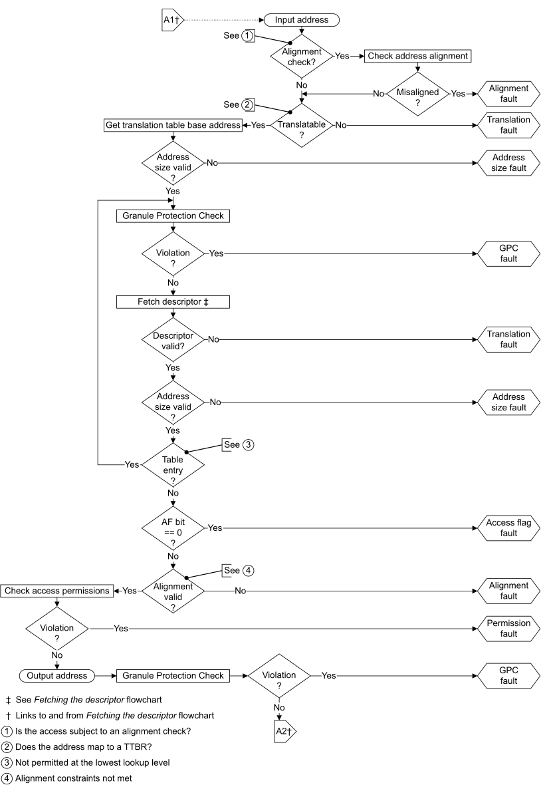
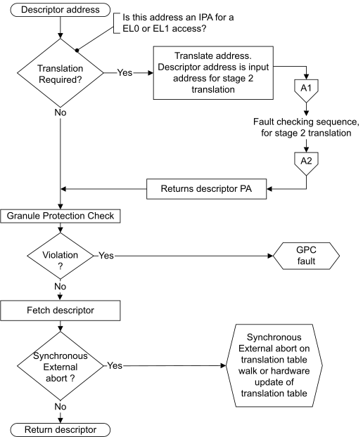

# ​D8.15.4 MMU fault-checking sequence

Source: <https://developer.arm.com/documentation/ddi0487/mc/-Part-D-The-AArch64-System-Level-Architecture/-Chapter-D8-The-AArch64-Virtual-Memory-System-Architecture/-D8-15-Memory-aborts/-D8-15-4-MMU-fault-checking-sequence>

##### D8.15.4 MMU fault-checking sequence

I PTYRT
:   For a translation stage, when an IA is translated to an OA, the fault checking sequence is done using all of the following steps:

    1. If the IA is subject to an alignment check, then check the alignment and do one of the following:

       - If the IA is not aligned, then an Alignment fault is generated.
       - If the IA is aligned, then continue to the next step.
    2. Check that the IA maps to a translation table base address register, TTBR, and do one of the following:

       - If the IA does not map to a TTBR, then a Translation fault is generated.
       - If the IA maps to a TTBR and translation using that TTBR is disabled, then a Translation fault is generated.
       - If the IA maps to a TTBR, then get the translation table base address and continue to the next step.
    3. Check that the translation table base address size is valid and do one of the following:

       - If the translation table base address size is not valid, then an Address size fault is generated.
       - If the translation table base address size is valid, then continue to the next step.
    4. Fetch the descriptor, using all of the following steps:

       - If the descriptor address is an IPA from a stage 1 translation, then all of the following are done:

         - The fault checking sequence is done on the stage 2 translation, using the IPA as an IA to the stage 2 translation.
         - The OA from the stage 2 translation is the descriptor PA.
       - If the descriptor address is not an IPA from a stage 1 translation, then the descriptor address is the descriptor PA.
       - The descriptor fetch is initiated using the descriptor PA, and one of the following occurs:

         - A Synchronous External abort is generated.
         - The descriptor is returned.
    5. Check that the descriptor is valid and do one of the following:

       - If the descriptor is not valid, then a Translation fault is generated.
       - If the descriptor is valid, then continue to the next step.
    6. Check that the descriptor address size is valid and do one of the following:

       - If the descriptor address size is not valid, then an Address size fault is generated.
       - If the descriptor address size is valid, then continue to the next step.
    7. Check the descriptor type and do one of the following:

       - For a Table descriptor, get the descriptor address, get the hierarchical permissions and attributes that apply to subsequent lookup levels, and go back to step 4 to fetch the next descriptor.
       - For a Block descriptor or Page descriptor, continue to the next step.
    8. If [FEAT\_BBML1](/documentation/ddi0487/mc/-Part-A-Arm-Architecture-Introduction-and-Overview/-Chapter-A2-A-profile-Architecture-Extensions/-A2-2-Armv8-A-architecture-extensions/-A2-2-5-The-Armv8-4-architecture-extension?lang=en#feat_feat_bbml1) is implemented, and the fetched descriptor is a block descriptor with the nT bit set, then the implementation can generate a Translation fault.
    9. If AF hardware management is disabled or not implemented, check the descriptor AF bit and do one of the following:

       - If AF is 0, then an Access flag fault is generated.
       - If AF is 1, then continue to the next step.
    10. If AF hardware management is enabled, then the hardware attempts to update the AF and that might result in a Permission fault at stage 2, or a Synchronous External abort.
    11. Get the OA and OA space from the Block descriptor or Page descriptor returned by the translation table walk.
    12. Check the alignment required for the output memory type and do one of the following:

        - If the OA alignment is not valid, then an Alignment fault is generated.
        - If the OA alignment is valid, then continue to the next step.
    13. Check the OA space access permissions and do one of the following:

        - If the OA space access is not permitted, then a Permission fault is generated.
        - If the OA space access is permitted, then continue to the next step.
    14. If dirty state hardware management is enabled, then the hardware attempts to update the dirty state and that might result in a Permission fault at stage 2, or a Synchronous External abort.
    15. The translation stage returns the OA and region attributes.

I JFVPZ
:   For a translation stage, the following figure illustrates the [MMU fault](/documentation/ddi0487/mc/-Part-D-The-AArch64-System-Level-Architecture/-Chapter-D8-The-AArch64-Virtual-Memory-System-Architecture/-D8-15-Memory-aborts?lang=en#aa64_mmu_fault) checking sequence.

    Figure D8-22 MMU fault checking sequence

    

I HZZMB
:   For a translation stage, the following figure illustrates the steps taken to fetch a descriptor during a translation table walk.

    Figure D8-23 Fetching a descriptor during a translation table walk

    

I GLRRS
:   For more information, see [Permission fault](/documentation/ddi0487/mc/-Part-D-The-AArch64-System-Level-Architecture/-Chapter-D8-The-AArch64-Virtual-Memory-System-Architecture/-D8-15-Memory-aborts/-D8-15-1-MMU-fault-types?lang=en#mdsec_permission_fault).

###### D8.15.4.1 Stage 2 fault on a stage 1 translation table walk

I MQXNK
:   For a translation regime that uses two translation stages, the memory access made as part of a stage 1 translation table lookup can generate one or more of the following during a stage 2 translation:

    - A Translation fault, Address size fault, Access flag fault, or Permission fault.
    - A GPC fault on the stage 2 descriptor access.
    - A synchronous External abort on the stage 2 descriptor access.
    - A synchronous External abort on the memory access.

I NGFYK
:   If an Address size fault, Translation fault, Access flag fault, or Permission fault is generated on a stage 2 translation of a stage 1 translation table walk, then all of the following apply:

    - The exception is taken to EL2.
    - [ESR\_EL2](/documentation/ddi0487/mc/-Part-D-The-AArch64-System-Level-Architecture/-Chapter-D24-AArch64-System-Register-Descriptions/-D24-2-General-system-control-registers/-D24-2-45-ESR-EL2--Exception-Syndrome-Register--EL2-?lang=en#reg_aarch64_esr_el2).ISS[7] is 1 to indicate a stage 2 fault during a stage 1 translation table walk.
    - The part of the ISS field that might contain details of the instruction is invalid.

I MRJLZ
:   If a synchronous External abort is generated on a stage 2 translation of a stage 1 translation table walk, then all of the following apply:

    - If [SCR\_EL3](/documentation/ddi0487/mc/-Part-D-The-AArch64-System-Level-Architecture/-Chapter-D24-AArch64-System-Register-Descriptions/-D24-2-General-system-control-registers/-D24-2-168-SCR-EL3--Secure-Configuration-Register?lang=en#reg_aarch64_scr_el3).EA is 0, then all of the following apply:

      - The exception is taken to EL2.
      - [ESR\_EL2](/documentation/ddi0487/mc/-Part-D-The-AArch64-System-Level-Architecture/-Chapter-D24-AArch64-System-Register-Descriptions/-D24-2-General-system-control-registers/-D24-2-45-ESR-EL2--Exception-Syndrome-Register--EL2-?lang=en#reg_aarch64_esr_el2).ISS[7] is 1 to indicate a stage 2 fault during a stage 1 translation table walk.
    - If [SCR\_EL3](/documentation/ddi0487/mc/-Part-D-The-AArch64-System-Level-Architecture/-Chapter-D24-AArch64-System-Register-Descriptions/-D24-2-General-system-control-registers/-D24-2-168-SCR-EL3--Secure-Configuration-Register?lang=en#reg_aarch64_scr_el3).EA is 1, then all of the following apply:

      - The exception is taken to EL3.
      - [ESR\_EL3](/documentation/ddi0487/mc/-Part-D-The-AArch64-System-Level-Architecture/-Chapter-D24-AArch64-System-Register-Descriptions/-D24-2-General-system-control-registers/-D24-2-46-ESR-EL3--Exception-Syndrome-Register--EL3-?lang=en#reg_aarch64_esr_el3).ISS[7] is 1 to indicate a stage 2 fault during a stage 1 translation table walk.
    - The part of the ISS field that might contain details of the instruction is invalid.

I ZGDHT
:   If the stage 2 translation of a stage 1 translation table walk returns a Device memory type, then the value of [HCR\_EL2](/documentation/ddi0487/mc/-Part-D-The-AArch64-System-Level-Architecture/-Chapter-D24-AArch64-System-Register-Descriptions/-D24-2-General-system-control-registers/-D24-2-61-HCR-EL2--Hypervisor-Configuration-Register?lang=en#reg_aarch64_hcr_el2).PTW determines all of the following:

    - If the value is 0, the translation table walk access is permitted and treated as an access to Normal, Non-cacheable memory.
    - If the value is 1, the translation table walk access generates a stage 2 Permission fault.

I VXKVL
:   If the stage 2 translation of a stage 1 translation table lookup maps to Device memory, it likely indicates a Guest OS error where the stage 1 translation table is corrupted, and it is appropriate to trap this access to the hypervisor.

I LWGSL
:   If software updates [HCR\_EL2](/documentation/ddi0487/mc/-Part-D-The-AArch64-System-Level-Architecture/-Chapter-D24-AArch64-System-Register-Descriptions/-D24-2-General-system-control-registers/-D24-2-61-HCR-EL2--Hypervisor-Configuration-Register?lang=en#reg_aarch64_hcr_el2).PTW without changing the current VMID, then the software is required to invalidate the TLBs because they might hold entries that depend on the effect of [HCR\_EL2](/documentation/ddi0487/mc/-Part-D-The-AArch64-System-Level-Architecture/-Chapter-D24-AArch64-System-Register-Descriptions/-D24-2-General-system-control-registers/-D24-2-61-HCR-EL2--Hypervisor-Configuration-Register?lang=en#reg_aarch64_hcr_el2).PTW.

I HPGQN
:   For more information, see [Permission fault](/documentation/ddi0487/mc/-Part-D-The-AArch64-System-Level-Architecture/-Chapter-D8-The-AArch64-Virtual-Memory-System-Architecture/-D8-15-Memory-aborts/-D8-15-1-MMU-fault-types?lang=en#mdsec_permission_fault).

###### D8.15.4.2 The lookup level associated with MMU faults

I XCCCM
:   For [MMU faults](/documentation/ddi0487/mc/-Part-D-The-AArch64-System-Level-Architecture/-Chapter-D8-The-AArch64-Virtual-Memory-System-Architecture/-D8-15-Memory-aborts?lang=en#aa64_mmu_fault), the *Data Fault Status Code* (DFSC) and *Instruction Fault Status Code* (IFSC) in the [ESR\_ELx](/documentation/ddi0487/mc/-Part-K-Appendixes/-Appendix-K14-Registers-Index/-K14-1-Introduction-and-register-disambiguation/-K14-1-2-Register-name-disambiguation-by-Exception-level?lang=en#esr_elx) report the translation lookup level associated with a given MMU fault type.

I CRKPZ
:   When an [MMU fault](/documentation/ddi0487/mc/-Part-D-The-AArch64-System-Level-Architecture/-Chapter-D8-The-AArch64-Virtual-Memory-System-Architecture/-D8-15-Memory-aborts?lang=en#aa64_mmu_fault) is generated, all of the following determine the lookup level associated with the fault:

    - For a fault generated by a translation table walk, the lookup level at which the fault occurred.
    - For a Translation fault, one of the following:

      - The lookup level at which the fault occurred.
      - If a fault is generated because translation table walks are disabled by [TCR\_ELx](/documentation/ddi0487/mc/-Part-K-Appendixes/-Appendix-K14-Registers-Index/-K14-1-Introduction-and-register-disambiguation/-K14-1-2-Register-name-disambiguation-by-Exception-level?lang=en#tcr_elx).EPD*n*, the IA is outside the range specified by the associated [TTBR\_ELx](/documentation/ddi0487/mc/-Part-K-Appendixes/-Appendix-K14-Registers-Index/-K14-1-Introduction-and-register-disambiguation/-K14-1-2-Register-name-disambiguation-by-Exception-level?lang=en#ttbr_elx), or [FEAT\_E0PD](/documentation/ddi0487/mc/-Part-A-Arm-Architecture-Introduction-and-Overview/-Chapter-A2-A-profile-Architecture-Extensions/-A2-2-Armv8-A-architecture-extensions/-A2-2-6-The-Armv8-5-architecture-extension?lang=en#feat_feat_e0pd) is enabled and prevents access to addresses translated by [TTBRn\_ELx](/documentation/ddi0487/mc/-Part-K-Appendixes/-Appendix-K14-Registers-Index/-K14-1-Introduction-and-register-disambiguation/-K14-1-2-Register-name-disambiguation-by-Exception-level?lang=en#ttbrn_elx), then the fault is reported as a level 0 fault.
    - For an Access flag fault, the lookup level at which the fault occurred.
    - For a Permission fault, including a Permission fault generated by hierarchical permissions, the final lookup level that returned the Block descriptor or Page descriptor.

I CJZVP
:   For more information, see [Permission fault](/documentation/ddi0487/mc/-Part-D-The-AArch64-System-Level-Architecture/-Chapter-D8-The-AArch64-Virtual-Memory-System-Architecture/-D8-15-Memory-aborts/-D8-15-1-MMU-fault-types?lang=en#mdsec_permission_fault).
