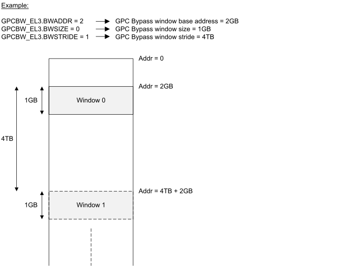

# ​D9.2 GPC bypass windows

Source: <https://developer.arm.com/documentation/ddi0487/mc/-Part-D-The-AArch64-System-Level-Architecture/-Chapter-D9-The-Granule-Protection-Check-Mechanism/-D9-2-GPC-bypass-windows>

#### D9.2 GPC bypass windows

R ZNCFP
:   All statements in this section require implementation of [FEAT\_RME\_GPC3](/documentation/ddi0487/mc/-Part-A-Arm-Architecture-Introduction-and-Overview/-Chapter-A2-A-profile-Architecture-Extensions/-A2-3-Armv9-A-architecture-extensions/-A2-3-7-The-Armv9-6-architecture-extension?lang=en#feat_feat_rme_gpc3).

I JJLRM
:   *Granule Protection Table* (GPT) lookups can be skipped in portions of the memory map by using *GPC bypass windows*. All GPC bypass windows are the same size and have a base address that is aligned to a common stride value.

I XJPJF
:   The [GPCBW\_EL3](/documentation/ddi0487/mc/-Part-D-The-AArch64-System-Level-Architecture/-Chapter-D24-AArch64-System-Register-Descriptions/-D24-2-General-system-control-registers/-D24-2-54-GPCBW-EL3--Granule-Protection-Check-Bypass-Window-Register--EL3-?lang=en#reg_aarch64_gpcbw_el3) System register describes the base, size, and stride properties of the GPC bypass windows. The following diagram illustrates how GPC bypass windows are described using [GPCBW\_EL3](/documentation/ddi0487/mc/-Part-D-The-AArch64-System-Level-Architecture/-Chapter-D24-AArch64-System-Register-Descriptions/-D24-2-General-system-control-registers/-D24-2-54-GPCBW-EL3--Granule-Protection-Check-Bypass-Window-Register--EL3-?lang=en#reg_aarch64_gpcbw_el3) fields.

    Figure D9-1 GPC bypass windows

    

R SRQWF
:   If [GPCCR\_EL3](/documentation/ddi0487/mc/-Part-D-The-AArch64-System-Level-Architecture/-Chapter-D24-AArch64-System-Register-Descriptions/-D24-2-General-system-control-registers/-D24-2-55-GPCCR-EL3--Granule-Protection-Check-Control-Register--EL3-?lang=en#reg_aarch64_gpccr_el3).GPCBW is set to 1 and a PA falls within a GPC bypass window range, then the GPC behaves as if the GPI encoding for the PA is *All accesses permitted*.

R VKXCB
:   GPC bypass windows are always located within the protected PA space that is configured using [GPCCR\_EL3](/documentation/ddi0487/mc/-Part-D-The-AArch64-System-Level-Architecture/-Chapter-D24-AArch64-System-Register-Descriptions/-D24-2-General-system-control-registers/-D24-2-55-GPCCR-EL3--Granule-Protection-Check-Control-Register--EL3-?lang=en#reg_aarch64_gpccr_el3).PPS.

I XNHTX
:   The GPC bypass window check does not modify the GPC fault reporting priority shown in [Table D9-2](/documentation/ddi0487/mc/-Part-D-The-AArch64-System-Level-Architecture/-Chapter-D9-The-Granule-Protection-Check-Mechanism/-D9-4-GPC-faults?lang=en#tbl_mdtbl_gpc_fault_priority), and is performed immediately after priority 3, *Granule protection fault at Level 0*.
