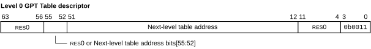

# ​D9.6.1 GPT Table descriptor

Source: <https://developer.arm.com/documentation/ddi0487/mc/-Part-D-The-AArch64-System-Level-Architecture/-Chapter-D9-The-Granule-Protection-Check-Mechanism/-D9-6-GPT-formats/-D9-6-1-GPT-Table-descriptor>

##### D9.6.1 GPT Table descriptor

R RCTBJ
:   A GPT Table descriptor contains a pointer to the base address of a next-level table, and fields describing properties relating to the remaining levels of walk.

I HKPQF
:   The following figure shows the level 0 GPT Table descriptor format:

    Figure D9-2 Level 0 GPT Table descriptor format

    

R KCDQS
:   GPT Table descriptor bits[63:56] are RES0.

R LHVFM
:   GPT Table descriptor bits[55:52] are bits [55:52] of the next-level table address, if [FEAT\_RME\_GPC3](/documentation/ddi0487/mc/-Part-A-Arm-Architecture-Introduction-and-Overview/-Chapter-A2-A-profile-Architecture-Extensions/-A2-3-Armv9-A-architecture-extensions/-A2-3-7-The-Armv9-6-architecture-extension?lang=en#feat_feat_rme_gpc3) is implemented and [GPCCR\_EL3](/documentation/ddi0487/mc/-Part-D-The-AArch64-System-Level-Architecture/-Chapter-D24-AArch64-System-Register-Descriptions/-D24-2-General-system-control-registers/-D24-2-55-GPCCR-EL3--Granule-Protection-Check-Control-Register--EL3-?lang=en#reg_aarch64_gpccr_el3).PPS is configured to 56 bits, and are otherwise RES0.

R NWCYC
:   GPT Table descriptor bits[51:12] are bits [51:12] of the next-level table address.

R SFPYD
:   GPT Table descriptor bits[11:4] are RES0.

R GPPXX
:   GPT level 0 entry bits[3:0] are `0b0011`, indicating the entry is a GPT Table descriptor.

R DBTFW
:   The alignment of the next-level table address depends on the value of [GPCCR\_EL3](/documentation/ddi0487/mc/-Part-D-The-AArch64-System-Level-Architecture/-Chapter-D24-AArch64-System-Register-Descriptions/-D24-2-General-system-control-registers/-D24-2-55-GPCCR-EL3--Granule-Protection-Check-Control-Register--EL3-?lang=en#reg_aarch64_gpccr_el3).PGS as follows:

    Descriptor bits [s-p-2:12] are RES0, where:

    - *s* is derived from [GPCCR\_EL3](/documentation/ddi0487/mc/-Part-D-The-AArch64-System-Level-Architecture/-Chapter-D24-AArch64-System-Register-Descriptions/-D24-2-General-system-control-registers/-D24-2-55-GPCCR-EL3--Granule-Protection-Check-Control-Register--EL3-?lang=en#reg_aarch64_gpccr_el3).L0GPTSZ as follows:

<table>
 <colgroup>
  <col/>
  <col/>
  <col/>
 </colgroup>
 <thead>
  <tr>
   <th>
    GPCCR_EL3.L0GPTSZ
   </th>
   <th>
    Size indicated
   </th>
   <th>
    <em>
     s
    </em>
   </th>
  </tr>
 </thead>
 <tbody>
  <tr>
   <td>
    <code>
     0b0000
    </code>
   </td>
   <td>
    1GB
   </td>
   <td>
    30
   </td>
  </tr>
  <tr>
   <td>
    <code>
     0b0100
    </code>
   </td>
   <td>
    16GB
   </td>
   <td>
    34
   </td>
  </tr>
  <tr>
   <td>
    <code>
     0b0110
    </code>
   </td>
   <td>
    64GB
   </td>
   <td>
    36
   </td>
  </tr>
  <tr>
   <td>
    <code>
     0b1001
    </code>
   </td>
   <td>
    512GB
   </td>
   <td>
    39
   </td>
  </tr>
 </tbody>
</table>

    - *p* is derived from [GPCCR\_EL3](/documentation/ddi0487/mc/-Part-D-The-AArch64-System-Level-Architecture/-Chapter-D24-AArch64-System-Register-Descriptions/-D24-2-General-system-control-registers/-D24-2-55-GPCCR-EL3--Granule-Protection-Check-Control-Register--EL3-?lang=en#reg_aarch64_gpccr_el3).PGS as follows:

<table>
 <colgroup>
  <col/>
  <col/>
  <col/>
 </colgroup>
 <thead>
  <tr>
   <th>
    GPCCR_EL3.PGS
   </th>
   <th>
    Size indicated
   </th>
   <th>
    <em>
     p
    </em>
   </th>
  </tr>
 </thead>
 <tbody>
  <tr>
   <td>
    <code>
     0b00
    </code>
   </td>
   <td>
    4KB
   </td>
   <td>
    12
   </td>
  </tr>
  <tr>
   <td>
    <code>
     0b10
    </code>
   </td>
   <td>
    16KB
   </td>
   <td>
    14
   </td>
  </tr>
  <tr>
   <td>
    <code>
     0b01
    </code>
   </td>
   <td>
    64KB
   </td>
   <td>
    16
   </td>
  </tr>
 </tbody>
</table>

I BFKHR
:   Level 1 tables are aligned to their size in memory. The size of level 1 tables is determined by [GPCCR\_EL3](/documentation/ddi0487/mc/-Part-D-The-AArch64-System-Level-Architecture/-Chapter-D24-AArch64-System-Register-Descriptions/-D24-2-General-system-control-registers/-D24-2-55-GPCCR-EL3--Granule-Protection-Check-Control-Register--EL3-?lang=en#reg_aarch64_gpccr_el3).PGS and [GPCCR\_EL3](/documentation/ddi0487/mc/-Part-D-The-AArch64-System-Level-Architecture/-Chapter-D24-AArch64-System-Register-Descriptions/-D24-2-General-system-control-registers/-D24-2-55-GPCCR-EL3--Granule-Protection-Check-Control-Register--EL3-?lang=en#reg_aarch64_gpccr_el3).L0GPTSZ.
