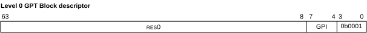

# ​D9.6.2 GPT Block descriptor

Source: <https://developer.arm.com/documentation/ddi0487/mc/-Part-D-The-AArch64-System-Level-Architecture/-Chapter-D9-The-Granule-Protection-Check-Mechanism/-D9-6-GPT-formats/-D9-6-2-GPT-Block-descriptor>

##### D9.6.2 GPT Block descriptor

I NKQNF
:   The following figure shows the level 0 GPT Block descriptor format:

    Figure D9-3 Level 0 GPT Block descriptor format

    

R PHBLQ
:   GPT Block descriptor bits[63:8] are RES0.

R FZGCP
:   GPT Block descriptor bits[7:4] are the GPI value. For more information, see [GPI field encoding in GPT descriptors](/documentation/ddi0487/mc/-Part-D-The-AArch64-System-Level-Architecture/-Chapter-D9-The-Granule-Protection-Check-Mechanism/-D9-6-GPT-formats/-D9-6-5-GPI-field-encoding-in-GPT-descriptors?lang=en#mdsec_gpi_field_encoding_in_gpt_descriptors).

R FGPWN
:   GPT level 0 entry bits[3:0] are `0b0001`, indicating the entry is a GPT Block descriptor.

R PLSSK
:   GPT information from a level 0 GPT Block descriptor is permitted to be cached in a TLB as though the block is a contiguous region of granules, each of the size configured in [GPCCR\_EL3](/documentation/ddi0487/mc/-Part-D-The-AArch64-System-Level-Architecture/-Chapter-D24-AArch64-System-Register-Descriptions/-D24-2-General-system-control-registers/-D24-2-55-GPCCR-EL3--Granule-Protection-Check-Control-Register--EL3-?lang=en#reg_aarch64_gpccr_el3).PGS.

R YNKWN
:   If the range encoded in the SIZE field of the invalidation covers the full address range of the Block, as advertised in [GPCCR\_EL3](/documentation/ddi0487/mc/-Part-D-The-AArch64-System-Level-Architecture/-Chapter-D24-AArch64-System-Register-Descriptions/-D24-2-General-system-control-registers/-D24-2-55-GPCCR-EL3--Granule-Protection-Check-Control-Register--EL3-?lang=en#reg_aarch64_gpccr_el3).L0GPTSZ, a `TLBI RPA*` operation is only required to invalidate cached information from a level 0 GPT Block descriptor.

R GXNNL
:   When GPT configuration is changed between the two following structures, Granule protection checks continue to be made correctly, even if a TLBI is not issued:

    - A level 0 GPT Block descriptor indicating a GPI value for a region.
    - A level 0 GPT Table descriptor pointing at a level 1 table of Contiguous or Granules descriptors that have the same GPI value as the level 0 Block descriptor.

    When a level 0 Table descriptor is replaced with a level 0 Block descriptor, the hardware may continue to access the level 1 Table until completion of a non-Last-level TLBI by PA, targeting at least the full address range of the level 0 descriptor. This means that the memory containing the level 1 Table cannot be reclaimed for other uses until completion of that TLBI by PA operation.
