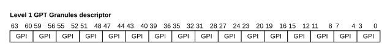

# ​D9.6.3 GPT Granules descriptor

Source: <https://developer.arm.com/documentation/ddi0487/mc/-Part-D-The-AArch64-System-Level-Architecture/-Chapter-D9-The-Granule-Protection-Check-Mechanism/-D9-6-GPT-formats/-D9-6-3-GPT-Granules-descriptor>

##### D9.6.3 GPT Granules descriptor

I NRSQJ
:   The following figure shows the level 1 GPT Granules descriptor format:

    Figure D9-4 Level 1 GPT Granules descriptor format

    

R HJWQH
:   An 8-byte GPT Granules descriptor contains the GPI values for 16 physical granules. For more information, see [GPI field encoding in GPT descriptors](/documentation/ddi0487/mc/-Part-D-The-AArch64-System-Level-Architecture/-Chapter-D9-The-Granule-Protection-Check-Mechanism/-D9-6-GPT-formats/-D9-6-5-GPI-field-encoding-in-GPT-descriptors?lang=en#mdsec_gpi_field_encoding_in_gpt_descriptors).

R QDCZJ
:   The following table describes how the GPI values within one Granules descriptor are indexed:

<table>
 <colgroup>
  <col/>
  <col/>
  <col/>
 </colgroup>
 <thead>
  <tr>
   <th>
    GPCCR_EL3.PGS
   </th>
   <th>
    Size indicated
   </th>
   <th>
    Within Granules descriptor
   </th>
  </tr>
 </thead>
 <tbody>
  <tr>
   <td>
    <code>
     0b00
    </code>
   </td>
   <td>
    4KB
   </td>
   <td>
    <em>
     i
    </em>
    = PA[15:12]
   </td>
  </tr>
  <tr>
   <td>
    <code>
     0b10
    </code>
   </td>
   <td>
    16KB
   </td>
   <td>
    <em>
     i
    </em>
    = PA[17:14]
   </td>
  </tr>
  <tr>
   <td>
    <code>
     0b01
    </code>
   </td>
   <td>
    64KB
   </td>
   <td>
    <em>
     i
    </em>
    = PA[19:16]
   </td>
  </tr>
 </tbody>
</table>

    The GPI value to use is descriptor bits [(4\**i*) + 3 : (4\**i*)].

R GQPWL
:   GPT level 1 entry bits[3:0] are a valid GPI encoding, indicating the entry is a GPT Granules descriptor. For more information, see [GPI field encoding in GPT descriptors](/documentation/ddi0487/mc/-Part-D-The-AArch64-System-Level-Architecture/-Chapter-D9-The-Granule-Protection-Check-Mechanism/-D9-6-GPT-formats/-D9-6-5-GPI-field-encoding-in-GPT-descriptors?lang=en#mdsec_gpi_field_encoding_in_gpt_descriptors).
