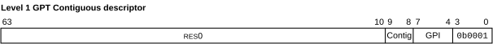

# ​D9.6.4 GPT Contiguous descriptor

Source: <https://developer.arm.com/documentation/ddi0487/mc/-Part-D-The-AArch64-System-Level-Architecture/-Chapter-D9-The-Granule-Protection-Check-Mechanism/-D9-6-GPT-formats/-D9-6-4-GPT-Contiguous-descriptor>

##### D9.6.4 GPT Contiguous descriptor

I SPSCW
:   The following figure shows the level 1 GPT Contiguous descriptor format:

    Figure D9-5 Level 1 GPT Contiguous descriptor format

    

R MVVWZ
:   GPT Contiguous descriptor bits[63:10] are RES0.

R JCXJC
:   GPT Contiguous descriptor bits[9:8] are the Contig field.

R JLQNJ
:   GPT Contiguous descriptor bits[7:4] are the GPI value. For more information, see [GPI field encoding in GPT descriptors](/documentation/ddi0487/mc/-Part-D-The-AArch64-System-Level-Architecture/-Chapter-D9-The-Granule-Protection-Check-Mechanism/-D9-6-GPT-formats/-D9-6-5-GPI-field-encoding-in-GPT-descriptors?lang=en#mdsec_gpi_field_encoding_in_gpt_descriptors).

R BSSVP
:   GPT level 1 entry bits[3:0] are `0b0001`, indicating the entry is a GPT Contiguous descriptor.

R BFCGF
:   The following table describes the Contig field encoding:

<table>
 <colgroup>
  <col/>
  <col/>
 </colgroup>
 <thead>
  <tr>
   <th>
    Value
   </th>
   <th>
    Meaning
   </th>
  </tr>
 </thead>
 <tbody>
  <tr>
   <td>
    <code>
     0b00
    </code>
   </td>
   <td>
    Reserved
   </td>
  </tr>
  <tr>
   <td>
    <code>
     0b01
    </code>
   </td>
   <td>
    2MB
   </td>
  </tr>
  <tr>
   <td>
    <code>
     0b10
    </code>
   </td>
   <td>
    32MB
   </td>
  </tr>
  <tr>
   <td>
    <code>
     0b11
    </code>
   </td>
   <td>
    512MB
   </td>
  </tr>
 </tbody>
</table>

R MNZWK
:   Information from a GPT Contiguous descriptor is permitted to be cached in a TLB or a table walk cache for an input address range up to the size indicated by the Contig field.

R CZJSQ
:   Contiguous regions are naturally-aligned.

I QJZQH
:   For example, if the Contig field in the Contiguous descriptor for address `0x8000_4000` indicates a 2MB contiguous region, the region is `0x8000_0000` to `0x801F_FFFF`.

R RQBNP
:   GPT entries marked for contiguity are permitted, but not required, to be cached as block entries.

R SSKBB
:   TLB Invalidation of GPT information is only guaranteed by TLB maintenance of the full contiguous range.

I KBTDW
:   For example, this might be done by executing a `TLBI RPALOS, <Xt>` instruction covering the full range of the contiguous GPT region.

I NZJDP
:   This requirement on TLBI scope is intended to be the same as the behavior of the Contiguous bit in the VMSA. For more information, see [The Contiguous bit](/documentation/ddi0487/mc/-Part-D-The-AArch64-System-Level-Architecture/-Chapter-D8-The-AArch64-Virtual-Memory-System-Architecture/-D8-7-Other-descriptor-fields/-D8-7-1-The-Contiguous-bit?lang=en#mdsec_the_contiguous_bit).

R SPLJH
:   If any of the GPI values in GPT descriptors within the range specified by a Contig field differ from each other, then the GPT Contiguous descriptor has been *misprogrammed*.

R SMQTZ
:   For an access to a memory location within the range specified by the Contig field, if a GPT Contiguous descriptor has been misprogrammed, then in the absence of other faulting conditions it is CONSTRAINED UNPREDICTABLE whether one of the following occurs:

    - The access succeeds as though its PA space is permitted by a programmed GPI value in the range.
    - The access experiences a GPF consistent with the access not being permitted by one of the GPI values configured for the range.

R NNHCF
:   If a GPT Contiguous descriptor has the Contig field configured to one value, and other GPT Granules descriptors or Contiguous descriptors within the range indicated by that Contig field are all configured with the same GPI values, then in the absence of both misprogramming and faulting conditions, accesses to that range are correctly checked against the GPI value programmed for the range.

I JMVJS
:   This behavior is intended to be the same as [FEAT\_BBML2](/documentation/ddi0487/mc/-Part-A-Arm-Architecture-Introduction-and-Overview/-Chapter-A2-A-profile-Architecture-Extensions/-A2-2-Armv8-A-architecture-extensions/-A2-2-5-The-Armv8-4-architecture-extension?lang=en#feat_feat_bbml2) behavior, but with the option of TLB Conflict aborts removed.

    For more information, see [Support levels for changing table or block size](/documentation/ddi0487/mc/-Part-D-The-AArch64-System-Level-Architecture/-Chapter-D8-The-AArch64-Virtual-Memory-System-Architecture/-D8-17-TLB-maintenance/-D8-17-2-Support-levels-for-changing-table-or-block-size?lang=en#mdsec_support_levels_for_changing_block_size).

I RQFBR
:   For more information, see:

    - [GPC faults](/documentation/ddi0487/mc/-Part-D-The-AArch64-System-Level-Architecture/-Chapter-D9-The-Granule-Protection-Check-Mechanism/-D9-4-GPC-faults?lang=en#mdsec_gpc_faults)
    - [GPT caching and invalidation](/documentation/ddi0487/mc/-Part-D-The-AArch64-System-Level-Architecture/-Chapter-D9-The-Granule-Protection-Check-Mechanism/-D9-5-GPT-caching-and-invalidation?lang=en#mdsec_gpt_caching_and_invalidation)
