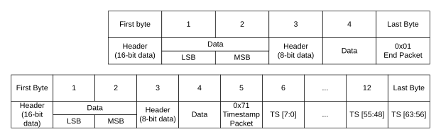

# ​D18.1.2 Records

Source: <https://developer.arm.com/documentation/ddi0487/mc/-Part-D-The-AArch64-System-Level-Architecture/-Chapter-D18-Statistical-Profiling-Extension-Sample-Record-Specification/-D18-1-About-the-Statistical-Profiling-Extension-sample-records/-D18-1-2-Records>

##### D18.1.2 Records

A record consists of multiple packets. A record comprises, in ascending address order:

- A sequence of headers, each followed by their payload byte or bytes.
- Either:

  - An End packet header.
  - A Timestamp packet.

Figures in this chapter show each packet as a sequence of bytes. [Figure D18-1](/documentation/ddi0487/mc/-Part-D-The-AArch64-System-Level-Architecture/-Chapter-D18-Statistical-Profiling-Extension-Sample-Record-Specification/-D18-1-About-the-Statistical-Profiling-Extension-sample-records/-D18-1-2-Records?lang=en#fig_spe_example_packet) shows how bytes are stored in memory in increasing addresses from left to right.

Figure D18-1 Convention for packet description

In some sections, the figures are split into separate figures for the header byte and payload bytes. For instance, where the number of payload bytes varies according to a field in the header.

The header bytes and payload bytes are described in ascending memory address order. Within a payload value, values are in little-endian byte order.

The size of the access granule for writes to the Profiling Buffer by the Statistical Profiling Unit is IMPLEMENTATION DEFINED, up to a maximum of 2KB. The size of the access granule can vary from time to time.
