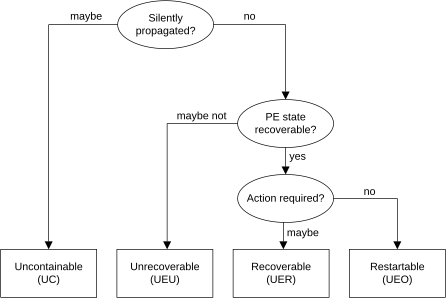

# ​D20.4.2 PE error state classification

Source: <https://developer.arm.com/documentation/ddi0487/mc/-Part-D-The-AArch64-System-Level-Architecture/-Chapter-D20-RAS-PE-Architecture/-D20-4-Taking-error-exceptions/-D20-4-2-PE-error-state-classification>

##### D20.4.2 PE error state classification

I CCKWK
:   The PE determines which [PE error state](/documentation/ddi0487/mc/-Part-D-The-AArch64-System-Level-Architecture/-Chapter-D20-RAS-PE-Architecture/-D20-4-Taking-error-exceptions?lang=en#mdterm_pe_error_state) to record based on the following criteria:

    - The [PE error state](/documentation/ddi0487/mc/-Part-D-The-AArch64-System-Level-Architecture/-Chapter-D20-RAS-PE-Architecture/-D20-4-Taking-error-exceptions?lang=en#mdterm_pe_error_state) syndrome values supported by the type of [Error exception](/documentation/ddi0487/mc/-Part-D-The-AArch64-System-Level-Architecture/-Chapter-D20-RAS-PE-Architecture/-D20-3-Generating-error-exceptions?lang=en#mdterm_error_exception) being taken. See [PE error state recording in the exception syndrome](/documentation/ddi0487/mc/-Part-D-The-AArch64-System-Level-Architecture/-Chapter-D20-RAS-PE-Architecture/-D20-4-Taking-error-exceptions/-D20-4-1-PE-error-state-recording-in-the-exception-syndrome?lang=en#mdsec_pe_error_syndrome).
    - The following IMPLEMENTATION SPECIFIC properties and behaviors of the PE on taking the exception:

      - Whether the error has been [silently propagated by the PE](/documentation/ddi0487/mc/-Part-D-The-AArch64-System-Level-Architecture/-Chapter-D20-RAS-PE-Architecture/-D20-2-PE-error-handling/-D20-2-2-PE-error-propagation?lang=en#mdterm_silently_propagated_by_pe).
      - Whether the PE determines that software is able to [recover execution](/documentation/ddi0487/mc/-Part-D-The-AArch64-System-Level-Architecture/-Chapter-D20-RAS-PE-Architecture/-D20-4-Taking-error-exceptions?lang=en#mdterm_recover_execution) at the point where the exception is taken.
      - If the PE determines that software can recover execution, whether software needs [locate and repair](/documentation/ddi0487/mc/-Part-D-The-AArch64-System-Level-Architecture/-Chapter-D20-RAS-PE-Architecture/-D20-4-Taking-error-exceptions?lang=en#mdterm_locate_and_repair) the error before attempting to recover. If software does not locate and repair the error, then attempting to recover execution might cause the [Error exception](/documentation/ddi0487/mc/-Part-D-The-AArch64-System-Level-Architecture/-Chapter-D20-RAS-PE-Architecture/-D20-3-Generating-error-exceptions?lang=en#mdterm_error_exception) to be generated again.
      - If the PE determines that software cannot recover execution, whether the error is a [synchronizable error](/documentation/ddi0487/mc/-Part-D-The-AArch64-System-Level-Architecture/-Chapter-D20-RAS-PE-Architecture/-D20-5-Error-synchronization-event?lang=en#mdterm_synchronized_by_ese).
    - Whether the implementation elects to record the [PE error state](/documentation/ddi0487/mc/-Part-D-The-AArch64-System-Level-Architecture/-Chapter-D20-RAS-PE-Architecture/-D20-4-Taking-error-exceptions?lang=en#mdterm_pe_error_state) as another state. The PE only does this when the criteria for the other, recorded state are met. The conditions under which the PE elects to record the [PE error state](/documentation/ddi0487/mc/-Part-D-The-AArch64-System-Level-Architecture/-Chapter-D20-RAS-PE-Architecture/-D20-4-Taking-error-exceptions?lang=en#mdterm_pe_error_state) as another state are IMPLEMENTATION DEFINED.

    The recorded [PE error state](/documentation/ddi0487/mc/-Part-D-The-AArch64-System-Level-Architecture/-Chapter-D20-RAS-PE-Architecture/-D20-4-Taking-error-exceptions?lang=en#mdterm_pe_error_state) is defined by the rules in this section.

R QKZLB
:   If and only if all of the following are true, then on taking an [Error exception](/documentation/ddi0487/mc/-Part-D-The-AArch64-System-Level-Architecture/-Chapter-D20-RAS-PE-Architecture/-D20-3-Generating-error-exceptions?lang=en#mdterm_error_exception) the [PE error state](/documentation/ddi0487/mc/-Part-D-The-AArch64-System-Level-Architecture/-Chapter-D20-RAS-PE-Architecture/-D20-4-Taking-error-exceptions?lang=en#mdterm_pe_error_state) is recorded as Uncontainable (UC):

    - One or more of the following are true:

      - The error has been [silently propagated by the PE](/documentation/ddi0487/mc/-Part-D-The-AArch64-System-Level-Architecture/-Chapter-D20-RAS-PE-Architecture/-D20-2-PE-error-handling/-D20-2-2-PE-error-propagation?lang=en#mdterm_silently_propagated_by_pe).
      - The PE determines that software is not able to [recover execution](/documentation/ddi0487/mc/-Part-D-The-AArch64-System-Level-Architecture/-Chapter-D20-RAS-PE-Architecture/-D20-4-Taking-error-exceptions?lang=en#mdterm_recover_execution) from the preferred return address of the exception and the error is not a [synchronizable error](/documentation/ddi0487/mc/-Part-D-The-AArch64-System-Level-Architecture/-Chapter-D20-RAS-PE-Architecture/-D20-5-Error-synchronization-event?lang=en#mdterm_synchronized_by_ese).
      - The PE determines that software is not able to [recover execution](/documentation/ddi0487/mc/-Part-D-The-AArch64-System-Level-Architecture/-Chapter-D20-RAS-PE-Architecture/-D20-4-Taking-error-exceptions?lang=en#mdterm_recover_execution) from the preferred return address of the exception and the [Error exception](/documentation/ddi0487/mc/-Part-D-The-AArch64-System-Level-Architecture/-Chapter-D20-RAS-PE-Architecture/-D20-3-Generating-error-exceptions?lang=en#mdterm_error_exception) is taken as a synchronous External abort to AArch64 state. (That is, the type of [Error exception](/documentation/ddi0487/mc/-Part-D-The-AArch64-System-Level-Architecture/-Chapter-D20-RAS-PE-Architecture/-D20-3-Generating-error-exceptions?lang=en#mdterm_error_exception) does not support reporting the [PE error state](/documentation/ddi0487/mc/-Part-D-The-AArch64-System-Level-Architecture/-Chapter-D20-RAS-PE-Architecture/-D20-4-Taking-error-exceptions?lang=en#mdterm_pe_error_state) as [Unrecoverable state (UEU)](/documentation/ddi0487/mc/-Part-D-The-AArch64-System-Level-Architecture/-Chapter-D20-RAS-PE-Architecture/-D20-4-Taking-error-exceptions/-D20-4-2-PE-error-state-classification?lang=en#mdterm_unrecoverable_pe_error).)
      - The implementation has elected to record the [PE error state](/documentation/ddi0487/mc/-Part-D-The-AArch64-System-Level-Architecture/-Chapter-D20-RAS-PE-Architecture/-D20-4-Taking-error-exceptions?lang=en#mdterm_pe_error_state) as [Uncontainable (UC)](/documentation/ddi0487/mc/-Part-D-The-AArch64-System-Level-Architecture/-Chapter-D20-RAS-PE-Architecture/-D20-4-Taking-error-exceptions/-D20-4-2-PE-error-state-classification?lang=en#mdterm_uncontainable_pe_error).
    - The [Error exception](/documentation/ddi0487/mc/-Part-D-The-AArch64-System-Level-Architecture/-Chapter-D20-RAS-PE-Architecture/-D20-3-Generating-error-exceptions?lang=en#mdterm_error_exception) is not taken as a synchronous External abort to AArch32 state.
    - Either [FEAT\_RASv2](/documentation/ddi0487/mc/-Part-A-Arm-Architecture-Introduction-and-Overview/-Chapter-A2-A-profile-Architecture-Extensions/-A2-2-Armv8-A-architecture-extensions/-A2-2-10-The-Armv8-9-architecture-extension?lang=en#feat_feat_rasv2) is not implemented, or the [Error exception](/documentation/ddi0487/mc/-Part-D-The-AArch64-System-Level-Architecture/-Chapter-D20-RAS-PE-Architecture/-D20-3-Generating-error-exceptions?lang=en#mdterm_error_exception) is not taken as a synchronous External abort to AArch64 state.
    - The implementation has not elected to record the [PE error state](/documentation/ddi0487/mc/-Part-D-The-AArch64-System-Level-Architecture/-Chapter-D20-RAS-PE-Architecture/-D20-4-Taking-error-exceptions?lang=en#mdterm_pe_error_state) as [IMPLEMENTATION DEFINED syndrome](/documentation/ddi0487/mc/-Part-D-The-AArch64-System-Level-Architecture/-Chapter-D20-RAS-PE-Architecture/-D20-4-Taking-error-exceptions/-D20-4-2-PE-error-state-classification?lang=en#mdterm_impdef_pe_error) or [Uncategorized error](/documentation/ddi0487/mc/-Part-D-The-AArch64-System-Level-Architecture/-Chapter-D20-RAS-PE-Architecture/-D20-4-Taking-error-exceptions/-D20-4-2-PE-error-state-classification?lang=en#mdterm_uncategorized_pe_error), or the type of [Error exception](/documentation/ddi0487/mc/-Part-D-The-AArch64-System-Level-Architecture/-Chapter-D20-RAS-PE-Architecture/-D20-3-Generating-error-exceptions?lang=en#mdterm_error_exception) does not support reporting the [PE error state](/documentation/ddi0487/mc/-Part-D-The-AArch64-System-Level-Architecture/-Chapter-D20-RAS-PE-Architecture/-D20-4-Taking-error-exceptions?lang=en#mdterm_pe_error_state) as [IMPLEMENTATION DEFINED syndrome](/documentation/ddi0487/mc/-Part-D-The-AArch64-System-Level-Architecture/-Chapter-D20-RAS-PE-Architecture/-D20-4-Taking-error-exceptions/-D20-4-2-PE-error-state-classification?lang=en#mdterm_impdef_pe_error) or [Uncategorized error](/documentation/ddi0487/mc/-Part-D-The-AArch64-System-Level-Architecture/-Chapter-D20-RAS-PE-Architecture/-D20-4-Taking-error-exceptions/-D20-4-2-PE-error-state-classification?lang=en#mdterm_uncategorized_pe_error).

R QGNYD
:   If and only if all of the following are true, then on taking an [Error exception](/documentation/ddi0487/mc/-Part-D-The-AArch64-System-Level-Architecture/-Chapter-D20-RAS-PE-Architecture/-D20-3-Generating-error-exceptions?lang=en#mdterm_error_exception) the [PE error state](/documentation/ddi0487/mc/-Part-D-The-AArch64-System-Level-Architecture/-Chapter-D20-RAS-PE-Architecture/-D20-4-Taking-error-exceptions?lang=en#mdterm_pe_error_state) is recorded as Unrecoverable state (UEU):

    - The error has not been [silently propagated by the PE](/documentation/ddi0487/mc/-Part-D-The-AArch64-System-Level-Architecture/-Chapter-D20-RAS-PE-Architecture/-D20-2-PE-error-handling/-D20-2-2-PE-error-propagation?lang=en#mdterm_silently_propagated_by_pe).
    - The [Error exception](/documentation/ddi0487/mc/-Part-D-The-AArch64-System-Level-Architecture/-Chapter-D20-RAS-PE-Architecture/-D20-3-Generating-error-exceptions?lang=en#mdterm_error_exception) is taken as an SError exception.
    - One or more of the following are true:

      - The PE determines that software is not able to [recover execution](/documentation/ddi0487/mc/-Part-D-The-AArch64-System-Level-Architecture/-Chapter-D20-RAS-PE-Architecture/-D20-4-Taking-error-exceptions?lang=en#mdterm_recover_execution) from the preferred return address of the exception and the error is a [synchronizable error](/documentation/ddi0487/mc/-Part-D-The-AArch64-System-Level-Architecture/-Chapter-D20-RAS-PE-Architecture/-D20-5-Error-synchronization-event?lang=en#mdterm_synchronized_by_ese).
      - The implementation has elected to record the [PE error state](/documentation/ddi0487/mc/-Part-D-The-AArch64-System-Level-Architecture/-Chapter-D20-RAS-PE-Architecture/-D20-4-Taking-error-exceptions?lang=en#mdterm_pe_error_state) as [Unrecoverable state (UEU)](/documentation/ddi0487/mc/-Part-D-The-AArch64-System-Level-Architecture/-Chapter-D20-RAS-PE-Architecture/-D20-4-Taking-error-exceptions/-D20-4-2-PE-error-state-classification?lang=en#mdterm_unrecoverable_pe_error).
    - The implementation has not elected to record the [PE error state](/documentation/ddi0487/mc/-Part-D-The-AArch64-System-Level-Architecture/-Chapter-D20-RAS-PE-Architecture/-D20-4-Taking-error-exceptions?lang=en#mdterm_pe_error_state) as [Uncontainable (UC)](/documentation/ddi0487/mc/-Part-D-The-AArch64-System-Level-Architecture/-Chapter-D20-RAS-PE-Architecture/-D20-4-Taking-error-exceptions/-D20-4-2-PE-error-state-classification?lang=en#mdterm_uncontainable_pe_error), [IMPLEMENTATION DEFINED syndrome](/documentation/ddi0487/mc/-Part-D-The-AArch64-System-Level-Architecture/-Chapter-D20-RAS-PE-Architecture/-D20-4-Taking-error-exceptions/-D20-4-2-PE-error-state-classification?lang=en#mdterm_impdef_pe_error), or [Uncategorized error](/documentation/ddi0487/mc/-Part-D-The-AArch64-System-Level-Architecture/-Chapter-D20-RAS-PE-Architecture/-D20-4-Taking-error-exceptions/-D20-4-2-PE-error-state-classification?lang=en#mdterm_uncategorized_pe_error).

I FJCZP
:   [Error synchronization event](/documentation/ddi0487/mc/-Part-D-The-AArch64-System-Level-Architecture/-Chapter-D20-RAS-PE-Architecture/-D20-5-Error-synchronization-event?lang=en#mdsec_error_synchronization_event) defines [synchronizable error](/documentation/ddi0487/mc/-Part-D-The-AArch64-System-Level-Architecture/-Chapter-D20-RAS-PE-Architecture/-D20-5-Error-synchronization-event?lang=en#mdterm_synchronized_by_ese).

R JHNVT
:   If and only if all of the following are true, then on taking an [Error exception](/documentation/ddi0487/mc/-Part-D-The-AArch64-System-Level-Architecture/-Chapter-D20-RAS-PE-Architecture/-D20-3-Generating-error-exceptions?lang=en#mdterm_error_exception) the [PE error state](/documentation/ddi0487/mc/-Part-D-The-AArch64-System-Level-Architecture/-Chapter-D20-RAS-PE-Architecture/-D20-4-Taking-error-exceptions?lang=en#mdterm_pe_error_state) is recorded as Recoverable state (UER):

    - The error has not been [silently propagated by the PE](/documentation/ddi0487/mc/-Part-D-The-AArch64-System-Level-Architecture/-Chapter-D20-RAS-PE-Architecture/-D20-2-PE-error-handling/-D20-2-2-PE-error-propagation?lang=en#mdterm_silently_propagated_by_pe).
    - The [Error exception](/documentation/ddi0487/mc/-Part-D-The-AArch64-System-Level-Architecture/-Chapter-D20-RAS-PE-Architecture/-D20-3-Generating-error-exceptions?lang=en#mdterm_error_exception) is not taken as a synchronous External abort to AArch32 state.
    - The PE determines that software is able to [recover execution](/documentation/ddi0487/mc/-Part-D-The-AArch64-System-Level-Architecture/-Chapter-D20-RAS-PE-Architecture/-D20-4-Taking-error-exceptions?lang=en#mdterm_recover_execution) from the preferred return address of the exception.
    - One or more of the following are true:

      - The PE determines that software must take action to [locate and repair](/documentation/ddi0487/mc/-Part-D-The-AArch64-System-Level-Architecture/-Chapter-D20-RAS-PE-Architecture/-D20-4-Taking-error-exceptions?lang=en#mdterm_locate_and_repair) the error to successfully [recover execution](/documentation/ddi0487/mc/-Part-D-The-AArch64-System-Level-Architecture/-Chapter-D20-RAS-PE-Architecture/-D20-4-Taking-error-exceptions?lang=en#mdterm_recover_execution). This might be because the exception was taken before the error was architecturally consumed by the PE, at the point when the PE was not be able to make correct progress without either consuming the error or otherwise making the state of the PE unrecoverable.
      - The implementation has elected to record the [PE error state](/documentation/ddi0487/mc/-Part-D-The-AArch64-System-Level-Architecture/-Chapter-D20-RAS-PE-Architecture/-D20-4-Taking-error-exceptions?lang=en#mdterm_pe_error_state) as [Recoverable state (UER)](/documentation/ddi0487/mc/-Part-D-The-AArch64-System-Level-Architecture/-Chapter-D20-RAS-PE-Architecture/-D20-4-Taking-error-exceptions/-D20-4-2-PE-error-state-classification?lang=en#mdterm_recoverable_pe_error).
    - The implementation has not elected to record the [PE error state](/documentation/ddi0487/mc/-Part-D-The-AArch64-System-Level-Architecture/-Chapter-D20-RAS-PE-Architecture/-D20-4-Taking-error-exceptions?lang=en#mdterm_pe_error_state) as [Unrecoverable state (UEU)](/documentation/ddi0487/mc/-Part-D-The-AArch64-System-Level-Architecture/-Chapter-D20-RAS-PE-Architecture/-D20-4-Taking-error-exceptions/-D20-4-2-PE-error-state-classification?lang=en#mdterm_unrecoverable_pe_error), [Uncontainable (UC)](/documentation/ddi0487/mc/-Part-D-The-AArch64-System-Level-Architecture/-Chapter-D20-RAS-PE-Architecture/-D20-4-Taking-error-exceptions/-D20-4-2-PE-error-state-classification?lang=en#mdterm_uncontainable_pe_error), [IMPLEMENTATION DEFINED syndrome](/documentation/ddi0487/mc/-Part-D-The-AArch64-System-Level-Architecture/-Chapter-D20-RAS-PE-Architecture/-D20-4-Taking-error-exceptions/-D20-4-2-PE-error-state-classification?lang=en#mdterm_impdef_pe_error), or [Uncategorized error](/documentation/ddi0487/mc/-Part-D-The-AArch64-System-Level-Architecture/-Chapter-D20-RAS-PE-Architecture/-D20-4-Taking-error-exceptions/-D20-4-2-PE-error-state-classification?lang=en#mdterm_uncategorized_pe_error).

R MBVCF
:   If and only if all of the following are true, then on taking an [Error exception](/documentation/ddi0487/mc/-Part-D-The-AArch64-System-Level-Architecture/-Chapter-D20-RAS-PE-Architecture/-D20-3-Generating-error-exceptions?lang=en#mdterm_error_exception) the [PE error state](/documentation/ddi0487/mc/-Part-D-The-AArch64-System-Level-Architecture/-Chapter-D20-RAS-PE-Architecture/-D20-4-Taking-error-exceptions?lang=en#mdterm_pe_error_state) is recorded as Restartable state (UEO):

    - The error has not been [silently propagated by the PE](/documentation/ddi0487/mc/-Part-D-The-AArch64-System-Level-Architecture/-Chapter-D20-RAS-PE-Architecture/-D20-2-PE-error-handling/-D20-2-2-PE-error-propagation?lang=en#mdterm_silently_propagated_by_pe).
    - The [Error exception](/documentation/ddi0487/mc/-Part-D-The-AArch64-System-Level-Architecture/-Chapter-D20-RAS-PE-Architecture/-D20-3-Generating-error-exceptions?lang=en#mdterm_error_exception) is not taken as a synchronous External abort to AArch32 state.
    - The PE determines that software can [recover execution](/documentation/ddi0487/mc/-Part-D-The-AArch64-System-Level-Architecture/-Chapter-D20-RAS-PE-Architecture/-D20-4-Taking-error-exceptions?lang=en#mdterm_recover_execution) from the preferred return address of the exception without the need for software to take action to [locate and repair](/documentation/ddi0487/mc/-Part-D-The-AArch64-System-Level-Architecture/-Chapter-D20-RAS-PE-Architecture/-D20-4-Taking-error-exceptions?lang=en#mdterm_locate_and_repair) the error first.
    - One or more of the following are true:

      - The error is an [uncorrected error](/documentation/ddi0487/mc/-Part-K-Appendixes/Glossary?lang=en#glossdef_uncorrected_error). This includes a [deferred error](/documentation/ddi0487/mc/-Part-K-Appendixes/Glossary?lang=en#glossdef_deferred_error).
      - The error is a [corrected error](/documentation/ddi0487/mc/-Part-K-Appendixes/Glossary?lang=en#glossdef_corrected_error) and the [Error exception](/documentation/ddi0487/mc/-Part-D-The-AArch64-System-Level-Architecture/-Chapter-D20-RAS-PE-Architecture/-D20-3-Generating-error-exceptions?lang=en#mdterm_error_exception) is not taken as an SError exception taken to AArch64 state.
      - The implementation has elected to record the [PE error state](/documentation/ddi0487/mc/-Part-D-The-AArch64-System-Level-Architecture/-Chapter-D20-RAS-PE-Architecture/-D20-4-Taking-error-exceptions?lang=en#mdterm_pe_error_state) as [Restartable state (UEO)](/documentation/ddi0487/mc/-Part-D-The-AArch64-System-Level-Architecture/-Chapter-D20-RAS-PE-Architecture/-D20-4-Taking-error-exceptions/-D20-4-2-PE-error-state-classification?lang=en#mdterm_restartable_pe_error).
    - The implementation has not elected to record the [PE error state](/documentation/ddi0487/mc/-Part-D-The-AArch64-System-Level-Architecture/-Chapter-D20-RAS-PE-Architecture/-D20-4-Taking-error-exceptions?lang=en#mdterm_pe_error_state) as any of [Recoverable state (UER)](/documentation/ddi0487/mc/-Part-D-The-AArch64-System-Level-Architecture/-Chapter-D20-RAS-PE-Architecture/-D20-4-Taking-error-exceptions/-D20-4-2-PE-error-state-classification?lang=en#mdterm_recoverable_pe_error), [Unrecoverable state (UEU)](/documentation/ddi0487/mc/-Part-D-The-AArch64-System-Level-Architecture/-Chapter-D20-RAS-PE-Architecture/-D20-4-Taking-error-exceptions/-D20-4-2-PE-error-state-classification?lang=en#mdterm_unrecoverable_pe_error), [Uncontainable (UC)](/documentation/ddi0487/mc/-Part-D-The-AArch64-System-Level-Architecture/-Chapter-D20-RAS-PE-Architecture/-D20-4-Taking-error-exceptions/-D20-4-2-PE-error-state-classification?lang=en#mdterm_uncontainable_pe_error), [IMPLEMENTATION DEFINED syndrome](/documentation/ddi0487/mc/-Part-D-The-AArch64-System-Level-Architecture/-Chapter-D20-RAS-PE-Architecture/-D20-4-Taking-error-exceptions/-D20-4-2-PE-error-state-classification?lang=en#mdterm_impdef_pe_error), or [Uncategorized error](/documentation/ddi0487/mc/-Part-D-The-AArch64-System-Level-Architecture/-Chapter-D20-RAS-PE-Architecture/-D20-4-Taking-error-exceptions/-D20-4-2-PE-error-state-classification?lang=en#mdterm_uncategorized_pe_error).

R LFXRD
:   If and only if all of the following are true, then on taking an [Error exception](/documentation/ddi0487/mc/-Part-D-The-AArch64-System-Level-Architecture/-Chapter-D20-RAS-PE-Architecture/-D20-3-Generating-error-exceptions?lang=en#mdterm_error_exception) the [PE error state](/documentation/ddi0487/mc/-Part-D-The-AArch64-System-Level-Architecture/-Chapter-D20-RAS-PE-Architecture/-D20-4-Taking-error-exceptions?lang=en#mdterm_pe_error_state) is recorded as Corrected (CE):

    - The error has been [corrected](/documentation/ddi0487/mc/-Part-K-Appendixes/Glossary?lang=en#glossdef_corrected_error) and not [silently propagated by the PE](/documentation/ddi0487/mc/-Part-D-The-AArch64-System-Level-Architecture/-Chapter-D20-RAS-PE-Architecture/-D20-2-PE-error-handling/-D20-2-2-PE-error-propagation?lang=en#mdterm_silently_propagated_by_pe).
    - The [Error exception](/documentation/ddi0487/mc/-Part-D-The-AArch64-System-Level-Architecture/-Chapter-D20-RAS-PE-Architecture/-D20-3-Generating-error-exceptions?lang=en#mdterm_error_exception) is taken as an SError exception taken to AArch64 state.
    - Software can [recover execution](/documentation/ddi0487/mc/-Part-D-The-AArch64-System-Level-Architecture/-Chapter-D20-RAS-PE-Architecture/-D20-4-Taking-error-exceptions?lang=en#mdterm_recover_execution) from the preferred return address of the exception. Because the error has been [corrected](/documentation/ddi0487/mc/-Part-K-Appendixes/Glossary?lang=en#glossdef_corrected_error), software does not need to take action to [locate and repair](/documentation/ddi0487/mc/-Part-D-The-AArch64-System-Level-Architecture/-Chapter-D20-RAS-PE-Architecture/-D20-4-Taking-error-exceptions?lang=en#mdterm_locate_and_repair) the error.
    - The implementation has not elected to record the [PE error state](/documentation/ddi0487/mc/-Part-D-The-AArch64-System-Level-Architecture/-Chapter-D20-RAS-PE-Architecture/-D20-4-Taking-error-exceptions?lang=en#mdterm_pe_error_state) as any other type.

I BWPJZ
:   Arm strongly recommends that a [corrected error](/documentation/ddi0487/mc/-Part-K-Appendixes/Glossary?lang=en#glossdef_corrected_error) that is not silently propagated does not generate any [Error exception](/documentation/ddi0487/mc/-Part-D-The-AArch64-System-Level-Architecture/-Chapter-D20-RAS-PE-Architecture/-D20-3-Generating-error-exceptions?lang=en#mdterm_error_exception) at the PE. The producer of the data that [corrected](/documentation/ddi0487/mc/-Part-K-Appendixes/Glossary?lang=en#glossdef_corrected_error) the error might still record the error in a RAS error record, and generate a fault handling interrupt, as described in the *Arm® Reliability, Availability, and Serviceability (RAS) System Architecture, for A-profile architecture* (ARM IHI 0100).

R NZYRP
:   If and only if all the following are true, then on taking an [Error exception](/documentation/ddi0487/mc/-Part-D-The-AArch64-System-Level-Architecture/-Chapter-D20-RAS-PE-Architecture/-D20-3-Generating-error-exceptions?lang=en#mdterm_error_exception) the [PE error state](/documentation/ddi0487/mc/-Part-D-The-AArch64-System-Level-Architecture/-Chapter-D20-RAS-PE-Architecture/-D20-4-Taking-error-exceptions?lang=en#mdterm_pe_error_state) is recorded as an Uncategorized error:

    - The [Error exception](/documentation/ddi0487/mc/-Part-D-The-AArch64-System-Level-Architecture/-Chapter-D20-RAS-PE-Architecture/-D20-3-Generating-error-exceptions?lang=en#mdterm_error_exception) is taken as an asynchronous SError exception taken to AArch64 state.
    - The implementation has elected to record the [PE error state](/documentation/ddi0487/mc/-Part-D-The-AArch64-System-Level-Architecture/-Chapter-D20-RAS-PE-Architecture/-D20-4-Taking-error-exceptions?lang=en#mdterm_pe_error_state) as an [Uncategorized error](/documentation/ddi0487/mc/-Part-D-The-AArch64-System-Level-Architecture/-Chapter-D20-RAS-PE-Architecture/-D20-4-Taking-error-exceptions/-D20-4-2-PE-error-state-classification?lang=en#mdterm_uncategorized_pe_error).

R VHWHD
:   If and only if all the following are true, then on taking an [Error exception](/documentation/ddi0487/mc/-Part-D-The-AArch64-System-Level-Architecture/-Chapter-D20-RAS-PE-Architecture/-D20-3-Generating-error-exceptions?lang=en#mdterm_error_exception) the [PE error state](/documentation/ddi0487/mc/-Part-D-The-AArch64-System-Level-Architecture/-Chapter-D20-RAS-PE-Architecture/-D20-4-Taking-error-exceptions?lang=en#mdterm_pe_error_state) is recorded as an IMPLEMENTATION DEFINED syndrome:

    - The [Error exception](/documentation/ddi0487/mc/-Part-D-The-AArch64-System-Level-Architecture/-Chapter-D20-RAS-PE-Architecture/-D20-3-Generating-error-exceptions?lang=en#mdterm_error_exception) is taken as an asynchronous SError exception taken to AArch64 state.
    - The implementation has elected to record the [PE error state](/documentation/ddi0487/mc/-Part-D-The-AArch64-System-Level-Architecture/-Chapter-D20-RAS-PE-Architecture/-D20-4-Taking-error-exceptions?lang=en#mdterm_pe_error_state) as an [IMPLEMENTATION DEFINED syndrome](/documentation/ddi0487/mc/-Part-D-The-AArch64-System-Level-Architecture/-Chapter-D20-RAS-PE-Architecture/-D20-4-Taking-error-exceptions/-D20-4-2-PE-error-state-classification?lang=en#mdterm_impdef_pe_error).

I SRPJD
:   The [IMPLEMENTATION DEFINED syndrome](/documentation/ddi0487/mc/-Part-D-The-AArch64-System-Level-Architecture/-Chapter-D20-RAS-PE-Architecture/-D20-4-Taking-error-exceptions/-D20-4-2-PE-error-state-classification?lang=en#mdterm_impdef_pe_error) type might provide additional IMPLEMENTATION DEFINED syndrome recorded in the exception syndrome register. Software might be able to determine the state of the PE from this syndrome, or other IMPLEMENTATION DEFINED syndrome registers.

I WLZRP
:   [Uncategorized error](/documentation/ddi0487/mc/-Part-D-The-AArch64-System-Level-Architecture/-Chapter-D20-RAS-PE-Architecture/-D20-4-Taking-error-exceptions/-D20-4-2-PE-error-state-classification?lang=en#mdterm_uncategorized_pe_error) and [IMPLEMENTATION DEFINED syndrome](/documentation/ddi0487/mc/-Part-D-The-AArch64-System-Level-Architecture/-Chapter-D20-RAS-PE-Architecture/-D20-4-Taking-error-exceptions/-D20-4-2-PE-error-state-classification?lang=en#mdterm_impdef_pe_error) are defined for backward compatibility with previous versions of the architecture. Arm does not recommend use of these [PE error state](/documentation/ddi0487/mc/-Part-D-The-AArch64-System-Level-Architecture/-Chapter-D20-RAS-PE-Architecture/-D20-4-Taking-error-exceptions?lang=en#mdterm_pe_error_state) values in new implementations that include other RAS features.

I VKMZB
:   The [PE error states](/documentation/ddi0487/mc/-Part-D-The-AArch64-System-Level-Architecture/-Chapter-D20-RAS-PE-Architecture/-D20-4-Taking-error-exceptions?lang=en#mdterm_pe_error_state) for an [Error exception](/documentation/ddi0487/mc/-Part-D-The-AArch64-System-Level-Architecture/-Chapter-D20-RAS-PE-Architecture/-D20-3-Generating-error-exceptions?lang=en#mdterm_error_exception) generated when the PE consumes an [uncorrected error](/documentation/ddi0487/mc/-Part-K-Appendixes/Glossary?lang=en#glossdef_uncorrected_error) are summarized by [Figure D20-1](/documentation/ddi0487/mc/-Part-D-The-AArch64-System-Level-Architecture/-Chapter-D20-RAS-PE-Architecture/-D20-4-Taking-error-exceptions/-D20-4-2-PE-error-state-classification?lang=en#fig_mdfig_taxonomy_of_consumed_error_types). [Figure D20-1](/documentation/ddi0487/mc/-Part-D-The-AArch64-System-Level-Architecture/-Chapter-D20-RAS-PE-Architecture/-D20-4-Taking-error-exceptions/-D20-4-2-PE-error-state-classification?lang=en#fig_mdfig_taxonomy_of_consumed_error_types) assumes the type of [Error exception](/documentation/ddi0487/mc/-Part-D-The-AArch64-System-Level-Architecture/-Chapter-D20-RAS-PE-Architecture/-D20-3-Generating-error-exceptions?lang=en#mdterm_error_exception) supports the resulting [PE error state](/documentation/ddi0487/mc/-Part-D-The-AArch64-System-Level-Architecture/-Chapter-D20-RAS-PE-Architecture/-D20-4-Taking-error-exceptions?lang=en#mdterm_pe_error_state), that the error was neither [corrected](/documentation/ddi0487/mc/-Part-K-Appendixes/Glossary?lang=en#glossdef_corrected_error) nor [deferred](/documentation/ddi0487/mc/-Part-K-Appendixes/Glossary?lang=en#glossdef_deferred_error), and the PE never elects to record an error as a different [PE error state](/documentation/ddi0487/mc/-Part-D-The-AArch64-System-Level-Architecture/-Chapter-D20-RAS-PE-Architecture/-D20-4-Taking-error-exceptions?lang=en#mdterm_pe_error_state) when permitted, an [Uncategorized error](/documentation/ddi0487/mc/-Part-D-The-AArch64-System-Level-Architecture/-Chapter-D20-RAS-PE-Architecture/-D20-4-Taking-error-exceptions/-D20-4-2-PE-error-state-classification?lang=en#mdterm_uncategorized_pe_error) syndrome, or an [IMPLEMENTATION DEFINED syndrome](/documentation/ddi0487/mc/-Part-D-The-AArch64-System-Level-Architecture/-Chapter-D20-RAS-PE-Architecture/-D20-4-Taking-error-exceptions/-D20-4-2-PE-error-state-classification?lang=en#mdterm_impdef_pe_error).

    Figure D20-1 PE error states

    

I ZQRGL
:   If the [PE error state](/documentation/ddi0487/mc/-Part-D-The-AArch64-System-Level-Architecture/-Chapter-D20-RAS-PE-Architecture/-D20-4-Taking-error-exceptions?lang=en#mdterm_pe_error_state) reports that software can [recover execution](/documentation/ddi0487/mc/-Part-D-The-AArch64-System-Level-Architecture/-Chapter-D20-RAS-PE-Architecture/-D20-4-Taking-error-exceptions?lang=en#mdterm_recover_execution), or that software isolation might be possible because the error is a [synchronizable error](/documentation/ddi0487/mc/-Part-D-The-AArch64-System-Level-Architecture/-Chapter-D20-RAS-PE-Architecture/-D20-5-Error-synchronization-event?lang=en#mdterm_synchronized_by_ese), then this does not necessarily mean that the error can be recovered from because the error in the system might be one which does not allow software to recover the operation. Rather, software *might* be able to recover if it can repair the error and continue.

    > Example D20-14
    >
    > A component detects an error when accessed by a PE, and records in a RAS System Architecture node that the error is uncontainable at the component, meaning the system has to be shut down to avoid catastrophic failure.
    >
    > The component signals the error with an [in-band error response](/documentation/ddi0487/mc/-Part-D-The-AArch64-System-Level-Architecture/-Chapter-D20-RAS-PE-Architecture/-D20-2-PE-error-handling/-D20-2-1-PE-error-detection?lang=en#mdterm_pe_in_band_error_response) to a PE, which does not report the severity of the error. The recorded [PE error state](/documentation/ddi0487/mc/-Part-D-The-AArch64-System-Level-Architecture/-Chapter-D20-RAS-PE-Architecture/-D20-4-Taking-error-exceptions?lang=en#mdterm_pe_error_state) refers only to the PE, not the system error state.

I WBVYC
:   If the [in-band error response](/documentation/ddi0487/mc/-Part-D-The-AArch64-System-Level-Architecture/-Chapter-D20-RAS-PE-Architecture/-D20-2-PE-error-handling/-D20-2-1-PE-error-detection?lang=en#mdterm_pe_in_band_error_response) can signal the severity of the error to the PE, then the PE might use this information to elect to report the [PE error state](/documentation/ddi0487/mc/-Part-D-The-AArch64-System-Level-Architecture/-Chapter-D20-RAS-PE-Architecture/-D20-4-Taking-error-exceptions?lang=en#mdterm_pe_error_state) as the severity of error reported to it, if permitted by the preceding rules.

    However, this is not required, and software must not rely on this behavior and should determine from the system whether the error is recoverable at the system level.

    > Example D20-15
    >
    > A processor cache detects an uncontainable tag RAM error, and the PE reports the [PE error state](/documentation/ddi0487/mc/-Part-D-The-AArch64-System-Level-Architecture/-Chapter-D20-RAS-PE-Architecture/-D20-4-Taking-error-exceptions?lang=en#mdterm_pe_error_state) as [Uncontainable (UC)](/documentation/ddi0487/mc/-Part-D-The-AArch64-System-Level-Architecture/-Chapter-D20-RAS-PE-Architecture/-D20-4-Taking-error-exceptions/-D20-4-2-PE-error-state-classification?lang=en#mdterm_uncontainable_pe_error), even though the state of the PE itself is [Recoverable state (UER)](/documentation/ddi0487/mc/-Part-D-The-AArch64-System-Level-Architecture/-Chapter-D20-RAS-PE-Architecture/-D20-4-Taking-error-exceptions/-D20-4-2-PE-error-state-classification?lang=en#mdterm_recoverable_pe_error). [RQKZLB](/documentation/ddi0487/mc/-Part-D-The-AArch64-System-Level-Architecture/-Chapter-D20-RAS-PE-Architecture/-D20-4-Taking-error-exceptions/-D20-4-2-PE-error-state-classification?lang=en#qkzlb) allows this.

I TXFMY
:   An SError exception that is masked when it is generated remains pending until taken later when no longer masked.

    In these cases, the PE error state is also unlikely to be *Restartable* or *Recoverable*, and if [FEAT\_RASv2](/documentation/ddi0487/mc/-Part-A-Arm-Architecture-Introduction-and-Overview/-Chapter-A2-A-profile-Architecture-Extensions/-A2-2-Armv8-A-architecture-extensions/-A2-2-10-The-Armv8-9-architecture-extension?lang=en#feat_feat_rasv2) is implemented, is reported with [ESR\_ELx](/documentation/ddi0487/mc/-Part-K-Appendixes/-Appendix-K14-Registers-Index/-K14-1-Introduction-and-register-disambiguation/-K14-1-2-Register-name-disambiguation-by-Exception-level?lang=en#esr_elx).ELS cleared to 0.

I TGPQZ
:   See also:

    - [PE error propagation](/documentation/ddi0487/mc/-Part-D-The-AArch64-System-Level-Architecture/-Chapter-D20-RAS-PE-Architecture/-D20-2-PE-error-handling/-D20-2-2-PE-error-propagation?lang=en#mdsec_architectural_error_propagation).
    - [Error synchronization event](/documentation/ddi0487/mc/-Part-D-The-AArch64-System-Level-Architecture/-Chapter-D20-RAS-PE-Architecture/-D20-5-Error-synchronization-event?lang=en#mdsec_error_synchronization_event).

###### D20.4.2.1 Using the PE error state classification

S XSKNS
:   When the [PE error state](/documentation/ddi0487/mc/-Part-D-The-AArch64-System-Level-Architecture/-Chapter-D20-RAS-PE-Architecture/-D20-4-Taking-error-exceptions?lang=en#mdterm_pe_error_state) is recorded as [Uncontainable (UC)](/documentation/ddi0487/mc/-Part-D-The-AArch64-System-Level-Architecture/-Chapter-D20-RAS-PE-Architecture/-D20-4-Taking-error-exceptions/-D20-4-2-PE-error-state-classification?lang=en#mdterm_uncontainable_pe_error):

    - The error handling software must assume that either:

      - The error has been [silently propagated by the PE](/documentation/ddi0487/mc/-Part-D-The-AArch64-System-Level-Architecture/-Chapter-D20-RAS-PE-Architecture/-D20-2-PE-error-handling/-D20-2-2-PE-error-propagation?lang=en#mdterm_silently_propagated_by_pe).
      - Software is not able to [recover execution](/documentation/ddi0487/mc/-Part-D-The-AArch64-System-Level-Architecture/-Chapter-D20-RAS-PE-Architecture/-D20-4-Taking-error-exceptions?lang=en#mdterm_recover_execution) from the preferred return address of the exception and the error was not a [synchronizable error](/documentation/ddi0487/mc/-Part-D-The-AArch64-System-Level-Architecture/-Chapter-D20-RAS-PE-Architecture/-D20-5-Error-synchronization-event?lang=en#mdterm_synchronized_by_ese).
    - If the error handling software cannot isolate the error to an application or VM, or both, by other means, then the system must be shut down by software to avoid catastrophic failure.

S HYWFL
:   When the [PE error state](/documentation/ddi0487/mc/-Part-D-The-AArch64-System-Level-Architecture/-Chapter-D20-RAS-PE-Architecture/-D20-4-Taking-error-exceptions?lang=en#mdterm_pe_error_state) is recorded as [Unrecoverable state (UEU)](/documentation/ddi0487/mc/-Part-D-The-AArch64-System-Level-Architecture/-Chapter-D20-RAS-PE-Architecture/-D20-4-Taking-error-exceptions/-D20-4-2-PE-error-state-classification?lang=en#mdterm_unrecoverable_pe_error):

    - The error handling software can assume the error has not been [silently propagated by the PE](/documentation/ddi0487/mc/-Part-D-The-AArch64-System-Level-Architecture/-Chapter-D20-RAS-PE-Architecture/-D20-2-PE-error-handling/-D20-2-2-PE-error-propagation?lang=en#mdterm_silently_propagated_by_pe).
    - The error handler cannot safely [recover execution](/documentation/ddi0487/mc/-Part-D-The-AArch64-System-Level-Architecture/-Chapter-D20-RAS-PE-Architecture/-D20-4-Taking-error-exceptions?lang=en#mdterm_recover_execution) from the preferred return address of the exception, even if it takes action to [locate and repair](/documentation/ddi0487/mc/-Part-D-The-AArch64-System-Level-Architecture/-Chapter-D20-RAS-PE-Architecture/-D20-4-Taking-error-exceptions?lang=en#mdterm_locate_and_repair) the error. The state of the affected software is unrecoverable. However, if the software includes [Error synchronization events](/documentation/ddi0487/mc/-Part-D-The-AArch64-System-Level-Architecture/-Chapter-D20-RAS-PE-Architecture/-D20-5-Error-synchronization-event?lang=en#mdsec_error_synchronization_event), the error handler can use the properties of the Error synchronization event to determine which software is affected by the error.
    - The affected software cannot continue and must be isolated by the error handling software.

S LSFYM
:   When the [PE error state](/documentation/ddi0487/mc/-Part-D-The-AArch64-System-Level-Architecture/-Chapter-D20-RAS-PE-Architecture/-D20-4-Taking-error-exceptions?lang=en#mdterm_pe_error_state) is recorded as [Recoverable state (UER)](/documentation/ddi0487/mc/-Part-D-The-AArch64-System-Level-Architecture/-Chapter-D20-RAS-PE-Architecture/-D20-4-Taking-error-exceptions/-D20-4-2-PE-error-state-classification?lang=en#mdterm_recoverable_pe_error):

    - The [uncorrected error](/documentation/ddi0487/mc/-Part-K-Appendixes/Glossary?lang=en#glossdef_uncorrected_error) might remain [latent](/documentation/ddi0487/mc/-Part-A-Arm-Architecture-Introduction-and-Overview/-Chapter-A1-Introduction-to-the-Arm-Architecture/-A1-7-Reliability--Availability--and-Serviceability/-A1-7-2-Faults--errors--and-failures?lang=en#mdterm_ras_latent_error) in the system.
    - If the error handling software takes action to [locate and repair](/documentation/ddi0487/mc/-Part-D-The-AArch64-System-Level-Architecture/-Chapter-D20-RAS-PE-Architecture/-D20-4-Taking-error-exceptions?lang=en#mdterm_locate_and_repair) the [uncorrected error](/documentation/ddi0487/mc/-Part-K-Appendixes/Glossary?lang=en#glossdef_uncorrected_error), then the error handler can safely [recover execution](/documentation/ddi0487/mc/-Part-D-The-AArch64-System-Level-Architecture/-Chapter-D20-RAS-PE-Architecture/-D20-4-Taking-error-exceptions?lang=en#mdterm_recover_execution) from the preferred return address of the exception. Otherwise on restart of the affected software the PE might attempt to consume the error again, causing a further [Error exception](/documentation/ddi0487/mc/-Part-D-The-AArch64-System-Level-Architecture/-Chapter-D20-RAS-PE-Architecture/-D20-3-Generating-error-exceptions?lang=en#mdterm_error_exception). If the error handler cannot [locate and repair](/documentation/ddi0487/mc/-Part-D-The-AArch64-System-Level-Architecture/-Chapter-D20-RAS-PE-Architecture/-D20-4-Taking-error-exceptions?lang=en#mdterm_locate_and_repair) the error, then the affected software must be isolated by the error handling software.

S GLPZY
:   When the [PE error state](/documentation/ddi0487/mc/-Part-D-The-AArch64-System-Level-Architecture/-Chapter-D20-RAS-PE-Architecture/-D20-4-Taking-error-exceptions?lang=en#mdterm_pe_error_state) is recorded as [Restartable state (UEO)](/documentation/ddi0487/mc/-Part-D-The-AArch64-System-Level-Architecture/-Chapter-D20-RAS-PE-Architecture/-D20-4-Taking-error-exceptions/-D20-4-2-PE-error-state-classification?lang=en#mdterm_restartable_pe_error):

    - The error might remain [latent](/documentation/ddi0487/mc/-Part-A-Arm-Architecture-Introduction-and-Overview/-Chapter-A1-Introduction-to-the-Arm-Architecture/-A1-7-Reliability--Availability--and-Serviceability/-A1-7-2-Faults--errors--and-failures?lang=en#mdterm_ras_latent_error) in the system.
    - The error handling software might take action to [locate and repair](/documentation/ddi0487/mc/-Part-D-The-AArch64-System-Level-Architecture/-Chapter-D20-RAS-PE-Architecture/-D20-4-Taking-error-exceptions?lang=en#mdterm_locate_and_repair) the error before it is consumed. However, the affected software can be safely restarted by the error handler without software taking any action to [locate and repair](/documentation/ddi0487/mc/-Part-D-The-AArch64-System-Level-Architecture/-Chapter-D20-RAS-PE-Architecture/-D20-4-Taking-error-exceptions?lang=en#mdterm_locate_and_repair) the error.

    For example, the error was [signaled](/documentation/ddi0487/mc/-Part-A-Arm-Architecture-Introduction-and-Overview/-Chapter-A1-Introduction-to-the-Arm-Architecture/-A1-7-Reliability--Availability--and-Serviceability/-A1-7-3-General-taxonomy-of-errors?lang=en#mdterm_ras_signal) when the PE speculatively accessed corrupt data.

S GRZQS
:   When the [PE error state](/documentation/ddi0487/mc/-Part-D-The-AArch64-System-Level-Architecture/-Chapter-D20-RAS-PE-Architecture/-D20-4-Taking-error-exceptions?lang=en#mdterm_pe_error_state) is recorded as [IMPLEMENTATION DEFINED syndrome](/documentation/ddi0487/mc/-Part-D-The-AArch64-System-Level-Architecture/-Chapter-D20-RAS-PE-Architecture/-D20-4-Taking-error-exceptions/-D20-4-2-PE-error-state-classification?lang=en#mdterm_impdef_pe_error) or [Uncategorized error](/documentation/ddi0487/mc/-Part-D-The-AArch64-System-Level-Architecture/-Chapter-D20-RAS-PE-Architecture/-D20-4-Taking-error-exceptions/-D20-4-2-PE-error-state-classification?lang=en#mdterm_uncategorized_pe_error), if the error handling software is not able to determine the actual state of the PE and memory, it should treat [IMPLEMENTATION DEFINED syndrome](/documentation/ddi0487/mc/-Part-D-The-AArch64-System-Level-Architecture/-Chapter-D20-RAS-PE-Architecture/-D20-4-Taking-error-exceptions/-D20-4-2-PE-error-state-classification?lang=en#mdterm_impdef_pe_error) and [Uncategorized error](/documentation/ddi0487/mc/-Part-D-The-AArch64-System-Level-Architecture/-Chapter-D20-RAS-PE-Architecture/-D20-4-Taking-error-exceptions/-D20-4-2-PE-error-state-classification?lang=en#mdterm_uncategorized_pe_error) as [Uncontainable (UC)](/documentation/ddi0487/mc/-Part-D-The-AArch64-System-Level-Architecture/-Chapter-D20-RAS-PE-Architecture/-D20-4-Taking-error-exceptions/-D20-4-2-PE-error-state-classification?lang=en#mdterm_uncontainable_pe_error).

###### D20.4.2.2 Recording the physical address

D LVGRB
:   When [FEAT\_PFAR](/documentation/ddi0487/mc/-Part-A-Arm-Architecture-Introduction-and-Overview/-Chapter-A2-A-profile-Architecture-Extensions/-A2-2-Armv8-A-architecture-extensions/-A2-2-10-The-Armv8-9-architecture-extension?lang=en#feat_feat_pfar) is implemented, the address written to [PFAR\_ELx](/documentation/ddi0487/mc/-Part-K-Appendixes/-Appendix-K14-Registers-Index/-K14-1-Introduction-and-register-disambiguation/-K14-1-2-Register-name-disambiguation-by-Exception-level?lang=en#pfar_elx).PA or [MFAR\_EL3](/documentation/ddi0487/mc/-Part-D-The-AArch64-System-Level-Architecture/-Chapter-D24-AArch64-System-Register-Descriptions/-D24-2-General-system-control-registers/-D24-2-135-MFAR-EL3--Physical-Fault-Address-Register--EL3-?lang=en#reg_aarch64_mfar_el3).PA on taking a synchronous External Abort or SError exception can be any address within a naturally-aligned fault granule that contains the faulting physical address.

R THPSG
:   The fault granule size is IMPLEMENTATION DEFINED and no larger than the size of the range of values permitted to be recorded in [FAR\_ELx](/documentation/ddi0487/mc/-Part-K-Appendixes/-Appendix-K14-Registers-Index/-K14-1-Introduction-and-register-disambiguation/-K14-1-2-Register-name-disambiguation-by-Exception-level?lang=en#far_elx).

    > #### Note
    >
    > To aid with data recovery, it is recommended that the fault granule is no larger than the error protection granule used in the system.

R JZCNK
:   When [FEAT\_PFAR](/documentation/ddi0487/mc/-Part-A-Arm-Architecture-Introduction-and-Overview/-Chapter-A2-A-profile-Architecture-Extensions/-A2-2-Armv8-A-architecture-extensions/-A2-2-10-The-Armv8-9-architecture-extension?lang=en#feat_feat_pfar) is implemented, Execution at EL0 makes [PFAR\_EL1](/documentation/ddi0487/mc/-Part-D-The-AArch64-System-Level-Architecture/-Chapter-D24-AArch64-System-Register-Descriptions/-D24-2-General-system-control-registers/-D24-2-142-PFAR-EL1--Physical-Fault-Address-Register--EL1-?lang=en#reg_aarch64_pfar_el1) become UNKNOWN, and Execution at EL1 or EL0 makes [PFAR\_EL2](/documentation/ddi0487/mc/-Part-D-The-AArch64-System-Level-Architecture/-Chapter-D24-AArch64-System-Register-Descriptions/-D24-2-General-system-control-registers/-D24-2-143-PFAR-EL2--Physical-Fault-Address-Register--EL2-?lang=en#reg_aarch64_pfar_el2) become UNKNOWN.
