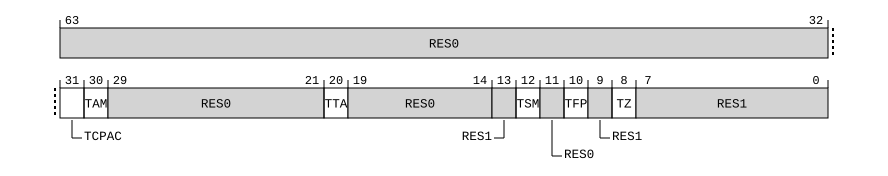

# ​D24.2.37 CPTR_EL2, Architectural Feature Trap Register (EL2)

Source: <https://developer.arm.com/documentation/ddi0487/mc/-Part-D-The-AArch64-System-Level-Architecture/-Chapter-D24-AArch64-System-Register-Descriptions/-D24-2-General-system-control-registers/-D24-2-37-CPTR-EL2--Architectural-Feature-Trap-Register--EL2->

##### D24.2.37 CPTR\_EL2, Architectural Feature Trap Register (EL2)

The CPTR\_EL2 characteristics are:

Purpose
:   Controls trapping to EL2 of accesses to [CPACR](/documentation/ddi0487/mc/-Part-G-The-AArch32-System-Level-Architecture/-Chapter-G8-AArch32-System-Register-Descriptions/-G8-2-General-system-control-registers/-G8-2-33-CPACR--Architectural-Feature-Access-Control-Register?lang=en#reg_aarch32_cpacr), [CPACR\_EL1](/documentation/ddi0487/mc/-Part-D-The-AArch64-System-Level-Architecture/-Chapter-D24-AArch64-System-Register-Descriptions/-D24-2-General-system-control-registers/-D24-2-35-CPACR-EL1--Architectural-Feature-Access-Control-Register?lang=en#reg_aarch64_cpacr_el1), trace, Activity Monitor, SME, Streaming SVE, SVE, and Advanced SIMD and floating-point functionality.

Configuration
:   If EL2 is not implemented, this register is RES0 from EL3.

    This register has no effect if EL2 is not enabled in the current Security state.

    AArch64 System register CPTR\_EL2 bits [31:0] are architecturally mapped to AArch32 System register [HCPTR](/documentation/ddi0487/mc/-Part-G-The-AArch32-System-Level-Architecture/-Chapter-G8-AArch32-System-Register-Descriptions/-G8-2-General-system-control-registers/-G8-2-64-HCPTR--Hyp-Architectural-Feature-Trap-Register?lang=en#reg_aarch32_hcptr)[31:0].

    This register is present only when FEAT\_AA64 is implemented. Otherwise, direct accesses to CPTR\_EL2 are UNDEFINED.

Attributes
:   CPTR\_EL2 is a 64-bit register.

###### Field descriptions

When EffectiveHCR\_EL2\_E2H() == '1':
:   

Bits [63:32]
:   Reserved, RES0.

TCPAC, bit [31]
:   In AArch64 state, traps accesses to [CPACR\_EL1](/documentation/ddi0487/mc/-Part-D-The-AArch64-System-Level-Architecture/-Chapter-D24-AArch64-System-Register-Descriptions/-D24-2-General-system-control-registers/-D24-2-35-CPACR-EL1--Architectural-Feature-Access-Control-Register?lang=en#reg_aarch64_cpacr_el1) from EL1 to EL2, when EL2 is enabled in the current Security state. The exception is reported using EC syndrome value `0x18`.

    In AArch32 state, traps accesses to [CPACR](/documentation/ddi0487/mc/-Part-G-The-AArch32-System-Level-Architecture/-Chapter-G8-AArch32-System-Register-Descriptions/-G8-2-General-system-control-registers/-G8-2-33-CPACR--Architectural-Feature-Access-Control-Register?lang=en#reg_aarch32_cpacr) from EL1 to EL2, when EL2 is enabled in the current Security state. The exception is reported using EC syndrome value `0x03`.

<table>
 <colgroup>
  <col/>
  <col/>
 </colgroup>
 <thead>
  <tr>
   <th>
    <strong>
     TCPAC
    </strong>
   </th>
   <th>
    <strong>
     Meaning
    </strong>
   </th>
  </tr>
 </thead>
 <tbody>
  <tr>
   <td>
    <p>
     <code>
      0b0
     </code>
    </p>
   </td>
   <td>
    <p>
     This control does not cause any instructions to be trapped.
    </p>
   </td>
  </tr>
  <tr>
   <td>
    <p>
     <code>
      0b1
     </code>
    </p>
   </td>
   <td>
    <p>
     EL1 accesses to
     <a class="document-topic" document-topic-path="/ddi0487/mc/-Part-D-The-AArch64-System-Level-Architecture/-Chapter-D24-AArch64-System-Register-Descriptions/-D24-2-General-system-control-registers/-D24-2-35-CPACR-EL1--Architectural-Feature-Access-Control-Register?lang=en#reg_aarch64_cpacr_el1" href="/documentation/ddi0487/mc/-Part-D-The-AArch64-System-Level-Architecture/-Chapter-D24-AArch64-System-Register-Descriptions/-D24-2-General-system-control-registers/-D24-2-35-CPACR-EL1--Architectural-Feature-Access-Control-Register?lang=en#reg_aarch64_cpacr_el1">
      CPACR_EL1
     </a>
     and
     <a class="document-topic" document-topic-path="/ddi0487/mc/-Part-G-The-AArch32-System-Level-Architecture/-Chapter-G8-AArch32-System-Register-Descriptions/-G8-2-General-system-control-registers/-G8-2-33-CPACR--Architectural-Feature-Access-Control-Register?lang=en#reg_aarch32_cpacr" href="/documentation/ddi0487/mc/-Part-G-The-AArch32-System-Level-Architecture/-Chapter-G8-AArch32-System-Register-Descriptions/-G8-2-General-system-control-registers/-G8-2-33-CPACR--Architectural-Feature-Access-Control-Register?lang=en#reg_aarch32_cpacr">
      CPACR
     </a>
     are trapped to EL2, when EL2 is enabled in the current Security state.
    </p>
   </td>
  </tr>
 </tbody>
</table>

    When the Effective value of [HCR\_EL2](/documentation/ddi0487/mc/-Part-D-The-AArch64-System-Level-Architecture/-Chapter-D24-AArch64-System-Register-Descriptions/-D24-2-General-system-control-registers/-D24-2-61-HCR-EL2--Hypervisor-Configuration-Register?lang=en#reg_aarch64_hcr_el2).TGE is 1, this control does not cause any instructions to be trapped.

    > #### Note
    >
    > [CPACR\_EL1](/documentation/ddi0487/mc/-Part-D-The-AArch64-System-Level-Architecture/-Chapter-D24-AArch64-System-Register-Descriptions/-D24-2-General-system-control-registers/-D24-2-35-CPACR-EL1--Architectural-Feature-Access-Control-Register?lang=en#reg_aarch64_cpacr_el1) and [CPACR](/documentation/ddi0487/mc/-Part-G-The-AArch32-System-Level-Architecture/-Chapter-G8-AArch32-System-Register-Descriptions/-G8-2-General-system-control-registers/-G8-2-33-CPACR--Architectural-Feature-Access-Control-Register?lang=en#reg_aarch32_cpacr) are not accessible at EL0.

    The reset behavior of this field is:

    - On a Warm reset, this field resets to an architecturally UNKNOWN value.

    When FEAT\_SRMASK is implemented, EL2 is the current Exception level, IsSystemRegisterMaskingEnabled(EL2), and CPTRMASK\_EL2.TCPAC == ‘1’, access to this field is RO.

TAM, bit [30]
:   When FEAT\_AMUv1 is implemented:
    :   Trap Activity Monitor access. Traps EL1 and EL0 accesses to all Activity Monitors System registers to EL2, as follows:

        - In AArch64 state, accesses to the following registers are trapped to EL2, reported using EC syndrome value `0x18`:

          - [AMUSERENR\_EL0](/documentation/ddi0487/mc/-Part-D-The-AArch64-System-Level-Architecture/-Chapter-D24-AArch64-System-Register-Descriptions/-D24-6-Activity-Monitors-registers/-D24-6-15-AMUSERENR-EL0--Activity-Monitors-User-Enable-Register?lang=en#reg_aarch64_amuserenr_el0), [AMCFGR\_EL0](/documentation/ddi0487/mc/-Part-D-The-AArch64-System-Level-Architecture/-Chapter-D24-AArch64-System-Register-Descriptions/-D24-6-Activity-Monitors-registers/-D24-6-1-AMCFGR-EL0--Activity-Monitors-Configuration-Register?lang=en#reg_aarch64_amcfgr_el0), [AMCGCR\_EL0](/documentation/ddi0487/mc/-Part-D-The-AArch64-System-Level-Architecture/-Chapter-D24-AArch64-System-Register-Descriptions/-D24-6-Activity-Monitors-registers/-D24-6-3-AMCGCR-EL0--Activity-Monitors-Counter-Group-Configuration-Register?lang=en#reg_aarch64_amcgcr_el0), [AMCNTENCLR0\_EL0](/documentation/ddi0487/mc/-Part-D-The-AArch64-System-Level-Architecture/-Chapter-D24-AArch64-System-Register-Descriptions/-D24-6-Activity-Monitors-registers/-D24-6-4-AMCNTENCLR0-EL0--Activity-Monitors-Count-Enable-Clear-Register-0?lang=en#reg_aarch64_amcntenclr0_el0), [AMCNTENCLR1\_EL0](/documentation/ddi0487/mc/-Part-D-The-AArch64-System-Level-Architecture/-Chapter-D24-AArch64-System-Register-Descriptions/-D24-6-Activity-Monitors-registers/-D24-6-5-AMCNTENCLR1-EL0--Activity-Monitors-Count-Enable-Clear-Register-1?lang=en#reg_aarch64_amcntenclr1_el0), [AMCNTENSET0\_EL0](/documentation/ddi0487/mc/-Part-D-The-AArch64-System-Level-Architecture/-Chapter-D24-AArch64-System-Register-Descriptions/-D24-6-Activity-Monitors-registers/-D24-6-6-AMCNTENSET0-EL0--Activity-Monitors-Count-Enable-Set-Register-0?lang=en#reg_aarch64_amcntenset0_el0), [AMCNTENSET1\_EL0](/documentation/ddi0487/mc/-Part-D-The-AArch64-System-Level-Architecture/-Chapter-D24-AArch64-System-Register-Descriptions/-D24-6-Activity-Monitors-registers/-D24-6-7-AMCNTENSET1-EL0--Activity-Monitors-Count-Enable-Set-Register-1?lang=en#reg_aarch64_amcntenset1_el0), [AMCR\_EL0](/documentation/ddi0487/mc/-Part-D-The-AArch64-System-Level-Architecture/-Chapter-D24-AArch64-System-Register-Descriptions/-D24-6-Activity-Monitors-registers/-D24-6-8-AMCR-EL0--Activity-Monitors-Control-Register?lang=en#reg_aarch64_amcr_el0), [AMEVCNTR0<n>\_EL0](/documentation/ddi0487/mc/-Part-D-The-AArch64-System-Level-Architecture/-Chapter-D24-AArch64-System-Register-Descriptions/-D24-6-Activity-Monitors-registers/-D24-6-9-AMEVCNTR0-n--EL0--Activity-Monitors-Event-Counter-Registers-0--n---0---3?lang=en#reg_aarch64_amevcntr0n_el0), [AMEVCNTR1<n>\_EL0](/documentation/ddi0487/mc/-Part-D-The-AArch64-System-Level-Architecture/-Chapter-D24-AArch64-System-Register-Descriptions/-D24-6-Activity-Monitors-registers/-D24-6-10-AMEVCNTR1-n--EL0--Activity-Monitors-Event-Counter-Registers-1--n---0---15?lang=en#reg_aarch64_amevcntr1n_el0), [AMEVTYPER0<n>\_EL0](/documentation/ddi0487/mc/-Part-D-The-AArch64-System-Level-Architecture/-Chapter-D24-AArch64-System-Register-Descriptions/-D24-6-Activity-Monitors-registers/-D24-6-13-AMEVTYPER0-n--EL0--Activity-Monitors-Event-Type-Registers-0--n---0---3?lang=en#reg_aarch64_amevtyper0n_el0), and [AMEVTYPER1<n>\_EL0](/documentation/ddi0487/mc/-Part-D-The-AArch64-System-Level-Architecture/-Chapter-D24-AArch64-System-Register-Descriptions/-D24-6-Activity-Monitors-registers/-D24-6-14-AMEVTYPER1-n--EL0--Activity-Monitors-Event-Type-Registers-1--n---0---15?lang=en#reg_aarch64_amevtyper1n_el0).
        - In AArch32 state, MRC or MCR accesses to the following registers are trapped to EL2 and reported using EC syndrome value `0x03`:

          - [AMUSERENR](/documentation/ddi0487/mc/-Part-G-The-AArch32-System-Level-Architecture/-Chapter-G8-AArch32-System-Register-Descriptions/-G8-5-Activity-Monitors-registers/-G8-5-12-AMUSERENR--Activity-Monitors-User-Enable-Register?lang=en#reg_aarch32_amuserenr), [AMCFGR](/documentation/ddi0487/mc/-Part-G-The-AArch32-System-Level-Architecture/-Chapter-G8-AArch32-System-Register-Descriptions/-G8-5-Activity-Monitors-registers/-G8-5-1-AMCFGR--Activity-Monitors-Configuration-Register?lang=en#reg_aarch32_amcfgr), [AMCGCR](/documentation/ddi0487/mc/-Part-G-The-AArch32-System-Level-Architecture/-Chapter-G8-AArch32-System-Register-Descriptions/-G8-5-Activity-Monitors-registers/-G8-5-2-AMCGCR--Activity-Monitors-Counter-Group-Configuration-Register?lang=en#reg_aarch32_amcgcr), [AMCNTENCLR0](/documentation/ddi0487/mc/-Part-G-The-AArch32-System-Level-Architecture/-Chapter-G8-AArch32-System-Register-Descriptions/-G8-5-Activity-Monitors-registers/-G8-5-3-AMCNTENCLR0--Activity-Monitors-Count-Enable-Clear-Register-0?lang=en#reg_aarch32_amcntenclr0), [AMCNTENCLR1](/documentation/ddi0487/mc/-Part-G-The-AArch32-System-Level-Architecture/-Chapter-G8-AArch32-System-Register-Descriptions/-G8-5-Activity-Monitors-registers/-G8-5-4-AMCNTENCLR1--Activity-Monitors-Count-Enable-Clear-Register-1?lang=en#reg_aarch32_amcntenclr1), [AMCNTENSET0](/documentation/ddi0487/mc/-Part-G-The-AArch32-System-Level-Architecture/-Chapter-G8-AArch32-System-Register-Descriptions/-G8-5-Activity-Monitors-registers/-G8-5-5-AMCNTENSET0--Activity-Monitors-Count-Enable-Set-Register-0?lang=en#reg_aarch32_amcntenset0), [AMCNTENSET1](/documentation/ddi0487/mc/-Part-G-The-AArch32-System-Level-Architecture/-Chapter-G8-AArch32-System-Register-Descriptions/-G8-5-Activity-Monitors-registers/-G8-5-6-AMCNTENSET1--Activity-Monitors-Count-Enable-Set-Register-1?lang=en#reg_aarch32_amcntenset1), [AMCR](/documentation/ddi0487/mc/-Part-G-The-AArch32-System-Level-Architecture/-Chapter-G8-AArch32-System-Register-Descriptions/-G8-5-Activity-Monitors-registers/-G8-5-7-AMCR--Activity-Monitors-Control-Register?lang=en#reg_aarch32_amcr), [AMEVTYPER0<n>](/documentation/ddi0487/mc/-Part-G-The-AArch32-System-Level-Architecture/-Chapter-G8-AArch32-System-Register-Descriptions/-G8-5-Activity-Monitors-registers/-G8-5-10-AMEVTYPER0-n---Activity-Monitors-Event-Type-Registers-0--n---0---3?lang=en#reg_aarch32_amevtyper0n), and [AMEVTYPER1<n>](/documentation/ddi0487/mc/-Part-G-The-AArch32-System-Level-Architecture/-Chapter-G8-AArch32-System-Register-Descriptions/-G8-5-Activity-Monitors-registers/-G8-5-11-AMEVTYPER1-n---Activity-Monitors-Event-Type-Registers-1--n---0---15?lang=en#reg_aarch32_amevtyper1n).
        - In AArch32 state, MRRC or MCRR accesses to [AMEVCNTR0<n>](/documentation/ddi0487/mc/-Part-G-The-AArch32-System-Level-Architecture/-Chapter-G8-AArch32-System-Register-Descriptions/-G8-5-Activity-Monitors-registers/-G8-5-8-AMEVCNTR0-n---Activity-Monitors-Event-Counter-Registers-0--n---0---3?lang=en#reg_aarch32_amevcntr0n) and [AMEVCNTR1<n>](/documentation/ddi0487/mc/-Part-G-The-AArch32-System-Level-Architecture/-Chapter-G8-AArch32-System-Register-Descriptions/-G8-5-Activity-Monitors-registers/-G8-5-9-AMEVCNTR1-n---Activity-Monitors-Event-Counter-Registers-1--n---0---15?lang=en#reg_aarch32_amevcntr1n), are trapped to EL2, reported using EC syndrome value `0x04`.

<table>
 <colgroup>
  <col/>
  <col/>
 </colgroup>
 <thead>
  <tr>
   <th>
    <strong>
     TAM
    </strong>
   </th>
   <th>
    <strong>
     Meaning
    </strong>
   </th>
  </tr>
 </thead>
 <tbody>
  <tr>
   <td>
    <p>
     <code>
      0b0
     </code>
    </p>
   </td>
   <td>
    <p>
     Accesses from EL1 and EL0 to Activity Monitors System registers are not trapped.
    </p>
   </td>
  </tr>
  <tr>
   <td>
    <p>
     <code>
      0b1
     </code>
    </p>
   </td>
   <td>
    <p>
     Accesses from EL1 and EL0 to Activity Monitors System registers are trapped to EL2, when EL2 is enabled in the current Security state.
    </p>
   </td>
  </tr>
 </tbody>
</table>

        The reset behavior of this field is:

        - On a Warm reset, this field resets to an architecturally UNKNOWN value.

        When FEAT\_SRMASK is implemented, EL2 is the current Exception level, IsSystemRegisterMaskingEnabled(EL2), and CPTRMASK\_EL2.TAM == ‘1’, access to this field is RO.

    Otherwise:
    :   Reserved, RES0.

E0POE, bit [29]
:   When FEAT\_S1POE is implemented:
    :   Enable access to [POR\_EL0](/documentation/ddi0487/mc/-Part-D-The-AArch64-System-Level-Architecture/-Chapter-D24-AArch64-System-Register-Descriptions/-D24-2-General-system-control-registers/-D24-2-149-POR-EL0--Permission-Overlay-Register-0--EL0-?lang=en#reg_aarch64_por_el0).

        Traps EL0 accesses to [POR\_EL0](/documentation/ddi0487/mc/-Part-D-The-AArch64-System-Level-Architecture/-Chapter-D24-AArch64-System-Register-Descriptions/-D24-2-General-system-control-registers/-D24-2-149-POR-EL0--Permission-Overlay-Register-0--EL0-?lang=en#reg_aarch64_por_el0) to EL2, from AArch64 state only. The exception is reported using EC syndrome value `0x18`.

<table>
 <colgroup>
  <col/>
  <col/>
 </colgroup>
 <thead>
  <tr>
   <th>
    <strong>
     E0POE
    </strong>
   </th>
   <th>
    <strong>
     Meaning
    </strong>
   </th>
  </tr>
 </thead>
 <tbody>
  <tr>
   <td>
    <p>
     <code>
      0b0
     </code>
    </p>
   </td>
   <td>
    <p>
     This control causes EL0 access to
     <a class="document-topic" document-topic-path="/ddi0487/mc/-Part-D-The-AArch64-System-Level-Architecture/-Chapter-D24-AArch64-System-Register-Descriptions/-D24-2-General-system-control-registers/-D24-2-149-POR-EL0--Permission-Overlay-Register-0--EL0-?lang=en#reg_aarch64_por_el0" href="/documentation/ddi0487/mc/-Part-D-The-AArch64-System-Level-Architecture/-Chapter-D24-AArch64-System-Register-Descriptions/-D24-2-General-system-control-registers/-D24-2-149-POR-EL0--Permission-Overlay-Register-0--EL0-?lang=en#reg_aarch64_por_el0">
      POR_EL0
     </a>
     to be trapped.
    </p>
   </td>
  </tr>
  <tr>
   <td>
    <p>
     <code>
      0b1
     </code>
    </p>
   </td>
   <td>
    <p>
     This control does not cause any instructions to be trapped.
    </p>
   </td>
  </tr>
 </tbody>
</table>

        The reset behavior of this field is:

        - On a Warm reset, this field resets to an architecturally UNKNOWN value.

        When FEAT\_SRMASK is implemented, EL2 is the current Exception level, IsSystemRegisterMaskingEnabled(EL2), and CPTRMASK\_EL2.E0POE == ‘1’, access to this field is RO.

    Otherwise:
    :   Reserved, RES0.

TTA, bit [28]
:   When System register access to the trace unit registers is implemented:
    :   Traps System register accesses to all implemented trace System registers from both Execution states to EL2, when EL2 is enabled in the current Security state, as follows:

        - In AArch64 state, accesses to trace System registers with op0=2, op1=1, and CRn<`0b1000` are trapped to EL2, reported using EC syndrome value `0x18`.
        - In AArch32 state, MRC or MCR accesses to trace System registers with cpnum=14, opc1=1, and CRn<`0b1000` are trapped to EL2, reported using EC syndrome value `0x05`.

<table>
 <colgroup>
  <col/>
  <col/>
 </colgroup>
 <thead>
  <tr>
   <th>
    <strong>
     TTA
    </strong>
   </th>
   <th>
    <strong>
     Meaning
    </strong>
   </th>
  </tr>
 </thead>
 <tbody>
  <tr>
   <td>
    <p>
     <code>
      0b0
     </code>
    </p>
   </td>
   <td>
    <p>
     This control does not cause any instructions to be trapped.
    </p>
   </td>
  </tr>
  <tr>
   <td>
    <p>
     <code>
      0b1
     </code>
    </p>
   </td>
   <td>
    <p>
     Any attempt at EL0, EL1 or EL2, to execute a System register access to an implemented trace System register is trapped to EL2, when EL2 is enabled in the current Security state, unless
     <a class="document-topic" document-topic-path="/ddi0487/mc/-Part-D-The-AArch64-System-Level-Architecture/-Chapter-D24-AArch64-System-Register-Descriptions/-D24-2-General-system-control-registers/-D24-2-61-HCR-EL2--Hypervisor-Configuration-Register?lang=en#reg_aarch64_hcr_el2" href="/documentation/ddi0487/mc/-Part-D-The-AArch64-System-Level-Architecture/-Chapter-D24-AArch64-System-Register-Descriptions/-D24-2-General-system-control-registers/-D24-2-61-HCR-EL2--Hypervisor-Configuration-Register?lang=en#reg_aarch64_hcr_el2">
      HCR_EL2
     </a>
     .TGE is 0 and it is trapped by
     <a class="document-topic" document-topic-path="/ddi0487/mc/-Part-G-The-AArch32-System-Level-Architecture/-Chapter-G8-AArch32-System-Register-Descriptions/-G8-2-General-system-control-registers/-G8-2-33-CPACR--Architectural-Feature-Access-Control-Register?lang=en#reg_aarch32_cpacr" href="/documentation/ddi0487/mc/-Part-G-The-AArch32-System-Level-Architecture/-Chapter-G8-AArch32-System-Register-Descriptions/-G8-2-General-system-control-registers/-G8-2-33-CPACR--Architectural-Feature-Access-Control-Register?lang=en#reg_aarch32_cpacr">
      CPACR
     </a>
     .NSTRCDIS or
     <a class="document-topic" document-topic-path="/ddi0487/mc/-Part-D-The-AArch64-System-Level-Architecture/-Chapter-D24-AArch64-System-Register-Descriptions/-D24-2-General-system-control-registers/-D24-2-35-CPACR-EL1--Architectural-Feature-Access-Control-Register?lang=en#reg_aarch64_cpacr_el1" href="/documentation/ddi0487/mc/-Part-D-The-AArch64-System-Level-Architecture/-Chapter-D24-AArch64-System-Register-Descriptions/-D24-2-General-system-control-registers/-D24-2-35-CPACR-EL1--Architectural-Feature-Access-Control-Register?lang=en#reg_aarch64_cpacr_el1">
      CPACR_EL1
     </a>
     .TTA.
    </p>
    <p>
     When
     <a class="document-topic" document-topic-path="/ddi0487/mc/-Part-D-The-AArch64-System-Level-Architecture/-Chapter-D24-AArch64-System-Register-Descriptions/-D24-2-General-system-control-registers/-D24-2-61-HCR-EL2--Hypervisor-Configuration-Register?lang=en#reg_aarch64_hcr_el2" href="/documentation/ddi0487/mc/-Part-D-The-AArch64-System-Level-Architecture/-Chapter-D24-AArch64-System-Register-Descriptions/-D24-2-General-system-control-registers/-D24-2-61-HCR-EL2--Hypervisor-Configuration-Register?lang=en#reg_aarch64_hcr_el2">
      HCR_EL2
     </a>
     .TGE is 1, any attempt at EL0 or EL2 to execute a System register access to an implemented trace System register is trapped to EL2, when EL2 is enabled in the current Security state.
    </p>
   </td>
  </tr>
 </tbody>
</table>

        > #### Note
        >
        > The ETMv4 architecture and ETE do not permit EL0 to access the trace System registers. If the trace unit implements FEAT\_ETMv4 or ETE, EL0 accesses to the trace System registers are UNDEFINED, and any resulting exception is higher priority than an exception that would be generated because the value of CPTR\_EL2.TTA is 1.
        >
        > EL2 does not provide traps on trace register accesses through the optional Memory-mapped interface.

        System register accesses to the trace System registers can have side-effects. When a System register access is trapped, any side-effects that are normally associated with the access do not occur before the exception is taken.

        The reset behavior of this field is:

        - On a Warm reset, this field resets to an architecturally UNKNOWN value.

        When FEAT\_SRMASK is implemented, EL2 is the current Exception level, IsSystemRegisterMaskingEnabled(EL2), and CPTRMASK\_EL2.TTA == ‘1’, access to this field is RO.

    Otherwise:
    :   Reserved, RES0.

Bits [27:26]
:   Reserved, RES0.

SMEN, bits [25:24]
:   When FEAT\_SME is implemented:
    :   Traps execution at EL2, EL1, and EL0 of SME instructions, SVE instructions when FEAT\_SVE is not implemented or the PE is in Streaming SVE mode, and instructions that directly access the [SVCR](/documentation/ddi0487/mc/-Part-C-The-AArch64-Instruction-Set/-Chapter-C5-The-A64-System-Instruction-Class/-C5-2-Special-purpose-registers/-C5-2-28-SVCR--Streaming-Vector-Control-Register?lang=en#reg_aarch64_svcr), [SMCR\_EL1](/documentation/ddi0487/mc/-Part-D-The-AArch64-System-Level-Architecture/-Chapter-D24-AArch64-System-Register-Descriptions/-D24-2-General-system-control-registers/-D24-2-183-SMCR-EL1--SME-Control-Register--EL1-?lang=en#reg_aarch64_smcr_el1), or [SMCR\_EL2](/documentation/ddi0487/mc/-Part-D-The-AArch64-System-Level-Architecture/-Chapter-D24-AArch64-System-Register-Descriptions/-D24-2-General-system-control-registers/-D24-2-184-SMCR-EL2--SME-Control-Register--EL2-?lang=en#reg_aarch64_smcr_el2) System registers to EL2, when EL2 is enabled in the current Security state.

        When instructions that directly access the [SVCR](/documentation/ddi0487/mc/-Part-C-The-AArch64-Instruction-Set/-Chapter-C5-The-A64-System-Instruction-Class/-C5-2-Special-purpose-registers/-C5-2-28-SVCR--Streaming-Vector-Control-Register?lang=en#reg_aarch64_svcr) System register are trapped with reference to this control, the `MSR SVCRSM`, `MSR SVCRZA`, and `MSR SVCRSMZA` instructions are also trapped.

        The exception is reported using EC syndrome value `0x1D`, with an ISS code of `0x0000000`.

        This field does not affect whether Streaming SVE or SME register values are valid.

        A trap taken as a result of CPTR\_EL2.SMEN has precedence over a trap taken as a result of CPTR\_EL2.FPEN.

<table>
 <colgroup>
  <col/>
  <col/>
 </colgroup>
 <thead>
  <tr>
   <th>
    <strong>
     SMEN
    </strong>
   </th>
   <th>
    <strong>
     Meaning
    </strong>
   </th>
  </tr>
 </thead>
 <tbody>
  <tr>
   <td>
    <p>
     <code>
      0b00
     </code>
    </p>
   </td>
   <td>
    <p>
     This control causes execution of these instructions at EL2, EL1, and EL0 to be trapped.
    </p>
   </td>
  </tr>
  <tr>
   <td>
    <p>
     <code>
      0b01
     </code>
    </p>
   </td>
   <td>
    <p>
     When
     <a class="document-topic" document-topic-path="/ddi0487/mc/-Part-D-The-AArch64-System-Level-Architecture/-Chapter-D24-AArch64-System-Register-Descriptions/-D24-2-General-system-control-registers/-D24-2-61-HCR-EL2--Hypervisor-Configuration-Register?lang=en#reg_aarch64_hcr_el2" href="/documentation/ddi0487/mc/-Part-D-The-AArch64-System-Level-Architecture/-Chapter-D24-AArch64-System-Register-Descriptions/-D24-2-General-system-control-registers/-D24-2-61-HCR-EL2--Hypervisor-Configuration-Register?lang=en#reg_aarch64_hcr_el2">
      HCR_EL2
     </a>
     .TGE is 0, this control does not cause execution of any instructions to be trapped.
    </p>
    <p>
     When
     <a class="document-topic" document-topic-path="/ddi0487/mc/-Part-D-The-AArch64-System-Level-Architecture/-Chapter-D24-AArch64-System-Register-Descriptions/-D24-2-General-system-control-registers/-D24-2-61-HCR-EL2--Hypervisor-Configuration-Register?lang=en#reg_aarch64_hcr_el2" href="/documentation/ddi0487/mc/-Part-D-The-AArch64-System-Level-Architecture/-Chapter-D24-AArch64-System-Register-Descriptions/-D24-2-General-system-control-registers/-D24-2-61-HCR-EL2--Hypervisor-Configuration-Register?lang=en#reg_aarch64_hcr_el2">
      HCR_EL2
     </a>
     .TGE is 1, this control causes execution of these instructions at EL0 to be trapped, but does not cause execution of any instructions at EL2 to be trapped.
    </p>
   </td>
  </tr>
  <tr>
   <td>
    <p>
     <code>
      0b10
     </code>
    </p>
   </td>
   <td>
    <p>
     This control causes execution of these instructions at EL2, EL1, and EL0 to be trapped.
    </p>
   </td>
  </tr>
  <tr>
   <td>
    <p>
     <code>
      0b11
     </code>
    </p>
   </td>
   <td>
    <p>
     This control does not cause execution of any instructions to be trapped.
    </p>
   </td>
  </tr>
 </tbody>
</table>

        The reset behavior of this field is:

        - On a Warm reset, this field resets to an architecturally UNKNOWN value.

        When FEAT\_SRMASK is implemented, EL2 is the current Exception level, IsSystemRegisterMaskingEnabled(EL2), and CPTRMASK\_EL2.SMEN == ‘1’, access to this field is RO.

    Otherwise:
    :   Reserved, RES0.

Bits [23:22]
:   Reserved, RES0.

FPEN, bits [21:20]
:   Traps execution at EL2, EL1, and EL0 of instructions that access the Advanced SIMD and floating-point registers from both Execution states to EL2, when EL2 is enabled in the current Security state. The exception is reported using EC syndrome value `0x07`.

    Traps execution at EL2, EL1, and EL0 of SME and SVE instructions to EL2, when EL2 is enabled in the current Security state. The exception is reported using EC syndrome value `0x07`.

    When [FEAT\_FPMR](/documentation/ddi0487/mc/-Part-A-Arm-Architecture-Introduction-and-Overview/-Chapter-A2-A-profile-Architecture-Extensions/-A2-3-Armv9-A-architecture-extensions/-A2-3-6-The-Armv9-5-architecture-extension?lang=en#feat_feat_fpmr) is implemented, traps execution at EL2, EL1, and EL0 of instructions that access [FPMR](/documentation/ddi0487/mc/-Part-C-The-AArch64-Instruction-Set/-Chapter-C5-The-A64-System-Instruction-Class/-C5-2-Special-purpose-registers/-C5-2-9-FPMR--Floating-point-Mode-Register?lang=en#reg_aarch64_fpmr) to EL2, when EL2 is enabled in the current Security state. The exception is reported using EC syndrome value `0x07`

    A trap taken as a result of CPTR\_EL2.SMEN has precedence over a trap taken as a result of CPTR\_EL2.FPEN.

    A trap taken as a result of CPTR\_EL2.ZEN has precedence over a trap taken as a result of CPTR\_EL2.FPEN.

<table>
 <colgroup>
  <col/>
  <col/>
 </colgroup>
 <thead>
  <tr>
   <th>
    <strong>
     FPEN
    </strong>
   </th>
   <th>
    <strong>
     Meaning
    </strong>
   </th>
  </tr>
 </thead>
 <tbody>
  <tr>
   <td>
    <p>
     <code>
      0b00
     </code>
    </p>
   </td>
   <td>
    <p>
     This control causes execution of these instructions at EL2, EL1, and EL0 to be trapped.
    </p>
   </td>
  </tr>
  <tr>
   <td>
    <p>
     <code>
      0b01
     </code>
    </p>
   </td>
   <td>
    <p>
     When
     <a class="document-topic" document-topic-path="/ddi0487/mc/-Part-D-The-AArch64-System-Level-Architecture/-Chapter-D24-AArch64-System-Register-Descriptions/-D24-2-General-system-control-registers/-D24-2-61-HCR-EL2--Hypervisor-Configuration-Register?lang=en#reg_aarch64_hcr_el2" href="/documentation/ddi0487/mc/-Part-D-The-AArch64-System-Level-Architecture/-Chapter-D24-AArch64-System-Register-Descriptions/-D24-2-General-system-control-registers/-D24-2-61-HCR-EL2--Hypervisor-Configuration-Register?lang=en#reg_aarch64_hcr_el2">
      HCR_EL2
     </a>
     .TGE is 0, this control does not cause execution of any instructions to be trapped.
    </p>
    <p>
     When
     <a class="document-topic" document-topic-path="/ddi0487/mc/-Part-D-The-AArch64-System-Level-Architecture/-Chapter-D24-AArch64-System-Register-Descriptions/-D24-2-General-system-control-registers/-D24-2-61-HCR-EL2--Hypervisor-Configuration-Register?lang=en#reg_aarch64_hcr_el2" href="/documentation/ddi0487/mc/-Part-D-The-AArch64-System-Level-Architecture/-Chapter-D24-AArch64-System-Register-Descriptions/-D24-2-General-system-control-registers/-D24-2-61-HCR-EL2--Hypervisor-Configuration-Register?lang=en#reg_aarch64_hcr_el2">
      HCR_EL2
     </a>
     .TGE is 1, this control causes execution of these instructions at EL0 to be trapped, but does not cause execution of any instructions at EL2 to be trapped.
    </p>
   </td>
  </tr>
  <tr>
   <td>
    <p>
     <code>
      0b10
     </code>
    </p>
   </td>
   <td>
    <p>
     This control causes execution of these instructions at EL2, EL1, and EL0 to be trapped.
    </p>
   </td>
  </tr>
  <tr>
   <td>
    <p>
     <code>
      0b11
     </code>
    </p>
   </td>
   <td>
    <p>
     This control does not cause execution of any instructions to be trapped.
    </p>
   </td>
  </tr>
 </tbody>
</table>

    Writes to [MVFR0](/documentation/ddi0487/mc/-Part-G-The-AArch32-System-Level-Architecture/-Chapter-G8-AArch32-System-Register-Descriptions/-G8-2-General-system-control-registers/-G8-2-116-MVFR0--Media-and-VFP-Feature-Register-0?lang=en#reg_aarch32_mvfr0), [MVFR1](/documentation/ddi0487/mc/-Part-G-The-AArch32-System-Level-Architecture/-Chapter-G8-AArch32-System-Register-Descriptions/-G8-2-General-system-control-registers/-G8-2-117-MVFR1--Media-and-VFP-Feature-Register-1?lang=en#reg_aarch32_mvfr1), and [MVFR2](/documentation/ddi0487/mc/-Part-G-The-AArch32-System-Level-Architecture/-Chapter-G8-AArch32-System-Register-Descriptions/-G8-2-General-system-control-registers/-G8-2-118-MVFR2--Media-and-VFP-Feature-Register-2?lang=en#reg_aarch32_mvfr2) from EL1 or higher are CONSTRAINED UNPREDICTABLE and whether these accesses can be trapped by this control depends on implemented CONSTRAINED UNPREDICTABLE behavior.

    > #### Note
    >
    > - Attempts to write to the [FPSID](/documentation/ddi0487/mc/-Part-G-The-AArch32-System-Level-Architecture/-Chapter-G8-AArch32-System-Register-Descriptions/-G8-2-General-system-control-registers/-G8-2-56-FPSID--Floating-Point-System-ID-register?lang=en#reg_aarch32_fpsid) count as use of the registers for accesses from EL1 or higher.
    > - Accesses from EL0 to [FPSID](/documentation/ddi0487/mc/-Part-G-The-AArch32-System-Level-Architecture/-Chapter-G8-AArch32-System-Register-Descriptions/-G8-2-General-system-control-registers/-G8-2-56-FPSID--Floating-Point-System-ID-register?lang=en#reg_aarch32_fpsid), [MVFR0](/documentation/ddi0487/mc/-Part-G-The-AArch32-System-Level-Architecture/-Chapter-G8-AArch32-System-Register-Descriptions/-G8-2-General-system-control-registers/-G8-2-116-MVFR0--Media-and-VFP-Feature-Register-0?lang=en#reg_aarch32_mvfr0), [MVFR1](/documentation/ddi0487/mc/-Part-G-The-AArch32-System-Level-Architecture/-Chapter-G8-AArch32-System-Register-Descriptions/-G8-2-General-system-control-registers/-G8-2-117-MVFR1--Media-and-VFP-Feature-Register-1?lang=en#reg_aarch32_mvfr1), [MVFR2](/documentation/ddi0487/mc/-Part-G-The-AArch32-System-Level-Architecture/-Chapter-G8-AArch32-System-Register-Descriptions/-G8-2-General-system-control-registers/-G8-2-118-MVFR2--Media-and-VFP-Feature-Register-2?lang=en#reg_aarch32_mvfr2), and [FPEXC](/documentation/ddi0487/mc/-Part-G-The-AArch32-System-Level-Architecture/-Chapter-G8-AArch32-System-Register-Descriptions/-G8-2-General-system-control-registers/-G8-2-54-FPEXC--Floating-Point-Exception-Control-register?lang=en#reg_aarch32_fpexc) are UNDEFINED, and any resulting exception is higher priority than an exception that would be generated because the value of CPTR\_EL2.FPEN is not `0b11`.

    The reset behavior of this field is:

    - On a Warm reset, this field resets to an architecturally UNKNOWN value.

    When FEAT\_SRMASK is implemented, EL2 is the current Exception level, IsSystemRegisterMaskingEnabled(EL2), and CPTRMASK\_EL2.FPEN == ‘1’, access to this field is RO.

Bits [19:18]
:   Reserved, RES0.

ZEN, bits [17:16]
:   When FEAT\_SVE is implemented:
    :   Traps execution at EL2, EL1, and EL0 of SVE instructions when the PE is not in Streaming SVE mode, and instructions that directly access the [ZCR\_EL1](/documentation/ddi0487/mc/-Part-D-The-AArch64-System-Level-Architecture/-Chapter-D24-AArch64-System-Register-Descriptions/-D24-2-General-system-control-registers/-D24-2-225-ZCR-EL1--SVE-Control-Register--EL1-?lang=en#reg_aarch64_zcr_el1) or [ZCR\_EL2](/documentation/ddi0487/mc/-Part-D-The-AArch64-System-Level-Architecture/-Chapter-D24-AArch64-System-Register-Descriptions/-D24-2-General-system-control-registers/-D24-2-226-ZCR-EL2--SVE-Control-Register--EL2-?lang=en#reg_aarch64_zcr_el2) System registers to EL2, when EL2 is enabled in the current Security state.

        The exception is reported using EC syndrome value `0x19`.

        A trap taken as a result of CPTR\_EL2.ZEN has precedence over a trap taken as a result of CPTR\_EL2.FPEN.

<table>
 <colgroup>
  <col/>
  <col/>
 </colgroup>
 <thead>
  <tr>
   <th>
    <strong>
     ZEN
    </strong>
   </th>
   <th>
    <strong>
     Meaning
    </strong>
   </th>
  </tr>
 </thead>
 <tbody>
  <tr>
   <td>
    <p>
     <code>
      0b00
     </code>
    </p>
   </td>
   <td>
    <p>
     This control causes execution of these instructions at EL2, EL1, and EL0 to be trapped.
    </p>
   </td>
  </tr>
  <tr>
   <td>
    <p>
     <code>
      0b01
     </code>
    </p>
   </td>
   <td>
    <p>
     When
     <a class="document-topic" document-topic-path="/ddi0487/mc/-Part-D-The-AArch64-System-Level-Architecture/-Chapter-D24-AArch64-System-Register-Descriptions/-D24-2-General-system-control-registers/-D24-2-61-HCR-EL2--Hypervisor-Configuration-Register?lang=en#reg_aarch64_hcr_el2" href="/documentation/ddi0487/mc/-Part-D-The-AArch64-System-Level-Architecture/-Chapter-D24-AArch64-System-Register-Descriptions/-D24-2-General-system-control-registers/-D24-2-61-HCR-EL2--Hypervisor-Configuration-Register?lang=en#reg_aarch64_hcr_el2">
      HCR_EL2
     </a>
     .TGE is 0, this control does not cause execution of any instructions to be trapped.
    </p>
    <p>
     When
     <a class="document-topic" document-topic-path="/ddi0487/mc/-Part-D-The-AArch64-System-Level-Architecture/-Chapter-D24-AArch64-System-Register-Descriptions/-D24-2-General-system-control-registers/-D24-2-61-HCR-EL2--Hypervisor-Configuration-Register?lang=en#reg_aarch64_hcr_el2" href="/documentation/ddi0487/mc/-Part-D-The-AArch64-System-Level-Architecture/-Chapter-D24-AArch64-System-Register-Descriptions/-D24-2-General-system-control-registers/-D24-2-61-HCR-EL2--Hypervisor-Configuration-Register?lang=en#reg_aarch64_hcr_el2">
      HCR_EL2
     </a>
     .TGE is 1, this control causes execution of these instructions at EL0 to be trapped, but does not cause execution of any instructions at EL2 to be trapped.
    </p>
   </td>
  </tr>
  <tr>
   <td>
    <p>
     <code>
      0b10
     </code>
    </p>
   </td>
   <td>
    <p>
     This control causes execution of these instructions at EL2, EL1, and EL0 to be trapped.
    </p>
   </td>
  </tr>
  <tr>
   <td>
    <p>
     <code>
      0b11
     </code>
    </p>
   </td>
   <td>
    <p>
     This control does not cause execution of any instructions to be trapped.
    </p>
   </td>
  </tr>
 </tbody>
</table>

        The reset behavior of this field is:

        - On a Warm reset, this field resets to an architecturally UNKNOWN value.

        When FEAT\_SRMASK is implemented, EL2 is the current Exception level, IsSystemRegisterMaskingEnabled(EL2), and CPTRMASK\_EL2.ZEN == ‘1’, access to this field is RO.

    Otherwise:
    :   Reserved, RES0.

Bits [15:0]
:   Reserved, RES0.

Otherwise:
:   

    This format applies in all Armv8.0 implementations.

Bits [63:32]
:   Reserved, RES0.

TCPAC, bit [31]
:   In AArch64 state, traps accesses to [CPACR\_EL1](/documentation/ddi0487/mc/-Part-D-The-AArch64-System-Level-Architecture/-Chapter-D24-AArch64-System-Register-Descriptions/-D24-2-General-system-control-registers/-D24-2-35-CPACR-EL1--Architectural-Feature-Access-Control-Register?lang=en#reg_aarch64_cpacr_el1) from EL1 to EL2, when EL2 is enabled in the current Security state. The exception is reported using EC syndrome value `0x18`.

    In AArch32 state, traps accesses to [CPACR](/documentation/ddi0487/mc/-Part-G-The-AArch32-System-Level-Architecture/-Chapter-G8-AArch32-System-Register-Descriptions/-G8-2-General-system-control-registers/-G8-2-33-CPACR--Architectural-Feature-Access-Control-Register?lang=en#reg_aarch32_cpacr) from EL1 to EL2, when EL2 is enabled in the current Security state. The exception is reported using EC syndrome value `0x03`.

<table>
 <colgroup>
  <col/>
  <col/>
 </colgroup>
 <thead>
  <tr>
   <th>
    <strong>
     TCPAC
    </strong>
   </th>
   <th>
    <strong>
     Meaning
    </strong>
   </th>
  </tr>
 </thead>
 <tbody>
  <tr>
   <td>
    <p>
     <code>
      0b0
     </code>
    </p>
   </td>
   <td>
    <p>
     This control does not cause any instructions to be trapped.
    </p>
   </td>
  </tr>
  <tr>
   <td>
    <p>
     <code>
      0b1
     </code>
    </p>
   </td>
   <td>
    <p>
     EL1 accesses to the following registers are trapped to EL2, when EL2 is enabled in the current Security state:
    </p>
    <ul>
     <li>
      <p>
       <a class="document-topic" document-topic-path="/ddi0487/mc/-Part-D-The-AArch64-System-Level-Architecture/-Chapter-D24-AArch64-System-Register-Descriptions/-D24-2-General-system-control-registers/-D24-2-35-CPACR-EL1--Architectural-Feature-Access-Control-Register?lang=en#reg_aarch64_cpacr_el1" href="/documentation/ddi0487/mc/-Part-D-The-AArch64-System-Level-Architecture/-Chapter-D24-AArch64-System-Register-Descriptions/-D24-2-General-system-control-registers/-D24-2-35-CPACR-EL1--Architectural-Feature-Access-Control-Register?lang=en#reg_aarch64_cpacr_el1">
        CPACR_EL1
       </a>
       .
      </p>
     </li>
     <li>
      <p>
       <a class="document-topic" document-topic-path="/ddi0487/mc/-Part-G-The-AArch32-System-Level-Architecture/-Chapter-G8-AArch32-System-Register-Descriptions/-G8-2-General-system-control-registers/-G8-2-33-CPACR--Architectural-Feature-Access-Control-Register?lang=en#reg_aarch32_cpacr" href="/documentation/ddi0487/mc/-Part-G-The-AArch32-System-Level-Architecture/-Chapter-G8-AArch32-System-Register-Descriptions/-G8-2-General-system-control-registers/-G8-2-33-CPACR--Architectural-Feature-Access-Control-Register?lang=en#reg_aarch32_cpacr">
        CPACR
       </a>
       .
      </p>
     </li>
    </ul>
   </td>
  </tr>
 </tbody>
</table>

    When [HCR\_EL2](/documentation/ddi0487/mc/-Part-D-The-AArch64-System-Level-Architecture/-Chapter-D24-AArch64-System-Register-Descriptions/-D24-2-General-system-control-registers/-D24-2-61-HCR-EL2--Hypervisor-Configuration-Register?lang=en#reg_aarch64_hcr_el2).TGE is 1, this control does not cause any instructions to be trapped.

    > #### Note
    >
    > [CPACR\_EL1](/documentation/ddi0487/mc/-Part-D-The-AArch64-System-Level-Architecture/-Chapter-D24-AArch64-System-Register-Descriptions/-D24-2-General-system-control-registers/-D24-2-35-CPACR-EL1--Architectural-Feature-Access-Control-Register?lang=en#reg_aarch64_cpacr_el1) and [CPACR](/documentation/ddi0487/mc/-Part-G-The-AArch32-System-Level-Architecture/-Chapter-G8-AArch32-System-Register-Descriptions/-G8-2-General-system-control-registers/-G8-2-33-CPACR--Architectural-Feature-Access-Control-Register?lang=en#reg_aarch32_cpacr) are not accessible at EL0.

    The reset behavior of this field is:

    - On a Warm reset, this field resets to an architecturally UNKNOWN value.

TAM, bit [30]
:   When FEAT\_AMUv1 is implemented:
    :   Trap Activity Monitor access. Traps EL1 and EL0 accesses to all Activity Monitors System registers to EL2, as follows:

        - In AArch64 state, accesses to the following registers are trapped to EL2, reported using EC syndrome value `0x18`:

          - [AMUSERENR\_EL0](/documentation/ddi0487/mc/-Part-D-The-AArch64-System-Level-Architecture/-Chapter-D24-AArch64-System-Register-Descriptions/-D24-6-Activity-Monitors-registers/-D24-6-15-AMUSERENR-EL0--Activity-Monitors-User-Enable-Register?lang=en#reg_aarch64_amuserenr_el0), [AMCFGR\_EL0](/documentation/ddi0487/mc/-Part-D-The-AArch64-System-Level-Architecture/-Chapter-D24-AArch64-System-Register-Descriptions/-D24-6-Activity-Monitors-registers/-D24-6-1-AMCFGR-EL0--Activity-Monitors-Configuration-Register?lang=en#reg_aarch64_amcfgr_el0), [AMCGCR\_EL0](/documentation/ddi0487/mc/-Part-D-The-AArch64-System-Level-Architecture/-Chapter-D24-AArch64-System-Register-Descriptions/-D24-6-Activity-Monitors-registers/-D24-6-3-AMCGCR-EL0--Activity-Monitors-Counter-Group-Configuration-Register?lang=en#reg_aarch64_amcgcr_el0), [AMCNTENCLR0\_EL0](/documentation/ddi0487/mc/-Part-D-The-AArch64-System-Level-Architecture/-Chapter-D24-AArch64-System-Register-Descriptions/-D24-6-Activity-Monitors-registers/-D24-6-4-AMCNTENCLR0-EL0--Activity-Monitors-Count-Enable-Clear-Register-0?lang=en#reg_aarch64_amcntenclr0_el0), [AMCNTENCLR1\_EL0](/documentation/ddi0487/mc/-Part-D-The-AArch64-System-Level-Architecture/-Chapter-D24-AArch64-System-Register-Descriptions/-D24-6-Activity-Monitors-registers/-D24-6-5-AMCNTENCLR1-EL0--Activity-Monitors-Count-Enable-Clear-Register-1?lang=en#reg_aarch64_amcntenclr1_el0), [AMCNTENSET0\_EL0](/documentation/ddi0487/mc/-Part-D-The-AArch64-System-Level-Architecture/-Chapter-D24-AArch64-System-Register-Descriptions/-D24-6-Activity-Monitors-registers/-D24-6-6-AMCNTENSET0-EL0--Activity-Monitors-Count-Enable-Set-Register-0?lang=en#reg_aarch64_amcntenset0_el0), [AMCNTENSET1\_EL0](/documentation/ddi0487/mc/-Part-D-The-AArch64-System-Level-Architecture/-Chapter-D24-AArch64-System-Register-Descriptions/-D24-6-Activity-Monitors-registers/-D24-6-7-AMCNTENSET1-EL0--Activity-Monitors-Count-Enable-Set-Register-1?lang=en#reg_aarch64_amcntenset1_el0), [AMCR\_EL0](/documentation/ddi0487/mc/-Part-D-The-AArch64-System-Level-Architecture/-Chapter-D24-AArch64-System-Register-Descriptions/-D24-6-Activity-Monitors-registers/-D24-6-8-AMCR-EL0--Activity-Monitors-Control-Register?lang=en#reg_aarch64_amcr_el0), [AMEVCNTR0<n>\_EL0](/documentation/ddi0487/mc/-Part-D-The-AArch64-System-Level-Architecture/-Chapter-D24-AArch64-System-Register-Descriptions/-D24-6-Activity-Monitors-registers/-D24-6-9-AMEVCNTR0-n--EL0--Activity-Monitors-Event-Counter-Registers-0--n---0---3?lang=en#reg_aarch64_amevcntr0n_el0), [AMEVCNTR1<n>\_EL0](/documentation/ddi0487/mc/-Part-D-The-AArch64-System-Level-Architecture/-Chapter-D24-AArch64-System-Register-Descriptions/-D24-6-Activity-Monitors-registers/-D24-6-10-AMEVCNTR1-n--EL0--Activity-Monitors-Event-Counter-Registers-1--n---0---15?lang=en#reg_aarch64_amevcntr1n_el0), [AMEVTYPER0<n>\_EL0](/documentation/ddi0487/mc/-Part-D-The-AArch64-System-Level-Architecture/-Chapter-D24-AArch64-System-Register-Descriptions/-D24-6-Activity-Monitors-registers/-D24-6-13-AMEVTYPER0-n--EL0--Activity-Monitors-Event-Type-Registers-0--n---0---3?lang=en#reg_aarch64_amevtyper0n_el0), and [AMEVTYPER1<n>\_EL0](/documentation/ddi0487/mc/-Part-D-The-AArch64-System-Level-Architecture/-Chapter-D24-AArch64-System-Register-Descriptions/-D24-6-Activity-Monitors-registers/-D24-6-14-AMEVTYPER1-n--EL0--Activity-Monitors-Event-Type-Registers-1--n---0---15?lang=en#reg_aarch64_amevtyper1n_el0).
        - In AArch32 state, MCR or MRC accesses to the following registers are trapped to EL2 and reported using EC syndrome value `0x03`:

          - [AMUSERENR](/documentation/ddi0487/mc/-Part-G-The-AArch32-System-Level-Architecture/-Chapter-G8-AArch32-System-Register-Descriptions/-G8-5-Activity-Monitors-registers/-G8-5-12-AMUSERENR--Activity-Monitors-User-Enable-Register?lang=en#reg_aarch32_amuserenr), [AMCFGR](/documentation/ddi0487/mc/-Part-G-The-AArch32-System-Level-Architecture/-Chapter-G8-AArch32-System-Register-Descriptions/-G8-5-Activity-Monitors-registers/-G8-5-1-AMCFGR--Activity-Monitors-Configuration-Register?lang=en#reg_aarch32_amcfgr), [AMCGCR](/documentation/ddi0487/mc/-Part-G-The-AArch32-System-Level-Architecture/-Chapter-G8-AArch32-System-Register-Descriptions/-G8-5-Activity-Monitors-registers/-G8-5-2-AMCGCR--Activity-Monitors-Counter-Group-Configuration-Register?lang=en#reg_aarch32_amcgcr), [AMCNTENCLR0](/documentation/ddi0487/mc/-Part-G-The-AArch32-System-Level-Architecture/-Chapter-G8-AArch32-System-Register-Descriptions/-G8-5-Activity-Monitors-registers/-G8-5-3-AMCNTENCLR0--Activity-Monitors-Count-Enable-Clear-Register-0?lang=en#reg_aarch32_amcntenclr0), [AMCNTENCLR1](/documentation/ddi0487/mc/-Part-G-The-AArch32-System-Level-Architecture/-Chapter-G8-AArch32-System-Register-Descriptions/-G8-5-Activity-Monitors-registers/-G8-5-4-AMCNTENCLR1--Activity-Monitors-Count-Enable-Clear-Register-1?lang=en#reg_aarch32_amcntenclr1), [AMCNTENSET0](/documentation/ddi0487/mc/-Part-G-The-AArch32-System-Level-Architecture/-Chapter-G8-AArch32-System-Register-Descriptions/-G8-5-Activity-Monitors-registers/-G8-5-5-AMCNTENSET0--Activity-Monitors-Count-Enable-Set-Register-0?lang=en#reg_aarch32_amcntenset0), [AMCNTENSET1](/documentation/ddi0487/mc/-Part-G-The-AArch32-System-Level-Architecture/-Chapter-G8-AArch32-System-Register-Descriptions/-G8-5-Activity-Monitors-registers/-G8-5-6-AMCNTENSET1--Activity-Monitors-Count-Enable-Set-Register-1?lang=en#reg_aarch32_amcntenset1), [AMCR](/documentation/ddi0487/mc/-Part-G-The-AArch32-System-Level-Architecture/-Chapter-G8-AArch32-System-Register-Descriptions/-G8-5-Activity-Monitors-registers/-G8-5-7-AMCR--Activity-Monitors-Control-Register?lang=en#reg_aarch32_amcr), [AMEVTYPER0<n>](/documentation/ddi0487/mc/-Part-G-The-AArch32-System-Level-Architecture/-Chapter-G8-AArch32-System-Register-Descriptions/-G8-5-Activity-Monitors-registers/-G8-5-10-AMEVTYPER0-n---Activity-Monitors-Event-Type-Registers-0--n---0---3?lang=en#reg_aarch32_amevtyper0n), and [AMEVTYPER1<n>](/documentation/ddi0487/mc/-Part-G-The-AArch32-System-Level-Architecture/-Chapter-G8-AArch32-System-Register-Descriptions/-G8-5-Activity-Monitors-registers/-G8-5-11-AMEVTYPER1-n---Activity-Monitors-Event-Type-Registers-1--n---0---15?lang=en#reg_aarch32_amevtyper1n).
        - In AArch32 state, MCRR or MRRC accesses to [AMEVCNTR0<n>](/documentation/ddi0487/mc/-Part-G-The-AArch32-System-Level-Architecture/-Chapter-G8-AArch32-System-Register-Descriptions/-G8-5-Activity-Monitors-registers/-G8-5-8-AMEVCNTR0-n---Activity-Monitors-Event-Counter-Registers-0--n---0---3?lang=en#reg_aarch32_amevcntr0n) and [AMEVCNTR1<n>](/documentation/ddi0487/mc/-Part-G-The-AArch32-System-Level-Architecture/-Chapter-G8-AArch32-System-Register-Descriptions/-G8-5-Activity-Monitors-registers/-G8-5-9-AMEVCNTR1-n---Activity-Monitors-Event-Counter-Registers-1--n---0---15?lang=en#reg_aarch32_amevcntr1n), are trapped to EL2, reported using EC syndrome value `0x04`.

<table>
 <colgroup>
  <col/>
  <col/>
 </colgroup>
 <thead>
  <tr>
   <th>
    <strong>
     TAM
    </strong>
   </th>
   <th>
    <strong>
     Meaning
    </strong>
   </th>
  </tr>
 </thead>
 <tbody>
  <tr>
   <td>
    <p>
     <code>
      0b0
     </code>
    </p>
   </td>
   <td>
    <p>
     Accesses from EL1 and EL0 to Activity Monitors System registers are not trapped.
    </p>
   </td>
  </tr>
  <tr>
   <td>
    <p>
     <code>
      0b1
     </code>
    </p>
   </td>
   <td>
    <p>
     Accesses from EL1 and EL0 to Activity Monitors System registers are trapped to EL2, when EL2 is enabled in the current Security state.
    </p>
   </td>
  </tr>
 </tbody>
</table>

        The reset behavior of this field is:

        - On a Warm reset, this field resets to an architecturally UNKNOWN value.

    Otherwise:
    :   Reserved, RES0.

Bits [29:21]
:   Reserved, RES0.

TTA, bit [20]
:   When System register access to the trace unit registers is implemented:
    :   Traps System register accesses to all implemented trace System registers from both Execution states to EL2, when EL2 is enabled in the current Security state, as follows:

        - In AArch64 state, accesses to trace System registers with op0=2, op1=1, and CRn<`0b1000` are trapped to EL2, reported using EC syndrome value `0x18`.
        - In AArch32 state, MRC or MCR accesses to trace System registers with cpnum=14, opc1=1, and CRn<`0b1000` are trapped to EL2, reported using EC syndrome value `0x05`.

<table>
 <colgroup>
  <col/>
  <col/>
 </colgroup>
 <thead>
  <tr>
   <th>
    <strong>
     TTA
    </strong>
   </th>
   <th>
    <strong>
     Meaning
    </strong>
   </th>
  </tr>
 </thead>
 <tbody>
  <tr>
   <td>
    <p>
     <code>
      0b0
     </code>
    </p>
   </td>
   <td>
    <p>
     This control does not cause any instructions to be trapped.
    </p>
   </td>
  </tr>
  <tr>
   <td>
    <p>
     <code>
      0b1
     </code>
    </p>
   </td>
   <td>
    <p>
     Any attempt at EL0, EL1, or EL2, to execute a System register access to an implemented trace System register is trapped to EL2, when EL2 is enabled in the current Security state, unless it is trapped by one of the following controls:
    </p>
    <ul>
     <li>
      <p>
       <a class="document-topic" document-topic-path="/ddi0487/mc/-Part-D-The-AArch64-System-Level-Architecture/-Chapter-D24-AArch64-System-Register-Descriptions/-D24-2-General-system-control-registers/-D24-2-35-CPACR-EL1--Architectural-Feature-Access-Control-Register?lang=en#reg_aarch64_cpacr_el1" href="/documentation/ddi0487/mc/-Part-D-The-AArch64-System-Level-Architecture/-Chapter-D24-AArch64-System-Register-Descriptions/-D24-2-General-system-control-registers/-D24-2-35-CPACR-EL1--Architectural-Feature-Access-Control-Register?lang=en#reg_aarch64_cpacr_el1">
        CPACR_EL1
       </a>
       .TTA.
      </p>
     </li>
     <li>
      <p>
       <a class="document-topic" document-topic-path="/ddi0487/mc/-Part-G-The-AArch32-System-Level-Architecture/-Chapter-G8-AArch32-System-Register-Descriptions/-G8-2-General-system-control-registers/-G8-2-33-CPACR--Architectural-Feature-Access-Control-Register?lang=en#reg_aarch32_cpacr" href="/documentation/ddi0487/mc/-Part-G-The-AArch32-System-Level-Architecture/-Chapter-G8-AArch32-System-Register-Descriptions/-G8-2-General-system-control-registers/-G8-2-33-CPACR--Architectural-Feature-Access-Control-Register?lang=en#reg_aarch32_cpacr">
        CPACR
       </a>
       .TRCDIS.
      </p>
     </li>
    </ul>
   </td>
  </tr>
 </tbody>
</table>

        > #### Note
        >
        > - FEAT\_ETMv4 and FEAT\_ETE do not permit EL0 to access the trace System registers. EL0 accesses to the trace System registers are UNDEFINED, and any resulting exception is higher priority than an exception that would be generated because the value of CPTR\_EL2.TTA is 1.
        > - EL2 does not provide traps on trace register accesses through the optional memory-mapped interface.

        System register accesses to the trace System registers can have side-effects. When a System register access is trapped, any side-effects that are normally associated with the access do not occur before the exception is taken.

        The reset behavior of this field is:

        - On a Warm reset, this field resets to an architecturally UNKNOWN value.

    Otherwise:
    :   Reserved, RES0.

Bits [19:14]
:   Reserved, RES0.

Bit [13]
:   Reserved, RES1.

TSM, bit [12]
:   When FEAT\_SME is implemented:
    :   Traps execution at EL2, EL1, and EL0 of SME instructions, SVE instructions when FEAT\_SVE is not implemented or the PE is in Streaming SVE mode, and instructions that directly access the [SVCR](/documentation/ddi0487/mc/-Part-C-The-AArch64-Instruction-Set/-Chapter-C5-The-A64-System-Instruction-Class/-C5-2-Special-purpose-registers/-C5-2-28-SVCR--Streaming-Vector-Control-Register?lang=en#reg_aarch64_svcr), [SMCR\_EL1](/documentation/ddi0487/mc/-Part-D-The-AArch64-System-Level-Architecture/-Chapter-D24-AArch64-System-Register-Descriptions/-D24-2-General-system-control-registers/-D24-2-183-SMCR-EL1--SME-Control-Register--EL1-?lang=en#reg_aarch64_smcr_el1), or [SMCR\_EL2](/documentation/ddi0487/mc/-Part-D-The-AArch64-System-Level-Architecture/-Chapter-D24-AArch64-System-Register-Descriptions/-D24-2-General-system-control-registers/-D24-2-184-SMCR-EL2--SME-Control-Register--EL2-?lang=en#reg_aarch64_smcr_el2) System registers to EL2, when EL2 is enabled in the current Security state.

        When instructions that directly access the [SVCR](/documentation/ddi0487/mc/-Part-C-The-AArch64-Instruction-Set/-Chapter-C5-The-A64-System-Instruction-Class/-C5-2-Special-purpose-registers/-C5-2-28-SVCR--Streaming-Vector-Control-Register?lang=en#reg_aarch64_svcr) System register are trapped with reference to this control, the `MSR SVCRSM`, `MSR SVCRZA`, and `MSR SVCRSMZA` instructions are also trapped.

        The exception is reported using EC syndrome value `0x1D`, with an ISS code of `0x0000000`.

        This field does not affect whether Streaming SVE or SME register values are valid.

        A trap taken as a result of CPTR\_EL2.TSM has precedence over a trap taken as a result of CPTR\_EL2.TFP.

<table>
 <colgroup>
  <col/>
  <col/>
 </colgroup>
 <thead>
  <tr>
   <th>
    <strong>
     TSM
    </strong>
   </th>
   <th>
    <strong>
     Meaning
    </strong>
   </th>
  </tr>
 </thead>
 <tbody>
  <tr>
   <td>
    <p>
     <code>
      0b0
     </code>
    </p>
   </td>
   <td>
    <p>
     This control does not cause execution of any instructions to be trapped.
    </p>
   </td>
  </tr>
  <tr>
   <td>
    <p>
     <code>
      0b1
     </code>
    </p>
   </td>
   <td>
    <p>
     This control causes execution of these instructions at EL2, EL1, and EL0 to be trapped.
    </p>
   </td>
  </tr>
 </tbody>
</table>

        The reset behavior of this field is:

        - On a Warm reset, this field resets to an architecturally UNKNOWN value.

    Otherwise:
    :   Reserved, RES1.

Bit [11]
:   Reserved, RES0.

TFP, bit [10]
:   Traps execution of instructions which access the Advanced SIMD and floating-point functionality, from both Execution states to EL2, when EL2 is enabled in the current Security state, as follows:

    - In AArch64 state, accesses to the following registers are trapped to EL2, reported using EC syndrome value `0x07`:
      - [FPCR](/documentation/ddi0487/mc/-Part-C-The-AArch64-Instruction-Set/-Chapter-C5-The-A64-System-Instruction-Class/-C5-2-Special-purpose-registers/-C5-2-8-FPCR--Floating-point-Control-Register?lang=en#reg_aarch64_fpcr), [FPSR](/documentation/ddi0487/mc/-Part-C-The-AArch64-Instruction-Set/-Chapter-C5-The-A64-System-Instruction-Class/-C5-2-Special-purpose-registers/-C5-2-10-FPSR--Floating-point-Status-Register?lang=en#reg_aarch64_fpsr), [FPEXC32\_EL2](/documentation/ddi0487/mc/-Part-D-The-AArch64-System-Level-Architecture/-Chapter-D24-AArch64-System-Register-Descriptions/-D24-2-General-system-control-registers/-D24-2-51-FPEXC32-EL2--Floating-Point-Exception-Control-Register?lang=en#reg_aarch64_fpexc32_el2), and any of the SIMD and floating-point registers V0-V31, including their views as D0-D31 registers or S0-31 registers.
      - If [FEAT\_FPMR](/documentation/ddi0487/mc/-Part-A-Arm-Architecture-Introduction-and-Overview/-Chapter-A2-A-profile-Architecture-Extensions/-A2-3-Armv9-A-architecture-extensions/-A2-3-6-The-Armv9-5-architecture-extension?lang=en#feat_feat_fpmr) is implemented, [FPMR](/documentation/ddi0487/mc/-Part-C-The-AArch64-Instruction-Set/-Chapter-C5-The-A64-System-Instruction-Class/-C5-2-Special-purpose-registers/-C5-2-9-FPMR--Floating-point-Mode-Register?lang=en#reg_aarch64_fpmr).
    - In AArch32 state, accesses to the following registers are trapped to EL2, reported using EC syndrome value `0x07`:
      - [MVFR0](/documentation/ddi0487/mc/-Part-G-The-AArch32-System-Level-Architecture/-Chapter-G8-AArch32-System-Register-Descriptions/-G8-2-General-system-control-registers/-G8-2-116-MVFR0--Media-and-VFP-Feature-Register-0?lang=en#reg_aarch32_mvfr0), [MVFR1](/documentation/ddi0487/mc/-Part-G-The-AArch32-System-Level-Architecture/-Chapter-G8-AArch32-System-Register-Descriptions/-G8-2-General-system-control-registers/-G8-2-117-MVFR1--Media-and-VFP-Feature-Register-1?lang=en#reg_aarch32_mvfr1), [MVFR2](/documentation/ddi0487/mc/-Part-G-The-AArch32-System-Level-Architecture/-Chapter-G8-AArch32-System-Register-Descriptions/-G8-2-General-system-control-registers/-G8-2-118-MVFR2--Media-and-VFP-Feature-Register-2?lang=en#reg_aarch32_mvfr2), [FPSCR](/documentation/ddi0487/mc/-Part-G-The-AArch32-System-Level-Architecture/-Chapter-G8-AArch32-System-Register-Descriptions/-G8-2-General-system-control-registers/-G8-2-55-FPSCR--Floating-Point-Status-and-Control-Register?lang=en#reg_aarch32_fpscr), [FPEXC](/documentation/ddi0487/mc/-Part-G-The-AArch32-System-Level-Architecture/-Chapter-G8-AArch32-System-Register-Descriptions/-G8-2-General-system-control-registers/-G8-2-54-FPEXC--Floating-Point-Exception-Control-register?lang=en#reg_aarch32_fpexc), and any of the SIMD and floating-point registers Q0-15, including their views as D0-D31 registers or S0-31 registers. For the purposes of this trap, the architecture defines a VMSR access to [FPSID](/documentation/ddi0487/mc/-Part-G-The-AArch32-System-Level-Architecture/-Chapter-G8-AArch32-System-Register-Descriptions/-G8-2-General-system-control-registers/-G8-2-56-FPSID--Floating-Point-System-ID-register?lang=en#reg_aarch32_fpsid) from EL1 or higher as an access to a SIMD and floating-point register. Otherwise, permitted VMSR accesses to [FPSID](/documentation/ddi0487/mc/-Part-G-The-AArch32-System-Level-Architecture/-Chapter-G8-AArch32-System-Register-Descriptions/-G8-2-General-system-control-registers/-G8-2-56-FPSID--Floating-Point-System-ID-register?lang=en#reg_aarch32_fpsid) are ignored.

    Traps execution at the same Exception levels of SME and SVE instructions to EL2, when EL2 is enabled in the current Security state. The exception is reported using EC syndrome value `0x07`.

    A trap taken as a result of CPTR\_EL2.TSM has precedence over a trap taken as a result of CPTR\_EL2.TFP.

    A trap taken as a result of CPTR\_EL2.TZ has precedence over a trap taken as a result of CPTR\_EL2.TFP.

<table>
 <colgroup>
  <col/>
  <col/>
 </colgroup>
 <thead>
  <tr>
   <th>
    <strong>
     TFP
    </strong>
   </th>
   <th>
    <strong>
     Meaning
    </strong>
   </th>
  </tr>
 </thead>
 <tbody>
  <tr>
   <td>
    <p>
     <code>
      0b0
     </code>
    </p>
   </td>
   <td>
    <p>
     This control does not cause execution of any instructions to be trapped.
    </p>
   </td>
  </tr>
  <tr>
   <td>
    <p>
     <code>
      0b1
     </code>
    </p>
   </td>
   <td>
    <p>
     This control causes execution of these instructions at EL2, EL1, and EL0 to be trapped.
    </p>
   </td>
  </tr>
 </tbody>
</table>

    > #### Note
    >
    > [FPEXC32\_EL2](/documentation/ddi0487/mc/-Part-D-The-AArch64-System-Level-Architecture/-Chapter-D24-AArch64-System-Register-Descriptions/-D24-2-General-system-control-registers/-D24-2-51-FPEXC32-EL2--Floating-Point-Exception-Control-Register?lang=en#reg_aarch64_fpexc32_el2) is not accessible from EL0 using AArch64.
    >
    > [FPSID](/documentation/ddi0487/mc/-Part-G-The-AArch32-System-Level-Architecture/-Chapter-G8-AArch32-System-Register-Descriptions/-G8-2-General-system-control-registers/-G8-2-56-FPSID--Floating-Point-System-ID-register?lang=en#reg_aarch32_fpsid), [MVFR0](/documentation/ddi0487/mc/-Part-G-The-AArch32-System-Level-Architecture/-Chapter-G8-AArch32-System-Register-Descriptions/-G8-2-General-system-control-registers/-G8-2-116-MVFR0--Media-and-VFP-Feature-Register-0?lang=en#reg_aarch32_mvfr0), [MVFR1](/documentation/ddi0487/mc/-Part-G-The-AArch32-System-Level-Architecture/-Chapter-G8-AArch32-System-Register-Descriptions/-G8-2-General-system-control-registers/-G8-2-117-MVFR1--Media-and-VFP-Feature-Register-1?lang=en#reg_aarch32_mvfr1), and [FPEXC](/documentation/ddi0487/mc/-Part-G-The-AArch32-System-Level-Architecture/-Chapter-G8-AArch32-System-Register-Descriptions/-G8-2-General-system-control-registers/-G8-2-54-FPEXC--Floating-Point-Exception-Control-register?lang=en#reg_aarch32_fpexc) are not accessible from EL0 using AArch32.

    The reset behavior of this field is:

    - On a Warm reset, this field resets to an architecturally UNKNOWN value.

Bit [9]
:   Reserved, RES1.

TZ, bit [8]
:   When FEAT\_SVE is implemented:
    :   Traps execution at EL2, EL1, and EL0 of SVE instructions when the PE is not in Streaming SVE mode, and instructions that directly access the [ZCR\_EL2](/documentation/ddi0487/mc/-Part-D-The-AArch64-System-Level-Architecture/-Chapter-D24-AArch64-System-Register-Descriptions/-D24-2-General-system-control-registers/-D24-2-226-ZCR-EL2--SVE-Control-Register--EL2-?lang=en#reg_aarch64_zcr_el2) or [ZCR\_EL1](/documentation/ddi0487/mc/-Part-D-The-AArch64-System-Level-Architecture/-Chapter-D24-AArch64-System-Register-Descriptions/-D24-2-General-system-control-registers/-D24-2-225-ZCR-EL1--SVE-Control-Register--EL1-?lang=en#reg_aarch64_zcr_el1) System registers to EL2, when EL2 is enabled in the current Security state.

        The exception is reported using EC syndrome value `0x19`.

        A trap taken as a result of CPTR\_EL2.TZ has precedence over a trap taken as a result of CPTR\_EL2.TFP.

<table>
 <colgroup>
  <col/>
  <col/>
 </colgroup>
 <thead>
  <tr>
   <th>
    <strong>
     TZ
    </strong>
   </th>
   <th>
    <strong>
     Meaning
    </strong>
   </th>
  </tr>
 </thead>
 <tbody>
  <tr>
   <td>
    <p>
     <code>
      0b0
     </code>
    </p>
   </td>
   <td>
    <p>
     This control does not cause execution of any instructions to be trapped.
    </p>
   </td>
  </tr>
  <tr>
   <td>
    <p>
     <code>
      0b1
     </code>
    </p>
   </td>
   <td>
    <p>
     This control causes execution of these instructions at EL2, EL1, and EL0 to be trapped.
    </p>
   </td>
  </tr>
 </tbody>
</table>

        The reset behavior of this field is:

        - On a Warm reset, this field resets to an architecturally UNKNOWN value.

    Otherwise:
    :   Reserved, RES1.

Bits [7:0]
:   Reserved, RES1.

###### Accessing CPTR\_EL2

When the Effective value of [HCR\_EL2](/documentation/ddi0487/mc/-Part-D-The-AArch64-System-Level-Architecture/-Chapter-D24-AArch64-System-Register-Descriptions/-D24-2-General-system-control-registers/-D24-2-61-HCR-EL2--Hypervisor-Configuration-Register?lang=en#reg_aarch64_hcr_el2).E2H is 1, without explicit synchronization, accesses from EL2 using the accessor name `CPTR_EL2` or `CPACR_EL1` are not guaranteed to be ordered with respect to accesses using the other accessor name.

If FEAT\_SRMASK is implemented, accesses to CPTR\_EL2 are masked by [CPTRMASK\_EL2](/documentation/ddi0487/mc/-Part-D-The-AArch64-System-Level-Architecture/-Chapter-D24-AArch64-System-Register-Descriptions/-D24-2-General-system-control-registers/-D24-2-39-CPTRMASK-EL2--Architectural-Feature-Trap-Masking-Register?lang=en#reg_aarch64_cptrmask_el2).

Accesses to this register use the following encodings in the System register encoding space:

###### `MRS <Xt>, CPTR_EL2`

<table>
 <colgroup>
  <col/>
  <col/>
  <col/>
  <col/>
  <col/>
 </colgroup>
 <thead>
  <tr>
   <th>
    <strong>
     op0
    </strong>
   </th>
   <th>
    <strong>
     op1
    </strong>
   </th>
   <th>
    <strong>
     CRn
    </strong>
   </th>
   <th>
    <strong>
     CRm
    </strong>
   </th>
   <th>
    <strong>
     op2
    </strong>
   </th>
  </tr>
 </thead>
 <tbody>
  <tr>
   <td>
    <p>
     <code>
      0b11
     </code>
    </p>
   </td>
   <td>
    <p>
     <code>
      0b100
     </code>
    </p>
   </td>
   <td>
    <p>
     <code>
      0b0001
     </code>
    </p>
   </td>
   <td>
    <p>
     <code>
      0b0001
     </code>
    </p>
   </td>
   <td>
    <p>
     <code>
      0b010
     </code>
    </p>
   </td>
  </tr>
 </tbody>
</table>

```
if !IsFeatureImplemented(FEAT_AA64) then
    Undefined();
elsif HaveEL(EL3) && PSTATE.EL == EL2 && EL3SDDUndefPriority() && CPTR_EL3().TCPAC == '1' then
    Undefined();
elsif PSTATE.EL == EL0 then
    Undefined();
elsif PSTATE.EL == EL1 then
    if EffectiveHCR_EL2_NVx() IN {'xx1'} then
        AArch64_SystemAccessTrap(EL2, 0x18);
    else
        Undefined();
    end;
elsif PSTATE.EL == EL2 then
    if HaveEL(EL3) && CPTR_EL3().TCPAC == '1' then
        if EL3SDDUndef() then
            Undefined();
        else
            AArch64_SystemAccessTrap(EL3, 0x18);
        end;
    else
        X{64}(t) = CPTR_EL2();
    end;
elsif PSTATE.EL == EL3 then
    X{64}(t) = CPTR_EL2();
end;
```

###### `MSR CPTR_EL2, <Xt>`

<table>
 <colgroup>
  <col/>
  <col/>
  <col/>
  <col/>
  <col/>
 </colgroup>
 <thead>
  <tr>
   <th>
    <strong>
     op0
    </strong>
   </th>
   <th>
    <strong>
     op1
    </strong>
   </th>
   <th>
    <strong>
     CRn
    </strong>
   </th>
   <th>
    <strong>
     CRm
    </strong>
   </th>
   <th>
    <strong>
     op2
    </strong>
   </th>
  </tr>
 </thead>
 <tbody>
  <tr>
   <td>
    <p>
     <code>
      0b11
     </code>
    </p>
   </td>
   <td>
    <p>
     <code>
      0b100
     </code>
    </p>
   </td>
   <td>
    <p>
     <code>
      0b0001
     </code>
    </p>
   </td>
   <td>
    <p>
     <code>
      0b0001
     </code>
    </p>
   </td>
   <td>
    <p>
     <code>
      0b010
     </code>
    </p>
   </td>
  </tr>
 </tbody>
</table>

```
if !IsFeatureImplemented(FEAT_AA64) then
    Undefined();
elsif HaveEL(EL3) && PSTATE.EL == EL2 && EL3SDDUndefPriority() && CPTR_EL3().TCPAC == '1' then
    Undefined();
elsif PSTATE.EL == EL0 then
    Undefined();
elsif PSTATE.EL == EL1 then
    if EffectiveHCR_EL2_NVx() IN {'xx1'} then
        AArch64_SystemAccessTrap(EL2, 0x18);
    else
        Undefined();
    end;
elsif PSTATE.EL == EL2 then
    if HaveEL(EL3) && CPTR_EL3().TCPAC == '1' then
        if EL3SDDUndef() then
            Undefined();
        else
            AArch64_SystemAccessTrap(EL3, 0x18);
        end;
    else
        CPTR_EL2() = X{64}(t);
    end;
elsif PSTATE.EL == EL3 then
    CPTR_EL2() = X{64}(t);
end;
```

`When FEAT_VHE is implemented MRS <Xt>, CPACR_EL1`
:

<table>
 <colgroup>
  <col/>
  <col/>
  <col/>
  <col/>
  <col/>
 </colgroup>
 <thead>
  <tr>
   <th>
    <strong>
     op0
    </strong>
   </th>
   <th>
    <strong>
     op1
    </strong>
   </th>
   <th>
    <strong>
     CRn
    </strong>
   </th>
   <th>
    <strong>
     CRm
    </strong>
   </th>
   <th>
    <strong>
     op2
    </strong>
   </th>
  </tr>
 </thead>
 <tbody>
  <tr>
   <td>
    <p>
     <code>
      0b11
     </code>
    </p>
   </td>
   <td>
    <p>
     <code>
      0b000
     </code>
    </p>
   </td>
   <td>
    <p>
     <code>
      0b0001
     </code>
    </p>
   </td>
   <td>
    <p>
     <code>
      0b0000
     </code>
    </p>
   </td>
   <td>
    <p>
     <code>
      0b010
     </code>
    </p>
   </td>
  </tr>
 </tbody>
</table>

    ```
    if !IsFeatureImplemented(FEAT_AA64) then
        Undefined();
    elsif HaveEL(EL3) && !(EffectivelyAtEL0InHost() || EffectivelyAtEL0NotInHost() || PSTATE.EL == EL3) && EL3SDDUndefPriority() && CPTR_EL3().TCPAC == '1' then
        Undefined();
    elsif PSTATE.EL == EL0 then
        Undefined();
    elsif PSTATE.EL == EL1 then
        if EL2Enabled() && CPTR_EL2().TCPAC == '1' then
            AArch64_SystemAccessTrap(EL2, 0x18);
        elsif EL2Enabled() && IsFeatureImplemented(FEAT_FGT) && (!HaveEL(EL3) || SCR_EL3().FGTEn == '1') && HFGRTR_EL2().CPACR_EL1 == '1' then
            AArch64_SystemAccessTrap(EL2, 0x18);
        elsif HaveEL(EL3) && CPTR_EL3().TCPAC == '1' then
            if EL3SDDUndef() then
                Undefined();
            else
                AArch64_SystemAccessTrap(EL3, 0x18);
            end;
        elsif EffectiveHCR_EL2_NVx() IN {'111'} then
            X{64}(t) = NVMem(0x100);
        else
            X{64}(t) = CPACR_EL1();
        end;
    elsif PSTATE.EL == EL2 then
        if HaveEL(EL3) && CPTR_EL3().TCPAC == '1' then
            if EL3SDDUndef() then
                Undefined();
            else
                AArch64_SystemAccessTrap(EL3, 0x18);
            end;
        elsif ELIsInHost(EL2) then
            X{64}(t) = CPTR_EL2();
        else
            X{64}(t) = CPACR_EL1();
        end;
    elsif PSTATE.EL == EL3 then
        X{64}(t) = CPACR_EL1();
    end;
    ```

`When FEAT_VHE is implemented MSR CPACR_EL1, <Xt>`
:

<table>
 <colgroup>
  <col/>
  <col/>
  <col/>
  <col/>
  <col/>
 </colgroup>
 <thead>
  <tr>
   <th>
    <strong>
     op0
    </strong>
   </th>
   <th>
    <strong>
     op1
    </strong>
   </th>
   <th>
    <strong>
     CRn
    </strong>
   </th>
   <th>
    <strong>
     CRm
    </strong>
   </th>
   <th>
    <strong>
     op2
    </strong>
   </th>
  </tr>
 </thead>
 <tbody>
  <tr>
   <td>
    <p>
     <code>
      0b11
     </code>
    </p>
   </td>
   <td>
    <p>
     <code>
      0b000
     </code>
    </p>
   </td>
   <td>
    <p>
     <code>
      0b0001
     </code>
    </p>
   </td>
   <td>
    <p>
     <code>
      0b0000
     </code>
    </p>
   </td>
   <td>
    <p>
     <code>
      0b010
     </code>
    </p>
   </td>
  </tr>
 </tbody>
</table>

    ```
    if !IsFeatureImplemented(FEAT_AA64) then
        Undefined();
    elsif HaveEL(EL3) && !(EffectivelyAtEL0InHost() || EffectivelyAtEL0NotInHost() || PSTATE.EL == EL3) && EL3SDDUndefPriority() && CPTR_EL3().TCPAC == '1' then
        Undefined();
    elsif PSTATE.EL == EL0 then
        Undefined();
    elsif PSTATE.EL == EL1 then
        if EL2Enabled() && CPTR_EL2().TCPAC == '1' then
            AArch64_SystemAccessTrap(EL2, 0x18);
        elsif EL2Enabled() && IsFeatureImplemented(FEAT_FGT) && (!HaveEL(EL3) || SCR_EL3().FGTEn == '1') && HFGWTR_EL2().CPACR_EL1 == '1' then
            AArch64_SystemAccessTrap(EL2, 0x18);
        elsif HaveEL(EL3) && CPTR_EL3().TCPAC == '1' then
            if EL3SDDUndef() then
                Undefined();
            else
                AArch64_SystemAccessTrap(EL3, 0x18);
            end;
        elsif EffectiveHCR_EL2_NVx() IN {'111'} then
            NVMem(0x100) = X{64}(t);
        else
            CPACR_EL1() = X{64}(t);
        end;
    elsif PSTATE.EL == EL2 then
        if HaveEL(EL3) && CPTR_EL3().TCPAC == '1' then
            if EL3SDDUndef() then
                Undefined();
            else
                AArch64_SystemAccessTrap(EL3, 0x18);
            end;
        elsif ELIsInHost(EL2) then
            CPTR_EL2() = X{64}(t);
        else
            CPACR_EL1() = X{64}(t);
        end;
    elsif PSTATE.EL == EL3 then
        CPACR_EL1() = X{64}(t);
    end;
    ```
