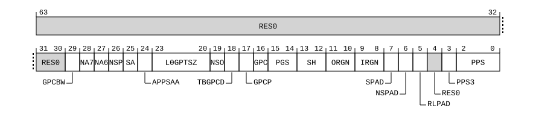

# ​D24.2.55 GPCCR_EL3, Granule Protection Check Control Register (EL3)

Source: <https://developer.arm.com/documentation/ddi0487/mc/-Part-D-The-AArch64-System-Level-Architecture/-Chapter-D24-AArch64-System-Register-Descriptions/-D24-2-General-system-control-registers/-D24-2-55-GPCCR-EL3--Granule-Protection-Check-Control-Register--EL3->

##### D24.2.55 GPCCR\_EL3, Granule Protection Check Control Register (EL3)

The GPCCR\_EL3 characteristics are:

Purpose
:   The control register for Granule Protection Checks.

Configuration
:   This register is present only when FEAT\_RME is implemented and FEAT\_AA64 is implemented. Otherwise, direct accesses to GPCCR\_EL3 are UNDEFINED.

Attributes
:   GPCCR\_EL3 is a 64-bit register.

###### Field descriptions



Bits [63:30]
:   Reserved, RES0.

GPCBW, bit [29]
:   When FEAT\_RME\_GPC3 is implemented:
    :   GPC Bypass Window Enable.

        This field governs the behavior of the GPC bypass windows.

<table>
 <colgroup>
  <col/>
  <col/>
 </colgroup>
 <thead>
  <tr>
   <th>
    <strong>
     GPCBW
    </strong>
   </th>
   <th>
    <strong>
     Meaning
    </strong>
   </th>
  </tr>
 </thead>
 <tbody>
  <tr>
   <td>
    <p>
     <code>
      0b0
     </code>
    </p>
   </td>
   <td>
    <p>
     GPC bypass windows are disabled.
    </p>
   </td>
  </tr>
  <tr>
   <td>
    <p>
     <code>
      0b1
     </code>
    </p>
   </td>
   <td>
    <p>
     GPC bypass windows are enabled.
    </p>
   </td>
  </tr>
 </tbody>
</table>

        This bit is permitted to be cached in a TLB.

        The reset behavior of this field is:

        - On a Warm reset, this field resets to an architecturally UNKNOWN value.

    Otherwise:
    :   Reserved, RES0.

NA7, bit [28]
:   When FEAT\_RME\_GDI is implemented:
    :   No access 7.

        This field governs the behavior of the GPI encoding for NA7.

<table>
 <colgroup>
  <col/>
  <col/>
 </colgroup>
 <thead>
  <tr>
   <th>
    <strong>
     NA7
    </strong>
   </th>
   <th>
    <strong>
     Meaning
    </strong>
   </th>
  </tr>
 </thead>
 <tbody>
  <tr>
   <td>
    <p>
     <code>
      0b0
     </code>
    </p>
   </td>
   <td>
    <p>
     GPI encoding value of
     <code>
      0b0111
     </code>
     is reserved.
    </p>
   </td>
  </tr>
  <tr>
   <td>
    <p>
     <code>
      0b1
     </code>
    </p>
   </td>
   <td>
    <p>
     GPI encoding value of
     <code>
      0b0111
     </code>
     is No access from this PE.
    </p>
   </td>
  </tr>
 </tbody>
</table>

        This bit is permitted to be cached in a TLB.

        The reset behavior of this field is:

        - On a Warm reset, this field resets to an architecturally UNKNOWN value.

    Otherwise:
    :   Reserved, RES0.

NA6, bit [27]
:   When FEAT\_RME\_GDI is implemented:
    :   No access 6.

        This field governs the behavior of the GPI encoding for NA6.

<table>
 <colgroup>
  <col/>
  <col/>
 </colgroup>
 <thead>
  <tr>
   <th>
    <strong>
     NA6
    </strong>
   </th>
   <th>
    <strong>
     Meaning
    </strong>
   </th>
  </tr>
 </thead>
 <tbody>
  <tr>
   <td>
    <p>
     <code>
      0b0
     </code>
    </p>
   </td>
   <td>
    <p>
     GPI encoding value of
     <code>
      0b0110
     </code>
     is reserved.
    </p>
   </td>
  </tr>
  <tr>
   <td>
    <p>
     <code>
      0b1
     </code>
    </p>
   </td>
   <td>
    <p>
     GPI encoding value of
     <code>
      0b0110
     </code>
     is No access from this PE.
    </p>
   </td>
  </tr>
 </tbody>
</table>

        This bit is permitted to be cached in a TLB.

        The reset behavior of this field is:

        - On a Warm reset, this field resets to an architecturally UNKNOWN value.

    Otherwise:
    :   Reserved, RES0.

NSP, bit [26]
:   When FEAT\_RME\_GDI is implemented:
    :   Non-secure Protected.

        This field governs the behavior of the GPI encoding for NSP.

<table>
 <colgroup>
  <col/>
  <col/>
 </colgroup>
 <thead>
  <tr>
   <th>
    <strong>
     NSP
    </strong>
   </th>
   <th>
    <strong>
     Meaning
    </strong>
   </th>
  </tr>
 </thead>
 <tbody>
  <tr>
   <td>
    <p>
     <code>
      0b0
     </code>
    </p>
   </td>
   <td>
    <p>
     GPI encoding value of
     <code>
      0b0101
     </code>
     is reserved.
    </p>
   </td>
  </tr>
  <tr>
   <td>
    <p>
     <code>
      0b1
     </code>
    </p>
   </td>
   <td>
    <p>
     GPI encoding value of
     <code>
      0b0101
     </code>
     is No access from this PE.
    </p>
   </td>
  </tr>
 </tbody>
</table>

        This bit is permitted to be cached in a TLB.

        The reset behavior of this field is:

        - On a Warm reset, this field resets to an architecturally UNKNOWN value.

    Otherwise:
    :   Reserved, RES0.

SA, bit [25]
:   When FEAT\_RME\_GDI is implemented:
    :   System Agent.

        This field governs the behavior of the GPI encoding for SA.

<table>
 <colgroup>
  <col/>
  <col/>
 </colgroup>
 <thead>
  <tr>
   <th>
    <strong>
     SA
    </strong>
   </th>
   <th>
    <strong>
     Meaning
    </strong>
   </th>
  </tr>
 </thead>
 <tbody>
  <tr>
   <td>
    <p>
     <code>
      0b0
     </code>
    </p>
   </td>
   <td>
    <p>
     GPI encoding value of
     <code>
      0b0100
     </code>
     is reserved.
    </p>
   </td>
  </tr>
  <tr>
   <td>
    <p>
     <code>
      0b1
     </code>
    </p>
   </td>
   <td>
    <p>
     GPI encoding value of
     <code>
      0b0100
     </code>
     is No access from this PE.
    </p>
   </td>
  </tr>
 </tbody>
</table>

        This bit is permitted to be cached in a TLB.

        The reset behavior of this field is:

        - On a Warm reset, this field resets to an architecturally UNKNOWN value.

    Otherwise:
    :   Reserved, RES0.

APPSAA, bit [24]
:   When FEAT\_RME\_GPC2 is implemented:
    :   Above PPS All Access. This field governs the behavior of memory accesses to Secure, Realm and Root PA space, for physical addresses above the range configured by GPCCR\_EL3.PPS.

<table>
 <colgroup>
  <col/>
  <col/>
 </colgroup>
 <thead>
  <tr>
   <th>
    <strong>
     APPSAA
    </strong>
   </th>
   <th>
    <strong>
     Meaning
    </strong>
   </th>
  </tr>
 </thead>
 <tbody>
  <tr>
   <td>
    <p>
     <code>
      0b0
     </code>
    </p>
   </td>
   <td>
    <p>
     Accesses to addresses above the configured PPS must be to Non-secure PA space, otherwise they generate a GPF at level 0.
    </p>
   </td>
  </tr>
  <tr>
   <td>
    <p>
     <code>
      0b1
     </code>
    </p>
   </td>
   <td>
    <p>
     Accesses to addresses above the configured PPS, to any PA space, do not generate a GPF because of this control.
    </p>
   </td>
  </tr>
 </tbody>
</table>

        This bit is permitted to be cached in a TLB.

        The reset behavior of this field is:

        - On a Warm reset, this field resets to an architecturally UNKNOWN value.

    Otherwise:
    :   Reserved, RES0.

L0GPTSZ, bits [23:20]
:   Level 0 GPT entry size.

    This field advertises the number of least-significant address bits protected by each entry in the level 0 GPT.

<table>
 <colgroup>
  <col/>
  <col/>
 </colgroup>
 <thead>
  <tr>
   <th>
    <strong>
     L0GPTSZ
    </strong>
   </th>
   <th>
    <strong>
     Meaning
    </strong>
   </th>
  </tr>
 </thead>
 <tbody>
  <tr>
   <td>
    <p>
     <code>
      0b0000
     </code>
    </p>
   </td>
   <td>
    <p>
     30-bits. Each entry covers 1GB of address space.
    </p>
   </td>
  </tr>
  <tr>
   <td>
    <p>
     <code>
      0b0100
     </code>
    </p>
   </td>
   <td>
    <p>
     34-bits. Each entry covers 16GB of address space.
    </p>
   </td>
  </tr>
  <tr>
   <td>
    <p>
     <code>
      0b0110
     </code>
    </p>
   </td>
   <td>
    <p>
     36-bits. Each entry covers 64GB of address space.
    </p>
   </td>
  </tr>
  <tr>
   <td>
    <p>
     <code>
      0b1001
     </code>
    </p>
   </td>
   <td>
    <p>
     39-bits. Each entry covers 512GB of address space.
    </p>
   </td>
  </tr>
 </tbody>
</table>

    All other values are reserved.

    Access to this field is RO.

NSO, bit [19]
:   When FEAT\_RME\_GPC2 is implemented:
    :   Non-secure Only. This field governs the behavior of the GPI encoding for NSO.

<table>
 <colgroup>
  <col/>
  <col/>
 </colgroup>
 <thead>
  <tr>
   <th>
    <strong>
     NSO
    </strong>
   </th>
   <th>
    <strong>
     Meaning
    </strong>
   </th>
  </tr>
 </thead>
 <tbody>
  <tr>
   <td>
    <p>
     <code>
      0b0
     </code>
    </p>
   </td>
   <td>
    <p>
     GPI encoding value of
     <code>
      0b1101
     </code>
     is reserved.
    </p>
   </td>
  </tr>
  <tr>
   <td>
    <p>
     <code>
      0b1
     </code>
    </p>
   </td>
   <td>
    <p>
     GPI encoding value of
     <code>
      0b1101
     </code>
     is NSO.
    </p>
   </td>
  </tr>
 </tbody>
</table>

        This bit is permitted to be cached in a TLB.

        The reset behavior of this field is:

        - On a Warm reset, this field resets to an architecturally UNKNOWN value.

    Otherwise:
    :   Reserved, RES0.

TBGPCD, bit [18]
:   When FEAT\_TRBE\_EXT is implemented:
    :   Trace Buffer Granule Protection Check Disabled. Controls whether the Trace Buffer Unit accepts or rejects trace when Granule Protection Checks are disabled.

<table>
 <colgroup>
  <col/>
  <col/>
 </colgroup>
 <thead>
  <tr>
   <th>
    <strong>
     TBGPCD
    </strong>
   </th>
   <th>
    <strong>
     Meaning
    </strong>
   </th>
  </tr>
 </thead>
 <tbody>
  <tr>
   <td>
    <p>
     <code>
      0b0
     </code>
    </p>
   </td>
   <td>
    <p>
     The Trace Buffer Unit rejects trace when GPCCR_EL3.GPC is 0.
    </p>
   </td>
  </tr>
  <tr>
   <td>
    <p>
     <code>
      0b1
     </code>
    </p>
   </td>
   <td>
    <p>
     The Trace Buffer Unit accepts trace when GPCCR_EL3.GPC is 0.
    </p>
   </td>
  </tr>
 </tbody>
</table>

        When the Trace Buffer Unit rejects trace, the trace might remain buffered by the trace unit until the Trace Buffer Unit is able to accept trace. When the Trace Buffer Unit accepts trace, the Trace Buffer Unit writes the trace to memory.

        > #### Note
        >
        > Setting GPCCR\_EL3.{TBGPCD, GPC} to {1, 0} means that the Trace Buffer Unit might write to memory without any Granule Protection Checks. The addresses that the Trace Buffer Unit writes to can be programmed by an external agent. The physical address spaces the Trace Buffer Unit can address are restricted by an IMPLEMENTATION DEFINED debug authentication interface.
        >
        > Setting GPCCR\_EL3.{TBGPCD, GPC} to {1, 1} means that GPCCR\_EL3.{TBGPCD, GPC} will become {1, 0} on a Warm reset.

        This field is ignored by the PE and treated as one when any of the following are true:

        - GPCCR\_EL3.GPC == 1.
        - `ExternalRootInvasiveDebugEnabled()` == TRUE.

        The reset behavior of this field is:

        - On a Cold reset, this field resets to `'0'`.

    Otherwise:
    :   Reserved, RES0.

GPCP, bit [17]
:   Granule Protection Check Priority.

    This control governs behavior of granule protection checks on fetches of stage 2 Table descriptors.

<table>
 <colgroup>
  <col/>
  <col/>
 </colgroup>
 <thead>
  <tr>
   <th>
    <strong>
     GPCP
    </strong>
   </th>
   <th>
    <strong>
     Meaning
    </strong>
   </th>
  </tr>
 </thead>
 <tbody>
  <tr>
   <td>
    <p>
     <code>
      0b0
     </code>
    </p>
   </td>
   <td>
    <p>
     GPC faults are all reported with a priority that is consistent with the GPC being performed on any access to physical address space.
    </p>
   </td>
  </tr>
  <tr>
   <td>
    <p>
     <code>
      0b1
     </code>
    </p>
   </td>
   <td>
    <p>
     A GPC fault for the fetch of a Table descriptor for a stage 2 translation table walk might not be generated or reported.
    </p>
    <p>
     All other GPC faults are reported with a priority consistent with the GPC being performed on all accesses to physical address spaces.
    </p>
   </td>
  </tr>
 </tbody>
</table>

    This bit is permitted to be cached in a TLB.

    An implementation is permitted to treat this field as RES0, with an Effective value of 0.

    The reset behavior of this field is:

    - On a Warm reset, this field resets to an architecturally UNKNOWN value.

GPC, bit [16]
:   Granule Protection Check Enable.

<table>
 <colgroup>
  <col/>
  <col/>
 </colgroup>
 <thead>
  <tr>
   <th>
    <strong>
     GPC
    </strong>
   </th>
   <th>
    <strong>
     Meaning
    </strong>
   </th>
  </tr>
 </thead>
 <tbody>
  <tr>
   <td>
    <p>
     <code>
      0b0
     </code>
    </p>
   </td>
   <td>
    <p>
     Granule protection checks are disabled. Accesses are not prevented by this mechanism.
    </p>
   </td>
  </tr>
  <tr>
   <td>
    <p>
     <code>
      0b1
     </code>
    </p>
   </td>
   <td>
    <p>
     All accesses to physical address spaces are subject to granule protection checks, except for fetches of GPT information and accesses governed by the GPCCR_EL3.GPCP control.
    </p>
   </td>
  </tr>
 </tbody>
</table>

    If any stage of translation is enabled, this bit is permitted to be cached in a TLB.

    The reset behavior of this field is:

    - On a Warm reset, this field resets to `'0'`.

PGS, bits [15:14]
:   Physical Granule size.

<table>
 <colgroup>
  <col/>
  <col/>
 </colgroup>
 <thead>
  <tr>
   <th>
    <strong>
     PGS
    </strong>
   </th>
   <th>
    <strong>
     Meaning
    </strong>
   </th>
  </tr>
 </thead>
 <tbody>
  <tr>
   <td>
    <p>
     <code>
      0b00
     </code>
    </p>
   </td>
   <td>
    <p>
     4KB.
    </p>
   </td>
  </tr>
  <tr>
   <td>
    <p>
     <code>
      0b01
     </code>
    </p>
   </td>
   <td>
    <p>
     64KB.
    </p>
   </td>
  </tr>
  <tr>
   <td>
    <p>
     <code>
      0b10
     </code>
    </p>
   </td>
   <td>
    <p>
     16KB.
    </p>
   </td>
  </tr>
 </tbody>
</table>

    All other values are reserved.

    The value of this field is permitted to be cached in a TLB.

    Granule sizes not supported for stage 1 and not supported for stage 2, as defined in [ID\_AA64MMFR0\_EL1](/documentation/ddi0487/mc/-Part-D-The-AArch64-System-Level-Architecture/-Chapter-D24-AArch64-System-Register-Descriptions/-D24-2-General-system-control-registers/-D24-2-87-ID-AA64MMFR0-EL1--AArch64-Memory-Model-Feature-Register-0?lang=en#reg_aarch64_id_aa64mmfr0_el1), are reserved. For example, if [ID\_AA64MMFR0\_EL1](/documentation/ddi0487/mc/-Part-D-The-AArch64-System-Level-Architecture/-Chapter-D24-AArch64-System-Register-Descriptions/-D24-2-General-system-control-registers/-D24-2-87-ID-AA64MMFR0-EL1--AArch64-Memory-Model-Feature-Register-0?lang=en#reg_aarch64_id_aa64mmfr0_el1).TGran16 == `0b0000` and [ID\_AA64MMFR0\_EL1](/documentation/ddi0487/mc/-Part-D-The-AArch64-System-Level-Architecture/-Chapter-D24-AArch64-System-Register-Descriptions/-D24-2-General-system-control-registers/-D24-2-87-ID-AA64MMFR0-EL1--AArch64-Memory-Model-Feature-Register-0?lang=en#reg_aarch64_id_aa64mmfr0_el1).TGran16\_2 == `0b0001`, then the PGS encoding `0b10` is reserved.

    The reset behavior of this field is:

    - On a Warm reset, this field resets to an architecturally UNKNOWN value.

SH, bits [13:12]
:   GPT fetch Shareability attribute

<table>
 <colgroup>
  <col/>
  <col/>
 </colgroup>
 <thead>
  <tr>
   <th>
    <strong>
     SH
    </strong>
   </th>
   <th>
    <strong>
     Meaning
    </strong>
   </th>
  </tr>
 </thead>
 <tbody>
  <tr>
   <td>
    <p>
     <code>
      0b00
     </code>
    </p>
   </td>
   <td>
    <p>
     Non-shareable.
    </p>
   </td>
  </tr>
  <tr>
   <td>
    <p>
     <code>
      0b10
     </code>
    </p>
   </td>
   <td>
    <p>
     Outer Shareable.
    </p>
   </td>
  </tr>
  <tr>
   <td>
    <p>
     <code>
      0b11
     </code>
    </p>
   </td>
   <td>
    <p>
     Inner Shareable.
    </p>
   </td>
  </tr>
 </tbody>
</table>

    All other values are reserved.

    Fetches of GPT information are made with the Shareability attribute that is configured in this field.

    If both ORGN and IRGN are configured with Non-cacheable attributes, it is invalid to configure this field to any value other than `0b10`.

    The reset behavior of this field is:

    - On a Warm reset, this field resets to an architecturally UNKNOWN value.

ORGN, bits [11:10]
:   GPT fetch Outer Cacheability attribute.

<table>
 <colgroup>
  <col/>
  <col/>
 </colgroup>
 <thead>
  <tr>
   <th>
    <strong>
     ORGN
    </strong>
   </th>
   <th>
    <strong>
     Meaning
    </strong>
   </th>
  </tr>
 </thead>
 <tbody>
  <tr>
   <td>
    <p>
     <code>
      0b00
     </code>
    </p>
   </td>
   <td>
    <p>
     Normal memory, Outer Non-cacheable.
    </p>
   </td>
  </tr>
  <tr>
   <td>
    <p>
     <code>
      0b01
     </code>
    </p>
   </td>
   <td>
    <p>
     Normal memory, Outer Write-Back Read-Allocate Write-Allocate Cacheable.
    </p>
   </td>
  </tr>
  <tr>
   <td>
    <p>
     <code>
      0b10
     </code>
    </p>
   </td>
   <td>
    <p>
     Normal memory, Outer Write-Through Read-Allocate No Write-Allocate Cacheable.
    </p>
   </td>
  </tr>
  <tr>
   <td>
    <p>
     <code>
      0b11
     </code>
    </p>
   </td>
   <td>
    <p>
     Normal memory, Outer Write-Back Read-Allocate No Write-Allocate Cacheable.
    </p>
   </td>
  </tr>
 </tbody>
</table>

    Fetches of GPT information are made with the Outer Cacheability attributes configured in this field.

    The reset behavior of this field is:

    - On a Warm reset, this field resets to an architecturally UNKNOWN value.

IRGN, bits [9:8]
:   GPT fetch Inner Cacheability attribute.

<table>
 <colgroup>
  <col/>
  <col/>
 </colgroup>
 <thead>
  <tr>
   <th>
    <strong>
     IRGN
    </strong>
   </th>
   <th>
    <strong>
     Meaning
    </strong>
   </th>
  </tr>
 </thead>
 <tbody>
  <tr>
   <td>
    <p>
     <code>
      0b00
     </code>
    </p>
   </td>
   <td>
    <p>
     Normal memory, Inner Non-cacheable.
    </p>
   </td>
  </tr>
  <tr>
   <td>
    <p>
     <code>
      0b01
     </code>
    </p>
   </td>
   <td>
    <p>
     Normal memory, Inner Write-Back Read-Allocate Write-Allocate Cacheable.
    </p>
   </td>
  </tr>
  <tr>
   <td>
    <p>
     <code>
      0b10
     </code>
    </p>
   </td>
   <td>
    <p>
     Normal memory, Inner Write-Through Read-Allocate No Write-Allocate Cacheable.
    </p>
   </td>
  </tr>
  <tr>
   <td>
    <p>
     <code>
      0b11
     </code>
    </p>
   </td>
   <td>
    <p>
     Normal memory, Inner Write-Back Read-Allocate No Write-Allocate Cacheable.
    </p>
   </td>
  </tr>
 </tbody>
</table>

    Fetches of GPT information are made with the Inner Cacheability attributes configured in this field.

    The reset behavior of this field is:

    - On a Warm reset, this field resets to an architecturally UNKNOWN value.

SPAD, bit [7]
:   When FEAT\_RME\_GPC2 is implemented:
    :   Secure PA space Disable. This field controls access to the Secure PA space.

<table>
 <colgroup>
  <col/>
  <col/>
 </colgroup>
 <thead>
  <tr>
   <th>
    <strong>
     SPAD
    </strong>
   </th>
   <th>
    <strong>
     Meaning
    </strong>
   </th>
  </tr>
 </thead>
 <tbody>
  <tr>
   <td>
    <p>
     <code>
      0b0
     </code>
    </p>
   </td>
   <td>
    <p>
     This control has no effect on accesses.
    </p>
   </td>
  </tr>
  <tr>
   <td>
    <p>
     <code>
      0b1
     </code>
    </p>
   </td>
   <td>
    <p>
     When granule protection checks are enabled, access to the Secure Physical Address space generates a Granule Protection fault.
    </p>
   </td>
  </tr>
 </tbody>
</table>

        This bit is permitted to be cached in a TLB.

        The reset behavior of this field is:

        - On a Warm reset, this field resets to an architecturally UNKNOWN value.

    Otherwise:
    :   Reserved, RES0.

NSPAD, bit [6]
:   When FEAT\_RME\_GPC2 is implemented:
    :   Non-secure PA space Disable. This field controls access to the Non-secure PA space.

<table>
 <colgroup>
  <col/>
  <col/>
 </colgroup>
 <thead>
  <tr>
   <th>
    <strong>
     NSPAD
    </strong>
   </th>
   <th>
    <strong>
     Meaning
    </strong>
   </th>
  </tr>
 </thead>
 <tbody>
  <tr>
   <td>
    <p>
     <code>
      0b0
     </code>
    </p>
   </td>
   <td>
    <p>
     This control has no effect on accesses.
    </p>
   </td>
  </tr>
  <tr>
   <td>
    <p>
     <code>
      0b1
     </code>
    </p>
   </td>
   <td>
    <p>
     When granule protection checks are enabled, access to the Non-secure Physical Address space generates a Granule Protection fault.
    </p>
   </td>
  </tr>
 </tbody>
</table>

        This bit is permitted to be cached in a TLB.

        The reset behavior of this field is:

        - On a Warm reset, this field resets to an architecturally UNKNOWN value.

    Otherwise:
    :   Reserved, RES0.

RLPAD, bit [5]
:   When FEAT\_RME\_GPC2 is implemented:
    :   Realm PA space Disable. This field controls access to the Realm PA space.

<table>
 <colgroup>
  <col/>
  <col/>
 </colgroup>
 <thead>
  <tr>
   <th>
    <strong>
     RLPAD
    </strong>
   </th>
   <th>
    <strong>
     Meaning
    </strong>
   </th>
  </tr>
 </thead>
 <tbody>
  <tr>
   <td>
    <p>
     <code>
      0b0
     </code>
    </p>
   </td>
   <td>
    <p>
     This control has no effect on accesses.
    </p>
   </td>
  </tr>
  <tr>
   <td>
    <p>
     <code>
      0b1
     </code>
    </p>
   </td>
   <td>
    <p>
     When granule protection checks are enabled, access to the Realm Physical Address space generates a Granule Protection fault.
    </p>
   </td>
  </tr>
 </tbody>
</table>

        This bit is permitted to be cached in a TLB.

        The reset behavior of this field is:

        - On a Warm reset, this field resets to an architecturally UNKNOWN value.

    Otherwise:
    :   Reserved, RES0.

Bit [4]
:   Reserved, RES0.

PPS3, bit [3]
:   When FEAT\_RME\_GPC3 is implemented:
    :   This field extends GPCCR\_EL3.PPS[2:0], creating a GPCCR\_EL3.PPS[3:0] field.

        For a description of the values derived by evaluating PPS, see GPCCR\_EL3.PPS[2:0].

        The value of this field is permitted to be cached in a TLB.

        The reset behavior of this field is:

        - On a Warm reset, this field resets to an architecturally UNKNOWN value.

    Otherwise:
    :   Reserved, RES0.

PPS, bits [2:0]
:   When FEAT\_RME\_GPC3 is implemented:
    :   Protected Physical Address Size.

        The size of the memory region protected by [GPTBR\_EL3](/documentation/ddi0487/mc/-Part-D-The-AArch64-System-Level-Architecture/-Chapter-D24-AArch64-System-Register-Descriptions/-D24-2-General-system-control-registers/-D24-2-56-GPTBR-EL3--Granule-Protection-Table-Base-Register?lang=en#reg_aarch64_gptbr_el3), in terms of the number of least-significant address bits.

        This field is evaluated with PPS3, as {PPS3, PPS} to give PPS[3:0], interpreted as:

<table>
 <colgroup>
  <col/>
  <col/>
 </colgroup>
 <thead>
  <tr>
   <th>
    PPS[3:0]
   </th>
   <th>
    Meaning
   </th>
  </tr>
 </thead>
 <tbody>
  <tr>
   <td>
    <code>
     0b0000
    </code>
   </td>
   <td>
    32 bits, 4GB protected address space.
   </td>
  </tr>
  <tr>
   <td>
    <code>
     0b0001
    </code>
   </td>
   <td>
    36 bits, 64GB protected address space.
   </td>
  </tr>
  <tr>
   <td>
    <code>
     0b0010
    </code>
   </td>
   <td>
    40 bits, 1TB protected address space.
   </td>
  </tr>
  <tr>
   <td>
    <code>
     0b0011
    </code>
   </td>
   <td>
    42 bits, 4TB protected address space.
   </td>
  </tr>
  <tr>
   <td>
    <code>
     0b0100
    </code>
   </td>
   <td>
    44 bits, 16TB protected address space.
   </td>
  </tr>
  <tr>
   <td>
    <code>
     0b1000
    </code>
   </td>
   <td>
    46 bits, 64TB protected address space.
   </td>
  </tr>
  <tr>
   <td>
    <code>
     0b1001
    </code>
   </td>
   <td>
    47 bits, 128TB protected address space.
   </td>
  </tr>
  <tr>
   <td>
    <code>
     0b0101
    </code>
   </td>
   <td>
    48 bits, 256TB protected address space.
   </td>
  </tr>
  <tr>
   <td>
    <code>
     0b0110
    </code>
   </td>
   <td>
    52 bits, 4PB protected address space.
   </td>
  </tr>
  <tr>
   <td>
    <code>
     0b0111
    </code>
   </td>
   <td>
    56 bits, 64PB protected address space.
   </td>
  </tr>
 </tbody>
</table>

        All other values are reserved.

        Configuration of this field to a value exceeding the implemented physical address size is invalid.

        The value of this field is permitted to be cached in a TLB.

        The reset behavior of this field is:

        - On a Warm reset, this field resets to an architecturally UNKNOWN value.

    Otherwise:
    :   Protected Physical Address Size.

        The size of the memory region protected by [GPTBR\_EL3](/documentation/ddi0487/mc/-Part-D-The-AArch64-System-Level-Architecture/-Chapter-D24-AArch64-System-Register-Descriptions/-D24-2-General-system-control-registers/-D24-2-56-GPTBR-EL3--Granule-Protection-Table-Base-Register?lang=en#reg_aarch64_gptbr_el3), in terms of the number of least-significant address bits.

<table>
 <colgroup>
  <col/>
  <col/>
 </colgroup>
 <thead>
  <tr>
   <th>
    <strong>
     PPS
    </strong>
   </th>
   <th>
    <strong>
     Meaning
    </strong>
   </th>
  </tr>
 </thead>
 <tbody>
  <tr>
   <td>
    <p>
     <code>
      0b000
     </code>
    </p>
   </td>
   <td>
    <p>
     32 bits, 4GB protected address space.
    </p>
   </td>
  </tr>
  <tr>
   <td>
    <p>
     <code>
      0b001
     </code>
    </p>
   </td>
   <td>
    <p>
     36 bits, 64GB protected address space.
    </p>
   </td>
  </tr>
  <tr>
   <td>
    <p>
     <code>
      0b010
     </code>
    </p>
   </td>
   <td>
    <p>
     40 bits, 1TB protected address space.
    </p>
   </td>
  </tr>
  <tr>
   <td>
    <p>
     <code>
      0b011
     </code>
    </p>
   </td>
   <td>
    <p>
     42 bits, 4TB protected address space.
    </p>
   </td>
  </tr>
  <tr>
   <td>
    <p>
     <code>
      0b100
     </code>
    </p>
   </td>
   <td>
    <p>
     44 bits, 16TB protected address space.
    </p>
   </td>
  </tr>
  <tr>
   <td>
    <p>
     <code>
      0b101
     </code>
    </p>
   </td>
   <td>
    <p>
     48 bits, 256TB protected address space.
    </p>
   </td>
  </tr>
  <tr>
   <td>
    <p>
     <code>
      0b110
     </code>
    </p>
   </td>
   <td>
    <p>
     52 bits, 4PB protected address space.
    </p>
   </td>
  </tr>
 </tbody>
</table>

        All other values are reserved.

        Configuration of this field to a value exceeding the implemented physical address size is invalid.

        The value of this field is permitted to be cached in a TLB.

        The reset behavior of this field is:

        - On a Warm reset, this field resets to an architecturally UNKNOWN value.

###### Accessing GPCCR\_EL3

Accesses to this register use the following encodings in the System register encoding space:

###### `MRS <Xt>, GPCCR_EL3`

<table>
 <colgroup>
  <col/>
  <col/>
  <col/>
  <col/>
  <col/>
 </colgroup>
 <thead>
  <tr>
   <th>
    <strong>
     op0
    </strong>
   </th>
   <th>
    <strong>
     op1
    </strong>
   </th>
   <th>
    <strong>
     CRn
    </strong>
   </th>
   <th>
    <strong>
     CRm
    </strong>
   </th>
   <th>
    <strong>
     op2
    </strong>
   </th>
  </tr>
 </thead>
 <tbody>
  <tr>
   <td>
    <p>
     <code>
      0b11
     </code>
    </p>
   </td>
   <td>
    <p>
     <code>
      0b110
     </code>
    </p>
   </td>
   <td>
    <p>
     <code>
      0b0010
     </code>
    </p>
   </td>
   <td>
    <p>
     <code>
      0b0001
     </code>
    </p>
   </td>
   <td>
    <p>
     <code>
      0b110
     </code>
    </p>
   </td>
  </tr>
 </tbody>
</table>

```
if !(IsFeatureImplemented(FEAT_RME) && IsFeatureImplemented(FEAT_AA64)) then
    Undefined();
elsif PSTATE.EL == EL0 then
    Undefined();
elsif PSTATE.EL == EL1 then
    Undefined();
elsif PSTATE.EL == EL2 then
    Undefined();
elsif PSTATE.EL == EL3 then
    X{64}(t) = GPCCR_EL3();
end;
```

###### `MSR GPCCR_EL3, <Xt>`

<table>
 <colgroup>
  <col/>
  <col/>
  <col/>
  <col/>
  <col/>
 </colgroup>
 <thead>
  <tr>
   <th>
    <strong>
     op0
    </strong>
   </th>
   <th>
    <strong>
     op1
    </strong>
   </th>
   <th>
    <strong>
     CRn
    </strong>
   </th>
   <th>
    <strong>
     CRm
    </strong>
   </th>
   <th>
    <strong>
     op2
    </strong>
   </th>
  </tr>
 </thead>
 <tbody>
  <tr>
   <td>
    <p>
     <code>
      0b11
     </code>
    </p>
   </td>
   <td>
    <p>
     <code>
      0b110
     </code>
    </p>
   </td>
   <td>
    <p>
     <code>
      0b0010
     </code>
    </p>
   </td>
   <td>
    <p>
     <code>
      0b0001
     </code>
    </p>
   </td>
   <td>
    <p>
     <code>
      0b110
     </code>
    </p>
   </td>
  </tr>
 </tbody>
</table>

```
if !(IsFeatureImplemented(FEAT_RME) && IsFeatureImplemented(FEAT_AA64)) then
    Undefined();
elsif PSTATE.EL == EL0 then
    Undefined();
elsif PSTATE.EL == EL1 then
    Undefined();
elsif PSTATE.EL == EL2 then
    Undefined();
elsif PSTATE.EL == EL3 then
    if IsFeatureImplemented(FEAT_FGWTE3) && FGWTE3_EL3().GPCCR_EL3 == '1' then
        AArch64_SystemAccessTrap(EL3, 0x18);
    else
        GPCCR_EL3() = X{64}(t);
    end;
end;
```
