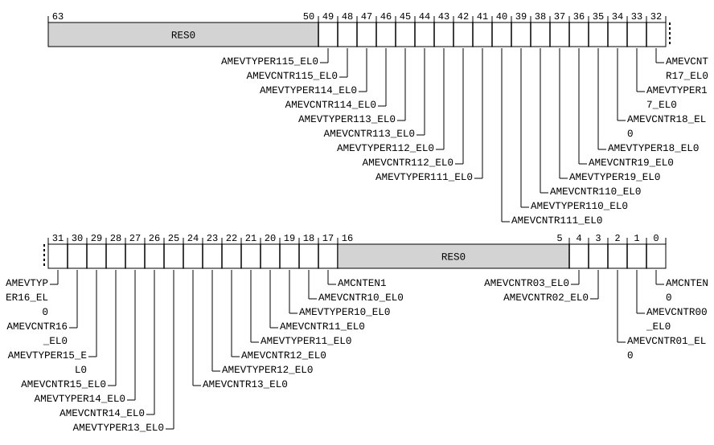

# ​D24.2.60 HAFGRTR_EL2, Hypervisor Activity Monitors Fine-Grained Read Trap Register

Source: <https://developer.arm.com/documentation/ddi0487/mc/-Part-D-The-AArch64-System-Level-Architecture/-Chapter-D24-AArch64-System-Register-Descriptions/-D24-2-General-system-control-registers/-D24-2-60-HAFGRTR-EL2--Hypervisor-Activity-Monitors-Fine-Grained-Read-Trap-Register>

##### D24.2.60 HAFGRTR\_EL2, Hypervisor Activity Monitors Fine-Grained Read Trap Register

The HAFGRTR\_EL2 characteristics are:

Purpose
:   Provides controls for traps of `MRS` reads of Activity Monitors System registers.

Configuration
:   If EL2 is not implemented, this register is RES0 from EL3.

    This register is present only when FEAT\_AMUv1 is implemented, FEAT\_FGT is implemented, and FEAT\_AA64 is implemented. Otherwise, direct accesses to HAFGRTR\_EL2 are UNDEFINED.

Attributes
:   HAFGRTR\_EL2 is a 64-bit register.

###### Field descriptions



Bits [63:50]
:   Reserved, RES0.

AMEVTYPER1<x>\_EL0 , bits [19+2x], for x = 15 to 0
:   Trap `MRS` reads of [AMEVTYPER1<x>\_EL0](/documentation/ddi0487/mc/-Part-D-The-AArch64-System-Level-Architecture/-Chapter-D24-AArch64-System-Register-Descriptions/-D24-6-Activity-Monitors-registers/-D24-6-14-AMEVTYPER1-n--EL0--Activity-Monitors-Event-Type-Registers-1--n---0---15?lang=en#reg_aarch64_amevtyper1n_el0) at EL1 and EL0 using AArch64 and `MRC` reads of [AMEVTYPER1<x>](/documentation/ddi0487/mc/-Part-G-The-AArch32-System-Level-Architecture/-Chapter-G8-AArch32-System-Register-Descriptions/-G8-5-Activity-Monitors-registers/-G8-5-11-AMEVTYPER1-n---Activity-Monitors-Event-Type-Registers-1--n---0---15?lang=en#reg_aarch32_amevtyper1n) at EL0 using AArch32 when EL1 is using AArch64 to EL2.

<table>
 <colgroup>
  <col/>
  <col/>
 </colgroup>
 <thead>
  <tr>
   <th>
    <strong>
     AMEVTYPER1&lt;x&gt;_EL0
    </strong>
   </th>
   <th>
    <strong>
     Meaning
    </strong>
   </th>
  </tr>
 </thead>
 <tbody>
  <tr>
   <td>
    <p>
     <code>
      0b0
     </code>
    </p>
   </td>
   <td>
    <p>
     <code>
      MRS
     </code>
     reads of
     <a class="document-topic" document-topic-path="/ddi0487/mc/-Part-D-The-AArch64-System-Level-Architecture/-Chapter-D24-AArch64-System-Register-Descriptions/-D24-6-Activity-Monitors-registers/-D24-6-14-AMEVTYPER1-n--EL0--Activity-Monitors-Event-Type-Registers-1--n---0---15?lang=en#reg_aarch64_amevtyper1n_el0" href="/documentation/ddi0487/mc/-Part-D-The-AArch64-System-Level-Architecture/-Chapter-D24-AArch64-System-Register-Descriptions/-D24-6-Activity-Monitors-registers/-D24-6-14-AMEVTYPER1-n--EL0--Activity-Monitors-Event-Type-Registers-1--n---0---15?lang=en#reg_aarch64_amevtyper1n_el0">
      AMEVTYPER1&lt;x&gt;_EL0
     </a>
     at EL1 and EL0 using AArch64 and
     <code>
      MRC
     </code>
     reads of
     <a class="document-topic" document-topic-path="/ddi0487/mc/-Part-G-The-AArch32-System-Level-Architecture/-Chapter-G8-AArch32-System-Register-Descriptions/-G8-5-Activity-Monitors-registers/-G8-5-11-AMEVTYPER1-n---Activity-Monitors-Event-Type-Registers-1--n---0---15?lang=en#reg_aarch32_amevtyper1n" href="/documentation/ddi0487/mc/-Part-G-The-AArch32-System-Level-Architecture/-Chapter-G8-AArch32-System-Register-Descriptions/-G8-5-Activity-Monitors-registers/-G8-5-11-AMEVTYPER1-n---Activity-Monitors-Event-Type-Registers-1--n---0---15?lang=en#reg_aarch32_amevtyper1n">
      AMEVTYPER1&lt;x&gt;
     </a>
     at EL0 using AArch32 are not trapped by this mechanism.
    </p>
   </td>
  </tr>
  <tr>
   <td>
    <p>
     <code>
      0b1
     </code>
    </p>
   </td>
   <td>
    <p>
     If EL2 is implemented and enabled in the current Security state, the Effective value of
     <a class="document-topic" document-topic-path="/ddi0487/mc/-Part-D-The-AArch64-System-Level-Architecture/-Chapter-D24-AArch64-System-Register-Descriptions/-D24-2-General-system-control-registers/-D24-2-61-HCR-EL2--Hypervisor-Configuration-Register?lang=en#reg_aarch64_hcr_el2" href="/documentation/ddi0487/mc/-Part-D-The-AArch64-System-Level-Architecture/-Chapter-D24-AArch64-System-Register-Descriptions/-D24-2-General-system-control-registers/-D24-2-61-HCR-EL2--Hypervisor-Configuration-Register?lang=en#reg_aarch64_hcr_el2">
      HCR_EL2
     </a>
     .{E2H, TGE} is not {1, 1}, EL1 is using AArch64, and either EL3 is not implemented or
     <a class="document-topic" document-topic-path="/ddi0487/mc/-Part-D-The-AArch64-System-Level-Architecture/-Chapter-D24-AArch64-System-Register-Descriptions/-D24-2-General-system-control-registers/-D24-2-168-SCR-EL3--Secure-Configuration-Register?lang=en#reg_aarch64_scr_el3" href="/documentation/ddi0487/mc/-Part-D-The-AArch64-System-Level-Architecture/-Chapter-D24-AArch64-System-Register-Descriptions/-D24-2-General-system-control-registers/-D24-2-168-SCR-EL3--Secure-Configuration-Register?lang=en#reg_aarch64_scr_el3">
      SCR_EL3
     </a>
     .FGTEn == 1, then, unless the read generates a higher priority exception:
    </p>
    <ul>
     <li>
      <p>
       <code>
        MRS
       </code>
       reads of
       <a class="document-topic" document-topic-path="/ddi0487/mc/-Part-D-The-AArch64-System-Level-Architecture/-Chapter-D24-AArch64-System-Register-Descriptions/-D24-6-Activity-Monitors-registers/-D24-6-14-AMEVTYPER1-n--EL0--Activity-Monitors-Event-Type-Registers-1--n---0---15?lang=en#reg_aarch64_amevtyper1n_el0" href="/documentation/ddi0487/mc/-Part-D-The-AArch64-System-Level-Architecture/-Chapter-D24-AArch64-System-Register-Descriptions/-D24-6-Activity-Monitors-registers/-D24-6-14-AMEVTYPER1-n--EL0--Activity-Monitors-Event-Type-Registers-1--n---0---15?lang=en#reg_aarch64_amevtyper1n_el0">
        AMEVTYPER1&lt;x&gt;_EL0
       </a>
       at EL1 and EL0 using AArch64 are trapped to EL2 and reported with EC syndrome value
       <code>
        0x18
       </code>
       .
      </p>
     </li>
     <li>
      <p>
       <code>
        MRC
       </code>
       reads of
       <a class="document-topic" document-topic-path="/ddi0487/mc/-Part-G-The-AArch32-System-Level-Architecture/-Chapter-G8-AArch32-System-Register-Descriptions/-G8-5-Activity-Monitors-registers/-G8-5-11-AMEVTYPER1-n---Activity-Monitors-Event-Type-Registers-1--n---0---15?lang=en#reg_aarch32_amevtyper1n" href="/documentation/ddi0487/mc/-Part-G-The-AArch32-System-Level-Architecture/-Chapter-G8-AArch32-System-Register-Descriptions/-G8-5-Activity-Monitors-registers/-G8-5-11-AMEVTYPER1-n---Activity-Monitors-Event-Type-Registers-1--n---0---15?lang=en#reg_aarch32_amevtyper1n">
        AMEVTYPER1&lt;x&gt;
       </a>
       at EL0 using AArch32 are trapped to EL2 and reported with EC syndrome value
       <code>
        0x03
       </code>
       .
      </p>
     </li>
    </ul>
   </td>
  </tr>
 </tbody>
</table>

    The reset behavior of this field is:

    - On a Warm reset:
      - When the highest implemented Exception level is EL2, this field resets to `'0'`.
      - Otherwise, this field resets to an architecturally UNKNOWN value.

    Accessing this field has the following behavior:

    - When x >= UInt(AMCGCR\_EL0.CG1NC), access to this field is RES0.
    - When !IsG1ActivityMonitorImplemented(x), access to this field is RES0.

AMEVCNTR1<x>\_EL0 , bits [18+2x], for x = 15 to 0
:   Trap `MRS` reads of [AMEVCNTR1<x>\_EL0](/documentation/ddi0487/mc/-Part-D-The-AArch64-System-Level-Architecture/-Chapter-D24-AArch64-System-Register-Descriptions/-D24-6-Activity-Monitors-registers/-D24-6-10-AMEVCNTR1-n--EL0--Activity-Monitors-Event-Counter-Registers-1--n---0---15?lang=en#reg_aarch64_amevcntr1n_el0) at EL1 and EL0 using AArch64 and `MRC` reads of [AMEVCNTR1<x>](/documentation/ddi0487/mc/-Part-G-The-AArch32-System-Level-Architecture/-Chapter-G8-AArch32-System-Register-Descriptions/-G8-5-Activity-Monitors-registers/-G8-5-9-AMEVCNTR1-n---Activity-Monitors-Event-Counter-Registers-1--n---0---15?lang=en#reg_aarch32_amevcntr1n) at EL0 using AArch32 when EL1 is using AArch64 to EL2.

<table>
 <colgroup>
  <col/>
  <col/>
 </colgroup>
 <thead>
  <tr>
   <th>
    <strong>
     AMEVCNTR1&lt;x&gt;_EL0
    </strong>
   </th>
   <th>
    <strong>
     Meaning
    </strong>
   </th>
  </tr>
 </thead>
 <tbody>
  <tr>
   <td>
    <p>
     <code>
      0b0
     </code>
    </p>
   </td>
   <td>
    <p>
     <code>
      MRS
     </code>
     reads of
     <a class="document-topic" document-topic-path="/ddi0487/mc/-Part-D-The-AArch64-System-Level-Architecture/-Chapter-D24-AArch64-System-Register-Descriptions/-D24-6-Activity-Monitors-registers/-D24-6-10-AMEVCNTR1-n--EL0--Activity-Monitors-Event-Counter-Registers-1--n---0---15?lang=en#reg_aarch64_amevcntr1n_el0" href="/documentation/ddi0487/mc/-Part-D-The-AArch64-System-Level-Architecture/-Chapter-D24-AArch64-System-Register-Descriptions/-D24-6-Activity-Monitors-registers/-D24-6-10-AMEVCNTR1-n--EL0--Activity-Monitors-Event-Counter-Registers-1--n---0---15?lang=en#reg_aarch64_amevcntr1n_el0">
      AMEVCNTR1&lt;x&gt;_EL0
     </a>
     at EL1 and EL0 using AArch64 and
     <code>
      MRC
     </code>
     reads of
     <a class="document-topic" document-topic-path="/ddi0487/mc/-Part-G-The-AArch32-System-Level-Architecture/-Chapter-G8-AArch32-System-Register-Descriptions/-G8-5-Activity-Monitors-registers/-G8-5-9-AMEVCNTR1-n---Activity-Monitors-Event-Counter-Registers-1--n---0---15?lang=en#reg_aarch32_amevcntr1n" href="/documentation/ddi0487/mc/-Part-G-The-AArch32-System-Level-Architecture/-Chapter-G8-AArch32-System-Register-Descriptions/-G8-5-Activity-Monitors-registers/-G8-5-9-AMEVCNTR1-n---Activity-Monitors-Event-Counter-Registers-1--n---0---15?lang=en#reg_aarch32_amevcntr1n">
      AMEVCNTR1&lt;x&gt;
     </a>
     at EL0 using AArch32 are not trapped by this mechanism.
    </p>
   </td>
  </tr>
  <tr>
   <td>
    <p>
     <code>
      0b1
     </code>
    </p>
   </td>
   <td>
    <p>
     If EL2 is implemented and enabled in the current Security state, the Effective value of
     <a class="document-topic" document-topic-path="/ddi0487/mc/-Part-D-The-AArch64-System-Level-Architecture/-Chapter-D24-AArch64-System-Register-Descriptions/-D24-2-General-system-control-registers/-D24-2-61-HCR-EL2--Hypervisor-Configuration-Register?lang=en#reg_aarch64_hcr_el2" href="/documentation/ddi0487/mc/-Part-D-The-AArch64-System-Level-Architecture/-Chapter-D24-AArch64-System-Register-Descriptions/-D24-2-General-system-control-registers/-D24-2-61-HCR-EL2--Hypervisor-Configuration-Register?lang=en#reg_aarch64_hcr_el2">
      HCR_EL2
     </a>
     .{E2H, TGE} is not {1, 1}, EL1 is using AArch64, and either EL3 is not implemented or
     <a class="document-topic" document-topic-path="/ddi0487/mc/-Part-D-The-AArch64-System-Level-Architecture/-Chapter-D24-AArch64-System-Register-Descriptions/-D24-2-General-system-control-registers/-D24-2-168-SCR-EL3--Secure-Configuration-Register?lang=en#reg_aarch64_scr_el3" href="/documentation/ddi0487/mc/-Part-D-The-AArch64-System-Level-Architecture/-Chapter-D24-AArch64-System-Register-Descriptions/-D24-2-General-system-control-registers/-D24-2-168-SCR-EL3--Secure-Configuration-Register?lang=en#reg_aarch64_scr_el3">
      SCR_EL3
     </a>
     .FGTEn == 1, then, unless the read generates a higher priority exception:
    </p>
    <ul>
     <li>
      <p>
       <code>
        MRS
       </code>
       reads of
       <a class="document-topic" document-topic-path="/ddi0487/mc/-Part-D-The-AArch64-System-Level-Architecture/-Chapter-D24-AArch64-System-Register-Descriptions/-D24-6-Activity-Monitors-registers/-D24-6-10-AMEVCNTR1-n--EL0--Activity-Monitors-Event-Counter-Registers-1--n---0---15?lang=en#reg_aarch64_amevcntr1n_el0" href="/documentation/ddi0487/mc/-Part-D-The-AArch64-System-Level-Architecture/-Chapter-D24-AArch64-System-Register-Descriptions/-D24-6-Activity-Monitors-registers/-D24-6-10-AMEVCNTR1-n--EL0--Activity-Monitors-Event-Counter-Registers-1--n---0---15?lang=en#reg_aarch64_amevcntr1n_el0">
        AMEVCNTR1&lt;x&gt;_EL0
       </a>
       at EL1 and EL0 using AArch64 are trapped to EL2 and reported with EC syndrome value
       <code>
        0x18
       </code>
       .
      </p>
     </li>
     <li>
      <p>
       <code>
        MRC
       </code>
       reads of
       <a class="document-topic" document-topic-path="/ddi0487/mc/-Part-G-The-AArch32-System-Level-Architecture/-Chapter-G8-AArch32-System-Register-Descriptions/-G8-5-Activity-Monitors-registers/-G8-5-9-AMEVCNTR1-n---Activity-Monitors-Event-Counter-Registers-1--n---0---15?lang=en#reg_aarch32_amevcntr1n" href="/documentation/ddi0487/mc/-Part-G-The-AArch32-System-Level-Architecture/-Chapter-G8-AArch32-System-Register-Descriptions/-G8-5-Activity-Monitors-registers/-G8-5-9-AMEVCNTR1-n---Activity-Monitors-Event-Counter-Registers-1--n---0---15?lang=en#reg_aarch32_amevcntr1n">
        AMEVCNTR1&lt;x&gt;
       </a>
       at EL0 using AArch32 are trapped to EL2 and reported with EC syndrome value
       <code>
        0x03
       </code>
       .
      </p>
     </li>
    </ul>
   </td>
  </tr>
 </tbody>
</table>

    The reset behavior of this field is:

    - On a Warm reset:
      - When the highest implemented Exception level is EL2, this field resets to `'0'`.
      - Otherwise, this field resets to an architecturally UNKNOWN value.

    Accessing this field has the following behavior:

    - When x >= UInt(AMCGCR\_EL0.CG1NC), access to this field is RES0.
    - When !IsG1ActivityMonitorImplemented(x), access to this field is RES0.

AMCNTEN<x> , bits [17x], for x = 1 to 0
:   Trap `MRS` reads and `MRC` reads of multiple System registers.

    Enables a trap to EL2 the following operations:

    - At EL1 and EL0 using AArch64: `MRS` reads of AMCNTENCLR<x>\_EL0 and AMCNTENSET<x>\_EL0.
    - At EL0 using AArch32 when EL1 is using AArch64: `MRC` reads of AMCNTENCLR<x> and AMCNTENSET<x>.

<table>
 <colgroup>
  <col/>
  <col/>
 </colgroup>
 <thead>
  <tr>
   <th>
    <strong>
     AMCNTEN&lt;x&gt;
    </strong>
   </th>
   <th>
    <strong>
     Meaning
    </strong>
   </th>
  </tr>
 </thead>
 <tbody>
  <tr>
   <td>
    <p>
     <code>
      0b0
     </code>
    </p>
   </td>
   <td>
    <p>
     The operations listed above are not trapped by this mechanism.
    </p>
   </td>
  </tr>
  <tr>
   <td>
    <p>
     <code>
      0b1
     </code>
    </p>
   </td>
   <td>
    <p>
     If EL2 is implemented and enabled in the current Security state, the Effective value of
     <a class="document-topic" document-topic-path="/ddi0487/mc/-Part-D-The-AArch64-System-Level-Architecture/-Chapter-D24-AArch64-System-Register-Descriptions/-D24-2-General-system-control-registers/-D24-2-61-HCR-EL2--Hypervisor-Configuration-Register?lang=en#reg_aarch64_hcr_el2" href="/documentation/ddi0487/mc/-Part-D-The-AArch64-System-Level-Architecture/-Chapter-D24-AArch64-System-Register-Descriptions/-D24-2-General-system-control-registers/-D24-2-61-HCR-EL2--Hypervisor-Configuration-Register?lang=en#reg_aarch64_hcr_el2">
      HCR_EL2
     </a>
     .{E2H, TGE} is not {1, 1}, EL1 is using AArch64, and either EL3 is not implemented or
     <a class="document-topic" document-topic-path="/ddi0487/mc/-Part-D-The-AArch64-System-Level-Architecture/-Chapter-D24-AArch64-System-Register-Descriptions/-D24-2-General-system-control-registers/-D24-2-168-SCR-EL3--Secure-Configuration-Register?lang=en#reg_aarch64_scr_el3" href="/documentation/ddi0487/mc/-Part-D-The-AArch64-System-Level-Architecture/-Chapter-D24-AArch64-System-Register-Descriptions/-D24-2-General-system-control-registers/-D24-2-168-SCR-EL3--Secure-Configuration-Register?lang=en#reg_aarch64_scr_el3">
      SCR_EL3
     </a>
     .FGTEn == 1, then, unless the read generates a higher priority exception:
    </p>
    <ul>
     <li>
      <p>
       <code>
        MRS
       </code>
       reads at EL1 and EL0 using AArch64 of AMCNTENCLR&lt;x&gt;_EL0 and AMCNTENSET&lt;x&gt;_EL0 are trapped to EL2 and reported with EC syndrome value
       <code>
        0x18
       </code>
       .
      </p>
     </li>
     <li>
      <p>
       <code>
        MRC
       </code>
       reads at EL0 using AArch32 of AMCNTENCLR&lt;x&gt; and AMCNTENSET&lt;x&gt; are trapped to EL2 and reported with EC syndrome value
       <code>
        0x03
       </code>
       .
      </p>
     </li>
    </ul>
   </td>
  </tr>
 </tbody>
</table>

    The reset behavior of this field is:

    - On a Warm reset:
      - When the highest implemented Exception level is EL2, this field resets to `'0'`.
      - Otherwise, this field resets to an architecturally UNKNOWN value.

Bits [16:5]
:   Reserved, RES0.

AMEVCNTR0<x>\_EL0 , bits [x+1], for x = 3 to 0
:   Trap `MRS` reads of [AMEVCNTR0<x>\_EL0](/documentation/ddi0487/mc/-Part-D-The-AArch64-System-Level-Architecture/-Chapter-D24-AArch64-System-Register-Descriptions/-D24-6-Activity-Monitors-registers/-D24-6-9-AMEVCNTR0-n--EL0--Activity-Monitors-Event-Counter-Registers-0--n---0---3?lang=en#reg_aarch64_amevcntr0n_el0) at EL1 and EL0 using AArch64 and `MRC` reads of [AMEVCNTR0<x>](/documentation/ddi0487/mc/-Part-G-The-AArch32-System-Level-Architecture/-Chapter-G8-AArch32-System-Register-Descriptions/-G8-5-Activity-Monitors-registers/-G8-5-8-AMEVCNTR0-n---Activity-Monitors-Event-Counter-Registers-0--n---0---3?lang=en#reg_aarch32_amevcntr0n) at EL0 using AArch32 when EL1 is using AArch64 to EL2.

<table>
 <colgroup>
  <col/>
  <col/>
 </colgroup>
 <thead>
  <tr>
   <th>
    <strong>
     AMEVCNTR0&lt;x&gt;_EL0
    </strong>
   </th>
   <th>
    <strong>
     Meaning
    </strong>
   </th>
  </tr>
 </thead>
 <tbody>
  <tr>
   <td>
    <p>
     <code>
      0b0
     </code>
    </p>
   </td>
   <td>
    <p>
     <code>
      MRS
     </code>
     reads of
     <a class="document-topic" document-topic-path="/ddi0487/mc/-Part-D-The-AArch64-System-Level-Architecture/-Chapter-D24-AArch64-System-Register-Descriptions/-D24-6-Activity-Monitors-registers/-D24-6-9-AMEVCNTR0-n--EL0--Activity-Monitors-Event-Counter-Registers-0--n---0---3?lang=en#reg_aarch64_amevcntr0n_el0" href="/documentation/ddi0487/mc/-Part-D-The-AArch64-System-Level-Architecture/-Chapter-D24-AArch64-System-Register-Descriptions/-D24-6-Activity-Monitors-registers/-D24-6-9-AMEVCNTR0-n--EL0--Activity-Monitors-Event-Counter-Registers-0--n---0---3?lang=en#reg_aarch64_amevcntr0n_el0">
      AMEVCNTR0&lt;x&gt;_EL0
     </a>
     at EL1 and EL0 using AArch64 and
     <code>
      MRC
     </code>
     reads of
     <a class="document-topic" document-topic-path="/ddi0487/mc/-Part-G-The-AArch32-System-Level-Architecture/-Chapter-G8-AArch32-System-Register-Descriptions/-G8-5-Activity-Monitors-registers/-G8-5-8-AMEVCNTR0-n---Activity-Monitors-Event-Counter-Registers-0--n---0---3?lang=en#reg_aarch32_amevcntr0n" href="/documentation/ddi0487/mc/-Part-G-The-AArch32-System-Level-Architecture/-Chapter-G8-AArch32-System-Register-Descriptions/-G8-5-Activity-Monitors-registers/-G8-5-8-AMEVCNTR0-n---Activity-Monitors-Event-Counter-Registers-0--n---0---3?lang=en#reg_aarch32_amevcntr0n">
      AMEVCNTR0&lt;x&gt;
     </a>
     at EL0 using AArch32 are not trapped by this mechanism.
    </p>
   </td>
  </tr>
  <tr>
   <td>
    <p>
     <code>
      0b1
     </code>
    </p>
   </td>
   <td>
    <p>
     If EL2 is implemented and enabled in the current Security state, the Effective value of
     <a class="document-topic" document-topic-path="/ddi0487/mc/-Part-D-The-AArch64-System-Level-Architecture/-Chapter-D24-AArch64-System-Register-Descriptions/-D24-2-General-system-control-registers/-D24-2-61-HCR-EL2--Hypervisor-Configuration-Register?lang=en#reg_aarch64_hcr_el2" href="/documentation/ddi0487/mc/-Part-D-The-AArch64-System-Level-Architecture/-Chapter-D24-AArch64-System-Register-Descriptions/-D24-2-General-system-control-registers/-D24-2-61-HCR-EL2--Hypervisor-Configuration-Register?lang=en#reg_aarch64_hcr_el2">
      HCR_EL2
     </a>
     .{E2H, TGE} is not {1, 1}, EL1 is using AArch64, and either EL3 is not implemented or
     <a class="document-topic" document-topic-path="/ddi0487/mc/-Part-D-The-AArch64-System-Level-Architecture/-Chapter-D24-AArch64-System-Register-Descriptions/-D24-2-General-system-control-registers/-D24-2-168-SCR-EL3--Secure-Configuration-Register?lang=en#reg_aarch64_scr_el3" href="/documentation/ddi0487/mc/-Part-D-The-AArch64-System-Level-Architecture/-Chapter-D24-AArch64-System-Register-Descriptions/-D24-2-General-system-control-registers/-D24-2-168-SCR-EL3--Secure-Configuration-Register?lang=en#reg_aarch64_scr_el3">
      SCR_EL3
     </a>
     .FGTEn == 1, then, unless the read generates a higher priority exception:
    </p>
    <ul>
     <li>
      <p>
       <code>
        MRS
       </code>
       reads of
       <a class="document-topic" document-topic-path="/ddi0487/mc/-Part-D-The-AArch64-System-Level-Architecture/-Chapter-D24-AArch64-System-Register-Descriptions/-D24-6-Activity-Monitors-registers/-D24-6-9-AMEVCNTR0-n--EL0--Activity-Monitors-Event-Counter-Registers-0--n---0---3?lang=en#reg_aarch64_amevcntr0n_el0" href="/documentation/ddi0487/mc/-Part-D-The-AArch64-System-Level-Architecture/-Chapter-D24-AArch64-System-Register-Descriptions/-D24-6-Activity-Monitors-registers/-D24-6-9-AMEVCNTR0-n--EL0--Activity-Monitors-Event-Counter-Registers-0--n---0---3?lang=en#reg_aarch64_amevcntr0n_el0">
        AMEVCNTR0&lt;x&gt;_EL0
       </a>
       at EL1 and EL0 using AArch64 are trapped to EL2 and reported with EC syndrome value
       <code>
        0x18
       </code>
       .
      </p>
     </li>
     <li>
      <p>
       <code>
        MRC
       </code>
       reads of
       <a class="document-topic" document-topic-path="/ddi0487/mc/-Part-G-The-AArch32-System-Level-Architecture/-Chapter-G8-AArch32-System-Register-Descriptions/-G8-5-Activity-Monitors-registers/-G8-5-8-AMEVCNTR0-n---Activity-Monitors-Event-Counter-Registers-0--n---0---3?lang=en#reg_aarch32_amevcntr0n" href="/documentation/ddi0487/mc/-Part-G-The-AArch32-System-Level-Architecture/-Chapter-G8-AArch32-System-Register-Descriptions/-G8-5-Activity-Monitors-registers/-G8-5-8-AMEVCNTR0-n---Activity-Monitors-Event-Counter-Registers-0--n---0---3?lang=en#reg_aarch32_amevcntr0n">
        AMEVCNTR0&lt;x&gt;
       </a>
       at EL0 using AArch32 are trapped to EL2 and reported with EC syndrome value
       <code>
        0x03
       </code>
       .
      </p>
     </li>
    </ul>
   </td>
  </tr>
 </tbody>
</table>

    The reset behavior of this field is:

    - On a Warm reset:
      - When the highest implemented Exception level is EL2, this field resets to `'0'`.
      - Otherwise, this field resets to an architecturally UNKNOWN value.

    When x >= 4, access to this field is RES0.

###### Accessing HAFGRTR\_EL2

Accesses to this register use the following encodings in the System register encoding space:

###### `MRS <Xt>, HAFGRTR_EL2`

<table>
 <colgroup>
  <col/>
  <col/>
  <col/>
  <col/>
  <col/>
 </colgroup>
 <thead>
  <tr>
   <th>
    <strong>
     op0
    </strong>
   </th>
   <th>
    <strong>
     op1
    </strong>
   </th>
   <th>
    <strong>
     CRn
    </strong>
   </th>
   <th>
    <strong>
     CRm
    </strong>
   </th>
   <th>
    <strong>
     op2
    </strong>
   </th>
  </tr>
 </thead>
 <tbody>
  <tr>
   <td>
    <p>
     <code>
      0b11
     </code>
    </p>
   </td>
   <td>
    <p>
     <code>
      0b100
     </code>
    </p>
   </td>
   <td>
    <p>
     <code>
      0b0011
     </code>
    </p>
   </td>
   <td>
    <p>
     <code>
      0b0001
     </code>
    </p>
   </td>
   <td>
    <p>
     <code>
      0b110
     </code>
    </p>
   </td>
  </tr>
 </tbody>
</table>

```
if !(IsFeatureImplemented(FEAT_AMUv1) && IsFeatureImplemented(FEAT_FGT) && IsFeatureImplemented(FEAT_AA64)) then
    Undefined();
elsif HaveEL(EL3) && PSTATE.EL == EL2 && EL3SDDUndefPriority() && SCR_EL3().FGTEn == '0' then
    Undefined();
elsif PSTATE.EL == EL0 then
    Undefined();
elsif PSTATE.EL == EL1 then
    if EffectiveHCR_EL2_NVx() IN {'1x1'} then
        X{64}(t) = NVMem(0x1E8);
    elsif EffectiveHCR_EL2_NVx() IN {'xx1'} then
        AArch64_SystemAccessTrap(EL2, 0x18);
    else
        Undefined();
    end;
elsif PSTATE.EL == EL2 then
    if HaveEL(EL3) && SCR_EL3().FGTEn == '0' then
        if EL3SDDUndef() then
            Undefined();
        else
            AArch64_SystemAccessTrap(EL3, 0x18);
        end;
    else
        X{64}(t) = HAFGRTR_EL2();
    end;
elsif PSTATE.EL == EL3 then
    X{64}(t) = HAFGRTR_EL2();
end;
```

###### `MSR HAFGRTR_EL2, <Xt>`

<table>
 <colgroup>
  <col/>
  <col/>
  <col/>
  <col/>
  <col/>
 </colgroup>
 <thead>
  <tr>
   <th>
    <strong>
     op0
    </strong>
   </th>
   <th>
    <strong>
     op1
    </strong>
   </th>
   <th>
    <strong>
     CRn
    </strong>
   </th>
   <th>
    <strong>
     CRm
    </strong>
   </th>
   <th>
    <strong>
     op2
    </strong>
   </th>
  </tr>
 </thead>
 <tbody>
  <tr>
   <td>
    <p>
     <code>
      0b11
     </code>
    </p>
   </td>
   <td>
    <p>
     <code>
      0b100
     </code>
    </p>
   </td>
   <td>
    <p>
     <code>
      0b0011
     </code>
    </p>
   </td>
   <td>
    <p>
     <code>
      0b0001
     </code>
    </p>
   </td>
   <td>
    <p>
     <code>
      0b110
     </code>
    </p>
   </td>
  </tr>
 </tbody>
</table>

```
if !(IsFeatureImplemented(FEAT_AMUv1) && IsFeatureImplemented(FEAT_FGT) && IsFeatureImplemented(FEAT_AA64)) then
    Undefined();
elsif HaveEL(EL3) && PSTATE.EL == EL2 && EL3SDDUndefPriority() && SCR_EL3().FGTEn == '0' then
    Undefined();
elsif PSTATE.EL == EL0 then
    Undefined();
elsif PSTATE.EL == EL1 then
    if EffectiveHCR_EL2_NVx() IN {'1x1'} then
        NVMem(0x1E8) = X{64}(t);
    elsif EffectiveHCR_EL2_NVx() IN {'xx1'} then
        AArch64_SystemAccessTrap(EL2, 0x18);
    else
        Undefined();
    end;
elsif PSTATE.EL == EL2 then
    if HaveEL(EL3) && SCR_EL3().FGTEn == '0' then
        if EL3SDDUndef() then
            Undefined();
        else
            AArch64_SystemAccessTrap(EL3, 0x18);
        end;
    else
        HAFGRTR_EL2() = X{64}(t);
    end;
elsif PSTATE.EL == EL3 then
    HAFGRTR_EL2() = X{64}(t);
end;
```
