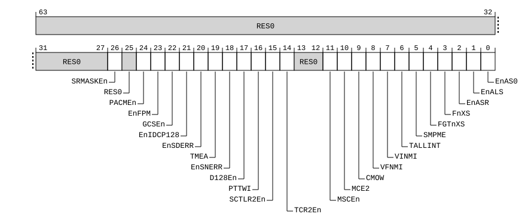

# ​D24.2.62 HCRX_EL2, Extended Hypervisor Configuration Register

Source: <https://developer.arm.com/documentation/ddi0487/mc/-Part-D-The-AArch64-System-Level-Architecture/-Chapter-D24-AArch64-System-Register-Descriptions/-D24-2-General-system-control-registers/-D24-2-62-HCRX-EL2--Extended-Hypervisor-Configuration-Register>

##### D24.2.62 HCRX\_EL2, Extended Hypervisor Configuration Register

The HCRX\_EL2 characteristics are:

Purpose
:   Provides configuration controls for virtualization, including defining whether various operations are trapped to EL2.

Configuration
:   If EL2 is not implemented, this register is RES0 from EL3.

    This register is present only when FEAT\_HCX is implemented and FEAT\_AA64 is implemented. Otherwise, direct accesses to HCRX\_EL2 are UNDEFINED.

Attributes
:   HCRX\_EL2 is a 64-bit register.

###### Field descriptions



Bits [63:27]
:   Reserved, RES0.

SRMASKEn, bit [26]
:   When FEAT\_SRMASK is implemented:
    :   If EL1 is using AArch64, accesses to the following registers are trapped to EL2 and reported using EC syndrome value `0x18`:

        - [CPACRMASK\_EL1](/documentation/ddi0487/mc/-Part-D-The-AArch64-System-Level-Architecture/-Chapter-D24-AArch64-System-Register-Descriptions/-D24-2-General-system-control-registers/-D24-2-36-CPACRMASK-EL1--Architectural-Feature-Access-Control-Masking-Register?lang=en#reg_aarch64_cpacrmask_el1).
        - [SCTLRMASK\_EL1](/documentation/ddi0487/mc/-Part-D-The-AArch64-System-Level-Architecture/-Chapter-D24-AArch64-System-Register-Descriptions/-D24-2-General-system-control-registers/-D24-2-177-SCTLRMASK-EL1--System-Control-Masking-Register--EL1-?lang=en#reg_aarch64_sctlrmask_el1).
        - [SCTLR2MASK\_EL1](/documentation/ddi0487/mc/-Part-D-The-AArch64-System-Level-Architecture/-Chapter-D24-AArch64-System-Register-Descriptions/-D24-2-General-system-control-registers/-D24-2-172-SCTLR2MASK-EL1--Extended-System-Control-Masking-Register--EL1-?lang=en#reg_aarch64_sctlr2mask_el1).
        - [TCRMASK\_EL1](/documentation/ddi0487/mc/-Part-D-The-AArch64-System-Level-Architecture/-Chapter-D24-AArch64-System-Register-Descriptions/-D24-2-General-system-control-registers/-D24-2-196-TCRMASK-EL1--Translation-Control-Masking-Register--EL1-?lang=en#reg_aarch64_tcrmask_el1).
        - [TCR2MASK\_EL1](/documentation/ddi0487/mc/-Part-D-The-AArch64-System-Level-Architecture/-Chapter-D24-AArch64-System-Register-Descriptions/-D24-2-General-system-control-registers/-D24-2-191-TCR2MASK-EL1--Extended-Translation-Control-Masking-Register--EL1-?lang=en#reg_aarch64_tcr2mask_el1).
        - [ACTLRMASK\_EL1](/documentation/ddi0487/mc/-Part-D-The-AArch64-System-Level-Architecture/-Chapter-D24-AArch64-System-Register-Descriptions/-D24-2-General-system-control-registers/-D24-2-5-ACTLRMASK-EL1--Auxiliary-Control-Masking-Register--EL1-?lang=en#reg_aarch64_actlrmask_el1), if it is implemented.

<table>
 <colgroup>
  <col/>
  <col/>
 </colgroup>
 <thead>
  <tr>
   <th>
    <strong>
     SRMASKEn
    </strong>
   </th>
   <th>
    <strong>
     Meaning
    </strong>
   </th>
  </tr>
 </thead>
 <tbody>
  <tr>
   <td>
    <p>
     <code>
      0b0
     </code>
    </p>
   </td>
   <td>
    <p>
     EL1 accesses to the specified EL1 registers are trapped to EL2. The values in the registers are treated as 0.
    </p>
   </td>
  </tr>
  <tr>
   <td>
    <p>
     <code>
      0b1
     </code>
    </p>
   </td>
   <td>
    <p>
     This control does not cause any instructions to be trapped.
    </p>
   </td>
  </tr>
 </tbody>
</table>

        Traps generated by this control have a lower priority than traps generated by the [HFGRTR2\_EL2](/documentation/ddi0487/mc/-Part-D-The-AArch64-System-Level-Architecture/-Chapter-D24-AArch64-System-Register-Descriptions/-D24-2-General-system-control-registers/-D24-2-71-HFGRTR2-EL2--Hypervisor-Fine-Grained-Read-Trap-Register-2?lang=en#reg_aarch64_hfgrtr2_el2) and [HFGWTR2\_EL2](/documentation/ddi0487/mc/-Part-D-The-AArch64-System-Level-Architecture/-Chapter-D24-AArch64-System-Register-Descriptions/-D24-2-General-system-control-registers/-D24-2-73-HFGWTR2-EL2--Hypervisor-Fine-Grained-Write-Trap-Register-2?lang=en#reg_aarch64_hfgwtr2_el2) controls.

        When EL2 is not implemented or not enabled in the current Security state, the Effective value of this field is 1.

        Otherwise, when the Effective value of [SCR\_EL3](/documentation/ddi0487/mc/-Part-D-The-AArch64-System-Level-Architecture/-Chapter-D24-AArch64-System-Register-Descriptions/-D24-2-General-system-control-registers/-D24-2-168-SCR-EL3--Secure-Configuration-Register?lang=en#reg_aarch64_scr_el3).HXEn is 0, the Effective value of this field is 0.

        The reset behavior of this field is:

        - On a Warm reset:
          - When the highest implemented Exception level is EL2, this field resets to `'0'`.
          - Otherwise, this field resets to an architecturally UNKNOWN value.

    Otherwise:
    :   Reserved, RES0.

Bit [25]
:   Reserved, RES0.

PACMEn, bit [24]
:   When FEAT\_PAuth\_LR is implemented:
    :   PACM Enable. Controls the effect of a PACM instruction at EL1 and EL0.

<table>
 <colgroup>
  <col/>
  <col/>
 </colgroup>
 <thead>
  <tr>
   <th>
    <strong>
     PACMEn
    </strong>
   </th>
   <th>
    <strong>
     Meaning
    </strong>
   </th>
  </tr>
 </thead>
 <tbody>
  <tr>
   <td>
    <p>
     <code>
      0b0
     </code>
    </p>
   </td>
   <td>
    <p>
     The effects of PACM are disabled at EL1 and EL0, regardless of the value in any other controls.
    </p>
   </td>
  </tr>
  <tr>
   <td>
    <p>
     <code>
      0b1
     </code>
    </p>
   </td>
   <td>
    <p>
     This control does not disable the effect of PACM at EL1 and EL0.
    </p>
   </td>
  </tr>
 </tbody>
</table>

        The Effective value of this field is 1 when any of the following are true:

        - EL2 is not implemented or not enabled in the current Security state.
        - The Effective value of [HCR\_EL2](/documentation/ddi0487/mc/-Part-D-The-AArch64-System-Level-Architecture/-Chapter-D24-AArch64-System-Register-Descriptions/-D24-2-General-system-control-registers/-D24-2-61-HCR-EL2--Hypervisor-Configuration-Register?lang=en#reg_aarch64_hcr_el2).{E2H, TGE} is {1, 1}.

        The Effective value of this field is 0 when all of the following are true:

        - EL2 is implemented and enabled in the current Security state.
        - The Effective value of [HCR\_EL2](/documentation/ddi0487/mc/-Part-D-The-AArch64-System-Level-Architecture/-Chapter-D24-AArch64-System-Register-Descriptions/-D24-2-General-system-control-registers/-D24-2-61-HCR-EL2--Hypervisor-Configuration-Register?lang=en#reg_aarch64_hcr_el2).{E2H, TGE} is not {1, 1}.
        - The Effective value of [SCR\_EL3](/documentation/ddi0487/mc/-Part-D-The-AArch64-System-Level-Architecture/-Chapter-D24-AArch64-System-Register-Descriptions/-D24-2-General-system-control-registers/-D24-2-168-SCR-EL3--Secure-Configuration-Register?lang=en#reg_aarch64_scr_el3).HXEn is 0.

        The reset behavior of this field is:

        - On a Warm reset:
          - When the highest implemented Exception level is EL2, this field resets to `'0'`.
          - Otherwise, this field resets to an architecturally UNKNOWN value.

    Otherwise:
    :   Reserved, RES0.

EnFPM, bit [23]
:   When FEAT\_FPMR is implemented:
    :   Enables direct and indirect accesses to [FPMR](/documentation/ddi0487/mc/-Part-C-The-AArch64-Instruction-Set/-Chapter-C5-The-A64-System-Instruction-Class/-C5-2-Special-purpose-registers/-C5-2-9-FPMR--Floating-point-Mode-Register?lang=en#reg_aarch64_fpmr) from EL0 and EL1.

        When accesses to FPMR are disabled by this control:

        - Direct accesses to [FPMR](/documentation/ddi0487/mc/-Part-C-The-AArch64-Instruction-Set/-Chapter-C5-The-A64-System-Instruction-Class/-C5-2-Special-purpose-registers/-C5-2-9-FPMR--Floating-point-Mode-Register?lang=en#reg_aarch64_fpmr) from EL0 and EL1 are trapped to EL2 and reported using EC syndrome value `0x18`.
        - Execution of FP8 data-processing instructions that indirectly access [FPMR](/documentation/ddi0487/mc/-Part-C-The-AArch64-Instruction-Set/-Chapter-C5-The-A64-System-Instruction-Class/-C5-2-Special-purpose-registers/-C5-2-9-FPMR--Floating-point-Mode-Register?lang=en#reg_aarch64_fpmr) is UNDEFINED at EL0 and EL1.

<table>
 <colgroup>
  <col/>
  <col/>
 </colgroup>
 <thead>
  <tr>
   <th>
    <strong>
     EnFPM
    </strong>
   </th>
   <th>
    <strong>
     Meaning
    </strong>
   </th>
  </tr>
 </thead>
 <tbody>
  <tr>
   <td>
    <p>
     <code>
      0b0
     </code>
    </p>
   </td>
   <td>
    <p>
     Direct and indirect accesses to
     <a class="document-topic" document-topic-path="/ddi0487/mc/-Part-C-The-AArch64-Instruction-Set/-Chapter-C5-The-A64-System-Instruction-Class/-C5-2-Special-purpose-registers/-C5-2-9-FPMR--Floating-point-Mode-Register?lang=en#reg_aarch64_fpmr" href="/documentation/ddi0487/mc/-Part-C-The-AArch64-Instruction-Set/-Chapter-C5-The-A64-System-Instruction-Class/-C5-2-Special-purpose-registers/-C5-2-9-FPMR--Floating-point-Mode-Register?lang=en#reg_aarch64_fpmr">
      FPMR
     </a>
     are disabled at EL1 and EL0.
    </p>
   </td>
  </tr>
  <tr>
   <td>
    <p>
     <code>
      0b1
     </code>
    </p>
   </td>
   <td>
    <p>
     This control does not cause any instructions to be trapped.
    </p>
   </td>
  </tr>
 </tbody>
</table>

        Traps are not taken if there is a higher priority exception generated by the access.

        The Effective value of this field is 1 when any of the following are true:

        - EL2 is not implemented or not enabled in the current Security state.
        - The Effective value of [HCR\_EL2](/documentation/ddi0487/mc/-Part-D-The-AArch64-System-Level-Architecture/-Chapter-D24-AArch64-System-Register-Descriptions/-D24-2-General-system-control-registers/-D24-2-61-HCR-EL2--Hypervisor-Configuration-Register?lang=en#reg_aarch64_hcr_el2).{E2H, TGE} is {1, 1}.

        The Effective value of this field is 0 when all of the following are true:

        - EL2 is implemented and enabled in the current Security state.
        - The Effective value of [HCR\_EL2](/documentation/ddi0487/mc/-Part-D-The-AArch64-System-Level-Architecture/-Chapter-D24-AArch64-System-Register-Descriptions/-D24-2-General-system-control-registers/-D24-2-61-HCR-EL2--Hypervisor-Configuration-Register?lang=en#reg_aarch64_hcr_el2).{E2H, TGE} is not {1, 1}.
        - The Effective value of [SCR\_EL3](/documentation/ddi0487/mc/-Part-D-The-AArch64-System-Level-Architecture/-Chapter-D24-AArch64-System-Register-Descriptions/-D24-2-General-system-control-registers/-D24-2-168-SCR-EL3--Secure-Configuration-Register?lang=en#reg_aarch64_scr_el3).HXEn is 0.

        The reset behavior of this field is:

        - On a Warm reset:
          - When the highest implemented Exception level is EL2, this field resets to `'0'`.
          - Otherwise, this field resets to an architecturally UNKNOWN value.

    Otherwise:
    :   Reserved, RES0.

GCSEn, bit [22]
:   When FEAT\_GCS is implemented:
    :   Guarded Control Stack enable. Controls Guarded Control Stack behavior at EL1 and EL0.

<table>
 <colgroup>
  <col/>
  <col/>
 </colgroup>
 <thead>
  <tr>
   <th>
    <strong>
     GCSEn
    </strong>
   </th>
   <th>
    <strong>
     Meaning
    </strong>
   </th>
  </tr>
 </thead>
 <tbody>
  <tr>
   <td>
    <p>
     <code>
      0b0
     </code>
    </p>
   </td>
   <td>
    <p>
     The Guarded Control Stack is disabled at EL1 and EL0.
    </p>
   </td>
  </tr>
  <tr>
   <td>
    <p>
     <code>
      0b1
     </code>
    </p>
   </td>
   <td>
    <p>
     Guarded Control Stack behavior at EL1 and EL0 is not affected by mechanism.
    </p>
   </td>
  </tr>
 </tbody>
</table>

        The Effective value of this field is 1 when any of the following are true:

        - EL2 is not implemented or not enabled in the current Security state.
        - The Effective value of [HCR\_EL2](/documentation/ddi0487/mc/-Part-D-The-AArch64-System-Level-Architecture/-Chapter-D24-AArch64-System-Register-Descriptions/-D24-2-General-system-control-registers/-D24-2-61-HCR-EL2--Hypervisor-Configuration-Register?lang=en#reg_aarch64_hcr_el2).{E2H, TGE} is {1, 1}.

        The Effective value of this field is 0 when all of the following are true:

        - EL2 is implemented and enabled in the current Security state.
        - The Effective value of [HCR\_EL2](/documentation/ddi0487/mc/-Part-D-The-AArch64-System-Level-Architecture/-Chapter-D24-AArch64-System-Register-Descriptions/-D24-2-General-system-control-registers/-D24-2-61-HCR-EL2--Hypervisor-Configuration-Register?lang=en#reg_aarch64_hcr_el2).{E2H, TGE} is not {1, 1}.
        - The Effective value of [SCR\_EL3](/documentation/ddi0487/mc/-Part-D-The-AArch64-System-Level-Architecture/-Chapter-D24-AArch64-System-Register-Descriptions/-D24-2-General-system-control-registers/-D24-2-168-SCR-EL3--Secure-Configuration-Register?lang=en#reg_aarch64_scr_el3).HXEn is 0.

        The reset behavior of this field is:

        - On a Warm reset:
          - When the highest implemented Exception level is EL2, this field resets to `'0'`.
          - Otherwise, this field resets to an architecturally UNKNOWN value.

    Otherwise:
    :   Reserved, RES0.

EnIDCP128, bit [21]
:   When FEAT\_SYSREG128 is implemented:
    :   Enables access to IMPLEMENTATION DEFINED 128-bit System registers.

<table>
 <colgroup>
  <col/>
  <col/>
 </colgroup>
 <thead>
  <tr>
   <th>
    <strong>
     EnIDCP128
    </strong>
   </th>
   <th>
    <strong>
     Meaning
    </strong>
   </th>
  </tr>
 </thead>
 <tbody>
  <tr>
   <td>
    <p>
     <code>
      0b0
     </code>
    </p>
   </td>
   <td>
    <p>
     Accesses at EL1, EL0 to
     <small>
      IMPLEMENTATION DEFINED
     </small>
     128-bit System registers are trapped to EL2 using EC syndrome value
     <code>
      0x14
     </code>
     , unless the access generates a higher priority exception.
    </p>
    <p>
     Disables the functionality of the 128-bit
     <small>
      IMPLEMENTATION DEFINED
     </small>
     System registers that are accessible at EL2.
    </p>
   </td>
  </tr>
  <tr>
   <td>
    <p>
     <code>
      0b1
     </code>
    </p>
   </td>
   <td>
    <p>
     No accesses are trapped by this control.
    </p>
   </td>
  </tr>
 </tbody>
</table>

        The Effective value of this field is 1 when any of the following are true:

        - EL2 is not implemented or not enabled in the current Security state.
        - The Effective value of [HCR\_EL2](/documentation/ddi0487/mc/-Part-D-The-AArch64-System-Level-Architecture/-Chapter-D24-AArch64-System-Register-Descriptions/-D24-2-General-system-control-registers/-D24-2-61-HCR-EL2--Hypervisor-Configuration-Register?lang=en#reg_aarch64_hcr_el2).{E2H, TGE} is {1, 1}.

        The Effective value of this field is 0 when all of the following are true:

        - EL2 is implemented and enabled in the current Security state.
        - The Effective value of [HCR\_EL2](/documentation/ddi0487/mc/-Part-D-The-AArch64-System-Level-Architecture/-Chapter-D24-AArch64-System-Register-Descriptions/-D24-2-General-system-control-registers/-D24-2-61-HCR-EL2--Hypervisor-Configuration-Register?lang=en#reg_aarch64_hcr_el2).{E2H, TGE} is not {1, 1}.
        - The Effective value of [SCR\_EL3](/documentation/ddi0487/mc/-Part-D-The-AArch64-System-Level-Architecture/-Chapter-D24-AArch64-System-Register-Descriptions/-D24-2-General-system-control-registers/-D24-2-168-SCR-EL3--Secure-Configuration-Register?lang=en#reg_aarch64_scr_el3).HXEn is 0.

        The reset behavior of this field is:

        - On a Warm reset:
          - When the highest implemented Exception level is EL2, this field resets to `'0'`.
          - Otherwise, this field resets to an architecturally UNKNOWN value.

    Otherwise:
    :   Reserved, RES0.

EnSDERR, bit [20]
:   When FEAT\_ADERR is implemented:
    :   Enable Synchronous Device Read Error. Override [SCTLR2\_EL1](/documentation/ddi0487/mc/-Part-D-The-AArch64-System-Level-Architecture/-Chapter-D24-AArch64-System-Register-Descriptions/-D24-2-General-system-control-registers/-D24-2-169-SCTLR2-EL1--System-Control-Register--EL1-?lang=en#reg_aarch64_sctlr2_el1).EnADERR.

<table>
 <colgroup>
  <col/>
  <col/>
 </colgroup>
 <thead>
  <tr>
   <th>
    <strong>
     EnSDERR
    </strong>
   </th>
   <th>
    <strong>
     Meaning
    </strong>
   </th>
  </tr>
 </thead>
 <tbody>
  <tr>
   <td>
    <p>
     <code>
      0b0
     </code>
    </p>
   </td>
   <td>
    <p>
     This field has no effect on External aborts on Device memory reads in the EL1&amp;0 translation regime.
    </p>
   </td>
  </tr>
  <tr>
   <td>
    <p>
     <code>
      0b1
     </code>
    </p>
   </td>
   <td>
    <p>
     External abort on Device memory reads generate synchronous Data Abort exceptions in the EL1&amp;0 translation regime.
    </p>
   </td>
  </tr>
 </tbody>
</table>

        Implementation-specific exceptions to applications of this field are described in [‘Taking error exceptions’](/documentation/ddi0487/mc/-Part-D-The-AArch64-System-Level-Architecture/-Chapter-D20-RAS-PE-Architecture/-D20-4-Taking-error-exceptions?lang=en#mdsec_taking_error_exceptions).

        Setting this field to 1 does not guarantee that the PE is able to take a synchronous Data Abort exception for an External abort on a Device memory read in every case. There might be implementation-specific circumstances when an error on a load cannot be taken synchronously. These circumstances should be rare enough that treating such occurrences as fatal does not cause a significant increase in failure rate.

        If [FEAT\_SVE](/documentation/ddi0487/mc/-Part-A-Arm-Architecture-Introduction-and-Overview/-Chapter-A2-A-profile-Architecture-Extensions/-A2-2-Armv8-A-architecture-extensions/-A2-2-3-The-Armv8-2-architecture-extension?lang=en#feat_feat_sve) is implemented, HCRX\_EL2.EnSDERR is 1, and the access generating the External abort is due to any Active element of an SVE Non-fault vector load instruction or an Active element that is not the First active element of an SVE First-fault vector load instruction, then no exception is generated and the External abort is reported in the FFR.

        Setting this field to 1 might have a performance impact for Device memory reads.

        This field is ignored by the PE and has an Effective value of 0 when any of the following are true:

        - All of the following are true:
          - [FEAT\_ANERR](/documentation/ddi0487/mc/-Part-A-Arm-Architecture-Introduction-and-Overview/-Chapter-A2-A-profile-Architecture-Extensions/-A2-2-Armv8-A-architecture-extensions/-A2-2-10-The-Armv8-9-architecture-extension?lang=en#feat_feat_anerr) is implemented.
          - [ID\_AA64MMFR3\_EL1](/documentation/ddi0487/mc/-Part-D-The-AArch64-System-Level-Architecture/-Chapter-D24-AArch64-System-Register-Descriptions/-D24-2-General-system-control-registers/-D24-2-90-ID-AA64MMFR3-EL1--AArch64-Memory-Model-Feature-Register-3?lang=en#reg_aarch64_id_aa64mmfr3_el1).ADERR reads as `0b0010`.
          - HCRX\_EL2.{EnSDERR, EnSNERR} == {1, 0}.
        - The Effective value of [SCR\_EL3](/documentation/ddi0487/mc/-Part-D-The-AArch64-System-Level-Architecture/-Chapter-D24-AArch64-System-Register-Descriptions/-D24-2-General-system-control-registers/-D24-2-168-SCR-EL3--Secure-Configuration-Register?lang=en#reg_aarch64_scr_el3).HXEn is 0.
        - The Effective value of [HCR\_EL2](/documentation/ddi0487/mc/-Part-D-The-AArch64-System-Level-Architecture/-Chapter-D24-AArch64-System-Register-Descriptions/-D24-2-General-system-control-registers/-D24-2-61-HCR-EL2--Hypervisor-Configuration-Register?lang=en#reg_aarch64_hcr_el2).{E2H, TGE} is {1, 1}.
        - EL2 is not implemented or not enabled in the current Security state.

        The reset behavior of this field is:

        - On a Warm reset:
          - When the highest implemented Exception level is EL2, this field resets to `'0'`.
          - Otherwise, this field resets to an architecturally UNKNOWN value.

    Otherwise:
    :   Reserved, RES0.

TMEA, bit [19]
:   When FEAT\_DoubleFault2 is implemented:
    :   Trap Masked External Aborts. Controls whether a masked error exception at a lower Exception level is taken to EL2.

<table>
 <colgroup>
  <col/>
  <col/>
 </colgroup>
 <thead>
  <tr>
   <th>
    <strong>
     TMEA
    </strong>
   </th>
   <th>
    <strong>
     Meaning
    </strong>
   </th>
  </tr>
 </thead>
 <tbody>
  <tr>
   <td>
    <p>
     <code>
      0b0
     </code>
    </p>
   </td>
   <td>
    <p>
     Synchronous External abort exceptions, physical SError exceptions, and delegated SError exceptions at EL1 and EL0 are unaffected by this mechanism. That is, these exceptions are not taken to EL2 unless routed to EL2 by another control.
    </p>
    <p>
     Virtual SError exceptions are not enabled by this mechanism.
    </p>
   </td>
  </tr>
  <tr>
   <td>
    <p>
     <code>
      0b1
     </code>
    </p>
   </td>
   <td>
    <p>
     When executing at Exception levels below EL2, if EL2 is enabled in the current Security state, then all of the following apply:
    </p>
    <ul>
     <li>
      <p>
       When PSTATE.A is 1, synchronous External abort exceptions are taken to EL2, unless they are routed to EL3.
      </p>
     </li>
     <li>
      <p>
       Masked physical SError exceptions are taken to EL2, unless they are routed to EL3.
      </p>
     </li>
     <li>
      <p>
       If
       <a class="document-topic" document-topic-path="/ddi0487/mc/-Part-A-Arm-Architecture-Introduction-and-Overview/-Chapter-A2-A-profile-Architecture-Extensions/-A2-3-Armv9-A-architecture-extensions/-A2-3-6-The-Armv9-5-architecture-extension?lang=en#feat_feat_e3dse" href="/documentation/ddi0487/mc/-Part-A-Arm-Architecture-Introduction-and-Overview/-Chapter-A2-A-profile-Architecture-Extensions/-A2-3-Armv9-A-architecture-extensions/-A2-3-6-The-Armv9-5-architecture-extension?lang=en#feat_feat_e3dse">
        FEAT_E3DSE
       </a>
       is implemented, then masked delegated SError exceptions enabled by
       <a class="document-topic" document-topic-path="/ddi0487/mc/-Part-D-The-AArch64-System-Level-Architecture/-Chapter-D24-AArch64-System-Register-Descriptions/-D24-2-General-system-control-registers/-D24-2-168-SCR-EL3--Secure-Configuration-Register?lang=en#reg_aarch64_scr_el3" href="/documentation/ddi0487/mc/-Part-D-The-AArch64-System-Level-Architecture/-Chapter-D24-AArch64-System-Register-Descriptions/-D24-2-General-system-control-registers/-D24-2-168-SCR-EL3--Secure-Configuration-Register?lang=en#reg_aarch64_scr_el3">
        SCR_EL3
       </a>
       .DSE are taken to EL2.
      </p>
     </li>
     <li>
      <p>
       If
       <a class="document-topic" document-topic-path="/ddi0487/mc/-Part-D-The-AArch64-System-Level-Architecture/-Chapter-D24-AArch64-System-Register-Descriptions/-D24-2-General-system-control-registers/-D24-2-61-HCR-EL2--Hypervisor-Configuration-Register?lang=en#reg_aarch64_hcr_el2" href="/documentation/ddi0487/mc/-Part-D-The-AArch64-System-Level-Architecture/-Chapter-D24-AArch64-System-Register-Descriptions/-D24-2-General-system-control-registers/-D24-2-61-HCR-EL2--Hypervisor-Configuration-Register?lang=en#reg_aarch64_hcr_el2">
        HCR_EL2
       </a>
       .TGE is 0, then virtual SError exceptions are enabled.
      </p>
     </li>
    </ul>
   </td>
  </tr>
 </tbody>
</table>

        The Effective value of this field is 0 when any of the following are true:

        - The Effective value of [SCR\_EL3](/documentation/ddi0487/mc/-Part-D-The-AArch64-System-Level-Architecture/-Chapter-D24-AArch64-System-Register-Descriptions/-D24-2-General-system-control-registers/-D24-2-168-SCR-EL3--Secure-Configuration-Register?lang=en#reg_aarch64_scr_el3).HXEn is 0.
        - The Effective value of [HCR\_EL2](/documentation/ddi0487/mc/-Part-D-The-AArch64-System-Level-Architecture/-Chapter-D24-AArch64-System-Register-Descriptions/-D24-2-General-system-control-registers/-D24-2-61-HCR-EL2--Hypervisor-Configuration-Register?lang=en#reg_aarch64_hcr_el2).{E2H, TGE} is {1, 1}.
        - EL2 is not implemented or not enabled in the current Security state.

        Virtual SError exceptions are disabled when the Effective value of [HCR\_EL2](/documentation/ddi0487/mc/-Part-D-The-AArch64-System-Level-Architecture/-Chapter-D24-AArch64-System-Register-Descriptions/-D24-2-General-system-control-registers/-D24-2-61-HCR-EL2--Hypervisor-Configuration-Register?lang=en#reg_aarch64_hcr_el2).AMO is 0 and the Effective value of HCRX\_EL2.TMEA is 0.

        The reset behavior of this field is:

        - On a Warm reset:
          - When the highest implemented Exception level is EL2, this field resets to `'0'`.
          - Otherwise, this field resets to an architecturally UNKNOWN value.

    Otherwise:
    :   Reserved, RES0.

EnSNERR, bit [18]
:   When FEAT\_ANERR is implemented:
    :   Enable Synchronous Normal Read Error. Override [SCTLR2\_EL1](/documentation/ddi0487/mc/-Part-D-The-AArch64-System-Level-Architecture/-Chapter-D24-AArch64-System-Register-Descriptions/-D24-2-General-system-control-registers/-D24-2-169-SCTLR2-EL1--System-Control-Register--EL1-?lang=en#reg_aarch64_sctlr2_el1).EnANERR.

<table>
 <colgroup>
  <col/>
  <col/>
 </colgroup>
 <thead>
  <tr>
   <th>
    <strong>
     EnSNERR
    </strong>
   </th>
   <th>
    <strong>
     Meaning
    </strong>
   </th>
  </tr>
 </thead>
 <tbody>
  <tr>
   <td>
    <p>
     <code>
      0b0
     </code>
    </p>
   </td>
   <td>
    <p>
     This field has no effect on External aborts on Normal memory reads in the EL1&amp;0 translation regime.
    </p>
   </td>
  </tr>
  <tr>
   <td>
    <p>
     <code>
      0b1
     </code>
    </p>
   </td>
   <td>
    <p>
     External abort on Normal memory reads generate synchronous Data Abort exceptions in the EL1&amp;0 translation regime.
    </p>
   </td>
  </tr>
 </tbody>
</table>

        Implementation-specific exceptions to applications of this field are described in [‘Taking error exceptions’](/documentation/ddi0487/mc/-Part-D-The-AArch64-System-Level-Architecture/-Chapter-D20-RAS-PE-Architecture/-D20-4-Taking-error-exceptions?lang=en#mdsec_taking_error_exceptions).

        Setting this field to 1 does not guarantee that the PE is able to take a synchronous Data Abort exception for an External abort on a Normal memory read in every case. There might be implementation-specific circumstances when an error on a load cannot be taken synchronously. These circumstances should be rare enough that treating such occurrences as fatal does not cause a significant increase in failure rate.

        If [FEAT\_SVE](/documentation/ddi0487/mc/-Part-A-Arm-Architecture-Introduction-and-Overview/-Chapter-A2-A-profile-Architecture-Extensions/-A2-2-Armv8-A-architecture-extensions/-A2-2-3-The-Armv8-2-architecture-extension?lang=en#feat_feat_sve) is implemented, HCRX\_EL2.EnSNERR is 1, and the access generating the External abort is due to any Active element of an SVE Non-fault vector load instruction or an Active element that is not the First active element of an SVE First-fault vector load instruction, then no exception is generated and the External abort is reported in the FFR.

        Setting this field to 1 might have a performance impact for Normal memory reads.

        This field is ignored by the PE and has an Effective value of 0 when any of the following are true:

        - All of the following are true:
          - [FEAT\_ADERR](/documentation/ddi0487/mc/-Part-A-Arm-Architecture-Introduction-and-Overview/-Chapter-A2-A-profile-Architecture-Extensions/-A2-2-Armv8-A-architecture-extensions/-A2-2-10-The-Armv8-9-architecture-extension?lang=en#feat_feat_aderr) is implemented.
          - [ID\_AA64MMFR3\_EL1](/documentation/ddi0487/mc/-Part-D-The-AArch64-System-Level-Architecture/-Chapter-D24-AArch64-System-Register-Descriptions/-D24-2-General-system-control-registers/-D24-2-90-ID-AA64MMFR3-EL1--AArch64-Memory-Model-Feature-Register-3?lang=en#reg_aarch64_id_aa64mmfr3_el1).ANERR reads as `0b0010`.
          - HCRX\_EL2.{EnSDERR, EnSNERR} == {0, 1}.
        - The Effective value of [SCR\_EL3](/documentation/ddi0487/mc/-Part-D-The-AArch64-System-Level-Architecture/-Chapter-D24-AArch64-System-Register-Descriptions/-D24-2-General-system-control-registers/-D24-2-168-SCR-EL3--Secure-Configuration-Register?lang=en#reg_aarch64_scr_el3).HXEn is 0.
        - The Effective value of [HCR\_EL2](/documentation/ddi0487/mc/-Part-D-The-AArch64-System-Level-Architecture/-Chapter-D24-AArch64-System-Register-Descriptions/-D24-2-General-system-control-registers/-D24-2-61-HCR-EL2--Hypervisor-Configuration-Register?lang=en#reg_aarch64_hcr_el2).{E2H, TGE} is {1, 1}.
        - EL2 is not implemented or not enabled in the current Security state.

        The reset behavior of this field is:

        - On a Warm reset:
          - When the highest implemented Exception level is EL2, this field resets to `'0'`.
          - Otherwise, this field resets to an architecturally UNKNOWN value.

    Otherwise:
    :   Reserved, RES0.

D128En, bit [17]
:   When FEAT\_D128 is implemented:
    :   128-bit System Register trap control. Enable access to 128-bit System Registers that relate to VMSAv9-128 using `MRRS`, `MSRR` instructions.

        If EL1 is using AArch64, accesses to the following registers are trapped to EL2 and reported using EC syndrome value `0x14`:

        - [TTBR0\_EL1](/documentation/ddi0487/mc/-Part-D-The-AArch64-System-Level-Architecture/-Chapter-D24-AArch64-System-Register-Descriptions/-D24-2-General-system-control-registers/-D24-2-208-TTBR0-EL1--Translation-Table-Base-Register-0--EL1-?lang=en#reg_aarch64_ttbr0_el1).
        - [TTBR1\_EL1](/documentation/ddi0487/mc/-Part-D-The-AArch64-System-Level-Architecture/-Chapter-D24-AArch64-System-Register-Descriptions/-D24-2-General-system-control-registers/-D24-2-211-TTBR1-EL1--Translation-Table-Base-Register-1--EL1-?lang=en#reg_aarch64_ttbr1_el1).
        - If [FEAT\_THE](/documentation/ddi0487/mc/-Part-A-Arm-Architecture-Introduction-and-Overview/-Chapter-A2-A-profile-Architecture-Extensions/-A2-2-Armv8-A-architecture-extensions/-A2-2-10-The-Armv8-9-architecture-extension?lang=en#feat_feat_the) is implemented, [RCWMASK\_EL1](/documentation/ddi0487/mc/-Part-D-The-AArch64-System-Level-Architecture/-Chapter-D24-AArch64-System-Register-Descriptions/-D24-2-General-system-control-registers/-D24-2-153-RCWMASK-EL1--Read-Check-Write-Instruction-Mask--EL1-?lang=en#reg_aarch64_rcwmask_el1), [RCWSMASK\_EL1](/documentation/ddi0487/mc/-Part-D-The-AArch64-System-Level-Architecture/-Chapter-D24-AArch64-System-Register-Descriptions/-D24-2-General-system-control-registers/-D24-2-154-RCWSMASK-EL1--Software-Read-Check-Write-Instruction-Mask--EL1-?lang=en#reg_aarch64_rcwsmask_el1).
        - [PAR\_EL1](/documentation/ddi0487/mc/-Part-D-The-AArch64-System-Level-Architecture/-Chapter-D24-AArch64-System-Register-Descriptions/-D24-2-General-system-control-registers/-D24-2-141-PAR-EL1--Physical-Address-Register?lang=en#reg_aarch64_par_el1).

<table>
 <colgroup>
  <col/>
  <col/>
 </colgroup>
 <thead>
  <tr>
   <th>
    <strong>
     D128En
    </strong>
   </th>
   <th>
    <strong>
     Meaning
    </strong>
   </th>
  </tr>
 </thead>
 <tbody>
  <tr>
   <td>
    <p>
     <code>
      0b0
     </code>
    </p>
   </td>
   <td>
    <p>
     EL1 accesses to the specified registers are disabled, and trapped to EL2.
    </p>
   </td>
  </tr>
  <tr>
   <td>
    <p>
     <code>
      0b1
     </code>
    </p>
   </td>
   <td>
    <p>
     This control does not cause any instructions to be trapped.
    </p>
   </td>
  </tr>
 </tbody>
</table>

        When EL2 is not implemented or not enabled in the current Security state, the Effective value of this field is 1.

        Otherwise, when the Effective value of [SCR\_EL3](/documentation/ddi0487/mc/-Part-D-The-AArch64-System-Level-Architecture/-Chapter-D24-AArch64-System-Register-Descriptions/-D24-2-General-system-control-registers/-D24-2-168-SCR-EL3--Secure-Configuration-Register?lang=en#reg_aarch64_scr_el3).HXEn is 0, the Effective value of this field is 0.

        The reset behavior of this field is:

        - On a Warm reset:
          - When the highest implemented Exception level is EL2, this field resets to `'0'`.
          - Otherwise, this field resets to an architecturally UNKNOWN value.

    Otherwise:
    :   Reserved, RES0.

PTTWI, bit [16]
:   When FEAT\_THE is implemented:
    :   Permit Translation Table Walk Incoherence.

        Permits RCWS instructions to generate writes that have the Reduced Coherence property.

<table>
 <colgroup>
  <col/>
  <col/>
 </colgroup>
 <thead>
  <tr>
   <th>
    <strong>
     PTTWI
    </strong>
   </th>
   <th>
    <strong>
     Meaning
    </strong>
   </th>
  </tr>
 </thead>
 <tbody>
  <tr>
   <td>
    <p>
     <code>
      0b0
     </code>
    </p>
   </td>
   <td>
    <p>
     Write accesses generated by RCWS at EL1 and EL0 do not have the Reduced Coherence property.
    </p>
   </td>
  </tr>
  <tr>
   <td>
    <p>
     <code>
      0b1
     </code>
    </p>
   </td>
   <td>
    <p>
     Write accesses generated by RCWS at EL1 and EL0 have the Reduced Coherence property, if enabled by
     <a class="document-topic" document-topic-path="/ddi0487/mc/-Part-D-The-AArch64-System-Level-Architecture/-Chapter-D24-AArch64-System-Register-Descriptions/-D24-2-General-system-control-registers/-D24-2-189-TCR2-EL1--Extended-Translation-Control-Register--EL1-?lang=en#reg_aarch64_tcr2_el1" href="/documentation/ddi0487/mc/-Part-D-The-AArch64-System-Level-Architecture/-Chapter-D24-AArch64-System-Register-Descriptions/-D24-2-General-system-control-registers/-D24-2-189-TCR2-EL1--Extended-Translation-Control-Register--EL1-?lang=en#reg_aarch64_tcr2_el1">
      TCR2_EL1
     </a>
     .PTTWI.
    </p>
   </td>
  </tr>
 </tbody>
</table>

        The Effective value of this field is 1 when any of the following are true:

        - EL2 is not implemented or not enabled in the current Security state.
        - The Effective value of [HCR\_EL2](/documentation/ddi0487/mc/-Part-D-The-AArch64-System-Level-Architecture/-Chapter-D24-AArch64-System-Register-Descriptions/-D24-2-General-system-control-registers/-D24-2-61-HCR-EL2--Hypervisor-Configuration-Register?lang=en#reg_aarch64_hcr_el2).{E2H, TGE} is {1, 1}.

        The Effective value of this field is 0 when all of the following are true:

        - EL2 is implemented and enabled in the current Security state.
        - The Effective value of [HCR\_EL2](/documentation/ddi0487/mc/-Part-D-The-AArch64-System-Level-Architecture/-Chapter-D24-AArch64-System-Register-Descriptions/-D24-2-General-system-control-registers/-D24-2-61-HCR-EL2--Hypervisor-Configuration-Register?lang=en#reg_aarch64_hcr_el2).{E2H, TGE} is not {1, 1}.
        - The Effective value of [SCR\_EL3](/documentation/ddi0487/mc/-Part-D-The-AArch64-System-Level-Architecture/-Chapter-D24-AArch64-System-Register-Descriptions/-D24-2-General-system-control-registers/-D24-2-168-SCR-EL3--Secure-Configuration-Register?lang=en#reg_aarch64_scr_el3).HXEn is 0.

        This field is permitted to be cached in TLB.

        This field is permitted to be implemented as a read-only field with a fixed value of 0.

        The reset behavior of this field is:

        - On a Warm reset:
          - When the highest implemented Exception level is EL2, this field resets to `'0'`.
          - Otherwise, this field resets to an architecturally UNKNOWN value.

    Otherwise:
    :   Reserved, RES0.

SCTLR2En, bit [15]
:   When FEAT\_SCTLR2 is implemented:
    :   [SCTLR2\_EL1](/documentation/ddi0487/mc/-Part-D-The-AArch64-System-Level-Architecture/-Chapter-D24-AArch64-System-Register-Descriptions/-D24-2-General-system-control-registers/-D24-2-169-SCTLR2-EL1--System-Control-Register--EL1-?lang=en#reg_aarch64_sctlr2_el1) Enable. In AArch64 state, accesses to [SCTLR2\_EL1](/documentation/ddi0487/mc/-Part-D-The-AArch64-System-Level-Architecture/-Chapter-D24-AArch64-System-Register-Descriptions/-D24-2-General-system-control-registers/-D24-2-169-SCTLR2-EL1--System-Control-Register--EL1-?lang=en#reg_aarch64_sctlr2_el1) are trapped to EL2 and reported using EC syndrome value `0x18`.

<table>
 <colgroup>
  <col/>
  <col/>
 </colgroup>
 <thead>
  <tr>
   <th>
    <strong>
     SCTLR2En
    </strong>
   </th>
   <th>
    <strong>
     Meaning
    </strong>
   </th>
  </tr>
 </thead>
 <tbody>
  <tr>
   <td>
    <p>
     <code>
      0b0
     </code>
    </p>
   </td>
   <td>
    <p>
     Accesses to
     <a class="document-topic" document-topic-path="/ddi0487/mc/-Part-D-The-AArch64-System-Level-Architecture/-Chapter-D24-AArch64-System-Register-Descriptions/-D24-2-General-system-control-registers/-D24-2-169-SCTLR2-EL1--System-Control-Register--EL1-?lang=en#reg_aarch64_sctlr2_el1" href="/documentation/ddi0487/mc/-Part-D-The-AArch64-System-Level-Architecture/-Chapter-D24-AArch64-System-Register-Descriptions/-D24-2-General-system-control-registers/-D24-2-169-SCTLR2-EL1--System-Control-Register--EL1-?lang=en#reg_aarch64_sctlr2_el1">
      SCTLR2_EL1
     </a>
     at EL1 are trapped to EL2, unless the access generates a higher priority exception. The value in
     <a class="document-topic" document-topic-path="/ddi0487/mc/-Part-D-The-AArch64-System-Level-Architecture/-Chapter-D24-AArch64-System-Register-Descriptions/-D24-2-General-system-control-registers/-D24-2-169-SCTLR2-EL1--System-Control-Register--EL1-?lang=en#reg_aarch64_sctlr2_el1" href="/documentation/ddi0487/mc/-Part-D-The-AArch64-System-Level-Architecture/-Chapter-D24-AArch64-System-Register-Descriptions/-D24-2-General-system-control-registers/-D24-2-169-SCTLR2-EL1--System-Control-Register--EL1-?lang=en#reg_aarch64_sctlr2_el1">
      SCTLR2_EL1
     </a>
     is treated as 0.
    </p>
   </td>
  </tr>
  <tr>
   <td>
    <p>
     <code>
      0b1
     </code>
    </p>
   </td>
   <td>
    <p>
     This control does not cause any instructions to be trapped.
    </p>
   </td>
  </tr>
 </tbody>
</table>

        When EL2 is not implemented or not enabled in the current Security state, the Effective value of this field is 1.

        Otherwise, when the Effective value of [SCR\_EL3](/documentation/ddi0487/mc/-Part-D-The-AArch64-System-Level-Architecture/-Chapter-D24-AArch64-System-Register-Descriptions/-D24-2-General-system-control-registers/-D24-2-168-SCR-EL3--Secure-Configuration-Register?lang=en#reg_aarch64_scr_el3).HXEn is 0, the Effective value of this field is 0.

        The reset behavior of this field is:

        - On a Warm reset:
          - When the highest implemented Exception level is EL2, this field resets to `'0'`.
          - Otherwise, this field resets to an architecturally UNKNOWN value.

    Otherwise:
    :   Reserved, RES0.

TCR2En, bit [14]
:   When FEAT\_TCR2 is implemented:
    :   [TCR2\_EL1](/documentation/ddi0487/mc/-Part-D-The-AArch64-System-Level-Architecture/-Chapter-D24-AArch64-System-Register-Descriptions/-D24-2-General-system-control-registers/-D24-2-189-TCR2-EL1--Extended-Translation-Control-Register--EL1-?lang=en#reg_aarch64_tcr2_el1) Enable. In AArch64 state, accesses to [TCR2\_EL1](/documentation/ddi0487/mc/-Part-D-The-AArch64-System-Level-Architecture/-Chapter-D24-AArch64-System-Register-Descriptions/-D24-2-General-system-control-registers/-D24-2-189-TCR2-EL1--Extended-Translation-Control-Register--EL1-?lang=en#reg_aarch64_tcr2_el1) are trapped to EL2 and reported using EC syndrome value `0x18`.

<table>
 <colgroup>
  <col/>
  <col/>
 </colgroup>
 <thead>
  <tr>
   <th>
    <strong>
     TCR2En
    </strong>
   </th>
   <th>
    <strong>
     Meaning
    </strong>
   </th>
  </tr>
 </thead>
 <tbody>
  <tr>
   <td>
    <p>
     <code>
      0b0
     </code>
    </p>
   </td>
   <td>
    <p>
     Accesses to
     <a class="document-topic" document-topic-path="/ddi0487/mc/-Part-D-The-AArch64-System-Level-Architecture/-Chapter-D24-AArch64-System-Register-Descriptions/-D24-2-General-system-control-registers/-D24-2-189-TCR2-EL1--Extended-Translation-Control-Register--EL1-?lang=en#reg_aarch64_tcr2_el1" href="/documentation/ddi0487/mc/-Part-D-The-AArch64-System-Level-Architecture/-Chapter-D24-AArch64-System-Register-Descriptions/-D24-2-General-system-control-registers/-D24-2-189-TCR2-EL1--Extended-Translation-Control-Register--EL1-?lang=en#reg_aarch64_tcr2_el1">
      TCR2_EL1
     </a>
     at EL1 are trapped to EL2, unless the access generates a higher priority exception. The value in
     <a class="document-topic" document-topic-path="/ddi0487/mc/-Part-D-The-AArch64-System-Level-Architecture/-Chapter-D24-AArch64-System-Register-Descriptions/-D24-2-General-system-control-registers/-D24-2-189-TCR2-EL1--Extended-Translation-Control-Register--EL1-?lang=en#reg_aarch64_tcr2_el1" href="/documentation/ddi0487/mc/-Part-D-The-AArch64-System-Level-Architecture/-Chapter-D24-AArch64-System-Register-Descriptions/-D24-2-General-system-control-registers/-D24-2-189-TCR2-EL1--Extended-Translation-Control-Register--EL1-?lang=en#reg_aarch64_tcr2_el1">
      TCR2_EL1
     </a>
     is treated as 0.
    </p>
   </td>
  </tr>
  <tr>
   <td>
    <p>
     <code>
      0b1
     </code>
    </p>
   </td>
   <td>
    <p>
     This control does not cause any instructions to be trapped.
    </p>
   </td>
  </tr>
 </tbody>
</table>

        When EL2 is not implemented or not enabled in the current Security state, the Effective value of this field is 1.

        Otherwise, when the Effective value of [SCR\_EL3](/documentation/ddi0487/mc/-Part-D-The-AArch64-System-Level-Architecture/-Chapter-D24-AArch64-System-Register-Descriptions/-D24-2-General-system-control-registers/-D24-2-168-SCR-EL3--Secure-Configuration-Register?lang=en#reg_aarch64_scr_el3).HXEn is 0, the Effective value of this field is 0.

        The reset behavior of this field is:

        - On a Warm reset:
          - When the highest implemented Exception level is EL2, this field resets to `'0'`.
          - Otherwise, this field resets to an architecturally UNKNOWN value.

    Otherwise:
    :   Reserved, RES0.

Bits [13:12]
:   Reserved, RES0.

MSCEn, bit [11]
:   When FEAT\_MOPS is implemented:
    :   Memory Set and Memory Copy instructions Enable. Enables execution of the CPY\*, SETG\*, SETP\*, SETM\*, and SETE\* instructions at EL1 or EL0.

<table>
 <colgroup>
  <col/>
  <col/>
 </colgroup>
 <thead>
  <tr>
   <th>
    <strong>
     MSCEn
    </strong>
   </th>
   <th>
    <strong>
     Meaning
    </strong>
   </th>
  </tr>
 </thead>
 <tbody>
  <tr>
   <td>
    <p>
     <code>
      0b0
     </code>
    </p>
   </td>
   <td>
    <p>
     Execution of the Memory Copy and Memory Set instructions is
     <small>
      UNDEFINED
     </small>
     at EL1 or EL0.
    </p>
   </td>
  </tr>
  <tr>
   <td>
    <p>
     <code>
      0b1
     </code>
    </p>
   </td>
   <td>
    <p>
     This control does not cause any instructions to be
     <small>
      UNDEFINED
     </small>
     .
    </p>
   </td>
  </tr>
 </tbody>
</table>

        The Effective value of this field is 1 when any of the following are true:

        - EL2 is not implemented or not enabled in the current Security state.
        - The Effective value of [HCR\_EL2](/documentation/ddi0487/mc/-Part-D-The-AArch64-System-Level-Architecture/-Chapter-D24-AArch64-System-Register-Descriptions/-D24-2-General-system-control-registers/-D24-2-61-HCR-EL2--Hypervisor-Configuration-Register?lang=en#reg_aarch64_hcr_el2).{E2H, TGE} is {1, 1}.

        The Effective value of this field is 0 when all of the following are true:

        - EL2 is implemented and enabled in the current Security state.
        - The Effective value of [HCR\_EL2](/documentation/ddi0487/mc/-Part-D-The-AArch64-System-Level-Architecture/-Chapter-D24-AArch64-System-Register-Descriptions/-D24-2-General-system-control-registers/-D24-2-61-HCR-EL2--Hypervisor-Configuration-Register?lang=en#reg_aarch64_hcr_el2).{E2H, TGE} is not {1, 1}.
        - The Effective value of [SCR\_EL3](/documentation/ddi0487/mc/-Part-D-The-AArch64-System-Level-Architecture/-Chapter-D24-AArch64-System-Register-Descriptions/-D24-2-General-system-control-registers/-D24-2-168-SCR-EL3--Secure-Configuration-Register?lang=en#reg_aarch64_scr_el3).HXEn is 0.

        The reset behavior of this field is:

        - On a Warm reset:
          - When the highest implemented Exception level is EL2, this field resets to `'0'`.
          - Otherwise, this field resets to an architecturally UNKNOWN value.

    Otherwise:
    :   Reserved, RES0.

MCE2, bit [10]
:   When FEAT\_MOPS is implemented:
    :   Controls Memory Copy and Memory Set exceptions generated as part of attempting to execute the Memory Copy and Memory Set instructions from EL1.

<table>
 <colgroup>
  <col/>
  <col/>
 </colgroup>
 <thead>
  <tr>
   <th>
    <strong>
     MCE2
    </strong>
   </th>
   <th>
    <strong>
     Meaning
    </strong>
   </th>
  </tr>
 </thead>
 <tbody>
  <tr>
   <td>
    <p>
     <code>
      0b0
     </code>
    </p>
   </td>
   <td>
    <p>
     Memory Copy and Memory Set exceptions generated from EL1 are taken to EL1.
    </p>
   </td>
  </tr>
  <tr>
   <td>
    <p>
     <code>
      0b1
     </code>
    </p>
   </td>
   <td>
    <p>
     Memory Copy and Memory Set exceptions generated from EL1 are taken to EL2.
    </p>
   </td>
  </tr>
 </tbody>
</table>

        The Effective value of this field is 0 when any of the following are true:

        - EL2 is not implemented or not enabled in the current Security state.
        - The Effective value of [SCR\_EL3](/documentation/ddi0487/mc/-Part-D-The-AArch64-System-Level-Architecture/-Chapter-D24-AArch64-System-Register-Descriptions/-D24-2-General-system-control-registers/-D24-2-168-SCR-EL3--Secure-Configuration-Register?lang=en#reg_aarch64_scr_el3).HXEn is 0.

        The reset behavior of this field is:

        - On a Warm reset:
          - When the highest implemented Exception level is EL2, this field resets to `'0'`.
          - Otherwise, this field resets to an architecturally UNKNOWN value.

    Otherwise:
    :   Reserved, RES0.

CMOW, bit [9]
:   When FEAT\_CMOW is implemented:
    :   Controls the required permissions for the following cache maintenance instructions executed at EL1 or EL0:

        - Any DC instruction that operates by VA and performs a clean and invalidate operation.
        - Any IC instruction that operates by VA.

<table>
 <colgroup>
  <col/>
  <col/>
 </colgroup>
 <thead>
  <tr>
   <th>
    <strong>
     CMOW
    </strong>
   </th>
   <th>
    <strong>
     Meaning
    </strong>
   </th>
  </tr>
 </thead>
 <tbody>
  <tr>
   <td>
    <p>
     <code>
      0b0
     </code>
    </p>
   </td>
   <td>
    <p>
     This control does not cause any instructions to generate a stage 2 Permission fault.
    </p>
   </td>
  </tr>
  <tr>
   <td>
    <p>
     <code>
      0b1
     </code>
    </p>
   </td>
   <td>
    <p>
     For these instructions, when executed at EL1 or EL0, the absence of stage 2 write permission generates a stage 2 permission fault.
    </p>
   </td>
  </tr>
 </tbody>
</table>

        For more information, see:

        - [Stage 2 permissions](/documentation/ddi0487/mc/-Part-D-The-AArch64-System-Level-Architecture/-Chapter-D8-The-AArch64-Virtual-Memory-System-Architecture/-D8-4-Memory-access-control/-D8-4-2-Stage-2-permissions?lang=en#mdsec_stage_2_permissions).
        - [Implications of enabling the dirty state management mechanism](/documentation/ddi0487/mc/-Part-D-The-AArch64-System-Level-Architecture/-Chapter-D8-The-AArch64-Virtual-Memory-System-Architecture/-D8-5-Hardware-updates-to-the-translation-tables/-D8-5-2-The-dirty-state?lang=en#mdsec_implications_of_enabling_the_dirty_state_management_mechanism).

        The Effective value of this field is 0 when any of the following are true:

        - The Effective value of [SCR\_EL3](/documentation/ddi0487/mc/-Part-D-The-AArch64-System-Level-Architecture/-Chapter-D24-AArch64-System-Register-Descriptions/-D24-2-General-system-control-registers/-D24-2-168-SCR-EL3--Secure-Configuration-Register?lang=en#reg_aarch64_scr_el3).HXEn is 0.
        - The Effective value of [HCR\_EL2](/documentation/ddi0487/mc/-Part-D-The-AArch64-System-Level-Architecture/-Chapter-D24-AArch64-System-Register-Descriptions/-D24-2-General-system-control-registers/-D24-2-61-HCR-EL2--Hypervisor-Configuration-Register?lang=en#reg_aarch64_hcr_el2).{E2H, TGE} is {1, 1}.
        - EL2 is not implemented or not enabled in the current Security state.

        This field is permitted to be cached in a TLB.

        The reset behavior of this field is:

        - On a Warm reset:
          - When the highest implemented Exception level is EL2, this field resets to `'0'`.
          - Otherwise, this field resets to an architecturally UNKNOWN value.

    Otherwise:
    :   Reserved, RES0.

VFNMI, bit [8]
:   When FEAT\_NMI is implemented:
    :   Virtual FIQ Interrupt with Superpriority. Enables signaling of virtual FIQ interrupts with Superpriority.

<table>
 <colgroup>
  <col/>
  <col/>
 </colgroup>
 <thead>
  <tr>
   <th>
    <strong>
     VFNMI
    </strong>
   </th>
   <th>
    <strong>
     Meaning
    </strong>
   </th>
  </tr>
 </thead>
 <tbody>
  <tr>
   <td>
    <p>
     <code>
      0b0
     </code>
    </p>
   </td>
   <td>
    <p>
     When
     <a class="document-topic" document-topic-path="/ddi0487/mc/-Part-D-The-AArch64-System-Level-Architecture/-Chapter-D24-AArch64-System-Register-Descriptions/-D24-2-General-system-control-registers/-D24-2-61-HCR-EL2--Hypervisor-Configuration-Register?lang=en#reg_aarch64_hcr_el2" href="/documentation/ddi0487/mc/-Part-D-The-AArch64-System-Level-Architecture/-Chapter-D24-AArch64-System-Register-Descriptions/-D24-2-General-system-control-registers/-D24-2-61-HCR-EL2--Hypervisor-Configuration-Register?lang=en#reg_aarch64_hcr_el2">
      HCR_EL2
     </a>
     .VF is 1, a signaled pending virtual FIQ interrupt does not have Superpriority.
    </p>
   </td>
  </tr>
  <tr>
   <td>
    <p>
     <code>
      0b1
     </code>
    </p>
   </td>
   <td>
    <p>
     When
     <a class="document-topic" document-topic-path="/ddi0487/mc/-Part-D-The-AArch64-System-Level-Architecture/-Chapter-D24-AArch64-System-Register-Descriptions/-D24-2-General-system-control-registers/-D24-2-61-HCR-EL2--Hypervisor-Configuration-Register?lang=en#reg_aarch64_hcr_el2" href="/documentation/ddi0487/mc/-Part-D-The-AArch64-System-Level-Architecture/-Chapter-D24-AArch64-System-Register-Descriptions/-D24-2-General-system-control-registers/-D24-2-61-HCR-EL2--Hypervisor-Configuration-Register?lang=en#reg_aarch64_hcr_el2">
      HCR_EL2
     </a>
     .VF is 1, a signaled pending virtual FIQ interrupt has Superpriority.
    </p>
   </td>
  </tr>
 </tbody>
</table>

        When [HCR\_EL2](/documentation/ddi0487/mc/-Part-D-The-AArch64-System-Level-Architecture/-Chapter-D24-AArch64-System-Register-Descriptions/-D24-2-General-system-control-registers/-D24-2-61-HCR-EL2--Hypervisor-Configuration-Register?lang=en#reg_aarch64_hcr_el2).VF is 0, this field has no effect.

        The Effective value of this field is 0 when any of the following are true:

        - EL2 is not implemented or not enabled in the current Security state.
        - The Effective value of [SCR\_EL3](/documentation/ddi0487/mc/-Part-D-The-AArch64-System-Level-Architecture/-Chapter-D24-AArch64-System-Register-Descriptions/-D24-2-General-system-control-registers/-D24-2-168-SCR-EL3--Secure-Configuration-Register?lang=en#reg_aarch64_scr_el3).HXEn is 0.

        The reset behavior of this field is:

        - On a Warm reset:
          - When the highest implemented Exception level is EL2, this field resets to `'0'`.
          - Otherwise, this field resets to an architecturally UNKNOWN value.

    Otherwise:
    :   Reserved, RES0.

VINMI, bit [7]
:   When FEAT\_NMI is implemented:
    :   Virtual IRQ Interrupt with Superpriority. Enables signaling of virtual IRQ interrupts with Superpriority.

<table>
 <colgroup>
  <col/>
  <col/>
 </colgroup>
 <thead>
  <tr>
   <th>
    <strong>
     VINMI
    </strong>
   </th>
   <th>
    <strong>
     Meaning
    </strong>
   </th>
  </tr>
 </thead>
 <tbody>
  <tr>
   <td>
    <p>
     <code>
      0b0
     </code>
    </p>
   </td>
   <td>
    <p>
     When
     <a class="document-topic" document-topic-path="/ddi0487/mc/-Part-D-The-AArch64-System-Level-Architecture/-Chapter-D24-AArch64-System-Register-Descriptions/-D24-2-General-system-control-registers/-D24-2-61-HCR-EL2--Hypervisor-Configuration-Register?lang=en#reg_aarch64_hcr_el2" href="/documentation/ddi0487/mc/-Part-D-The-AArch64-System-Level-Architecture/-Chapter-D24-AArch64-System-Register-Descriptions/-D24-2-General-system-control-registers/-D24-2-61-HCR-EL2--Hypervisor-Configuration-Register?lang=en#reg_aarch64_hcr_el2">
      HCR_EL2
     </a>
     .VI is 1, a signaled pending virtual IRQ interrupt does not have Superpriority.
    </p>
   </td>
  </tr>
  <tr>
   <td>
    <p>
     <code>
      0b1
     </code>
    </p>
   </td>
   <td>
    <p>
     When
     <a class="document-topic" document-topic-path="/ddi0487/mc/-Part-D-The-AArch64-System-Level-Architecture/-Chapter-D24-AArch64-System-Register-Descriptions/-D24-2-General-system-control-registers/-D24-2-61-HCR-EL2--Hypervisor-Configuration-Register?lang=en#reg_aarch64_hcr_el2" href="/documentation/ddi0487/mc/-Part-D-The-AArch64-System-Level-Architecture/-Chapter-D24-AArch64-System-Register-Descriptions/-D24-2-General-system-control-registers/-D24-2-61-HCR-EL2--Hypervisor-Configuration-Register?lang=en#reg_aarch64_hcr_el2">
      HCR_EL2
     </a>
     .VI is 1, a signaled pending virtual IRQ interrupt has Superpriority.
    </p>
   </td>
  </tr>
 </tbody>
</table>

        When [HCR\_EL2](/documentation/ddi0487/mc/-Part-D-The-AArch64-System-Level-Architecture/-Chapter-D24-AArch64-System-Register-Descriptions/-D24-2-General-system-control-registers/-D24-2-61-HCR-EL2--Hypervisor-Configuration-Register?lang=en#reg_aarch64_hcr_el2).VI is 0, this field has no effect.

        The Effective value of this field is 0 when any of the following are true:

        - EL2 is not implemented or not enabled in the current Security state.
        - The Effective value of [SCR\_EL3](/documentation/ddi0487/mc/-Part-D-The-AArch64-System-Level-Architecture/-Chapter-D24-AArch64-System-Register-Descriptions/-D24-2-General-system-control-registers/-D24-2-168-SCR-EL3--Secure-Configuration-Register?lang=en#reg_aarch64_scr_el3).HXEn is 0.

        The reset behavior of this field is:

        - On a Warm reset:
          - When the highest implemented Exception level is EL2, this field resets to `'0'`.
          - Otherwise, this field resets to an architecturally UNKNOWN value.

    Otherwise:
    :   Reserved, RES0.

TALLINT, bit [6]
:   When FEAT\_NMI is implemented:
    :   Traps the following writes at EL1 using AArch64 to EL2, when EL2 is implemented and enabled:

        - MSR (register) writes of [ALLINT](/documentation/ddi0487/mc/-Part-C-The-AArch64-Instruction-Set/-Chapter-C5-The-A64-System-Instruction-Class/-C5-2-Special-purpose-registers/-C5-2-1-ALLINT--All-Interrupt-Mask-Bit?lang=en#reg_aarch64_allint).
        - MSR (immediate) writes of [ALLINT](/documentation/ddi0487/mc/-Part-C-The-AArch64-Instruction-Set/-Chapter-C5-The-A64-System-Instruction-Class/-C5-2-Special-purpose-registers/-C5-2-1-ALLINT--All-Interrupt-Mask-Bit?lang=en#reg_aarch64_allint) with a value of 1.

<table>
 <colgroup>
  <col/>
  <col/>
 </colgroup>
 <thead>
  <tr>
   <th>
    <strong>
     TALLINT
    </strong>
   </th>
   <th>
    <strong>
     Meaning
    </strong>
   </th>
  </tr>
 </thead>
 <tbody>
  <tr>
   <td>
    <p>
     <code>
      0b0
     </code>
    </p>
   </td>
   <td>
    <p>
     This control does not cause any instructions to be trapped.
    </p>
   </td>
  </tr>
  <tr>
   <td>
    <p>
     <code>
      0b1
     </code>
    </p>
   </td>
   <td>
    <p>
     The specified MSR accesses at EL1 using AArch64 are trapped to EL2.
    </p>
   </td>
  </tr>
 </tbody>
</table>

        The Effective value of this field is 0 when any of the following are true:

        - EL2 is not implemented or not enabled in the current Security state.
        - The Effective value of [SCR\_EL3](/documentation/ddi0487/mc/-Part-D-The-AArch64-System-Level-Architecture/-Chapter-D24-AArch64-System-Register-Descriptions/-D24-2-General-system-control-registers/-D24-2-168-SCR-EL3--Secure-Configuration-Register?lang=en#reg_aarch64_scr_el3).HXEn is 0.

        The reset behavior of this field is:

        - On a Warm reset:
          - When the highest implemented Exception level is EL2, this field resets to `'0'`.
          - Otherwise, this field resets to an architecturally UNKNOWN value.

    Otherwise:
    :   Reserved, RES0.

SMPME, bit [5]
:   When FEAT\_SME is implemented:
    :   Streaming Mode Priority Mapping Enable.

        Controls mapping of the value of [SMPRI\_EL1](/documentation/ddi0487/mc/-Part-D-The-AArch64-System-Level-Architecture/-Chapter-D24-AArch64-System-Register-Descriptions/-D24-2-General-system-control-registers/-D24-2-187-SMPRI-EL1--Streaming-Mode-Priority-Register?lang=en#reg_aarch64_smpri_el1).Priority for streaming execution priority at EL0 or EL1.

<table>
 <colgroup>
  <col/>
  <col/>
 </colgroup>
 <thead>
  <tr>
   <th>
    <strong>
     SMPME
    </strong>
   </th>
   <th>
    <strong>
     Meaning
    </strong>
   </th>
  </tr>
 </thead>
 <tbody>
  <tr>
   <td>
    <p>
     <code>
      0b0
     </code>
    </p>
   </td>
   <td>
    <p>
     The effective priority value is taken from
     <a class="document-topic" document-topic-path="/ddi0487/mc/-Part-D-The-AArch64-System-Level-Architecture/-Chapter-D24-AArch64-System-Register-Descriptions/-D24-2-General-system-control-registers/-D24-2-187-SMPRI-EL1--Streaming-Mode-Priority-Register?lang=en#reg_aarch64_smpri_el1" href="/documentation/ddi0487/mc/-Part-D-The-AArch64-System-Level-Architecture/-Chapter-D24-AArch64-System-Register-Descriptions/-D24-2-General-system-control-registers/-D24-2-187-SMPRI-EL1--Streaming-Mode-Priority-Register?lang=en#reg_aarch64_smpri_el1">
      SMPRI_EL1
     </a>
     .Priority.
    </p>
   </td>
  </tr>
  <tr>
   <td>
    <p>
     <code>
      0b1
     </code>
    </p>
   </td>
   <td>
    <p>
     The effective priority value is:
    </p>
    <ul>
     <li>
      <p>
       When the current Exception level is EL2 or EL3, the value of
       <a class="document-topic" document-topic-path="/ddi0487/mc/-Part-D-The-AArch64-System-Level-Architecture/-Chapter-D24-AArch64-System-Register-Descriptions/-D24-2-General-system-control-registers/-D24-2-187-SMPRI-EL1--Streaming-Mode-Priority-Register?lang=en#reg_aarch64_smpri_el1" href="/documentation/ddi0487/mc/-Part-D-The-AArch64-System-Level-Architecture/-Chapter-D24-AArch64-System-Register-Descriptions/-D24-2-General-system-control-registers/-D24-2-187-SMPRI-EL1--Streaming-Mode-Priority-Register?lang=en#reg_aarch64_smpri_el1">
        SMPRI_EL1
       </a>
       .Priority.
      </p>
     </li>
     <li>
      <p>
       When the current Exception level is EL0 or EL1, the value of the
       <a class="document-topic" document-topic-path="/ddi0487/mc/-Part-D-The-AArch64-System-Level-Architecture/-Chapter-D24-AArch64-System-Register-Descriptions/-D24-2-General-system-control-registers/-D24-2-188-SMPRIMAP-EL2--Streaming-Mode-Priority-Mapping-Register?lang=en#reg_aarch64_smprimap_el2" href="/documentation/ddi0487/mc/-Part-D-The-AArch64-System-Level-Architecture/-Chapter-D24-AArch64-System-Register-Descriptions/-D24-2-General-system-control-registers/-D24-2-188-SMPRIMAP-EL2--Streaming-Mode-Priority-Mapping-Register?lang=en#reg_aarch64_smprimap_el2">
        SMPRIMAP_EL2
       </a>
       field corresponding to the value of
       <a class="document-topic" document-topic-path="/ddi0487/mc/-Part-D-The-AArch64-System-Level-Architecture/-Chapter-D24-AArch64-System-Register-Descriptions/-D24-2-General-system-control-registers/-D24-2-187-SMPRI-EL1--Streaming-Mode-Priority-Register?lang=en#reg_aarch64_smpri_el1" href="/documentation/ddi0487/mc/-Part-D-The-AArch64-System-Level-Architecture/-Chapter-D24-AArch64-System-Register-Descriptions/-D24-2-General-system-control-registers/-D24-2-187-SMPRI-EL1--Streaming-Mode-Priority-Register?lang=en#reg_aarch64_smpri_el1">
        SMPRI_EL1
       </a>
       .Priority.
      </p>
     </li>
    </ul>
   </td>
  </tr>
 </tbody>
</table>

        When [SMIDR\_EL1](/documentation/ddi0487/mc/-Part-D-The-AArch64-System-Level-Architecture/-Chapter-D24-AArch64-System-Register-Descriptions/-D24-2-General-system-control-registers/-D24-2-186-SMIDR-EL1--Streaming-Mode-Identification-Register?lang=en#reg_aarch64_smidr_el1).SMPS is ‘0’, this field is RES0.

        The Effective value of this field is 0 when any of the following are true:

        - The Effective value of [SCR\_EL3](/documentation/ddi0487/mc/-Part-D-The-AArch64-System-Level-Architecture/-Chapter-D24-AArch64-System-Register-Descriptions/-D24-2-General-system-control-registers/-D24-2-168-SCR-EL3--Secure-Configuration-Register?lang=en#reg_aarch64_scr_el3).HXEn is 0.
        - The Effective value of [HCR\_EL2](/documentation/ddi0487/mc/-Part-D-The-AArch64-System-Level-Architecture/-Chapter-D24-AArch64-System-Register-Descriptions/-D24-2-General-system-control-registers/-D24-2-61-HCR-EL2--Hypervisor-Configuration-Register?lang=en#reg_aarch64_hcr_el2).{E2H, TGE} is {1, 1}.
        - EL2 is not implemented or not enabled in the current Security state.

        The reset behavior of this field is:

        - On a Warm reset:
          - When the highest implemented Exception level is EL2, this field resets to `'0'`.
          - Otherwise, this field resets to an architecturally UNKNOWN value.

    Otherwise:
    :   Reserved, RES0.

FGTnXS, bit [4]
:   When FEAT\_XS is implemented:
    :   Determines if the fine-grained traps in [HFGITR\_EL2](/documentation/ddi0487/mc/-Part-D-The-AArch64-System-Level-Architecture/-Chapter-D24-AArch64-System-Register-Descriptions/-D24-2-General-system-control-registers/-D24-2-70-HFGITR-EL2--Hypervisor-Fine-Grained-Instruction-Trap-Register?lang=en#reg_aarch64_hfgitr_el2) that apply to each of the TLBI maintenance instructions that are accessible at EL1 also apply to the corresponding TLBI maintenance instructions with the nXS qualifier.

<table>
 <colgroup>
  <col/>
  <col/>
 </colgroup>
 <thead>
  <tr>
   <th>
    <strong>
     FGTnXS
    </strong>
   </th>
   <th>
    <strong>
     Meaning
    </strong>
   </th>
  </tr>
 </thead>
 <tbody>
  <tr>
   <td>
    <p>
     <code>
      0b0
     </code>
    </p>
   </td>
   <td>
    <p>
     The fine-grained trap in the
     <a class="document-topic" document-topic-path="/ddi0487/mc/-Part-D-The-AArch64-System-Level-Architecture/-Chapter-D24-AArch64-System-Register-Descriptions/-D24-2-General-system-control-registers/-D24-2-70-HFGITR-EL2--Hypervisor-Fine-Grained-Instruction-Trap-Register?lang=en#reg_aarch64_hfgitr_el2" href="/documentation/ddi0487/mc/-Part-D-The-AArch64-System-Level-Architecture/-Chapter-D24-AArch64-System-Register-Descriptions/-D24-2-General-system-control-registers/-D24-2-70-HFGITR-EL2--Hypervisor-Fine-Grained-Instruction-Trap-Register?lang=en#reg_aarch64_hfgitr_el2">
      HFGITR_EL2
     </a>
     that applies to a TLBI maintenance instruction at EL1 also applies to the corresponding TLBI instruction with the nXS qualifier at EL1.
    </p>
   </td>
  </tr>
  <tr>
   <td>
    <p>
     <code>
      0b1
     </code>
    </p>
   </td>
   <td>
    <p>
     The fine-grained trap in the
     <a class="document-topic" document-topic-path="/ddi0487/mc/-Part-D-The-AArch64-System-Level-Architecture/-Chapter-D24-AArch64-System-Register-Descriptions/-D24-2-General-system-control-registers/-D24-2-70-HFGITR-EL2--Hypervisor-Fine-Grained-Instruction-Trap-Register?lang=en#reg_aarch64_hfgitr_el2" href="/documentation/ddi0487/mc/-Part-D-The-AArch64-System-Level-Architecture/-Chapter-D24-AArch64-System-Register-Descriptions/-D24-2-General-system-control-registers/-D24-2-70-HFGITR-EL2--Hypervisor-Fine-Grained-Instruction-Trap-Register?lang=en#reg_aarch64_hfgitr_el2">
      HFGITR_EL2
     </a>
     that applies to a TLBI maintenance instruction at EL1 does not apply to the corresponding TLBI instruction with the nXS qualifier at EL1.
    </p>
   </td>
  </tr>
 </tbody>
</table>

        The Effective value of this field is 0 when any of the following are true:

        - EL2 is not implemented or not enabled in the current Security state.
        - The Effective value of [SCR\_EL3](/documentation/ddi0487/mc/-Part-D-The-AArch64-System-Level-Architecture/-Chapter-D24-AArch64-System-Register-Descriptions/-D24-2-General-system-control-registers/-D24-2-168-SCR-EL3--Secure-Configuration-Register?lang=en#reg_aarch64_scr_el3).HXEn is 0.

        The reset behavior of this field is:

        - On a Warm reset:
          - When the highest implemented Exception level is EL2, this field resets to `'0'`.
          - Otherwise, this field resets to an architecturally UNKNOWN value.

    Otherwise:
    :   Reserved, RES0.

FnXS, bit [3]
:   When FEAT\_XS is implemented:
    :   Determines the behavior of TLBI instructions affected by the XS attribute.

        This control field also determines whether an AArch64 DSB instruction behaves as a DSB instruction with an nXS qualifier when executed at EL0 and EL1.

<table>
 <colgroup>
  <col/>
  <col/>
 </colgroup>
 <thead>
  <tr>
   <th>
    <strong>
     FnXS
    </strong>
   </th>
   <th>
    <strong>
     Meaning
    </strong>
   </th>
  </tr>
 </thead>
 <tbody>
  <tr>
   <td>
    <p>
     <code>
      0b0
     </code>
    </p>
   </td>
   <td>
    <p>
     This control does not have any effect on the behavior of the TLBI maintenance instructions.
    </p>
   </td>
  </tr>
  <tr>
   <td>
    <p>
     <code>
      0b1
     </code>
    </p>
   </td>
   <td>
    <p>
     A TLBI maintenance instruction without the nXS qualifier executed at EL1 behaves in the same way as the corresponding TLBI maintenance instruction with the nXS qualifier.
    </p>
    <p>
     An AArch64 DSB instruction that applies to both loads and stores executed at EL1 or EL0 behaves in the same way as the corresponding DSB instruction with the nXS qualifier executed at EL1 or EL0.
    </p>
   </td>
  </tr>
 </tbody>
</table>

        The Effective value of this field is 0 when any of the following are true:

        - EL2 is not implemented or not enabled in the current Security state.
        - The Effective value of [SCR\_EL3](/documentation/ddi0487/mc/-Part-D-The-AArch64-System-Level-Architecture/-Chapter-D24-AArch64-System-Register-Descriptions/-D24-2-General-system-control-registers/-D24-2-168-SCR-EL3--Secure-Configuration-Register?lang=en#reg_aarch64_scr_el3).HXEn is 0.

        This field is permitted to be cached in a TLB.

        The reset behavior of this field is:

        - On a Warm reset:
          - When the highest implemented Exception level is EL2, this field resets to `'0'`.
          - Otherwise, this field resets to an architecturally UNKNOWN value.

    Otherwise:
    :   Reserved, RES0.

EnASR, bit [2]
:   When FEAT\_LS64\_V is implemented:
    :   When the Effective value of [HCR\_EL2](/documentation/ddi0487/mc/-Part-D-The-AArch64-System-Level-Architecture/-Chapter-D24-AArch64-System-Register-Descriptions/-D24-2-General-system-control-registers/-D24-2-61-HCR-EL2--Hypervisor-Configuration-Register?lang=en#reg_aarch64_hcr_el2).{E2H, TGE} is not {1, 1}, traps execution of an ST64BV instruction at EL0 or EL1 to EL2.

<table>
 <colgroup>
  <col/>
  <col/>
 </colgroup>
 <thead>
  <tr>
   <th>
    <strong>
     EnASR
    </strong>
   </th>
   <th>
    <strong>
     Meaning
    </strong>
   </th>
  </tr>
 </thead>
 <tbody>
  <tr>
   <td>
    <p>
     <code>
      0b0
     </code>
    </p>
   </td>
   <td>
    <p>
     Execution of an ST64BV instruction at EL0 is trapped to EL2 if the execution is not trapped by
     <a class="document-topic" document-topic-path="/ddi0487/mc/-Part-D-The-AArch64-System-Level-Architecture/-Chapter-D24-AArch64-System-Register-Descriptions/-D24-2-General-system-control-registers/-D24-2-174-SCTLR-EL1--System-Control-Register--EL1-?lang=en#reg_aarch64_sctlr_el1" href="/documentation/ddi0487/mc/-Part-D-The-AArch64-System-Level-Architecture/-Chapter-D24-AArch64-System-Register-Descriptions/-D24-2-General-system-control-registers/-D24-2-174-SCTLR-EL1--System-Control-Register--EL1-?lang=en#reg_aarch64_sctlr_el1">
      SCTLR_EL1
     </a>
     .EnASR.
    </p>
    <p>
     Execution of an ST64BV instruction at EL1 is trapped to EL2.
    </p>
   </td>
  </tr>
  <tr>
   <td>
    <p>
     <code>
      0b1
     </code>
    </p>
   </td>
   <td>
    <p>
     This control does not cause any instructions to be trapped.
    </p>
   </td>
  </tr>
 </tbody>
</table>

        A trap of an ST64BV instruction is reported using EC syndrome value `0x0A`, with an ISS code of `0x0000000`.

        The Effective value of this field is 1 when any of the following are true:

        - EL2 is not implemented or not enabled in the current Security state.
        - The Effective value of [HCR\_EL2](/documentation/ddi0487/mc/-Part-D-The-AArch64-System-Level-Architecture/-Chapter-D24-AArch64-System-Register-Descriptions/-D24-2-General-system-control-registers/-D24-2-61-HCR-EL2--Hypervisor-Configuration-Register?lang=en#reg_aarch64_hcr_el2).{E2H, TGE} is {1, 1}.

        The Effective value of this field is 0 when all of the following are true:

        - EL2 is implemented and enabled in the current Security state.
        - The Effective value of [HCR\_EL2](/documentation/ddi0487/mc/-Part-D-The-AArch64-System-Level-Architecture/-Chapter-D24-AArch64-System-Register-Descriptions/-D24-2-General-system-control-registers/-D24-2-61-HCR-EL2--Hypervisor-Configuration-Register?lang=en#reg_aarch64_hcr_el2).{E2H, TGE} is not {1, 1}.
        - The Effective value of [SCR\_EL3](/documentation/ddi0487/mc/-Part-D-The-AArch64-System-Level-Architecture/-Chapter-D24-AArch64-System-Register-Descriptions/-D24-2-General-system-control-registers/-D24-2-168-SCR-EL3--Secure-Configuration-Register?lang=en#reg_aarch64_scr_el3).HXEn is 0.

        The reset behavior of this field is:

        - On a Warm reset:
          - When the highest implemented Exception level is EL2, this field resets to `'0'`.
          - Otherwise, this field resets to an architecturally UNKNOWN value.

    Otherwise:
    :   Reserved, RES0.

EnALS, bit [1]
:   When FEAT\_LS64 is implemented:
    :   When the Effective value of [HCR\_EL2](/documentation/ddi0487/mc/-Part-D-The-AArch64-System-Level-Architecture/-Chapter-D24-AArch64-System-Register-Descriptions/-D24-2-General-system-control-registers/-D24-2-61-HCR-EL2--Hypervisor-Configuration-Register?lang=en#reg_aarch64_hcr_el2).{E2H, TGE} is not {1, 1}, traps execution of an LD64B or ST64B instruction at EL0 or EL1 to EL2.

<table>
 <colgroup>
  <col/>
  <col/>
 </colgroup>
 <thead>
  <tr>
   <th>
    <strong>
     EnALS
    </strong>
   </th>
   <th>
    <strong>
     Meaning
    </strong>
   </th>
  </tr>
 </thead>
 <tbody>
  <tr>
   <td>
    <p>
     <code>
      0b0
     </code>
    </p>
   </td>
   <td>
    <p>
     Execution of an LD64B or ST64B instruction at EL0 is trapped to EL2 if the execution is not trapped by
     <a class="document-topic" document-topic-path="/ddi0487/mc/-Part-D-The-AArch64-System-Level-Architecture/-Chapter-D24-AArch64-System-Register-Descriptions/-D24-2-General-system-control-registers/-D24-2-174-SCTLR-EL1--System-Control-Register--EL1-?lang=en#reg_aarch64_sctlr_el1" href="/documentation/ddi0487/mc/-Part-D-The-AArch64-System-Level-Architecture/-Chapter-D24-AArch64-System-Register-Descriptions/-D24-2-General-system-control-registers/-D24-2-174-SCTLR-EL1--System-Control-Register--EL1-?lang=en#reg_aarch64_sctlr_el1">
      SCTLR_EL1
     </a>
     .EnALS.
    </p>
    <p>
     Execution of an LD64B or ST64B instruction at EL1 is trapped to EL2.
    </p>
   </td>
  </tr>
  <tr>
   <td>
    <p>
     <code>
      0b1
     </code>
    </p>
   </td>
   <td>
    <p>
     This control does not cause any instructions to be trapped.
    </p>
   </td>
  </tr>
 </tbody>
</table>

        A trap of an LD64B or ST64B instruction is reported using EC syndrome value `0x0A`, with an ISS code of `0x0000002`.

        The Effective value of this field is 1 when any of the following are true:

        - EL2 is not implemented or not enabled in the current Security state.
        - The Effective value of [HCR\_EL2](/documentation/ddi0487/mc/-Part-D-The-AArch64-System-Level-Architecture/-Chapter-D24-AArch64-System-Register-Descriptions/-D24-2-General-system-control-registers/-D24-2-61-HCR-EL2--Hypervisor-Configuration-Register?lang=en#reg_aarch64_hcr_el2).{E2H, TGE} is {1, 1}.

        The Effective value of this field is 0 when all of the following are true:

        - EL2 is implemented and enabled in the current Security state.
        - The Effective value of [HCR\_EL2](/documentation/ddi0487/mc/-Part-D-The-AArch64-System-Level-Architecture/-Chapter-D24-AArch64-System-Register-Descriptions/-D24-2-General-system-control-registers/-D24-2-61-HCR-EL2--Hypervisor-Configuration-Register?lang=en#reg_aarch64_hcr_el2).{E2H, TGE} is not {1, 1}.
        - The Effective value of [SCR\_EL3](/documentation/ddi0487/mc/-Part-D-The-AArch64-System-Level-Architecture/-Chapter-D24-AArch64-System-Register-Descriptions/-D24-2-General-system-control-registers/-D24-2-168-SCR-EL3--Secure-Configuration-Register?lang=en#reg_aarch64_scr_el3).HXEn is 0.

        The reset behavior of this field is:

        - On a Warm reset:
          - When the highest implemented Exception level is EL2, this field resets to `'0'`.
          - Otherwise, this field resets to an architecturally UNKNOWN value.

    Otherwise:
    :   Reserved, RES0.

EnAS0, bit [0]
:   When FEAT\_LS64\_ACCDATA is implemented:
    :   When the Effective value of [HCR\_EL2](/documentation/ddi0487/mc/-Part-D-The-AArch64-System-Level-Architecture/-Chapter-D24-AArch64-System-Register-Descriptions/-D24-2-General-system-control-registers/-D24-2-61-HCR-EL2--Hypervisor-Configuration-Register?lang=en#reg_aarch64_hcr_el2).{E2H, TGE} is not {1, 1}, traps execution of an ST64BV0 instruction at EL0 or EL1 to EL2.

<table>
 <colgroup>
  <col/>
  <col/>
 </colgroup>
 <thead>
  <tr>
   <th>
    <strong>
     EnAS0
    </strong>
   </th>
   <th>
    <strong>
     Meaning
    </strong>
   </th>
  </tr>
 </thead>
 <tbody>
  <tr>
   <td>
    <p>
     <code>
      0b0
     </code>
    </p>
   </td>
   <td>
    <p>
     Execution of an ST64BV0 instruction at EL0 is trapped to EL2 if the execution is not trapped by
     <a class="document-topic" document-topic-path="/ddi0487/mc/-Part-D-The-AArch64-System-Level-Architecture/-Chapter-D24-AArch64-System-Register-Descriptions/-D24-2-General-system-control-registers/-D24-2-174-SCTLR-EL1--System-Control-Register--EL1-?lang=en#reg_aarch64_sctlr_el1" href="/documentation/ddi0487/mc/-Part-D-The-AArch64-System-Level-Architecture/-Chapter-D24-AArch64-System-Register-Descriptions/-D24-2-General-system-control-registers/-D24-2-174-SCTLR-EL1--System-Control-Register--EL1-?lang=en#reg_aarch64_sctlr_el1">
      SCTLR_EL1
     </a>
     .EnAS0.
    </p>
    <p>
     Execution of an ST64BV0 instruction at EL1 is trapped to EL2.
    </p>
   </td>
  </tr>
  <tr>
   <td>
    <p>
     <code>
      0b1
     </code>
    </p>
   </td>
   <td>
    <p>
     This control does not cause any instructions to be trapped.
    </p>
   </td>
  </tr>
 </tbody>
</table>

        A trap of an ST64BV0 instruction is reported using EC syndrome value `0x0A`, with an ISS code of `0x0000001`.

        The Effective value of this field is 1 when any of the following are true:

        - EL2 is not implemented or not enabled in the current Security state.
        - The Effective value of [HCR\_EL2](/documentation/ddi0487/mc/-Part-D-The-AArch64-System-Level-Architecture/-Chapter-D24-AArch64-System-Register-Descriptions/-D24-2-General-system-control-registers/-D24-2-61-HCR-EL2--Hypervisor-Configuration-Register?lang=en#reg_aarch64_hcr_el2).{E2H, TGE} is {1, 1}.

        The Effective value of this field is 0 when all of the following are true:

        - EL2 is implemented and enabled in the current Security state.
        - The Effective value of [HCR\_EL2](/documentation/ddi0487/mc/-Part-D-The-AArch64-System-Level-Architecture/-Chapter-D24-AArch64-System-Register-Descriptions/-D24-2-General-system-control-registers/-D24-2-61-HCR-EL2--Hypervisor-Configuration-Register?lang=en#reg_aarch64_hcr_el2).{E2H, TGE} is not {1, 1}.
        - The Effective value of [SCR\_EL3](/documentation/ddi0487/mc/-Part-D-The-AArch64-System-Level-Architecture/-Chapter-D24-AArch64-System-Register-Descriptions/-D24-2-General-system-control-registers/-D24-2-168-SCR-EL3--Secure-Configuration-Register?lang=en#reg_aarch64_scr_el3).HXEn is 0.

        The reset behavior of this field is:

        - On a Warm reset:
          - When the highest implemented Exception level is EL2, this field resets to `'0'`.
          - Otherwise, this field resets to an architecturally UNKNOWN value.

    Otherwise:
    :   Reserved, RES0.

###### Accessing HCRX\_EL2

Accesses to this register use the following encodings in the System register encoding space:

###### `MRS <Xt>, HCRX_EL2`

<table>
 <colgroup>
  <col/>
  <col/>
  <col/>
  <col/>
  <col/>
 </colgroup>
 <thead>
  <tr>
   <th>
    <strong>
     op0
    </strong>
   </th>
   <th>
    <strong>
     op1
    </strong>
   </th>
   <th>
    <strong>
     CRn
    </strong>
   </th>
   <th>
    <strong>
     CRm
    </strong>
   </th>
   <th>
    <strong>
     op2
    </strong>
   </th>
  </tr>
 </thead>
 <tbody>
  <tr>
   <td>
    <p>
     <code>
      0b11
     </code>
    </p>
   </td>
   <td>
    <p>
     <code>
      0b100
     </code>
    </p>
   </td>
   <td>
    <p>
     <code>
      0b0001
     </code>
    </p>
   </td>
   <td>
    <p>
     <code>
      0b0010
     </code>
    </p>
   </td>
   <td>
    <p>
     <code>
      0b010
     </code>
    </p>
   </td>
  </tr>
 </tbody>
</table>

```
if !(IsFeatureImplemented(FEAT_HCX) && IsFeatureImplemented(FEAT_AA64)) then
    Undefined();
elsif HaveEL(EL3) && PSTATE.EL == EL2 && EL3SDDUndefPriority() && SCR_EL3().HXEn == '0' then
    Undefined();
elsif PSTATE.EL == EL0 then
    Undefined();
elsif PSTATE.EL == EL1 then
    if EffectiveHCR_EL2_NVx() IN {'1x1'} then
        X{64}(t) = NVMem(0x0A0);
    elsif EffectiveHCR_EL2_NVx() IN {'xx1'} then
        AArch64_SystemAccessTrap(EL2, 0x18);
    else
        Undefined();
    end;
elsif PSTATE.EL == EL2 then
    if HaveEL(EL3) && SCR_EL3().HXEn == '0' then
        if EL3SDDUndef() then
            Undefined();
        else
            AArch64_SystemAccessTrap(EL3, 0x18);
        end;
    else
        X{64}(t) = HCRX_EL2();
    end;
elsif PSTATE.EL == EL3 then
    X{64}(t) = HCRX_EL2();
end;
```

###### `MSR HCRX_EL2, <Xt>`

<table>
 <colgroup>
  <col/>
  <col/>
  <col/>
  <col/>
  <col/>
 </colgroup>
 <thead>
  <tr>
   <th>
    <strong>
     op0
    </strong>
   </th>
   <th>
    <strong>
     op1
    </strong>
   </th>
   <th>
    <strong>
     CRn
    </strong>
   </th>
   <th>
    <strong>
     CRm
    </strong>
   </th>
   <th>
    <strong>
     op2
    </strong>
   </th>
  </tr>
 </thead>
 <tbody>
  <tr>
   <td>
    <p>
     <code>
      0b11
     </code>
    </p>
   </td>
   <td>
    <p>
     <code>
      0b100
     </code>
    </p>
   </td>
   <td>
    <p>
     <code>
      0b0001
     </code>
    </p>
   </td>
   <td>
    <p>
     <code>
      0b0010
     </code>
    </p>
   </td>
   <td>
    <p>
     <code>
      0b010
     </code>
    </p>
   </td>
  </tr>
 </tbody>
</table>

```
if !(IsFeatureImplemented(FEAT_HCX) && IsFeatureImplemented(FEAT_AA64)) then
    Undefined();
elsif HaveEL(EL3) && PSTATE.EL == EL2 && EL3SDDUndefPriority() && SCR_EL3().HXEn == '0' then
    Undefined();
elsif PSTATE.EL == EL0 then
    Undefined();
elsif PSTATE.EL == EL1 then
    if EffectiveHCR_EL2_NVx() IN {'1x1'} then
        NVMem(0x0A0) = X{64}(t);
    elsif EffectiveHCR_EL2_NVx() IN {'xx1'} then
        AArch64_SystemAccessTrap(EL2, 0x18);
    else
        Undefined();
    end;
elsif PSTATE.EL == EL2 then
    if HaveEL(EL3) && SCR_EL3().HXEn == '0' then
        if EL3SDDUndef() then
            Undefined();
        else
            AArch64_SystemAccessTrap(EL3, 0x18);
        end;
    else
        HCRX_EL2() = X{64}(t);
    end;
elsif PSTATE.EL == EL3 then
    HCRX_EL2() = X{64}(t);
end;
```
