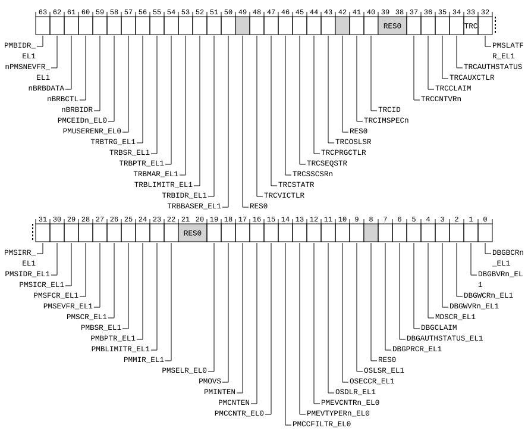

# ​D24.2.66 HDFGRTR_EL2, Hypervisor Debug Fine-Grained Read Trap Register

Source: <https://developer.arm.com/documentation/ddi0487/mc/-Part-D-The-AArch64-System-Level-Architecture/-Chapter-D24-AArch64-System-Register-Descriptions/-D24-2-General-system-control-registers/-D24-2-66-HDFGRTR-EL2--Hypervisor-Debug-Fine-Grained-Read-Trap-Register>

##### D24.2.66 HDFGRTR\_EL2, Hypervisor Debug Fine-Grained Read Trap Register

The HDFGRTR\_EL2 characteristics are:

Purpose
:   Provides controls for traps of `MRS` and `MRC` reads of debug, trace, PMU, and Statistical Profiling System registers.

Configuration
:   If EL2 is not implemented, this register is RES0 from EL3.

    This register is present only when FEAT\_FGT is implemented and FEAT\_AA64 is implemented. Otherwise, direct accesses to HDFGRTR\_EL2 are UNDEFINED.

Attributes
:   HDFGRTR\_EL2 is a 64-bit register.

###### Field descriptions



PMBIDR\_EL1, bit [63]
:   When FEAT\_SPE is implemented:
    :   Trap `MRS` reads of [PMBIDR\_EL1](/documentation/ddi0487/mc/-Part-D-The-AArch64-System-Level-Architecture/-Chapter-D24-AArch64-System-Register-Descriptions/-D24-7-Statistical-Profiling-Extension-registers/-D24-7-1-PMBIDR-EL1--Profiling-Buffer-ID-Register?lang=en#reg_aarch64_pmbidr_el1) at EL1 using AArch64 to EL2.

<table>
 <colgroup>
  <col/>
  <col/>
 </colgroup>
 <thead>
  <tr>
   <th>
    <strong>
     PMBIDR_EL1
    </strong>
   </th>
   <th>
    <strong>
     Meaning
    </strong>
   </th>
  </tr>
 </thead>
 <tbody>
  <tr>
   <td>
    <p>
     <code>
      0b0
     </code>
    </p>
   </td>
   <td>
    <p>
     <code>
      MRS
     </code>
     reads of
     <a class="document-topic" document-topic-path="/ddi0487/mc/-Part-D-The-AArch64-System-Level-Architecture/-Chapter-D24-AArch64-System-Register-Descriptions/-D24-7-Statistical-Profiling-Extension-registers/-D24-7-1-PMBIDR-EL1--Profiling-Buffer-ID-Register?lang=en#reg_aarch64_pmbidr_el1" href="/documentation/ddi0487/mc/-Part-D-The-AArch64-System-Level-Architecture/-Chapter-D24-AArch64-System-Register-Descriptions/-D24-7-Statistical-Profiling-Extension-registers/-D24-7-1-PMBIDR-EL1--Profiling-Buffer-ID-Register?lang=en#reg_aarch64_pmbidr_el1">
      PMBIDR_EL1
     </a>
     are not trapped by this mechanism.
    </p>
   </td>
  </tr>
  <tr>
   <td>
    <p>
     <code>
      0b1
     </code>
    </p>
   </td>
   <td>
    <p>
     If EL2 is implemented and enabled in the current Security state, and either EL3 is not implemented or
     <a class="document-topic" document-topic-path="/ddi0487/mc/-Part-D-The-AArch64-System-Level-Architecture/-Chapter-D24-AArch64-System-Register-Descriptions/-D24-2-General-system-control-registers/-D24-2-168-SCR-EL3--Secure-Configuration-Register?lang=en#reg_aarch64_scr_el3" href="/documentation/ddi0487/mc/-Part-D-The-AArch64-System-Level-Architecture/-Chapter-D24-AArch64-System-Register-Descriptions/-D24-2-General-system-control-registers/-D24-2-168-SCR-EL3--Secure-Configuration-Register?lang=en#reg_aarch64_scr_el3">
      SCR_EL3
     </a>
     .FGTEn == 1, then
     <code>
      MRS
     </code>
     reads of
     <a class="document-topic" document-topic-path="/ddi0487/mc/-Part-D-The-AArch64-System-Level-Architecture/-Chapter-D24-AArch64-System-Register-Descriptions/-D24-7-Statistical-Profiling-Extension-registers/-D24-7-1-PMBIDR-EL1--Profiling-Buffer-ID-Register?lang=en#reg_aarch64_pmbidr_el1" href="/documentation/ddi0487/mc/-Part-D-The-AArch64-System-Level-Architecture/-Chapter-D24-AArch64-System-Register-Descriptions/-D24-7-Statistical-Profiling-Extension-registers/-D24-7-1-PMBIDR-EL1--Profiling-Buffer-ID-Register?lang=en#reg_aarch64_pmbidr_el1">
      PMBIDR_EL1
     </a>
     at EL1 using AArch64 are trapped to EL2 and reported with EC syndrome value
     <code>
      0x18
     </code>
     , unless the read generates a higher priority exception.
    </p>
   </td>
  </tr>
 </tbody>
</table>

        The reset behavior of this field is:

        - On a Warm reset:
          - When the highest implemented Exception level is EL2, this field resets to `'0'`.
          - Otherwise, this field resets to an architecturally UNKNOWN value.

    Otherwise:
    :   Reserved, RES0.

nPMSNEVFR\_EL1, bit [62]
:   When FEAT\_SPE\_FnE is implemented:
    :   Trap `MRS` reads of [PMSNEVFR\_EL1](/documentation/ddi0487/mc/-Part-D-The-AArch64-System-Level-Architecture/-Chapter-D24-AArch64-System-Register-Descriptions/-D24-7-Statistical-Profiling-Extension-registers/-D24-7-17-PMSNEVFR-EL1--Sampling-Inverted-Event-Filter-Register?lang=en#reg_aarch64_pmsnevfr_el1) at EL1 using AArch64 to EL2.

<table>
 <colgroup>
  <col/>
  <col/>
 </colgroup>
 <thead>
  <tr>
   <th>
    <strong>
     nPMSNEVFR_EL1
    </strong>
   </th>
   <th>
    <strong>
     Meaning
    </strong>
   </th>
  </tr>
 </thead>
 <tbody>
  <tr>
   <td>
    <p>
     <code>
      0b0
     </code>
    </p>
   </td>
   <td>
    <p>
     If EL2 is implemented and enabled in the current Security state, and either EL3 is not implemented or
     <a class="document-topic" document-topic-path="/ddi0487/mc/-Part-D-The-AArch64-System-Level-Architecture/-Chapter-D24-AArch64-System-Register-Descriptions/-D24-2-General-system-control-registers/-D24-2-168-SCR-EL3--Secure-Configuration-Register?lang=en#reg_aarch64_scr_el3" href="/documentation/ddi0487/mc/-Part-D-The-AArch64-System-Level-Architecture/-Chapter-D24-AArch64-System-Register-Descriptions/-D24-2-General-system-control-registers/-D24-2-168-SCR-EL3--Secure-Configuration-Register?lang=en#reg_aarch64_scr_el3">
      SCR_EL3
     </a>
     .FGTEn == 1, then
     <code>
      MRS
     </code>
     reads of
     <a class="document-topic" document-topic-path="/ddi0487/mc/-Part-D-The-AArch64-System-Level-Architecture/-Chapter-D24-AArch64-System-Register-Descriptions/-D24-7-Statistical-Profiling-Extension-registers/-D24-7-17-PMSNEVFR-EL1--Sampling-Inverted-Event-Filter-Register?lang=en#reg_aarch64_pmsnevfr_el1" href="/documentation/ddi0487/mc/-Part-D-The-AArch64-System-Level-Architecture/-Chapter-D24-AArch64-System-Register-Descriptions/-D24-7-Statistical-Profiling-Extension-registers/-D24-7-17-PMSNEVFR-EL1--Sampling-Inverted-Event-Filter-Register?lang=en#reg_aarch64_pmsnevfr_el1">
      PMSNEVFR_EL1
     </a>
     at EL1 using AArch64 are trapped to EL2 and reported with EC syndrome value
     <code>
      0x18
     </code>
     , unless the read generates a higher priority exception.
    </p>
   </td>
  </tr>
  <tr>
   <td>
    <p>
     <code>
      0b1
     </code>
    </p>
   </td>
   <td>
    <p>
     <code>
      MRS
     </code>
     reads of
     <a class="document-topic" document-topic-path="/ddi0487/mc/-Part-D-The-AArch64-System-Level-Architecture/-Chapter-D24-AArch64-System-Register-Descriptions/-D24-7-Statistical-Profiling-Extension-registers/-D24-7-17-PMSNEVFR-EL1--Sampling-Inverted-Event-Filter-Register?lang=en#reg_aarch64_pmsnevfr_el1" href="/documentation/ddi0487/mc/-Part-D-The-AArch64-System-Level-Architecture/-Chapter-D24-AArch64-System-Register-Descriptions/-D24-7-Statistical-Profiling-Extension-registers/-D24-7-17-PMSNEVFR-EL1--Sampling-Inverted-Event-Filter-Register?lang=en#reg_aarch64_pmsnevfr_el1">
      PMSNEVFR_EL1
     </a>
     are not trapped by this mechanism.
    </p>
   </td>
  </tr>
 </tbody>
</table>

        The reset behavior of this field is:

        - On a Warm reset:
          - When the highest implemented Exception level is EL2, this field resets to `'0'`.
          - Otherwise, this field resets to an architecturally UNKNOWN value.

    Otherwise:
    :   Reserved, RES0.

nBRBDATA, bit [61]
:   When FEAT\_BRBE is implemented:
    :   Trap `MRS` reads at EL1 using AArch64 of any of the following AArch64 System registers to EL2:

        - [BRBINF<n>\_EL1](/documentation/ddi0487/mc/-Part-D-The-AArch64-System-Level-Architecture/-Chapter-D24-AArch64-System-Register-Descriptions/-D24-8-Branch-Record-Buffer-Extension-registers/-D24-8-6-BRBINF-n--EL1--Branch-Record-Buffer-Information-Register--n---n---0---31?lang=en#reg_aarch64_brbinfn_el1).
        - [BRBINFINJ\_EL1](/documentation/ddi0487/mc/-Part-D-The-AArch64-System-Level-Architecture/-Chapter-D24-AArch64-System-Register-Descriptions/-D24-8-Branch-Record-Buffer-Extension-registers/-D24-8-5-BRBINFINJ-EL1--Branch-Record-Buffer-Information-Injection-Register?lang=en#reg_aarch64_brbinfinj_el1).
        - [BRBSRC<n>\_EL1](/documentation/ddi0487/mc/-Part-D-The-AArch64-System-Level-Architecture/-Chapter-D24-AArch64-System-Register-Descriptions/-D24-8-Branch-Record-Buffer-Extension-registers/-D24-8-8-BRBSRC-n--EL1--Branch-Record-Buffer-Source-Address-Register--n---n---0---31?lang=en#reg_aarch64_brbsrcn_el1).
        - [BRBSRCINJ\_EL1](/documentation/ddi0487/mc/-Part-D-The-AArch64-System-Level-Architecture/-Chapter-D24-AArch64-System-Register-Descriptions/-D24-8-Branch-Record-Buffer-Extension-registers/-D24-8-7-BRBSRCINJ-EL1--Branch-Record-Buffer-Source-Address-Injection-Register?lang=en#reg_aarch64_brbsrcinj_el1).
        - [BRBTGT<n>\_EL1](/documentation/ddi0487/mc/-Part-D-The-AArch64-System-Level-Architecture/-Chapter-D24-AArch64-System-Register-Descriptions/-D24-8-Branch-Record-Buffer-Extension-registers/-D24-8-10-BRBTGT-n--EL1--Branch-Record-Buffer-Target-Address-Register--n---n---0---31?lang=en#reg_aarch64_brbtgtn_el1).
        - [BRBTGTINJ\_EL1](/documentation/ddi0487/mc/-Part-D-The-AArch64-System-Level-Architecture/-Chapter-D24-AArch64-System-Register-Descriptions/-D24-8-Branch-Record-Buffer-Extension-registers/-D24-8-9-BRBTGTINJ-EL1--Branch-Record-Buffer-Target-Address-Injection-Register?lang=en#reg_aarch64_brbtgtinj_el1).
        - [BRBTS\_EL1](/documentation/ddi0487/mc/-Part-D-The-AArch64-System-Level-Architecture/-Chapter-D24-AArch64-System-Register-Descriptions/-D24-8-Branch-Record-Buffer-Extension-registers/-D24-8-11-BRBTS-EL1--Branch-Record-Buffer-Timestamp-Register?lang=en#reg_aarch64_brbts_el1).

<table>
 <colgroup>
  <col/>
  <col/>
 </colgroup>
 <thead>
  <tr>
   <th>
    <strong>
     nBRBDATA
    </strong>
   </th>
   <th>
    <strong>
     Meaning
    </strong>
   </th>
  </tr>
 </thead>
 <tbody>
  <tr>
   <td>
    <p>
     <code>
      0b0
     </code>
    </p>
   </td>
   <td>
    <p>
     If EL2 is implemented and enabled in the current Security state, and either EL3 is not implemented or
     <a class="document-topic" document-topic-path="/ddi0487/mc/-Part-D-The-AArch64-System-Level-Architecture/-Chapter-D24-AArch64-System-Register-Descriptions/-D24-2-General-system-control-registers/-D24-2-168-SCR-EL3--Secure-Configuration-Register?lang=en#reg_aarch64_scr_el3" href="/documentation/ddi0487/mc/-Part-D-The-AArch64-System-Level-Architecture/-Chapter-D24-AArch64-System-Register-Descriptions/-D24-2-General-system-control-registers/-D24-2-168-SCR-EL3--Secure-Configuration-Register?lang=en#reg_aarch64_scr_el3">
      SCR_EL3
     </a>
     .FGTEn == 1, then
     <code>
      MRS
     </code>
     reads at EL1 using AArch64 of any of the specified System registers are trapped to EL2 and reported with EC syndrome value
     <code>
      0x18
     </code>
     , unless the read generates a higher priority exception.
    </p>
   </td>
  </tr>
  <tr>
   <td>
    <p>
     <code>
      0b1
     </code>
    </p>
   </td>
   <td>
    <p>
     <code>
      MRS
     </code>
     reads of the specified System registers are not trapped by this mechanism.
    </p>
   </td>
  </tr>
 </tbody>
</table>

        The reset behavior of this field is:

        - On a Warm reset:
          - When the highest implemented Exception level is EL2, this field resets to `'0'`.
          - Otherwise, this field resets to an architecturally UNKNOWN value.

    Otherwise:
    :   Reserved, RES0.

nBRBCTL, bit [60]
:   When FEAT\_BRBE is implemented:
    :   Trap `MRS` reads at EL1 using AArch64 of any of the following AArch64 System registers to EL2:

        - [BRBCR\_EL1](/documentation/ddi0487/mc/-Part-D-The-AArch64-System-Level-Architecture/-Chapter-D24-AArch64-System-Register-Descriptions/-D24-8-Branch-Record-Buffer-Extension-registers/-D24-8-1-BRBCR-EL1--Branch-Record-Buffer-Control-Register--EL1-?lang=en#reg_aarch64_brbcr_el1).
        - [BRBFCR\_EL1](/documentation/ddi0487/mc/-Part-D-The-AArch64-System-Level-Architecture/-Chapter-D24-AArch64-System-Register-Descriptions/-D24-8-Branch-Record-Buffer-Extension-registers/-D24-8-3-BRBFCR-EL1--Branch-Record-Buffer-Function-Control-Register?lang=en#reg_aarch64_brbfcr_el1).

<table>
 <colgroup>
  <col/>
  <col/>
 </colgroup>
 <thead>
  <tr>
   <th>
    <strong>
     nBRBCTL
    </strong>
   </th>
   <th>
    <strong>
     Meaning
    </strong>
   </th>
  </tr>
 </thead>
 <tbody>
  <tr>
   <td>
    <p>
     <code>
      0b0
     </code>
    </p>
   </td>
   <td>
    <p>
     If EL2 is implemented and enabled in the current Security state, and either EL3 is not implemented or
     <a class="document-topic" document-topic-path="/ddi0487/mc/-Part-D-The-AArch64-System-Level-Architecture/-Chapter-D24-AArch64-System-Register-Descriptions/-D24-2-General-system-control-registers/-D24-2-168-SCR-EL3--Secure-Configuration-Register?lang=en#reg_aarch64_scr_el3" href="/documentation/ddi0487/mc/-Part-D-The-AArch64-System-Level-Architecture/-Chapter-D24-AArch64-System-Register-Descriptions/-D24-2-General-system-control-registers/-D24-2-168-SCR-EL3--Secure-Configuration-Register?lang=en#reg_aarch64_scr_el3">
      SCR_EL3
     </a>
     .FGTEn == 1, then
     <code>
      MRS
     </code>
     reads at EL1 using AArch64 of any of the specified System registers are trapped to EL2 and reported with EC syndrome value
     <code>
      0x18
     </code>
     , unless the read generates a higher priority exception.
    </p>
   </td>
  </tr>
  <tr>
   <td>
    <p>
     <code>
      0b1
     </code>
    </p>
   </td>
   <td>
    <p>
     <code>
      MRS
     </code>
     reads of the specified System registers are not trapped by this mechanism.
    </p>
   </td>
  </tr>
 </tbody>
</table>

        The reset behavior of this field is:

        - On a Warm reset:
          - When the highest implemented Exception level is EL2, this field resets to `'0'`.
          - Otherwise, this field resets to an architecturally UNKNOWN value.

    Otherwise:
    :   Reserved, RES0.

nBRBIDR, bit [59]
:   When FEAT\_BRBE is implemented:
    :   Trap `MRS` reads of [BRBIDR0\_EL1](/documentation/ddi0487/mc/-Part-D-The-AArch64-System-Level-Architecture/-Chapter-D24-AArch64-System-Register-Descriptions/-D24-8-Branch-Record-Buffer-Extension-registers/-D24-8-4-BRBIDR0-EL1--Branch-Record-Buffer-ID0-Register?lang=en#reg_aarch64_brbidr0_el1) at EL1 using AArch64 to EL2.

<table>
 <colgroup>
  <col/>
  <col/>
 </colgroup>
 <thead>
  <tr>
   <th>
    <strong>
     nBRBIDR
    </strong>
   </th>
   <th>
    <strong>
     Meaning
    </strong>
   </th>
  </tr>
 </thead>
 <tbody>
  <tr>
   <td>
    <p>
     <code>
      0b0
     </code>
    </p>
   </td>
   <td>
    <p>
     If EL2 is implemented and enabled in the current Security state, and either EL3 is not implemented or
     <a class="document-topic" document-topic-path="/ddi0487/mc/-Part-D-The-AArch64-System-Level-Architecture/-Chapter-D24-AArch64-System-Register-Descriptions/-D24-2-General-system-control-registers/-D24-2-168-SCR-EL3--Secure-Configuration-Register?lang=en#reg_aarch64_scr_el3" href="/documentation/ddi0487/mc/-Part-D-The-AArch64-System-Level-Architecture/-Chapter-D24-AArch64-System-Register-Descriptions/-D24-2-General-system-control-registers/-D24-2-168-SCR-EL3--Secure-Configuration-Register?lang=en#reg_aarch64_scr_el3">
      SCR_EL3
     </a>
     .FGTEn == 1, then
     <code>
      MRS
     </code>
     reads of
     <a class="document-topic" document-topic-path="/ddi0487/mc/-Part-D-The-AArch64-System-Level-Architecture/-Chapter-D24-AArch64-System-Register-Descriptions/-D24-8-Branch-Record-Buffer-Extension-registers/-D24-8-4-BRBIDR0-EL1--Branch-Record-Buffer-ID0-Register?lang=en#reg_aarch64_brbidr0_el1" href="/documentation/ddi0487/mc/-Part-D-The-AArch64-System-Level-Architecture/-Chapter-D24-AArch64-System-Register-Descriptions/-D24-8-Branch-Record-Buffer-Extension-registers/-D24-8-4-BRBIDR0-EL1--Branch-Record-Buffer-ID0-Register?lang=en#reg_aarch64_brbidr0_el1">
      BRBIDR0_EL1
     </a>
     at EL1 using AArch64 are trapped to EL2 and reported with EC syndrome value
     <code>
      0x18
     </code>
     , unless the read generates a higher priority exception.
    </p>
   </td>
  </tr>
  <tr>
   <td>
    <p>
     <code>
      0b1
     </code>
    </p>
   </td>
   <td>
    <p>
     <code>
      MRS
     </code>
     reads of
     <a class="document-topic" document-topic-path="/ddi0487/mc/-Part-D-The-AArch64-System-Level-Architecture/-Chapter-D24-AArch64-System-Register-Descriptions/-D24-8-Branch-Record-Buffer-Extension-registers/-D24-8-4-BRBIDR0-EL1--Branch-Record-Buffer-ID0-Register?lang=en#reg_aarch64_brbidr0_el1" href="/documentation/ddi0487/mc/-Part-D-The-AArch64-System-Level-Architecture/-Chapter-D24-AArch64-System-Register-Descriptions/-D24-8-Branch-Record-Buffer-Extension-registers/-D24-8-4-BRBIDR0-EL1--Branch-Record-Buffer-ID0-Register?lang=en#reg_aarch64_brbidr0_el1">
      BRBIDR0_EL1
     </a>
     are not trapped by this mechanism.
    </p>
   </td>
  </tr>
 </tbody>
</table>

        The reset behavior of this field is:

        - On a Warm reset:
          - When the highest implemented Exception level is EL2, this field resets to `'0'`.
          - Otherwise, this field resets to an architecturally UNKNOWN value.

    Otherwise:
    :   Reserved, RES0.

PMCEIDn\_EL0, bit [58]
:   When FEAT\_PMUv3 is implemented:
    :   Trap `MRS` reads of PMCEID<n>\_EL0 at EL1 and EL0 using AArch64 and `MRC` reads of PMCEID<n> at EL0 using AArch32 when EL1 is using AArch64 to EL2.

<table>
 <colgroup>
  <col/>
  <col/>
 </colgroup>
 <thead>
  <tr>
   <th>
    <strong>
     PMCEIDn_EL0
    </strong>
   </th>
   <th>
    <strong>
     Meaning
    </strong>
   </th>
  </tr>
 </thead>
 <tbody>
  <tr>
   <td>
    <p>
     <code>
      0b0
     </code>
    </p>
   </td>
   <td>
    <p>
     <code>
      MRS
     </code>
     reads of PMCEID&lt;n&gt;_EL0 at EL1 and EL0 using AArch64 and
     <code>
      MRC
     </code>
     reads of PMCEID&lt;n&gt; at EL0 using AArch32 are not trapped by this mechanism.
    </p>
   </td>
  </tr>
  <tr>
   <td>
    <p>
     <code>
      0b1
     </code>
    </p>
   </td>
   <td>
    <p>
     If EL2 is implemented and enabled in the current Security state, the Effective value of
     <a class="document-topic" document-topic-path="/ddi0487/mc/-Part-D-The-AArch64-System-Level-Architecture/-Chapter-D24-AArch64-System-Register-Descriptions/-D24-2-General-system-control-registers/-D24-2-61-HCR-EL2--Hypervisor-Configuration-Register?lang=en#reg_aarch64_hcr_el2" href="/documentation/ddi0487/mc/-Part-D-The-AArch64-System-Level-Architecture/-Chapter-D24-AArch64-System-Register-Descriptions/-D24-2-General-system-control-registers/-D24-2-61-HCR-EL2--Hypervisor-Configuration-Register?lang=en#reg_aarch64_hcr_el2">
      HCR_EL2
     </a>
     .{E2H, TGE} is not {1, 1}, and either EL3 is not implemented or
     <a class="document-topic" document-topic-path="/ddi0487/mc/-Part-D-The-AArch64-System-Level-Architecture/-Chapter-D24-AArch64-System-Register-Descriptions/-D24-2-General-system-control-registers/-D24-2-168-SCR-EL3--Secure-Configuration-Register?lang=en#reg_aarch64_scr_el3" href="/documentation/ddi0487/mc/-Part-D-The-AArch64-System-Level-Architecture/-Chapter-D24-AArch64-System-Register-Descriptions/-D24-2-General-system-control-registers/-D24-2-168-SCR-EL3--Secure-Configuration-Register?lang=en#reg_aarch64_scr_el3">
      SCR_EL3
     </a>
     .FGTEn == 1, then unless the read generates a higher priority exception:
    </p>
    <ul>
     <li>
      <p>
       <code>
        MRS
       </code>
       reads of PMCEID&lt;n&gt;_EL0 at EL1 and EL0 using AArch64 are trapped to EL2 and reported with EC syndrome value
       <code>
        0x18
       </code>
       .
      </p>
     </li>
     <li>
      <p>
       <code>
        MRC
       </code>
       reads of PMCEID&lt;n&gt; at EL0 using AArch32 when EL1 is using AArch64 are trapped to EL2 and reported with EC syndrome value
       <code>
        0x03
       </code>
       .
      </p>
     </li>
    </ul>
   </td>
  </tr>
 </tbody>
</table>

        The reset behavior of this field is:

        - On a Warm reset:
          - When the highest implemented Exception level is EL2, this field resets to `'0'`.
          - Otherwise, this field resets to an architecturally UNKNOWN value.

    Otherwise:
    :   Reserved, RES0.

PMUSERENR\_EL0, bit [57]
:   When FEAT\_PMUv3 is implemented:
    :   Trap `MRS` reads of [PMUSERENR\_EL0](/documentation/ddi0487/mc/-Part-D-The-AArch64-System-Level-Architecture/-Chapter-D24-AArch64-System-Register-Descriptions/-D24-5-Performance-Monitors-registers/-D24-5-25-PMUSERENR-EL0--Performance-Monitors-User-Enable-Register?lang=en#reg_aarch64_pmuserenr_el0) at EL1 and EL0 using AArch64 and `MRC` reads of [PMUSERENR](/documentation/ddi0487/mc/-Part-G-The-AArch32-System-Level-Architecture/-Chapter-G8-AArch32-System-Register-Descriptions/-G8-4-Performance-Monitors-registers/-G8-4-18-PMUSERENR--Performance-Monitors-User-Enable-Register?lang=en#reg_aarch32_pmuserenr) at EL0 using AArch32 when EL1 is using AArch64 to EL2.

<table>
 <colgroup>
  <col/>
  <col/>
 </colgroup>
 <thead>
  <tr>
   <th>
    <strong>
     PMUSERENR_EL0
    </strong>
   </th>
   <th>
    <strong>
     Meaning
    </strong>
   </th>
  </tr>
 </thead>
 <tbody>
  <tr>
   <td>
    <p>
     <code>
      0b0
     </code>
    </p>
   </td>
   <td>
    <p>
     <code>
      MRS
     </code>
     reads of
     <a class="document-topic" document-topic-path="/ddi0487/mc/-Part-D-The-AArch64-System-Level-Architecture/-Chapter-D24-AArch64-System-Register-Descriptions/-D24-5-Performance-Monitors-registers/-D24-5-25-PMUSERENR-EL0--Performance-Monitors-User-Enable-Register?lang=en#reg_aarch64_pmuserenr_el0" href="/documentation/ddi0487/mc/-Part-D-The-AArch64-System-Level-Architecture/-Chapter-D24-AArch64-System-Register-Descriptions/-D24-5-Performance-Monitors-registers/-D24-5-25-PMUSERENR-EL0--Performance-Monitors-User-Enable-Register?lang=en#reg_aarch64_pmuserenr_el0">
      PMUSERENR_EL0
     </a>
     at EL1 and EL0 using AArch64 and
     <code>
      MRC
     </code>
     reads of
     <a class="document-topic" document-topic-path="/ddi0487/mc/-Part-G-The-AArch32-System-Level-Architecture/-Chapter-G8-AArch32-System-Register-Descriptions/-G8-4-Performance-Monitors-registers/-G8-4-18-PMUSERENR--Performance-Monitors-User-Enable-Register?lang=en#reg_aarch32_pmuserenr" href="/documentation/ddi0487/mc/-Part-G-The-AArch32-System-Level-Architecture/-Chapter-G8-AArch32-System-Register-Descriptions/-G8-4-Performance-Monitors-registers/-G8-4-18-PMUSERENR--Performance-Monitors-User-Enable-Register?lang=en#reg_aarch32_pmuserenr">
      PMUSERENR
     </a>
     at EL0 using AArch32 are not trapped by this mechanism.
    </p>
   </td>
  </tr>
  <tr>
   <td>
    <p>
     <code>
      0b1
     </code>
    </p>
   </td>
   <td>
    <p>
     If EL2 is implemented and enabled in the current Security state, the Effective value of
     <a class="document-topic" document-topic-path="/ddi0487/mc/-Part-D-The-AArch64-System-Level-Architecture/-Chapter-D24-AArch64-System-Register-Descriptions/-D24-2-General-system-control-registers/-D24-2-61-HCR-EL2--Hypervisor-Configuration-Register?lang=en#reg_aarch64_hcr_el2" href="/documentation/ddi0487/mc/-Part-D-The-AArch64-System-Level-Architecture/-Chapter-D24-AArch64-System-Register-Descriptions/-D24-2-General-system-control-registers/-D24-2-61-HCR-EL2--Hypervisor-Configuration-Register?lang=en#reg_aarch64_hcr_el2">
      HCR_EL2
     </a>
     .{E2H, TGE} is not {1, 1}, and either EL3 is not implemented or
     <a class="document-topic" document-topic-path="/ddi0487/mc/-Part-D-The-AArch64-System-Level-Architecture/-Chapter-D24-AArch64-System-Register-Descriptions/-D24-2-General-system-control-registers/-D24-2-168-SCR-EL3--Secure-Configuration-Register?lang=en#reg_aarch64_scr_el3" href="/documentation/ddi0487/mc/-Part-D-The-AArch64-System-Level-Architecture/-Chapter-D24-AArch64-System-Register-Descriptions/-D24-2-General-system-control-registers/-D24-2-168-SCR-EL3--Secure-Configuration-Register?lang=en#reg_aarch64_scr_el3">
      SCR_EL3
     </a>
     .FGTEn == 1, then unless the read generates a higher priority exception:
    </p>
    <ul>
     <li>
      <p>
       <code>
        MRS
       </code>
       reads of
       <a class="document-topic" document-topic-path="/ddi0487/mc/-Part-D-The-AArch64-System-Level-Architecture/-Chapter-D24-AArch64-System-Register-Descriptions/-D24-5-Performance-Monitors-registers/-D24-5-25-PMUSERENR-EL0--Performance-Monitors-User-Enable-Register?lang=en#reg_aarch64_pmuserenr_el0" href="/documentation/ddi0487/mc/-Part-D-The-AArch64-System-Level-Architecture/-Chapter-D24-AArch64-System-Register-Descriptions/-D24-5-Performance-Monitors-registers/-D24-5-25-PMUSERENR-EL0--Performance-Monitors-User-Enable-Register?lang=en#reg_aarch64_pmuserenr_el0">
        PMUSERENR_EL0
       </a>
       at EL1 and EL0 using AArch64 are trapped to EL2 and reported with EC syndrome value
       <code>
        0x18
       </code>
       .
      </p>
     </li>
     <li>
      <p>
       <code>
        MRC
       </code>
       reads of
       <a class="document-topic" document-topic-path="/ddi0487/mc/-Part-G-The-AArch32-System-Level-Architecture/-Chapter-G8-AArch32-System-Register-Descriptions/-G8-4-Performance-Monitors-registers/-G8-4-18-PMUSERENR--Performance-Monitors-User-Enable-Register?lang=en#reg_aarch32_pmuserenr" href="/documentation/ddi0487/mc/-Part-G-The-AArch32-System-Level-Architecture/-Chapter-G8-AArch32-System-Register-Descriptions/-G8-4-Performance-Monitors-registers/-G8-4-18-PMUSERENR--Performance-Monitors-User-Enable-Register?lang=en#reg_aarch32_pmuserenr">
        PMUSERENR
       </a>
       at EL0 using AArch32 when EL1 is using AArch64 are trapped to EL2 and reported with EC syndrome value
       <code>
        0x03
       </code>
       .
      </p>
     </li>
    </ul>
   </td>
  </tr>
 </tbody>
</table>

        The reset behavior of this field is:

        - On a Warm reset:
          - When the highest implemented Exception level is EL2, this field resets to `'0'`.
          - Otherwise, this field resets to an architecturally UNKNOWN value.

    Otherwise:
    :   Reserved, RES0.

TRBTRG\_EL1, bit [56]
:   When FEAT\_TRBE is implemented:
    :   Trap `MRS` reads of [TRBTRG\_EL1](/documentation/ddi0487/mc/-Part-D-The-AArch64-System-Level-Architecture/-Chapter-D24-AArch64-System-Register-Descriptions/-D24-4-Trace-registers/-D24-4-10-TRBTRG-EL1--Trace-Buffer-Trigger-Counter-Register?lang=en#reg_aarch64_trbtrg_el1) at EL1 using AArch64 to EL2.

<table>
 <colgroup>
  <col/>
  <col/>
 </colgroup>
 <thead>
  <tr>
   <th>
    <strong>
     TRBTRG_EL1
    </strong>
   </th>
   <th>
    <strong>
     Meaning
    </strong>
   </th>
  </tr>
 </thead>
 <tbody>
  <tr>
   <td>
    <p>
     <code>
      0b0
     </code>
    </p>
   </td>
   <td>
    <p>
     <code>
      MRS
     </code>
     reads of
     <a class="document-topic" document-topic-path="/ddi0487/mc/-Part-D-The-AArch64-System-Level-Architecture/-Chapter-D24-AArch64-System-Register-Descriptions/-D24-4-Trace-registers/-D24-4-10-TRBTRG-EL1--Trace-Buffer-Trigger-Counter-Register?lang=en#reg_aarch64_trbtrg_el1" href="/documentation/ddi0487/mc/-Part-D-The-AArch64-System-Level-Architecture/-Chapter-D24-AArch64-System-Register-Descriptions/-D24-4-Trace-registers/-D24-4-10-TRBTRG-EL1--Trace-Buffer-Trigger-Counter-Register?lang=en#reg_aarch64_trbtrg_el1">
      TRBTRG_EL1
     </a>
     are not trapped by this mechanism.
    </p>
   </td>
  </tr>
  <tr>
   <td>
    <p>
     <code>
      0b1
     </code>
    </p>
   </td>
   <td>
    <p>
     If EL2 is implemented and enabled in the current Security state, and either EL3 is not implemented or
     <a class="document-topic" document-topic-path="/ddi0487/mc/-Part-D-The-AArch64-System-Level-Architecture/-Chapter-D24-AArch64-System-Register-Descriptions/-D24-2-General-system-control-registers/-D24-2-168-SCR-EL3--Secure-Configuration-Register?lang=en#reg_aarch64_scr_el3" href="/documentation/ddi0487/mc/-Part-D-The-AArch64-System-Level-Architecture/-Chapter-D24-AArch64-System-Register-Descriptions/-D24-2-General-system-control-registers/-D24-2-168-SCR-EL3--Secure-Configuration-Register?lang=en#reg_aarch64_scr_el3">
      SCR_EL3
     </a>
     .FGTEn == 1, then
     <code>
      MRS
     </code>
     reads of
     <a class="document-topic" document-topic-path="/ddi0487/mc/-Part-D-The-AArch64-System-Level-Architecture/-Chapter-D24-AArch64-System-Register-Descriptions/-D24-4-Trace-registers/-D24-4-10-TRBTRG-EL1--Trace-Buffer-Trigger-Counter-Register?lang=en#reg_aarch64_trbtrg_el1" href="/documentation/ddi0487/mc/-Part-D-The-AArch64-System-Level-Architecture/-Chapter-D24-AArch64-System-Register-Descriptions/-D24-4-Trace-registers/-D24-4-10-TRBTRG-EL1--Trace-Buffer-Trigger-Counter-Register?lang=en#reg_aarch64_trbtrg_el1">
      TRBTRG_EL1
     </a>
     at EL1 using AArch64 are trapped to EL2 and reported with EC syndrome value
     <code>
      0x18
     </code>
     , unless the read generates a higher priority exception.
    </p>
   </td>
  </tr>
 </tbody>
</table>

        The reset behavior of this field is:

        - On a Warm reset:
          - When the highest implemented Exception level is EL2, this field resets to `'0'`.
          - Otherwise, this field resets to an architecturally UNKNOWN value.

    Otherwise:
    :   Reserved, RES0.

TRBSR\_EL1, bit [55]
:   When FEAT\_TRBE is implemented:
    :   Trap `MRS` reads of [TRBSR\_EL1](/documentation/ddi0487/mc/-Part-D-The-AArch64-System-Level-Architecture/-Chapter-D24-AArch64-System-Register-Descriptions/-D24-4-Trace-registers/-D24-4-7-TRBSR-EL1--Trace-Buffer-Status-syndrome-Register--EL1-?lang=en#reg_aarch64_trbsr_el1) at EL1 using AArch64 to EL2.

<table>
 <colgroup>
  <col/>
  <col/>
 </colgroup>
 <thead>
  <tr>
   <th>
    <strong>
     TRBSR_EL1
    </strong>
   </th>
   <th>
    <strong>
     Meaning
    </strong>
   </th>
  </tr>
 </thead>
 <tbody>
  <tr>
   <td>
    <p>
     <code>
      0b0
     </code>
    </p>
   </td>
   <td>
    <p>
     <code>
      MRS
     </code>
     reads of
     <a class="document-topic" document-topic-path="/ddi0487/mc/-Part-D-The-AArch64-System-Level-Architecture/-Chapter-D24-AArch64-System-Register-Descriptions/-D24-4-Trace-registers/-D24-4-7-TRBSR-EL1--Trace-Buffer-Status-syndrome-Register--EL1-?lang=en#reg_aarch64_trbsr_el1" href="/documentation/ddi0487/mc/-Part-D-The-AArch64-System-Level-Architecture/-Chapter-D24-AArch64-System-Register-Descriptions/-D24-4-Trace-registers/-D24-4-7-TRBSR-EL1--Trace-Buffer-Status-syndrome-Register--EL1-?lang=en#reg_aarch64_trbsr_el1">
      TRBSR_EL1
     </a>
     are not trapped by this mechanism.
    </p>
   </td>
  </tr>
  <tr>
   <td>
    <p>
     <code>
      0b1
     </code>
    </p>
   </td>
   <td>
    <p>
     If EL2 is implemented and enabled in the current Security state, and either EL3 is not implemented or
     <a class="document-topic" document-topic-path="/ddi0487/mc/-Part-D-The-AArch64-System-Level-Architecture/-Chapter-D24-AArch64-System-Register-Descriptions/-D24-2-General-system-control-registers/-D24-2-168-SCR-EL3--Secure-Configuration-Register?lang=en#reg_aarch64_scr_el3" href="/documentation/ddi0487/mc/-Part-D-The-AArch64-System-Level-Architecture/-Chapter-D24-AArch64-System-Register-Descriptions/-D24-2-General-system-control-registers/-D24-2-168-SCR-EL3--Secure-Configuration-Register?lang=en#reg_aarch64_scr_el3">
      SCR_EL3
     </a>
     .FGTEn == 1, then
     <code>
      MRS
     </code>
     reads of
     <a class="document-topic" document-topic-path="/ddi0487/mc/-Part-D-The-AArch64-System-Level-Architecture/-Chapter-D24-AArch64-System-Register-Descriptions/-D24-4-Trace-registers/-D24-4-7-TRBSR-EL1--Trace-Buffer-Status-syndrome-Register--EL1-?lang=en#reg_aarch64_trbsr_el1" href="/documentation/ddi0487/mc/-Part-D-The-AArch64-System-Level-Architecture/-Chapter-D24-AArch64-System-Register-Descriptions/-D24-4-Trace-registers/-D24-4-7-TRBSR-EL1--Trace-Buffer-Status-syndrome-Register--EL1-?lang=en#reg_aarch64_trbsr_el1">
      TRBSR_EL1
     </a>
     at EL1 using AArch64 are trapped to EL2 and reported with EC syndrome value
     <code>
      0x18
     </code>
     , unless the read generates a higher priority exception.
    </p>
   </td>
  </tr>
 </tbody>
</table>

        The reset behavior of this field is:

        - On a Warm reset:
          - When the highest implemented Exception level is EL2, this field resets to `'0'`.
          - Otherwise, this field resets to an architecturally UNKNOWN value.

    Otherwise:
    :   Reserved, RES0.

TRBPTR\_EL1, bit [54]
:   When FEAT\_TRBE is implemented:
    :   Trap `MRS` reads of [TRBPTR\_EL1](/documentation/ddi0487/mc/-Part-D-The-AArch64-System-Level-Architecture/-Chapter-D24-AArch64-System-Register-Descriptions/-D24-4-Trace-registers/-D24-4-6-TRBPTR-EL1--Trace-Buffer-Write-Pointer-Register?lang=en#reg_aarch64_trbptr_el1) at EL1 using AArch64 to EL2.

<table>
 <colgroup>
  <col/>
  <col/>
 </colgroup>
 <thead>
  <tr>
   <th>
    <strong>
     TRBPTR_EL1
    </strong>
   </th>
   <th>
    <strong>
     Meaning
    </strong>
   </th>
  </tr>
 </thead>
 <tbody>
  <tr>
   <td>
    <p>
     <code>
      0b0
     </code>
    </p>
   </td>
   <td>
    <p>
     <code>
      MRS
     </code>
     reads of
     <a class="document-topic" document-topic-path="/ddi0487/mc/-Part-D-The-AArch64-System-Level-Architecture/-Chapter-D24-AArch64-System-Register-Descriptions/-D24-4-Trace-registers/-D24-4-6-TRBPTR-EL1--Trace-Buffer-Write-Pointer-Register?lang=en#reg_aarch64_trbptr_el1" href="/documentation/ddi0487/mc/-Part-D-The-AArch64-System-Level-Architecture/-Chapter-D24-AArch64-System-Register-Descriptions/-D24-4-Trace-registers/-D24-4-6-TRBPTR-EL1--Trace-Buffer-Write-Pointer-Register?lang=en#reg_aarch64_trbptr_el1">
      TRBPTR_EL1
     </a>
     are not trapped by this mechanism.
    </p>
   </td>
  </tr>
  <tr>
   <td>
    <p>
     <code>
      0b1
     </code>
    </p>
   </td>
   <td>
    <p>
     If EL2 is implemented and enabled in the current Security state, and either EL3 is not implemented or
     <a class="document-topic" document-topic-path="/ddi0487/mc/-Part-D-The-AArch64-System-Level-Architecture/-Chapter-D24-AArch64-System-Register-Descriptions/-D24-2-General-system-control-registers/-D24-2-168-SCR-EL3--Secure-Configuration-Register?lang=en#reg_aarch64_scr_el3" href="/documentation/ddi0487/mc/-Part-D-The-AArch64-System-Level-Architecture/-Chapter-D24-AArch64-System-Register-Descriptions/-D24-2-General-system-control-registers/-D24-2-168-SCR-EL3--Secure-Configuration-Register?lang=en#reg_aarch64_scr_el3">
      SCR_EL3
     </a>
     .FGTEn == 1, then
     <code>
      MRS
     </code>
     reads of
     <a class="document-topic" document-topic-path="/ddi0487/mc/-Part-D-The-AArch64-System-Level-Architecture/-Chapter-D24-AArch64-System-Register-Descriptions/-D24-4-Trace-registers/-D24-4-6-TRBPTR-EL1--Trace-Buffer-Write-Pointer-Register?lang=en#reg_aarch64_trbptr_el1" href="/documentation/ddi0487/mc/-Part-D-The-AArch64-System-Level-Architecture/-Chapter-D24-AArch64-System-Register-Descriptions/-D24-4-Trace-registers/-D24-4-6-TRBPTR-EL1--Trace-Buffer-Write-Pointer-Register?lang=en#reg_aarch64_trbptr_el1">
      TRBPTR_EL1
     </a>
     at EL1 using AArch64 are trapped to EL2 and reported with EC syndrome value
     <code>
      0x18
     </code>
     , unless the read generates a higher priority exception.
    </p>
   </td>
  </tr>
 </tbody>
</table>

        The reset behavior of this field is:

        - On a Warm reset:
          - When the highest implemented Exception level is EL2, this field resets to `'0'`.
          - Otherwise, this field resets to an architecturally UNKNOWN value.

    Otherwise:
    :   Reserved, RES0.

TRBMAR\_EL1, bit [53]
:   When FEAT\_TRBE is implemented:
    :   Trap `MRS` reads of [TRBMAR\_EL1](/documentation/ddi0487/mc/-Part-D-The-AArch64-System-Level-Architecture/-Chapter-D24-AArch64-System-Register-Descriptions/-D24-4-Trace-registers/-D24-4-4-TRBMAR-EL1--Trace-Buffer-Memory-Attribute-Register?lang=en#reg_aarch64_trbmar_el1) at EL1 using AArch64 to EL2.

<table>
 <colgroup>
  <col/>
  <col/>
 </colgroup>
 <thead>
  <tr>
   <th>
    <strong>
     TRBMAR_EL1
    </strong>
   </th>
   <th>
    <strong>
     Meaning
    </strong>
   </th>
  </tr>
 </thead>
 <tbody>
  <tr>
   <td>
    <p>
     <code>
      0b0
     </code>
    </p>
   </td>
   <td>
    <p>
     <code>
      MRS
     </code>
     reads of
     <a class="document-topic" document-topic-path="/ddi0487/mc/-Part-D-The-AArch64-System-Level-Architecture/-Chapter-D24-AArch64-System-Register-Descriptions/-D24-4-Trace-registers/-D24-4-4-TRBMAR-EL1--Trace-Buffer-Memory-Attribute-Register?lang=en#reg_aarch64_trbmar_el1" href="/documentation/ddi0487/mc/-Part-D-The-AArch64-System-Level-Architecture/-Chapter-D24-AArch64-System-Register-Descriptions/-D24-4-Trace-registers/-D24-4-4-TRBMAR-EL1--Trace-Buffer-Memory-Attribute-Register?lang=en#reg_aarch64_trbmar_el1">
      TRBMAR_EL1
     </a>
     are not trapped by this mechanism.
    </p>
   </td>
  </tr>
  <tr>
   <td>
    <p>
     <code>
      0b1
     </code>
    </p>
   </td>
   <td>
    <p>
     If EL2 is implemented and enabled in the current Security state, and either EL3 is not implemented or
     <a class="document-topic" document-topic-path="/ddi0487/mc/-Part-D-The-AArch64-System-Level-Architecture/-Chapter-D24-AArch64-System-Register-Descriptions/-D24-2-General-system-control-registers/-D24-2-168-SCR-EL3--Secure-Configuration-Register?lang=en#reg_aarch64_scr_el3" href="/documentation/ddi0487/mc/-Part-D-The-AArch64-System-Level-Architecture/-Chapter-D24-AArch64-System-Register-Descriptions/-D24-2-General-system-control-registers/-D24-2-168-SCR-EL3--Secure-Configuration-Register?lang=en#reg_aarch64_scr_el3">
      SCR_EL3
     </a>
     .FGTEn == 1, then
     <code>
      MRS
     </code>
     reads of
     <a class="document-topic" document-topic-path="/ddi0487/mc/-Part-D-The-AArch64-System-Level-Architecture/-Chapter-D24-AArch64-System-Register-Descriptions/-D24-4-Trace-registers/-D24-4-4-TRBMAR-EL1--Trace-Buffer-Memory-Attribute-Register?lang=en#reg_aarch64_trbmar_el1" href="/documentation/ddi0487/mc/-Part-D-The-AArch64-System-Level-Architecture/-Chapter-D24-AArch64-System-Register-Descriptions/-D24-4-Trace-registers/-D24-4-4-TRBMAR-EL1--Trace-Buffer-Memory-Attribute-Register?lang=en#reg_aarch64_trbmar_el1">
      TRBMAR_EL1
     </a>
     at EL1 using AArch64 are trapped to EL2 and reported with EC syndrome value
     <code>
      0x18
     </code>
     , unless the read generates a higher priority exception.
    </p>
   </td>
  </tr>
 </tbody>
</table>

        The reset behavior of this field is:

        - On a Warm reset:
          - When the highest implemented Exception level is EL2, this field resets to `'0'`.
          - Otherwise, this field resets to an architecturally UNKNOWN value.

    Otherwise:
    :   Reserved, RES0.

TRBLIMITR\_EL1, bit [52]
:   When FEAT\_TRBE is implemented:
    :   Trap `MRS` reads of [TRBLIMITR\_EL1](/documentation/ddi0487/mc/-Part-D-The-AArch64-System-Level-Architecture/-Chapter-D24-AArch64-System-Register-Descriptions/-D24-4-Trace-registers/-D24-4-3-TRBLIMITR-EL1--Trace-Buffer-Limit-Address-Register?lang=en#reg_aarch64_trblimitr_el1) at EL1 using AArch64 to EL2.

<table>
 <colgroup>
  <col/>
  <col/>
 </colgroup>
 <thead>
  <tr>
   <th>
    <strong>
     TRBLIMITR_EL1
    </strong>
   </th>
   <th>
    <strong>
     Meaning
    </strong>
   </th>
  </tr>
 </thead>
 <tbody>
  <tr>
   <td>
    <p>
     <code>
      0b0
     </code>
    </p>
   </td>
   <td>
    <p>
     <code>
      MRS
     </code>
     reads of
     <a class="document-topic" document-topic-path="/ddi0487/mc/-Part-D-The-AArch64-System-Level-Architecture/-Chapter-D24-AArch64-System-Register-Descriptions/-D24-4-Trace-registers/-D24-4-3-TRBLIMITR-EL1--Trace-Buffer-Limit-Address-Register?lang=en#reg_aarch64_trblimitr_el1" href="/documentation/ddi0487/mc/-Part-D-The-AArch64-System-Level-Architecture/-Chapter-D24-AArch64-System-Register-Descriptions/-D24-4-Trace-registers/-D24-4-3-TRBLIMITR-EL1--Trace-Buffer-Limit-Address-Register?lang=en#reg_aarch64_trblimitr_el1">
      TRBLIMITR_EL1
     </a>
     are not trapped by this mechanism.
    </p>
   </td>
  </tr>
  <tr>
   <td>
    <p>
     <code>
      0b1
     </code>
    </p>
   </td>
   <td>
    <p>
     If EL2 is implemented and enabled in the current Security state, and either EL3 is not implemented or
     <a class="document-topic" document-topic-path="/ddi0487/mc/-Part-D-The-AArch64-System-Level-Architecture/-Chapter-D24-AArch64-System-Register-Descriptions/-D24-2-General-system-control-registers/-D24-2-168-SCR-EL3--Secure-Configuration-Register?lang=en#reg_aarch64_scr_el3" href="/documentation/ddi0487/mc/-Part-D-The-AArch64-System-Level-Architecture/-Chapter-D24-AArch64-System-Register-Descriptions/-D24-2-General-system-control-registers/-D24-2-168-SCR-EL3--Secure-Configuration-Register?lang=en#reg_aarch64_scr_el3">
      SCR_EL3
     </a>
     .FGTEn == 1, then
     <code>
      MRS
     </code>
     reads of
     <a class="document-topic" document-topic-path="/ddi0487/mc/-Part-D-The-AArch64-System-Level-Architecture/-Chapter-D24-AArch64-System-Register-Descriptions/-D24-4-Trace-registers/-D24-4-3-TRBLIMITR-EL1--Trace-Buffer-Limit-Address-Register?lang=en#reg_aarch64_trblimitr_el1" href="/documentation/ddi0487/mc/-Part-D-The-AArch64-System-Level-Architecture/-Chapter-D24-AArch64-System-Register-Descriptions/-D24-4-Trace-registers/-D24-4-3-TRBLIMITR-EL1--Trace-Buffer-Limit-Address-Register?lang=en#reg_aarch64_trblimitr_el1">
      TRBLIMITR_EL1
     </a>
     at EL1 using AArch64 are trapped to EL2 and reported with EC syndrome value
     <code>
      0x18
     </code>
     , unless the read generates a higher priority exception.
    </p>
   </td>
  </tr>
 </tbody>
</table>

        The reset behavior of this field is:

        - On a Warm reset:
          - When the highest implemented Exception level is EL2, this field resets to `'0'`.
          - Otherwise, this field resets to an architecturally UNKNOWN value.

    Otherwise:
    :   Reserved, RES0.

TRBIDR\_EL1, bit [51]
:   When FEAT\_TRBE is implemented:
    :   Trap `MRS` reads of [TRBIDR\_EL1](/documentation/ddi0487/mc/-Part-D-The-AArch64-System-Level-Architecture/-Chapter-D24-AArch64-System-Register-Descriptions/-D24-4-Trace-registers/-D24-4-2-TRBIDR-EL1--Trace-Buffer-ID-Register?lang=en#reg_aarch64_trbidr_el1) at EL1 using AArch64 to EL2.

<table>
 <colgroup>
  <col/>
  <col/>
 </colgroup>
 <thead>
  <tr>
   <th>
    <strong>
     TRBIDR_EL1
    </strong>
   </th>
   <th>
    <strong>
     Meaning
    </strong>
   </th>
  </tr>
 </thead>
 <tbody>
  <tr>
   <td>
    <p>
     <code>
      0b0
     </code>
    </p>
   </td>
   <td>
    <p>
     <code>
      MRS
     </code>
     reads of
     <a class="document-topic" document-topic-path="/ddi0487/mc/-Part-D-The-AArch64-System-Level-Architecture/-Chapter-D24-AArch64-System-Register-Descriptions/-D24-4-Trace-registers/-D24-4-2-TRBIDR-EL1--Trace-Buffer-ID-Register?lang=en#reg_aarch64_trbidr_el1" href="/documentation/ddi0487/mc/-Part-D-The-AArch64-System-Level-Architecture/-Chapter-D24-AArch64-System-Register-Descriptions/-D24-4-Trace-registers/-D24-4-2-TRBIDR-EL1--Trace-Buffer-ID-Register?lang=en#reg_aarch64_trbidr_el1">
      TRBIDR_EL1
     </a>
     are not trapped by this mechanism.
    </p>
   </td>
  </tr>
  <tr>
   <td>
    <p>
     <code>
      0b1
     </code>
    </p>
   </td>
   <td>
    <p>
     If EL2 is implemented and enabled in the current Security state, and either EL3 is not implemented or
     <a class="document-topic" document-topic-path="/ddi0487/mc/-Part-D-The-AArch64-System-Level-Architecture/-Chapter-D24-AArch64-System-Register-Descriptions/-D24-2-General-system-control-registers/-D24-2-168-SCR-EL3--Secure-Configuration-Register?lang=en#reg_aarch64_scr_el3" href="/documentation/ddi0487/mc/-Part-D-The-AArch64-System-Level-Architecture/-Chapter-D24-AArch64-System-Register-Descriptions/-D24-2-General-system-control-registers/-D24-2-168-SCR-EL3--Secure-Configuration-Register?lang=en#reg_aarch64_scr_el3">
      SCR_EL3
     </a>
     .FGTEn == 1, then
     <code>
      MRS
     </code>
     reads of
     <a class="document-topic" document-topic-path="/ddi0487/mc/-Part-D-The-AArch64-System-Level-Architecture/-Chapter-D24-AArch64-System-Register-Descriptions/-D24-4-Trace-registers/-D24-4-2-TRBIDR-EL1--Trace-Buffer-ID-Register?lang=en#reg_aarch64_trbidr_el1" href="/documentation/ddi0487/mc/-Part-D-The-AArch64-System-Level-Architecture/-Chapter-D24-AArch64-System-Register-Descriptions/-D24-4-Trace-registers/-D24-4-2-TRBIDR-EL1--Trace-Buffer-ID-Register?lang=en#reg_aarch64_trbidr_el1">
      TRBIDR_EL1
     </a>
     at EL1 using AArch64 are trapped to EL2 and reported with EC syndrome value
     <code>
      0x18
     </code>
     , unless the read generates a higher priority exception.
    </p>
   </td>
  </tr>
 </tbody>
</table>

        The reset behavior of this field is:

        - On a Warm reset:
          - When the highest implemented Exception level is EL2, this field resets to `'0'`.
          - Otherwise, this field resets to an architecturally UNKNOWN value.

    Otherwise:
    :   Reserved, RES0.

TRBBASER\_EL1, bit [50]
:   When FEAT\_TRBE is implemented:
    :   Trap `MRS` reads of [TRBBASER\_EL1](/documentation/ddi0487/mc/-Part-D-The-AArch64-System-Level-Architecture/-Chapter-D24-AArch64-System-Register-Descriptions/-D24-4-Trace-registers/-D24-4-1-TRBBASER-EL1--Trace-Buffer-Base-Address-Register?lang=en#reg_aarch64_trbbaser_el1) at EL1 using AArch64 to EL2.

<table>
 <colgroup>
  <col/>
  <col/>
 </colgroup>
 <thead>
  <tr>
   <th>
    <strong>
     TRBBASER_EL1
    </strong>
   </th>
   <th>
    <strong>
     Meaning
    </strong>
   </th>
  </tr>
 </thead>
 <tbody>
  <tr>
   <td>
    <p>
     <code>
      0b0
     </code>
    </p>
   </td>
   <td>
    <p>
     <code>
      MRS
     </code>
     reads of
     <a class="document-topic" document-topic-path="/ddi0487/mc/-Part-D-The-AArch64-System-Level-Architecture/-Chapter-D24-AArch64-System-Register-Descriptions/-D24-4-Trace-registers/-D24-4-1-TRBBASER-EL1--Trace-Buffer-Base-Address-Register?lang=en#reg_aarch64_trbbaser_el1" href="/documentation/ddi0487/mc/-Part-D-The-AArch64-System-Level-Architecture/-Chapter-D24-AArch64-System-Register-Descriptions/-D24-4-Trace-registers/-D24-4-1-TRBBASER-EL1--Trace-Buffer-Base-Address-Register?lang=en#reg_aarch64_trbbaser_el1">
      TRBBASER_EL1
     </a>
     are not trapped by this mechanism.
    </p>
   </td>
  </tr>
  <tr>
   <td>
    <p>
     <code>
      0b1
     </code>
    </p>
   </td>
   <td>
    <p>
     If EL2 is implemented and enabled in the current Security state, and either EL3 is not implemented or
     <a class="document-topic" document-topic-path="/ddi0487/mc/-Part-D-The-AArch64-System-Level-Architecture/-Chapter-D24-AArch64-System-Register-Descriptions/-D24-2-General-system-control-registers/-D24-2-168-SCR-EL3--Secure-Configuration-Register?lang=en#reg_aarch64_scr_el3" href="/documentation/ddi0487/mc/-Part-D-The-AArch64-System-Level-Architecture/-Chapter-D24-AArch64-System-Register-Descriptions/-D24-2-General-system-control-registers/-D24-2-168-SCR-EL3--Secure-Configuration-Register?lang=en#reg_aarch64_scr_el3">
      SCR_EL3
     </a>
     .FGTEn == 1, then
     <code>
      MRS
     </code>
     reads of
     <a class="document-topic" document-topic-path="/ddi0487/mc/-Part-D-The-AArch64-System-Level-Architecture/-Chapter-D24-AArch64-System-Register-Descriptions/-D24-4-Trace-registers/-D24-4-1-TRBBASER-EL1--Trace-Buffer-Base-Address-Register?lang=en#reg_aarch64_trbbaser_el1" href="/documentation/ddi0487/mc/-Part-D-The-AArch64-System-Level-Architecture/-Chapter-D24-AArch64-System-Register-Descriptions/-D24-4-Trace-registers/-D24-4-1-TRBBASER-EL1--Trace-Buffer-Base-Address-Register?lang=en#reg_aarch64_trbbaser_el1">
      TRBBASER_EL1
     </a>
     at EL1 using AArch64 are trapped to EL2 and reported with EC syndrome value
     <code>
      0x18
     </code>
     , unless the read generates a higher priority exception.
    </p>
   </td>
  </tr>
 </tbody>
</table>

        The reset behavior of this field is:

        - On a Warm reset:
          - When the highest implemented Exception level is EL2, this field resets to `'0'`.
          - Otherwise, this field resets to an architecturally UNKNOWN value.

    Otherwise:
    :   Reserved, RES0.

Bit [49]
:   Reserved, RES0.

TRCVICTLR, bit [48]
:   When FEAT\_ETE is implemented or (FEAT\_ETMv4 is implemented and System register access to the trace unit registers is implemented):
    :   In an Armv9 implementation, trap `MRS` reads of [TRCVICTLR](/documentation/ddi0487/mc/-Part-D-The-AArch64-System-Level-Architecture/-Chapter-D24-AArch64-System-Register-Descriptions/-D24-4-Trace-registers/-D24-4-66-TRCVICTLR--Trace-ViewInst-Main-Control-Register?lang=en#reg_aarch64_trcvictlr) at EL1 using AArch64 to EL2.

        In an Armv8 implementation, trap `MRS` reads of ETM TRCVICTLR at EL1 using AArch64 to EL2.

<table>
 <colgroup>
  <col/>
  <col/>
 </colgroup>
 <thead>
  <tr>
   <th>
    <strong>
     TRCVICTLR
    </strong>
   </th>
   <th>
    <strong>
     Meaning
    </strong>
   </th>
  </tr>
 </thead>
 <tbody>
  <tr>
   <td>
    <p>
     <code>
      0b0
     </code>
    </p>
   </td>
   <td>
    <p>
     <code>
      MRS
     </code>
     reads of
     <a class="document-topic" document-topic-path="/ddi0487/mc/-Part-D-The-AArch64-System-Level-Architecture/-Chapter-D24-AArch64-System-Register-Descriptions/-D24-4-Trace-registers/-D24-4-66-TRCVICTLR--Trace-ViewInst-Main-Control-Register?lang=en#reg_aarch64_trcvictlr" href="/documentation/ddi0487/mc/-Part-D-The-AArch64-System-Level-Architecture/-Chapter-D24-AArch64-System-Register-Descriptions/-D24-4-Trace-registers/-D24-4-66-TRCVICTLR--Trace-ViewInst-Main-Control-Register?lang=en#reg_aarch64_trcvictlr">
      TRCVICTLR
     </a>
     are not trapped by this mechanism.
    </p>
   </td>
  </tr>
  <tr>
   <td>
    <p>
     <code>
      0b1
     </code>
    </p>
   </td>
   <td>
    <p>
     If EL2 is implemented and enabled in the current Security state, and either EL3 is not implemented or
     <a class="document-topic" document-topic-path="/ddi0487/mc/-Part-D-The-AArch64-System-Level-Architecture/-Chapter-D24-AArch64-System-Register-Descriptions/-D24-2-General-system-control-registers/-D24-2-168-SCR-EL3--Secure-Configuration-Register?lang=en#reg_aarch64_scr_el3" href="/documentation/ddi0487/mc/-Part-D-The-AArch64-System-Level-Architecture/-Chapter-D24-AArch64-System-Register-Descriptions/-D24-2-General-system-control-registers/-D24-2-168-SCR-EL3--Secure-Configuration-Register?lang=en#reg_aarch64_scr_el3">
      SCR_EL3
     </a>
     .FGTEn == 1, then
     <code>
      MRS
     </code>
     reads of
     <a class="document-topic" document-topic-path="/ddi0487/mc/-Part-D-The-AArch64-System-Level-Architecture/-Chapter-D24-AArch64-System-Register-Descriptions/-D24-4-Trace-registers/-D24-4-66-TRCVICTLR--Trace-ViewInst-Main-Control-Register?lang=en#reg_aarch64_trcvictlr" href="/documentation/ddi0487/mc/-Part-D-The-AArch64-System-Level-Architecture/-Chapter-D24-AArch64-System-Register-Descriptions/-D24-4-Trace-registers/-D24-4-66-TRCVICTLR--Trace-ViewInst-Main-Control-Register?lang=en#reg_aarch64_trcvictlr">
      TRCVICTLR
     </a>
     at EL1 using AArch64 are trapped to EL2 and reported with EC syndrome value
     <code>
      0x18
     </code>
     , unless the read generates a higher priority exception.
    </p>
   </td>
  </tr>
 </tbody>
</table>

        The reset behavior of this field is:

        - On a Warm reset:
          - When the highest implemented Exception level is EL2, this field resets to `'0'`.
          - Otherwise, this field resets to an architecturally UNKNOWN value.

    Otherwise:
    :   Reserved, RES0.

TRCSTATR, bit [47]
:   When FEAT\_ETE is implemented or (FEAT\_ETMv4 is implemented and System register access to the trace unit registers is implemented):
    :   In an Armv9 implementation, trap `MRS` reads of [TRCSTATR](/documentation/ddi0487/mc/-Part-D-The-AArch64-System-Level-Architecture/-Chapter-D24-AArch64-System-Register-Descriptions/-D24-4-Trace-registers/-D24-4-62-TRCSTATR--Trace-Status-Register?lang=en#reg_aarch64_trcstatr) at EL1 using AArch64 to EL2.

        In an Armv8 implementation, trap `MRS` reads of ETM TRCSTATR at EL1 using AArch64 to EL2.

<table>
 <colgroup>
  <col/>
  <col/>
 </colgroup>
 <thead>
  <tr>
   <th>
    <strong>
     TRCSTATR
    </strong>
   </th>
   <th>
    <strong>
     Meaning
    </strong>
   </th>
  </tr>
 </thead>
 <tbody>
  <tr>
   <td>
    <p>
     <code>
      0b0
     </code>
    </p>
   </td>
   <td>
    <p>
     <code>
      MRS
     </code>
     reads of
     <a class="document-topic" document-topic-path="/ddi0487/mc/-Part-D-The-AArch64-System-Level-Architecture/-Chapter-D24-AArch64-System-Register-Descriptions/-D24-4-Trace-registers/-D24-4-62-TRCSTATR--Trace-Status-Register?lang=en#reg_aarch64_trcstatr" href="/documentation/ddi0487/mc/-Part-D-The-AArch64-System-Level-Architecture/-Chapter-D24-AArch64-System-Register-Descriptions/-D24-4-Trace-registers/-D24-4-62-TRCSTATR--Trace-Status-Register?lang=en#reg_aarch64_trcstatr">
      TRCSTATR
     </a>
     are not trapped by this mechanism.
    </p>
   </td>
  </tr>
  <tr>
   <td>
    <p>
     <code>
      0b1
     </code>
    </p>
   </td>
   <td>
    <p>
     If EL2 is implemented and enabled in the current Security state, and either EL3 is not implemented or
     <a class="document-topic" document-topic-path="/ddi0487/mc/-Part-D-The-AArch64-System-Level-Architecture/-Chapter-D24-AArch64-System-Register-Descriptions/-D24-2-General-system-control-registers/-D24-2-168-SCR-EL3--Secure-Configuration-Register?lang=en#reg_aarch64_scr_el3" href="/documentation/ddi0487/mc/-Part-D-The-AArch64-System-Level-Architecture/-Chapter-D24-AArch64-System-Register-Descriptions/-D24-2-General-system-control-registers/-D24-2-168-SCR-EL3--Secure-Configuration-Register?lang=en#reg_aarch64_scr_el3">
      SCR_EL3
     </a>
     .FGTEn == 1, then
     <code>
      MRS
     </code>
     reads of
     <a class="document-topic" document-topic-path="/ddi0487/mc/-Part-D-The-AArch64-System-Level-Architecture/-Chapter-D24-AArch64-System-Register-Descriptions/-D24-4-Trace-registers/-D24-4-62-TRCSTATR--Trace-Status-Register?lang=en#reg_aarch64_trcstatr" href="/documentation/ddi0487/mc/-Part-D-The-AArch64-System-Level-Architecture/-Chapter-D24-AArch64-System-Register-Descriptions/-D24-4-Trace-registers/-D24-4-62-TRCSTATR--Trace-Status-Register?lang=en#reg_aarch64_trcstatr">
      TRCSTATR
     </a>
     at EL1 using AArch64 are trapped to EL2 and reported with EC syndrome value
     <code>
      0x18
     </code>
     , unless the read generates a higher priority exception.
    </p>
   </td>
  </tr>
 </tbody>
</table>

        The reset behavior of this field is:

        - On a Warm reset:
          - When the highest implemented Exception level is EL2, this field resets to `'0'`.
          - Otherwise, this field resets to an architecturally UNKNOWN value.

    Otherwise:
    :   Reserved, RES0.

TRCSSCSRn, bit [46]
:   When IsFeatureImplemented(FEAT\_ETE) || ((IsFeatureImplemented(FEAT\_ETMv4) && TRCSSCSR<n> are implemented) && IsFeatureImplemented(FEAT\_TRC\_SR)):
    :   In an Armv9 implementation, trap `MRS` reads of [TRCSSCSR<n>](/documentation/ddi0487/mc/-Part-D-The-AArch64-System-Level-Architecture/-Chapter-D24-AArch64-System-Register-Descriptions/-D24-4-Trace-registers/-D24-4-59-TRCSSCSR-n---Trace-Single-shot-Comparator-Control-Status-Register--n---n---0---7?lang=en#reg_aarch64_trcsscsrn) at EL1 using AArch64 to EL2.

        In an Armv8 implementation, trap `MRS` reads of ETM TRCSSCSR<n> at EL1 using AArch64 to EL2.

<table>
 <colgroup>
  <col/>
  <col/>
 </colgroup>
 <thead>
  <tr>
   <th>
    <strong>
     TRCSSCSRn
    </strong>
   </th>
   <th>
    <strong>
     Meaning
    </strong>
   </th>
  </tr>
 </thead>
 <tbody>
  <tr>
   <td>
    <p>
     <code>
      0b0
     </code>
    </p>
   </td>
   <td>
    <p>
     <code>
      MRS
     </code>
     reads of
     <a class="document-topic" document-topic-path="/ddi0487/mc/-Part-D-The-AArch64-System-Level-Architecture/-Chapter-D24-AArch64-System-Register-Descriptions/-D24-4-Trace-registers/-D24-4-59-TRCSSCSR-n---Trace-Single-shot-Comparator-Control-Status-Register--n---n---0---7?lang=en#reg_aarch64_trcsscsrn" href="/documentation/ddi0487/mc/-Part-D-The-AArch64-System-Level-Architecture/-Chapter-D24-AArch64-System-Register-Descriptions/-D24-4-Trace-registers/-D24-4-59-TRCSSCSR-n---Trace-Single-shot-Comparator-Control-Status-Register--n---n---0---7?lang=en#reg_aarch64_trcsscsrn">
      TRCSSCSR&lt;n&gt;
     </a>
     are not trapped by this mechanism.
    </p>
   </td>
  </tr>
  <tr>
   <td>
    <p>
     <code>
      0b1
     </code>
    </p>
   </td>
   <td>
    <p>
     If EL2 is implemented and enabled in the current Security state, and either EL3 is not implemented or
     <a class="document-topic" document-topic-path="/ddi0487/mc/-Part-D-The-AArch64-System-Level-Architecture/-Chapter-D24-AArch64-System-Register-Descriptions/-D24-2-General-system-control-registers/-D24-2-168-SCR-EL3--Secure-Configuration-Register?lang=en#reg_aarch64_scr_el3" href="/documentation/ddi0487/mc/-Part-D-The-AArch64-System-Level-Architecture/-Chapter-D24-AArch64-System-Register-Descriptions/-D24-2-General-system-control-registers/-D24-2-168-SCR-EL3--Secure-Configuration-Register?lang=en#reg_aarch64_scr_el3">
      SCR_EL3
     </a>
     .FGTEn == 1, then
     <code>
      MRS
     </code>
     reads of
     <a class="document-topic" document-topic-path="/ddi0487/mc/-Part-D-The-AArch64-System-Level-Architecture/-Chapter-D24-AArch64-System-Register-Descriptions/-D24-4-Trace-registers/-D24-4-59-TRCSSCSR-n---Trace-Single-shot-Comparator-Control-Status-Register--n---n---0---7?lang=en#reg_aarch64_trcsscsrn" href="/documentation/ddi0487/mc/-Part-D-The-AArch64-System-Level-Architecture/-Chapter-D24-AArch64-System-Register-Descriptions/-D24-4-Trace-registers/-D24-4-59-TRCSSCSR-n---Trace-Single-shot-Comparator-Control-Status-Register--n---n---0---7?lang=en#reg_aarch64_trcsscsrn">
      TRCSSCSR&lt;n&gt;
     </a>
     at EL1 using AArch64 are trapped to EL2 and reported with EC syndrome value
     <code>
      0x18
     </code>
     , unless the read generates a higher priority exception.
    </p>
   </td>
  </tr>
 </tbody>
</table>

        If Single-shot Comparator n is not implementented, a read of [TRCSSCSR<n>](/documentation/ddi0487/mc/-Part-D-The-AArch64-System-Level-Architecture/-Chapter-D24-AArch64-System-Register-Descriptions/-D24-4-Trace-registers/-D24-4-59-TRCSSCSR-n---Trace-Single-shot-Comparator-Control-Status-Register--n---n---0---7?lang=en#reg_aarch64_trcsscsrn) is UNDEFINED.

        The reset behavior of this field is:

        - On a Warm reset:
          - When the highest implemented Exception level is EL2, this field resets to `'0'`.
          - Otherwise, this field resets to an architecturally UNKNOWN value.

    Otherwise:
    :   Reserved, RES0.

TRCSEQSTR, bit [45]
:   When IsFeatureImplemented(FEAT\_ETE) || ((IsFeatureImplemented(FEAT\_ETMv4) && TRCSEQSTR is implemented) && IsFeatureImplemented(FEAT\_TRC\_SR)):
    :   In an Armv9 implementation, trap `MRS` reads of [TRCSEQSTR](/documentation/ddi0487/mc/-Part-D-The-AArch64-System-Level-Architecture/-Chapter-D24-AArch64-System-Register-Descriptions/-D24-4-Trace-registers/-D24-4-57-TRCSEQSTR--Trace-Sequencer-State-Register?lang=en#reg_aarch64_trcseqstr) at EL1 using AArch64 to EL2.

        In an Armv8 implementation, trap `MRS` reads of ETM TRCSEQSTR at EL1 using AArch64 to EL2.

<table>
 <colgroup>
  <col/>
  <col/>
 </colgroup>
 <thead>
  <tr>
   <th>
    <strong>
     TRCSEQSTR
    </strong>
   </th>
   <th>
    <strong>
     Meaning
    </strong>
   </th>
  </tr>
 </thead>
 <tbody>
  <tr>
   <td>
    <p>
     <code>
      0b0
     </code>
    </p>
   </td>
   <td>
    <p>
     <code>
      MRS
     </code>
     reads of
     <a class="document-topic" document-topic-path="/ddi0487/mc/-Part-D-The-AArch64-System-Level-Architecture/-Chapter-D24-AArch64-System-Register-Descriptions/-D24-4-Trace-registers/-D24-4-57-TRCSEQSTR--Trace-Sequencer-State-Register?lang=en#reg_aarch64_trcseqstr" href="/documentation/ddi0487/mc/-Part-D-The-AArch64-System-Level-Architecture/-Chapter-D24-AArch64-System-Register-Descriptions/-D24-4-Trace-registers/-D24-4-57-TRCSEQSTR--Trace-Sequencer-State-Register?lang=en#reg_aarch64_trcseqstr">
      TRCSEQSTR
     </a>
     are not trapped by this mechanism.
    </p>
   </td>
  </tr>
  <tr>
   <td>
    <p>
     <code>
      0b1
     </code>
    </p>
   </td>
   <td>
    <p>
     If EL2 is implemented and enabled in the current Security state, and either EL3 is not implemented or
     <a class="document-topic" document-topic-path="/ddi0487/mc/-Part-D-The-AArch64-System-Level-Architecture/-Chapter-D24-AArch64-System-Register-Descriptions/-D24-2-General-system-control-registers/-D24-2-168-SCR-EL3--Secure-Configuration-Register?lang=en#reg_aarch64_scr_el3" href="/documentation/ddi0487/mc/-Part-D-The-AArch64-System-Level-Architecture/-Chapter-D24-AArch64-System-Register-Descriptions/-D24-2-General-system-control-registers/-D24-2-168-SCR-EL3--Secure-Configuration-Register?lang=en#reg_aarch64_scr_el3">
      SCR_EL3
     </a>
     .FGTEn == 1, then
     <code>
      MRS
     </code>
     reads of
     <a class="document-topic" document-topic-path="/ddi0487/mc/-Part-D-The-AArch64-System-Level-Architecture/-Chapter-D24-AArch64-System-Register-Descriptions/-D24-4-Trace-registers/-D24-4-57-TRCSEQSTR--Trace-Sequencer-State-Register?lang=en#reg_aarch64_trcseqstr" href="/documentation/ddi0487/mc/-Part-D-The-AArch64-System-Level-Architecture/-Chapter-D24-AArch64-System-Register-Descriptions/-D24-4-Trace-registers/-D24-4-57-TRCSEQSTR--Trace-Sequencer-State-Register?lang=en#reg_aarch64_trcseqstr">
      TRCSEQSTR
     </a>
     at EL1 using AArch64 are trapped to EL2 and reported with EC syndrome value
     <code>
      0x18
     </code>
     , unless the read generates a higher priority exception.
    </p>
   </td>
  </tr>
 </tbody>
</table>

        The reset behavior of this field is:

        - On a Warm reset:
          - When the highest implemented Exception level is EL2, this field resets to `'0'`.
          - Otherwise, this field resets to an architecturally UNKNOWN value.

    Otherwise:
    :   Reserved, RES0.

TRCPRGCTLR, bit [44]
:   When FEAT\_ETE is implemented or (FEAT\_ETMv4 is implemented and System register access to the trace unit registers is implemented):
    :   In an Armv9 implementation, trap `MRS` reads of [TRCPRGCTLR](/documentation/ddi0487/mc/-Part-D-The-AArch64-System-Level-Architecture/-Chapter-D24-AArch64-System-Register-Descriptions/-D24-4-Trace-registers/-D24-4-51-TRCPRGCTLR--Trace-Programming-Control-Register?lang=en#reg_aarch64_trcprgctlr) at EL1 using AArch64 to EL2.

        In an Armv8 implementation, trap `MRS` reads of ETM TRCPRGCTLR at EL1 using AArch64 to EL2.

<table>
 <colgroup>
  <col/>
  <col/>
 </colgroup>
 <thead>
  <tr>
   <th>
    <strong>
     TRCPRGCTLR
    </strong>
   </th>
   <th>
    <strong>
     Meaning
    </strong>
   </th>
  </tr>
 </thead>
 <tbody>
  <tr>
   <td>
    <p>
     <code>
      0b0
     </code>
    </p>
   </td>
   <td>
    <p>
     <code>
      MRS
     </code>
     reads of
     <a class="document-topic" document-topic-path="/ddi0487/mc/-Part-D-The-AArch64-System-Level-Architecture/-Chapter-D24-AArch64-System-Register-Descriptions/-D24-4-Trace-registers/-D24-4-51-TRCPRGCTLR--Trace-Programming-Control-Register?lang=en#reg_aarch64_trcprgctlr" href="/documentation/ddi0487/mc/-Part-D-The-AArch64-System-Level-Architecture/-Chapter-D24-AArch64-System-Register-Descriptions/-D24-4-Trace-registers/-D24-4-51-TRCPRGCTLR--Trace-Programming-Control-Register?lang=en#reg_aarch64_trcprgctlr">
      TRCPRGCTLR
     </a>
     are not trapped by this mechanism.
    </p>
   </td>
  </tr>
  <tr>
   <td>
    <p>
     <code>
      0b1
     </code>
    </p>
   </td>
   <td>
    <p>
     If EL2 is implemented and enabled in the current Security state, and either EL3 is not implemented or
     <a class="document-topic" document-topic-path="/ddi0487/mc/-Part-D-The-AArch64-System-Level-Architecture/-Chapter-D24-AArch64-System-Register-Descriptions/-D24-2-General-system-control-registers/-D24-2-168-SCR-EL3--Secure-Configuration-Register?lang=en#reg_aarch64_scr_el3" href="/documentation/ddi0487/mc/-Part-D-The-AArch64-System-Level-Architecture/-Chapter-D24-AArch64-System-Register-Descriptions/-D24-2-General-system-control-registers/-D24-2-168-SCR-EL3--Secure-Configuration-Register?lang=en#reg_aarch64_scr_el3">
      SCR_EL3
     </a>
     .FGTEn == 1, then
     <code>
      MRS
     </code>
     reads of
     <a class="document-topic" document-topic-path="/ddi0487/mc/-Part-D-The-AArch64-System-Level-Architecture/-Chapter-D24-AArch64-System-Register-Descriptions/-D24-4-Trace-registers/-D24-4-51-TRCPRGCTLR--Trace-Programming-Control-Register?lang=en#reg_aarch64_trcprgctlr" href="/documentation/ddi0487/mc/-Part-D-The-AArch64-System-Level-Architecture/-Chapter-D24-AArch64-System-Register-Descriptions/-D24-4-Trace-registers/-D24-4-51-TRCPRGCTLR--Trace-Programming-Control-Register?lang=en#reg_aarch64_trcprgctlr">
      TRCPRGCTLR
     </a>
     at EL1 using AArch64 are trapped to EL2 and reported with EC syndrome value
     <code>
      0x18
     </code>
     , unless the read generates a higher priority exception.
    </p>
   </td>
  </tr>
 </tbody>
</table>

        The reset behavior of this field is:

        - On a Warm reset:
          - When the highest implemented Exception level is EL2, this field resets to `'0'`.
          - Otherwise, this field resets to an architecturally UNKNOWN value.

    Otherwise:
    :   Reserved, RES0.

TRCOSLSR, bit [43]
:   When FEAT\_ETE is implemented or (FEAT\_ETMv4 is implemented and System register access to the trace unit registers is implemented):
    :   In an Armv9 implementation, trap `MRS` reads of [TRCOSLSR](/documentation/ddi0487/mc/-Part-D-The-AArch64-System-Level-Architecture/-Chapter-D24-AArch64-System-Register-Descriptions/-D24-4-Trace-registers/-D24-4-50-TRCOSLSR--Trace-OS-Lock-Status-Register?lang=en#reg_aarch64_trcoslsr) at EL1 using AArch64 to EL2.

        In an Armv8 implementation, trap `MRS` reads of ETM TRCOSLSR at EL1 using AArch64 to EL2.

<table>
 <colgroup>
  <col/>
  <col/>
 </colgroup>
 <thead>
  <tr>
   <th>
    <strong>
     TRCOSLSR
    </strong>
   </th>
   <th>
    <strong>
     Meaning
    </strong>
   </th>
  </tr>
 </thead>
 <tbody>
  <tr>
   <td>
    <p>
     <code>
      0b0
     </code>
    </p>
   </td>
   <td>
    <p>
     <code>
      MRS
     </code>
     reads of
     <a class="document-topic" document-topic-path="/ddi0487/mc/-Part-D-The-AArch64-System-Level-Architecture/-Chapter-D24-AArch64-System-Register-Descriptions/-D24-4-Trace-registers/-D24-4-50-TRCOSLSR--Trace-OS-Lock-Status-Register?lang=en#reg_aarch64_trcoslsr" href="/documentation/ddi0487/mc/-Part-D-The-AArch64-System-Level-Architecture/-Chapter-D24-AArch64-System-Register-Descriptions/-D24-4-Trace-registers/-D24-4-50-TRCOSLSR--Trace-OS-Lock-Status-Register?lang=en#reg_aarch64_trcoslsr">
      TRCOSLSR
     </a>
     are not trapped by this mechanism.
    </p>
   </td>
  </tr>
  <tr>
   <td>
    <p>
     <code>
      0b1
     </code>
    </p>
   </td>
   <td>
    <p>
     If EL2 is implemented and enabled in the current Security state, and either EL3 is not implemented or
     <a class="document-topic" document-topic-path="/ddi0487/mc/-Part-D-The-AArch64-System-Level-Architecture/-Chapter-D24-AArch64-System-Register-Descriptions/-D24-2-General-system-control-registers/-D24-2-168-SCR-EL3--Secure-Configuration-Register?lang=en#reg_aarch64_scr_el3" href="/documentation/ddi0487/mc/-Part-D-The-AArch64-System-Level-Architecture/-Chapter-D24-AArch64-System-Register-Descriptions/-D24-2-General-system-control-registers/-D24-2-168-SCR-EL3--Secure-Configuration-Register?lang=en#reg_aarch64_scr_el3">
      SCR_EL3
     </a>
     .FGTEn == 1, then
     <code>
      MRS
     </code>
     reads of
     <a class="document-topic" document-topic-path="/ddi0487/mc/-Part-D-The-AArch64-System-Level-Architecture/-Chapter-D24-AArch64-System-Register-Descriptions/-D24-4-Trace-registers/-D24-4-50-TRCOSLSR--Trace-OS-Lock-Status-Register?lang=en#reg_aarch64_trcoslsr" href="/documentation/ddi0487/mc/-Part-D-The-AArch64-System-Level-Architecture/-Chapter-D24-AArch64-System-Register-Descriptions/-D24-4-Trace-registers/-D24-4-50-TRCOSLSR--Trace-OS-Lock-Status-Register?lang=en#reg_aarch64_trcoslsr">
      TRCOSLSR
     </a>
     at EL1 using AArch64 are trapped to EL2 and reported with EC syndrome value
     <code>
      0x18
     </code>
     , unless the read generates a higher priority exception.
    </p>
   </td>
  </tr>
 </tbody>
</table>

        The reset behavior of this field is:

        - On a Warm reset:
          - When the highest implemented Exception level is EL2, this field resets to `'0'`.
          - Otherwise, this field resets to an architecturally UNKNOWN value.

    Otherwise:
    :   Reserved, RES0.

Bit [42]
:   Reserved, RES0.

TRCIMSPECn, bit [41]
:   When FEAT\_ETE is implemented or (FEAT\_ETMv4 is implemented and System register access to the trace unit registers is implemented):
    :   In an Armv9 implementation, trap `MRS` reads of [TRCIMSPEC<n>](/documentation/ddi0487/mc/-Part-D-The-AArch64-System-Level-Architecture/-Chapter-D24-AArch64-System-Register-Descriptions/-D24-4-Trace-registers/-D24-4-46-TRCIMSPEC-n---Trace-IMP-DEF-Register--n---n---1---7?lang=en#reg_aarch64_trcimspecn) at EL1 using AArch64 to EL2.

        In an Armv8 implementation, trap `MRS` reads of ETM TRCIMSPEC<n> at EL1 using AArch64 to EL2.

<table>
 <colgroup>
  <col/>
  <col/>
 </colgroup>
 <thead>
  <tr>
   <th>
    <strong>
     TRCIMSPECn
    </strong>
   </th>
   <th>
    <strong>
     Meaning
    </strong>
   </th>
  </tr>
 </thead>
 <tbody>
  <tr>
   <td>
    <p>
     <code>
      0b0
     </code>
    </p>
   </td>
   <td>
    <p>
     <code>
      MRS
     </code>
     reads of
     <a class="document-topic" document-topic-path="/ddi0487/mc/-Part-D-The-AArch64-System-Level-Architecture/-Chapter-D24-AArch64-System-Register-Descriptions/-D24-4-Trace-registers/-D24-4-46-TRCIMSPEC-n---Trace-IMP-DEF-Register--n---n---1---7?lang=en#reg_aarch64_trcimspecn" href="/documentation/ddi0487/mc/-Part-D-The-AArch64-System-Level-Architecture/-Chapter-D24-AArch64-System-Register-Descriptions/-D24-4-Trace-registers/-D24-4-46-TRCIMSPEC-n---Trace-IMP-DEF-Register--n---n---1---7?lang=en#reg_aarch64_trcimspecn">
      TRCIMSPEC&lt;n&gt;
     </a>
     are not trapped by this mechanism.
    </p>
   </td>
  </tr>
  <tr>
   <td>
    <p>
     <code>
      0b1
     </code>
    </p>
   </td>
   <td>
    <p>
     If EL2 is implemented and enabled in the current Security state, and either EL3 is not implemented or
     <a class="document-topic" document-topic-path="/ddi0487/mc/-Part-D-The-AArch64-System-Level-Architecture/-Chapter-D24-AArch64-System-Register-Descriptions/-D24-2-General-system-control-registers/-D24-2-168-SCR-EL3--Secure-Configuration-Register?lang=en#reg_aarch64_scr_el3" href="/documentation/ddi0487/mc/-Part-D-The-AArch64-System-Level-Architecture/-Chapter-D24-AArch64-System-Register-Descriptions/-D24-2-General-system-control-registers/-D24-2-168-SCR-EL3--Secure-Configuration-Register?lang=en#reg_aarch64_scr_el3">
      SCR_EL3
     </a>
     .FGTEn == 1, then
     <code>
      MRS
     </code>
     reads of
     <a class="document-topic" document-topic-path="/ddi0487/mc/-Part-D-The-AArch64-System-Level-Architecture/-Chapter-D24-AArch64-System-Register-Descriptions/-D24-4-Trace-registers/-D24-4-46-TRCIMSPEC-n---Trace-IMP-DEF-Register--n---n---1---7?lang=en#reg_aarch64_trcimspecn" href="/documentation/ddi0487/mc/-Part-D-The-AArch64-System-Level-Architecture/-Chapter-D24-AArch64-System-Register-Descriptions/-D24-4-Trace-registers/-D24-4-46-TRCIMSPEC-n---Trace-IMP-DEF-Register--n---n---1---7?lang=en#reg_aarch64_trcimspecn">
      TRCIMSPEC&lt;n&gt;
     </a>
     at EL1 using AArch64 are trapped to EL2 and reported with EC syndrome value
     <code>
      0x18
     </code>
     , unless the read generates a higher priority exception.
    </p>
   </td>
  </tr>
 </tbody>
</table>

        TRCIMSPEC<1-7> are optional. If [TRCIMSPEC<n>](/documentation/ddi0487/mc/-Part-D-The-AArch64-System-Level-Architecture/-Chapter-D24-AArch64-System-Register-Descriptions/-D24-4-Trace-registers/-D24-4-46-TRCIMSPEC-n---Trace-IMP-DEF-Register--n---n---1---7?lang=en#reg_aarch64_trcimspecn) is not implemented, a read of [TRCIMSPEC<n>](/documentation/ddi0487/mc/-Part-D-The-AArch64-System-Level-Architecture/-Chapter-D24-AArch64-System-Register-Descriptions/-D24-4-Trace-registers/-D24-4-46-TRCIMSPEC-n---Trace-IMP-DEF-Register--n---n---1---7?lang=en#reg_aarch64_trcimspecn) is UNDEFINED.

        The reset behavior of this field is:

        - On a Warm reset:
          - When the highest implemented Exception level is EL2, this field resets to `'0'`.
          - Otherwise, this field resets to an architecturally UNKNOWN value.

    Otherwise:
    :   Reserved, RES0.

TRCID, bit [40]
:   When FEAT\_ETE is implemented or (FEAT\_ETMv4 is implemented and System register access to the trace unit registers is implemented):
    :   Trap `MRS` reads at EL1 using AArch64 of any of the following AArch64 System registers to EL2:

        - In an Armv9 implementation:
          - [TRCDEVARCH](/documentation/ddi0487/mc/-Part-D-The-AArch64-System-Level-Architecture/-Chapter-D24-AArch64-System-Register-Descriptions/-D24-4-Trace-registers/-D24-4-26-TRCDEVARCH--Trace-Device-Architecture-Register?lang=en#reg_aarch64_trcdevarch).
          - [TRCDEVID](/documentation/ddi0487/mc/-Part-D-The-AArch64-System-Level-Architecture/-Chapter-D24-AArch64-System-Register-Descriptions/-D24-4-Trace-registers/-D24-4-27-TRCDEVID--Trace-Device-Configuration-Register?lang=en#reg_aarch64_trcdevid).
          - All of the TRCIDR<n> registers.
        - In an Armv8 implementation:
          - ETM TRCDEVARCH.
          - ETM TRCDEVID.
          - All of the ETM TRCIDR<n> registers.

<table>
 <colgroup>
  <col/>
  <col/>
 </colgroup>
 <thead>
  <tr>
   <th>
    <strong>
     TRCID
    </strong>
   </th>
   <th>
    <strong>
     Meaning
    </strong>
   </th>
  </tr>
 </thead>
 <tbody>
  <tr>
   <td>
    <p>
     <code>
      0b0
     </code>
    </p>
   </td>
   <td>
    <p>
     <code>
      MRS
     </code>
     reads of the specified System registers are not trapped by this mechanism.
    </p>
   </td>
  </tr>
  <tr>
   <td>
    <p>
     <code>
      0b1
     </code>
    </p>
   </td>
   <td>
    <p>
     If EL2 is implemented and enabled in the current Security state, and either EL3 is not implemented or
     <a class="document-topic" document-topic-path="/ddi0487/mc/-Part-D-The-AArch64-System-Level-Architecture/-Chapter-D24-AArch64-System-Register-Descriptions/-D24-2-General-system-control-registers/-D24-2-168-SCR-EL3--Secure-Configuration-Register?lang=en#reg_aarch64_scr_el3" href="/documentation/ddi0487/mc/-Part-D-The-AArch64-System-Level-Architecture/-Chapter-D24-AArch64-System-Register-Descriptions/-D24-2-General-system-control-registers/-D24-2-168-SCR-EL3--Secure-Configuration-Register?lang=en#reg_aarch64_scr_el3">
      SCR_EL3
     </a>
     .FGTEn == 1, then
     <code>
      MRS
     </code>
     reads at EL1 using AArch64 of any of the specified System registers are trapped to EL2 and reported with EC syndrome value
     <code>
      0x18
     </code>
     , unless the read generates a higher priority exception.
    </p>
   </td>
  </tr>
 </tbody>
</table>

        The reset behavior of this field is:

        - On a Warm reset:
          - When the highest implemented Exception level is EL2, this field resets to `'0'`.
          - Otherwise, this field resets to an architecturally UNKNOWN value.

    Otherwise:
    :   Reserved, RES0.

Bits [39:38]
:   Reserved, RES0.

TRCCNTVRn, bit [37]
:   When IsFeatureImplemented(FEAT\_ETE) || ((IsFeatureImplemented(FEAT\_ETMv4) && TRCCNTVR<n> are implemented) && IsFeatureImplemented(FEAT\_TRC\_SR)):
    :   In an Armv9 implementation, trap `MRS` reads of [TRCCNTVR<n>](/documentation/ddi0487/mc/-Part-D-The-AArch64-System-Level-Architecture/-Chapter-D24-AArch64-System-Register-Descriptions/-D24-4-Trace-registers/-D24-4-24-TRCCNTVR-n---Trace-Counter-Value-Register--n---n---0---3?lang=en#reg_aarch64_trccntvrn) at EL1 using AArch64 to EL2.

        In an Armv8 implementation, trap `MRS` reads of ETM TRCCNTVR<n> at EL1 using AArch64 to EL2.

<table>
 <colgroup>
  <col/>
  <col/>
 </colgroup>
 <thead>
  <tr>
   <th>
    <strong>
     TRCCNTVRn
    </strong>
   </th>
   <th>
    <strong>
     Meaning
    </strong>
   </th>
  </tr>
 </thead>
 <tbody>
  <tr>
   <td>
    <p>
     <code>
      0b0
     </code>
    </p>
   </td>
   <td>
    <p>
     <code>
      MRS
     </code>
     reads of
     <a class="document-topic" document-topic-path="/ddi0487/mc/-Part-D-The-AArch64-System-Level-Architecture/-Chapter-D24-AArch64-System-Register-Descriptions/-D24-4-Trace-registers/-D24-4-24-TRCCNTVR-n---Trace-Counter-Value-Register--n---n---0---3?lang=en#reg_aarch64_trccntvrn" href="/documentation/ddi0487/mc/-Part-D-The-AArch64-System-Level-Architecture/-Chapter-D24-AArch64-System-Register-Descriptions/-D24-4-Trace-registers/-D24-4-24-TRCCNTVR-n---Trace-Counter-Value-Register--n---n---0---3?lang=en#reg_aarch64_trccntvrn">
      TRCCNTVR&lt;n&gt;
     </a>
     are not trapped by this mechanism.
    </p>
   </td>
  </tr>
  <tr>
   <td>
    <p>
     <code>
      0b1
     </code>
    </p>
   </td>
   <td>
    <p>
     If EL2 is implemented and enabled in the current Security state, and either EL3 is not implemented or
     <a class="document-topic" document-topic-path="/ddi0487/mc/-Part-D-The-AArch64-System-Level-Architecture/-Chapter-D24-AArch64-System-Register-Descriptions/-D24-2-General-system-control-registers/-D24-2-168-SCR-EL3--Secure-Configuration-Register?lang=en#reg_aarch64_scr_el3" href="/documentation/ddi0487/mc/-Part-D-The-AArch64-System-Level-Architecture/-Chapter-D24-AArch64-System-Register-Descriptions/-D24-2-General-system-control-registers/-D24-2-168-SCR-EL3--Secure-Configuration-Register?lang=en#reg_aarch64_scr_el3">
      SCR_EL3
     </a>
     .FGTEn == 1, then
     <code>
      MRS
     </code>
     reads of
     <a class="document-topic" document-topic-path="/ddi0487/mc/-Part-D-The-AArch64-System-Level-Architecture/-Chapter-D24-AArch64-System-Register-Descriptions/-D24-4-Trace-registers/-D24-4-24-TRCCNTVR-n---Trace-Counter-Value-Register--n---n---0---3?lang=en#reg_aarch64_trccntvrn" href="/documentation/ddi0487/mc/-Part-D-The-AArch64-System-Level-Architecture/-Chapter-D24-AArch64-System-Register-Descriptions/-D24-4-Trace-registers/-D24-4-24-TRCCNTVR-n---Trace-Counter-Value-Register--n---n---0---3?lang=en#reg_aarch64_trccntvrn">
      TRCCNTVR&lt;n&gt;
     </a>
     at EL1 using AArch64 are trapped to EL2 and reported with EC syndrome value
     <code>
      0x18
     </code>
     , unless the read generates a higher priority exception.
    </p>
   </td>
  </tr>
 </tbody>
</table>

        If Counter n is not implemented, a read of [TRCCNTVR<n>](/documentation/ddi0487/mc/-Part-D-The-AArch64-System-Level-Architecture/-Chapter-D24-AArch64-System-Register-Descriptions/-D24-4-Trace-registers/-D24-4-24-TRCCNTVR-n---Trace-Counter-Value-Register--n---n---0---3?lang=en#reg_aarch64_trccntvrn) is UNDEFINED.

        The reset behavior of this field is:

        - On a Warm reset:
          - When the highest implemented Exception level is EL2, this field resets to `'0'`.
          - Otherwise, this field resets to an architecturally UNKNOWN value.

    Otherwise:
    :   Reserved, RES0.

TRCCLAIM, bit [36]
:   When FEAT\_ETE is implemented or (FEAT\_ETMv4 is implemented and System register access to the trace unit registers is implemented):
    :   Trap `MRS` reads at EL1 using AArch64 of any of the following AArch64 System registers to EL2:

        - In an Armv9 implementation: [TRCCLAIMCLR](/documentation/ddi0487/mc/-Part-D-The-AArch64-System-Level-Architecture/-Chapter-D24-AArch64-System-Register-Descriptions/-D24-4-Trace-registers/-D24-4-20-TRCCLAIMCLR--Trace-Claim-Tag-Clear-Register?lang=en#reg_aarch64_trcclaimclr) and [TRCCLAIMSET](/documentation/ddi0487/mc/-Part-D-The-AArch64-System-Level-Architecture/-Chapter-D24-AArch64-System-Register-Descriptions/-D24-4-Trace-registers/-D24-4-21-TRCCLAIMSET--Trace-Claim-Tag-Set-Register?lang=en#reg_aarch64_trcclaimset).
        - In an Armv8 implementation: ETM TRCCLAIMCLR and ETM TRCCLAIMSET.

<table>
 <colgroup>
  <col/>
  <col/>
 </colgroup>
 <thead>
  <tr>
   <th>
    <strong>
     TRCCLAIM
    </strong>
   </th>
   <th>
    <strong>
     Meaning
    </strong>
   </th>
  </tr>
 </thead>
 <tbody>
  <tr>
   <td>
    <p>
     <code>
      0b0
     </code>
    </p>
   </td>
   <td>
    <p>
     <code>
      MRS
     </code>
     reads of the specified System registers are not trapped by this mechanism.
    </p>
   </td>
  </tr>
  <tr>
   <td>
    <p>
     <code>
      0b1
     </code>
    </p>
   </td>
   <td>
    <p>
     If EL2 is implemented and enabled in the current Security state, and either EL3 is not implemented or
     <a class="document-topic" document-topic-path="/ddi0487/mc/-Part-D-The-AArch64-System-Level-Architecture/-Chapter-D24-AArch64-System-Register-Descriptions/-D24-2-General-system-control-registers/-D24-2-168-SCR-EL3--Secure-Configuration-Register?lang=en#reg_aarch64_scr_el3" href="/documentation/ddi0487/mc/-Part-D-The-AArch64-System-Level-Architecture/-Chapter-D24-AArch64-System-Register-Descriptions/-D24-2-General-system-control-registers/-D24-2-168-SCR-EL3--Secure-Configuration-Register?lang=en#reg_aarch64_scr_el3">
      SCR_EL3
     </a>
     .FGTEn == 1, then
     <code>
      MRS
     </code>
     reads at EL1 using AArch64 of any of the specified System registers are trapped to EL2 and reported with EC syndrome value
     <code>
      0x18
     </code>
     , unless the read generates a higher priority exception.
    </p>
   </td>
  </tr>
 </tbody>
</table>

        The reset behavior of this field is:

        - On a Warm reset:
          - When the highest implemented Exception level is EL2, this field resets to `'0'`.
          - Otherwise, this field resets to an architecturally UNKNOWN value.

    Otherwise:
    :   Reserved, RES0.

TRCAUXCTLR, bit [35]
:   When FEAT\_ETE is implemented or (FEAT\_ETMv4 is implemented and System register access to the trace unit registers is implemented):
    :   In an Armv9 implementation, trap `MRS` reads of [TRCAUXCTLR](/documentation/ddi0487/mc/-Part-D-The-AArch64-System-Level-Architecture/-Chapter-D24-AArch64-System-Register-Descriptions/-D24-4-Trace-registers/-D24-4-14-TRCAUXCTLR--Trace-Auxiliary-Control-Register?lang=en#reg_aarch64_trcauxctlr) at EL1 using AArch64 to EL2.

        In an Armv8 implementation, trap `MRS` reads of ETM TRCAUXCTLR at EL1 using AArch64 to EL2.

<table>
 <colgroup>
  <col/>
  <col/>
 </colgroup>
 <thead>
  <tr>
   <th>
    <strong>
     TRCAUXCTLR
    </strong>
   </th>
   <th>
    <strong>
     Meaning
    </strong>
   </th>
  </tr>
 </thead>
 <tbody>
  <tr>
   <td>
    <p>
     <code>
      0b0
     </code>
    </p>
   </td>
   <td>
    <p>
     <code>
      MRS
     </code>
     reads of
     <a class="document-topic" document-topic-path="/ddi0487/mc/-Part-D-The-AArch64-System-Level-Architecture/-Chapter-D24-AArch64-System-Register-Descriptions/-D24-4-Trace-registers/-D24-4-14-TRCAUXCTLR--Trace-Auxiliary-Control-Register?lang=en#reg_aarch64_trcauxctlr" href="/documentation/ddi0487/mc/-Part-D-The-AArch64-System-Level-Architecture/-Chapter-D24-AArch64-System-Register-Descriptions/-D24-4-Trace-registers/-D24-4-14-TRCAUXCTLR--Trace-Auxiliary-Control-Register?lang=en#reg_aarch64_trcauxctlr">
      TRCAUXCTLR
     </a>
     are not trapped by this mechanism.
    </p>
   </td>
  </tr>
  <tr>
   <td>
    <p>
     <code>
      0b1
     </code>
    </p>
   </td>
   <td>
    <p>
     If EL2 is implemented and enabled in the current Security state, and either EL3 is not implemented or
     <a class="document-topic" document-topic-path="/ddi0487/mc/-Part-D-The-AArch64-System-Level-Architecture/-Chapter-D24-AArch64-System-Register-Descriptions/-D24-2-General-system-control-registers/-D24-2-168-SCR-EL3--Secure-Configuration-Register?lang=en#reg_aarch64_scr_el3" href="/documentation/ddi0487/mc/-Part-D-The-AArch64-System-Level-Architecture/-Chapter-D24-AArch64-System-Register-Descriptions/-D24-2-General-system-control-registers/-D24-2-168-SCR-EL3--Secure-Configuration-Register?lang=en#reg_aarch64_scr_el3">
      SCR_EL3
     </a>
     .FGTEn == 1, then
     <code>
      MRS
     </code>
     reads of
     <a class="document-topic" document-topic-path="/ddi0487/mc/-Part-D-The-AArch64-System-Level-Architecture/-Chapter-D24-AArch64-System-Register-Descriptions/-D24-4-Trace-registers/-D24-4-14-TRCAUXCTLR--Trace-Auxiliary-Control-Register?lang=en#reg_aarch64_trcauxctlr" href="/documentation/ddi0487/mc/-Part-D-The-AArch64-System-Level-Architecture/-Chapter-D24-AArch64-System-Register-Descriptions/-D24-4-Trace-registers/-D24-4-14-TRCAUXCTLR--Trace-Auxiliary-Control-Register?lang=en#reg_aarch64_trcauxctlr">
      TRCAUXCTLR
     </a>
     at EL1 using AArch64 are trapped to EL2 and reported with EC syndrome value
     <code>
      0x18
     </code>
     , unless the read generates a higher priority exception.
    </p>
   </td>
  </tr>
 </tbody>
</table>

        The reset behavior of this field is:

        - On a Warm reset:
          - When the highest implemented Exception level is EL2, this field resets to `'0'`.
          - Otherwise, this field resets to an architecturally UNKNOWN value.

    Otherwise:
    :   Reserved, RES0.

TRCAUTHSTATUS, bit [34]
:   When FEAT\_ETE is implemented or (FEAT\_ETMv4 is implemented and System register access to the trace unit registers is implemented):
    :   In an Armv9 implementation, trap `MRS` reads of [TRCAUTHSTATUS](/documentation/ddi0487/mc/-Part-D-The-AArch64-System-Level-Architecture/-Chapter-D24-AArch64-System-Register-Descriptions/-D24-4-Trace-registers/-D24-4-13-TRCAUTHSTATUS--Trace-Authentication-Status-Register?lang=en#reg_aarch64_trcauthstatus) at EL1 using AArch64 to EL2.

        In an Armv8 implementation, trap `MRS` reads of ETM TRCAUTHSTATUS at EL1 using AArch64 to EL2.

<table>
 <colgroup>
  <col/>
  <col/>
 </colgroup>
 <thead>
  <tr>
   <th>
    <strong>
     TRCAUTHSTATUS
    </strong>
   </th>
   <th>
    <strong>
     Meaning
    </strong>
   </th>
  </tr>
 </thead>
 <tbody>
  <tr>
   <td>
    <p>
     <code>
      0b0
     </code>
    </p>
   </td>
   <td>
    <p>
     <code>
      MRS
     </code>
     reads of
     <a class="document-topic" document-topic-path="/ddi0487/mc/-Part-D-The-AArch64-System-Level-Architecture/-Chapter-D24-AArch64-System-Register-Descriptions/-D24-4-Trace-registers/-D24-4-13-TRCAUTHSTATUS--Trace-Authentication-Status-Register?lang=en#reg_aarch64_trcauthstatus" href="/documentation/ddi0487/mc/-Part-D-The-AArch64-System-Level-Architecture/-Chapter-D24-AArch64-System-Register-Descriptions/-D24-4-Trace-registers/-D24-4-13-TRCAUTHSTATUS--Trace-Authentication-Status-Register?lang=en#reg_aarch64_trcauthstatus">
      TRCAUTHSTATUS
     </a>
     are not trapped by this mechanism.
    </p>
   </td>
  </tr>
  <tr>
   <td>
    <p>
     <code>
      0b1
     </code>
    </p>
   </td>
   <td>
    <p>
     If EL2 is implemented and enabled in the current Security state, and either EL3 is not implemented or
     <a class="document-topic" document-topic-path="/ddi0487/mc/-Part-D-The-AArch64-System-Level-Architecture/-Chapter-D24-AArch64-System-Register-Descriptions/-D24-2-General-system-control-registers/-D24-2-168-SCR-EL3--Secure-Configuration-Register?lang=en#reg_aarch64_scr_el3" href="/documentation/ddi0487/mc/-Part-D-The-AArch64-System-Level-Architecture/-Chapter-D24-AArch64-System-Register-Descriptions/-D24-2-General-system-control-registers/-D24-2-168-SCR-EL3--Secure-Configuration-Register?lang=en#reg_aarch64_scr_el3">
      SCR_EL3
     </a>
     .FGTEn == 1, then
     <code>
      MRS
     </code>
     reads of
     <a class="document-topic" document-topic-path="/ddi0487/mc/-Part-D-The-AArch64-System-Level-Architecture/-Chapter-D24-AArch64-System-Register-Descriptions/-D24-4-Trace-registers/-D24-4-13-TRCAUTHSTATUS--Trace-Authentication-Status-Register?lang=en#reg_aarch64_trcauthstatus" href="/documentation/ddi0487/mc/-Part-D-The-AArch64-System-Level-Architecture/-Chapter-D24-AArch64-System-Register-Descriptions/-D24-4-Trace-registers/-D24-4-13-TRCAUTHSTATUS--Trace-Authentication-Status-Register?lang=en#reg_aarch64_trcauthstatus">
      TRCAUTHSTATUS
     </a>
     at EL1 using AArch64 are trapped to EL2 and reported with EC syndrome value
     <code>
      0x18
     </code>
     , unless the read generates a higher priority exception.
    </p>
   </td>
  </tr>
 </tbody>
</table>

        The reset behavior of this field is:

        - On a Warm reset:
          - When the highest implemented Exception level is EL2, this field resets to `'0'`.
          - Otherwise, this field resets to an architecturally UNKNOWN value.

    Otherwise:
    :   Reserved, RES0.

TRC, bit [33]
:   When FEAT\_ETE is implemented or (FEAT\_ETMv4 is implemented and System register access to the trace unit registers is implemented):
    :   Trap `MRS` reads at EL1 using AArch64 of any of the following AArch64 System registers to EL2:

        - In an Armv9 implementation:

          - [TRCACATR<n>](/documentation/ddi0487/mc/-Part-D-The-AArch64-System-Level-Architecture/-Chapter-D24-AArch64-System-Register-Descriptions/-D24-4-Trace-registers/-D24-4-11-TRCACATR-n---Trace-Address-Comparator-Access-Type-Register--n---n---0---15?lang=en#reg_aarch64_trcacatrn).
          - [TRCACVR<n>](/documentation/ddi0487/mc/-Part-D-The-AArch64-System-Level-Architecture/-Chapter-D24-AArch64-System-Register-Descriptions/-D24-4-Trace-registers/-D24-4-12-TRCACVR-n---Trace-Address-Comparator-Value-Register--n---n---0---15?lang=en#reg_aarch64_trcacvrn).
          - [TRCBBCTLR](/documentation/ddi0487/mc/-Part-D-The-AArch64-System-Level-Architecture/-Chapter-D24-AArch64-System-Register-Descriptions/-D24-4-Trace-registers/-D24-4-15-TRCBBCTLR--Trace-Branch-Broadcast-Control-Register?lang=en#reg_aarch64_trcbbctlr).
          - [TRCCCCTLR](/documentation/ddi0487/mc/-Part-D-The-AArch64-System-Level-Architecture/-Chapter-D24-AArch64-System-Register-Descriptions/-D24-4-Trace-registers/-D24-4-16-TRCCCCTLR--Trace-Cycle-Count-Control-Register?lang=en#reg_aarch64_trcccctlr).
          - [TRCCIDCCTLR0](/documentation/ddi0487/mc/-Part-D-The-AArch64-System-Level-Architecture/-Chapter-D24-AArch64-System-Register-Descriptions/-D24-4-Trace-registers/-D24-4-17-TRCCIDCCTLR0--Trace-Context-Identifier-Comparator-Control-Register-0?lang=en#reg_aarch64_trccidcctlr0).
          - [TRCCIDCCTLR1](/documentation/ddi0487/mc/-Part-D-The-AArch64-System-Level-Architecture/-Chapter-D24-AArch64-System-Register-Descriptions/-D24-4-Trace-registers/-D24-4-18-TRCCIDCCTLR1--Trace-Context-Identifier-Comparator-Control-Register-1?lang=en#reg_aarch64_trccidcctlr1).
          - [TRCCIDCVR<n>](/documentation/ddi0487/mc/-Part-D-The-AArch64-System-Level-Architecture/-Chapter-D24-AArch64-System-Register-Descriptions/-D24-4-Trace-registers/-D24-4-19-TRCCIDCVR-n---Trace-Context-Identifier-Comparator-Value-Registers--n---n---0---7?lang=en#reg_aarch64_trccidcvrn).
          - [TRCCNTCTLR<n>](/documentation/ddi0487/mc/-Part-D-The-AArch64-System-Level-Architecture/-Chapter-D24-AArch64-System-Register-Descriptions/-D24-4-Trace-registers/-D24-4-22-TRCCNTCTLR-n---Trace-Counter-Control-Register--n---n---0---3?lang=en#reg_aarch64_trccntctlrn).
          - [TRCCNTRLDVR<n>](/documentation/ddi0487/mc/-Part-D-The-AArch64-System-Level-Architecture/-Chapter-D24-AArch64-System-Register-Descriptions/-D24-4-Trace-registers/-D24-4-23-TRCCNTRLDVR-n---Trace-Counter-Reload-Value-Register--n---n---0---3?lang=en#reg_aarch64_trccntrldvrn).
          - [TRCCONFIGR](/documentation/ddi0487/mc/-Part-D-The-AArch64-System-Level-Architecture/-Chapter-D24-AArch64-System-Register-Descriptions/-D24-4-Trace-registers/-D24-4-25-TRCCONFIGR--Trace-Configuration-Register?lang=en#reg_aarch64_trcconfigr).
          - [TRCEVENTCTL0R](/documentation/ddi0487/mc/-Part-D-The-AArch64-System-Level-Architecture/-Chapter-D24-AArch64-System-Register-Descriptions/-D24-4-Trace-registers/-D24-4-28-TRCEVENTCTL0R--Trace-Event-Control-0-Register?lang=en#reg_aarch64_trceventctl0r).
          - [TRCEVENTCTL1R](/documentation/ddi0487/mc/-Part-D-The-AArch64-System-Level-Architecture/-Chapter-D24-AArch64-System-Register-Descriptions/-D24-4-Trace-registers/-D24-4-29-TRCEVENTCTL1R--Trace-Event-Control-1-Register?lang=en#reg_aarch64_trceventctl1r).
          - [TRCEXTINSELR<n>](/documentation/ddi0487/mc/-Part-D-The-AArch64-System-Level-Architecture/-Chapter-D24-AArch64-System-Register-Descriptions/-D24-4-Trace-registers/-D24-4-30-TRCEXTINSELR-n---Trace-External-Input-Select-Register--n---n---0---3?lang=en#reg_aarch64_trcextinselrn).
          - [TRCQCTLR](/documentation/ddi0487/mc/-Part-D-The-AArch64-System-Level-Architecture/-Chapter-D24-AArch64-System-Register-Descriptions/-D24-4-Trace-registers/-D24-4-52-TRCQCTLR--Trace-Q-Element-Control-Register?lang=en#reg_aarch64_trcqctlr).
          - [TRCRSCTLR<n>](/documentation/ddi0487/mc/-Part-D-The-AArch64-System-Level-Architecture/-Chapter-D24-AArch64-System-Register-Descriptions/-D24-4-Trace-registers/-D24-4-53-TRCRSCTLR-n---Trace-Resource-Selection-Control-Register--n---n---2---31?lang=en#reg_aarch64_trcrsctlrn).
          - [TRCRSR](/documentation/ddi0487/mc/-Part-D-The-AArch64-System-Level-Architecture/-Chapter-D24-AArch64-System-Register-Descriptions/-D24-4-Trace-registers/-D24-4-54-TRCRSR--Trace-Resources-Status-Register?lang=en#reg_aarch64_trcrsr).
          - [TRCSEQEVR<n>](/documentation/ddi0487/mc/-Part-D-The-AArch64-System-Level-Architecture/-Chapter-D24-AArch64-System-Register-Descriptions/-D24-4-Trace-registers/-D24-4-55-TRCSEQEVR-n---Trace-Sequencer-State-Transition-Control-Register--n---n---0---2?lang=en#reg_aarch64_trcseqevrn).
          - [TRCSEQRSTEVR](/documentation/ddi0487/mc/-Part-D-The-AArch64-System-Level-Architecture/-Chapter-D24-AArch64-System-Register-Descriptions/-D24-4-Trace-registers/-D24-4-56-TRCSEQRSTEVR--Trace-Sequencer-Reset-Control-Register?lang=en#reg_aarch64_trcseqrstevr).
          - [TRCSSCCR<n>](/documentation/ddi0487/mc/-Part-D-The-AArch64-System-Level-Architecture/-Chapter-D24-AArch64-System-Register-Descriptions/-D24-4-Trace-registers/-D24-4-58-TRCSSCCR-n---Trace-Single-shot-Comparator-Control-Register--n---n---0---7?lang=en#reg_aarch64_trcssccrn).
          - [TRCSSPCICR<n>](/documentation/ddi0487/mc/-Part-D-The-AArch64-System-Level-Architecture/-Chapter-D24-AArch64-System-Register-Descriptions/-D24-4-Trace-registers/-D24-4-60-TRCSSPCICR-n---Trace-Single-shot-Processing-Element-Comparator-Input-Control-Register--n---n---0---7?lang=en#reg_aarch64_trcsspcicrn).
          - [TRCSTALLCTLR](/documentation/ddi0487/mc/-Part-D-The-AArch64-System-Level-Architecture/-Chapter-D24-AArch64-System-Register-Descriptions/-D24-4-Trace-registers/-D24-4-61-TRCSTALLCTLR--Trace-Stall-Control-Register?lang=en#reg_aarch64_trcstallctlr).
          - [TRCSYNCPR](/documentation/ddi0487/mc/-Part-D-The-AArch64-System-Level-Architecture/-Chapter-D24-AArch64-System-Register-Descriptions/-D24-4-Trace-registers/-D24-4-63-TRCSYNCPR--Trace-Synchronization-Period-Register?lang=en#reg_aarch64_trcsyncpr).
          - [TRCTRACEIDR](/documentation/ddi0487/mc/-Part-D-The-AArch64-System-Level-Architecture/-Chapter-D24-AArch64-System-Register-Descriptions/-D24-4-Trace-registers/-D24-4-64-TRCTRACEIDR--Trace-ID-Register?lang=en#reg_aarch64_trctraceidr).
          - [TRCTSCTLR](/documentation/ddi0487/mc/-Part-D-The-AArch64-System-Level-Architecture/-Chapter-D24-AArch64-System-Register-Descriptions/-D24-4-Trace-registers/-D24-4-65-TRCTSCTLR--Trace-Timestamp-Control-Register?lang=en#reg_aarch64_trctsctlr).
          - [TRCVIIECTLR](/documentation/ddi0487/mc/-Part-D-The-AArch64-System-Level-Architecture/-Chapter-D24-AArch64-System-Register-Descriptions/-D24-4-Trace-registers/-D24-4-67-TRCVIIECTLR--Trace-ViewInst-Include-Exclude-Control-Register?lang=en#reg_aarch64_trcviiectlr).
          - [TRCVIPCSSCTLR](/documentation/ddi0487/mc/-Part-D-The-AArch64-System-Level-Architecture/-Chapter-D24-AArch64-System-Register-Descriptions/-D24-4-Trace-registers/-D24-4-68-TRCVIPCSSCTLR--Trace-ViewInst-Start-Stop-PE-Comparator-Control-Register?lang=en#reg_aarch64_trcvipcssctlr).
          - [TRCVISSCTLR](/documentation/ddi0487/mc/-Part-D-The-AArch64-System-Level-Architecture/-Chapter-D24-AArch64-System-Register-Descriptions/-D24-4-Trace-registers/-D24-4-69-TRCVISSCTLR--Trace-ViewInst-Start-Stop-Control-Register?lang=en#reg_aarch64_trcvissctlr).
          - [TRCVMIDCCTLR0](/documentation/ddi0487/mc/-Part-D-The-AArch64-System-Level-Architecture/-Chapter-D24-AArch64-System-Register-Descriptions/-D24-4-Trace-registers/-D24-4-70-TRCVMIDCCTLR0--Trace-Virtual-Context-Identifier-Comparator-Control-Register-0?lang=en#reg_aarch64_trcvmidcctlr0).
          - [TRCVMIDCCTLR1](/documentation/ddi0487/mc/-Part-D-The-AArch64-System-Level-Architecture/-Chapter-D24-AArch64-System-Register-Descriptions/-D24-4-Trace-registers/-D24-4-71-TRCVMIDCCTLR1--Trace-Virtual-Context-Identifier-Comparator-Control-Register-1?lang=en#reg_aarch64_trcvmidcctlr1).
          - [TRCVMIDCVR<n>](/documentation/ddi0487/mc/-Part-D-The-AArch64-System-Level-Architecture/-Chapter-D24-AArch64-System-Register-Descriptions/-D24-4-Trace-registers/-D24-4-72-TRCVMIDCVR-n---Trace-Virtual-Context-Identifier-Comparator-Value-Register--n---n---0---7?lang=en#reg_aarch64_trcvmidcvrn).
        - In an Armv8 implementation:

          - ETM TRCACATR<n>.
          - ETM TRCACVR<n>.
          - ETM TRCBBCTLR.
          - ETM TRCCCCTLR.
          - ETM TRCCIDCCTLR0.
          - ETM TRCCIDCCTLR1.
          - ETM TRCCIDCVR<n>.
          - ETM TRCCNTCTLR<n>.
          - ETM TRCCNTRLDVR<n>.
          - ETM TRCCONFIGR.
          - ETM TRCEVENTCTL0R.
          - ETM TRCEVENTCTL1R.
          - ETM TRCEXTINSELR.
          - ETM TRCQCTLR.
          - ETM TRCRSCTLR<n>.
          - ETM TRCSEQEVR<n>.
          - ETM TRCSEQRSTEVR.
          - ETM TRCSSCCR<n>.
          - ETM TRCSSPCICR<n>.
          - ETM TRCSTALLCTLR.
          - ETM TRCSYNCPR.
          - ETM TRCTRACEIDR.
          - ETM TRCTSCTLR.
          - ETM TRCVIIECTLR.
          - ETM TRCVIPCSSCTLR.
          - ETM TRCVISSCTLR.
          - ETM TRCVMIDCCTLR0.
          - ETM TRCVMIDCCTLR1.
          - ETM TRCVMIDCVR<n>.

<table>
 <colgroup>
  <col/>
  <col/>
 </colgroup>
 <thead>
  <tr>
   <th>
    <strong>
     TRC
    </strong>
   </th>
   <th>
    <strong>
     Meaning
    </strong>
   </th>
  </tr>
 </thead>
 <tbody>
  <tr>
   <td>
    <p>
     <code>
      0b0
     </code>
    </p>
   </td>
   <td>
    <p>
     <code>
      MRS
     </code>
     reads of the specified System registers are not trapped by this mechanism.
    </p>
   </td>
  </tr>
  <tr>
   <td>
    <p>
     <code>
      0b1
     </code>
    </p>
   </td>
   <td>
    <p>
     If EL2 is implemented and enabled in the current Security state, and either EL3 is not implemented or
     <a class="document-topic" document-topic-path="/ddi0487/mc/-Part-D-The-AArch64-System-Level-Architecture/-Chapter-D24-AArch64-System-Register-Descriptions/-D24-2-General-system-control-registers/-D24-2-168-SCR-EL3--Secure-Configuration-Register?lang=en#reg_aarch64_scr_el3" href="/documentation/ddi0487/mc/-Part-D-The-AArch64-System-Level-Architecture/-Chapter-D24-AArch64-System-Register-Descriptions/-D24-2-General-system-control-registers/-D24-2-168-SCR-EL3--Secure-Configuration-Register?lang=en#reg_aarch64_scr_el3">
      SCR_EL3
     </a>
     .FGTEn == 1, then
     <code>
      MRS
     </code>
     reads at EL1 using AArch64 of any of the specified System registers are trapped to EL2 and reported with EC syndrome value
     <code>
      0x18
     </code>
     , unless the read generates a higher priority exception.
    </p>
   </td>
  </tr>
 </tbody>
</table>

        A read of an unimplemented register is UNDEFINED.

        [TRCEXTINSELR<n>](/documentation/ddi0487/mc/-Part-D-The-AArch64-System-Level-Architecture/-Chapter-D24-AArch64-System-Register-Descriptions/-D24-4-Trace-registers/-D24-4-30-TRCEXTINSELR-n---Trace-External-Input-Select-Register--n---n---0---3?lang=en#reg_aarch64_trcextinselrn) and [TRCRSR](/documentation/ddi0487/mc/-Part-D-The-AArch64-System-Level-Architecture/-Chapter-D24-AArch64-System-Register-Descriptions/-D24-4-Trace-registers/-D24-4-54-TRCRSR--Trace-Resources-Status-Register?lang=en#reg_aarch64_trcrsr) are implemented only if FEAT\_ETE is implemented.

        TRCEXTINSELR is implemented only if FEAT\_ETE is not implemented and FEAT\_ETMv4 is implemented.

        The reset behavior of this field is:

        - On a Warm reset:
          - When the highest implemented Exception level is EL2, this field resets to `'0'`.
          - Otherwise, this field resets to an architecturally UNKNOWN value.

    Otherwise:
    :   Reserved, RES0.

PMSLATFR\_EL1, bit [32]
:   When FEAT\_SPE is implemented:
    :   Trap `MRS` reads of [PMSLATFR\_EL1](/documentation/ddi0487/mc/-Part-D-The-AArch64-System-Level-Architecture/-Chapter-D24-AArch64-System-Register-Descriptions/-D24-7-Statistical-Profiling-Extension-registers/-D24-7-16-PMSLATFR-EL1--Sampling-Latency-Filter-Register?lang=en#reg_aarch64_pmslatfr_el1) at EL1 using AArch64 to EL2.

<table>
 <colgroup>
  <col/>
  <col/>
 </colgroup>
 <thead>
  <tr>
   <th>
    <strong>
     PMSLATFR_EL1
    </strong>
   </th>
   <th>
    <strong>
     Meaning
    </strong>
   </th>
  </tr>
 </thead>
 <tbody>
  <tr>
   <td>
    <p>
     <code>
      0b0
     </code>
    </p>
   </td>
   <td>
    <p>
     <code>
      MRS
     </code>
     reads of
     <a class="document-topic" document-topic-path="/ddi0487/mc/-Part-D-The-AArch64-System-Level-Architecture/-Chapter-D24-AArch64-System-Register-Descriptions/-D24-7-Statistical-Profiling-Extension-registers/-D24-7-16-PMSLATFR-EL1--Sampling-Latency-Filter-Register?lang=en#reg_aarch64_pmslatfr_el1" href="/documentation/ddi0487/mc/-Part-D-The-AArch64-System-Level-Architecture/-Chapter-D24-AArch64-System-Register-Descriptions/-D24-7-Statistical-Profiling-Extension-registers/-D24-7-16-PMSLATFR-EL1--Sampling-Latency-Filter-Register?lang=en#reg_aarch64_pmslatfr_el1">
      PMSLATFR_EL1
     </a>
     are not trapped by this mechanism.
    </p>
   </td>
  </tr>
  <tr>
   <td>
    <p>
     <code>
      0b1
     </code>
    </p>
   </td>
   <td>
    <p>
     If EL2 is implemented and enabled in the current Security state, and either EL3 is not implemented or
     <a class="document-topic" document-topic-path="/ddi0487/mc/-Part-D-The-AArch64-System-Level-Architecture/-Chapter-D24-AArch64-System-Register-Descriptions/-D24-2-General-system-control-registers/-D24-2-168-SCR-EL3--Secure-Configuration-Register?lang=en#reg_aarch64_scr_el3" href="/documentation/ddi0487/mc/-Part-D-The-AArch64-System-Level-Architecture/-Chapter-D24-AArch64-System-Register-Descriptions/-D24-2-General-system-control-registers/-D24-2-168-SCR-EL3--Secure-Configuration-Register?lang=en#reg_aarch64_scr_el3">
      SCR_EL3
     </a>
     .FGTEn == 1, then
     <code>
      MRS
     </code>
     reads of
     <a class="document-topic" document-topic-path="/ddi0487/mc/-Part-D-The-AArch64-System-Level-Architecture/-Chapter-D24-AArch64-System-Register-Descriptions/-D24-7-Statistical-Profiling-Extension-registers/-D24-7-16-PMSLATFR-EL1--Sampling-Latency-Filter-Register?lang=en#reg_aarch64_pmslatfr_el1" href="/documentation/ddi0487/mc/-Part-D-The-AArch64-System-Level-Architecture/-Chapter-D24-AArch64-System-Register-Descriptions/-D24-7-Statistical-Profiling-Extension-registers/-D24-7-16-PMSLATFR-EL1--Sampling-Latency-Filter-Register?lang=en#reg_aarch64_pmslatfr_el1">
      PMSLATFR_EL1
     </a>
     at EL1 using AArch64 are trapped to EL2 and reported with EC syndrome value
     <code>
      0x18
     </code>
     , unless the read generates a higher priority exception.
    </p>
   </td>
  </tr>
 </tbody>
</table>

        The reset behavior of this field is:

        - On a Warm reset:
          - When the highest implemented Exception level is EL2, this field resets to `'0'`.
          - Otherwise, this field resets to an architecturally UNKNOWN value.

    Otherwise:
    :   Reserved, RES0.

PMSIRR\_EL1, bit [31]
:   When FEAT\_SPE is implemented:
    :   Trap `MRS` reads of [PMSIRR\_EL1](/documentation/ddi0487/mc/-Part-D-The-AArch64-System-Level-Architecture/-Chapter-D24-AArch64-System-Register-Descriptions/-D24-7-Statistical-Profiling-Extension-registers/-D24-7-15-PMSIRR-EL1--Sampling-Interval-Reload-Register?lang=en#reg_aarch64_pmsirr_el1) at EL1 using AArch64 to EL2.

<table>
 <colgroup>
  <col/>
  <col/>
 </colgroup>
 <thead>
  <tr>
   <th>
    <strong>
     PMSIRR_EL1
    </strong>
   </th>
   <th>
    <strong>
     Meaning
    </strong>
   </th>
  </tr>
 </thead>
 <tbody>
  <tr>
   <td>
    <p>
     <code>
      0b0
     </code>
    </p>
   </td>
   <td>
    <p>
     <code>
      MRS
     </code>
     reads of
     <a class="document-topic" document-topic-path="/ddi0487/mc/-Part-D-The-AArch64-System-Level-Architecture/-Chapter-D24-AArch64-System-Register-Descriptions/-D24-7-Statistical-Profiling-Extension-registers/-D24-7-15-PMSIRR-EL1--Sampling-Interval-Reload-Register?lang=en#reg_aarch64_pmsirr_el1" href="/documentation/ddi0487/mc/-Part-D-The-AArch64-System-Level-Architecture/-Chapter-D24-AArch64-System-Register-Descriptions/-D24-7-Statistical-Profiling-Extension-registers/-D24-7-15-PMSIRR-EL1--Sampling-Interval-Reload-Register?lang=en#reg_aarch64_pmsirr_el1">
      PMSIRR_EL1
     </a>
     are not trapped by this mechanism.
    </p>
   </td>
  </tr>
  <tr>
   <td>
    <p>
     <code>
      0b1
     </code>
    </p>
   </td>
   <td>
    <p>
     If EL2 is implemented and enabled in the current Security state, and either EL3 is not implemented or
     <a class="document-topic" document-topic-path="/ddi0487/mc/-Part-D-The-AArch64-System-Level-Architecture/-Chapter-D24-AArch64-System-Register-Descriptions/-D24-2-General-system-control-registers/-D24-2-168-SCR-EL3--Secure-Configuration-Register?lang=en#reg_aarch64_scr_el3" href="/documentation/ddi0487/mc/-Part-D-The-AArch64-System-Level-Architecture/-Chapter-D24-AArch64-System-Register-Descriptions/-D24-2-General-system-control-registers/-D24-2-168-SCR-EL3--Secure-Configuration-Register?lang=en#reg_aarch64_scr_el3">
      SCR_EL3
     </a>
     .FGTEn == 1, then
     <code>
      MRS
     </code>
     reads of
     <a class="document-topic" document-topic-path="/ddi0487/mc/-Part-D-The-AArch64-System-Level-Architecture/-Chapter-D24-AArch64-System-Register-Descriptions/-D24-7-Statistical-Profiling-Extension-registers/-D24-7-15-PMSIRR-EL1--Sampling-Interval-Reload-Register?lang=en#reg_aarch64_pmsirr_el1" href="/documentation/ddi0487/mc/-Part-D-The-AArch64-System-Level-Architecture/-Chapter-D24-AArch64-System-Register-Descriptions/-D24-7-Statistical-Profiling-Extension-registers/-D24-7-15-PMSIRR-EL1--Sampling-Interval-Reload-Register?lang=en#reg_aarch64_pmsirr_el1">
      PMSIRR_EL1
     </a>
     at EL1 using AArch64 are trapped to EL2 and reported with EC syndrome value
     <code>
      0x18
     </code>
     , unless the read generates a higher priority exception.
    </p>
   </td>
  </tr>
 </tbody>
</table>

        The reset behavior of this field is:

        - On a Warm reset:
          - When the highest implemented Exception level is EL2, this field resets to `'0'`.
          - Otherwise, this field resets to an architecturally UNKNOWN value.

    Otherwise:
    :   Reserved, RES0.

PMSIDR\_EL1, bit [30]
:   When FEAT\_SPE is implemented:
    :   Trap `MRS` reads of [PMSIDR\_EL1](/documentation/ddi0487/mc/-Part-D-The-AArch64-System-Level-Architecture/-Chapter-D24-AArch64-System-Register-Descriptions/-D24-7-Statistical-Profiling-Extension-registers/-D24-7-14-PMSIDR-EL1--Sampling-Profiling-ID-Register?lang=en#reg_aarch64_pmsidr_el1) at EL1 using AArch64 to EL2.

<table>
 <colgroup>
  <col/>
  <col/>
 </colgroup>
 <thead>
  <tr>
   <th>
    <strong>
     PMSIDR_EL1
    </strong>
   </th>
   <th>
    <strong>
     Meaning
    </strong>
   </th>
  </tr>
 </thead>
 <tbody>
  <tr>
   <td>
    <p>
     <code>
      0b0
     </code>
    </p>
   </td>
   <td>
    <p>
     <code>
      MRS
     </code>
     reads of
     <a class="document-topic" document-topic-path="/ddi0487/mc/-Part-D-The-AArch64-System-Level-Architecture/-Chapter-D24-AArch64-System-Register-Descriptions/-D24-7-Statistical-Profiling-Extension-registers/-D24-7-14-PMSIDR-EL1--Sampling-Profiling-ID-Register?lang=en#reg_aarch64_pmsidr_el1" href="/documentation/ddi0487/mc/-Part-D-The-AArch64-System-Level-Architecture/-Chapter-D24-AArch64-System-Register-Descriptions/-D24-7-Statistical-Profiling-Extension-registers/-D24-7-14-PMSIDR-EL1--Sampling-Profiling-ID-Register?lang=en#reg_aarch64_pmsidr_el1">
      PMSIDR_EL1
     </a>
     are not trapped by this mechanism.
    </p>
   </td>
  </tr>
  <tr>
   <td>
    <p>
     <code>
      0b1
     </code>
    </p>
   </td>
   <td>
    <p>
     If EL2 is implemented and enabled in the current Security state, and either EL3 is not implemented or
     <a class="document-topic" document-topic-path="/ddi0487/mc/-Part-D-The-AArch64-System-Level-Architecture/-Chapter-D24-AArch64-System-Register-Descriptions/-D24-2-General-system-control-registers/-D24-2-168-SCR-EL3--Secure-Configuration-Register?lang=en#reg_aarch64_scr_el3" href="/documentation/ddi0487/mc/-Part-D-The-AArch64-System-Level-Architecture/-Chapter-D24-AArch64-System-Register-Descriptions/-D24-2-General-system-control-registers/-D24-2-168-SCR-EL3--Secure-Configuration-Register?lang=en#reg_aarch64_scr_el3">
      SCR_EL3
     </a>
     .FGTEn == 1, then
     <code>
      MRS
     </code>
     reads of
     <a class="document-topic" document-topic-path="/ddi0487/mc/-Part-D-The-AArch64-System-Level-Architecture/-Chapter-D24-AArch64-System-Register-Descriptions/-D24-7-Statistical-Profiling-Extension-registers/-D24-7-14-PMSIDR-EL1--Sampling-Profiling-ID-Register?lang=en#reg_aarch64_pmsidr_el1" href="/documentation/ddi0487/mc/-Part-D-The-AArch64-System-Level-Architecture/-Chapter-D24-AArch64-System-Register-Descriptions/-D24-7-Statistical-Profiling-Extension-registers/-D24-7-14-PMSIDR-EL1--Sampling-Profiling-ID-Register?lang=en#reg_aarch64_pmsidr_el1">
      PMSIDR_EL1
     </a>
     at EL1 using AArch64 are trapped to EL2 and reported with EC syndrome value
     <code>
      0x18
     </code>
     , unless the read generates a higher priority exception.
    </p>
   </td>
  </tr>
 </tbody>
</table>

        The reset behavior of this field is:

        - On a Warm reset:
          - When the highest implemented Exception level is EL2, this field resets to `'0'`.
          - Otherwise, this field resets to an architecturally UNKNOWN value.

    Otherwise:
    :   Reserved, RES0.

PMSICR\_EL1, bit [29]
:   When FEAT\_SPE is implemented:
    :   Trap `MRS` reads of [PMSICR\_EL1](/documentation/ddi0487/mc/-Part-D-The-AArch64-System-Level-Architecture/-Chapter-D24-AArch64-System-Register-Descriptions/-D24-7-Statistical-Profiling-Extension-registers/-D24-7-13-PMSICR-EL1--Sampling-Interval-Counter-Register?lang=en#reg_aarch64_pmsicr_el1) at EL1 using AArch64 to EL2.

<table>
 <colgroup>
  <col/>
  <col/>
 </colgroup>
 <thead>
  <tr>
   <th>
    <strong>
     PMSICR_EL1
    </strong>
   </th>
   <th>
    <strong>
     Meaning
    </strong>
   </th>
  </tr>
 </thead>
 <tbody>
  <tr>
   <td>
    <p>
     <code>
      0b0
     </code>
    </p>
   </td>
   <td>
    <p>
     <code>
      MRS
     </code>
     reads of
     <a class="document-topic" document-topic-path="/ddi0487/mc/-Part-D-The-AArch64-System-Level-Architecture/-Chapter-D24-AArch64-System-Register-Descriptions/-D24-7-Statistical-Profiling-Extension-registers/-D24-7-13-PMSICR-EL1--Sampling-Interval-Counter-Register?lang=en#reg_aarch64_pmsicr_el1" href="/documentation/ddi0487/mc/-Part-D-The-AArch64-System-Level-Architecture/-Chapter-D24-AArch64-System-Register-Descriptions/-D24-7-Statistical-Profiling-Extension-registers/-D24-7-13-PMSICR-EL1--Sampling-Interval-Counter-Register?lang=en#reg_aarch64_pmsicr_el1">
      PMSICR_EL1
     </a>
     are not trapped by this mechanism.
    </p>
   </td>
  </tr>
  <tr>
   <td>
    <p>
     <code>
      0b1
     </code>
    </p>
   </td>
   <td>
    <p>
     If EL2 is implemented and enabled in the current Security state, and either EL3 is not implemented or
     <a class="document-topic" document-topic-path="/ddi0487/mc/-Part-D-The-AArch64-System-Level-Architecture/-Chapter-D24-AArch64-System-Register-Descriptions/-D24-2-General-system-control-registers/-D24-2-168-SCR-EL3--Secure-Configuration-Register?lang=en#reg_aarch64_scr_el3" href="/documentation/ddi0487/mc/-Part-D-The-AArch64-System-Level-Architecture/-Chapter-D24-AArch64-System-Register-Descriptions/-D24-2-General-system-control-registers/-D24-2-168-SCR-EL3--Secure-Configuration-Register?lang=en#reg_aarch64_scr_el3">
      SCR_EL3
     </a>
     .FGTEn == 1, then
     <code>
      MRS
     </code>
     reads of
     <a class="document-topic" document-topic-path="/ddi0487/mc/-Part-D-The-AArch64-System-Level-Architecture/-Chapter-D24-AArch64-System-Register-Descriptions/-D24-7-Statistical-Profiling-Extension-registers/-D24-7-13-PMSICR-EL1--Sampling-Interval-Counter-Register?lang=en#reg_aarch64_pmsicr_el1" href="/documentation/ddi0487/mc/-Part-D-The-AArch64-System-Level-Architecture/-Chapter-D24-AArch64-System-Register-Descriptions/-D24-7-Statistical-Profiling-Extension-registers/-D24-7-13-PMSICR-EL1--Sampling-Interval-Counter-Register?lang=en#reg_aarch64_pmsicr_el1">
      PMSICR_EL1
     </a>
     at EL1 using AArch64 are trapped to EL2 and reported with EC syndrome value
     <code>
      0x18
     </code>
     , unless the read generates a higher priority exception.
    </p>
   </td>
  </tr>
 </tbody>
</table>

        The reset behavior of this field is:

        - On a Warm reset:
          - When the highest implemented Exception level is EL2, this field resets to `'0'`.
          - Otherwise, this field resets to an architecturally UNKNOWN value.

    Otherwise:
    :   Reserved, RES0.

PMSFCR\_EL1, bit [28]
:   When FEAT\_SPE is implemented:
    :   Trap `MRS` reads of [PMSFCR\_EL1](/documentation/ddi0487/mc/-Part-D-The-AArch64-System-Level-Architecture/-Chapter-D24-AArch64-System-Register-Descriptions/-D24-7-Statistical-Profiling-Extension-registers/-D24-7-12-PMSFCR-EL1--Sampling-Filter-Control-Register?lang=en#reg_aarch64_pmsfcr_el1) at EL1 using AArch64 to EL2.

<table>
 <colgroup>
  <col/>
  <col/>
 </colgroup>
 <thead>
  <tr>
   <th>
    <strong>
     PMSFCR_EL1
    </strong>
   </th>
   <th>
    <strong>
     Meaning
    </strong>
   </th>
  </tr>
 </thead>
 <tbody>
  <tr>
   <td>
    <p>
     <code>
      0b0
     </code>
    </p>
   </td>
   <td>
    <p>
     <code>
      MRS
     </code>
     reads of
     <a class="document-topic" document-topic-path="/ddi0487/mc/-Part-D-The-AArch64-System-Level-Architecture/-Chapter-D24-AArch64-System-Register-Descriptions/-D24-7-Statistical-Profiling-Extension-registers/-D24-7-12-PMSFCR-EL1--Sampling-Filter-Control-Register?lang=en#reg_aarch64_pmsfcr_el1" href="/documentation/ddi0487/mc/-Part-D-The-AArch64-System-Level-Architecture/-Chapter-D24-AArch64-System-Register-Descriptions/-D24-7-Statistical-Profiling-Extension-registers/-D24-7-12-PMSFCR-EL1--Sampling-Filter-Control-Register?lang=en#reg_aarch64_pmsfcr_el1">
      PMSFCR_EL1
     </a>
     are not trapped by this mechanism.
    </p>
   </td>
  </tr>
  <tr>
   <td>
    <p>
     <code>
      0b1
     </code>
    </p>
   </td>
   <td>
    <p>
     If EL2 is implemented and enabled in the current Security state, and either EL3 is not implemented or
     <a class="document-topic" document-topic-path="/ddi0487/mc/-Part-D-The-AArch64-System-Level-Architecture/-Chapter-D24-AArch64-System-Register-Descriptions/-D24-2-General-system-control-registers/-D24-2-168-SCR-EL3--Secure-Configuration-Register?lang=en#reg_aarch64_scr_el3" href="/documentation/ddi0487/mc/-Part-D-The-AArch64-System-Level-Architecture/-Chapter-D24-AArch64-System-Register-Descriptions/-D24-2-General-system-control-registers/-D24-2-168-SCR-EL3--Secure-Configuration-Register?lang=en#reg_aarch64_scr_el3">
      SCR_EL3
     </a>
     .FGTEn == 1, then
     <code>
      MRS
     </code>
     reads of
     <a class="document-topic" document-topic-path="/ddi0487/mc/-Part-D-The-AArch64-System-Level-Architecture/-Chapter-D24-AArch64-System-Register-Descriptions/-D24-7-Statistical-Profiling-Extension-registers/-D24-7-12-PMSFCR-EL1--Sampling-Filter-Control-Register?lang=en#reg_aarch64_pmsfcr_el1" href="/documentation/ddi0487/mc/-Part-D-The-AArch64-System-Level-Architecture/-Chapter-D24-AArch64-System-Register-Descriptions/-D24-7-Statistical-Profiling-Extension-registers/-D24-7-12-PMSFCR-EL1--Sampling-Filter-Control-Register?lang=en#reg_aarch64_pmsfcr_el1">
      PMSFCR_EL1
     </a>
     at EL1 using AArch64 are trapped to EL2 and reported with EC syndrome value
     <code>
      0x18
     </code>
     , unless the read generates a higher priority exception.
    </p>
   </td>
  </tr>
 </tbody>
</table>

        The reset behavior of this field is:

        - On a Warm reset:
          - When the highest implemented Exception level is EL2, this field resets to `'0'`.
          - Otherwise, this field resets to an architecturally UNKNOWN value.

    Otherwise:
    :   Reserved, RES0.

PMSEVFR\_EL1, bit [27]
:   When FEAT\_SPE is implemented:
    :   Trap `MRS` reads of [PMSEVFR\_EL1](/documentation/ddi0487/mc/-Part-D-The-AArch64-System-Level-Architecture/-Chapter-D24-AArch64-System-Register-Descriptions/-D24-7-Statistical-Profiling-Extension-registers/-D24-7-11-PMSEVFR-EL1--Sampling-Event-Filter-Register?lang=en#reg_aarch64_pmsevfr_el1) at EL1 using AArch64 to EL2.

<table>
 <colgroup>
  <col/>
  <col/>
 </colgroup>
 <thead>
  <tr>
   <th>
    <strong>
     PMSEVFR_EL1
    </strong>
   </th>
   <th>
    <strong>
     Meaning
    </strong>
   </th>
  </tr>
 </thead>
 <tbody>
  <tr>
   <td>
    <p>
     <code>
      0b0
     </code>
    </p>
   </td>
   <td>
    <p>
     <code>
      MRS
     </code>
     reads of
     <a class="document-topic" document-topic-path="/ddi0487/mc/-Part-D-The-AArch64-System-Level-Architecture/-Chapter-D24-AArch64-System-Register-Descriptions/-D24-7-Statistical-Profiling-Extension-registers/-D24-7-11-PMSEVFR-EL1--Sampling-Event-Filter-Register?lang=en#reg_aarch64_pmsevfr_el1" href="/documentation/ddi0487/mc/-Part-D-The-AArch64-System-Level-Architecture/-Chapter-D24-AArch64-System-Register-Descriptions/-D24-7-Statistical-Profiling-Extension-registers/-D24-7-11-PMSEVFR-EL1--Sampling-Event-Filter-Register?lang=en#reg_aarch64_pmsevfr_el1">
      PMSEVFR_EL1
     </a>
     are not trapped by this mechanism.
    </p>
   </td>
  </tr>
  <tr>
   <td>
    <p>
     <code>
      0b1
     </code>
    </p>
   </td>
   <td>
    <p>
     If EL2 is implemented and enabled in the current Security state, and either EL3 is not implemented or
     <a class="document-topic" document-topic-path="/ddi0487/mc/-Part-D-The-AArch64-System-Level-Architecture/-Chapter-D24-AArch64-System-Register-Descriptions/-D24-2-General-system-control-registers/-D24-2-168-SCR-EL3--Secure-Configuration-Register?lang=en#reg_aarch64_scr_el3" href="/documentation/ddi0487/mc/-Part-D-The-AArch64-System-Level-Architecture/-Chapter-D24-AArch64-System-Register-Descriptions/-D24-2-General-system-control-registers/-D24-2-168-SCR-EL3--Secure-Configuration-Register?lang=en#reg_aarch64_scr_el3">
      SCR_EL3
     </a>
     .FGTEn == 1, then
     <code>
      MRS
     </code>
     reads of
     <a class="document-topic" document-topic-path="/ddi0487/mc/-Part-D-The-AArch64-System-Level-Architecture/-Chapter-D24-AArch64-System-Register-Descriptions/-D24-7-Statistical-Profiling-Extension-registers/-D24-7-11-PMSEVFR-EL1--Sampling-Event-Filter-Register?lang=en#reg_aarch64_pmsevfr_el1" href="/documentation/ddi0487/mc/-Part-D-The-AArch64-System-Level-Architecture/-Chapter-D24-AArch64-System-Register-Descriptions/-D24-7-Statistical-Profiling-Extension-registers/-D24-7-11-PMSEVFR-EL1--Sampling-Event-Filter-Register?lang=en#reg_aarch64_pmsevfr_el1">
      PMSEVFR_EL1
     </a>
     at EL1 using AArch64 are trapped to EL2 and reported with EC syndrome value
     <code>
      0x18
     </code>
     , unless the read generates a higher priority exception.
    </p>
   </td>
  </tr>
 </tbody>
</table>

        The reset behavior of this field is:

        - On a Warm reset:
          - When the highest implemented Exception level is EL2, this field resets to `'0'`.
          - Otherwise, this field resets to an architecturally UNKNOWN value.

    Otherwise:
    :   Reserved, RES0.

PMSCR\_EL1, bit [26]
:   When FEAT\_SPE is implemented:
    :   Trap `MRS` reads of [PMSCR\_EL1](/documentation/ddi0487/mc/-Part-D-The-AArch64-System-Level-Architecture/-Chapter-D24-AArch64-System-Register-Descriptions/-D24-7-Statistical-Profiling-Extension-registers/-D24-7-8-PMSCR-EL1--Statistical-Profiling-Control-Register--EL1-?lang=en#reg_aarch64_pmscr_el1) at EL1 using AArch64 to EL2.

<table>
 <colgroup>
  <col/>
  <col/>
 </colgroup>
 <thead>
  <tr>
   <th>
    <strong>
     PMSCR_EL1
    </strong>
   </th>
   <th>
    <strong>
     Meaning
    </strong>
   </th>
  </tr>
 </thead>
 <tbody>
  <tr>
   <td>
    <p>
     <code>
      0b0
     </code>
    </p>
   </td>
   <td>
    <p>
     <code>
      MRS
     </code>
     reads of
     <a class="document-topic" document-topic-path="/ddi0487/mc/-Part-D-The-AArch64-System-Level-Architecture/-Chapter-D24-AArch64-System-Register-Descriptions/-D24-7-Statistical-Profiling-Extension-registers/-D24-7-8-PMSCR-EL1--Statistical-Profiling-Control-Register--EL1-?lang=en#reg_aarch64_pmscr_el1" href="/documentation/ddi0487/mc/-Part-D-The-AArch64-System-Level-Architecture/-Chapter-D24-AArch64-System-Register-Descriptions/-D24-7-Statistical-Profiling-Extension-registers/-D24-7-8-PMSCR-EL1--Statistical-Profiling-Control-Register--EL1-?lang=en#reg_aarch64_pmscr_el1">
      PMSCR_EL1
     </a>
     are not trapped by this mechanism.
    </p>
   </td>
  </tr>
  <tr>
   <td>
    <p>
     <code>
      0b1
     </code>
    </p>
   </td>
   <td>
    <p>
     If EL2 is implemented and enabled in the current Security state, and either EL3 is not implemented or
     <a class="document-topic" document-topic-path="/ddi0487/mc/-Part-D-The-AArch64-System-Level-Architecture/-Chapter-D24-AArch64-System-Register-Descriptions/-D24-2-General-system-control-registers/-D24-2-168-SCR-EL3--Secure-Configuration-Register?lang=en#reg_aarch64_scr_el3" href="/documentation/ddi0487/mc/-Part-D-The-AArch64-System-Level-Architecture/-Chapter-D24-AArch64-System-Register-Descriptions/-D24-2-General-system-control-registers/-D24-2-168-SCR-EL3--Secure-Configuration-Register?lang=en#reg_aarch64_scr_el3">
      SCR_EL3
     </a>
     .FGTEn == 1, then
     <code>
      MRS
     </code>
     reads of
     <a class="document-topic" document-topic-path="/ddi0487/mc/-Part-D-The-AArch64-System-Level-Architecture/-Chapter-D24-AArch64-System-Register-Descriptions/-D24-7-Statistical-Profiling-Extension-registers/-D24-7-8-PMSCR-EL1--Statistical-Profiling-Control-Register--EL1-?lang=en#reg_aarch64_pmscr_el1" href="/documentation/ddi0487/mc/-Part-D-The-AArch64-System-Level-Architecture/-Chapter-D24-AArch64-System-Register-Descriptions/-D24-7-Statistical-Profiling-Extension-registers/-D24-7-8-PMSCR-EL1--Statistical-Profiling-Control-Register--EL1-?lang=en#reg_aarch64_pmscr_el1">
      PMSCR_EL1
     </a>
     at EL1 using AArch64 are trapped to EL2 and reported with EC syndrome value
     <code>
      0x18
     </code>
     , unless the read generates a higher priority exception.
    </p>
   </td>
  </tr>
 </tbody>
</table>

        The reset behavior of this field is:

        - On a Warm reset:
          - When the highest implemented Exception level is EL2, this field resets to `'0'`.
          - Otherwise, this field resets to an architecturally UNKNOWN value.

    Otherwise:
    :   Reserved, RES0.

PMBSR\_EL1, bit [25]
:   When FEAT\_SPE is implemented:
    :   Trap `MRS` reads of [PMBSR\_EL1](/documentation/ddi0487/mc/-Part-D-The-AArch64-System-Level-Architecture/-Chapter-D24-AArch64-System-Register-Descriptions/-D24-7-Statistical-Profiling-Extension-registers/-D24-7-5-PMBSR-EL1--Profiling-Buffer-Status-syndrome-Register--EL1-?lang=en#reg_aarch64_pmbsr_el1) at EL1 using AArch64 to EL2.

<table>
 <colgroup>
  <col/>
  <col/>
 </colgroup>
 <thead>
  <tr>
   <th>
    <strong>
     PMBSR_EL1
    </strong>
   </th>
   <th>
    <strong>
     Meaning
    </strong>
   </th>
  </tr>
 </thead>
 <tbody>
  <tr>
   <td>
    <p>
     <code>
      0b0
     </code>
    </p>
   </td>
   <td>
    <p>
     <code>
      MRS
     </code>
     reads of
     <a class="document-topic" document-topic-path="/ddi0487/mc/-Part-D-The-AArch64-System-Level-Architecture/-Chapter-D24-AArch64-System-Register-Descriptions/-D24-7-Statistical-Profiling-Extension-registers/-D24-7-5-PMBSR-EL1--Profiling-Buffer-Status-syndrome-Register--EL1-?lang=en#reg_aarch64_pmbsr_el1" href="/documentation/ddi0487/mc/-Part-D-The-AArch64-System-Level-Architecture/-Chapter-D24-AArch64-System-Register-Descriptions/-D24-7-Statistical-Profiling-Extension-registers/-D24-7-5-PMBSR-EL1--Profiling-Buffer-Status-syndrome-Register--EL1-?lang=en#reg_aarch64_pmbsr_el1">
      PMBSR_EL1
     </a>
     are not trapped by this mechanism.
    </p>
   </td>
  </tr>
  <tr>
   <td>
    <p>
     <code>
      0b1
     </code>
    </p>
   </td>
   <td>
    <p>
     If EL2 is implemented and enabled in the current Security state, and either EL3 is not implemented or
     <a class="document-topic" document-topic-path="/ddi0487/mc/-Part-D-The-AArch64-System-Level-Architecture/-Chapter-D24-AArch64-System-Register-Descriptions/-D24-2-General-system-control-registers/-D24-2-168-SCR-EL3--Secure-Configuration-Register?lang=en#reg_aarch64_scr_el3" href="/documentation/ddi0487/mc/-Part-D-The-AArch64-System-Level-Architecture/-Chapter-D24-AArch64-System-Register-Descriptions/-D24-2-General-system-control-registers/-D24-2-168-SCR-EL3--Secure-Configuration-Register?lang=en#reg_aarch64_scr_el3">
      SCR_EL3
     </a>
     .FGTEn == 1, then
     <code>
      MRS
     </code>
     reads of
     <a class="document-topic" document-topic-path="/ddi0487/mc/-Part-D-The-AArch64-System-Level-Architecture/-Chapter-D24-AArch64-System-Register-Descriptions/-D24-7-Statistical-Profiling-Extension-registers/-D24-7-5-PMBSR-EL1--Profiling-Buffer-Status-syndrome-Register--EL1-?lang=en#reg_aarch64_pmbsr_el1" href="/documentation/ddi0487/mc/-Part-D-The-AArch64-System-Level-Architecture/-Chapter-D24-AArch64-System-Register-Descriptions/-D24-7-Statistical-Profiling-Extension-registers/-D24-7-5-PMBSR-EL1--Profiling-Buffer-Status-syndrome-Register--EL1-?lang=en#reg_aarch64_pmbsr_el1">
      PMBSR_EL1
     </a>
     at EL1 using AArch64 are trapped to EL2 and reported with EC syndrome value
     <code>
      0x18
     </code>
     , unless the read generates a higher priority exception.
    </p>
   </td>
  </tr>
 </tbody>
</table>

        The reset behavior of this field is:

        - On a Warm reset:
          - When the highest implemented Exception level is EL2, this field resets to `'0'`.
          - Otherwise, this field resets to an architecturally UNKNOWN value.

    Otherwise:
    :   Reserved, RES0.

PMBPTR\_EL1, bit [24]
:   When FEAT\_SPE is implemented:
    :   Trap `MRS` reads of [PMBPTR\_EL1](/documentation/ddi0487/mc/-Part-D-The-AArch64-System-Level-Architecture/-Chapter-D24-AArch64-System-Register-Descriptions/-D24-7-Statistical-Profiling-Extension-registers/-D24-7-4-PMBPTR-EL1--Profiling-Buffer-Write-Pointer-Register?lang=en#reg_aarch64_pmbptr_el1) at EL1 using AArch64 to EL2.

<table>
 <colgroup>
  <col/>
  <col/>
 </colgroup>
 <thead>
  <tr>
   <th>
    <strong>
     PMBPTR_EL1
    </strong>
   </th>
   <th>
    <strong>
     Meaning
    </strong>
   </th>
  </tr>
 </thead>
 <tbody>
  <tr>
   <td>
    <p>
     <code>
      0b0
     </code>
    </p>
   </td>
   <td>
    <p>
     <code>
      MRS
     </code>
     reads of
     <a class="document-topic" document-topic-path="/ddi0487/mc/-Part-D-The-AArch64-System-Level-Architecture/-Chapter-D24-AArch64-System-Register-Descriptions/-D24-7-Statistical-Profiling-Extension-registers/-D24-7-4-PMBPTR-EL1--Profiling-Buffer-Write-Pointer-Register?lang=en#reg_aarch64_pmbptr_el1" href="/documentation/ddi0487/mc/-Part-D-The-AArch64-System-Level-Architecture/-Chapter-D24-AArch64-System-Register-Descriptions/-D24-7-Statistical-Profiling-Extension-registers/-D24-7-4-PMBPTR-EL1--Profiling-Buffer-Write-Pointer-Register?lang=en#reg_aarch64_pmbptr_el1">
      PMBPTR_EL1
     </a>
     are not trapped by this mechanism.
    </p>
   </td>
  </tr>
  <tr>
   <td>
    <p>
     <code>
      0b1
     </code>
    </p>
   </td>
   <td>
    <p>
     If EL2 is implemented and enabled in the current Security state, and either EL3 is not implemented or
     <a class="document-topic" document-topic-path="/ddi0487/mc/-Part-D-The-AArch64-System-Level-Architecture/-Chapter-D24-AArch64-System-Register-Descriptions/-D24-2-General-system-control-registers/-D24-2-168-SCR-EL3--Secure-Configuration-Register?lang=en#reg_aarch64_scr_el3" href="/documentation/ddi0487/mc/-Part-D-The-AArch64-System-Level-Architecture/-Chapter-D24-AArch64-System-Register-Descriptions/-D24-2-General-system-control-registers/-D24-2-168-SCR-EL3--Secure-Configuration-Register?lang=en#reg_aarch64_scr_el3">
      SCR_EL3
     </a>
     .FGTEn == 1, then
     <code>
      MRS
     </code>
     reads of
     <a class="document-topic" document-topic-path="/ddi0487/mc/-Part-D-The-AArch64-System-Level-Architecture/-Chapter-D24-AArch64-System-Register-Descriptions/-D24-7-Statistical-Profiling-Extension-registers/-D24-7-4-PMBPTR-EL1--Profiling-Buffer-Write-Pointer-Register?lang=en#reg_aarch64_pmbptr_el1" href="/documentation/ddi0487/mc/-Part-D-The-AArch64-System-Level-Architecture/-Chapter-D24-AArch64-System-Register-Descriptions/-D24-7-Statistical-Profiling-Extension-registers/-D24-7-4-PMBPTR-EL1--Profiling-Buffer-Write-Pointer-Register?lang=en#reg_aarch64_pmbptr_el1">
      PMBPTR_EL1
     </a>
     at EL1 using AArch64 are trapped to EL2 and reported with EC syndrome value
     <code>
      0x18
     </code>
     , unless the read generates a higher priority exception.
    </p>
   </td>
  </tr>
 </tbody>
</table>

        The reset behavior of this field is:

        - On a Warm reset:
          - When the highest implemented Exception level is EL2, this field resets to `'0'`.
          - Otherwise, this field resets to an architecturally UNKNOWN value.

    Otherwise:
    :   Reserved, RES0.

PMBLIMITR\_EL1, bit [23]
:   When FEAT\_SPE is implemented:
    :   Trap `MRS` reads of [PMBLIMITR\_EL1](/documentation/ddi0487/mc/-Part-D-The-AArch64-System-Level-Architecture/-Chapter-D24-AArch64-System-Register-Descriptions/-D24-7-Statistical-Profiling-Extension-registers/-D24-7-2-PMBLIMITR-EL1--Profiling-Buffer-Limit-Address-Register?lang=en#reg_aarch64_pmblimitr_el1) at EL1 using AArch64 to EL2.

<table>
 <colgroup>
  <col/>
  <col/>
 </colgroup>
 <thead>
  <tr>
   <th>
    <strong>
     PMBLIMITR_EL1
    </strong>
   </th>
   <th>
    <strong>
     Meaning
    </strong>
   </th>
  </tr>
 </thead>
 <tbody>
  <tr>
   <td>
    <p>
     <code>
      0b0
     </code>
    </p>
   </td>
   <td>
    <p>
     <code>
      MRS
     </code>
     reads of
     <a class="document-topic" document-topic-path="/ddi0487/mc/-Part-D-The-AArch64-System-Level-Architecture/-Chapter-D24-AArch64-System-Register-Descriptions/-D24-7-Statistical-Profiling-Extension-registers/-D24-7-2-PMBLIMITR-EL1--Profiling-Buffer-Limit-Address-Register?lang=en#reg_aarch64_pmblimitr_el1" href="/documentation/ddi0487/mc/-Part-D-The-AArch64-System-Level-Architecture/-Chapter-D24-AArch64-System-Register-Descriptions/-D24-7-Statistical-Profiling-Extension-registers/-D24-7-2-PMBLIMITR-EL1--Profiling-Buffer-Limit-Address-Register?lang=en#reg_aarch64_pmblimitr_el1">
      PMBLIMITR_EL1
     </a>
     are not trapped by this mechanism.
    </p>
   </td>
  </tr>
  <tr>
   <td>
    <p>
     <code>
      0b1
     </code>
    </p>
   </td>
   <td>
    <p>
     If EL2 is implemented and enabled in the current Security state, and either EL3 is not implemented or
     <a class="document-topic" document-topic-path="/ddi0487/mc/-Part-D-The-AArch64-System-Level-Architecture/-Chapter-D24-AArch64-System-Register-Descriptions/-D24-2-General-system-control-registers/-D24-2-168-SCR-EL3--Secure-Configuration-Register?lang=en#reg_aarch64_scr_el3" href="/documentation/ddi0487/mc/-Part-D-The-AArch64-System-Level-Architecture/-Chapter-D24-AArch64-System-Register-Descriptions/-D24-2-General-system-control-registers/-D24-2-168-SCR-EL3--Secure-Configuration-Register?lang=en#reg_aarch64_scr_el3">
      SCR_EL3
     </a>
     .FGTEn == 1, then
     <code>
      MRS
     </code>
     reads of
     <a class="document-topic" document-topic-path="/ddi0487/mc/-Part-D-The-AArch64-System-Level-Architecture/-Chapter-D24-AArch64-System-Register-Descriptions/-D24-7-Statistical-Profiling-Extension-registers/-D24-7-2-PMBLIMITR-EL1--Profiling-Buffer-Limit-Address-Register?lang=en#reg_aarch64_pmblimitr_el1" href="/documentation/ddi0487/mc/-Part-D-The-AArch64-System-Level-Architecture/-Chapter-D24-AArch64-System-Register-Descriptions/-D24-7-Statistical-Profiling-Extension-registers/-D24-7-2-PMBLIMITR-EL1--Profiling-Buffer-Limit-Address-Register?lang=en#reg_aarch64_pmblimitr_el1">
      PMBLIMITR_EL1
     </a>
     at EL1 using AArch64 are trapped to EL2 and reported with EC syndrome value
     <code>
      0x18
     </code>
     , unless the read generates a higher priority exception.
    </p>
   </td>
  </tr>
 </tbody>
</table>

        The reset behavior of this field is:

        - On a Warm reset:
          - When the highest implemented Exception level is EL2, this field resets to `'0'`.
          - Otherwise, this field resets to an architecturally UNKNOWN value.

    Otherwise:
    :   Reserved, RES0.

PMMIR\_EL1, bit [22]
:   When FEAT\_PMUv3 is implemented:
    :   Trap `MRS` reads of [PMMIR\_EL1](/documentation/ddi0487/mc/-Part-D-The-AArch64-System-Level-Architecture/-Chapter-D24-AArch64-System-Register-Descriptions/-D24-5-Performance-Monitors-registers/-D24-5-18-PMMIR-EL1--Performance-Monitors-Machine-Identification-Register?lang=en#reg_aarch64_pmmir_el1) at EL1 using AArch64 to EL2.

<table>
 <colgroup>
  <col/>
  <col/>
 </colgroup>
 <thead>
  <tr>
   <th>
    <strong>
     PMMIR_EL1
    </strong>
   </th>
   <th>
    <strong>
     Meaning
    </strong>
   </th>
  </tr>
 </thead>
 <tbody>
  <tr>
   <td>
    <p>
     <code>
      0b0
     </code>
    </p>
   </td>
   <td>
    <p>
     <code>
      MRS
     </code>
     reads of
     <a class="document-topic" document-topic-path="/ddi0487/mc/-Part-D-The-AArch64-System-Level-Architecture/-Chapter-D24-AArch64-System-Register-Descriptions/-D24-5-Performance-Monitors-registers/-D24-5-18-PMMIR-EL1--Performance-Monitors-Machine-Identification-Register?lang=en#reg_aarch64_pmmir_el1" href="/documentation/ddi0487/mc/-Part-D-The-AArch64-System-Level-Architecture/-Chapter-D24-AArch64-System-Register-Descriptions/-D24-5-Performance-Monitors-registers/-D24-5-18-PMMIR-EL1--Performance-Monitors-Machine-Identification-Register?lang=en#reg_aarch64_pmmir_el1">
      PMMIR_EL1
     </a>
     are not trapped by this mechanism.
    </p>
   </td>
  </tr>
  <tr>
   <td>
    <p>
     <code>
      0b1
     </code>
    </p>
   </td>
   <td>
    <p>
     If EL2 is implemented and enabled in the current Security state, and either EL3 is not implemented or
     <a class="document-topic" document-topic-path="/ddi0487/mc/-Part-D-The-AArch64-System-Level-Architecture/-Chapter-D24-AArch64-System-Register-Descriptions/-D24-2-General-system-control-registers/-D24-2-168-SCR-EL3--Secure-Configuration-Register?lang=en#reg_aarch64_scr_el3" href="/documentation/ddi0487/mc/-Part-D-The-AArch64-System-Level-Architecture/-Chapter-D24-AArch64-System-Register-Descriptions/-D24-2-General-system-control-registers/-D24-2-168-SCR-EL3--Secure-Configuration-Register?lang=en#reg_aarch64_scr_el3">
      SCR_EL3
     </a>
     .FGTEn == 1, then
     <code>
      MRS
     </code>
     reads of
     <a class="document-topic" document-topic-path="/ddi0487/mc/-Part-D-The-AArch64-System-Level-Architecture/-Chapter-D24-AArch64-System-Register-Descriptions/-D24-5-Performance-Monitors-registers/-D24-5-18-PMMIR-EL1--Performance-Monitors-Machine-Identification-Register?lang=en#reg_aarch64_pmmir_el1" href="/documentation/ddi0487/mc/-Part-D-The-AArch64-System-Level-Architecture/-Chapter-D24-AArch64-System-Register-Descriptions/-D24-5-Performance-Monitors-registers/-D24-5-18-PMMIR-EL1--Performance-Monitors-Machine-Identification-Register?lang=en#reg_aarch64_pmmir_el1">
      PMMIR_EL1
     </a>
     at EL1 using AArch64 are trapped to EL2 and reported with EC syndrome value
     <code>
      0x18
     </code>
     , unless the read generates a higher priority exception.
    </p>
   </td>
  </tr>
 </tbody>
</table>

        The reset behavior of this field is:

        - On a Warm reset:
          - When the highest implemented Exception level is EL2, this field resets to `'0'`.
          - Otherwise, this field resets to an architecturally UNKNOWN value.

    Otherwise:
    :   Reserved, RES0.

Bits [21:20]
:   Reserved, RES0.

PMSELR\_EL0, bit [19]
:   When FEAT\_PMUv3 is implemented:
    :   Trap `MRS` reads of [PMSELR\_EL0](/documentation/ddi0487/mc/-Part-D-The-AArch64-System-Level-Architecture/-Chapter-D24-AArch64-System-Register-Descriptions/-D24-5-Performance-Monitors-registers/-D24-5-21-PMSELR-EL0--Performance-Monitors-Event-Counter-Selection-Register?lang=en#reg_aarch64_pmselr_el0) at EL1 and EL0 using AArch64 and `MRC` reads of [PMSELR](/documentation/ddi0487/mc/-Part-G-The-AArch32-System-Level-Architecture/-Chapter-G8-AArch32-System-Register-Descriptions/-G8-4-Performance-Monitors-registers/-G8-4-16-PMSELR--Performance-Monitors-Event-Counter-Selection-Register?lang=en#reg_aarch32_pmselr) at EL0 using AArch32 when EL1 is using AArch64 to EL2.

<table>
 <colgroup>
  <col/>
  <col/>
 </colgroup>
 <thead>
  <tr>
   <th>
    <strong>
     PMSELR_EL0
    </strong>
   </th>
   <th>
    <strong>
     Meaning
    </strong>
   </th>
  </tr>
 </thead>
 <tbody>
  <tr>
   <td>
    <p>
     <code>
      0b0
     </code>
    </p>
   </td>
   <td>
    <p>
     <code>
      MRS
     </code>
     reads of
     <a class="document-topic" document-topic-path="/ddi0487/mc/-Part-D-The-AArch64-System-Level-Architecture/-Chapter-D24-AArch64-System-Register-Descriptions/-D24-5-Performance-Monitors-registers/-D24-5-21-PMSELR-EL0--Performance-Monitors-Event-Counter-Selection-Register?lang=en#reg_aarch64_pmselr_el0" href="/documentation/ddi0487/mc/-Part-D-The-AArch64-System-Level-Architecture/-Chapter-D24-AArch64-System-Register-Descriptions/-D24-5-Performance-Monitors-registers/-D24-5-21-PMSELR-EL0--Performance-Monitors-Event-Counter-Selection-Register?lang=en#reg_aarch64_pmselr_el0">
      PMSELR_EL0
     </a>
     at EL1 and EL0 using AArch64 and
     <code>
      MRC
     </code>
     reads of
     <a class="document-topic" document-topic-path="/ddi0487/mc/-Part-G-The-AArch32-System-Level-Architecture/-Chapter-G8-AArch32-System-Register-Descriptions/-G8-4-Performance-Monitors-registers/-G8-4-16-PMSELR--Performance-Monitors-Event-Counter-Selection-Register?lang=en#reg_aarch32_pmselr" href="/documentation/ddi0487/mc/-Part-G-The-AArch32-System-Level-Architecture/-Chapter-G8-AArch32-System-Register-Descriptions/-G8-4-Performance-Monitors-registers/-G8-4-16-PMSELR--Performance-Monitors-Event-Counter-Selection-Register?lang=en#reg_aarch32_pmselr">
      PMSELR
     </a>
     at EL0 using AArch32 are not trapped by this mechanism.
    </p>
   </td>
  </tr>
  <tr>
   <td>
    <p>
     <code>
      0b1
     </code>
    </p>
   </td>
   <td>
    <p>
     If EL2 is implemented and enabled in the current Security state, the Effective value of
     <a class="document-topic" document-topic-path="/ddi0487/mc/-Part-D-The-AArch64-System-Level-Architecture/-Chapter-D24-AArch64-System-Register-Descriptions/-D24-2-General-system-control-registers/-D24-2-61-HCR-EL2--Hypervisor-Configuration-Register?lang=en#reg_aarch64_hcr_el2" href="/documentation/ddi0487/mc/-Part-D-The-AArch64-System-Level-Architecture/-Chapter-D24-AArch64-System-Register-Descriptions/-D24-2-General-system-control-registers/-D24-2-61-HCR-EL2--Hypervisor-Configuration-Register?lang=en#reg_aarch64_hcr_el2">
      HCR_EL2
     </a>
     .{E2H, TGE} is not {1, 1}, and either EL3 is not implemented or
     <a class="document-topic" document-topic-path="/ddi0487/mc/-Part-D-The-AArch64-System-Level-Architecture/-Chapter-D24-AArch64-System-Register-Descriptions/-D24-2-General-system-control-registers/-D24-2-168-SCR-EL3--Secure-Configuration-Register?lang=en#reg_aarch64_scr_el3" href="/documentation/ddi0487/mc/-Part-D-The-AArch64-System-Level-Architecture/-Chapter-D24-AArch64-System-Register-Descriptions/-D24-2-General-system-control-registers/-D24-2-168-SCR-EL3--Secure-Configuration-Register?lang=en#reg_aarch64_scr_el3">
      SCR_EL3
     </a>
     .FGTEn == 1, then unless the read generates a higher priority exception:
    </p>
    <ul>
     <li>
      <p>
       <code>
        MRS
       </code>
       reads of
       <a class="document-topic" document-topic-path="/ddi0487/mc/-Part-D-The-AArch64-System-Level-Architecture/-Chapter-D24-AArch64-System-Register-Descriptions/-D24-5-Performance-Monitors-registers/-D24-5-21-PMSELR-EL0--Performance-Monitors-Event-Counter-Selection-Register?lang=en#reg_aarch64_pmselr_el0" href="/documentation/ddi0487/mc/-Part-D-The-AArch64-System-Level-Architecture/-Chapter-D24-AArch64-System-Register-Descriptions/-D24-5-Performance-Monitors-registers/-D24-5-21-PMSELR-EL0--Performance-Monitors-Event-Counter-Selection-Register?lang=en#reg_aarch64_pmselr_el0">
        PMSELR_EL0
       </a>
       at EL1 and EL0 using AArch64 are trapped to EL2 and reported with EC syndrome value
       <code>
        0x18
       </code>
       .
      </p>
     </li>
     <li>
      <p>
       <code>
        MRC
       </code>
       reads of
       <a class="document-topic" document-topic-path="/ddi0487/mc/-Part-G-The-AArch32-System-Level-Architecture/-Chapter-G8-AArch32-System-Register-Descriptions/-G8-4-Performance-Monitors-registers/-G8-4-16-PMSELR--Performance-Monitors-Event-Counter-Selection-Register?lang=en#reg_aarch32_pmselr" href="/documentation/ddi0487/mc/-Part-G-The-AArch32-System-Level-Architecture/-Chapter-G8-AArch32-System-Register-Descriptions/-G8-4-Performance-Monitors-registers/-G8-4-16-PMSELR--Performance-Monitors-Event-Counter-Selection-Register?lang=en#reg_aarch32_pmselr">
        PMSELR
       </a>
       at EL0 using AArch32 when EL1 is using AArch64 are trapped to EL2 and reported with EC syndrome value
       <code>
        0x03
       </code>
       .
      </p>
     </li>
    </ul>
   </td>
  </tr>
 </tbody>
</table>

        The reset behavior of this field is:

        - On a Warm reset:
          - When the highest implemented Exception level is EL2, this field resets to `'0'`.
          - Otherwise, this field resets to an architecturally UNKNOWN value.

    Otherwise:
    :   Reserved, RES0.

PMOVS, bit [18]
:   When FEAT\_PMUv3 is implemented:
    :   Trap `MRS` reads and `MRC` reads of any of the following System registers to EL2:

        - At EL1 and EL0 using AArch64: [PMOVSCLR\_EL0](/documentation/ddi0487/mc/-Part-D-The-AArch64-System-Level-Architecture/-Chapter-D24-AArch64-System-Register-Descriptions/-D24-5-Performance-Monitors-registers/-D24-5-19-PMOVSCLR-EL0--Performance-Monitors-Overflow-Flag-Status-Clear-Register?lang=en#reg_aarch64_pmovsclr_el0) and [PMOVSSET\_EL0](/documentation/ddi0487/mc/-Part-D-The-AArch64-System-Level-Architecture/-Chapter-D24-AArch64-System-Register-Descriptions/-D24-5-Performance-Monitors-registers/-D24-5-20-PMOVSSET-EL0--Performance-Monitors-Overflow-Flag-Status-Set-Register?lang=en#reg_aarch64_pmovsset_el0).
        - At EL0 using AArch32 when EL1 is using AArch64: [PMOVSR](/documentation/ddi0487/mc/-Part-G-The-AArch32-System-Level-Architecture/-Chapter-G8-AArch32-System-Register-Descriptions/-G8-4-Performance-Monitors-registers/-G8-4-14-PMOVSR--Performance-Monitors-Overflow-Flag-Status-Register?lang=en#reg_aarch32_pmovsr) and [PMOVSSET](/documentation/ddi0487/mc/-Part-G-The-AArch32-System-Level-Architecture/-Chapter-G8-AArch32-System-Register-Descriptions/-G8-4-Performance-Monitors-registers/-G8-4-15-PMOVSSET--Performance-Monitors-Overflow-Flag-Status-Set-register?lang=en#reg_aarch32_pmovsset).

<table>
 <colgroup>
  <col/>
  <col/>
 </colgroup>
 <thead>
  <tr>
   <th>
    <strong>
     PMOVS
    </strong>
   </th>
   <th>
    <strong>
     Meaning
    </strong>
   </th>
  </tr>
 </thead>
 <tbody>
  <tr>
   <td>
    <p>
     <code>
      0b0
     </code>
    </p>
   </td>
   <td>
    <p>
     <code>
      MRS
     </code>
     reads at EL1 and EL0 using AArch64 and
     <code>
      MRC
     </code>
     reads at EL0 using AArch32 of the specified System registers are not trapped by this mechanism.
    </p>
   </td>
  </tr>
  <tr>
   <td>
    <p>
     <code>
      0b1
     </code>
    </p>
   </td>
   <td>
    <p>
     If EL2 is implemented and enabled in the current Security state, the Effective value of
     <a class="document-topic" document-topic-path="/ddi0487/mc/-Part-D-The-AArch64-System-Level-Architecture/-Chapter-D24-AArch64-System-Register-Descriptions/-D24-2-General-system-control-registers/-D24-2-61-HCR-EL2--Hypervisor-Configuration-Register?lang=en#reg_aarch64_hcr_el2" href="/documentation/ddi0487/mc/-Part-D-The-AArch64-System-Level-Architecture/-Chapter-D24-AArch64-System-Register-Descriptions/-D24-2-General-system-control-registers/-D24-2-61-HCR-EL2--Hypervisor-Configuration-Register?lang=en#reg_aarch64_hcr_el2">
      HCR_EL2
     </a>
     .{E2H, TGE} is not {1, 1}, and either EL3 is not implemented or
     <a class="document-topic" document-topic-path="/ddi0487/mc/-Part-D-The-AArch64-System-Level-Architecture/-Chapter-D24-AArch64-System-Register-Descriptions/-D24-2-General-system-control-registers/-D24-2-168-SCR-EL3--Secure-Configuration-Register?lang=en#reg_aarch64_scr_el3" href="/documentation/ddi0487/mc/-Part-D-The-AArch64-System-Level-Architecture/-Chapter-D24-AArch64-System-Register-Descriptions/-D24-2-General-system-control-registers/-D24-2-168-SCR-EL3--Secure-Configuration-Register?lang=en#reg_aarch64_scr_el3">
      SCR_EL3
     </a>
     .FGTEn == 1, then unless the read generates a higher priority exception:
    </p>
    <ul>
     <li>
      <p>
       <code>
        MRS
       </code>
       reads at EL1 and EL0 using AArch64 of any of the specified AArch64 System registers are trapped to EL2 and reported with EC syndrome value
       <code>
        0x18
       </code>
       .
      </p>
     </li>
     <li>
      <p>
       <code>
        MRC
       </code>
       reads at EL0 using AArch32 when EL1 is using AArch64 of any of the specified AArch32 System registers are trapped to EL2 and reported with EC syndrome value
       <code>
        0x03
       </code>
       .
      </p>
     </li>
    </ul>
   </td>
  </tr>
 </tbody>
</table>

        The reset behavior of this field is:

        - On a Warm reset:
          - When the highest implemented Exception level is EL2, this field resets to `'0'`.
          - Otherwise, this field resets to an architecturally UNKNOWN value.

    Otherwise:
    :   Reserved, RES0.

PMINTEN, bit [17]
:   When FEAT\_PMUv3 is implemented:
    :   Trap `MRS` reads at EL1 using AArch64 of any of the following AArch64 System registers to EL2:

        - [PMINTENCLR\_EL1](/documentation/ddi0487/mc/-Part-D-The-AArch64-System-Level-Architecture/-Chapter-D24-AArch64-System-Register-Descriptions/-D24-5-Performance-Monitors-registers/-D24-5-16-PMINTENCLR-EL1--Performance-Monitors-Interrupt-Enable-Clear-Register?lang=en#reg_aarch64_pmintenclr_el1).
        - [PMINTENSET\_EL1](/documentation/ddi0487/mc/-Part-D-The-AArch64-System-Level-Architecture/-Chapter-D24-AArch64-System-Register-Descriptions/-D24-5-Performance-Monitors-registers/-D24-5-17-PMINTENSET-EL1--Performance-Monitors-Interrupt-Enable-Set-Register?lang=en#reg_aarch64_pmintenset_el1).

<table>
 <colgroup>
  <col/>
  <col/>
 </colgroup>
 <thead>
  <tr>
   <th>
    <strong>
     PMINTEN
    </strong>
   </th>
   <th>
    <strong>
     Meaning
    </strong>
   </th>
  </tr>
 </thead>
 <tbody>
  <tr>
   <td>
    <p>
     <code>
      0b0
     </code>
    </p>
   </td>
   <td>
    <p>
     <code>
      MRS
     </code>
     reads of the specified System registers are not trapped by this mechanism.
    </p>
   </td>
  </tr>
  <tr>
   <td>
    <p>
     <code>
      0b1
     </code>
    </p>
   </td>
   <td>
    <p>
     If EL2 is implemented and enabled in the current Security state, and either EL3 is not implemented or
     <a class="document-topic" document-topic-path="/ddi0487/mc/-Part-D-The-AArch64-System-Level-Architecture/-Chapter-D24-AArch64-System-Register-Descriptions/-D24-2-General-system-control-registers/-D24-2-168-SCR-EL3--Secure-Configuration-Register?lang=en#reg_aarch64_scr_el3" href="/documentation/ddi0487/mc/-Part-D-The-AArch64-System-Level-Architecture/-Chapter-D24-AArch64-System-Register-Descriptions/-D24-2-General-system-control-registers/-D24-2-168-SCR-EL3--Secure-Configuration-Register?lang=en#reg_aarch64_scr_el3">
      SCR_EL3
     </a>
     .FGTEn == 1, then
     <code>
      MRS
     </code>
     reads at EL1 using AArch64 of any of the specified System registers are trapped to EL2 and reported with EC syndrome value
     <code>
      0x18
     </code>
     , unless the read generates a higher priority exception.
    </p>
   </td>
  </tr>
 </tbody>
</table>

        The reset behavior of this field is:

        - On a Warm reset:
          - When the highest implemented Exception level is EL2, this field resets to `'0'`.
          - Otherwise, this field resets to an architecturally UNKNOWN value.

    Otherwise:
    :   Reserved, RES0.

PMCNTEN, bit [16]
:   When FEAT\_PMUv3 is implemented:
    :   Trap `MRS` reads and `MRC` reads of any of the following System registers to EL2:

        - At EL1 and EL0 using AArch64: [PMCNTENCLR\_EL0](/documentation/ddi0487/mc/-Part-D-The-AArch64-System-Level-Architecture/-Chapter-D24-AArch64-System-Register-Descriptions/-D24-5-Performance-Monitors-registers/-D24-5-6-PMCNTENCLR-EL0--Performance-Monitors-Count-Enable-Clear-Register?lang=en#reg_aarch64_pmcntenclr_el0) and [PMCNTENSET\_EL0](/documentation/ddi0487/mc/-Part-D-The-AArch64-System-Level-Architecture/-Chapter-D24-AArch64-System-Register-Descriptions/-D24-5-Performance-Monitors-registers/-D24-5-7-PMCNTENSET-EL0--Performance-Monitors-Count-Enable-Set-Register?lang=en#reg_aarch64_pmcntenset_el0).
        - At EL0 using AArch32 when EL1 is using AArch64: [PMCNTENCLR](/documentation/ddi0487/mc/-Part-G-The-AArch32-System-Level-Architecture/-Chapter-G8-AArch32-System-Register-Descriptions/-G8-4-Performance-Monitors-registers/-G8-4-7-PMCNTENCLR--Performance-Monitors-Count-Enable-Clear-register?lang=en#reg_aarch32_pmcntenclr) and [PMCNTENSET](/documentation/ddi0487/mc/-Part-G-The-AArch32-System-Level-Architecture/-Chapter-G8-AArch32-System-Register-Descriptions/-G8-4-Performance-Monitors-registers/-G8-4-8-PMCNTENSET--Performance-Monitors-Count-Enable-Set-register?lang=en#reg_aarch32_pmcntenset).

<table>
 <colgroup>
  <col/>
  <col/>
 </colgroup>
 <thead>
  <tr>
   <th>
    <strong>
     PMCNTEN
    </strong>
   </th>
   <th>
    <strong>
     Meaning
    </strong>
   </th>
  </tr>
 </thead>
 <tbody>
  <tr>
   <td>
    <p>
     <code>
      0b0
     </code>
    </p>
   </td>
   <td>
    <p>
     <code>
      MRS
     </code>
     reads at EL1 and EL0 using AArch64 and
     <code>
      MRC
     </code>
     reads at EL0 using AArch32 of the specified System registers are not trapped by this mechanism.
    </p>
   </td>
  </tr>
  <tr>
   <td>
    <p>
     <code>
      0b1
     </code>
    </p>
   </td>
   <td>
    <p>
     If EL2 is implemented and enabled in the current Security state, the Effective value of
     <a class="document-topic" document-topic-path="/ddi0487/mc/-Part-D-The-AArch64-System-Level-Architecture/-Chapter-D24-AArch64-System-Register-Descriptions/-D24-2-General-system-control-registers/-D24-2-61-HCR-EL2--Hypervisor-Configuration-Register?lang=en#reg_aarch64_hcr_el2" href="/documentation/ddi0487/mc/-Part-D-The-AArch64-System-Level-Architecture/-Chapter-D24-AArch64-System-Register-Descriptions/-D24-2-General-system-control-registers/-D24-2-61-HCR-EL2--Hypervisor-Configuration-Register?lang=en#reg_aarch64_hcr_el2">
      HCR_EL2
     </a>
     .{E2H, TGE} is not {1, 1}, and either EL3 is not implemented or
     <a class="document-topic" document-topic-path="/ddi0487/mc/-Part-D-The-AArch64-System-Level-Architecture/-Chapter-D24-AArch64-System-Register-Descriptions/-D24-2-General-system-control-registers/-D24-2-168-SCR-EL3--Secure-Configuration-Register?lang=en#reg_aarch64_scr_el3" href="/documentation/ddi0487/mc/-Part-D-The-AArch64-System-Level-Architecture/-Chapter-D24-AArch64-System-Register-Descriptions/-D24-2-General-system-control-registers/-D24-2-168-SCR-EL3--Secure-Configuration-Register?lang=en#reg_aarch64_scr_el3">
      SCR_EL3
     </a>
     .FGTEn == 1, then unless the read generates a higher priority exception:
    </p>
    <ul>
     <li>
      <p>
       <code>
        MRS
       </code>
       reads at EL1 and EL0 using AArch64 of any of the specified AArch64 System registers are trapped to EL2 and reported with EC syndrome value
       <code>
        0x18
       </code>
       .
      </p>
     </li>
     <li>
      <p>
       <code>
        MRC
       </code>
       reads at EL0 using AArch32 when EL1 is using AArch64 of any of the specified AArch32 System registers are trapped to EL2 and reported with EC syndrome value
       <code>
        0x03
       </code>
       .
      </p>
     </li>
    </ul>
   </td>
  </tr>
 </tbody>
</table>

        The reset behavior of this field is:

        - On a Warm reset:
          - When the highest implemented Exception level is EL2, this field resets to `'0'`.
          - Otherwise, this field resets to an architecturally UNKNOWN value.

    Otherwise:
    :   Reserved, RES0.

PMCCNTR\_EL0, bit [15]
:   When FEAT\_PMUv3 is implemented:
    :   Trap `MRS` reads of [PMCCNTR\_EL0](/documentation/ddi0487/mc/-Part-D-The-AArch64-System-Level-Architecture/-Chapter-D24-AArch64-System-Register-Descriptions/-D24-5-Performance-Monitors-registers/-D24-5-2-PMCCNTR-EL0--Performance-Monitors-Cycle-Count-Register?lang=en#reg_aarch64_pmccntr_el0) at EL1 and EL0 using AArch64 and `MRC` and `MRRC` reads of [PMCCNTR](/documentation/ddi0487/mc/-Part-G-The-AArch32-System-Level-Architecture/-Chapter-G8-AArch32-System-Register-Descriptions/-G8-4-Performance-Monitors-registers/-G8-4-2-PMCCNTR--Performance-Monitors-Cycle-Count-Register?lang=en#reg_aarch32_pmccntr) at EL0 using AArch32 when EL1 is using AArch64 to EL2.

<table>
 <colgroup>
  <col/>
  <col/>
 </colgroup>
 <thead>
  <tr>
   <th>
    <strong>
     PMCCNTR_EL0
    </strong>
   </th>
   <th>
    <strong>
     Meaning
    </strong>
   </th>
  </tr>
 </thead>
 <tbody>
  <tr>
   <td>
    <p>
     <code>
      0b0
     </code>
    </p>
   </td>
   <td>
    <p>
     <code>
      MRS
     </code>
     reads of
     <a class="document-topic" document-topic-path="/ddi0487/mc/-Part-D-The-AArch64-System-Level-Architecture/-Chapter-D24-AArch64-System-Register-Descriptions/-D24-5-Performance-Monitors-registers/-D24-5-2-PMCCNTR-EL0--Performance-Monitors-Cycle-Count-Register?lang=en#reg_aarch64_pmccntr_el0" href="/documentation/ddi0487/mc/-Part-D-The-AArch64-System-Level-Architecture/-Chapter-D24-AArch64-System-Register-Descriptions/-D24-5-Performance-Monitors-registers/-D24-5-2-PMCCNTR-EL0--Performance-Monitors-Cycle-Count-Register?lang=en#reg_aarch64_pmccntr_el0">
      PMCCNTR_EL0
     </a>
     at EL1 and EL0 using AArch64 and
     <code>
      MRC
     </code>
     and
     <code>
      MRRC
     </code>
     reads of
     <a class="document-topic" document-topic-path="/ddi0487/mc/-Part-G-The-AArch32-System-Level-Architecture/-Chapter-G8-AArch32-System-Register-Descriptions/-G8-4-Performance-Monitors-registers/-G8-4-2-PMCCNTR--Performance-Monitors-Cycle-Count-Register?lang=en#reg_aarch32_pmccntr" href="/documentation/ddi0487/mc/-Part-G-The-AArch32-System-Level-Architecture/-Chapter-G8-AArch32-System-Register-Descriptions/-G8-4-Performance-Monitors-registers/-G8-4-2-PMCCNTR--Performance-Monitors-Cycle-Count-Register?lang=en#reg_aarch32_pmccntr">
      PMCCNTR
     </a>
     at EL0 using AArch32 are not trapped by this mechanism.
    </p>
   </td>
  </tr>
  <tr>
   <td>
    <p>
     <code>
      0b1
     </code>
    </p>
   </td>
   <td>
    <p>
     If EL2 is implemented and enabled in the current Security state, the Effective value of
     <a class="document-topic" document-topic-path="/ddi0487/mc/-Part-D-The-AArch64-System-Level-Architecture/-Chapter-D24-AArch64-System-Register-Descriptions/-D24-2-General-system-control-registers/-D24-2-61-HCR-EL2--Hypervisor-Configuration-Register?lang=en#reg_aarch64_hcr_el2" href="/documentation/ddi0487/mc/-Part-D-The-AArch64-System-Level-Architecture/-Chapter-D24-AArch64-System-Register-Descriptions/-D24-2-General-system-control-registers/-D24-2-61-HCR-EL2--Hypervisor-Configuration-Register?lang=en#reg_aarch64_hcr_el2">
      HCR_EL2
     </a>
     .{E2H, TGE} is not {1, 1}, and either EL3 is not implemented or
     <a class="document-topic" document-topic-path="/ddi0487/mc/-Part-D-The-AArch64-System-Level-Architecture/-Chapter-D24-AArch64-System-Register-Descriptions/-D24-2-General-system-control-registers/-D24-2-168-SCR-EL3--Secure-Configuration-Register?lang=en#reg_aarch64_scr_el3" href="/documentation/ddi0487/mc/-Part-D-The-AArch64-System-Level-Architecture/-Chapter-D24-AArch64-System-Register-Descriptions/-D24-2-General-system-control-registers/-D24-2-168-SCR-EL3--Secure-Configuration-Register?lang=en#reg_aarch64_scr_el3">
      SCR_EL3
     </a>
     .FGTEn == 1, then unless the read generates a higher priority exception:
    </p>
    <ul>
     <li>
      <p>
       <code>
        MRS
       </code>
       reads of
       <a class="document-topic" document-topic-path="/ddi0487/mc/-Part-D-The-AArch64-System-Level-Architecture/-Chapter-D24-AArch64-System-Register-Descriptions/-D24-5-Performance-Monitors-registers/-D24-5-2-PMCCNTR-EL0--Performance-Monitors-Cycle-Count-Register?lang=en#reg_aarch64_pmccntr_el0" href="/documentation/ddi0487/mc/-Part-D-The-AArch64-System-Level-Architecture/-Chapter-D24-AArch64-System-Register-Descriptions/-D24-5-Performance-Monitors-registers/-D24-5-2-PMCCNTR-EL0--Performance-Monitors-Cycle-Count-Register?lang=en#reg_aarch64_pmccntr_el0">
        PMCCNTR_EL0
       </a>
       at EL1 and EL0 using AArch64 are trapped to EL2 and reported with EC syndrome value
       <code>
        0x18
       </code>
       .
      </p>
     </li>
     <li>
      <p>
       <code>
        MRC
       </code>
       reads of
       <a class="document-topic" document-topic-path="/ddi0487/mc/-Part-G-The-AArch32-System-Level-Architecture/-Chapter-G8-AArch32-System-Register-Descriptions/-G8-4-Performance-Monitors-registers/-G8-4-2-PMCCNTR--Performance-Monitors-Cycle-Count-Register?lang=en#reg_aarch32_pmccntr" href="/documentation/ddi0487/mc/-Part-G-The-AArch32-System-Level-Architecture/-Chapter-G8-AArch32-System-Register-Descriptions/-G8-4-Performance-Monitors-registers/-G8-4-2-PMCCNTR--Performance-Monitors-Cycle-Count-Register?lang=en#reg_aarch32_pmccntr">
        PMCCNTR
       </a>
       at EL0 using AArch32 when EL1 is using AArch64 are trapped to EL2 and reported with EC syndrome value
       <code>
        0x03
       </code>
       .
      </p>
     </li>
     <li>
      <p>
       <code>
        MRRC
       </code>
       reads of
       <a class="document-topic" document-topic-path="/ddi0487/mc/-Part-G-The-AArch32-System-Level-Architecture/-Chapter-G8-AArch32-System-Register-Descriptions/-G8-4-Performance-Monitors-registers/-G8-4-2-PMCCNTR--Performance-Monitors-Cycle-Count-Register?lang=en#reg_aarch32_pmccntr" href="/documentation/ddi0487/mc/-Part-G-The-AArch32-System-Level-Architecture/-Chapter-G8-AArch32-System-Register-Descriptions/-G8-4-Performance-Monitors-registers/-G8-4-2-PMCCNTR--Performance-Monitors-Cycle-Count-Register?lang=en#reg_aarch32_pmccntr">
        PMCCNTR
       </a>
       at EL0 using AArch32 when EL1 is using AArch64 are trapped to EL2 and reported with EC syndrome value
       <code>
        0x04
       </code>
       .
      </p>
     </li>
    </ul>
   </td>
  </tr>
 </tbody>
</table>

        The reset behavior of this field is:

        - On a Warm reset:
          - When the highest implemented Exception level is EL2, this field resets to `'0'`.
          - Otherwise, this field resets to an architecturally UNKNOWN value.

    Otherwise:
    :   Reserved, RES0.

PMCCFILTR\_EL0, bit [14]
:   When FEAT\_PMUv3 is implemented:
    :   Trap `MRS` reads of [PMCCFILTR\_EL0](/documentation/ddi0487/mc/-Part-D-The-AArch64-System-Level-Architecture/-Chapter-D24-AArch64-System-Register-Descriptions/-D24-5-Performance-Monitors-registers/-D24-5-1-PMCCFILTR-EL0--Performance-Monitors-Cycle-Count-Filter-Register?lang=en#reg_aarch64_pmccfiltr_el0) at EL1 and EL0 using AArch64 and `MRC` reads of [PMCCFILTR](/documentation/ddi0487/mc/-Part-G-The-AArch32-System-Level-Architecture/-Chapter-G8-AArch32-System-Register-Descriptions/-G8-4-Performance-Monitors-registers/-G8-4-1-PMCCFILTR--Performance-Monitors-Cycle-Count-Filter-Register?lang=en#reg_aarch32_pmccfiltr) at EL0 using AArch32 when EL1 is using AArch64 to EL2.

<table>
 <colgroup>
  <col/>
  <col/>
 </colgroup>
 <thead>
  <tr>
   <th>
    <strong>
     PMCCFILTR_EL0
    </strong>
   </th>
   <th>
    <strong>
     Meaning
    </strong>
   </th>
  </tr>
 </thead>
 <tbody>
  <tr>
   <td>
    <p>
     <code>
      0b0
     </code>
    </p>
   </td>
   <td>
    <p>
     <code>
      MRS
     </code>
     reads of
     <a class="document-topic" document-topic-path="/ddi0487/mc/-Part-D-The-AArch64-System-Level-Architecture/-Chapter-D24-AArch64-System-Register-Descriptions/-D24-5-Performance-Monitors-registers/-D24-5-1-PMCCFILTR-EL0--Performance-Monitors-Cycle-Count-Filter-Register?lang=en#reg_aarch64_pmccfiltr_el0" href="/documentation/ddi0487/mc/-Part-D-The-AArch64-System-Level-Architecture/-Chapter-D24-AArch64-System-Register-Descriptions/-D24-5-Performance-Monitors-registers/-D24-5-1-PMCCFILTR-EL0--Performance-Monitors-Cycle-Count-Filter-Register?lang=en#reg_aarch64_pmccfiltr_el0">
      PMCCFILTR_EL0
     </a>
     at EL1 and EL0 using AArch64 and
     <code>
      MRC
     </code>
     reads of
     <a class="document-topic" document-topic-path="/ddi0487/mc/-Part-G-The-AArch32-System-Level-Architecture/-Chapter-G8-AArch32-System-Register-Descriptions/-G8-4-Performance-Monitors-registers/-G8-4-1-PMCCFILTR--Performance-Monitors-Cycle-Count-Filter-Register?lang=en#reg_aarch32_pmccfiltr" href="/documentation/ddi0487/mc/-Part-G-The-AArch32-System-Level-Architecture/-Chapter-G8-AArch32-System-Register-Descriptions/-G8-4-Performance-Monitors-registers/-G8-4-1-PMCCFILTR--Performance-Monitors-Cycle-Count-Filter-Register?lang=en#reg_aarch32_pmccfiltr">
      PMCCFILTR
     </a>
     at EL0 using AArch32 are not trapped by this mechanism.
    </p>
   </td>
  </tr>
  <tr>
   <td>
    <p>
     <code>
      0b1
     </code>
    </p>
   </td>
   <td>
    <p>
     If EL2 is implemented and enabled in the current Security state, the Effective value of
     <a class="document-topic" document-topic-path="/ddi0487/mc/-Part-D-The-AArch64-System-Level-Architecture/-Chapter-D24-AArch64-System-Register-Descriptions/-D24-2-General-system-control-registers/-D24-2-61-HCR-EL2--Hypervisor-Configuration-Register?lang=en#reg_aarch64_hcr_el2" href="/documentation/ddi0487/mc/-Part-D-The-AArch64-System-Level-Architecture/-Chapter-D24-AArch64-System-Register-Descriptions/-D24-2-General-system-control-registers/-D24-2-61-HCR-EL2--Hypervisor-Configuration-Register?lang=en#reg_aarch64_hcr_el2">
      HCR_EL2
     </a>
     .{E2H, TGE} is not {1, 1}, and either EL3 is not implemented or
     <a class="document-topic" document-topic-path="/ddi0487/mc/-Part-D-The-AArch64-System-Level-Architecture/-Chapter-D24-AArch64-System-Register-Descriptions/-D24-2-General-system-control-registers/-D24-2-168-SCR-EL3--Secure-Configuration-Register?lang=en#reg_aarch64_scr_el3" href="/documentation/ddi0487/mc/-Part-D-The-AArch64-System-Level-Architecture/-Chapter-D24-AArch64-System-Register-Descriptions/-D24-2-General-system-control-registers/-D24-2-168-SCR-EL3--Secure-Configuration-Register?lang=en#reg_aarch64_scr_el3">
      SCR_EL3
     </a>
     .FGTEn == 1, then unless the read generates a higher priority exception:
    </p>
    <ul>
     <li>
      <p>
       <code>
        MRS
       </code>
       reads of
       <a class="document-topic" document-topic-path="/ddi0487/mc/-Part-D-The-AArch64-System-Level-Architecture/-Chapter-D24-AArch64-System-Register-Descriptions/-D24-5-Performance-Monitors-registers/-D24-5-1-PMCCFILTR-EL0--Performance-Monitors-Cycle-Count-Filter-Register?lang=en#reg_aarch64_pmccfiltr_el0" href="/documentation/ddi0487/mc/-Part-D-The-AArch64-System-Level-Architecture/-Chapter-D24-AArch64-System-Register-Descriptions/-D24-5-Performance-Monitors-registers/-D24-5-1-PMCCFILTR-EL0--Performance-Monitors-Cycle-Count-Filter-Register?lang=en#reg_aarch64_pmccfiltr_el0">
        PMCCFILTR_EL0
       </a>
       at EL1 and EL0 using AArch64 are trapped to EL2 and reported with EC syndrome value
       <code>
        0x18
       </code>
       .
      </p>
     </li>
     <li>
      <p>
       <code>
        MRC
       </code>
       reads of
       <a class="document-topic" document-topic-path="/ddi0487/mc/-Part-G-The-AArch32-System-Level-Architecture/-Chapter-G8-AArch32-System-Register-Descriptions/-G8-4-Performance-Monitors-registers/-G8-4-1-PMCCFILTR--Performance-Monitors-Cycle-Count-Filter-Register?lang=en#reg_aarch32_pmccfiltr" href="/documentation/ddi0487/mc/-Part-G-The-AArch32-System-Level-Architecture/-Chapter-G8-AArch32-System-Register-Descriptions/-G8-4-Performance-Monitors-registers/-G8-4-1-PMCCFILTR--Performance-Monitors-Cycle-Count-Filter-Register?lang=en#reg_aarch32_pmccfiltr">
        PMCCFILTR
       </a>
       at EL0 using AArch32 when EL1 is using AArch64 are trapped to EL2 and reported with EC syndrome value
       <code>
        0x03
       </code>
       .
      </p>
     </li>
    </ul>
   </td>
  </tr>
 </tbody>
</table>

        [PMCCFILTR\_EL0](/documentation/ddi0487/mc/-Part-D-The-AArch64-System-Level-Architecture/-Chapter-D24-AArch64-System-Register-Descriptions/-D24-5-Performance-Monitors-registers/-D24-5-1-PMCCFILTR-EL0--Performance-Monitors-Cycle-Count-Filter-Register?lang=en#reg_aarch64_pmccfiltr_el0) can also be accessed in AArch64 state using [PMXEVTYPER\_EL0](/documentation/ddi0487/mc/-Part-D-The-AArch64-System-Level-Architecture/-Chapter-D24-AArch64-System-Register-Descriptions/-D24-5-Performance-Monitors-registers/-D24-5-27-PMXEVTYPER-EL0--Performance-Monitors-Selected-Event-Type-Register?lang=en#reg_aarch64_pmxevtyper_el0) when [PMSELR\_EL0](/documentation/ddi0487/mc/-Part-D-The-AArch64-System-Level-Architecture/-Chapter-D24-AArch64-System-Register-Descriptions/-D24-5-Performance-Monitors-registers/-D24-5-21-PMSELR-EL0--Performance-Monitors-Event-Counter-Selection-Register?lang=en#reg_aarch64_pmselr_el0).SEL == 31, and [PMCCFILTR](/documentation/ddi0487/mc/-Part-G-The-AArch32-System-Level-Architecture/-Chapter-G8-AArch32-System-Register-Descriptions/-G8-4-Performance-Monitors-registers/-G8-4-1-PMCCFILTR--Performance-Monitors-Cycle-Count-Filter-Register?lang=en#reg_aarch32_pmccfiltr) can also be accessed in AArch32 state using [PMXEVTYPER](/documentation/ddi0487/mc/-Part-G-The-AArch32-System-Level-Architecture/-Chapter-G8-AArch32-System-Register-Descriptions/-G8-4-Performance-Monitors-registers/-G8-4-20-PMXEVTYPER--Performance-Monitors-Selected-Event-Type-Register?lang=en#reg_aarch32_pmxevtyper) when [PMSELR](/documentation/ddi0487/mc/-Part-G-The-AArch32-System-Level-Architecture/-Chapter-G8-AArch32-System-Register-Descriptions/-G8-4-Performance-Monitors-registers/-G8-4-16-PMSELR--Performance-Monitors-Event-Counter-Selection-Register?lang=en#reg_aarch32_pmselr).SEL == 31.

        Setting this field to 1 has no effect on accesses to [PMXEVTYPER\_EL0](/documentation/ddi0487/mc/-Part-D-The-AArch64-System-Level-Architecture/-Chapter-D24-AArch64-System-Register-Descriptions/-D24-5-Performance-Monitors-registers/-D24-5-27-PMXEVTYPER-EL0--Performance-Monitors-Selected-Event-Type-Register?lang=en#reg_aarch64_pmxevtyper_el0) and [PMXEVTYPER](/documentation/ddi0487/mc/-Part-G-The-AArch32-System-Level-Architecture/-Chapter-G8-AArch32-System-Register-Descriptions/-G8-4-Performance-Monitors-registers/-G8-4-20-PMXEVTYPER--Performance-Monitors-Selected-Event-Type-Register?lang=en#reg_aarch32_pmxevtyper), regardless of the value of [PMSELR\_EL0](/documentation/ddi0487/mc/-Part-D-The-AArch64-System-Level-Architecture/-Chapter-D24-AArch64-System-Register-Descriptions/-D24-5-Performance-Monitors-registers/-D24-5-21-PMSELR-EL0--Performance-Monitors-Event-Counter-Selection-Register?lang=en#reg_aarch64_pmselr_el0).SEL or [PMSELR](/documentation/ddi0487/mc/-Part-G-The-AArch32-System-Level-Architecture/-Chapter-G8-AArch32-System-Register-Descriptions/-G8-4-Performance-Monitors-registers/-G8-4-16-PMSELR--Performance-Monitors-Event-Counter-Selection-Register?lang=en#reg_aarch32_pmselr).SEL.

        The reset behavior of this field is:

        - On a Warm reset:
          - When the highest implemented Exception level is EL2, this field resets to `'0'`.
          - Otherwise, this field resets to an architecturally UNKNOWN value.

    Otherwise:
    :   Reserved, RES0.

PMEVTYPERn\_EL0, bit [13]
:   When FEAT\_PMUv3 is implemented:
    :   Trap `MRS` reads and `MRC` reads of any of the following System registers to EL2:

        - At EL1 and EL0 using AArch64: [PMEVTYPER<n>\_EL0](/documentation/ddi0487/mc/-Part-D-The-AArch64-System-Level-Architecture/-Chapter-D24-AArch64-System-Register-Descriptions/-D24-5-Performance-Monitors-registers/-D24-5-12-PMEVTYPER-n--EL0--Performance-Monitors-Event-Type-Registers--n---0---30?lang=en#reg_aarch64_pmevtypern_el0) and [PMXEVTYPER\_EL0](/documentation/ddi0487/mc/-Part-D-The-AArch64-System-Level-Architecture/-Chapter-D24-AArch64-System-Register-Descriptions/-D24-5-Performance-Monitors-registers/-D24-5-27-PMXEVTYPER-EL0--Performance-Monitors-Selected-Event-Type-Register?lang=en#reg_aarch64_pmxevtyper_el0).
        - At EL0 using AArch32 when EL1 is using AArch64: [PMEVTYPER<n>](/documentation/ddi0487/mc/-Part-G-The-AArch32-System-Level-Architecture/-Chapter-G8-AArch32-System-Register-Descriptions/-G8-4-Performance-Monitors-registers/-G8-4-11-PMEVTYPER-n---Performance-Monitors-Event-Type-Registers--n---0---30?lang=en#reg_aarch32_pmevtypern) and [PMXEVTYPER](/documentation/ddi0487/mc/-Part-G-The-AArch32-System-Level-Architecture/-Chapter-G8-AArch32-System-Register-Descriptions/-G8-4-Performance-Monitors-registers/-G8-4-20-PMXEVTYPER--Performance-Monitors-Selected-Event-Type-Register?lang=en#reg_aarch32_pmxevtyper).

<table>
 <colgroup>
  <col/>
  <col/>
 </colgroup>
 <thead>
  <tr>
   <th>
    <strong>
     PMEVTYPERn_EL0
    </strong>
   </th>
   <th>
    <strong>
     Meaning
    </strong>
   </th>
  </tr>
 </thead>
 <tbody>
  <tr>
   <td>
    <p>
     <code>
      0b0
     </code>
    </p>
   </td>
   <td>
    <p>
     <code>
      MRS
     </code>
     reads at EL1 and EL0 using AArch64 and
     <code>
      MRC
     </code>
     reads at EL0 using AArch32 of the specified System registers are not trapped by this mechanism.
    </p>
   </td>
  </tr>
  <tr>
   <td>
    <p>
     <code>
      0b1
     </code>
    </p>
   </td>
   <td>
    <p>
     If EL2 is implemented and enabled in the current Security state, the Effective value of
     <a class="document-topic" document-topic-path="/ddi0487/mc/-Part-D-The-AArch64-System-Level-Architecture/-Chapter-D24-AArch64-System-Register-Descriptions/-D24-2-General-system-control-registers/-D24-2-61-HCR-EL2--Hypervisor-Configuration-Register?lang=en#reg_aarch64_hcr_el2" href="/documentation/ddi0487/mc/-Part-D-The-AArch64-System-Level-Architecture/-Chapter-D24-AArch64-System-Register-Descriptions/-D24-2-General-system-control-registers/-D24-2-61-HCR-EL2--Hypervisor-Configuration-Register?lang=en#reg_aarch64_hcr_el2">
      HCR_EL2
     </a>
     .{E2H, TGE} is not {1, 1}, and either EL3 is not implemented or
     <a class="document-topic" document-topic-path="/ddi0487/mc/-Part-D-The-AArch64-System-Level-Architecture/-Chapter-D24-AArch64-System-Register-Descriptions/-D24-2-General-system-control-registers/-D24-2-168-SCR-EL3--Secure-Configuration-Register?lang=en#reg_aarch64_scr_el3" href="/documentation/ddi0487/mc/-Part-D-The-AArch64-System-Level-Architecture/-Chapter-D24-AArch64-System-Register-Descriptions/-D24-2-General-system-control-registers/-D24-2-168-SCR-EL3--Secure-Configuration-Register?lang=en#reg_aarch64_scr_el3">
      SCR_EL3
     </a>
     .FGTEn == 1, then unless the read generates a higher priority exception:
    </p>
    <ul>
     <li>
      <p>
       <code>
        MRS
       </code>
       reads at EL1 and EL0 using AArch64 of any of the specified AArch64 System registers are trapped to EL2 and reported with EC syndrome value
       <code>
        0x18
       </code>
       .
      </p>
     </li>
     <li>
      <p>
       <code>
        MRC
       </code>
       reads at EL0 using AArch32 when EL1 is using AArch64 of any of the specified AArch32 System registers are trapped to EL2 and reported with EC syndrome value
       <code>
        0x03
       </code>
       .
      </p>
     </li>
    </ul>
   </td>
  </tr>
 </tbody>
</table>

        Regardless of the value of this field, for each value n:

        - If event counter n is not implemented, the following accesses are UNDEFINED:
          - In AArch64 state, a read of [PMEVTYPER<n>\_EL0](/documentation/ddi0487/mc/-Part-D-The-AArch64-System-Level-Architecture/-Chapter-D24-AArch64-System-Register-Descriptions/-D24-5-Performance-Monitors-registers/-D24-5-12-PMEVTYPER-n--EL0--Performance-Monitors-Event-Type-Registers--n---0---30?lang=en#reg_aarch64_pmevtypern_el0), or, if n is not 31, a read of [PMXEVTYPER\_EL0](/documentation/ddi0487/mc/-Part-D-The-AArch64-System-Level-Architecture/-Chapter-D24-AArch64-System-Register-Descriptions/-D24-5-Performance-Monitors-registers/-D24-5-27-PMXEVTYPER-EL0--Performance-Monitors-Selected-Event-Type-Register?lang=en#reg_aarch64_pmxevtyper_el0) when [PMSELR\_EL0](/documentation/ddi0487/mc/-Part-D-The-AArch64-System-Level-Architecture/-Chapter-D24-AArch64-System-Register-Descriptions/-D24-5-Performance-Monitors-registers/-D24-5-21-PMSELR-EL0--Performance-Monitors-Event-Counter-Selection-Register?lang=en#reg_aarch64_pmselr_el0).SEL == n.
          - In AArch32 state, a read of [PMEVTYPER<n>](/documentation/ddi0487/mc/-Part-G-The-AArch32-System-Level-Architecture/-Chapter-G8-AArch32-System-Register-Descriptions/-G8-4-Performance-Monitors-registers/-G8-4-11-PMEVTYPER-n---Performance-Monitors-Event-Type-Registers--n---0---30?lang=en#reg_aarch32_pmevtypern), or, if n is not 31, a read of [PMXEVTYPER](/documentation/ddi0487/mc/-Part-G-The-AArch32-System-Level-Architecture/-Chapter-G8-AArch32-System-Register-Descriptions/-G8-4-Performance-Monitors-registers/-G8-4-20-PMXEVTYPER--Performance-Monitors-Selected-Event-Type-Register?lang=en#reg_aarch32_pmxevtyper) when [PMSELR](/documentation/ddi0487/mc/-Part-G-The-AArch32-System-Level-Architecture/-Chapter-G8-AArch32-System-Register-Descriptions/-G8-4-Performance-Monitors-registers/-G8-4-16-PMSELR--Performance-Monitors-Event-Counter-Selection-Register?lang=en#reg_aarch32_pmselr).SEL == n.
        - If event counter n is implemented, n is greater-than-or-equal-to [MDCR\_EL2](/documentation/ddi0487/mc/-Part-D-The-AArch64-System-Level-Architecture/-Chapter-D24-AArch64-System-Register-Descriptions/-D24-3-Debug-System-registers/-D24-3-17-MDCR-EL2--Monitor-Debug-Configuration-Register--EL2-?lang=en#reg_aarch64_mdcr_el2).HPMN, and EL2 is implemented and enabled in the current Security state, the following generate a Trap exception to EL2 from EL0 or EL1:
          - In AArch64 state, a read of [PMEVTYPER<n>\_EL0](/documentation/ddi0487/mc/-Part-D-The-AArch64-System-Level-Architecture/-Chapter-D24-AArch64-System-Register-Descriptions/-D24-5-Performance-Monitors-registers/-D24-5-12-PMEVTYPER-n--EL0--Performance-Monitors-Event-Type-Registers--n---0---30?lang=en#reg_aarch64_pmevtypern_el0), or a read of [PMXEVTYPER\_EL0](/documentation/ddi0487/mc/-Part-D-The-AArch64-System-Level-Architecture/-Chapter-D24-AArch64-System-Register-Descriptions/-D24-5-Performance-Monitors-registers/-D24-5-27-PMXEVTYPER-EL0--Performance-Monitors-Selected-Event-Type-Register?lang=en#reg_aarch64_pmxevtyper_el0) when [PMSELR\_EL0](/documentation/ddi0487/mc/-Part-D-The-AArch64-System-Level-Architecture/-Chapter-D24-AArch64-System-Register-Descriptions/-D24-5-Performance-Monitors-registers/-D24-5-21-PMSELR-EL0--Performance-Monitors-Event-Counter-Selection-Register?lang=en#reg_aarch64_pmselr_el0).SEL == n, reported with EC syndrome value `0x18`.
          - In AArch32 state, a read of [PMEVTYPER<n>](/documentation/ddi0487/mc/-Part-G-The-AArch32-System-Level-Architecture/-Chapter-G8-AArch32-System-Register-Descriptions/-G8-4-Performance-Monitors-registers/-G8-4-11-PMEVTYPER-n---Performance-Monitors-Event-Type-Registers--n---0---30?lang=en#reg_aarch32_pmevtypern), or a read of [PMXEVTYPER](/documentation/ddi0487/mc/-Part-G-The-AArch32-System-Level-Architecture/-Chapter-G8-AArch32-System-Register-Descriptions/-G8-4-Performance-Monitors-registers/-G8-4-20-PMXEVTYPER--Performance-Monitors-Selected-Event-Type-Register?lang=en#reg_aarch32_pmxevtyper) when [PMSELR](/documentation/ddi0487/mc/-Part-G-The-AArch32-System-Level-Architecture/-Chapter-G8-AArch32-System-Register-Descriptions/-G8-4-Performance-Monitors-registers/-G8-4-16-PMSELR--Performance-Monitors-Event-Counter-Selection-Register?lang=en#reg_aarch32_pmselr).SEL == n, reported with EC syndrome value `0x03`.

        See also HDFGRTR\_EL2.PMCCFILTR\_EL0.

        The reset behavior of this field is:

        - On a Warm reset:
          - When the highest implemented Exception level is EL2, this field resets to `'0'`.
          - Otherwise, this field resets to an architecturally UNKNOWN value.

    Otherwise:
    :   Reserved, RES0.

PMEVCNTRn\_EL0, bit [12]
:   When FEAT\_PMUv3 is implemented:
    :   Trap `MRS` reads and `MRC` reads of any of the following System registers to EL2:

        - At EL1 and EL0 using AArch64: [PMEVCNTR<n>\_EL0](/documentation/ddi0487/mc/-Part-D-The-AArch64-System-Level-Architecture/-Chapter-D24-AArch64-System-Register-Descriptions/-D24-5-Performance-Monitors-registers/-D24-5-10-PMEVCNTR-n--EL0--Performance-Monitors-Event-Count-Registers--n---0---30?lang=en#reg_aarch64_pmevcntrn_el0) and [PMXEVCNTR\_EL0](/documentation/ddi0487/mc/-Part-D-The-AArch64-System-Level-Architecture/-Chapter-D24-AArch64-System-Register-Descriptions/-D24-5-Performance-Monitors-registers/-D24-5-26-PMXEVCNTR-EL0--Performance-Monitors-Selected-Event-Count-Register?lang=en#reg_aarch64_pmxevcntr_el0).
        - At EL0 using AArch32 when EL1 is using AArch64: [PMEVCNTR<n>](/documentation/ddi0487/mc/-Part-G-The-AArch32-System-Level-Architecture/-Chapter-G8-AArch32-System-Register-Descriptions/-G8-4-Performance-Monitors-registers/-G8-4-10-PMEVCNTR-n---Performance-Monitors-Event-Count-Registers--n---0---30?lang=en#reg_aarch32_pmevcntrn) and [PMXEVCNTR](/documentation/ddi0487/mc/-Part-G-The-AArch32-System-Level-Architecture/-Chapter-G8-AArch32-System-Register-Descriptions/-G8-4-Performance-Monitors-registers/-G8-4-19-PMXEVCNTR--Performance-Monitors-Selected-Event-Count-Register?lang=en#reg_aarch32_pmxevcntr).

<table>
 <colgroup>
  <col/>
  <col/>
 </colgroup>
 <thead>
  <tr>
   <th>
    <strong>
     PMEVCNTRn_EL0
    </strong>
   </th>
   <th>
    <strong>
     Meaning
    </strong>
   </th>
  </tr>
 </thead>
 <tbody>
  <tr>
   <td>
    <p>
     <code>
      0b0
     </code>
    </p>
   </td>
   <td>
    <p>
     <code>
      MRS
     </code>
     reads at EL1 and EL0 using AArch64 and
     <code>
      MRC
     </code>
     reads at EL0 using AArch32 of the specified System registers are not trapped by this mechanism.
    </p>
   </td>
  </tr>
  <tr>
   <td>
    <p>
     <code>
      0b1
     </code>
    </p>
   </td>
   <td>
    <p>
     If EL2 is implemented and enabled in the current Security state, the Effective value of
     <a class="document-topic" document-topic-path="/ddi0487/mc/-Part-D-The-AArch64-System-Level-Architecture/-Chapter-D24-AArch64-System-Register-Descriptions/-D24-2-General-system-control-registers/-D24-2-61-HCR-EL2--Hypervisor-Configuration-Register?lang=en#reg_aarch64_hcr_el2" href="/documentation/ddi0487/mc/-Part-D-The-AArch64-System-Level-Architecture/-Chapter-D24-AArch64-System-Register-Descriptions/-D24-2-General-system-control-registers/-D24-2-61-HCR-EL2--Hypervisor-Configuration-Register?lang=en#reg_aarch64_hcr_el2">
      HCR_EL2
     </a>
     .{E2H, TGE} is not {1, 1}, and either EL3 is not implemented or
     <a class="document-topic" document-topic-path="/ddi0487/mc/-Part-D-The-AArch64-System-Level-Architecture/-Chapter-D24-AArch64-System-Register-Descriptions/-D24-2-General-system-control-registers/-D24-2-168-SCR-EL3--Secure-Configuration-Register?lang=en#reg_aarch64_scr_el3" href="/documentation/ddi0487/mc/-Part-D-The-AArch64-System-Level-Architecture/-Chapter-D24-AArch64-System-Register-Descriptions/-D24-2-General-system-control-registers/-D24-2-168-SCR-EL3--Secure-Configuration-Register?lang=en#reg_aarch64_scr_el3">
      SCR_EL3
     </a>
     .FGTEn == 1, then unless the read generates a higher priority exception:
    </p>
    <ul>
     <li>
      <p>
       <code>
        MRS
       </code>
       reads at EL1 and EL0 using AArch64 of any of the specified AArch64 System registers are trapped to EL2 and reported with EC syndrome value
       <code>
        0x18
       </code>
       .
      </p>
     </li>
     <li>
      <p>
       <code>
        MRC
       </code>
       reads at EL0 using AArch32 when EL1 is using AArch64 of any of the specified AArch32 System registers are trapped to EL2 and reported with EC syndrome value
       <code>
        0x03
       </code>
       .
      </p>
     </li>
    </ul>
   </td>
  </tr>
 </tbody>
</table>

        Regardless of the value of this field, for each value n:

        - If event counter n is not implemented, the following accesses are UNDEFINED:
          - In AArch64 state, a read of [PMEVCNTR<n>\_EL0](/documentation/ddi0487/mc/-Part-D-The-AArch64-System-Level-Architecture/-Chapter-D24-AArch64-System-Register-Descriptions/-D24-5-Performance-Monitors-registers/-D24-5-10-PMEVCNTR-n--EL0--Performance-Monitors-Event-Count-Registers--n---0---30?lang=en#reg_aarch64_pmevcntrn_el0), or a read of [PMXEVCNTR\_EL0](/documentation/ddi0487/mc/-Part-D-The-AArch64-System-Level-Architecture/-Chapter-D24-AArch64-System-Register-Descriptions/-D24-5-Performance-Monitors-registers/-D24-5-26-PMXEVCNTR-EL0--Performance-Monitors-Selected-Event-Count-Register?lang=en#reg_aarch64_pmxevcntr_el0) when [PMSELR\_EL0](/documentation/ddi0487/mc/-Part-D-The-AArch64-System-Level-Architecture/-Chapter-D24-AArch64-System-Register-Descriptions/-D24-5-Performance-Monitors-registers/-D24-5-21-PMSELR-EL0--Performance-Monitors-Event-Counter-Selection-Register?lang=en#reg_aarch64_pmselr_el0).SEL is n.
          - In AArch32 state, a read of [PMEVCNTR<n>](/documentation/ddi0487/mc/-Part-G-The-AArch32-System-Level-Architecture/-Chapter-G8-AArch32-System-Register-Descriptions/-G8-4-Performance-Monitors-registers/-G8-4-10-PMEVCNTR-n---Performance-Monitors-Event-Count-Registers--n---0---30?lang=en#reg_aarch32_pmevcntrn), or a read of [PMXEVCNTR](/documentation/ddi0487/mc/-Part-G-The-AArch32-System-Level-Architecture/-Chapter-G8-AArch32-System-Register-Descriptions/-G8-4-Performance-Monitors-registers/-G8-4-19-PMXEVCNTR--Performance-Monitors-Selected-Event-Count-Register?lang=en#reg_aarch32_pmxevcntr) when [PMSELR](/documentation/ddi0487/mc/-Part-G-The-AArch32-System-Level-Architecture/-Chapter-G8-AArch32-System-Register-Descriptions/-G8-4-Performance-Monitors-registers/-G8-4-16-PMSELR--Performance-Monitors-Event-Counter-Selection-Register?lang=en#reg_aarch32_pmselr).SEL is n.
        - If event counter n is implemented, n is greater than or equal to [MDCR\_EL2](/documentation/ddi0487/mc/-Part-D-The-AArch64-System-Level-Architecture/-Chapter-D24-AArch64-System-Register-Descriptions/-D24-3-Debug-System-registers/-D24-3-17-MDCR-EL2--Monitor-Debug-Configuration-Register--EL2-?lang=en#reg_aarch64_mdcr_el2).HPMN, and EL2 is implemented and enabled in the current Security state, the following generate a Trap exception to EL2 from EL0 or EL1:
          - In AArch64 state, a read of [PMEVCNTR<n>\_EL0](/documentation/ddi0487/mc/-Part-D-The-AArch64-System-Level-Architecture/-Chapter-D24-AArch64-System-Register-Descriptions/-D24-5-Performance-Monitors-registers/-D24-5-10-PMEVCNTR-n--EL0--Performance-Monitors-Event-Count-Registers--n---0---30?lang=en#reg_aarch64_pmevcntrn_el0), or a read of [PMXEVCNTR\_EL0](/documentation/ddi0487/mc/-Part-D-The-AArch64-System-Level-Architecture/-Chapter-D24-AArch64-System-Register-Descriptions/-D24-5-Performance-Monitors-registers/-D24-5-26-PMXEVCNTR-EL0--Performance-Monitors-Selected-Event-Count-Register?lang=en#reg_aarch64_pmxevcntr_el0) when [PMSELR\_EL0](/documentation/ddi0487/mc/-Part-D-The-AArch64-System-Level-Architecture/-Chapter-D24-AArch64-System-Register-Descriptions/-D24-5-Performance-Monitors-registers/-D24-5-21-PMSELR-EL0--Performance-Monitors-Event-Counter-Selection-Register?lang=en#reg_aarch64_pmselr_el0).SEL is n, reported with EC syndrome value `0x18`.
          - In AArch32 state, a read of [PMEVCNTR<n>](/documentation/ddi0487/mc/-Part-G-The-AArch32-System-Level-Architecture/-Chapter-G8-AArch32-System-Register-Descriptions/-G8-4-Performance-Monitors-registers/-G8-4-10-PMEVCNTR-n---Performance-Monitors-Event-Count-Registers--n---0---30?lang=en#reg_aarch32_pmevcntrn), or a read of [PMXEVCNTR](/documentation/ddi0487/mc/-Part-G-The-AArch32-System-Level-Architecture/-Chapter-G8-AArch32-System-Register-Descriptions/-G8-4-Performance-Monitors-registers/-G8-4-19-PMXEVCNTR--Performance-Monitors-Selected-Event-Count-Register?lang=en#reg_aarch32_pmxevcntr) when [PMSELR](/documentation/ddi0487/mc/-Part-G-The-AArch32-System-Level-Architecture/-Chapter-G8-AArch32-System-Register-Descriptions/-G8-4-Performance-Monitors-registers/-G8-4-16-PMSELR--Performance-Monitors-Event-Counter-Selection-Register?lang=en#reg_aarch32_pmselr).SEL is n, reported with EC syndrome value `0x03`.

        The reset behavior of this field is:

        - On a Warm reset:
          - When the highest implemented Exception level is EL2, this field resets to `'0'`.
          - Otherwise, this field resets to an architecturally UNKNOWN value.

    Otherwise:
    :   Reserved, RES0.

OSDLR\_EL1, bit [11]
:   When FEAT\_DoubleLock is implemented:
    :   Trap `MRS` reads of [OSDLR\_EL1](/documentation/ddi0487/mc/-Part-D-The-AArch64-System-Level-Architecture/-Chapter-D24-AArch64-System-Register-Descriptions/-D24-3-Debug-System-registers/-D24-3-23-OSDLR-EL1--OS-Double-Lock-Register?lang=en#reg_aarch64_osdlr_el1) at EL1 using AArch64 to EL2.

<table>
 <colgroup>
  <col/>
  <col/>
 </colgroup>
 <thead>
  <tr>
   <th>
    <strong>
     OSDLR_EL1
    </strong>
   </th>
   <th>
    <strong>
     Meaning
    </strong>
   </th>
  </tr>
 </thead>
 <tbody>
  <tr>
   <td>
    <p>
     <code>
      0b0
     </code>
    </p>
   </td>
   <td>
    <p>
     <code>
      MRS
     </code>
     reads of
     <a class="document-topic" document-topic-path="/ddi0487/mc/-Part-D-The-AArch64-System-Level-Architecture/-Chapter-D24-AArch64-System-Register-Descriptions/-D24-3-Debug-System-registers/-D24-3-23-OSDLR-EL1--OS-Double-Lock-Register?lang=en#reg_aarch64_osdlr_el1" href="/documentation/ddi0487/mc/-Part-D-The-AArch64-System-Level-Architecture/-Chapter-D24-AArch64-System-Register-Descriptions/-D24-3-Debug-System-registers/-D24-3-23-OSDLR-EL1--OS-Double-Lock-Register?lang=en#reg_aarch64_osdlr_el1">
      OSDLR_EL1
     </a>
     are not trapped by this mechanism.
    </p>
   </td>
  </tr>
  <tr>
   <td>
    <p>
     <code>
      0b1
     </code>
    </p>
   </td>
   <td>
    <p>
     If EL2 is implemented and enabled in the current Security state, and either EL3 is not implemented or
     <a class="document-topic" document-topic-path="/ddi0487/mc/-Part-D-The-AArch64-System-Level-Architecture/-Chapter-D24-AArch64-System-Register-Descriptions/-D24-2-General-system-control-registers/-D24-2-168-SCR-EL3--Secure-Configuration-Register?lang=en#reg_aarch64_scr_el3" href="/documentation/ddi0487/mc/-Part-D-The-AArch64-System-Level-Architecture/-Chapter-D24-AArch64-System-Register-Descriptions/-D24-2-General-system-control-registers/-D24-2-168-SCR-EL3--Secure-Configuration-Register?lang=en#reg_aarch64_scr_el3">
      SCR_EL3
     </a>
     .FGTEn == 1, then
     <code>
      MRS
     </code>
     reads of
     <a class="document-topic" document-topic-path="/ddi0487/mc/-Part-D-The-AArch64-System-Level-Architecture/-Chapter-D24-AArch64-System-Register-Descriptions/-D24-3-Debug-System-registers/-D24-3-23-OSDLR-EL1--OS-Double-Lock-Register?lang=en#reg_aarch64_osdlr_el1" href="/documentation/ddi0487/mc/-Part-D-The-AArch64-System-Level-Architecture/-Chapter-D24-AArch64-System-Register-Descriptions/-D24-3-Debug-System-registers/-D24-3-23-OSDLR-EL1--OS-Double-Lock-Register?lang=en#reg_aarch64_osdlr_el1">
      OSDLR_EL1
     </a>
     at EL1 using AArch64 are trapped to EL2 and reported with EC syndrome value
     <code>
      0x18
     </code>
     , unless the read generates a higher priority exception.
    </p>
   </td>
  </tr>
 </tbody>
</table>

        The reset behavior of this field is:

        - On a Warm reset:
          - When the highest implemented Exception level is EL2, this field resets to `'0'`.
          - Otherwise, this field resets to an architecturally UNKNOWN value.

    Otherwise:
    :   Reserved, RES0.

OSECCR\_EL1, bit [10]
:   Trap `MRS` reads of [OSECCR\_EL1](/documentation/ddi0487/mc/-Part-D-The-AArch64-System-Level-Architecture/-Chapter-D24-AArch64-System-Register-Descriptions/-D24-3-Debug-System-registers/-D24-3-26-OSECCR-EL1--OS-Lock-Exception-Catch-Control-Register?lang=en#reg_aarch64_oseccr_el1) at EL1 using AArch64 to EL2.

<table>
 <colgroup>
  <col/>
  <col/>
 </colgroup>
 <thead>
  <tr>
   <th>
    <strong>
     OSECCR_EL1
    </strong>
   </th>
   <th>
    <strong>
     Meaning
    </strong>
   </th>
  </tr>
 </thead>
 <tbody>
  <tr>
   <td>
    <p>
     <code>
      0b0
     </code>
    </p>
   </td>
   <td>
    <p>
     <code>
      MRS
     </code>
     reads of
     <a class="document-topic" document-topic-path="/ddi0487/mc/-Part-D-The-AArch64-System-Level-Architecture/-Chapter-D24-AArch64-System-Register-Descriptions/-D24-3-Debug-System-registers/-D24-3-26-OSECCR-EL1--OS-Lock-Exception-Catch-Control-Register?lang=en#reg_aarch64_oseccr_el1" href="/documentation/ddi0487/mc/-Part-D-The-AArch64-System-Level-Architecture/-Chapter-D24-AArch64-System-Register-Descriptions/-D24-3-Debug-System-registers/-D24-3-26-OSECCR-EL1--OS-Lock-Exception-Catch-Control-Register?lang=en#reg_aarch64_oseccr_el1">
      OSECCR_EL1
     </a>
     are not trapped by this mechanism.
    </p>
   </td>
  </tr>
  <tr>
   <td>
    <p>
     <code>
      0b1
     </code>
    </p>
   </td>
   <td>
    <p>
     If EL2 is implemented and enabled in the current Security state, and either EL3 is not implemented or
     <a class="document-topic" document-topic-path="/ddi0487/mc/-Part-D-The-AArch64-System-Level-Architecture/-Chapter-D24-AArch64-System-Register-Descriptions/-D24-2-General-system-control-registers/-D24-2-168-SCR-EL3--Secure-Configuration-Register?lang=en#reg_aarch64_scr_el3" href="/documentation/ddi0487/mc/-Part-D-The-AArch64-System-Level-Architecture/-Chapter-D24-AArch64-System-Register-Descriptions/-D24-2-General-system-control-registers/-D24-2-168-SCR-EL3--Secure-Configuration-Register?lang=en#reg_aarch64_scr_el3">
      SCR_EL3
     </a>
     .FGTEn == 1, then
     <code>
      MRS
     </code>
     reads of
     <a class="document-topic" document-topic-path="/ddi0487/mc/-Part-D-The-AArch64-System-Level-Architecture/-Chapter-D24-AArch64-System-Register-Descriptions/-D24-3-Debug-System-registers/-D24-3-26-OSECCR-EL1--OS-Lock-Exception-Catch-Control-Register?lang=en#reg_aarch64_oseccr_el1" href="/documentation/ddi0487/mc/-Part-D-The-AArch64-System-Level-Architecture/-Chapter-D24-AArch64-System-Register-Descriptions/-D24-3-Debug-System-registers/-D24-3-26-OSECCR-EL1--OS-Lock-Exception-Catch-Control-Register?lang=en#reg_aarch64_oseccr_el1">
      OSECCR_EL1
     </a>
     at EL1 using AArch64 are trapped to EL2 and reported with EC syndrome value
     <code>
      0x18
     </code>
     , unless the read generates a higher priority exception.
    </p>
   </td>
  </tr>
 </tbody>
</table>

    The reset behavior of this field is:

    - On a Warm reset:
      - When the highest implemented Exception level is EL2, this field resets to `'0'`.
      - Otherwise, this field resets to an architecturally UNKNOWN value.

OSLSR\_EL1, bit [9]
:   Trap `MRS` reads of [OSLSR\_EL1](/documentation/ddi0487/mc/-Part-D-The-AArch64-System-Level-Architecture/-Chapter-D24-AArch64-System-Register-Descriptions/-D24-3-Debug-System-registers/-D24-3-28-OSLSR-EL1--OS-Lock-Status-Register?lang=en#reg_aarch64_oslsr_el1) at EL1 using AArch64 to EL2.

<table>
 <colgroup>
  <col/>
  <col/>
 </colgroup>
 <thead>
  <tr>
   <th>
    <strong>
     OSLSR_EL1
    </strong>
   </th>
   <th>
    <strong>
     Meaning
    </strong>
   </th>
  </tr>
 </thead>
 <tbody>
  <tr>
   <td>
    <p>
     <code>
      0b0
     </code>
    </p>
   </td>
   <td>
    <p>
     <code>
      MRS
     </code>
     reads of
     <a class="document-topic" document-topic-path="/ddi0487/mc/-Part-D-The-AArch64-System-Level-Architecture/-Chapter-D24-AArch64-System-Register-Descriptions/-D24-3-Debug-System-registers/-D24-3-28-OSLSR-EL1--OS-Lock-Status-Register?lang=en#reg_aarch64_oslsr_el1" href="/documentation/ddi0487/mc/-Part-D-The-AArch64-System-Level-Architecture/-Chapter-D24-AArch64-System-Register-Descriptions/-D24-3-Debug-System-registers/-D24-3-28-OSLSR-EL1--OS-Lock-Status-Register?lang=en#reg_aarch64_oslsr_el1">
      OSLSR_EL1
     </a>
     are not trapped by this mechanism.
    </p>
   </td>
  </tr>
  <tr>
   <td>
    <p>
     <code>
      0b1
     </code>
    </p>
   </td>
   <td>
    <p>
     If EL2 is implemented and enabled in the current Security state, and either EL3 is not implemented or
     <a class="document-topic" document-topic-path="/ddi0487/mc/-Part-D-The-AArch64-System-Level-Architecture/-Chapter-D24-AArch64-System-Register-Descriptions/-D24-2-General-system-control-registers/-D24-2-168-SCR-EL3--Secure-Configuration-Register?lang=en#reg_aarch64_scr_el3" href="/documentation/ddi0487/mc/-Part-D-The-AArch64-System-Level-Architecture/-Chapter-D24-AArch64-System-Register-Descriptions/-D24-2-General-system-control-registers/-D24-2-168-SCR-EL3--Secure-Configuration-Register?lang=en#reg_aarch64_scr_el3">
      SCR_EL3
     </a>
     .FGTEn == 1, then
     <code>
      MRS
     </code>
     reads of
     <a class="document-topic" document-topic-path="/ddi0487/mc/-Part-D-The-AArch64-System-Level-Architecture/-Chapter-D24-AArch64-System-Register-Descriptions/-D24-3-Debug-System-registers/-D24-3-28-OSLSR-EL1--OS-Lock-Status-Register?lang=en#reg_aarch64_oslsr_el1" href="/documentation/ddi0487/mc/-Part-D-The-AArch64-System-Level-Architecture/-Chapter-D24-AArch64-System-Register-Descriptions/-D24-3-Debug-System-registers/-D24-3-28-OSLSR-EL1--OS-Lock-Status-Register?lang=en#reg_aarch64_oslsr_el1">
      OSLSR_EL1
     </a>
     at EL1 using AArch64 are trapped to EL2 and reported with EC syndrome value
     <code>
      0x18
     </code>
     , unless the read generates a higher priority exception.
    </p>
   </td>
  </tr>
 </tbody>
</table>

    The reset behavior of this field is:

    - On a Warm reset:
      - When the highest implemented Exception level is EL2, this field resets to `'0'`.
      - Otherwise, this field resets to an architecturally UNKNOWN value.

Bit [8]
:   Reserved, RES0.

DBGPRCR\_EL1, bit [7]
:   Trap `MRS` reads of [DBGPRCR\_EL1](/documentation/ddi0487/mc/-Part-D-The-AArch64-System-Level-Architecture/-Chapter-D24-AArch64-System-Register-Descriptions/-D24-3-Debug-System-registers/-D24-3-9-DBGPRCR-EL1--Debug-Power-Control-Register?lang=en#reg_aarch64_dbgprcr_el1) at EL1 using AArch64 to EL2.

<table>
 <colgroup>
  <col/>
  <col/>
 </colgroup>
 <thead>
  <tr>
   <th>
    <strong>
     DBGPRCR_EL1
    </strong>
   </th>
   <th>
    <strong>
     Meaning
    </strong>
   </th>
  </tr>
 </thead>
 <tbody>
  <tr>
   <td>
    <p>
     <code>
      0b0
     </code>
    </p>
   </td>
   <td>
    <p>
     <code>
      MRS
     </code>
     reads of
     <a class="document-topic" document-topic-path="/ddi0487/mc/-Part-D-The-AArch64-System-Level-Architecture/-Chapter-D24-AArch64-System-Register-Descriptions/-D24-3-Debug-System-registers/-D24-3-9-DBGPRCR-EL1--Debug-Power-Control-Register?lang=en#reg_aarch64_dbgprcr_el1" href="/documentation/ddi0487/mc/-Part-D-The-AArch64-System-Level-Architecture/-Chapter-D24-AArch64-System-Register-Descriptions/-D24-3-Debug-System-registers/-D24-3-9-DBGPRCR-EL1--Debug-Power-Control-Register?lang=en#reg_aarch64_dbgprcr_el1">
      DBGPRCR_EL1
     </a>
     are not trapped by this mechanism.
    </p>
   </td>
  </tr>
  <tr>
   <td>
    <p>
     <code>
      0b1
     </code>
    </p>
   </td>
   <td>
    <p>
     If EL2 is implemented and enabled in the current Security state, and either EL3 is not implemented or
     <a class="document-topic" document-topic-path="/ddi0487/mc/-Part-D-The-AArch64-System-Level-Architecture/-Chapter-D24-AArch64-System-Register-Descriptions/-D24-2-General-system-control-registers/-D24-2-168-SCR-EL3--Secure-Configuration-Register?lang=en#reg_aarch64_scr_el3" href="/documentation/ddi0487/mc/-Part-D-The-AArch64-System-Level-Architecture/-Chapter-D24-AArch64-System-Register-Descriptions/-D24-2-General-system-control-registers/-D24-2-168-SCR-EL3--Secure-Configuration-Register?lang=en#reg_aarch64_scr_el3">
      SCR_EL3
     </a>
     .FGTEn == 1, then
     <code>
      MRS
     </code>
     reads of
     <a class="document-topic" document-topic-path="/ddi0487/mc/-Part-D-The-AArch64-System-Level-Architecture/-Chapter-D24-AArch64-System-Register-Descriptions/-D24-3-Debug-System-registers/-D24-3-9-DBGPRCR-EL1--Debug-Power-Control-Register?lang=en#reg_aarch64_dbgprcr_el1" href="/documentation/ddi0487/mc/-Part-D-The-AArch64-System-Level-Architecture/-Chapter-D24-AArch64-System-Register-Descriptions/-D24-3-Debug-System-registers/-D24-3-9-DBGPRCR-EL1--Debug-Power-Control-Register?lang=en#reg_aarch64_dbgprcr_el1">
      DBGPRCR_EL1
     </a>
     at EL1 using AArch64 are trapped to EL2 and reported with EC syndrome value
     <code>
      0x18
     </code>
     , unless the read generates a higher priority exception.
    </p>
   </td>
  </tr>
 </tbody>
</table>

    The reset behavior of this field is:

    - On a Warm reset:
      - When the highest implemented Exception level is EL2, this field resets to `'0'`.
      - Otherwise, this field resets to an architecturally UNKNOWN value.

DBGAUTHSTATUS\_EL1, bit [6]
:   Trap `MRS` reads of [DBGAUTHSTATUS\_EL1](/documentation/ddi0487/mc/-Part-D-The-AArch64-System-Level-Architecture/-Chapter-D24-AArch64-System-Register-Descriptions/-D24-3-Debug-System-registers/-D24-3-1-DBGAUTHSTATUS-EL1--Debug-Authentication-Status-Register?lang=en#reg_aarch64_dbgauthstatus_el1) at EL1 using AArch64 to EL2.

<table>
 <colgroup>
  <col/>
  <col/>
 </colgroup>
 <thead>
  <tr>
   <th>
    <strong>
     DBGAUTHSTATUS_EL1
    </strong>
   </th>
   <th>
    <strong>
     Meaning
    </strong>
   </th>
  </tr>
 </thead>
 <tbody>
  <tr>
   <td>
    <p>
     <code>
      0b0
     </code>
    </p>
   </td>
   <td>
    <p>
     <code>
      MRS
     </code>
     reads of
     <a class="document-topic" document-topic-path="/ddi0487/mc/-Part-D-The-AArch64-System-Level-Architecture/-Chapter-D24-AArch64-System-Register-Descriptions/-D24-3-Debug-System-registers/-D24-3-1-DBGAUTHSTATUS-EL1--Debug-Authentication-Status-Register?lang=en#reg_aarch64_dbgauthstatus_el1" href="/documentation/ddi0487/mc/-Part-D-The-AArch64-System-Level-Architecture/-Chapter-D24-AArch64-System-Register-Descriptions/-D24-3-Debug-System-registers/-D24-3-1-DBGAUTHSTATUS-EL1--Debug-Authentication-Status-Register?lang=en#reg_aarch64_dbgauthstatus_el1">
      DBGAUTHSTATUS_EL1
     </a>
     are not trapped by this mechanism.
    </p>
   </td>
  </tr>
  <tr>
   <td>
    <p>
     <code>
      0b1
     </code>
    </p>
   </td>
   <td>
    <p>
     If EL2 is implemented and enabled in the current Security state, and either EL3 is not implemented or
     <a class="document-topic" document-topic-path="/ddi0487/mc/-Part-D-The-AArch64-System-Level-Architecture/-Chapter-D24-AArch64-System-Register-Descriptions/-D24-2-General-system-control-registers/-D24-2-168-SCR-EL3--Secure-Configuration-Register?lang=en#reg_aarch64_scr_el3" href="/documentation/ddi0487/mc/-Part-D-The-AArch64-System-Level-Architecture/-Chapter-D24-AArch64-System-Register-Descriptions/-D24-2-General-system-control-registers/-D24-2-168-SCR-EL3--Secure-Configuration-Register?lang=en#reg_aarch64_scr_el3">
      SCR_EL3
     </a>
     .FGTEn == 1, then
     <code>
      MRS
     </code>
     reads of
     <a class="document-topic" document-topic-path="/ddi0487/mc/-Part-D-The-AArch64-System-Level-Architecture/-Chapter-D24-AArch64-System-Register-Descriptions/-D24-3-Debug-System-registers/-D24-3-1-DBGAUTHSTATUS-EL1--Debug-Authentication-Status-Register?lang=en#reg_aarch64_dbgauthstatus_el1" href="/documentation/ddi0487/mc/-Part-D-The-AArch64-System-Level-Architecture/-Chapter-D24-AArch64-System-Register-Descriptions/-D24-3-Debug-System-registers/-D24-3-1-DBGAUTHSTATUS-EL1--Debug-Authentication-Status-Register?lang=en#reg_aarch64_dbgauthstatus_el1">
      DBGAUTHSTATUS_EL1
     </a>
     at EL1 using AArch64 are trapped to EL2 and reported with EC syndrome value
     <code>
      0x18
     </code>
     , unless the read generates a higher priority exception.
    </p>
   </td>
  </tr>
 </tbody>
</table>

    The reset behavior of this field is:

    - On a Warm reset:
      - When the highest implemented Exception level is EL2, this field resets to `'0'`.
      - Otherwise, this field resets to an architecturally UNKNOWN value.

DBGCLAIM, bit [5]
:   Trap `MRS` reads at EL1 using AArch64 of any of the following AArch64 System registers to EL2:

    - [DBGCLAIMCLR\_EL1](/documentation/ddi0487/mc/-Part-D-The-AArch64-System-Level-Architecture/-Chapter-D24-AArch64-System-Register-Descriptions/-D24-3-Debug-System-registers/-D24-3-4-DBGCLAIMCLR-EL1--Debug-CLAIM-Tag-Clear-Register?lang=en#reg_aarch64_dbgclaimclr_el1).
    - [DBGCLAIMSET\_EL1](/documentation/ddi0487/mc/-Part-D-The-AArch64-System-Level-Architecture/-Chapter-D24-AArch64-System-Register-Descriptions/-D24-3-Debug-System-registers/-D24-3-5-DBGCLAIMSET-EL1--Debug-CLAIM-Tag-Set-Register?lang=en#reg_aarch64_dbgclaimset_el1).

<table>
 <colgroup>
  <col/>
  <col/>
 </colgroup>
 <thead>
  <tr>
   <th>
    <strong>
     DBGCLAIM
    </strong>
   </th>
   <th>
    <strong>
     Meaning
    </strong>
   </th>
  </tr>
 </thead>
 <tbody>
  <tr>
   <td>
    <p>
     <code>
      0b0
     </code>
    </p>
   </td>
   <td>
    <p>
     <code>
      MRS
     </code>
     reads of the specified System registers are not trapped by this mechanism.
    </p>
   </td>
  </tr>
  <tr>
   <td>
    <p>
     <code>
      0b1
     </code>
    </p>
   </td>
   <td>
    <p>
     If EL2 is implemented and enabled in the current Security state, and either EL3 is not implemented or
     <a class="document-topic" document-topic-path="/ddi0487/mc/-Part-D-The-AArch64-System-Level-Architecture/-Chapter-D24-AArch64-System-Register-Descriptions/-D24-2-General-system-control-registers/-D24-2-168-SCR-EL3--Secure-Configuration-Register?lang=en#reg_aarch64_scr_el3" href="/documentation/ddi0487/mc/-Part-D-The-AArch64-System-Level-Architecture/-Chapter-D24-AArch64-System-Register-Descriptions/-D24-2-General-system-control-registers/-D24-2-168-SCR-EL3--Secure-Configuration-Register?lang=en#reg_aarch64_scr_el3">
      SCR_EL3
     </a>
     .FGTEn == 1, then
     <code>
      MRS
     </code>
     reads at EL1 using AArch64 of any of the specified System registers are trapped to EL2 and reported with EC syndrome value
     <code>
      0x18
     </code>
     , unless the read generates a higher priority exception.
    </p>
   </td>
  </tr>
 </tbody>
</table>

    The reset behavior of this field is:

    - On a Warm reset:
      - When the highest implemented Exception level is EL2, this field resets to `'0'`.
      - Otherwise, this field resets to an architecturally UNKNOWN value.

MDSCR\_EL1, bit [4]
:   Trap `MRS` reads of [MDSCR\_EL1](/documentation/ddi0487/mc/-Part-D-The-AArch64-System-Level-Architecture/-Chapter-D24-AArch64-System-Register-Descriptions/-D24-3-Debug-System-registers/-D24-3-20-MDSCR-EL1--Monitor-Debug-System-Control-Register?lang=en#reg_aarch64_mdscr_el1) at EL1 using AArch64 to EL2.

<table>
 <colgroup>
  <col/>
  <col/>
 </colgroup>
 <thead>
  <tr>
   <th>
    <strong>
     MDSCR_EL1
    </strong>
   </th>
   <th>
    <strong>
     Meaning
    </strong>
   </th>
  </tr>
 </thead>
 <tbody>
  <tr>
   <td>
    <p>
     <code>
      0b0
     </code>
    </p>
   </td>
   <td>
    <p>
     <code>
      MRS
     </code>
     reads of
     <a class="document-topic" document-topic-path="/ddi0487/mc/-Part-D-The-AArch64-System-Level-Architecture/-Chapter-D24-AArch64-System-Register-Descriptions/-D24-3-Debug-System-registers/-D24-3-20-MDSCR-EL1--Monitor-Debug-System-Control-Register?lang=en#reg_aarch64_mdscr_el1" href="/documentation/ddi0487/mc/-Part-D-The-AArch64-System-Level-Architecture/-Chapter-D24-AArch64-System-Register-Descriptions/-D24-3-Debug-System-registers/-D24-3-20-MDSCR-EL1--Monitor-Debug-System-Control-Register?lang=en#reg_aarch64_mdscr_el1">
      MDSCR_EL1
     </a>
     are not trapped by this mechanism.
    </p>
   </td>
  </tr>
  <tr>
   <td>
    <p>
     <code>
      0b1
     </code>
    </p>
   </td>
   <td>
    <p>
     If EL2 is implemented and enabled in the current Security state, and either EL3 is not implemented or
     <a class="document-topic" document-topic-path="/ddi0487/mc/-Part-D-The-AArch64-System-Level-Architecture/-Chapter-D24-AArch64-System-Register-Descriptions/-D24-2-General-system-control-registers/-D24-2-168-SCR-EL3--Secure-Configuration-Register?lang=en#reg_aarch64_scr_el3" href="/documentation/ddi0487/mc/-Part-D-The-AArch64-System-Level-Architecture/-Chapter-D24-AArch64-System-Register-Descriptions/-D24-2-General-system-control-registers/-D24-2-168-SCR-EL3--Secure-Configuration-Register?lang=en#reg_aarch64_scr_el3">
      SCR_EL3
     </a>
     .FGTEn == 1, then
     <code>
      MRS
     </code>
     reads of
     <a class="document-topic" document-topic-path="/ddi0487/mc/-Part-D-The-AArch64-System-Level-Architecture/-Chapter-D24-AArch64-System-Register-Descriptions/-D24-3-Debug-System-registers/-D24-3-20-MDSCR-EL1--Monitor-Debug-System-Control-Register?lang=en#reg_aarch64_mdscr_el1" href="/documentation/ddi0487/mc/-Part-D-The-AArch64-System-Level-Architecture/-Chapter-D24-AArch64-System-Register-Descriptions/-D24-3-Debug-System-registers/-D24-3-20-MDSCR-EL1--Monitor-Debug-System-Control-Register?lang=en#reg_aarch64_mdscr_el1">
      MDSCR_EL1
     </a>
     at EL1 using AArch64 are trapped to EL2 and reported with EC syndrome value
     <code>
      0x18
     </code>
     , unless the read generates a higher priority exception.
    </p>
   </td>
  </tr>
 </tbody>
</table>

    The reset behavior of this field is:

    - On a Warm reset:
      - When the highest implemented Exception level is EL2, this field resets to `'0'`.
      - Otherwise, this field resets to an architecturally UNKNOWN value.

DBGWVRn\_EL1, bit [3]
:   Trap `MRS` reads of [DBGWVR<n>\_EL1](/documentation/ddi0487/mc/-Part-D-The-AArch64-System-Level-Architecture/-Chapter-D24-AArch64-System-Register-Descriptions/-D24-3-Debug-System-registers/-D24-3-12-DBGWVR-n--EL1--Debug-Watchpoint-Value-Registers--n---0---63?lang=en#reg_aarch64_dbgwvrn_el1) at EL1 using AArch64 to EL2.

<table>
 <colgroup>
  <col/>
  <col/>
 </colgroup>
 <thead>
  <tr>
   <th>
    <strong>
     DBGWVRn_EL1
    </strong>
   </th>
   <th>
    <strong>
     Meaning
    </strong>
   </th>
  </tr>
 </thead>
 <tbody>
  <tr>
   <td>
    <p>
     <code>
      0b0
     </code>
    </p>
   </td>
   <td>
    <p>
     <code>
      MRS
     </code>
     reads of
     <a class="document-topic" document-topic-path="/ddi0487/mc/-Part-D-The-AArch64-System-Level-Architecture/-Chapter-D24-AArch64-System-Register-Descriptions/-D24-3-Debug-System-registers/-D24-3-12-DBGWVR-n--EL1--Debug-Watchpoint-Value-Registers--n---0---63?lang=en#reg_aarch64_dbgwvrn_el1" href="/documentation/ddi0487/mc/-Part-D-The-AArch64-System-Level-Architecture/-Chapter-D24-AArch64-System-Register-Descriptions/-D24-3-Debug-System-registers/-D24-3-12-DBGWVR-n--EL1--Debug-Watchpoint-Value-Registers--n---0---63?lang=en#reg_aarch64_dbgwvrn_el1">
      DBGWVR&lt;n&gt;_EL1
     </a>
     are not trapped by this mechanism.
    </p>
   </td>
  </tr>
  <tr>
   <td>
    <p>
     <code>
      0b1
     </code>
    </p>
   </td>
   <td>
    <p>
     If EL2 is implemented and enabled in the current Security state, and either EL3 is not implemented or
     <a class="document-topic" document-topic-path="/ddi0487/mc/-Part-D-The-AArch64-System-Level-Architecture/-Chapter-D24-AArch64-System-Register-Descriptions/-D24-2-General-system-control-registers/-D24-2-168-SCR-EL3--Secure-Configuration-Register?lang=en#reg_aarch64_scr_el3" href="/documentation/ddi0487/mc/-Part-D-The-AArch64-System-Level-Architecture/-Chapter-D24-AArch64-System-Register-Descriptions/-D24-2-General-system-control-registers/-D24-2-168-SCR-EL3--Secure-Configuration-Register?lang=en#reg_aarch64_scr_el3">
      SCR_EL3
     </a>
     .FGTEn == 1, then
     <code>
      MRS
     </code>
     reads of
     <a class="document-topic" document-topic-path="/ddi0487/mc/-Part-D-The-AArch64-System-Level-Architecture/-Chapter-D24-AArch64-System-Register-Descriptions/-D24-3-Debug-System-registers/-D24-3-12-DBGWVR-n--EL1--Debug-Watchpoint-Value-Registers--n---0---63?lang=en#reg_aarch64_dbgwvrn_el1" href="/documentation/ddi0487/mc/-Part-D-The-AArch64-System-Level-Architecture/-Chapter-D24-AArch64-System-Register-Descriptions/-D24-3-Debug-System-registers/-D24-3-12-DBGWVR-n--EL1--Debug-Watchpoint-Value-Registers--n---0---63?lang=en#reg_aarch64_dbgwvrn_el1">
      DBGWVR&lt;n&gt;_EL1
     </a>
     at EL1 using AArch64 are trapped to EL2 and reported with EC syndrome value
     <code>
      0x18
     </code>
     , unless the read generates a higher priority exception.
    </p>
   </td>
  </tr>
 </tbody>
</table>

    If watchpoint n is not implemented, a read of [DBGWVR<n>\_EL1](/documentation/ddi0487/mc/-Part-D-The-AArch64-System-Level-Architecture/-Chapter-D24-AArch64-System-Register-Descriptions/-D24-3-Debug-System-registers/-D24-3-12-DBGWVR-n--EL1--Debug-Watchpoint-Value-Registers--n---0---63?lang=en#reg_aarch64_dbgwvrn_el1) is UNDEFINED.

    The reset behavior of this field is:

    - On a Warm reset:
      - When the highest implemented Exception level is EL2, this field resets to `'0'`.
      - Otherwise, this field resets to an architecturally UNKNOWN value.

DBGWCRn\_EL1, bit [2]
:   Trap `MRS` reads of [DBGWCR<n>\_EL1](/documentation/ddi0487/mc/-Part-D-The-AArch64-System-Level-Architecture/-Chapter-D24-AArch64-System-Register-Descriptions/-D24-3-Debug-System-registers/-D24-3-11-DBGWCR-n--EL1--Debug-Watchpoint-Control-Registers--n---0---63?lang=en#reg_aarch64_dbgwcrn_el1) at EL1 using AArch64 to EL2.

<table>
 <colgroup>
  <col/>
  <col/>
 </colgroup>
 <thead>
  <tr>
   <th>
    <strong>
     DBGWCRn_EL1
    </strong>
   </th>
   <th>
    <strong>
     Meaning
    </strong>
   </th>
  </tr>
 </thead>
 <tbody>
  <tr>
   <td>
    <p>
     <code>
      0b0
     </code>
    </p>
   </td>
   <td>
    <p>
     <code>
      MRS
     </code>
     reads of
     <a class="document-topic" document-topic-path="/ddi0487/mc/-Part-D-The-AArch64-System-Level-Architecture/-Chapter-D24-AArch64-System-Register-Descriptions/-D24-3-Debug-System-registers/-D24-3-11-DBGWCR-n--EL1--Debug-Watchpoint-Control-Registers--n---0---63?lang=en#reg_aarch64_dbgwcrn_el1" href="/documentation/ddi0487/mc/-Part-D-The-AArch64-System-Level-Architecture/-Chapter-D24-AArch64-System-Register-Descriptions/-D24-3-Debug-System-registers/-D24-3-11-DBGWCR-n--EL1--Debug-Watchpoint-Control-Registers--n---0---63?lang=en#reg_aarch64_dbgwcrn_el1">
      DBGWCR&lt;n&gt;_EL1
     </a>
     are not trapped by this mechanism.
    </p>
   </td>
  </tr>
  <tr>
   <td>
    <p>
     <code>
      0b1
     </code>
    </p>
   </td>
   <td>
    <p>
     If EL2 is implemented and enabled in the current Security state, and either EL3 is not implemented or
     <a class="document-topic" document-topic-path="/ddi0487/mc/-Part-D-The-AArch64-System-Level-Architecture/-Chapter-D24-AArch64-System-Register-Descriptions/-D24-2-General-system-control-registers/-D24-2-168-SCR-EL3--Secure-Configuration-Register?lang=en#reg_aarch64_scr_el3" href="/documentation/ddi0487/mc/-Part-D-The-AArch64-System-Level-Architecture/-Chapter-D24-AArch64-System-Register-Descriptions/-D24-2-General-system-control-registers/-D24-2-168-SCR-EL3--Secure-Configuration-Register?lang=en#reg_aarch64_scr_el3">
      SCR_EL3
     </a>
     .FGTEn == 1, then
     <code>
      MRS
     </code>
     reads of
     <a class="document-topic" document-topic-path="/ddi0487/mc/-Part-D-The-AArch64-System-Level-Architecture/-Chapter-D24-AArch64-System-Register-Descriptions/-D24-3-Debug-System-registers/-D24-3-11-DBGWCR-n--EL1--Debug-Watchpoint-Control-Registers--n---0---63?lang=en#reg_aarch64_dbgwcrn_el1" href="/documentation/ddi0487/mc/-Part-D-The-AArch64-System-Level-Architecture/-Chapter-D24-AArch64-System-Register-Descriptions/-D24-3-Debug-System-registers/-D24-3-11-DBGWCR-n--EL1--Debug-Watchpoint-Control-Registers--n---0---63?lang=en#reg_aarch64_dbgwcrn_el1">
      DBGWCR&lt;n&gt;_EL1
     </a>
     at EL1 using AArch64 are trapped to EL2 and reported with EC syndrome value
     <code>
      0x18
     </code>
     , unless the read generates a higher priority exception.
    </p>
   </td>
  </tr>
 </tbody>
</table>

    If watchpoint n is not implemented, a read of [DBGWCR<n>\_EL1](/documentation/ddi0487/mc/-Part-D-The-AArch64-System-Level-Architecture/-Chapter-D24-AArch64-System-Register-Descriptions/-D24-3-Debug-System-registers/-D24-3-11-DBGWCR-n--EL1--Debug-Watchpoint-Control-Registers--n---0---63?lang=en#reg_aarch64_dbgwcrn_el1) is UNDEFINED.

    The reset behavior of this field is:

    - On a Warm reset:
      - When the highest implemented Exception level is EL2, this field resets to `'0'`.
      - Otherwise, this field resets to an architecturally UNKNOWN value.

DBGBVRn\_EL1, bit [1]
:   Trap `MRS` reads of [DBGBVR<n>\_EL1](/documentation/ddi0487/mc/-Part-D-The-AArch64-System-Level-Architecture/-Chapter-D24-AArch64-System-Register-Descriptions/-D24-3-Debug-System-registers/-D24-3-3-DBGBVR-n--EL1--Debug-Breakpoint-Value-Registers--n---0---63?lang=en#reg_aarch64_dbgbvrn_el1) at EL1 using AArch64 to EL2.

<table>
 <colgroup>
  <col/>
  <col/>
 </colgroup>
 <thead>
  <tr>
   <th>
    <strong>
     DBGBVRn_EL1
    </strong>
   </th>
   <th>
    <strong>
     Meaning
    </strong>
   </th>
  </tr>
 </thead>
 <tbody>
  <tr>
   <td>
    <p>
     <code>
      0b0
     </code>
    </p>
   </td>
   <td>
    <p>
     <code>
      MRS
     </code>
     reads of
     <a class="document-topic" document-topic-path="/ddi0487/mc/-Part-D-The-AArch64-System-Level-Architecture/-Chapter-D24-AArch64-System-Register-Descriptions/-D24-3-Debug-System-registers/-D24-3-3-DBGBVR-n--EL1--Debug-Breakpoint-Value-Registers--n---0---63?lang=en#reg_aarch64_dbgbvrn_el1" href="/documentation/ddi0487/mc/-Part-D-The-AArch64-System-Level-Architecture/-Chapter-D24-AArch64-System-Register-Descriptions/-D24-3-Debug-System-registers/-D24-3-3-DBGBVR-n--EL1--Debug-Breakpoint-Value-Registers--n---0---63?lang=en#reg_aarch64_dbgbvrn_el1">
      DBGBVR&lt;n&gt;_EL1
     </a>
     are not trapped by this mechanism.
    </p>
   </td>
  </tr>
  <tr>
   <td>
    <p>
     <code>
      0b1
     </code>
    </p>
   </td>
   <td>
    <p>
     If EL2 is implemented and enabled in the current Security state, and either EL3 is not implemented or
     <a class="document-topic" document-topic-path="/ddi0487/mc/-Part-D-The-AArch64-System-Level-Architecture/-Chapter-D24-AArch64-System-Register-Descriptions/-D24-2-General-system-control-registers/-D24-2-168-SCR-EL3--Secure-Configuration-Register?lang=en#reg_aarch64_scr_el3" href="/documentation/ddi0487/mc/-Part-D-The-AArch64-System-Level-Architecture/-Chapter-D24-AArch64-System-Register-Descriptions/-D24-2-General-system-control-registers/-D24-2-168-SCR-EL3--Secure-Configuration-Register?lang=en#reg_aarch64_scr_el3">
      SCR_EL3
     </a>
     .FGTEn == 1, then
     <code>
      MRS
     </code>
     reads of
     <a class="document-topic" document-topic-path="/ddi0487/mc/-Part-D-The-AArch64-System-Level-Architecture/-Chapter-D24-AArch64-System-Register-Descriptions/-D24-3-Debug-System-registers/-D24-3-3-DBGBVR-n--EL1--Debug-Breakpoint-Value-Registers--n---0---63?lang=en#reg_aarch64_dbgbvrn_el1" href="/documentation/ddi0487/mc/-Part-D-The-AArch64-System-Level-Architecture/-Chapter-D24-AArch64-System-Register-Descriptions/-D24-3-Debug-System-registers/-D24-3-3-DBGBVR-n--EL1--Debug-Breakpoint-Value-Registers--n---0---63?lang=en#reg_aarch64_dbgbvrn_el1">
      DBGBVR&lt;n&gt;_EL1
     </a>
     at EL1 using AArch64 are trapped to EL2 and reported with EC syndrome value
     <code>
      0x18
     </code>
     , unless the read generates a higher priority exception.
    </p>
   </td>
  </tr>
 </tbody>
</table>

    If breakpoint n is not implemented, a read of [DBGBVR<n>\_EL1](/documentation/ddi0487/mc/-Part-D-The-AArch64-System-Level-Architecture/-Chapter-D24-AArch64-System-Register-Descriptions/-D24-3-Debug-System-registers/-D24-3-3-DBGBVR-n--EL1--Debug-Breakpoint-Value-Registers--n---0---63?lang=en#reg_aarch64_dbgbvrn_el1) is UNDEFINED.

    The reset behavior of this field is:

    - On a Warm reset:
      - When the highest implemented Exception level is EL2, this field resets to `'0'`.
      - Otherwise, this field resets to an architecturally UNKNOWN value.

DBGBCRn\_EL1, bit [0]
:   Trap `MRS` reads of [DBGBCR<n>\_EL1](/documentation/ddi0487/mc/-Part-D-The-AArch64-System-Level-Architecture/-Chapter-D24-AArch64-System-Register-Descriptions/-D24-3-Debug-System-registers/-D24-3-2-DBGBCR-n--EL1--Debug-Breakpoint-Control-Registers--n---0---63?lang=en#reg_aarch64_dbgbcrn_el1) at EL1 using AArch64 to EL2.

<table>
 <colgroup>
  <col/>
  <col/>
 </colgroup>
 <thead>
  <tr>
   <th>
    <strong>
     DBGBCRn_EL1
    </strong>
   </th>
   <th>
    <strong>
     Meaning
    </strong>
   </th>
  </tr>
 </thead>
 <tbody>
  <tr>
   <td>
    <p>
     <code>
      0b0
     </code>
    </p>
   </td>
   <td>
    <p>
     <code>
      MRS
     </code>
     reads of
     <a class="document-topic" document-topic-path="/ddi0487/mc/-Part-D-The-AArch64-System-Level-Architecture/-Chapter-D24-AArch64-System-Register-Descriptions/-D24-3-Debug-System-registers/-D24-3-2-DBGBCR-n--EL1--Debug-Breakpoint-Control-Registers--n---0---63?lang=en#reg_aarch64_dbgbcrn_el1" href="/documentation/ddi0487/mc/-Part-D-The-AArch64-System-Level-Architecture/-Chapter-D24-AArch64-System-Register-Descriptions/-D24-3-Debug-System-registers/-D24-3-2-DBGBCR-n--EL1--Debug-Breakpoint-Control-Registers--n---0---63?lang=en#reg_aarch64_dbgbcrn_el1">
      DBGBCR&lt;n&gt;_EL1
     </a>
     are not trapped by this mechanism.
    </p>
   </td>
  </tr>
  <tr>
   <td>
    <p>
     <code>
      0b1
     </code>
    </p>
   </td>
   <td>
    <p>
     If EL2 is implemented and enabled in the current Security state, and either EL3 is not implemented or
     <a class="document-topic" document-topic-path="/ddi0487/mc/-Part-D-The-AArch64-System-Level-Architecture/-Chapter-D24-AArch64-System-Register-Descriptions/-D24-2-General-system-control-registers/-D24-2-168-SCR-EL3--Secure-Configuration-Register?lang=en#reg_aarch64_scr_el3" href="/documentation/ddi0487/mc/-Part-D-The-AArch64-System-Level-Architecture/-Chapter-D24-AArch64-System-Register-Descriptions/-D24-2-General-system-control-registers/-D24-2-168-SCR-EL3--Secure-Configuration-Register?lang=en#reg_aarch64_scr_el3">
      SCR_EL3
     </a>
     .FGTEn == 1, then
     <code>
      MRS
     </code>
     reads of
     <a class="document-topic" document-topic-path="/ddi0487/mc/-Part-D-The-AArch64-System-Level-Architecture/-Chapter-D24-AArch64-System-Register-Descriptions/-D24-3-Debug-System-registers/-D24-3-2-DBGBCR-n--EL1--Debug-Breakpoint-Control-Registers--n---0---63?lang=en#reg_aarch64_dbgbcrn_el1" href="/documentation/ddi0487/mc/-Part-D-The-AArch64-System-Level-Architecture/-Chapter-D24-AArch64-System-Register-Descriptions/-D24-3-Debug-System-registers/-D24-3-2-DBGBCR-n--EL1--Debug-Breakpoint-Control-Registers--n---0---63?lang=en#reg_aarch64_dbgbcrn_el1">
      DBGBCR&lt;n&gt;_EL1
     </a>
     at EL1 using AArch64 are trapped to EL2 and reported with EC syndrome value
     <code>
      0x18
     </code>
     , unless the read generates a higher priority exception.
    </p>
   </td>
  </tr>
 </tbody>
</table>

    If breakpoint n is not implemented, a read of [DBGBCR<n>\_EL1](/documentation/ddi0487/mc/-Part-D-The-AArch64-System-Level-Architecture/-Chapter-D24-AArch64-System-Register-Descriptions/-D24-3-Debug-System-registers/-D24-3-2-DBGBCR-n--EL1--Debug-Breakpoint-Control-Registers--n---0---63?lang=en#reg_aarch64_dbgbcrn_el1) is UNDEFINED.

    The reset behavior of this field is:

    - On a Warm reset:
      - When the highest implemented Exception level is EL2, this field resets to `'0'`.
      - Otherwise, this field resets to an architecturally UNKNOWN value.

###### Accessing HDFGRTR\_EL2

Accesses to this register use the following encodings in the System register encoding space:

###### `MRS <Xt>, HDFGRTR_EL2`

<table>
 <colgroup>
  <col/>
  <col/>
  <col/>
  <col/>
  <col/>
 </colgroup>
 <thead>
  <tr>
   <th>
    <strong>
     op0
    </strong>
   </th>
   <th>
    <strong>
     op1
    </strong>
   </th>
   <th>
    <strong>
     CRn
    </strong>
   </th>
   <th>
    <strong>
     CRm
    </strong>
   </th>
   <th>
    <strong>
     op2
    </strong>
   </th>
  </tr>
 </thead>
 <tbody>
  <tr>
   <td>
    <p>
     <code>
      0b11
     </code>
    </p>
   </td>
   <td>
    <p>
     <code>
      0b100
     </code>
    </p>
   </td>
   <td>
    <p>
     <code>
      0b0011
     </code>
    </p>
   </td>
   <td>
    <p>
     <code>
      0b0001
     </code>
    </p>
   </td>
   <td>
    <p>
     <code>
      0b100
     </code>
    </p>
   </td>
  </tr>
 </tbody>
</table>

```
if !(IsFeatureImplemented(FEAT_FGT) && IsFeatureImplemented(FEAT_AA64)) then
    Undefined();
elsif HaveEL(EL3) && PSTATE.EL == EL2 && EL3SDDUndefPriority() && SCR_EL3().FGTEn == '0' then
    Undefined();
elsif PSTATE.EL == EL0 then
    Undefined();
elsif PSTATE.EL == EL1 then
    if EffectiveHCR_EL2_NVx() IN {'1x1'} then
        X{64}(t) = NVMem(0x1D0);
    elsif EffectiveHCR_EL2_NVx() IN {'xx1'} then
        AArch64_SystemAccessTrap(EL2, 0x18);
    else
        Undefined();
    end;
elsif PSTATE.EL == EL2 then
    if HaveEL(EL3) && SCR_EL3().FGTEn == '0' then
        if EL3SDDUndef() then
            Undefined();
        else
            AArch64_SystemAccessTrap(EL3, 0x18);
        end;
    else
        X{64}(t) = HDFGRTR_EL2();
    end;
elsif PSTATE.EL == EL3 then
    X{64}(t) = HDFGRTR_EL2();
end;
```

###### `MSR HDFGRTR_EL2, <Xt>`

<table>
 <colgroup>
  <col/>
  <col/>
  <col/>
  <col/>
  <col/>
 </colgroup>
 <thead>
  <tr>
   <th>
    <strong>
     op0
    </strong>
   </th>
   <th>
    <strong>
     op1
    </strong>
   </th>
   <th>
    <strong>
     CRn
    </strong>
   </th>
   <th>
    <strong>
     CRm
    </strong>
   </th>
   <th>
    <strong>
     op2
    </strong>
   </th>
  </tr>
 </thead>
 <tbody>
  <tr>
   <td>
    <p>
     <code>
      0b11
     </code>
    </p>
   </td>
   <td>
    <p>
     <code>
      0b100
     </code>
    </p>
   </td>
   <td>
    <p>
     <code>
      0b0011
     </code>
    </p>
   </td>
   <td>
    <p>
     <code>
      0b0001
     </code>
    </p>
   </td>
   <td>
    <p>
     <code>
      0b100
     </code>
    </p>
   </td>
  </tr>
 </tbody>
</table>

```
if !(IsFeatureImplemented(FEAT_FGT) && IsFeatureImplemented(FEAT_AA64)) then
    Undefined();
elsif HaveEL(EL3) && PSTATE.EL == EL2 && EL3SDDUndefPriority() && SCR_EL3().FGTEn == '0' then
    Undefined();
elsif PSTATE.EL == EL0 then
    Undefined();
elsif PSTATE.EL == EL1 then
    if EffectiveHCR_EL2_NVx() IN {'1x1'} then
        NVMem(0x1D0) = X{64}(t);
    elsif EffectiveHCR_EL2_NVx() IN {'xx1'} then
        AArch64_SystemAccessTrap(EL2, 0x18);
    else
        Undefined();
    end;
elsif PSTATE.EL == EL2 then
    if HaveEL(EL3) && SCR_EL3().FGTEn == '0' then
        if EL3SDDUndef() then
            Undefined();
        else
            AArch64_SystemAccessTrap(EL3, 0x18);
        end;
    else
        HDFGRTR_EL2() = X{64}(t);
    end;
elsif PSTATE.EL == EL3 then
    HDFGRTR_EL2() = X{64}(t);
end;
```
