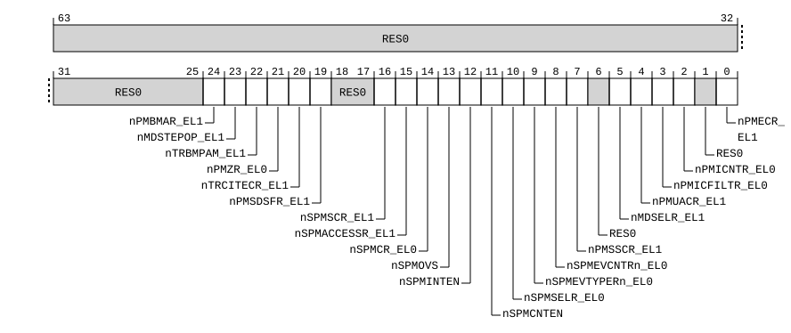

# ​D24.2.67 HDFGWTR2_EL2, Hypervisor Debug Fine-Grained Write Trap Register 2

Source: <https://developer.arm.com/documentation/ddi0487/mc/-Part-D-The-AArch64-System-Level-Architecture/-Chapter-D24-AArch64-System-Register-Descriptions/-D24-2-General-system-control-registers/-D24-2-67-HDFGWTR2-EL2--Hypervisor-Debug-Fine-Grained-Write-Trap-Register-2>

##### D24.2.67 HDFGWTR2\_EL2, Hypervisor Debug Fine-Grained Write Trap Register 2

The HDFGWTR2\_EL2 characteristics are:

Purpose
:   Provides controls for traps of `MSR` and `MCR` writes of debug, trace, PMU, and Statistical Profiling System registers.

Configuration
:   If EL2 is not implemented, this register is RES0 from EL3.

    This register is present only when FEAT\_FGT2 is implemented and FEAT\_AA64 is implemented. Otherwise, direct accesses to HDFGWTR2\_EL2 are UNDEFINED.

Attributes
:   HDFGWTR2\_EL2 is a 64-bit register.

###### Field descriptions



Bits [63:25]
:   Reserved, RES0.

nPMBMAR\_EL1, bit [24]
:   When FEAT\_SPE\_nVM is implemented:
    :   Trap `MSR` writes of [PMBMAR\_EL1](/documentation/ddi0487/mc/-Part-D-The-AArch64-System-Level-Architecture/-Chapter-D24-AArch64-System-Register-Descriptions/-D24-7-Statistical-Profiling-Extension-registers/-D24-7-3-PMBMAR-EL1--Profiling-Buffer-Memory-Attribute-Register?lang=en#reg_aarch64_pmbmar_el1) at EL1 using AArch64 to EL2.

<table>
 <colgroup>
  <col/>
  <col/>
 </colgroup>
 <thead>
  <tr>
   <th>
    <strong>
     nPMBMAR_EL1
    </strong>
   </th>
   <th>
    <strong>
     Meaning
    </strong>
   </th>
  </tr>
 </thead>
 <tbody>
  <tr>
   <td>
    <p>
     <code>
      0b0
     </code>
    </p>
   </td>
   <td>
    <p>
     If EL2 is implemented and enabled in the current Security state, then
     <code>
      MSR
     </code>
     writes of
     <a class="document-topic" document-topic-path="/ddi0487/mc/-Part-D-The-AArch64-System-Level-Architecture/-Chapter-D24-AArch64-System-Register-Descriptions/-D24-7-Statistical-Profiling-Extension-registers/-D24-7-3-PMBMAR-EL1--Profiling-Buffer-Memory-Attribute-Register?lang=en#reg_aarch64_pmbmar_el1" href="/documentation/ddi0487/mc/-Part-D-The-AArch64-System-Level-Architecture/-Chapter-D24-AArch64-System-Register-Descriptions/-D24-7-Statistical-Profiling-Extension-registers/-D24-7-3-PMBMAR-EL1--Profiling-Buffer-Memory-Attribute-Register?lang=en#reg_aarch64_pmbmar_el1">
      PMBMAR_EL1
     </a>
     at EL1 using AArch64 are trapped to EL2 and reported with EC syndrome value
     <code>
      0x18
     </code>
     , unless the write generates a higher priority exception.
    </p>
   </td>
  </tr>
  <tr>
   <td>
    <p>
     <code>
      0b1
     </code>
    </p>
   </td>
   <td>
    <p>
     <code>
      MSR
     </code>
     writes of
     <a class="document-topic" document-topic-path="/ddi0487/mc/-Part-D-The-AArch64-System-Level-Architecture/-Chapter-D24-AArch64-System-Register-Descriptions/-D24-7-Statistical-Profiling-Extension-registers/-D24-7-3-PMBMAR-EL1--Profiling-Buffer-Memory-Attribute-Register?lang=en#reg_aarch64_pmbmar_el1" href="/documentation/ddi0487/mc/-Part-D-The-AArch64-System-Level-Architecture/-Chapter-D24-AArch64-System-Register-Descriptions/-D24-7-Statistical-Profiling-Extension-registers/-D24-7-3-PMBMAR-EL1--Profiling-Buffer-Memory-Attribute-Register?lang=en#reg_aarch64_pmbmar_el1">
      PMBMAR_EL1
     </a>
     are not trapped by this mechanism.
    </p>
   </td>
  </tr>
 </tbody>
</table>

        This field is ignored by the PE and treated as zero when all of the following are true:

        - EL3 is implemented.
        - [SCR\_EL3](/documentation/ddi0487/mc/-Part-D-The-AArch64-System-Level-Architecture/-Chapter-D24-AArch64-System-Register-Descriptions/-D24-2-General-system-control-registers/-D24-2-168-SCR-EL3--Secure-Configuration-Register?lang=en#reg_aarch64_scr_el3).FGTEn2 == 0.

        The reset behavior of this field is:

        - On a Warm reset:
          - When the highest implemented Exception level is EL2, this field resets to `'0'`.
          - Otherwise, this field resets to an architecturally UNKNOWN value.

    Otherwise:
    :   Reserved, RES0.

nMDSTEPOP\_EL1, bit [23]
:   When FEAT\_STEP2 is implemented:
    :   Trap `MSR` writes of [MDSTEPOP\_EL1](/documentation/ddi0487/mc/-Part-D-The-AArch64-System-Level-Architecture/-Chapter-D24-AArch64-System-Register-Descriptions/-D24-3-Debug-System-registers/-D24-3-22-MDSTEPOP-EL1--Monitor-Debug-Step-Opcode-Register?lang=en#reg_aarch64_mdstepop_el1) at EL1 using AArch64 to EL2.

<table>
 <colgroup>
  <col/>
  <col/>
 </colgroup>
 <thead>
  <tr>
   <th>
    <strong>
     nMDSTEPOP_EL1
    </strong>
   </th>
   <th>
    <strong>
     Meaning
    </strong>
   </th>
  </tr>
 </thead>
 <tbody>
  <tr>
   <td>
    <p>
     <code>
      0b0
     </code>
    </p>
   </td>
   <td>
    <p>
     If EL2 is implemented and enabled in the current Security state, then
     <code>
      MSR
     </code>
     writes of
     <a class="document-topic" document-topic-path="/ddi0487/mc/-Part-D-The-AArch64-System-Level-Architecture/-Chapter-D24-AArch64-System-Register-Descriptions/-D24-3-Debug-System-registers/-D24-3-22-MDSTEPOP-EL1--Monitor-Debug-Step-Opcode-Register?lang=en#reg_aarch64_mdstepop_el1" href="/documentation/ddi0487/mc/-Part-D-The-AArch64-System-Level-Architecture/-Chapter-D24-AArch64-System-Register-Descriptions/-D24-3-Debug-System-registers/-D24-3-22-MDSTEPOP-EL1--Monitor-Debug-Step-Opcode-Register?lang=en#reg_aarch64_mdstepop_el1">
      MDSTEPOP_EL1
     </a>
     at EL1 using AArch64 are trapped to EL2 and reported with EC syndrome value
     <code>
      0x18
     </code>
     , unless the write generates a higher priority exception.
    </p>
   </td>
  </tr>
  <tr>
   <td>
    <p>
     <code>
      0b1
     </code>
    </p>
   </td>
   <td>
    <p>
     <code>
      MSR
     </code>
     writes of
     <a class="document-topic" document-topic-path="/ddi0487/mc/-Part-D-The-AArch64-System-Level-Architecture/-Chapter-D24-AArch64-System-Register-Descriptions/-D24-3-Debug-System-registers/-D24-3-22-MDSTEPOP-EL1--Monitor-Debug-Step-Opcode-Register?lang=en#reg_aarch64_mdstepop_el1" href="/documentation/ddi0487/mc/-Part-D-The-AArch64-System-Level-Architecture/-Chapter-D24-AArch64-System-Register-Descriptions/-D24-3-Debug-System-registers/-D24-3-22-MDSTEPOP-EL1--Monitor-Debug-Step-Opcode-Register?lang=en#reg_aarch64_mdstepop_el1">
      MDSTEPOP_EL1
     </a>
     are not trapped by this mechanism.
    </p>
   </td>
  </tr>
 </tbody>
</table>

        This field is ignored by the PE and treated as zero when all of the following are true:

        - EL3 is implemented.
        - [SCR\_EL3](/documentation/ddi0487/mc/-Part-D-The-AArch64-System-Level-Architecture/-Chapter-D24-AArch64-System-Register-Descriptions/-D24-2-General-system-control-registers/-D24-2-168-SCR-EL3--Secure-Configuration-Register?lang=en#reg_aarch64_scr_el3).FGTEn2 == 0.

        The reset behavior of this field is:

        - On a Warm reset:
          - When the highest implemented Exception level is EL2, this field resets to `'0'`.
          - Otherwise, this field resets to an architecturally UNKNOWN value.

    Otherwise:
    :   Reserved, RES0.

nTRBMPAM\_EL1, bit [22]
:   When FEAT\_TRBE\_MPAM is implemented:
    :   Trap `MSR` writes of [TRBMPAM\_EL1](/documentation/ddi0487/mc/-Part-D-The-AArch64-System-Level-Architecture/-Chapter-D24-AArch64-System-Register-Descriptions/-D24-4-Trace-registers/-D24-4-5-TRBMPAM-EL1--Trace-Buffer-MPAM-Configuration-Register?lang=en#reg_aarch64_trbmpam_el1) at EL1 using AArch64 to EL2.

<table>
 <colgroup>
  <col/>
  <col/>
 </colgroup>
 <thead>
  <tr>
   <th>
    <strong>
     nTRBMPAM_EL1
    </strong>
   </th>
   <th>
    <strong>
     Meaning
    </strong>
   </th>
  </tr>
 </thead>
 <tbody>
  <tr>
   <td>
    <p>
     <code>
      0b0
     </code>
    </p>
   </td>
   <td>
    <p>
     If EL2 is implemented and enabled in the current Security state, then
     <code>
      MSR
     </code>
     writes of
     <a class="document-topic" document-topic-path="/ddi0487/mc/-Part-D-The-AArch64-System-Level-Architecture/-Chapter-D24-AArch64-System-Register-Descriptions/-D24-4-Trace-registers/-D24-4-5-TRBMPAM-EL1--Trace-Buffer-MPAM-Configuration-Register?lang=en#reg_aarch64_trbmpam_el1" href="/documentation/ddi0487/mc/-Part-D-The-AArch64-System-Level-Architecture/-Chapter-D24-AArch64-System-Register-Descriptions/-D24-4-Trace-registers/-D24-4-5-TRBMPAM-EL1--Trace-Buffer-MPAM-Configuration-Register?lang=en#reg_aarch64_trbmpam_el1">
      TRBMPAM_EL1
     </a>
     at EL1 using AArch64 are trapped to EL2 and reported with EC syndrome value
     <code>
      0x18
     </code>
     , unless the write generates a higher priority exception.
    </p>
   </td>
  </tr>
  <tr>
   <td>
    <p>
     <code>
      0b1
     </code>
    </p>
   </td>
   <td>
    <p>
     <code>
      MSR
     </code>
     writes of
     <a class="document-topic" document-topic-path="/ddi0487/mc/-Part-D-The-AArch64-System-Level-Architecture/-Chapter-D24-AArch64-System-Register-Descriptions/-D24-4-Trace-registers/-D24-4-5-TRBMPAM-EL1--Trace-Buffer-MPAM-Configuration-Register?lang=en#reg_aarch64_trbmpam_el1" href="/documentation/ddi0487/mc/-Part-D-The-AArch64-System-Level-Architecture/-Chapter-D24-AArch64-System-Register-Descriptions/-D24-4-Trace-registers/-D24-4-5-TRBMPAM-EL1--Trace-Buffer-MPAM-Configuration-Register?lang=en#reg_aarch64_trbmpam_el1">
      TRBMPAM_EL1
     </a>
     are not trapped by this mechanism.
    </p>
   </td>
  </tr>
 </tbody>
</table>

        This field is ignored by the PE and treated as zero when all of the following are true:

        - EL3 is implemented.
        - [SCR\_EL3](/documentation/ddi0487/mc/-Part-D-The-AArch64-System-Level-Architecture/-Chapter-D24-AArch64-System-Register-Descriptions/-D24-2-General-system-control-registers/-D24-2-168-SCR-EL3--Secure-Configuration-Register?lang=en#reg_aarch64_scr_el3).FGTEn2 == 0.

        The reset behavior of this field is:

        - On a Warm reset:
          - When the highest implemented Exception level is EL2, this field resets to `'0'`.
          - Otherwise, this field resets to an architecturally UNKNOWN value.

    Otherwise:
    :   Reserved, RES0.

nPMZR\_EL0, bit [21]
:   When FEAT\_PMUv3p9 is implemented:
    :   Trap `MSR` writes of [PMZR\_EL0](/documentation/ddi0487/mc/-Part-D-The-AArch64-System-Level-Architecture/-Chapter-D24-AArch64-System-Register-Descriptions/-D24-5-Performance-Monitors-registers/-D24-5-28-PMZR-EL0--Performance-Monitors-Zero-with-Mask?lang=en#reg_aarch64_pmzr_el0) at EL1 and EL0 using AArch64 to EL2.

<table>
 <colgroup>
  <col/>
  <col/>
 </colgroup>
 <thead>
  <tr>
   <th>
    <strong>
     nPMZR_EL0
    </strong>
   </th>
   <th>
    <strong>
     Meaning
    </strong>
   </th>
  </tr>
 </thead>
 <tbody>
  <tr>
   <td>
    <p>
     <code>
      0b0
     </code>
    </p>
   </td>
   <td>
    <p>
     If EL2 is implemented and enabled in the current Security state, and the Effective value of
     <a class="document-topic" document-topic-path="/ddi0487/mc/-Part-D-The-AArch64-System-Level-Architecture/-Chapter-D24-AArch64-System-Register-Descriptions/-D24-2-General-system-control-registers/-D24-2-61-HCR-EL2--Hypervisor-Configuration-Register?lang=en#reg_aarch64_hcr_el2" href="/documentation/ddi0487/mc/-Part-D-The-AArch64-System-Level-Architecture/-Chapter-D24-AArch64-System-Register-Descriptions/-D24-2-General-system-control-registers/-D24-2-61-HCR-EL2--Hypervisor-Configuration-Register?lang=en#reg_aarch64_hcr_el2">
      HCR_EL2
     </a>
     .{E2H, TGE} is not {1, 1}, then
     <code>
      MSR
     </code>
     writes of
     <a class="document-topic" document-topic-path="/ddi0487/mc/-Part-D-The-AArch64-System-Level-Architecture/-Chapter-D24-AArch64-System-Register-Descriptions/-D24-5-Performance-Monitors-registers/-D24-5-28-PMZR-EL0--Performance-Monitors-Zero-with-Mask?lang=en#reg_aarch64_pmzr_el0" href="/documentation/ddi0487/mc/-Part-D-The-AArch64-System-Level-Architecture/-Chapter-D24-AArch64-System-Register-Descriptions/-D24-5-Performance-Monitors-registers/-D24-5-28-PMZR-EL0--Performance-Monitors-Zero-with-Mask?lang=en#reg_aarch64_pmzr_el0">
      PMZR_EL0
     </a>
     at EL1 and EL0 using AArch64 are trapped to EL2 and reported with EC syndrome value
     <code>
      0x18
     </code>
     , unless the write generates a higher priority exception.
    </p>
   </td>
  </tr>
  <tr>
   <td>
    <p>
     <code>
      0b1
     </code>
    </p>
   </td>
   <td>
    <p>
     <code>
      MSR
     </code>
     writes of
     <a class="document-topic" document-topic-path="/ddi0487/mc/-Part-D-The-AArch64-System-Level-Architecture/-Chapter-D24-AArch64-System-Register-Descriptions/-D24-5-Performance-Monitors-registers/-D24-5-28-PMZR-EL0--Performance-Monitors-Zero-with-Mask?lang=en#reg_aarch64_pmzr_el0" href="/documentation/ddi0487/mc/-Part-D-The-AArch64-System-Level-Architecture/-Chapter-D24-AArch64-System-Register-Descriptions/-D24-5-Performance-Monitors-registers/-D24-5-28-PMZR-EL0--Performance-Monitors-Zero-with-Mask?lang=en#reg_aarch64_pmzr_el0">
      PMZR_EL0
     </a>
     are not trapped by this mechanism.
    </p>
   </td>
  </tr>
 </tbody>
</table>

        This field is ignored by the PE and treated as zero when all of the following are true:

        - EL3 is implemented.
        - [SCR\_EL3](/documentation/ddi0487/mc/-Part-D-The-AArch64-System-Level-Architecture/-Chapter-D24-AArch64-System-Register-Descriptions/-D24-2-General-system-control-registers/-D24-2-168-SCR-EL3--Secure-Configuration-Register?lang=en#reg_aarch64_scr_el3).FGTEn2 == 0.

        The reset behavior of this field is:

        - On a Warm reset:
          - When the highest implemented Exception level is EL2, this field resets to `'0'`.
          - Otherwise, this field resets to an architecturally UNKNOWN value.

    Otherwise:
    :   Reserved, RES0.

nTRCITECR\_EL1, bit [20]
:   When FEAT\_ITE is implemented:
    :   Trap `MSR` writes of [TRCITECR\_EL1](/documentation/ddi0487/mc/-Part-D-The-AArch64-System-Level-Architecture/-Chapter-D24-AArch64-System-Register-Descriptions/-D24-4-Trace-registers/-D24-4-47-TRCITECR-EL1--Instrumentation-Trace-Control-Register--EL1-?lang=en#reg_aarch64_trcitecr_el1) at EL1 using AArch64 to EL2.

<table>
 <colgroup>
  <col/>
  <col/>
 </colgroup>
 <thead>
  <tr>
   <th>
    <strong>
     nTRCITECR_EL1
    </strong>
   </th>
   <th>
    <strong>
     Meaning
    </strong>
   </th>
  </tr>
 </thead>
 <tbody>
  <tr>
   <td>
    <p>
     <code>
      0b0
     </code>
    </p>
   </td>
   <td>
    <p>
     If EL2 is implemented and enabled in the current Security state, then
     <code>
      MSR
     </code>
     writes of
     <a class="document-topic" document-topic-path="/ddi0487/mc/-Part-D-The-AArch64-System-Level-Architecture/-Chapter-D24-AArch64-System-Register-Descriptions/-D24-4-Trace-registers/-D24-4-47-TRCITECR-EL1--Instrumentation-Trace-Control-Register--EL1-?lang=en#reg_aarch64_trcitecr_el1" href="/documentation/ddi0487/mc/-Part-D-The-AArch64-System-Level-Architecture/-Chapter-D24-AArch64-System-Register-Descriptions/-D24-4-Trace-registers/-D24-4-47-TRCITECR-EL1--Instrumentation-Trace-Control-Register--EL1-?lang=en#reg_aarch64_trcitecr_el1">
      TRCITECR_EL1
     </a>
     at EL1 using AArch64 are trapped to EL2 and reported with EC syndrome value
     <code>
      0x18
     </code>
     , unless the write generates a higher priority exception.
    </p>
   </td>
  </tr>
  <tr>
   <td>
    <p>
     <code>
      0b1
     </code>
    </p>
   </td>
   <td>
    <p>
     <code>
      MSR
     </code>
     writes of
     <a class="document-topic" document-topic-path="/ddi0487/mc/-Part-D-The-AArch64-System-Level-Architecture/-Chapter-D24-AArch64-System-Register-Descriptions/-D24-4-Trace-registers/-D24-4-47-TRCITECR-EL1--Instrumentation-Trace-Control-Register--EL1-?lang=en#reg_aarch64_trcitecr_el1" href="/documentation/ddi0487/mc/-Part-D-The-AArch64-System-Level-Architecture/-Chapter-D24-AArch64-System-Register-Descriptions/-D24-4-Trace-registers/-D24-4-47-TRCITECR-EL1--Instrumentation-Trace-Control-Register--EL1-?lang=en#reg_aarch64_trcitecr_el1">
      TRCITECR_EL1
     </a>
     are not trapped by this mechanism.
    </p>
   </td>
  </tr>
 </tbody>
</table>

        This field is ignored by the PE and treated as zero when all of the following are true:

        - EL3 is implemented.
        - [SCR\_EL3](/documentation/ddi0487/mc/-Part-D-The-AArch64-System-Level-Architecture/-Chapter-D24-AArch64-System-Register-Descriptions/-D24-2-General-system-control-registers/-D24-2-168-SCR-EL3--Secure-Configuration-Register?lang=en#reg_aarch64_scr_el3).FGTEn2 == 0.

        The reset behavior of this field is:

        - On a Warm reset:
          - When the highest implemented Exception level is EL2, this field resets to `'0'`.
          - Otherwise, this field resets to an architecturally UNKNOWN value.

    Otherwise:
    :   Reserved, RES0.

nPMSDSFR\_EL1, bit [19]
:   When FEAT\_SPE\_FDS is implemented:
    :   Trap `MSR` writes of [PMSDSFR\_EL1](/documentation/ddi0487/mc/-Part-D-The-AArch64-System-Level-Architecture/-Chapter-D24-AArch64-System-Register-Descriptions/-D24-7-Statistical-Profiling-Extension-registers/-D24-7-10-PMSDSFR-EL1--Sampling-Data-Source-Filter-Register?lang=en#reg_aarch64_pmsdsfr_el1) at EL1 using AArch64 to EL2.

<table>
 <colgroup>
  <col/>
  <col/>
 </colgroup>
 <thead>
  <tr>
   <th>
    <strong>
     nPMSDSFR_EL1
    </strong>
   </th>
   <th>
    <strong>
     Meaning
    </strong>
   </th>
  </tr>
 </thead>
 <tbody>
  <tr>
   <td>
    <p>
     <code>
      0b0
     </code>
    </p>
   </td>
   <td>
    <p>
     If EL2 is implemented and enabled in the current Security state, then
     <code>
      MSR
     </code>
     writes of
     <a class="document-topic" document-topic-path="/ddi0487/mc/-Part-D-The-AArch64-System-Level-Architecture/-Chapter-D24-AArch64-System-Register-Descriptions/-D24-7-Statistical-Profiling-Extension-registers/-D24-7-10-PMSDSFR-EL1--Sampling-Data-Source-Filter-Register?lang=en#reg_aarch64_pmsdsfr_el1" href="/documentation/ddi0487/mc/-Part-D-The-AArch64-System-Level-Architecture/-Chapter-D24-AArch64-System-Register-Descriptions/-D24-7-Statistical-Profiling-Extension-registers/-D24-7-10-PMSDSFR-EL1--Sampling-Data-Source-Filter-Register?lang=en#reg_aarch64_pmsdsfr_el1">
      PMSDSFR_EL1
     </a>
     at EL1 using AArch64 are trapped to EL2 and reported with EC syndrome value
     <code>
      0x18
     </code>
     , unless the write generates a higher priority exception.
    </p>
   </td>
  </tr>
  <tr>
   <td>
    <p>
     <code>
      0b1
     </code>
    </p>
   </td>
   <td>
    <p>
     <code>
      MSR
     </code>
     writes of
     <a class="document-topic" document-topic-path="/ddi0487/mc/-Part-D-The-AArch64-System-Level-Architecture/-Chapter-D24-AArch64-System-Register-Descriptions/-D24-7-Statistical-Profiling-Extension-registers/-D24-7-10-PMSDSFR-EL1--Sampling-Data-Source-Filter-Register?lang=en#reg_aarch64_pmsdsfr_el1" href="/documentation/ddi0487/mc/-Part-D-The-AArch64-System-Level-Architecture/-Chapter-D24-AArch64-System-Register-Descriptions/-D24-7-Statistical-Profiling-Extension-registers/-D24-7-10-PMSDSFR-EL1--Sampling-Data-Source-Filter-Register?lang=en#reg_aarch64_pmsdsfr_el1">
      PMSDSFR_EL1
     </a>
     are not trapped by this mechanism.
    </p>
   </td>
  </tr>
 </tbody>
</table>

        This field is ignored by the PE and treated as zero when all of the following are true:

        - EL3 is implemented.
        - [SCR\_EL3](/documentation/ddi0487/mc/-Part-D-The-AArch64-System-Level-Architecture/-Chapter-D24-AArch64-System-Register-Descriptions/-D24-2-General-system-control-registers/-D24-2-168-SCR-EL3--Secure-Configuration-Register?lang=en#reg_aarch64_scr_el3).FGTEn2 == 0.

        The reset behavior of this field is:

        - On a Warm reset:
          - When the highest implemented Exception level is EL2, this field resets to `'0'`.
          - Otherwise, this field resets to an architecturally UNKNOWN value.

    Otherwise:
    :   Reserved, RES0.

Bits [18:17]
:   Reserved, RES0.

nSPMSCR\_EL1, bit [16]
:   When FEAT\_SPMU is implemented:
    :   Trap `MSR` writes of [SPMSCR\_EL1](/documentation/ddi0487/mc/-Part-D-The-AArch64-System-Level-Architecture/-Chapter-D24-AArch64-System-Register-Descriptions/-D24-5-Performance-Monitors-registers/-D24-5-49-SPMSCR-EL1--System-Performance-Monitors-Secure-Control-Register?lang=en#reg_aarch64_spmscr_el1) at EL1 using AArch64 to EL2.

<table>
 <colgroup>
  <col/>
  <col/>
 </colgroup>
 <thead>
  <tr>
   <th>
    <strong>
     nSPMSCR_EL1
    </strong>
   </th>
   <th>
    <strong>
     Meaning
    </strong>
   </th>
  </tr>
 </thead>
 <tbody>
  <tr>
   <td>
    <p>
     <code>
      0b0
     </code>
    </p>
   </td>
   <td>
    <p>
     If EL2 is implemented and enabled in the current Security state, then
     <code>
      MSR
     </code>
     writes of
     <a class="document-topic" document-topic-path="/ddi0487/mc/-Part-D-The-AArch64-System-Level-Architecture/-Chapter-D24-AArch64-System-Register-Descriptions/-D24-5-Performance-Monitors-registers/-D24-5-49-SPMSCR-EL1--System-Performance-Monitors-Secure-Control-Register?lang=en#reg_aarch64_spmscr_el1" href="/documentation/ddi0487/mc/-Part-D-The-AArch64-System-Level-Architecture/-Chapter-D24-AArch64-System-Register-Descriptions/-D24-5-Performance-Monitors-registers/-D24-5-49-SPMSCR-EL1--System-Performance-Monitors-Secure-Control-Register?lang=en#reg_aarch64_spmscr_el1">
      SPMSCR_EL1
     </a>
     at EL1 using AArch64 are trapped to EL2 and reported with EC syndrome value
     <code>
      0x18
     </code>
     , unless the write generates a higher priority exception.
    </p>
   </td>
  </tr>
  <tr>
   <td>
    <p>
     <code>
      0b1
     </code>
    </p>
   </td>
   <td>
    <p>
     <code>
      MSR
     </code>
     writes of
     <a class="document-topic" document-topic-path="/ddi0487/mc/-Part-D-The-AArch64-System-Level-Architecture/-Chapter-D24-AArch64-System-Register-Descriptions/-D24-5-Performance-Monitors-registers/-D24-5-49-SPMSCR-EL1--System-Performance-Monitors-Secure-Control-Register?lang=en#reg_aarch64_spmscr_el1" href="/documentation/ddi0487/mc/-Part-D-The-AArch64-System-Level-Architecture/-Chapter-D24-AArch64-System-Register-Descriptions/-D24-5-Performance-Monitors-registers/-D24-5-49-SPMSCR-EL1--System-Performance-Monitors-Secure-Control-Register?lang=en#reg_aarch64_spmscr_el1">
      SPMSCR_EL1
     </a>
     are not trapped by this mechanism.
    </p>
   </td>
  </tr>
 </tbody>
</table>

        This field is ignored by the PE and treated as zero when all of the following are true:

        - EL3 is implemented.
        - [SCR\_EL3](/documentation/ddi0487/mc/-Part-D-The-AArch64-System-Level-Architecture/-Chapter-D24-AArch64-System-Register-Descriptions/-D24-2-General-system-control-registers/-D24-2-168-SCR-EL3--Secure-Configuration-Register?lang=en#reg_aarch64_scr_el3).FGTEn2 == 0.

        The reset behavior of this field is:

        - On a Warm reset:
          - When the highest implemented Exception level is EL2, this field resets to `'0'`.
          - Otherwise, this field resets to an architecturally UNKNOWN value.

    Otherwise:
    :   Reserved, RES0.

nSPMACCESSR\_EL1, bit [15]
:   When FEAT\_SPMU is implemented:
    :   Trap `MSR` writes of [SPMACCESSR\_EL1](/documentation/ddi0487/mc/-Part-D-The-AArch64-System-Level-Architecture/-Chapter-D24-AArch64-System-Register-Descriptions/-D24-5-Performance-Monitors-registers/-D24-5-29-SPMACCESSR-EL1--System-Performance-Monitors-Access-Register--EL1-?lang=en#reg_aarch64_spmaccessr_el1) at EL1 using AArch64 to EL2.

<table>
 <colgroup>
  <col/>
  <col/>
 </colgroup>
 <thead>
  <tr>
   <th>
    <strong>
     nSPMACCESSR_EL1
    </strong>
   </th>
   <th>
    <strong>
     Meaning
    </strong>
   </th>
  </tr>
 </thead>
 <tbody>
  <tr>
   <td>
    <p>
     <code>
      0b0
     </code>
    </p>
   </td>
   <td>
    <p>
     If EL2 is implemented and enabled in the current Security state, then
     <code>
      MSR
     </code>
     writes of
     <a class="document-topic" document-topic-path="/ddi0487/mc/-Part-D-The-AArch64-System-Level-Architecture/-Chapter-D24-AArch64-System-Register-Descriptions/-D24-5-Performance-Monitors-registers/-D24-5-29-SPMACCESSR-EL1--System-Performance-Monitors-Access-Register--EL1-?lang=en#reg_aarch64_spmaccessr_el1" href="/documentation/ddi0487/mc/-Part-D-The-AArch64-System-Level-Architecture/-Chapter-D24-AArch64-System-Register-Descriptions/-D24-5-Performance-Monitors-registers/-D24-5-29-SPMACCESSR-EL1--System-Performance-Monitors-Access-Register--EL1-?lang=en#reg_aarch64_spmaccessr_el1">
      SPMACCESSR_EL1
     </a>
     at EL1 using AArch64 are trapped to EL2 and reported with EC syndrome value
     <code>
      0x18
     </code>
     , unless the write generates a higher priority exception.
    </p>
   </td>
  </tr>
  <tr>
   <td>
    <p>
     <code>
      0b1
     </code>
    </p>
   </td>
   <td>
    <p>
     <code>
      MSR
     </code>
     writes of
     <a class="document-topic" document-topic-path="/ddi0487/mc/-Part-D-The-AArch64-System-Level-Architecture/-Chapter-D24-AArch64-System-Register-Descriptions/-D24-5-Performance-Monitors-registers/-D24-5-29-SPMACCESSR-EL1--System-Performance-Monitors-Access-Register--EL1-?lang=en#reg_aarch64_spmaccessr_el1" href="/documentation/ddi0487/mc/-Part-D-The-AArch64-System-Level-Architecture/-Chapter-D24-AArch64-System-Register-Descriptions/-D24-5-Performance-Monitors-registers/-D24-5-29-SPMACCESSR-EL1--System-Performance-Monitors-Access-Register--EL1-?lang=en#reg_aarch64_spmaccessr_el1">
      SPMACCESSR_EL1
     </a>
     are not trapped by this mechanism.
    </p>
   </td>
  </tr>
 </tbody>
</table>

        This field is ignored by the PE and treated as zero when all of the following are true:

        - EL3 is implemented.
        - [SCR\_EL3](/documentation/ddi0487/mc/-Part-D-The-AArch64-System-Level-Architecture/-Chapter-D24-AArch64-System-Register-Descriptions/-D24-2-General-system-control-registers/-D24-2-168-SCR-EL3--Secure-Configuration-Register?lang=en#reg_aarch64_scr_el3).FGTEn2 == 0.

        The reset behavior of this field is:

        - On a Warm reset:
          - When the highest implemented Exception level is EL2, this field resets to `'0'`.
          - Otherwise, this field resets to an architecturally UNKNOWN value.

    Otherwise:
    :   Reserved, RES0.

nSPMCR\_EL0, bit [14]
:   When FEAT\_SPMU is implemented:
    :   Trap `MSR` writes of [SPMCR\_EL0](/documentation/ddi0487/mc/-Part-D-The-AArch64-System-Level-Architecture/-Chapter-D24-AArch64-System-Register-Descriptions/-D24-5-Performance-Monitors-registers/-D24-5-36-SPMCR-EL0--System-Performance-Monitor-Control-Register?lang=en#reg_aarch64_spmcr_el0) at EL1 and EL0 using AArch64 to EL2.

<table>
 <colgroup>
  <col/>
  <col/>
 </colgroup>
 <thead>
  <tr>
   <th>
    <strong>
     nSPMCR_EL0
    </strong>
   </th>
   <th>
    <strong>
     Meaning
    </strong>
   </th>
  </tr>
 </thead>
 <tbody>
  <tr>
   <td>
    <p>
     <code>
      0b0
     </code>
    </p>
   </td>
   <td>
    <p>
     If EL2 is implemented and enabled in the current Security state, and the Effective value of
     <a class="document-topic" document-topic-path="/ddi0487/mc/-Part-D-The-AArch64-System-Level-Architecture/-Chapter-D24-AArch64-System-Register-Descriptions/-D24-2-General-system-control-registers/-D24-2-61-HCR-EL2--Hypervisor-Configuration-Register?lang=en#reg_aarch64_hcr_el2" href="/documentation/ddi0487/mc/-Part-D-The-AArch64-System-Level-Architecture/-Chapter-D24-AArch64-System-Register-Descriptions/-D24-2-General-system-control-registers/-D24-2-61-HCR-EL2--Hypervisor-Configuration-Register?lang=en#reg_aarch64_hcr_el2">
      HCR_EL2
     </a>
     .{E2H, TGE} is not {1, 1}, then
     <code>
      MSR
     </code>
     writes of
     <a class="document-topic" document-topic-path="/ddi0487/mc/-Part-D-The-AArch64-System-Level-Architecture/-Chapter-D24-AArch64-System-Register-Descriptions/-D24-5-Performance-Monitors-registers/-D24-5-36-SPMCR-EL0--System-Performance-Monitor-Control-Register?lang=en#reg_aarch64_spmcr_el0" href="/documentation/ddi0487/mc/-Part-D-The-AArch64-System-Level-Architecture/-Chapter-D24-AArch64-System-Register-Descriptions/-D24-5-Performance-Monitors-registers/-D24-5-36-SPMCR-EL0--System-Performance-Monitor-Control-Register?lang=en#reg_aarch64_spmcr_el0">
      SPMCR_EL0
     </a>
     at EL1 and EL0 using AArch64 are trapped to EL2 and reported with EC syndrome value
     <code>
      0x18
     </code>
     , unless the write generates a higher priority exception.
    </p>
   </td>
  </tr>
  <tr>
   <td>
    <p>
     <code>
      0b1
     </code>
    </p>
   </td>
   <td>
    <p>
     <code>
      MSR
     </code>
     writes of
     <a class="document-topic" document-topic-path="/ddi0487/mc/-Part-D-The-AArch64-System-Level-Architecture/-Chapter-D24-AArch64-System-Register-Descriptions/-D24-5-Performance-Monitors-registers/-D24-5-36-SPMCR-EL0--System-Performance-Monitor-Control-Register?lang=en#reg_aarch64_spmcr_el0" href="/documentation/ddi0487/mc/-Part-D-The-AArch64-System-Level-Architecture/-Chapter-D24-AArch64-System-Register-Descriptions/-D24-5-Performance-Monitors-registers/-D24-5-36-SPMCR-EL0--System-Performance-Monitor-Control-Register?lang=en#reg_aarch64_spmcr_el0">
      SPMCR_EL0
     </a>
     are not trapped by this mechanism.
    </p>
   </td>
  </tr>
 </tbody>
</table>

        This field is ignored by the PE and treated as zero when all of the following are true:

        - EL3 is implemented.
        - [SCR\_EL3](/documentation/ddi0487/mc/-Part-D-The-AArch64-System-Level-Architecture/-Chapter-D24-AArch64-System-Register-Descriptions/-D24-2-General-system-control-registers/-D24-2-168-SCR-EL3--Secure-Configuration-Register?lang=en#reg_aarch64_scr_el3).FGTEn2 == 0.

        The reset behavior of this field is:

        - On a Warm reset:
          - When the highest implemented Exception level is EL2, this field resets to `'0'`.
          - Otherwise, this field resets to an architecturally UNKNOWN value.

    Otherwise:
    :   Reserved, RES0.

nSPMOVS, bit [13]
:   When FEAT\_SPMU is implemented:
    :   Trap `MSR` writes at EL1 and EL0 using AArch64 of any of the following AArch64 System registers to EL2:

        - [SPMOVSCLR\_EL0](/documentation/ddi0487/mc/-Part-D-The-AArch64-System-Level-Architecture/-Chapter-D24-AArch64-System-Register-Descriptions/-D24-5-Performance-Monitors-registers/-D24-5-46-SPMOVSCLR-EL0--System-Performance-Monitors-Overflow-Flag-Status-Clear-Register?lang=en#reg_aarch64_spmovsclr_el0).
        - [SPMOVSSET\_EL0](/documentation/ddi0487/mc/-Part-D-The-AArch64-System-Level-Architecture/-Chapter-D24-AArch64-System-Register-Descriptions/-D24-5-Performance-Monitors-registers/-D24-5-47-SPMOVSSET-EL0--System-Performance-Monitors-Overflow-Flag-Status-Set-Register?lang=en#reg_aarch64_spmovsset_el0).

<table>
 <colgroup>
  <col/>
  <col/>
 </colgroup>
 <thead>
  <tr>
   <th>
    <strong>
     nSPMOVS
    </strong>
   </th>
   <th>
    <strong>
     Meaning
    </strong>
   </th>
  </tr>
 </thead>
 <tbody>
  <tr>
   <td>
    <p>
     <code>
      0b0
     </code>
    </p>
   </td>
   <td>
    <p>
     If EL2 is implemented and enabled in the current Security state, and the Effective value of
     <a class="document-topic" document-topic-path="/ddi0487/mc/-Part-D-The-AArch64-System-Level-Architecture/-Chapter-D24-AArch64-System-Register-Descriptions/-D24-2-General-system-control-registers/-D24-2-61-HCR-EL2--Hypervisor-Configuration-Register?lang=en#reg_aarch64_hcr_el2" href="/documentation/ddi0487/mc/-Part-D-The-AArch64-System-Level-Architecture/-Chapter-D24-AArch64-System-Register-Descriptions/-D24-2-General-system-control-registers/-D24-2-61-HCR-EL2--Hypervisor-Configuration-Register?lang=en#reg_aarch64_hcr_el2">
      HCR_EL2
     </a>
     .{E2H, TGE} is not {1, 1}, then
     <code>
      MSR
     </code>
     writes at EL1 and EL0 using AArch64 of any of the specified System registers are trapped to EL2 and reported with EC syndrome value
     <code>
      0x18
     </code>
     , unless the write generates a higher priority exception.
    </p>
   </td>
  </tr>
  <tr>
   <td>
    <p>
     <code>
      0b1
     </code>
    </p>
   </td>
   <td>
    <p>
     <code>
      MSR
     </code>
     writes of the specified System registers are not trapped by this mechanism.
    </p>
   </td>
  </tr>
 </tbody>
</table>

        This field is ignored by the PE and treated as zero when all of the following are true:

        - EL3 is implemented.
        - [SCR\_EL3](/documentation/ddi0487/mc/-Part-D-The-AArch64-System-Level-Architecture/-Chapter-D24-AArch64-System-Register-Descriptions/-D24-2-General-system-control-registers/-D24-2-168-SCR-EL3--Secure-Configuration-Register?lang=en#reg_aarch64_scr_el3).FGTEn2 == 0.

        The reset behavior of this field is:

        - On a Warm reset:
          - When the highest implemented Exception level is EL2, this field resets to `'0'`.
          - Otherwise, this field resets to an architecturally UNKNOWN value.

    Otherwise:
    :   Reserved, RES0.

nSPMINTEN, bit [12]
:   When FEAT\_SPMU is implemented:
    :   Trap `MSR` writes at EL1 using AArch64 of any of the following AArch64 System registers to EL2:

        - [SPMINTENCLR\_EL1](/documentation/ddi0487/mc/-Part-D-The-AArch64-System-Level-Architecture/-Chapter-D24-AArch64-System-Register-Descriptions/-D24-5-Performance-Monitors-registers/-D24-5-44-SPMINTENCLR-EL1--System-Performance-Monitors-Interrupt-Enable-Clear-Register?lang=en#reg_aarch64_spmintenclr_el1).
        - [SPMINTENSET\_EL1](/documentation/ddi0487/mc/-Part-D-The-AArch64-System-Level-Architecture/-Chapter-D24-AArch64-System-Register-Descriptions/-D24-5-Performance-Monitors-registers/-D24-5-45-SPMINTENSET-EL1--System-Performance-Monitors-Interrupt-Enable-Set-Register?lang=en#reg_aarch64_spmintenset_el1).

<table>
 <colgroup>
  <col/>
  <col/>
 </colgroup>
 <thead>
  <tr>
   <th>
    <strong>
     nSPMINTEN
    </strong>
   </th>
   <th>
    <strong>
     Meaning
    </strong>
   </th>
  </tr>
 </thead>
 <tbody>
  <tr>
   <td>
    <p>
     <code>
      0b0
     </code>
    </p>
   </td>
   <td>
    <p>
     If EL2 is implemented and enabled in the current Security state, then
     <code>
      MSR
     </code>
     writes at EL1 using AArch64 of any of the specified System registers are trapped to EL2 and reported with EC syndrome value
     <code>
      0x18
     </code>
     , unless the write generates a higher priority exception.
    </p>
   </td>
  </tr>
  <tr>
   <td>
    <p>
     <code>
      0b1
     </code>
    </p>
   </td>
   <td>
    <p>
     <code>
      MSR
     </code>
     writes of the specified System registers are not trapped by this mechanism.
    </p>
   </td>
  </tr>
 </tbody>
</table>

        This field is ignored by the PE and treated as zero when all of the following are true:

        - EL3 is implemented.
        - [SCR\_EL3](/documentation/ddi0487/mc/-Part-D-The-AArch64-System-Level-Architecture/-Chapter-D24-AArch64-System-Register-Descriptions/-D24-2-General-system-control-registers/-D24-2-168-SCR-EL3--Secure-Configuration-Register?lang=en#reg_aarch64_scr_el3).FGTEn2 == 0.

        The reset behavior of this field is:

        - On a Warm reset:
          - When the highest implemented Exception level is EL2, this field resets to `'0'`.
          - Otherwise, this field resets to an architecturally UNKNOWN value.

    Otherwise:
    :   Reserved, RES0.

nSPMCNTEN, bit [11]
:   When FEAT\_SPMU is implemented:
    :   Trap `MSR` writes at EL1 and EL0 using AArch64 of any of the following AArch64 System registers to EL2:

        - [SPMCNTENCLR\_EL0](/documentation/ddi0487/mc/-Part-D-The-AArch64-System-Level-Architecture/-Chapter-D24-AArch64-System-Register-Descriptions/-D24-5-Performance-Monitors-registers/-D24-5-34-SPMCNTENCLR-EL0--System-Performance-Monitors-Count-Enable-Clear-Register?lang=en#reg_aarch64_spmcntenclr_el0).
        - [SPMCNTENSET\_EL0](/documentation/ddi0487/mc/-Part-D-The-AArch64-System-Level-Architecture/-Chapter-D24-AArch64-System-Register-Descriptions/-D24-5-Performance-Monitors-registers/-D24-5-35-SPMCNTENSET-EL0--System-Performance-Monitors-Count-Enable-Set-Register?lang=en#reg_aarch64_spmcntenset_el0).

<table>
 <colgroup>
  <col/>
  <col/>
 </colgroup>
 <thead>
  <tr>
   <th>
    <strong>
     nSPMCNTEN
    </strong>
   </th>
   <th>
    <strong>
     Meaning
    </strong>
   </th>
  </tr>
 </thead>
 <tbody>
  <tr>
   <td>
    <p>
     <code>
      0b0
     </code>
    </p>
   </td>
   <td>
    <p>
     If EL2 is implemented and enabled in the current Security state, and the Effective value of
     <a class="document-topic" document-topic-path="/ddi0487/mc/-Part-D-The-AArch64-System-Level-Architecture/-Chapter-D24-AArch64-System-Register-Descriptions/-D24-2-General-system-control-registers/-D24-2-61-HCR-EL2--Hypervisor-Configuration-Register?lang=en#reg_aarch64_hcr_el2" href="/documentation/ddi0487/mc/-Part-D-The-AArch64-System-Level-Architecture/-Chapter-D24-AArch64-System-Register-Descriptions/-D24-2-General-system-control-registers/-D24-2-61-HCR-EL2--Hypervisor-Configuration-Register?lang=en#reg_aarch64_hcr_el2">
      HCR_EL2
     </a>
     .{E2H, TGE} is not {1, 1}, then
     <code>
      MSR
     </code>
     writes at EL1 and EL0 using AArch64 of any of the specified System registers are trapped to EL2 and reported with EC syndrome value
     <code>
      0x18
     </code>
     , unless the write generates a higher priority exception.
    </p>
   </td>
  </tr>
  <tr>
   <td>
    <p>
     <code>
      0b1
     </code>
    </p>
   </td>
   <td>
    <p>
     <code>
      MSR
     </code>
     writes of the specified System registers are not trapped by this mechanism.
    </p>
   </td>
  </tr>
 </tbody>
</table>

        This field is ignored by the PE and treated as zero when all of the following are true:

        - EL3 is implemented.
        - [SCR\_EL3](/documentation/ddi0487/mc/-Part-D-The-AArch64-System-Level-Architecture/-Chapter-D24-AArch64-System-Register-Descriptions/-D24-2-General-system-control-registers/-D24-2-168-SCR-EL3--Secure-Configuration-Register?lang=en#reg_aarch64_scr_el3).FGTEn2 == 0.

        The reset behavior of this field is:

        - On a Warm reset:
          - When the highest implemented Exception level is EL2, this field resets to `'0'`.
          - Otherwise, this field resets to an architecturally UNKNOWN value.

    Otherwise:
    :   Reserved, RES0.

nSPMSELR\_EL0, bit [10]
:   When FEAT\_SPMU is implemented:
    :   Trap `MSR` writes of [SPMSELR\_EL0](/documentation/ddi0487/mc/-Part-D-The-AArch64-System-Level-Architecture/-Chapter-D24-AArch64-System-Register-Descriptions/-D24-5-Performance-Monitors-registers/-D24-5-50-SPMSELR-EL0--System-Performance-Monitors-Select-Register?lang=en#reg_aarch64_spmselr_el0) at EL1 and EL0 using AArch64 to EL2.

<table>
 <colgroup>
  <col/>
  <col/>
 </colgroup>
 <thead>
  <tr>
   <th>
    <strong>
     nSPMSELR_EL0
    </strong>
   </th>
   <th>
    <strong>
     Meaning
    </strong>
   </th>
  </tr>
 </thead>
 <tbody>
  <tr>
   <td>
    <p>
     <code>
      0b0
     </code>
    </p>
   </td>
   <td>
    <p>
     If EL2 is implemented and enabled in the current Security state, and the Effective value of
     <a class="document-topic" document-topic-path="/ddi0487/mc/-Part-D-The-AArch64-System-Level-Architecture/-Chapter-D24-AArch64-System-Register-Descriptions/-D24-2-General-system-control-registers/-D24-2-61-HCR-EL2--Hypervisor-Configuration-Register?lang=en#reg_aarch64_hcr_el2" href="/documentation/ddi0487/mc/-Part-D-The-AArch64-System-Level-Architecture/-Chapter-D24-AArch64-System-Register-Descriptions/-D24-2-General-system-control-registers/-D24-2-61-HCR-EL2--Hypervisor-Configuration-Register?lang=en#reg_aarch64_hcr_el2">
      HCR_EL2
     </a>
     .{E2H, TGE} is not {1, 1}, then
     <code>
      MSR
     </code>
     writes of
     <a class="document-topic" document-topic-path="/ddi0487/mc/-Part-D-The-AArch64-System-Level-Architecture/-Chapter-D24-AArch64-System-Register-Descriptions/-D24-5-Performance-Monitors-registers/-D24-5-50-SPMSELR-EL0--System-Performance-Monitors-Select-Register?lang=en#reg_aarch64_spmselr_el0" href="/documentation/ddi0487/mc/-Part-D-The-AArch64-System-Level-Architecture/-Chapter-D24-AArch64-System-Register-Descriptions/-D24-5-Performance-Monitors-registers/-D24-5-50-SPMSELR-EL0--System-Performance-Monitors-Select-Register?lang=en#reg_aarch64_spmselr_el0">
      SPMSELR_EL0
     </a>
     at EL1 and EL0 using AArch64 are trapped to EL2 and reported with EC syndrome value
     <code>
      0x18
     </code>
     , unless the write generates a higher priority exception.
    </p>
   </td>
  </tr>
  <tr>
   <td>
    <p>
     <code>
      0b1
     </code>
    </p>
   </td>
   <td>
    <p>
     <code>
      MSR
     </code>
     writes of
     <a class="document-topic" document-topic-path="/ddi0487/mc/-Part-D-The-AArch64-System-Level-Architecture/-Chapter-D24-AArch64-System-Register-Descriptions/-D24-5-Performance-Monitors-registers/-D24-5-50-SPMSELR-EL0--System-Performance-Monitors-Select-Register?lang=en#reg_aarch64_spmselr_el0" href="/documentation/ddi0487/mc/-Part-D-The-AArch64-System-Level-Architecture/-Chapter-D24-AArch64-System-Register-Descriptions/-D24-5-Performance-Monitors-registers/-D24-5-50-SPMSELR-EL0--System-Performance-Monitors-Select-Register?lang=en#reg_aarch64_spmselr_el0">
      SPMSELR_EL0
     </a>
     are not trapped by this mechanism.
    </p>
   </td>
  </tr>
 </tbody>
</table>

        This field is ignored by the PE and treated as zero when all of the following are true:

        - EL3 is implemented.
        - [SCR\_EL3](/documentation/ddi0487/mc/-Part-D-The-AArch64-System-Level-Architecture/-Chapter-D24-AArch64-System-Register-Descriptions/-D24-2-General-system-control-registers/-D24-2-168-SCR-EL3--Secure-Configuration-Register?lang=en#reg_aarch64_scr_el3).FGTEn2 == 0.

        The reset behavior of this field is:

        - On a Warm reset:
          - When the highest implemented Exception level is EL2, this field resets to `'0'`.
          - Otherwise, this field resets to an architecturally UNKNOWN value.

    Otherwise:
    :   Reserved, RES0.

nSPMEVTYPERn\_EL0, bit [9]
:   When FEAT\_SPMU is implemented:
    :   Trap `MSR` writes at EL1 and EL0 using AArch64 of any of the following AArch64 System registers to EL2:

        - [SPMEVTYPER<n>\_EL0](/documentation/ddi0487/mc/-Part-D-The-AArch64-System-Level-Architecture/-Chapter-D24-AArch64-System-Register-Descriptions/-D24-5-Performance-Monitors-registers/-D24-5-42-SPMEVTYPER-n--EL0--System-Performance-Monitors-Event-Type-Register--n---0---63?lang=en#reg_aarch64_spmevtypern_el0).
        - [SPMEVFILTR<n>\_EL0](/documentation/ddi0487/mc/-Part-D-The-AArch64-System-Level-Architecture/-Chapter-D24-AArch64-System-Register-Descriptions/-D24-5-Performance-Monitors-registers/-D24-5-41-SPMEVFILTR-n--EL0--System-Performance-Monitors-Event-Filter-Control-Register--n---0---63?lang=en#reg_aarch64_spmevfiltrn_el0).
        - [SPMEVFILT2R<n>\_EL0](/documentation/ddi0487/mc/-Part-D-The-AArch64-System-Level-Architecture/-Chapter-D24-AArch64-System-Register-Descriptions/-D24-5-Performance-Monitors-registers/-D24-5-40-SPMEVFILT2R-n--EL0--System-Performance-Monitors-Event-Filter-Control-Register-2--n---0---63?lang=en#reg_aarch64_spmevfilt2rn_el0).

<table>
 <colgroup>
  <col/>
  <col/>
 </colgroup>
 <thead>
  <tr>
   <th>
    <strong>
     nSPMEVTYPERn_EL0
    </strong>
   </th>
   <th>
    <strong>
     Meaning
    </strong>
   </th>
  </tr>
 </thead>
 <tbody>
  <tr>
   <td>
    <p>
     <code>
      0b0
     </code>
    </p>
   </td>
   <td>
    <p>
     If EL2 is implemented and enabled in the current Security state, and the Effective value of
     <a class="document-topic" document-topic-path="/ddi0487/mc/-Part-D-The-AArch64-System-Level-Architecture/-Chapter-D24-AArch64-System-Register-Descriptions/-D24-2-General-system-control-registers/-D24-2-61-HCR-EL2--Hypervisor-Configuration-Register?lang=en#reg_aarch64_hcr_el2" href="/documentation/ddi0487/mc/-Part-D-The-AArch64-System-Level-Architecture/-Chapter-D24-AArch64-System-Register-Descriptions/-D24-2-General-system-control-registers/-D24-2-61-HCR-EL2--Hypervisor-Configuration-Register?lang=en#reg_aarch64_hcr_el2">
      HCR_EL2
     </a>
     .{E2H, TGE} is not {1, 1}, then
     <code>
      MSR
     </code>
     writes at EL1 and EL0 using AArch64 of any of the specified System registers are trapped to EL2 and reported with EC syndrome value
     <code>
      0x18
     </code>
     , unless the write generates a higher priority exception.
    </p>
   </td>
  </tr>
  <tr>
   <td>
    <p>
     <code>
      0b1
     </code>
    </p>
   </td>
   <td>
    <p>
     <code>
      MSR
     </code>
     writes of the specified System registers are not trapped by this mechanism.
    </p>
   </td>
  </tr>
 </tbody>
</table>

        This field is ignored by the PE and treated as zero when all of the following are true:

        - EL3 is implemented.
        - [SCR\_EL3](/documentation/ddi0487/mc/-Part-D-The-AArch64-System-Level-Architecture/-Chapter-D24-AArch64-System-Register-Descriptions/-D24-2-General-system-control-registers/-D24-2-168-SCR-EL3--Secure-Configuration-Register?lang=en#reg_aarch64_scr_el3).FGTEn2 == 0.

        The reset behavior of this field is:

        - On a Warm reset:
          - When the highest implemented Exception level is EL2, this field resets to `'0'`.
          - Otherwise, this field resets to an architecturally UNKNOWN value.

    Otherwise:
    :   Reserved, RES0.

nSPMEVCNTRn\_EL0, bit [8]
:   When FEAT\_SPMU is implemented:
    :   Trap `MSR` writes at EL1 and EL0 using AArch64 of any of the following AArch64 System registers to EL2:

        - [SPMEVCNTR<n>\_EL0](/documentation/ddi0487/mc/-Part-D-The-AArch64-System-Level-Architecture/-Chapter-D24-AArch64-System-Register-Descriptions/-D24-5-Performance-Monitors-registers/-D24-5-39-SPMEVCNTR-n--EL0--System-Performance-Monitors-Event-Count-Register--n---0---63?lang=en#reg_aarch64_spmevcntrn_el0).
        - [SPMZR\_EL0](/documentation/ddi0487/mc/-Part-D-The-AArch64-System-Level-Architecture/-Chapter-D24-AArch64-System-Register-Descriptions/-D24-5-Performance-Monitors-registers/-D24-5-51-SPMZR-EL0--System-Performance-Monitors-Zero-with-Mask?lang=en#reg_aarch64_spmzr_el0).

<table>
 <colgroup>
  <col/>
  <col/>
 </colgroup>
 <thead>
  <tr>
   <th>
    <strong>
     nSPMEVCNTRn_EL0
    </strong>
   </th>
   <th>
    <strong>
     Meaning
    </strong>
   </th>
  </tr>
 </thead>
 <tbody>
  <tr>
   <td>
    <p>
     <code>
      0b0
     </code>
    </p>
   </td>
   <td>
    <p>
     If EL2 is implemented and enabled in the current Security state, and the Effective value of
     <a class="document-topic" document-topic-path="/ddi0487/mc/-Part-D-The-AArch64-System-Level-Architecture/-Chapter-D24-AArch64-System-Register-Descriptions/-D24-2-General-system-control-registers/-D24-2-61-HCR-EL2--Hypervisor-Configuration-Register?lang=en#reg_aarch64_hcr_el2" href="/documentation/ddi0487/mc/-Part-D-The-AArch64-System-Level-Architecture/-Chapter-D24-AArch64-System-Register-Descriptions/-D24-2-General-system-control-registers/-D24-2-61-HCR-EL2--Hypervisor-Configuration-Register?lang=en#reg_aarch64_hcr_el2">
      HCR_EL2
     </a>
     .{E2H, TGE} is not {1, 1}, then
     <code>
      MSR
     </code>
     writes at EL1 and EL0 using AArch64 of any of the specified System registers are trapped to EL2 and reported with EC syndrome value
     <code>
      0x18
     </code>
     , unless the write generates a higher priority exception.
    </p>
   </td>
  </tr>
  <tr>
   <td>
    <p>
     <code>
      0b1
     </code>
    </p>
   </td>
   <td>
    <p>
     <code>
      MSR
     </code>
     writes of the specified System registers are not trapped by this mechanism.
    </p>
   </td>
  </tr>
 </tbody>
</table>

        This field is ignored by the PE and treated as zero when all of the following are true:

        - EL3 is implemented.
        - [SCR\_EL3](/documentation/ddi0487/mc/-Part-D-The-AArch64-System-Level-Architecture/-Chapter-D24-AArch64-System-Register-Descriptions/-D24-2-General-system-control-registers/-D24-2-168-SCR-EL3--Secure-Configuration-Register?lang=en#reg_aarch64_scr_el3).FGTEn2 == 0.

        The reset behavior of this field is:

        - On a Warm reset:
          - When the highest implemented Exception level is EL2, this field resets to `'0'`.
          - Otherwise, this field resets to an architecturally UNKNOWN value.

    Otherwise:
    :   Reserved, RES0.

nPMSSCR\_EL1, bit [7]
:   When FEAT\_PMUv3\_SS is implemented:
    :   Trap `MSR` writes of [PMSSCR\_EL1](/documentation/ddi0487/mc/-Part-D-The-AArch64-System-Level-Architecture/-Chapter-D24-AArch64-System-Register-Descriptions/-D24-5-Performance-Monitors-registers/-D24-5-22-PMSSCR-EL1--Performance-Monitors-Snapshot-Status-and-Capture-Register?lang=en#reg_aarch64_pmsscr_el1) at EL1 using AArch64 to EL2.

<table>
 <colgroup>
  <col/>
  <col/>
 </colgroup>
 <thead>
  <tr>
   <th>
    <strong>
     nPMSSCR_EL1
    </strong>
   </th>
   <th>
    <strong>
     Meaning
    </strong>
   </th>
  </tr>
 </thead>
 <tbody>
  <tr>
   <td>
    <p>
     <code>
      0b0
     </code>
    </p>
   </td>
   <td>
    <p>
     If EL2 is implemented and enabled in the current Security state, then
     <code>
      MSR
     </code>
     writes of
     <a class="document-topic" document-topic-path="/ddi0487/mc/-Part-D-The-AArch64-System-Level-Architecture/-Chapter-D24-AArch64-System-Register-Descriptions/-D24-5-Performance-Monitors-registers/-D24-5-22-PMSSCR-EL1--Performance-Monitors-Snapshot-Status-and-Capture-Register?lang=en#reg_aarch64_pmsscr_el1" href="/documentation/ddi0487/mc/-Part-D-The-AArch64-System-Level-Architecture/-Chapter-D24-AArch64-System-Register-Descriptions/-D24-5-Performance-Monitors-registers/-D24-5-22-PMSSCR-EL1--Performance-Monitors-Snapshot-Status-and-Capture-Register?lang=en#reg_aarch64_pmsscr_el1">
      PMSSCR_EL1
     </a>
     at EL1 using AArch64 are trapped to EL2 and reported with EC syndrome value
     <code>
      0x18
     </code>
     , unless the write generates a higher priority exception.
    </p>
   </td>
  </tr>
  <tr>
   <td>
    <p>
     <code>
      0b1
     </code>
    </p>
   </td>
   <td>
    <p>
     <code>
      MSR
     </code>
     writes of
     <a class="document-topic" document-topic-path="/ddi0487/mc/-Part-D-The-AArch64-System-Level-Architecture/-Chapter-D24-AArch64-System-Register-Descriptions/-D24-5-Performance-Monitors-registers/-D24-5-22-PMSSCR-EL1--Performance-Monitors-Snapshot-Status-and-Capture-Register?lang=en#reg_aarch64_pmsscr_el1" href="/documentation/ddi0487/mc/-Part-D-The-AArch64-System-Level-Architecture/-Chapter-D24-AArch64-System-Register-Descriptions/-D24-5-Performance-Monitors-registers/-D24-5-22-PMSSCR-EL1--Performance-Monitors-Snapshot-Status-and-Capture-Register?lang=en#reg_aarch64_pmsscr_el1">
      PMSSCR_EL1
     </a>
     are not trapped by this mechanism.
    </p>
   </td>
  </tr>
 </tbody>
</table>

        This field is ignored by the PE and treated as zero when all of the following are true:

        - EL3 is implemented.
        - [SCR\_EL3](/documentation/ddi0487/mc/-Part-D-The-AArch64-System-Level-Architecture/-Chapter-D24-AArch64-System-Register-Descriptions/-D24-2-General-system-control-registers/-D24-2-168-SCR-EL3--Secure-Configuration-Register?lang=en#reg_aarch64_scr_el3).FGTEn2 == 0.

        The reset behavior of this field is:

        - On a Warm reset:
          - When the highest implemented Exception level is EL2, this field resets to `'0'`.
          - Otherwise, this field resets to an architecturally UNKNOWN value.

    Otherwise:
    :   Reserved, RES0.

Bit [6]
:   Reserved, RES0.

nMDSELR\_EL1, bit [5]
:   When FEAT\_Debugv8p9 is implemented:
    :   Trap `MSR` writes of [MDSELR\_EL1](/documentation/ddi0487/mc/-Part-D-The-AArch64-System-Level-Architecture/-Chapter-D24-AArch64-System-Register-Descriptions/-D24-3-Debug-System-registers/-D24-3-21-MDSELR-EL1--Breakpoint-and-Watchpoint-Selection-Register?lang=en#reg_aarch64_mdselr_el1) at EL1 using AArch64 to EL2.

<table>
 <colgroup>
  <col/>
  <col/>
 </colgroup>
 <thead>
  <tr>
   <th>
    <strong>
     nMDSELR_EL1
    </strong>
   </th>
   <th>
    <strong>
     Meaning
    </strong>
   </th>
  </tr>
 </thead>
 <tbody>
  <tr>
   <td>
    <p>
     <code>
      0b0
     </code>
    </p>
   </td>
   <td>
    <p>
     If EL2 is implemented and enabled in the current Security state, then
     <code>
      MSR
     </code>
     writes of
     <a class="document-topic" document-topic-path="/ddi0487/mc/-Part-D-The-AArch64-System-Level-Architecture/-Chapter-D24-AArch64-System-Register-Descriptions/-D24-3-Debug-System-registers/-D24-3-21-MDSELR-EL1--Breakpoint-and-Watchpoint-Selection-Register?lang=en#reg_aarch64_mdselr_el1" href="/documentation/ddi0487/mc/-Part-D-The-AArch64-System-Level-Architecture/-Chapter-D24-AArch64-System-Register-Descriptions/-D24-3-Debug-System-registers/-D24-3-21-MDSELR-EL1--Breakpoint-and-Watchpoint-Selection-Register?lang=en#reg_aarch64_mdselr_el1">
      MDSELR_EL1
     </a>
     at EL1 using AArch64 are trapped to EL2 and reported with EC syndrome value
     <code>
      0x18
     </code>
     , unless the write generates a higher priority exception.
    </p>
   </td>
  </tr>
  <tr>
   <td>
    <p>
     <code>
      0b1
     </code>
    </p>
   </td>
   <td>
    <p>
     <code>
      MSR
     </code>
     writes of
     <a class="document-topic" document-topic-path="/ddi0487/mc/-Part-D-The-AArch64-System-Level-Architecture/-Chapter-D24-AArch64-System-Register-Descriptions/-D24-3-Debug-System-registers/-D24-3-21-MDSELR-EL1--Breakpoint-and-Watchpoint-Selection-Register?lang=en#reg_aarch64_mdselr_el1" href="/documentation/ddi0487/mc/-Part-D-The-AArch64-System-Level-Architecture/-Chapter-D24-AArch64-System-Register-Descriptions/-D24-3-Debug-System-registers/-D24-3-21-MDSELR-EL1--Breakpoint-and-Watchpoint-Selection-Register?lang=en#reg_aarch64_mdselr_el1">
      MDSELR_EL1
     </a>
     are not trapped by this mechanism.
    </p>
   </td>
  </tr>
 </tbody>
</table>

        This field is ignored by the PE and treated as zero when all of the following are true:

        - EL3 is implemented.
        - [SCR\_EL3](/documentation/ddi0487/mc/-Part-D-The-AArch64-System-Level-Architecture/-Chapter-D24-AArch64-System-Register-Descriptions/-D24-2-General-system-control-registers/-D24-2-168-SCR-EL3--Secure-Configuration-Register?lang=en#reg_aarch64_scr_el3).FGTEn2 == 0.

        It is IMPLEMENTATION DEFINED whether this field is implemented or is RES0 when 16 or fewer breakpoints are implemented, 16 or fewer watchpoints are implemented, and [MDSELR\_EL1](/documentation/ddi0487/mc/-Part-D-The-AArch64-System-Level-Architecture/-Chapter-D24-AArch64-System-Register-Descriptions/-D24-3-Debug-System-registers/-D24-3-21-MDSELR-EL1--Breakpoint-and-Watchpoint-Selection-Register?lang=en#reg_aarch64_mdselr_el1) is implemented as RAZ/WI.

        The reset behavior of this field is:

        - On a Warm reset:
          - When the highest implemented Exception level is EL2, this field resets to `'0'`.
          - Otherwise, this field resets to an architecturally UNKNOWN value.

    Otherwise:
    :   Reserved, RES0.

nPMUACR\_EL1, bit [4]
:   When FEAT\_PMUv3p9 is implemented:
    :   Trap `MSR` writes of [PMUACR\_EL1](/documentation/ddi0487/mc/-Part-D-The-AArch64-System-Level-Architecture/-Chapter-D24-AArch64-System-Register-Descriptions/-D24-5-Performance-Monitors-registers/-D24-5-24-PMUACR-EL1--Performance-Monitors-User-Access-Control-Register?lang=en#reg_aarch64_pmuacr_el1) at EL1 using AArch64 to EL2.

<table>
 <colgroup>
  <col/>
  <col/>
 </colgroup>
 <thead>
  <tr>
   <th>
    <strong>
     nPMUACR_EL1
    </strong>
   </th>
   <th>
    <strong>
     Meaning
    </strong>
   </th>
  </tr>
 </thead>
 <tbody>
  <tr>
   <td>
    <p>
     <code>
      0b0
     </code>
    </p>
   </td>
   <td>
    <p>
     If EL2 is implemented and enabled in the current Security state, then
     <code>
      MSR
     </code>
     writes of
     <a class="document-topic" document-topic-path="/ddi0487/mc/-Part-D-The-AArch64-System-Level-Architecture/-Chapter-D24-AArch64-System-Register-Descriptions/-D24-5-Performance-Monitors-registers/-D24-5-24-PMUACR-EL1--Performance-Monitors-User-Access-Control-Register?lang=en#reg_aarch64_pmuacr_el1" href="/documentation/ddi0487/mc/-Part-D-The-AArch64-System-Level-Architecture/-Chapter-D24-AArch64-System-Register-Descriptions/-D24-5-Performance-Monitors-registers/-D24-5-24-PMUACR-EL1--Performance-Monitors-User-Access-Control-Register?lang=en#reg_aarch64_pmuacr_el1">
      PMUACR_EL1
     </a>
     at EL1 using AArch64 are trapped to EL2 and reported with EC syndrome value
     <code>
      0x18
     </code>
     , unless the write generates a higher priority exception.
    </p>
   </td>
  </tr>
  <tr>
   <td>
    <p>
     <code>
      0b1
     </code>
    </p>
   </td>
   <td>
    <p>
     <code>
      MSR
     </code>
     writes of
     <a class="document-topic" document-topic-path="/ddi0487/mc/-Part-D-The-AArch64-System-Level-Architecture/-Chapter-D24-AArch64-System-Register-Descriptions/-D24-5-Performance-Monitors-registers/-D24-5-24-PMUACR-EL1--Performance-Monitors-User-Access-Control-Register?lang=en#reg_aarch64_pmuacr_el1" href="/documentation/ddi0487/mc/-Part-D-The-AArch64-System-Level-Architecture/-Chapter-D24-AArch64-System-Register-Descriptions/-D24-5-Performance-Monitors-registers/-D24-5-24-PMUACR-EL1--Performance-Monitors-User-Access-Control-Register?lang=en#reg_aarch64_pmuacr_el1">
      PMUACR_EL1
     </a>
     are not trapped by this mechanism.
    </p>
   </td>
  </tr>
 </tbody>
</table>

        This field is ignored by the PE and treated as zero when all of the following are true:

        - EL3 is implemented.
        - [SCR\_EL3](/documentation/ddi0487/mc/-Part-D-The-AArch64-System-Level-Architecture/-Chapter-D24-AArch64-System-Register-Descriptions/-D24-2-General-system-control-registers/-D24-2-168-SCR-EL3--Secure-Configuration-Register?lang=en#reg_aarch64_scr_el3).FGTEn2 == 0.

        The reset behavior of this field is:

        - On a Warm reset:
          - When the highest implemented Exception level is EL2, this field resets to `'0'`.
          - Otherwise, this field resets to an architecturally UNKNOWN value.

    Otherwise:
    :   Reserved, RES0.

nPMICFILTR\_EL0, bit [3]
:   When FEAT\_PMUv3\_ICNTR is implemented:
    :   Trap `MSR` writes of [PMICFILTR\_EL0](/documentation/ddi0487/mc/-Part-D-The-AArch64-System-Level-Architecture/-Chapter-D24-AArch64-System-Register-Descriptions/-D24-5-Performance-Monitors-registers/-D24-5-13-PMICFILTR-EL0--Performance-Monitors-Instruction-Counter-Filter-Register?lang=en#reg_aarch64_pmicfiltr_el0) at EL1 and EL0 using AArch64 to EL2.

<table>
 <colgroup>
  <col/>
  <col/>
 </colgroup>
 <thead>
  <tr>
   <th>
    <strong>
     nPMICFILTR_EL0
    </strong>
   </th>
   <th>
    <strong>
     Meaning
    </strong>
   </th>
  </tr>
 </thead>
 <tbody>
  <tr>
   <td>
    <p>
     <code>
      0b0
     </code>
    </p>
   </td>
   <td>
    <p>
     If EL2 is implemented and enabled in the current Security state, and the Effective value of
     <a class="document-topic" document-topic-path="/ddi0487/mc/-Part-D-The-AArch64-System-Level-Architecture/-Chapter-D24-AArch64-System-Register-Descriptions/-D24-2-General-system-control-registers/-D24-2-61-HCR-EL2--Hypervisor-Configuration-Register?lang=en#reg_aarch64_hcr_el2" href="/documentation/ddi0487/mc/-Part-D-The-AArch64-System-Level-Architecture/-Chapter-D24-AArch64-System-Register-Descriptions/-D24-2-General-system-control-registers/-D24-2-61-HCR-EL2--Hypervisor-Configuration-Register?lang=en#reg_aarch64_hcr_el2">
      HCR_EL2
     </a>
     .{E2H, TGE} is not {1, 1}, then:
    </p>
    <ul>
     <li>
      <p>
       <code>
        MSR
       </code>
       writes of
       <a class="document-topic" document-topic-path="/ddi0487/mc/-Part-D-The-AArch64-System-Level-Architecture/-Chapter-D24-AArch64-System-Register-Descriptions/-D24-5-Performance-Monitors-registers/-D24-5-13-PMICFILTR-EL0--Performance-Monitors-Instruction-Counter-Filter-Register?lang=en#reg_aarch64_pmicfiltr_el0" href="/documentation/ddi0487/mc/-Part-D-The-AArch64-System-Level-Architecture/-Chapter-D24-AArch64-System-Register-Descriptions/-D24-5-Performance-Monitors-registers/-D24-5-13-PMICFILTR-EL0--Performance-Monitors-Instruction-Counter-Filter-Register?lang=en#reg_aarch64_pmicfiltr_el0">
        PMICFILTR_EL0
       </a>
       at EL1 and EL0 using AArch64 are trapped to EL2 and reported with EC syndrome value
       <code>
        0x18
       </code>
       , unless the write generates a higher priority exception.
      </p>
     </li>
     <li>
      <p>
       <a class="document-topic" document-topic-path="/ddi0487/mc/-Part-D-The-AArch64-System-Level-Architecture/-Chapter-D24-AArch64-System-Register-Descriptions/-D24-5-Performance-Monitors-registers/-D24-5-6-PMCNTENCLR-EL0--Performance-Monitors-Count-Enable-Clear-Register?lang=en#reg_aarch64_pmcntenclr_el0" href="/documentation/ddi0487/mc/-Part-D-The-AArch64-System-Level-Architecture/-Chapter-D24-AArch64-System-Register-Descriptions/-D24-5-Performance-Monitors-registers/-D24-5-6-PMCNTENCLR-EL0--Performance-Monitors-Count-Enable-Clear-Register?lang=en#reg_aarch64_pmcntenclr_el0">
        PMCNTENCLR_EL0
       </a>
       .F0,
       <a class="document-topic" document-topic-path="/ddi0487/mc/-Part-D-The-AArch64-System-Level-Architecture/-Chapter-D24-AArch64-System-Register-Descriptions/-D24-5-Performance-Monitors-registers/-D24-5-7-PMCNTENSET-EL0--Performance-Monitors-Count-Enable-Set-Register?lang=en#reg_aarch64_pmcntenset_el0" href="/documentation/ddi0487/mc/-Part-D-The-AArch64-System-Level-Architecture/-Chapter-D24-AArch64-System-Register-Descriptions/-D24-5-Performance-Monitors-registers/-D24-5-7-PMCNTENSET-EL0--Performance-Monitors-Count-Enable-Set-Register?lang=en#reg_aarch64_pmcntenset_el0">
        PMCNTENSET_EL0
       </a>
       .F0,
       <a class="document-topic" document-topic-path="/ddi0487/mc/-Part-D-The-AArch64-System-Level-Architecture/-Chapter-D24-AArch64-System-Register-Descriptions/-D24-5-Performance-Monitors-registers/-D24-5-19-PMOVSCLR-EL0--Performance-Monitors-Overflow-Flag-Status-Clear-Register?lang=en#reg_aarch64_pmovsclr_el0" href="/documentation/ddi0487/mc/-Part-D-The-AArch64-System-Level-Architecture/-Chapter-D24-AArch64-System-Register-Descriptions/-D24-5-Performance-Monitors-registers/-D24-5-19-PMOVSCLR-EL0--Performance-Monitors-Overflow-Flag-Status-Clear-Register?lang=en#reg_aarch64_pmovsclr_el0">
        PMOVSCLR_EL0
       </a>
       .F0, and
       <a class="document-topic" document-topic-path="/ddi0487/mc/-Part-D-The-AArch64-System-Level-Architecture/-Chapter-D24-AArch64-System-Register-Descriptions/-D24-5-Performance-Monitors-registers/-D24-5-20-PMOVSSET-EL0--Performance-Monitors-Overflow-Flag-Status-Set-Register?lang=en#reg_aarch64_pmovsset_el0" href="/documentation/ddi0487/mc/-Part-D-The-AArch64-System-Level-Architecture/-Chapter-D24-AArch64-System-Register-Descriptions/-D24-5-Performance-Monitors-registers/-D24-5-20-PMOVSSET-EL0--Performance-Monitors-Overflow-Flag-Status-Set-Register?lang=en#reg_aarch64_pmovsset_el0">
        PMOVSSET_EL0
       </a>
       .F0 ignore writes at EL1 and EL0.
      </p>
     </li>
     <li>
      <p>
       <a class="document-topic" document-topic-path="/ddi0487/mc/-Part-D-The-AArch64-System-Level-Architecture/-Chapter-D24-AArch64-System-Register-Descriptions/-D24-5-Performance-Monitors-registers/-D24-5-16-PMINTENCLR-EL1--Performance-Monitors-Interrupt-Enable-Clear-Register?lang=en#reg_aarch64_pmintenclr_el1" href="/documentation/ddi0487/mc/-Part-D-The-AArch64-System-Level-Architecture/-Chapter-D24-AArch64-System-Register-Descriptions/-D24-5-Performance-Monitors-registers/-D24-5-16-PMINTENCLR-EL1--Performance-Monitors-Interrupt-Enable-Clear-Register?lang=en#reg_aarch64_pmintenclr_el1">
        PMINTENCLR_EL1
       </a>
       .F0 and
       <a class="document-topic" document-topic-path="/ddi0487/mc/-Part-D-The-AArch64-System-Level-Architecture/-Chapter-D24-AArch64-System-Register-Descriptions/-D24-5-Performance-Monitors-registers/-D24-5-17-PMINTENSET-EL1--Performance-Monitors-Interrupt-Enable-Set-Register?lang=en#reg_aarch64_pmintenset_el1" href="/documentation/ddi0487/mc/-Part-D-The-AArch64-System-Level-Architecture/-Chapter-D24-AArch64-System-Register-Descriptions/-D24-5-Performance-Monitors-registers/-D24-5-17-PMINTENSET-EL1--Performance-Monitors-Interrupt-Enable-Set-Register?lang=en#reg_aarch64_pmintenset_el1">
        PMINTENSET_EL1
       </a>
       .F0 ignore writes at EL1.
      </p>
     </li>
    </ul>
   </td>
  </tr>
  <tr>
   <td>
    <p>
     <code>
      0b1
     </code>
    </p>
   </td>
   <td>
    <p>
     <code>
      MSR
     </code>
     writes of
     <a class="document-topic" document-topic-path="/ddi0487/mc/-Part-D-The-AArch64-System-Level-Architecture/-Chapter-D24-AArch64-System-Register-Descriptions/-D24-5-Performance-Monitors-registers/-D24-5-13-PMICFILTR-EL0--Performance-Monitors-Instruction-Counter-Filter-Register?lang=en#reg_aarch64_pmicfiltr_el0" href="/documentation/ddi0487/mc/-Part-D-The-AArch64-System-Level-Architecture/-Chapter-D24-AArch64-System-Register-Descriptions/-D24-5-Performance-Monitors-registers/-D24-5-13-PMICFILTR-EL0--Performance-Monitors-Instruction-Counter-Filter-Register?lang=en#reg_aarch64_pmicfiltr_el0">
      PMICFILTR_EL0
     </a>
     are not trapped by this mechanism.
    </p>
   </td>
  </tr>
 </tbody>
</table>

        This field is ignored by the PE and treated as zero when all of the following are true:

        - EL3 is implemented.
        - [SCR\_EL3](/documentation/ddi0487/mc/-Part-D-The-AArch64-System-Level-Architecture/-Chapter-D24-AArch64-System-Register-Descriptions/-D24-2-General-system-control-registers/-D24-2-168-SCR-EL3--Secure-Configuration-Register?lang=en#reg_aarch64_scr_el3).FGTEn2 == 0.

        The reset behavior of this field is:

        - On a Warm reset:
          - When the highest implemented Exception level is EL2, this field resets to `'0'`.
          - Otherwise, this field resets to an architecturally UNKNOWN value.

    Otherwise:
    :   Reserved, RES0.

nPMICNTR\_EL0, bit [2]
:   When FEAT\_PMUv3\_ICNTR is implemented:
    :   Trap `MSR` writes of [PMICNTR\_EL0](/documentation/ddi0487/mc/-Part-D-The-AArch64-System-Level-Architecture/-Chapter-D24-AArch64-System-Register-Descriptions/-D24-5-Performance-Monitors-registers/-D24-5-14-PMICNTR-EL0--Performance-Monitors-Instruction-Counter-Register?lang=en#reg_aarch64_pmicntr_el0) at EL1 and EL0 using AArch64 to EL2.

<table>
 <colgroup>
  <col/>
  <col/>
 </colgroup>
 <thead>
  <tr>
   <th>
    <strong>
     nPMICNTR_EL0
    </strong>
   </th>
   <th>
    <strong>
     Meaning
    </strong>
   </th>
  </tr>
 </thead>
 <tbody>
  <tr>
   <td>
    <p>
     <code>
      0b0
     </code>
    </p>
   </td>
   <td>
    <p>
     If EL2 is implemented and enabled in the current Security state, and the Effective value of
     <a class="document-topic" document-topic-path="/ddi0487/mc/-Part-D-The-AArch64-System-Level-Architecture/-Chapter-D24-AArch64-System-Register-Descriptions/-D24-2-General-system-control-registers/-D24-2-61-HCR-EL2--Hypervisor-Configuration-Register?lang=en#reg_aarch64_hcr_el2" href="/documentation/ddi0487/mc/-Part-D-The-AArch64-System-Level-Architecture/-Chapter-D24-AArch64-System-Register-Descriptions/-D24-2-General-system-control-registers/-D24-2-61-HCR-EL2--Hypervisor-Configuration-Register?lang=en#reg_aarch64_hcr_el2">
      HCR_EL2
     </a>
     .{E2H, TGE} is not {1, 1}, then:
    </p>
    <ul>
     <li>
      <p>
       <code>
        MSR
       </code>
       writes of
       <a class="document-topic" document-topic-path="/ddi0487/mc/-Part-D-The-AArch64-System-Level-Architecture/-Chapter-D24-AArch64-System-Register-Descriptions/-D24-5-Performance-Monitors-registers/-D24-5-14-PMICNTR-EL0--Performance-Monitors-Instruction-Counter-Register?lang=en#reg_aarch64_pmicntr_el0" href="/documentation/ddi0487/mc/-Part-D-The-AArch64-System-Level-Architecture/-Chapter-D24-AArch64-System-Register-Descriptions/-D24-5-Performance-Monitors-registers/-D24-5-14-PMICNTR-EL0--Performance-Monitors-Instruction-Counter-Register?lang=en#reg_aarch64_pmicntr_el0">
        PMICNTR_EL0
       </a>
       at EL1 and EL0 using AArch64 are trapped to EL2 and reported with EC syndrome value
       <code>
        0x18
       </code>
       , unless the write generates a higher priority exception.
      </p>
     </li>
     <li>
      <p>
       <a class="document-topic" document-topic-path="/ddi0487/mc/-Part-D-The-AArch64-System-Level-Architecture/-Chapter-D24-AArch64-System-Register-Descriptions/-D24-5-Performance-Monitors-registers/-D24-5-28-PMZR-EL0--Performance-Monitors-Zero-with-Mask?lang=en#reg_aarch64_pmzr_el0" href="/documentation/ddi0487/mc/-Part-D-The-AArch64-System-Level-Architecture/-Chapter-D24-AArch64-System-Register-Descriptions/-D24-5-Performance-Monitors-registers/-D24-5-28-PMZR-EL0--Performance-Monitors-Zero-with-Mask?lang=en#reg_aarch64_pmzr_el0">
        PMZR_EL0
       </a>
       .F0 ignores writes at EL1 and EL0.
      </p>
     </li>
    </ul>
   </td>
  </tr>
  <tr>
   <td>
    <p>
     <code>
      0b1
     </code>
    </p>
   </td>
   <td>
    <p>
     <code>
      MSR
     </code>
     writes of
     <a class="document-topic" document-topic-path="/ddi0487/mc/-Part-D-The-AArch64-System-Level-Architecture/-Chapter-D24-AArch64-System-Register-Descriptions/-D24-5-Performance-Monitors-registers/-D24-5-14-PMICNTR-EL0--Performance-Monitors-Instruction-Counter-Register?lang=en#reg_aarch64_pmicntr_el0" href="/documentation/ddi0487/mc/-Part-D-The-AArch64-System-Level-Architecture/-Chapter-D24-AArch64-System-Register-Descriptions/-D24-5-Performance-Monitors-registers/-D24-5-14-PMICNTR-EL0--Performance-Monitors-Instruction-Counter-Register?lang=en#reg_aarch64_pmicntr_el0">
      PMICNTR_EL0
     </a>
     are not trapped by this mechanism.
    </p>
   </td>
  </tr>
 </tbody>
</table>

        This field is ignored by the PE and treated as zero when all of the following are true:

        - EL3 is implemented.
        - [SCR\_EL3](/documentation/ddi0487/mc/-Part-D-The-AArch64-System-Level-Architecture/-Chapter-D24-AArch64-System-Register-Descriptions/-D24-2-General-system-control-registers/-D24-2-168-SCR-EL3--Secure-Configuration-Register?lang=en#reg_aarch64_scr_el3).FGTEn2 == 0.

        The reset behavior of this field is:

        - On a Warm reset:
          - When the highest implemented Exception level is EL2, this field resets to `'0'`.
          - Otherwise, this field resets to an architecturally UNKNOWN value.

    Otherwise:
    :   Reserved, RES0.

Bit [1]
:   Reserved, RES0.

nPMECR\_EL1, bit [0]
:   When FEAT\_EBEP is implemented or FEAT\_PMUv3\_SS is implemented:
    :   Trap `MSR` writes of [PMECR\_EL1](/documentation/ddi0487/mc/-Part-D-The-AArch64-System-Level-Architecture/-Chapter-D24-AArch64-System-Register-Descriptions/-D24-5-Performance-Monitors-registers/-D24-5-9-PMECR-EL1--Performance-Monitors-Extended-Control-Register--EL1-?lang=en#reg_aarch64_pmecr_el1) at EL1 using AArch64 to EL2.

<table>
 <colgroup>
  <col/>
  <col/>
 </colgroup>
 <thead>
  <tr>
   <th>
    <strong>
     nPMECR_EL1
    </strong>
   </th>
   <th>
    <strong>
     Meaning
    </strong>
   </th>
  </tr>
 </thead>
 <tbody>
  <tr>
   <td>
    <p>
     <code>
      0b0
     </code>
    </p>
   </td>
   <td>
    <p>
     If EL2 is implemented and enabled in the current Security state, then
     <code>
      MSR
     </code>
     writes of
     <a class="document-topic" document-topic-path="/ddi0487/mc/-Part-D-The-AArch64-System-Level-Architecture/-Chapter-D24-AArch64-System-Register-Descriptions/-D24-5-Performance-Monitors-registers/-D24-5-9-PMECR-EL1--Performance-Monitors-Extended-Control-Register--EL1-?lang=en#reg_aarch64_pmecr_el1" href="/documentation/ddi0487/mc/-Part-D-The-AArch64-System-Level-Architecture/-Chapter-D24-AArch64-System-Register-Descriptions/-D24-5-Performance-Monitors-registers/-D24-5-9-PMECR-EL1--Performance-Monitors-Extended-Control-Register--EL1-?lang=en#reg_aarch64_pmecr_el1">
      PMECR_EL1
     </a>
     at EL1 using AArch64 are trapped to EL2 and reported with EC syndrome value
     <code>
      0x18
     </code>
     , unless the write generates a higher priority exception.
    </p>
   </td>
  </tr>
  <tr>
   <td>
    <p>
     <code>
      0b1
     </code>
    </p>
   </td>
   <td>
    <p>
     <code>
      MSR
     </code>
     writes of
     <a class="document-topic" document-topic-path="/ddi0487/mc/-Part-D-The-AArch64-System-Level-Architecture/-Chapter-D24-AArch64-System-Register-Descriptions/-D24-5-Performance-Monitors-registers/-D24-5-9-PMECR-EL1--Performance-Monitors-Extended-Control-Register--EL1-?lang=en#reg_aarch64_pmecr_el1" href="/documentation/ddi0487/mc/-Part-D-The-AArch64-System-Level-Architecture/-Chapter-D24-AArch64-System-Register-Descriptions/-D24-5-Performance-Monitors-registers/-D24-5-9-PMECR-EL1--Performance-Monitors-Extended-Control-Register--EL1-?lang=en#reg_aarch64_pmecr_el1">
      PMECR_EL1
     </a>
     are not trapped by this mechanism.
    </p>
   </td>
  </tr>
 </tbody>
</table>

        This field is ignored by the PE and treated as zero when all of the following are true:

        - EL3 is implemented.
        - [SCR\_EL3](/documentation/ddi0487/mc/-Part-D-The-AArch64-System-Level-Architecture/-Chapter-D24-AArch64-System-Register-Descriptions/-D24-2-General-system-control-registers/-D24-2-168-SCR-EL3--Secure-Configuration-Register?lang=en#reg_aarch64_scr_el3).FGTEn2 == 0.

        The reset behavior of this field is:

        - On a Warm reset:
          - When the highest implemented Exception level is EL2, this field resets to `'0'`.
          - Otherwise, this field resets to an architecturally UNKNOWN value.

    Otherwise:
    :   Reserved, RES0.

###### Accessing HDFGWTR2\_EL2

Accesses to this register use the following encodings in the System register encoding space:

###### `MRS <Xt>, HDFGWTR2_EL2`

<table>
 <colgroup>
  <col/>
  <col/>
  <col/>
  <col/>
  <col/>
 </colgroup>
 <thead>
  <tr>
   <th>
    <strong>
     op0
    </strong>
   </th>
   <th>
    <strong>
     op1
    </strong>
   </th>
   <th>
    <strong>
     CRn
    </strong>
   </th>
   <th>
    <strong>
     CRm
    </strong>
   </th>
   <th>
    <strong>
     op2
    </strong>
   </th>
  </tr>
 </thead>
 <tbody>
  <tr>
   <td>
    <p>
     <code>
      0b11
     </code>
    </p>
   </td>
   <td>
    <p>
     <code>
      0b100
     </code>
    </p>
   </td>
   <td>
    <p>
     <code>
      0b0011
     </code>
    </p>
   </td>
   <td>
    <p>
     <code>
      0b0001
     </code>
    </p>
   </td>
   <td>
    <p>
     <code>
      0b001
     </code>
    </p>
   </td>
  </tr>
 </tbody>
</table>

```
if !(IsFeatureImplemented(FEAT_FGT2) && IsFeatureImplemented(FEAT_AA64)) then
    Undefined();
elsif HaveEL(EL3) && PSTATE.EL == EL2 && EL3SDDUndefPriority() && SCR_EL3().FGTEn2 == '0' then
    Undefined();
elsif PSTATE.EL == EL0 then
    Undefined();
elsif PSTATE.EL == EL1 then
    if EffectiveHCR_EL2_NVx() IN {'1x1'} then
        X{64}(t) = NVMem(0x1B0);
    elsif EffectiveHCR_EL2_NVx() IN {'xx1'} then
        AArch64_SystemAccessTrap(EL2, 0x18);
    else
        Undefined();
    end;
elsif PSTATE.EL == EL2 then
    if HaveEL(EL3) && SCR_EL3().FGTEn2 == '0' then
        if EL3SDDUndef() then
            Undefined();
        else
            AArch64_SystemAccessTrap(EL3, 0x18);
        end;
    else
        X{64}(t) = HDFGWTR2_EL2();
    end;
elsif PSTATE.EL == EL3 then
    X{64}(t) = HDFGWTR2_EL2();
end;
```

###### `MSR HDFGWTR2_EL2, <Xt>`

<table>
 <colgroup>
  <col/>
  <col/>
  <col/>
  <col/>
  <col/>
 </colgroup>
 <thead>
  <tr>
   <th>
    <strong>
     op0
    </strong>
   </th>
   <th>
    <strong>
     op1
    </strong>
   </th>
   <th>
    <strong>
     CRn
    </strong>
   </th>
   <th>
    <strong>
     CRm
    </strong>
   </th>
   <th>
    <strong>
     op2
    </strong>
   </th>
  </tr>
 </thead>
 <tbody>
  <tr>
   <td>
    <p>
     <code>
      0b11
     </code>
    </p>
   </td>
   <td>
    <p>
     <code>
      0b100
     </code>
    </p>
   </td>
   <td>
    <p>
     <code>
      0b0011
     </code>
    </p>
   </td>
   <td>
    <p>
     <code>
      0b0001
     </code>
    </p>
   </td>
   <td>
    <p>
     <code>
      0b001
     </code>
    </p>
   </td>
  </tr>
 </tbody>
</table>

```
if !(IsFeatureImplemented(FEAT_FGT2) && IsFeatureImplemented(FEAT_AA64)) then
    Undefined();
elsif HaveEL(EL3) && PSTATE.EL == EL2 && EL3SDDUndefPriority() && SCR_EL3().FGTEn2 == '0' then
    Undefined();
elsif PSTATE.EL == EL0 then
    Undefined();
elsif PSTATE.EL == EL1 then
    if EffectiveHCR_EL2_NVx() IN {'1x1'} then
        NVMem(0x1B0) = X{64}(t);
    elsif EffectiveHCR_EL2_NVx() IN {'xx1'} then
        AArch64_SystemAccessTrap(EL2, 0x18);
    else
        Undefined();
    end;
elsif PSTATE.EL == EL2 then
    if HaveEL(EL3) && SCR_EL3().FGTEn2 == '0' then
        if EL3SDDUndef() then
            Undefined();
        else
            AArch64_SystemAccessTrap(EL3, 0x18);
        end;
    else
        HDFGWTR2_EL2() = X{64}(t);
    end;
elsif PSTATE.EL == EL3 then
    HDFGWTR2_EL2() = X{64}(t);
end;
```
