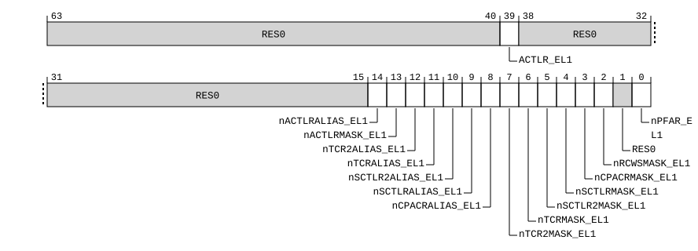

# ​D24.2.73 HFGWTR2_EL2, Hypervisor Fine-Grained Write Trap Register 2

Source: <https://developer.arm.com/documentation/ddi0487/mc/-Part-D-The-AArch64-System-Level-Architecture/-Chapter-D24-AArch64-System-Register-Descriptions/-D24-2-General-system-control-registers/-D24-2-73-HFGWTR2-EL2--Hypervisor-Fine-Grained-Write-Trap-Register-2>

##### D24.2.73 HFGWTR2\_EL2, Hypervisor Fine-Grained Write Trap Register 2

The HFGWTR2\_EL2 characteristics are:

Purpose
:   Provides controls for traps of `MSRR`, `MSR` and `MCR` writes of System registers.

Configuration
:   If EL2 is not implemented, this register is RES0 from EL3.

    This register is present only when FEAT\_FGT2 is implemented and FEAT\_AA64 is implemented. Otherwise, direct accesses to HFGWTR2\_EL2 are UNDEFINED.

Attributes
:   HFGWTR2\_EL2 is a 64-bit register.

###### Field descriptions



Bits [63:40]
:   Reserved, RES0.

ACTLR\_EL1, bit [39]
:   When FEAT\_SRMASK is implemented:
    :   Trap `MSR` writes of [ACTLR\_EL1](/documentation/ddi0487/mc/-Part-D-The-AArch64-System-Level-Architecture/-Chapter-D24-AArch64-System-Register-Descriptions/-D24-2-General-system-control-registers/-D24-2-2-ACTLR-EL1--Auxiliary-Control-Register--EL1-?lang=en#reg_aarch64_actlr_el1) at EL1 using AArch64 to EL2.

<table>
 <colgroup>
  <col/>
  <col/>
 </colgroup>
 <thead>
  <tr>
   <th>
    <strong>
     ACTLR_EL1
    </strong>
   </th>
   <th>
    <strong>
     Meaning
    </strong>
   </th>
  </tr>
 </thead>
 <tbody>
  <tr>
   <td>
    <p>
     <code>
      0b0
     </code>
    </p>
   </td>
   <td>
    <p>
     <code>
      MSR
     </code>
     writes of
     <a class="document-topic" document-topic-path="/ddi0487/mc/-Part-D-The-AArch64-System-Level-Architecture/-Chapter-D24-AArch64-System-Register-Descriptions/-D24-2-General-system-control-registers/-D24-2-2-ACTLR-EL1--Auxiliary-Control-Register--EL1-?lang=en#reg_aarch64_actlr_el1" href="/documentation/ddi0487/mc/-Part-D-The-AArch64-System-Level-Architecture/-Chapter-D24-AArch64-System-Register-Descriptions/-D24-2-General-system-control-registers/-D24-2-2-ACTLR-EL1--Auxiliary-Control-Register--EL1-?lang=en#reg_aarch64_actlr_el1">
      ACTLR_EL1
     </a>
     are not trapped by this mechanism.
    </p>
   </td>
  </tr>
  <tr>
   <td>
    <p>
     <code>
      0b1
     </code>
    </p>
   </td>
   <td>
    <p>
     If EL2 is implemented and enabled in the current Security state, then
     <code>
      MSR
     </code>
     writes of
     <a class="document-topic" document-topic-path="/ddi0487/mc/-Part-D-The-AArch64-System-Level-Architecture/-Chapter-D24-AArch64-System-Register-Descriptions/-D24-2-General-system-control-registers/-D24-2-2-ACTLR-EL1--Auxiliary-Control-Register--EL1-?lang=en#reg_aarch64_actlr_el1" href="/documentation/ddi0487/mc/-Part-D-The-AArch64-System-Level-Architecture/-Chapter-D24-AArch64-System-Register-Descriptions/-D24-2-General-system-control-registers/-D24-2-2-ACTLR-EL1--Auxiliary-Control-Register--EL1-?lang=en#reg_aarch64_actlr_el1">
      ACTLR_EL1
     </a>
     at EL1 using AArch64 are trapped to EL2 and reported with EC syndrome value
     <code>
      0x18
     </code>
     , unless the write generates a higher priority exception.
    </p>
   </td>
  </tr>
 </tbody>
</table>

        This field is ignored by the PE and treated as zero when all of the following are true:

        - EL3 is implemented.
        - [SCR\_EL3](/documentation/ddi0487/mc/-Part-D-The-AArch64-System-Level-Architecture/-Chapter-D24-AArch64-System-Register-Descriptions/-D24-2-General-system-control-registers/-D24-2-168-SCR-EL3--Secure-Configuration-Register?lang=en#reg_aarch64_scr_el3).FGTEn2 == 0.

        The reset behavior of this field is:

        - On a Warm reset:
          - When the highest implemented Exception level is EL2, this field resets to `'0'`.
          - Otherwise, this field resets to an architecturally UNKNOWN value.

    Otherwise:
    :   Reserved, RES0.

Bits [38:15]
:   Reserved, RES0.

nACTLRALIAS\_EL1, bit [14]
:   When FEAT\_SRMASK is implemented:
    :   Trap `MSR` writes of ACTLRALIAS\_EL1 at EL1 using AArch64 to EL2.

<table>
 <colgroup>
  <col/>
  <col/>
 </colgroup>
 <thead>
  <tr>
   <th>
    <strong>
     nACTLRALIAS_EL1
    </strong>
   </th>
   <th>
    <strong>
     Meaning
    </strong>
   </th>
  </tr>
 </thead>
 <tbody>
  <tr>
   <td>
    <p>
     <code>
      0b0
     </code>
    </p>
   </td>
   <td>
    <p>
     If EL2 is implemented and enabled in the current Security state, then
     <code>
      MSR
     </code>
     writes of ACTLRALIAS_EL1 at EL1 using AArch64 are trapped to EL2 and reported with EC syndrome value
     <code>
      0x18
     </code>
     , unless the write generates a higher priority exception.
    </p>
   </td>
  </tr>
  <tr>
   <td>
    <p>
     <code>
      0b1
     </code>
    </p>
   </td>
   <td>
    <p>
     <code>
      MSR
     </code>
     writes of ACTLRALIAS_EL1 are not trapped by this mechanism.
    </p>
   </td>
  </tr>
 </tbody>
</table>

        This field is ignored by the PE and treated as zero when all of the following are true:

        - EL3 is implemented.
        - [SCR\_EL3](/documentation/ddi0487/mc/-Part-D-The-AArch64-System-Level-Architecture/-Chapter-D24-AArch64-System-Register-Descriptions/-D24-2-General-system-control-registers/-D24-2-168-SCR-EL3--Secure-Configuration-Register?lang=en#reg_aarch64_scr_el3).FGTEn2 == 0.

        The reset behavior of this field is:

        - On a Warm reset:
          - When the highest implemented Exception level is EL2, this field resets to `'0'`.
          - Otherwise, this field resets to an architecturally UNKNOWN value.

    Otherwise:
    :   Reserved, RES0.

nACTLRMASK\_EL1, bit [13]
:   When FEAT\_SRMASK is implemented:
    :   Trap `MSR` writes of [ACTLRMASK\_EL1](/documentation/ddi0487/mc/-Part-D-The-AArch64-System-Level-Architecture/-Chapter-D24-AArch64-System-Register-Descriptions/-D24-2-General-system-control-registers/-D24-2-5-ACTLRMASK-EL1--Auxiliary-Control-Masking-Register--EL1-?lang=en#reg_aarch64_actlrmask_el1) at EL1 using AArch64 to EL2.

<table>
 <colgroup>
  <col/>
  <col/>
 </colgroup>
 <thead>
  <tr>
   <th>
    <strong>
     nACTLRMASK_EL1
    </strong>
   </th>
   <th>
    <strong>
     Meaning
    </strong>
   </th>
  </tr>
 </thead>
 <tbody>
  <tr>
   <td>
    <p>
     <code>
      0b0
     </code>
    </p>
   </td>
   <td>
    <p>
     If EL2 is implemented and enabled in the current Security state, then
     <code>
      MSR
     </code>
     writes of
     <a class="document-topic" document-topic-path="/ddi0487/mc/-Part-D-The-AArch64-System-Level-Architecture/-Chapter-D24-AArch64-System-Register-Descriptions/-D24-2-General-system-control-registers/-D24-2-5-ACTLRMASK-EL1--Auxiliary-Control-Masking-Register--EL1-?lang=en#reg_aarch64_actlrmask_el1" href="/documentation/ddi0487/mc/-Part-D-The-AArch64-System-Level-Architecture/-Chapter-D24-AArch64-System-Register-Descriptions/-D24-2-General-system-control-registers/-D24-2-5-ACTLRMASK-EL1--Auxiliary-Control-Masking-Register--EL1-?lang=en#reg_aarch64_actlrmask_el1">
      ACTLRMASK_EL1
     </a>
     at EL1 using AArch64 are trapped to EL2 and reported with EC syndrome value
     <code>
      0x18
     </code>
     , unless the write generates a higher priority exception.
    </p>
   </td>
  </tr>
  <tr>
   <td>
    <p>
     <code>
      0b1
     </code>
    </p>
   </td>
   <td>
    <p>
     <code>
      MSR
     </code>
     writes of
     <a class="document-topic" document-topic-path="/ddi0487/mc/-Part-D-The-AArch64-System-Level-Architecture/-Chapter-D24-AArch64-System-Register-Descriptions/-D24-2-General-system-control-registers/-D24-2-5-ACTLRMASK-EL1--Auxiliary-Control-Masking-Register--EL1-?lang=en#reg_aarch64_actlrmask_el1" href="/documentation/ddi0487/mc/-Part-D-The-AArch64-System-Level-Architecture/-Chapter-D24-AArch64-System-Register-Descriptions/-D24-2-General-system-control-registers/-D24-2-5-ACTLRMASK-EL1--Auxiliary-Control-Masking-Register--EL1-?lang=en#reg_aarch64_actlrmask_el1">
      ACTLRMASK_EL1
     </a>
     are not trapped by this mechanism.
    </p>
   </td>
  </tr>
 </tbody>
</table>

        This field is ignored by the PE and treated as zero when all of the following are true:

        - EL3 is implemented.
        - [SCR\_EL3](/documentation/ddi0487/mc/-Part-D-The-AArch64-System-Level-Architecture/-Chapter-D24-AArch64-System-Register-Descriptions/-D24-2-General-system-control-registers/-D24-2-168-SCR-EL3--Secure-Configuration-Register?lang=en#reg_aarch64_scr_el3).FGTEn2 == 0.

        The reset behavior of this field is:

        - On a Warm reset:
          - When the highest implemented Exception level is EL2, this field resets to `'0'`.
          - Otherwise, this field resets to an architecturally UNKNOWN value.

    Otherwise:
    :   Reserved, RES0.

nTCR2ALIAS\_EL1, bit [12]
:   When FEAT\_SRMASK is implemented:
    :   Trap `MSR` writes of TCR2ALIAS\_EL1 at EL1 using AArch64 to EL2.

<table>
 <colgroup>
  <col/>
  <col/>
 </colgroup>
 <thead>
  <tr>
   <th>
    <strong>
     nTCR2ALIAS_EL1
    </strong>
   </th>
   <th>
    <strong>
     Meaning
    </strong>
   </th>
  </tr>
 </thead>
 <tbody>
  <tr>
   <td>
    <p>
     <code>
      0b0
     </code>
    </p>
   </td>
   <td>
    <p>
     If EL2 is implemented and enabled in the current Security state, then
     <code>
      MSR
     </code>
     writes of TCR2ALIAS_EL1 at EL1 using AArch64 are trapped to EL2 and reported with EC syndrome value
     <code>
      0x18
     </code>
     , unless the write generates a higher priority exception.
    </p>
   </td>
  </tr>
  <tr>
   <td>
    <p>
     <code>
      0b1
     </code>
    </p>
   </td>
   <td>
    <p>
     <code>
      MSR
     </code>
     writes of TCR2ALIAS_EL1 are not trapped by this mechanism.
    </p>
   </td>
  </tr>
 </tbody>
</table>

        This field is ignored by the PE and treated as zero when all of the following are true:

        - EL3 is implemented.
        - [SCR\_EL3](/documentation/ddi0487/mc/-Part-D-The-AArch64-System-Level-Architecture/-Chapter-D24-AArch64-System-Register-Descriptions/-D24-2-General-system-control-registers/-D24-2-168-SCR-EL3--Secure-Configuration-Register?lang=en#reg_aarch64_scr_el3).FGTEn2 == 0.

        The reset behavior of this field is:

        - On a Warm reset:
          - When the highest implemented Exception level is EL2, this field resets to `'0'`.
          - Otherwise, this field resets to an architecturally UNKNOWN value.

    Otherwise:
    :   Reserved, RES0.

nTCRALIAS\_EL1, bit [11]
:   When FEAT\_SRMASK is implemented:
    :   Trap `MSR` writes of TCRALIAS\_EL1 at EL1 using AArch64 to EL2.

<table>
 <colgroup>
  <col/>
  <col/>
 </colgroup>
 <thead>
  <tr>
   <th>
    <strong>
     nTCRALIAS_EL1
    </strong>
   </th>
   <th>
    <strong>
     Meaning
    </strong>
   </th>
  </tr>
 </thead>
 <tbody>
  <tr>
   <td>
    <p>
     <code>
      0b0
     </code>
    </p>
   </td>
   <td>
    <p>
     If EL2 is implemented and enabled in the current Security state, then
     <code>
      MSR
     </code>
     writes of TCRALIAS_EL1 at EL1 using AArch64 are trapped to EL2 and reported with EC syndrome value
     <code>
      0x18
     </code>
     , unless the write generates a higher priority exception.
    </p>
   </td>
  </tr>
  <tr>
   <td>
    <p>
     <code>
      0b1
     </code>
    </p>
   </td>
   <td>
    <p>
     <code>
      MSR
     </code>
     writes of TCRALIAS_EL1 are not trapped by this mechanism.
    </p>
   </td>
  </tr>
 </tbody>
</table>

        This field is ignored by the PE and treated as zero when all of the following are true:

        - EL3 is implemented.
        - [SCR\_EL3](/documentation/ddi0487/mc/-Part-D-The-AArch64-System-Level-Architecture/-Chapter-D24-AArch64-System-Register-Descriptions/-D24-2-General-system-control-registers/-D24-2-168-SCR-EL3--Secure-Configuration-Register?lang=en#reg_aarch64_scr_el3).FGTEn2 == 0.

        The reset behavior of this field is:

        - On a Warm reset:
          - When the highest implemented Exception level is EL2, this field resets to `'0'`.
          - Otherwise, this field resets to an architecturally UNKNOWN value.

    Otherwise:
    :   Reserved, RES0.

nSCTLR2ALIAS\_EL1, bit [10]
:   When FEAT\_SRMASK is implemented:
    :   Trap `MSR` writes of SCTLR2ALIAS\_EL1 at EL1 using AArch64 to EL2.

<table>
 <colgroup>
  <col/>
  <col/>
 </colgroup>
 <thead>
  <tr>
   <th>
    <strong>
     nSCTLR2ALIAS_EL1
    </strong>
   </th>
   <th>
    <strong>
     Meaning
    </strong>
   </th>
  </tr>
 </thead>
 <tbody>
  <tr>
   <td>
    <p>
     <code>
      0b0
     </code>
    </p>
   </td>
   <td>
    <p>
     If EL2 is implemented and enabled in the current Security state, then
     <code>
      MSR
     </code>
     writes of SCTLR2ALIAS_EL1 at EL1 using AArch64 are trapped to EL2 and reported with EC syndrome value
     <code>
      0x18
     </code>
     , unless the write generates a higher priority exception.
    </p>
   </td>
  </tr>
  <tr>
   <td>
    <p>
     <code>
      0b1
     </code>
    </p>
   </td>
   <td>
    <p>
     <code>
      MSR
     </code>
     writes of SCTLR2ALIAS_EL1 are not trapped by this mechanism.
    </p>
   </td>
  </tr>
 </tbody>
</table>

        This field is ignored by the PE and treated as zero when all of the following are true:

        - EL3 is implemented.
        - [SCR\_EL3](/documentation/ddi0487/mc/-Part-D-The-AArch64-System-Level-Architecture/-Chapter-D24-AArch64-System-Register-Descriptions/-D24-2-General-system-control-registers/-D24-2-168-SCR-EL3--Secure-Configuration-Register?lang=en#reg_aarch64_scr_el3).FGTEn2 == 0.

        The reset behavior of this field is:

        - On a Warm reset:
          - When the highest implemented Exception level is EL2, this field resets to `'0'`.
          - Otherwise, this field resets to an architecturally UNKNOWN value.

    Otherwise:
    :   Reserved, RES0.

nSCTLRALIAS\_EL1, bit [9]
:   When FEAT\_SRMASK is implemented:
    :   Trap `MSR` writes of SCTLRALIAS\_EL1 at EL1 using AArch64 to EL2.

<table>
 <colgroup>
  <col/>
  <col/>
 </colgroup>
 <thead>
  <tr>
   <th>
    <strong>
     nSCTLRALIAS_EL1
    </strong>
   </th>
   <th>
    <strong>
     Meaning
    </strong>
   </th>
  </tr>
 </thead>
 <tbody>
  <tr>
   <td>
    <p>
     <code>
      0b0
     </code>
    </p>
   </td>
   <td>
    <p>
     If EL2 is implemented and enabled in the current Security state, then
     <code>
      MSR
     </code>
     writes of SCTLRALIAS_EL1 at EL1 using AArch64 are trapped to EL2 and reported with EC syndrome value
     <code>
      0x18
     </code>
     , unless the write generates a higher priority exception.
    </p>
   </td>
  </tr>
  <tr>
   <td>
    <p>
     <code>
      0b1
     </code>
    </p>
   </td>
   <td>
    <p>
     <code>
      MSR
     </code>
     writes of SCTLRALIAS_EL1 are not trapped by this mechanism.
    </p>
   </td>
  </tr>
 </tbody>
</table>

        This field is ignored by the PE and treated as zero when all of the following are true:

        - EL3 is implemented.
        - [SCR\_EL3](/documentation/ddi0487/mc/-Part-D-The-AArch64-System-Level-Architecture/-Chapter-D24-AArch64-System-Register-Descriptions/-D24-2-General-system-control-registers/-D24-2-168-SCR-EL3--Secure-Configuration-Register?lang=en#reg_aarch64_scr_el3).FGTEn2 == 0.

        The reset behavior of this field is:

        - On a Warm reset:
          - When the highest implemented Exception level is EL2, this field resets to `'0'`.
          - Otherwise, this field resets to an architecturally UNKNOWN value.

    Otherwise:
    :   Reserved, RES0.

nCPACRALIAS\_EL1, bit [8]
:   When FEAT\_SRMASK is implemented:
    :   Trap `MSR` writes of CPACRALIAS\_EL1 at EL1 using AArch64 to EL2.

<table>
 <colgroup>
  <col/>
  <col/>
 </colgroup>
 <thead>
  <tr>
   <th>
    <strong>
     nCPACRALIAS_EL1
    </strong>
   </th>
   <th>
    <strong>
     Meaning
    </strong>
   </th>
  </tr>
 </thead>
 <tbody>
  <tr>
   <td>
    <p>
     <code>
      0b0
     </code>
    </p>
   </td>
   <td>
    <p>
     If EL2 is implemented and enabled in the current Security state, then
     <code>
      MSR
     </code>
     writes of CPACRALIAS_EL1 at EL1 using AArch64 are trapped to EL2 and reported with EC syndrome value
     <code>
      0x18
     </code>
     , unless the write generates a higher priority exception.
    </p>
   </td>
  </tr>
  <tr>
   <td>
    <p>
     <code>
      0b1
     </code>
    </p>
   </td>
   <td>
    <p>
     <code>
      MSR
     </code>
     writes of CPACRALIAS_EL1 are not trapped by this mechanism.
    </p>
   </td>
  </tr>
 </tbody>
</table>

        This field is ignored by the PE and treated as zero when all of the following are true:

        - EL3 is implemented.
        - [SCR\_EL3](/documentation/ddi0487/mc/-Part-D-The-AArch64-System-Level-Architecture/-Chapter-D24-AArch64-System-Register-Descriptions/-D24-2-General-system-control-registers/-D24-2-168-SCR-EL3--Secure-Configuration-Register?lang=en#reg_aarch64_scr_el3).FGTEn2 == 0.

        The reset behavior of this field is:

        - On a Warm reset:
          - When the highest implemented Exception level is EL2, this field resets to `'0'`.
          - Otherwise, this field resets to an architecturally UNKNOWN value.

    Otherwise:
    :   Reserved, RES0.

nTCR2MASK\_EL1, bit [7]
:   When FEAT\_SRMASK is implemented:
    :   Trap `MSR` writes of [TCR2MASK\_EL1](/documentation/ddi0487/mc/-Part-D-The-AArch64-System-Level-Architecture/-Chapter-D24-AArch64-System-Register-Descriptions/-D24-2-General-system-control-registers/-D24-2-191-TCR2MASK-EL1--Extended-Translation-Control-Masking-Register--EL1-?lang=en#reg_aarch64_tcr2mask_el1) at EL1 using AArch64 to EL2.

<table>
 <colgroup>
  <col/>
  <col/>
 </colgroup>
 <thead>
  <tr>
   <th>
    <strong>
     nTCR2MASK_EL1
    </strong>
   </th>
   <th>
    <strong>
     Meaning
    </strong>
   </th>
  </tr>
 </thead>
 <tbody>
  <tr>
   <td>
    <p>
     <code>
      0b0
     </code>
    </p>
   </td>
   <td>
    <p>
     If EL2 is implemented and enabled in the current Security state, then
     <code>
      MSR
     </code>
     writes of
     <a class="document-topic" document-topic-path="/ddi0487/mc/-Part-D-The-AArch64-System-Level-Architecture/-Chapter-D24-AArch64-System-Register-Descriptions/-D24-2-General-system-control-registers/-D24-2-191-TCR2MASK-EL1--Extended-Translation-Control-Masking-Register--EL1-?lang=en#reg_aarch64_tcr2mask_el1" href="/documentation/ddi0487/mc/-Part-D-The-AArch64-System-Level-Architecture/-Chapter-D24-AArch64-System-Register-Descriptions/-D24-2-General-system-control-registers/-D24-2-191-TCR2MASK-EL1--Extended-Translation-Control-Masking-Register--EL1-?lang=en#reg_aarch64_tcr2mask_el1">
      TCR2MASK_EL1
     </a>
     at EL1 using AArch64 are trapped to EL2 and reported with EC syndrome value
     <code>
      0x18
     </code>
     , unless the write generates a higher priority exception.
    </p>
   </td>
  </tr>
  <tr>
   <td>
    <p>
     <code>
      0b1
     </code>
    </p>
   </td>
   <td>
    <p>
     <code>
      MSR
     </code>
     writes of
     <a class="document-topic" document-topic-path="/ddi0487/mc/-Part-D-The-AArch64-System-Level-Architecture/-Chapter-D24-AArch64-System-Register-Descriptions/-D24-2-General-system-control-registers/-D24-2-191-TCR2MASK-EL1--Extended-Translation-Control-Masking-Register--EL1-?lang=en#reg_aarch64_tcr2mask_el1" href="/documentation/ddi0487/mc/-Part-D-The-AArch64-System-Level-Architecture/-Chapter-D24-AArch64-System-Register-Descriptions/-D24-2-General-system-control-registers/-D24-2-191-TCR2MASK-EL1--Extended-Translation-Control-Masking-Register--EL1-?lang=en#reg_aarch64_tcr2mask_el1">
      TCR2MASK_EL1
     </a>
     are not trapped by this mechanism.
    </p>
   </td>
  </tr>
 </tbody>
</table>

        This field is ignored by the PE and treated as zero when all of the following are true:

        - EL3 is implemented.
        - [SCR\_EL3](/documentation/ddi0487/mc/-Part-D-The-AArch64-System-Level-Architecture/-Chapter-D24-AArch64-System-Register-Descriptions/-D24-2-General-system-control-registers/-D24-2-168-SCR-EL3--Secure-Configuration-Register?lang=en#reg_aarch64_scr_el3).FGTEn2 == 0.

        The reset behavior of this field is:

        - On a Warm reset:
          - When the highest implemented Exception level is EL2, this field resets to `'0'`.
          - Otherwise, this field resets to an architecturally UNKNOWN value.

    Otherwise:
    :   Reserved, RES0.

nTCRMASK\_EL1, bit [6]
:   When FEAT\_SRMASK is implemented:
    :   Trap `MSR` writes of [TCRMASK\_EL1](/documentation/ddi0487/mc/-Part-D-The-AArch64-System-Level-Architecture/-Chapter-D24-AArch64-System-Register-Descriptions/-D24-2-General-system-control-registers/-D24-2-196-TCRMASK-EL1--Translation-Control-Masking-Register--EL1-?lang=en#reg_aarch64_tcrmask_el1) at EL1 using AArch64 to EL2.

<table>
 <colgroup>
  <col/>
  <col/>
 </colgroup>
 <thead>
  <tr>
   <th>
    <strong>
     nTCRMASK_EL1
    </strong>
   </th>
   <th>
    <strong>
     Meaning
    </strong>
   </th>
  </tr>
 </thead>
 <tbody>
  <tr>
   <td>
    <p>
     <code>
      0b0
     </code>
    </p>
   </td>
   <td>
    <p>
     If EL2 is implemented and enabled in the current Security state, then
     <code>
      MSR
     </code>
     writes of
     <a class="document-topic" document-topic-path="/ddi0487/mc/-Part-D-The-AArch64-System-Level-Architecture/-Chapter-D24-AArch64-System-Register-Descriptions/-D24-2-General-system-control-registers/-D24-2-196-TCRMASK-EL1--Translation-Control-Masking-Register--EL1-?lang=en#reg_aarch64_tcrmask_el1" href="/documentation/ddi0487/mc/-Part-D-The-AArch64-System-Level-Architecture/-Chapter-D24-AArch64-System-Register-Descriptions/-D24-2-General-system-control-registers/-D24-2-196-TCRMASK-EL1--Translation-Control-Masking-Register--EL1-?lang=en#reg_aarch64_tcrmask_el1">
      TCRMASK_EL1
     </a>
     at EL1 using AArch64 are trapped to EL2 and reported with EC syndrome value
     <code>
      0x18
     </code>
     , unless the write generates a higher priority exception.
    </p>
   </td>
  </tr>
  <tr>
   <td>
    <p>
     <code>
      0b1
     </code>
    </p>
   </td>
   <td>
    <p>
     <code>
      MSR
     </code>
     writes of
     <a class="document-topic" document-topic-path="/ddi0487/mc/-Part-D-The-AArch64-System-Level-Architecture/-Chapter-D24-AArch64-System-Register-Descriptions/-D24-2-General-system-control-registers/-D24-2-196-TCRMASK-EL1--Translation-Control-Masking-Register--EL1-?lang=en#reg_aarch64_tcrmask_el1" href="/documentation/ddi0487/mc/-Part-D-The-AArch64-System-Level-Architecture/-Chapter-D24-AArch64-System-Register-Descriptions/-D24-2-General-system-control-registers/-D24-2-196-TCRMASK-EL1--Translation-Control-Masking-Register--EL1-?lang=en#reg_aarch64_tcrmask_el1">
      TCRMASK_EL1
     </a>
     are not trapped by this mechanism.
    </p>
   </td>
  </tr>
 </tbody>
</table>

        This field is ignored by the PE and treated as zero when all of the following are true:

        - EL3 is implemented.
        - [SCR\_EL3](/documentation/ddi0487/mc/-Part-D-The-AArch64-System-Level-Architecture/-Chapter-D24-AArch64-System-Register-Descriptions/-D24-2-General-system-control-registers/-D24-2-168-SCR-EL3--Secure-Configuration-Register?lang=en#reg_aarch64_scr_el3).FGTEn2 == 0.

        The reset behavior of this field is:

        - On a Warm reset:
          - When the highest implemented Exception level is EL2, this field resets to `'0'`.
          - Otherwise, this field resets to an architecturally UNKNOWN value.

    Otherwise:
    :   Reserved, RES0.

nSCTLR2MASK\_EL1, bit [5]
:   When FEAT\_SRMASK is implemented:
    :   Trap `MSR` writes of [SCTLR2MASK\_EL1](/documentation/ddi0487/mc/-Part-D-The-AArch64-System-Level-Architecture/-Chapter-D24-AArch64-System-Register-Descriptions/-D24-2-General-system-control-registers/-D24-2-172-SCTLR2MASK-EL1--Extended-System-Control-Masking-Register--EL1-?lang=en#reg_aarch64_sctlr2mask_el1) at EL1 using AArch64 to EL2.

<table>
 <colgroup>
  <col/>
  <col/>
 </colgroup>
 <thead>
  <tr>
   <th>
    <strong>
     nSCTLR2MASK_EL1
    </strong>
   </th>
   <th>
    <strong>
     Meaning
    </strong>
   </th>
  </tr>
 </thead>
 <tbody>
  <tr>
   <td>
    <p>
     <code>
      0b0
     </code>
    </p>
   </td>
   <td>
    <p>
     If EL2 is implemented and enabled in the current Security state, then
     <code>
      MSR
     </code>
     writes of
     <a class="document-topic" document-topic-path="/ddi0487/mc/-Part-D-The-AArch64-System-Level-Architecture/-Chapter-D24-AArch64-System-Register-Descriptions/-D24-2-General-system-control-registers/-D24-2-172-SCTLR2MASK-EL1--Extended-System-Control-Masking-Register--EL1-?lang=en#reg_aarch64_sctlr2mask_el1" href="/documentation/ddi0487/mc/-Part-D-The-AArch64-System-Level-Architecture/-Chapter-D24-AArch64-System-Register-Descriptions/-D24-2-General-system-control-registers/-D24-2-172-SCTLR2MASK-EL1--Extended-System-Control-Masking-Register--EL1-?lang=en#reg_aarch64_sctlr2mask_el1">
      SCTLR2MASK_EL1
     </a>
     at EL1 using AArch64 are trapped to EL2 and reported with EC syndrome value
     <code>
      0x18
     </code>
     , unless the write generates a higher priority exception.
    </p>
   </td>
  </tr>
  <tr>
   <td>
    <p>
     <code>
      0b1
     </code>
    </p>
   </td>
   <td>
    <p>
     <code>
      MSR
     </code>
     writes of
     <a class="document-topic" document-topic-path="/ddi0487/mc/-Part-D-The-AArch64-System-Level-Architecture/-Chapter-D24-AArch64-System-Register-Descriptions/-D24-2-General-system-control-registers/-D24-2-172-SCTLR2MASK-EL1--Extended-System-Control-Masking-Register--EL1-?lang=en#reg_aarch64_sctlr2mask_el1" href="/documentation/ddi0487/mc/-Part-D-The-AArch64-System-Level-Architecture/-Chapter-D24-AArch64-System-Register-Descriptions/-D24-2-General-system-control-registers/-D24-2-172-SCTLR2MASK-EL1--Extended-System-Control-Masking-Register--EL1-?lang=en#reg_aarch64_sctlr2mask_el1">
      SCTLR2MASK_EL1
     </a>
     are not trapped by this mechanism.
    </p>
   </td>
  </tr>
 </tbody>
</table>

        This field is ignored by the PE and treated as zero when all of the following are true:

        - EL3 is implemented.
        - [SCR\_EL3](/documentation/ddi0487/mc/-Part-D-The-AArch64-System-Level-Architecture/-Chapter-D24-AArch64-System-Register-Descriptions/-D24-2-General-system-control-registers/-D24-2-168-SCR-EL3--Secure-Configuration-Register?lang=en#reg_aarch64_scr_el3).FGTEn2 == 0.

        The reset behavior of this field is:

        - On a Warm reset:
          - When the highest implemented Exception level is EL2, this field resets to `'0'`.
          - Otherwise, this field resets to an architecturally UNKNOWN value.

    Otherwise:
    :   Reserved, RES0.

nSCTLRMASK\_EL1, bit [4]
:   When FEAT\_SRMASK is implemented:
    :   Trap `MSR` writes of [SCTLRMASK\_EL1](/documentation/ddi0487/mc/-Part-D-The-AArch64-System-Level-Architecture/-Chapter-D24-AArch64-System-Register-Descriptions/-D24-2-General-system-control-registers/-D24-2-177-SCTLRMASK-EL1--System-Control-Masking-Register--EL1-?lang=en#reg_aarch64_sctlrmask_el1) at EL1 using AArch64 to EL2.

<table>
 <colgroup>
  <col/>
  <col/>
 </colgroup>
 <thead>
  <tr>
   <th>
    <strong>
     nSCTLRMASK_EL1
    </strong>
   </th>
   <th>
    <strong>
     Meaning
    </strong>
   </th>
  </tr>
 </thead>
 <tbody>
  <tr>
   <td>
    <p>
     <code>
      0b0
     </code>
    </p>
   </td>
   <td>
    <p>
     If EL2 is implemented and enabled in the current Security state, then
     <code>
      MSR
     </code>
     writes of
     <a class="document-topic" document-topic-path="/ddi0487/mc/-Part-D-The-AArch64-System-Level-Architecture/-Chapter-D24-AArch64-System-Register-Descriptions/-D24-2-General-system-control-registers/-D24-2-177-SCTLRMASK-EL1--System-Control-Masking-Register--EL1-?lang=en#reg_aarch64_sctlrmask_el1" href="/documentation/ddi0487/mc/-Part-D-The-AArch64-System-Level-Architecture/-Chapter-D24-AArch64-System-Register-Descriptions/-D24-2-General-system-control-registers/-D24-2-177-SCTLRMASK-EL1--System-Control-Masking-Register--EL1-?lang=en#reg_aarch64_sctlrmask_el1">
      SCTLRMASK_EL1
     </a>
     at EL1 using AArch64 are trapped to EL2 and reported with EC syndrome value
     <code>
      0x18
     </code>
     , unless the write generates a higher priority exception.
    </p>
   </td>
  </tr>
  <tr>
   <td>
    <p>
     <code>
      0b1
     </code>
    </p>
   </td>
   <td>
    <p>
     <code>
      MSR
     </code>
     writes of
     <a class="document-topic" document-topic-path="/ddi0487/mc/-Part-D-The-AArch64-System-Level-Architecture/-Chapter-D24-AArch64-System-Register-Descriptions/-D24-2-General-system-control-registers/-D24-2-177-SCTLRMASK-EL1--System-Control-Masking-Register--EL1-?lang=en#reg_aarch64_sctlrmask_el1" href="/documentation/ddi0487/mc/-Part-D-The-AArch64-System-Level-Architecture/-Chapter-D24-AArch64-System-Register-Descriptions/-D24-2-General-system-control-registers/-D24-2-177-SCTLRMASK-EL1--System-Control-Masking-Register--EL1-?lang=en#reg_aarch64_sctlrmask_el1">
      SCTLRMASK_EL1
     </a>
     are not trapped by this mechanism.
    </p>
   </td>
  </tr>
 </tbody>
</table>

        This field is ignored by the PE and treated as zero when all of the following are true:

        - EL3 is implemented.
        - [SCR\_EL3](/documentation/ddi0487/mc/-Part-D-The-AArch64-System-Level-Architecture/-Chapter-D24-AArch64-System-Register-Descriptions/-D24-2-General-system-control-registers/-D24-2-168-SCR-EL3--Secure-Configuration-Register?lang=en#reg_aarch64_scr_el3).FGTEn2 == 0.

        The reset behavior of this field is:

        - On a Warm reset:
          - When the highest implemented Exception level is EL2, this field resets to `'0'`.
          - Otherwise, this field resets to an architecturally UNKNOWN value.

    Otherwise:
    :   Reserved, RES0.

nCPACRMASK\_EL1, bit [3]
:   When FEAT\_SRMASK is implemented:
    :   Trap `MSR` writes of [CPACRMASK\_EL1](/documentation/ddi0487/mc/-Part-D-The-AArch64-System-Level-Architecture/-Chapter-D24-AArch64-System-Register-Descriptions/-D24-2-General-system-control-registers/-D24-2-36-CPACRMASK-EL1--Architectural-Feature-Access-Control-Masking-Register?lang=en#reg_aarch64_cpacrmask_el1) at EL1 using AArch64 to EL2.

<table>
 <colgroup>
  <col/>
  <col/>
 </colgroup>
 <thead>
  <tr>
   <th>
    <strong>
     nCPACRMASK_EL1
    </strong>
   </th>
   <th>
    <strong>
     Meaning
    </strong>
   </th>
  </tr>
 </thead>
 <tbody>
  <tr>
   <td>
    <p>
     <code>
      0b0
     </code>
    </p>
   </td>
   <td>
    <p>
     If EL2 is implemented and enabled in the current Security state, then
     <code>
      MSR
     </code>
     writes of
     <a class="document-topic" document-topic-path="/ddi0487/mc/-Part-D-The-AArch64-System-Level-Architecture/-Chapter-D24-AArch64-System-Register-Descriptions/-D24-2-General-system-control-registers/-D24-2-36-CPACRMASK-EL1--Architectural-Feature-Access-Control-Masking-Register?lang=en#reg_aarch64_cpacrmask_el1" href="/documentation/ddi0487/mc/-Part-D-The-AArch64-System-Level-Architecture/-Chapter-D24-AArch64-System-Register-Descriptions/-D24-2-General-system-control-registers/-D24-2-36-CPACRMASK-EL1--Architectural-Feature-Access-Control-Masking-Register?lang=en#reg_aarch64_cpacrmask_el1">
      CPACRMASK_EL1
     </a>
     at EL1 using AArch64 are trapped to EL2 and reported with EC syndrome value
     <code>
      0x18
     </code>
     , unless the write generates a higher priority exception.
    </p>
   </td>
  </tr>
  <tr>
   <td>
    <p>
     <code>
      0b1
     </code>
    </p>
   </td>
   <td>
    <p>
     <code>
      MSR
     </code>
     writes of
     <a class="document-topic" document-topic-path="/ddi0487/mc/-Part-D-The-AArch64-System-Level-Architecture/-Chapter-D24-AArch64-System-Register-Descriptions/-D24-2-General-system-control-registers/-D24-2-36-CPACRMASK-EL1--Architectural-Feature-Access-Control-Masking-Register?lang=en#reg_aarch64_cpacrmask_el1" href="/documentation/ddi0487/mc/-Part-D-The-AArch64-System-Level-Architecture/-Chapter-D24-AArch64-System-Register-Descriptions/-D24-2-General-system-control-registers/-D24-2-36-CPACRMASK-EL1--Architectural-Feature-Access-Control-Masking-Register?lang=en#reg_aarch64_cpacrmask_el1">
      CPACRMASK_EL1
     </a>
     are not trapped by this mechanism.
    </p>
   </td>
  </tr>
 </tbody>
</table>

        This field is ignored by the PE and treated as zero when all of the following are true:

        - EL3 is implemented.
        - [SCR\_EL3](/documentation/ddi0487/mc/-Part-D-The-AArch64-System-Level-Architecture/-Chapter-D24-AArch64-System-Register-Descriptions/-D24-2-General-system-control-registers/-D24-2-168-SCR-EL3--Secure-Configuration-Register?lang=en#reg_aarch64_scr_el3).FGTEn2 == 0.

        The reset behavior of this field is:

        - On a Warm reset:
          - When the highest implemented Exception level is EL2, this field resets to `'0'`.
          - Otherwise, this field resets to an architecturally UNKNOWN value.

    Otherwise:
    :   Reserved, RES0.

nRCWSMASK\_EL1, bit [2]
:   When FEAT\_THE is implemented:
    :   Trap `MSR` or `MSRR` writes of [RCWSMASK\_EL1](/documentation/ddi0487/mc/-Part-D-The-AArch64-System-Level-Architecture/-Chapter-D24-AArch64-System-Register-Descriptions/-D24-2-General-system-control-registers/-D24-2-154-RCWSMASK-EL1--Software-Read-Check-Write-Instruction-Mask--EL1-?lang=en#reg_aarch64_rcwsmask_el1) at EL1 using AArch64 to EL2.

<table>
 <colgroup>
  <col/>
  <col/>
 </colgroup>
 <thead>
  <tr>
   <th>
    <strong>
     nRCWSMASK_EL1
    </strong>
   </th>
   <th>
    <strong>
     Meaning
    </strong>
   </th>
  </tr>
 </thead>
 <tbody>
  <tr>
   <td>
    <p>
     <code>
      0b0
     </code>
    </p>
   </td>
   <td>
    <p>
     If EL2 is implemented and enabled in the current Security state, then unless the write generates a higher priority exception:
    </p>
    <ul>
     <li>
      <p>
       <code>
        MSR
       </code>
       writes of
       <a class="document-topic" document-topic-path="/ddi0487/mc/-Part-D-The-AArch64-System-Level-Architecture/-Chapter-D24-AArch64-System-Register-Descriptions/-D24-2-General-system-control-registers/-D24-2-154-RCWSMASK-EL1--Software-Read-Check-Write-Instruction-Mask--EL1-?lang=en#reg_aarch64_rcwsmask_el1" href="/documentation/ddi0487/mc/-Part-D-The-AArch64-System-Level-Architecture/-Chapter-D24-AArch64-System-Register-Descriptions/-D24-2-General-system-control-registers/-D24-2-154-RCWSMASK-EL1--Software-Read-Check-Write-Instruction-Mask--EL1-?lang=en#reg_aarch64_rcwsmask_el1">
        RCWSMASK_EL1
       </a>
       at EL1 using AArch64 are trapped to EL2 and reported with EC syndrome value
       <code>
        0x18
       </code>
       .
      </p>
     </li>
     <li>
      <p>
       <code>
        MSRR
       </code>
       writes of
       <a class="document-topic" document-topic-path="/ddi0487/mc/-Part-D-The-AArch64-System-Level-Architecture/-Chapter-D24-AArch64-System-Register-Descriptions/-D24-2-General-system-control-registers/-D24-2-154-RCWSMASK-EL1--Software-Read-Check-Write-Instruction-Mask--EL1-?lang=en#reg_aarch64_rcwsmask_el1" href="/documentation/ddi0487/mc/-Part-D-The-AArch64-System-Level-Architecture/-Chapter-D24-AArch64-System-Register-Descriptions/-D24-2-General-system-control-registers/-D24-2-154-RCWSMASK-EL1--Software-Read-Check-Write-Instruction-Mask--EL1-?lang=en#reg_aarch64_rcwsmask_el1">
        RCWSMASK_EL1
       </a>
       at EL1 using AArch64 are trapped to EL2 and reported with EC syndrome value
       <code>
        0x14
       </code>
       .
      </p>
     </li>
    </ul>
   </td>
  </tr>
  <tr>
   <td>
    <p>
     <code>
      0b1
     </code>
    </p>
   </td>
   <td>
    <p>
     <code>
      MSR
     </code>
     and
     <code>
      MSRR
     </code>
     writes of
     <a class="document-topic" document-topic-path="/ddi0487/mc/-Part-D-The-AArch64-System-Level-Architecture/-Chapter-D24-AArch64-System-Register-Descriptions/-D24-2-General-system-control-registers/-D24-2-154-RCWSMASK-EL1--Software-Read-Check-Write-Instruction-Mask--EL1-?lang=en#reg_aarch64_rcwsmask_el1" href="/documentation/ddi0487/mc/-Part-D-The-AArch64-System-Level-Architecture/-Chapter-D24-AArch64-System-Register-Descriptions/-D24-2-General-system-control-registers/-D24-2-154-RCWSMASK-EL1--Software-Read-Check-Write-Instruction-Mask--EL1-?lang=en#reg_aarch64_rcwsmask_el1">
      RCWSMASK_EL1
     </a>
     are not trapped by this mechanism.
    </p>
   </td>
  </tr>
 </tbody>
</table>

        This field is ignored by the PE and treated as zero when all of the following are true:

        - EL3 is implemented.
        - [SCR\_EL3](/documentation/ddi0487/mc/-Part-D-The-AArch64-System-Level-Architecture/-Chapter-D24-AArch64-System-Register-Descriptions/-D24-2-General-system-control-registers/-D24-2-168-SCR-EL3--Secure-Configuration-Register?lang=en#reg_aarch64_scr_el3).FGTEn2 == 0.

        The reset behavior of this field is:

        - On a Warm reset:
          - When the highest implemented Exception level is EL2, this field resets to `'0'`.
          - Otherwise, this field resets to an architecturally UNKNOWN value.

    Otherwise:
    :   Reserved, RES0.

Bit [1]
:   Reserved, RES0.

nPFAR\_EL1, bit [0]
:   When FEAT\_PFAR is implemented:
    :   Trap `MSR` writes of [PFAR\_EL1](/documentation/ddi0487/mc/-Part-D-The-AArch64-System-Level-Architecture/-Chapter-D24-AArch64-System-Register-Descriptions/-D24-2-General-system-control-registers/-D24-2-142-PFAR-EL1--Physical-Fault-Address-Register--EL1-?lang=en#reg_aarch64_pfar_el1) at EL1 using AArch64 to EL2.

<table>
 <colgroup>
  <col/>
  <col/>
 </colgroup>
 <thead>
  <tr>
   <th>
    <strong>
     nPFAR_EL1
    </strong>
   </th>
   <th>
    <strong>
     Meaning
    </strong>
   </th>
  </tr>
 </thead>
 <tbody>
  <tr>
   <td>
    <p>
     <code>
      0b0
     </code>
    </p>
   </td>
   <td>
    <p>
     If EL2 is implemented and enabled in the current Security state, then
     <code>
      MSR
     </code>
     writes of
     <a class="document-topic" document-topic-path="/ddi0487/mc/-Part-D-The-AArch64-System-Level-Architecture/-Chapter-D24-AArch64-System-Register-Descriptions/-D24-2-General-system-control-registers/-D24-2-142-PFAR-EL1--Physical-Fault-Address-Register--EL1-?lang=en#reg_aarch64_pfar_el1" href="/documentation/ddi0487/mc/-Part-D-The-AArch64-System-Level-Architecture/-Chapter-D24-AArch64-System-Register-Descriptions/-D24-2-General-system-control-registers/-D24-2-142-PFAR-EL1--Physical-Fault-Address-Register--EL1-?lang=en#reg_aarch64_pfar_el1">
      PFAR_EL1
     </a>
     at EL1 using AArch64 are trapped to EL2 and reported with EC syndrome value
     <code>
      0x18
     </code>
     , unless the write generates a higher priority exception.
    </p>
   </td>
  </tr>
  <tr>
   <td>
    <p>
     <code>
      0b1
     </code>
    </p>
   </td>
   <td>
    <p>
     <code>
      MSR
     </code>
     writes of
     <a class="document-topic" document-topic-path="/ddi0487/mc/-Part-D-The-AArch64-System-Level-Architecture/-Chapter-D24-AArch64-System-Register-Descriptions/-D24-2-General-system-control-registers/-D24-2-142-PFAR-EL1--Physical-Fault-Address-Register--EL1-?lang=en#reg_aarch64_pfar_el1" href="/documentation/ddi0487/mc/-Part-D-The-AArch64-System-Level-Architecture/-Chapter-D24-AArch64-System-Register-Descriptions/-D24-2-General-system-control-registers/-D24-2-142-PFAR-EL1--Physical-Fault-Address-Register--EL1-?lang=en#reg_aarch64_pfar_el1">
      PFAR_EL1
     </a>
     are not trapped by this mechanism.
    </p>
   </td>
  </tr>
 </tbody>
</table>

        This field is ignored by the PE and treated as zero when all of the following are true:

        - EL3 is implemented.
        - [SCR\_EL3](/documentation/ddi0487/mc/-Part-D-The-AArch64-System-Level-Architecture/-Chapter-D24-AArch64-System-Register-Descriptions/-D24-2-General-system-control-registers/-D24-2-168-SCR-EL3--Secure-Configuration-Register?lang=en#reg_aarch64_scr_el3).FGTEn2 == 0.

        The reset behavior of this field is:

        - On a Warm reset:
          - When the highest implemented Exception level is EL2, this field resets to `'0'`.
          - Otherwise, this field resets to an architecturally UNKNOWN value.

    Otherwise:
    :   Reserved, RES0.

###### Accessing HFGWTR2\_EL2

Accesses to this register use the following encodings in the System register encoding space:

###### `MRS <Xt>, HFGWTR2_EL2`

<table>
 <colgroup>
  <col/>
  <col/>
  <col/>
  <col/>
  <col/>
 </colgroup>
 <thead>
  <tr>
   <th>
    <strong>
     op0
    </strong>
   </th>
   <th>
    <strong>
     op1
    </strong>
   </th>
   <th>
    <strong>
     CRn
    </strong>
   </th>
   <th>
    <strong>
     CRm
    </strong>
   </th>
   <th>
    <strong>
     op2
    </strong>
   </th>
  </tr>
 </thead>
 <tbody>
  <tr>
   <td>
    <p>
     <code>
      0b11
     </code>
    </p>
   </td>
   <td>
    <p>
     <code>
      0b100
     </code>
    </p>
   </td>
   <td>
    <p>
     <code>
      0b0011
     </code>
    </p>
   </td>
   <td>
    <p>
     <code>
      0b0001
     </code>
    </p>
   </td>
   <td>
    <p>
     <code>
      0b011
     </code>
    </p>
   </td>
  </tr>
 </tbody>
</table>

```
if !(IsFeatureImplemented(FEAT_FGT2) && IsFeatureImplemented(FEAT_AA64)) then
    Undefined();
elsif HaveEL(EL3) && PSTATE.EL == EL2 && EL3SDDUndefPriority() && SCR_EL3().FGTEn2 == '0' then
    Undefined();
elsif PSTATE.EL == EL0 then
    Undefined();
elsif PSTATE.EL == EL1 then
    if EffectiveHCR_EL2_NVx() IN {'1x1'} then
        X{64}(t) = NVMem(0x2C8);
    elsif EffectiveHCR_EL2_NVx() IN {'xx1'} then
        AArch64_SystemAccessTrap(EL2, 0x18);
    else
        Undefined();
    end;
elsif PSTATE.EL == EL2 then
    if HaveEL(EL3) && SCR_EL3().FGTEn2 == '0' then
        if EL3SDDUndef() then
            Undefined();
        else
            AArch64_SystemAccessTrap(EL3, 0x18);
        end;
    else
        X{64}(t) = HFGWTR2_EL2();
    end;
elsif PSTATE.EL == EL3 then
    X{64}(t) = HFGWTR2_EL2();
end;
```

###### `MSR HFGWTR2_EL2, <Xt>`

<table>
 <colgroup>
  <col/>
  <col/>
  <col/>
  <col/>
  <col/>
 </colgroup>
 <thead>
  <tr>
   <th>
    <strong>
     op0
    </strong>
   </th>
   <th>
    <strong>
     op1
    </strong>
   </th>
   <th>
    <strong>
     CRn
    </strong>
   </th>
   <th>
    <strong>
     CRm
    </strong>
   </th>
   <th>
    <strong>
     op2
    </strong>
   </th>
  </tr>
 </thead>
 <tbody>
  <tr>
   <td>
    <p>
     <code>
      0b11
     </code>
    </p>
   </td>
   <td>
    <p>
     <code>
      0b100
     </code>
    </p>
   </td>
   <td>
    <p>
     <code>
      0b0011
     </code>
    </p>
   </td>
   <td>
    <p>
     <code>
      0b0001
     </code>
    </p>
   </td>
   <td>
    <p>
     <code>
      0b011
     </code>
    </p>
   </td>
  </tr>
 </tbody>
</table>

```
if !(IsFeatureImplemented(FEAT_FGT2) && IsFeatureImplemented(FEAT_AA64)) then
    Undefined();
elsif HaveEL(EL3) && PSTATE.EL == EL2 && EL3SDDUndefPriority() && SCR_EL3().FGTEn2 == '0' then
    Undefined();
elsif PSTATE.EL == EL0 then
    Undefined();
elsif PSTATE.EL == EL1 then
    if EffectiveHCR_EL2_NVx() IN {'1x1'} then
        NVMem(0x2C8) = X{64}(t);
    elsif EffectiveHCR_EL2_NVx() IN {'xx1'} then
        AArch64_SystemAccessTrap(EL2, 0x18);
    else
        Undefined();
    end;
elsif PSTATE.EL == EL2 then
    if HaveEL(EL3) && SCR_EL3().FGTEn2 == '0' then
        if EL3SDDUndef() then
            Undefined();
        else
            AArch64_SystemAccessTrap(EL3, 0x18);
        end;
    else
        HFGWTR2_EL2() = X{64}(t);
    end;
elsif PSTATE.EL == EL3 then
    HFGWTR2_EL2() = X{64}(t);
end;
```
