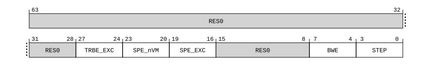

# ​D24.2.81 ID_AA64DFR2_EL1, AArch64 Debug Feature Register 2

Source: <https://developer.arm.com/documentation/ddi0487/mc/-Part-D-The-AArch64-System-Level-Architecture/-Chapter-D24-AArch64-System-Register-Descriptions/-D24-2-General-system-control-registers/-D24-2-81-ID-AA64DFR2-EL1--AArch64-Debug-Feature-Register-2>

##### D24.2.81 ID\_AA64DFR2\_EL1, AArch64 Debug Feature Register 2

The ID\_AA64DFR2\_EL1 characteristics are:

Purpose
:   Provides top-level information about the debug system in AArch64.

    For general information about the interpretation of the ID registers, see [‘Principles of the ID scheme for fields in ID registers’](/documentation/ddi0487/mc/-Part-D-The-AArch64-System-Level-Architecture/-Chapter-D24-AArch64-System-Register-Descriptions/-D24-1-About-the-AArch64-System-registers/-D24-1-3-Principles-of-the-ID-scheme-for-fields-in-ID-registers?lang=en#babfafhi).

Configuration
:   > #### Note
    >
    > Prior to the introduction of the features described by this register, this register was unnamed and reserved, RES0 from EL1, EL2, and EL3.

    This register is present only when FEAT\_AA64 is implemented. Otherwise, direct accesses to ID\_AA64DFR2\_EL1 are UNDEFINED.

Attributes
:   ID\_AA64DFR2\_EL1 is a 64-bit register.

###### Field descriptions



Bits [63:28]
:   Reserved, RES0.

TRBE\_EXC, bits [27:24]
:   TRBE Profiling exception extension. Describes support for reporting trace buffer management events as TRBE Profiling exceptions.

    The value of this field is an IMPLEMENTATION DEFINED choice of:

<table>
 <colgroup>
  <col/>
  <col/>
 </colgroup>
 <thead>
  <tr>
   <th>
    <strong>
     TRBE_EXC
    </strong>
   </th>
   <th>
    <strong>
     Meaning
    </strong>
   </th>
  </tr>
 </thead>
 <tbody>
  <tr>
   <td>
    <p>
     <code>
      0b0000
     </code>
    </p>
   </td>
   <td>
    <p>
     TRBE Profiling exception not implemented.
    </p>
   </td>
  </tr>
  <tr>
   <td>
    <p>
     <code>
      0b0001
     </code>
    </p>
   </td>
   <td>
    <p>
     TRBE Profiling exception implemented.
    </p>
   </td>
  </tr>
 </tbody>
</table>

    All other values are reserved.

    [FEAT\_TRBE\_EXC](/documentation/ddi0487/mc/-Part-A-Arm-Architecture-Introduction-and-Overview/-Chapter-A2-A-profile-Architecture-Extensions/-A2-3-Armv9-A-architecture-extensions/-A2-3-7-The-Armv9-6-architecture-extension?lang=en#feat_feat_trbe_exc) implements the functionality identified by the value `0b0001`.

    Access to this field is RO.

SPE\_nVM, bits [23:20]
:   Profiling Buffer physical address mode supported. Describes support for defining the Profiling Buffer using physical addresses or intermediate physical addresses.

    The value of this field is an IMPLEMENTATION DEFINED choice of:

<table>
 <colgroup>
  <col/>
  <col/>
 </colgroup>
 <thead>
  <tr>
   <th>
    <strong>
     SPE_nVM
    </strong>
   </th>
   <th>
    <strong>
     Meaning
    </strong>
   </th>
  </tr>
 </thead>
 <tbody>
  <tr>
   <td>
    <p>
     <code>
      0b0000
     </code>
    </p>
   </td>
   <td>
    <p>
     Profiling Buffer physical address mode not implemented.
    </p>
   </td>
  </tr>
  <tr>
   <td>
    <p>
     <code>
      0b0001
     </code>
    </p>
   </td>
   <td>
    <p>
     Profiling Buffer physical address mode implemented.
    </p>
   </td>
  </tr>
 </tbody>
</table>

    All other values are reserved.

    [FEAT\_SPE\_nVM](/documentation/ddi0487/mc/-Part-A-Arm-Architecture-Introduction-and-Overview/-Chapter-A2-A-profile-Architecture-Extensions/-A2-3-Armv9-A-architecture-extensions/-A2-3-7-The-Armv9-6-architecture-extension?lang=en#feat_feat_spe_nvm) implements the functionality identified by the value `0b0001`.

    Access to this field is RO.

SPE\_EXC, bits [19:16]
:   SPE Profiling exception extension. Describes support for reporting Profiling Buffer management events as SPE Profiling exceptions.

    The value of this field is an IMPLEMENTATION DEFINED choice of:

<table>
 <colgroup>
  <col/>
  <col/>
 </colgroup>
 <thead>
  <tr>
   <th>
    <strong>
     SPE_EXC
    </strong>
   </th>
   <th>
    <strong>
     Meaning
    </strong>
   </th>
  </tr>
 </thead>
 <tbody>
  <tr>
   <td>
    <p>
     <code>
      0b0000
     </code>
    </p>
   </td>
   <td>
    <p>
     SPE Profiling exception not implemented.
    </p>
   </td>
  </tr>
  <tr>
   <td>
    <p>
     <code>
      0b0001
     </code>
    </p>
   </td>
   <td>
    <p>
     SPE Profiling exception implemented.
    </p>
   </td>
  </tr>
 </tbody>
</table>

    All other values are reserved.

    [FEAT\_SPE\_EXC](/documentation/ddi0487/mc/-Part-A-Arm-Architecture-Introduction-and-Overview/-Chapter-A2-A-profile-Architecture-Extensions/-A2-3-Armv9-A-architecture-extensions/-A2-3-7-The-Armv9-6-architecture-extension?lang=en#feat_feat_spe_exc) implements the functionality identified by the value `0b0001`.

    Access to this field is RO.

Bits [15:8]
:   Reserved, RES0.

BWE, bits [7:4]
:   Breakpoints and watchpoint enhancements.

    The value of this field is an IMPLEMENTATION DEFINED choice of:

<table>
 <colgroup>
  <col/>
  <col/>
 </colgroup>
 <thead>
  <tr>
   <th>
    <strong>
     BWE
    </strong>
   </th>
   <th>
    <strong>
     Meaning
    </strong>
   </th>
  </tr>
 </thead>
 <tbody>
  <tr>
   <td>
    <p>
     <code>
      0b0000
     </code>
    </p>
   </td>
   <td>
    <p>
     This field does not indicate whether
     <a class="document-topic" document-topic-path="/ddi0487/mc/-Part-D-The-AArch64-System-Level-Architecture/-Chapter-D24-AArch64-System-Register-Descriptions/-D24-3-Debug-System-registers/-D24-3-2-DBGBCR-n--EL1--Debug-Breakpoint-Control-Registers--n---0---63?lang=en#reg_aarch64_dbgbcrn_el1" href="/documentation/ddi0487/mc/-Part-D-The-AArch64-System-Level-Architecture/-Chapter-D24-AArch64-System-Register-Descriptions/-D24-3-Debug-System-registers/-D24-3-2-DBGBCR-n--EL1--Debug-Breakpoint-Control-Registers--n---0---63?lang=en#reg_aarch64_dbgbcrn_el1">
      DBGBCR&lt;n&gt;_EL1
     </a>
     .MASK and address mismatch breakpoints are implemented.
    </p>
   </td>
  </tr>
  <tr>
   <td>
    <p>
     <code>
      0b0001
     </code>
    </p>
   </td>
   <td>
    <p>
     <a class="document-topic" document-topic-path="/ddi0487/mc/-Part-D-The-AArch64-System-Level-Architecture/-Chapter-D24-AArch64-System-Register-Descriptions/-D24-3-Debug-System-registers/-D24-3-2-DBGBCR-n--EL1--Debug-Breakpoint-Control-Registers--n---0---63?lang=en#reg_aarch64_dbgbcrn_el1" href="/documentation/ddi0487/mc/-Part-D-The-AArch64-System-Level-Architecture/-Chapter-D24-AArch64-System-Register-Descriptions/-D24-3-Debug-System-registers/-D24-3-2-DBGBCR-n--EL1--Debug-Breakpoint-Control-Registers--n---0---63?lang=en#reg_aarch64_dbgbcrn_el1">
      DBGBCR&lt;n&gt;_EL1
     </a>
     .MASK and address mismatch breakpoints are implemented.
    </p>
   </td>
  </tr>
  <tr>
   <td>
    <p>
     <code>
      0b0010
     </code>
    </p>
   </td>
   <td>
    <p>
     As
     <code>
      0b0001
     </code>
     , and address mismatch watchpoints are implemented.
    </p>
   </td>
  </tr>
 </tbody>
</table>

    All other values are reserved.

    [FEAT\_BWE](/documentation/ddi0487/mc/-Part-A-Arm-Architecture-Introduction-and-Overview/-Chapter-A2-A-profile-Architecture-Extensions/-A2-3-Armv9-A-architecture-extensions/-A2-3-5-The-Armv9-4-architecture-extension?lang=en#feat_feat_bwe) implements the functionality identified by the value `0b0001`.

    [FEAT\_BWE2](/documentation/ddi0487/mc/-Part-A-Arm-Architecture-Introduction-and-Overview/-Chapter-A2-A-profile-Architecture-Extensions/-A2-3-Armv9-A-architecture-extensions/-A2-3-6-The-Armv9-5-architecture-extension?lang=en#feat_feat_bwe2) implements the functionality identified by the value `0b0010`.

    From Armv9.5, the value `0b0001` is not permitted.

    Access to this field is RO.

STEP, bits [3:0]
:   Enhanced Software Step Extension.

    The value of this field is an IMPLEMENTATION DEFINED choice of:

<table>
 <colgroup>
  <col/>
  <col/>
 </colgroup>
 <thead>
  <tr>
   <th>
    <strong>
     STEP
    </strong>
   </th>
   <th>
    <strong>
     Meaning
    </strong>
   </th>
  </tr>
 </thead>
 <tbody>
  <tr>
   <td>
    <p>
     <code>
      0b0000
     </code>
    </p>
   </td>
   <td>
    <p>
     Execution from
     <a class="document-topic" document-topic-path="/ddi0487/mc/-Part-D-The-AArch64-System-Level-Architecture/-Chapter-D24-AArch64-System-Register-Descriptions/-D24-3-Debug-System-registers/-D24-3-22-MDSTEPOP-EL1--Monitor-Debug-Step-Opcode-Register?lang=en#reg_aarch64_mdstepop_el1" href="/documentation/ddi0487/mc/-Part-D-The-AArch64-System-Level-Architecture/-Chapter-D24-AArch64-System-Register-Descriptions/-D24-3-Debug-System-registers/-D24-3-22-MDSTEPOP-EL1--Monitor-Debug-Step-Opcode-Register?lang=en#reg_aarch64_mdstepop_el1">
      MDSTEPOP_EL1
     </a>
     is not supported for Software Step.
    </p>
   </td>
  </tr>
  <tr>
   <td>
    <p>
     <code>
      0b0001
     </code>
    </p>
   </td>
   <td>
    <p>
     Execution from
     <a class="document-topic" document-topic-path="/ddi0487/mc/-Part-D-The-AArch64-System-Level-Architecture/-Chapter-D24-AArch64-System-Register-Descriptions/-D24-3-Debug-System-registers/-D24-3-22-MDSTEPOP-EL1--Monitor-Debug-Step-Opcode-Register?lang=en#reg_aarch64_mdstepop_el1" href="/documentation/ddi0487/mc/-Part-D-The-AArch64-System-Level-Architecture/-Chapter-D24-AArch64-System-Register-Descriptions/-D24-3-Debug-System-registers/-D24-3-22-MDSTEPOP-EL1--Monitor-Debug-Step-Opcode-Register?lang=en#reg_aarch64_mdstepop_el1">
      MDSTEPOP_EL1
     </a>
     is supported for Software Step.
    </p>
   </td>
  </tr>
 </tbody>
</table>

    All other values are reserved.

    [FEAT\_STEP2](/documentation/ddi0487/mc/-Part-A-Arm-Architecture-Introduction-and-Overview/-Chapter-A2-A-profile-Architecture-Extensions/-A2-3-Armv9-A-architecture-extensions/-A2-3-6-The-Armv9-5-architecture-extension?lang=en#feat_feat_step2) implements the functionality identified by the value `0b0001`.

    Access to this field is RO.

###### Accessing ID\_AA64DFR2\_EL1

Accesses to this register use the following encodings in the System register encoding space:

###### `MRS <Xt>, ID_AA64DFR2_EL1`

<table>
 <colgroup>
  <col/>
  <col/>
  <col/>
  <col/>
  <col/>
 </colgroup>
 <thead>
  <tr>
   <th>
    <strong>
     op0
    </strong>
   </th>
   <th>
    <strong>
     op1
    </strong>
   </th>
   <th>
    <strong>
     CRn
    </strong>
   </th>
   <th>
    <strong>
     CRm
    </strong>
   </th>
   <th>
    <strong>
     op2
    </strong>
   </th>
  </tr>
 </thead>
 <tbody>
  <tr>
   <td>
    <p>
     <code>
      0b11
     </code>
    </p>
   </td>
   <td>
    <p>
     <code>
      0b000
     </code>
    </p>
   </td>
   <td>
    <p>
     <code>
      0b0000
     </code>
    </p>
   </td>
   <td>
    <p>
     <code>
      0b0101
     </code>
    </p>
   </td>
   <td>
    <p>
     <code>
      0b010
     </code>
    </p>
   </td>
  </tr>
 </tbody>
</table>

```
if !IsFeatureImplemented(FEAT_AA64) then
    UnimplementedIDRegister();
elsif HaveEL(EL3) && !(EffectivelyAtEL0InHost() || EffectivelyAtEL0NotInHost() || PSTATE.EL == EL3) && EL3SDDUndefPriority() && IsFeatureImplemented(FEAT_IDTE3) && SCR_EL3().TID3 == '1' then
    Undefined();
elsif PSTATE.EL == EL0 then
    if IsFeatureImplemented(FEAT_IDST) then
        AArch64_SystemAccessTraptoEL1orEL2(0x18);
    else
        Undefined();
    end;
elsif PSTATE.EL == EL1 then
    if EL2Enabled() && (IsFeatureImplemented(FEAT_FGT) || !IsZero(ID_AA64DFR2_EL1()) || ImpDefBool("ID_AA64DFR2_EL1 trapped by HCR_EL2.TID3")) && HCR_EL2().TID3 == '1' then
        AArch64_SystemAccessTrap(EL2, 0x18);
    elsif HaveEL(EL3) && IsFeatureImplemented(FEAT_IDTE3) && SCR_EL3().TID3 == '1' then
        if EL3SDDUndef() then
            Undefined();
        else
            AArch64_SystemAccessTrap(EL3, 0x18);
        end;
    else
        X{64}(t) = ID_AA64DFR2_EL1();
    end;
elsif PSTATE.EL == EL2 then
    if HaveEL(EL3) && IsFeatureImplemented(FEAT_IDTE3) && SCR_EL3().TID3 == '1' then
        if EL3SDDUndef() then
            Undefined();
        else
            AArch64_SystemAccessTrap(EL3, 0x18);
        end;
    else
        X{64}(t) = ID_AA64DFR2_EL1();
    end;
elsif PSTATE.EL == EL3 then
    X{64}(t) = ID_AA64DFR2_EL1();
end;
```
