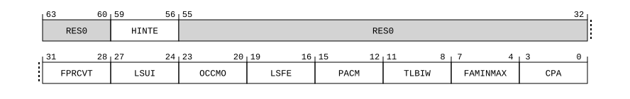

# ​D24.2.86 ID_AA64ISAR3_EL1, AArch64 Instruction Set Attribute Register 3

Source: <https://developer.arm.com/documentation/ddi0487/mc/-Part-D-The-AArch64-System-Level-Architecture/-Chapter-D24-AArch64-System-Register-Descriptions/-D24-2-General-system-control-registers/-D24-2-86-ID-AA64ISAR3-EL1--AArch64-Instruction-Set-Attribute-Register-3>

##### D24.2.86 ID\_AA64ISAR3\_EL1, AArch64 Instruction Set Attribute Register 3

The ID\_AA64ISAR3\_EL1 characteristics are:

Purpose
:   Provides information about the features and instructions implemented in AArch64 state.

    For general information about the interpretation of the ID registers, see [‘Principles of the ID scheme for fields in ID registers’](/documentation/ddi0487/mc/-Part-D-The-AArch64-System-Level-Architecture/-Chapter-D24-AArch64-System-Register-Descriptions/-D24-1-About-the-AArch64-System-registers/-D24-1-3-Principles-of-the-ID-scheme-for-fields-in-ID-registers?lang=en#babfafhi).

Configuration
:   > #### Note
    >
    > Prior to the introduction of the features described by this register, this register was unnamed and reserved, RES0 from EL1, EL2, and EL3.

    This register is present only when FEAT\_AA64 is implemented. Otherwise, direct accesses to ID\_AA64ISAR3\_EL1 are UNDEFINED.

Attributes
:   ID\_AA64ISAR3\_EL1 is a 64-bit register.

###### Field descriptions



Bits [63:60]
:   Reserved, RES0.

HINTE, bits [59:56]
:   Indicates support for the A64 extended hint space.

    The value of this field is an IMPLEMENTATION DEFINED choice of:

<table>
 <colgroup>
  <col/>
  <col/>
 </colgroup>
 <thead>
  <tr>
   <th>
    <strong>
     HINTE
    </strong>
   </th>
   <th>
    <strong>
     Meaning
    </strong>
   </th>
  </tr>
 </thead>
 <tbody>
  <tr>
   <td>
    <p>
     <code>
      0b0000
     </code>
    </p>
   </td>
   <td>
    <p>
     The A64 extended hint space is not implemented.
    </p>
   </td>
  </tr>
  <tr>
   <td>
    <p>
     <code>
      0b0001
     </code>
    </p>
   </td>
   <td>
    <p>
     The A64 base
     <code>
      HINTE
     </code>
     is implemented.
    </p>
   </td>
  </tr>
 </tbody>
</table>

    [FEAT\_HINTE](/documentation/ddi0487/mc/-Part-A-Arm-Architecture-Introduction-and-Overview/-Chapter-A2-A-profile-Architecture-Extensions/-A2-3-Armv9-A-architecture-extensions/-A2-3-7-The-Armv9-6-architecture-extension?lang=en#feat_feat_hinte) implements the functionality identified by the value `0b0001`.

    Access to this field is RO.

Bits [55:32]
:   Reserved, RES0.

FPRCVT, bits [31:28]
:   Indicates support for the following conversion between floating-point and integer instructions with only scalar SIMD&FP register operands and results, and with different input and output register sizes, when the PE is not in Streaming SVE mode:

    - `FCVTAS` (scalar SIMD&FP), `FCVTAU` (scalar SIMD&FP).
    - `FCVTMS` (scalar SIMD&FP), `FCVTMU` (scalar SIMD&FP).
    - `FCVTNS` (scalar SIMD&FP), `FCVTNU` (scalar SIMD&FP).
    - `FCVTPS` (scalar SIMD&FP), `FCVTPU` (scalar SIMD&FP).
    - `FCVTZS` (scalar SIMD&FP), `FCVTZU` (scalar SIMD&FP).
    - `SCVTF` (scalar SIMD&FP), `UCVTF` (scalar SIMD&FP).

    If [FEAT\_SME](/documentation/ddi0487/mc/-Part-A-Arm-Architecture-Introduction-and-Overview/-Chapter-A2-A-profile-Architecture-Extensions/-A2-3-Armv9-A-architecture-extensions/-A2-3-3-The-Armv9-2-architecture-extension?lang=en#feat_feat_sme) is implemented, indicates support for the above instructions, as well as the following conversion between floating-point and integer instructions with only scalar SIMD&FP register operands and results, and with the same input and output register sizes, when the PE is in Streaming SVE mode:

    - `FCVTAS` (vector), `FCVTAU` (vector).
    - `FCVTMS` (vector), `FCVTMU` (vector).
    - `FCVTNS` (vector), `FCVTNU` (vector).
    - `FCVTPS` (vector), `FCVTPU` (vector).
    - `FCVTZS` (vector), `FCVTZU` (vector).
    - `SCVTF` (vector), `UCVTF` (vector).

    The value of this field is an IMPLEMENTATION DEFINED choice of:

<table>
 <colgroup>
  <col/>
  <col/>
 </colgroup>
 <thead>
  <tr>
   <th>
    <strong>
     FPRCVT
    </strong>
   </th>
   <th>
    <strong>
     Meaning
    </strong>
   </th>
  </tr>
 </thead>
 <tbody>
  <tr>
   <td>
    <p>
     <code>
      0b0000
     </code>
    </p>
   </td>
   <td>
    <p>
     The specified instructions are not implemented.
    </p>
   </td>
  </tr>
  <tr>
   <td>
    <p>
     <code>
      0b0001
     </code>
    </p>
   </td>
   <td>
    <p>
     The specified instructions are implemented.
    </p>
   </td>
  </tr>
 </tbody>
</table>

    [FEAT\_FPRCVT](/documentation/ddi0487/mc/-Part-A-Arm-Architecture-Introduction-and-Overview/-Chapter-A2-A-profile-Architecture-Extensions/-A2-3-Armv9-A-architecture-extensions/-A2-3-7-The-Armv9-6-architecture-extension?lang=en#feat_feat_fprcvt) implements the functionality identified by the value `0b0001`.

    From Armv9.6, if [FEAT\_FP](/documentation/ddi0487/mc/-Part-A-Arm-Architecture-Introduction-and-Overview/-Chapter-A2-A-profile-Architecture-Extensions/-A2-2-Armv8-A-architecture-extensions/-A2-2-1-The-Armv8-0-architecture-extension?lang=en#feat_feat_fp) is implemented, the value `0b0000` is not permitted.

    Access to this field is RO.

LSUI, bits [27:24]
:   Support for the following load and store unprivileged instructions:

    - `LDTXR`, `STTXR`.
    - `LDATXR`, `STLTXR`.
    - `CAST`, `CASAT`, `CASALT`, `CASLT`.
    - `CASPT`, `CASPAT`, `CASPALT`, `CASPLT`.
    - `LDTP`, `STTP`.
    - `LDTP (SIMD&FP)`, `STTP (SIMD&FP)`.
    - `LDTNP`, `STTNP`.
    - `LDTNP (SIMD&FP)`, `STTNP (SIMD&FP)`.
    - `SWPT`, `SWPTA`, `SWPTL`, `SWPTAL`.
    - `LDTADD`, `LDTADDA`, `LDTADDAL`, `LDTADDL`.
    - `LDTSET`, `LDTSETA`, `LDTSETAL`, `LDTSETL`.
    - `LDTCLR`, `LDTCLRA`, `LDTCLRAL`, `LDTCLRL`.
    - `STTADD`, `STTADDL`.
    - `STTSET`, `STTSETL`.
    - `STTCLR`, `STTCLRL`.

    The value of this field is an IMPLEMENTATION DEFINED choice of:

<table>
 <colgroup>
  <col/>
  <col/>
 </colgroup>
 <thead>
  <tr>
   <th>
    <strong>
     LSUI
    </strong>
   </th>
   <th>
    <strong>
     Meaning
    </strong>
   </th>
  </tr>
 </thead>
 <tbody>
  <tr>
   <td>
    <p>
     <code>
      0b0000
     </code>
    </p>
   </td>
   <td>
    <p>
     The specified instructions are not implemented.
    </p>
   </td>
  </tr>
  <tr>
   <td>
    <p>
     <code>
      0b0001
     </code>
    </p>
   </td>
   <td>
    <p>
     The specified instructions are implemented.
    </p>
   </td>
  </tr>
 </tbody>
</table>

    [FEAT\_LSUI](/documentation/ddi0487/mc/-Part-A-Arm-Architecture-Introduction-and-Overview/-Chapter-A2-A-profile-Architecture-Extensions/-A2-3-Armv9-A-architecture-extensions/-A2-3-7-The-Armv9-6-architecture-extension?lang=en#feat_feat_lsui) implements the functionality identified by the value `0b0001`.

    Access to this field is RO.

OCCMO, bits [23:20]
:   Indicates support for the following cache maintenance operation to the Outer cache level instructions:

    - `DC CIVAOC`.
    - `DC CVAOC`.

    If [FEAT\_MTE](/documentation/ddi0487/mc/-Part-A-Arm-Architecture-Introduction-and-Overview/-Chapter-A2-A-profile-Architecture-Extensions/-A2-2-Armv8-A-architecture-extensions/-A2-2-6-The-Armv8-5-architecture-extension?lang=en#feat_feat_mte) is implemented:

    - `DC CIGDVAOC`.
    - `DC CGDVAOC`.

    The value of this field is an IMPLEMENTATION DEFINED choice of:

<table>
 <colgroup>
  <col/>
  <col/>
 </colgroup>
 <thead>
  <tr>
   <th>
    <strong>
     OCCMO
    </strong>
   </th>
   <th>
    <strong>
     Meaning
    </strong>
   </th>
  </tr>
 </thead>
 <tbody>
  <tr>
   <td>
    <p>
     <code>
      0b0000
     </code>
    </p>
   </td>
   <td>
    <p>
     The specified instructions are not implemented.
    </p>
   </td>
  </tr>
  <tr>
   <td>
    <p>
     <code>
      0b0001
     </code>
    </p>
   </td>
   <td>
    <p>
     The specified instructions are implemented.
    </p>
   </td>
  </tr>
 </tbody>
</table>

    [FEAT\_OCCMO](/documentation/ddi0487/mc/-Part-A-Arm-Architecture-Introduction-and-Overview/-Chapter-A2-A-profile-Architecture-Extensions/-A2-3-Armv9-A-architecture-extensions/-A2-3-7-The-Armv9-6-architecture-extension?lang=en#feat_feat_occmo) implements the functionality identified by the value `0b0001`.

    From Armv9.6, the value `0b0000` is not permitted.

    Access to this field is RO.

LSFE, bits [19:16]
:   Indicates support for the following A64 Base atomic floating-point in-memory instructions:

    - Floating-point atomic add in memory: `LDFADD`, `LDFADDA`, `LDFADDAL`, and `LDFADDL`.
    - BFloat16 atomic add in memory: `LDBFADD`, `LDBFADDA`, `LDBFADDAL`, and `LDBFADDL`.
    - Floating-point atomic maximum in memory: `LDFMAX`, `LDFMAXA`, `LDFMAXAL`, and `LDFMAXL`.
    - BFloat16 atomic maximum in memory: `LDBFMAX`, `LDBFMAXA`, `LDBFMAXAL`, and `LDBFMAXL`.
    - Floating-point atomic maximum number in memory: `LDFMAXNM`, `LDFMAXNMA`, `LDFMAXNMAL`, and `LDFMAXNML`.
    - BFloat16 atomic maximum number in memory: `LDBFMAXNM`, `LDBFMAXNMA`, `LDBFMAXNMAL`, and `LDBFMAXNML`.
    - Floating-point atomic minimum in memory: `LDFMIN`, `LDFMINA`, `LDFMINAL`, and `LDFMINL`.
    - BFloat16 atomic minimum in memory: `LDBFMIN`, `LDBFMINA`, `LDBFMINAL`, and `LDBFMINL`.
    - Floating-point atomic minimum number in memory: `LDFMINNM`, `LDFMINNMA`, `LDFMINNMAL`, and `LDFMINNML`.
    - BFloat16 atomic minimum number in memory: `LDBFMINNM`, `LDBFMINNMA`, `LDBFMINNMAL`, and `LDBFMINNML`.
    - Floating-point atomic add in memory, without return: `STFADD` and `STFADDL`.
    - BFloat16 atomic add in memory, without return: `STBFADD` and `STBFADDL`.
    - Floating-point atomic maximum in memory, without return: `STFMAX` and `STFMAXL`.
    - BFloat16 atomic maximum in memory, without return: `STBFMAX` and `STBFMAXL`.
    - Floating-point atomic maximum number in memory, without return: `STFMAXNM` and `STFMAXNML`.
    - BFloat16 atomic maximum number in memory, without return: `STBFMAXNM` and `STBFMAXNML`.
    - Floating-point atomic minimum in memory, without return: `STFMIN` and `STFMINL`.
    - BFloat16 atomic minimum in memory, without return: `STBFMIN` and `STBFMINL`.
    - Floating-point atomic minimum number in memory, without return: `STFMINNM` and `STFMINNML`.
    - BFloat16 atomic minimum number in memory, without return: `STBFMINNM` and `STBFMINNML`.

    The value of this field is an IMPLEMENTATION DEFINED choice of:

<table>
 <colgroup>
  <col/>
  <col/>
 </colgroup>
 <thead>
  <tr>
   <th>
    <strong>
     LSFE
    </strong>
   </th>
   <th>
    <strong>
     Meaning
    </strong>
   </th>
  </tr>
 </thead>
 <tbody>
  <tr>
   <td>
    <p>
     <code>
      0b0000
     </code>
    </p>
   </td>
   <td>
    <p>
     Atomic floating-point in-memory instructions are not implemented.
    </p>
   </td>
  </tr>
  <tr>
   <td>
    <p>
     <code>
      0b0001
     </code>
    </p>
   </td>
   <td>
    <p>
     The specified Atomic floating-point in-memory instructions are implemented.
    </p>
   </td>
  </tr>
 </tbody>
</table>

    [FEAT\_LSFE](/documentation/ddi0487/mc/-Part-A-Arm-Architecture-Introduction-and-Overview/-Chapter-A2-A-profile-Architecture-Extensions/-A2-3-Armv9-A-architecture-extensions/-A2-3-7-The-Armv9-6-architecture-extension?lang=en#feat_feat_lsfe) implements the functionality identified by the value `0b0001`

    Access to this field is RO.

PACM, bits [15:12]
:   Indicates the implementation of PSTATE.PACM.

    The value of this field is an IMPLEMENTATION DEFINED choice of:

<table>
 <colgroup>
  <col/>
  <col/>
 </colgroup>
 <thead>
  <tr>
   <th>
    <strong>
     PACM
    </strong>
   </th>
   <th>
    <strong>
     Meaning
    </strong>
   </th>
  </tr>
 </thead>
 <tbody>
  <tr>
   <td>
    <p>
     <code>
      0b0000
     </code>
    </p>
   </td>
   <td>
    <p>
     PSTATE.PACM is not implemented.
    </p>
   </td>
  </tr>
  <tr>
   <td>
    <p>
     <code>
      0b0001
     </code>
    </p>
   </td>
   <td>
    <p>
     Trivial implementation of PSTATE.PACM.
    </p>
   </td>
  </tr>
  <tr>
   <td>
    <p>
     <code>
      0b0010
     </code>
    </p>
   </td>
   <td>
    <p>
     Full implementation of PSTATE.PACM.
    </p>
   </td>
  </tr>
 </tbody>
</table>

    All other values are reserved.

    [FEAT\_PAuth\_LR](/documentation/ddi0487/mc/-Part-A-Arm-Architecture-Introduction-and-Overview/-Chapter-A2-A-profile-Architecture-Extensions/-A2-3-Armv9-A-architecture-extensions/-A2-3-6-The-Armv9-5-architecture-extension?lang=en#feat_feat_pauth_lr) implements the functionality identified by the values `0b0001` and `0b0010`.

    If [FEAT\_PAuth\_LR](/documentation/ddi0487/mc/-Part-A-Arm-Architecture-Introduction-and-Overview/-Chapter-A2-A-profile-Architecture-Extensions/-A2-3-Armv9-A-architecture-extensions/-A2-3-6-The-Armv9-5-architecture-extension?lang=en#feat_feat_pauth_lr) is implemented, the value `0b0000` is not permitted.

    If [ID\_AA64ISAR1\_EL1](/documentation/ddi0487/mc/-Part-D-The-AArch64-System-Level-Architecture/-Chapter-D24-AArch64-System-Register-Descriptions/-D24-2-General-system-control-registers/-D24-2-84-ID-AA64ISAR1-EL1--AArch64-Instruction-Set-Attribute-Register-1?lang=en#reg_aarch64_id_aa64isar1_el1).API is `0b0000`, the value `0b0001` is not permitted.

    If one of [FEAT\_PACQARMA3](/documentation/ddi0487/mc/-Part-A-Arm-Architecture-Introduction-and-Overview/-Chapter-A2-A-profile-Architecture-Extensions/-A2-2-Armv8-A-architecture-extensions/-A2-2-4-The-Armv8-3-architecture-extension?lang=en#feat_feat_pacqarma3) or [FEAT\_PACQARMA5](/documentation/ddi0487/mc/-Part-A-Arm-Architecture-Introduction-and-Overview/-Chapter-A2-A-profile-Architecture-Extensions/-A2-2-Armv8-A-architecture-extensions/-A2-2-4-The-Armv8-3-architecture-extension?lang=en#feat_feat_pacqarma5) are implemented, the value `0b0001` is not permitted.

    Access to this field is RO.

TLBIW, bits [11:8]
:   Support for `TLBI VMALL` for Dirty state.

    The value of this field is an IMPLEMENTATION DEFINED choice of:

<table>
 <colgroup>
  <col/>
  <col/>
 </colgroup>
 <thead>
  <tr>
   <th>
    <strong>
     TLBIW
    </strong>
   </th>
   <th>
    <strong>
     Meaning
    </strong>
   </th>
  </tr>
 </thead>
 <tbody>
  <tr>
   <td>
    <p>
     <code>
      0b0000
     </code>
    </p>
   </td>
   <td>
    <p>
     <code>
      TLBI VMALL
     </code>
     for Dirty state is not supported.
    </p>
   </td>
  </tr>
  <tr>
   <td>
    <p>
     <code>
      0b0001
     </code>
    </p>
   </td>
   <td>
    <p>
     <code>
      TLBI VMALL
     </code>
     for Dirty state is supported.
    </p>
   </td>
  </tr>
 </tbody>
</table>

    All other values are reserved.

    [FEAT\_TLBIW](/documentation/ddi0487/mc/-Part-A-Arm-Architecture-Introduction-and-Overview/-Chapter-A2-A-profile-Architecture-Extensions/-A2-3-Armv9-A-architecture-extensions/-A2-3-6-The-Armv9-5-architecture-extension?lang=en#feat_feat_tlbiw) implements the functionality identified by the value `0b0001`.

    Access to this field is RO.

FAMINMAX, bits [7:4]
:   Indicates support for the following Advanced SIMD, SVE2, and SME2 instructions that calculate maximum and minimum absolute value:

    - When Advanced SIMD is implemented, the Advanced SIMD instructions `FAMAX` and `FAMIN`.
    - When [FEAT\_SVE2](/documentation/ddi0487/mc/-Part-A-Arm-Architecture-Introduction-and-Overview/-Chapter-A2-A-profile-Architecture-Extensions/-A2-3-Armv9-A-architecture-extensions/-A2-3-1-The-Armv9-0-architecture-extension?lang=en#feat_feat_sve2) or [FEAT\_SME2](/documentation/ddi0487/mc/-Part-A-Arm-Architecture-Introduction-and-Overview/-Chapter-A2-A-profile-Architecture-Extensions/-A2-3-Armv9-A-architecture-extensions/-A2-3-4-The-Armv9-3-architecture-extension?lang=en#feat_feat_sme2) is implemented, the SVE2 instructions `FAMAX` and `FAMIN`.
    - When [FEAT\_SME2](/documentation/ddi0487/mc/-Part-A-Arm-Architecture-Introduction-and-Overview/-Chapter-A2-A-profile-Architecture-Extensions/-A2-3-Armv9-A-architecture-extensions/-A2-3-4-The-Armv9-3-architecture-extension?lang=en#feat_feat_sme2) is implemented, the SME2 instructions `FAMAX` (multiple and single vectors), `FAMIN` (multiple and single vectors), `FAMAX` (multiple vectors), and `FAMIN` (multiple vectors).

    The value of this field is an IMPLEMENTATION DEFINED choice of:

<table>
 <colgroup>
  <col/>
  <col/>
 </colgroup>
 <thead>
  <tr>
   <th>
    <strong>
     FAMINMAX
    </strong>
   </th>
   <th>
    <strong>
     Meaning
    </strong>
   </th>
  </tr>
 </thead>
 <tbody>
  <tr>
   <td>
    <p>
     <code>
      0b0000
     </code>
    </p>
   </td>
   <td>
    <p>
     The specified instructions are not implemented.
    </p>
   </td>
  </tr>
  <tr>
   <td>
    <p>
     <code>
      0b0001
     </code>
    </p>
   </td>
   <td>
    <p>
     The specified instructions are implemented.
    </p>
   </td>
  </tr>
 </tbody>
</table>

    All other values are reserved.

    [FEAT\_FAMINMAX](/documentation/ddi0487/mc/-Part-A-Arm-Architecture-Introduction-and-Overview/-Chapter-A2-A-profile-Architecture-Extensions/-A2-3-Armv9-A-architecture-extensions/-A2-3-6-The-Armv9-5-architecture-extension?lang=en#feat_feat_faminmax) implements the functionality identified by the value `0b0001`.

    Access to this field is RO.

CPA, bits [3:0]
:   Indicates support for Checked Pointer Arithmetic instructions.

    The value of this field is an IMPLEMENTATION DEFINED choice of:

<table>
 <colgroup>
  <col/>
  <col/>
 </colgroup>
 <thead>
  <tr>
   <th>
    <strong>
     CPA
    </strong>
   </th>
   <th>
    <strong>
     Meaning
    </strong>
   </th>
  </tr>
 </thead>
 <tbody>
  <tr>
   <td>
    <p>
     <code>
      0b0000
     </code>
    </p>
   </td>
   <td>
    <p>
     Checked Pointer Arithmetic instructions are not implemented.
    </p>
   </td>
  </tr>
  <tr>
   <td>
    <p>
     <code>
      0b0001
     </code>
    </p>
   </td>
   <td>
    <p>
     Checked Pointer Arithmetic instructions are implemented.
    </p>
   </td>
  </tr>
  <tr>
   <td>
    <p>
     <code>
      0b0010
     </code>
    </p>
   </td>
   <td>
    <p>
     Checked Pointer Arithmetic instructions are implemented, and Checked Pointer Arithmetic can be enabled.
    </p>
   </td>
  </tr>
 </tbody>
</table>

    All other values are reserved.

    [FEAT\_CPA](/documentation/ddi0487/mc/-Part-A-Arm-Architecture-Introduction-and-Overview/-Chapter-A2-A-profile-Architecture-Extensions/-A2-3-Armv9-A-architecture-extensions/-A2-3-6-The-Armv9-5-architecture-extension?lang=en#feat_feat_cpa) implements the functionality identified by the value `0b0001`.

    [FEAT\_CPA2](/documentation/ddi0487/mc/-Part-A-Arm-Architecture-Introduction-and-Overview/-Chapter-A2-A-profile-Architecture-Extensions/-A2-3-Armv9-A-architecture-extensions/-A2-3-6-The-Armv9-5-architecture-extension?lang=en#feat_feat_cpa2) implements the functionality identified by the value `0b0010`.

    From Armv9.5, the value `0b0000` is not permitted.

    Access to this field is RO.

###### Accessing ID\_AA64ISAR3\_EL1

Accesses to this register use the following encodings in the System register encoding space:

###### `MRS <Xt>, ID_AA64ISAR3_EL1`

<table>
 <colgroup>
  <col/>
  <col/>
  <col/>
  <col/>
  <col/>
 </colgroup>
 <thead>
  <tr>
   <th>
    <strong>
     op0
    </strong>
   </th>
   <th>
    <strong>
     op1
    </strong>
   </th>
   <th>
    <strong>
     CRn
    </strong>
   </th>
   <th>
    <strong>
     CRm
    </strong>
   </th>
   <th>
    <strong>
     op2
    </strong>
   </th>
  </tr>
 </thead>
 <tbody>
  <tr>
   <td>
    <p>
     <code>
      0b11
     </code>
    </p>
   </td>
   <td>
    <p>
     <code>
      0b000
     </code>
    </p>
   </td>
   <td>
    <p>
     <code>
      0b0000
     </code>
    </p>
   </td>
   <td>
    <p>
     <code>
      0b0110
     </code>
    </p>
   </td>
   <td>
    <p>
     <code>
      0b011
     </code>
    </p>
   </td>
  </tr>
 </tbody>
</table>

```
if !IsFeatureImplemented(FEAT_AA64) then
    UnimplementedIDRegister();
elsif HaveEL(EL3) && !(EffectivelyAtEL0InHost() || EffectivelyAtEL0NotInHost() || PSTATE.EL == EL3) && EL3SDDUndefPriority() && IsFeatureImplemented(FEAT_IDTE3) && SCR_EL3().TID3 == '1' then
    Undefined();
elsif PSTATE.EL == EL0 then
    if IsFeatureImplemented(FEAT_IDST) then
        AArch64_SystemAccessTraptoEL1orEL2(0x18);
    else
        Undefined();
    end;
elsif PSTATE.EL == EL1 then
    if EL2Enabled() && (IsFeatureImplemented(FEAT_FGT) || !IsZero(ID_AA64ISAR3_EL1()) || ImpDefBool("ID_AA64ISAR3_EL1 trapped by HCR_EL2.TID3")) && HCR_EL2().TID3 == '1' then
        AArch64_SystemAccessTrap(EL2, 0x18);
    elsif HaveEL(EL3) && IsFeatureImplemented(FEAT_IDTE3) && SCR_EL3().TID3 == '1' then
        if EL3SDDUndef() then
            Undefined();
        else
            AArch64_SystemAccessTrap(EL3, 0x18);
        end;
    else
        X{64}(t) = ID_AA64ISAR3_EL1();
    end;
elsif PSTATE.EL == EL2 then
    if HaveEL(EL3) && IsFeatureImplemented(FEAT_IDTE3) && SCR_EL3().TID3 == '1' then
        if EL3SDDUndef() then
            Undefined();
        else
            AArch64_SystemAccessTrap(EL3, 0x18);
        end;
    else
        X{64}(t) = ID_AA64ISAR3_EL1();
    end;
elsif PSTATE.EL == EL3 then
    X{64}(t) = ID_AA64ISAR3_EL1();
end;
```
