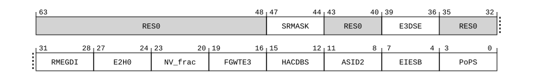

# ​D24.2.91 ID_AA64MMFR4_EL1, AArch64 Memory Model Feature Register 4

Source: <https://developer.arm.com/documentation/ddi0487/mc/-Part-D-The-AArch64-System-Level-Architecture/-Chapter-D24-AArch64-System-Register-Descriptions/-D24-2-General-system-control-registers/-D24-2-91-ID-AA64MMFR4-EL1--AArch64-Memory-Model-Feature-Register-4>

##### D24.2.91 ID\_AA64MMFR4\_EL1, AArch64 Memory Model Feature Register 4

The ID\_AA64MMFR4\_EL1 characteristics are:

Purpose
:   Provides additional information about implemented memory model and memory management support in AArch64.

Configuration
:   > #### Note
    >
    > Prior to the introduction of the features described by this register, this register was unnamed and reserved, RES0 from EL1, EL2, and EL3.

    This register is present only when FEAT\_AA64 is implemented. Otherwise, direct accesses to ID\_AA64MMFR4\_EL1 are UNDEFINED.

Attributes
:   ID\_AA64MMFR4\_EL1 is a 64-bit register.

###### Field descriptions



Bits [63:48]
:   Reserved, RES0.

SRMASK, bits [47:44]
:   Indicates support for bitwise write masks for the following registers:

    - [ACTLR\_EL1](/documentation/ddi0487/mc/-Part-D-The-AArch64-System-Level-Architecture/-Chapter-D24-AArch64-System-Register-Descriptions/-D24-2-General-system-control-registers/-D24-2-2-ACTLR-EL1--Auxiliary-Control-Register--EL1-?lang=en#reg_aarch64_actlr_el1).
    - [CPACR\_EL1](/documentation/ddi0487/mc/-Part-D-The-AArch64-System-Level-Architecture/-Chapter-D24-AArch64-System-Register-Descriptions/-D24-2-General-system-control-registers/-D24-2-35-CPACR-EL1--Architectural-Feature-Access-Control-Register?lang=en#reg_aarch64_cpacr_el1).
    - [SCTLR\_EL1](/documentation/ddi0487/mc/-Part-D-The-AArch64-System-Level-Architecture/-Chapter-D24-AArch64-System-Register-Descriptions/-D24-2-General-system-control-registers/-D24-2-174-SCTLR-EL1--System-Control-Register--EL1-?lang=en#reg_aarch64_sctlr_el1).
    - [SCTLR2\_EL1](/documentation/ddi0487/mc/-Part-D-The-AArch64-System-Level-Architecture/-Chapter-D24-AArch64-System-Register-Descriptions/-D24-2-General-system-control-registers/-D24-2-169-SCTLR2-EL1--System-Control-Register--EL1-?lang=en#reg_aarch64_sctlr2_el1).
    - [TCR\_EL1](/documentation/ddi0487/mc/-Part-D-The-AArch64-System-Level-Architecture/-Chapter-D24-AArch64-System-Register-Descriptions/-D24-2-General-system-control-registers/-D24-2-193-TCR-EL1--Translation-Control-Register--EL1-?lang=en#reg_aarch64_tcr_el1).
    - [TCR2\_EL1](/documentation/ddi0487/mc/-Part-D-The-AArch64-System-Level-Architecture/-Chapter-D24-AArch64-System-Register-Descriptions/-D24-2-General-system-control-registers/-D24-2-189-TCR2-EL1--Extended-Translation-Control-Register--EL1-?lang=en#reg_aarch64_tcr2_el1).
    - [ACTLR\_EL2](/documentation/ddi0487/mc/-Part-D-The-AArch64-System-Level-Architecture/-Chapter-D24-AArch64-System-Register-Descriptions/-D24-2-General-system-control-registers/-D24-2-3-ACTLR-EL2--Auxiliary-Control-Register--EL2-?lang=en#reg_aarch64_actlr_el2).
    - [CPTR\_EL2](/documentation/ddi0487/mc/-Part-D-The-AArch64-System-Level-Architecture/-Chapter-D24-AArch64-System-Register-Descriptions/-D24-2-General-system-control-registers/-D24-2-37-CPTR-EL2--Architectural-Feature-Trap-Register--EL2-?lang=en#reg_aarch64_cptr_el2).
    - [SCTLR\_EL2](/documentation/ddi0487/mc/-Part-D-The-AArch64-System-Level-Architecture/-Chapter-D24-AArch64-System-Register-Descriptions/-D24-2-General-system-control-registers/-D24-2-175-SCTLR-EL2--System-Control-Register--EL2-?lang=en#reg_aarch64_sctlr_el2).
    - [SCTLR2\_EL2](/documentation/ddi0487/mc/-Part-D-The-AArch64-System-Level-Architecture/-Chapter-D24-AArch64-System-Register-Descriptions/-D24-2-General-system-control-registers/-D24-2-170-SCTLR2-EL2--System-Control-Register--EL2-?lang=en#reg_aarch64_sctlr2_el2).
    - [TCR\_EL2](/documentation/ddi0487/mc/-Part-D-The-AArch64-System-Level-Architecture/-Chapter-D24-AArch64-System-Register-Descriptions/-D24-2-General-system-control-registers/-D24-2-194-TCR-EL2--Translation-Control-Register--EL2-?lang=en#reg_aarch64_tcr_el2).
    - [TCR2\_EL2](/documentation/ddi0487/mc/-Part-D-The-AArch64-System-Level-Architecture/-Chapter-D24-AArch64-System-Register-Descriptions/-D24-2-General-system-control-registers/-D24-2-190-TCR2-EL2--Extended-Translation-Control-Register--EL2-?lang=en#reg_aarch64_tcr2_el2).

    The value of this field is an IMPLEMENTATION DEFINED choice of:

<table>
 <colgroup>
  <col/>
  <col/>
 </colgroup>
 <thead>
  <tr>
   <th>
    <strong>
     SRMASK
    </strong>
   </th>
   <th>
    <strong>
     Meaning
    </strong>
   </th>
  </tr>
 </thead>
 <tbody>
  <tr>
   <td>
    <p>
     <code>
      0b0000
     </code>
    </p>
   </td>
   <td>
    <p>
     Bitwise write masks for the specified registers are not supported.
    </p>
   </td>
  </tr>
  <tr>
   <td>
    <p>
     <code>
      0b0001
     </code>
    </p>
   </td>
   <td>
    <p>
     Bitwise write masks for the specified registers are supported.
    </p>
   </td>
  </tr>
 </tbody>
</table>

    [FEAT\_SRMASK](/documentation/ddi0487/mc/-Part-A-Arm-Architecture-Introduction-and-Overview/-Chapter-A2-A-profile-Architecture-Extensions/-A2-3-Armv9-A-architecture-extensions/-A2-3-7-The-Armv9-6-architecture-extension?lang=en#feat_feat_srmask) implements the functionality identified by the value `0b0001`.

    From Armv9.6, the value `0b0000` is not permitted.

    Access to this field is RO.

Bits [43:40]
:   Reserved, RES0.

E3DSE, bits [39:36]
:   Delegated SError exceptions from EL3. Describes support for delegated SError injection from EL3.

    The value of this field is an IMPLEMENTATION DEFINED choice of:

<table>
 <colgroup>
  <col/>
  <col/>
 </colgroup>
 <thead>
  <tr>
   <th>
    <strong>
     E3DSE
    </strong>
   </th>
   <th>
    <strong>
     Meaning
    </strong>
   </th>
  </tr>
 </thead>
 <tbody>
  <tr>
   <td>
    <p>
     <code>
      0b0000
     </code>
    </p>
   </td>
   <td>
    <p>
     <a class="document-topic" document-topic-path="/ddi0487/mc/-Part-A-Arm-Architecture-Introduction-and-Overview/-Chapter-A2-A-profile-Architecture-Extensions/-A2-3-Armv9-A-architecture-extensions/-A2-3-6-The-Armv9-5-architecture-extension?lang=en#feat_feat_e3dse" href="/documentation/ddi0487/mc/-Part-A-Arm-Architecture-Introduction-and-Overview/-Chapter-A2-A-profile-Architecture-Extensions/-A2-3-Armv9-A-architecture-extensions/-A2-3-6-The-Armv9-5-architecture-extension?lang=en#feat_feat_e3dse">
      FEAT_E3DSE
     </a>
     is not implemented.
    </p>
   </td>
  </tr>
  <tr>
   <td>
    <p>
     <code>
      0b0001
     </code>
    </p>
   </td>
   <td>
    <p>
     <a class="document-topic" document-topic-path="/ddi0487/mc/-Part-A-Arm-Architecture-Introduction-and-Overview/-Chapter-A2-A-profile-Architecture-Extensions/-A2-3-Armv9-A-architecture-extensions/-A2-3-6-The-Armv9-5-architecture-extension?lang=en#feat_feat_e3dse" href="/documentation/ddi0487/mc/-Part-A-Arm-Architecture-Introduction-and-Overview/-Chapter-A2-A-profile-Architecture-Extensions/-A2-3-Armv9-A-architecture-extensions/-A2-3-6-The-Armv9-5-architecture-extension?lang=en#feat_feat_e3dse">
      FEAT_E3DSE
     </a>
     is implemented. The following are implemented:
    </p>
    <ul>
     <li>
      <p>
       Register fields
       <a class="document-topic" document-topic-path="/ddi0487/mc/-Part-D-The-AArch64-System-Level-Architecture/-Chapter-D24-AArch64-System-Register-Descriptions/-D24-2-General-system-control-registers/-D24-2-168-SCR-EL3--Secure-Configuration-Register?lang=en#reg_aarch64_scr_el3" href="/documentation/ddi0487/mc/-Part-D-The-AArch64-System-Level-Architecture/-Chapter-D24-AArch64-System-Register-Descriptions/-D24-2-General-system-control-registers/-D24-2-168-SCR-EL3--Secure-Configuration-Register?lang=en#reg_aarch64_scr_el3">
        SCR_EL3
       </a>
       .DSE and
       <a class="document-topic" document-topic-path="/ddi0487/mc/-Part-D-The-AArch64-System-Level-Architecture/-Chapter-D24-AArch64-System-Register-Descriptions/-D24-2-General-system-control-registers/-D24-2-168-SCR-EL3--Secure-Configuration-Register?lang=en#reg_aarch64_scr_el3" href="/documentation/ddi0487/mc/-Part-D-The-AArch64-System-Level-Architecture/-Chapter-D24-AArch64-System-Register-Descriptions/-D24-2-General-system-control-registers/-D24-2-168-SCR-EL3--Secure-Configuration-Register?lang=en#reg_aarch64_scr_el3">
        SCR_EL3
       </a>
       .EnDSE.
      </p>
     </li>
     <li>
      <p>
       Registers
       <a class="document-topic" document-topic-path="/ddi0487/mc/-Part-D-The-AArch64-System-Level-Architecture/-Chapter-D24-AArch64-System-Register-Descriptions/-D24-9-RAS-registers/-D24-9-19-VSESR-EL3--Virtual-SError-Exception-Syndrome-Register--EL3-?lang=en#reg_aarch64_vsesr_el3" href="/documentation/ddi0487/mc/-Part-D-The-AArch64-System-Level-Architecture/-Chapter-D24-AArch64-System-Register-Descriptions/-D24-9-RAS-registers/-D24-9-19-VSESR-EL3--Virtual-SError-Exception-Syndrome-Register--EL3-?lang=en#reg_aarch64_vsesr_el3">
        VSESR_EL3
       </a>
       and
       <a class="document-topic" document-topic-path="/ddi0487/mc/-Part-D-The-AArch64-System-Level-Architecture/-Chapter-D24-AArch64-System-Register-Descriptions/-D24-9-RAS-registers/-D24-9-17-VDISR-EL3--Virtual-Deferred-Interrupt-Status-Register--EL3-?lang=en#reg_aarch64_vdisr_el3" href="/documentation/ddi0487/mc/-Part-D-The-AArch64-System-Level-Architecture/-Chapter-D24-AArch64-System-Register-Descriptions/-D24-9-RAS-registers/-D24-9-17-VDISR-EL3--Virtual-Deferred-Interrupt-Status-Register--EL3-?lang=en#reg_aarch64_vdisr_el3">
        VDISR_EL3
       </a>
       .
      </p>
     </li>
    </ul>
   </td>
  </tr>
 </tbody>
</table>

    All other values are reserved.

    [FEAT\_E3DSE](/documentation/ddi0487/mc/-Part-A-Arm-Architecture-Introduction-and-Overview/-Chapter-A2-A-profile-Architecture-Extensions/-A2-3-Armv9-A-architecture-extensions/-A2-3-6-The-Armv9-5-architecture-extension?lang=en#feat_feat_e3dse) implements the functionality described by the value `0b0001`.

    Access to this field is RO.

Bits [35:32]
:   Reserved, RES0.

RMEGDI, bits [31:28]
:   RME Granular Data Isolation.

    The value of this field is an IMPLEMENTATION DEFINED choice of:

<table>
 <colgroup>
  <col/>
  <col/>
 </colgroup>
 <thead>
  <tr>
   <th>
    <strong>
     RMEGDI
    </strong>
   </th>
   <th>
    <strong>
     Meaning
    </strong>
   </th>
  </tr>
 </thead>
 <tbody>
  <tr>
   <td>
    <p>
     <code>
      0b0000
     </code>
    </p>
   </td>
   <td>
    <p>
     The Granular Data isolation GPI encodings are reserved.
    </p>
   </td>
  </tr>
  <tr>
   <td>
    <p>
     <code>
      0b0001
     </code>
    </p>
   </td>
   <td>
    <p>
     The Granular Data Isolation GPI encodings can be configured to be either reserved or No Access from this PE.
    </p>
   </td>
  </tr>
 </tbody>
</table>

    All other values are reserved.

    [FEAT\_RME\_GDI](/documentation/ddi0487/mc/-Part-A-Arm-Architecture-Introduction-and-Overview/-Chapter-A2-A-profile-Architecture-Extensions/-A2-3-Armv9-A-architecture-extensions/-A2-3-7-The-Armv9-6-architecture-extension?lang=en#feat_feat_rme_gdi) implements the functionality described by the value `0b0001`.

    Access to this field is RO.

E2H0, bits [27:24]
:   When FEAT\_AA64EL2 is implemented:
    :   Indicates support for programming [HCR\_EL2](/documentation/ddi0487/mc/-Part-D-The-AArch64-System-Level-Architecture/-Chapter-D24-AArch64-System-Register-Descriptions/-D24-2-General-system-control-registers/-D24-2-61-HCR-EL2--Hypervisor-Configuration-Register?lang=en#reg_aarch64_hcr_el2).E2H.

        The value of this field is an IMPLEMENTATION DEFINED choice of:

<table>
 <colgroup>
  <col/>
  <col/>
 </colgroup>
 <thead>
  <tr>
   <th>
    <strong>
     E2H0
    </strong>
   </th>
   <th>
    <strong>
     Meaning
    </strong>
   </th>
  </tr>
 </thead>
 <tbody>
  <tr>
   <td>
    <p>
     <code>
      0b0000
     </code>
    </p>
   </td>
   <td>
    <p>
     <a class="document-topic" document-topic-path="/ddi0487/mc/-Part-A-Arm-Architecture-Introduction-and-Overview/-Chapter-A2-A-profile-Architecture-Extensions/-A2-2-Armv8-A-architecture-extensions/-A2-2-2-The-Armv8-1-architecture-extension?lang=en#feat_feat_e2h0" href="/documentation/ddi0487/mc/-Part-A-Arm-Architecture-Introduction-and-Overview/-Chapter-A2-A-profile-Architecture-Extensions/-A2-2-Armv8-A-architecture-extensions/-A2-2-2-The-Armv8-1-architecture-extension?lang=en#feat_feat_e2h0">
      FEAT_E2H0
     </a>
     is implemented.
    </p>
   </td>
  </tr>
  <tr>
   <td>
    <p>
     <code>
      0b1110
     </code>
    </p>
   </td>
   <td>
    <p>
     <a class="document-topic" document-topic-path="/ddi0487/mc/-Part-A-Arm-Architecture-Introduction-and-Overview/-Chapter-A2-A-profile-Architecture-Extensions/-A2-2-Armv8-A-architecture-extensions/-A2-2-2-The-Armv8-1-architecture-extension?lang=en#feat_feat_e2h0" href="/documentation/ddi0487/mc/-Part-A-Arm-Architecture-Introduction-and-Overview/-Chapter-A2-A-profile-Architecture-Extensions/-A2-2-Armv8-A-architecture-extensions/-A2-2-2-The-Armv8-1-architecture-extension?lang=en#feat_feat_e2h0">
      FEAT_E2H0
     </a>
     is not implemented.
     <a class="document-topic" document-topic-path="/ddi0487/mc/-Part-D-The-AArch64-System-Level-Architecture/-Chapter-D24-AArch64-System-Register-Descriptions/-D24-2-General-system-control-registers/-D24-2-61-HCR-EL2--Hypervisor-Configuration-Register?lang=en#reg_aarch64_hcr_el2" href="/documentation/ddi0487/mc/-Part-D-The-AArch64-System-Level-Architecture/-Chapter-D24-AArch64-System-Register-Descriptions/-D24-2-General-system-control-registers/-D24-2-61-HCR-EL2--Hypervisor-Configuration-Register?lang=en#reg_aarch64_hcr_el2">
      HCR_EL2
     </a>
     .NV1 is
     <small>
      RES0
     </small>
     .
    </p>
   </td>
  </tr>
  <tr>
   <td>
    <p>
     <code>
      0b1111
     </code>
    </p>
   </td>
   <td>
    <p>
     <a class="document-topic" document-topic-path="/ddi0487/mc/-Part-A-Arm-Architecture-Introduction-and-Overview/-Chapter-A2-A-profile-Architecture-Extensions/-A2-2-Armv8-A-architecture-extensions/-A2-2-2-The-Armv8-1-architecture-extension?lang=en#feat_feat_e2h0" href="/documentation/ddi0487/mc/-Part-A-Arm-Architecture-Introduction-and-Overview/-Chapter-A2-A-profile-Architecture-Extensions/-A2-2-Armv8-A-architecture-extensions/-A2-2-2-The-Armv8-1-architecture-extension?lang=en#feat_feat_e2h0">
      FEAT_E2H0
     </a>
     is not implemented.
    </p>
   </td>
  </tr>
 </tbody>
</table>

        All other values are reserved.

        If [FEAT\_NV](/documentation/ddi0487/mc/-Part-A-Arm-Architecture-Introduction-and-Overview/-Chapter-A2-A-profile-Architecture-Extensions/-A2-2-Armv8-A-architecture-extensions/-A2-2-4-The-Armv8-3-architecture-extension?lang=en#feat_feat_nv) is not implemented, then the value `0b1110` is not permitted.

        If [FEAT\_E2H0](/documentation/ddi0487/mc/-Part-A-Arm-Architecture-Introduction-and-Overview/-Chapter-A2-A-profile-Architecture-Extensions/-A2-2-Armv8-A-architecture-extensions/-A2-2-2-The-Armv8-1-architecture-extension?lang=en#feat_feat_e2h0) is implemented and [FEAT\_VHE](/documentation/ddi0487/mc/-Part-A-Arm-Architecture-Introduction-and-Overview/-Chapter-A2-A-profile-Architecture-Extensions/-A2-2-Armv8-A-architecture-extensions/-A2-2-2-The-Armv8-1-architecture-extension?lang=en#feat_feat_vhe) is not implemented, then [HCR\_EL2](/documentation/ddi0487/mc/-Part-D-The-AArch64-System-Level-Architecture/-Chapter-D24-AArch64-System-Register-Descriptions/-D24-2-General-system-control-registers/-D24-2-61-HCR-EL2--Hypervisor-Configuration-Register?lang=en#reg_aarch64_hcr_el2).E2H is RES0.

        If [FEAT\_E2H0](/documentation/ddi0487/mc/-Part-A-Arm-Architecture-Introduction-and-Overview/-Chapter-A2-A-profile-Architecture-Extensions/-A2-2-Armv8-A-architecture-extensions/-A2-2-2-The-Armv8-1-architecture-extension?lang=en#feat_feat_e2h0) is implemented and [FEAT\_VHE](/documentation/ddi0487/mc/-Part-A-Arm-Architecture-Introduction-and-Overview/-Chapter-A2-A-profile-Architecture-Extensions/-A2-2-Armv8-A-architecture-extensions/-A2-2-2-The-Armv8-1-architecture-extension?lang=en#feat_feat_vhe) is implemented, then [HCR\_EL2](/documentation/ddi0487/mc/-Part-D-The-AArch64-System-Level-Architecture/-Chapter-D24-AArch64-System-Register-Descriptions/-D24-2-General-system-control-registers/-D24-2-61-HCR-EL2--Hypervisor-Configuration-Register?lang=en#reg_aarch64_hcr_el2).E2H can be programmed to 0 or 1.

        If [FEAT\_E2H0](/documentation/ddi0487/mc/-Part-A-Arm-Architecture-Introduction-and-Overview/-Chapter-A2-A-profile-Architecture-Extensions/-A2-2-Armv8-A-architecture-extensions/-A2-2-2-The-Armv8-1-architecture-extension?lang=en#feat_feat_e2h0) is not implemented then:

        - [FEAT\_VHE](/documentation/ddi0487/mc/-Part-A-Arm-Architecture-Introduction-and-Overview/-Chapter-A2-A-profile-Architecture-Extensions/-A2-2-Armv8-A-architecture-extensions/-A2-2-2-The-Armv8-1-architecture-extension?lang=en#feat_feat_vhe) is implemented.
        - [HCR\_EL2](/documentation/ddi0487/mc/-Part-D-The-AArch64-System-Level-Architecture/-Chapter-D24-AArch64-System-Register-Descriptions/-D24-2-General-system-control-registers/-D24-2-61-HCR-EL2--Hypervisor-Configuration-Register?lang=en#reg_aarch64_hcr_el2).E2H is RES1 and behaves as though it is 1.

        Access to this field is RO.

    Otherwise:
    :   Reserved, RES0.

NV\_frac, bits [23:20]
:   Indicates support for a subset of [FEAT\_NV](/documentation/ddi0487/mc/-Part-A-Arm-Architecture-Introduction-and-Overview/-Chapter-A2-A-profile-Architecture-Extensions/-A2-2-Armv8-A-architecture-extensions/-A2-2-4-The-Armv8-3-architecture-extension?lang=en#feat_feat_nv) and [FEAT\_NV2](/documentation/ddi0487/mc/-Part-A-Arm-Architecture-Introduction-and-Overview/-Chapter-A2-A-profile-Architecture-Extensions/-A2-2-Armv8-A-architecture-extensions/-A2-2-5-The-Armv8-4-architecture-extension?lang=en#feat_feat_nv2) behaviors.

    The value of this field is an IMPLEMENTATION DEFINED choice of:

<table>
 <colgroup>
  <col/>
  <col/>
 </colgroup>
 <thead>
  <tr>
   <th>
    <strong>
     NV_frac
    </strong>
   </th>
   <th>
    <strong>
     Meaning
    </strong>
   </th>
  </tr>
 </thead>
 <tbody>
  <tr>
   <td>
    <p>
     <code>
      0b0000
     </code>
    </p>
   </td>
   <td>
    <p>
     Support for
     <a class="document-topic" document-topic-path="/ddi0487/mc/-Part-A-Arm-Architecture-Introduction-and-Overview/-Chapter-A2-A-profile-Architecture-Extensions/-A2-2-Armv8-A-architecture-extensions/-A2-2-4-The-Armv8-3-architecture-extension?lang=en#feat_feat_nv" href="/documentation/ddi0487/mc/-Part-A-Arm-Architecture-Introduction-and-Overview/-Chapter-A2-A-profile-Architecture-Extensions/-A2-2-Armv8-A-architecture-extensions/-A2-2-4-The-Armv8-3-architecture-extension?lang=en#feat_feat_nv">
      FEAT_NV
     </a>
     and
     <a class="document-topic" document-topic-path="/ddi0487/mc/-Part-A-Arm-Architecture-Introduction-and-Overview/-Chapter-A2-A-profile-Architecture-Extensions/-A2-2-Armv8-A-architecture-extensions/-A2-2-5-The-Armv8-4-architecture-extension?lang=en#feat_feat_nv2" href="/documentation/ddi0487/mc/-Part-A-Arm-Architecture-Introduction-and-Overview/-Chapter-A2-A-profile-Architecture-Extensions/-A2-2-Armv8-A-architecture-extensions/-A2-2-5-The-Armv8-4-architecture-extension?lang=en#feat_feat_nv2">
      FEAT_NV2
     </a>
     is described in
     <a class="document-topic" document-topic-path="/ddi0487/mc/-Part-D-The-AArch64-System-Level-Architecture/-Chapter-D24-AArch64-System-Register-Descriptions/-D24-2-General-system-control-registers/-D24-2-89-ID-AA64MMFR2-EL1--AArch64-Memory-Model-Feature-Register-2?lang=en#reg_aarch64_id_aa64mmfr2_el1" href="/documentation/ddi0487/mc/-Part-D-The-AArch64-System-Level-Architecture/-Chapter-D24-AArch64-System-Register-Descriptions/-D24-2-General-system-control-registers/-D24-2-89-ID-AA64MMFR2-EL1--AArch64-Memory-Model-Feature-Register-2?lang=en#reg_aarch64_id_aa64mmfr2_el1">
      ID_AA64MMFR2_EL1
     </a>
     .NV.
    </p>
   </td>
  </tr>
  <tr>
   <td>
    <p>
     <code>
      0b0001
     </code>
    </p>
   </td>
   <td>
    <p>
     <a class="document-topic" document-topic-path="/ddi0487/mc/-Part-A-Arm-Architecture-Introduction-and-Overview/-Chapter-A2-A-profile-Architecture-Extensions/-A2-2-Armv8-A-architecture-extensions/-A2-2-4-The-Armv8-3-architecture-extension?lang=en#feat_feat_nv" href="/documentation/ddi0487/mc/-Part-A-Arm-Architecture-Introduction-and-Overview/-Chapter-A2-A-profile-Architecture-Extensions/-A2-2-Armv8-A-architecture-extensions/-A2-2-4-The-Armv8-3-architecture-extension?lang=en#feat_feat_nv">
      FEAT_NV
     </a>
     and
     <a class="document-topic" document-topic-path="/ddi0487/mc/-Part-A-Arm-Architecture-Introduction-and-Overview/-Chapter-A2-A-profile-Architecture-Extensions/-A2-2-Armv8-A-architecture-extensions/-A2-2-5-The-Armv8-4-architecture-extension?lang=en#feat_feat_nv2" href="/documentation/ddi0487/mc/-Part-A-Arm-Architecture-Introduction-and-Overview/-Chapter-A2-A-profile-Architecture-Extensions/-A2-2-Armv8-A-architecture-extensions/-A2-2-5-The-Armv8-4-architecture-extension?lang=en#feat_feat_nv2">
      FEAT_NV2
     </a>
     are implemented, but all of the following apply:
    </p>
    <ul>
     <li>
      <p>
       <a class="document-topic" document-topic-path="/ddi0487/mc/-Part-D-The-AArch64-System-Level-Architecture/-Chapter-D24-AArch64-System-Register-Descriptions/-D24-2-General-system-control-registers/-D24-2-89-ID-AA64MMFR2-EL1--AArch64-Memory-Model-Feature-Register-2?lang=en#reg_aarch64_id_aa64mmfr2_el1" href="/documentation/ddi0487/mc/-Part-D-The-AArch64-System-Level-Architecture/-Chapter-D24-AArch64-System-Register-Descriptions/-D24-2-General-system-control-registers/-D24-2-89-ID-AA64MMFR2-EL1--AArch64-Memory-Model-Feature-Register-2?lang=en#reg_aarch64_id_aa64mmfr2_el1">
        ID_AA64MMFR2_EL1
       </a>
       .NV is
       <code>
        0b0000
       </code>
       .
      </p>
     </li>
     <li>
      <p>
       Programming
       <a class="document-topic" document-topic-path="/ddi0487/mc/-Part-D-The-AArch64-System-Level-Architecture/-Chapter-D24-AArch64-System-Register-Descriptions/-D24-2-General-system-control-registers/-D24-2-61-HCR-EL2--Hypervisor-Configuration-Register?lang=en#reg_aarch64_hcr_el2" href="/documentation/ddi0487/mc/-Part-D-The-AArch64-System-Level-Architecture/-Chapter-D24-AArch64-System-Register-Descriptions/-D24-2-General-system-control-registers/-D24-2-61-HCR-EL2--Hypervisor-Configuration-Register?lang=en#reg_aarch64_hcr_el2">
        HCR_EL2
       </a>
       .{NV, NV2} to {1, 0} behaves as {1, 1}.
      </p>
     </li>
    </ul>
   </td>
  </tr>
  <tr>
   <td>
    <p>
     <code>
      0b0010
     </code>
    </p>
   </td>
   <td>
    <p>
     As
     <code>
      0b0001
     </code>
     and adds stateful bits in specified _EL1 registers for software usage under nested virtualization.
    </p>
   </td>
  </tr>
 </tbody>
</table>

    [FEAT\_NV2p1](/documentation/ddi0487/mc/-Part-A-Arm-Architecture-Introduction-and-Overview/-Chapter-A2-A-profile-Architecture-Extensions/-A2-3-Armv9-A-architecture-extensions/-A2-3-7-The-Armv9-6-architecture-extension?lang=en#feat_feat_nv2p1) implements the functionality indicated by the value `0b0010`.

    Access to this field is RO.

FGWTE3, bits [19:16]
:   Indicates support for Fine Grained Write Trap EL3 feature.

    The value of this field is an IMPLEMENTATION DEFINED choice of:

<table>
 <colgroup>
  <col/>
  <col/>
 </colgroup>
 <thead>
  <tr>
   <th>
    <strong>
     FGWTE3
    </strong>
   </th>
   <th>
    <strong>
     Meaning
    </strong>
   </th>
  </tr>
 </thead>
 <tbody>
  <tr>
   <td>
    <p>
     <code>
      0b0000
     </code>
    </p>
   </td>
   <td>
    <p>
     Fine Grained Write Trap EL3 is not supported.
    </p>
   </td>
  </tr>
  <tr>
   <td>
    <p>
     <code>
      0b0001
     </code>
    </p>
   </td>
   <td>
    <p>
     Fine Grained Write Trap EL3 is supported.
    </p>
   </td>
  </tr>
 </tbody>
</table>

    All other values are reserved.

    [FEAT\_FGWTE3](/documentation/ddi0487/mc/-Part-A-Arm-Architecture-Introduction-and-Overview/-Chapter-A2-A-profile-Architecture-Extensions/-A2-3-Armv9-A-architecture-extensions/-A2-3-6-The-Armv9-5-architecture-extension?lang=en#feat_feat_fgwte3) implements the functionality identified by the value `0b0001`.

    Access to this field is RO.

HACDBS, bits [15:12]
:   Support for Hardware accelerator for cleaning Dirty state.

    The value of this field is an IMPLEMENTATION DEFINED choice of:

<table>
 <colgroup>
  <col/>
  <col/>
 </colgroup>
 <thead>
  <tr>
   <th>
    <strong>
     HACDBS
    </strong>
   </th>
   <th>
    <strong>
     Meaning
    </strong>
   </th>
  </tr>
 </thead>
 <tbody>
  <tr>
   <td>
    <p>
     <code>
      0b0000
     </code>
    </p>
   </td>
   <td>
    <p>
     Hardware accelerator for cleaning Dirty state is not supported.
    </p>
   </td>
  </tr>
  <tr>
   <td>
    <p>
     <code>
      0b0001
     </code>
    </p>
   </td>
   <td>
    <p>
     Hardware accelerator for cleaning Dirty state is supported.
    </p>
   </td>
  </tr>
 </tbody>
</table>

    All other values are reserved.

    [FEAT\_HACDBS](/documentation/ddi0487/mc/-Part-A-Arm-Architecture-Introduction-and-Overview/-Chapter-A2-A-profile-Architecture-Extensions/-A2-3-Armv9-A-architecture-extensions/-A2-3-6-The-Armv9-5-architecture-extension?lang=en#feat_feat_hacdbs) implements the functionality identified by the value `0b0001`.

    Access to this field is RO.

ASID2, bits [11:8]
:   Indicates support for concurrent use of two ASIDs.

    The value of this field is an IMPLEMENTATION DEFINED choice of:

<table>
 <colgroup>
  <col/>
  <col/>
 </colgroup>
 <thead>
  <tr>
   <th>
    <strong>
     ASID2
    </strong>
   </th>
   <th>
    <strong>
     Meaning
    </strong>
   </th>
  </tr>
 </thead>
 <tbody>
  <tr>
   <td>
    <p>
     <code>
      0b0000
     </code>
    </p>
   </td>
   <td>
    <p>
     <a class="document-topic" document-topic-path="/ddi0487/mc/-Part-A-Arm-Architecture-Introduction-and-Overview/-Chapter-A2-A-profile-Architecture-Extensions/-A2-3-Armv9-A-architecture-extensions/-A2-3-6-The-Armv9-5-architecture-extension?lang=en#feat_feat_asid2" href="/documentation/ddi0487/mc/-Part-A-Arm-Architecture-Introduction-and-Overview/-Chapter-A2-A-profile-Architecture-Extensions/-A2-3-Armv9-A-architecture-extensions/-A2-3-6-The-Armv9-5-architecture-extension?lang=en#feat_feat_asid2">
      FEAT_ASID2
     </a>
     is not implemented.
    </p>
   </td>
  </tr>
  <tr>
   <td>
    <p>
     <code>
      0b0001
     </code>
    </p>
   </td>
   <td>
    <p>
     <a class="document-topic" document-topic-path="/ddi0487/mc/-Part-A-Arm-Architecture-Introduction-and-Overview/-Chapter-A2-A-profile-Architecture-Extensions/-A2-3-Armv9-A-architecture-extensions/-A2-3-6-The-Armv9-5-architecture-extension?lang=en#feat_feat_asid2" href="/documentation/ddi0487/mc/-Part-A-Arm-Architecture-Introduction-and-Overview/-Chapter-A2-A-profile-Architecture-Extensions/-A2-3-Armv9-A-architecture-extensions/-A2-3-6-The-Armv9-5-architecture-extension?lang=en#feat_feat_asid2">
      FEAT_ASID2
     </a>
     is implemented.
    </p>
   </td>
  </tr>
 </tbody>
</table>

    All other values are reserved.

    From Armv9.5, the value `0b0000` is not permitted.

    Access to this field is RO.

EIESB, bits [7:4]
:   When FEAT\_IESB is implemented:
    :   Early Implicit Error Synchronization event. Indicates whether the implicit Error synchronization event inserted on taking an exception to ELx when SCTLR\_ELx.IESB is 1 is inserted before or after the exception is taken.

        The value of this field is an IMPLEMENTATION DEFINED choice of:

<table>
 <colgroup>
  <col/>
  <col/>
 </colgroup>
 <thead>
  <tr>
   <th>
    <strong>
     EIESB
    </strong>
   </th>
   <th>
    <strong>
     Meaning
    </strong>
   </th>
  </tr>
 </thead>
 <tbody>
  <tr>
   <td>
    <p>
     <code>
      0b1111
     </code>
    </p>
   </td>
   <td>
    <p>
     When
     <a class="document-topic" document-topic-path="/ddi0487/mc/-Part-A-Arm-Architecture-Introduction-and-Overview/-Chapter-A2-A-profile-Architecture-Extensions/-A2-2-Armv8-A-architecture-extensions/-A2-2-3-The-Armv8-2-architecture-extension?lang=en#feat_feat_iesb" href="/documentation/ddi0487/mc/-Part-A-Arm-Architecture-Introduction-and-Overview/-Chapter-A2-A-profile-Architecture-Extensions/-A2-2-Armv8-A-architecture-extensions/-A2-2-3-The-Armv8-2-architecture-extension?lang=en#feat_feat_iesb">
      FEAT_IESB
     </a>
     is implemented and enabled, SError exceptions are routed to EL3, and either
     <a class="document-topic" document-topic-path="/ddi0487/mc/-Part-A-Arm-Architecture-Introduction-and-Overview/-Chapter-A2-A-profile-Architecture-Extensions/-A2-2-Armv8-A-architecture-extensions/-A2-2-5-The-Armv8-4-architecture-extension?lang=en#feat_feat_doublefault" href="/documentation/ddi0487/mc/-Part-A-Arm-Architecture-Introduction-and-Overview/-Chapter-A2-A-profile-Architecture-Extensions/-A2-2-Armv8-A-architecture-extensions/-A2-2-5-The-Armv8-4-architecture-extension?lang=en#feat_feat_doublefault">
      FEAT_DoubleFault
     </a>
     is not implemented or the Effective value of
     <a class="document-topic" document-topic-path="/ddi0487/mc/-Part-D-The-AArch64-System-Level-Architecture/-Chapter-D24-AArch64-System-Register-Descriptions/-D24-2-General-system-control-registers/-D24-2-168-SCR-EL3--Secure-Configuration-Register?lang=en#reg_aarch64_scr_el3" href="/documentation/ddi0487/mc/-Part-D-The-AArch64-System-Level-Architecture/-Chapter-D24-AArch64-System-Register-Descriptions/-D24-2-General-system-control-registers/-D24-2-168-SCR-EL3--Secure-Configuration-Register?lang=en#reg_aarch64_scr_el3">
      SCR_EL3
     </a>
     .NMEA is 1, an implicit Error synchronization event might be inserted after an exception is taken to EL3, unless that exception is also an SError exception.
    </p>
   </td>
  </tr>
  <tr>
   <td>
    <p>
     <code>
      0b0000
     </code>
    </p>
   </td>
   <td>
    <p>
     <a class="document-topic" document-topic-path="/ddi0487/mc/-Part-A-Arm-Architecture-Introduction-and-Overview/-Chapter-A2-A-profile-Architecture-Extensions/-A2-2-Armv8-A-architecture-extensions/-A2-2-3-The-Armv8-2-architecture-extension?lang=en#feat_feat_iesb" href="/documentation/ddi0487/mc/-Part-A-Arm-Architecture-Introduction-and-Overview/-Chapter-A2-A-profile-Architecture-Extensions/-A2-2-Armv8-A-architecture-extensions/-A2-2-3-The-Armv8-2-architecture-extension?lang=en#feat_feat_iesb">
      FEAT_IESB
     </a>
     is not implemented, or behavior is not described.
    </p>
   </td>
  </tr>
  <tr>
   <td>
    <p>
     <code>
      0b0001
     </code>
    </p>
   </td>
   <td>
    <p>
     When
     <a class="document-topic" document-topic-path="/ddi0487/mc/-Part-A-Arm-Architecture-Introduction-and-Overview/-Chapter-A2-A-profile-Architecture-Extensions/-A2-2-Armv8-A-architecture-extensions/-A2-2-3-The-Armv8-2-architecture-extension?lang=en#feat_feat_iesb" href="/documentation/ddi0487/mc/-Part-A-Arm-Architecture-Introduction-and-Overview/-Chapter-A2-A-profile-Architecture-Extensions/-A2-2-Armv8-A-architecture-extensions/-A2-2-3-The-Armv8-2-architecture-extension?lang=en#feat_feat_iesb">
      FEAT_IESB
     </a>
     is implemented and enabled, SError exceptions are routed to EL3, and either
     <a class="document-topic" document-topic-path="/ddi0487/mc/-Part-A-Arm-Architecture-Introduction-and-Overview/-Chapter-A2-A-profile-Architecture-Extensions/-A2-2-Armv8-A-architecture-extensions/-A2-2-5-The-Armv8-4-architecture-extension?lang=en#feat_feat_doublefault" href="/documentation/ddi0487/mc/-Part-A-Arm-Architecture-Introduction-and-Overview/-Chapter-A2-A-profile-Architecture-Extensions/-A2-2-Armv8-A-architecture-extensions/-A2-2-5-The-Armv8-4-architecture-extension?lang=en#feat_feat_doublefault">
      FEAT_DoubleFault
     </a>
     is not implemented or the Effective value of
     <a class="document-topic" document-topic-path="/ddi0487/mc/-Part-D-The-AArch64-System-Level-Architecture/-Chapter-D24-AArch64-System-Register-Descriptions/-D24-2-General-system-control-registers/-D24-2-168-SCR-EL3--Secure-Configuration-Register?lang=en#reg_aarch64_scr_el3" href="/documentation/ddi0487/mc/-Part-D-The-AArch64-System-Level-Architecture/-Chapter-D24-AArch64-System-Register-Descriptions/-D24-2-General-system-control-registers/-D24-2-168-SCR-EL3--Secure-Configuration-Register?lang=en#reg_aarch64_scr_el3">
      SCR_EL3
     </a>
     .NMEA is 1, an implicit Error synchronization event is inserted before an exception taken to EL3, unless that exception is also an SError exception.
    </p>
   </td>
  </tr>
  <tr>
   <td>
    <p>
     <code>
      0b0010
     </code>
    </p>
   </td>
   <td>
    <p>
     As
     <code>
      0b0001
     </code>
     , and also:
    </p>
    <ul>
     <li>
      <p>
       When
       <a class="document-topic" document-topic-path="/ddi0487/mc/-Part-A-Arm-Architecture-Introduction-and-Overview/-Chapter-A2-A-profile-Architecture-Extensions/-A2-2-Armv8-A-architecture-extensions/-A2-2-3-The-Armv8-2-architecture-extension?lang=en#feat_feat_iesb" href="/documentation/ddi0487/mc/-Part-A-Arm-Architecture-Introduction-and-Overview/-Chapter-A2-A-profile-Architecture-Extensions/-A2-2-Armv8-A-architecture-extensions/-A2-2-3-The-Armv8-2-architecture-extension?lang=en#feat_feat_iesb">
        FEAT_IESB
       </a>
       is implemented and enabled, SError exceptions are routed to EL1, and either
       <a class="document-topic" document-topic-path="/ddi0487/mc/-Part-A-Arm-Architecture-Introduction-and-Overview/-Chapter-A2-A-profile-Architecture-Extensions/-A2-2-Armv8-A-architecture-extensions/-A2-2-10-The-Armv8-9-architecture-extension?lang=en#feat_feat_doublefault2" href="/documentation/ddi0487/mc/-Part-A-Arm-Architecture-Introduction-and-Overview/-Chapter-A2-A-profile-Architecture-Extensions/-A2-2-Armv8-A-architecture-extensions/-A2-2-10-The-Armv8-9-architecture-extension?lang=en#feat_feat_doublefault2">
        FEAT_DoubleFault2
       </a>
       is not implemented or the Effective value of
       <a class="document-topic" document-topic-path="/ddi0487/mc/-Part-D-The-AArch64-System-Level-Architecture/-Chapter-D24-AArch64-System-Register-Descriptions/-D24-2-General-system-control-registers/-D24-2-169-SCTLR2-EL1--System-Control-Register--EL1-?lang=en#reg_aarch64_sctlr2_el1" href="/documentation/ddi0487/mc/-Part-D-The-AArch64-System-Level-Architecture/-Chapter-D24-AArch64-System-Register-Descriptions/-D24-2-General-system-control-registers/-D24-2-169-SCTLR2-EL1--System-Control-Register--EL1-?lang=en#reg_aarch64_sctlr2_el1">
        SCTLR2_EL1
       </a>
       .NMEA is 1, an implicit Error synchronization event is inserted before an exception taken to EL1, unless that exception is also an SError exception.
      </p>
     </li>
     <li>
      <p>
       When
       <a class="document-topic" document-topic-path="/ddi0487/mc/-Part-A-Arm-Architecture-Introduction-and-Overview/-Chapter-A2-A-profile-Architecture-Extensions/-A2-2-Armv8-A-architecture-extensions/-A2-2-3-The-Armv8-2-architecture-extension?lang=en#feat_feat_iesb" href="/documentation/ddi0487/mc/-Part-A-Arm-Architecture-Introduction-and-Overview/-Chapter-A2-A-profile-Architecture-Extensions/-A2-2-Armv8-A-architecture-extensions/-A2-2-3-The-Armv8-2-architecture-extension?lang=en#feat_feat_iesb">
        FEAT_IESB
       </a>
       is implemented and enabled, SError exceptions are routed to EL2, and either
       <a class="document-topic" document-topic-path="/ddi0487/mc/-Part-A-Arm-Architecture-Introduction-and-Overview/-Chapter-A2-A-profile-Architecture-Extensions/-A2-2-Armv8-A-architecture-extensions/-A2-2-10-The-Armv8-9-architecture-extension?lang=en#feat_feat_doublefault2" href="/documentation/ddi0487/mc/-Part-A-Arm-Architecture-Introduction-and-Overview/-Chapter-A2-A-profile-Architecture-Extensions/-A2-2-Armv8-A-architecture-extensions/-A2-2-10-The-Armv8-9-architecture-extension?lang=en#feat_feat_doublefault2">
        FEAT_DoubleFault2
       </a>
       is not implemented or the Effective value of
       <a class="document-topic" document-topic-path="/ddi0487/mc/-Part-D-The-AArch64-System-Level-Architecture/-Chapter-D24-AArch64-System-Register-Descriptions/-D24-2-General-system-control-registers/-D24-2-170-SCTLR2-EL2--System-Control-Register--EL2-?lang=en#reg_aarch64_sctlr2_el2" href="/documentation/ddi0487/mc/-Part-D-The-AArch64-System-Level-Architecture/-Chapter-D24-AArch64-System-Register-Descriptions/-D24-2-General-system-control-registers/-D24-2-170-SCTLR2-EL2--System-Control-Register--EL2-?lang=en#reg_aarch64_sctlr2_el2">
        SCTLR2_EL2
       </a>
       .NMEA is 1, an implicit Error synchronization event is inserted before an exception taken to EL2, unless that exception is also an SError exception.
      </p>
     </li>
    </ul>
   </td>
  </tr>
  <tr>
   <td>
    <p>
     <code>
      0b0011
     </code>
    </p>
   </td>
   <td>
    <p>
     When
     <a class="document-topic" document-topic-path="/ddi0487/mc/-Part-A-Arm-Architecture-Introduction-and-Overview/-Chapter-A2-A-profile-Architecture-Extensions/-A2-2-Armv8-A-architecture-extensions/-A2-2-3-The-Armv8-2-architecture-extension?lang=en#feat_feat_iesb" href="/documentation/ddi0487/mc/-Part-A-Arm-Architecture-Introduction-and-Overview/-Chapter-A2-A-profile-Architecture-Extensions/-A2-2-Armv8-A-architecture-extensions/-A2-2-3-The-Armv8-2-architecture-extension?lang=en#feat_feat_iesb">
      FEAT_IESB
     </a>
     is implemented and enabled, an implicit Error synchronization event is inserted before taking an exception other than an SError exception, regardless of the Effective values of
     <a class="document-topic" document-topic-path="/ddi0487/mc/-Part-D-The-AArch64-System-Level-Architecture/-Chapter-D24-AArch64-System-Register-Descriptions/-D24-2-General-system-control-registers/-D24-2-168-SCR-EL3--Secure-Configuration-Register?lang=en#reg_aarch64_scr_el3" href="/documentation/ddi0487/mc/-Part-D-The-AArch64-System-Level-Architecture/-Chapter-D24-AArch64-System-Register-Descriptions/-D24-2-General-system-control-registers/-D24-2-168-SCR-EL3--Secure-Configuration-Register?lang=en#reg_aarch64_scr_el3">
      SCR_EL3
     </a>
     .NMEA and SCTLR2_ELx.NMEA.
    </p>
   </td>
  </tr>
 </tbody>
</table>

        All other values are reserved.

        This field describes the PE behavior on taking an exception to ELx when SCTLR\_ELx.IESB is 1. This field does not describe the behavior when SCTLR\_ELx.IESB is 0.

        The behavior described by this field only applies for the conditions described above. For example, if ID\_AA64MMFR4\_EL1.EIESB reads as `0b0001`, then it does not describe the behavior when SError exceptions are not routed to EL3, or when [FEAT\_DoubleFault](/documentation/ddi0487/mc/-Part-A-Arm-Architecture-Introduction-and-Overview/-Chapter-A2-A-profile-Architecture-Extensions/-A2-2-Armv8-A-architecture-extensions/-A2-2-5-The-Armv8-4-architecture-extension?lang=en#feat_feat_doublefault) is implemented and the Effective value of [SCR\_EL3](/documentation/ddi0487/mc/-Part-D-The-AArch64-System-Level-Architecture/-Chapter-D24-AArch64-System-Register-Descriptions/-D24-2-General-system-control-registers/-D24-2-168-SCR-EL3--Secure-Configuration-Register?lang=en#reg_aarch64_scr_el3).NMEA is 0.

        Inserting the event before the exception is taken means that if the Error synchronization event causes an SError exception to become pending, and SError exceptions are not masked and not disabled, then the SError exception is taken in place of the original exception.

        When [FEAT\_IESB](/documentation/ddi0487/mc/-Part-A-Arm-Architecture-Introduction-and-Overview/-Chapter-A2-A-profile-Architecture-Extensions/-A2-2-Armv8-A-architecture-extensions/-A2-2-3-The-Armv8-2-architecture-extension?lang=en#feat_feat_iesb) is not implemented, the only permitted value of this field is `0b0000`.

        Access to this field is RO.

    Otherwise:
    :   Reserved, RES0.

PoPS, bits [3:0]
:   Support for the clean and invalidate to the Point of Physical Storage instructions:

    - `DC CIVAPS`.
    - If [FEAT\_MTE2](/documentation/ddi0487/mc/-Part-A-Arm-Architecture-Introduction-and-Overview/-Chapter-A2-A-profile-Architecture-Extensions/-A2-2-Armv8-A-architecture-extensions/-A2-2-6-The-Armv8-5-architecture-extension?lang=en#feat_feat_mte2) is implemented, `DC CIGDVAPS`.

    The value of this field is an IMPLEMENTATION DEFINED choice of:

<table>
 <colgroup>
  <col/>
  <col/>
 </colgroup>
 <thead>
  <tr>
   <th>
    <strong>
     PoPS
    </strong>
   </th>
   <th>
    <strong>
     Meaning
    </strong>
   </th>
  </tr>
 </thead>
 <tbody>
  <tr>
   <td>
    <p>
     <code>
      0b0000
     </code>
    </p>
   </td>
   <td>
    <p>
     The System instructions to clean and invalidate to the Point of Physical Storage are not implemented.
    </p>
   </td>
  </tr>
  <tr>
   <td>
    <p>
     <code>
      0b0001
     </code>
    </p>
   </td>
   <td>
    <p>
     The specified System instructions to clean and invalidate to the Point of Physical Storage are implemented.
    </p>
   </td>
  </tr>
 </tbody>
</table>

    [FEAT\_PoPS](/documentation/ddi0487/mc/-Part-A-Arm-Architecture-Introduction-and-Overview/-Chapter-A2-A-profile-Architecture-Extensions/-A2-3-Armv9-A-architecture-extensions/-A2-3-7-The-Armv9-6-architecture-extension?lang=en#feat_feat_pops) implements the functionality described by the value `0b0001`.

    All other values are reserved.

    Access to this field is RO.

###### Accessing ID\_AA64MMFR4\_EL1

Accesses to this register use the following encodings in the System register encoding space:

###### `MRS <Xt>, ID_AA64MMFR4_EL1`

<table>
 <colgroup>
  <col/>
  <col/>
  <col/>
  <col/>
  <col/>
 </colgroup>
 <thead>
  <tr>
   <th>
    <strong>
     op0
    </strong>
   </th>
   <th>
    <strong>
     op1
    </strong>
   </th>
   <th>
    <strong>
     CRn
    </strong>
   </th>
   <th>
    <strong>
     CRm
    </strong>
   </th>
   <th>
    <strong>
     op2
    </strong>
   </th>
  </tr>
 </thead>
 <tbody>
  <tr>
   <td>
    <p>
     <code>
      0b11
     </code>
    </p>
   </td>
   <td>
    <p>
     <code>
      0b000
     </code>
    </p>
   </td>
   <td>
    <p>
     <code>
      0b0000
     </code>
    </p>
   </td>
   <td>
    <p>
     <code>
      0b0111
     </code>
    </p>
   </td>
   <td>
    <p>
     <code>
      0b100
     </code>
    </p>
   </td>
  </tr>
 </tbody>
</table>

```
if !IsFeatureImplemented(FEAT_AA64) then
    UnimplementedIDRegister();
elsif HaveEL(EL3) && !(EffectivelyAtEL0InHost() || EffectivelyAtEL0NotInHost() || PSTATE.EL == EL3) && EL3SDDUndefPriority() && IsFeatureImplemented(FEAT_IDTE3) && SCR_EL3().TID3 == '1' then
    Undefined();
elsif PSTATE.EL == EL0 then
    if IsFeatureImplemented(FEAT_IDST) then
        AArch64_SystemAccessTraptoEL1orEL2(0x18);
    else
        Undefined();
    end;
elsif PSTATE.EL == EL1 then
    if EL2Enabled() && (IsFeatureImplemented(FEAT_FGT) || !IsZero(ID_AA64MMFR4_EL1()) || ImpDefBool("ID_AA64MMFR4_EL1 trapped by HCR_EL2.TID3")) && HCR_EL2().TID3 == '1' then
        AArch64_SystemAccessTrap(EL2, 0x18);
    elsif HaveEL(EL3) && IsFeatureImplemented(FEAT_IDTE3) && SCR_EL3().TID3 == '1' then
        if EL3SDDUndef() then
            Undefined();
        else
            AArch64_SystemAccessTrap(EL3, 0x18);
        end;
    else
        X{64}(t) = ID_AA64MMFR4_EL1();
    end;
elsif PSTATE.EL == EL2 then
    if HaveEL(EL3) && IsFeatureImplemented(FEAT_IDTE3) && SCR_EL3().TID3 == '1' then
        if EL3SDDUndef() then
            Undefined();
        else
            AArch64_SystemAccessTrap(EL3, 0x18);
        end;
    else
        X{64}(t) = ID_AA64MMFR4_EL1();
    end;
elsif PSTATE.EL == EL3 then
    X{64}(t) = ID_AA64MMFR4_EL1();
end;
```
